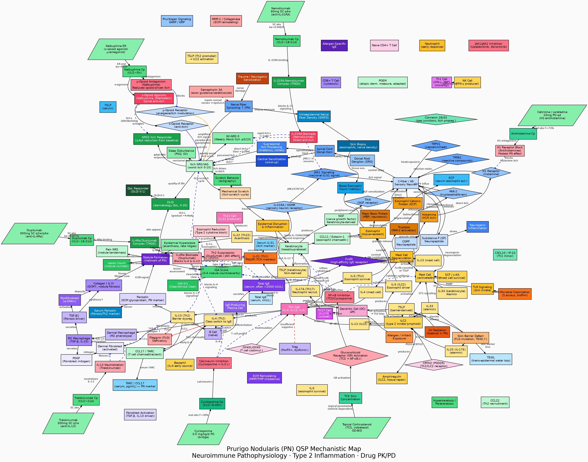

# QSP 질환 모델 라이브러리 (QSP Disease Model Library)

> 매일 **Claude Code Routine(CCR)** 이 질환 하나를 선택해 **정량적 시스템 약리학(Quantitative Systems Pharmacology, QSP)** 모델을 처음부터 끝까지 구축하고 `main`에 직접 커밋하는, **살아 있는(living) 오픈 모델 라이브러리**입니다.

  

현재 **207개 질환**에 대한 완성된 QSP 모델이 수록되어 있으며, 각 모델은 ①기계론적 지도, ②mrgsolve ODE 모델, ③Shiny 대시보드, ④참고문헌의 네 가지 산출물로 구성됩니다. 아래 [모델 갤러리](#-모델-갤러리-model-gallery)에서 전체 목록을 확인할 수 있습니다.
---

## 1. 프로젝트 소개 (Overview)

이 저장소는 사람이 한 번에 설계한 정적인 모델 모음이 아니라, **자동화된 AI 에이전트가 매일 한 편씩 새로운 질환 모델을 추가하며 성장하는 라이브러리**입니다. 각 세션에서 Claude Code는 다음을 수행합니다.

1. 아직 다루지 않은 질환을 선택한다.
2. 최신 문헌과 임상시험 데이터를 바탕으로 질환의 **기계론적 병태생리 지도**를 그린다.
3. 약물 PK/PD와 질환 진행을 연결하는 **mrgsolve 기반 ODE 모델**을 작성한다.
4. 파라미터를 탐색·비교할 수 있는 **Shiny 대시보드**를 만든다.
5. 모든 가정과 파라미터의 근거가 되는 **참고문헌**을 정리한다.
6. 위 산출물을 커밋·푸시한다.

목표는 다양한 치료 영역에 걸쳐 **재현 가능하고, 투명하며, 교육적으로 활용 가능한 QSP 모델의 참조 컬렉션**을 구축하는 것입니다.

## 2. QSP란 무엇인가 (What is QSP?)

**정량적 시스템 약리학(QSP)** 은 시스템 생물학과 약동/약력학(PK/PD)을 결합하여, **약물–표적–경로–질환–환자**로 이어지는 인과 사슬을 수학적(주로 상미분방정식, ODE)으로 표현하는 모델링 분야입니다. 단순한 통계적 용량–반응 곡선을 넘어, **"왜 그리고 어떻게" 약효와 독성이 나타나는지**를 기전 수준에서 기술합니다.

QSP 모델은 다음과 같은 질문에 답하려 합니다.

- 이 표적을 조절하면 하류 경로와 임상 바이오마커가 어떻게 움직이는가?
- 작용기전이 다른 약물을 병용하면 어떤 시너지/상쇄가 나타나는가?
- 어떤 환자 아형(유전형·중증도·동반질환)에서 반응이 달라지는가?
- 어떤 용량·투여 간격이 효능과 안전성의 균형을 최적화하는가?

## 3. 신약개발에서의 중요성 (Why QSP Matters in Drug Development)

QSP는 규제기관이 권장하는 **모델 기반 신약개발(Model-Informed Drug Development, MIDD)** 패러다임의 핵심 도구로 자리 잡았습니다. 신약개발 전 주기에서 다음과 같은 가치를 제공합니다.

| 단계 | QSP의 기여 |
|------|------------|
| **표적 발굴·검증** | 경로 수준 시뮬레이션으로 표적 조절이 질환 표현형에 미치는 영향을 사전 평가하고, 우회 경로·내성 기전을 예측 |
| **작용기전(MoA) 규명** | in vitro/in vivo 데이터를 통합해 약효의 인과 구조를 정량화하고 바이오마커 전략을 수립 |
| **용량·용법 선택** | First-in-human 용량, 적정 용법, 치료 범위를 기전 기반으로 예측하여 임상 1상 설계를 합리화 |
| **임상시험 설계** | 환자 아집단별 반응을 시뮬레이션해 환자 선정·계층화·엔드포인트·샘플 크기 최적화 |
| **중개연구(Translation)** | 동물–인간, 성인–소아, 건강인–환자 간 외삽으로 종간/집단간 차이를 정량화 |
| **병용요법 전략** | 서로 다른 표적의 조합 효과(시너지/상쇄)를 가상 환자군에서 탐색 |
| **규제 소통** | FDA·EMA의 MIDD 프레임워크에서 근거 패키지로 활용되어 임상시험 면제·라벨 확장을 뒷받침 |

신약개발 실패의 상당수는 **효능 부족**과 **예상치 못한 안전성 문제**에서 비롯됩니다. QSP는 후보물질이 임상에 진입하기 전에 *in silico* 로 가설을 검증하여 **개발 후기 실패(late-stage attrition)를 줄이고**, 실패할 프로그램은 더 일찍·더 싸게 중단(fail fast)하도록 돕습니다. 본 라이브러리는 이러한 QSP 워크플로를 다양한 질환에 적용한 **재현 가능한 교육·연구용 예제**를 제공합니다.

## 4. 각 모델의 구성 (Four Deliverables per Model)

모든 질환 디렉토리는 동일한 4종 산출물 체계를 따릅니다.

| 산출물 | 파일 | 설명 |
|--------|------|------|
| 🗺️ **기계론적 지도** | `*_qsp_model.dot` / `.svg` / `.png` | Graphviz로 그린 병태생리·약물 작용 네트워크 (100+ 노드, 8+ 클러스터) |
| ⚙️ **mrgsolve 모델** | `*_mrgsolve_model.R` | 약물 PK + 질환 PD를 연결하는 ODE 모델 (15+ 구획, 5+ 치료 시나리오, 임상시험 보정 메모) |
| 📊 **Shiny 대시보드** | `*_shiny_app.R` | 환자 프로파일·PK·PD·임상 엔드포인트·시나리오 비교·바이오마커를 탐색하는 인터랙티브 앱 (6+ 탭) |
| 📚 **참고문헌** | `*_references.md` | 섹션별로 분류된 30+ PubMed 인용 |

각 디렉토리에는 위 산출물을 요약한 **개별 `README.md`** 가 포함되어, 해당 질환의 개요·핵심 경로·모델 사양·실행 방법을 한눈에 볼 수 있습니다.

## 5. 작업 방식 (How It Is Built)

- **자동 생성**: Claude Code Routine이 매일 1개 질환을 선택하여 4종 산출물과 디렉토리 README를 작성한 뒤 커밋·푸시합니다.
- **중복 방지**: 이미 존재하는 질환/디렉토리는 건너뛰고, 카테고리를 번갈아 선택합니다.
- **품질 기준**: 기계론적 지도(100+ 노드/8+ 클러스터), mrgsolve(15+ 구획/5+ 시나리오), Shiny(6+ 탭), 참고문헌(30+편)을 최소 기준으로 합니다.
- **명명 규칙**: 디렉토리는 소문자-하이픈 영문명, 파일은 `<약어>_qsp_model.*`, `<약어>_mrgsolve_model.R`, `<약어>_shiny_app.R`, `<약어>_references.md` 형식을 따릅니다.

## 6. 기술 스택 (Technology Stack)

| 도구 | 용도 |
|------|------|
| **Graphviz** (`dot`) | 기계론적 지도 렌더링 (`.dot` → `.svg`/`.png`) |
| **mrgsolve** (R) | ODE 기반 PK/PD/QSP 시뮬레이션 |
| **Shiny** (R) | 인터랙티브 시뮬레이션 대시보드 |
| **Claude Code Routine** | 매일 자동 모델 생성·문서화·커밋 |

## 7. 사용 방법 (Usage)

```bash
# 1) 기계론적 지도 렌더링 (Graphviz 필요)
dot -Tsvg <disease>/<abbr>_qsp_model.dot -o <abbr>_qsp_model.svg
dot -Tpng -Gdpi=150 <disease>/<abbr>_qsp_model.dot -o <abbr>_qsp_model.png
```

```r
# 2) mrgsolve 모델 실행 (R)
install.packages(c("mrgsolve", "dplyr", "ggplot2"))
library(mrgsolve)
mod <- mread("<disease>/<abbr>_mrgsolve_model.R")
out <- mrgsim(mod, end = 365)
plot(out)

# 3) Shiny 대시보드 실행
install.packages("shiny")
shiny::runApp("<disease>/<abbr>_shiny_app.R")
```

## 8. 디렉토리 구조 (Repository Layout)

```
qsp/
├── README.md                     # 본 문서 (전체 모델 갤러리)
├── CLAUDE.md                     # 라이브러리 운영·생성 지침
├── <disease>/                    # 질환별 디렉토리 (총 191개)
│   ├── README.md                 # 질환별 요약 문서
│   ├── <abbr>_qsp_model.dot      # 기계론적 지도 소스
│   ├── <abbr>_qsp_model.svg/.png # 렌더링 이미지
│   ├── <abbr>_mrgsolve_model.R   # mrgsolve ODE 모델
│   ├── <abbr>_shiny_app.R        # Shiny 대시보드
│   └── <abbr>_references.md      # 참고문헌
└── ...
```

---

## 📚 모델 갤러리 (Model Gallery)

전체 **191개** QSP 모델입니다. 모델명을 클릭하면 해당 디렉토리로, 그림을 클릭하면 확대 가능한 SVG 지도로 이동합니다. 각 행의 링크에서 기계론적 지도(🗺️), mrgsolve 모델(⚙️), 참고문헌(📚), 상세 README(📄)에 바로 접근할 수 있습니다.

**분류별 모델 수**: 내분비·대사 27 · 종양 22 · 소화기·간담도 22 · 자가면역·류마티스 17 · 심혈관 15 · 혈액 14 · 신장·비뇨 13 · 신경 13 · 혈관염 9 · 호흡기 9 · 피부 8 · 희귀·유전 6 · 근골격·신경근육 5 · 정신·신경 4 · 안과 3 · 감염 3 · 부인·생식 1

| # | 분류 | 모델 | 미리보기 | 요약 및 링크 |
|---|------|------|----------|--------------|
| 1 | 심혈관 | [**복부 대동맥류**<br><sub>Abdominal Aortic Aneurysm · AAA</sub>](abdominal-aortic-aneurysm/) | <a href="abdominal-aortic-aneurysm/aaa_qsp_model.svg"></a> | 대동맥 중막 ECM 분해(MMP)·만성 염증으로 인한 진행성 확장과 파열 위험. 베타차단·독시사이클린·항염증 표적을 모델링.<br>[🗺️ 지도](abdominal-aortic-aneurysm/aaa_qsp_model.svg) · [⚙️ mrgsolve](abdominal-aortic-aneurysm/aaa_mrgsolve_model.R) · [📚 문헌](abdominal-aortic-aneurysm/aaa_references.md) · [📄 README](abdominal-aortic-aneurysm/README.md) |
| 2 | 내분비·대사 | [**말단비대증**<br><sub>Acromegaly · ACRO</sub>](acromegaly/) | <a href="acromegaly/acro_qsp_model.svg"></a> | 뇌하수체 선종의 GH 과다분비 → IGF-1 상승. 소마토스타틴 유사체·페그비소만트·도파민작용제 PK/PD.<br>[🗺️ 지도](acromegaly/acro_qsp_model.svg) · [⚙️ mrgsolve](acromegaly/acro_mrgsolve_model.R) · [📚 문헌](acromegaly/acro_references.md) · [📄 README](acromegaly/README.md) |
| 3 | 내분비·대사 | [**급성 간헐성 포르피린증**<br><sub>Acute Intermittent Porphyria · AIP</sub>](acute-intermittent-porphyria/) | <a href="acute-intermittent-porphyria/aip_qsp_model.svg"></a> | HMBS(PBGD) 유전자 기능 상실 → PBGD 효소 활성 ~50% → 헴 전구체(ALA·PBG) 과축적 → 신경독성 급성 발작**. ALA(GABA 구조 유사체) → GABA-A 수용체 경쟁 억제 + Fe²⁺ 촉매 자동산화 ROS → 미토콘드리아 기능 부전 → 축삭 변성 → 자율신경·운동·감각 신경병증.<br>[🗺️ 지도](acute-intermittent-porphyria/aip_qsp_model.svg) · [⚙️ mrgsolve](acute-intermittent-porphyria/aip_mrgsolve_model.R) · [📚 문헌](acute-intermittent-porphyria/aip_references.md) · [📄 README](acute-intermittent-porphyria/README.md) |
| 4 | 종양 | [**급성 골수성 백혈병**<br><sub>Acute Myeloid Leukemia · AML</sub>](acute-myeloid-leukemia/) | <a href="acute-myeloid-leukemia/aml_qsp_model.svg"></a> | FLT3/NPM1/IDH/DNMT3A 돌연변이·BCL-2 패밀리·백혈병 줄기세포·골수 미세환경·후성유전학 이상. 베네토클락스(BCL-2)·아자시티딘·길테리티닙(FLT3)·에나시데닙(IDH2)·시타라빈 PK/PD. 21구획 ODE, Friberg 골수억제, 7치료 시나리오(VIALE-A·ADMIRAL·QuANTUM-R·RATIFY 임상 보정).<br>[🗺️ 지도](acute-myeloid-leukemia/aml_qsp_model.svg) · [⚙️ mrgsolve](acute-myeloid-leukemia/aml_mrgsolve_model.R) · [📚 문헌](acute-myeloid-leukemia/aml_references.md) · [📄 README](acute-myeloid-leukemia/README.md) |
| 5 | 내분비·대사 | [**애디슨병 (원발성 부신부전)**<br><sub>Addison's Disease · ADD</sub>](addisons-disease/) | <a href="addisons-disease/add_qsp_model.svg"></a> | 부신피질 자가면역 파괴로 코르티솔·알도스테론 결핍. HPA축·히드로코르티손/플루드로코르티손 보충 시뮬레이션.<br>[🗺️ 지도](addisons-disease/add_qsp_model.svg) · [⚙️ mrgsolve](addisons-disease/add_mrgsolve_model.R) · [📚 문헌](addisons-disease/add_references.md) · [📄 README](addisons-disease/README.md) |
| 6 | 정신·신경 | [**주의력결핍과잉행동장애**<br><sub>Attention Deficit Hyperactivity Disorder · ADHD</sub>](adhd/) | <a href="adhd/adhd_qsp_model.svg"></a> | 도파민(DA)·노르에피네프린(NE) 신경전달 저하로 인한 전전두피질(PFC) 기능 장애. DAT1/DRD4/DRD5/SNAP25/COMT 위험 유전자 → 중뇌(VTA→PFC) DA 합성 감소·청반(LC→PFC) NE 긴장도 저하 → PFC 피질 성숙 3년 지연**.<br>[🗺️ 지도](adhd/adhd_qsp_model.svg) · [⚙️ mrgsolve](adhd/adhd_mrgsolve_model.R) · [📚 문헌](adhd/adhd_references.md) · [📄 README](adhd/README.md) |
| 7 | 신장·비뇨 | [**상염색체 우성 다낭신 (ADPKD)**<br><sub>Autosomal Dominant PKD · ADPKD</sub>](adpkd/) | <a href="adpkd/adpkd_qsp_model.svg"></a> | PKD1/2 변이 → cAMP 증가로 낭종 성장·신기능 저하. 톨밥탄(V2 수용체 길항)의 TKV/eGFR 효과.<br>[🗺️ 지도](adpkd/adpkd_qsp_model.svg) · [⚙️ mrgsolve](adpkd/adpkd_mrgsolve_model.R) · [📚 문헌](adpkd/adpkd_references.md) · [📄 README](adpkd/README.md) |
| 8 | 자가면역·류마티스 | [**성인형 스틸병**<br><sub>Adult-Onset Still's Disease · AOSD</sub>](adult-onset-stills-disease/) | <a href="adult-onset-stills-disease/aosd_qsp_model.svg"></a> | IL-1/IL-6/IL-18 매개 자가염증, 발열·관절염·페리틴 급상승. 아나킨라·카나키누맙·토실리주맙 표적.<br>[🗺️ 지도](adult-onset-stills-disease/aosd_qsp_model.svg) · [⚙️ mrgsolve](adult-onset-stills-disease/aosd_mrgsolve_model.R) · [📚 문헌](adult-onset-stills-disease/aosd_references.md) · [📄 README](adult-onset-stills-disease/README.md) |
| 9 | 안과 | [**노인성 황반변성**<br><sub>Age-related Macular Degeneration · AMD</sub>](age-related-macular-degeneration/) | <a href="age-related-macular-degeneration/amd_qsp_model.svg"></a> | 노화·유전(CFH Y402H·ARMS2 A69S)·보체계 과활성화 → 드루젠 형성·Bruch막 두꺼워짐 → RPE 기능부전·지방갈색소(A2E) 축적 → MAC(C5b-9) 매개 RPE 세포사 → 지리적 위축(GA, 건성 말기).<br>[🗺️ 지도](age-related-macular-degeneration/amd_qsp_model.svg) · [⚙️ mrgsolve](age-related-macular-degeneration/amd_mrgsolve_model.R) · [📚 문헌](age-related-macular-degeneration/amd_references.md) · [📄 README](age-related-macular-degeneration/README.md) |
| 10 | 소화기·간담도 | [**알코올성 간질환**<br><sub>Alcoholic Liver Disease · ALD</sub>](alcoholic-liver-disease/) | <a href="alcoholic-liver-disease/ald_qsp_model.svg"></a> | 에탄올 → 아세트알데히드(ADH/CYP2E1) + ROS 생성 → GSH 고갈·Nrf2/KEAP1/ARE 산화스트레스 방어 → 장내 미생물 불균형(dysbiosis) → 장 투과성↑ → LPS 문맥 유입 → TLR4/MD-2/CD14 → Kupffer 세포 NF-κB 활성화 → NLRP3 인플라마솜 → IL-1β/TNF-α/CXCL8 폭포 → 호중구 CXCR2 매개 침윤 →…<br>[🗺️ 지도](alcoholic-liver-disease/ald_qsp_model.svg) · [⚙️ mrgsolve](alcoholic-liver-disease/ald_mrgsolve_model.R) · [📚 문헌](alcoholic-liver-disease/ald_references.md) · [📄 README](alcoholic-liver-disease/README.md) |
| 11 | 피부 | [**원형 탈모증**<br><sub>Alopecia Areata · AA</sub>](alopecia-areata/) | <a href="alopecia-areata/aa_qsp_model.svg"></a> | 모낭 면역특권 붕괴, IFN-γ/IL-15 JAK-STAT 신호로 모발 손실. 바리시티닙 등 JAK 억제제 반응.<br>[🗺️ 지도](alopecia-areata/aa_qsp_model.svg) · [⚙️ mrgsolve](alopecia-areata/aa_mrgsolve_model.R) · [📚 문헌](alopecia-areata/aa_references.md) · [📄 README](alopecia-areata/README.md) |
| 12 | 희귀·유전 | [**알파-1 항트립신 결핍증**<br><sub>Alpha-1 Antitrypsin Deficiency · AATD</sub>](alpha1-antitrypsin-deficiency/) | <a href="alpha1-antitrypsin-deficiency/aatd_qsp_model.svg"></a> | SERPINA1 Glu342Lys(Z 대립유전자) → Z-AAT 소포체 내 루프-시트 중합체 축적(gain-of-function 간독성) + 혈청 AAT 부족(<11 µM ELF 임계) → 중성구 엘라스타제(NE) 무제한 활성 → 범소엽성 폐기종**.<br>[🗺️ 지도](alpha1-antitrypsin-deficiency/aatd_qsp_model.svg) · [⚙️ mrgsolve](alpha1-antitrypsin-deficiency/aatd_mrgsolve_model.R) · [📚 문헌](alpha1-antitrypsin-deficiency/aatd_references.md) · [📄 README](alpha1-antitrypsin-deficiency/README.md) |
| 13 | 신경 | [**알츠하이머병**<br><sub>Alzheimer's Disease · AD</sub>](alzheimers-disease/) | <a href="alzheimers-disease/ad_qsp_model.svg"></a> | 아밀로이드-β 침착·타우 신경섬유엉킴·신경염증에 의한 진행성 인지저하. 항아밀로이드 항체(레카네맙/도나네맙)·콜린에스터분해효소 억제제.<br>[🗺️ 지도](alzheimers-disease/ad_qsp_model.svg) · [⚙️ mrgsolve](alzheimers-disease/ad_mrgsolve_model.R) · [📚 문헌](alzheimers-disease/ad_references.md) · [📄 README](alzheimers-disease/README.md) |
| 14 | 신경 | [**근위축성 측삭경화증 (ALS)**<br><sub>Amyotrophic Lateral Sclerosis · ALS</sub>](amyotrophic-lateral-sclerosis/) | <a href="amyotrophic-lateral-sclerosis/als_qsp_model.svg"></a> | 상·하위 운동신경세포의 진행성 변성(SOD1/TDP-43/C9orf72). 릴루졸·에다라본·토퍼센(SOD1).<br>[🗺️ 지도](amyotrophic-lateral-sclerosis/als_qsp_model.svg) · [⚙️ mrgsolve](amyotrophic-lateral-sclerosis/als_mrgsolve_model.R) · [📚 문헌](amyotrophic-lateral-sclerosis/als_references.md) · [📄 README](amyotrophic-lateral-sclerosis/README.md) |
| 15 | 자가면역·류마티스 | [**강직성 척추염**<br><sub>Ankylosing Spondylitis · AS</sub>](ankylosing-spondylitis/) | <a href="ankylosing-spondylitis/as_qsp_model.svg"></a> | HLA-B27·IL-23/IL-17·TNF 축의 부착부염·골증식. TNF/IL-17 억제제의 BASDAI 효과.<br>[🗺️ 지도](ankylosing-spondylitis/as_qsp_model.svg) · [⚙️ mrgsolve](ankylosing-spondylitis/as_mrgsolve_model.R) · [📚 문헌](ankylosing-spondylitis/as_references.md) · [📄 README](ankylosing-spondylitis/README.md) |
| 16 | 자가면역·류마티스 | [**항인지질항체 증후군**<br><sub>Antiphospholipid Syndrome · APS</sub>](antiphospholipid-syndrome/) | <a href="antiphospholipid-syndrome/aps_qsp_model.svg"></a> | 항인지질항체에 의한 동·정맥 혈전 및 임신 합병증. 항응고(와파린/헤파린)·히드록시클로로퀸.<br>[🗺️ 지도](antiphospholipid-syndrome/aps_qsp_model.svg) · [⚙️ mrgsolve](antiphospholipid-syndrome/aps_mrgsolve_model.R) · [📚 문헌](antiphospholipid-syndrome/aps_references.md) · [📄 README](antiphospholipid-syndrome/README.md) |
| 17 | 혈액 | [**재생불량성 빈혈**<br><sub>Aplastic Anemia · AA</sub>](aplastic-anemia/) | <a href="aplastic-anemia/aa_qsp_model.svg"></a> | 자가반응 CD8+ CTL 활성화(분자 모방·HLA-DR 제시) → IFN-γ/TNF-α 사이토카인 폭풍 → HSC에 FasL·퍼포린/그랜자임 B·NF-κB/ROS/p53 경로로 직접 세포자멸 → 조혈줄기세포(HSC) 풀 고갈 → 다계열 조혈부전(범혈구감소증) → 저세포성 골수(BM cellularity <25%)**.<br>[🗺️ 지도](aplastic-anemia/aa_qsp_model.svg) · [⚙️ mrgsolve](aplastic-anemia/aa_mrgsolve_model.R) · [📚 문헌](aplastic-anemia/aa_references.md) · [📄 README](aplastic-anemia/README.md) |
| 18 | 내분비·대사 | [**무증상 고요산혈증**<br><sub>Asymptomatic Hyperuricemia · AHU</sub>](asymptomatic-hyperuricemia/) | <a href="asymptomatic-hyperuricemia/ahy_qsp_model.svg"></a> | 요산 과포화(무증상)와 통풍·신질환 진행 위험. 생활습관 및 선택적 요산저하(잔틴산화효소 억제).<br>[🗺️ 지도](asymptomatic-hyperuricemia/ahy_qsp_model.svg) · [⚙️ mrgsolve](asymptomatic-hyperuricemia/ahy_mrgsolve_model.R) · [📚 문헌](asymptomatic-hyperuricemia/ahy_references.md) · [📄 README](asymptomatic-hyperuricemia/README.md) |
| 19 | 피부 | [**아토피 피부염**<br><sub>Atopic Dermatitis · AD</sub>](atopic-dermatitis/) | <a href="atopic-dermatitis/ad_qsp_model.svg"></a> | 피부장벽 기능장애·Th2(IL-4/IL-13/IL-31) 염증. 두필루맙·JAK 억제제·국소 칼시뉴린억제제.<br>[🗺️ 지도](atopic-dermatitis/ad_qsp_model.svg) · [⚙️ mrgsolve](atopic-dermatitis/ad_mrgsolve_model.R) · [📚 문헌](atopic-dermatitis/ad_references.md) · [📄 README](atopic-dermatitis/README.md) |
| 20 | 심혈관 | [**심방세동**<br><sub>Atrial Fibrillation · AF</sub>](atrial-fibrillation/) | <a href="atrial-fibrillation/af_qsp_model.svg"></a> | 심방 전기적·구조적 리모델링과 재진입 회로. 율동/심박수 조절 및 NOAC 항응고 전략.<br>[🗺️ 지도](atrial-fibrillation/af_qsp_model.svg) · [⚙️ mrgsolve](atrial-fibrillation/af_mrgsolve_model.R) · [📚 문헌](atrial-fibrillation/af_references.md) · [📄 README](atrial-fibrillation/README.md) |
| 21 | 신경 | [**자가면역 뇌염**<br><sub>Autoimmune Encephalitis · AIE</sub>](autoimmune-encephalitis/) | <a href="autoimmune-encephalitis/aie_qsp_model.svg"></a> | 항NMDAR 등 신경표면 항체에 의한 뇌염. 스테로이드·IVIG·혈장교환·리툭시맙 면역치료.<br>[🗺️ 지도](autoimmune-encephalitis/aie_qsp_model.svg) · [⚙️ mrgsolve](autoimmune-encephalitis/aie_mrgsolve_model.R) · [📚 문헌](autoimmune-encephalitis/aie_references.md) · [📄 README](autoimmune-encephalitis/README.md) |
| 22 | 혈액 | [**자가면역 용혈성 빈혈**<br><sub>Autoimmune Hemolytic Anemia · AIHA</sub>](autoimmune-hemolytic-anemia/) | <a href="autoimmune-hemolytic-anemia/aiha_qsp_model.svg"></a> | 온형 IgG·한랭 IgM 자가항체에 의한 적혈구 파괴. 스테로이드·리툭시맙·수티림맙(항C1s).<br>[🗺️ 지도](autoimmune-hemolytic-anemia/aiha_qsp_model.svg) · [⚙️ mrgsolve](autoimmune-hemolytic-anemia/aiha_mrgsolve_model.R) · [📚 문헌](autoimmune-hemolytic-anemia/aiha_references.md) · [📄 README](autoimmune-hemolytic-anemia/README.md) |
| 23 | 소화기·간담도 | [**자가면역 간염**<br><sub>Autoimmune Hepatitis · AIH</sub>](autoimmune-hepatitis/) | <a href="autoimmune-hepatitis/aih_qsp_model.svg"></a> | T세포 매개 간세포 손상과 자가항체·고감마글로불린혈증. 스테로이드·아자티오프린 유도/유지.<br>[🗺️ 지도](autoimmune-hepatitis/aih_qsp_model.svg) · [⚙️ mrgsolve](autoimmune-hepatitis/aih_mrgsolve_model.R) · [📚 문헌](autoimmune-hepatitis/aih_references.md) · [📄 README](autoimmune-hepatitis/README.md) |
| 24 | 소화기·간담도 | [**자가면역 췌장염**<br><sub>Autoimmune Pancreatitis · AIP</sub>](autoimmune-pancreatitis/) | <a href="autoimmune-pancreatitis/aip_qsp_model.svg"></a> | IgG4 관련 림프형질세포 침윤·섬유염증. 스테로이드 관해유도·리툭시맙 재발관리.<br>[🗺️ 지도](autoimmune-pancreatitis/aip_qsp_model.svg) · [⚙️ mrgsolve](autoimmune-pancreatitis/aip_mrgsolve_model.R) · [📚 문헌](autoimmune-pancreatitis/aip_references.md) · [📄 README](autoimmune-pancreatitis/README.md) |
| 25 | 내분비·대사 | [**자가면역 다발내분비병증 (APECED)**<br><sub>Autoimmune Polyendocrinopathy (APS-1) · APS-1</sub>](autoimmune-polyendocrinopathy/) | <a href="autoimmune-polyendocrinopathy/aps_qsp_model.svg"></a> | AIRE 변이로 중추관용 소실 → 다장기 내분비 자가면역. 호르몬 보충 및 면역조절 모델.<br>[🗺️ 지도](autoimmune-polyendocrinopathy/aps_qsp_model.svg) · [⚙️ mrgsolve](autoimmune-polyendocrinopathy/aps_mrgsolve_model.R) · [📚 문헌](autoimmune-polyendocrinopathy/aps_references.md) · [📄 README](autoimmune-polyendocrinopathy/README.md) |
| 26 | 혈관염 | [**베체트병**<br><sub>Behçet's Disease · BD</sub>](behcet-disease/) | <a href="behcet-disease/bd_qsp_model.svg"></a> | 구강/생식기 궤양·포도막염, 호중구·IL-1 매개 가변혈관 염증. 콜히친·TNF 억제·아프레밀라스트.<br>[🗺️ 지도](behcet-disease/bd_qsp_model.svg) · [⚙️ mrgsolve](behcet-disease/bd_mrgsolve_model.R) · [📚 문헌](behcet-disease/bd_references.md) · [📄 README](behcet-disease/README.md) |
| 27 | 신장·비뇨 | [**양성 전립선 비대증**<br><sub>Benign Prostatic Hyperplasia · BPH</sub>](benign-prostatic-hyperplasia/) | <a href="benign-prostatic-hyperplasia/bph_qsp_model.svg"></a> | DHT 매개 전립선 증식과 평활근 긴장에 의한 하부요로증상. α차단제·5α환원효소 억제제.<br>[🗺️ 지도](benign-prostatic-hyperplasia/bph_qsp_model.svg) · [⚙️ mrgsolve](benign-prostatic-hyperplasia/bph_mrgsolve_model.R) · [📚 문헌](benign-prostatic-hyperplasia/bph_references.md) · [📄 README](benign-prostatic-hyperplasia/README.md) |
| 28 | 혈액 | [**베타 지중해빈혈**<br><sub>Beta-Thalassemia · BThal</sub>](beta-thalassemia/) | <a href="beta-thalassemia/bth_qsp_model.svg"></a> | β-글로빈 합성 저하로 무효 조혈·만성 용혈성 빈혈·철 과부하. 수혈·철 킬레이션·루스파터셉트(GDF11 억제).<br>[🗺️ 지도](beta-thalassemia/bth_qsp_model.svg) · [⚙️ mrgsolve](beta-thalassemia/bth_mrgsolve_model.R) · [📚 문헌](beta-thalassemia/bth_references.md) · [📄 README](beta-thalassemia/README.md) |
| 29 | 정신·신경 | [**양극성 장애 (Bipolar Disorder)**<br><sub>Bipolar Disorder · BD-I / BD-II</sub>](bipolar-disorder/) | <a href="bipolar-disorder/bd_qsp_model.svg"></a> | 도파민 과활성(조증) ↔ 세로토닌·NE 결핍(우울) 반복 삽화. GSK-3β 과활성 → mTOR/BDNF↓ → 해마 신경발생↓; IL-6/TNF-α 신경염증; CLOCK/BMAL1 일주기 리듬 교란; CACNA1C(L형 Ca²⁺ 채널) 위험 대립유전자→신경 과흥분성**.<br>[🗺️ 지도](bipolar-disorder/bd_qsp_model.svg) · [⚙️ mrgsolve](bipolar-disorder/bd_mrgsolve_model.R) · [📚 문헌](bipolar-disorder/bd_references.md) · [📄 README](bipolar-disorder/README.md) |
| 30 | 종양 | [**유방암**<br><sub>Breast Cancer · BC</sub>](breast-cancer/) | <a href="breast-cancer/bc_qsp_model.svg"></a> | ER+/HER2+/TNBC 아형별 증식 신호. 내분비요법·CDK4/6 억제제·항HER2·면역항암제.<br>[🗺️ 지도](breast-cancer/bc_qsp_model.svg) · [⚙️ mrgsolve](breast-cancer/bc_mrgsolve_model.R) · [📚 문헌](breast-cancer/bc_references.md) · [📄 README](breast-cancer/README.md) |
| 31 | 호흡기 | [**기관지 천식**<br><sub>Bronchial Asthma · BA</sub>](bronchial-asthma/) | <a href="bronchial-asthma/ba_qsp_model.svg"></a> | Th2/호산구 기도 염증과 기관지 과민성. ICS·LABA 및 항IL-5/IL-4Rα 생물학제제.<br>[🗺️ 지도](bronchial-asthma/ba_qsp_model.svg) · [⚙️ mrgsolve](bronchial-asthma/ba_mrgsolve_model.R) · [📚 문헌](bronchial-asthma/ba_references.md) · [📄 README](bronchial-asthma/README.md) |
| 32 | 호흡기 | [**기관지 확장증**<br><sub>Bronchiectasis · BEX</sub>](bronchiectasis/) | <a href="bronchiectasis/bex_qsp_model.svg"></a> | 감염-염증 악순환(Cole vicious cycle)과 호중구 엘라스타제 기도 파괴. 기도청결·항생제·항염.<br>[🗺️ 지도](bronchiectasis/bex_qsp_model.svg) · [⚙️ mrgsolve](bronchiectasis/bex_mrgsolve_model.R) · [📚 문헌](bronchiectasis/bex_references.md) · [📄 README](bronchiectasis/README.md) |
| 33 | 피부 | [**수포성 유천포창**<br><sub>Bullous Pemphigoid · BP</sub>](bullous-pemphigoid/) | <a href="bullous-pemphigoid/bp_qsp_model.svg"></a> | 항BP180/BP230 항체에 의한 표피하 수포 형성. 스테로이드·리툭시맙·오말리주맙.<br>[🗺️ 지도](bullous-pemphigoid/bp_qsp_model.svg) · [⚙️ mrgsolve](bullous-pemphigoid/bp_mrgsolve_model.R) · [📚 문헌](bullous-pemphigoid/bp_references.md) · [📄 README](bullous-pemphigoid/README.md) |
| 34 | 소화기·간담도 | [**셀리악병**<br><sub>Celiac Disease · CD</sub>](celiac-disease/) | <a href="celiac-disease/cd_qsp_model.svg"></a> | 글루텐-tTG 면역반응(HLA-DQ2/8)으로 융모 위축. 글루텐 제거식 및 글루텐분해효소 신약.<br>[🗺️ 지도](celiac-disease/cd_qsp_model.svg) · [⚙️ mrgsolve](celiac-disease/cd_mrgsolve_model.R) · [📚 문헌](celiac-disease/cd_references.md) · [📄 README](celiac-disease/README.md) |
| 35 | 소화기·간담도 | [**담석증**<br><sub>Cholelithiasis · CHOL</sub>](cholelithiasis/) | <a href="cholelithiasis/chol_qsp_model.svg"></a> | 담즙 콜레스테롤 과포화·담낭 정체에 의한 결석 형성. 우르소데옥시콜산 용해 요법.<br>[🗺️ 지도](cholelithiasis/chol_qsp_model.svg) · [⚙️ mrgsolve](cholelithiasis/chol_mrgsolve_model.R) · [📚 문헌](cholelithiasis/chol_references.md) · [📄 README](cholelithiasis/README.md) |
| 36 | 소화기·간담도 | [**만성 위염**<br><sub>Chronic Gastritis · CGAST</sub>](chronic-gastritis/) | <a href="chronic-gastritis/cgast_qsp_model.svg"></a> | H. pylori-Correa 연쇄(위축→장상피화생→이형성). 제균요법·PPI의 점막 회복 효과.<br>[🗺️ 지도](chronic-gastritis/cgast_qsp_model.svg) · [⚙️ mrgsolve](chronic-gastritis/cgast_mrgsolve_model.R) · [📚 문헌](chronic-gastritis/cgast_references.md) · [📄 README](chronic-gastritis/README.md) |
| 37 | 소화기·간담도 | [**만성 B형 간염**<br><sub>Chronic Hepatitis B · CHB</sub>](chronic-hepatitis-b/) | <a href="chronic-hepatitis-b/chb_qsp_model.svg"></a> | HBV cccDNA 지속과 면역 매개 간손상. 뉴클레오시드유사체·페그IFN의 바이러스 억제.<br>[🗺️ 지도](chronic-hepatitis-b/chb_qsp_model.svg) · [⚙️ mrgsolve](chronic-hepatitis-b/chb_mrgsolve_model.R) · [📚 문헌](chronic-hepatitis-b/chb_references.md) · [📄 README](chronic-hepatitis-b/README.md) |
| 38 | 소화기·간담도 | [**만성 C형 간염**<br><sub>Chronic Hepatitis C · CHC/HCV</sub>](chronic-hepatitis-c/) | <a href="chronic-hepatitis-c/HCV_qsp_model.svg"></a> | Perelson 표적세포 제한 바이러스 동역학(T/I/V ODE)에 DAA PK/PD 통합. SOF/LED·SOF/VEL·GLE/PIB·PEG-IFN/RBV 7개 시나리오. NS5B·NS5A·NS3 억제 효능(εp/εi), CTL 소진, 간섬유화(Metavir F-score), HCC 위험 모델링. ION·ASTRAL·ENDURANCE 임상시험 보정.<br>[🗺️ 지도](chronic-hepatitis-c/HCV_qsp_model.svg) · [⚙️ mrgsolve](chronic-hepatitis-c/HCV_mrgsolve_model.R) · [📚 문헌](chronic-hepatitis-c/HCV_references.md) · [📄 README](chronic-hepatitis-c/README.md) |
| 39 | 내분비·대사 | [**만성 갑상선 기능 저하증**<br><sub>Chronic Hypothyroidism · HYPO</sub>](chronic-hypothyroidism/) | <a href="chronic-hypothyroidism/hypo_qsp_model.svg"></a> | 시상하부-뇌하수체-갑상선 축 저하(TSH↑/FT4↓). 레보티록신 보충의 용량-반응.<br>[🗺️ 지도](chronic-hypothyroidism/hypo_qsp_model.svg) · [⚙️ mrgsolve](chronic-hypothyroidism/hypo_mrgsolve_model.R) · [📚 문헌](chronic-hypothyroidism/hypo_references.md) · [📄 README](chronic-hypothyroidism/README.md) |
| 40 | 신장·비뇨 | [**만성 신부전**<br><sub>Chronic Kidney Disease · CKD</sub>](chronic-kidney-disease/) | <a href="chronic-kidney-disease/ckd_qsp_model.svg"></a> | 사구체 과여과·섬유화로 eGFR 진행성 저하. RAAS 억제·SGLT2i·피네레논 신보호.<br>[🗺️ 지도](chronic-kidney-disease/ckd_qsp_model.svg) · [⚙️ mrgsolve](chronic-kidney-disease/ckd_mrgsolve_model.R) · [📚 문헌](chronic-kidney-disease/ckd_references.md) · [📄 README](chronic-kidney-disease/README.md) |
| 41 | 종양 | [**만성 림프구성 백혈병**<br><sub>Chronic Lymphocytic Leukemia · CLL</sub>](chronic-lymphocytic-leukemia/) | <a href="chronic-lymphocytic-leukemia/cll_qsp_model.svg"></a> | CD19⁺CD5⁺CD23⁺ 단클론 B세포 축적(서구권 성인 가장 흔한 백혈병).<br>[🗺️ 지도](chronic-lymphocytic-leukemia/cll_qsp_model.svg) · [⚙️ mrgsolve](chronic-lymphocytic-leukemia/cll_mrgsolve_model.R) · [📚 문헌](chronic-lymphocytic-leukemia/cll_references.md) · [📄 README](chronic-lymphocytic-leukemia/README.md) |
| 42 | 종양 | [**만성 골수성 백혈병 (CML)**<br><sub>Chronic Myeloid Leukemia · CML</sub>](chronic-myeloid-leukemia/) | <a href="chronic-myeloid-leukemia/cml_qsp_model.svg"></a> | BCR-ABL 융합 티로신키나아제 구동 백혈병. 이매티닙 등 TKI·T315I 내성·무치료 관해(TFR).<br>[🗺️ 지도](chronic-myeloid-leukemia/cml_qsp_model.svg) · [⚙️ mrgsolve](chronic-myeloid-leukemia/cml_mrgsolve_model.R) · [📚 문헌](chronic-myeloid-leukemia/cml_references.md) · [📄 README](chronic-myeloid-leukemia/README.md) |
| 43 | 소화기·간담도 | [**만성 췌장염**<br><sub>Chronic Pancreatitis · CP</sub>](chronic-pancreatitis/) | <a href="chronic-pancreatitis/cp_qsp_model.svg"></a> | 반복 손상 → 췌성상세포 활성·섬유화·외분비 부전. 효소보충·통증관리 전략.<br>[🗺️ 지도](chronic-pancreatitis/cp_qsp_model.svg) · [⚙️ mrgsolve](chronic-pancreatitis/cp_mrgsolve_model.R) · [📚 문헌](chronic-pancreatitis/cp_references.md) · [📄 README](chronic-pancreatitis/README.md) |
| 44 | 신장·비뇨 | [**만성 신우신염**<br><sub>Chronic Pyelonephritis · CPN</sub>](chronic-pyelonephritis/) | <a href="chronic-pyelonephritis/cpn_qsp_model.svg"></a> | 반복 신장 감염·역류로 인한 신실질 흉터·신기능 저하. 항생제·역류 교정.<br>[🗺️ 지도](chronic-pyelonephritis/cpn_qsp_model.svg) · [⚙️ mrgsolve](chronic-pyelonephritis/cpn_mrgsolve_model.R) · [📚 문헌](chronic-pyelonephritis/cpn_references.md) · [📄 README](chronic-pyelonephritis/README.md) |
| 45 | 호흡기 | [**만성 비부비동염 동반 비용종**<br><sub>Chronic Rhinosinusitis with Nasal Polyps · CRSwNP</sub>](chronic-rhinosinusitis-with-nasal-polyps/) | <a href="chronic-rhinosinusitis-with-nasal-polyps/crsnp_qsp_model.svg"></a> | 비강·부비동 상피세포 손상 → TSLP·IL-33·IL-25 경보소(alarmin) 방출 → ILC2 활성화·수지상세포 Th2 성숙화 → IL-4/IL-5/IL-13 폭포 → IgE 클래스 전환·호산구 동원·배상세포 과증식·점액 과분비. IL-13→ 퍼리오스틴·TGF-β1→ 섬유화; IL-5→ 혈중/조직 호산구→ ECP/MBP/EPX 탈과립→ 상피 추가 손상.<br>[🗺️ 지도](chronic-rhinosinusitis-with-nasal-polyps/crsnp_qsp_model.svg) · [⚙️ mrgsolve](chronic-rhinosinusitis-with-nasal-polyps/crsnp_mrgsolve_model.R) · [📚 문헌](chronic-rhinosinusitis-with-nasal-polyps/crsnp_references.md) · [📄 README](chronic-rhinosinusitis-with-nasal-polyps/README.md) |
| 46 | 심혈관 | [**만성 혈전색전성 폐동맥 고혈압**<br><sub>Chronic Thromboembolic Pulmonary Hypertension · CTEPH</sub>](chronic-thromboembolic-pulmonary-hypertension/) | <a href="chronic-thromboembolic-pulmonary-hypertension/cteph_qsp_model.svg"></a> | 폐색전증 불완전 섬유용해 → 조직화 혈전(기계적 고정 PVR↑) + 이차 혈관 리모델링(ET-1↑·NO↓·PGI₂↓·SMC 증식) → 총 PVR↑ → 우심실 압력 과부하·비후·확장·부전 → CO↓·SaO₂↓·6MWD↓. tPA 결핍·PAI-1↑·비정상 피브린 가교로 섬유용해 장애.<br>[🗺️ 지도](chronic-thromboembolic-pulmonary-hypertension/cteph_qsp_model.svg) · [⚙️ mrgsolve](chronic-thromboembolic-pulmonary-hypertension/cteph_mrgsolve_model.R) · [📚 문헌](chronic-thromboembolic-pulmonary-hypertension/cteph_references.md) · [📄 README](chronic-thromboembolic-pulmonary-hypertension/README.md) |
| 47 | 피부 | [**만성 자발성 두드러기**<br><sub>Chronic Spontaneous Urticaria · CSU</sub>](chronic-urticaria/) | <a href="chronic-urticaria/csu_qsp_model.svg"></a> | IgE/FcεRI-비만세포 축 → 팽진·홍반·소양감** — 자가항체(anti-FcεRIα·anti-IgE) 또는 자가항원-IgE → FcεRI 교차결합 → 비만세포 탈과립(히스타민·PGD2·LTC4) + IL-31·IL-33·TSLP Type-2 사이토카인 망 → 지속적 두드러기. BTK(PLCγ→IP3/DAG→Ca²⁺) 및 PI3K/Akt 경유 MC 활성화 신호.<br>[🗺️ 지도](chronic-urticaria/csu_qsp_model.svg) · [⚙️ mrgsolve](chronic-urticaria/csu_mrgsolve_model.R) · [📚 문헌](chronic-urticaria/csu_references.md) · [📄 README](chronic-urticaria/README.md) |
| 48 | 심혈관 | [**만성 정맥 부전**<br><sub>Chronic Venous Insufficiency · CVI</sub>](chronic-venous-insufficiency/) | <a href="chronic-venous-insufficiency/cvi_qsp_model.svg"></a> | 판막 부전·정맥압 상승·백혈구 트래핑에 의한 부종·궤양. 정맥활성약(MPFF)·압박요법.<br>[🗺️ 지도](chronic-venous-insufficiency/cvi_qsp_model.svg) · [⚙️ mrgsolve](chronic-venous-insufficiency/cvi_mrgsolve_model.R) · [📚 문헌](chronic-venous-insufficiency/cvi_references.md) · [📄 README](chronic-venous-insufficiency/README.md) |
| 49 | 신경 | [**만성 염증성 탈수초성 다발신경병증 (CIDP)**<br><sub>Chronic Inflammatory Demyelinating Polyneuropathy · CIDP</sub>](cidp/) | <a href="cidp/cidp_qsp_model.svg"></a> | 자가면역 말이집 파괴에 의한 진행/재발성 신경병증. IVIG·스테로이드·혈장교환.<br>[🗺️ 지도](cidp/cidp_qsp_model.svg) · [⚙️ mrgsolve](cidp/cidp_mrgsolve_model.R) · [📚 문헌](cidp/cidp_references.md) · [📄 README](cidp/README.md) |
| 50 | 종양 | [**대장암**<br><sub>Colorectal Cancer · CRC</sub>](colorectal-cancer/) | <a href="colorectal-cancer/crc_qsp_model.svg"></a> | APC/Wnt·KRAS/MAPK·PI3K/TP53 경로 통합, MSI-H/CMS 아형, 종양 미세환경(CD8/Treg/MDSC/TAM), 혈관신생(VEGF/VEGFR). 5-FU/옥살리플라틴/이리노테칸(UGT1A1)·베바시주맙(TMDD)·세툭시맙·펨브롤리주맙(MSI-H) PK/PD.<br>[🗺️ 지도](colorectal-cancer/crc_qsp_model.svg) · [⚙️ mrgsolve](colorectal-cancer/crc_mrgsolve_model.R) · [📚 문헌](colorectal-cancer/crc_references.md) · [📄 README](colorectal-cancer/README.md) |
| 51 | 내분비·대사 | [**선천성 부신 과형성 (CAH)**<br><sub>Congenital Adrenal Hyperplasia · CAH</sub>](congenital-adrenal-hyperplasia/) | <a href="congenital-adrenal-hyperplasia/cah_qsp_model.svg"></a> | 21-수산화효소 결핍으로 코르티솔 결핍·안드로겐 과잉. 글루코코르티코이드 보충·크리네세르폰트(CRF1 길항).<br>[🗺️ 지도](congenital-adrenal-hyperplasia/cah_qsp_model.svg) · [⚙️ mrgsolve](congenital-adrenal-hyperplasia/cah_mrgsolve_model.R) · [📚 문헌](congenital-adrenal-hyperplasia/cah_references.md) · [📄 README](congenital-adrenal-hyperplasia/README.md) |
| 52 | 호흡기 | [**만성 폐쇄성 폐질환 (COPD)**<br><sub>Chronic Obstructive Pulmonary Disease · COPD</sub>](copd/) | <a href="copd/copd_qsp.svg"></a> | 흡연-산화스트레스·단백분해효소 불균형에 의한 기도/폐포 파괴. LABA/LAMA·ICS 기관지확장.<br>[🗺️ 지도](copd/copd_qsp.svg) · [⚙️ mrgsolve](copd/copd_mrgsolve_model.R) · [📚 문헌](copd/copd_references.md) · [📄 README](copd/README.md) |
| 53 | 소화기·간담도 | [**크론병**<br><sub>Crohn's Disease · CD</sub>](crohn-disease/) | <a href="crohn-disease/cd_qsp_model.svg"></a> | Th1/Th17 경유 전층성 장 염증과 장벽 투과성. 항TNF·항IL-12/23·항인테그린 생물학제제.<br>[🗺️ 지도](crohn-disease/cd_qsp_model.svg) · [⚙️ mrgsolve](crohn-disease/cd_mrgsolve_model.R) · [📚 문헌](crohn-disease/cd_references.md) · [📄 README](crohn-disease/README.md) |
| 54 | 내분비·대사 | [**쿠싱 증후군**<br><sub>Cushing's Syndrome · CS</sub>](cushings-syndrome/) | <a href="cushings-syndrome/cs_qsp_model.svg"></a> | 뇌하수체 ACTH 선종(쿠싱병 70%)·이소성 ACTH(10%)·부신 선종(15%) 등에 의한 만성 고코르티솔혈증.<br>[🗺️ 지도](cushings-syndrome/cs_qsp_model.svg) · [⚙️ mrgsolve](cushings-syndrome/cs_mrgsolve_model.R) · [📚 문헌](cushings-syndrome/cs_references.md) · [📄 README](cushings-syndrome/README.md) |
| 55 | 호흡기 | [**낭성 섬유증**<br><sub>Cystic Fibrosis · CF</sub>](cystic-fibrosis/) | <a href="cystic-fibrosis/cf_qsp_model.svg"></a> | CFTR 변이(ΔF508)에 의한 점액 점성↑·만성 기도 감염. CFTR 조절제(엘렉사/테자/이바카프토르, Trikafta).<br>[🗺️ 지도](cystic-fibrosis/cf_qsp_model.svg) · [⚙️ mrgsolve](cystic-fibrosis/cf_mrgsolve_model.R) · [📚 문헌](cystic-fibrosis/cf_references.md) · [📄 README](cystic-fibrosis/README.md) |
| 56 | 종양 | [**사이토카인 방출 증후군 (CRS)**<br><sub>Cytokine Release Syndrome · CRS</sub>](cytokine-release-syndrome/) | <a href="cytokine-release-syndrome/crs_qsp_model.svg"></a> | CAR-T세포/이중특이항체 투여 후 면역 이펙터 세포 대규모 활성화 → T세포 IFN-γ·IL-2·GM-CSF 폭발 → 대식세포 M1 극화(JAK-STAT1) → IL-6↑↑↑(★핵심 드라이버)·IL-1β(NLRP3 인플라마솜)·TNF-α** — 내피세포 활성화(iNOS→NO↑→혈관확장→저혈압)·VEGF/ANG2→혈관 투과성↑→저산소증; 혈뇌장벽 붕괴→CNS 대식세포 활성화…<br>[🗺️ 지도](cytokine-release-syndrome/crs_qsp_model.svg) · [⚙️ mrgsolve](cytokine-release-syndrome/crs_mrgsolve_model.R) · [📚 문헌](cytokine-release-syndrome/crs_references.md) · [📄 README](cytokine-release-syndrome/README.md) |
| 57 | 자가면역·류마티스 | [**피부근염**<br><sub>Dermatomyositis · DM</sub>](dermatomyositis/) | <a href="dermatomyositis/dm_qsp_model.svg"></a> | I형 IFN·보체 매개 근육·피부 미세혈관병증. 스테로이드·IVIG·리툭시맙.<br>[🗺️ 지도](dermatomyositis/dm_qsp_model.svg) · [⚙️ mrgsolve](dermatomyositis/dm_mrgsolve_model.R) · [📚 문헌](dermatomyositis/dm_references.md) · [📄 README](dermatomyositis/README.md) |
| 58 | 내분비·대사 | [**당뇨병성 신병증**<br><sub>Diabetic Nephropathy · DN</sub>](diabetic-nephropathy/) | <a href="diabetic-nephropathy/dn_qsp_model.svg"></a> | 당뇨병 미세혈관 합병증 → 진행성 CKD** — 고혈당(AGE·PKC·헥소사민·폴리올 경로) → 산화스트레스(Nox4·ROS) + RAAS 활성화(AngII→인사구체 고혈압) + TGF-β1(Smad2/3·CTGF·ECM 축적·사구체경화) + NF-κB 염증(TNF-α·IL-1β·MCP-1·NLRP3) → 족세포 손상(네프린·포도신·족돌기 소실·단백뇨) → 세관 손상(SGL…<br>[🗺️ 지도](diabetic-nephropathy/dn_qsp_model.svg) · [⚙️ mrgsolve](diabetic-nephropathy/dn_mrgsolve_model.R) · [📚 문헌](diabetic-nephropathy/dn_references.md) · [📄 README](diabetic-nephropathy/README.md) |
| 59 | 안과 | [**당뇨병성 망막병증**<br><sub>Diabetic Retinopathy · DR</sub>](diabetic-retinopathy/) | <a href="diabetic-retinopathy/dr_qsp_model.svg"></a> | 고혈당 → 4가지 생화학 경로(폴리올·헥소사민·PKC·AGE-RAGE) → 산화스트레스/VEGF/신경염증 → 망막 혈관 구조 병변 → DME/PDR → 시력 소실** — 알도스환원효소(AR) → 소르비톨↑·NADPH 고갈; GFAT → O-GlcNAc → TGF-β/PAI-1↑; PKCβ2 → VEGF↑·NF-κB↑·eNOS↓·ET-1↑; 메틸글리옥살/글리옥살 → AGE →…<br>[🗺️ 지도](diabetic-retinopathy/dr_qsp_model.svg) · [⚙️ mrgsolve](diabetic-retinopathy/dr_mrgsolve_model.R) · [📚 문헌](diabetic-retinopathy/dr_references.md) · [📄 README](diabetic-retinopathy/README.md) |
| 60 | 심혈관 | [**확장성 심근병증**<br><sub>Dilated Cardiomyopathy · DCM</sub>](dilated-cardiomyopathy/) | <a href="dilated-cardiomyopathy/dcm_qsp_model.svg"></a> | 심실 확장·수축기능 저하·신경호르몬 활성화. GDMT(ARNI/BB/MRA/SGLT2i) 역리모델링.<br>[🗺️ 지도](dilated-cardiomyopathy/dcm_qsp_model.svg) · [⚙️ mrgsolve](dilated-cardiomyopathy/dcm_mrgsolve_model.R) · [📚 문헌](dilated-cardiomyopathy/dcm_references.md) · [📄 README](dilated-cardiomyopathy/README.md) |
| 61 | 소화기·간담도 | [**게실병**<br><sub>Diverticular Disease · DIV</sub>](diverticular-disease/) | <a href="diverticular-disease/div_qsp_model.svg"></a> | 장벽 구조·미생물·저섬유식에 의한 게실/게실염. 섬유·항생제·항염 치료.<br>[🗺️ 지도](diverticular-disease/div_qsp_model.svg) · [⚙️ mrgsolve](diverticular-disease/div_mrgsolve_model.R) · [📚 문헌](diverticular-disease/div_references.md) · [📄 README](diverticular-disease/README.md) |
| 62 | 근골격·신경근육 | [**뒤셴 근이영양증 (DMD)**<br><sub>Duchenne Muscular Dystrophy · DMD</sub>](duchenne-muscular-dystrophy/) | <a href="duchenne-muscular-dystrophy/dmd_qsp_model.svg"></a> | 디스트로핀 결핍으로 진행성 근섬유 괴사·섬유화·심근병증. 코르티코스테로이드·엑손 스키핑·유전자 치료.<br>[🗺️ 지도](duchenne-muscular-dystrophy/dmd_qsp_model.svg) · [⚙️ mrgsolve](duchenne-muscular-dystrophy/dmd_mrgsolve_model.R) · [📚 문헌](duchenne-muscular-dystrophy/dmd_references.md) · [📄 README](duchenne-muscular-dystrophy/README.md) |
| 63 | 내분비·대사 | [**이상지질혈증**<br><sub>Dyslipidemia · DYSLIP</sub>](dyslipidemia/) | <a href="dyslipidemia/dyslip_qsp_model.svg"></a> | 간 콜레스테롤 합성·LDL 수용체·역수송 항상성. 스타틴·에제티미브·PCSK9 억제제.<br>[🗺️ 지도](dyslipidemia/dyslip_qsp_model.svg) · [⚙️ mrgsolve](dyslipidemia/dyslip_mrgsolve_model.R) · [📚 문헌](dyslipidemia/dyslip_references.md) · [📄 README](dyslipidemia/README.md) |
| 64 | 혈관염 | [**호산구 육아종증 다발혈관염 (EGPA)**<br><sub>Eosinophilic GPA · EGPA</sub>](egpa/) | <a href="egpa/egpa_qsp_model.svg"></a> | IL-5 매개 호산구증가와 ANCA 연관 소혈관염. 스테로이드·메폴리주맙·벤랄리주맙.<br>[🗺️ 지도](egpa/egpa_qsp_model.svg) · [⚙️ mrgsolve](egpa/egpa_mrgsolve_model.R) · [📚 문헌](egpa/egpa_references.md) · [📄 README](egpa/README.md) |
| 65 | 내분비·대사 | [**자궁내막증**<br><sub>Endometriosis · ENDO</sub>](endometriosis/) | <a href="endometriosis/endo_qsp_model.svg"></a> | 자궁내막 조직의 자궁외 이식·에스트로겐 의존 염증·통증. GnRH 길항제·프로게스틴.<br>[🗺️ 지도](endometriosis/endo_qsp_model.svg) · [⚙️ mrgsolve](endometriosis/endo_mrgsolve_model.R) · [📚 문헌](endometriosis/endo_references.md) · [📄 README](endometriosis/README.md) |
| 66 | 소화기·간담도 | [**호산구성 식도염 (EoE)**<br><sub>Eosinophilic Esophagitis · EoE</sub>](eosinophilic-esophagitis/) | <a href="eosinophilic-esophagitis/eoe_qsp_model.svg"></a> | Th2 사이토카인(IL-13·IL-5)·ILC2·호산구 축에 의한 만성 식도 염증. 두필루맙·부데소니드·센다키맙.<br>[🗺️ 지도](eosinophilic-esophagitis/eoe_qsp_model.svg) · [⚙️ mrgsolve](eosinophilic-esophagitis/eoe_mrgsolve_model.R) · [📚 문헌](eosinophilic-esophagitis/eoe_references.md) · [📄 README](eosinophilic-esophagitis/README.md) |
| 67 | 신경 | [**뇌전증**<br><sub>Epilepsy · EPI</sub>](epilepsy/) | <a href="epilepsy/epi_qsp_model.svg"></a> | 이온채널·흥분/억제 불균형에 의한 반복 발작. 항발작제(VPA/LEV/CBZ/LTG).<br>[🗺️ 지도](epilepsy/epi_qsp_model.svg) · [⚙️ mrgsolve](epilepsy/epi_mrgsolve_model.R) · [📚 문헌](epilepsy/epi_references.md) · [📄 README](epilepsy/README.md) |
| 68 | 심혈관 | [**본태성 고혈압**<br><sub>Essential Hypertension · EH</sub>](essential-hypertension/) | <a href="essential-hypertension/eh_qsp_model.svg"></a> | RAAS·교감신경·나트륨/체액 항상성에 의한 혈압 조절. ACEi/ARB·CCB·이뇨제.<br>[🗺️ 지도](essential-hypertension/eh_qsp_model.svg) · [⚙️ mrgsolve](essential-hypertension/eh_mrgsolve_model.R) · [📚 문헌](essential-hypertension/eh_references.md) · [📄 README](essential-hypertension/README.md) |
| 69 | 종양 | [**본태성 혈소판 증가증**<br><sub>Essential Thrombocythemia · ET</sub>](essential-thrombocythemia/) | <a href="essential-thrombocythemia/et_qsp_model.svg"></a> | JAK2 V617F(55–65%)·CALR Type1/2(25%)·MPL W515L(5%) 돌연변이 → JAK2 구성적 활성 → STAT5·PI3K·MAPK 하류 신호 → 메가카리오사이트 과증식·혈소판 생성 폭주(PLT 500–1500×10⁹/L).<br>[🗺️ 지도](essential-thrombocythemia/et_qsp_model.svg) · [⚙️ mrgsolve](essential-thrombocythemia/et_mrgsolve_model.R) · [📚 문헌](essential-thrombocythemia/et_references.md) · [📄 README](essential-thrombocythemia/README.md) |
| 70 | 혈액 | [**에반스 증후군**<br><sub>Evans Syndrome · ES</sub>](evans-syndrome/) | <a href="evans-syndrome/es_qsp_model.svg"></a> | AIHA와 ITP가 동반된 다계열 자가면역 혈구감소. 스테로이드·리툭시맙·TPO-RA.<br>[🗺️ 지도](evans-syndrome/es_qsp_model.svg) · [⚙️ mrgsolve](evans-syndrome/es_mrgsolve_model.R) · [📚 문헌](evans-syndrome/es_references.md) · [📄 README](evans-syndrome/README.md) |
| 71 | 희귀·유전 | [**파브리병**<br><sub>Fabry Disease · FBR</sub>](fabry-disease/) | <a href="fabry-disease/fbr_qsp_model.svg"></a> | X-연관 리소소말 저장 질환. *GLA* 변이 → α-갈락토시다제 A(α-Gal A) 결핍 → 글로보트리아오실세라미드(Gb3)·lyso-Gb3 조직축적 → 신세뇨관·심근·신경·혈관내피 손상. Gb3 합성(UGCG·B4GALT5)·M6PR/리소솜 가수분해·GCS 억제(SRT).<br>[🗺️ 지도](fabry-disease/fbr_qsp_model.svg) · [⚙️ mrgsolve](fabry-disease/fbr_mrgsolve_model.R) · [📚 문헌](fabry-disease/fbr_references.md) · [📄 README](fabry-disease/README.md) |
| 72 | 심혈관 | [**가족성 고콜레스테롤혈증**<br><sub>Familial Hypercholesterolemia · FH</sub>](familial-hypercholesterolemia/) | <a href="familial-hypercholesterolemia/fh_qsp_model.svg"></a> | LDLR 돌연변이(이형접합 1/250·동형접합 1/300,000) → LDLR 기능↓(0–50%) → LDL-C 극적 상승(HetFH 190–400 mg/dL, HomFH 400–1,000 mg/dL) → 조기 죽상동맥경화·심근경색**.<br>[🗺️ 지도](familial-hypercholesterolemia/fh_qsp_model.svg) · [⚙️ mrgsolve](familial-hypercholesterolemia/fh_mrgsolve_model.R) · [📚 문헌](familial-hypercholesterolemia/fh_references.md) · [📄 README](familial-hypercholesterolemia/README.md) |
| 73 | 자가면역·류마티스 | [**가족성 지중해열 (FMF)**<br><sub>Familial Mediterranean Fever · FMF</sub>](familial-mediterranean-fever/) | <a href="familial-mediterranean-fever/fmf_qsp_model.svg"></a> | MEFV 변이·피린 인플라마솜 과활성으로 주기적 발열·장막염·IL-1β. 콜히친·항IL-1 치료.<br>[🗺️ 지도](familial-mediterranean-fever/fmf_qsp_model.svg) · [⚙️ mrgsolve](familial-mediterranean-fever/fmf_mrgsolve_model.R) · [📚 문헌](familial-mediterranean-fever/fmf_references.md) · [📄 README](familial-mediterranean-fever/README.md) |
| 74 | 근골격·신경근육 | [**섬유근통**<br><sub>Fibromyalgia · FM</sub>](fibromyalgia/) | <a href="fibromyalgia/fm_qsp_model.svg"></a> | 중추감작(척수 WDR뉴런 LTP·wind-up·NMDA 수용체 탈억제); 하행성 통증조절계 결함(PAG-RVM-LC/Raphe 축, DPMS↓, DNIC 소실); 신경전달물질 불균형(CSF substance P↑·NE↓·5-HT↓); 신경염증(척수 미세아교세포 활성화·IL-1β/TNF-α·NLRP3 인플라마좀·KCC2↓→GABA 탈억제); HPA 축 이상(저코르티솔혈증·GH…<br>[🗺️ 지도](fibromyalgia/fm_qsp_model.svg) · [⚙️ mrgsolve](fibromyalgia/fm_mrgsolve_model.R) · [📚 문헌](fibromyalgia/fm_references.md) · [📄 README](fibromyalgia/README.md) |
| 75 | 신장·비뇨 | [**국소분절사구체경화증 (FSGS)**<br><sub>Focal Segmental Glomerulosclerosis · FSGS</sub>](fsgs/) | <a href="fsgs/fsgs_qsp_model.svg"></a> | 순환 투과인자·족세포 손상에 의한 신증후군 단백뇨. RAAS 억제·스테로이드·칼시뉴린억제제.<br>[🗺️ 지도](fsgs/fsgs_qsp_model.svg) · [⚙️ mrgsolve](fsgs/fsgs_mrgsolve_model.R) · [📚 문헌](fsgs/fsgs_references.md) · [📄 README](fsgs/README.md) |
| 76 | 종양 | [**위선암**<br><sub>Gastric Cancer · GC</sub>](gastric-cancer/) | <a href="gastric-cancer/gc_qsp_model.svg"></a> | H. pylori CagA/VacA·HER2/FGFR2/MET·VEGF 혈관신생·CLDN18.2·PD-L1/PD-1 면역관문·TCGA 아형(EBV/MSI-H/GS/CIN)·TME. 트라스투주맙(TMDD)·라무시루맙(VEGFR2)·니볼루맙(PD-1)·T-DXd(HER2 ADC)·졸베툭시맙(CLDN18.2 ADCC)·FLOT/FOLFOX PK/PD.<br>[🗺️ 지도](gastric-cancer/gc_qsp_model.svg) · [⚙️ mrgsolve](gastric-cancer/gc_mrgsolve_model.R) · [📚 문헌](gastric-cancer/gc_references.md) · [📄 README](gastric-cancer/README.md) |
| 77 | 소화기·간담도 | [**위마비 (Gastroparesis)**<br><sub>Gastroparesis · GP</sub>](gastroparesis/) | <a href="gastroparesis/gp_qsp_model.svg"></a> | ICC(카할 간질세포) 소실 + nNOS 뉴런 고갈 + 미주신경병증 → 위 배출 지연(4h 잔류 >10%) → GCSI 증상** — 당뇨병성(T1DM 29%·T2DM 1%)·특발성·수술 후 3대 아형.<br>[🗺️ 지도](gastroparesis/gp_qsp_model.svg) · [⚙️ mrgsolve](gastroparesis/gp_mrgsolve_model.R) · [📚 문헌](gastroparesis/gp_references.md) · [📄 README](gastroparesis/README.md) |
| 78 | 희귀·유전 | [**고셔병**<br><sub>Gaucher Disease · GCD</sub>](gaucher-disease/) | <a href="gaucher-disease/gcd_qsp_model.svg"></a> | GBA1* 이중대립변이 → 리소솜 β-글루코세레브로시다제(GBA) 결핍 → 글루코세레브로사이드(GC) 및 고독성 탈아실화 유도체 lyso-GL1 조직대식세포 축적 → 고셔세포 형성.<br>[🗺️ 지도](gaucher-disease/gcd_qsp_model.svg) · [⚙️ mrgsolve](gaucher-disease/gcd_mrgsolve_model.R) · [📚 문헌](gaucher-disease/gcd_references.md) · [📄 README](gaucher-disease/README.md) |
| 79 | 소화기·간담도 | [**위식도 역류질환 (GERD)**<br><sub>Gastroesophageal Reflux Disease · GERD</sub>](gerd/) | <a href="gerd/gerd_qsp_model.svg"></a> | 하부식도괄약근 이완·산 역류에 의한 식도 점막 손상. PPI·P-CAB 위산 억제.<br>[🗺️ 지도](gerd/gerd_qsp_model.svg) · [⚙️ mrgsolve](gerd/gerd_mrgsolve_model.R) · [📚 문헌](gerd/gerd_references.md) · [📄 README](gerd/README.md) |
| 80 | 혈관염 | [**거대세포 동맥염**<br><sub>Giant Cell Arteritis · GCA</sub>](giant-cell-arteritis/) | <a href="giant-cell-arteritis/gca_qsp_model.svg"></a> | 대혈관의 IL-6/Th17 육아종성 동맥염과 실명 위험. 스테로이드·토실리주맙(항IL-6R).<br>[🗺️ 지도](giant-cell-arteritis/gca_qsp_model.svg) · [⚙️ mrgsolve](giant-cell-arteritis/gca_mrgsolve_model.R) · [📚 문헌](giant-cell-arteritis/gca_references.md) · [📄 README](giant-cell-arteritis/README.md) |
| 81 | 종양 | [**교모세포종 (GBM)**<br><sub>Glioblastoma Multiforme · GBM</sub>](glioblastoma/) | <a href="glioblastoma/gbm_qsp_model.svg"></a> | EGFR 증폭/EGFRvIII → PI3K/AKT/mTOR 과활성화·PTEN 소실 → 무제한 증식; MGMT 비메틸화 → O6-MeG 신속 복구 → TMZ 내성; HIF-1α → VEGF-A → 혈관신생; M2-TAM·Treg·PD-L1 → 면역억제 미세환경.<br>[🗺️ 지도](glioblastoma/gbm_qsp_model.svg) · [⚙️ mrgsolve](glioblastoma/gbm_mrgsolve_model.R) · [📚 문헌](glioblastoma/gbm_references.md) · [📄 README](glioblastoma/README.md) |
| 82 | 신장·비뇨 | [**굿파스처 증후군**<br><sub>Goodpasture Syndrome · GPS</sub>](goodpasture-syndrome/) | <a href="goodpasture-syndrome/gps_qsp_model.svg"></a> | 항GBM 항체에 의한 급속진행성 사구체신염·폐포출혈. 혈장교환·CY·리툭시맙.<br>[🗺️ 지도](goodpasture-syndrome/gps_qsp_model.svg) · [⚙️ mrgsolve](goodpasture-syndrome/gps_mrgsolve_model.R) · [📚 문헌](goodpasture-syndrome/gps_references.md) · [📄 README](goodpasture-syndrome/README.md) |
| 83 | 내분비·대사 | [**통풍**<br><sub>Gout · GOUT</sub>](gout/) | <a href="gout/gout_qsp_model.svg"></a> | 요산 과포화·MSU 결정·NLRP3-IL-1β 염증성 관절염. 요산저하제(알로푸리놀/페북소스타트)·콜히친.<br>[🗺️ 지도](gout/gout_qsp_model.svg) · [⚙️ mrgsolve](gout/gout_mrgsolve_model.R) · [📚 문헌](gout/gout_references.md) · [📄 README](gout/README.md) |
| 84 | 혈액 | [**이식편대숙주병 (GvHD)**<br><sub>Graft-versus-Host Disease · GvHD</sub>](graft-versus-host-disease/) | <a href="graft-versus-host-disease/gvhd_qsp_model.svg"></a> | 동종 HSCT 후 공여자 T세포가 숙주 전처치(TBI/항암화학요법) 유발 조직손상(DAMP/PAMP)으로 활성화된 숙주 수지상세포(DC)에 의해 프라이밍 → TCR-MHC mismatch 직접/간접 동종반응(CD28-B7 공자극) → NFAT·NF-κB·JAK-STAT 경로 활성화 → Th1(IFN-γ·TNF-α)/Th17(IL-17A·IL-22) 극화·Treg 결핍 → 급…<br>[🗺️ 지도](graft-versus-host-disease/gvhd_qsp_model.svg) · [⚙️ mrgsolve](graft-versus-host-disease/gvhd_mrgsolve_model.R) · [📚 문헌](graft-versus-host-disease/gvhd_references.md) · [📄 README](graft-versus-host-disease/README.md) |
| 85 | 혈관염 | [**육아종증 다발혈관염 (GPA)**<br><sub>Granulomatosis with Polyangiitis · GPA</sub>](granulomatosis-with-polyangiitis/) | <a href="granulomatosis-with-polyangiitis/gpa_qsp_model.svg"></a> | PR3-ANCA 호중구 활성·육아종성 소혈관염. 리툭시맙·아바코판(C5aR 차단).<br>[🗺️ 지도](granulomatosis-with-polyangiitis/gpa_qsp_model.svg) · [⚙️ mrgsolve](granulomatosis-with-polyangiitis/gpa_mrgsolve_model.R) · [📚 문헌](granulomatosis-with-polyangiitis/gpa_references.md) · [📄 README](granulomatosis-with-polyangiitis/README.md) |
| 86 | 내분비·대사 | [**그레이브스병**<br><sub>Graves' Disease · GD</sub>](graves-disease/) | <a href="graves-disease/gd_qsp_model.svg"></a> | TSH 수용체 자극항체에 의한 갑상선기능항진. 항갑상선제·방사성요오드·수술.<br>[🗺️ 지도](graves-disease/gd_qsp_model.svg) · [⚙️ mrgsolve](graves-disease/gd_mrgsolve_model.R) · [📚 문헌](graves-disease/gd_references.md) · [📄 README](graves-disease/README.md) |
| 87 | 신경 | [**길랭-바레 증후군**<br><sub>Guillain-Barré Syndrome · GBS</sub>](guillain-barre-syndrome/) | <a href="guillain-barre-syndrome/gbs_qsp_model.svg"></a> | 분자모방 항강글리오시드 항체·보체 매개 급성 신경병증. IVIG·혈장교환.<br>[🗺️ 지도](guillain-barre-syndrome/gbs_qsp_model.svg) · [⚙️ mrgsolve](guillain-barre-syndrome/gbs_mrgsolve_model.R) · [📚 문헌](guillain-barre-syndrome/gbs_references.md) · [📄 README](guillain-barre-syndrome/README.md) |
| 88 | 내분비·대사 | [**하시모토 갑상선염**<br><sub>Hashimoto's Thyroiditis · HT</sub>](hashimoto-thyroiditis/) | <a href="hashimoto-thyroiditis/ht_qsp_model.svg"></a> | 항TPO/Tg 항체·T세포 매개 갑상선 파괴와 기능저하. 레보티록신 보충.<br>[🗺️ 지도](hashimoto-thyroiditis/ht_qsp_model.svg) · [⚙️ mrgsolve](hashimoto-thyroiditis/ht_mrgsolve_model.R) · [📚 문헌](hashimoto-thyroiditis/ht_references.md) · [📄 README](hashimoto-thyroiditis/README.md) |
| 89 | 심혈관 | [**심부전 (보존 박출률, HFpEF)**<br><sub>Heart Failure with Preserved EF · HFpEF</sub>](heart-failure-hfpef/) | <a href="heart-failure-hfpef/hfpef_qsp_model.svg"></a> | 심근 경직·전신 염증·미세혈관 기능부전에 의한 확장기 부전. SGLT2i·MRA·이뇨제.<br>[🗺️ 지도](heart-failure-hfpef/hfpef_qsp_model.svg) · [⚙️ mrgsolve](heart-failure-hfpef/hfpef_mrgsolve_model.R) · [📚 문헌](heart-failure-hfpef/hfpef_references.md) · [📄 README](heart-failure-hfpef/README.md) |
| 90 | 심혈관 | [**심부전 (감소 박출률, HFrEF)**<br><sub>Heart Failure with Reduced EF · HFrEF</sub>](heart-failure-hfref/) | <a href="heart-failure-hfref/hfref_qsp_model.svg"></a> | 신경호르몬(RAAS/SNS) 과활성과 심실 리모델링. ARNI·BB·MRA·SGLT2i 4대 요법.<br>[🗺️ 지도](heart-failure-hfref/hfref_qsp_model.svg) · [⚙️ mrgsolve](heart-failure-hfref/hfref_mrgsolve_model.R) · [📚 문헌](heart-failure-hfref/hfref_references.md) · [📄 README](heart-failure-hfref/README.md) |
| 91 | 혈액 | [**혈구탐식성 림프조직구증 (HLH)**<br><sub>Hemophagocytic Lymphohistiocytosis · HLH</sub>](hemophagocytic-lymphohistiocytosis/) | <a href="hemophagocytic-lymphohistiocytosis/hlh_qsp_model.svg"></a> | NK세포/CTL 세포독성 결함(PRF1·UNC13D·STXBP2…) 또는 외부 트리거(EBV·CMV·sJIA·악성 종양) → APC 제거 실패 → CD4/CD8 T세포 지속 활성화 → IFN-γ·IL-18 폭발적 생산(★ 핵심 사이토카인) → 대식세포 활성화(M1 극화) → 혈구탐식(적혈구·백혈구·혈소판 engulfment) → 페리틴↑↑↑(>10,000 ng/mL·★진단…<br>[🗺️ 지도](hemophagocytic-lymphohistiocytosis/hlh_qsp_model.svg) · [⚙️ mrgsolve](hemophagocytic-lymphohistiocytosis/hlh_mrgsolve_model.R) · [📚 문헌](hemophagocytic-lymphohistiocytosis/hlh_references.md) · [📄 README](hemophagocytic-lymphohistiocytosis/README.md) |
| 92 | 혈액 | [**혈우병 A**<br><sub>Hemophilia A · HA</sub>](hemophilia-a/) | <a href="hemophilia-a/ha_qsp_model.svg"></a> | X염색체 연관 FVIII 결핍(F8 유전자 돌연변이) → 내인성 Xase 복합체(FIXa·FVIIIa) 형성 불능 → 트롬빈 생성 급감 → 불안정 피브린 클롯. 중증(<1 IU/dL) ABR ~30/년; 억제항체(30% 중증) 발생으로 대체치료 실패.<br>[🗺️ 지도](hemophilia-a/ha_qsp_model.svg) · [⚙️ mrgsolve](hemophilia-a/ha_mrgsolve_model.R) · [📚 문헌](hemophilia-a/ha_references.md) · [📄 README](hemophilia-a/README.md) |
| 93 | 종양 | [**간세포암종 (HCC)**<br><sub>Hepatocellular Carcinoma · HCC</sub>](hepatocellular-carcinoma/) | <a href="hepatocellular-carcinoma/hcc_qsp_model.svg"></a> | HBV/HCV·NAFLD 기반 간암. RAS/RAF/MEK/ERK·PI3K/AKT/mTOR·Wnt/β-catenin·VEGF/혈관신생·종양면역 미세환경(PD-L1/CD8/Treg/TAM) 통합. 소라페닙·렌바티닙·아테조리주맙+베바시주맙(IMbrave150)·레고라페닙 PK/PD. 20구획 ODE, 5치료시나리오, AFP/간기능 바이오마커.<br>[🗺️ 지도](hepatocellular-carcinoma/hcc_qsp_model.svg) · [⚙️ mrgsolve](hepatocellular-carcinoma/hcc_mrgsolve_model.R) · [📚 문헌](hepatocellular-carcinoma/hcc_references.md) · [📄 README](hepatocellular-carcinoma/README.md) |
| 94 | 희귀·유전 | [**유전성 혈관부종**<br><sub>Hereditary Angioedema · HAE</sub>](hereditary-angioedema/) | <a href="hereditary-angioedema/hae_qsp_model.svg"></a> | SERPING1* 돌연변이 → C1-INH 결핍/기능이상(Type I/II) 또는 *F12* Thr328Lys 이득기능돌연변이(Type III) → 칼리크레인-키닌계(KKS) 무제한 활성화 → 브라디키닌(BK) 과잉 → B2R-Gq/IP3/Ca²⁺/eNOS/NO 경로 → VE-cadherin 소실·혈장삼출 → 피하/후두 혈관부종.<br>[🗺️ 지도](hereditary-angioedema/hae_qsp_model.svg) · [⚙️ mrgsolve](hereditary-angioedema/hae_mrgsolve_model.R) · [📚 문헌](hereditary-angioedema/hae_references.md) · [📄 README](hereditary-angioedema/README.md) |
| 95 | 내분비·대사 | [**유전성 혈색소증**<br><sub>Hereditary Hemochromatosis · HH</sub>](hereditary-hemochromatosis/) | <a href="hereditary-hemochromatosis/hh_qsp_model.svg"></a> | HFE 변이·헵시딘 저하로 철 과흡수·장기 침착(간/심장/췌장). 정맥절개·철 킬레이션.<br>[🗺️ 지도](hereditary-hemochromatosis/hh_qsp_model.svg) · [⚙️ mrgsolve](hereditary-hemochromatosis/hh_mrgsolve_model.R) · [📚 문헌](hereditary-hemochromatosis/hh_references.md) · [📄 README](hereditary-hemochromatosis/README.md) |
| 96 | 피부 | [**화농성 한선염**<br><sub>Hidradenitis Suppurativa · HS</sub>](hidradenitis-suppurativa/) | <a href="hidradenitis-suppurativa/hs_qsp_model.svg"></a> | 모낭 파열 → 복합 면역 활성화 → 만성 피부 염증** — γ-Secretase 결함(NCSTN/PSEN1/2 변이)·과각화증·모낭 폐쇄 → 피지모낭단위 파열 → NLRP3 인플라마좀(IL-1β)·TLR2/4 NF-κB(TNF-α·IL-6)·Th17(IL-17A/F) 복합 활성화. S. aureus/혐기균 바이오필름·마이크로비옴 불균형이 염증 증폭.<br>[🗺️ 지도](hidradenitis-suppurativa/hs_qsp_model.svg) · [⚙️ mrgsolve](hidradenitis-suppurativa/hs_mrgsolve_model.R) · [📚 문헌](hidradenitis-suppurativa/hs_references.md) · [📄 README](hidradenitis-suppurativa/README.md) |
| 97 | 감염 | [**HIV/AIDS**<br><sub>HIV/AIDS · HIV</sub>](hiv-aids/) | <a href="hiv-aids/hiv_qsp_model.svg"></a> | HIV의 CD4 T세포 감염·고갈(Perelson 바이러스 동역학). 항레트로바이러스 병합요법(ART).<br>[🗺️ 지도](hiv-aids/hiv_qsp_model.svg) · [⚙️ mrgsolve](hiv-aids/hiv_mrgsolve_model.R) · [📚 문헌](hiv-aids/hiv_references.md) · [📄 README](hiv-aids/README.md) |
| 98 | 신경 | [**헌팅턴병 (Huntington's Disease)**<br><sub>Huntington's Disease · HD</sub>](huntingtons-disease/) | <a href="huntingtons-disease/hd_qsp_model.svg"></a> | CAG 반복 확장(≥36) → mHTT 생성·집적 → 선조체 중간가시신경세포(MSN) 변성. mHTT 집적 폭포(단량체→올리고머→섬유)·BDNF-TrkB 결핍(REST/NRSF·HAP1 축)·흥분독성(eNMDAR/Ca²⁺/calpain)·미토콘드리아 기능부전(PGC-1α·Complex I/II/III)·신경염증(NLRP3/IL-1β)·아포토시스(Casp-3/6).<br>[🗺️ 지도](huntingtons-disease/hd_qsp_model.svg) · [⚙️ mrgsolve](huntingtons-disease/hd_mrgsolve_model.R) · [📚 문헌](huntingtons-disease/hd_references.md) · [📄 README](huntingtons-disease/README.md) |
| 99 | 심혈관 | [**비후성 심근병증**<br><sub>Hypertrophic Cardiomyopathy · HCM</sub>](hypertrophic-cardiomyopathy/) | <a href="hypertrophic-cardiomyopathy/hcm_qsp_model.svg"></a> | 근절 변이에 의한 과수축·좌심실유출로 폐쇄. 마바캄텐(마이오신 억제)·베타차단제.<br>[🗺️ 지도](hypertrophic-cardiomyopathy/hcm_qsp_model.svg) · [⚙️ mrgsolve](hypertrophic-cardiomyopathy/hcm_mrgsolve_model.R) · [📚 문헌](hypertrophic-cardiomyopathy/hcm_references.md) · [📄 README](hypertrophic-cardiomyopathy/README.md) |
| 100 | 호흡기 | [**특발성 폐섬유화증 (IPF)**<br><sub>Idiopathic Pulmonary Fibrosis · IPF</sub>](idiopathic-pulmonary-fibrosis/) | <a href="idiopathic-pulmonary-fibrosis/ipf_qsp_model.svg"></a> | 상피손상-섬유아세포 활성·ECM 침착에 의한 진행성 섬유화. 닌테다닙·피르페니돈.<br>[🗺️ 지도](idiopathic-pulmonary-fibrosis/ipf_qsp_model.svg) · [⚙️ mrgsolve](idiopathic-pulmonary-fibrosis/ipf_mrgsolve_model.R) · [📚 문헌](idiopathic-pulmonary-fibrosis/ipf_references.md) · [📄 README](idiopathic-pulmonary-fibrosis/README.md) |
| 101 | 신장·비뇨 | [**IgA 신병증**<br><sub>IgA Nephropathy · IgAN</sub>](iga-nephropathy/) | <a href="iga-nephropathy/igan_qsp_model.svg"></a> | Gd-IgA1 면역복합체 메산지움 침착·보체 활성. 스테로이드·스파르센탄·보체억제제(이프타코판).<br>[🗺️ 지도](iga-nephropathy/igan_qsp_model.svg) · [⚙️ mrgsolve](iga-nephropathy/igan_mrgsolve_model.R) · [📚 문헌](iga-nephropathy/igan_references.md) · [📄 README](iga-nephropathy/README.md) |
| 102 | 혈관염 | [**IgA 혈관염 (HSP)**<br><sub>IgA Vasculitis · IgAV</sub>](iga-vasculitis/) | <a href="iga-vasculitis/igav_qsp_model.svg"></a> | Gd-IgA1 면역복합체 소혈관 침착에 의한 촉지성 자반·신염. 스테로이드·면역억제.<br>[🗺️ 지도](iga-vasculitis/igav_qsp_model.svg) · [⚙️ mrgsolve](iga-vasculitis/igav_mrgsolve_model.R) · [📚 문헌](iga-vasculitis/igav_references.md) · [📄 README](iga-vasculitis/README.md) |
| 103 | 자가면역·류마티스 | [**IgG4 연관 질환**<br><sub>IgG4-Related Disease · IgG4-RD</sub>](igg4-related-disease/) | <a href="igg4-related-disease/igg4rd_qsp_model.svg"></a> | Tfh·IgG4 형질모세포·근섬유아세포 활성에 의한 다장기 섬유염증·종괴. 스테로이드·리툭시맙.<br>[🗺️ 지도](igg4-related-disease/igg4rd_qsp_model.svg) · [⚙️ mrgsolve](igg4-related-disease/igg4rd_mrgsolve_model.R) · [📚 문헌](igg4-related-disease/igg4rd_references.md) · [📄 README](igg4-related-disease/README.md) |
| 104 | 혈액 | [**면역혈소판감소자반증 (ITP)**<br><sub>Immune Thrombocytopenic Purpura · ITP</sub>](immune-thrombocytopenic-purpura/) | <a href="immune-thrombocytopenic-purpura/itp_qsp_model.svg"></a> | 항혈소판 항체 매개 파괴와 생성 저하. 스테로이드·TPO 수용체작용제·리툭시맙.<br>[🗺️ 지도](immune-thrombocytopenic-purpura/itp_qsp_model.svg) · [⚙️ mrgsolve](immune-thrombocytopenic-purpura/itp_mrgsolve_model.R) · [📚 문헌](immune-thrombocytopenic-purpura/itp_references.md) · [📄 README](immune-thrombocytopenic-purpura/README.md) |
| 105 | 신장·비뇨 | [**간질성 방광염 / 방광 통증 증후군 (IC/BPS)**<br><sub>Interstitial Cystitis / Bladder Pain Syndrome · IC/BPS</sub>](interstitial-cystitis/) | <a href="interstitial-cystitis/ic_bps_qsp_model.svg"></a> | GAG층 결핍 → 요로상피 투과성↑ → 요중 K+ 누출 → C-섬유(TRPV1+·P2X3+) 탈분극 → 비만세포 활성화(히스타민·트립타아제·PGE2·TNF-α 분비) → PAR2 → 장벽↓(양성 피드백) → 서브스턴스 P·CGRP 역행성 분비(신경성 염증) → NGF↑ → C-섬유 증식·TRPV1 상향 → 척수 감작(Wind-up·NMDA·BDNF) → 중추 감작(ACC·도…<br>[🗺️ 지도](interstitial-cystitis/ic_bps_qsp_model.svg) · [⚙️ mrgsolve](interstitial-cystitis/ic_bps_mrgsolve_model.R) · [📚 문헌](interstitial-cystitis/ic_bps_references.md) · [📄 README](interstitial-cystitis/README.md) |
| 106 | 소화기·간담도 | [**과민성 장증후군 (IBS)**<br><sub>Irritable Bowel Syndrome · IBS</sub>](irritable-bowel-syndrome/) | <a href="irritable-bowel-syndrome/ibs_qsp_model.svg"></a> | 뇌-장축 이상·내장과민·미생물 변화. 식이·신경조절·장특이 약물(리나클로타이드 등).<br>[🗺️ 지도](irritable-bowel-syndrome/ibs_qsp_model.svg) · [⚙️ mrgsolve](irritable-bowel-syndrome/ibs_mrgsolve_model.R) · [📚 문헌](irritable-bowel-syndrome/ibs_references.md) · [📄 README](irritable-bowel-syndrome/README.md) |
| 107 | 신경 | [**허혈성 뇌졸중**<br><sub>Ischemic Stroke · IS</sub>](ischemic-stroke/) | <a href="ischemic-stroke/is_qsp_model.svg"></a> | 혈전/색전성 뇌혈관 폐색 → CBF 급감 → 허혈 핵심부(Core, <10 mL/100g/min) 불가역 괴사 + 반음영부(Penumbra, 10–20 mL/100g/min) 가역적 위험 조직 → ATP 고갈 → Na⁺/K⁺-ATPase 실패·탈분극 → 흥분독성 글루타메이트(NMDA/AMPA→Ca²⁺ 과부하) → ROS/NOS 과잉→미토콘드리아 기능부전→Cytc→Caspas…<br>[🗺️ 지도](ischemic-stroke/is_qsp_model.svg) · [⚙️ mrgsolve](ischemic-stroke/is_mrgsolve_model.R) · [📚 문헌](ischemic-stroke/is_references.md) · [📄 README](ischemic-stroke/README.md) |
| 108 | 자가면역·류마티스 | [**소아특발성 관절염**<br><sub>Juvenile Idiopathic Arthritis · JIA</sub>](juvenile-idiopathic-arthritis/) | <a href="juvenile-idiopathic-arthritis/jia_qsp_model.svg"></a> | T세포/B세포·사이토카인(TNF-α/IL-6/IL-1β/IL-18) 매개 활막 염증과 연골·골 파괴. 소수관절형/다관절형 RF±/전신형(sJIA)/ERA/건선성 7아형 모델링. sJIA: NLRP3→IL-1β/IL-18 자가염증 루프·MAS(대식세포 활성화 증후군) 경로 포함.<br>[🗺️ 지도](juvenile-idiopathic-arthritis/jia_qsp_model.svg) · [⚙️ mrgsolve](juvenile-idiopathic-arthritis/jia_mrgsolve_model.R) · [📚 문헌](juvenile-idiopathic-arthritis/jia_references.md) · [📄 README](juvenile-idiopathic-arthritis/README.md) |
| 109 | 혈관염 | [**가와사키병**<br><sub>Kawasaki Disease · KD</sub>](kawasaki-disease/) | <a href="kawasaki-disease/kd_qsp_model.svg"></a> | 원인 불명 트리거 → TLR/NLR 선천 면역 활성화 → NLRP3 인플라마좀(Caspase-1·IL-1β 성숙) → 사이토카인 폭풍(IL-1β·IL-6·TNF-α) → 혈관 내피 활성화(VCAM-1·ICAM-1·TF↑) → 관상동맥 중막 파괴·동맥류(AHA Z-점수 분류: small z≥2.5, medium z≥5, giant z≥10) → 혈소판 증가증(2주 피크) →…<br>[🗺️ 지도](kawasaki-disease/kd_qsp_model.svg) · [⚙️ mrgsolve](kawasaki-disease/kd_mrgsolve_model.R) · [📚 문헌](kawasaki-disease/kd_references.md) · [📄 README](kawasaki-disease/README.md) |
| 110 | 소화기·간담도 | [**간경변증**<br><sub>Liver Cirrhosis · LC</sub>](liver-cirrhosis/) | <a href="liver-cirrhosis/lc_qsp_model.svg"></a> | 만성 손상 → 성상세포 섬유화·문맥압항진·합병증. 원인치료 및 합병증 관리.<br>[🗺️ 지도](liver-cirrhosis/lc_qsp_model.svg) · [⚙️ mrgsolve](liver-cirrhosis/lc_mrgsolve_model.R) · [📚 문헌](liver-cirrhosis/lc_references.md) · [📄 README](liver-cirrhosis/README.md) |
| 111 | 감염 | [**롱 코비드 (Long COVID / PASC)**<br><sub>Post-Acute Sequelae of SARS-CoV-2 · PASC</sub>](long-covid/) | <a href="long-covid/pasc_qsp_model.svg"></a> | SARS-CoV-2 조직 저장소(장·림프절·CNS) 지속 → 잔류 항원 → 면역 이상(CD8+ 소진·자가항체·IFN-I 기능 부전) → 다계통 손상**.<br>[🗺️ 지도](long-covid/pasc_qsp_model.svg) · [⚙️ mrgsolve](long-covid/pasc_mrgsolve_model.R) · [📚 문헌](long-covid/pasc_references.md) · [📄 README](long-covid/README.md) |
| 112 | 신장·비뇨 | [**루푸스 신염**<br><sub>Lupus Nephritis · LN</sub>](lupus-nephritis/) | <a href="lupus-nephritis/ln_qsp_model.svg"></a> | type I IFN(pDC→cGAS-STING→TLR7/9) → BAFF↑ → B세포 과활성화 → 장수 형질세포 → anti-dsDNA IgG → 면역복합체(IC) → 사구체 메산지움·내피세포 침착 → 보체(C1q→C4→C3→C5a+C5b-9) → 족세포(podocyte) 손상 → nephrin↓ → 단백뇨(UPCR↑) → TGF-β→간질 섬유화→eGFR 감소**.<br>[🗺️ 지도](lupus-nephritis/ln_qsp_model.svg) · [⚙️ mrgsolve](lupus-nephritis/ln_mrgsolve_model.R) · [📚 문헌](lupus-nephritis/ln_references.md) · [📄 README](lupus-nephritis/README.md) |
| 113 | 내분비·대사 | [**림프구성 뇌하수체염**<br><sub>Lymphocytic Hypophysitis · LHY</sub>](lymphocytic-hypophysitis/) | <a href="lymphocytic-hypophysitis/lhyp_qsp_model.svg"></a> | 뇌하수체 자가면역 침윤·뇌하수체 기능저하(면역관문억제제 연관 포함). 스테로이드·호르몬 보충.<br>[🗺️ 지도](lymphocytic-hypophysitis/lhyp_qsp_model.svg) · [⚙️ mrgsolve](lymphocytic-hypophysitis/lhyp_mrgsolve_model.R) · [📚 문헌](lymphocytic-hypophysitis/lhyp_references.md) · [📄 README](lymphocytic-hypophysitis/README.md) |
| 114 | 정신·신경 | [**주요우울장애 (MDD)**<br><sub>Major Depressive Disorder · MDD</sub>](major-depressive-disorder/) | <a href="major-depressive-disorder/mdd_qsp_model.svg"></a> | 모노아민·HPA축·신경가소성 이상. SSRI/SNRI·케타민·신경자극.<br>[🗺️ 지도](major-depressive-disorder/mdd_qsp_model.svg) · [⚙️ mrgsolve](major-depressive-disorder/mdd_mrgsolve_model.R) · [📚 문헌](major-depressive-disorder/mdd_references.md) · [📄 README](major-depressive-disorder/README.md) |
| 115 | 심혈관 | [**마르팡 증후군 (Marfan Syndrome)**<br><sub>Marfan Syndrome · MFS</sub>](marfan-syndrome/) | <a href="marfan-syndrome/mfs_qsp_model.svg"></a> | FBN1 돌연변이(Chr 15q21.1) → 피브릴린-1 결함 → ECM 마이크로피브릴 파괴 → TGF-β 서열화 손상 → 자유 TGF-β1/2 증가 → p-SMAD2/3 + p-ERK1/2 과활성 → MMP-2/9↑ → 대동맥 중막 탄성 박판 분절화·낭성 괴사·평활근세포 세포자멸 → 대동맥 근부(발살바동) 확장 → 대동맥판 역류·박리(A/B형)·파열**.<br>[🗺️ 지도](marfan-syndrome/mfs_qsp_model.svg) · [⚙️ mrgsolve](marfan-syndrome/mfs_mrgsolve_model.R) · [📚 문헌](marfan-syndrome/mfs_references.md) · [📄 README](marfan-syndrome/README.md) |
| 116 | 종양 | [**악성 흑색종**<br><sub>Melanoma · MEL</sub>](melanoma/) | <a href="melanoma/melanoma_qsp_model.svg"></a> | BRAF V600E/K 돌연변이(~50%) → 구성적 MEK1/2 활성 → ERK1/2 핵 전위 → MITF·MYC·사이클린D1 전사 → 세포증식·생존·혈관신생. NRAS Q61(~20%)·NF1 결손(~15%)·WT 드라이버**.<br>[🗺️ 지도](melanoma/melanoma_qsp_model.svg) · [⚙️ mrgsolve](melanoma/melanoma_mrgsolve_model.R) · [📚 문헌](melanoma/melanoma_references.md) · [📄 README](melanoma/README.md) |
| 117 | 신장·비뇨 | [**막성 신병증**<br><sub>Membranous Nephropathy · MN</sub>](membranous-nephropathy/) | <a href="membranous-nephropathy/mn_qsp_model.svg"></a> | 항PLA2R 항체에 의한 상피하 면역침착·신증후군. 리툭시맙 B세포 고갈.<br>[🗺️ 지도](membranous-nephropathy/mn_qsp_model.svg) · [⚙️ mrgsolve](membranous-nephropathy/mn_mrgsolve_model.R) · [📚 문헌](membranous-nephropathy/mn_references.md) · [📄 README](membranous-nephropathy/README.md) |
| 118 | 내분비·대사 | [**대사 증후군**<br><sub>Metabolic Syndrome · MS</sub>](metabolic-syndrome/) | <a href="metabolic-syndrome/ms_qsp_model.svg"></a> | 인슐린 저항성·내장지방·이상지질·고혈압 군집. 생활습관 및 대사 표적 약물.<br>[🗺️ 지도](metabolic-syndrome/ms_qsp_model.svg) · [⚙️ mrgsolve](metabolic-syndrome/ms_mrgsolve_model.R) · [📚 문헌](metabolic-syndrome/ms_references.md) · [📄 README](metabolic-syndrome/README.md) |
| 119 | 혈관염 | [**현미경적 다발혈관염 (MPA)**<br><sub>Microscopic Polyangiitis · MPA</sub>](microscopic-polyangiitis/) | <a href="microscopic-polyangiitis/mpa_qsp_model.svg"></a> | MPO-ANCA 매개 소혈관염·급속진행성 사구체신염. 리툭시맙·아바코판.<br>[🗺️ 지도](microscopic-polyangiitis/mpa_qsp_model.svg) · [⚙️ mrgsolve](microscopic-polyangiitis/mpa_mrgsolve_model.R) · [📚 문헌](microscopic-polyangiitis/mpa_references.md) · [📄 README](microscopic-polyangiitis/README.md) |
| 120 | 신경 | [**편두통**<br><sub>Migraine · MGR</sub>](migraine/) | <a href="migraine/mgr_qsp_model.svg"></a> | 삼차혈관계·CGRP·피질확산성억제(CSD). 트립탄·항CGRP 항체·게판트.<br>[🗺️ 지도](migraine/mgr_qsp_model.svg) · [⚙️ mrgsolve](migraine/mgr_mrgsolve_model.R) · [📚 문헌](migraine/mgr_references.md) · [📄 README](migraine/README.md) |
| 121 | 신장·비뇨 | [**미세변화 신증후군**<br><sub>Minimal Change Disease · MCD</sub>](minimal-change-disease/) | <a href="minimal-change-disease/mcd_qsp_model.svg"></a> | T세포 매개 순환인자에 의한 족세포 손상·대량 단백뇨. 스테로이드·칼시뉴린억제제.<br>[🗺️ 지도](minimal-change-disease/mcd_qsp_model.svg) · [⚙️ mrgsolve](minimal-change-disease/mcd_mrgsolve_model.R) · [📚 문헌](minimal-change-disease/mcd_references.md) · [📄 README](minimal-change-disease/README.md) |
| 122 | 자가면역·류마티스 | [**혼합결합조직병 (MCTD)**<br><sub>Mixed Connective Tissue Disease · MCTD</sub>](mixed-connective-tissue-disease/) | <a href="mixed-connective-tissue-disease/mctd_qsp_model.svg"></a> | 항U1-RNP 항체 양성, SLE/SSc/PM 중복 양상. 스테로이드·면역억제.<br>[🗺️ 지도](mixed-connective-tissue-disease/mctd_qsp_model.svg) · [⚙️ mrgsolve](mixed-connective-tissue-disease/mctd_mrgsolve_model.R) · [📚 문헌](mixed-connective-tissue-disease/mctd_references.md) · [📄 README](mixed-connective-tissue-disease/README.md) |
| 123 | 종양 | [**다발골수종**<br><sub>Multiple Myeloma · MM</sub>](multiple-myeloma/) | <a href="multiple-myeloma/mm_qsp_model.svg"></a> | 골수 형질세포 클론 증식·골 파괴. 프로테아좀 억제제·IMiD·항CD38.<br>[🗺️ 지도](multiple-myeloma/mm_qsp_model.svg) · [⚙️ mrgsolve](multiple-myeloma/mm_mrgsolve_model.R) · [📚 문헌](multiple-myeloma/mm_references.md) · [📄 README](multiple-myeloma/README.md) |
| 124 | 신경 | [**다발성 경화증**<br><sub>Multiple Sclerosis · MS</sub>](multiple-sclerosis/) | <a href="multiple-sclerosis/ms_qsp.svg"></a> | 자가반응 T/B세포에 의한 중추신경 탈수초·축삭 손상. 질병조절치료(항CD20·S1P 조절제).<br>[🗺️ 지도](multiple-sclerosis/ms_qsp.svg) · [⚙️ mrgsolve](multiple-sclerosis/ms_mrgsolve_model.R) · [📚 문헌](multiple-sclerosis/ms_references.md) · [📄 README](multiple-sclerosis/README.md) |
| 125 | 신경 | [**중증 근무력증**<br><sub>Myasthenia Gravis · MG</sub>](myasthenia-gravis/) | <a href="myasthenia-gravis/mg_qsp_model.svg"></a> | 항AChR 항체·보체 매개 신경근접합 차단. 콜린에스터분해효소 억제·FcRn/보체 억제제.<br>[🗺️ 지도](myasthenia-gravis/mg_qsp_model.svg) · [⚙️ mrgsolve](myasthenia-gravis/mg_mrgsolve_model.R) · [📚 문헌](myasthenia-gravis/mg_references.md) · [📄 README](myasthenia-gravis/README.md) |
| 126 | 종양 | [**골수이형성 증후군**<br><sub>Myelodysplastic Syndrome · MDS</sub>](myelodysplastic-syndrome/) | <a href="myelodysplastic-syndrome/mds_qsp_model.svg"></a> | CHIP→MDS 클론 진화; SF3B1/SRSF2/U2AF1/ZRSR2 스플라이싱 돌연변이(고리 철아세포 형성·ABCB7 소실); TET2/DNMT3A/IDH1·2/ASXL1/EZH2 후성유전학 이상; del(5q)→RPS14 반수부족·miR-145/146a 소실·TIRAP↑; TP53 복잡핵형; 골수 미세환경 (CXCL12·SCF·TPO·EPO·GCSF 니치); GDF11…<br>[🗺️ 지도](myelodysplastic-syndrome/mds_qsp_model.svg) · [⚙️ mrgsolve](myelodysplastic-syndrome/mds_mrgsolve_model.R) · [📚 문헌](myelodysplastic-syndrome/mds_references.md) · [📄 README](myelodysplastic-syndrome/README.md) |
| 127 | 종양 | [**골수섬유증**<br><sub>Myelofibrosis · MF</sub>](myelofibrosis/) | <a href="myelofibrosis/mf_qsp_model.svg"></a> | JAK2V617F/CALR/MPL 돌연변이·JAK/STAT3/5 신호·HSC 니치·골수 섬유화(TGF-β/PDGF/bFGF)·수외조혈(비장종대)·사이토카인 폭풍(IL-6/TNF-α)·혈전/출혈 위험. Ruxolitinib(2구획 PK)·Fedratinib·Pacritinib·Momelotinib·Pelabresib 병용 PK/PD.<br>[🗺️ 지도](myelofibrosis/mf_qsp_model.svg) · [⚙️ mrgsolve](myelofibrosis/mf_mrgsolve_model.R) · [📚 문헌](myelofibrosis/mf_references.md) · [📄 README](myelofibrosis/README.md) |
| 128 | 심혈관 | [**심근염**<br><sub>Myocarditis · MYO</sub>](myocarditis/) | <a href="myocarditis/myo_qsp_model.svg"></a> | 바이러스(CVB3·SARS-CoV-2·아데노바이러스·HHV-6) 심근세포 감염 → CAR/ACE2 수용체 진입 → 바이러스 복제·TLR3/7/9·RIG-I·MDA5·cGAS-STING 선천면역 활성화 → NF-κB·IRF3/7·NLRP3 인플라마좀 → IFN-α/β/γ·TNF-α·IL-1β·IL-6 사이토카인 폭풍 → NK세포·M1대식세포 심근 손상.<br>[🗺️ 지도](myocarditis/myo_qsp_model.svg) · [⚙️ mrgsolve](myocarditis/myo_mrgsolve_model.R) · [📚 문헌](myocarditis/myo_references.md) · [📄 README](myocarditis/README.md) |
| 129 | 근골격·신경근육 | [**근긴장성 이영양증 제1형**<br><sub>Myotonic Dystrophy Type 1 · DM1</sub>](myotonic-dystrophy/) | <a href="myotonic-dystrophy/dm1_qsp_model.svg"></a> | DMPK 유전자 CTG 삼핵산 반복 확장(>50→10,000+) → CUGn RNA 핵내 발형 헤어핀 구조 → 핵내 RNA foci → MBNL1 격리(기능 소실) + PKCβII 활성화 → CUGBP1/CELF1 과인산화(기능 획득) → 태아형 스플라이싱 프로그램 복귀**.<br>[🗺️ 지도](myotonic-dystrophy/dm1_qsp_model.svg) · [⚙️ mrgsolve](myotonic-dystrophy/dm1_mrgsolve_model.R) · [📚 문헌](myotonic-dystrophy/dm1_references.md) · [📄 README](myotonic-dystrophy/README.md) |
| 130 | 소화기·간담도 | [**비알코올 지방간질환/MASLD**<br><sub>NAFLD/MASLD · Metabolic-Associated Steatotic Liver Disease</sub>](nafld-masld/) | <a href="nafld-masld/nafld_qsp_model.svg"></a> | 인슐린 저항성 → 간 지질 과잉축적(지방증) → 산화·ER 스트레스 → 쿠퍼세포 활성화·NLRP3 인플라마좀 → 간세포 사멸(아포토시스·풍선변성) → 간성상세포(HSC) 활성화 → TGF-β1/SMAD2/3·LOXL2·MMP/TIMP → 간섬유화 → 간경변 → HCC**.<br>[🗺️ 지도](nafld-masld/nafld_qsp_model.svg) · [⚙️ mrgsolve](nafld-masld/nafld_mrgsolve_model.R) · [📚 문헌](nafld-masld/nafld_references.md) · [📄 README](nafld-masld/README.md) |
| 131 | 소화기·간담도 | [**비알코올 지방간/지방간염 (NAFLD/NASH)**<br><sub>NAFLD/NASH · NAFLD</sub>](nafld-nash/) | <a href="nafld-nash/nafld_qsp_model.svg"></a> | 지방독성·염증·섬유화 진행(지방간→지방간염). 레스메티롬(THR-β)·GLP-1 작용제.<br>[🗺️ 지도](nafld-nash/nafld_qsp_model.svg) · [⚙️ mrgsolve](nafld-nash/nafld_mrgsolve_model.R) · [📚 문헌](nafld-nash/nafld_references.md) · [📄 README](nafld-nash/README.md) |
| 132 | 신경 | [**시신경척수염 (NMOSD)**<br><sub>Neuromyelitis Optica · NMO</sub>](neuromyelitis-optica/) | <a href="neuromyelitis-optica/nmo_qsp_model.svg"></a> | 항AQP4 항체·보체 매개 성상세포 손상. 에쿨리주맙·항IL-6R(사트랄리주맙)·항CD19(이네빌리주맙).<br>[🗺️ 지도](neuromyelitis-optica/nmo_qsp_model.svg) · [⚙️ mrgsolve](neuromyelitis-optica/nmo_mrgsolve_model.R) · [📚 문헌](neuromyelitis-optica/nmo_references.md) · [📄 README](neuromyelitis-optica/README.md) |
| 133 | 종양 | [**비호지킨 림프종 (DLBCL)**<br><sub>Non-Hodgkin Lymphoma · NHL</sub>](non-hodgkin-lymphoma/) | <a href="non-hodgkin-lymphoma/nhl_qsp_model.svg"></a> | GCB B세포에서 기원한 가장 흔한 공격성 B세포 림프종. BCR 신호(Lyn→Syk→BTK→PI3K/AKT/mTOR·NF-κB)·MYC/BCL-2 이중발현·GC반응 이탈 후 악성화**.<br>[🗺️ 지도](non-hodgkin-lymphoma/nhl_qsp_model.svg) · [⚙️ mrgsolve](non-hodgkin-lymphoma/nhl_mrgsolve_model.R) · [📚 문헌](non-hodgkin-lymphoma/nhl_references.md) · [📄 README](non-hodgkin-lymphoma/README.md) |
| 134 | 종양 | [**비소세포 폐암 (NSCLC)**<br><sub>Non-Small Cell Lung Cancer · NSCLC</sub>](non-small-cell-lung-cancer/) | <a href="non-small-cell-lung-cancer/nsclc_qsp_model.svg"></a> | EGFR/KRAS/ALK 드라이버 돌연변이 → oncogenic signaling. TKI(오시머티닙·알렉티닙·소토라십)·면역관문억제제(펨브롤리주맙)·항암화학요법 PK/PD. FLAURA·ALEX·KEYNOTE-189 보정.<br>[🗺️ 지도](non-small-cell-lung-cancer/nsclc_qsp_model.svg) · [⚙️ mrgsolve](non-small-cell-lung-cancer/nsclc_mrgsolve_model.R) · [📚 문헌](non-small-cell-lung-cancer/nsclc_references.md) · [📄 README](non-small-cell-lung-cancer/README.md) |
| 135 | 내분비·대사 | [**비만**<br><sub>Obesity · OB</sub>](obesity/) | <a href="obesity/ob_qsp_model.svg"></a> | 에너지 항상성·식욕조절(렙틴/GLP-1/멜라노코르틴) 조절이상. GLP-1/GIP 작용제 체중감량.<br>[🗺️ 지도](obesity/ob_qsp_model.svg) · [⚙️ mrgsolve](obesity/ob_mrgsolve_model.R) · [📚 문헌](obesity/ob_references.md) · [📄 README](obesity/README.md) |
| 136 | 호흡기 | [**폐쇄성 수면 무호흡 (OSA)**<br><sub>Obstructive Sleep Apnea · OSA</sub>](obstructive-sleep-apnea/) | <a href="obstructive-sleep-apnea/osa_qsp_model.svg"></a> | 상기도 허탈·간헐적 저산소·교감신경 활성. CPAP·체중감량·약물 보조.<br>[🗺️ 지도](obstructive-sleep-apnea/osa_qsp_model.svg) · [⚙️ mrgsolve](obstructive-sleep-apnea/osa_mrgsolve_model.R) · [📚 문헌](obstructive-sleep-apnea/osa_references.md) · [📄 README](obstructive-sleep-apnea/README.md) |
| 137 | 근골격·신경근육 | [**골관절염**<br><sub>Osteoarthritis · OA</sub>](osteoarthritis/) | <a href="osteoarthritis/oa_qsp_model.svg"></a> | 연골 분해(MMP/ADAMTS)·연골하골 변화·저등급 활막염. 대증 진통·관절강 주사·항NGF 신약.<br>[🗺️ 지도](osteoarthritis/oa_qsp_model.svg) · [⚙️ mrgsolve](osteoarthritis/oa_mrgsolve_model.R) · [📚 문헌](osteoarthritis/oa_references.md) · [📄 README](osteoarthritis/README.md) |
| 138 | 내분비·대사 | [**골다공증**<br><sub>Osteoporosis · OP</sub>](osteoporosis/) | <a href="osteoporosis/op_qsp_model.svg"></a> | RANKL-OPG 불균형으로 골흡수↑/형성↓. 비스포스포네이트·데노수맙·로모소주맙.<br>[🗺️ 지도](osteoporosis/op_qsp_model.svg) · [⚙️ mrgsolve](osteoporosis/op_mrgsolve_model.R) · [📚 문헌](osteoporosis/op_references.md) · [📄 README](osteoporosis/README.md) |
| 139 | 종양 | [**난소암 (HGSOC)**<br><sub>Ovarian Cancer · High-Grade Serous · OC</sub>](ovarian-cancer/) | <a href="ovarian-cancer/oc_qsp_model.svg"></a> | TP53 변이(>96%) + HRD(BRCA1/2·HRR 유전자) → 상동재조합 결핍 → PARP 합성 치사 · 백금 내성 · 복막 전이 → HGSOC**.<br>[🗺️ 지도](ovarian-cancer/oc_qsp_model.svg) · [⚙️ mrgsolve](ovarian-cancer/oc_mrgsolve_model.R) · [📚 문헌](ovarian-cancer/oc_references.md) · [📄 README](ovarian-cancer/README.md) |
| 140 | 신장·비뇨 | [**과민성 방광 (OAB)**<br><sub>Overactive Bladder · OAB</sub>](overactive-bladder/) | <a href="overactive-bladder/oab_qsp_model.svg"></a> | 배뇨근 과활동(무스카린/β3 수용체 불균형). 항무스카린제·미라베그론(β3 작용제).<br>[🗺️ 지도](overactive-bladder/oab_qsp_model.svg) · [⚙️ mrgsolve](overactive-bladder/oab_mrgsolve_model.R) · [📚 문헌](overactive-bladder/oab_references.md) · [📄 README](overactive-bladder/README.md) |
| 141 | 내분비·대사 | [**파젯병 (골)**<br><sub>Paget's Disease of Bone · PBD</sub>](pagets-disease/) | <a href="pagets-disease/pbd_qsp_model.svg"></a> | SQSTM1/RANKL 과활성에 의한 비정상 골개조. 졸레드론산 등 비스포스포네이트.<br>[🗺️ 지도](pagets-disease/pbd_qsp_model.svg) · [⚙️ mrgsolve](pagets-disease/pbd_mrgsolve_model.R) · [📚 문헌](pagets-disease/pbd_references.md) · [📄 README](pagets-disease/README.md) |
| 142 | 종양 | [**췌장 선암**<br><sub>Pancreatic Ductal Adenocarcinoma · PDAC</sub>](pancreatic-cancer/) | <a href="pancreatic-cancer/pdac_qsp_model.svg"></a> | KRAS G12D/V/R(~95%)·TP53(~75%)·CDKN2A(~90%)·SMAD4(~55%) 드라이버 돌연변이, RAS/MAPK/PI3K/AKT/mTOR 신호, TGF-β/SMAD/EMT 축, 치밀 섬유화 기질(PSC·CAF·HA·IFP↑→약물침투↓), 고면역억제 TME(PD-L1·Treg·MDSC·TAM-M2), HIF-1α/VEGF 혈관신생, BRCA1/2/PAL…<br>[🗺️ 지도](pancreatic-cancer/pdac_qsp_model.svg) · [⚙️ mrgsolve](pancreatic-cancer/pdac_mrgsolve_model.R) · [📚 문헌](pancreatic-cancer/pdac_references.md) · [📄 README](pancreatic-cancer/README.md) |
| 143 | 신경 | [**파킨슨병**<br><sub>Parkinson's Disease · PD</sub>](parkinsons-disease/) | <a href="parkinsons-disease/pd_qsp_model.svg"></a> | 흑질 도파민 신경세포 변성·α-시누클레인 응집. 레보도파·도파민작용제·MAO-B 억제제.<br>[🗺️ 지도](parkinsons-disease/pd_qsp_model.svg) · [⚙️ mrgsolve](parkinsons-disease/pd_mrgsolve_model.R) · [📚 문헌](parkinsons-disease/pd_references.md) · [📄 README](parkinsons-disease/README.md) |
| 144 | 혈액 | [**발작성 야간 혈색소뇨증**<br><sub>Paroxysmal Nocturnal Hemoglobinuria · PNH</sub>](paroxysmal-nocturnal-hemoglobinuria/) | <a href="paroxysmal-nocturnal-hemoglobinuria/pnh_qsp_model.svg"></a> | PIGA 체세포 돌연변이 → GPI 앵커 결핍 → CD55/CD59 소실 → 보체 대체경로 무조절 활성화 → 혈관내 용혈(IVH)·혈관외 용혈(EVH)·혈전증**. CD55(DAF) 소실→C3 전환효소 비억제→C3b 대량 침착→EVH; CD59(MIRL) 소실→C9 중합 자유→MAC(C5b-9) 형성→IVH; 유리 Hgb→NO 포착→평활근 이상수축·혈전 위험.<br>[🗺️ 지도](paroxysmal-nocturnal-hemoglobinuria/pnh_qsp_model.svg) · [⚙️ mrgsolve](paroxysmal-nocturnal-hemoglobinuria/pnh_mrgsolve_model.R) · [📚 문헌](paroxysmal-nocturnal-hemoglobinuria/pnh_references.md) · [📄 README](paroxysmal-nocturnal-hemoglobinuria/README.md) |
| 145 | 피부 | [**심상성 천포창**<br><sub>Pemphigus Vulgaris · PV</sub>](pemphigus-vulgaris/) | <a href="pemphigus-vulgaris/pv_qsp_model.svg"></a> | 항데스모글레인 항체에 의한 표피내 수포(천포창). 리툭시맙·스테로이드.<br>[🗺️ 지도](pemphigus-vulgaris/pv_qsp_model.svg) · [⚙️ mrgsolve](pemphigus-vulgaris/pv_mrgsolve_model.R) · [📚 문헌](pemphigus-vulgaris/pv_references.md) · [📄 README](pemphigus-vulgaris/README.md) |
| 146 | 소화기·간담도 | [**소화성 궤양**<br><sub>Peptic Ulcer Disease · PUD</sub>](peptic-ulcer/) | <a href="peptic-ulcer/pud_qsp_model.svg"></a> | H. pylori·NSAID에 의한 점막 방어-공격 불균형. PPI·제균요법 점막 치유.<br>[🗺️ 지도](peptic-ulcer/pud_qsp_model.svg) · [⚙️ mrgsolve](peptic-ulcer/pud_mrgsolve_model.R) · [📚 문헌](peptic-ulcer/pud_references.md) · [📄 README](peptic-ulcer/README.md) |
| 147 | 심혈관 | [**말초동맥질환 (PAD)**<br><sub>Peripheral Arterial Disease · PAD</sub>](peripheral-arterial-disease/) | <a href="peripheral-arterial-disease/pad_qsp_model.svg"></a> | 죽상경화에 의한 하지 허혈·파행. 항혈소판·스타틴·실로스타졸.<br>[🗺️ 지도](peripheral-arterial-disease/pad_qsp_model.svg) · [⚙️ mrgsolve](peripheral-arterial-disease/pad_mrgsolve_model.R) · [📚 문헌](peripheral-arterial-disease/pad_references.md) · [📄 README](peripheral-arterial-disease/README.md) |
| 148 | 혈액 | [**악성 빈혈**<br><sub>Pernicious Anemia · PNA</sub>](pernicious-anemia/) | <a href="pernicious-anemia/pna_qsp_model.svg"></a> | 항내인자/벽세포 항체에 의한 비타민 B12 흡수장애. B12 보충요법.<br>[🗺️ 지도](pernicious-anemia/pna_qsp_model.svg) · [⚙️ mrgsolve](pernicious-anemia/pna_mrgsolve_model.R) · [📚 문헌](pernicious-anemia/pna_references.md) · [📄 README](pernicious-anemia/README.md) |
| 149 | 종양 | [**갈색세포종/부신경절종**<br><sub>Pheochromocytoma/Paraganglioma · PPGL</sub>](pheochromocytoma/) | <a href="pheochromocytoma/ppgl_qsp_model.svg"></a> | 부신 수질 크롬친화세포(sporadic 60% / germline 40%: SDHB·VHL·RET·NF1·MAX) → 카테콜아민 과분비 → α₁-AR 활성화 → 혈관수축·SVR↑·수축기혈압↑·고혈압 위기(≥180mmHg); β₁-AR → 심박수·심박출량↑; 카테콜아민 심근병증·타코츠보·부정맥**.<br>[🗺️ 지도](pheochromocytoma/ppgl_qsp_model.svg) · [⚙️ mrgsolve](pheochromocytoma/ppgl_mrgsolve_model.R) · [📚 문헌](pheochromocytoma/ppgl_references.md) · [📄 README](pheochromocytoma/README.md) |
| 150 | 호흡기 | [**진폐증**<br><sub>Pneumoconiosis · PNM</sub>](pneumoconiosis/) | <a href="pneumoconiosis/pnm_qsp_model.svg"></a> | 분진(실리카/석탄/석면) 대식세포 활성·진행성 폐섬유화. 노출차단·대증치료.<br>[🗺️ 지도](pneumoconiosis/pnm_qsp_model.svg) · [⚙️ mrgsolve](pneumoconiosis/pnm_mrgsolve_model.R) · [📚 문헌](pneumoconiosis/pnm_references.md) · [📄 README](pneumoconiosis/README.md) |
| 151 | 혈관염 | [**결절성 다발동맥염 (PAN)**<br><sub>Polyarteritis Nodosa · PAN</sub>](polyarteritis-nodosa/) | <a href="polyarteritis-nodosa/pan_qsp_model.svg"></a> | 중형 동맥의 괴사성 염증(HBV 연관 포함). 스테로이드·CY·항바이러스.<br>[🗺️ 지도](polyarteritis-nodosa/pan_qsp_model.svg) · [⚙️ mrgsolve](polyarteritis-nodosa/pan_mrgsolve_model.R) · [📚 문헌](polyarteritis-nodosa/pan_references.md) · [📄 README](polyarteritis-nodosa/README.md) |
| 152 | 내분비·대사 | [**다낭성 난소 증후군 (PCOS)**<br><sub>Polycystic Ovary Syndrome · PCOS</sub>](polycystic-ovary-syndrome/) | <a href="polycystic-ovary-syndrome/pcos_qsp_model.svg"></a> | 고안드로겐·인슐린저항·LH/FSH 이상. 메트포르민·항안드로겐·배란유도.<br>[🗺️ 지도](polycystic-ovary-syndrome/pcos_qsp_model.svg) · [⚙️ mrgsolve](polycystic-ovary-syndrome/pcos_mrgsolve_model.R) · [📚 문헌](polycystic-ovary-syndrome/pcos_references.md) · [📄 README](polycystic-ovary-syndrome/README.md) |
| 153 | 종양 | [**진성 다혈증 (PV)**<br><sub>Polycythemia Vera · PV</sub>](polycythemia-vera/) | <a href="polycythemia-vera/pv_qsp_model.svg"></a> | JAK2 V617F 체세포 돌연변이(>95%) → 구성적 JAK-STAT5 신호 → EPO 비의존적 BFU-E/CFU-E 과증식 → 적혈구 덩어리 상승 → Hct 증가 → 혈액 점도 상승 → 혈전 위험(DVT·뇌졸중·간정맥 혈전). 혈소판증가증·백혈구증가증·비장비대(수외조혈). 골수섬유증(post-PV MF) 및 AML 이행 위험**.<br>[🗺️ 지도](polycythemia-vera/pv_qsp_model.svg) · [⚙️ mrgsolve](polycythemia-vera/pv_mrgsolve_model.R) · [📚 문헌](polycythemia-vera/pv_references.md) · [📄 README](polycythemia-vera/README.md) |
| 154 | 자가면역·류마티스 | [**류마티카 다발성 근통**<br><sub>Polymyalgia Rheumatica · PMR</sub>](polymyalgia-rheumatica/) | <a href="polymyalgia-rheumatica/pmr_qsp_model.svg"></a> | IL-6 중심 염증 → 근통·조조강직** — HLA-DRB1*04·PTPN22 유전 소인 + 환경 유발(감염·계절) → 형질세포양 수지상세포(pDC) 및 고전적 단핵구 활성화 → NLRP3 인플라마좀·TLR4 → IL-1β·TNF-α; IL-23 → Th17(IL-17A/F) 분화, IFN-γ → Th1 편향, Treg 기능 억제; 어깨·고관절 활막/점액낭 FLS 활성화 →…<br>[🗺️ 지도](polymyalgia-rheumatica/pmr_qsp_model.svg) · [⚙️ mrgsolve](polymyalgia-rheumatica/pmr_mrgsolve_model.R) · [📚 문헌](polymyalgia-rheumatica/pmr_references.md) · [📄 README](polymyalgia-rheumatica/README.md) |
| 155 | 자가면역·류마티스 | [**다발성 근염**<br><sub>Polymyositis · PM</sub>](polymyositis/) | <a href="polymyositis/pm_qsp_model.svg"></a> | CD8 T세포 매개 근섬유 침습·근력저하. 스테로이드·면역억제제.<br>[🗺️ 지도](polymyositis/pm_qsp_model.svg) · [⚙️ mrgsolve](polymyositis/pm_mrgsolve_model.R) · [📚 문헌](polymyositis/pm_references.md) · [📄 README](polymyositis/README.md) |
| 156 | 부인·생식 | [**자간전증 (Preeclampsia)**<br><sub>Preeclampsia · Eclampsia · PE</sub>](preeclampsia/) | <a href="preeclampsia/pe_qsp_model.svg"></a> | 불완전한 영양막세포(EVT) 침윤 → 나선동맥 불완전 재형성 → 태반 허혈/저산소증 → HIF-1α → sFlt-1↑ 분비 → VEGF/PlGF 격리(sFlt-1/PlGF비율>38) + sEng↑ → VEGFR2 신호↓ → eNOS 활성↓ → NO↓/ET-1↑/ROS↑ 내피세포 기능 부전 → SVR↑ → 고혈압(SBP≥140mmHg) · 사구체 내피세포 장애→족세포손상→단백…<br>[🗺️ 지도](preeclampsia/pe_qsp_model.svg) · [⚙️ mrgsolve](preeclampsia/pe_mrgsolve_model.R) · [📚 문헌](preeclampsia/pe_references.md) · [📄 README](preeclampsia/README.md) |
| 157 | 내분비·대사 | [**원발성 알도스테론증**<br><sub>Primary Aldosteronism · PA</sub>](primary-aldosteronism/) | <a href="primary-aldosteronism/pa_qsp_model.svg"></a> | Conn 증후군** — 부신 피질에서의 자율적 알도스테론 과분비(APA·BAH) → 레닌 억제·ARR 상승·Na⁺ 저류·K⁺ 소실·대사성 알칼리증.<br>[🗺️ 지도](primary-aldosteronism/pa_qsp_model.svg) · [⚙️ mrgsolve](primary-aldosteronism/pa_mrgsolve_model.R) · [📚 문헌](primary-aldosteronism/pa_references.md) · [📄 README](primary-aldosteronism/README.md) |
| 158 | 소화기·간담도 | [**원발성 담즙성 담관염 (PBC)**<br><sub>Primary Biliary Cholangitis · PBC</sub>](primary-biliary-cholangitis/) | <a href="primary-biliary-cholangitis/pbc_qsp_model.svg"></a> | 항미토콘드리아항체에 의한 담관 파괴·담즙정체. UDCA·오베티콜산.<br>[🗺️ 지도](primary-biliary-cholangitis/pbc_qsp_model.svg) · [⚙️ mrgsolve](primary-biliary-cholangitis/pbc_mrgsolve_model.R) · [📚 문헌](primary-biliary-cholangitis/pbc_references.md) · [📄 README](primary-biliary-cholangitis/README.md) |
| 159 | 내분비·대사 | [**원발성 부갑상선 기능 항진증 (PHPT)**<br><sub>Primary Hyperparathyroidism · PHPT</sub>](primary-hyperparathyroidism/) | <a href="primary-hyperparathyroidism/phpt_qsp_model.svg"></a> | 부갑상선 선종의 PTH 자율과다·고칼슘혈증·골소실. 시나칼셋·부갑상선절제술.<br>[🗺️ 지도](primary-hyperparathyroidism/phpt_qsp_model.svg) · [⚙️ mrgsolve](primary-hyperparathyroidism/phpt_mrgsolve_model.R) · [📚 문헌](primary-hyperparathyroidism/phpt_references.md) · [📄 README](primary-hyperparathyroidism/README.md) |
| 160 | 소화기·간담도 | [**원발성 경화성 담관염 (PSC)**<br><sub>Primary Sclerosing Cholangitis · PSC</sub>](primary-sclerosing-cholangitis/) | <a href="primary-sclerosing-cholangitis/psc_qsp_model.svg"></a> | 담관 섬유화·다발 협착(IBD 연관)·담관암 위험. 대증치료·간이식.<br>[🗺️ 지도](primary-sclerosing-cholangitis/psc_qsp_model.svg) · [⚙️ mrgsolve](primary-sclerosing-cholangitis/psc_mrgsolve_model.R) · [📚 문헌](primary-sclerosing-cholangitis/psc_references.md) · [📄 README](primary-sclerosing-cholangitis/README.md) |
| 161 | 종양 | [**전립선암**<br><sub>Prostate Cancer · PC</sub>](prostate-cancer/) | <a href="prostate-cancer/pc_qsp_model.svg"></a> | HPG 축·AR 신호·PI3K/AKT·골전이(RANKL 악순환)와 CRPC/ARv7 내성. GnRH 제제·ARPI·도세탁셀·PARP 억제제·Lu-PSMA.<br>[🗺️ 지도](prostate-cancer/pc_qsp_model.svg) · [⚙️ mrgsolve](prostate-cancer/pc_mrgsolve_model.R) · [📚 문헌](prostate-cancer/pc_references.md) · [📄 README](prostate-cancer/README.md) |
| 162 | 내분비·대사 | [**가성통풍 (CPPD)**<br><sub>Pseudogout (CPPD) · CPPD</sub>](pseudogout/) | <a href="pseudogout/cppd_qsp_model.svg"></a> | 칼슘피로인산 결정 침착·NLRP3 염증성 관절염. 콜히친·NSAID·스테로이드.<br>[🗺️ 지도](pseudogout/cppd_qsp_model.svg) · [⚙️ mrgsolve](pseudogout/cppd_mrgsolve_model.R) · [📚 문헌](pseudogout/cppd_references.md) · [📄 README](pseudogout/README.md) |
| 163 | 피부 | [**건선**<br><sub>Psoriasis · PSO</sub>](psoriasis/) | <a href="psoriasis/pso_qsp_model.svg"></a> | IL-23/IL-17 축에 의한 각질세포 과증식. 항IL-17/IL-23 생물학제제·항TNF.<br>[🗺️ 지도](psoriasis/pso_qsp_model.svg) · [⚙️ mrgsolve](psoriasis/pso_mrgsolve_model.R) · [📚 문헌](psoriasis/pso_references.md) · [📄 README](psoriasis/README.md) |
| 164 | 자가면역·류마티스 | [**건선성 관절염**<br><sub>Psoriatic Arthritis · PsA</sub>](psoriatic-arthritis/) | <a href="psoriatic-arthritis/psa_qsp_model.svg"></a> | TNF·IL-23/IL-17 매개 부착부염·관절염·피부 건선. 생물학제제·JAK 억제제.<br>[🗺️ 지도](psoriatic-arthritis/psa_qsp_model.svg) · [⚙️ mrgsolve](psoriatic-arthritis/psa_mrgsolve_model.R) · [📚 문헌](psoriatic-arthritis/psa_references.md) · [📄 README](psoriatic-arthritis/README.md) |
| 165 | 심혈관 | [**폐동맥 고혈압 (PAH)**<br><sub>Pulmonary Arterial Hypertension · PAH</sub>](pulmonary-arterial-hypertension/) | <a href="pulmonary-arterial-hypertension/pah_qsp_model.svg"></a> | 폐혈관 리모델링(엔도텔린·NO·프로스타사이클린 경로). ERA·PDE5i·프로스타사이클린.<br>[🗺️ 지도](pulmonary-arterial-hypertension/pah_qsp_model.svg) · [⚙️ mrgsolve](pulmonary-arterial-hypertension/pah_mrgsolve_model.R) · [📚 문헌](pulmonary-arterial-hypertension/pah_references.md) · [📄 README](pulmonary-arterial-hypertension/README.md) |
| 166 | 자가면역·류마티스 | [**반응성 관절염**<br><sub>Reactive Arthritis · ReA</sub>](reactive-arthritis/) | <a href="reactive-arthritis/rea_qsp_model.svg"></a> | 감염 후 HLA-B27 연관 무균성 관절염. NSAID·설파살라진·생물학제제.<br>[🗺️ 지도](reactive-arthritis/rea_qsp_model.svg) · [⚙️ mrgsolve](reactive-arthritis/rea_mrgsolve_model.R) · [📚 문헌](reactive-arthritis/rea_references.md) · [📄 README](reactive-arthritis/README.md) |
| 167 | 자가면역·류마티스 | [**재발성 다발연골염**<br><sub>Relapsing Polychondritis · RPC</sub>](relapsing-polychondritis/) | <a href="relapsing-polychondritis/rpc_qsp_model.svg"></a> | 연골(II형 콜라겐) 자가면역 염증(귀·코·기도). 스테로이드·면역억제·생물학제제.<br>[🗺️ 지도](relapsing-polychondritis/rpc_qsp_model.svg) · [⚙️ mrgsolve](relapsing-polychondritis/rpc_mrgsolve_model.R) · [📚 문헌](relapsing-polychondritis/rpc_references.md) · [📄 README](relapsing-polychondritis/README.md) |
| 168 | 자가면역·류마티스 | [**류마티스 관절염**<br><sub>Rheumatoid Arthritis · RA</sub>](rheumatoid-arthritis/) | <a href="rheumatoid-arthritis/ra_qsp_model.svg"></a> | TNF/IL-6 매개 활막 판누스·골미란. 항TNF·항IL-6·JAK 억제제·CTLA-4-Ig.<br>[🗺️ 지도](rheumatoid-arthritis/ra_qsp_model.svg) · [⚙️ mrgsolve](rheumatoid-arthritis/ra_mrgsolve_model.R) · [📚 문헌](rheumatoid-arthritis/ra_references.md) · [📄 README](rheumatoid-arthritis/README.md) |
| 169 | 호흡기 | [**사르코이드증**<br><sub>Sarcoidosis · SARC</sub>](sarcoidosis/) | <a href="sarcoidosis/sarc_qsp_model.svg"></a> | Th1/IFN-γ 매개 비건락성 육아종(폐 우세 다장기). 스테로이드·메토트렉세이트·항TNF.<br>[🗺️ 지도](sarcoidosis/sarc_qsp_model.svg) · [⚙️ mrgsolve](sarcoidosis/sarc_mrgsolve_model.R) · [📚 문헌](sarcoidosis/sarc_references.md) · [📄 README](sarcoidosis/README.md) |
| 170 | 정신·신경 | [**조현병**<br><sub>Schizophrenia · SCH</sub>](schizophrenia/) | <a href="schizophrenia/sch_qsp_model.svg"></a> | 도파민/글루탐산/GABA/세로토닌 신경전달 이상. 항정신병약(D2 길항/부분작용).<br>[🗺️ 지도](schizophrenia/sch_qsp_model.svg) · [⚙️ mrgsolve](schizophrenia/sch_mrgsolve_model.R) · [📚 문헌](schizophrenia/sch_references.md) · [📄 README](schizophrenia/README.md) |
| 171 | 감염 | [**패혈증 / 패혈성 쇼크**<br><sub>Sepsis & Septic Shock · SEP</sub>](sepsis/) | <a href="sepsis/sep_qsp_model.svg"></a> | 감염 → 조절 장애 숙주 반응 → 다장기부전(MODS)** — 패혈증(Sepsis-3, Singer 2016 JAMA): 감염에 대한 숙주 조절 장애 반응(dysregulated host response)으로 생명을 위협하는 장기부전. 패혈성 쇼크: MAP<65 mmHg + 젖산>2 mmol/L, 28일 사망률 ~40%.<br>[🗺️ 지도](sepsis/sep_qsp_model.svg) · [⚙️ mrgsolve](sepsis/sep_mrgsolve_model.R) · [📚 문헌](sepsis/sep_references.md) · [📄 README](sepsis/README.md) |
| 172 | 혈액 | [**겸상적혈구병**<br><sub>Sickle Cell Disease · SCD</sub>](sickle-cell-disease/) | <a href="sickle-cell-disease/scd_qsp_model.svg"></a> | HbS 중합·적혈구 겸상화·혈관폐색. 하이드록시유레아·복셀로토르·크리잔리주맙·L-글루타민.<br>[🗺️ 지도](sickle-cell-disease/scd_qsp_model.svg) · [⚙️ mrgsolve](sickle-cell-disease/scd_mrgsolve_model.R) · [📚 문헌](sickle-cell-disease/scd_references.md) · [📄 README](sickle-cell-disease/README.md) |
| 173 | 자가면역·류마티스 | [**쇼그렌 증후군**<br><sub>Sjögren's Syndrome · SS</sub>](sjogrens-syndrome/) | <a href="sjogrens-syndrome/ss_qsp_model.svg"></a> | 외분비선 림프구 침윤·I형 IFN에 의한 건조증. 대증치료·전신 면역조절.<br>[🗺️ 지도](sjogrens-syndrome/ss_qsp_model.svg) · [⚙️ mrgsolve](sjogrens-syndrome/ss_mrgsolve_model.R) · [📚 문헌](sjogrens-syndrome/ss_references.md) · [📄 README](sjogrens-syndrome/README.md) |
| 174 | 종양 | [**소세포 폐암 (SCLC)**<br><sub>Small Cell Lung Cancer · SCLC</sub>](small-cell-lung-cancer/) | <a href="small-cell-lung-cancer/sclc_qsp_model.svg"></a> | TP53·RB1 동시 소실(~90/85%) → 신경내분비(NE) 분화·급속 증식. ASCL1/NEUROD1(NE-high)·YAP1/POU2F3(NE-low) 전사 프로그램 결정 → DLL3 이상 표면 발현(~80%) → Notch 시스-억제 → NE 표현형 유지**.<br>[🗺️ 지도](small-cell-lung-cancer/sclc_qsp_model.svg) · [⚙️ mrgsolve](small-cell-lung-cancer/sclc_mrgsolve_model.R) · [📚 문헌](small-cell-lung-cancer/sclc_references.md) · [📄 README](small-cell-lung-cancer/README.md) |
| 175 | 근골격·신경근육 | [**척수성 근위축증 (SMA)**<br><sub>Spinal Muscular Atrophy · SMA</sub>](spinal-muscular-atrophy/) | <a href="spinal-muscular-atrophy/sma_qsp_model.svg"></a> | SMN1* 5q13.2 결손→SMN 단백질 소실→알파 운동신경세포 진행성 사멸·NMJ 미성숙·신경원성 근위축. SMN2 대체 스플라이싱(엑손7 포함율 10%→90%)·SMN 단백질 역치·MN pool·NMJ 성숙도·근육량 ODE. 누시너센(IT ASO·ISS-N1 차단)·리스디플람(경구 스플라이싱 조절제)·오나셈노진(AAV9 유전자치료) 3종 PK/PD.<br>[🗺️ 지도](spinal-muscular-atrophy/sma_qsp_model.svg) · [⚙️ mrgsolve](spinal-muscular-atrophy/sma_mrgsolve_model.R) · [📚 문헌](spinal-muscular-atrophy/sma_references.md) · [📄 README](spinal-muscular-atrophy/README.md) |
| 176 | 심혈관 | [**안정형 협심증**<br><sub>Stable Angina · SA</sub>](stable-angina/) | <a href="stable-angina/sa_qsp_model.svg"></a> | 죽상경화 관상동맥의 산소 수급 불균형. 항허혈제·항혈소판·스타틴.<br>[🗺️ 지도](stable-angina/sa_qsp_model.svg) · [⚙️ mrgsolve](stable-angina/sa_mrgsolve_model.R) · [📚 문헌](stable-angina/sa_references.md) · [📄 README](stable-angina/README.md) |
| 177 | 자가면역·류마티스 | [**전신 홍반 루푸스 (SLE)**<br><sub>Systemic Lupus Erythematosus · SLE</sub>](systemic-lupus-erythematosus/) | <a href="systemic-lupus-erythematosus/sle_qsp.svg"></a> | I형 IFN·항dsDNA 면역복합체에 의한 다장기 손상. 항말라리아·벨리무맙·아니프롤루맙.<br>[🗺️ 지도](systemic-lupus-erythematosus/sle_qsp.svg) · [⚙️ mrgsolve](systemic-lupus-erythematosus/sle_model.R) · [📚 문헌](systemic-lupus-erythematosus/sle_references.md) · [📄 README](systemic-lupus-erythematosus/README.md) |
| 178 | 혈액 | [**전신 비만세포증**<br><sub>Systemic Mastocytosis · SM</sub>](systemic-mastocytosis/) | <a href="systemic-mastocytosis/sm_qsp_model.svg"></a> | KIT D816V 변이 비만세포 클론 증식·매개체 방출. 아바프리티닙(KIT 억제)·미도스타우린·항매개체.<br>[🗺️ 지도](systemic-mastocytosis/sm_qsp_model.svg) · [⚙️ mrgsolve](systemic-mastocytosis/sm_mrgsolve_model.R) · [📚 문헌](systemic-mastocytosis/sm_references.md) · [📄 README](systemic-mastocytosis/README.md) |
| 179 | 자가면역·류마티스 | [**전신경화증**<br><sub>Systemic Sclerosis · SSc</sub>](systemic-sclerosis/) | <a href="systemic-sclerosis/ssc_qsp_model.svg"></a> | 혈관병증·자가면역·섬유화의 삼중 병태. 면역억제·항섬유화·혈관확장제.<br>[🗺️ 지도](systemic-sclerosis/ssc_qsp_model.svg) · [⚙️ mrgsolve](systemic-sclerosis/ssc_mrgsolve_model.R) · [📚 문헌](systemic-sclerosis/ssc_references.md) · [📄 README](systemic-sclerosis/README.md) |
| 180 | 혈관염 | [**다카야스 동맥염**<br><sub>Takayasu Arteritis · TA</sub>](takayasu-arteritis/) | <a href="takayasu-arteritis/ta_qsp_model.svg"></a> | 대동맥/주요 분지의 육아종성 대혈관염·협착. 스테로이드·토실리주맙.<br>[🗺️ 지도](takayasu-arteritis/ta_qsp_model.svg) · [⚙️ mrgsolve](takayasu-arteritis/ta_mrgsolve_model.R) · [📚 문헌](takayasu-arteritis/ta_references.md) · [📄 README](takayasu-arteritis/README.md) |
| 181 | 혈액 | [**혈전성 혈소판감소자반증 (TTP)**<br><sub>Thrombotic Thrombocytopenic Purpura · TTP</sub>](thrombotic-thrombocytopenic-purpura/) | <a href="thrombotic-thrombocytopenic-purpura/ttp_qsp_model.svg"></a> | ADAMTS13 결핍으로 초거대 vWF 다량체·미세혈관 혈전. 혈장교환·카플라시주맙·리툭시맙.<br>[🗺️ 지도](thrombotic-thrombocytopenic-purpura/ttp_qsp_model.svg) · [⚙️ mrgsolve](thrombotic-thrombocytopenic-purpura/ttp_mrgsolve_model.R) · [📚 문헌](thrombotic-thrombocytopenic-purpura/ttp_references.md) · [📄 README](thrombotic-thrombocytopenic-purpura/README.md) |
| 182 | 희귀·유전 | [**트랜스티레틴 아밀로이드증**<br><sub>Transthyretin Amyloidosis · ATTR</sub>](transthyretin-amyloidosis/) | <a href="transthyretin-amyloidosis/attr_qsp_model.svg"></a> | 간 헤파토사이트 분비 TTR 사량체 해리(rate-limiting) → 잘못 접힌 단량체 → 독성 올리고머 → 아밀로이드 섬유 → 심장(ATTRwt: 간질 침착·LV 비후·HFpEF→HFrEF) / 말초신경(ATTRv: 길이 의존적 축삭 퇴화·자율신경 기능부전) 다장기 손상.<br>[🗺️ 지도](transthyretin-amyloidosis/attr_qsp_model.svg) · [⚙️ mrgsolve](transthyretin-amyloidosis/attr_mrgsolve_model.R) · [📚 문헌](transthyretin-amyloidosis/attr_references.md) · [📄 README](transthyretin-amyloidosis/README.md) |
| 183 | 내분비·대사 | [**제1형 당뇨병**<br><sub>Type 1 Diabetes · T1DM</sub>](type1-diabetes/) | <a href="type1-diabetes/t1dm_qsp_model.svg"></a> | 자가면역 베타세포 파괴에 의한 인슐린 결핍. 인슐린 요법·테플리주맙(발병 지연).<br>[🗺️ 지도](type1-diabetes/t1dm_qsp_model.svg) · [⚙️ mrgsolve](type1-diabetes/t1dm_mrgsolve_model.R) · [📚 문헌](type1-diabetes/t1dm_references.md) · [📄 README](type1-diabetes/README.md) |
| 184 | 내분비·대사 | [**제2형 당뇨병**<br><sub>Type 2 Diabetes · T2DM</sub>](type2-diabetes/) | <a href="type2-diabetes/t2dm_qsp_model.svg"></a> | 인슐린 저항성·베타세포 기능부전. 메트포르민·GLP-1·SGLT2i.<br>[🗺️ 지도](type2-diabetes/t2dm_qsp_model.svg) · [⚙️ mrgsolve](type2-diabetes/t2dm_mrgsolve_model.R) · [📚 문헌](type2-diabetes/t2dm_references.md) · [📄 README](type2-diabetes/README.md) |
| 185 | 소화기·간담도 | [**궤양성 대장염**<br><sub>Ulcerative Colitis · UC</sub>](ulcerative-colitis/) | <a href="ulcerative-colitis/uc_qsp_model.svg"></a> | 대장 점막의 Th2/장벽 염증. 5-ASA·항TNF·항인테그린·JAK 억제제.<br>[🗺️ 지도](ulcerative-colitis/uc_qsp_model.svg) · [⚙️ mrgsolve](ulcerative-colitis/uc_mrgsolve_model.R) · [📚 문헌](ulcerative-colitis/uc_references.md) · [📄 README](ulcerative-colitis/README.md) |
| 186 | 신장·비뇨 | [**요로결석 (만성 재발성)**<br><sub>Urolithiasis · URI</sub>](urolithiasis/) | <a href="urolithiasis/uri_qsp_model.svg"></a> | 소변 과포화·결정화·Randall 플라크에 의한 결석. 티아지드·구연산칼륨·알로푸리놀.<br>[🗺️ 지도](urolithiasis/uri_qsp_model.svg) · [⚙️ mrgsolve](urolithiasis/uri_mrgsolve_model.R) · [📚 문헌](urolithiasis/uri_references.md) · [📄 README](urolithiasis/README.md) |
| 187 | 내분비·대사 | [**자궁근종 (Uterine Leiomyoma)**<br><sub>Uterine Fibroids · Leiomyoma · UFL</sub>](uterine-leiomyoma/) | <a href="uterine-leiomyoma/ufl_qsp_model.svg"></a> | MED12 돌연변이(70%)·HMGA2 과발현 → HPG 축(GnRH→LH/FSH→E2/P4) 구동 → ERα/PR 과발현 → 세포증식(MAPK/ERK·PI3K/AKT/mTOR·Wnt/β-catenin)↑ + ECM 축적(TGF-β1·콜라겐I/III·TIMP↑·MMP↓·LOX 교차결합) + 국소 아로마타제 과발현(PGE2 → CYP19A1 → E2 양성피드백) → 자궁근종…<br>[🗺️ 지도](uterine-leiomyoma/ufl_qsp_model.svg) · [⚙️ mrgsolve](uterine-leiomyoma/ufl_mrgsolve_model.R) · [📚 문헌](uterine-leiomyoma/ufl_references.md) · [📄 README](uterine-leiomyoma/README.md) |
| 188 | 안과 | [**포도막염 (Uveitis)**<br><sub>Non-infectious Uveitis · UVT</sub>](uveitis/) | <a href="uveitis/uvt_qsp_model.svg"></a> | HLA-B27·IRBP/S-Ag 자가항원 → APC 활성화 → Th1(IFN-γ)/Th17(IL-17A) 분화 → TNF-α·IL-6·VEGF-A 분비 → 혈-안방장벽(BAB)·혈-망막장벽(BRB) 파괴 → 전방세포 유입(SUN 등급↑)·낭포황반부종(CME) → 시력 저하(logMAR↑)**.<br>[🗺️ 지도](uveitis/uvt_qsp_model.svg) · [⚙️ mrgsolve](uveitis/uvt_mrgsolve_model.R) · [📚 문헌](uveitis/uvt_references.md) · [📄 README](uveitis/README.md) |
| 189 | 혈액 | [**정맥 혈전색전증 (DVT/PE)**<br><sub>Venous Thromboembolism · VTE</sub>](venous-thromboembolism/) | <a href="venous-thromboembolism/vte_qsp_model.svg"></a> | 심부정맥 혈전증(DVT)과 폐색전증(PE)을 통합한 QSP 모델.<br>[🗺️ 지도](venous-thromboembolism/vte_qsp_model.svg) · [⚙️ mrgsolve](venous-thromboembolism/vte_mrgsolve_model.R) · [📚 문헌](venous-thromboembolism/vte_references.md) · [📄 README](venous-thromboembolism/README.md) |
| 190 | 피부 | [**백반증**<br><sub>Vitiligo · VIT</sub>](vitiligo/) | <a href="vitiligo/vit_qsp_model.svg"></a> | CD8 T세포·IFN-γ-CXCL10 축에 의한 멜라닌세포 파괴. JAK 억제제(룩솔리티닙) 색소 재침착.<br>[🗺️ 지도](vitiligo/vit_qsp_model.svg) · [⚙️ mrgsolve](vitiligo/vit_mrgsolve_model.R) · [📚 문헌](vitiligo/vit_references.md) · [📄 README](vitiligo/README.md) |
| 191 | 희귀·유전 | [**윌슨병**<br><sub>Wilson's Disease · WD</sub>](wilsons-disease/) | <a href="wilsons-disease/wd_qsp_model.svg"></a> | ATP7B 기능 소실 → 구리 대사 장애** — *ATP7B*(P형 Cu-ATPase) 돌연변이(p.His1069Gln 유럽 35%·p.Arg778Leu 아시아 20%)로 담즙 구리 배출↓·아포세룰로플라스민 구리 적재 실패 → 간세포 구리 축적(>250 μg/g dw) → MT 포화 → NCBC(Non-Ceruloplasmin Bound Copper) 급증 → 전신 독성.<br>[🗺️ 지도](wilsons-disease/wd_qsp_model.svg) · [⚙️ mrgsolve](wilsons-disease/wd_mrgsolve_model.R) · [📚 문헌](wilsons-disease/wd_references.md) · [📄 README](wilsons-disease/README.md) |
| 192 | 감염·면역 | [**결핵**<br><sub>Tuberculosis · TB</sub>](tuberculosis/) | <a href="tuberculosis/tb_qsp_model.svg"></a> | *Mycobacterium tuberculosis* 흡입 → 폐포 대식세포 탐식·포식소체 탈출 → AR(활발 증식)·SR(서행 증식)·NR(비증식 지속체) 3중 세균 아집단 → Th1-IFN-γ 축 유도·육아종 형성 → RIPE 4제 요법(Rifampicin rpoB / Isoniazid InhA / Pyrazinamide 산성 pH / Ethambutol) ± Bedaquiline(MDR-TB ATP합성효소) 각 아집단별 Emax 살균·멸균 활성. HIV 공감염(phi_Th1↓)·당뇨(phi_Mact↓) 시나리오 포함.<br>[🗺️ 지도](tuberculosis/tb_qsp_model.svg) · [⚙️ mrgsolve](tuberculosis/tb_mrgsolve_model.R) · [📚 문헌](tuberculosis/tb_references.md) · [📄 README](tuberculosis/README.md) |
| 193 | 종양학·내분비 | [**갑상선암**<br><sub>Thyroid Cancer · ThyCa</sub>](thyroid-cancer/) | <a href="thyroid-cancer/thyca_qsp_model.svg"></a> | BRAF V600E·RET 발암 드라이버 → MAPK(RAS-RAF-MEK-ERK)·PI3K/AKT/mTOR 이중 경로 활성화 → 분화암(DTC: 유두·여포)·수질암(MTC)·미분화암(ATC) 아형별 진행. 렌바티닙(SELECT, PFS HR 0.21)·소라페닙(DECISION, PFS HR 0.59)·셀퍼카티닙(LIBRETTO-001, ORR 69%) TKI 치료 + 방사성요오드(¹³¹I) 재분화 + TSH 억제 요법 포함. 18구획 ODE, 7 시나리오, 130+ 노드 기계론적 지도.<br>[🗺️ 지도](thyroid-cancer/thyca_qsp_model.svg) · [⚙️ mrgsolve](thyroid-cancer/thyca_mrgsolve_model.R) · [📚 문헌](thyroid-cancer/thyca_references.md) · [📄 README](thyroid-cancer/README.md) |
| 194 | 희귀·혈액 | [**비정형 용혈요독 증후군 (aHUS)**<br><sub>Atypical Hemolytic Uremic Syndrome · aHUS</sub>](atypical-hemolytic-uremic-syndrome/) | <a href="atypical-hemolytic-uremic-syndrome/ahus_qsp_model.svg"></a> | 보체 대체경로(AP) 조절 이상(CFH/CFI/CD46 돌연변이·항CFH 자가항체) → C3b 축적·C5 전환효소 형성 → MAC(C5b-9) 생성 → 혈관내피 손상 → 혈전성 미세혈관병증(TMA): 혈소판감소증·MAHA·급성신손상. 에쿨리주맙(항C5, LEAP 시험)·라뷸리주맙(q8w)·입타코판(경구 Factor B 억제제)·다니코판(Factor D) QSP/TMDD 모델. 18 ODE 구획, 5 치료 시나리오, 55개 문헌.<br>[🗺️ 지도](atypical-hemolytic-uremic-syndrome/ahus_qsp_model.svg) · [⚙️ mrgsolve](atypical-hemolytic-uremic-syndrome/ahus_mrgsolve_model.R) · [📚 문헌](atypical-hemolytic-uremic-syndrome/ahus_references.md) · [📄 README](atypical-hemolytic-uremic-syndrome/README.md) |
| 195 | 안과 | [**원발개방각녹내장 (POAG)**<br><sub>Primary Open-Angle Glaucoma · POAG</sub>](glaucoma/) | <a href="glaucoma/poag_qsp_model.svg"></a> | 방수 유출 장애(TM ECM 축적·RhoA-ROCK 과활성·TGF-β2 섬유화) → IOP 상승(Goldmann 방정식) → 시신경 유두(ONH) 층판사골 변형 → 축삭수송 차단 → BDNF 역행수송↓ → RGC 사멸(Bax/Bcl-2→Caspase-3) → RNFL 감소 → 시야(VF-MD) 진행. 5종 약물(PGA·BB·CAI·A2A·ROCK-I)·SLT·MIGS·섬유주절제술 통합. 15 ODE 구획, 8 치료 시나리오, 66개 문헌, 7탭 Shiny 앱.<br>[🗺️ 지도](glaucoma/poag_qsp_model.svg) · [⚙️ mrgsolve](glaucoma/poag_mrgsolve_model.R) · [📚 문헌](glaucoma/poag_references.md) · [📄 README](glaucoma/README.md) |
| 196 | 신경계·뇌혈관 | [**혈관성 치매 (VaD)**<br><sub>Vascular Dementia · VaD</sub>](vascular-dementia/) | <a href="vascular-dementia/vad_qsp_model.svg"></a> | 고혈압·당뇨·이상지질혈증 → 소혈관 질환(SVD) → 백질변성(WMH)·열공경색·피질 미세경색 → 혈뇨장벽(BBB) 손상(MMP9↑·TJ단백↓) → DAMPs 유입 → 미세아교세포 M1 활성화(NF-κB→IL-1β/TNF-α/IL-6) → 산화 스트레스(ROS·ONOO⁻) → 뉴런 사멸(caspase-3) + ACh 톤↓(ChAT↓·AChE↑) + 시냅스 소실 → 인지 저하(MMSE↓·실행 기능↓·처리 속도↓). 강압제(PROGRESS, SCOPE, SPRINT-MIND)·스타틴·항혈소판·AChEI(도네페질)·메만틴·실로스타졸(SIGNAL2) 6가지 치료 시나리오 통합. 114노드 9클러스터 기계론적 지도, 18 ODE 구획, 70개 문헌, 7탭 Shiny 앱.<br>[🗺️ 지도](vascular-dementia/vad_qsp_model.svg) · [⚙️ mrgsolve](vascular-dementia/vad_mrgsolve_model.R) · [📚 문헌](vascular-dementia/vad_references.md) · [📄 README](vascular-dementia/README.md) |
| 197 | 종양학·비뇨기 | [**신세포암 (ccRCC)**<br><sub>Renal Cell Carcinoma · RCC</sub>](renal-cell-carcinoma/) | <a href="renal-cell-carcinoma/rcc_qsp_model.svg"></a> | VHL 돌연변이(60–90%) → pVHL 소실 → HIF-1α/2α 축적 → VEGF↑·CA9↑·GLUT1↑ → 혈관신생 + mTOR 양성피드백 + MDSCs·Treg·PD-L1 면역 회피. sunitinib·nivolumab+ipilimumab(CheckMate 214)·pembrolizumab+axitinib(KEYNOTE-426)·cabozantinib+nivolumab(CheckMate 9ER)·cabozantinib(METEOR)·everolimus(RECORD-1)·belzutifan(LITESPARK-005) 7개 시나리오. 125+ 노드, 18 ODE 구획, 60개 문헌, 7탭 Shiny.<br>[🗺️ 지도](renal-cell-carcinoma/rcc_qsp_model.svg) · [⚙️ mrgsolve](renal-cell-carcinoma/rcc_mrgsolve_model.R) · [📚 문헌](renal-cell-carcinoma/rcc_references.md) · [📄 README](renal-cell-carcinoma/README.md) |
| 198 | 혈액종양학 | [**발덴스트롬 거대글로불린혈증 (WM)**<br><sub>Waldenström's Macroglobulinemia · WM</sub>](waldenstrom-macroglobulinemia/) | <a href="waldenstrom-macroglobulinemia/wm_qsp_model.svg"></a> | MYD88 L265P(~95%) 구성적 NF-κB 활성화 + CXCR4 WHIM 돌연변이(~35%) BM 체류 강화 → 림프형질세포 증식 → IgM 단클론 파라단백 → 과점도 증후군·한랭글로불린·항MAG 신경병증. BTK 억제제(이브루티닙/자누브루티닙)·리툭시맙·벤다무스틴·보르테조밉·베네토클락스 7개 시나리오. 12 클러스터 120+ 노드, 20 ODE 구획, 62개 문헌, 7탭 Shiny.<br>[🗺️ 지도](waldenstrom-macroglobulinemia/wm_qsp_model.svg) · [⚙️ mrgsolve](waldenstrom-macroglobulinemia/wm_mrgsolve_model.R) · [📚 문헌](waldenstrom-macroglobulinemia/wm_references.md) · [📄 README](waldenstrom-macroglobulinemia/README.md) |
| 199 | 종양학·비뇨기 | [**방광암 (요로상피암, BLCA)**<br><sub>Bladder Cancer · Urothelial Carcinoma · BLCA</sub>](bladder-cancer/) | <a href="bladder-cancer/blca_qsp.svg"></a> | FGFR3 돌연변이(~60% NMIBC) → RAS/MAPK 증식; TP53·RB1·CDKN2A 변이(고등급 MIBC); PD-L1 IFN-γ 유도 → 면역 회피; TGF-β/Treg/MDSC 억제. BCG(SWOG S8507 CRR 55–70%)·GC 화학요법(ORR 49%, mOS 13.8mo)·펨브롤리주맙(KEYNOTE-045 ORR 21.1%)·아테졸리주맙(IMvigor210/211)·에르다피티닙(BLC2001 ORR 40.4%)·엔포르투맙 베도틴(EV-301 OS HR 0.70)·사시투주맙 7개 시나리오. 11 클러스터 112 노드, 20 ODE 구획, 41개 문헌, 7탭 Shiny.<br>[🗺️ 지도](bladder-cancer/blca_qsp.svg) · [⚙️ mrgsolve](bladder-cancer/blca_mrgsolve_model.R) · [📚 문헌](bladder-cancer/blca_references.md) · [📄 README](bladder-cancer/README.md) |
| 200 | 자가면역 신경근육 | [**람베르트-이튼 근무력증후군 (LEMS)**<br><sub>Lambert-Eaton Myasthenic Syndrome · LEMS</sub>](lambert-eaton-syndrome/) | <a href="lambert-eaton-syndrome/lems_qsp_model.svg"></a> | 항P/Q형 VGCC 자가항체 → 전시냅스 Ca²⁺ 유입 감소 → ACh 방출 저하 → EPP 감소·안전계수 저하 → CMAP 감소·근력 약화. 50–60% SCLC 동반 부종양. 아미파리딘(3,4-DAP K⁺차단 Emax, EC50 120 ng/mL)·프레드니솔론·혈장교환·IVIG·항암화학요법 6개 시나리오. 12 클러스터 100+ 노드, 15 ODE 구획, 56개 문헌, 7탭 Shiny.<br>[🗺️ 지도](lambert-eaton-syndrome/lems_qsp_model.svg) · [⚙️ mrgsolve](lambert-eaton-syndrome/lems_mrgsolve_model.R) · [📚 문헌](lambert-eaton-syndrome/lems_references.md) · [📄 README](lambert-eaton-syndrome/README.md) |
| 201 | 신장·비뇨 | [**급성 신손상 (AKI)**<br><sub>Acute Kidney Injury · AKI</sub>](acute-kidney-injury/) | <a href="acute-kidney-injury/aki_qsp_model.svg"></a> | 허혈-재관류(IRI)·신독성(NTX)·패혈증 연관(SA-AKI) 세 아형의 통합 QSP 모델. ATP 고갈 → 미토콘드리아 기능부전 → 아폽토시스/괴사/페롭토시스·세뇨관 세포 활력(TCV) 감소 → GFR↓·NGAL/KIM-1 상승. TLR4→NF-κB→IL-6/TNF-α 염증·산화스트레스(ROS/GSH)·TGF-β1→섬유화(AKI-to-CKD) 경로 포함. Furosemide(OAT1/3·NKCC2)·Norepinephrine·NAC·CRRT PK/PD. 12 클러스터 100+ 노드, 20 ODE 구획, 7 치료 시나리오, 55개 문헌, 6탭 Shiny.<br>[🗺️ 지도](acute-kidney-injury/aki_qsp_model.svg) · [⚙️ mrgsolve](acute-kidney-injury/aki_mrgsolve_model.R) · [📚 문헌](acute-kidney-injury/aki_references.md) · [📄 README](acute-kidney-injury/README.md) |
| 202 | 신경정신 | [**강박장애 (OCD)**<br><sub>Obsessive-Compulsive Disorder · OCD</sub>](obsessive-compulsive-disorder/) | <a href="obsessive-compulsive-disorder/ocd_qsp_model.svg"></a> | **CSTC 회로 과활성화** — OFC 과활성(강박 사고) → 미상핵 과대사(강박 행동) → 직접 경로(D1/Go) 우세·간접 경로(D2/No-Go) 약화 → 시상 탈억제 → OFC 루프 재구동. SERT ≥80% 점유 필요(우울증 60% 대비). 5-HT1A 자가수용체 탈감작이 2–4주 지연 반응 설명. Sertraline 200 mg(2구획+BBB)·Clomipramine 250 mg(DCMI 활성 대사체)·Risperidone D2 증강·ERP/CBT 기전 통합. 13 클러스터 130+ 노드, 23 ODE 구획, 6 치료 시나리오, 가상 환자 100명 Monte Carlo, 50개 문헌, 8탭 Shiny.<br>[🗺️ 지도](obsessive-compulsive-disorder/ocd_qsp_model.svg) · [⚙️ mrgsolve](obsessive-compulsive-disorder/ocd_mrgsolve_model.R) · [📚 문헌](obsessive-compulsive-disorder/ocd_references.md) · [📄 README](obsessive-compulsive-disorder/README.md) |
| 203 | 알레르기/면역 | [**알레르기 비염 (AR)**<br><sub>Allergic Rhinitis · AR · Type I Hypersensitivity</sub>](allergic-rhinitis/) | <a href="allergic-rhinitis/ar_qsp_model.svg"></a> | IgE-비만세포 축(FcεRI 가교결합 → 탈과립) + Th2 사이토카인 캐스케이드(IL-4/5/13) + 호산구 동태의 통합 QSP 모델. 히스타민·PGD2·CysLT(LTC4/D4/E4)·PAF 조기 반응 및 후기 호산구 침윤·TSLP/IL-33 상피 알라민 경로 포함. 세티리진(H1RO ≥80%, Yanai 1995)·플루티카손 FP(GR→IL-4/5/13 억제, TNSS −38%)·몬텔루카스트(CysLT1R 차단, TNSS −22%)·오말리주맙(자유 IgE >95% 감소, Fahy 1997) 7개 시나리오. 12 클러스터 100+ 노드, 25 ODE 구획, 60개 문헌, 6탭 Shiny.<br>[🗺️ 지도](allergic-rhinitis/ar_qsp_model.svg) · [⚙️ mrgsolve](allergic-rhinitis/ar_mrgsolve_model.R) · [📚 문헌](allergic-rhinitis/ar_references.md) · [📄 README](allergic-rhinitis/README.md) |
| 205 | 심혈관/자가염증 | [**반복 심낭염 (RP)**<br><sub>Recurrent Pericarditis · RP · NLRP3/IL-1β Axis</sub>](recurrent-pericarditis/) | <a href="recurrent-pericarditis/rp_qsp_model.svg"></a> | NLRP3 인플라마솜(Signal 1 TLR→NF-κB + Signal 2 ATP/결정/K⁺efflux) → Caspase-1 → IL-1β/IL-18 성숙·분비 → IL-1R1 → NF-κB 양성 피드백 루프 → CXCL8 → 심낭 중성구 침윤 → PGE2/LTC4 매개 삼출액·통증·발열 → TGF-β1 → 섬유화 → 수축성 심낭염의 완전 통합 QSP 모델. 콜히친(β-tubulin 결합 → NLRP3 ASC 억제, IC50=0.5 ng/mL), Ibuprofen(COX-2 억제 → PGE2↓), Prednisone(GRα transrepression → NF-κB↓), Anakinra(IL-1R1 경쟁적 차단, IC50=0.1 nM), Rilonacept(IL-1α/β 이중 포획, KD<1 pM) PK/PD 포함. 무치료·NSAID·콜히친·콜히친+NSAID·프레드니솔론·아나킨라·리로나셉트 7개 시나리오. COPE(2005, 재발률 45→24%)·ICAP(2013, 32.3→16.7%)·AIRTRIP(2016, 90.9→18.2%)·RHAPSODY(2021, HR 0.04) 보정. 14 클러스터 162+ 노드, 24 ODE 구획, 57개 문헌, 7탭 Shiny.<br>[🗺️ 지도](recurrent-pericarditis/rp_qsp_model.svg) · [⚙️ mrgsolve](recurrent-pericarditis/rp_mrgsolve_model.R) · [📚 문헌](recurrent-pericarditis/rp_references.md) · [📄 README](recurrent-pericarditis/README.md) |
| 204 | 호흡기 | [**과민성 폐렴 (HP)**<br><sub>Hypersensitivity Pneumonitis · HP · Extrinsic Allergic Alveolitis</sub>](hypersensitivity-pneumonitis/) | <a href="hypersensitivity-pneumonitis/hp_qsp_model.svg"></a> | 유기 항원(조류 단백·열성 세균·곰팡이) 반복 흡입에 의한 Th1 림프구성 폐포염 → 비건락성 육아종 형성 → TGF-β1/PDGF 매개 근섬유모세포 활성화 → 폐 섬유화(UIP/NSIP 유사 패턴) 통합 QSP 모델. TLR2/4/9·NLRP3·M1/M2 대식세포 분극·Th1/Th17/Treg 동태·면역복합체(IgG 침강소)·육아종 형성-분해·섬유화 폭포(AEC2 손상·EMT·콜라겐 침착)·ROS·FVC/DLCO 폐기능 저하 포함. Prednisolone(GR Transrepression, EC50=150 ng/mL)·MMF(IMPDH 억제, IC50=0.24 μg/mL)·Nintedanib(PDGFR/FGFR/VEGFR 억제, EC50=200 ng/mL) PK/PD. 항원회피·PDN·MMF·Nintedanib·병합 7개 시나리오. 10 클러스터 100+ 노드, 22 ODE 구획, 42개 문헌, 8탭 Shiny.<br>[🗺️ 지도](hypersensitivity-pneumonitis/hp_qsp_model.svg) · [⚙️ mrgsolve](hypersensitivity-pneumonitis/hp_mrgsolve_model.R) · [📚 문헌](hypersensitivity-pneumonitis/hp_references.md) · [📄 README](hypersensitivity-pneumonitis/README.md) |
| 207 | 혈관/결합조직 | [**레이노 현상 (RP)**<br><sub>Raynaud's Phenomenon · RP · α2-AR / ET-1 / NO / RhoA-ROCK</sub>](raynaud-phenomenon/) | <a href="raynaud-phenomenon/raynaud_qsp_model.svg"></a> | 한랭·스트레스 자극 → 교감신경 NE 방출 → α2C-AR(한랭 상향조절) 과민 활성 → Gq/PLC/IP3→SR Ca²⁺ 방출 + RhoGEF→RhoA-GTP→ROCK1/2→MYPT1 인산화→MLCP 억제→MLC 인산화(Ca²⁺ 비의존성) → 지속적 VSMC 수축 → 디지털 혈류 감소·혈관경련 발작의 완전 통합 QSP 모델. 내피세포 eNOS↓/NO↓/sGC/cGMP/PKG/MLCP 경로·ET-1(ETA→Gα12/13+Gq, ETB→NO/PGI2)·PGI2/IP-R/Gs/cAMP/PKA/BKCa 이완 경로·혈소판(TXA2·5-HT·ADP→GP IIb/IIIa)·CGRP/SP/NPY 신경펩타이드 균형·NOX2/XO→ROS→NF-κB→ET-1 양성 피드백·이차성 전신경화증(SSc) 혈관 리모델링·모세혈관 소실 포함. 니페디핀(L-VGCC 차단, EC50=15 ng/mL)·실데나필(PDE5 억제→cGMP↑, EC50=50 ng/mL)·보센탄(ETA/ETB 차단→ET-1↓, EC50=600 ng/mL)·일로프로스트(IP-R 작용제→cAMP↑, EC50=0.5 ng/mL)·프라조신(α1-차단, EC50=2 ng/mL) 5종 PK/PD 포함. Thompson 2005(CCB 메타분석)·Fries 2005(실데나필 RCT)·Matucci-Cerinic 2011(보센탄 RAPIDS-2)·Belch 1995(일로프로스트 RCT) 보정. 13 클러스터 100+ 노드, 18 ODE 구획, 9 치료 시나리오, 62개 문헌, 7탭 Shiny.<br>[🗺️ 지도](raynaud-phenomenon/raynaud_qsp_model.svg) · [⚙️ mrgsolve](raynaud-phenomenon/raynaud_mrgsolve_model.R) · [📚 문헌](raynaud-phenomenon/raynaud_references.md) · [📄 README](raynaud-phenomenon/README.md) |
| 206 | 신경계/수면장애 | [**나르콜렙시 1형 (NT1)**<br><sub>Narcolepsy Type 1 · NT1 · Orexin/Hypocretin Deficiency</sub>](narcolepsy/) | <a href="narcolepsy/narc_qsp_model.svg"></a> | HLA-DQB1\*06:02 감수성 + H1N1/Pandemrix 분자 모방 → CD4+/CD8+ T세포·NK세포가 시상하부 외측 오렉신 신경세포(~70,000개 → 85–95% 소실) 자가면역 파괴 → CSF 히포크레틴-1 <110 pg/mL → OX1R/OX2R 신호 소실 → LC(NE)·TMN(히스타민)·VTA(DA)·DRN(5-HT) 각성 모노아민계 불안정 → VLPO-각성계 플립-플롭 스위치 상태 전환 빈번 → EDS(과도한 주간 졸음, ESS↑)/카탈렉시(편도체 감정 자극 → REM 근긴장소실 불수의 활성)/입면 환각/수면 마비 4징 완전 통합 QSP 모델. 소디움 옥시베이트(GABA-B/GHB-R→서파수면↑, 카탈렉시 -69–75%)·모다피닐(DAT/NET 억제, ESS -4.3)·피톨리산트(H3R 역작용제→히스타민↑, HARMONY I ESS -5.8)·솔리암페톨(DAT/NET, TONES 3 ESS -7.7)·벤라팍신(SERT/NET→REM 억제 항카탈렉시)·TAK-994(OX2R 직접 작용제, 실험) 6종 PK/PD. 12 클러스터 431 노드, 23 ODE 구획, 7 치료 시나리오, 47개 문헌, 8탭 Shiny.<br>[🗺️ 지도](narcolepsy/narc_qsp_model.svg) · [⚙️ mrgsolve](narcolepsy/narc_mrgsolve_model.R) · [📚 문헌](narcolepsy/narc_references.md) · [📄 README](narcolepsy/README.md) |
| 209 | 피부과/신경면역 | [**가려운 결절 (Prurigo Nodularis · PN)**<br><sub>Prurigo Nodularis · IL-31/IL-31RA · Neuroimmune Itch Axis</sub>](prurigo-nodularis/) | <a href="prurigo-nodularis/pn_qsp_model.svg"></a> | Th2/ILC2 → IL-4·IL-13·IL-31 과잉 생성 → IL-31RA/OSMR/JAK1 신호 → 감각신경 TRPV1/TRPA1 활성화 → 극심한 가려움 → 긁기 → 과각화성 결절 형성의 신경면역 악순환 QSP 모델. 피부 장벽(Filaggrin↓·TEWL↑)·FcεRI-비만세포 탈과립(IgE 매개)·NGF 유도 진피 신경 과증식·중추 감작·TGF-β/IL-13→섬유모세포→결절 섬유화 포함. Dupilumab(IL-4Rα TMDD, PRIME 44.1% IGA0/1)·Nemolizumab(IL-31Rα TMDD, ARCADIA 56.3% NRS≥4 감소)·Tralokinumab(IL-13 중화, TRALooPN 37.1%)·Cyclosporine(칼시뉴린 억제)·Nalbuphine ER(κ작용/μ길항)·Dupilumab+TCS 7개 시나리오. 10 클러스터 100+ 노드, 27 ODE 구획, 45개 문헌, 7탭 Shiny.<br>[🗺️ 지도](prurigo-nodularis/pn_qsp_model.svg) · [⚙️ mrgsolve](prurigo-nodularis/pn_mrgsolve_model.R) · [📚 문헌](prurigo-nodularis/pn_references.md) · [📄 README](prurigo-nodularis/README.md) |
| 208 | 신장·대사 | [**CKD-미네랄골질환 (CKD-MBD)**<br><sub>CKD-Mineral Bone Disorder · FGF23·Klotho·PTH·Vitamin D</sub>](ckd-mineral-bone-disorder/) | <a href="ckd-mineral-bone-disorder/ckdmbd_qsp_model.svg"></a> | GFR 저하 → FGF23↑↑(CKD G2부터, Gutierrez 2008 NEJM) + Klotho↓ → CYP27B1 억제 → 1,25-(OH)₂D₃ 결핍 → CaSR 저감수성 → 이차성 부갑상선 기능항진증(iPTH↑) + 고인산혈증·저칼슘혈증 → RANKL/OPG 불균형·스클레로스틴↑ → 골이영양증(골화석증·무동성골·혼합형) + VSMC 골아세포 분화·MGP 탈카르복실화·Fetuin-A 감소 → 혈관 석회화 → CV 사건 증가. Sevelamer(Pi 결합, Sev_Emax 65%)·CaCO₃·Cinacalcet(CaSR 활성화, IC50 15 ng/mL)·Paricalcitol(VDR 작용, EC50 0.2 ng/mL)·Etelcalcetide(IV CaSR, EC50 50 ng/mL)·Denosumab(RANKL 억제, Imax 95%) 6종 PK/PD. KDIGO 2017 iPTH 150–600·Pi<5.5·Ca 8.4–10.2 목표. 10 클러스터 115+ 노드, 17 ODE 구획, 7 치료 시나리오, 42개 문헌, 7탭 Shiny.<br>[🗺️ 지도](ckd-mineral-bone-disorder/ckdmbd_qsp_model.svg) · [⚙️ mrgsolve](ckd-mineral-bone-disorder/ckdmbd_mrgsolve_model.R) · [📚 문헌](ckd-mineral-bone-disorder/ckdmbd_references.md) · [📄 README](ckd-mineral-bone-disorder/README.md) |

---

## 195. 원발개방각녹내장 (Primary Open-Angle Glaucoma, POAG)

[](glaucoma/poag_qsp_model.svg)

**분류:** 안과 (Ophthalmology) · **디렉토리:** [`glaucoma/`](glaucoma/)

### 병태생리 (Pathophysiology)

원발개방각녹내장은 **방수 유출 저항 증가**를 핵심으로 하는 시신경 손상 질환입니다.

**Goldmann 방정식**: IOP = (F_prod − F_uv) / C_tm + P_ep

1. **방수 생성 경로**: 모양체 비색소 상피 → Na⁺/K⁺-ATPase + CA-II/IV → HCO₃⁻/Na⁺ 분비 → 방수 형성 (F_prod = 2.5 μL/min)
2. **섬유주 유출 장애**: TGF-β2 과발현 → SMAD2/3 → ECM 증가 (fibronectin, collagen) + RhoA-ROCK1/2 → 액토미오신 수축 → 섬유주 세포 경직 → C_tm 감소 (0.30 → 0.15–0.20)
3. **포도막공막 유출**: FP 수용체 → PKC → MMP-1/3 → 모양체 기질 이완 → F_uv ↑
4. **IOP 상승**: C_tm ↓ + F_uv 변화 → IOP 21–35 mmHg
5. **시신경 유두 손상**: IOP 상승 → 층판사골(LC) 변형 → 축삭수송 차단 → BDNF 역행 수송 차단 → RGC soma로 BDNF 공급 감소 → TrkB 신호↓/p75NTR 신호↑
6. **RGC 사멸**: BDNF↓ → Bax↑/Bcl-2↓ → Cytochrome c → Casp-9 → Casp-3; 동시에 NMDA↑ → Ca²⁺ → nNOS/ROS; DLK → JNK → p53 → PUMA → 미토콘드리아 경로
7. **임상 결과**: RGC 소실 → RNFL 감소 → VF-MD 악화 → 법적 실명 (MD < −22 dB)

### 약물 기전 (Drug Mechanisms)

| 약물군 | 대표 약물 | 기전 | IOP 감소 |
|-------|---------|------|---------|
| Prostaglandin 유사체 (PGA) | Latanoprost, Travoprost | FP-R → MMP ↑ → F_uv ↑ +80–120% | 25–35% |
| 베타 차단제 (BB) | Timolol, Betaxolol | β₂-AR 차단 → cAMP↓ → F_prod↓ 30% | 20–30% |
| 탄산탈수효소억제제 (CAI) | Dorzolamide, Brinzolamide | CA-II/IV 억제 → HCO₃⁻↓ → F_prod↓ 25% | 15–25% |
| α₂ 수용체 작용제 (A2A) | Brimonidine | α₂-AR → Gi → cAMP↓ → F_prod↓; + BDNF ↑ (신경보호) | 20–30% |
| ROCK 억제제 | Netarsudil | ROCK1/2 억제 → 세포골격 이완 → C_tm ↑ +35%; P_ep↓ | 15–25% |
| 선택적 레이저 섬유주성형술 (SLT) | — | 섬유주 세포 선택적 열 손상 → C_tm ↑ 30–50% | 25–35% |

### 모델 구조 요약

- **ODE 구획**: 15개 (Drug PK ×5 + F_aq, F_uv, C_tm, IOP, ECM_TM, BDNF, Casp3, RGC, RNFL, VF_MD)
- **시나리오**: 8개 (미치료 · PGA · BB · CAI · A2A · ROCK-I · PGA+BB · Triple)
- **기계론적 지도**: 150+ 노드, 10 서브그래프 클러스터
- **참고문헌**: 66개 (AGIS, OHTS, EMGT, CIGTS, LiGHT, UKGTS, TVT 시험 포함)
- **Shiny 탭**: 7개 (환자 프로파일 · Drug PK · IOP 역학 · 임상 종점 · 시나리오 비교 · 바이오마커 · 민감도 분석)

---

## 196. 혈관성 치매 (Vascular Dementia, VaD)

[](vascular-dementia/vad_qsp_model.svg)

**분류:** 신경계·뇌혈관 (Neurology / Cerebrovascular) · **디렉토리:** [`vascular-dementia/`](vascular-dementia/)

### 병태생리 (Pathophysiology)

혈관성 치매는 **뇌혈관 질환에 의한 인지 장애**로, 전체 치매의 20–30%를 차지하며 알츠하이머병 다음으로 빈번합니다. 핵심 병리 경로는 다음과 같습니다.

| 병리 과정 | 세부 메커니즘 |
|---------|------------|
| **소혈관 질환(SVD)** | 고혈압·당뇨·고령→동맥벽 유리질화·동맥경화→백질변성(WMH)·열공경색·피질 미세경색 |
| **혈뇨장벽 손상** | MMP-2/9 활성화→tight junction 단백 분해→BBB 투과성↑→DAMPs/사이토카인 뇌 유입 |
| **신경염증** | 미세아교세포 M1 활성화→NF-κB→IL-1β/TNF-α/IL-6→NLRP3 인플라마좀→IL-18 |
| **산화 스트레스** | 허혈→미토콘드리아 손상→ROS/ONOO⁻→지질과산화·단백 카르보닐화·DNA 손상 |
| **콜린성 기능 저하** | 뇌혈류↓·뉴런 소실→ChAT↓→시냅스 ACh↓→기억·실행 기능 장애 |
| **시냅스 소실** | ROS+사이토카인→synaptic density↓→BDNF↓→LTP 손상→인지 저하 |

### 모델 사양 (Model Specifications)

- **기계론적 지도**: 114 노드, 9 서브그래프 클러스터 (Drug PK·혈관위험인자·뇌혈관병리·혈뇨장벽·신경염증·산화스트레스·신경전달물질·뇌구조·임상결과)
- **mrgsolve ODE**: 18 구획 (AHT depot/central, APT, Statin, AChEI brain, Memantine brain, Cilostazol, BP, LDL, CBF, WMH, Infarct, Microglia, Cytokine, ROS, ACh, SynDensity, MMSE)
- **치료 시나리오**: 6개 (무치료 · 강압제 단독 · 혈관 병합 · 증상치료 · 포괄적 · 최적+고용량스타틴)
- **임상시험 보정**: PROGRESS·SCOPE·SPRINT-MIND (혈압 조절), SIGNAL2 (실로스타졸 WMH), Black 2003 (도네페질 VaD)
- **Shiny 앱**: 7탭 (환자 프로파일 · Drug PK/PD · 혈관·뇌관류 · 신경생물학적 기전 · 임상 엔드포인트 · 시나리오 비교 · 바이오마커 패널)
- **참고문헌**: 70개 (VASCOG 진단기준, 소혈관질환, 신경염증, 임상시험 포함)

---

---

## 197. 신세포암 (Renal Cell Carcinoma, ccRCC)

[](renal-cell-carcinoma/rcc_qsp_model.svg)

**분류:** 종양학·비뇨기 (Oncology / Urology) · **디렉토리:** [`renal-cell-carcinoma/`](renal-cell-carcinoma/)

### 병태생리 (Pathophysiology)

투명세포 신세포암(ccRCC)은 신장 피질에서 발생하는 가장 흔한 신장암으로, 전체 신장암의 약 75%를 차지합니다. 핵심 발병기전은 **VHL 종양억제유전자 돌연변이**(60–90%)로 인한 산소 감지 경로 붕괴입니다.

| 병리 과정 | 세부 메커니즘 |
|---------|------------|
| **VHL/HIF 산소 감지 경로** | VHL 돌연변이 → pVHL 소실 → HIF-1α/2α 유비퀴틴화 실패 → HRE 전사 활성화 → VEGF-A·CA9·GLUT1·EPO 과발현 |
| **VEGF 혈관신생** | VEGF-A → VEGFR2 인산화 → PI3K/AKT·MAPK/ERK → 내피세포 증식·이동·혈관 형성 |
| **mTOR 양성 피드백** | PI3K/AKT → mTORC1 활성화 → HIF 번역 증가 → VEGF 추가 상향 조절 |
| **종양 면역 미세환경** | VEGF → MDSC 모집·Treg 유도 → CD8+ T세포 기능 억제; PD-L1↑ → PD-1 결합 → 면역 체크포인트 회피 |
| **대사 재프로그래밍** | HIF-1α → GLUT1·LDHA↑ → Warburg 효과 (산소 존재 하 혐기성 해당과정) |

### 모델 사양 (Model Specifications)

- **기계론적 지도**: 125+ 노드, 11 서브그래프 클러스터 (유전학·VHL/HIF 산소 감지·HIF 표적유전자·혈관신생·PI3K/AKT/mTOR·MAPK/RAS·TME·세포주기·종양 대사·Drug PK/PD·임상 결과)
- **mrgsolve ODE**: 18 구획 (Sunitinib 2-구획 PK + SU12662 활성 대사체, Nivolumab TMDD PD-1, Belzutifan, pVHL·HIF-2α·VEGF·VEGFR2·mTOR, Simeoni TGI 종양 성장, CD8·Treg·MDSC 면역)
- **치료 시나리오**: 7개 (Sunitinib · Nivo+Ipi · Pembro+Axitinib · Cabo+Nivo · Cabozantinib · Everolimus · Belzutifan)
- **임상시험 보정**: CheckMate 214 (Nivo+Ipi mPFS 11.6 mo), KEYNOTE-426 (Pembro+Axitinib 15.1 mo), CheckMate 9ER (Cabo+Nivo 16.6 mo), CLEAR (Len+Pembro 23.9 mo), METEOR (Cabo 7.4 mo), RECORD-1 (Ever 4.0 mo), LITESPARK-005 (Belzutifan ORR 22%)
- **Shiny 앱**: 7탭 (환자 프로파일·IMDC 위험도 · PK · VHL/HIF/VEGF 경로 · 종양 역학·BOR 폭포 차트 · 면역 TME·PD-1 점유율 · 시나리오 비교 · 바이오마커 히트맵)
- **참고문헌**: 60개 (VHL 생물학, VEGF/혈관신생, mTOR, TME, 1차·2차 임상시험, 벨주티판, PK/PD 모델링, QSP, 유전체학, 가이드라인 포함)

---

## 198. 발덴스트롬 거대글로불린혈증 (Waldenström's Macroglobulinemia, WM)

[](waldenstrom-macroglobulinemia/wm_qsp_model.svg)

**분류:** 혈액종양학 (Hematologic Oncology) · **디렉토리:** [`waldenstrom-macroglobulinemia/`](waldenstrom-macroglobulinemia/)

### 병태생리 (Pathophysiology)

발덴스트롬 거대글로불린혈증(WM)은 골수와 림프절에 집결하는 **림프형질세포성 림프종(Lymphoplasmacytic Lymphoma, LPL)**으로 단클론 IgM 파라단백을 분비하는 희귀 B세포 악성 종양입니다. 전체 비호지킨 림프종의 1–2%, 연간 발생률 ~3/100만이며 중앙 발병 연령은 70세입니다.

| 핵심 병리 경로 | 세부 메커니즘 |
|-------------|------------|
| **MYD88 L265P (~95%)** | MyD88 자발 이량체화 → IRAK4/IRAK1/TRAF6 → IKKβ → IκBα 분해 → p65/p50 핵내 이동 → BCL-2·BCL-xL·c-MYC·CCND1 전사 활성화; MYD88→HCK→BTK 직접 피드포워드 경로 |
| **CXCR4 WHIM 돌연변이 (~35%)** | 수용체 내재화 감소(C-말단 절단) → CXCL12/SDF-1 지속 신호 → Gαi/Gβγ → PI3K-γ·CDC42→VLA-4→VCAM-1 → BM 부착·체류 강화 → 이브루티닙 저항성 |
| **BCR/BTK 신호전달** | 항원→CD79a/b ITAM→LYN/SYK→BLNK→BTK→PLCγ2→DAG/IP3→PKCβ→CBM(CARD11·BCL10·MALT1)→IKK→NF-κB; BTK→PI3K-δ→AKT→mTORC1 |
| **IgM 과잉 생성** | LPC 분화(BLIMP1·IRF4·XBP1) → 형질세포 → 오량체 IgM(900 kDa) 분비 → 점도 증가(cP ∝ IgM^1.4) → 과점도 증후군·안저 소시지 정맥·두개내 허혈·점막 출혈 |
| **IgM 매개 합병증** | 한랭글로불린혈증(보체 용혈)·항MAG IgM(말초 탈수초 신경병증)·한랭응집소 질환·후천성 von Willebrand 병 |
| **BM 미세환경** | 기질세포 CXCL12/BAFF/APRIL → 종양세포 생존; 비만세포(IL-6 파라크린); Treg NK 억제; BM 침윤 → 정상 조혈 억제 → 빈혈·혈소판 감소 |

### 모델 사양 (Model Specifications)

- **기계론적 지도**: 12 서브그래프 클러스터, 120+ 노드 (Drug PK·BTK/BCR·MYD88-NF-κB·PI3K/AKT/mTOR·CXCR4/BM homing·LPC 분화/IgM·TME·세포사멸·IgM 합병증·약물 PD·임상 결과/Owen criteria·유전체 경관)
- **mrgsolve ODE**: 20 구획 (Ibrutinib 2-cmpt·Zanubrutinib·Rituximab·Venetoclax PK + BTK 점유율·NF-κB·BCL-2·LPC·PC·IgM·Hgb·점도·BM침윤·CD20·NK·Proteasome)
- **치료 시나리오**: 7개 (Watch & Wait · Ibrutinib 420 mg/d · Ibrutinib+Rituximab [iR] · Zanubrutinib 160 mg BID · R-Bendamustine · BDR · Venetoclax)
- **임상시험 보정**: iNNOVATOR(Treon NEJM 2015 — ORR 91.5%), INNOVATE(Dimopoulos NEJM 2018 — PFS 82% @ 30mo), ASPEN(Tam JCO 2020), R-Benda(Rummel Lancet 2013), BDR(Dimopoulos 2013), Venetoclax(Castillo Blood 2018)
- **Shiny 앱**: 7탭 (환자 프로파일·IPSSWM 점수 · Drug PK · PD 핵심지표 · 임상 엔드포인트 · 시나리오 비교·Waterfall · 바이오마커 패널 · About)
- **참고문헌**: 62개 (MYD88 발견·CXCR4 WHIM·BTK 신호·IgM 합병증·임상시험·PK/PD·신약)

---

## 199. 방광암 (Bladder Cancer / Urothelial Carcinoma, BLCA)

[](bladder-cancer/blca_qsp.svg)

**분류:** 종양학·비뇨기 (Oncology / Urology) · **디렉토리:** [`bladder-cancer/`](bladder-cancer/)

### 병태생리 (Pathophysiology)

방광암(요로상피암)은 전 세계 연간 약 57만 명의 신환이 발생하는 비뇨기계 대표 악성 종양으로, 남성에서 여성보다 3–4배 흔하다. 병기에 따라 비침습성(NMIBC)과 근층침습성(MIBC), 전이성(mUBC)으로 구분된다.

| 핵심 병리 경로 | 세부 메커니즘 |
|-------------|------------|
| **FGFR3 돌연변이/융합 (~60% NMIBC)** | FGFR3 구성적 이량체화 → RAS/MAPK+PI3K 증식 신호; FGFR3-TACC3 융합 → 에르다피티닙(BLC2001 ORR 40.4%) 표적 |
| **TP53·RB1·CDKN2A 변이 (고등급 MIBC)** | p53 기능 상실 → 세포 주기 탈조절·세포사멸 억제; RB1/CDKN2A 소실 → CDK4/6 탈억제 → G1/S 진행 |
| **PD-L1 면역 회피** | 종양 세포 IFN-γ 유도 PD-L1 발현 → PD-1 T세포 탈진 → CTL 억제; 아테졸리주맙·펨브롤리주맙 표적 |
| **BCG → TLR2/4 → Th1/CD8 면역** | TLR2/4 자극 → DC 성숙 → IL-12 → Th1·CD8+ CTL → 직접 종양 사멸; NMIBC CRR 55–70% (SWOG S8507) |
| **Nectin-4/TROP2 표면 항원** | 요로상피암 광범위 고발현 → 엔포르투맙 베도틴(EV-301 OS HR 0.70)·사시투주맙 고비테칸 ADC 표적 |
| **TGF-β/Treg/MDSC 면역억제 TME** | 종양 TGF-β → Treg 유도·MDSC 모집 → CD8+ CTL 억제 → BCG 효능 제한·IO 저항성 |

### 모델 사양 (Model Specifications)

- **기계론적 지도**: 11 서브그래프 클러스터, 112 노드 (위험인자·분자변이·종양신호·TME·면역·PK BCG/GC·PK IO·PK 표적/ADC·약력학·임상결과·바이오마커)
- **mrgsolve ODE**: 20 구획 (BCG 방광내 2구획, 시스플라틴+젬시타빈 PK, 펨브롤리주맙 2구획, 아테졸리주맙 2구획, 에르다피티닙 경구 2구획, 엔포르투맙 베도틴, CD8/Treg/MDSC 면역, 종양세포수, FGFR3act, PDL1, IFN-γ, NMP22, SLD)
- **치료 시나리오**: 7개 (무치료 · BCG 81mg 방광내 주1×6→q3w 유지 [SWOG S8507] · GC 화학요법 q3w [von der Maase 2000] · 펨브롤리주맙 200mg q3w [KEYNOTE-045] · 아테졸리주맙 1200mg q3w [IMvigor210/211] · 에르다피티닙 8mg/d [BLC2001, FGFR 변이 선택] · 엔포르투맙 베도틴 1.25mg/kg d1,8,15 q28d [EV-301])
- **임상시험 보정**: SWOG S8507(BCG CRR 55–70%), von der Maase 2000(GC ORR 49% mOS 13.8mo), KEYNOTE-045(펨브롤리주맙 ORR 21.1% OS HR 0.73), IMvigor210/211(아테졸리주맙), BLC2001(에르다피티닙 ORR 40.4%), EV-301(엔포르투맙 베도틴 OS HR 0.70)
- **Shiny 앱**: 7탭 (환자 프로파일[FGFR3/PD-L1 상태] · PK[혈중농도·RO] · 면역바이오마커[CD8/Treg/MDSC/IFN-γ/PD-L1] · 종양역학[종양세포수·SLD] · 임상엔드포인트[워터폴·RECIST] · 시나리오비교 · 바이오마커분석[NMP22·위상공간])
- **참고문헌**: 41개 (역학·분자생물학·위험인자·FGFR3 신호·BCG 면역요법·GC 화학요법·PD-1/PD-L1·ADC·TME·바이오마커·진료지침·PK/PD 모델링)

---

## 200. 람베르트-이튼 근무력증후군 (Lambert-Eaton Myasthenic Syndrome, LEMS)

[](lambert-eaton-syndrome/lems_qsp_model.svg)

**분류:** 자가면역 신경근육질환 (Autoimmune Neuromuscular) · **디렉토리:** [`lambert-eaton-syndrome/`](lambert-eaton-syndrome/)

### 병태생리 (Pathophysiology)

람베르트-이튼 근무력증후군(LEMS)은 신경근육 접합부(NMJ) 전시냅스 말단의 **P/Q형 전압개폐칼슘채널(VGCC)**을 표적으로 하는 자가항체에 의해 유발되는 희귀 자가면역 질환입니다. 약 50–60%는 **소세포폐암(SCLC)**과 동반되는 부종양 증후군이며, 나머지는 비종양성 자가면역 LEMS입니다. 유병률 약 3.4/100만으로 중증 근무력증과 달리 **전시냅스** 병변이 특징입니다.

| 핵심 병리 경로 | 세부 메커니즘 |
|-------------|------------|
| **SCLC 종양 → 분자 모방** | SCLC 세포가 P/Q형 VGCC(Cav2.1 α1A 소단위)를 과발현 → 항원 분비 → 교차반응 항VGCC IgG 자가항체 생성 |
| **항VGCC IgG → VGCC 내재화** | 자가항체가 VGCC에 결합 → VGCC 군집 파괴 및 항원 조절(antigenic modulation) → 전시냅스 활성화 구역 감소 |
| **Ca²⁺ 유입 감소 → ACh 방출 저하** | VGCC 기능 감소 → Ca²⁺ 내향 전류 감소 → SNARE 복합체 의존성 소포 융합 감소 → ACh 방출량 감소 |
| **EPP 감소 → 안전계수 저하** | 종판전위(EPP) 진폭 감소 → EPP/역치 비율(안전계수) < 1 → 근육 활동전위 불발 → CMAP 감소·근력 저하 |
| **촉진 현상 (Facilitation)** | 반복 자극 시 잔여 Ca²⁺ 축적 → 소포 방출 일시적 증가 → CMAP 증가(>60% at 20–50 Hz RNS) ← LEMS 진단 핵심 |
| **자율신경 VGCC 차단** | 교감·부교감 신경절 VGCC도 차단 → 구강건조·변비·발기부전·기립저혈압·무한증 |
| **아미파리딘(3,4-DAP) 기전** | 전압개폐 K⁺ 채널 차단 → 신경 활동전위 연장 → Ca²⁺ 채널 개방 시간 증가 → Ca²⁺ 유입 보상 → ACh 방출 증가 |

### 모델 사양 (Model Specifications)

- **기계론적 지도**: 12 서브그래프 클러스터, 100+ 노드 (SCLC 종양·종양학 치료·면역계·항VGCC 항체·전시냅스 말단·NMJ/후시냅스·자율신경계·아미파리딘 PK·면역억제제 PK·아미파리딘 PD·면역억제 PD·임상 엔드포인트)
- **mrgsolve ODE**: 15 구획 (아미파리딘 2구획 PK, 프레드니솔론 2구획 PK, 항VGCC 항체, VGCC 기능, ACh RRP, EPP, CMAP, QMG, B세포, SCLC 종양, 촉진 상태)
- **치료 시나리오**: 6개 (자연경과 · 아미파리딘 15 mg TID 단독 · 프레드니솔론 40 mg/일 단독 · 아미파리딘+프레드니솔론 병합 · 혈장교환 5회+아미파리딘 · 부종양: 항암+아미파리딘)
- **임상시험 보정**: Oh et al. Muscle Nerve 2009(아미파리딘 3,4-DAP 위약 대조), Sanders et al. 2018(아미파리딘 인산염 3상), Keogh et al. Brain 2015(CMAP 촉진-임상 관계), Bain et al. Neurology 1996(IVIG ORR), Chalk et al. Neurology 1990(SCLC 치료 후 LEMS 개선)
- **Shiny 앱**: 7탭 (환자 프로파일·PE 세션 · 약물 PK·K⁺차단 Emax · VGCC & 항체 동태 · NMJ/CMAP · 임상 엔드포인트·QMG · 시나리오 비교 · 바이오마커 패널)
- **참고문헌**: 56개 (VGCC 자가항체·NMJ 생리·아미파리딘 PK/PD·면역치료·부종양·전기진단·QSP 모델링·임상시험)

---

## 201. 급성 신손상 (Acute Kidney Injury, AKI)

[](acute-kidney-injury/aki_qsp_model.svg)

**분류:** 신장학 / 중환자의학 (Nephrology / Critical Care) · **디렉토리:** [`acute-kidney-injury/`](acute-kidney-injury/)

### 병태생리 (Pathophysiology)

급성 신손상(AKI)은 **48시간 이내 혈청 크레아티닌 ≥ 0.3 mg/dL 상승, 또는 7일 이내 기저치의 1.5배 이상 상승, 또는 6시간 이상 소변량 < 0.5 mL/kg/h**로 정의(KDIGO 2012)되며, 전 세계 입원환자의 10–15%, ICU 환자의 50% 이상에서 발생합니다.

| 핵심 병리 경로 | 세부 메커니즘 |
|-------------|------------|
| **미세혈관 기능부전** | ET-1·Ang II↑, NO↓, TXA2↑ → 구심성 세동맥 수축 → GFR↓; 수질 저산소증(pO₂ < 20 mmHg) |
| **허혈-재관류 (IRI)** | ATP 고갈 → mPTP 개방 → Cyt-c → Casp-9/3 → 아폽토시스; GPx4↓/GSH 고갈 → 지질과산화 → 페롭토시스 |
| **신독성 (NTX)** | 시스플라틴/아미노글리코시드 → 직접 세뇨관 독성 + ROS↑ + GSH 고갈 |
| **패혈증 연관 (SA-AKI)** | LPS/DAMPs → TLR4 → NF-κB → IL-6·TNF-α·IL-1β↑ → 중성구 NETosis; 직접 사이토카인 세뇨관 독성 |
| **세뇨관 폐색·역류** | 솔가장자리 탈락 → 관내 캐스트→폐색 → filtrate backleak |
| **AKI-to-CKD 전환** | G2/M 정지 → TGF-β1↑ → SMAD2/3 → 근섬유모세포 활성화 → 섬유화 |

### 모델 사양 (Model Specifications)

- **기계론적 지도**: 12 서브그래프 클러스터, 100+ 노드 (유발인자, 미세혈관기능부전, 세뇨관세포손상·아폽토시스/괴사/페롭토시스, 산화스트레스·Nrf2, 선천면역·NF-κB·NLRP3, 사구체여과·소변역학, AKI 바이오마커, Furosemide PK·NKCC2, 혈압약·NAC·CRRT, 세뇨관수복·재생, 부적응수복→CKD, 임상결과)
- **mrgsolve ODE**: 20 구획 (Furosemide 3구획 PK·OAT1/3 활성분비·NKCC2 억제 + NE 1구획 PK·α1 MAP 효과 + NAC 1구획 PK·GSH 보충, ATP·ROS·GSH·TCV·GFR·IL-6·TNF-α, NGAL·KIM-1·SCr·Cystatin C, TGF-β1·근섬유모세포·섬유화지수)
- **치료 시나리오**: 7개 (IRI 무치료 · IRI+Furosemide 40mg IV q12h · IRI+Norepinephrine · IRI+NAC 예방 · SA-AKI 무치료 · SA-AKI+NE+Furosemide+CRRT · 신독성 AKI-시스플라틴 장기)
- **임상시험 보정**: KDIGO 2012 기준(sCr×1.5/2.0/3.0), Gaudry NEJM 2016(CRRT 90d 사망률 48%), Zarbock JAMA 2016(조기 RRT), Mishra JASN 2003(NGAL 2h 조기상승), Han KI 2002(KIM-1 shedding), Meersch ICM 2017(TIMP-2·IGFBP7), Felker NEJM 2011(Furosemide 용량반응)
- **Shiny 앱**: 6탭 (환자 프로파일·KDIGO 병기 기준 · Drug PK·NKCC2 억제율·이뇨반응 · 신장바이오마커·세뇨관세포활력·ROS/GSH · 임상엔드포인트·GFR·AKI병기·소변량 · 전시나리오 비교·요약표 · AKI-to-CKD·TGF-β1·섬유화·장기GFR)
- **참고문헌**: 55개 (역학·KDIGO·IRI·NTX·SA-AKI·산화스트레스·염증·바이오마커·Furosemide·혈압지지·NAC·CRRT·AKI-to-CKD·QSP모델링·임상시험)

---

## 203. 알레르기 비염 (Allergic Rhinitis, AR)

[](allergic-rhinitis/ar_qsp_model.svg)

**분류:** 알레르기/면역학 (Allergy / Immunology) · **디렉토리:** [`allergic-rhinitis/`](allergic-rhinitis/)

### 병태생리 (Pathophysiology)

알레르기 비염(AR)은 전 세계 인구의 10–40%에 영향을 미치는 가장 흔한 만성 알레르기 질환으로, 꽃가루·집먼지진드기·동물비듬 등 흡입 알레르겐에 대한 **IgE 매개 제1형 과민반응**이 병태생리의 핵심입니다. 천식·부비동염·결막염과 밀접히 연관되며(통합 기도, united airway), 수면 장애·인지 기능 저하·업무·학습 능률 감소 등 삶의 질에 큰 영향을 줍니다.

| 핵심 병리 경로 | 세부 메커니즘 |
|-------------|------------|
| **감작 단계** | 알레르겐 → mDC 포획(TSLP 프라이밍) → MHC II / OX40L → Th2 분화 → B세포 IgE 클래스전환(IL-4/IL-13·CD40L) |
| **IgE-비만세포 축** | 자유 IgE → FcεRI 결합(감작); 재노출 시 IgE 가교결합 → Syk/PLCγ 신호 → 탈과립 |
| **초기 반응 (<60분)** | 히스타민(H1R·H4R)·PGD2(CRTH2)·LTC4/D4(CysLT1R)·PAF → 재채기·콧물·소양감 |
| **후기 반응 (4–24h)** | IL-4/5/13·ILC2 → Eotaxin-1/3·RANTES → 호산구 비강 침윤 → 충혈·후각 저하 |
| **상피 알라민 경로** | 알레르겐 단백분해효소 → 장벽 손상 → TSLP·IL-33·IL-25 → ILC2 활성화 루프 |
| **신경염증** | H1R → 삼차신경 활성화 → 축삭반사 → SP·CGRP 방출 → NANC 혈관확장·분비 |

### 모델 사양 (Model Specifications)

- **기계론적 지도**: 12 서브그래프 클러스터, 100+ 노드 (알레르겐 노출·상피 알라민·APC/Th2 감작·B세포/IgE·비만세포·초기 매개물질·수용체 활성화·후기 반응/호산구·비강 생리/증상·H1 항히스타민 PK/PD·INCS PK/PD·생물학적 제제/LTRA/면역요법)
- **mrgsolve ODE**: 25 구획 (AG·IGE_FREE·IGE_MAST·MAST_ACT·MAST_CHG·HISTAMINE·CYS_LT·TH2·IL4·IL5·IL13·EOS_B·EOS_N·세티리진 2구획·플루티카손 1구획·몬텔루카스트 2구획·오말리주맙 3구획+IgE복합체)
- **치료 시나리오**: 7개 (자연경과 · 세티리진 10 mg QD · 플루티카손 FP 200 μg/d · 몬텔루카스트 10 mg QD · 세티리진+FP 복합 · 오말리주맙 300 mg q4w · 3제 병합)
- **임상시험 보정**: Yanai 1995(세티리진 H1-RO ≥80%), Meltzer 2005(FP TNSS -38%), Philip 2002(몬텔루카스트 TNSS -22%), Fahy 1997(오말리주맙 자유 IgE >95% 감소), Durham 1999(SCIT 3년 지속효과)
- **Shiny 앱**: 6탭 (환자 프로파일·ARIA 분류 · Drug PK·H1RO·GR·CysLT1 점유율 · 매개물질·Th2 사이토카인·호산구·IgE · 증상/TNSS · 전시나리오 비교 · 기계론적 지도)
- **참고문헌**: 60편 (역학·병태생리·IgE 생물학·비만세포·매개물질·Th2 사이토카인·H1-항히스타민·INCS·LTRA·생물학적 제제·면역요법·임상시험·PK/PD 모델링)

---

## 204. 과민성 폐렴 (Hypersensitivity Pneumonitis, HP)

[](hypersensitivity-pneumonitis/hp_qsp_model.svg)

**분류:** 호흡기·간질성 폐질환 (Respiratory / Interstitial Lung Disease) · **디렉토리:** [`hypersensitivity-pneumonitis/`](hypersensitivity-pneumonitis/)

### 병태생리 (Pathophysiology)

과민성 폐렴(HP, 외인성 알레르기성 폐포염)은 유기 항원(조류 단백질, 열성 방선균, 곰팡이 포자 등)의 반복적 흡입에 의해 유발되는 **면역 매개 간질성 폐질환**입니다. 급성(수시간 내 독감 유사 증상), 아급성, 만성/섬유화 HP로 스펙트럼을 이루며, 만성 섬유화 HP의 5년 사망률은 20–40%에 달합니다.

| 핵심 병리 경로 | 세부 메커니즘 |
|-------------|------------|
| **항원 노출 및 처리** | 흡입 항원(<5μm 입자) → 폐포 침착 → TLR2/4/9·NLRP3 인플라마솜 → NF-κB → M1 대식세포 활성화 |
| **선천면역 반응** | M1 대식세포 → TNF-α·IL-1β·IL-6·IL-12·CXCL8 생성 → 호중구 유입·DC 성숙화 |
| **Th1 적응면역** | mDC → 림프절 항원 제시 → CD4⁺ Th1 분화(IL-12 의존) → IFN-γ→ 대식세포 재활성화 루프 |
| **Th17 경로** | IL-6+TGF-β → Th17 분화 → IL-17A → 호중구 추가 모집·섬유화 촉진 |
| **Treg 조절 축** | TGF-β+IL-10 → FOXP3⁺ Treg → Th1/Th17 억제; IL-10 → 육아종 분해 촉진 |
| **비건락성 육아종** | M1 대식세포 집합 → 상피양 세포·다핵 거대세포 → 비건락성 육아종(아급성 HP 특징) |
| **섬유화 전환** | 만성 항원 지속 → TGFβ1↑·IL-13↑ → 섬유모세포 활성화·근섬유모세포(α-SMA⁺) 분화 → 콜라겐 I/III 침착 → ECM 교차결합(LOX) → 비가역적 반흔; AEC2 손상·노화(SASP) → TGFβ 추가 분비 |
| **FVC/DLCO 저하** | 폐포벽 비후 → 제한성 패턴(FVC↓·TLC↓) + 기체교환장애(DLCO↓) → 저산소혈증 → (후기) 폐동맥 고혈압 → 우심부전 |

### 모델 사양 (Model Specifications)

- **기계론적 지도**: 10 서브그래프 클러스터, 100+ 노드 (항원 노출·선천면역·사이토카인 네트워크·T세포/B세포 적응면역·육아종·섬유화 폭포·폐 병리생리·Drug PK·Drug PD·임상 엔드포인트/바이오마커)
- **mrgsolve ODE**: 22 구획 (AG_lung·M_M1·M_M2·Neutrophil·C_TNF/IL6/IL12/IFNg/TGFb/IL17/IL10·T_Th1/Th17/Treg·Granuloma·Fibroblast·Myofib·Collagen·ROS·PDN/MPA/Nint PK 구획·FVC·DLCO·KL6_serum)
- **치료 시나리오**: 7개 (무치료 자연경과 · 항원회피 90% · Prednisolone 40mg/d · MMF 1500mg BID · Nintedanib 150mg BID · PDN+MMF+부분 항원회피 · Nintedanib+완전 항원회피)
- **임상시험 보정**: Morisset Lancet Respir Med 2020(MMF vs AZA 섬유화 HP 무작위 대조), Flaherty NEJM 2019(Nintedanib 진행성 섬유화 ILD), Raghu Am J Respir Crit Care Med 2020(ATS/JRS/ALAT HP 진료지침), Walsh Thorax 2014(HP 자연 경과)
- **Shiny 앱**: 8탭 (환자 프로파일·질환 개요 · Drug PK·농도-시간 곡선 · 면역반응·Th1/Th17/Treg·M1/M2·사이토카인 · 섬유화 QSP·육아종·근섬유모세포·콜라겐·ROS · 임상 엔드포인트·FVC/DLCO 궤적 · 7개 치료군 시나리오 비교 · 바이오마커·KL-6/염증지수 · 참고문헌)
- **참고문헌**: 42편 (역학·진단·선천면역·T세포·사이토카인·육아종·섬유화·항원회피·스테로이드·MMF/AZA·Nintedanib·바이오마커·QSP 모델링)

---

## 205. 반복 심낭염 (Recurrent Pericarditis, RP)

[](recurrent-pericarditis/rp_qsp_model.svg)

**분류:** 심혈관 / 자가염증 (Cardiovascular / Autoinflammatory) · **디렉토리:** [`recurrent-pericarditis/`](recurrent-pericarditis/)

### 병태생리 (Pathophysiology)

반복 심낭염(RP)은 급성 심낭염 첫 에피소드 후 4-6주 이상의 무증상 기간을 거쳐 재발하는 염증성 심낭 질환으로, 치료하지 않으면 **30-50%**에서 재발합니다. 핵심 병리기전은 **NLRP3 인플라마솜 → IL-1β/IL-18 축**으로, 심낭 간엽세포·대식세포·중성구의 IL-1β 과다 분비가 심낭 염증·삼출·섬유화의 중심입니다.

| 핵심 병리 경로 | 세부 메커니즘 |
|-------------|------------|
| **NLRP3 인플라마솜** | Signal 1 (TLR→NF-κB) + Signal 2 (ATP, 결정, K⁺ efflux) → ASC speck → Caspase-1 → IL-1β/IL-18 성숙 분비 |
| **IL-1β 양성 루프** | IL-1β → IL-1R1→IRAK4→NF-κB → TNF/IL-6/CXCL8 → 추가 NLRP3 활성화 |
| **중성구 침윤** | CXCL8/LTB4 → 심낭 중성구 → NET → DAMP → 인플라마솜 재활성화 |
| **에이코사노이드** | COX-2 → PGE2 (발열, 통증, 혈관투과성↑) · 5-LOX → LTB4/LTC4 |
| **섬유화** | M2↑TGF-β1 → 심낭 근섬유모세포 → Collagen I/III → 심낭 비후 → 수축성 심낭염 |
| **적응면역** | Memory T cells (재활성화·재발 유발) · 항심장 항체 → 면역복합체 → 보체 활성화 |

### 모델 사양 (Model Specifications)

- **기계론적 지도**: 14 서브그래프 클러스터, 162+ 노드 (병인 10종·DAMP/PAMP 인식·NLRP3 인플라마솜·NF-κB·선천면역세포·적응면역·에이코사노이드·심낭 병리·임상 바이오마커·콜히친 PK/PD·NSAID PK/PD·코르티코스테로이드 PK/PD·생물학적 제제 PK/PD·임상 결과)
- **mrgsolve ODE**: 24 구획 (Colchicine 3구획 PK·Ibuprofen 2구획·Prednisone 2구획·Anakinra 2구획·Rilonacept 2구획 + NLRP3_ACT·IL1β·IL18·TNF·IL6·Neutrophil·M1_Macro + INFLAM·EFFUSION·FIBRIN·FIBROSIS + CRP·PAIN)
- **치료 시나리오**: 7개 (무치료 · Ibuprofen 600 mg TID · Colchicine 0.5 mg BID · Colchicine+NSAID 병합 · Prednisone 0.5 mg/kg/d → taper · Anakinra 100 mg/d SC · Rilonacept 320→160 mg qw)
- **임상시험 보정**: COPE Circulation 2005 (재발률 45→24%, RRR 47%), ICAP NEJM 2013 (32.3→16.7%, RRR 48%), CORP Ann Int Med 2011 (45.5→19.2%, RRR 58%), AIRTRIP NEJM 2016 (90.9→18.2%, RRR 80%), RHAPSODY NEJM 2021 (HR 0.04, RRR 88%)
- **Shiny 앱**: 7탭 (환자 프로파일·치료 선택 · Drug PK·PD 억제율 · NLRP3·사이토카인 dynamics · 심낭 병리·삼출·섬유화 · 임상 엔드포인트·CRP·통증 · 7개 시나리오 비교·임상시험 벤치마크 · 바이오마커·Emax 곡선·위험 레이더)
- **참고문헌**: 57편 (역학·NLRP3·IL-1β·콜히친·NSAID·코르티코스테로이드·아나킨라·리로나셉트·영상·바이오마커·수축성 심낭염·QSP 모델링)

---

## 206. 나르콜렙시 1형 (Narcolepsy Type 1, NT1)

[](narcolepsy/narc_qsp_model.svg)

**분류:** 신경계 / 수면장애 (Neurological / Sleep Disorder) · **디렉토리:** [`narcolepsy/`](narcolepsy/)

### 병태생리 (Pathophysiology)

나르콜렙시 1형(NT1)은 시상하부 외측(lateral hypothalamus)의 **오렉신(히포크레틴) 신경세포가 자가면역 기전으로 선택적·비가역적으로 파괴**되어 발생하는 만성 신경계 수면장애입니다. 정상인에서 약 70,000개 존재하는 오렉신 신경세포 중 **85–95%가 소실**되면서 뇌척수액(CSF) 히포크레틴-1(오렉신-A) 농도가 110 pg/mL 미만으로 감소합니다. 오렉신은 각성 안정화의 핵심 조절자이므로, 그 결핍은 **플립-플롭 수면-각성 스위치**의 상태 전환 빈도를 급격히 높여 4가지 핵심 증상을 유발합니다.

| 핵심 병리 경로 | 세부 기전 |
|-------------|----------|
| **자가면역 병인** | HLA-DQB1\*06:02(~95% NT1) + HLA-DQA1\*01:02 감수성 → H1N1 인플루엔자/Pandemrix 백신 분자 모방 → CD4+/CD8+ T세포·NK세포·B세포 활성화 → 항오렉신/항TRIB2/항PMCA4 자가항체 → 오렉신 신경세포 선택적 파괴 |
| **오렉신 수용체 시스템** | OXA(OX1R≫OX2R 친화성), OXB(OX2R≥OX1R) → Gq/PLC/IP3/Ca²⁺ + Gi/cAMP/PKA 이중 신호 → LC·TMN·VTA·DRN·기저전뇌 각성 아민계 동시 활성화 |
| **각성 시스템 붕괴** | 오렉신 결핍 → LC(NE)·TMN(히스타민)·VTA(DA)·DRN(5-HT) 발화율 불안정 → 수면 중 잦은 각성 및 주간 수면 발작 |
| **플립-플롭 스위치** | VLPO GABAergic 뉴런 ↔ 각성계 상호억제 균형 파괴 → 상태 전환 역치 저하 → 각성/수면/REM 경계 소실 |
| **카탈렉시** | 편도체 감정 자극(웃음·놀람) → vlPAG/LPT REM-off 억제 소실 → SubC 글루타메이트계 → 척수 GABA/글리신 → 전신 근긴장소실(의식 유지) |
| **수면 구조 이상** | 입면 직후 REM 수면(SOREMP) ≥2회 · REM 잠복기 <15분 · 수면 분절화 · N3 감소 |
| **대사 합병증** | 오렉신 결핍 → 렙틴 저항성·그렐린↑ → 칼로리 섭취 조절 이상 → 비만(BMI↑) · T2DM 위험 2–3배 증가 |

### 모델 사양 (Model Specifications)

- **기계론적 지도**: 12 서브그래프 클러스터, 431 노드, 244 방향 엣지 (자가면역 병인·오렉신 신경세포·수용체 신호계·각성 모노아민계·수면 촉진계·REM/카탈렉시 회로·임상 4징·약물 PK·약리 표적·바이오마커·플립-플롭 스위치·대사 합병증)
- **mrgsolve ODE**: 23 구획 — 소디움 옥시베이트 3구획(GUT/CENT/PERI)·모다피닐 2구획·피톨리산트 2구획·솔리암페톨 2구획·벤라팍신 2구획 PK + LC/TMN/VTA/DRN 각성계·SLEEP_P/VLPO/ADENOSINE 수면계·WAKE_STATE/REM_STATE/NREM_STATE 상태 변수·EDS_ACC/CATAPLEXY_ACC 임상 축적
- **치료 시나리오**: 7개 (무치료 NT1 · 소디움 옥시베이트 4.5g 분할 · 모다피닐 200 mg · 피톨리산트 18 mg · 솔리암페톨 150 mg · 소디움 옥시베이트+피톨리산트 병합 · 벤라팍신 75 mg)
- **임상시험 보정**: Black 2010 (카탈렉시 -69–75%), HARMONY I/Szakacs 2017 (피톨리산트 ESS -5.8 vs 위약 -3.4), TONES 3/Schweitzer 2019 (솔리암페톨 ESS -7.7), US Modafinil Multicenter 2000 (ESS -4.3), Mignot 2002 (CSF 히포크레틴-1 진단 기준 <110 pg/mL)
- **Shiny 앱**: 8탭 (환자 프로파일·HLA 상태 · Drug PK 농도-시간 · 수면-각성 조절·플립-플롭·일주기 · 임상 엔드포인트·ESS/카탈렉시/PSG · 치료 시나리오 비교·임상시험 벤치마크 폭포수/산림 그림 · 바이오마커·CSF 히포크레틴 진단 · 자가면역 기전·HLA/신경세포 소실 타임라인 · 참고문헌)
- **참고문헌**: 47편 (역학·진단·오렉신계·자가면역 병인·소디움 옥시베이트·모다피닐·피톨리산트·솔리암페톨·항카탈렉시·바이오마커·QSP/수면 모델링)

---

## ⚠️ 면책 조항 (Disclaimer)

본 라이브러리의 모든 모델은 **교육 및 연구 목적의 정성적·반정량적 QSP 모델**입니다. 공개 문헌과 임상시험 데이터를 바탕으로 구성되었으나 독립적으로 검증·인증되지 않았으며, **실제 임상 의사결정, 처방, 또는 규제 제출에 직접 사용해서는 안 됩니다.** 파라미터와 가정은 설명을 위한 근사치이며, 실제 환자 데이터에 대한 적합·검증이 별도로 필요합니다.

## 📖 참고 자료 (References & Tools)

- mrgsolve를 이용한 R 기반 QSP: <https://vantage-research.net/qsp-in-r/>
- gPKPDviz — mrgsolve 기반 PK/PD 시뮬레이션 Shiny 도구
  - 논문: <https://pmc.ncbi.nlm.nih.gov/articles/PMC10941578/>
  - 코드: <https://github.com/Genentech/gPKPDviz/>

## 📄 라이선스 (License)

본 저장소의 라이선스는 [LICENSE](LICENSE) 파일을 참조하세요.

---

## 레이노 현상 (Raynaud's Phenomenon) — 상세 정보

[](raynaud-phenomenon/raynaud_qsp_model.svg)

**분류**: 혈관·결합조직 | **디렉토리**: [`raynaud-phenomenon/`](raynaud-phenomenon/)

레이노 현상은 한랭 또는 감정적 스트레스에 의해 유발되는 소동맥의 간헐적 혈관경련으로, 손가락·발가락·귀·코 등 말단부에 삼색 변화(창백→청색→홍조)를 일으킵니다. 전세계 유병률 3-5%, 여성에서 3배 높고, 일차성(특발성, 60-70%)과 이차성(전신경화증·루푸스·MCTD·쇼그렌 등 결합조직질환 동반, 30-40%)으로 분류됩니다. 이차성은 디지털 궤양·괴저로 이어질 수 있어 예후가 불량합니다.

### 핵심 기전
- **α2C-아드레날린 수용체 과민**: 한랭에 의해 세포 내에서 형질막으로 이동·상향조절, NE에 대한 반응성 3-5배 증가
- **RhoA/ROCK 경로**: Gα12/13·RhoGEF→RhoA-GTP→ROCK1/2→MYPT1(Thr696) 인산화→MLCP 억제→Ca²⁺ 비의존성 MLC 인산화→지속 수축(Ca²⁺ 감수성 증가)
- **내피 NO 결핍**: 이차성에서 eNOS 발현 감소, ROS에 의한 BH4 산화→eNOS 탈결합→O₂⁻ 생성 악순환
- **ET-1 과잉**: 이차성에서 3-4배 상승, ETA-R(VSMC 수축·증식)과 ETB-R(내피 NO/PGI2↑) 불균형
- **PGI2 결핍·TXA2 과잉**: 혈소판 활성화 촉진, 미세혈전 및 TP 수용체 매개 혈관수축 증폭
- **CGRP 결핍**: 감각신경 말단에서 한랭에 의해 CGRP 방출 억제→신경성 혈관이완 소실

### 약물 표적 및 치료 시나리오
| 약물 | 기전 | 시나리오 |
|------|------|----------|
| 니페디핀 30mg QD | L-VGCC 차단→Cai↓ | 일차성 1차 치료 |
| 실데나필 50mg BID | PDE5 억제→cGMP↑→PKG→MLCP | 이차성 2차 치료 |
| 보센탄 125mg BID | ETA/ETB 차단→ET-1 효과 차단 | 이차성 디지털 궤양 예방 |
| 일로프로스트 IV×5d | IP-R 작용제→cAMP↑·항혈소판 | 이차성 중증/급성기 |
| 프라조신 1mg BID | α1-AR 차단→교감 수축↓ | 일차성 대안 |
| 니페디핀+실데나필 | CCB+PDE5i 상보적 병용 | 난치성 일차성 |
