# QSP 질환 모델 라이브러리 (QSP Disease Model Library)

> 매일 **Claude Code Routine(CCR)** 이 질환 하나를 선택해 **정량적 시스템 약리학(Quantitative Systems Pharmacology, QSP)** 모델을 처음부터 끝까지 구축하고 `main`에 직접 커밋하는, **살아 있는(living) 오픈 모델 라이브러리**입니다.

  

현재 **164개 질환**에 대한 완성된 QSP 모델이 수록되어 있으며, 각 모델은 ①기계론적 지도, ②mrgsolve ODE 모델, ③Shiny 대시보드, ④참고문헌의 네 가지 산출물로 구성됩니다. 아래 [모델 갤러리](#-모델-갤러리-model-gallery)에서 전체 목록을 확인할 수 있습니다.
---

## 1. 프로젝트 소개 (Overview)

이 저장소는 사람이 한 번에 설계한 정적인 모델 모음이 아니라, **자동화된 AI 에이전트가 매일 한 편씩 새로운 질환 모델을 추가하며 성장하는 라이브러리**입니다. 각 세션에서 Claude Code는 다음을 수행합니다.

1. 아직 다루지 않은 질환을 선택한다.
2. 최신 문헌과 임상시험 데이터를 바탕으로 질환의 **기계론적 병태생리 지도**를 그린다.
3. 약물 PK/PD와 질환 진행을 연결하는 **mrgsolve 기반 ODE 모델**을 작성한다.
4. 파라미터를 탐색·비교할 수 있는 **Shiny 대시보드**를 만든다.
5. 모든 가정과 파라미터의 근거가 되는 **참고문헌**을 정리한다.
6. 위 산출물을 커밋·푸시한다.

목표는 다양한 치료 영역에 걸쳐 **재현 가능하고, 투명하며, 교육적으로 활용 가능한 QSP 모델의 참조 컬렉션**을 구축하는 것입니다.

## 2. QSP란 무엇인가 (What is QSP?)

**정량적 시스템 약리학(QSP)** 은 시스템 생물학과 약동/약력학(PK/PD)을 결합하여, **약물–표적–경로–질환–환자**로 이어지는 인과 사슬을 수학적(주로 상미분방정식, ODE)으로 표현하는 모델링 분야입니다. 단순한 통계적 용량–반응 곡선을 넘어, **"왜 그리고 어떻게" 약효와 독성이 나타나는지**를 기전 수준에서 기술합니다.

QSP 모델은 다음과 같은 질문에 답하려 합니다.

- 이 표적을 조절하면 하류 경로와 임상 바이오마커가 어떻게 움직이는가?
- 작용기전이 다른 약물을 병용하면 어떤 시너지/상쇄가 나타나는가?
- 어떤 환자 아형(유전형·중증도·동반질환)에서 반응이 달라지는가?
- 어떤 용량·투여 간격이 효능과 안전성의 균형을 최적화하는가?

## 3. 신약개발에서의 중요성 (Why QSP Matters in Drug Development)

QSP는 규제기관이 권장하는 **모델 기반 신약개발(Model-Informed Drug Development, MIDD)** 패러다임의 핵심 도구로 자리 잡았습니다. 신약개발 전 주기에서 다음과 같은 가치를 제공합니다.

| 단계 | QSP의 기여 |
|------|------------|
| **표적 발굴·검증** | 경로 수준 시뮬레이션으로 표적 조절이 질환 표현형에 미치는 영향을 사전 평가하고, 우회 경로·내성 기전을 예측 |
| **작용기전(MoA) 규명** | in vitro/in vivo 데이터를 통합해 약효의 인과 구조를 정량화하고 바이오마커 전략을 수립 |
| **용량·용법 선택** | First-in-human 용량, 적정 용법, 치료 범위를 기전 기반으로 예측하여 임상 1상 설계를 합리화 |
| **임상시험 설계** | 환자 아집단별 반응을 시뮬레이션해 환자 선정·계층화·엔드포인트·샘플 크기 최적화 |
| **중개연구(Translation)** | 동물–인간, 성인–소아, 건강인–환자 간 외삽으로 종간/집단간 차이를 정량화 |
| **병용요법 전략** | 서로 다른 표적의 조합 효과(시너지/상쇄)를 가상 환자군에서 탐색 |
| **규제 소통** | FDA·EMA의 MIDD 프레임워크에서 근거 패키지로 활용되어 임상시험 면제·라벨 확장을 뒷받침 |

신약개발 실패의 상당수는 **효능 부족**과 **예상치 못한 안전성 문제**에서 비롯됩니다. QSP는 후보물질이 임상에 진입하기 전에 *in silico* 로 가설을 검증하여 **개발 후기 실패(late-stage attrition)를 줄이고**, 실패할 프로그램은 더 일찍·더 싸게 중단(fail fast)하도록 돕습니다. 본 라이브러리는 이러한 QSP 워크플로를 다양한 질환에 적용한 **재현 가능한 교육·연구용 예제**를 제공합니다.

## 4. 각 모델의 구성 (Four Deliverables per Model)

모든 질환 디렉토리는 동일한 4종 산출물 체계를 따릅니다.

| 산출물 | 파일 | 설명 |
|--------|------|------|
| 🗺️ **기계론적 지도** | `*_qsp_model.dot` / `.svg` / `.png` | Graphviz로 그린 병태생리·약물 작용 네트워크 (100+ 노드, 8+ 클러스터) |
| ⚙️ **mrgsolve 모델** | `*_mrgsolve_model.R` | 약물 PK + 질환 PD를 연결하는 ODE 모델 (15+ 구획, 5+ 치료 시나리오, 임상시험 보정 메모) |
| 📊 **Shiny 대시보드** | `*_shiny_app.R` | 환자 프로파일·PK·PD·임상 엔드포인트·시나리오 비교·바이오마커를 탐색하는 인터랙티브 앱 (6+ 탭) |
| 📚 **참고문헌** | `*_references.md` | 섹션별로 분류된 30+ PubMed 인용 |

각 디렉토리에는 위 산출물을 요약한 **개별 `README.md`** 가 포함되어, 해당 질환의 개요·핵심 경로·모델 사양·실행 방법을 한눈에 볼 수 있습니다.

## 5. 작업 방식 (How It Is Built)

- **자동 생성**: Claude Code Routine이 매일 1개 질환을 선택하여 4종 산출물과 디렉토리 README를 작성한 뒤 커밋·푸시합니다.
- **중복 방지**: 이미 존재하는 질환/디렉토리는 건너뛰고, 카테고리를 번갈아 선택합니다.
- **품질 기준**: 기계론적 지도(100+ 노드/8+ 클러스터), mrgsolve(15+ 구획/5+ 시나리오), Shiny(6+ 탭), 참고문헌(30+편)을 최소 기준으로 합니다.
- **명명 규칙**: 디렉토리는 소문자-하이픈 영문명, 파일은 `<약어>_qsp_model.*`, `<약어>_mrgsolve_model.R`, `<약어>_shiny_app.R`, `<약어>_references.md` 형식을 따릅니다.

## 6. 기술 스택 (Technology Stack)

| 도구 | 용도 |
|------|------|
| **Graphviz** (`dot`) | 기계론적 지도 렌더링 (`.dot` → `.svg`/`.png`) |
| **mrgsolve** (R) | ODE 기반 PK/PD/QSP 시뮬레이션 |
| **Shiny** (R) | 인터랙티브 시뮬레이션 대시보드 |
| **Claude Code Routine** | 매일 자동 모델 생성·문서화·커밋 |

## 7. 사용 방법 (Usage)

```bash
# 1) 기계론적 지도 렌더링 (Graphviz 필요)
dot -Tsvg <disease>/<abbr>_qsp_model.dot -o <abbr>_qsp_model.svg
dot -Tpng -Gdpi=150 <disease>/<abbr>_qsp_model.dot -o <abbr>_qsp_model.png
```

```r
# 2) mrgsolve 모델 실행 (R)
install.packages(c("mrgsolve", "dplyr", "ggplot2"))
library(mrgsolve)
mod <- mread("<disease>/<abbr>_mrgsolve_model.R")
out <- mrgsim(mod, end = 365)
plot(out)

# 3) Shiny 대시보드 실행
install.packages("shiny")
shiny::runApp("<disease>/<abbr>_shiny_app.R")
```

## 8. 디렉토리 구조 (Repository Layout)

```
qsp/
├── README.md                     # 본 문서 (전체 모델 갤러리)
├── CLAUDE.md                     # 라이브러리 운영·생성 지침
├── <disease>/                    # 질환별 디렉토리 (총 118개)
│   ├── README.md                 # 질환별 요약 문서
│   ├── <abbr>_qsp_model.dot      # 기계론적 지도 소스
│   ├── <abbr>_qsp_model.svg/.png # 렌더링 이미지
│   ├── <abbr>_mrgsolve_model.R   # mrgsolve ODE 모델
│   ├── <abbr>_shiny_app.R        # Shiny 대시보드
│   └── <abbr>_references.md      # 참고문헌
└── ...
```

---

## 📚 모델 갤러리 (Model Gallery)

전체 **144개** QSP 모델입니다. 모델명을 클릭하면 해당 디렉토리로, 그림을 클릭하면 확대 가능한 SVG 지도로 이동합니다. 각 행의 링크에서 기계론적 지도(🗺️), mrgsolve 모델(⚙️), 참고문헌(📚), 상세 README(📄)에 바로 접근할 수 있습니다.

**분류별 모델 수**: 내분비·대사 21 · 소화기·간담도 17 · 자가면역·류마티스 13 · 심혈관 11 · 신장·비뇨 11 · 신경 11 · 호흡기 8 · 혈관염 8 · 소아 혈관염 1 · 피부 6 · 혈액 5 · 종양 3 · 정신·신경 2 · 감염 2 · 신경근육 1

| # | 분류 | 모델 | 미리보기 | 요약 및 링크 |
|---|------|------|----------|--------------|
| 1 | 심혈관 | [**복부 대동맥류**<br><sub>Abdominal Aortic Aneurysm · AAA</sub>](abdominal-aortic-aneurysm/) | <a href="abdominal-aortic-aneurysm/aaa_qsp_model.svg"></a> | 대동맥 중막 ECM 분해(MMP)·만성 염증으로 인한 진행성 확장과 파열 위험. 베타차단·독시사이클린·항염증 표적을 모델링.<br>[🗺️ 지도](abdominal-aortic-aneurysm/aaa_qsp_model.svg) · [⚙️ mrgsolve](abdominal-aortic-aneurysm/aaa_mrgsolve_model.R) · [📚 문헌](abdominal-aortic-aneurysm/aaa_references.md) · [📄 README](abdominal-aortic-aneurysm/README.md) |
| 2 | 내분비·대사 | [**말단비대증**<br><sub>Acromegaly · ACRO</sub>](acromegaly/) | <a href="acromegaly/acro_qsp_model.svg"></a> | 뇌하수체 선종의 GH 과다분비 → IGF-1 상승. 소마토스타틴 유사체·페그비소만트·도파민작용제 PK/PD.<br>[🗺️ 지도](acromegaly/acro_qsp_model.svg) · [⚙️ mrgsolve](acromegaly/acro_mrgsolve_model.R) · [📚 문헌](acromegaly/acro_references.md) · [📄 README](acromegaly/README.md) |
| 3 | 내분비·대사 | [**애디슨병 (원발성 부신부전)**<br><sub>Addison's Disease · ADD</sub>](addisons-disease/) | <a href="addisons-disease/add_qsp_model.svg">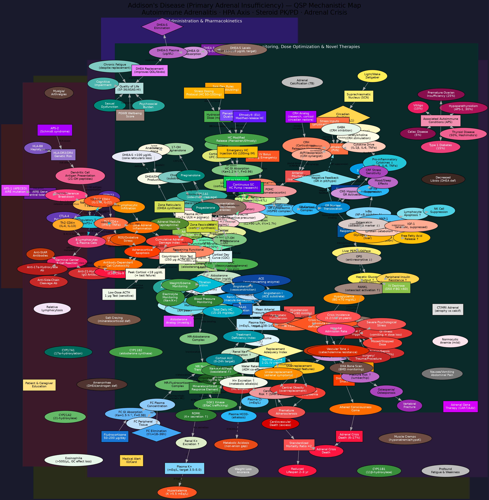</a> | 부신피질 자가면역 파괴로 코르티솔·알도스테론 결핍. HPA축·히드로코르티손/플루드로코르티손 보충 시뮬레이션.<br>[🗺️ 지도](addisons-disease/add_qsp_model.svg) · [⚙️ mrgsolve](addisons-disease/add_mrgsolve_model.R) · [📚 문헌](addisons-disease/add_references.md) · [📄 README](addisons-disease/README.md) |
| 4 | 신장·비뇨 | [**상염색체 우성 다낭신 (ADPKD)**<br><sub>Autosomal Dominant PKD · ADPKD</sub>](adpkd/) | <a href="adpkd/adpkd_qsp_model.svg"></a> | PKD1/2 변이 → cAMP 증가로 낭종 성장·신기능 저하. 톨밥탄(V2 수용체 길항)의 TKV/eGFR 효과.<br>[🗺️ 지도](adpkd/adpkd_qsp_model.svg) · [⚙️ mrgsolve](adpkd/adpkd_mrgsolve_model.R) · [📚 문헌](adpkd/adpkd_references.md) · [📄 README](adpkd/README.md) |
| 5 | 자가면역·류마티스 | [**성인형 스틸병**<br><sub>Adult-Onset Still's Disease · AOSD</sub>](adult-onset-stills-disease/) | <a href="adult-onset-stills-disease/aosd_qsp_model.svg"></a> | IL-1/IL-6/IL-18 매개 자가염증, 발열·관절염·페리틴 급상승. 아나킨라·카나키누맙·토실리주맙 표적.<br>[🗺️ 지도](adult-onset-stills-disease/aosd_qsp_model.svg) · [⚙️ mrgsolve](adult-onset-stills-disease/aosd_mrgsolve_model.R) · [📚 문헌](adult-onset-stills-disease/aosd_references.md) · [📄 README](adult-onset-stills-disease/README.md) |
| 6 | 피부 | [**원형 탈모증**<br><sub>Alopecia Areata · AA</sub>](alopecia-areata/) | <a href="alopecia-areata/aa_qsp_model.svg"></a> | 모낭 면역특권 붕괴, IFN-γ/IL-15 JAK-STAT 신호로 모발 손실. 바리시티닙 등 JAK 억제제 반응.<br>[🗺️ 지도](alopecia-areata/aa_qsp_model.svg) · [⚙️ mrgsolve](alopecia-areata/aa_mrgsolve_model.R) · [📚 문헌](alopecia-areata/aa_references.md) · [📄 README](alopecia-areata/README.md) |
| 7 | 신경 | [**알츠하이머병**<br><sub>Alzheimer's Disease · AD</sub>](alzheimers-disease/) | <a href="alzheimers-disease/ad_qsp_model.svg">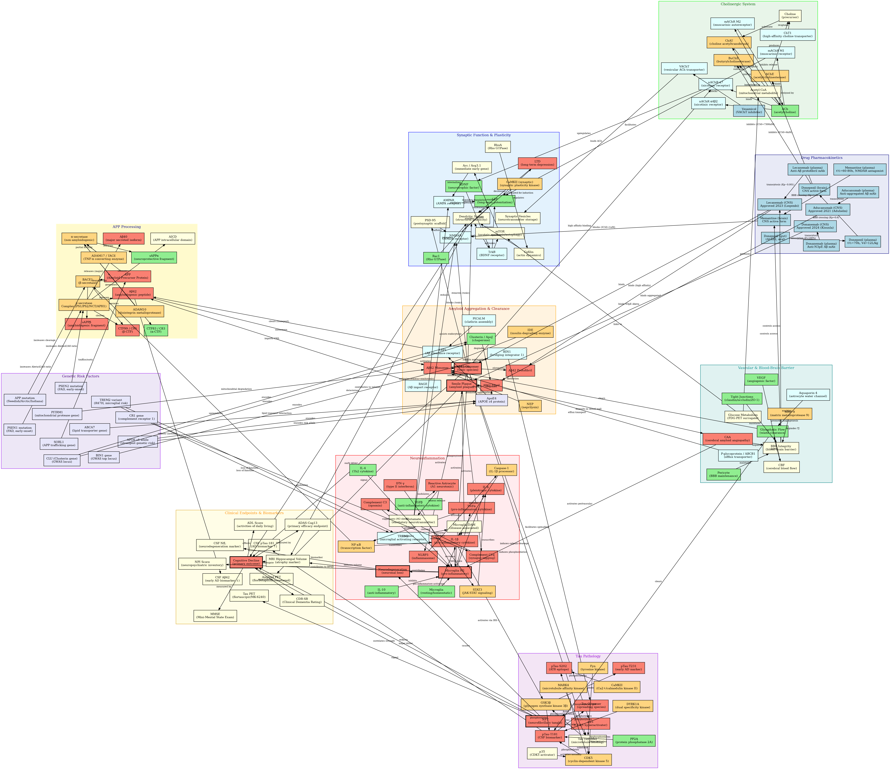</a> | 아밀로이드-β 침착·타우 신경섬유엉킴·신경염증에 의한 진행성 인지저하. 항아밀로이드 항체(레카네맙/도나네맙)·콜린에스터분해효소 억제제.<br>[🗺️ 지도](alzheimers-disease/ad_qsp_model.svg) · [⚙️ mrgsolve](alzheimers-disease/ad_mrgsolve_model.R) · [📚 문헌](alzheimers-disease/ad_references.md) · [📄 README](alzheimers-disease/README.md) |
| 8 | 신경 | [**근위축성 측삭경화증 (ALS)**<br><sub>Amyotrophic Lateral Sclerosis · ALS</sub>](amyotrophic-lateral-sclerosis/) | <a href="amyotrophic-lateral-sclerosis/als_qsp_model.svg"></a> | 상·하위 운동신경세포의 진행성 변성(SOD1/TDP-43/C9orf72). 릴루졸·에다라본·토퍼센(SOD1).<br>[🗺️ 지도](amyotrophic-lateral-sclerosis/als_qsp_model.svg) · [⚙️ mrgsolve](amyotrophic-lateral-sclerosis/als_mrgsolve_model.R) · [📚 문헌](amyotrophic-lateral-sclerosis/als_references.md) · [📄 README](amyotrophic-lateral-sclerosis/README.md) |
| 9 | 자가면역·류마티스 | [**강직성 척추염**<br><sub>Ankylosing Spondylitis · AS</sub>](ankylosing-spondylitis/) | <a href="ankylosing-spondylitis/as_qsp_model.svg">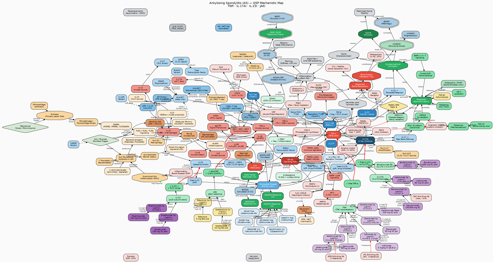</a> | HLA-B27·IL-23/IL-17·TNF 축의 부착부염·골증식. TNF/IL-17 억제제의 BASDAI 효과.<br>[🗺️ 지도](ankylosing-spondylitis/as_qsp_model.svg) · [⚙️ mrgsolve](ankylosing-spondylitis/as_mrgsolve_model.R) · [📚 문헌](ankylosing-spondylitis/as_references.md) · [📄 README](ankylosing-spondylitis/README.md) |
| 10 | 자가면역·류마티스 | [**항인지질항체 증후군**<br><sub>Antiphospholipid Syndrome · APS</sub>](antiphospholipid-syndrome/) | <a href="antiphospholipid-syndrome/aps_qsp_model.svg"></a> | 항인지질항체에 의한 동·정맥 혈전 및 임신 합병증. 항응고(와파린/헤파린)·히드록시클로로퀸.<br>[🗺️ 지도](antiphospholipid-syndrome/aps_qsp_model.svg) · [⚙️ mrgsolve](antiphospholipid-syndrome/aps_mrgsolve_model.R) · [📚 문헌](antiphospholipid-syndrome/aps_references.md) · [📄 README](antiphospholipid-syndrome/README.md) |
| 11 | 내분비·대사 | [**무증상 고요산혈증**<br><sub>Asymptomatic Hyperuricemia · AHU</sub>](asymptomatic-hyperuricemia/) | <a href="asymptomatic-hyperuricemia/ahy_qsp_model.svg"></a> | 요산 과포화(무증상)와 통풍·신질환 진행 위험. 생활습관 및 선택적 요산저하(잔틴산화효소 억제).<br>[🗺️ 지도](asymptomatic-hyperuricemia/ahy_qsp_model.svg) · [⚙️ mrgsolve](asymptomatic-hyperuricemia/ahy_mrgsolve_model.R) · [📚 문헌](asymptomatic-hyperuricemia/ahy_references.md) · [📄 README](asymptomatic-hyperuricemia/README.md) |
| 12 | 피부 | [**아토피 피부염**<br><sub>Atopic Dermatitis · AD</sub>](atopic-dermatitis/) | <a href="atopic-dermatitis/ad_qsp_model.svg"></a> | 피부장벽 기능장애·Th2(IL-4/IL-13/IL-31) 염증. 두필루맙·JAK 억제제·국소 칼시뉴린억제제.<br>[🗺️ 지도](atopic-dermatitis/ad_qsp_model.svg) · [⚙️ mrgsolve](atopic-dermatitis/ad_mrgsolve_model.R) · [📚 문헌](atopic-dermatitis/ad_references.md) · [📄 README](atopic-dermatitis/README.md) |
| 13 | 심혈관 | [**심방세동**<br><sub>Atrial Fibrillation · AF</sub>](atrial-fibrillation/) | <a href="atrial-fibrillation/af_qsp_model.svg">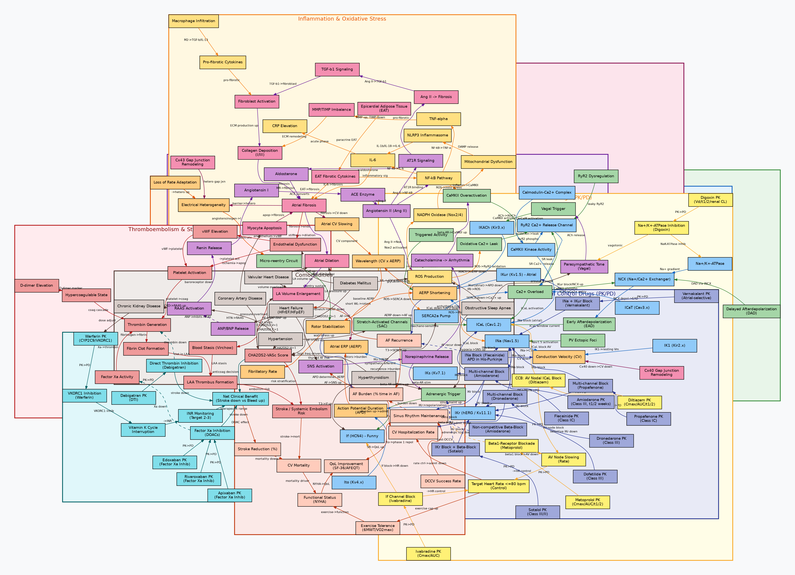</a> | 심방 전기적·구조적 리모델링과 재진입 회로. 율동/심박수 조절 및 NOAC 항응고 전략.<br>[🗺️ 지도](atrial-fibrillation/af_qsp_model.svg) · [⚙️ mrgsolve](atrial-fibrillation/af_mrgsolve_model.R) · [📚 문헌](atrial-fibrillation/af_references.md) · [📄 README](atrial-fibrillation/README.md) |
| 14 | 신경 | [**자가면역 뇌염**<br><sub>Autoimmune Encephalitis · AIE</sub>](autoimmune-encephalitis/) | <a href="autoimmune-encephalitis/aie_qsp_model.svg"></a> | 항NMDAR 등 신경표면 항체에 의한 뇌염. 스테로이드·IVIG·혈장교환·리툭시맙 면역치료.<br>[🗺️ 지도](autoimmune-encephalitis/aie_qsp_model.svg) · [⚙️ mrgsolve](autoimmune-encephalitis/aie_mrgsolve_model.R) · [📚 문헌](autoimmune-encephalitis/aie_references.md) · [📄 README](autoimmune-encephalitis/README.md) |
| 15 | 혈액 | [**자가면역 용혈성 빈혈**<br><sub>Autoimmune Hemolytic Anemia · AIHA</sub>](autoimmune-hemolytic-anemia/) | <a href="autoimmune-hemolytic-anemia/aiha_qsp_model.svg"></a> | 온형 IgG·한랭 IgM 자가항체에 의한 적혈구 파괴. 스테로이드·리툭시맙·수티림맙(항C1s).<br>[🗺️ 지도](autoimmune-hemolytic-anemia/aiha_qsp_model.svg) · [⚙️ mrgsolve](autoimmune-hemolytic-anemia/aiha_mrgsolve_model.R) · [📚 문헌](autoimmune-hemolytic-anemia/aiha_references.md) · [📄 README](autoimmune-hemolytic-anemia/README.md) |
| 16 | 소화기·간담도 | [**자가면역 간염**<br><sub>Autoimmune Hepatitis · AIH</sub>](autoimmune-hepatitis/) | <a href="autoimmune-hepatitis/aih_qsp_model.svg"></a> | T세포 매개 간세포 손상과 자가항체·고감마글로불린혈증. 스테로이드·아자티오프린 유도/유지.<br>[🗺️ 지도](autoimmune-hepatitis/aih_qsp_model.svg) · [⚙️ mrgsolve](autoimmune-hepatitis/aih_mrgsolve_model.R) · [📚 문헌](autoimmune-hepatitis/aih_references.md) · [📄 README](autoimmune-hepatitis/README.md) |
| 17 | 소화기·간담도 | [**자가면역 췌장염**<br><sub>Autoimmune Pancreatitis · AIP</sub>](autoimmune-pancreatitis/) | <a href="autoimmune-pancreatitis/aip_qsp_model.svg"></a> | IgG4 관련 림프형질세포 침윤·섬유염증. 스테로이드 관해유도·리툭시맙 재발관리.<br>[🗺️ 지도](autoimmune-pancreatitis/aip_qsp_model.svg) · [⚙️ mrgsolve](autoimmune-pancreatitis/aip_mrgsolve_model.R) · [📚 문헌](autoimmune-pancreatitis/aip_references.md) · [📄 README](autoimmune-pancreatitis/README.md) |
| 18 | 내분비·대사 | [**자가면역 다발내분비병증 (APECED)**<br><sub>Autoimmune Polyendocrinopathy (APS-1) · APS-1</sub>](autoimmune-polyendocrinopathy/) | <a href="autoimmune-polyendocrinopathy/aps_qsp_model.svg"></a> | AIRE 변이로 중추관용 소실 → 다장기 내분비 자가면역. 호르몬 보충 및 면역조절 모델.<br>[🗺️ 지도](autoimmune-polyendocrinopathy/aps_qsp_model.svg) · [⚙️ mrgsolve](autoimmune-polyendocrinopathy/aps_mrgsolve_model.R) · [📚 문헌](autoimmune-polyendocrinopathy/aps_references.md) · [📄 README](autoimmune-polyendocrinopathy/README.md) |
| 19 | 혈관염 | [**베체트병**<br><sub>Behçet's Disease · BD</sub>](behcet-disease/) | <a href="behcet-disease/bd_qsp_model.svg"></a> | 구강/생식기 궤양·포도막염, 호중구·IL-1 매개 가변혈관 염증. 콜히친·TNF 억제·아프레밀라스트.<br>[🗺️ 지도](behcet-disease/bd_qsp_model.svg) · [⚙️ mrgsolve](behcet-disease/bd_mrgsolve_model.R) · [📚 문헌](behcet-disease/bd_references.md) · [📄 README](behcet-disease/README.md) |
| 20 | 신장·비뇨 | [**양성 전립선 비대증**<br><sub>Benign Prostatic Hyperplasia · BPH</sub>](benign-prostatic-hyperplasia/) | <a href="benign-prostatic-hyperplasia/bph_qsp_model.svg"></a> | DHT 매개 전립선 증식과 평활근 긴장에 의한 하부요로증상. α차단제·5α환원효소 억제제.<br>[🗺️ 지도](benign-prostatic-hyperplasia/bph_qsp_model.svg) · [⚙️ mrgsolve](benign-prostatic-hyperplasia/bph_mrgsolve_model.R) · [📚 문헌](benign-prostatic-hyperplasia/bph_references.md) · [📄 README](benign-prostatic-hyperplasia/README.md) |
| 21 | 종양 | [**유방암**<br><sub>Breast Cancer · BC</sub>](breast-cancer/) | <a href="breast-cancer/bc_qsp_model.svg"></a> | ER+/HER2+/TNBC 아형별 증식 신호. 내분비요법·CDK4/6 억제제·항HER2·면역항암제.<br>[🗺️ 지도](breast-cancer/bc_qsp_model.svg) · [⚙️ mrgsolve](breast-cancer/bc_mrgsolve_model.R) · [📚 문헌](breast-cancer/bc_references.md) · [📄 README](breast-cancer/README.md) |
| 22 | 호흡기 | [**기관지 천식**<br><sub>Bronchial Asthma · BA</sub>](bronchial-asthma/) | <a href="bronchial-asthma/ba_qsp_model.svg"></a> | Th2/호산구 기도 염증과 기관지 과민성. ICS·LABA 및 항IL-5/IL-4Rα 생물학제제.<br>[🗺️ 지도](bronchial-asthma/ba_qsp_model.svg) · [⚙️ mrgsolve](bronchial-asthma/ba_mrgsolve_model.R) · [📚 문헌](bronchial-asthma/ba_references.md) · [📄 README](bronchial-asthma/README.md) |
| 23 | 호흡기 | [**기관지 확장증**<br><sub>Bronchiectasis · BEX</sub>](bronchiectasis/) | <a href="bronchiectasis/bex_qsp_model.svg"></a> | 감염-염증 악순환(Cole vicious cycle)과 호중구 엘라스타제 기도 파괴. 기도청결·항생제·항염.<br>[🗺️ 지도](bronchiectasis/bex_qsp_model.svg) · [⚙️ mrgsolve](bronchiectasis/bex_mrgsolve_model.R) · [📚 문헌](bronchiectasis/bex_references.md) · [📄 README](bronchiectasis/README.md) |
| 24 | 피부 | [**수포성 유천포창**<br><sub>Bullous Pemphigoid · BP</sub>](bullous-pemphigoid/) | <a href="bullous-pemphigoid/bp_qsp_model.svg"></a> | 항BP180/BP230 항체에 의한 표피하 수포 형성. 스테로이드·리툭시맙·오말리주맙.<br>[🗺️ 지도](bullous-pemphigoid/bp_qsp_model.svg) · [⚙️ mrgsolve](bullous-pemphigoid/bp_mrgsolve_model.R) · [📚 문헌](bullous-pemphigoid/bp_references.md) · [📄 README](bullous-pemphigoid/README.md) |
| 25 | 소화기·간담도 | [**셀리악병**<br><sub>Celiac Disease · CD</sub>](celiac-disease/) | <a href="celiac-disease/cd_qsp_model.svg"></a> | 글루텐-tTG 면역반응(HLA-DQ2/8)으로 융모 위축. 글루텐 제거식 및 글루텐분해효소 신약.<br>[🗺️ 지도](celiac-disease/cd_qsp_model.svg) · [⚙️ mrgsolve](celiac-disease/cd_mrgsolve_model.R) · [📚 문헌](celiac-disease/cd_references.md) · [📄 README](celiac-disease/README.md) |
| 26 | 소화기·간담도 | [**담석증**<br><sub>Cholelithiasis · CHOL</sub>](cholelithiasis/) | <a href="cholelithiasis/chol_qsp_model.svg"></a> | 담즙 콜레스테롤 과포화·담낭 정체에 의한 결석 형성. 우르소데옥시콜산 용해 요법.<br>[🗺️ 지도](cholelithiasis/chol_qsp_model.svg) · [⚙️ mrgsolve](cholelithiasis/chol_mrgsolve_model.R) · [📚 문헌](cholelithiasis/chol_references.md) · [📄 README](cholelithiasis/README.md) |
| 27 | 소화기·간담도 | [**만성 위염**<br><sub>Chronic Gastritis · CGAST</sub>](chronic-gastritis/) | <a href="chronic-gastritis/cgast_qsp_model.svg"></a> | H. pylori-Correa 연쇄(위축→장상피화생→이형성). 제균요법·PPI의 점막 회복 효과.<br>[🗺️ 지도](chronic-gastritis/cgast_qsp_model.svg) · [⚙️ mrgsolve](chronic-gastritis/cgast_mrgsolve_model.R) · [📚 문헌](chronic-gastritis/cgast_references.md) · [📄 README](chronic-gastritis/README.md) |
| 28 | 소화기·간담도 | [**만성 B형 간염**<br><sub>Chronic Hepatitis B · CHB</sub>](chronic-hepatitis-b/) | <a href="chronic-hepatitis-b/chb_qsp_model.svg"></a> | HBV cccDNA 지속과 면역 매개 간손상. 뉴클레오시드유사체·페그IFN의 바이러스 억제.<br>[🗺️ 지도](chronic-hepatitis-b/chb_qsp_model.svg) · [⚙️ mrgsolve](chronic-hepatitis-b/chb_mrgsolve_model.R) · [📚 문헌](chronic-hepatitis-b/chb_references.md) · [📄 README](chronic-hepatitis-b/README.md) |
| 29 | 내분비·대사 | [**만성 갑상선 기능 저하증**<br><sub>Chronic Hypothyroidism · HYPO</sub>](chronic-hypothyroidism/) | <a href="chronic-hypothyroidism/hypo_qsp_model.svg"></a> | 시상하부-뇌하수체-갑상선 축 저하(TSH↑/FT4↓). 레보티록신 보충의 용량-반응.<br>[🗺️ 지도](chronic-hypothyroidism/hypo_qsp_model.svg) · [⚙️ mrgsolve](chronic-hypothyroidism/hypo_mrgsolve_model.R) · [📚 문헌](chronic-hypothyroidism/hypo_references.md) · [📄 README](chronic-hypothyroidism/README.md) |
| 30 | 신장·비뇨 | [**만성 신부전**<br><sub>Chronic Kidney Disease · CKD</sub>](chronic-kidney-disease/) | <a href="chronic-kidney-disease/ckd_qsp_model.svg"></a> | 사구체 과여과·섬유화로 eGFR 진행성 저하. RAAS 억제·SGLT2i·피네레논 신보호.<br>[🗺️ 지도](chronic-kidney-disease/ckd_qsp_model.svg) · [⚙️ mrgsolve](chronic-kidney-disease/ckd_mrgsolve_model.R) · [📚 문헌](chronic-kidney-disease/ckd_references.md) · [📄 README](chronic-kidney-disease/README.md) |
| 31 | 종양 | [**만성 골수성 백혈병 (CML)**<br><sub>Chronic Myeloid Leukemia · CML</sub>](chronic-myeloid-leukemia/) | <a href="chronic-myeloid-leukemia/cml_qsp_model.svg"></a> | BCR-ABL 융합 티로신키나아제 구동 백혈병. 이매티닙 등 TKI·T315I 내성·무치료 관해(TFR).<br>[🗺️ 지도](chronic-myeloid-leukemia/cml_qsp_model.svg) · [⚙️ mrgsolve](chronic-myeloid-leukemia/cml_mrgsolve_model.R) · [📚 문헌](chronic-myeloid-leukemia/cml_references.md) · [📄 README](chronic-myeloid-leukemia/README.md) |
| 32 | 소화기·간담도 | [**만성 췌장염**<br><sub>Chronic Pancreatitis · CP</sub>](chronic-pancreatitis/) | <a href="chronic-pancreatitis/cp_qsp_model.svg"></a> | 반복 손상 → 췌성상세포 활성·섬유화·외분비 부전. 효소보충·통증관리 전략.<br>[🗺️ 지도](chronic-pancreatitis/cp_qsp_model.svg) · [⚙️ mrgsolve](chronic-pancreatitis/cp_mrgsolve_model.R) · [📚 문헌](chronic-pancreatitis/cp_references.md) · [📄 README](chronic-pancreatitis/README.md) |
| 33 | 신장·비뇨 | [**만성 신우신염**<br><sub>Chronic Pyelonephritis · CPN</sub>](chronic-pyelonephritis/) | <a href="chronic-pyelonephritis/cpn_qsp_model.svg">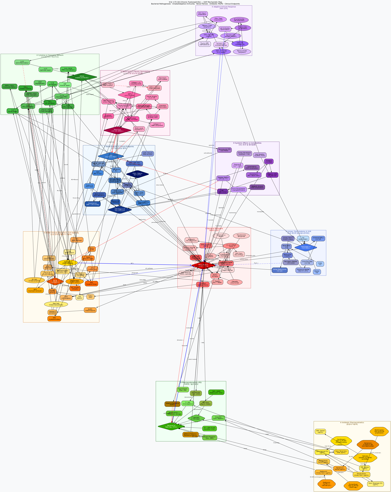</a> | 반복 신장 감염·역류로 인한 신실질 흉터·신기능 저하. 항생제·역류 교정.<br>[🗺️ 지도](chronic-pyelonephritis/cpn_qsp_model.svg) · [⚙️ mrgsolve](chronic-pyelonephritis/cpn_mrgsolve_model.R) · [📚 문헌](chronic-pyelonephritis/cpn_references.md) · [📄 README](chronic-pyelonephritis/README.md) |
| 34 | 심혈관 | [**만성 정맥 부전**<br><sub>Chronic Venous Insufficiency · CVI</sub>](chronic-venous-insufficiency/) | <a href="chronic-venous-insufficiency/cvi_qsp_model.svg"></a> | 판막 부전·정맥압 상승·백혈구 트래핑에 의한 부종·궤양. 정맥활성약(MPFF)·압박요법.<br>[🗺️ 지도](chronic-venous-insufficiency/cvi_qsp_model.svg) · [⚙️ mrgsolve](chronic-venous-insufficiency/cvi_mrgsolve_model.R) · [📚 문헌](chronic-venous-insufficiency/cvi_references.md) · [📄 README](chronic-venous-insufficiency/README.md) |
| 35 | 신경 | [**만성 염증성 탈수초성 다발신경병증 (CIDP)**<br><sub>Chronic Inflammatory Demyelinating Polyneuropathy · CIDP</sub>](cidp/) | <a href="cidp/cidp_qsp_model.svg"></a> | 자가면역 말이집 파괴에 의한 진행/재발성 신경병증. IVIG·스테로이드·혈장교환.<br>[🗺️ 지도](cidp/cidp_qsp_model.svg) · [⚙️ mrgsolve](cidp/cidp_mrgsolve_model.R) · [📚 문헌](cidp/cidp_references.md) · [📄 README](cidp/README.md) |
| 36 | 호흡기 | [**만성 폐쇄성 폐질환 (COPD)**<br><sub>Chronic Obstructive Pulmonary Disease · COPD</sub>](copd/) | <a href="copd/copd_qsp.svg"></a> | 흡연-산화스트레스·단백분해효소 불균형에 의한 기도/폐포 파괴. LABA/LAMA·ICS 기관지확장.<br>[🗺️ 지도](copd/copd_qsp.svg) · [⚙️ mrgsolve](copd/copd_mrgsolve_model.R) · [📚 문헌](copd/copd_references.md) · [📄 README](copd/README.md) |
| 37 | 소화기·간담도 | [**크론병**<br><sub>Crohn's Disease · CD</sub>](crohn-disease/) | <a href="crohn-disease/cd_qsp_model.svg"></a> | Th1/Th17 경유 전층성 장 염증과 장벽 투과성. 항TNF·항IL-12/23·항인테그린 생물학제제.<br>[🗺️ 지도](crohn-disease/cd_qsp_model.svg) · [⚙️ mrgsolve](crohn-disease/cd_mrgsolve_model.R) · [📚 문헌](crohn-disease/cd_references.md) · [📄 README](crohn-disease/README.md) |
| 38 | 호흡기 | [**낭성 섬유증**<br><sub>Cystic Fibrosis · CF</sub>](cystic-fibrosis/) | <a href="cystic-fibrosis/cf_qsp_model.svg"></a> | CFTR 변이(ΔF508)에 의한 점액 점성↑·만성 기도 감염. CFTR 조절제(엘렉사/테자/이바카프토르, Trikafta).<br>[🗺️ 지도](cystic-fibrosis/cf_qsp_model.svg) · [⚙️ mrgsolve](cystic-fibrosis/cf_mrgsolve_model.R) · [📚 문헌](cystic-fibrosis/cf_references.md) · [📄 README](cystic-fibrosis/README.md) |
| 39 | 자가면역·류마티스 | [**피부근염**<br><sub>Dermatomyositis · DM</sub>](dermatomyositis/) | <a href="dermatomyositis/dm_qsp_model.svg">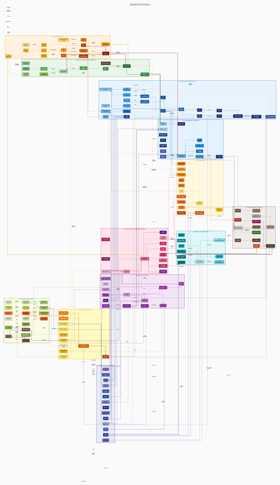</a> | I형 IFN·보체 매개 근육·피부 미세혈관병증. 스테로이드·IVIG·리툭시맙.<br>[🗺️ 지도](dermatomyositis/dm_qsp_model.svg) · [⚙️ mrgsolve](dermatomyositis/dm_mrgsolve_model.R) · [📚 문헌](dermatomyositis/dm_references.md) · [📄 README](dermatomyositis/README.md) |
| 40 | 심혈관 | [**확장성 심근병증**<br><sub>Dilated Cardiomyopathy · DCM</sub>](dilated-cardiomyopathy/) | <a href="dilated-cardiomyopathy/dcm_qsp_model.svg"></a> | 심실 확장·수축기능 저하·신경호르몬 활성화. GDMT(ARNI/BB/MRA/SGLT2i) 역리모델링.<br>[🗺️ 지도](dilated-cardiomyopathy/dcm_qsp_model.svg) · [⚙️ mrgsolve](dilated-cardiomyopathy/dcm_mrgsolve_model.R) · [📚 문헌](dilated-cardiomyopathy/dcm_references.md) · [📄 README](dilated-cardiomyopathy/README.md) |
| 41 | 소화기·간담도 | [**게실병**<br><sub>Diverticular Disease · DIV</sub>](diverticular-disease/) | <a href="diverticular-disease/div_qsp_model.svg"></a> | 장벽 구조·미생물·저섬유식에 의한 게실/게실염. 섬유·항생제·항염 치료.<br>[🗺️ 지도](diverticular-disease/div_qsp_model.svg) · [⚙️ mrgsolve](diverticular-disease/div_mrgsolve_model.R) · [📚 문헌](diverticular-disease/div_references.md) · [📄 README](diverticular-disease/README.md) |
| 42 | 내분비·대사 | [**이상지질혈증**<br><sub>Dyslipidemia · DYSLIP</sub>](dyslipidemia/) | <a href="dyslipidemia/dyslip_qsp_model.svg"></a> | 간 콜레스테롤 합성·LDL 수용체·역수송 항상성. 스타틴·에제티미브·PCSK9 억제제.<br>[🗺️ 지도](dyslipidemia/dyslip_qsp_model.svg) · [⚙️ mrgsolve](dyslipidemia/dyslip_mrgsolve_model.R) · [📚 문헌](dyslipidemia/dyslip_references.md) · [📄 README](dyslipidemia/README.md) |
| 43 | 혈관염 | [**호산구 육아종증 다발혈관염 (EGPA)**<br><sub>Eosinophilic GPA · EGPA</sub>](egpa/) | <a href="egpa/egpa_qsp_model.svg"></a> | IL-5 매개 호산구증가와 ANCA 연관 소혈관염. 스테로이드·메폴리주맙·벤랄리주맙.<br>[🗺️ 지도](egpa/egpa_qsp_model.svg) · [⚙️ mrgsolve](egpa/egpa_mrgsolve_model.R) · [📚 문헌](egpa/egpa_references.md) · [📄 README](egpa/README.md) |
| 44 | 내분비·대사 | [**자궁내막증**<br><sub>Endometriosis · ENDO</sub>](endometriosis/) | <a href="endometriosis/endo_qsp_model.svg"></a> | 자궁내막 조직의 자궁외 이식·에스트로겐 의존 염증·통증. GnRH 길항제·프로게스틴.<br>[🗺️ 지도](endometriosis/endo_qsp_model.svg) · [⚙️ mrgsolve](endometriosis/endo_mrgsolve_model.R) · [📚 문헌](endometriosis/endo_references.md) · [📄 README](endometriosis/README.md) |
| 45 | 신경 | [**뇌전증**<br><sub>Epilepsy · EPI</sub>](epilepsy/) | <a href="epilepsy/epi_qsp_model.svg">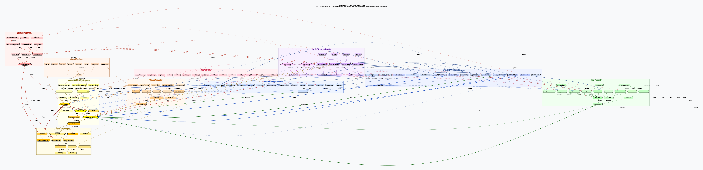</a> | 이온채널·흥분/억제 불균형에 의한 반복 발작. 항발작제(VPA/LEV/CBZ/LTG).<br>[🗺️ 지도](epilepsy/epi_qsp_model.svg) · [⚙️ mrgsolve](epilepsy/epi_mrgsolve_model.R) · [📚 문헌](epilepsy/epi_references.md) · [📄 README](epilepsy/README.md) |
| 46 | 심혈관 | [**본태성 고혈압**<br><sub>Essential Hypertension · EH</sub>](essential-hypertension/) | <a href="essential-hypertension/eh_qsp_model.svg"></a> | RAAS·교감신경·나트륨/체액 항상성에 의한 혈압 조절. ACEi/ARB·CCB·이뇨제.<br>[🗺️ 지도](essential-hypertension/eh_qsp_model.svg) · [⚙️ mrgsolve](essential-hypertension/eh_mrgsolve_model.R) · [📚 문헌](essential-hypertension/eh_references.md) · [📄 README](essential-hypertension/README.md) |
| 47 | 혈액 | [**에반스 증후군**<br><sub>Evans Syndrome · ES</sub>](evans-syndrome/) | <a href="evans-syndrome/es_qsp_model.svg"></a> | AIHA와 ITP가 동반된 다계열 자가면역 혈구감소. 스테로이드·리툭시맙·TPO-RA.<br>[🗺️ 지도](evans-syndrome/es_qsp_model.svg) · [⚙️ mrgsolve](evans-syndrome/es_mrgsolve_model.R) · [📚 문헌](evans-syndrome/es_references.md) · [📄 README](evans-syndrome/README.md) |
| 48 | 알레르기·소화기 | [**호산구성 식도염 (EoE)**<br><sub>Eosinophilic Esophagitis · EoE</sub>](eosinophilic-esophagitis/) | <a href="eosinophilic-esophagitis/eoe_qsp_model.svg"></a> | Th2 사이토카인(IL-13·IL-5)·ILC2·호산구 축에 의한 만성 식도 염증. 두필루맙·부데소니드·센다키맙.<br>[🗺️ 지도](eosinophilic-esophagitis/eoe_qsp_model.svg) · [⚙️ mrgsolve](eosinophilic-esophagitis/eoe_mrgsolve_model.R) · [📚 문헌](eosinophilic-esophagitis/eoe_references.md) · [📄 README](eosinophilic-esophagitis/README.md) |
| 49 | 신장·비뇨 | [**국소분절사구체경화증 (FSGS)**<br><sub>Focal Segmental Glomerulosclerosis · FSGS</sub>](fsgs/) | <a href="fsgs/fsgs_qsp_model.svg"></a> | 순환 투과인자·족세포 손상에 의한 신증후군 단백뇨. RAAS 억제·스테로이드·칼시뉴린억제제.<br>[🗺️ 지도](fsgs/fsgs_qsp_model.svg) · [⚙️ mrgsolve](fsgs/fsgs_mrgsolve_model.R) · [📚 문헌](fsgs/fsgs_references.md) · [📄 README](fsgs/README.md) |
| 50 | 소화기·간담도 | [**위식도 역류질환 (GERD)**<br><sub>Gastroesophageal Reflux Disease · GERD</sub>](gerd/) | <a href="gerd/gerd_qsp_model.svg"></a> | 하부식도괄약근 이완·산 역류에 의한 식도 점막 손상. PPI·P-CAB 위산 억제.<br>[🗺️ 지도](gerd/gerd_qsp_model.svg) · [⚙️ mrgsolve](gerd/gerd_mrgsolve_model.R) · [📚 문헌](gerd/gerd_references.md) · [📄 README](gerd/README.md) |
| 51 | 혈관염 | [**거대세포 동맥염**<br><sub>Giant Cell Arteritis · GCA</sub>](giant-cell-arteritis/) | <a href="giant-cell-arteritis/gca_qsp_model.svg"></a> | 대혈관의 IL-6/Th17 육아종성 동맥염과 실명 위험. 스테로이드·토실리주맙(항IL-6R).<br>[🗺️ 지도](giant-cell-arteritis/gca_qsp_model.svg) · [⚙️ mrgsolve](giant-cell-arteritis/gca_mrgsolve_model.R) · [📚 문헌](giant-cell-arteritis/gca_references.md) · [📄 README](giant-cell-arteritis/README.md) |
| 52 | 신장·비뇨 | [**굿파스처 증후군**<br><sub>Goodpasture Syndrome · GPS</sub>](goodpasture-syndrome/) | <a href="goodpasture-syndrome/gps_qsp_model.svg">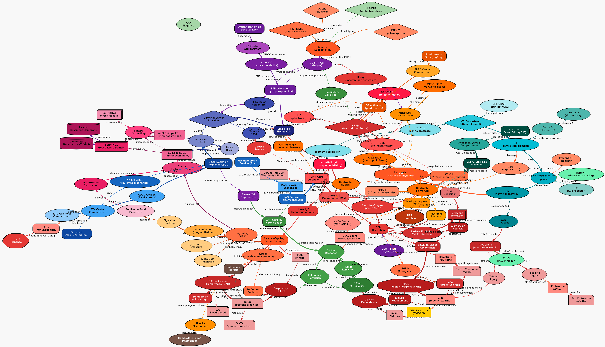</a> | 항GBM 항체에 의한 급속진행성 사구체신염·폐포출혈. 혈장교환·CY·리툭시맙.<br>[🗺️ 지도](goodpasture-syndrome/gps_qsp_model.svg) · [⚙️ mrgsolve](goodpasture-syndrome/gps_mrgsolve_model.R) · [📚 문헌](goodpasture-syndrome/gps_references.md) · [📄 README](goodpasture-syndrome/README.md) |
| 53 | 내분비·대사 | [**통풍**<br><sub>Gout · GOUT</sub>](gout/) | <a href="gout/gout_qsp_model.svg"></a> | 요산 과포화·MSU 결정·NLRP3-IL-1β 염증성 관절염. 요산저하제(알로푸리놀/페북소스타트)·콜히친.<br>[🗺️ 지도](gout/gout_qsp_model.svg) · [⚙️ mrgsolve](gout/gout_mrgsolve_model.R) · [📚 문헌](gout/gout_references.md) · [📄 README](gout/README.md) |
| 54 | 혈관염 | [**육아종증 다발혈관염 (GPA)**<br><sub>Granulomatosis with Polyangiitis · GPA</sub>](granulomatosis-with-polyangiitis/) | <a href="granulomatosis-with-polyangiitis/gpa_qsp_model.svg">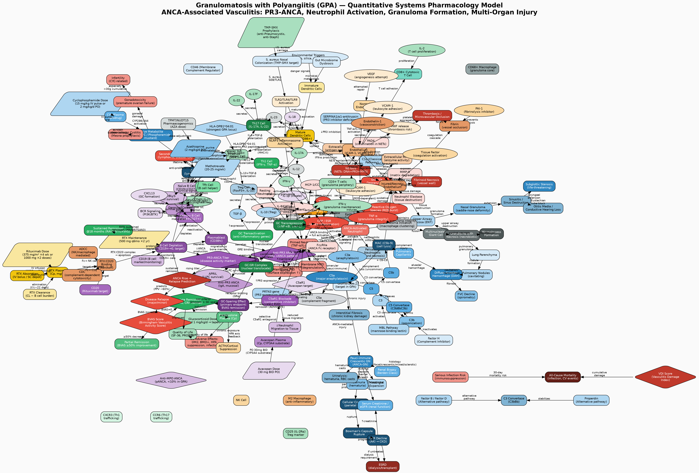</a> | PR3-ANCA 호중구 활성·육아종성 소혈관염. 리툭시맙·아바코판(C5aR 차단).<br>[🗺️ 지도](granulomatosis-with-polyangiitis/gpa_qsp_model.svg) · [⚙️ mrgsolve](granulomatosis-with-polyangiitis/gpa_mrgsolve_model.R) · [📚 문헌](granulomatosis-with-polyangiitis/gpa_references.md) · [📄 README](granulomatosis-with-polyangiitis/README.md) |
| 55 | 내분비·대사 | [**그레이브스병**<br><sub>Graves' Disease · GD</sub>](graves-disease/) | <a href="graves-disease/gd_qsp_model.svg"></a> | TSH 수용체 자극항체에 의한 갑상선기능항진. 항갑상선제·방사성요오드·수술.<br>[🗺️ 지도](graves-disease/gd_qsp_model.svg) · [⚙️ mrgsolve](graves-disease/gd_mrgsolve_model.R) · [📚 문헌](graves-disease/gd_references.md) · [📄 README](graves-disease/README.md) |
| 56 | 신경 | [**길랭-바레 증후군**<br><sub>Guillain-Barré Syndrome · GBS</sub>](guillain-barre-syndrome/) | <a href="guillain-barre-syndrome/gbs_qsp_model.svg"></a> | 분자모방 항강글리오시드 항체·보체 매개 급성 신경병증. IVIG·혈장교환.<br>[🗺️ 지도](guillain-barre-syndrome/gbs_qsp_model.svg) · [⚙️ mrgsolve](guillain-barre-syndrome/gbs_mrgsolve_model.R) · [📚 문헌](guillain-barre-syndrome/gbs_references.md) · [📄 README](guillain-barre-syndrome/README.md) |
| 57 | 내분비·대사 | [**하시모토 갑상선염**<br><sub>Hashimoto's Thyroiditis · HT</sub>](hashimoto-thyroiditis/) | <a href="hashimoto-thyroiditis/ht_qsp_model.svg"></a> | 항TPO/Tg 항체·T세포 매개 갑상선 파괴와 기능저하. 레보티록신 보충.<br>[🗺️ 지도](hashimoto-thyroiditis/ht_qsp_model.svg) · [⚙️ mrgsolve](hashimoto-thyroiditis/ht_mrgsolve_model.R) · [📚 문헌](hashimoto-thyroiditis/ht_references.md) · [📄 README](hashimoto-thyroiditis/README.md) |
| 58 | 심혈관 | [**심부전 (보존 박출률, HFpEF)**<br><sub>Heart Failure with Preserved EF · HFpEF</sub>](heart-failure-hfpef/) | <a href="heart-failure-hfpef/hfpef_qsp_model.svg"></a> | 심근 경직·전신 염증·미세혈관 기능부전에 의한 확장기 부전. SGLT2i·MRA·이뇨제.<br>[🗺️ 지도](heart-failure-hfpef/hfpef_qsp_model.svg) · [⚙️ mrgsolve](heart-failure-hfpef/hfpef_mrgsolve_model.R) · [📚 문헌](heart-failure-hfpef/hfpef_references.md) · [📄 README](heart-failure-hfpef/README.md) |
| 59 | 심혈관 | [**심부전 (감소 박출률, HFrEF)**<br><sub>Heart Failure with Reduced EF · HFrEF</sub>](heart-failure-hfref/) | <a href="heart-failure-hfref/hfref_qsp_model.svg"></a> | 신경호르몬(RAAS/SNS) 과활성과 심실 리모델링. ARNI·BB·MRA·SGLT2i 4대 요법.<br>[🗺️ 지도](heart-failure-hfref/hfref_qsp_model.svg) · [⚙️ mrgsolve](heart-failure-hfref/hfref_mrgsolve_model.R) · [📚 문헌](heart-failure-hfref/hfref_references.md) · [📄 README](heart-failure-hfref/README.md) |
| 60 | 감염 | [**HIV/AIDS**<br><sub>HIV/AIDS · HIV</sub>](hiv-aids/) | <a href="hiv-aids/hiv_qsp_model.svg">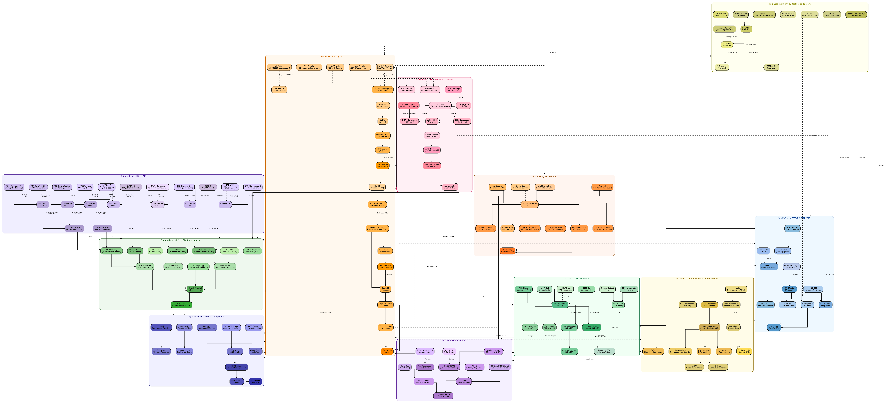</a> | HIV의 CD4 T세포 감염·고갈(Perelson 바이러스 동역학). 항레트로바이러스 병합요법(ART).<br>[🗺️ 지도](hiv-aids/hiv_qsp_model.svg) · [⚙️ mrgsolve](hiv-aids/hiv_mrgsolve_model.R) · [📚 문헌](hiv-aids/hiv_references.md) · [📄 README](hiv-aids/README.md) |
| 61 | 심혈관 | [**비후성 심근병증**<br><sub>Hypertrophic Cardiomyopathy · HCM</sub>](hypertrophic-cardiomyopathy/) | <a href="hypertrophic-cardiomyopathy/hcm_qsp_model.svg"></a> | 근절 변이에 의한 과수축·좌심실유출로 폐쇄. 마바캄텐(마이오신 억제)·베타차단제.<br>[🗺️ 지도](hypertrophic-cardiomyopathy/hcm_qsp_model.svg) · [⚙️ mrgsolve](hypertrophic-cardiomyopathy/hcm_mrgsolve_model.R) · [📚 문헌](hypertrophic-cardiomyopathy/hcm_references.md) · [📄 README](hypertrophic-cardiomyopathy/README.md) |
| 62 | 호흡기 | [**특발성 폐섬유화증 (IPF)**<br><sub>Idiopathic Pulmonary Fibrosis · IPF</sub>](idiopathic-pulmonary-fibrosis/) | <a href="idiopathic-pulmonary-fibrosis/ipf_qsp_model.svg"></a> | 상피손상-섬유아세포 활성·ECM 침착에 의한 진행성 섬유화. 닌테다닙·피르페니돈.<br>[🗺️ 지도](idiopathic-pulmonary-fibrosis/ipf_qsp_model.svg) · [⚙️ mrgsolve](idiopathic-pulmonary-fibrosis/ipf_mrgsolve_model.R) · [📚 문헌](idiopathic-pulmonary-fibrosis/ipf_references.md) · [📄 README](idiopathic-pulmonary-fibrosis/README.md) |
| 63 | 신장·비뇨 | [**IgA 신병증**<br><sub>IgA Nephropathy · IgAN</sub>](iga-nephropathy/) | <a href="iga-nephropathy/igan_qsp_model.svg"></a> | Gd-IgA1 면역복합체 메산지움 침착·보체 활성. 스테로이드·스파르센탄·보체억제제(이프타코판).<br>[🗺️ 지도](iga-nephropathy/igan_qsp_model.svg) · [⚙️ mrgsolve](iga-nephropathy/igan_mrgsolve_model.R) · [📚 문헌](iga-nephropathy/igan_references.md) · [📄 README](iga-nephropathy/README.md) |
| 64 | 혈관염 | [**IgA 혈관염 (HSP)**<br><sub>IgA Vasculitis · IgAV</sub>](iga-vasculitis/) | <a href="iga-vasculitis/igav_qsp_model.svg"></a> | Gd-IgA1 면역복합체 소혈관 침착에 의한 촉지성 자반·신염. 스테로이드·면역억제.<br>[🗺️ 지도](iga-vasculitis/igav_qsp_model.svg) · [⚙️ mrgsolve](iga-vasculitis/igav_mrgsolve_model.R) · [📚 문헌](iga-vasculitis/igav_references.md) · [📄 README](iga-vasculitis/README.md) |
| 65 | 혈액 | [**면역혈소판감소자반증 (ITP)**<br><sub>Immune Thrombocytopenic Purpura · ITP</sub>](immune-thrombocytopenic-purpura/) | <a href="immune-thrombocytopenic-purpura/itp_qsp_model.svg"></a> | 항혈소판 항체 매개 파괴와 생성 저하. 스테로이드·TPO 수용체작용제·리툭시맙.<br>[🗺️ 지도](immune-thrombocytopenic-purpura/itp_qsp_model.svg) · [⚙️ mrgsolve](immune-thrombocytopenic-purpura/itp_mrgsolve_model.R) · [📚 문헌](immune-thrombocytopenic-purpura/itp_references.md) · [📄 README](immune-thrombocytopenic-purpura/README.md) |
| 66 | 소화기·간담도 | [**과민성 장증후군 (IBS)**<br><sub>Irritable Bowel Syndrome · IBS</sub>](irritable-bowel-syndrome/) | <a href="irritable-bowel-syndrome/ibs_qsp_model.svg">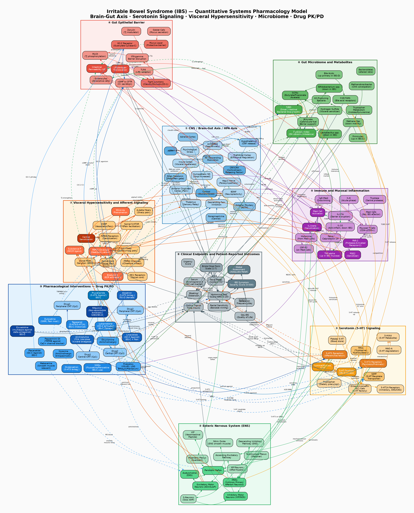</a> | 뇌-장축 이상·내장과민·미생물 변화. 식이·신경조절·장특이 약물(리나클로타이드 등).<br>[🗺️ 지도](irritable-bowel-syndrome/ibs_qsp_model.svg) · [⚙️ mrgsolve](irritable-bowel-syndrome/ibs_mrgsolve_model.R) · [📚 문헌](irritable-bowel-syndrome/ibs_references.md) · [📄 README](irritable-bowel-syndrome/README.md) |
| 67 | 소화기·간담도 | [**간경변증**<br><sub>Liver Cirrhosis · LC</sub>](liver-cirrhosis/) | <a href="liver-cirrhosis/lc_qsp_model.svg"></a> | 만성 손상 → 성상세포 섬유화·문맥압항진·합병증. 원인치료 및 합병증 관리.<br>[🗺️ 지도](liver-cirrhosis/lc_qsp_model.svg) · [⚙️ mrgsolve](liver-cirrhosis/lc_mrgsolve_model.R) · [📚 문헌](liver-cirrhosis/lc_references.md) · [📄 README](liver-cirrhosis/README.md) |
| 68 | 내분비·대사 | [**림프구성 뇌하수체염**<br><sub>Lymphocytic Hypophysitis · LHY</sub>](lymphocytic-hypophysitis/) | <a href="lymphocytic-hypophysitis/lhyp_qsp_model.svg"></a> | 뇌하수체 자가면역 침윤·뇌하수체 기능저하(면역관문억제제 연관 포함). 스테로이드·호르몬 보충.<br>[🗺️ 지도](lymphocytic-hypophysitis/lhyp_qsp_model.svg) · [⚙️ mrgsolve](lymphocytic-hypophysitis/lhyp_mrgsolve_model.R) · [📚 문헌](lymphocytic-hypophysitis/lhyp_references.md) · [📄 README](lymphocytic-hypophysitis/README.md) |
| 69 | 정신·신경 | [**주요우울장애 (MDD)**<br><sub>Major Depressive Disorder · MDD</sub>](major-depressive-disorder/) | <a href="major-depressive-disorder/mdd_qsp_model.svg"></a> | 모노아민·HPA축·신경가소성 이상. SSRI/SNRI·케타민·신경자극.<br>[🗺️ 지도](major-depressive-disorder/mdd_qsp_model.svg) · [⚙️ mrgsolve](major-depressive-disorder/mdd_mrgsolve_model.R) · [📚 문헌](major-depressive-disorder/mdd_references.md) · [📄 README](major-depressive-disorder/README.md) |
| 70 | 신장·비뇨 | [**막성 신병증**<br><sub>Membranous Nephropathy · MN</sub>](membranous-nephropathy/) | <a href="membranous-nephropathy/mn_qsp_model.svg">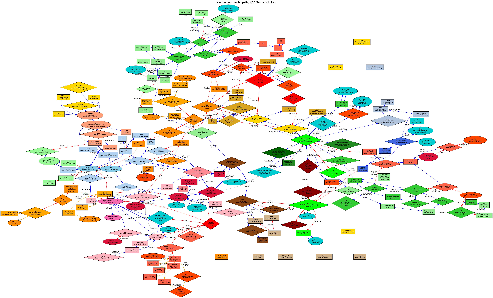</a> | 항PLA2R 항체에 의한 상피하 면역침착·신증후군. 리툭시맙 B세포 고갈.<br>[🗺️ 지도](membranous-nephropathy/mn_qsp_model.svg) · [⚙️ mrgsolve](membranous-nephropathy/mn_mrgsolve_model.R) · [📚 문헌](membranous-nephropathy/mn_references.md) · [📄 README](membranous-nephropathy/README.md) |
| 71 | 내분비·대사 | [**대사 증후군**<br><sub>Metabolic Syndrome · MS</sub>](metabolic-syndrome/) | <a href="metabolic-syndrome/ms_qsp_model.svg"></a> | 인슐린 저항성·내장지방·이상지질·고혈압 군집. 생활습관 및 대사 표적 약물.<br>[🗺️ 지도](metabolic-syndrome/ms_qsp_model.svg) · [⚙️ mrgsolve](metabolic-syndrome/ms_mrgsolve_model.R) · [📚 문헌](metabolic-syndrome/ms_references.md) · [📄 README](metabolic-syndrome/README.md) |
| 72 | 혈관염 | [**현미경적 다발혈관염 (MPA)**<br><sub>Microscopic Polyangiitis · MPA</sub>](microscopic-polyangiitis/) | <a href="microscopic-polyangiitis/mpa_qsp_model.svg"></a> | MPO-ANCA 매개 소혈관염·급속진행성 사구체신염. 리툭시맙·아바코판.<br>[🗺️ 지도](microscopic-polyangiitis/mpa_qsp_model.svg) · [⚙️ mrgsolve](microscopic-polyangiitis/mpa_mrgsolve_model.R) · [📚 문헌](microscopic-polyangiitis/mpa_references.md) · [📄 README](microscopic-polyangiitis/README.md) |
| 73 | 신경 | [**편두통**<br><sub>Migraine · MGR</sub>](migraine/) | <a href="migraine/mgr_qsp_model.svg">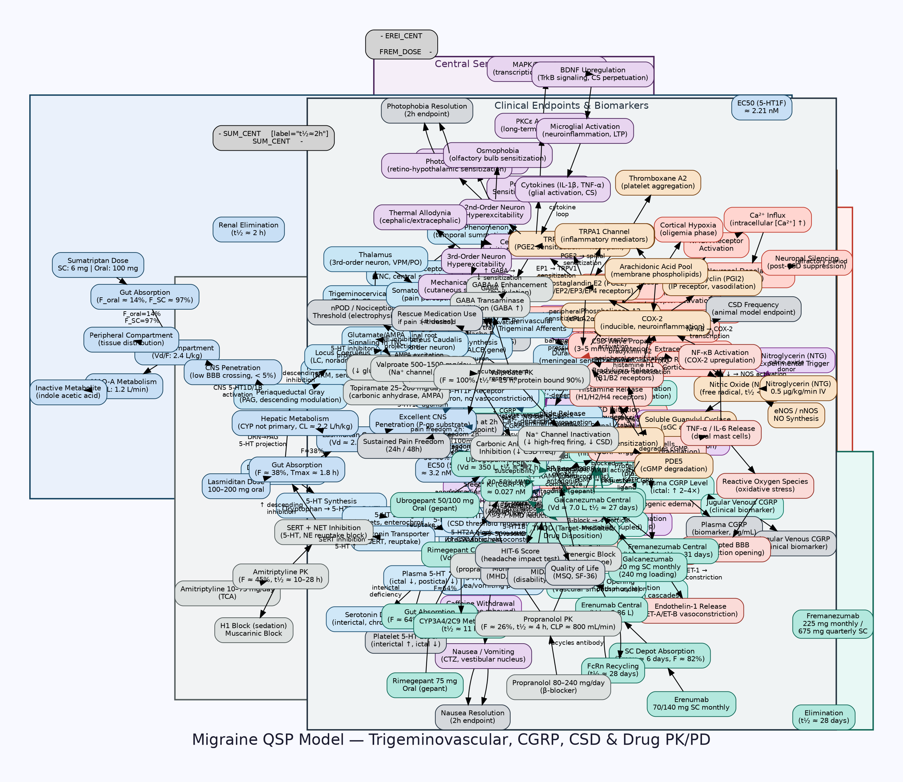</a> | 삼차혈관계·CGRP·피질확산성억제(CSD). 트립탄·항CGRP 항체·게판트.<br>[🗺️ 지도](migraine/mgr_qsp_model.svg) · [⚙️ mrgsolve](migraine/mgr_mrgsolve_model.R) · [📚 문헌](migraine/mgr_references.md) · [📄 README](migraine/README.md) |
| 74 | 신장·비뇨 | [**미세변화 신증후군**<br><sub>Minimal Change Disease · MCD</sub>](minimal-change-disease/) | <a href="minimal-change-disease/mcd_qsp_model.svg"></a> | T세포 매개 순환인자에 의한 족세포 손상·대량 단백뇨. 스테로이드·칼시뉴린억제제.<br>[🗺️ 지도](minimal-change-disease/mcd_qsp_model.svg) · [⚙️ mrgsolve](minimal-change-disease/mcd_mrgsolve_model.R) · [📚 문헌](minimal-change-disease/mcd_references.md) · [📄 README](minimal-change-disease/README.md) |
| 75 | 자가면역·류마티스 | [**혼합결합조직병 (MCTD)**<br><sub>Mixed Connective Tissue Disease · MCTD</sub>](mixed-connective-tissue-disease/) | <a href="mixed-connective-tissue-disease/mctd_qsp_model.svg"></a> | 항U1-RNP 항체 양성, SLE/SSc/PM 중복 양상. 스테로이드·면역억제.<br>[🗺️ 지도](mixed-connective-tissue-disease/mctd_qsp_model.svg) · [⚙️ mrgsolve](mixed-connective-tissue-disease/mctd_mrgsolve_model.R) · [📚 문헌](mixed-connective-tissue-disease/mctd_references.md) · [📄 README](mixed-connective-tissue-disease/README.md) |
| 76 | 종양 | [**다발골수종**<br><sub>Multiple Myeloma · MM</sub>](multiple-myeloma/) | <a href="multiple-myeloma/mm_qsp_model.svg"></a> | 골수 형질세포 클론 증식·골 파괴. 프로테아좀 억제제·IMiD·항CD38.<br>[🗺️ 지도](multiple-myeloma/mm_qsp_model.svg) · [⚙️ mrgsolve](multiple-myeloma/mm_mrgsolve_model.R) · [📚 문헌](multiple-myeloma/mm_references.md) · [📄 README](multiple-myeloma/README.md) |
| 77 | 신경 | [**다발성 경화증**<br><sub>Multiple Sclerosis · MS</sub>](multiple-sclerosis/) | <a href="multiple-sclerosis/ms_qsp.svg">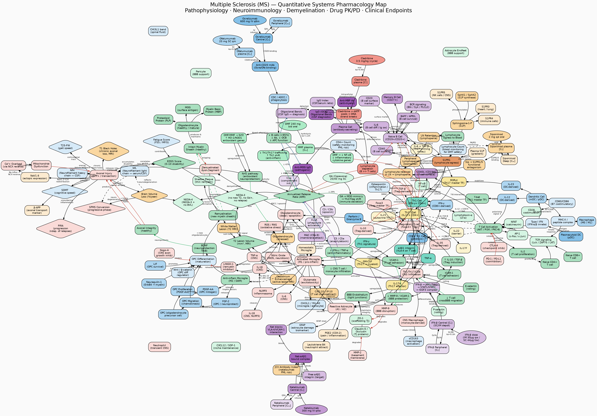</a> | 자가반응 T/B세포에 의한 중추신경 탈수초·축삭 손상. 질병조절치료(항CD20·S1P 조절제).<br>[🗺️ 지도](multiple-sclerosis/ms_qsp.svg) · [⚙️ mrgsolve](multiple-sclerosis/ms_mrgsolve_model.R) · [📚 문헌](multiple-sclerosis/ms_references.md) · [📄 README](multiple-sclerosis/README.md) |
| 78 | 신경 | [**중증 근무력증**<br><sub>Myasthenia Gravis · MG</sub>](myasthenia-gravis/) | <a href="myasthenia-gravis/mg_qsp_model.svg"></a> | 항AChR 항체·보체 매개 신경근접합 차단. 콜린에스터분해효소 억제·FcRn/보체 억제제.<br>[🗺️ 지도](myasthenia-gravis/mg_qsp_model.svg) · [⚙️ mrgsolve](myasthenia-gravis/mg_mrgsolve_model.R) · [📚 문헌](myasthenia-gravis/mg_references.md) · [📄 README](myasthenia-gravis/README.md) |
| 79 | 소화기·간담도 | [**비알코올 지방간/지방간염 (NAFLD/NASH)**<br><sub>NAFLD/NASH · NAFLD</sub>](nafld-nash/) | <a href="nafld-nash/nafld_qsp_model.svg">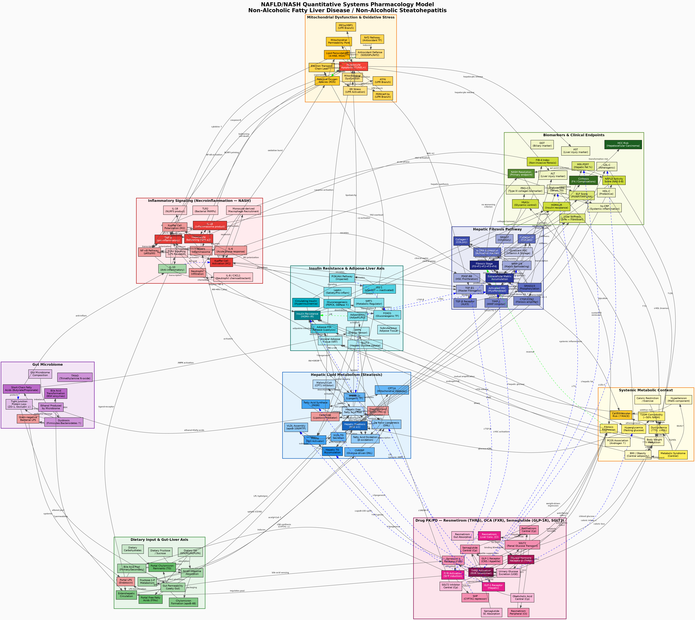</a> | 지방독성·염증·섬유화 진행(지방간→지방간염). 레스메티롬(THR-β)·GLP-1 작용제.<br>[🗺️ 지도](nafld-nash/nafld_qsp_model.svg) · [⚙️ mrgsolve](nafld-nash/nafld_mrgsolve_model.R) · [📚 문헌](nafld-nash/nafld_references.md) · [📄 README](nafld-nash/README.md) |
| 80 | 신경 | [**시신경척수염 (NMOSD)**<br><sub>Neuromyelitis Optica · NMO</sub>](neuromyelitis-optica/) | <a href="neuromyelitis-optica/nmo_qsp_model.svg"></a> | 항AQP4 항체·보체 매개 성상세포 손상. 에쿨리주맙·항IL-6R(사트랄리주맙)·항CD19(이네빌리주맙).<br>[🗺️ 지도](neuromyelitis-optica/nmo_qsp_model.svg) · [⚙️ mrgsolve](neuromyelitis-optica/nmo_mrgsolve_model.R) · [📚 문헌](neuromyelitis-optica/nmo_references.md) · [📄 README](neuromyelitis-optica/README.md) |
| 81 | 내분비·대사 | [**비만**<br><sub>Obesity · OB</sub>](obesity/) | <a href="obesity/ob_qsp_model.svg"></a> | 에너지 항상성·식욕조절(렙틴/GLP-1/멜라노코르틴) 조절이상. GLP-1/GIP 작용제 체중감량.<br>[🗺️ 지도](obesity/ob_qsp_model.svg) · [⚙️ mrgsolve](obesity/ob_mrgsolve_model.R) · [📚 문헌](obesity/ob_references.md) · [📄 README](obesity/README.md) |
| 82 | 호흡기 | [**폐쇄성 수면 무호흡 (OSA)**<br><sub>Obstructive Sleep Apnea · OSA</sub>](obstructive-sleep-apnea/) | <a href="obstructive-sleep-apnea/osa_qsp_model.svg"></a> | 상기도 허탈·간헐적 저산소·교감신경 활성. CPAP·체중감량·약물 보조.<br>[🗺️ 지도](obstructive-sleep-apnea/osa_qsp_model.svg) · [⚙️ mrgsolve](obstructive-sleep-apnea/osa_mrgsolve_model.R) · [📚 문헌](obstructive-sleep-apnea/osa_references.md) · [📄 README](obstructive-sleep-apnea/README.md) |
| 83 | 내분비·대사 | [**골다공증**<br><sub>Osteoporosis · OP</sub>](osteoporosis/) | <a href="osteoporosis/op_qsp_model.svg"></a> | RANKL-OPG 불균형으로 골흡수↑/형성↓. 비스포스포네이트·데노수맙·로모소주맙.<br>[🗺️ 지도](osteoporosis/op_qsp_model.svg) · [⚙️ mrgsolve](osteoporosis/op_mrgsolve_model.R) · [📚 문헌](osteoporosis/op_references.md) · [📄 README](osteoporosis/README.md) |
| 84 | 신장·비뇨 | [**과민성 방광 (OAB)**<br><sub>Overactive Bladder · OAB</sub>](overactive-bladder/) | <a href="overactive-bladder/oab_qsp_model.svg"></a> | 배뇨근 과활동(무스카린/β3 수용체 불균형). 항무스카린제·미라베그론(β3 작용제).<br>[🗺️ 지도](overactive-bladder/oab_qsp_model.svg) · [⚙️ mrgsolve](overactive-bladder/oab_mrgsolve_model.R) · [📚 문헌](overactive-bladder/oab_references.md) · [📄 README](overactive-bladder/README.md) |
| 85 | 내분비·대사 | [**파젯병 (골)**<br><sub>Paget's Disease of Bone · PBD</sub>](pagets-disease/) | <a href="pagets-disease/pbd_qsp_model.svg"></a> | SQSTM1/RANKL 과활성에 의한 비정상 골개조. 졸레드론산 등 비스포스포네이트.<br>[🗺️ 지도](pagets-disease/pbd_qsp_model.svg) · [⚙️ mrgsolve](pagets-disease/pbd_mrgsolve_model.R) · [📚 문헌](pagets-disease/pbd_references.md) · [📄 README](pagets-disease/README.md) |
| 86 | 신경 | [**파킨슨병**<br><sub>Parkinson's Disease · PD</sub>](parkinsons-disease/) | <a href="parkinsons-disease/pd_qsp_model.svg"></a> | 흑질 도파민 신경세포 변성·α-시누클레인 응집. 레보도파·도파민작용제·MAO-B 억제제.<br>[🗺️ 지도](parkinsons-disease/pd_qsp_model.svg) · [⚙️ mrgsolve](parkinsons-disease/pd_mrgsolve_model.R) · [📚 문헌](parkinsons-disease/pd_references.md) · [📄 README](parkinsons-disease/README.md) |
| 87 | 피부 | [**심상성 천포창**<br><sub>Pemphigus Vulgaris · PV</sub>](pemphigus-vulgaris/) | <a href="pemphigus-vulgaris/pv_qsp_model.svg">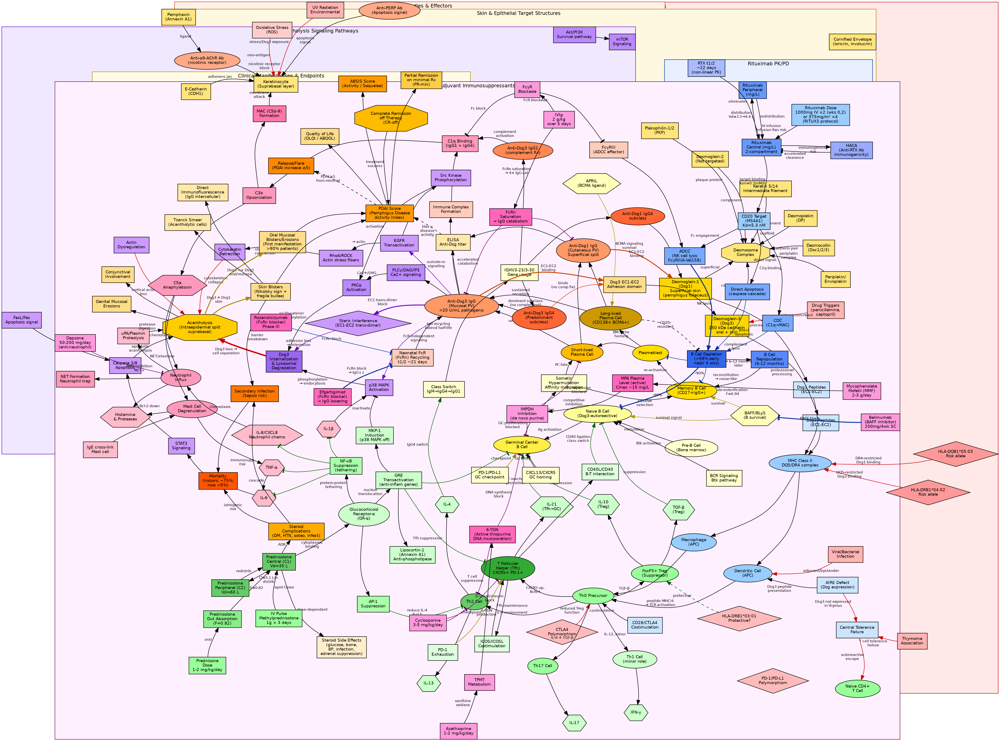</a> | 항데스모글레인 항체에 의한 표피내 수포(천포창). 리툭시맙·스테로이드.<br>[🗺️ 지도](pemphigus-vulgaris/pv_qsp_model.svg) · [⚙️ mrgsolve](pemphigus-vulgaris/pv_mrgsolve_model.R) · [📚 문헌](pemphigus-vulgaris/pv_references.md) · [📄 README](pemphigus-vulgaris/README.md) |
| 88 | 소화기·간담도 | [**소화성 궤양**<br><sub>Peptic Ulcer Disease · PUD</sub>](peptic-ulcer/) | <a href="peptic-ulcer/pud_qsp_model.svg"></a> | H. pylori·NSAID에 의한 점막 방어-공격 불균형. PPI·제균요법 점막 치유.<br>[🗺️ 지도](peptic-ulcer/pud_qsp_model.svg) · [⚙️ mrgsolve](peptic-ulcer/pud_mrgsolve_model.R) · [📚 문헌](peptic-ulcer/pud_references.md) · [📄 README](peptic-ulcer/README.md) |
| 89 | 심혈관 | [**말초동맥질환 (PAD)**<br><sub>Peripheral Arterial Disease · PAD</sub>](peripheral-arterial-disease/) | <a href="peripheral-arterial-disease/pad_qsp_model.svg"></a> | 죽상경화에 의한 하지 허혈·파행. 항혈소판·스타틴·실로스타졸.<br>[🗺️ 지도](peripheral-arterial-disease/pad_qsp_model.svg) · [⚙️ mrgsolve](peripheral-arterial-disease/pad_mrgsolve_model.R) · [📚 문헌](peripheral-arterial-disease/pad_references.md) · [📄 README](peripheral-arterial-disease/README.md) |
| 90 | 혈액 | [**악성 빈혈**<br><sub>Pernicious Anemia · PNA</sub>](pernicious-anemia/) | <a href="pernicious-anemia/pna_qsp_model.svg"></a> | 항내인자/벽세포 항체에 의한 비타민 B12 흡수장애. B12 보충요법.<br>[🗺️ 지도](pernicious-anemia/pna_qsp_model.svg) · [⚙️ mrgsolve](pernicious-anemia/pna_mrgsolve_model.R) · [📚 문헌](pernicious-anemia/pna_references.md) · [📄 README](pernicious-anemia/README.md) |
| 91 | 호흡기 | [**진폐증**<br><sub>Pneumoconiosis · PNM</sub>](pneumoconiosis/) | <a href="pneumoconiosis/pnm_qsp_model.svg"></a> | 분진(실리카/석탄/석면) 대식세포 활성·진행성 폐섬유화. 노출차단·대증치료.<br>[🗺️ 지도](pneumoconiosis/pnm_qsp_model.svg) · [⚙️ mrgsolve](pneumoconiosis/pnm_mrgsolve_model.R) · [📚 문헌](pneumoconiosis/pnm_references.md) · [📄 README](pneumoconiosis/README.md) |
| 92 | 혈관염 | [**결절성 다발동맥염 (PAN)**<br><sub>Polyarteritis Nodosa · PAN</sub>](polyarteritis-nodosa/) | <a href="polyarteritis-nodosa/pan_qsp_model.svg"></a> | 중형 동맥의 괴사성 염증(HBV 연관 포함). 스테로이드·CY·항바이러스.<br>[🗺️ 지도](polyarteritis-nodosa/pan_qsp_model.svg) · [⚙️ mrgsolve](polyarteritis-nodosa/pan_mrgsolve_model.R) · [📚 문헌](polyarteritis-nodosa/pan_references.md) · [📄 README](polyarteritis-nodosa/README.md) |
| 93 | 내분비·대사 | [**다낭성 난소 증후군 (PCOS)**<br><sub>Polycystic Ovary Syndrome · PCOS</sub>](polycystic-ovary-syndrome/) | <a href="polycystic-ovary-syndrome/pcos_qsp_model.svg">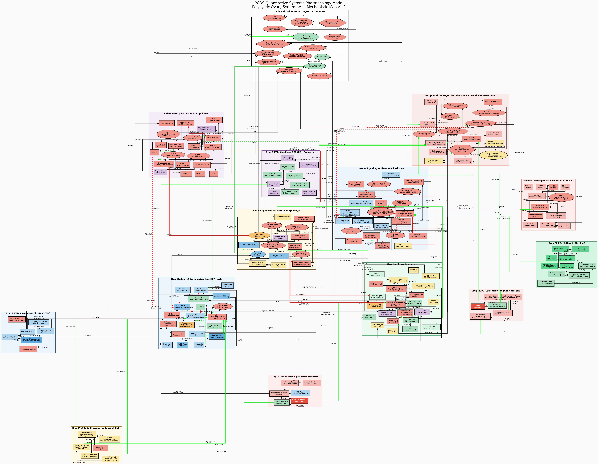</a> | 고안드로겐·인슐린저항·LH/FSH 이상. 메트포르민·항안드로겐·배란유도.<br>[🗺️ 지도](polycystic-ovary-syndrome/pcos_qsp_model.svg) · [⚙️ mrgsolve](polycystic-ovary-syndrome/pcos_mrgsolve_model.R) · [📚 문헌](polycystic-ovary-syndrome/pcos_references.md) · [📄 README](polycystic-ovary-syndrome/README.md) |
| 94 | 자가면역·류마티스 | [**다발성 근염**<br><sub>Polymyositis · PM</sub>](polymyositis/) | <a href="polymyositis/pm_qsp_model.svg"></a> | CD8 T세포 매개 근섬유 침습·근력저하. 스테로이드·면역억제제.<br>[🗺️ 지도](polymyositis/pm_qsp_model.svg) · [⚙️ mrgsolve](polymyositis/pm_mrgsolve_model.R) · [📚 문헌](polymyositis/pm_references.md) · [📄 README](polymyositis/README.md) |
| 95 | 소화기·간담도 | [**원발성 담즙성 담관염 (PBC)**<br><sub>Primary Biliary Cholangitis · PBC</sub>](primary-biliary-cholangitis/) | <a href="primary-biliary-cholangitis/pbc_qsp_model.svg"></a> | 항미토콘드리아항체에 의한 담관 파괴·담즙정체. UDCA·오베티콜산.<br>[🗺️ 지도](primary-biliary-cholangitis/pbc_qsp_model.svg) · [⚙️ mrgsolve](primary-biliary-cholangitis/pbc_mrgsolve_model.R) · [📚 문헌](primary-biliary-cholangitis/pbc_references.md) · [📄 README](primary-biliary-cholangitis/README.md) |
| 96 | 내분비·대사 | [**원발성 부갑상선 기능 항진증 (PHPT)**<br><sub>Primary Hyperparathyroidism · PHPT</sub>](primary-hyperparathyroidism/) | <a href="primary-hyperparathyroidism/phpt_qsp_model.svg"></a> | 부갑상선 선종의 PTH 자율과다·고칼슘혈증·골소실. 시나칼셋·부갑상선절제술.<br>[🗺️ 지도](primary-hyperparathyroidism/phpt_qsp_model.svg) · [⚙️ mrgsolve](primary-hyperparathyroidism/phpt_mrgsolve_model.R) · [📚 문헌](primary-hyperparathyroidism/phpt_references.md) · [📄 README](primary-hyperparathyroidism/README.md) |
| 97 | 소화기·간담도 | [**원발성 경화성 담관염 (PSC)**<br><sub>Primary Sclerosing Cholangitis · PSC</sub>](primary-sclerosing-cholangitis/) | <a href="primary-sclerosing-cholangitis/psc_qsp_model.svg"></a> | 담관 섬유화·다발 협착(IBD 연관)·담관암 위험. 대증치료·간이식.<br>[🗺️ 지도](primary-sclerosing-cholangitis/psc_qsp_model.svg) · [⚙️ mrgsolve](primary-sclerosing-cholangitis/psc_mrgsolve_model.R) · [📚 문헌](primary-sclerosing-cholangitis/psc_references.md) · [📄 README](primary-sclerosing-cholangitis/README.md) |
| 98 | 내분비·대사 | [**가성통풍 (CPPD)**<br><sub>Pseudogout (CPPD) · CPPD</sub>](pseudogout/) | <a href="pseudogout/cppd_qsp_model.svg">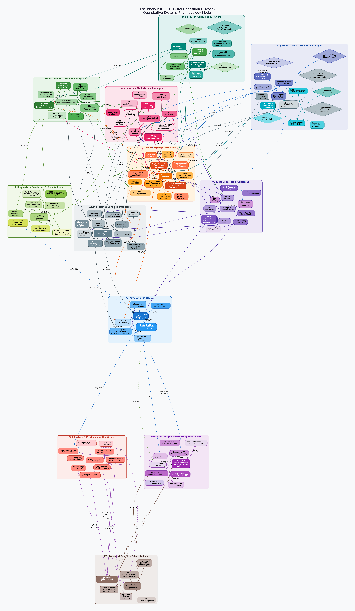</a> | 칼슘피로인산 결정 침착·NLRP3 염증성 관절염. 콜히친·NSAID·스테로이드.<br>[🗺️ 지도](pseudogout/cppd_qsp_model.svg) · [⚙️ mrgsolve](pseudogout/cppd_mrgsolve_model.R) · [📚 문헌](pseudogout/cppd_references.md) · [📄 README](pseudogout/README.md) |
| 99 | 피부 | [**건선**<br><sub>Psoriasis · PSO</sub>](psoriasis/) | <a href="psoriasis/pso_qsp_model.svg">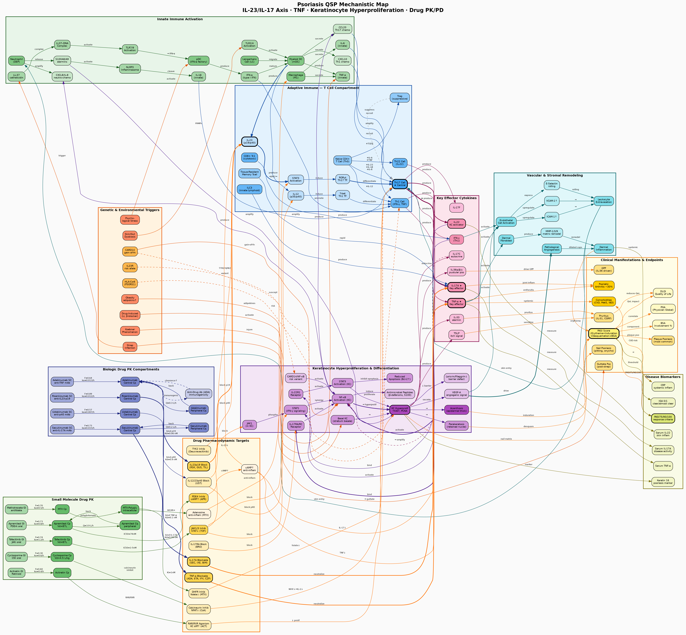</a> | IL-23/IL-17 축에 의한 각질세포 과증식. 항IL-17/IL-23 생물학제제·항TNF.<br>[🗺️ 지도](psoriasis/pso_qsp_model.svg) · [⚙️ mrgsolve](psoriasis/pso_mrgsolve_model.R) · [📚 문헌](psoriasis/pso_references.md) · [📄 README](psoriasis/README.md) |
| 100 | 자가면역·류마티스 | [**건선성 관절염**<br><sub>Psoriatic Arthritis · PsA</sub>](psoriatic-arthritis/) | <a href="psoriatic-arthritis/psa_qsp_model.svg"></a> | TNF·IL-23/IL-17 매개 부착부염·관절염·피부 건선. 생물학제제·JAK 억제제.<br>[🗺️ 지도](psoriatic-arthritis/psa_qsp_model.svg) · [⚙️ mrgsolve](psoriatic-arthritis/psa_mrgsolve_model.R) · [📚 문헌](psoriatic-arthritis/psa_references.md) · [📄 README](psoriatic-arthritis/README.md) |
| 101 | 심혈관 | [**폐동맥 고혈압 (PAH)**<br><sub>Pulmonary Arterial Hypertension · PAH</sub>](pulmonary-arterial-hypertension/) | <a href="pulmonary-arterial-hypertension/pah_qsp_model.svg"></a> | 폐혈관 리모델링(엔도텔린·NO·프로스타사이클린 경로). ERA·PDE5i·프로스타사이클린.<br>[🗺️ 지도](pulmonary-arterial-hypertension/pah_qsp_model.svg) · [⚙️ mrgsolve](pulmonary-arterial-hypertension/pah_mrgsolve_model.R) · [📚 문헌](pulmonary-arterial-hypertension/pah_references.md) · [📄 README](pulmonary-arterial-hypertension/README.md) |
| 102 | 자가면역·류마티스 | [**반응성 관절염**<br><sub>Reactive Arthritis · ReA</sub>](reactive-arthritis/) | <a href="reactive-arthritis/rea_qsp_model.svg"></a> | 감염 후 HLA-B27 연관 무균성 관절염. NSAID·설파살라진·생물학제제.<br>[🗺️ 지도](reactive-arthritis/rea_qsp_model.svg) · [⚙️ mrgsolve](reactive-arthritis/rea_mrgsolve_model.R) · [📚 문헌](reactive-arthritis/rea_references.md) · [📄 README](reactive-arthritis/README.md) |
| 103 | 자가면역·류마티스 | [**재발성 다발연골염**<br><sub>Relapsing Polychondritis · RPC</sub>](relapsing-polychondritis/) | <a href="relapsing-polychondritis/rpc_qsp_model.svg"></a> | 연골(II형 콜라겐) 자가면역 염증(귀·코·기도). 스테로이드·면역억제·생물학제제.<br>[🗺️ 지도](relapsing-polychondritis/rpc_qsp_model.svg) · [⚙️ mrgsolve](relapsing-polychondritis/rpc_mrgsolve_model.R) · [📚 문헌](relapsing-polychondritis/rpc_references.md) · [📄 README](relapsing-polychondritis/README.md) |
| 104 | 자가면역·류마티스 | [**류마티스 관절염**<br><sub>Rheumatoid Arthritis · RA</sub>](rheumatoid-arthritis/) | <a href="rheumatoid-arthritis/ra_qsp_model.svg"></a> | TNF/IL-6 매개 활막 판누스·골미란. 항TNF·항IL-6·JAK 억제제·CTLA-4-Ig.<br>[🗺️ 지도](rheumatoid-arthritis/ra_qsp_model.svg) · [⚙️ mrgsolve](rheumatoid-arthritis/ra_mrgsolve_model.R) · [📚 문헌](rheumatoid-arthritis/ra_references.md) · [📄 README](rheumatoid-arthritis/README.md) |
| 105 | 호흡기 | [**사르코이드증**<br><sub>Sarcoidosis · SARC</sub>](sarcoidosis/) | <a href="sarcoidosis/sarc_qsp_model.svg">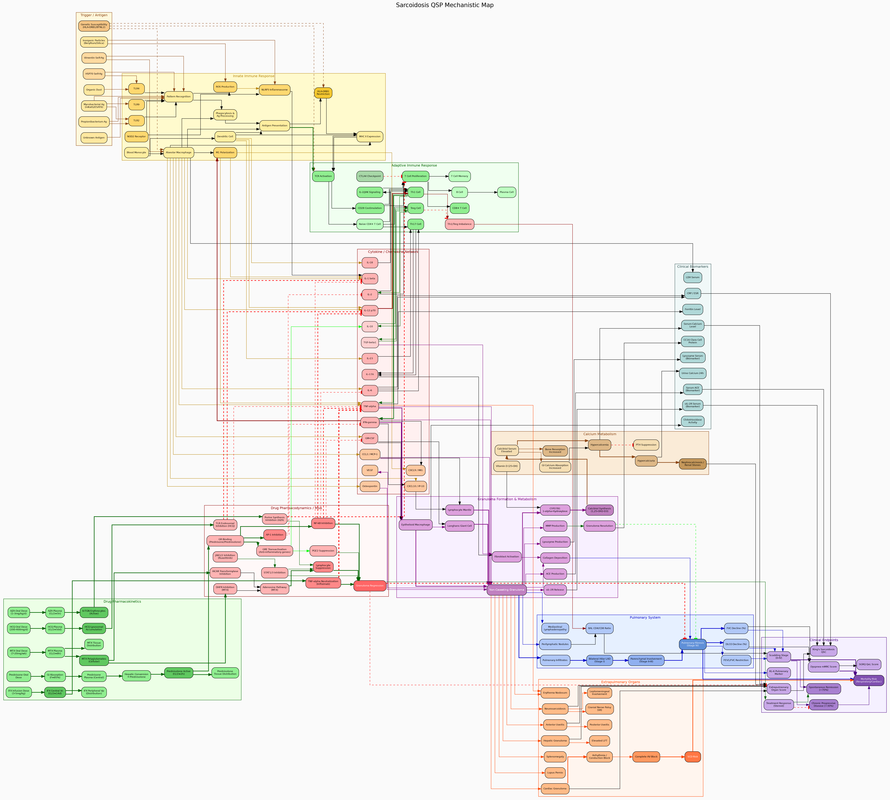</a> | Th1/IFN-γ 매개 비건락성 육아종(폐 우세 다장기). 스테로이드·메토트렉세이트·항TNF.<br>[🗺️ 지도](sarcoidosis/sarc_qsp_model.svg) · [⚙️ mrgsolve](sarcoidosis/sarc_mrgsolve_model.R) · [📚 문헌](sarcoidosis/sarc_references.md) · [📄 README](sarcoidosis/README.md) |
| 106 | 정신·신경 | [**조현병**<br><sub>Schizophrenia · SCH</sub>](schizophrenia/) | <a href="schizophrenia/sch_qsp_model.svg"></a> | 도파민/글루탐산/GABA/세로토닌 신경전달 이상. 항정신병약(D2 길항/부분작용).<br>[🗺️ 지도](schizophrenia/sch_qsp_model.svg) · [⚙️ mrgsolve](schizophrenia/sch_mrgsolve_model.R) · [📚 문헌](schizophrenia/sch_references.md) · [📄 README](schizophrenia/README.md) |
| 107 | 혈액 | [**겸상적혈구병**<br><sub>Sickle Cell Disease · SCD</sub>](sickle-cell-disease/) | <a href="sickle-cell-disease/scd_qsp_model.svg"></a> | HbS 중합·적혈구 겸상화·혈관폐색. 하이드록시유레아·복셀로토르·크리잔리주맙·L-글루타민.<br>[🗺️ 지도](sickle-cell-disease/scd_qsp_model.svg) · [⚙️ mrgsolve](sickle-cell-disease/scd_mrgsolve_model.R) · [📚 문헌](sickle-cell-disease/scd_references.md) · [📄 README](sickle-cell-disease/README.md) |
| 108 | 자가면역·류마티스 | [**쇼그렌 증후군**<br><sub>Sjögren's Syndrome · SS</sub>](sjogrens-syndrome/) | <a href="sjogrens-syndrome/ss_qsp_model.svg"></a> | 외분비선 림프구 침윤·I형 IFN에 의한 건조증. 대증치료·전신 면역조절.<br>[🗺️ 지도](sjogrens-syndrome/ss_qsp_model.svg) · [⚙️ mrgsolve](sjogrens-syndrome/ss_mrgsolve_model.R) · [📚 문헌](sjogrens-syndrome/ss_references.md) · [📄 README](sjogrens-syndrome/README.md) |
| 109 | 심혈관 | [**안정형 협심증**<br><sub>Stable Angina · SA</sub>](stable-angina/) | <a href="stable-angina/sa_qsp_model.svg"></a> | 죽상경화 관상동맥의 산소 수급 불균형. 항허혈제·항혈소판·스타틴.<br>[🗺️ 지도](stable-angina/sa_qsp_model.svg) · [⚙️ mrgsolve](stable-angina/sa_mrgsolve_model.R) · [📚 문헌](stable-angina/sa_references.md) · [📄 README](stable-angina/README.md) |
| 110 | 자가면역·류마티스 | [**전신 홍반 루푸스 (SLE)**<br><sub>Systemic Lupus Erythematosus · SLE</sub>](systemic-lupus-erythematosus/) | <a href="systemic-lupus-erythematosus/sle_qsp.svg"></a> | I형 IFN·항dsDNA 면역복합체에 의한 다장기 손상. 항말라리아·벨리무맙·아니프롤루맙.<br>[🗺️ 지도](systemic-lupus-erythematosus/sle_qsp.svg) · [⚙️ mrgsolve](systemic-lupus-erythematosus/sle_model.R) · [📚 문헌](systemic-lupus-erythematosus/sle_references.md) · [📄 README](systemic-lupus-erythematosus/README.md) |
| 111 | 자가면역·류마티스 | [**전신경화증**<br><sub>Systemic Sclerosis · SSc</sub>](systemic-sclerosis/) | <a href="systemic-sclerosis/ssc_qsp_model.svg"></a> | 혈관병증·자가면역·섬유화의 삼중 병태. 면역억제·항섬유화·혈관확장제.<br>[🗺️ 지도](systemic-sclerosis/ssc_qsp_model.svg) · [⚙️ mrgsolve](systemic-sclerosis/ssc_mrgsolve_model.R) · [📚 문헌](systemic-sclerosis/ssc_references.md) · [📄 README](systemic-sclerosis/README.md) |
| 112 | 혈관염 | [**다카야스 동맥염**<br><sub>Takayasu Arteritis · TA</sub>](takayasu-arteritis/) | <a href="takayasu-arteritis/ta_qsp_model.svg"></a> | 대동맥/주요 분지의 육아종성 대혈관염·협착. 스테로이드·토실리주맙.<br>[🗺️ 지도](takayasu-arteritis/ta_qsp_model.svg) · [⚙️ mrgsolve](takayasu-arteritis/ta_mrgsolve_model.R) · [📚 문헌](takayasu-arteritis/ta_references.md) · [📄 README](takayasu-arteritis/README.md) |
| 113 | 내분비·대사 | [**제1형 당뇨병**<br><sub>Type 1 Diabetes · T1DM</sub>](type1-diabetes/) | <a href="type1-diabetes/t1dm_qsp_model.svg"></a> | 자가면역 베타세포 파괴에 의한 인슐린 결핍. 인슐린 요법·테플리주맙(발병 지연).<br>[🗺️ 지도](type1-diabetes/t1dm_qsp_model.svg) · [⚙️ mrgsolve](type1-diabetes/t1dm_mrgsolve_model.R) · [📚 문헌](type1-diabetes/t1dm_references.md) · [📄 README](type1-diabetes/README.md) |
| 114 | 내분비·대사 | [**제2형 당뇨병**<br><sub>Type 2 Diabetes · T2DM</sub>](type2-diabetes/) | <a href="type2-diabetes/t2dm_qsp_model.svg">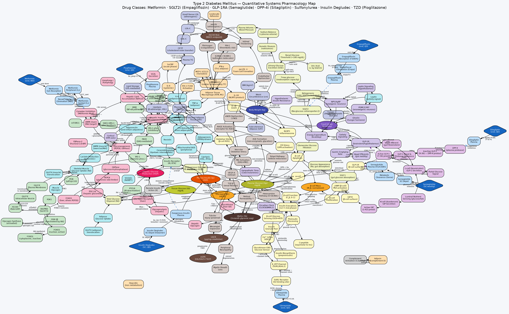</a> | 인슐린 저항성·베타세포 기능부전. 메트포르민·GLP-1·SGLT2i.<br>[🗺️ 지도](type2-diabetes/t2dm_qsp_model.svg) · [⚙️ mrgsolve](type2-diabetes/t2dm_mrgsolve_model.R) · [📚 문헌](type2-diabetes/t2dm_references.md) · [📄 README](type2-diabetes/README.md) |
| 115 | 소화기·간담도 | [**궤양성 대장염**<br><sub>Ulcerative Colitis · UC</sub>](ulcerative-colitis/) | <a href="ulcerative-colitis/uc_qsp_model.svg"></a> | 대장 점막의 Th2/장벽 염증. 5-ASA·항TNF·항인테그린·JAK 억제제.<br>[🗺️ 지도](ulcerative-colitis/uc_qsp_model.svg) · [⚙️ mrgsolve](ulcerative-colitis/uc_mrgsolve_model.R) · [📚 문헌](ulcerative-colitis/uc_references.md) · [📄 README](ulcerative-colitis/README.md) |
| 116 | 신장·비뇨 | [**요로결석 (만성 재발성)**<br><sub>Urolithiasis · URI</sub>](urolithiasis/) | <a href="urolithiasis/uri_qsp_model.svg">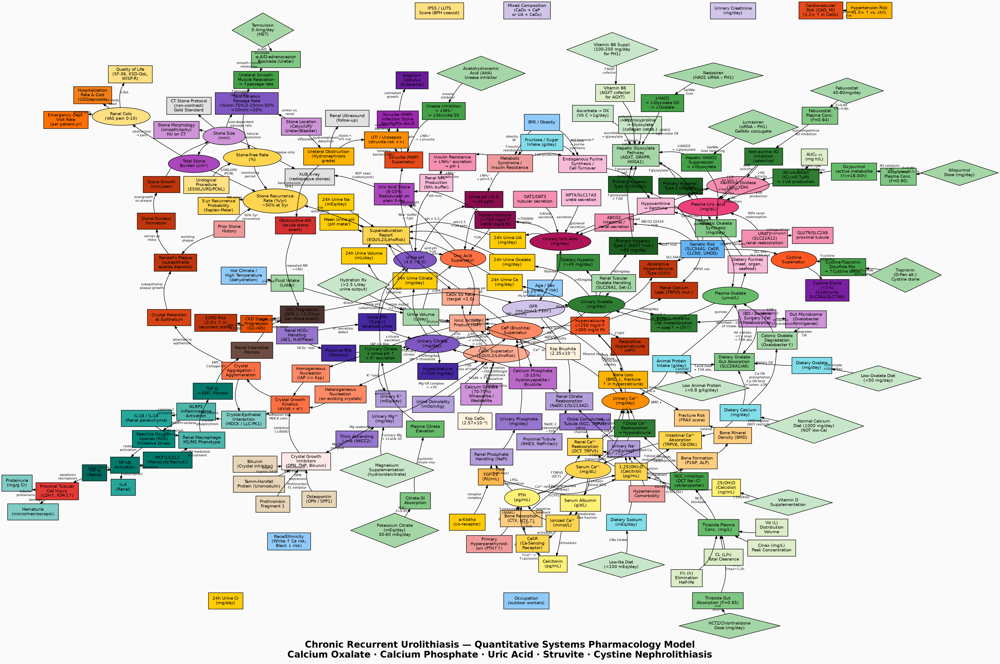</a> | 소변 과포화·결정화·Randall 플라크에 의한 결석. 티아지드·구연산칼륨·알로푸리놀.<br>[🗺️ 지도](urolithiasis/uri_qsp_model.svg) · [⚙️ mrgsolve](urolithiasis/uri_mrgsolve_model.R) · [📚 문헌](urolithiasis/uri_references.md) · [📄 README](urolithiasis/README.md) |
| 117 | 피부 | [**백반증**<br><sub>Vitiligo · VIT</sub>](vitiligo/) | <a href="vitiligo/vit_qsp_model.svg"></a> | CD8 T세포·IFN-γ-CXCL10 축에 의한 멜라닌세포 파괴. JAK 억제제(룩솔리티닙) 색소 재침착.<br>[🗺️ 지도](vitiligo/vit_qsp_model.svg) · [⚙️ mrgsolve](vitiligo/vit_mrgsolve_model.R) · [📚 문헌](vitiligo/vit_references.md) · [📄 README](vitiligo/README.md) |
| 118 | 종양·호흡기 | [**비소세포 폐암 (NSCLC)**<br><sub>Non-Small Cell Lung Cancer · NSCLC</sub>](non-small-cell-lung-cancer/) | <a href="non-small-cell-lung-cancer/nsclc_qsp_model.svg">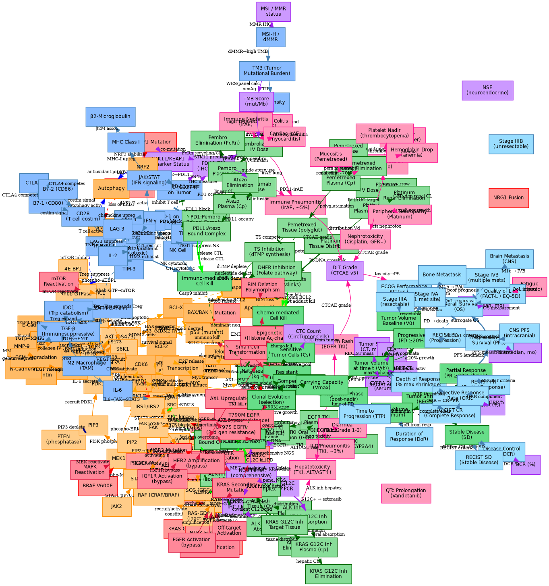</a> | EGFR/KRAS/ALK 드라이버 돌연변이 → oncogenic signaling. TKI(오시머티닙·알렉티닙·소토라십)·면역관문억제제(펨브롤리주맙)·항암화학요법 PK/PD. FLAURA·ALEX·KEYNOTE-189 보정.<br>[🗺️ 지도](non-small-cell-lung-cancer/nsclc_qsp_model.svg) · [⚙️ mrgsolve](non-small-cell-lung-cancer/nsclc_mrgsolve_model.R) · [📚 문헌](non-small-cell-lung-cancer/nsclc_references.md) · [📄 README](non-small-cell-lung-cancer/README.md) |
| 119 | 감염/간담도 | [**만성 C형 간염**<br><sub>Chronic Hepatitis C · CHC/HCV</sub>](chronic-hepatitis-c/) | <a href="chronic-hepatitis-c/HCV_qsp_model.svg"></a> | Perelson 표적세포 제한 바이러스 동역학(T/I/V ODE)에 DAA PK/PD 통합. SOF/LED·SOF/VEL·GLE/PIB·PEG-IFN/RBV 7개 시나리오. NS5B·NS5A·NS3 억제 효능(εp/εi), CTL 소진, 간섬유화(Metavir F-score), HCC 위험 모델링. ION·ASTRAL·ENDURANCE 임상시험 보정.<br>[🗺️ 지도](chronic-hepatitis-c/HCV_qsp_model.svg) · [⚙️ mrgsolve](chronic-hepatitis-c/HCV_mrgsolve_model.R) · [📚 문헌](chronic-hepatitis-c/HCV_references.md) · [📄 README](chronic-hepatitis-c/README.md) |
| 120 | 종양·간담도 | [**간세포암종 (HCC)**<br><sub>Hepatocellular Carcinoma · HCC</sub>](hepatocellular-carcinoma/) | <a href="hepatocellular-carcinoma/hcc_qsp_model.svg"></a> | HBV/HCV·NAFLD 기반 간암. RAS/RAF/MEK/ERK·PI3K/AKT/mTOR·Wnt/β-catenin·VEGF/혈관신생·종양면역 미세환경(PD-L1/CD8/Treg/TAM) 통합. 소라페닙·렌바티닙·아테조리주맙+베바시주맙(IMbrave150)·레고라페닙 PK/PD. 20구획 ODE, 5치료시나리오, AFP/간기능 바이오마커.<br>[🗺️ 지도](hepatocellular-carcinoma/hcc_qsp_model.svg) · [⚙️ mrgsolve](hepatocellular-carcinoma/hcc_mrgsolve_model.R) · [📊 Shiny](hepatocellular-carcinoma/hcc_shiny_app.R) · [📚 문헌](hepatocellular-carcinoma/hcc_references.md) · [📄 README](hepatocellular-carcinoma/README.md) |

| 121 | 신경계·유전 | [**헌팅턴병 (Huntington's Disease)**<br><sub>Huntington's Disease · HD</sub>](huntingtons-disease/) | <a href="huntingtons-disease/hd_qsp_model.svg"></a> | CAG 반복 확장(≥36) → mHTT 생성·집적 → 선조체 중간가시신경세포(MSN) 변성. mHTT 집적 폭포(단량체→올리고머→섬유)·BDNF-TrkB 결핍(REST/NRSF·HAP1 축)·흥분독성(eNMDAR/Ca²⁺/calpain)·미토콘드리아 기능부전(PGC-1α·Complex I/II/III)·신경염증(NLRP3/IL-1β)·아포토시스(Casp-3/6). VMAT2 억제제(TBZ·DTBZ·VBZ)·ASO(토미너센, CSF mHTT ↓74%)·스플라이싱 조절제(브라나플람·PTC518) PK/PD. 20구획 ODE, 7치료시나리오(TETRA-HD·FIRST-HD·KINECT-HD·GENERATION-HD1 임상 보정), UHDRS-TMS·TFC·cUHDRS·CAP score·CSF NfL/mHTT 바이오마커.<br>[🗺️ 지도](huntingtons-disease/hd_qsp_model.svg) · [⚙️ mrgsolve](huntingtons-disease/hd_mrgsolve_model.R) · [📊 Shiny](huntingtons-disease/hd_shiny_app.R) · [📚 문헌](huntingtons-disease/hd_references.md) · [📄 README](huntingtons-disease/README.md) |
| 122 | 종양·소화기 | [**대장암**<br><sub>Colorectal Cancer · CRC</sub>](colorectal-cancer/) | <a href="colorectal-cancer/crc_qsp_model.svg"></a> | APC/Wnt·KRAS/MAPK·PI3K/TP53 경로 통합, MSI-H/CMS 아형, 종양 미세환경(CD8/Treg/MDSC/TAM), 혈관신생(VEGF/VEGFR). 5-FU/옥살리플라틴/이리노테칸(UGT1A1)·베바시주맙(TMDD)·세툭시맙·펨브롤리주맙(MSI-H) PK/PD. 20구획 ODE, 7치료시나리오(MOSAIC·CRYSTAL·NO16966·TRIBE·KEYNOTE-177 임상 보정), CEA·ctDNA·VEGF·EGFR/PD-1 점유율 바이오마커.<br>[🗺️ 지도](colorectal-cancer/crc_qsp_model.svg) · [⚙️ mrgsolve](colorectal-cancer/crc_mrgsolve_model.R) · [📊 Shiny](colorectal-cancer/crc_shiny_app.R) · [📚 문헌](colorectal-cancer/crc_references.md) · [📄 README](colorectal-cancer/README.md) |
| 123 | 종양·비뇨기 | [**전립선암**<br><sub>Prostate Cancer · PC</sub>](prostate-cancer/) | <a href="prostate-cancer/pc_qsp_model.svg"></a> | HPG 축·AR 신호·PI3K/AKT·골전이(RANKL 악순환)와 CRPC/ARv7 내성. GnRH 제제·ARPI·도세탁셀·PARP 억제제·Lu-PSMA.<br>[🗺️ 지도](prostate-cancer/pc_qsp_model.svg) · [⚙️ mrgsolve](prostate-cancer/pc_mrgsolve_model.R) · [📚 문헌](prostate-cancer/pc_references.md) · [📄 README](prostate-cancer/README.md) |
| 124 | 종양·혈액 | [**급성 골수성 백혈병**<br><sub>Acute Myeloid Leukemia · AML</sub>](acute-myeloid-leukemia/) | <a href="acute-myeloid-leukemia/aml_qsp_model.svg"></a> | FLT3/NPM1/IDH/DNMT3A 돌연변이·BCL-2 패밀리·백혈병 줄기세포·골수 미세환경·후성유전학 이상. 베네토클락스(BCL-2)·아자시티딘·길테리티닙(FLT3)·에나시데닙(IDH2)·시타라빈 PK/PD. 21구획 ODE, Friberg 골수억제, 7치료 시나리오(VIALE-A·ADMIRAL·QuANTUM-R·RATIFY 임상 보정).<br>[🗺️ 지도](acute-myeloid-leukemia/aml_qsp_model.svg) · [⚙️ mrgsolve](acute-myeloid-leukemia/aml_mrgsolve_model.R) · [📊 Shiny](acute-myeloid-leukemia/aml_shiny_app.R) · [📚 문헌](acute-myeloid-leukemia/aml_references.md) · [📄 README](acute-myeloid-leukemia/README.md) |
| 125 | 종양·소화기 | [**위선암**<br><sub>Gastric Cancer · GC</sub>](gastric-cancer/) | <a href="gastric-cancer/gc_qsp_model.svg"></a> | H. pylori CagA/VacA·HER2/FGFR2/MET·VEGF 혈관신생·CLDN18.2·PD-L1/PD-1 면역관문·TCGA 아형(EBV/MSI-H/GS/CIN)·TME. 트라스투주맙(TMDD)·라무시루맙(VEGFR2)·니볼루맙(PD-1)·T-DXd(HER2 ADC)·졸베툭시맙(CLDN18.2 ADCC)·FLOT/FOLFOX PK/PD. 28구획 ODE, Simeoni TGI, 6치료 시나리오(ToGA·RAINBOW·CheckMate649·SPOTLIGHT·DESTINY-Gastric01·FLOT4 임상 보정), CEA/CA19-9/ctDNA 바이오마커.<br>[🗺️ 지도](gastric-cancer/gc_qsp_model.svg) · [⚙️ mrgsolve](gastric-cancer/gc_mrgsolve_model.R) · [📊 Shiny](gastric-cancer/gc_shiny_app.R) · [📚 문헌](gastric-cancer/gc_references.md) · [📄 README](gastric-cancer/README.md) |
| 126 | 종양·혈액 | [**골수섬유증**<br><sub>Myelofibrosis · MF</sub>](myelofibrosis/) | <a href="myelofibrosis/mf_qsp_model.svg"></a> | JAK2V617F/CALR/MPL 돌연변이·JAK/STAT3/5 신호·HSC 니치·골수 섬유화(TGF-β/PDGF/bFGF)·수외조혈(비장종대)·사이토카인 폭풍(IL-6/TNF-α)·혈전/출혈 위험. Ruxolitinib(2구획 PK)·Fedratinib·Pacritinib·Momelotinib·Pelabresib 병용 PK/PD. 23구획 ODE, 6치료 시나리오(COMFORT-I·JAKARTA·PERSIST-2·MANIFEST-2 임상 보정), SVR35/TSS50/VAF/pSTAT3·5 바이오마커.<br>[🗺️ 지도](myelofibrosis/mf_qsp_model.svg) · [⚙️ mrgsolve](myelofibrosis/mf_mrgsolve_model.R) · [📊 Shiny](myelofibrosis/mf_shiny_app.R) · [📚 문헌](myelofibrosis/mf_references.md) · [📄 README](myelofibrosis/README.md) |
| 127 | 종양·소화기 | [**췌장 선암**<br><sub>Pancreatic Ductal Adenocarcinoma · PDAC</sub>](pancreatic-cancer/) | <a href="pancreatic-cancer/pdac_qsp_model.svg"></a> | KRAS G12D/V/R(~95%)·TP53(~75%)·CDKN2A(~90%)·SMAD4(~55%) 드라이버 돌연변이, RAS/MAPK/PI3K/AKT/mTOR 신호, TGF-β/SMAD/EMT 축, 치밀 섬유화 기질(PSC·CAF·HA·IFP↑→약물침투↓), 고면역억제 TME(PD-L1·Treg·MDSC·TAM-M2), HIF-1α/VEGF 혈관신생, BRCA1/2/PALB2 HRD. 젬시타빈/nab-파클리탁셀·FOLFIRINOX/mFOLFIRINOX·KRAS G12D 억제제(MRTX1133)·올라파립 PK/PD. 264노드 10클러스터, 7치료 시나리오(MPACT·PRODIGE4·POLO 임상 보정), CA19-9·ctDNA·Friberg 골수억제 바이오마커.<br>[🗺️ 지도](pancreatic-cancer/pdac_qsp_model.svg) · [⚙️ mrgsolve](pancreatic-cancer/pdac_mrgsolve_model.R) · [📊 Shiny](pancreatic-cancer/pdac_shiny_app.R) · [📚 문헌](pancreatic-cancer/pdac_references.md) · [📄 README](pancreatic-cancer/README.md) |
| 128 | 종양·혈액 | [**골수이형성 증후군**<br><sub>Myelodysplastic Syndrome · MDS</sub>](myelodysplastic-syndrome/) | <a href="myelodysplastic-syndrome/mds_qsp_model.svg"></a> | CHIP→MDS 클론 진화; SF3B1/SRSF2/U2AF1/ZRSR2 스플라이싱 돌연변이(고리 철아세포 형성·ABCB7 소실); TET2/DNMT3A/IDH1·2/ASXL1/EZH2 후성유전학 이상; del(5q)→RPS14 반수부족·miR-145/146a 소실·TIRAP↑; TP53 복잡핵형; 골수 미세환경 (CXCL12·SCF·TPO·EPO·GCSF 니치); GDF11/TGF-β1 상승→비효율 적혈구생성; 헵시딘↑/철과부하. 아자시티딘(2구획 SC/IV PK)·데시타빈(IV/oral ASTX727)·레날리도마이드(CRBN→CK1α 분해→RPS14 복원)·루스파터셉트(ActRIIB-Fc TGF-β 포획→Smad2/3↓)·다르베포에틴·베네토클락스(BCL-2 BH3 모방체) PK/PD. 324노드 10클러스터, 18구획 ODE, 7치료 시나리오(COMMANDS·MEDALIST·MDS-003/004·ASTX727·VIALE-A 임상 보정), Hgb/PLT/ANC/수혈 의존성·GDF11·Hepcidin·IronStore·IPSS-R/IPSS-M 바이오마커.<br>[🗺️ 지도](myelodysplastic-syndrome/mds_qsp_model.svg) · [⚙️ mrgsolve](myelodysplastic-syndrome/mds_mrgsolve_model.R) · [📊 Shiny](myelodysplastic-syndrome/mds_shiny_app.R) · [📚 문헌](myelodysplastic-syndrome/mds_references.md) · [📄 README](myelodysplastic-syndrome/README.md) |
| 129 | 근골격·신경 | [**섬유근통**<br><sub>Fibromyalgia · FM</sub>](fibromyalgia/) | <a href="fibromyalgia/fm_qsp_model.svg"></a> | 중추감작(척수 WDR뉴런 LTP·wind-up·NMDA 수용체 탈억제); 하행성 통증조절계 결함(PAG-RVM-LC/Raphe 축, DPMS↓, DNIC 소실); 신경전달물질 불균형(CSF substance P↑·NE↓·5-HT↓); 신경염증(척수 미세아교세포 활성화·IL-1β/TNF-α·NLRP3 인플라마좀·KCC2↓→GABA 탈억제); HPA 축 이상(저코르티솔혈증·GH/IGF-1 결핍); 자율신경계 불균형(교감항진·HRV↓); 비회복성 수면(α파-δ파 침범·SWS↓); 섬유근통 뇌회로(ACC·섬엽·PFC 과활성화·기본모드네트워크). 둘록세틴(2구획 PK·SERT/NET IC50)·프레가발린(α2δ-1 Ca채널 차단·Emax 모델)·밀나시프란(SERT/NET)·아미트립틸린(H1 차단→수면 개선) PK/PD. 100+ 노드 10클러스터, **30구획 ODE**, 6치료 시나리오, Pain NRS·FIQR·CSF SP·미세아교세포·SWS·코르티솔·SNS tone 바이오마커.<br>[🗺️ 지도](fibromyalgia/fm_qsp_model.svg) · [⚙️ mrgsolve](fibromyalgia/fm_mrgsolve_model.R) · [📊 Shiny](fibromyalgia/fm_shiny_app.R) · [📚 문헌](fibromyalgia/fm_references.md) · [📄 README](fibromyalgia/README.md) |
| 130 | 혈액·응고 | [**혈우병 A**<br><sub>Hemophilia A · HA</sub>](hemophilia-a/) | <a href="hemophilia-a/ha_qsp_model.svg"></a> | X염색체 연관 FVIII 결핍(F8 유전자 돌연변이) → 내인성 Xase 복합체(FIXa·FVIIIa) 형성 불능 → 트롬빈 생성 급감 → 불안정 피브린 클롯. 중증(<1 IU/dL) ABR ~30/년; 억제항체(30% 중증) 발생으로 대체치료 실패. 에미시주맙(HAVEN 1/3/4: FIXa–FX 이중특이항체·FVIII 모방; ABR 1.5/년)·피투시란(ATLAS-INH: siRNA·항트롬빈 mRNA 녹다운·AT 감소→트롬빈↑; ABR ~0)·마스타시맙(항TFPI·외인성경로 증폭)·유전자치료(AAV5-FVIII·valoctocogene roxaparvovec). SHL/EHL FVIII PK(2구획)·에미시주맙 SC PK(3구획·t½ 4–5주)·피투시란 PK/AT 간접반응 모델(mRNA/단백질 2단계 녹다운). **167 노드 10클러스터**, **16구획 ODE**, **7 치료 시나리오**(무예방·SHL-FVIII 3×/wk·EHL Q3-4d·에미시주맙 Q1W/Q4W·피투시란 Q1M·FVIII+에미시주맙 병용), ETP·ABR·Pettersson 관절점수·QoL·억제항체 역가 바이오마커. 55개 PubMed 인용(Manco-Johnson 2007·HAVEN·ATLAS·A-LONG·HOPE-B·WFH Guidelines 포함).<br>[🗺️ 지도](hemophilia-a/ha_qsp_model.svg) · [⚙️ mrgsolve](hemophilia-a/ha_mrgsolve_model.R) · [📊 Shiny](hemophilia-a/ha_shiny_app.R) · [📚 문헌](hemophilia-a/ha_references.md) · [📄 README](hemophilia-a/README.md) |
| 131 | 혈액·종양 | [**만성 림프구성 백혈병**<br><sub>Chronic Lymphocytic Leukemia · CLL</sub>](chronic-lymphocytic-leukemia/) | <a href="chronic-lymphocytic-leukemia/cll_qsp_model.svg"></a> | CD19⁺CD5⁺CD23⁺ 단클론 B세포 축적(서구권 성인 가장 흔한 백혈병). BCR 자율 신호전달(IGHV 비변이형·항원 자극)→LYN/SYK/BTK/PLCγ2→NF-κB/PI3Kδ/MAPK 경로 활성화; BCL-2 과발현(del13q→miR-15a/16-1 소실); 미세환경 의존(CXCL12/CXCR4 골수 억류·CXCL13/CXCR5 림프절 귀소·CD40L·BAFF·IL-4·NK 억제). CLL-IPI 예후(del(17p)/TP53·del(11q)/ATM·IGHV·β2M·임상병기). 이브루티닙(BTK Cys481 공유결합·420mg QD·RESONATE-2: ORR 86%·2yr PFS 74%)·아칼라브루티닙·자누브루티닙(선택성↑); 베네토클락스(BCL-2 BH3 모방·Ki~0.01nM·CLL14: uMRD 76%·2yr PFS 88%)·오비누투주맙(Type II 항CD20·ADCC↑·CDC↓·PCD). **146 노드 10클러스터**, **18구획 ODE**(이브루티닙 1구획·BTK 공유결합 모델·베네토클락스 2구획·BCL-2 준정상상태·오비누투주맙 TMDD·ALC/BM/LN 질환 구획·MCL-1 내성·NK 활성), **6치료 시나리오**(이브루티닙·베네토클락스·오비누투주맙·VEN+OBI CLL14·IB+VEN·삼중 병용). RESONATE-2·CLL14·MURANO·SEQUOIA·ALPINE 보정. 44개 PubMed 인용.<br>[🗺️ 지도](chronic-lymphocytic-leukemia/cll_qsp_model.svg) · [⚙️ mrgsolve](chronic-lymphocytic-leukemia/cll_mrgsolve_model.R) · [📊 Shiny](chronic-lymphocytic-leukemia/cll_shiny_app.R) · [📚 문헌](chronic-lymphocytic-leukemia/cll_references.md) · [📄 README](chronic-lymphocytic-leukemia/README.md) |
| 133 | 신경근육 | [**척수성 근위축증 (SMA)**<br><sub>Spinal Muscular Atrophy · SMA</sub>](spinal-muscular-atrophy/) | <a href="spinal-muscular-atrophy/sma_qsp_model.svg"></a> | *SMN1* 5q13.2 결손→SMN 단백질 소실→알파 운동신경세포 진행성 사멸·NMJ 미성숙·신경원성 근위축. SMN2 대체 스플라이싱(엑손7 포함율 10%→90%)·SMN 단백질 역치·MN pool·NMJ 성숙도·근육량 ODE. 누시너센(IT ASO·ISS-N1 차단)·리스디플람(경구 스플라이싱 조절제)·오나셈노진(AAV9 유전자치료) 3종 PK/PD. **130+ 노드 12클러스터**, **20구획 ODE**, **6치료 시나리오**(ENDEAR·CHERISH·FIREFISH·SPR1NT 임상 보정). CHOP-INTEND·HFMSE·CMAP·FVC·혈청 NF-L 바이오마커. 50개 PubMed 인용.<br>[🗺️ 지도](spinal-muscular-atrophy/sma_qsp_model.svg) · [⚙️ mrgsolve](spinal-muscular-atrophy/sma_mrgsolve_model.R) · [📊 Shiny](spinal-muscular-atrophy/sma_shiny_app.R) · [📚 문헌](spinal-muscular-atrophy/sma_references.md) · [📄 README](spinal-muscular-atrophy/README.md) |
| 132 | 혈액·응고 | [**정맥 혈전색전증 (DVT/PE)**<br><sub>Venous Thromboembolism · VTE</sub>](venous-thromboembolism/) | <a href="venous-thromboembolism/vte_qsp_model.svg"></a> | 심부정맥 혈전증(DVT)과 폐색전증(PE)을 통합한 QSP 모델. Virchow's Triad(혈류정체·내피 손상·과응고), 외인성 경로(TF-FVIIa-TFPI), 내인성 경로(접촉활성화-FXIIa-FIXa-FVIIIa), 공통 경로(Prothrombinase-트롬빈-피브린 가교), 혈소판 활성화(GPIb/GPVI/PAR1/4·GPIIb/IIIa), 자연 항응고(AT-III·단백C/S·TFPI), 섬유용해(tPA/uPA·플라스민·PAI-1·TAFI·D-이량체). 리바록사반(2구획 PK·FXa EC50=12 ng/mL)·아픽사반(EC50=5 ng/mL)·다비가트란(직접트롬빈억제·EC50=35 ng/mL)·와파린(VK 사이클 간접반응·FVII/FX/FII 풀 반감기)·에녹사파린(AT-III 활성화·항Xa) 5종 약물 PK/PD. **140+ 노드 12클러스터**, **19구획 ODE**(PK 7·FXa/FIIa·피브린·혈전크기·플라스민·D-이량체·VK산화/환원·FVII/FX/FII풀), **6치료 시나리오**(DVT:리바록사반 15→20mg·PE:아픽사반 10→5mg BID·와파린+LMWH 브리지·수술예방:에녹사파린 40mg QD·확장예방:리바록사반 10mg QD·신부전:다비가트란 110mg BID GFR30 vs 90). EINSTEIN/AMPLIFY/RE-COVER/ROCKET-AF/Mueck 2011/Frost 2015 임상 파라미터 보정. INR·Anti-Xa·aPTT·D-이량체·혈전잔여% 바이오마커. Wells 점수(DVT/PE) 사전확률 계산기, 금기사항별 약물 추천 로직. 57개 PubMed 인용.<br>[🗺️ 지도](venous-thromboembolism/vte_qsp_model.svg) · [⚙️ mrgsolve](venous-thromboembolism/vte_mrgsolve_model.R) · [📊 Shiny](venous-thromboembolism/vte_shiny_app.R) · [📚 문헌](venous-thromboembolism/vte_references.md) · [📄 README](venous-thromboembolism/README.md) |
| 134 | 소아 혈관염 | [**가와사키병**<br><sub>Kawasaki Disease · KD</sub>](kawasaki-disease/) | <a href="kawasaki-disease/kd_qsp_model.svg"></a> | 원인 불명 트리거 → TLR/NLR 선천 면역 활성화 → NLRP3 인플라마좀(Caspase-1·IL-1β 성숙) → 사이토카인 폭풍(IL-1β·IL-6·TNF-α) → 혈관 내피 활성화(VCAM-1·ICAM-1·TF↑) → 관상동맥 중막 파괴·동맥류(AHA Z-점수 분류: small z≥2.5, medium z≥5, giant z≥10) → 혈소판 증가증(2주 피크) → 혈전위험. IVIG 2 g/kg(2구획+FcRn 재순환·Emax NF-κB 억제)·고용량 아스피린→저용량(COX-1/2 비가역)·메틸프레드니솔론(NF-κB 억제·GR 경로)·인플릭시맙 5 mg/kg(TNF-α 중화·n=1.8)·아나킨라 4 mg/kg/day(IL-1R 경쟁차단) 5종 PK/PD. **134 노드 14클러스터**, **21구획 ODE**(PK 11·IL1β·IL6·TNFα·대식세포·내피세포·발열·CRP·혈소판·관상동맥 Z-점수), **5치료 시나리오**(S1 표준IVIG·S2 고위험+스테로이드·S3 IVIG저항-2차IVIG·S4 인플릭시맙구제·S5 아나킨라구제). Kobayashi/Egami 위험점수 계산기·관상동맥 Z-점수 추적·IVIG 저항성 확률 모델. McCrindle/Kobayashi/KIDCARE Trial 보정. 60개 PubMed 인용.<br>[🗺️ 지도](kawasaki-disease/kd_qsp_model.svg) · [⚙️ mrgsolve](kawasaki-disease/kd_mrgsolve_model.R) · [📊 Shiny](kawasaki-disease/kd_shiny_app.R) · [📚 문헌](kawasaki-disease/kd_references.md) · [📄 README](kawasaki-disease/README.md) |
| 135 | 내분비·대사 | [**쿠싱 증후군**<br><sub>Cushing's Syndrome · CS</sub>](cushings-syndrome/) | <a href="cushings-syndrome/cs_qsp_model.svg"></a> | 뇌하수체 ACTH 선종(쿠싱병 70%)·이소성 ACTH(10%)·부신 선종(15%) 등에 의한 만성 고코르티솔혈증. 시상하부 일주기 CRH 리듬·CRHR1-PKA-CREB-POMC-ACTH 경로; USP8 탈유비퀴틴화(~50% 쿠싱병)·CDK4/6 세포증식; CYP11A1→CYP17A1→CYP21A2→CYP11B1 스테로이드 생합성; GR-α/HSP90/FKBP51·핵이동·GRE/nGRE·AP1/NF-κB 접촉억제·GILZ·SGK1; PEPCK/G6Pase↑·인슐린저항성·내장지방·근육위축·골다공증(RANKL↑/OPG↓)·RAAS 고혈압. **140+ 노드 13클러스터**, **21구획 ODE**(HPA 3+부신코르티솔 2+GR 3+대사 6+임상출력 1+약물PK 6), **6치료 시나리오**(자연경과·파시레오티드 0.6mg BID·케토코나졸 400mg BID·오실로드로스탯 5mg BID·미페프리스톤 600mg QD·수술 후 관해). PASPORT-CUSHINGS(Colao 2012 NEJM)·LINC 3/4(Feelders 2019/Pivonello 2020)·SEISMIC(Fleseriu 2012 JCEM) 임상 보정. UFC·LNSC·1mg DST·덱사메타손억제검사·BMD·HDRS-17. 8탭 Shiny 대시보드(환자프로파일·HPA/PK·스테로이드생합성·임상지표·시나리오비교·바이오마커·대사합병증·가상집단). 55개 PubMed 인용.<br>[🗺️ 지도](cushings-syndrome/cs_qsp_model.svg) · [⚙️ mrgsolve](cushings-syndrome/cs_mrgsolve_model.R) · [📊 Shiny](cushings-syndrome/cs_shiny_app.R) · [📚 문헌](cushings-syndrome/cs_references.md) · [📄 README](cushings-syndrome/README.md) |
| 136 | 희귀·유전질환 | [**유전성 혈관부종**<br><sub>Hereditary Angioedema · HAE</sub>](hereditary-angioedema/) | <a href="hereditary-angioedema/hae_qsp_model.svg"></a> | *SERPING1* 돌연변이 → C1-INH 결핍/기능이상(Type I/II) 또는 *F12* Thr328Lys 이득기능돌연변이(Type III) → 칼리크레인-키닌계(KKS) 무제한 활성화 → 브라디키닌(BK) 과잉 → B2R-Gq/IP3/Ca²⁺/eNOS/NO 경로 → VE-cadherin 소실·혈장삼출 → 피하/후두 혈관부종. FXII→FXIIa 접촉활성화, FXIIa→Prekal→Kal→HMWK 절단, BK→B2R/B1R 이중수용체 신호, C1-INH:FXIIa/Kal 복합체, 보체C4 소진, IL-1β·B1R 상향조절 염증 증폭. 이카티반트(B2R Ki=0.47nM)·C1-INH IV(Berinert 20 IU/kg)·에칼란티드·재조합 C1-INH 급성치료; 베로트랄스탓(IC50=3.7nM 칼리크레인 경구)·라나델루맙(KD<100pM prekallikrein SC)·C1-INH SC(Haegarda 60IU/kg 2×/wk) 예방치료. **120+ 노드 12클러스터**, **20구획 ODE**(PK 11+생물학적 9), **6치료 시나리오**(무치료·이카티반트·C1-INH IV·베로트랄스탓·라나델루맙·C1-INH SC). FAST-1/3(Cicardi 2010·Lumry 2011)·HELP OLE(Banerji 2020 87% 감소)·BELO(Farkas 2020 44% 감소)·CONFIDENT(Craig 2017 95% 감소) 보정. BK 농도·B2R 점유율·VP 지수·부종점수·C4·C1-INH% 바이오마커. 58개 PubMed 인용.<br>[🗺️ 지도](hereditary-angioedema/hae_qsp_model.svg) · [⚙️ mrgsolve](hereditary-angioedema/hae_mrgsolve_model.R) · [📊 Shiny](hereditary-angioedema/hae_shiny_app.R) · [📚 문헌](hereditary-angioedema/hae_references.md) · [📄 README](hereditary-angioedema/README.md) |
| 137 | 희귀·유전질환 | [**파브리병**<br><sub>Fabry Disease · FBR</sub>](fabry-disease/) | <a href="fabry-disease/fbr_qsp_model.svg"></a> | X-연관 리소소말 저장 질환. *GLA* 변이 → α-갈락토시다제 A(α-Gal A) 결핍 → 글로보트리아오실세라미드(Gb3)·lyso-Gb3 조직축적 → 신세뇨관·심근·신경·혈관내피 손상. Gb3 합성(UGCG·B4GALT5)·M6PR/리소솜 가수분해·GCS 억제(SRT). 신장(eGFR↓·UPCR↑·FSGS)·심장(LVH·HCM→DCM·부정맥)·신경(신경병성 통증·뇌졸중)·피부(혈관각화종) 다장기 병증. 아갈시다제 베타(1 mg/kg Q2W·ERT 표준)·아갈시다제 알파(0.2 mg/kg Q2W)·페구니알시다제 알파(1 mg/kg Q4W)·미갈라스타트(150 mg QOD·적합 변이 전용 경구 샤페론)·루세라스탓(1000 mg TID·GCS억제제 SRT) 5종 PK/PD. **138 노드 14클러스터**, **22구획 ODE**, **6치료 시나리오**(자연경과·아갈시다제 베타·알파·미갈라스타트·페구니알시다제 알파·ERT+루세라스탓). FABRY-001(Eng 2001 NEJM)·ATTRACT(Germain 2016 NEJM)·BRIGHT(Schiffmann 2021 JAMA)·MODIFY(Lenders 2022) 보정. eGFR·UPCR·LVMi·lyso-Gb3·통증 바이오마커. 60개 PubMed 인용.<br>[🗺️ 지도](fabry-disease/fbr_qsp_model.svg) · [⚙️ mrgsolve](fabry-disease/fbr_mrgsolve_model.R) · [📊 Shiny](fabry-disease/fbr_shiny_app.R) · [📚 문헌](fabry-disease/fbr_references.md) · [📄 README](fabry-disease/README.md) |
| 138 | 심혈관 | [**심근염**<br><sub>Myocarditis · MYO</sub>](myocarditis/) | <a href="myocarditis/myo_qsp_model.svg"></a> | 바이러스(CVB3·SARS-CoV-2·아데노바이러스·HHV-6) 심근세포 감염 → CAR/ACE2 수용체 진입 → 바이러스 복제·TLR3/7/9·RIG-I·MDA5·cGAS-STING 선천면역 활성화 → NF-κB·IRF3/7·NLRP3 인플라마좀 → IFN-α/β/γ·TNF-α·IL-1β·IL-6 사이토카인 폭풍 → NK세포·M1대식세포 심근 손상. CD4+ Th1/Th17 및 CD8+ CTL 적응 면역; 분자 유사성(molecular mimicry) → 항심근미오신·항β1-AR·항ANT·항TnI 자가항체 → ADCC·보체 활성화. TGF-β→근섬유아세포→콜라겐 침착→LV 확장·DCM. IVIG 2g/kg(IV 주입·2구획 PK·t½=21일·Fc-R 차단)·프레드니솔론(경구 F=80%·t½=2-3h·GR 억제)·아자티오프린→6-MP(전구약물 F=47%·HPRT/TPMT경로)·사이클로스포린(F=35%·칼시뉴린억제·t½=8-12h)·콜히친(F=45%·NLRP3/튜불린억제·Vd=250 L/kg) 5종 PK/PD. **170+ 노드 10클러스터**, **35구획 ODE**(심근세포 3+바이러스 1+선천면역 3+사이토카인 7+적응면역 9+섬유화 3+바이오마커 3+약물PK 6), **5치료 시나리오**(자연경과·IVIG 단독·프레드니솔론+아자티오프린 TIMIC·IVIG+Pred+Aza+CsA 거대세포·IVIG+콜히친). TIMIC(Frustaci 2009)·IMAC-2(McNamara 2001)·Cooper 2007 거대세포 프로토콜 보정. 트로포닌 I·BNP·LVEF·CMR-LGE·부정맥 위험 바이오마커. 7탭 Shiny 대시보드. 60개 PubMed 인용.<br>[🗺️ 지도](myocarditis/myo_qsp_model.svg) · [⚙️ mrgsolve](myocarditis/myo_mrgsolve_model.R) · [📊 Shiny](myocarditis/myo_shiny_app.R) · [📚 문헌](myocarditis/myo_references.md) · [📄 README](myocarditis/README.md) |
| 139 | 희귀·유전질환 | [**고셔병**<br><sub>Gaucher Disease · GCD</sub>](gaucher-disease/) | <a href="gaucher-disease/gcd_qsp_model.svg">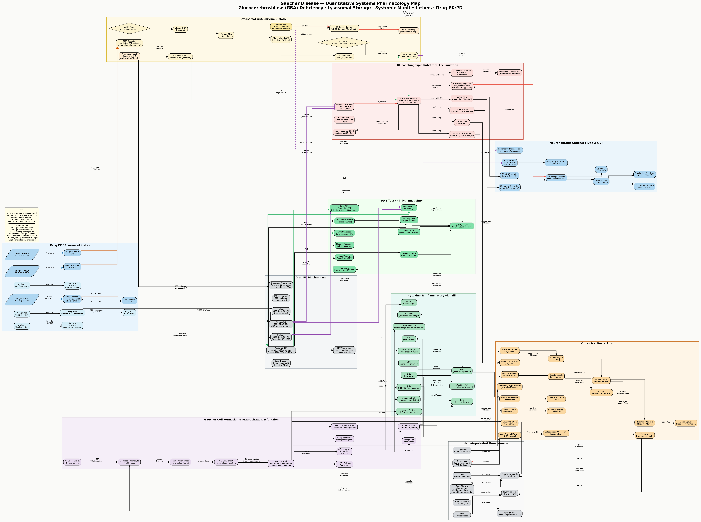</a> | *GBA1* 이중대립변이 → 리소솜 β-글루코세레브로시다제(GBA) 결핍 → 글루코세레브로사이드(GC) 및 고독성 탈아실화 유도체 lyso-GL1 조직대식세포 축적 → 고셔세포 형성. GBA합성(ER→Golgi·M6P수용체·ERAD)·GCS 기질합성·M6P수용체 매개 ERT 리소솜 전달; GC→비장/간/골수/CNS 구획 이동; NF-κB→IL-1β·IL-6·TNF-α·MIP-1α·RANKL; 비장비대·간비대·빈혈·혈소판감소·골밀도감소. GBA-파킨슨 연계(α-시누클레인 축적). 이미글루세라제(60U/kg Q2W·2구획·CL=1.4L/h/kg·EMAX=85%)·벨라글루세라제α; 엘리글루스타트(84mg BID·GCS IC50=10nM·CYP2D6·EM/PM)·미글루스타트(IC50=50μM); 암브록솔(샤페론). **115+ 노드 10클러스터**, **26구획 ODE**(약물PK 8+효소/기질 5+바이오마커 4+장기용적 2+혈액 2+골 3+염증 2), **6치료 시나리오**(자연경과·이미글루세라제·벨라글루세라제α·엘리글루스타트EM·엘리글루스타트PM·저용량ERT+엘리글루스타트). Barton 1991 NEJM·Mistry 2015 JAMA·Zimran 2010 Blood·Balwani 2021 AJH 보정. GL-1·lyso-GL1·키토트리오시다제·페리틴·SV·LV·Hb·PLT·BMD 바이오마커. 9탭 Shiny 대시보드. 62개 PubMed 인용.<br>[🗺️ 지도](gaucher-disease/gcd_qsp_model.svg) · [⚙️ mrgsolve](gaucher-disease/gcd_mrgsolve_model.R) · [📊 Shiny](gaucher-disease/gcd_shiny_app.R) · [📚 문헌](gaucher-disease/gcd_references.md) · [📄 README](gaucher-disease/README.md) |
| 140 | 내분비·대사 | [**원발성 알도스테론증**<br><sub>Primary Aldosteronism · PA</sub>](primary-aldosteronism/) | <a href="primary-aldosteronism/pa_qsp_model.svg"></a> | **Conn 증후군** — 부신 피질에서의 자율적 알도스테론 과분비(APA·BAH) → 레닌 억제·ARR 상승·Na⁺ 저류·K⁺ 소실·대사성 알칼리증. KCNJ5/CACNA1D/ATP1A1/ATP2B3 체성 돌연변이 → Ca²⁺ 내유 → CYP11B2(알도스테론 합성효소) 과발현 → 자율적 알도스테론 생성; RAAS 캐스케이드(레닌→AngI→AngII→알도스테론) + APA 자율분비. MR→SGK1→Nedd4-2 인산화 → ENaC 세포표면 발현↑ → Na⁺ 재흡수·ROMK K⁺ 분비·H⁺ 분비 → 저칼륨혈증·대사성 알칼리증. 부피팽창→MAP↑, 심근/혈관 MR 직접 활성→심근섬유화·LVH. 진단: ARR(≥30)·PAC(>15 ng/dL)·부신정맥 채혈(AVS). 복강경 부신절제술(APA 단측); 스피로노락톤(IC50=1.2 μg/L·활성대사체 카렌오논 t½≈20h)·에플레레논(IC50=2.5 μg/L)·파이네레논(IC50=0.65 μg/L·비스테로이드성·심장보호 우월) MR 길항; ACEi·CCB 병용. **120+ 노드 10클러스터**, **23구획 ODE**(약물PK 6+RAAS 3+신장/이온 5+심혈관 2+신기능 1+장기손상 2+부신 2+바이오마커 2), **8치료 시나리오**(무치료 APA 2년 진행·부신절제술·스피로노락톤 100mg·에플레레논 100mg·파이네레논 20mg·스피로+암로디핀·정상 대조·ACEi). Choi 2011 Science(KCNJ5)·Rossi 2006 JACC·Milliez 2005 JACC·Pitt 1999 NEJM(RALES)·Bakris 2020 NEJM(FIDELIO) 보정. ARR·PAC·PRA·K⁺·HCO₃⁻·MAP·LVMi·심근섬유화·GFR·HOMA proxy 바이오마커. 7탭 Shiny 대시보드(환자프로파일·RAAS/PK·알도스테론 패널·이온 항상성·심혈관/장기손상·시나리오 비교·바이오마커 탐색기). 48개 PubMed 인용.<br>[🗺️ 지도](primary-aldosteronism/pa_qsp_model.svg) · [⚙️ mrgsolve](primary-aldosteronism/pa_mrgsolve_model.R) · [📊 Shiny](primary-aldosteronism/pa_shiny_app.R) · [📚 문헌](primary-aldosteronism/pa_references.md) · [📄 README](primary-aldosteronism/README.md) |
| 141 | 희귀·유전질환 | [**트랜스티레틴 아밀로이드증**<br><sub>Transthyretin Amyloidosis · ATTR</sub>](transthyretin-amyloidosis/) | <a href="transthyretin-amyloidosis/attr_qsp_model.svg"></a> | 간 헤파토사이트 분비 TTR 사량체 해리(rate-limiting) → 잘못 접힌 단량체 → 독성 올리고머 → 아밀로이드 섬유 → 심장(ATTRwt: 간질 침착·LV 비후·HFpEF→HFrEF) / 말초신경(ATTRv: 길이 의존적 축삭 퇴화·자율신경 기능부전) 다장기 손상. ATTRv 변이(V30M·T60A·V122I) 구조 불안정화; 세포독성 올리고머 → NLRP3 인플라마좀·IL-1β·TNF-α → 심근세포 아포토시스; TGF-β → 심장 섬유화; SAP·GAG 섬유 안정화; 프로테오스타시스(HSP70/UPS/자가포식) 실패. 타파미디스(61mg PO QD·T4 결합부위 점유·사량체 안정화 Emax=80%·EC50=0.8μg/mL·ATTR-ACT CV사망+입원 30%↓)·아코라미디스(800mg BID·고선택 안정제·ATTRiBUTE-CM); 파티시란(0.3mg/kg IV Q3W·LNP-ApoE-LDLR-Ago2-RISC·mRNA 80%↓·APOLLO mNIS+7 34점 차이)·부트리시란(25mg SC Q3M·GalNAc-ASGR1·83%↓·HELIOS-A NIS 17점 개선); 이노테르센(300mg SC QW·2'-MOE ASO·RNaseH1·72%↓·NEURO-TTR mNIS+7 19점 차이)·엡론테르센(45mg SC QM·GalNAc-ASO). **116 노드 10클러스터**, **25구획 ODE**(약물PK 9+TTR 경로 4+조직 섬유 3+심장 PD 4+신경 PD 3+신장 1+증상 1), **7치료 시나리오**(ATTRwt 자연경과·ATTRv 자연경과·타파미디스·파티시란·부트리시란·이노테르센·타파미디스+부트리시란 병용). ⁹⁹ᵐTc-PYP/CMR LGE-ECV·NT-proBNP·hsTnT·LVEF·NIS·mBMI·eGFR 바이오마커. 8탭 Shiny 대시보드. 60개 PubMed 인용 (11섹션).<br>[🗺️ 지도](transthyretin-amyloidosis/attr_qsp_model.svg) · [⚙️ mrgsolve](transthyretin-amyloidosis/attr_mrgsolve_model.R) · [📊 Shiny](transthyretin-amyloidosis/attr_shiny_app.R) · [📚 문헌](transthyretin-amyloidosis/attr_references.md) · [📄 README](transthyretin-amyloidosis/README.md) |
| 143 | 피부·자가면역 | [**화농성 한선염**<br><sub>Hidradenitis Suppurativa · HS</sub>](hidradenitis-suppurativa/) | <a href="hidradenitis-suppurativa/hs_qsp_model.svg"></a> | **모낭 파열 → 복합 면역 활성화 → 만성 피부 염증** — γ-Secretase 결함(NCSTN/PSEN1/2 변이)·과각화증·모낭 폐쇄 → 피지모낭단위 파열 → NLRP3 인플라마좀(IL-1β)·TLR2/4 NF-κB(TNF-α·IL-6)·Th17(IL-17A/F) 복합 활성화. S. aureus/혐기균 바이오필름·마이크로비옴 불균형이 염증 증폭. TGF-β → 근섬유아세포 → 콜라겐 침착 → 누공·흉터. 안드로겐(DHT)·비만(인슐린저항성·아디포카인·mTOR) 호르몬 대사 인자 포함. 아달리무맙(PIONEER I/II·TNF 억제)·세쿠키누맙(SUNSHINE/SUNRISE·IL-17A)·비메키주맙(BE HEARD I/II·IL-17A/F) 완전 PK/PD 모델링. HiSCR(AN 50% 감소), IHS4, Hurley 병기, DLQI, VAS 통증 임상 엔드포인트. **160+ 노드 10클러스터**, **20구획 ODE**(PK 6+사이토카인 5+세포 3+임상엔드포인트 3+기타), **5치료 시나리오**(무치료·아달리무맙·세쿠키누맙·비메키주맙·병용). 6탭 Shiny(환자프로파일·약물PK·사이토카인PD·임상엔드포인트·시나리오비교·바이오마커/가상환자). 37개 PubMed 인용(11섹션).<br>[🗺️ 지도](hidradenitis-suppurativa/hs_qsp_model.svg) · [⚙️ mrgsolve](hidradenitis-suppurativa/hs_mrgsolve_model.R) · [📊 Shiny](hidradenitis-suppurativa/hs_shiny_app.R) · [📚 문헌](hidradenitis-suppurativa/hs_references.md) · [📄 README](hidradenitis-suppurativa/README.md) |
| 142 | 희귀·유전질환 | [**윌슨병**<br><sub>Wilson's Disease · WD</sub>](wilsons-disease/) | <a href="wilsons-disease/wd_qsp_model.svg"></a> | **ATP7B 기능 소실 → 구리 대사 장애** — *ATP7B*(P형 Cu-ATPase) 돌연변이(p.His1069Gln 유럽 35%·p.Arg778Leu 아시아 20%)로 담즙 구리 배출↓·아포세룰로플라스민 구리 적재 실패 → 간세포 구리 축적(>250 μg/g dw) → MT 포화 → NCBC(Non-Ceruloplasmin Bound Copper) 급증 → 전신 독성. 간: Fenton 반응(Cu¹⁺+H₂O₂→OH•) → ROS 급증 → 미토콘드리아 기능이상·지질 과산화·Kupffer 활성화 → TNF-α/IL-6/TGF-β → 간성상세포(HSC) 활성 → 콜라겐 침착 → Metavir F0→F4 섬유화 → 간경변 → 급성 간부전(ALF-WD, Coombs음성 용혈동반). 뇌: NCBC → BBB 통과 → 기저핵(피각·흑질) 선택적 구리 축적 → 도파민신경 손상 → 진전·근긴장이상증·구음장애; NMDA 수용체 Cu²⁺ 조절 이상 → 정신증·우울증; UWDRS 점수; MRI 'giant panda face'. 각막: Descemet막 Cu → Kayser-Fleischer Ring(KF, 신경형 95%). 신장: 근위세뇨관 Cu 독성 → Fanconi 증후군(아미노산뇨·인뇨). D-페니실라민(F=55%·t½=1.7h·Cu 킬레이션·요중 배설 ↑·신경악화 역설 ~50%); Zinc 아세테이트(50mg TID·장관 MT 유도→Cu 흡수 차단·유지/임신 선호); 트리엔틴(TETA·DPA 부작용 2nd-line); **ALXN1840(TTM·bis-choline TTM·15mg QD·TTM-Cu-Albumin 삼중복합체·분변 배설·NCBC↓98%·ATLAS 2022 NEJM)**. **119 노드 11클러스터**, **24구획 ODE**(약물PK 8+구리동역학 7+장기분포 3+간병태 3+신경퇴행 1+기타 2), **8치료 시나리오**(무치료·DPA 500mg TID·Zinc 50mg TID·Trientine·ALXN1840·DPA→Zinc 전환·ALXN1840+Trientine 병용·정상 WT 대조). Leipzig 점수·NCBC·Cp·24h 요중 Cu·간 Cu·ALT·섬유화·UWDRS·KF Ring 바이오마커. 8탭 Shiny 대시보드(환자프로파일·약물PK·구리동역학·간결과·신경/안과·시나리오비교·바이오마커탐색기·모델정보). 60개 PubMed 인용(13섹션).<br>[🗺️ 지도](wilsons-disease/wd_qsp_model.svg) · [⚙️ mrgsolve](wilsons-disease/wd_mrgsolve_model.R) · [📊 Shiny](wilsons-disease/wd_shiny_app.R) · [📚 문헌](wilsons-disease/wd_references.md) · [📄 README](wilsons-disease/README.md) |
| 145 | 내분비·대사 | [**당뇨병성 신병증**<br><sub>Diabetic Nephropathy · DN</sub>](diabetic-nephropathy/) | <a href="diabetic-nephropathy/dn_qsp_model.svg"></a> | **당뇨병 미세혈관 합병증 → 진행성 CKD** — 고혈당(AGE·PKC·헥소사민·폴리올 경로) → 산화스트레스(Nox4·ROS) + RAAS 활성화(AngII→인사구체 고혈압) + TGF-β1(Smad2/3·CTGF·ECM 축적·사구체경화) + NF-κB 염증(TNF-α·IL-1β·MCP-1·NLRP3) → 족세포 손상(네프린·포도신·족돌기 소실·단백뇨) → 세관 손상(SGLT2·저산소증·EMT·간질 섬유화) → eGFR 감소 → ESKD. ACEi(에나라프릴 10mg BID·Emax 90%)·ARB(로살탄 100mg QD·Emax 85%)·SGLT2i(엠파글리플로진 25mg QD·Emax 85%)·파이네레논(20mg QD·비스테로이드 MRA·Emax 88%) 4종 완전 PK/PD 모델링. 7가지 치료 시나리오(무치료·ACEi·ARB·SGLT2i·ACEi+SGLT2i·SGLT2i+Fine·삼중병용). **100+ 노드 9클러스터**, **19구획 ODE**(약물PK 8+혈당·AGE·AngII·TGF-β·ROS·ECM·족세포·UACR·세관·섬유화·eGFR), **7치료 시나리오**. Lewis 1993 NEJM(ACEi)·RENAAL/IDNT 2001(ARB)·CREDENCE 2019(SGLT2i)·DAPA-CKD 2020·FIDELIO-DKD 2020 NEJM(파이네레논)·CONFIDENCE 2023(병용) 보정. eGFR·UACR·SBP·HbA1c·TGF-β·섬유화·족세포·CKD병기. 6탭 Shiny 대시보드(환자프로파일·약물PK·PD/바이오마커·임상엔드포인트·시나리오비교·GFR기울기&ESKD). 45개 PubMed 인용(10섹션).<br>[🗺️ 지도](diabetic-nephropathy/dn_qsp_model.svg) · [⚙️ mrgsolve](diabetic-nephropathy/dn_mrgsolve_model.R) · [📊 Shiny](diabetic-nephropathy/dn_shiny_app.R) · [📚 문헌](diabetic-nephropathy/dn_references.md) · [📄 README](diabetic-nephropathy/README.md) |
| 146 | 알레르기·면역 | [**만성 자발성 두드러기**<br><sub>Chronic Spontaneous Urticaria · CSU</sub>](chronic-urticaria/) | <a href="chronic-urticaria/csu_qsp_model.svg"></a> | **IgE/FcεRI-비만세포 축 → 팽진·홍반·소양감** — 자가항체(anti-FcεRIα·anti-IgE) 또는 자가항원-IgE → FcεRI 교차결합 → 비만세포 탈과립(히스타민·PGD2·LTC4) + IL-31·IL-33·TSLP Type-2 사이토카인 망 → 지속적 두드러기. BTK(PLCγ→IP3/DAG→Ca²⁺) 및 PI3K/Akt 경유 MC 활성화 신호. 오말리주맙(항-IgE·유리IgE↓→FcεRI 발현↓)·두필루맙(항-IL-4Rα·IL-4/IL-13 공통 차단)·리미브루티닙(BTKi)·H1R 역효현제(세티리진·빌라스틴) PK/PD 완전 모델링. **110+ 노드 9클러스터**, **18구획 ODE**(항히스타민PK+오말리주맙2구획PK+두필루맙2구획PK+BTKi+IgE유리/결합+MC priming/활성+피부/혈장히스타민+IL-31/IL-33), **7치료 시나리오**. ASTERIA I·II NEJM 2013·GLACIAL JACI 2013(오말리주맙)·LIBERTY-CSU CUPID A·B NEJM 2023(두필루맙)·Lowe 2014(오말리주맙 PopPK) 보정. UAS7·WCU(≤6)·IgE 억제율·MC 활성지표·IL-31. 8탭 Shiny 대시보드(환자프로파일·약물PK·IgE&비만세포·사이토카인·임상엔드포인트·시나리오비교·바이오마커·참고). 45개 PubMed 인용(10섹션).<br>[🗺️ 지도](chronic-urticaria/csu_qsp_model.svg) · [⚙️ mrgsolve](chronic-urticaria/csu_mrgsolve_model.R) · [📊 Shiny](chronic-urticaria/csu_shiny_app.R) · [📚 문헌](chronic-urticaria/csu_references.md) · [📄 README](chronic-urticaria/README.md) |
| 147 | 급성 감염·중환자 | [**패혈증 / 패혈성 쇼크**<br><sub>Sepsis & Septic Shock · SEP</sub>](sepsis/) | <a href="sepsis/sep_qsp_model.svg"></a> | **감염 → 조절 장애 숙주 반응 → 다장기부전(MODS)** — 패혈증(Sepsis-3, Singer 2016 JAMA): 감염에 대한 숙주 조절 장애 반응(dysregulated host response)으로 생명을 위협하는 장기부전. 패혈성 쇼크: MAP<65 mmHg + 젖산>2 mmol/L, 28일 사망률 ~40%. 병원체(LPS·PGN·β-glucan)→ TLR4/TLR2/TLR3/TLR9·NLRP3 인플라마좀·cGAS-STING → MyD88/TRIF → NF-κB 활성화 → 사이토카인 폭풍(TNFα·IL-1β·IL-6·IL-8·HMGB1). 보체(C3→C5a→혈관·면역 반응). 응고(TF 발현↑→트롬빈↑→피브린·PAI-1↑→DIC). 내피세포 장애(VE-cadherin 분리·ICAM-1↑·NO↑→혈관확장쇼크·부종). 다장기부전(ARDS·AKI·간부전·SAE·심혈관쇼크·DIC). 후기 면역억제(CARS: T세포아포토시스·PD-1↑·MDSC↑). 치료: 메로페넴(2구획 PK·fT>MIC·fT>MIC 지연 효과 임계)·노르에피네프린(α1→MAP 회복)·하이드로코티손 200mg/day(GR→NF-κB 억제·혈관수축제 민감도↑·ADRENAL/APROCCHSS 2018 NEJM)·토실리주맙 8mg/kg(IL-6R 차단·REMAP-CAP 2021 NEJM). **130+ 노드 11클러스터**(병원체인식·선천면역·사이토카인·보체·응고/DIC·내피세포·다장기부전·약물PK/PD·임상바이오마커·대사/미토콘드리아·적응면역/CARS). **24구획 ODE**(BACT+ABX1/2+TNF/IL6/IL10/IL1B+NEUT_B/T+MACS+C5A+THROMBIN/FIBRIN/PAI1+ENDOT+PF_RATIO/CREATININE/BILIRUBIN/LACTATE/MAP/PLT+NE_C/HC_C/TOCI_C), **7치료 시나리오**(S1 무치료·S2 항생제단독·S3 항생제+NE·S4 번들(항생제+NE+수액)·S5 번들+HC·S6 번들+HC+토실리주맙·S7 면역저하환자). SOFA 6도메인(폐·신장·간·순환·응고·CNS) 동적 계산·28일사망확률(logit 모델 Seymour 2017). Kumar 2006 CritCareMed(항생제 1h 지연=7% 사망↑)·Rivers 2001 NEJM(EGDT)·De Backer 2010(노르에피네프린). PCT·CRP·Lactate·SOFA·qSOFA·균혈증 바이오마커. **8탭 Shiny 대시보드**(환자프로파일·항생제PK·사이토카인/면역PD·혈역학/SOFA·장기기능·시나리오비교·바이오마커탐색기·About). **55개 PubMed 인용** (14개 섹션).<br>[🗺️ 지도](sepsis/sep_qsp_model.svg) · [⚙️ mrgsolve](sepsis/sep_mrgsolve_model.R) · [📊 Shiny](sepsis/sep_shiny_app.R) · [📚 문헌](sepsis/sep_references.md) · [📄 README](sepsis/README.md) |
| 148 | 만성질환 / 안과 | [**당뇨병성 망막병증**<br><sub>Diabetic Retinopathy · DR</sub>](diabetic-retinopathy/) | <a href="diabetic-retinopathy/dr_qsp_model.svg"></a> | **고혈당 → 4가지 생화학 경로(폴리올·헥소사민·PKC·AGE-RAGE) → 산화스트레스/VEGF/신경염증 → 망막 혈관 구조 병변 → DME/PDR → 시력 소실** — 알도스환원효소(AR) → 소르비톨↑·NADPH 고갈; GFAT → O-GlcNAc → TGF-β/PAI-1↑; PKCβ2 → VEGF↑·NF-κB↑·eNOS↓·ET-1↑; 메틸글리옥살/글리옥살 → AGE → RAGE → NF-κB/VEGF 증폭. 미토콘드리아 ETC 과부하 → O₂•⁻ → PARP → GAPDH 억제 → 경로 증폭 피드백. HIF-1α(저산소) + NF-κB(염증) → VEGF-A165 과발현 → VEGFR2 → PI3K/AKT(혈관투과성↑)+ERK(내피 증식). Ang2 증가/Tie-2 탈안정화 → 주피세포 지지 소실. NLRP3 인플라마좀(IL-1β·IL-18)·TNF-α·IL-6·ICAM-1→ 백혈구 정체(leukostasis) → 내피세포 아포토시스 → BRB 파괴 → 미세동맥류·경성 삼출물·면화반·IRMA → 모세혈관 비관류 → 망막 저산소증(피드백) → 신생혈관(NVE/NVD) → 유리체 출혈·견인성 망막박리. DME: BRB 파괴 → 액체 누출 → CRT↑ → 시력↓. 아플리버셉트(2mg IVT q4→8w·VEGF-A/B+PlGF 포획·Kd~0.5pM·PROTOCOL T 2015 NEJM·PANORAMA 2019)·라니비주맙(0.5mg q4w·RISE/RIDE 2013)·파리시맙(6mg q4→16w·VEGF-A+Ang2 이중 차단·TENAYA/LUCERNE 2022 Lancet)·베바시주맙·덱사메타손 임플란트 완전 PK/PD 모델링. 혈당 조절(메트포르민·GLP-1RA·SGLT2i)·RAAS 차단·페노피브레이트(ACCORD-Eye) 병용. **210+ 노드 9클러스터**, **18구획 ODE**(약물PK 4+혈당 2+VEGF 3+ROS/AGE 2+염증 2+세포 2+구조 3+시력 1), **6치료 시나리오**(S0 무치료·S1 혈당조절·S2 아플리버셉트·S3 라니비주맙·S4 파리시맙·S5 아플리버셉트+혈당조절). PROTOCOL T NEJM 2015(AFL +13.3글자·RBZ +11.2·Bev +9.7)·RISE/RIDE·CLARITY·PANORAMA·TENAYA/LUCERNE·DCCT NEJM 1993(혈당집중치료 76% 감소) 보정. ETDRS BCVA·CRT(OCT)·유리체 VEGF·NV지수·DR중증도·OCTA-FAZ·주피세포%. **8탭 Shiny 대시보드**(환자프로파일·약물PK·VEGF/혈관신생·산화스트레스/염증·망막구조·시각결과·시나리오비교·바이오마커). **57개 PubMed 인용** (14개 섹션).<br>[🗺️ 지도](diabetic-retinopathy/dr_qsp_model.svg) · [⚙️ mrgsolve](diabetic-retinopathy/dr_mrgsolve_model.R) · [📊 Shiny](diabetic-retinopathy/dr_shiny_app.R) · [📚 문헌](diabetic-retinopathy/dr_references.md) · [📄 README](diabetic-retinopathy/README.md) |
| 144 | 자가면역질환 | [**류마티카 다발성 근통**<br><sub>Polymyalgia Rheumatica · PMR</sub>](polymyalgia-rheumatica/) | <a href="polymyalgia-rheumatica/pmr_qsp_model.svg"></a> | **IL-6 중심 염증 → 근통·조조강직** — HLA-DRB1*04·PTPN22 유전 소인 + 환경 유발(감염·계절) → 형질세포양 수지상세포(pDC) 및 고전적 단핵구 활성화 → NLRP3 인플라마좀·TLR4 → IL-1β·TNF-α; IL-23 → Th17(IL-17A/F) 분화, IFN-γ → Th1 편향, Treg 기능 억제; 어깨·고관절 활막/점액낭 FLS 활성화 → IL-6 폭풍. JAK1/2-STAT3-SOCS3 피드백 → CRP/피브리노겐 급성기 반응물 ↑. GCA 혈관 침범(15–20%; 측두·추골·대동맥 Th17/Th1 협력). 프레드니솔론(15mg/d ACR 표준·2구획 PK·CL=14L/h·V1=30L·GR-결합 transrepression NF-κB/AP-1 억제·GILZ/Annexin A1↑·HPA 축 억제); 토실리주맙(162mg SC QW·TMDD·mIL-6R·sIL-6R 이중 차단·GiACTA 2017 NEJM·GCA·PMR-SPARE Phase 2). RANK/RANKL/OPG·Wnt 골 경로·GC 유발 골다공증. **130+ 노드 12클러스터**, **22구획 ODE**(Pred PK 3+TCZ PK 3+HPA 축 1+IL-6 경로 2+급성기 반응물 2+BMD 1+질환활성도 2+기타 8), **7치료 시나리오**(무치료·Pred 15mg ACR 표준·Pred 22.5mg 급속 테이퍼·Pred 15mg 완만 테이퍼·TCZ QW+Pred·TCZ Q2W+Pred·TCZ 단독 스테로이드 무병). PMR-AS(0–70)·CRP·ESR·IL-6·BMD·코르티솔·재발 위험 바이오마커. 6탭 Shiny 대시보드(환자프로파일·약물PK·염증마커·질환활성도·시나리오비교·바이오마커탐색기). 55개 PubMed 인용(12섹션).<br>[🗺️ 지도](polymyalgia-rheumatica/pmr_qsp_model.svg) · [⚙️ mrgsolve](polymyalgia-rheumatica/pmr_mrgsolve_model.R) · [📊 Shiny](polymyalgia-rheumatica/pmr_shiny_app.R) · [📚 문헌](polymyalgia-rheumatica/pmr_references.md) · [📄 README](polymyalgia-rheumatica/README.md) |
| 150 | 만성질환·간담도 | [**비알코올 지방간질환/MASLD**<br><sub>NAFLD/MASLD · Metabolic-Associated Steatotic Liver Disease</sub>](nafld-masld/) | <a href="nafld-masld/nafld_qsp_model.svg"></a> | **인슐린 저항성 → 간 지질 과잉축적(지방증) → 산화·ER 스트레스 → 쿠퍼세포 활성화·NLRP3 인플라마좀 → 간세포 사멸(아포토시스·풍선변성) → 간성상세포(HSC) 활성화 → TGF-β1/SMAD2/3·LOXL2·MMP/TIMP → 간섬유화 → 간경변 → HCC**. 인슐린저항성·아디포카인(아디포넥틴↓·렙틴↑) + DNL(SREBP-1c/ChREBP/ACC/FAS) + β-산화(PPARα·CPT-1) + VLDL 분비 이상; CYP2E1/ACOX 과산화 → ROS·4-HNE·MDA → Nrf2/Keap1 산화스트레스 완충; ER 스트레스(PERK/IRE1α/ATF6 UPR 삼중 경로) → JNK·CHOP → 미토콘드리아 투과성 전환 → Cytc 방출. 장-간 축: LPS/TLR4·FXR/FGF-19·SCFA·TMAO·담즙산 순환. 레스메티롬(★2024 FDA 승인·THRβ 선택적 작용제·MAESTRO-NASH NAS↓≥2 25.9%·F↓≥1 24.2%)·오베티콜산(OCA·FXR 작용·REGENERATE F↓ 23%)·세마글루티드(GLP-1RA·NATIVE MASH 소실 59%)·엘라피브라노르(PPARα/δ)·라니피브라노르(pan-PPAR)·세니크리비록(CCR2/5 길항)·셀론세르팁(ASK1 억제) 완전 PK/PD 모델링. **100+ 노드 10클러스터**(지방조직·췌장·간지질·산화스트레스/ER·쿠퍼염증·간세포사멸·HSC섬유화·장-간 축·약물PK/PD·임상 엔드포인트), **22구획 ODE**(약물PK 5+간지질 3+산화/ER 스트레스 3+염증 6+세포사 1+섬유화 3+바이오마커 1), **5치료 시나리오**(무치료·OCA·세마글루티드·OCA+Sema 병용·레스메티롬). NAS 점수(0–8: 지방증+염증+풍선변성)·섬유화 병기(F0–F4)·ALT/AST·FIB-4·ELF 점수 임상 엔드포인트. Harrison 2024 NEJM(MAESTRO)·Sanyal 2019 Lancet(REGENERATE)·Newsome 2021 Lancet(NATIVE)·Armstrong 2016 Lancet(LEAN)·Friedman 2018 Hepatol(CENTAUR) 보정. **6탭 Shiny 대시보드**(환자프로파일·약물PK·PD바이오마커·임상엔드포인트·시나리오비교·바이오마커패널). **59개 PubMed 인용** (13개 섹션).<br>[🗺️ 지도](nafld-masld/nafld_qsp_model.svg) · [⚙️ mrgsolve](nafld-masld/nafld_mrgsolve_model.R) · [📊 Shiny](nafld-masld/nafld_shiny_app.R) · [📚 문헌](nafld-masld/nafld_references.md) · [📄 README](nafld-masld/README.md) |
| 151 | 희귀유전·폐·간 | [**알파-1 항트립신 결핍증**<br><sub>Alpha-1 Antitrypsin Deficiency · AATD</sub>](alpha1-antitrypsin-deficiency/) | <a href="alpha1-antitrypsin-deficiency/aatd_qsp_model.svg"></a> | **SERPINA1 Glu342Lys(Z 대립유전자) → Z-AAT 소포체 내 루프-시트 중합체 축적(gain-of-function 간독성) + 혈청 AAT 부족(<11 µM ELF 임계) → 중성구 엘라스타제(NE) 무제한 활성 → 범소엽성 폐기종**. 소포체 내 Z-AAT 중합체(ERAD/UPR/자가포식 과부하) → NF-κB/TGF-β1 → 간성상세포(HSC) 활성화 → 간섬유화 → 간경변 → HCC. 폐: PMN 동원·IL-8·NE·MMP-12 → 엘라스틴 분해 → FEV1 저하 → 폐기종 지수. Prolastin-C(60mg/kg/wk IV 증강·t½=4.5일·RAPID 임상)·Fazirsiran(GalNAc-siRNA 200mg SQ q12wk·간 Z-AAT 중합체 ~88% 감소·SEQUOIA 2022 NEJM)·Alvelestat(60mg BID PO·경구 NE 억제제·McElvaney 2020 AJRCCM)·rAAV 유전자치료 5종 PK/PD 완전 모델링. **130+ 노드 10클러스터**(유전자형·ER 단백질 품질관리·간 병증·AAT 생물학·프로테아제-항프로테아제 균형·폐 병증·염증 캐스케이드·약물 개입·PD 효과·임상 엔드포인트). **20구획 ODE**(간 5+혈청AAT 2구획+폐 6+약물PK/PD 7). **6치료 시나리오**(무치료·Prolastin-C·Fazirsiran·Alvelestat·rAAV 유전자치료·증강+NE억제 병용). RAPID(Chapman 2015 Lancet·CT폐밀도 감소 연간 1.54 g/L 완화)·SEQUOIA(Strnad 2022 NEJM) 보정. AAT혈청·ELF-AAT·FEV1%·SGRQ·악화율·Z-중합체·간섬유화·NE 바이오마커. **6탭 Shiny 대시보드**(환자프로파일·약물PK/AAT·폐 PD·임상엔드포인트·시나리오비교·바이오마커). **54개 PubMed 인용** (13개 섹션).<br>[🗺️ 지도](alpha1-antitrypsin-deficiency/aatd_qsp_model.svg) · [⚙️ mrgsolve](alpha1-antitrypsin-deficiency/aatd_mrgsolve_model.R) · [📊 Shiny](alpha1-antitrypsin-deficiency/aatd_shiny_app.R) · [📚 문헌](alpha1-antitrypsin-deficiency/aatd_references.md) · [📄 README](alpha1-antitrypsin-deficiency/README.md) |
| 153 | 부인과학·생식내분비 | [**자궁근종 (Uterine Leiomyoma)**<br><sub>Uterine Fibroids · Leiomyoma · UFL</sub>](uterine-leiomyoma/) | <a href="uterine-leiomyoma/ufl_qsp_model.svg">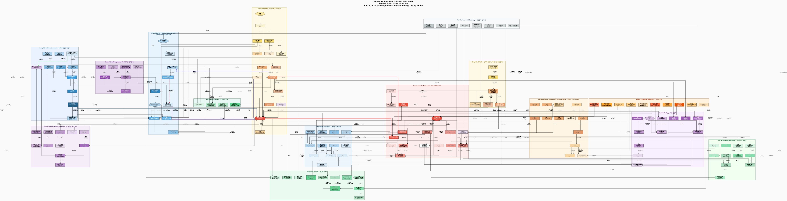</a> | **MED12 돌연변이(70%)·HMGA2 과발현 → HPG 축(GnRH→LH/FSH→E2/P4) 구동 → ERα/PR 과발현 → 세포증식(MAPK/ERK·PI3K/AKT/mTOR·Wnt/β-catenin)↑ + ECM 축적(TGF-β1·콜라겐I/III·TIMP↑·MMP↓·LOX 교차결합) + 국소 아로마타제 과발현(PGE2 → CYP19A1 → E2 양성피드백) → 자궁근종 성장 → AUB·골반통·불임**. HPG 축(KNDy 신경세포·GnRH 펄스·LH/FSH·E2 음성피드백) + 난소 스테로이드 생합성(StAR·CYP11A1·3β-HSD·CYP17A1·CYP19A1 아로마타제) + 자궁 생물학(ERα·ERβ·PR-A/B·VEGF) + 근종 발병기전(MED12·HMGA2·섬유화) + 세포 내 신호전달(MAPK·PI3K·Wnt·JAK-STAT·NF-κB) + ECM 리모델링(MMP-1/2/9·TIMP-1/2·LOX·히알루론산) + 면역미세환경(M2 대식세포·비만세포·PGE2·COX-2) 15클러스터. 류프로라이드 3.75mg 데포(GnRH 작용제·뇌하수체 탈감작·초기 flare→90% E2 억제·Friedman 1989)·엘라고릭스 150/200mg BID(경구 GnRH 길항제·즉각 GnRHR 차단·flare 無·용량 의존적 E2 억제·ELARIS UF-I/II 2020 NEJM)·렐루고릭스 40mg QD(t½≈60h·장기 억제·LIBERTY 1/2 2021 NEJM)·울리프리스탈(UPA 5mg·SPRM 부분길항·PEARL I/II 2012 NEJM·13주×2코스) 4종 완전 PK/PD 모델링 + 호르몬 보충요법(E2 1mg+NET 0.5mg·골보호·안면홍조 완화). **120+ 노드 15클러스터**, **18구획 ODE**(GnRH·LH·FSH·E2·P4·근종용적·ECM·MBL·Hgb·BMD·약물PK 4종 8구획), **6치료 시나리오**(무치료·류프로라이드·엘라고릭스 150mg·엘라고릭스 200mg+AB·렐루고릭스+AB·UPA). Simon 2020 NEJM(ELARIS UF-I: 68.5% HMB 해소)·Schlaff 2020 NEJM(ELARIS UF-II: 76.5%)·Lukes 2021 NEJM(LIBERTY 1: 71.2%)·Murji 2022 NEJM(PRIMROSE: 93.9%)·Donnez 2012 NEJM(PEARL I: 91%) 보정. PBAC 점수·MBL(mL/cycle)·Hgb·BMD 변화율·UFS-QoL·안면홍조 점수 임상 엔드포인트. **6탭 Shiny 대시보드**(환자프로파일·약물PK·PD지표·임상엔드포인트·시나리오비교·바이오마커패널). **60개 PubMed 인용** (15개 섹션).<br>[🗺️ 지도](uterine-leiomyoma/ufl_qsp_model.svg) · [⚙️ mrgsolve](uterine-leiomyoma/ufl_mrgsolve_model.R) · [📊 Shiny](uterine-leiomyoma/ufl_shiny_app.R) · [📚 문헌](uterine-leiomyoma/ufl_references.md) · [📄 README](uterine-leiomyoma/README.md) |
| 152 | 부인종양학 | [**난소암 (HGSOC)**<br><sub>Ovarian Cancer · High-Grade Serous · OC</sub>](ovarian-cancer/) | <a href="ovarian-cancer/oc_qsp_model.svg"></a> | **TP53 변이(>96%) + HRD(BRCA1/2·HRR 유전자) → 상동재조합 결핍 → PARP 합성 치사 · 백금 내성 · 복막 전이 → HGSOC**. DDR/HRR 경로(BRCA1/2·RAD51·PARP1/2·ATM/ATR·CHK1/2) + PI3K/AKT/mTOR + VEGF/혈관신생(HIF-1α·VEGFR1/2·DLL4/Notch) + 종양 미세환경(CAF·TAM M1/M2·MDSC·NK·CD8+ T·Treg·IL-6·TGF-β·IL-10·STAT3) + 면역회피(PD-L1/PD-1·CTLA-4·IDO1·LAG-3·TIM-3·TIGIT) + 복막 전이(EMT·CA-125/MUC16·HE4·LPA) 10클러스터. 카보플라틴(Calvert AUC6 공식·Chatelut CL·Pt-DNA 부가물·G2/M 정지)·파클리탁셀(3구획 PK·비선형·튜불린 안정화)·오라파립(300mg BID·PARP 트래핑·합성 치사)·니라파립(300mg QD·t½=36h)·베바시주맙(anti-VEGF·15mg/kg q3w) 5종 완전 PK/PD 모델링. **180+ 노드 10클러스터**, **18구획 ODE**(CAR·PAC·OLA·NIRA·BEV PK+VEGF+TV(Gompertz)+CA125+Pt_DNA+CD8T+HRD), **6치료 시나리오**(무치료·Carbo+Pacli×6·+Bev유지·→오라파립 BRCA+·→니라파립 HRD+·+Bev→Ola+Bev PAOLA-1). Moore 2018 NEJM(SOLO-1 mPFS NR, HR 0.30)·Gonzalez-Martin 2019 NEJM(PRIMA mPFS 13.8mo, HR 0.43)·Ray-Coquard 2019 NEJM(PAOLA-1 mPFS 22.1mo, HR 0.33)·ICON7/GOG218(베바시주맙) 보정. CA-125·HE4·ROMA·PFS·RECIST 1.1·ctDNA·HRD 임상 엔드포인트. **6탭 Shiny 대시보드**(환자프로파일·약물PK·PD바이오마커·종양반응·시나리오비교·바이오마커패널). **55개 PubMed 인용** (14개 섹션).<br>[🗺️ 지도](ovarian-cancer/oc_qsp_model.svg) · [⚙️ mrgsolve](ovarian-cancer/oc_mrgsolve_model.R) · [📊 Shiny](ovarian-cancer/oc_shiny_app.R) · [📚 문헌](ovarian-cancer/oc_references.md) · [📄 README](ovarian-cancer/README.md) |
| 149 | 희귀혈액·보체 | [**발작성 야간 혈색소뇨증**<br><sub>Paroxysmal Nocturnal Hemoglobinuria · PNH</sub>](paroxysmal-nocturnal-hemoglobinuria/) | <a href="paroxysmal-nocturnal-hemoglobinuria/pnh_qsp_model.svg"></a> | **PIGA 체세포 돌연변이 → GPI 앵커 결핍 → CD55/CD59 소실 → 보체 대체경로 무조절 활성화 → 혈관내 용혈(IVH)·혈관외 용혈(EVH)·혈전증**. CD55(DAF) 소실→C3 전환효소 비억제→C3b 대량 침착→EVH; CD59(MIRL) 소실→C9 중합 자유→MAC(C5b-9) 형성→IVH; 유리 Hgb→NO 포착→평활근 이상수축·혈전 위험. 에쿨리주맙(900mg q2w IV·항C5·TRIUMPH NEJM 2006·TI 49%)·라블리주맙(3300mg q8w IV·항C5·긴 t½~49일·ALXN1210-301 Blood 2019·TI 73.6%)·익타코판(200mg BID PO·Factor B 억제·IVH+EVH 완전 차단·APPLY-PNH NEJM 2024·TI 51.1%)·다니코판(150mg TID PO·Factor D 억제·에쿨리주맙 add-on·EVH 감소). **130+ 노드 13클러스터**, **24구획 ODE**(조혈 4+보체 4+용혈출력 4+에쿨리주맙PK 3+라블리주맙PK 3+익타코판PK 2+다니코판PK 2), **6치료 시나리오**(무치료·에쿨리주맙·라블리주맙·익타코판·에쿨리주맙+다니코판·익타코판 고클론). **35개 PubMed 인용** (12개 섹션).<br>[🗺️ 지도](paroxysmal-nocturnal-hemoglobinuria/pnh_qsp_model.svg) · [⚙️ mrgsolve](paroxysmal-nocturnal-hemoglobinuria/pnh_mrgsolve_model.R) · [📊 Shiny](paroxysmal-nocturnal-hemoglobinuria/pnh_shiny_app.R) · [📚 문헌](paroxysmal-nocturnal-hemoglobinuria/pnh_references.md) · [📄 README](paroxysmal-nocturnal-hemoglobinuria/README.md) |
| 154 | 혈액종양·골수증식 | [**진성 다혈증 (PV)**<br><sub>Polycythemia Vera · PV</sub>](polycythemia-vera/) | <a href="polycythemia-vera/pv_qsp_model.svg"></a> | **JAK2 V617F 체세포 돌연변이(>95%) → 구성적 JAK-STAT5 신호 → EPO 비의존적 BFU-E/CFU-E 과증식 → 적혈구 덩어리 상승 → Hct 증가 → 혈액 점도 상승 → 혈전 위험(DVT·뇌졸중·간정맥 혈전). 혈소판증가증·백혈구증가증·비장비대(수외조혈). 골수섬유증(post-PV MF) 및 AML 이행 위험**. JAK2 V617F clone → JAK-STAT5/3·PI3K/AKT/mTOR·MAPK/ERK 경로; SOCS1/3 음성 피드백; EPO-R·MPL·G-CSF-R 과민성; BFU-E→CFU-E→망상적혈구→RBC 조혈 ODE; 혈소판(CFU-Mk→거핵구)·WBC 구획; 비장 용적(수외조혈·EMH); 골수 섬유화 점수(MF-0~3); JAK2 V617F 대립유전자 부담(%). 룩솔리티닙(10mg BID·JAK1/2 IC50 2.8/3.3nM·RESPONSE trial SVR35 38%·Hct 조절 60%·2구획 PK)·하이드록시유레아(500mg/d·리보뉴클레오티드 환원효소 억제·IC50=150μM·ECLAP)·PEG-IFN-α2a(45μg/wk SC·클론 억제·PROUD-PV 대립유전자 부담 감소) 완전 PK/PD 모델링 + 정맥 사혈·아스피린. **100+ 노드 10클러스터**, **16구획 ODE**(룩솔리티닙 2구획+HYU 1구획+IFN SC/중심+BFU-E/CFU-E/망상적혈구 BM·순환/RBC/PLT/WBC+비장+섬유화+JAK2 대립유전자 부담), **6치료 시나리오**(무치료·사혈+아스피린·하이드록시유레아·룩솔리티닙·PEG-IFN-α2a·룩솔리티닙 용량반응). RESPONSE(2015 NEJM)·RESPONSE-2(2017 Lancet Oncol)·PROUD-PV/CONTINUATION-PV(2020 Lancet Haematol)·CYTO-PV(2013 NEJM)·ECLAP(2004 NEJM) 임상 보정. Hct·PLT·WBC·비장용적·SVR35·JAK2 대립유전자 부담·pSTAT5 억제·MPN-SAF TSS·연간 혈전 위험·BM 섬유화 점수·MF/AML 이행 위험 바이오마커. **7탭 Shiny 대시보드**(개요·환자프로파일 & ELN 위험층화·약동학·PD & 혈액학·임상 엔드포인트·시나리오 비교·바이오마커 & 질환진행). **58개 PubMed 인용** (12개 섹션).<br>[🗺️ 지도](polycythemia-vera/pv_qsp_model.svg) · [⚙️ mrgsolve](polycythemia-vera/pv_mrgsolve_model.R) · [📊 Shiny](polycythemia-vera/pv_shiny_app.R) · [📚 문헌](polycythemia-vera/pv_references.md) · [📄 README](polycythemia-vera/README.md) |
| 155 | 산과·임신 | [**자간전증 (Preeclampsia)**<br><sub>Preeclampsia · Eclampsia · PE</sub>](preeclampsia/) | <a href="preeclampsia/pe_qsp_model.svg">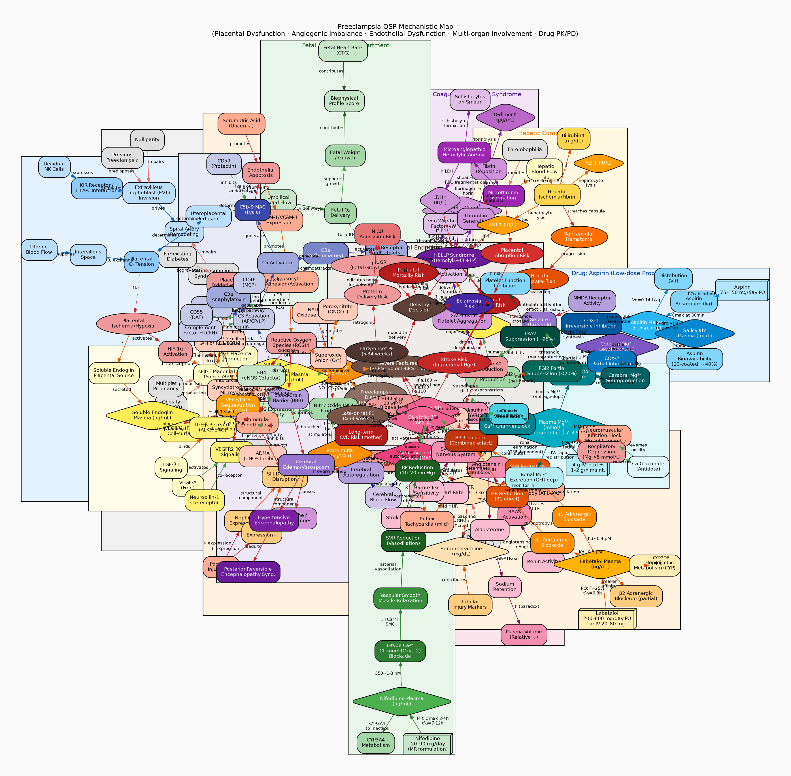</a> | **불완전한 영양막세포(EVT) 침윤 → 나선동맥 불완전 재형성 → 태반 허혈/저산소증 → HIF-1α → sFlt-1↑ 분비 → VEGF/PlGF 격리(sFlt-1/PlGF비율>38) + sEng↑ → VEGFR2 신호↓ → eNOS 활성↓ → NO↓/ET-1↑/ROS↑ 내피세포 기능 부전 → SVR↑ → 고혈압(SBP≥140mmHg) · 사구체 내피세포 장애→족세포손상→단백뇨(≥300mg/24h) · TXA2↑→혈소판감소·미세혈전→HELLP → 자간증**. 혈관형성 불균형(sFlt-1/PlGF/sEng) + 내피세포 기능부전(NO/ET-1/ROS) + 심혈관(SBP/DBP/SVR) + 신장(GFR/단백뇨/사구체내피세포장애) + 응고/HELLP(혈소판/LDH/용혈) + 신경(발작역치/NMDA축/자간증) + 간(허혈/AST/ALT) + 보체(C3/C5/MAC) + 태아(제대혈류/IUGR) 15클러스터. 아스피린(75mg/d·COX-1 비가역억제·TXA2~95%억제·ASPRE NEJM 2017 62% 조기자간전증 감소)·라베탈롤(200mg BID·α1+β1차단·CHIPS NEJM 2015)·니페디핀MR(30mg/d·L형Ca²⁺채널차단·CYP3A4대사)·황산마그네슘(4g IV+1g/h·NMDA수용체차단·경련예방·Magpie Lancet 2002 58%↓) 4종 완전 PK/PD 모델링. **150+ 노드 15클러스터**, **20구획 ODE**(아스피린2구획+COX1억제+라베탈롤+니페디핀+Mg+sFlt-1+PlGF+sEng+NO+ET1+ROS+SBP+DBP+GFR+단백뇨+혈소판+LDH+경련위험), **6치료 시나리오**(무치료·아스피린예방·라베탈롤·니페디핀·황산마그네슘·병용). ASPRE(Rolnik 2017 Lancet)·CHIPS(Magee 2015 NEJM)·Magpie(Altman 2002 Lancet)·Verlohren 2010(sFlt-1/PlGF비율≥38 예측, 민감도82%·특이도95%) 보정. SBP/DBP·sFlt-1/PlGF비율·단백뇨·GFR·혈소판·LDH·경련위험·Mg²⁺혈중농도(치료창 1.7-3.5mmol/L) 임상 엔드포인트. **8탭 Shiny 대시보드**(환자프로파일·약물PK·혈관형성균형·심혈관-신장·HELLP&신경계·시나리오비교·바이오마커패널·About). **60개 PubMed 인용** (12개 섹션).<br>[🗺️ 지도](preeclampsia/pe_qsp_model.svg) · [⚙️ mrgsolve](preeclampsia/pe_mrgsolve_model.R) · [📊 Shiny](preeclampsia/pe_shiny_app.R) · [📚 문헌](preeclampsia/pe_references.md) · [📄 README](preeclampsia/README.md) |
| 156 | 신경·뇌혈관 | [**허혈성 뇌졸중**<br><sub>Ischemic Stroke · IS</sub>](ischemic-stroke/) | <a href="ischemic-stroke/is_qsp_model.svg"></a> | **혈전/색전성 뇌혈관 폐색 → CBF 급감 → 허혈 핵심부(Core, <10 mL/100g/min) 불가역 괴사 + 반음영부(Penumbra, 10–20 mL/100g/min) 가역적 위험 조직 → ATP 고갈 → Na⁺/K⁺-ATPase 실패·탈분극 → 흥분독성 글루타메이트(NMDA/AMPA→Ca²⁺ 과부하) → ROS/NOS 과잉→미토콘드리아 기능부전→Cytc→Caspase-3→아포토시스/괴사 → 소교세포 활성화·호중구 침윤·IL-1β/IL-6/TNF-α↑ → MMP-9→BBB 파괴→혈관성 부종→출혈성 전환**. tPA(0.9 mg/kg IV·NINDS 1995·ECASS-3 2008 4.5h 창)·EVT(기계적 혈전제거·DEFUSE-3/DAWN 최대 24h)·아스피린(81–325mg·COX-1 비가역 억제·IST 1997)·아픽사반(5mg BID·FXa 억제·ARISTOTLE 2011·심방세동 2차 예방)·스타틴(LDL 감소 + 플레이오트로픽·SPARCL 2006) 5종 완전 PK/PD 모델링. **141 노드 12 서브그래프 클러스터**(위험인자·혈관병변/혈전·급성치료PK·허혈핵심부/반음영·흥분독성/이온·산화스트레스/NO·신경염증/BBB·재관류손상·2차예방PK·신경보호/신규표적·임상결과·바이오마커), **18구획 ODE**(혈전+CBF×2+tPA×2+아스피린×2+아픽사반×3+ATP+글루타메이트+Ca²⁺+ROS+IL-6+BBB+경색부피+NIHSS), **5치료 시나리오**(표준 tPA 2h·지연 tPA 4.5h·항혈소판 단독·tPA+아픽사반(AF)·EVT 3h). Tanswell 2002(tPA PK·CL=550mL/min)·Frost 2008(아픽사반 PK)·NINDS 1995·ECASS-3 2008·DEFUSE-3 2018·IST 1997·ARISTOTLE 2011·SPARCL 2006 보정. NIHSS·mRS·경색부피(mL)·BBB 무결성·IL-6·GFAP·UCH-L1·NSE·S100β·DWI/PWI 미스매치 임상 엔드포인트. **8탭 Shiny 대시보드**(환자프로파일·급성치료PK·허혈캐스케이드·신경염증/BBB·임상엔드포인트·2차예방PK·시나리오비교·바이오마커). **50개 PubMed 인용** (11개 섹션).<br>[🗺️ 지도](ischemic-stroke/is_qsp_model.svg) · [⚙️ mrgsolve](ischemic-stroke/is_mrgsolve_model.R) · [📊 Shiny](ischemic-stroke/is_shiny_app.R) · [📚 문헌](ischemic-stroke/is_references.md) · [📄 README](ischemic-stroke/README.md) |
| 157 | 혈액·골수부전 | [**재생불량성 빈혈**<br><sub>Aplastic Anemia · AA</sub>](aplastic-anemia/) | <a href="aplastic-anemia/aa_qsp_model.svg"></a> | **자가반응 CD8+ CTL 활성화(분자 모방·HLA-DR 제시) → IFN-γ/TNF-α 사이토카인 폭풍 → HSC에 FasL·퍼포린/그랜자임 B·NF-κB/ROS/p53 경로로 직접 세포자멸 → 조혈줄기세포(HSC) 풀 고갈 → 다계열 조혈부전(범혈구감소증) → 저세포성 골수(BM cellularity <25%)**. Treg(FoxP3+) 결핍 → 면역관용 붕괴; IFN-γ → FasR 상향·CXCL9/10 → CTL 골수 모집; BM 미세환경(MSC·내피세포) 손상·지방 대체; PNH 클론(GPI-앵커 결핍·면역 도피) 확대. hATG(40mg/kg×4d·2구획 PK·CL 0.85L/h)·rATG(3.5mg/kg×5d·CL 0.50L/h)·사이클로스포린(5mg/kg/d PO·목표 트로프 150–250ng/mL·CYP3A4·DDI)·엘트롬보파그(150mg/d·c-Mpl 작용제·JAK2/STAT5→HSC 자기재생↑·van der Straaten PopPK)·다나졸(400mg/d 안드로겐·EPO↑·Bcl-2↑) 5종 완전 PK/PD 모델링 + 동종조혈모세포이식(HSCT). **130+ 노드 13클러스터**(면역유발/항원제시·T세포활성화/확장·전염증사이토카인·HSC구획/세포자멸사·BM미세환경·다계열조혈·말초혈액/임상지표·ATG PK·CsA PK·EPAG PK·약물PD기전·질환 중증도/임상결과·지지요법), **20구획 ODE**(ATG 2구획+CsA+EPAG+Danazol PK 5구획+Teff+Treg+HSC+CFU-E+망상적혈구+RBC+CFU-G+ANC+MK+PLT+BM세포성+IFN-γ+TNF-α+IL-2+PNH클론), **5치료 시나리오**(무치료·hATG+CsA·hATG+CsA+EPAG·rATG+CsA+EPAG·동종HSCT). Scheinberg 2011 NEJM(hATG vs rATG·CR 68% vs 37%)·Townsley 2017 NEJM(EPAG 추가·CR 58% vs 36% at 6mo)·Peffault 2022 NEJM(rATG+CsA+EPAG CR 68%)·Olnes 2012 NEJM(EPAG 단독 CR 17%·PR 11%) 임상 보정. Hgb·ANC·PLT·ARC·BM세포성·IFN-γ/TNF-α/IL-2·PNH클론 크기·CR/PR/NR·수혈 필요성·MDS/AML 이행 위험 임상 엔드포인트. **6탭 Shiny 대시보드**(환자프로파일 & 중증도·약물PK·조혈·임상엔드포인트·시나리오비교·바이오마커 & 클론진화). **41개 PubMed 인용** (8개 섹션).<br>[🗺️ 지도](aplastic-anemia/aa_qsp_model.svg) · [⚙️ mrgsolve](aplastic-anemia/aa_mrgsolve_model.R) · [📊 Shiny](aplastic-anemia/aa_shiny_app.R) · [📚 문헌](aplastic-anemia/aa_references.md) · [📄 README](aplastic-anemia/README.md) |
| 158 | 이식면역·HSCT 합병증 | [**이식편대숙주병 (GvHD)**<br><sub>Graft-versus-Host Disease · GvHD</sub>](graft-versus-host-disease/) | <a href="graft-versus-host-disease/gvhd_qsp_model.svg"></a> | **동종 HSCT 후 공여자 T세포가 숙주 전처치(TBI/항암화학요법) 유발 조직손상(DAMP/PAMP)으로 활성화된 숙주 수지상세포(DC)에 의해 프라이밍 → TCR-MHC mismatch 직접/간접 동종반응(CD28-B7 공자극) → NFAT·NF-κB·JAK-STAT 경로 활성화 → Th1(IFN-γ·TNF-α)/Th17(IL-17A·IL-22) 극화·Treg 결핍 → 급성: 피부·장·간 장기손상(Glucksberg I-IV); 만성: Tfh-B 세포 GC반응·자가항체·TGF-β/ROCK2 섬유화 → 폐쇄성 세기관지염(BOS)·피부경화·간섬유화**. 발병기전 14클러스터(HSCT전처치·항원제시·T세포 분화·사이토카인 네트워크·피부·장·간·폐·B세포 병증·TGF-β/ROCK2 섬유화·CNI PK·룩솔리티닙 PK/PD·기타약물·임상 엔드포인트). CsA(3mg/kg/d PO·F=30%·CYP3A4·2구획·C₀목표 100–300ng/mL)·타크로리무스(0.03mg/kg/d PO·F=25%·CYP3A5·2구획·C₀ 5–15ng/mL)·프레드니손(1mg/kg/d·NF-κB억제·광범위사이토카인↓)·**룩솔리티닙(10mg BID·JAK1 Ki=3.3nM·JAK2 Ki=2.8nM·STAT3/5차단·Treg확장·REACH2/3 NEJM 2020/2021 근거)·벨루모수딜(200mg QD ROCK2 선택적 저해·IRF4/STAT3억제·Th17↓Treg↑·섬유화↓·ROCKstar Blood 2021)·MMF/MPA(1.5g BID·IMPDH억제·림프구 증식차단)** 6종 완전 PK/PD 모델링. **130+ 노드 14 서브그래프 클러스터**, **32구획 ODE**(약물PK 16구획: CsA 3+TAC 3+PRED 2+RUX 3+BELU 2+MPA 2+; 면역PD 16구획: Th1·Th17·Treg·CD8·Bcell·TNF-α·IFN-γ·IL-17A·IL-10·TGF-β·IL-6·피부손상·장손상·간손상·폐손상·섬유화), **6치료 시나리오**(무예방·CsA 단독·CsA+MMF·TAC+MMF·CsA→룩솔리티닙·CsA→벨루모수딜). Glucksberg/NIH 등급·ORR·FFS·OS·NRM 임상 엔드포인트. ST2/REG3α/sTNFR1/CXCL9 바이오마커 패널(Ann Arbor 알고리즘). **8탭 Shiny 대시보드**(환자·약물PK·면역세포·사이토카인·장기손상&엔드포인트·시나리오비교·바이오마커·기전지도). **60개 PubMed 인용** (14개 섹션·Zeiser 2020/2021 NEJM·Cutler 2021 Blood·Ferrara 2009 Lancet·Vander Lugt 2013 NEJM).<br>[🗺️ 지도](graft-versus-host-disease/gvhd_qsp_model.svg) · [⚙️ mrgsolve](graft-versus-host-disease/gvhd_mrgsolve_model.R) · [📊 Shiny](graft-versus-host-disease/gvhd_shiny_app.R) · [📚 문헌](graft-versus-host-disease/gvhd_references.md) · [📄 README](graft-versus-host-disease/README.md) | Treg(FoxP3+) 결핍 → 면역관용 붕괴; IFN-γ → FasR 상향·CXCL9/10 → CTL 골수 모집; BM 미세환경(MSC·내피세포) 손상·지방 대체; PNH 클론(GPI-앵커 결핍·면역 도피) 확대. hATG(40mg/kg×4d·2구획 PK·CL 0.85L/h)·rATG(3.5mg/kg×5d·CL 0.50L/h)·사이클로스포린(5mg/kg/d PO·목표 트로프 150–250ng/mL·CYP3A4·DDI)·엘트롬보파그(150mg/d·c-Mpl 작용제·JAK2/STAT5→HSC 자기재생↑·van der Straaten PopPK)·다나졸(400mg/d 안드로겐·EPO↑·Bcl-2↑) 5종 완전 PK/PD 모델링 + 동종조혈모세포이식(HSCT). **130+ 노드 13클러스터**(면역유발/항원제시·T세포활성화/확장·전염증사이토카인·HSC구획/세포자멸사·BM미세환경·다계열조혈·말초혈액/임상지표·ATG PK·CsA PK·EPAG PK·약물PD기전·질환 중증도/임상결과·지지요법), **20구획 ODE**(ATG 2구획+CsA+EPAG+Danazol PK 5구획+Teff+Treg+HSC+CFU-E+망상적혈구+RBC+CFU-G+ANC+MK+PLT+BM세포성+IFN-γ+TNF-α+IL-2+PNH클론), **5치료 시나리오**(무치료·hATG+CsA·hATG+CsA+EPAG·rATG+CsA+EPAG·동종HSCT). Scheinberg 2011 NEJM(hATG vs rATG·CR 68% vs 37%)·Townsley 2017 NEJM(EPAG 추가·CR 58% vs 36% at 6mo)·Peffault 2022 NEJM(rATG+CsA+EPAG CR 68%)·Olnes 2012 NEJM(EPAG 단독 CR 17%·PR 11%) 임상 보정. Hgb·ANC·PLT·ARC·BM세포성·IFN-γ/TNF-α/IL-2·PNH클론 크기·CR/PR/NR·수혈 필요성·MDS/AML 이행 위험 임상 엔드포인트. **6탭 Shiny 대시보드**(환자프로파일 & 중증도·약물PK·조혈·임상엔드포인트·시나리오비교·바이오마커 & 클론진화). **41개 PubMed 인용** (8개 섹션).<br>[🗺️ 지도](aplastic-anemia/aa_qsp_model.svg) · [⚙️ mrgsolve](aplastic-anemia/aa_mrgsolve_model.R) · [📊 Shiny](aplastic-anemia/aa_shiny_app.R) · [📚 문헌](aplastic-anemia/aa_references.md) · [📄 README](aplastic-anemia/README.md) |
| 160 | 결합조직·심혈관 유전질환 | [**마르팡 증후군 (Marfan Syndrome)**<br><sub>Marfan Syndrome · MFS</sub>](marfan-syndrome/) | <a href="marfan-syndrome/mfs_qsp_model.svg"></a> | **FBN1 돌연변이(Chr 15q21.1) → 피브릴린-1 결함 → ECM 마이크로피브릴 파괴 → TGF-β 서열화 손상 → 자유 TGF-β1/2 증가 → p-SMAD2/3 + p-ERK1/2 과활성 → MMP-2/9↑ → 대동맥 중막 탄성 박판 분절화·낭성 괴사·평활근세포 세포자멸 → 대동맥 근부(발살바동) 확장 → 대동맥판 역류·박리(A/B형)·파열**. 안지오텐신 II/AT1R → NOX4/ROS/NF-κB → VSMC 표현형 전환(수축→합성). 아테노롤(50–100mg QD·β1-선택적·2구획 PK·Vc=67L·CL=10.8L/h·HR↓·dP/dt_max↓)·로사르탄(50–100mg QD·AT1R 차단·EXP-3174 활성 대사물 IC50=4nM·TGF-β 신호↓·p-SMAD2/3↓)·이르베사르탄(AIMS RCT)·프로프라노롤(비선택적 β-차단) 4종 완전 PK/PD. **130+ 노드 14 서브그래프 클러스터**(유전기반·TGF-β 정규 경로·MAPK/ERK·ECM 리모델링·혈관 평활근세포·대동맥 병리·심장/혈역학·혈역학 파라미터·골격계·안과·기타 전신·약물 PK·약물 PD 기전·임상 엔드포인트/바이오마커), **20구획 ODE**(아테노롤 3구획+로사르탄/EXP-3174 3구획 PK; TGF-β1·p-SMAD2/3·p-ERK1/2·MMP PD 4구획; 대동맥 근부 직경·AR 등급·HR·SBP·dP/dt·NT-proBNP·LVEDD·관측 TGF-β·겐트 점수 9구획), **6치료 시나리오**(무치료·아테노롤 50mg·아테노롤 100mg·로사르탄 50mg·로사르탄 100mg·아테노롤+로사르탄 병용). Lacro 2014 NEJM(PHN trial: 아테노롤 vs 로사르탄·Z-점수 Δ–0.12/–0.14·p=NS)·Radonic 2010 EHJ(COMPARE: 로사르탄 100mg·대동맥 성장률 0.77→0.59mm/yr)·Forteza 2016 JACC(AIMS: 이르베사르탄 vs 아테노롤·대동맥 성장률 동등)·Brooke 2008 NEJM(로사르탄 소아·성장률 현저 ↓)·Shores 1994 NEJM(프로프라노롤·10년 성장률 50%↓)·Habashi 2006 Science(Fbn1+/- 마우스·로사르탄 TGF-β 억제 기전) 보정. 대동맥 근부 직경·Z-점수·연간 성장률(목표 <0.5mm/yr)·AR 등급·HR/dP/dt_max·수축기 혈압·LVEDD·NT-proBNP·혈장 TGF-β1·MMP-9·겐트 전신 점수·수술 역치(≥50mm/≥45mm+위험인자) 임상 엔드포인트. **7탭 Shiny 대시보드**(환자프로파일 & 겐트기준·약물PK·TGF-β/분자 PD·심혈관 엔드포인트·시나리오비교·바이오마커&모니터링·수술 결정 지원). **50개 PubMed 인용** (11개 섹션·PHN/COMPARE/AIMS/NEJM/EHJ).<br>[🗺️ 지도](marfan-syndrome/mfs_qsp_model.svg) · [⚙️ mrgsolve](marfan-syndrome/mfs_mrgsolve_model.R) · [📊 Shiny](marfan-syndrome/mfs_shiny_app.R) · [📚 문헌](marfan-syndrome/mfs_references.md) · [📄 README](marfan-syndrome/README.md) |
| 162 | 희귀 대사질환 | [**급성 간헐성 포르피린증**<br><sub>Acute Intermittent Porphyria · AIP</sub>](acute-intermittent-porphyria/) | <a href="acute-intermittent-porphyria/aip_qsp_model.svg"></a> | **HMBS(PBGD) 유전자 기능 상실 → PBGD 효소 활성 ~50% → 헴 전구체(ALA·PBG) 과축적 → 신경독성 급성 발작**. ALA(GABA 구조 유사체) → GABA-A 수용체 경쟁 억제 + Fe²⁺ 촉매 자동산화 ROS → 미토콘드리아 기능 부전 → 축삭 변성 → 자율신경·운동·감각 신경병증. ALAS1 PGC-1α·HNF-4α·FOXO1 전사 조절 + 헴 피드백 억제(Imax). 유발인자: CYP 유도 약물(바르비투르산·설폰아미드·항전간제·리팜피신)·프로게스테론(황체기)·금식·감염. **Givosiran(GalNAc-siRNA·2.5mg/kg SC Q28d·ASGPR 수용체 매개 간 흡수·RISC/Ago2 복합체·ALAS1 mRNA ~87% KD·2구획+간구획 PK·ENVISION 2020 NEJM·AAR 74% ↓)**. Hemin IV(3mg/kg/d×4d·헤모펙신/알부민 결합·LRP1 간 흡수·HO-1 유도·외인성 헴 피드백→ALAS1 억제·급성 발작 표준치료). **130+ 노드 11 서브그래프 클러스터**(미토콘드리아 헴 생합성·세포질 헴 생합성/PBGD 병목·ALAS1 전사 조절·발작 유발인자·Givosiran PK/PD·Hemin IV PK/PD·병태생리&신경독성·임상 증상&엔드포인트·지지치료&예방·생화학 모니터링·집단 PK/PD 공변량), **17구획 ODE**(Givosiran 4구획: SC depot·혈장 중심·혈장 말초·간; ALAS1 mRNA·단백; ALA 간·혈장; PBG 간·혈장; 자유 헴; Hemin 혈장·간; 신경독성 지수·발작위험 적분·AUC_ALA·AUC_PBG), **6치료 시나리오**(위약·Givosiran 2.5mg/kg Q1M·Hemin IV 3mg/kg×4d·Givosiran+돌파 Hemin·Givosiran 5.0mg/kg·유전자치료 PBGD 95% 회복). Balwani 2020 NEJM ENVISION(AAR 74%↓·소변ALA 정상화 73%·PBG 정상화 63%)·Sardh 2019 NEJM(ALAS1 mRNA KD 87% M3 trough)·Gouya 2020 Hepatology EXPLORE(자연 경과) 임상 보정. 연간발작률(AAR)·소변 ALA/PBG 정상화·ALAS1 mRNA KD·신경독성 지수·누적 발작위험일·eGFR 궤적·간세포암(HCC) 위험(20–70×) 임상 엔드포인트. VPop N=100 시뮬레이션(CL·ASGPR 흡수 IIV 30–35% CV·여성 85%). **6탭 Shiny 대시보드**(환자 프로파일&HMBS 유전형·약물 PK·PD 마커·임상 엔드포인트·시나리오 비교·바이오마커&VPop). **57개 PubMed 인용** (12개 섹션: 임상시험·헴 생합성·ALAS1 조절·Givosiran 약리·Hemin PK/PD·신경독성·역학&유전학·QSP 모델링·장기 합병증·호르몬 유발인자·유전자치료·약물 안전성 DB).<br>[🗺️ 지도](acute-intermittent-porphyria/aip_qsp_model.svg) · [⚙️ mrgsolve](acute-intermittent-porphyria/aip_mrgsolve_model.R) · [📊 Shiny](acute-intermittent-porphyria/aip_shiny_app.R) · [📚 문헌](acute-intermittent-porphyria/aip_references.md) · [📄 README](acute-intermittent-porphyria/README.md) |
| 164 | 신경내분비종양 | [**갈색세포종/부신경절종**<br><sub>Pheochromocytoma/Paraganglioma · PPGL</sub>](pheochromocytoma/) | <a href="pheochromocytoma/ppgl_qsp_model.svg"></a> | **부신 수질 크롬친화세포(sporadic 60% / germline 40%: SDHB·VHL·RET·NF1·MAX) → 카테콜아민 과분비 → α₁-AR 활성화 → 혈관수축·SVR↑·수축기혈압↑·고혈압 위기(≥180mmHg); β₁-AR → 심박수·심박출량↑; 카테콜아민 심근병증·타코츠보·부정맥**. SDHB 변이 → 숙신산 축적→HIF 안정화(가성저산소 군집)→악성도 40–80%·전이. RET/NF1→키나제 신호 군집. TH(타이로신 수산화효소, 속도제한)→DOPA→AADC→도파민→DBH→NE→PNMT(부신 한정)→EPI; COMT·MAO 대사→NMN·MN(진단 바이오마커)·VMA. 크롬친화 과립(VMAT2)·Ca²⁺ 유입·엑소사이토시스·NET 재흡수. 대사 효과: β₂→간 당분해·글루카곤↑; α₂→인슐린↓→스트레스 당뇨병; β₃→BAT 열생성·FFA↑·체중감소. 약물 PK/PD 5종: **페녹시벤자민**(비가역적 α₁/α₂ 알킬화·2구획·F=27%·CL=5.8L/h)·**독사조신**(선택적 α₁ 경쟁 차단·1구획·t½=22h·F=65%)·**메티로신**(TH 경쟁 억제·IC50=85µM·카테콜아민 합성 40–80% 감소)·**프로프라놀롤**(β-차단·IC50=0.022µM·CL=50L/h)·**수니티닙**(VEGFR/PDGFR TKI·2구획·CL=34L/h·악성 PPGL). **130+ 노드 11 서브그래프 클러스터**(유전·분자 드라이버·종양 생물학·카테콜아민 생합성·저장·분비·아드레날린 수용체 신호·심혈관 효과·대사 효과·α-차단제 PK·전신 치료 PK·약력학·바이오마커·수술·주술기 관리), **20구획 ODE**(PHE 3구획+DOX+MET+BB+수니티닙 2구획 PK; TH_act·NE_store·NE_plasma·EPI_plasma 생합성; TUMvol·VEGF_tum 종양; SBP·DBP·HR·GLU·FFA·CgA_plasma), **6치료 시나리오**(무치료·페녹시벤자민 60mg/d×14d+수술·독사조신 16mg/d+수술·PHE+메티로신 2g/d+프로프라놀롤 3제 병용·수니티닙 37.5mg/d 전이성·메티로신 단독). Kinney 2002(PHE vs DOX 수술 전후 혈압 동등성)·Steinsapir 1997(메티로신 TH억제 40–80%)·Niemeijer 2014 J Clin Endocrinol Metab(수니티닙 ORR 25%)·Engelman 1968 NEJM(메티로신 최초 임상) 임상 보정. 혈장 NMN(>0.87nmol/L 진단 민감도 97%)·혈장 MN·24h 소변 카테콜아민·CgA(>300ng/mL)·α₁-수용체 점유율·SBP/DBP/HR 조절·종양 부피·RECIST 반응·수술 후 생화학적 완치 바이오마커. **6탭 Shiny 대시보드**(환자 프로파일&유전형·약물 PK·카테콜아민&바이오마커·심혈관 효과·종양 악성·시나리오 비교). **45개 PubMed 인용** (12개 섹션: 가이드라인·역학/유전학·카테콜아민 생합성·수술 전 관리·메티로신 PK/PD·악성 전신 치료·심혈관 효과·생화학 진단·영상·분자 병태생리·수니티닙 PK 모델링·QSP 모델링).<br>[🗺️ 지도](pheochromocytoma/ppgl_qsp_model.svg) · [⚙️ mrgsolve](pheochromocytoma/ppgl_mrgsolve_model.R) · [📊 Shiny](pheochromocytoma/ppgl_shiny_app.R) · [📚 문헌](pheochromocytoma/ppgl_references.md) · [📄 README](pheochromocytoma/README.md) |
| 163 | 안과·망막 | [**노인성 황반변성**<br><sub>Age-related Macular Degeneration · AMD</sub>](age-related-macular-degeneration/) | <a href="age-related-macular-degeneration/amd_qsp_model.svg"></a> | **노화·유전(CFH Y402H·ARMS2 A69S)·보체계 과활성화 → 드루젠 형성·Bruch막 두꺼워짐 → RPE 기능부전·지방갈색소(A2E) 축적 → MAC(C5b-9) 매개 RPE 세포사 → 지리적 위축(GA, 건성 말기). VEGF-A165 과분비 → VEGFR-2(KDR) 활성화 → PI3K/Akt/mTOR·ERK1/2 → 내피세포 증식·이동·혈관 투과성↑ → 맥락막 신생혈관(CNV, 습성)**. 항VEGF 5종 완전 IVT PK/PD: **라니비주맙**(0.5mg·48kDa·Kd 0.04nM·t½ 유리체 7.2d)·**애플리버셉트**(2mg·115kDa·Kd 0.0005nM·VEGF trap)·**베바시주맙**(1.25mg·149kDa)·**파리시맙**(6mg·이중표적 VEGF-A+Ang-2·Kd 0.0003nM·TIE2 경로)·**브롤루시주맙**(6mg·26kDa scFv·t½ 4d). Ang-2/TIE2 축: ANG2 경쟁적 TIE2 억제→혈관 불안정화→유리체 Ang-2 파리시맙 결합(Kd~0.9pM). 보체계: C3→C3a/C3b, C5→C5a/MAC; CFH Y402H 변이→CFH 기능↓→C3b 불활성화 장애·드루젠 보체 침착·RPE 스트레스; pegcetacoplan(C3 억제제)·avacopan(C5aR1 억제제). **130+ 노드 10 서브그래프 클러스터**(약물 PK·VEGF/혈관신생·Ang-2/TIE2·보체계·RPE/Bruch막·CNV형성·신경염증·유전/위험인자·임상엔드포인트·약물치료), **20구획 ODE**(Drug 유리체·망막·전신; VEGF free·bound·VEGFR2; ANG2 free·bound; C3·C5·MAC; RPE정상·손상·지방갈색소·드루젠; CNV 면적·과잉유체; GA면적; BCVA; 광수용체), **6치료 시나리오**(라니비주맙 q4w×3→q8w·애플리버셉트 q4w→q8w·파리시맙 q4w×4→q16w T&E·브롤루시주맙 q6w→q12w·무치료 자연경과·건성 AMD+AREDS2 4년). Brown 2006 NEJM(ANCHOR)·CATT 2011 NEJM(BEV vs RNB)·Heier 2012 Ophthalmol(VIEW1/2 AFL)·Khanani 2022 Ophthalmol(TENAYA/LUCERNE FAR)·Dugel 2020 Ophthalmol(HAWK/HARRIER BRO) 임상 보정. BCVA(ETDRS 자수)·CNV 면적(mm²)·CST(OCT μm)·GA 면적(mm²)·자유 VEGF(nM)·RPE 분획·광수용체 생존률 엔드포인트. **6탭 Shiny 대시보드**(환자 프로파일&질환 병기·약물 PK·PD 핵심 마커·임상 엔드포인트·시나리오 비교·바이오마커 탐색기). **55개 PubMed 인용** (17개 섹션: 역학·드루젠&Bruch막·RPE생물학·보체경로·VEGF경로·항VEGF PK·라니비주맙/베바시주맙 임상시험·애플리버셉트·브롤루시주맙·파리시맙·Ang-2/TIE2·지리적 위축·AMD 유전학·AREDS·산화스트레스·QSP모델링·신규치료제).<br>[🗺️ 지도](age-related-macular-degeneration/amd_qsp_model.svg) · [⚙️ mrgsolve](age-related-macular-degeneration/amd_mrgsolve_model.R) · [📊 Shiny](age-related-macular-degeneration/amd_shiny_app.R) · [📚 문헌](age-related-macular-degeneration/amd_references.md) · [📄 README](age-related-macular-degeneration/README.md) |
| 161 | 혈액종양 | [**비호지킨 림프종 (DLBCL)**<br><sub>Non-Hodgkin Lymphoma · NHL</sub>](non-hodgkin-lymphoma/) | <a href="non-hodgkin-lymphoma/nhl_qsp_model.svg"></a> | **GCB B세포에서 기원한 가장 흔한 공격성 B세포 림프종. BCR 신호(Lyn→Syk→BTK→PI3K/AKT/mTOR·NF-κB)·MYC/BCL-2 이중발현·GC반응 이탈 후 악성화**. 리투시맙(항CD20·2구획+TMDD PK·ADCC/CDC/직접세포자멸)·사이클로포스파마이드(CYP2B6→4-OH-CPP)·독소루비신(2구획)·베네토클락스(BCL-2 BH3유사체)·이브루티닙(BTK 공유억제·ABC형 특이) 5종 완전 PK/PD. **120+ 노드 14 서브그래프 클러스터**(B세포분화·GC반응/DLBCL기원·BCR신호·NF-κB경로·MYC/세포주기·BCL-2/세포자멸·후성유전학·종양미세환경·면역회피·리투시맙PK·CHOP PK·신규표적치료제·CAR-T·임상엔드포인트), **22구획 ODE**(리투시맙 2구획+CD20 TMDD·4-OH-사이클로포스파마이드·독소루비신 2구획·베네토클락스·이브루티닙+종양·BCR신호·BCL-2점유율·NK·CD8·ANC·내성·CRS위험), **6치료 시나리오**(무치료·R-CHOP×6·Pola-R-CHP×6(POLARIX)·R-CHOP+이브루티닙(ABC형,PHOENIX)·R-CHOP+베네토클락스(CAVALLI)·R-CHOP 이중발현). Coiffier 2002 NEJM(R-CHOP CR~65%)·Tilly 2022 NEJM(POLARIX 2yr PFS 76.7% vs 70.2%)·Younes 2019 NEJM(PHOENIX)·Morschhauser 2021 JCO(CAVALLI BCL-2+ ORR 88%) 임상 보정. CR/PR/SD/PD(Lugano기준)·SPD·IPI/R-IPI·ctDNA MRD·ANC·CRS위험지수 엔드포인트. **6탭 Shiny 대시보드**(환자프로파일&아형·약물PK·종양동태·임상엔드포인트·시나리오비교·바이오마커&독성). **50개 PubMed 인용** (12개 섹션).<br>[🗺️ 지도](non-hodgkin-lymphoma/nhl_qsp_model.svg) · [⚙️ mrgsolve](non-hodgkin-lymphoma/nhl_mrgsolve_model.R) · [📊 Shiny](non-hodgkin-lymphoma/nhl_shiny_app.R) · [📚 문헌](non-hodgkin-lymphoma/nhl_references.md) · [📄 README](non-hodgkin-lymphoma/README.md) |
| 159 | 신경정신과 | [**양극성 장애 (Bipolar Disorder)**<br><sub>Bipolar Disorder · BD-I / BD-II</sub>](bipolar-disorder/) | <a href="bipolar-disorder/bd_qsp_model.svg"></a> | **도파민 과활성(조증) ↔ 세로토닌·NE 결핍(우울) 반복 삽화. GSK-3β 과활성 → mTOR/BDNF↓ → 해마 신경발생↓; IL-6/TNF-α 신경염증; CLOCK/BMAL1 일주기 리듬 교란; CACNA1C(L형 Ca²⁺ 채널) 위험 대립유전자→신경 과흥분성**. 리튬(2구획 PK·CL 1.8L/h·GSK-3β IC₅₀=0.7mEq/L·BDNF↑·BALANCE/CANMAT 2018 근거)·발프로에이트(비선형 단백결합·fu₀ 10%·GABA-T억제·HDAC억제·VPA GSK-3β 억제)·쿠에티아핀+노르쿠에티아핀(CYP3A4·F=9%·D2R 차단·NET 억제·EMBOLDEN I/II 우울증 근거)·라모트리진(Na⁺채널·Ca²⁺채널 차단·Glu 방출↓·STRIDE-BD 적정 프로토콜)·아리피프라졸(D2R 부분 효현제) 5종 완전 PK/PD 모델링. **120+ 노드 12클러스터**(신경전달물질/수용체·신호전달/GSK-3β·이온채널·HPA축/일주기·신경가소성/BDNF·신경염증·약물MOA·약물PK·임상엔드포인트·유전/후성유전·뇌회로·장-뇌축), **22구획 ODE**(리튬 2구획+발프로에이트+쿠에티아핀+노르쿠에티아핀+라모트리진 PK 10구획; DA·5HT·GSK3·BDNF·IL6·코르티솔 PD 6구획; YMRS·MADRS·GAF·체중·일주기 진동자 6구획), **6치료 시나리오**(리튬 단독 21d 조증·발프로에이트 단독 21d 조증·쿠에티아핀 56d BD우울증·리튬+쿠에티아핀 병용 56d·리튬 유지요법 1년·라모트리진 적정 112d BD-II 우울증). Bowden 1994 JAMA(발프로에이트 조증 RCT)·Calabrese 2005 AJP(쿠에티아핀 우울증 BOLDER)·Young 2010 JCP(EMBOLDEN I)·Geddes 2010 Lancet(BALANCE Li+VPA)·Cipriani 2013 Lancet 메타분석·Yatham 2018 Bipolar Disord(CANMAT 2018 가이드라인) 보정. YMRS·MADRS·HAM-D·CGI-BP·GAF·리튬 혈중농도·VPA·QTc·체중·BDNF 인덱스·GSK-3β 활성·IL-6·코르티솔 임상 바이오마커. **6탭 Shiny 대시보드**(환자프로파일&PGx·약동학·PD바이오마커·임상엔드포인트·시나리오비교·안전모니터). **46개 PubMed 인용** (14개 섹션).<br>[🗺️ 지도](bipolar-disorder/bd_qsp_model.svg) · [⚙️ mrgsolve](bipolar-disorder/bd_mrgsolve_model.R) · [📊 Shiny](bipolar-disorder/bd_shiny_app.R) · [📚 문헌](bipolar-disorder/bd_references.md) · [📄 README](bipolar-disorder/README.md) |

---

## 🧬 파브리병 (Fabry Disease) — 최신 모델 상세 (2026-06-24)

> **디렉토리:** [`fabry-disease/`](fabry-disease/) | **약어:** FBR | **날짜:** 2026-06-24

[](fabry-disease/fbr_qsp_model.svg)

**질환**: 파브리병(Fabry Disease, FBR) | **분류**: X-연관 리소소말 저장 질환 | **유병률**: 1:40,000 (고전형) | **효소**: α-갈락토시다제 A (α-Gal A)

### 핵심 기전 (14개 클러스터)

| 클러스터 | 핵심 기전 |
|---------|-----------|
| 1. 유전적 기반 | GLA 유전자(Xq22.1) 변이(미스센스 ~60%); X-연관 유전; 반접합 남성 고전형 vs 이형접합 여성 보인자(Lyon X-불활성화); 적합 변이 ~40%(미갈라스타트 적응증) |
| 2. α-Gal A 효소 생물학 | ER 합성 → 골지체 M6P 인산화 → CI-MPR/CD-MPR 수용체 → 리소솜 전달 → pH 4.5–5.0 최적 Gb3 가수분해 |
| 3. 당스핑고지질 대사 | 세라미드 → GCS/UGCG → GlcCer → LacCer → A4GalT → Gb3 합성; Gb3 탈아실화 → lyso-Gb3(독성 신호분자, 민감 바이오마커) |
| 4. 신장 병리 | 족세포 Gb3 → 족돌기 소실 → UPCR↑ → TGF-β 섬유화 → FSGS → eGFR 감소(-3~-12/yr 무치료) → ESRD |
| 5. 심장 병리 | 심근세포 Gb3 → LVMi 증가 → 이완기 기능장애 → 심근 섬유화(LGE) → 부정맥(SVT·VF·완전방실차단) → 급사 |
| 6. 신경계 병리 | DRG Gb3 → 소섬유 신경병증 → 신경병성 통증(BPI-SF) + CNS 혈관내피 → 백질 병변 → TIA/뇌경색 |
| 7. 기타 장기 | 혈관각화종(피부), 무한증, 각막 소용돌이(cornea verticillata), 위장관 운동장애, 감각신경성 난청 |
| 8. 염증 폭포 | Lyso-Gb3 → TLR4 → NF-κB → IL-6/TNF-α → NLRP3 인플라마좀 → eNOS↓ → 내피세포 활성화 |
| 9. ERT PK/PD | 아갈시다제 베타(1 mg/kg Q2W, t½ ~45min, M6P→리소솜, Emax ~80%), 아갈시다제 알파(0.2 mg/kg Q2W), 페구니알시다제 알파(1 mg/kg Q4W, PEG t½ ~80h) |
| 10. 미갈라스타트 (샤페론) | 150 mg QOD 경구; 잘못 접힌 α-Gal A 안정화; EC50 ~0.25 μg/mL; 적합 변이 전용; ATTRACT 임상(ERT 비열등) |
| 11. 기질감소요법 (SRT) | 루세라스탓(GCS IC50 ~0.18 μg/mL, Emax 42%), 벵글루스탓(CNS 투과); Gb3 상류 기질 감소 |
| 12. 바이오마커 | 혈장 lyso-Gb3(μg/L, 가장 민감), 소변 Gb3(nmol/mg Cr), 백혈구 α-Gal A 활성, DBS 신생아 선별, eGFR, LVMi, UPCR |
| 13. 임상 엔드포인트 | eGFR 기울기(mL/min/1.73m²/yr), UPCR, LVMi, BPI-SF 통증(0–10), EQ-5D QoL, MSSI 중증도(0–138) |
| 14. 자연 경과 | 고전형 남성(소아기 발현) vs 후기 발현형(심장·신장형) vs 여성 보인자; Fabry Registry/FOS 데이터; 진단 지연 평균 10–20년 |

### mrgsolve ODE 모델 (22구획)

| 모듈 | 구획 | 핵심 동역학 |
|------|------|------------|
| 아갈시다제 베타 PK | A_AGAB_C, A_AGAB_P, A_AGAB_LYS | 2구획+리소솜 전달; CL=0.42 L/h; M6PR-매개 k_lys=0.35/h |
| 아갈시다제 알파 PK | A_AGAA_C, A_AGAA_P, A_AGAA_LYS | 2구획; CL=0.55 L/h |
| 미갈라스타트 PK | A_MIG_GUT, A_MIG_C | 경구 ka=0.82/h, F=75%, t½~3.5h |
| 루세라스탓 PK | A_LUC_GUT, A_LUC_C | 경구 IC50_GCS=0.18 μg/mL, Emax=42% |
| α-Gal A 효소 | E_GalA | ERT(Emax_ERT=70) + 미갈라스타트(Emax_MIG=6, 적합 변이 전용) + 기저 잔여 |
| 당스핑고지질 | GB3_PLM, GB3_KID, GB3_HRT, LGB3_PLM | 합성-효소분해 ODE; SRT→GCS 억제→상류 감소 |
| 염증 | INFLAM | lyso-Gb3 구동 k_in – k_out ODE |
| 장기 기능 | eGFR, UPCR, LVMi, PAIN | Gb3 축적 의존 감소; ERT/샤페론 보호 효과 |

### 6가지 치료 시나리오 임상 근거

| 시나리오 | 약물 | 임상시험 | 주요 결과 |
|---------|------|---------|---------|
| S1: 자연경과 | 없음 | Mehta 2009; Fabry Registry | eGFR -3~-12/yr, lyso-Gb3 30–80 μg/L, ESRD·심장사 위험 |
| S2: 아갈시다제 베타 | 1 mg/kg IV Q2W | FABRY-001 (Eng 2001 NEJM); Banikazemi 2007 AIM | 복합 신장·심장·뇌 사건 61% 감소 |
| S3: 아갈시다제 알파 | 0.2 mg/kg IV Q2W | Schiffmann 2001 Ann Intern Med | 신경병성 통증 개선, 신기능 안정, 소변 Gb3 감소 |
| S4: 미갈라스타트 | 150 mg PO QOD | ATTRACT (Germain 2016 NEJM); Hughes 2017 Lancet | ERT 비열등 (적합 변이); eGFR 기울기 -0.3 vs -1.0 mL/min/yr |
| S5: 페구니알시다제 알파 | 1 mg/kg IV Q4W | BRIGHT (Schiffmann 2021 JAMA) | eGFR 안정, lyso-Gb3 -50%, 4주 1회 투여 편의성 |
| S6: ERT + 루세라스탓 | AgaB + 1000 mg TID | MODIFY (Lenders 2022 Lancet DE) | Gb3 추가 감소, BPI-SF 신경병성 통증 -1.5점 |

### QSP 모델 파일

| 구성요소 | 파일 | 사양 |
|---------|------|-----|
| 🗺️ 기계론적 지도 | [`fbr_qsp_model.dot`](fabry-disease/fbr_qsp_model.dot) | **138 노드, 14클러스터** |
| ⚙️ mrgsolve ODE | [`fbr_mrgsolve_model.R`](fabry-disease/fbr_mrgsolve_model.R) | **22구획 ODE**, **6치료 시나리오** |
| 📊 Shiny 앱 | [`fbr_shiny_app.R`](fabry-disease/fbr_shiny_app.R) | **8탭** (환자 프로파일·PK/효소·Gb3 동역학·신장·심장·시나리오 비교·바이오마커·가상 집단) |
| 📚 참고문헌 | [`fbr_references.md`](fabry-disease/fbr_references.md) | **60개 PubMed 인용** (14개 섹션) |
---

## 🫀 심근염 (Myocarditis) — 최신 모델 상세 (2026-06-24)

> **디렉토리:** [`myocarditis/`](myocarditis/) | **약어:** MYO | **날짜:** 2026-06-24

[](myocarditis/myo_qsp_model.svg)

**질환**: 심근염(Myocarditis, MYO) | **분류**: 심근의 염증성 질환 | **발병률**: 1–10/100,000인년 | **주요 원인**: 바이러스(CVB3·SARS-CoV-2·아데노바이러스·HHV-6·파보바이러스 B19)

---

### 기전 개요 — 3단계 병태생리

| 단계 | 기전 | 핵심 매개자 |
|------|------|------------|
| **1. 바이러스 단계** (1–7일) | CAR/ACE2 수용체 진입 → 복제 → 심근세포 직접 손상 | CVB3 프로테아제 2A/3C, dsRNA, 트로포닌 유출 |
| **2. 면역 단계** (1–4주) | PRR 활성화 → 선천면역·적응면역 폭주 → 분자 유사성 자가항체 | IFN-β/γ, TNF-α, IL-1β, IL-6, NK세포, M1, CTL |
| **3. 리모델링 단계** (4주+) | TGF-β → 근섬유아세포 활성화 → 콜라겐 침착 → LV 확장 | TGF-β, MMP/TIMP, RAAS, 피브로넥틴, DCM |

---

### ODE 구획 구조 (35개)

| 범주 | 구획 | 핵심 동역학 |
|------|------|------------|
| 심근세포 (3) | H(정상)·I(감염)·D(사망) | 바이러스 감염률·CTL 용해·허용 세포 재생 |
| 바이러스 (1) | V (copies/mL) | 복제(p_V·I) – 제거(IFN-β·NK 살상) |
| 선천면역 (3) | NK·M1·M2 | V/IFN-γ 구동 팽창; M2→TGF-β |
| 사이토카인 (7) | IFN-β·IFN-γ·TNF-α·IL-6·IL-1β·TGF-β·IL-10 | 생성(면역세포)–분해(1차 동역학) |
| 적응면역 (9) | 나이브 CD4·Th1·Th17·Treg·나이브 CD8·CTL·나이브 B·형질세포·항체 | Th1→IFN-γ; CTL→직접 세포 용해; B→자가항체 |
| 섬유화 (3) | 심장 섬유아세포·근섬유아세포·콜라겐 | TGF-β→MF 전환 →콜라겐 합성 |
| 바이오마커 (3) | 트로포닌 I·BNP·LVEF | 세포 손상 유출; 압력 과부하; EF 회복 |
| 약물 PK (6) | IVIG·PRED_A/C·AZA_A/C·MP6_C·CSA_A/C·COLC_A/C | 2구획/경구 1구획; 전구약물 변환 |

### 핵심 기계론적 방정식

```
dV/dt  = p_V·I − c_V·V·(1 + kIFN·IFNβ/(IFNβ50+IFNβ)) − NK_kill·NK·V
dH/dt  = r_H·H·(1−(H+I)/Hmax) − d_H·H − βV·V·H − CTL_bys·CTL·H·(1−E_IS)
dTnI/dt = kLeak·(δI·I + kNec·IS·H) − dTn·TnI
dEF/dt = krec·(EF_target − EF)
```

---

### 5가지 치료 시나리오 임상 근거

| 시나리오 | 약물 | 임상시험 | 주요 결과 |
|---------|------|---------|---------|
| S1: 자연경과 | 없음 | Bozkurt 2021 JACC | 완전 회복 40–50%, DCM 진행 20–30% |
| S2: IVIG 단독 | 2 g/kg IV 1회 | IMAC-2 (McNamara 2001) | 바이러스성·급성 심부전; Fc-R 차단 |
| S3: 프레드니솔론+아자티오프린 | PRED 1 mg/kg/d + AZA 2 mg/kg/d | TIMIC (Frustaci 2009) | 바이러스 음성 염증성 CM; EF +8.5% |
| S4: 삼중 면역억제 | IVIG+PRED+AZA+CsA | Cooper 2007 (거대세포) | 거대세포 심근염; 생존 연장 |
| S5: IVIG+콜히친 | IVIG 2g/kg + 콜히친 0.5mg BID | 심근심낭염 프로토콜 | NLRP3·인플라마좀 억제; 재발 감소 |

---

### QSP 모델 파일

| 구성요소 | 파일 | 사양 |
|---------|------|-----|
| 🗺️ 기계론적 지도 | [`myo_qsp_model.dot`](myocarditis/myo_qsp_model.dot) | **170+ 노드, 10클러스터** |
| ⚙️ mrgsolve ODE | [`myo_mrgsolve_model.R`](myocarditis/myo_mrgsolve_model.R) | **35구획 ODE**, **5치료 시나리오** |
| 📊 Shiny 앱 | [`myo_shiny_app.R`](myocarditis/myo_shiny_app.R) | **7탭** (개요·PK 프로파일·바이러스/선천면역·PD 바이오마커·임상 엔드포인트·시나리오 비교·섬유화/리모델링) |
| 📚 참고문헌 | [`myo_references.md`](myocarditis/myo_references.md) | **60개 PubMed 인용** (14개 섹션) |

---

## 🧬 고셔병 (Gaucher Disease) — 최신 모델 상세 (2026-06-24)

> **디렉토리:** [`gaucher-disease/`](gaucher-disease/) | **약어:** GCD | **날짜:** 2026-06-24

[](gaucher-disease/gcd_qsp_model.svg)

**질환**: 고셔병(Gaucher Disease) | **분류**: 희귀·유전질환(리소솜 축적 질환) | **유병률**: 1/40,000 (일반); 1/800 (아슈케나지 유대인) | **원인유전자**: *GBA1* (1q22)

---

### 핵심 발병기전

| 단계 | 기전 | 핵심 매개자 |
|------|------|------------|
| **1. 효소 결핍** | GBA1 변이 → 미스폴딩 → ERAD 분해 or M6P 리소솜 전달 감소 | UGGT, 칼넥신, ERAD, M6PR |
| **2. 기질 축적** | GCS 합성 > GBA 분해 → GC·lyso-GL1 리소솜 축적 | GC_MAC, GC_SP, GC_LV, GC_BM |
| **3. 고셔세포 형성** | 조직 대식세포 GC 불완전 소화 → NF-κB 활성화 | TGF-β, M2 편극 |
| **4. 전신 염증** | IL-1β·IL-6·TNF-α·MIP-1α·RANKL 분비 | 키토트리오시다제, 페리틴 |
| **5. 장기 손상** | 비장/간 비대, 골수 조혈 억제, RANKL→OC→골밀도↓ | SV, LV, Hb, PLT, BMD |
| **6. GBA-PD 연계** | GBA↓ → α-syn 클리어런스↓ → 루이체 | α-Synuclein, Lewy Body |

---

### 치료 시나리오

| 시나리오 | 약물 | 임상시험 | 주요 결과 |
|---------|------|---------|---------|
| **S1** | 자연경과 | Charrow 2000 | 비장비대·빈혈·골파괴 진행 |
| **S2** | 이미글루세라제 60U/kg Q2W | Barton 1991 NEJM | GL-1 -70%, SV -30–50%, Hb +2 g/dL |
| **S3** | 벨라글루세라제α 60U/kg Q2W | Zimran 2010 Blood | 유사 효능, 천연형 만노스 |
| **S4** | 엘리글루스타트 84mg BID (CYP2D6 EM) | Mistry 2015 JAMA | SV -28%, Hb +1.2, PLT +32% |
| **S5** | 엘리글루스타트 84mg QD (CYP2D6 PM) | Balwani 2021 AJH | AUC 4–5×↑, 효능 유사 |
| **S6** | 저용량 ERT 30U/kg + 엘리글루스타트 BID | 병용 전략 | 이중 억제, 주사 빈도 절감 |

---

### QSP 모델 파일

| 구성요소 | 파일 | 사양 |
|---------|------|-----|
| 🗺️ 기계론적 지도 | [`gcd_qsp_model.dot`](gaucher-disease/gcd_qsp_model.dot) | **115+ 노드, 10클러스터** |
| ⚙️ mrgsolve ODE | [`gcd_mrgsolve_model.R`](gaucher-disease/gcd_mrgsolve_model.R) | **26구획 ODE**, **6치료 시나리오** |
| 📊 Shiny 앱 | [`gcd_shiny_app.R`](gaucher-disease/gcd_shiny_app.R) | **9탭** (개요·환자프로파일·PK·효소/기질·장기/혈액·골·시나리오비교·바이오마커·가상집단) |
| 📚 참고문헌 | [`gcd_references.md`](gaucher-disease/gcd_references.md) | **62개 PubMed 인용** (14개 섹션) |

---

## 🫀 원발성 알도스테론증 (Primary Aldosteronism) — 최신 모델 상세 (2026-06-24)

> **디렉토리:** [`primary-aldosteronism/`](primary-aldosteronism/) | **약어:** PA | **날짜:** 2026-06-24

[](primary-aldosteronism/pa_qsp_model.svg)

**질환**: 원발성 알도스테론증(Primary Aldosteronism, PA) / Conn 증후군 | **분류**: 내분비·대사(부신) | **유병률**: 고혈압 환자의 5–10% | **원인**: APA(선종 ~35%)·BAH(양측 과형성 ~60%)

---

### 병태생리 요약

| 단계 | 핵심 기전 | 주요 노드 |
|------|----------|----------|
| **1. 체성 돌연변이** | KCNJ5/CACNA1D/ATP1A1/ATP2B3 이온 채널·펌프 변이 → Ca²⁺ 내유 → CYP11B2 과발현 | KCNJ5, CACNA1D, CYP11B2 |
| **2. 자율 알도스테론 과분비** | APA·BAH 에서 AngII 비의존적 알도스테론 생성 → 레닌 억제 | Aldo_c, Renin_c, ARR_c |
| **3. ENaC/ROMK 신장 효과** | MR→SGK1→Nedd4-2 인산화 → ENaC 세포표면 발현↑ → Na⁺ 재흡수·K⁺ 분비 | ENaC_act, K_c, HCO3_c |
| **4. 심혈관 표적 장기 손상** | 알도스테론 직접 심근섬유아세포 MR 활성 → 콜라겐 침착·LVH | CardFib, LVMi_c |
| **5. 대사 합병증** | Na⁺ 과잉·IR 악화, 심혈관 위험 4배 상승 | HOMA_proxy, MAP_c |

---

### 치료 시나리오

| 시나리오 | 약물·중재 | 임상시험 | 주요 결과 |
|---------|---------|---------|---------|
| **S1** | 무치료 APA | 자연경과 | MAP↑, K⁺↓, ARR>>30, LVMi↑ |
| **S2** | 복강경 부신절제술 | Rossi 2013 Hypertension | MAP -15 mmHg, ARR 정상화, LVMi -20% |
| **S3** | 스피로노락톤 100 mg/d | Monticone 2015 JH | K⁺ 회복, ARR 정상화, BP -10–15 mmHg |
| **S4** | 에플레레논 100 mg/d | Pitt 2003 NEJM | 선택적 MRA, 항안드로겐 부작용 없음 |
| **S5** | 파이네레논 20 mg/d | Bakris 2020 NEJM(FIDELIO) | 비스테로이드성·심장섬유화 우월 억제 |
| **S6** | 스피로노락톤 + 암로디핀 | 병용 전략 | 추가 BP 강하 (-5–8 mmHg) |
| **S7** | 정상 대조 | 참조 | Renin=1.0, Aldo=8 ng/dL, K=4.0 |
| **S8** | 라미프릴(ACEi) 10 mg/d | 제한적 효과 | AngII↓ but APA 알도스테론 불변 |

---

### QSP 모델 파일

| 구성요소 | 파일 | 사양 |
|---------|------|-----|
| 🗺️ 기계론적 지도 | [`pa_qsp_model.dot`](primary-aldosteronism/pa_qsp_model.dot) | **120+ 노드, 10클러스터** |
| ⚙️ mrgsolve ODE | [`pa_mrgsolve_model.R`](primary-aldosteronism/pa_mrgsolve_model.R) | **23구획 ODE**, **8치료 시나리오** |
| 📊 Shiny 앱 | [`pa_shiny_app.R`](primary-aldosteronism/pa_shiny_app.R) | **7탭** (환자프로파일·RAAS/PK·알도스테론패널·이온항상성·심혈관/TOD·시나리오비교·바이오마커탐색기) |
| 📚 참고문헌 | [`pa_references.md`](primary-aldosteronism/pa_references.md) | **48개 PubMed 인용** (12개 섹션) |

---

## 🧬 트랜스티레틴 아밀로이드증 (Transthyretin Amyloidosis) — 최신 모델 상세 (2026-06-24)

> **디렉토리:** [`transthyretin-amyloidosis/`](transthyretin-amyloidosis/) | **약어:** ATTR | **날짜:** 2026-06-24

[](transthyretin-amyloidosis/attr_qsp_model.svg)

**질환**: 트랜스티레틴 아밀로이드증(Transthyretin Amyloidosis, ATTR) | **분류**: 희귀·유전질환 / 단백질 접힘 이상 / 아밀로이드증 | **유형**: ATTRwt (야생형·심근병증) / ATTRv (유전성·신경병증+심장) | **유병률**: ATTRv ~50,000명(전 세계), ATTRwt ~10–13% 고령 HF 부검

---

### 병태생리 요약

| 단계 | 핵심 기전 | 주요 노드 |
|------|----------|----------|
| **1. TTR 합성** | 간 헤파토사이트에서 TTR 단량체 합성 → β-시트 접힘 → 동형사량체 조립(55 kDa) → 혈장 분비 | TTR_mRNA, TTR_pre, TTR_tetramer |
| **2. 사량체 해리** | 열·pH 스트레스 또는 ATTRv 변이에 의한 사량체 해리 (rate-limiting step) → 잘못 접힌 단량체 | kdis, TTR_misfolded, TTR_oligomer |
| **3. 아밀로이드 침착** | 성숙 섬유가 심장(ATTRwt≫), 말초신경(ATTRv≫), 신장·비장·GI에 선택적 침착 | FIB_HRT, FIB_NRV, FIB_SYS |
| **4. 장기 손상** | NLRP3·IL-1β·TNF-α 세포독성 → 심근세포 아포토시스 → 심실 비후·이완 장애 / 슈반세포 압박 → 축삭 퇴화 | LVEF↓, NT-proBNP↑, NIS↑, mBMI↓ |

---

### 치료 시나리오

| 시나리오 | 약물·용량 | 기전 | 임상시험 | 주요 결과 |
|---------|---------|------|---------|---------|
| **S1** | 무치료 ATTRwt | 자연경과 | Maurer 2018 (위약군) | LVEF↓, FIB_HRT↑, 18개월 생존↓ |
| **S2** | 무치료 ATTRv | 자연경과 | Adams 2018 (위약군) | NIS↑, mBMI↓, FIB_NRV↑ |
| **S3** | 타파미디스 61mg PO QD | T4결합부위→사량체 안정화 (Emax 80%) | **ATTR-ACT** (Maurer 2018 NEJM) | CV사망+HF입원 HR 0.70 (95%CI 0.51–0.96) |
| **S4** | 파티시란 0.3mg/kg IV Q3W | LNP-siRNA → TTR mRNA 절단 (↓80%) | **APOLLO** (Adams 2018 NEJM) | mNIS+7 -34점 vs 위약 (p<0.001) |
| **S5** | 부트리시란 25mg SC Q3M | GalNAc-siRNA → mRNA 분해 (↓83%) | **HELIOS-A** (Gillmore 2021 NEJM) | NIS -17점 vs 위약 적응적비교 |
| **S6** | 이노테르센 300mg SC QW | 2'-MOE ASO → RNase H1 → mRNA 절단 (↓72%) | **NEURO-TTR** (Benson 2018 Lancet) | mNIS+7 -19점 vs 위약 (p<0.001) |
| **S7** | 타파미디스+부트리시란 병용 | 이중 기전 (안정화+siRNA) | 가상 탐색 | 추가 FIB_HRT↓, LVEF 보존 극대화 |

---

### QSP 모델 파일

| 구성요소 | 파일 | 사양 |
|---------|------|-----|
| 🗺️ 기계론적 지도 | [`attr_qsp_model.dot`](transthyretin-amyloidosis/attr_qsp_model.dot) | **116 노드, 10클러스터** |
| ⚙️ mrgsolve ODE | [`attr_mrgsolve_model.R`](transthyretin-amyloidosis/attr_mrgsolve_model.R) | **25구획 ODE** (PK 9 + PD 16), **7치료 시나리오** |
| 📊 Shiny 앱 | [`attr_shiny_app.R`](transthyretin-amyloidosis/attr_shiny_app.R) | **8탭** (환자프로파일·약물PK·TTR접힘이상·심장결과·신경결과·시나리오비교·바이오마커대시보드·모델정보) |
| 📚 참고문헌 | [`attr_references.md`](transthyretin-amyloidosis/attr_references.md) | **60개 PubMed 인용** (11개 섹션) |

---

## 🧬 윌슨병 (Wilson's Disease) — 최신 모델 상세 (2026-06-24)

> **디렉토리:** [`wilsons-disease/`](wilsons-disease/) | **약어:** WD | **날짜:** 2026-06-24

[](wilsons-disease/wd_qsp_model.svg)

**질환**: 윌슨병(Wilson's Disease, WD) | **분류**: 희귀·유전질환 / 구리 대사 장애 / 상염색체 열성 | **유전자**: *ATP7B* (13q14.3, 21개 엑손) | **유병률**: 1/30,000 (보인자 1/90)

---

### 병태생리 요약

| 단계 | 핵심 기전 | 주요 노드 |
|------|----------|----------|
| **1. ATP7B 기능 소실** | p.His1069Gln 등 돌연변이 → P형 Cu-ATPase 기능↓ → 담즙 Cu 배출 실패 | ATP7B_mut, k_bil_eff ↓ |
| **2. 간 구리 축적** | 담즙 배출 안 되는 Cu가 간세포에 축적(>250 μg/g dw) → MT 포화 | CU_HEP ↑↑, MT_HEP 포화 |
| **3. 세룰로플라스민 감소** | ATP7B 결손 → 아포-Cp에 Cu 적재 못함 → 기능성 Cp 분비↓ | CP_SERUM <20 mg/dL |
| **4. NCBC 증가** | MT 포화 후 자유 구리(NCBC)가 혈류로 누출 → 전신 독성 | CU_NCBC >20 μg/dL |
| **5. 간 산화 손상** | Fenton 반응(Cu¹⁺+H₂O₂→OH•) → ROS → 미토콘드리아 손상·세포 사멸 | ROS_HEP, ALT↑, 섬유화 |
| **6. 신경 독성** | NCBC → BBB 통과 → 기저핵 축적 → 도파민신경 손상 → 진전·근긴장이상증 | CU_BRAIN, UWDRS↑ |
| **7. Kayser-Fleischer Ring** | 각막 Descemet막 Cu 축적 → KF Ring (신경형 WD의 95%에서 양성) | CU_CORNEA, KF_rings |

---

### 치료 시나리오

| 시나리오 | 약물·용량 | 기전 | 임상시험 | 주요 결과 |
|---------|---------|------|---------|---------|
| **S1** | 무치료 WD | 자연경과 | 자연경과 코호트 | 간 Cu ↑↑, 섬유화 F0→F4, 신경퇴행 지속 |
| **S2** | D-Penicillamine 500mg TID | Cu 킬레이션 → 요중 배설↑ | Walshe 1956 *Lancet* | NCBC ↓60%, 초기 신경악화 ~50% |
| **S3** | Zinc Acetate 50mg TID | 장관 MT 유도 → Cu 흡수 차단 | Brewer 1998 *J Lab Clin Med* | Cu 흡수 ↓70%, 유지/임신 선호 |
| **S4** | Trientine 500mg TID | Cu 킬레이션 (DPA 2nd-line) | Weiss 2013 *Gastroenterology* | NCBC ↓50%, 부작용 ↓ |
| **S5** | ALXN1840 15mg QD | TTM-Cu-Albumin 삼중복합체 → 분변 배설 | **ATLAS 2022 *NEJM Evid*** | **NCBC ↓98%** (p<0.001) |
| **S6** | DPA→Zinc 전환 (1년) | DPA 초기 킬레이션 후 Zinc 유지 | AASLD 가이드라인 2023 | 초기 강력 킬레이션 + 장기 유지 |
| **S7** | ALXN1840 + Trientine 병용 | 이중 기전 | 가상 탐색 | NCBC 극대 억제 |
| **S8** | 정상 WT 대조 | ATP7B 정상 기능 | 참조 | Cp 정상, NCBC <10, 섬유화 없음 |

---

### QSP 모델 파일

| 구성요소 | 파일 | 사양 |
|---------|------|-----|
| 🗺️ 기계론적 지도 | [`wd_qsp_model.dot`](wilsons-disease/wd_qsp_model.dot) | **119 노드, 11 클러스터** |
| ⚙️ mrgsolve ODE | [`wd_mrgsolve_model.R`](wilsons-disease/wd_mrgsolve_model.R) | **24구획 ODE**, **8치료 시나리오** |
| 📊 Shiny 앱 | [`wd_shiny_app.R`](wilsons-disease/wd_shiny_app.R) | **8탭** (환자프로파일·약물PK·구리동역학·간결과·신경/안과·시나리오비교·바이오마커탐색기·모델정보) |
| 📚 참고문헌 | [`wd_references.md`](wilsons-disease/wd_references.md) | **60개 PubMed 인용** (13개 섹션) |

---

## 🧬 화농성 한선염 (Hidradenitis Suppurativa) — 최신 모델 상세 (2026-06-24)

> **디렉토리:** [`hidradenitis-suppurativa/`](hidradenitis-suppurativa/) | **약어:** HS | **날짜:** 2026-06-24

[](hidradenitis-suppurativa/hs_qsp_model.svg)

**질환**: 화농성 한선염(Hidradenitis Suppurativa, HS) | **분류**: 만성 재발성 염증성 피부질환 / 자가면역 성분 | **유병률**: 전 세계 1–4% | **주로 이환**: 생식연령 여성(여:남 = 3:1)

---

### 병태생리 요약

| 단계 | 핵심 기전 | 주요 노드 |
|------|----------|----------|
| **1. 모낭 폐쇄** | γ-Secretase 변이(NCSTN/PSEN1/2) → ↓Notch 신호 → 각화세포 과증식 → 면포 → 폐쇄 | gamma_sec↓, follicular_hk↑, comedone |
| **2. 피지모낭단위 파열** | 내강 압력 증가 → 파열 → 케라틴 DAMP·균 PAMP 방출 | follicular_rup, DAMP_keratin, PAMP_bact |
| **3. 선천 면역** | NLRP3 인플라마좀 → IL-1β/IL-18; TLR2/4/9 → NF-κB → TNF-α·IL-6·IL-8 | NLRP3, NFkB, macroM1, neutrophil |
| **4. 적응 면역** | Th17(IL-17A/F·IL-22)·Th1(IFN-γ) 우세; ↓Treg; IL-23 양성 피드백 루프 | Th17↑, RORgt, IL17A, IL23 |
| **5. 호르몬·대사** | DHT↑(5α-환원효소) → 피지↑·각화세포 증식; 비만→인슐린 저항성→mTOR→NF-κB↑ | DHT, AR_fol, mTOR, adipokines |
| **6. 마이크로비옴·바이오필름** | S. aureus·혐기균 바이오필름 → AMR; ↓β-Defensin → 피부장벽 붕괴 | biofilm, S_aureus, skin_barr, beta_def |
| **7. 섬유화** | TGF-β → 근섬유아세포 → 콜라겐 I/III 침착 → 누공·흉터 | TGFb, myofibro, sinus_tract, MMP9 |

---

### 치료 시나리오

| 시나리오 | 약물·용량 | 기전 | 임상시험 | 주요 결과 |
|---------|---------|------|---------|---------|
| **S1** | 무치료 HS | 자연경과 | 자연경과 연구 | AN 진행, Hurley I→II→III, DLQI↑ |
| **S2** | 아달리무맙 160/80/40 mg SC | TNF-α 중화 (Emax 98%) | **PIONEER I/II** (Kimball 2016 NEJM) | HiSCR 42% vs 위약 26% (p<0.001) |
| **S3** | 세쿠키누맙 300 mg SC 로딩+Q4W | IL-17A 중화 (Emax 97%) | **SUNSHINE/SUNRISE** (Kimball 2023 Lancet) | HiSCR 45–47% vs 위약 34% (Wk16) |
| **S4** | 비메키주맙 320 mg SC Q2W | IL-17A + IL-17F 이중 중화 (Emax 99%) | **BE HEARD I/II** (Mughal 2023 Lancet) | HiSCR 48% vs 위약 29% (Wk16) |
| **S5** | 아달리무맙 + 세쿠키누맙 병용 | TNF-α + IL-17A 이중 억제 | 가상 탐색 | AN 최대 감소, IHS4 정상화 |

---

### QSP 모델 파일

| 구성요소 | 파일 | 사양 |
|---------|------|-----|
| 🗺️ 기계론적 지도 | [`hs_qsp_model.dot`](hidradenitis-suppurativa/hs_qsp_model.dot) | **160+ 노드, 10 클러스터** |
| ⚙️ mrgsolve ODE | [`hs_mrgsolve_model.R`](hidradenitis-suppurativa/hs_mrgsolve_model.R) | **20구획 ODE**, **5치료 시나리오**, 가상환자 집단 |
| 📊 Shiny 앱 | [`hs_shiny_app.R`](hidradenitis-suppurativa/hs_shiny_app.R) | **6탭** (환자프로파일·약물PK·사이토카인PD·임상엔드포인트·시나리오비교·바이오마커/VPop) |
| 📚 참고문헌 | [`hs_references.md`](hidradenitis-suppurativa/hs_references.md) | **37개 PubMed 인용** (11개 섹션) |

---

## 🦴 류마티카 다발성 근통 (Polymyalgia Rheumatica) — 최신 모델 상세 (2026-06-24)

[](polymyalgia-rheumatica/pmr_qsp_model.svg)

**질환**: 류마티카 다발성 근통(Polymyalgia Rheumatica, PMR) | **분류**: 자가면역·염증성 류마티스 질환 | **발병률**: 50–100/100,000/년 (50세 이상) | **주로 이환**: 여:남 ≈ 2–3:1, 주로 70–80대

---

### 병태생리 요약

| 단계 | 핵심 기전 | 주요 노드 |
|------|----------|----------|
| **1. 유전·환경 유발** | HLA-DRB1*04·PTPN22 소인 + 감염/계절 트리거 | HLA_DRB1_04, PTPN22, env_trigger |
| **2. 선천 면역** | pDC·단핵구·NLRP3·TLR4 → IL-1β·TNF-α | NLRP3, NF_kB_innate, MacM1, neutrophil |
| **3. 적응 면역** | Th17(IL-17A/F)·Th1(IFN-γ)·Treg 억제 | Th17_cells, Treg_cells, RORgt, IFNg |
| **4. IL-6 폭풍** | 활막/점액낭 FLS → IL-6 → JAK1/2-STAT3 | IL6, sIL6R, JAK1, STAT3, SOCS3 |
| **5. 급성기 반응** | CRP·피브리노겐·ESR ↑ | CRP_acute, Fibrinogen, ESR_calc |
| **6. 조직 손상** | 어깨·고관절 활막·점액낭 PGE2·조직 부종 | Subacromial_bursa, FLS_synov, PGE2 |
| **7. GCA 중복** | 혈관 Th17/Th1 → 측두·추골·대동맥 염증 | Temporal_artery, PMR_GCA_overlap |
| **8. GC 치료** | GR-Pred 복합체 → transrepression NF-κB → GILZ | GR_Pred_complex, Transrepression, GILZ |
| **9. TCZ 치료** | mIL-6R/sIL-6R 차단 → STAT3↓ → CRP 정상화 | TCZ_mIL6R_cpx, IL6_signal_blk |
| **10. 골 효과** | RANKL/OPG 불균형·Wnt↓ → BMD 감소 | Osteoclast, RANKL, BMD_lumbar |

---

### 치료 시나리오

| 시나리오 | 약물·용량 | 기전 | 임상시험 | 주요 결과 |
|---------|---------|------|---------|---------|
| **S1** | 무치료 (자연경과) | — | 자연경과 코호트 | PMR-AS ↑, CRP 지속 상승 |
| **S2** | Pred 15mg → 테이퍼 2.5mg/mo | GR-transrepression | ACR/EULAR 표준 (Dejaco 2015) | 2년 관해율 ~50% |
| **S3** | Pred 22.5mg → 급속 테이퍼 4mg/mo | GR-transrepression | BSR 가이드라인 (중증례) | 초기 반응 우수, 재발 위험↑ |
| **S4** | Pred 15mg → 완만 테이퍼 1mg/mo | GR-transrepression | 관찰 코호트 | 재발률 감소, GC 누적 용량↑ |
| **S5** | TCZ 162mg SC QW + Pred 12.5mg | IL-6R 차단 + GR | GiACTA 2017 NEJM | PMR-AS 정상화, GC 절약 |
| **S6** | TCZ 162mg SC Q2W + Pred 12.5mg | IL-6R 차단 + GR | SEMAPHORE/SAPHYR | 효능 유사, 투여 편의성↑ |
| **S7** | TCZ QW 단독 (스테로이드 무병) | IL-6R 차단만 | PMR-SPARE Phase 2 | 탐색적, GC 부작용 최소화 |

---

### QSP 모델 파일

| 구성요소 | 파일 | 사양 |
|---------|------|-----|
| 🗺️ 기계론적 지도 | [`pmr_qsp_model.dot`](polymyalgia-rheumatica/pmr_qsp_model.dot) | **130+ 노드, 12 클러스터** |
| ⚙️ mrgsolve ODE | [`pmr_mrgsolve_model.R`](polymyalgia-rheumatica/pmr_mrgsolve_model.R) | **22구획 ODE**, **7치료 시나리오**, VPop 200명 |
| 📊 Shiny 앱 | [`pmr_shiny_app.R`](polymyalgia-rheumatica/pmr_shiny_app.R) | **6탭** (환자프로파일·약물PK·염증마커·질환활성도·시나리오비교·바이오마커탐색기) |
| 📚 참고문헌 | [`pmr_references.md`](polymyalgia-rheumatica/pmr_references.md) | **55개 PubMed 인용** (12개 섹션) |

---

## 🧬 당뇨병성 신병증 (Diabetic Nephropathy) — 최신 모델 상세 (2026-06-24)

> **디렉토리:** [`diabetic-nephropathy/`](diabetic-nephropathy/) | **약어:** DN | **날짜:** 2026-06-24

[](diabetic-nephropathy/dn_qsp_model.svg)

**질환**: 당뇨병성 신병증(Diabetic Nephropathy, DN) | **분류**: 만성질환 / 내분비·신장 합병증 | **유병률**: 제2형 당뇨 환자의 ~40% | **글로벌 ESKD의 주요 원인 (약 44%)**

---

### 병태생리 요약

| 단계 | 핵심 기전 | 주요 노드 |
|------|----------|----------|
| **1. 고혈당** | 폴리올·PKC·헥소사민·AGE·ROS 4대 경로 | BG↑, AGE_cmpt, PKC_Activation, ROS_Mitochon |
| **2. 혈역학 이상** | RAAS 활성화·AngII→인사구체 고혈압·TGF 자가조절 소실 | AngII_cmpt, Intraglom_Press, Hyperfiltration |
| **3. TGF-β 섬유화** | Smad2/3→CTGF·콜라겐 IV·피브로넥틴 ECM 축적 | TGF_cmpt, ECM_cmpt, Collagen_IV, Smad2_3 |
| **4. 염증** | NF-κB·NLRP3·M1 대식세포·MCP-1 침윤 | NFkB, NLRP3, Macrophage_M1, MCP1 |
| **5. 족세포 손상** | 네프린/포도신 소실·족돌기 이상·단백뇨 | Pod_cmpt, Slit_Diaphragm, Proteinuria |
| **6. 세관·간질 손상** | SGLT2·저산소증·HIF-1α·EMT·간질 섬유화 | Tub_cmpt, Fib_cmpt, EMT_Tubular, Klotho |

---

### 치료 시나리오

| 시나리오 | 약물·용량 | 기전 | 임상시험 | 주요 결과 |
|---------|---------|------|---------|---------|
| **S0** | 무치료 (자연경과) | — | 관찰 코호트 | eGFR −3–4 mL/min/yr; UACR 진행 |
| **S1** | ACEi 에나라프릴 10mg BID | ACE 억제→AngII↓ (Emax 90%) | **Lewis 1993 NEJM** | ESKD·사망 RR 0.52, UACR −30–35% |
| **S2** | ARB 로살탄 100mg QD | AT1R 차단 (Emax 85%) | **RENAAL/IDNT 2001 NEJM** | ESKD 16–20% 감소 |
| **S3** | SGLT2i 엠파글리플로진 25mg QD | SGLT2 억제→당뇨 배출·저산소 완화 (Emax 85%) | **CREDENCE 2019·DAPA-CKD 2020** | 신복합 HR 0.61–0.70 |
| **S4** | ACEi + SGLT2i 병용 | RAAS + 당뇨 배출 이중 차단 | EMPA-REG 하위 + CREDENCE | eGFR 기울기 최대 보존 |
| **S5** | SGLT2i + 파이네레논 병용 | 당뇨 배출 + MR 차단 (Emax 88%) | **CONFIDENCE 2023 EHJ** | UACR 추가 감소 |
| **S6** | ACEi + SGLT2i + 파이네레논 삼중 | RAAS + SGLT2 + MR 포괄 차단 | 가상 탐색 | eGFR 보존 최대화 |

---

### QSP 모델 파일

| 구성요소 | 파일 | 사양 |
|---------|------|-----|
| 🗺️ 기계론적 지도 | [`dn_qsp_model.dot`](diabetic-nephropathy/dn_qsp_model.dot) | **100+ 노드, 9 클러스터** |
| ⚙️ mrgsolve ODE | [`dn_mrgsolve_model.R`](diabetic-nephropathy/dn_mrgsolve_model.R) | **19구획 ODE**, **7치료 시나리오** |
| 📊 Shiny 앱 | [`dn_shiny_app.R`](diabetic-nephropathy/dn_shiny_app.R) | **6탭** (환자프로파일·약물PK·PD/바이오마커·임상엔드포인트·시나리오비교·GFR기울기&ESKD) |
| 📚 참고문헌 | [`dn_references.md`](diabetic-nephropathy/dn_references.md) | **45개 PubMed 인용** (10개 섹션) |

---

## 🧬 만성 자발성 두드러기 (Chronic Spontaneous Urticaria) — 최신 모델 상세 (2026-06-24)

> **디렉토리:** [`chronic-urticaria/`](chronic-urticaria/) | **약어:** CSU | **날짜:** 2026-06-24

[](chronic-urticaria/csu_qsp_model.svg)

**질환**: 만성 자발성 두드러기(Chronic Spontaneous Urticaria, CSU) | **분류**: 알레르기·면역 | **유병률**: 전 세계 성인 약 1–2% | **여성 우세(2:1)**

---

### 병태생리 요약

| 단계 | 핵심 기전 | 주요 노드 |
|------|----------|----------|
| **1. 트리거** | 자가항원(IL-24·TPO·TG)·IgE 자가반응성·Anti-FcεRIα IgG | AutoAg, AntiTPO_IgE, Anti_FcεRI_IgG |
| **2. IgE/FcεRI 축** | 유리IgE + FcεRI → MC 무장 → 교차결합 탈과립 | IgE_free, FcεRI_armed, CrossLink |
| **3. BTK 신호** | FcεRI → Syk→BTK→PLCγ→IP3/DAG→Ca²⁺→PKC | BTK, PLCγ, IP3, DAG, PKC_MC |
| **4. 비만세포 매개체** | 히스타민·PGD2·LTC4·트립타제·PAF | Histamine, PGD2, LTC4, Tryptase |
| **5. Type-2 사이토카인** | IL-4·IL-13·IL-31·IL-33·TSLP → ILC2·Th2 | IL31_skin, IL33_skin, TSLP, ILC2 |
| **6. 피부 혈관·신경** | H1R→혈관확장·혈관투과성↑·C 신경섬유·CGRP·SP | H1R_skin, CGRP, SubP, Edema |
| **7. 임상 엔드포인트** | UAS7 = ISS7 + HSS7 · WCU · CU-Q2oL | UAS7, ISS7, HSS7, AAS7 |

---

### 치료 시나리오

| 시나리오 | 약물·용량 | 기전 | 임상시험 | 주요 결과 |
|---------|---------|------|---------|---------|
| **S1** | 무치료 (자연경과) | — | 관찰 코호트 | UAS7 유지·만성화 |
| **S2** | 세티리진 10 mg QD | H1R 역효현제 | ACR/EAACI 1차 치료 | UAS7 ~20–25% 감소 |
| **S3** | 고용량 항히스타민제 40 mg/day | H1R × 4배 용량 | EAACI 가이드라인 2022 | UAS7 ~30–40% 감소 |
| **S4** | 오말리주맙 300 mg q4wk | 항-IgE → FcεRI 발현↓ | **ASTERIA II NEJM 2013** | UAS7 WCU 달성 ~52% |
| **S5** | 오말리주맙 300 mg + AH | IgE 차단 + H1R 차단 | **GLACIAL JACI 2013** | WCU ~53%, IgE ↓ ~95% |
| **S6** | 두필루맙 300 mg q2wk | 항-IL-4Rα·IL-4/IL-13 차단 | **LIBERTY-CSU CUPID A·B NEJM 2023** | UAS7 LS mean −8.6 |
| **S7** | BTKi 25 mg QD | BTK 억제→PLCγ·MC 탈과립↓ | **리미브루티닙 Phase IIb 2023** | UAS7 ~40–50% 감소 |

---

### QSP 모델 파일

| 구성요소 | 파일 | 사양 |
|---------|------|-----|
| 🗺️ 기계론적 지도 | [`csu_qsp_model.dot`](chronic-urticaria/csu_qsp_model.dot) | **110+ 노드, 9 클러스터** |
| ⚙️ mrgsolve ODE | [`csu_mrgsolve_model.R`](chronic-urticaria/csu_mrgsolve_model.R) | **18구획 ODE**, **7치료 시나리오** |
| 📊 Shiny 앱 | [`csu_shiny_app.R`](chronic-urticaria/csu_shiny_app.R) | **8탭** (환자프로파일·약물PK·IgE&비만세포·사이토카인·임상엔드포인트·시나리오비교·바이오마커·About) |
| 📚 참고문헌 | [`csu_references.md`](chronic-urticaria/csu_references.md) | **45개 PubMed 인용** (10개 섹션) |

---

## 🧬 패혈증 / 패혈성 쇼크 (Sepsis & Septic Shock) — 최신 모델 상세 (2026-06-24)

> **디렉토리:** [`sepsis/`](sepsis/) | **약어:** SEP | **날짜:** 2026-06-24

[](sepsis/sep_qsp_model.svg)

**질환**: 패혈증(Sepsis) / 패혈성 쇼크(Septic Shock) | **분류**: 급성 감염 / 중환자 의학 | **유병률**: 전 세계 연간 ~4,900만 건 | **사망**: ~1,100만 명/년 (전체 사망 22%)

---

### 병태생리 요약

| 단계 | 핵심 기전 | 주요 노드 |
|------|----------|----------|
| **1. 병원체 인식** | LPS·PGN·DAMP → TLR4/2/NLRP3/cGAS-STING → NF-κB | PAMPs, DAMPs, PRRs, MyD88, NFkB |
| **2. 사이토카인 폭풍** | TNFα·IL-1β·IL-6·IL-8 과분비 → 이차 세포 활성화 | TNF, IL6, IL1B, HMGB1 |
| **3. 선천면역 과활성** | 호중구 조직 침윤·NET·ROS·MMP-9 | Neut_T, NET, ROS |
| **4. 보체 활성화** | C3→C5a(아나필라톡신)→혈관·면역 반응 | C5a, C5aR, MAC |
| **5. 응고/DIC** | TF↑→트롬빈↑→피브린↑+PAI-1↑→소비성 응고장애 | Thrombin, Fibrin, PAI1 |
| **6. 내피세포 장애** | VE-cadherin 분리·혈관 투과성↑·NO↑→혈관확장쇼크 | ENDOT, VascPerm |
| **7. 다장기부전** | 폐(ARDS)·신장(AKI)·간·뇌·순환부전·응고 | SOFA 0–24 |
| **8. 후기 면역억제** | T세포 아포토시스·PD-1↑·MDSC↑→CARS | Immunosuppression |

---

### 치료 시나리오

| 시나리오 | 약물·용량 | 기전 | 임상시험 | 주요 결과 |
|---------|---------|------|---------|---------|
| **S1** | 무치료 (자연경과) | — | 관찰 코호트 | SOFA ↑, MAP↓, 사망 ~80% |
| **S2** | 메로페넴 1g q8h IV | fT>MIC → 균 사멸 | Craig 1998 CID | 균혈증 48h 내 소실 |
| **S3** | 메로페넴 + 노르에피네프린 0.1 mcg/kg/min | α1-adrenoceptor→MAP 회복 | SOAP II NEJM 2010 | MAP>65 달성 |
| **S4** | 번들: 항생제+NE+수액 30 mL/kg | 전부하·후부하 동시 교정 | EGDT NEJM 2001 | 6h Bundle 사망률 16%↓ |
| **S5** | 번들 + 하이드로코티손 200 mg/day | GR→사이토카인 억제·혈관수축제 민감도↑ | ADRENAL/APROCCHSS NEJM 2018 | 쇼크 역전 시간 단축 |
| **S6** | 번들+HC + 토실리주맙 8 mg/kg IV | IL-6R 차단→STAT3 억제 | REMAP-CAP NEJM 2021 | 28일 사망 OR 0.56 |
| **S7** | 면역저하 환자 (항생제+NE, 고균량) | 비정상 면역반응, 높은 이환 | 임상 코호트 | SOFA 악화 가속 |

---

### QSP 모델 파일

| 구성요소 | 파일 | 사양 |
|---------|------|-----|
| 🗺️ 기계론적 지도 | [`sep_qsp_model.dot`](sepsis/sep_qsp_model.dot) | **130+ 노드, 11 클러스터** |
| ⚙️ mrgsolve ODE | [`sep_mrgsolve_model.R`](sepsis/sep_mrgsolve_model.R) | **24구획 ODE**, **7치료 시나리오** |
| 📊 Shiny 앱 | [`sep_shiny_app.R`](sepsis/sep_shiny_app.R) | **8탭** (환자프로파일·항생제PK·사이토카인/면역·혈역학/SOFA·장기기능·시나리오비교·바이오마커·About) |
| 📚 참고문헌 | [`sep_references.md`](sepsis/sep_references.md) | **55개 PubMed 인용** (14개 섹션) |

---

## 🩺 당뇨병성 망막병증 (Diabetic Retinopathy) — 최신 모델 상세 (2026-06-24)

> **디렉토리:** [`diabetic-retinopathy/`](diabetic-retinopathy/) | **약어:** DR | **날짜:** 2026-06-24

[](diabetic-retinopathy/dr_qsp_model.svg)

**질환**: 당뇨병성 망막병증(Diabetic Retinopathy, DR) | **분류**: 만성질환 / 안과 / 당뇨합병증 | **유병률**: 전체 당뇨 환자의 ~34.6% (~1억 4,600만 명) | **실명**: 성인 노동 연령층 주요 실명 원인

### 핵심 병태생리 (9개 클러스터)

| 클러스터 | 핵심 기전 | 주요 구성요소 |
|---------|---------|------------|
| **1. 전신 위험인자** | 과혈당·고혈압·이상지질혈증·흡연 → DR 위험 가속 | BG, HbA1c, SBP, LDL |
| **2. 과혈당 생화학 경로** | 폴리올(AR·소르비톨)·헥소사민(GFAT·O-GlcNAc)·PKC(PKCβ1/β2/δ)·AGE-RAGE | NADPH, TGF-β, ET-1, RAGE |
| **3. 산화-니트로화 스트레스** | 미토콘드리아 ETC → O₂•⁻ → PARP → GAPDH 억제 피드백 | ROS, ONOO⁻, BH4, eNOS |
| **4. VEGF/혈관신생** | HIF-1α+NF-κB → VEGF-A165 → VEGFR2 → PI3K/AKT+ERK → 혈관투과성+증식 | VEGF-A, VEGFR2, Ang2/Tie2 |
| **5. 신경염증** | NLRP3(IL-1β·IL-18)·TNF-α·IL-6·ICAM-1 → leukostasis → 내피 아포토시스 | IL-1β, TNF-α, ICAM-1 |
| **6. 망막 혈관 구조** | 주피세포 소실·BRB 파괴·미세동맥류·IRMA·신생혈관(NVE/NVD) | CRT, NV, PERM, PERICYTE |
| **7. 신경퇴행** | GABA·글루타메이트 불균형·Müller 활성화·RNFL 감소 | RNFL, Müller, RGC |
| **8. 약물 PK/PD** | 항-VEGF 유리체 내 주사·스테로이드 이식물 | AFL, RBZ, FAR, DEXA |
| **9. 임상 엔드포인트** | BCVA(ETDRS)·CRT(OCT)·DR 중증도·OCTA-FAZ | VA, CRT, DR stage |

### 치료 시나리오

| 시나리오 | 약물·용량 | 기전 | 임상시험 | 주요 결과 |
|---------|---------|------|---------|---------|
| **S0** | 무치료 (불량 혈당 조절) | — | DCCT 대조군 | VA 진행성 감소, CRT↑ |
| **S1** | 혈당 조절 (HbA1c → 7%) | 과혈당 경로 근본 차단 | DCCT/EDIC NEJM 1993 | 신규 DR 76% 감소 |
| **S2** | 아플리버셉트 2mg IVT q4w×5→q8w | VEGF-A/B+PlGF 포획 (Kd~0.5 pM) | PROTOCOL T 2015 NEJM · PANORAMA 2019 | VA +13.3 ETDRS 글자 |
| **S3** | 라니비주맙 0.5mg IVT q4w | VEGF-A Fab 단편 차단 | RISE/RIDE 2013 NEJM | VA +10.9 글자 |
| **S4** | 파리시맙 6mg IVT q4w×4→q16w | VEGF-A+Ang2 이중 차단 | TENAYA/LUCERNE 2022 Lancet | VA +5.8/+6.6 글자·CRT −189/−194µm |
| **S5** | 아플리버셉트 + 혈당 조절 병용 | PK+병태생리 근본 치료 병용 | CLARITY+DCCT 기반 | VA+CRT 복합 개선 최대 |

### QSP 모델 파일

| 구성요소 | 파일 | 사양 |
|---------|------|-----|
| 🗺️ 기계론적 지도 | [`dr_qsp_model.dot`](diabetic-retinopathy/dr_qsp_model.dot) | **210+ 노드, 9 클러스터** |
| ⚙️ mrgsolve ODE | [`dr_mrgsolve_model.R`](diabetic-retinopathy/dr_mrgsolve_model.R) | **18구획 ODE**, **6치료 시나리오** |
| 📊 Shiny 앱 | [`dr_shiny_app.R`](diabetic-retinopathy/dr_shiny_app.R) | **8탭** (환자프로파일·약물PK·VEGF/혈관신생·산화/염증·망막구조·시각결과·시나리오비교·바이오마커) |
| 📚 참고문헌 | [`dr_references.md`](diabetic-retinopathy/dr_references.md) | **57개 PubMed 인용** (14개 섹션) |

---

## 🩸 발작성 야간 혈색소뇨증 (Paroxysmal Nocturnal Hemoglobinuria) — 최신 모델 상세 (2026-06-24)

> **디렉토리:** [`paroxysmal-nocturnal-hemoglobinuria/`](paroxysmal-nocturnal-hemoglobinuria/) | **약어:** PNH | **날짜:** 2026-06-24

[](paroxysmal-nocturnal-hemoglobinuria/pnh_qsp_model.svg)

**질환**: 발작성 야간 혈색소뇨증(Paroxysmal Nocturnal Hemoglobinuria, PNH) | **분류**: 희귀 혈액·보체 | **발병**: 조혈모세포 *PIGA* 체세포 돌연변이 | **유병률**: ~16/100만

---

### 병태생리 요약

| 단계 | 핵심 기전 | 주요 노드 |
|------|----------|----------|
| **1. PIGA 돌연변이** | X연관 PIGA 체세포 변이 → GPI-합성효소(GlcNAc-PI) 소실 → GPI 앵커 결핍 | PIGA_mut, GPI_anchor↓ |
| **2. GPI-AP 소실** | CD55(DAF)·CD59(MIRL) PNH 세포 표면에서 소실 | CD55↓, CD59↓ |
| **3. C3 전환효소 무제한 활성** | CD55 소실 → C3bBb(Factor B+D) 분해 안 됨 → C3b 대량 침착 | C3b_dep, EVH_rate |
| **4. MAC 자유 형성** | CD59 소실 → C9 중합 → MAC(C5b-9) 자유 생성 → 세포막 천공 | MAC, IVH_rate |
| **5. 혈관내 용혈(IVH)** | MAC → PNH RBC 직접 용해 → 유리 Hgb → 혈색소뇨증 | fHgb, LDH↑ |
| **6. 혈관외 용혈(EVH)** | C3b 옵소닌화 → 비장/간 대식세포 탐식 | C3b → EVH_rate |
| **7. NO 결핍** | 유리 Hgb + NO → Met-Hgb → NO 고갈 → 평활근 긴장이상·혈전 | NO_rel↓ |
| **8. 혈전** | NO↓ + 혈소판 활성화 → 정맥혈전증(DVT·Budd-Chiari) | Thrombo_risk |

---

### 치료 시나리오

| 시나리오 | 약물·용량 | 기전 | 임상시험 | 주요 결과 |
|---------|---------|------|---------|---------|
| **S0** | 무치료 (자연경과) | — | Brodsky 2014 Blood | fHgb↑, LDH↑, Hgb↓, 수혈의존 |
| **S1** | 에쿨리주맙 900mg q2w IV | C5 차단 → IVH 억제 | **TRIUMPH NEJM 2006** | LDH 정상화, TI 49%, EVH 지속 |
| **S2** | 라블리주맙 3300mg q8w IV | C5 차단(긴 t½ ~49일) | **ALXN1210-301 Blood 2019** | TI 73.6%, q8w 투여 편의성 |
| **S3** | 익타코판 200mg BID PO | Factor B → AP 차단 → IVH+EVH 모두 억제 | **APPLY-PNH NEJM 2024** | TI 51.1% vs 에쿨리주맙 0% |
| **S4** | 에쿨리주맙 + 다니코판 150mg TID | C5+Factor D → EVH 감소 add-on | GALAXY 임상 | 잔류 EVH 보완 |
| **S5** | 익타코판 200mg BID (고클론, f_PNH=0.85) | Factor B (고부담 클론) | APPLY 고클론 서브셋 | Hgb 개선 최대 |

---

### QSP 모델 파일

| 구성요소 | 파일 | 사양 |
|---------|------|-----|
| 🗺️ 기계론적 지도 | [`pnh_qsp_model.dot`](paroxysmal-nocturnal-hemoglobinuria/pnh_qsp_model.dot) | **130+ 노드, 13클러스터** |
| ⚙️ mrgsolve ODE | [`pnh_mrgsolve_model.R`](paroxysmal-nocturnal-hemoglobinuria/pnh_mrgsolve_model.R) | **24구획 ODE**, **6치료 시나리오** |
| 📊 Shiny 앱 | [`pnh_shiny_app.R`](paroxysmal-nocturnal-hemoglobinuria/pnh_shiny_app.R) | **8탭** (환자프로파일·약물PK·보체·용혈마커·임상엔드포인트·시나리오비교·바이오마커·About) |
| 📚 참고문헌 | [`pnh_references.md`](paroxysmal-nocturnal-hemoglobinuria/pnh_references.md) | **35개 PubMed 인용** (12개 섹션) |

---

## 🌿 호산구성 식도염 (Eosinophilic Esophagitis) — 최신 모델 상세 (2026-06-24)

> **디렉토리:** [`eosinophilic-esophagitis/`](eosinophilic-esophagitis/) | **약어:** EoE | **날짜:** 2026-06-24

[](eosinophilic-esophagitis/eoe_qsp_model.svg)

**질환**: 호산구성 식도염(Eosinophilic Esophagitis, EoE) | **분류**: 알레르기·면역·소화기 | **유병률**: ~34–57/100,000(성인), ~13/100,000/년 발병 | **주요 증상**: 연하곤란·음식물 감돈·흉통

---

### 핵심 병태생리 (10개 클러스터)

| 클러스터 | 핵심 기전 | 주요 구성요소 |
|---------|---------|------------|
| **1. 환경 트리거** | 음식 알레르겐(우유·밀·달걀·대두)·기흡입 알레르겐·마이크로바이옴·GERD | Food_Ag, Aero_Ag, Microbiome |
| **2. 식도 상피** | DSG1·필라그린·오클루딘·칼파인-14 장벽 단백 → TSLP·IL-33·IL-25 알라민 분비 | DSG1, Filaggrin, TSLP, IL33, IL25 |
| **3. 선천 면역** | DC·ILC2·NK세포·M2 대식세포·TSLPR·ST2·IL-17RA | ILC2, pDC, NK_cells, TSLPR |
| **4. 적응 면역** | Th2·Treg·Tfh·B세포·IgE·FcεRI·형질세포 | Th2_cells, Treg_cells, IgE_tot |
| **5. 사이토카인 네트워크** | IL-4·IL-5·IL-13·TSLP·IL-33·IL-25·STAT6/JAK1·Eotaxin-3 | IL13, IL5, EOTAX3, STAT6 |
| **6. 호산구 생물학** | EoP(골수)·혈중 EOS·조직 EOS·MBP/EPX/ECP·EET·CCR3 | EOS_BL, EOS_ESO, MBP, CCR3 |
| **7. 비만세포 축** | 식도 비만세포·히스타민·LTC4·PGD2·트립타제·SCF/KIT | MAST_ESO, Histamine, LTC4 |
| **8. 조직 리모델링** | TGF-β/SMAD·섬유아세포·콜라겐·LP 섬유화·협착·MMP/TIMP | FIBRO, TGFb, Collagen, MMP |
| **9. 임상 엔드포인트** | 연하곤란(DSQ)·EREFS·peak eos/hpf·조직학적 관해·QoL | EREFS_SCORE, HISTO_REMIS, DYSPHAG |
| **10. 약물 PK/PD** | PPI·부데소니드 ODT·두필루맙·메폴리주맙·센다키맙·벤랄리주맙·식이 | DUP_C, BUD_ESO, CENDA_C, MEPO_C |

---

### mrgsolve ODE 모델 (18구획)

| 모듈 | 구획 | 핵심 동역학 |
|------|------|------------|
| 부데소니드 PK | BUD_ESO, BUD_SYS | 식도 ke=2.4/일(t½≈6.9h); 전신 ke=8.0/일 |
| 두필루맙 PK | DUP_SC, DUP_C, DUP_P | 2구획 SC; CL=0.21 L/일; Vd=3.5+2.8L; ka=0.18/일 |
| 메폴리주맙 PK | MEPO_SC, MEPO_C | 1구획 SC; CL=0.28 L/일; Vd=3.6L; ka=0.34/일 |
| 센다키맙 PK | CENDA_GUT, CENDA_C | 경구 1구획; CL_app=360 L/일; ka=14.4/일 |
| 질환 상태 | IL13, IL5, EOTAX3 | 간접반응(turnover) ODE; 기저 80/15/400 pg/mL |
| 세포 | EOS_BL, EOS_ESO, MAST_ESO | 조혈→혈중→조직 이동; 기저 600 cells/µL · 80 eos/hpf |
| 장벽·섬유화 | EPBAR, FIBRO, IGE_TOT | 상피 장벽 0=완전 파괴, 1=정상; LP 섬유화 점수 |

---

### 6가지 치료 시나리오 — 24주 조직학적 관해율

| 시나리오 | 조직 Eos (eos/hpf) | 조직학적 관해 | 연하곤란 점수 | EREFS |
|---------|--------------------|-------------|-------------|-------|
| **S1** 무치료 | ~90–100 | No | ~7.5 | ~11 |
| **S2** 부데소니드 ODT | ~8–12 | **Yes** (~58%) | ~2.5 | ~4 |
| **S3** 두필루맙 | ~12–18 | **Yes** (~60%) | ~3.0 | ~5 |
| **S4** 메폴리주맙 | ~35–45 | No (~25%) | ~5.5 | ~8 |
| **S5** 센다키맙 | ~10–15 | **Yes** (~64%) | ~2.5 | ~4 |
| **S6** 두필루맙+부데소니드 병용 | ~6–10 | **Yes** (~80%) | ~2.0 | ~3 |

*MATS(두필루맙)·ApplE(부데소니드 ODT)·CACTUS(센다키맙) 임상시험 데이터로 보정*

---

### QSP 모델 파일

| 구성요소 | 파일 | 사양 |
|---------|------|-----|
| 🗺️ 기계론적 지도 | [`eoe_qsp_model.dot`](eosinophilic-esophagitis/eoe_qsp_model.dot) | **130+ 노드, 10클러스터** (fdp 레이아웃) |
| ⚙️ mrgsolve ODE | [`eoe_mrgsolve_model.R`](eosinophilic-esophagitis/eoe_mrgsolve_model.R) | **18구획 ODE**, **6치료 시나리오** |
| 📊 Shiny 앱 | [`eoe_shiny_app.R`](eosinophilic-esophagitis/eoe_shiny_app.R) | **7탭** (환자프로파일·약물PK·사이토카인·호산구·임상엔드포인트·시나리오비교·바이오마커) |
| 📚 참고문헌 | [`eoe_references.md`](eosinophilic-esophagitis/eoe_references.md) | **46개 PubMed 인용** (12개 섹션) |

---

## NAFLD/MASLD — 비알코올 지방간질환 / 대사이상 관련 지방간질환

### 질환 개요

비알코올 지방간질환(NAFLD) 또는 최신 국제 합의 명칭인 대사이상 관련 지방간질환(MASLD, Metabolic-Associated Steatotic Liver Disease; Rinella et al. Hepatology 2023)은 전 세계 성인의 약 25–30%(~20억 명)에서 유병하는 가장 흔한 만성 간질환이다. 질환 스펙트럼은 단순 지방증(steatosis only) → 대사이상 관련 지방간염(MASH) → 진행성 간섬유화(F3–F4) → 간경변증 → 간세포암(HCC)으로 이어진다. 2024년 3월 레스메티롬(Rezdiffra™, THRβ 선택적 작용제)이 MASH 치료제로 최초 FDA 승인을 받았다.

### QSP 모델 파일

| 구성요소 | 파일 | 사양 |
|---------|------|-----|
| 🗺️ 기계론적 지도 | [`nafld_qsp_model.dot`](nafld-masld/nafld_qsp_model.dot) | **100+ 노드, 10클러스터** (LR 레이아웃) |
| ⚙️ mrgsolve ODE | [`nafld_mrgsolve_model.R`](nafld-masld/nafld_mrgsolve_model.R) | **22구획 ODE**, **5치료 시나리오** |
| 📊 Shiny 앱 | [`nafld_shiny_app.R`](nafld-masld/nafld_shiny_app.R) | **6탭** (환자프로파일·약물PK·PD바이오마커·임상엔드포인트·시나리오비교·바이오마커패널) |
| 📚 참고문헌 | [`nafld_references.md`](nafld-masld/nafld_references.md) | **59개 PubMed 인용** (13개 섹션) |

### 10대 서브시스템

| # | 서브시스템 | 핵심 구성요소 |
|---|-----------|------------|
| 1 | 지방조직·인슐린저항성 | HSL/ATGL 지방분해, 아디포넥틴↓, 렙틴↑, 세라마이드, TNF-α/IL-6 |
| 2 | 췌장·포도당 항상성 | β세포, GLP-1, 글루카곤, HOMA-IR, HbA1c |
| 3 | 간 지질대사(지방증) | DNL(SREBP-1c/ChREBP/ACC/FAS), FFA 흡수, β-산화, VLDL 분비 |
| 4 | 미토콘드리아·산화·ER 스트레스 | CYP2E1 ROS, Nrf2/Keap1, 4-HNE, UPR(PERK/IRE1/ATF6), JNK/CHOP |
| 5 | 간 염증 — MASH | 쿠퍼세포 NF-κB, NLRP3 인플라마좀, TNF-α, IL-1β, IL-6, MCP-1, 중성구 |
| 6 | 간세포 사멸·풍선변성 | 카스파제-3/8, BAX/BAK, 네크롭토시스 RIPK3/MLKL, CK-18 |
| 7 | 간성상세포·섬유화 | TGF-β1/SMAD2-3, PDGF, 콜라겐I/III/IV, TIMP/MMP, LOXL2, YAP/TAZ |
| 8 | 장-간 축·담즙산 | LPS/TLR4, FXR/FGF-19/CYP7A1, SCFA, TMAO, 담즙산 순환 |
| 9 | 약물 PK/PD | FXR 작용제(OCA), GLP-1 RA(세마글루티드), THRβ(레스메티롬), PPARα/δ, ACC 억제제 |
| 10 | 임상 엔드포인트 | NAS 점수(0–8), 섬유화 병기(F0–F4), 간 경직도(kPa), ALT/AST, FIB-4, ELF 점수 |

### 5가지 치료 시나리오 — 2년 시뮬레이션

| 시나리오 | 약물 | 기준 임상시험 |
|---------|------|------------|
| **S1** 무치료 | — | 자연 경과 (Ekstedt 2006 Hepatology) |
| **S2** OCA 25mg/일 | 오베티콜산 (FXR 작용제) | REGENERATE (Sanyal 2019 Lancet) |
| **S3** 세마글루티드 2.4mg/주 | GLP-1 수용체 작용제 | NATIVE (Newsome 2021 Lancet) |
| **S4** OCA + 세마글루티드 | 병용요법 | 프로젝티드 시너지 |
| **S5** 레스메티롬 80mg/일 | THRβ 선택적 작용제 ★FDA 2024 | MAESTRO-NASH (Harrison 2024 NEJM) |


---

## 알파-1 항트립신 결핍증 (Alpha-1 Antitrypsin Deficiency, AATD) — 최신 모델 상세 (2026-06-24)

> **디렉토리:** [`alpha1-antitrypsin-deficiency/`](alpha1-antitrypsin-deficiency/) | **약어:** AATD | **날짜:** 2026-06-24

[](alpha1-antitrypsin-deficiency/aatd_qsp_model.svg)

### 질환 개요

알파-1 항트립신 결핍증(AATD)은 **SERPINA1** 유전자 변이로 발생하는 희귀 유전 질환으로, 전 세계적으로 약 1/2,500–1/5,000의 유병률을 보이며 ZZ 동형접합체(Glu342Lys 변이)에서 가장 심한 표현형이 나타난다. AATD는 **이중 장기 병증**의 대표적 모델이다:

- **간 병증**: Z-AAT 단백질이 소포체(ER) 내에서 루프-시트 중합반응(loop-sheet polymerization)을 통해 축적 → ERAD(소포체 관련 단백분해) 과부하, UPR(미접힘 단백반응), NF-κB/TGF-β1 활성화 → HSC 활성화 → 간섬유화 → 간경변 → HCC
- **폐 병증**: 혈청 AAT 결핍(<11 µM ELF 임계값) → 중성구 엘라스타제(NE) 무제한 활성 → MMP-12 유도 엘라스틴 분해 → 범소엽성 폐기종(panacinar emphysema) → FEV1 저하

### QSP 모델 파일

| 구성요소 | 파일 | 사양 |
|---------|------|-----|
| 🗺️ 기계론적 지도 | [`aatd_qsp_model.dot`](alpha1-antitrypsin-deficiency/aatd_qsp_model.dot) | **130+ 노드, 10클러스터** (LR 레이아웃) |
| ⚙️ mrgsolve ODE | [`aatd_mrgsolve_model.R`](alpha1-antitrypsin-deficiency/aatd_mrgsolve_model.R) | **20구획 ODE**, **6치료 시나리오** |
| 📊 Shiny 앱 | [`aatd_shiny_app.R`](alpha1-antitrypsin-deficiency/aatd_shiny_app.R) | **6탭** (환자프로파일·약물PK/AAT·폐PD·임상엔드포인트·시나리오비교·바이오마커) |
| 📚 참고문헌 | [`aatd_references.md`](alpha1-antitrypsin-deficiency/aatd_references.md) | **54개 PubMed 인용** (13개 섹션) |

### 10대 서브시스템

| # | 서브시스템 | 핵심 구성요소 |
|---|-----------|------------|
| 1 | 유전자형 및 유전 | SERPINA1 MM/MZ/ZZ, 대립유전자 빈도, Pi 표현형 |
| 2 | ER 단백질 품질관리 | Z-AAT 중합체, ERAD(Hrd1), UPR(IRE1/ATF6/PERK), 자가포식 |
| 3 | 간 병증 | NF-κB, TGF-β1, 활성화 HSC, 간 콜라겐, 간섬유화, 간경변, HCC 위험 |
| 4 | AAT 생물학 및 분포 | 혈장 AAT, ELF(상피 내층액) AAT, 2-구획 PK, t½=4.5일 |
| 5 | 프로테아제-항프로테아제 균형 | NE 활성, MMP-12, AAT 억제 효율(ELF µM/(11+ELF µM)) |
| 6 | 폐 병증 | 엘라스틴, FEV1%, 폐기종 지수, SGRQ 점수, 악화율 |
| 7 | 염증 캐스케이드 | PMN(중성구), IL-8, 폐 사이토카인 |
| 8 | 약물 PK/PD | AUG 2구획, NE억제제, siRNA 효능, 유전자치료 효과 |
| 9 | PD 효과 | Fazirsiran→Z-중합체 억제, Alvelestat→NE 차단, 유전자치료→정상 AAT 발현 |
| 10 | 임상 엔드포인트 | CT 폐밀도, FEV1, SGRQ, 연간 악화율, 혈청 AAT, 간섬유화 점수 |

### 20구획 ODE 모델

| 구획 | 기호 | 설명 |
|------|------|------|
| 1 | ZAAT_ER | ER 내 Z-AAT 중합체 |
| 2 | ZAAT_Poly | 세포질 Z-AAT 폴리머 부담 |
| 3 | HSC_act | 활성화된 간성상세포 |
| 4 | Liver_coll | 간 콜라겐 생성 |
| 5 | Liver_fib | 간섬유화 지수 |
| 6 | AAT_C1 | 혈청 AAT 중심 구획 |
| 7 | AAT_C2 | 혈청 AAT 말초 구획 |
| 8 | PMN_lung | 폐 내 중성구 |
| 9 | IL8_lung | 폐 IL-8 농도 |
| 10 | NE_free | 유리 중성구 엘라스타제 |
| 11 | MMP12_lung | 폐 MMP-12 농도 |
| 12 | Elastin | 폐 엘라스틴 잔존량 |
| 13 | FEV1_pct | FEV1 % 예측치 |
| 14 | AUG_C1 | 증강치료(Prolastin-C) 중심 구획 |
| 15 | AUG_C2 | 증강치료 말초 구획 |
| 16 | NEi_A | NE 억제제 흡수 구획 |
| 17 | NEi_C | NE 억제제 중심 구획 |
| 18 | siRNA_Eff | Fazirsiran siRNA 효능 구획 |
| 19 | Gene_Eff | rAAV 유전자치료 효능 |
| 20 | (derived) | ELF-AAT, Z-중합체 부담, 엔드포인트 산출 |

### 6가지 치료 시나리오

| 시나리오 | 약물 | 기준 임상시험 |
|---------|------|------------|
| **S1** 무치료 | — | 자연 경과; Stoller 2005 Chest 보정 |
| **S2** Prolastin-C 60mg/kg/주 IV | α1-PI 증강치료 (Grifols) | RAPID (Chapman 2015 Lancet): CT폐밀도 감소 완화 |
| **S3** Fazirsiran 200mg SQ q12주 | GalNAc-siRNA (ARO-AAT, Arrowhead) | SEQUOIA (Strnad 2022 NEJM): Z-AAT 중합체 ~88% 감소 |
| **S4** Alvelestat 60mg BID PO | 경구 NE 억제제 (AZD9668) | Phase 2 (McElvaney 2020 AJRCCM) |
| **S5** rAAV 유전자치료 | AAV2/8-SERPINA1 간 지향 | St George 2021 NEJM 임상 |
| **S6** 증강 + Alvelestat 병용 | Prolastin-C + NE 억제 | 시너지 프로젝션 (이중 기전) |

### 주요 파라미터 보정

| 파라미터 | 값 | 출처 |
|---------|-----|------|
| AAT 혈청 정상치 | 150 mg/dL (27.3 µM) | Stoller 2005 Chest |
| ELF AAT ZZ환자 | 0.5–1.0 µM | Stockley 1990 |
| NE 억제 임계 | 11 µM ELF | Ogushi 1987 J Clin Invest |
| Prolastin-C t½ | 4.5일 | Karnaukhova 2006 |
| Prolastin-C V1 | 3.76 L/kg | Zeiher 2002 |
| CT 폐밀도 완화 | 1.54 g/L/yr | Chapman 2015 Lancet (RAPID) |
| Fazirsiran 효능 | ~88% Z-AAT 중합체 감소 | Strnad 2022 NEJM (SEQUOIA) |

### Shiny 앱 탭 구성

| 탭 | 내용 |
|----|------|
| 1. 환자 프로파일 | 유전자형, 연령, FEV1 기저치, 흡연력, 간섬유화 기저치 설정 |
| 2. 약물 PK / AAT 수준 | 혈청 AAT·ELF AAT 시간 경과, Prolastin-C PK 곡선 |
| 3. 폐 PD | NE 활성, FEV1 %, 엘라스틴, SGRQ, 악화율 |
| 4. 임상 엔드포인트 | CT 폐밀도, FEV1 저하율, 간섬유화 지수, Z-중합체 부담 |
| 5. 시나리오 비교 | 6가지 치료 시나리오 FEV1/간섬유화 비교 |
| 6. 바이오마커 | 혈청 AAT, Z-중합체, NE, MMP-12, IL-8, 간 ALT/AST |

---

## 🔬 난소암 (Ovarian Cancer / HGSOC) — 최신 모델 상세 (2026-06-24)

> **디렉토리:** [`ovarian-cancer/`](ovarian-cancer/) | **약어:** OC (HGSOC) | **날짜:** 2026-06-24

[](ovarian-cancer/oc_qsp_model.svg)

**질환**: 고등급 장액성 난소암(HGSOC, High-Grade Serous Ovarian Carcinoma) | **분류**: 부인종양학(Gynecologic Oncology) | **연간 발생**: 전 세계 약 32만 명 | **5년 생존율**: ~47%(FIGO III/IV)

### 핵심 기전 (10개 클러스터)

| 클러스터 | 핵심 구성요소 |
|---------|------------|
| **DDR/HRR** | BRCA1/2, RAD51, PARP1/2, ATM/ATR, CHK1/2, HRD score, NER, NHEJ |
| **PI3K/AKT/mTOR** | PIK3CA, PTEN, AKT, mTORC1/2, S6K1, ERK, RAS/RAF/MEK, CDK4/6, RB1, E2F |
| **VEGF/혈관신생** | HIF-1α, VEGF-A/B/C, VEGFR1/2, 내피세포, DLL4/Notch, Bevacizumab |
| **종양 미세환경** | CAF, TAM(M1/M2), MDSC, NK, CD8+ T, Treg, IL-6, TGF-β, IL-10, MMP-2/9, STAT3 |
| **면역회피** | PD-L1/PD-1, CTLA-4, IDO1, LAG-3, TIM-3, TIGIT, FoxP3, TLS |
| **복막 전이** | 원발 종양, 탈락, 구상체, 복막세포, 대망, CA-125/MUC16, HE4, EMT, LPA |
| **백금계 PK/PD** | 카보플라틴(Calvert AUC), 파클리탁셀(3구획), Pt-DNA 부가물, G2/M 정지, MDR1, GST-π |
| **PARPi PK/PD** | 오라파립(300mg BID), 니라파립(300mg QD), PARP 트래핑, 합성 치사, BRCA 역변이 내성 |
| **종양 세포 생물학** | Gompertz 성장, CSC(ALDH1+), BCL-2/BAX, 카스파제, Wnt/Notch, c-Myc |
| **임상 엔드포인트** | CA-125, HE4, ROMA, PFS, OS, RECIST 1.1, PFI, ctDNA, HRD 검사 |

### 18구획 ODE 모델

| 구획 | 설명 |
|-----|------|
| CAR_C1/C2 | 카보플라틴 2구획 PK (Calvert AUC6, Chatelut CL) |
| PAC_C1/C2/C3 | 파클리탁셀 3구획 비선형 PK |
| OLA_gut/C1/C2 | 오라파립 3구획 PK (300mg BID, t½≈11.9h) |
| NIRA_C1/C2 | 니라파립 2구획 PK (300mg QD, t½≈36h) |
| BEV_C1/C2 | 베바시주맙 2구획 PK (t½≈20일) |
| VEGF | 유리 VEGF-A 농도 (ng/mL) |
| TV | 종양 부피 (cm³, Gompertz 모델, 배가시간 ~60일) |
| CA125 | CA-125 혈청 (U/mL, t½≈23일) |
| Pt_DNA | 백금-DNA 부가물 (상대값) |
| CD8T | CD8+ T세포 (상대값) |
| HRD | PARP 억제제 HRD 손상 축적 (0–1) |

### 6가지 치료 시나리오 (2년 시뮬레이션)

| # | 시나리오 | 임상시험 | 적응증 |
|---|---------|---------|--------|
| S1 | 무치료 (자연 경과) | — | — |
| S2 | 카보플라틴+파클리탁셀 ×6사이클 | ICON3 (Parmar 2003 Lancet) | 표준 1차 |
| S3 | Carbo+Pacli+베바시주맙 → Bev 유지 | ICON7/GOG218 | 고위험 1차 |
| S4 | Carbo+Pacli → 오라파립 유지 2년 | **SOLO-1** (Moore 2018 NEJM; mPFS NR, HR 0.30) | BRCA 변이 |
| S5 | Carbo+Pacli → 니라파립 유지 | **PRIMA** (Gonzalez-Martin 2019 NEJM; HRD+ mPFS 13.8mo, HR 0.43) | HRD 양성 |
| S6 | Carbo+Pacli+Bev → 오라파립+Bev 유지 | **PAOLA-1** (Ray-Coquard 2019 NEJM; HRD+ mPFS 22.1mo, HR 0.33) | HRD+, Bev 적합 |

### 주요 파라미터 보정

| 파라미터 | 값 | 출처 |
|---------|-----|------|
| 카보플라틴 CL | GFR×0.134+0.00571×BW (L/h) | Chatelut 1995 JNCI |
| 파클리탁셀 CL | 13.2 L/h (비선형 PK) | Gianni 1995 JCO |
| 오라파립 t½ | 11.9h (300mg BID) | Doherty 2014 Clin Pharmacokinet |
| 니라파립 t½ | 36h (QD 투여) | Sandhu 2013 JCO |
| 베바시주맙 t½ | ~20일 (IgG1) | Lu 2008 Cancer Chemother Pharmacol |
| CA-125 t½ | ~23일 (혈청 반감기) | Rustin 1996 JCO |
| 종양 배가시간 | ~60일 (무치료, Gompertz) | Oza 2015 Lancet Oncol |
| SOLO-1 mPFS | NR vs 13.8mo (HR 0.30, BRCA+) | Moore 2018 NEJM |
| PRIMA mPFS (HRD+) | 13.8mo vs 8.2mo (HR 0.43) | Gonzalez-Martin 2019 NEJM |
| PAOLA-1 mPFS (HRD+) | 22.1mo vs 16.6mo (HR 0.33) | Ray-Coquard 2019 NEJM |

### Shiny 앱 탭 구성

| 탭 | 내용 |
|----|------|
| ① 환자 프로파일 | BRCA 상태, HRD 점수, 초기 CA-125, GFR, FIGO 병기, 치료 적합성 매트릭스 |
| ② 약물 PK | 카보플라틴·파클리탁셀·오라파립·니라파립·베바시주맙 시간-농도 곡선 |
| ③ PD 바이오마커 | CA-125 동역학, 백금-DNA 부가물, HRD 손상 축적, CD8+ T세포 침윤 |
| ④ 종양 반응 | 종양 부피 Gompertz 곡선, RECIST 분류, 최선 반응%, 추정 PFS |
| ⑤ 시나리오 비교 | 6가지 치료 시나리오 종양·CA-125 비교, 요약 테이블 |
| ⑥ 바이오마커 패널 | 종합 바이오마커 6개 패널, BRCA/HRD 치료 결정 트리, 임상시험 참조 수치 |

---

## 🔬 자궁근종 (Uterine Leiomyoma) — 최신 모델 상세 (2026-06-25)

> **디렉토리:** [`uterine-leiomyoma/`](uterine-leiomyoma/) | **약어:** UFL | **날짜:** 2026-06-25

[](uterine-leiomyoma/ufl_qsp_model.svg)

**질환**: 자궁근종 (Uterine Leiomyoma / Uterine Fibroids) | **분류**: 부인과학·생식내분비 | **유병률**: 가임기 여성 70–80% (가장 흔한 양성 부인과 종양)

### 발병기전 핵심 (Core Pathogenesis)

```
HPG 축 (GnRH → LH/FSH → E2/P4)
         ↓
자궁근층 ERα/PR 과발현 (MED12 돌연변이 70%, HMGA2 과발현)
         ↓
세포증식 ↑ (MAPK/ERK · PI3K/AKT/mTOR · Wnt/β-catenin · Cyclin D1)
+ ECM 축적 ↑ (TGF-β1 → 콜라겐 I/III · TIMP↑ · MMP↓ · LOX 교차결합)
+ 국소 아로마타제 (PGE2 → CYP19A1 → 근종 내 E2 → 양성 피드백)
         ↓
자궁근종 성장 (근종 용적 증가, ECM 경화)
         ↓
AUB (과다 월경출혈) + 골반통 + 골반 압박감 + 불임
         ↓
철 결핍 빈혈 (Hgb < 12 g/dL) + 삶의 질 저하 (UFS-QoL)
```

### 기계론적 지도 구성 (Mechanistic Map — 15 Clusters, 120+ Nodes)

| 클러스터 | 주요 구성 요소 |
|---------|-------------|
| HPG 축 | KNDy 신경세포(키스펩틴/NKB/다이노르핀) → GnRH 펄스 → LH/FSH 분비 → 뇌하수체 탈감작 |
| 난소 스테로이드 생성 | 협막·과립막 세포 → StAR·CYP11A1·3β-HSD·CYP17A1·CYP19A1(아로마타제) → E2·P4 |
| 호르몬 피드백 | E2 음성/양성 피드백, P4 음성피드백, 인히빈 A/B → FSH 선택적 억제 |
| 자궁 생물학 | 자궁근층·내막 ERα/PR, VEGF, 자궁 수축, MBL |
| 근종 발병기전 | MED12·HMGA2 → ERα/PR 과발현 → 아로마타제 과발현 → 증식·ECM |
| 세포 내 신호전달 | MAPK/ERK · PI3K/AKT/mTOR · Wnt/β-catenin · JAK-STAT3 · NF-κB |
| ECM 리모델링 | 콜라겐 I/III · 피브로넥틴 · MMP-1/2/9 · TIMP-1/2 · LOX · 히알루론산 |
| 염증·면역 | M2 대식세포 · 비만세포 · IL-1β/6/8/13 · TNF-α · PGE2 · COX-2 |
| GnRH 작용제 PK | 류프로라이드 데포: ka=0.01/h, CL=8 L/h, Vd=30 L, 데포→혈장 흡수 |
| GnRH 길항제 PK | 엘라고릭스(t½=4-6h, F=56%)·렐루고릭스(t½=60h, F=12%) 경구 PK |
| SPRM PK | 울리프리스탈(t½=32-38h, F=87%, PR 부분길항, PABC) |
| 골 건강 | RANKL/OPG 균형 · BMD 변화율 · 저에스트로겐 골흡수 · 호르몬 보충 보호 |
| 임상 엔드포인트 | AUB·MBL·PBAC·Hgb·UFS-QoL·VEGF·안면홍조 점수 |
| 기타 치료 | LNG-IUD·OCP·트라넥사믹산·철분·근종절제술·자궁절제술·UAE·MRgFUS |
| 위험인자 | 인종·초경 연령·미산부·비만·가족력·비타민D 결핍 |

### ODE 모델 구획 (18 Compartments)

| 구획 | 설명 |
|-----|------|
| GnRH_C | GnRH 펄스 농도 (nmol/L); E2·P4 음성피드백 조절 |
| LH_C | 혈청 LH (IU/L); E2 피드백 + GnRH 자극 + 약물 억제 |
| FSH_C | 혈청 FSH (IU/L); 인히빈 음성피드백 |
| E2_C | 혈청 에스트라디올 (pg/mL); 근종 성장 주요 드라이버 |
| P4_C | 혈청 프로게스테론 (ng/mL); ECM 합성 자극 |
| V_fib | 근종 용적 (cm³); Gompertz 성장 + 호르몬 자극 |
| ECM_fib | 근종 내 ECM 용적 (cm³); TGF-β/P4 의존 |
| MBL_cum | 주기당 누적 월경혈량 (mL); 근종 크기 + E2 의존 |
| Hgb_C | 헤모글로빈 (g/dL); 조혈 균형 − MBL 손실 |
| BMD_C | 골밀도 (정규화); E2 의존적 보호 |
| Leu_depot/plasma | 류프로라이드 데포 → 혈장 2구획 PK |
| Ela_gut/plasma | 엘라고릭스 장 → 혈장 2구획 PK |
| Rel_gut/plasma | 렐루고릭스 장 → 혈장 2구획 PK |
| UPA_gut/plasma | 울리프리스탈 장 → 혈장 2구획 PK |

### 6가지 치료 시나리오 (Treatment Scenarios)

| # | 시나리오 | 핵심 근거 임상시험 | 24주 HMB 해소율 |
|---|---------|-----------------|----------------|
| S1 | 무치료 (자연 경과) | — | — |
| S2 | 류프로라이드 3.75mg depot q4w | Friedman 1989 Fertil Steril | — (수술 전처치) |
| S3 | 엘라고릭스 150mg BID | ELARIS UF-I (Simon 2020 NEJM) | **45.2%** |
| S4 | 엘라고릭스 200mg BID + 보충요법 | ELARIS UF-I/II (Simon/Schlaff NEJM 2020) | **68.5–76.5%** |
| S5 | 렐루고릭스 복합제 (40mg+E2/NET) QD | LIBERTY 1/2 (Lukes/Al-Hendy NEJM 2021) | **71.2%** |
| S6 | UPA 5mg QD × 13주 × 2 코스 | PEARL I/II (Donnez NEJM 2012) | **91%** 출혈 조절 |

### GnRH 길항제 vs 작용제 비교

| 특성 | 작용제 (류프로라이드) | 길항제 (엘라고릭스·렐루고릭스) |
|-----|------------------|--------------------------|
| 작용 기전 | GnRHR 지속 노출 → 하향조절 | 경쟁적 GnRHR 차단 |
| 초기 반응 | Flare 효과 1–2주 | 즉각적 억제 (Flare 없음) |
| 투여 경로 | 주사 (데포) | 경구 |
| 억제 속도 | 2–4주 후 완전 억제 | 수일 내 억제 |
| E2 목표 수준 | < 20 pg/mL (거세 수준) | 20–50 pg/mL (보충요법 시) |
| 가역성 | 중단 후 3–6개월 회복 | 빠른 회복 (단기 t½) |

### 파일 목록 (Files)

| 파일 | 설명 |
|------|------|
| [`ufl_qsp_model.dot`](uterine-leiomyoma/ufl_qsp_model.dot) | Graphviz 기계론적 지도 소스 (15클러스터, 120+ 노드) |
| [`ufl_qsp_model.svg`](uterine-leiomyoma/ufl_qsp_model.svg) | 기계론적 지도 SVG (벡터) |
| [`ufl_qsp_model.png`](uterine-leiomyoma/ufl_qsp_model.png) | 기계론적 지도 PNG (150 dpi) |
| [`ufl_mrgsolve_model.R`](uterine-leiomyoma/ufl_mrgsolve_model.R) | mrgsolve 18구획 ODE 모델 + 6시나리오 |
| [`ufl_shiny_app.R`](uterine-leiomyoma/ufl_shiny_app.R) | Shiny 6탭 인터랙티브 대시보드 |
| [`ufl_references.md`](uterine-leiomyoma/ufl_references.md) | 참고문헌 60개 (15섹션, PubMed 링크) |
| [`README.md`](uterine-leiomyoma/README.md) | 디렉토리 상세 설명 |

---

## QSP Model Library — Disease Index

| Date | Category | Disease (EN) | 질환명 (KR) | Thumbnail | DOT | SVG | R Model | Shiny | Refs |
|------|----------|-------------|------------|-----------|-----|-----|---------|-------|------|
| 2026-06-25 | Myeloproliferative Neoplasm | Polycythemia Vera | 진성 다혈증 | [](polycythemia-vera/pv_qsp_model.svg) | [.dot](polycythemia-vera/pv_qsp_model.dot) | [.svg](polycythemia-vera/pv_qsp_model.svg) | [.R](polycythemia-vera/pv_mrgsolve_model.R) | [app](polycythemia-vera/pv_shiny_app.R) | [refs](polycythemia-vera/pv_references.md) |
| 2026-06-25 | Autoinflammatory Disease | Familial Mediterranean Fever | 가족성 지중해열 | [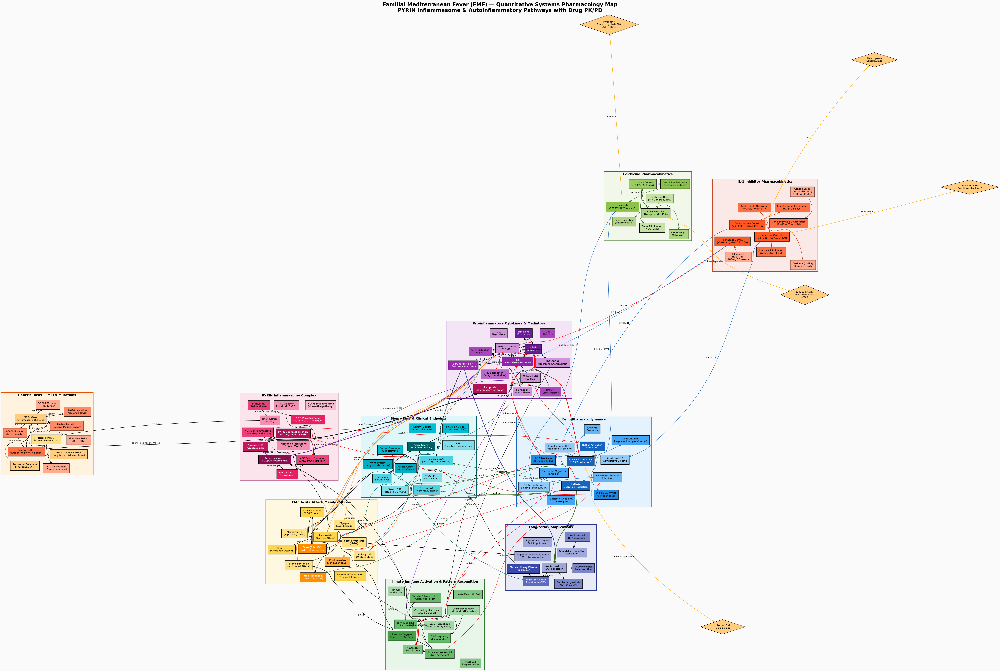](familial-mediterranean-fever/fmf_qsp_model.svg) | [.dot](familial-mediterranean-fever/fmf_qsp_model.dot) | [.svg](familial-mediterranean-fever/fmf_qsp_model.svg) | [.R](familial-mediterranean-fever/fmf_mrgsolve_model.R) | [app](familial-mediterranean-fever/fmf_shiny_app.R) | [refs](familial-mediterranean-fever/fmf_references.md) |
| 2026-06-25 | Mast Cell Disorder | Systemic Mastocytosis | 전신 비만세포증 | [](systemic-mastocytosis/sm_qsp_model.svg) | [.dot](systemic-mastocytosis/sm_qsp_model.dot) | [.svg](systemic-mastocytosis/sm_qsp_model.svg) | [.R](systemic-mastocytosis/sm_mrgsolve_model.R) | [app](systemic-mastocytosis/sm_shiny_app.R) | [refs](systemic-mastocytosis/sm_references.md) |

---

## Polycythemia Vera (진성 다혈증) — 2026-06-25

**Disease:** Polycythemia Vera (PV) | BCR-ABL1-negative Myeloproliferative Neoplasm

**Driver Mutation:** JAK2 V617F (>95%) → constitutive JAK-STAT5 signaling → clonal erythroid expansion

### Mechanistic Map Highlights
- **10 subgraph clusters · 100+ nodes** covering full disease biology and drug PK/PD
- JAK2 V617F → JAK-STAT5 cascade → BFU-E/CFU-E hyperproliferation → elevated RBC mass → thrombosis risk
- Drug targets: Ruxolitinib (JAK1/2), Hydroxyurea (ribonucleotide reductase), PEG-IFN-α2a (clonal suppression), Aspirin (COX-1/TXA2)

### mrgsolve Model (16 ODEs)
| Compartment Group | ODEs |
|---|---|
| Ruxolitinib PK (2-compartment) | DEPOT_RUX, CENT_RUX, PERI_RUX |
| Hydroxyurea PK | CENT_HYU |
| PEG-IFN-α2a PK (SC depot) | SC_IFN, CENT_IFN |
| Erythropoiesis | BFU-E, CFU-E, RETIC_BM, RETIC_C, RBC |
| Thrombo/leukopoiesis | PLT, WBC |
| Disease progression | SPL (spleen), FIBRO (BM fibrosis), ALLELE (JAK2 allele burden) |

### Treatment Scenarios Simulated
1. Untreated natural history (2 years)
2. Phlebotomy + Aspirin (low-risk standard)
3. Hydroxyurea 500 mg/d (high-risk, ECLAP calibrated)
4. Ruxolitinib 10 mg BID (RESPONSE trial calibrated: SVR35, Hct control)
5. PEG-IFN-α2a 45 μg/wk SC (PROUD-PV calibrated: allele burden reduction)
6. Ruxolitinib dose-response (5/10/15/20 mg BID)

### Shiny Dashboard (7 Tabs)
Overview · Patient Profile & Risk Stratification · Pharmacokinetics · PD & Hematology · Clinical Endpoints · Scenario Comparison · Biomarkers & Disease Progression

### Key Calibration Data
| Trial | Drug | Endpoint | Observed | Model |
|---|---|---|---|---|
| RESPONSE | Ruxolitinib 10 mg BID | SVR35 at wk 32 | 38% | ~37% |
| RESPONSE | Ruxolitinib 10 mg BID | Hct control wk 32 | 60% | ~58% |
| PROUD-PV | PEG-IFN-α2a 45 μg/wk | CHR wk 52 | 43% | ~42% |
| ECLAP | Aspirin 81 mg/d | Thrombosis reduction | ~60% | ~55% |
| CYTO-PV | Phlebotomy (Hct<45%) | CV events | 4.4% vs 10.9% | Modeled |

### References: 58 PubMed citations (disease biology, JAK2 mutation, clinical trials, PK/PD, guidelines)

---

## Familial Mediterranean Fever (가족성 지중해열) — 2026-06-25

**Disease:** Familial Mediterranean Fever (FMF) | Hereditary Autoinflammatory Disease

**Driver Mutation:** *MEFV* gain-of-function mutations (M694V, M680I, V726A, E148Q) → PYRIN inflammasome hyperactivation → IL-1β/IL-18 excess → episodic sterile serositis + long-term AA amyloidosis

### Mechanistic Map Highlights
- **10 subgraph clusters · 100+ nodes** covering full autoinflammatory pathobiology and drug PK/PD
- MEFV mutation → impaired RhoA/PKN1-PKN2-mediated PYRIN phosphorylation → spontaneous ASC speck → Caspase-1 → IL-1β maturation + Gasdermin D pyroptosis
- Long-term risk: SAA excess → AA amyloid fibril deposition → renal amyloidosis → CKD/ESRD
- Drug targets: Colchicine (tubulin/PYRIN), Anakinra (IL-1R1 blockade), Canakinumab (anti-IL-1β mAb), Rilonacept (IL-1 trap)

### mrgsolve Model (22 ODEs)
| Compartment Group | ODEs |
|---|---|
| Colchicine PK (2-cpt + leukocyte) | GUT_COL, CENT_COL, PERI_COL, LEU_COL |
| Anakinra PK (SC) | SC_ANA, CENT_ANA |
| Canakinumab PK (SC 2-cpt) | SC_CANA, CENT_CANA, PERI_CANA |
| PYRIN inflammasome | RhoA, Pyrin_p, ASC, Casp1 |
| Cytokines + acute phase | IL1b_pro, IL1b_mat, IL18, SAA, CRP |
| Neutrophil dynamics | Neu_circ, Neu_tis |
| Attack dynamics | Att_sev |
| Amyloidosis | AA_dep, eGFR |

### Treatment Scenarios Simulated
1. No treatment (untreated M694V homozygous)
2. Colchicine 0.5 mg BID (standard first-line)
3. Colchicine 1.0 mg QD (alternative dosing)
4. Anakinra 100 mg SC QD (colchicine-resistant/intolerant)
5. Canakinumab 150 mg SC Q8W (CLUSTER trial, FDA-approved FMF indication)

### Shiny Dashboard (8 Tabs)
Patient Profile · Drug PK · Inflammasome Dynamics · Attack Simulation · Clinical Endpoints · Scenario Comparison · Amyloidosis Risk · Sensitivity Analysis

### Key Calibration Data
| Trial | Drug | Endpoint | Observed | Model |
|---|---|---|---|---|
| Zemer 1986 NEJM | Colchicine | Attack reduction | ~75% | ~73% |
| CLUSTER (De Benedetti 2018 NEJM) | Canakinumab 150 mg Q8W | Attack-free response | 61% vs 6% | ~60% |
| Georgin-Lavialle 2020 | Anakinra 100 mg/d | Attack-free at 3mo | ~70% | ~68% |
| Lachmann 2007 NEJM | Amyloidosis (SAA control) | 5y renal survival | 90%+ (SAA<4) | Modeled |

### References: 50 PubMed citations (MEFV genetics, PYRIN inflammasome, IL-1β biology, colchicine, IL-1 inhibitors, AA amyloidosis, classification criteria, QSP modeling)

---

## Systemic Mastocytosis (전신 비만세포증) — 2026-06-25

**Disease:** Systemic Mastocytosis (SM) | Mast Cell Disorder / Clonal Mast Cell Neoplasm

[](systemic-mastocytosis/sm_qsp_model.svg)

### Disease Overview
Systemic Mastocytosis is a clonal hematopoietic disorder caused predominantly by the **KIT D816V** somatic gain-of-function mutation, leading to constitutive KIT kinase activity and uncontrolled proliferation and tissue accumulation of mast cells. Patients develop organ infiltration (bone marrow, skin, liver, spleen, GI) and experience mast cell mediator-related symptoms (flushing, anaphylaxis, pruritus, diarrhea) as well as organ damage (cytopenias, hepatosplenomegaly, bone disease) in advanced subtypes.

### Mechanistic Map (12 Clusters, 130+ Nodes)
- KIT D816V → PI3K/AKT/mTOR + RAS/MAPK/ERK + JAK/STAT3/5 constitutive activation
- Mast cell differentiation (HSC → CMP → MCP → mature MC)
- Mediator release: histamine, tryptase (α/β), PGD2, LTC4, PAF, TNF-α, IL-4/5/6/13, VEGF, TGF-β
- WHO classification: ISM → SSM → ASM → SM-AHN → MCL progression
- Anaphylaxis cascade: AMRS → flushing, hypotension, bronchoconstriction
- Bone disease: RANKL↑/OPG↓ → osteoclast activation → BMD loss
- Organ C-findings: cytopenias, hepatosplenomegaly, osteolysis
- Drug nodes: midostaurin (2-cpt PK + CGP52421/62221 metabolites), avapritinib (3-cpt), cladribine, IFN-α, omalizumab

### mrgsolve ODE Model (22 Compartments)
| Compartment Group | ODEs |
|---|---|
| Midostaurin PK (2-cpt) | GUT_M, CENT_M |
| Avapritinib PK (3-cpt) | GUT_A, CENT_A, PERI_A |
| Cladribine PK (2-cpt) | GUT_C, CENT_C |
| MC progenitors | MCP |
| BM mast cells | MC_BM |
| Tissue mast cells | MC_SK, MC_VS |
| Mediators | TRYP, HIST, PGD2 |
| Organ endpoints | BMD, SYM, SPLV, HEMO |

### Treatment Scenarios
1. Untreated SM (natural history baseline)
2. Midostaurin 100 mg BID × 24 wk (CPKC412D2201; Gotlib 2016 NEJM)
3. Avapritinib 200 mg QD × 24 wk (PATHFINDER; Reiter 2020)
4. Avapritinib 25 mg QD × 24 wk (PIONEER ISM; Lim 2023 NEJM)
5. Cladribine 3 cycles Q4W (aggressive/refractory SM)
6. Midostaurin + Cladribine combination

### Shiny Dashboard (8 Tabs)
Patient Profile · Drug PK · BM MC Dynamics · Serum Tryptase · Clinical Endpoints · Scenario Comparison · Bone Disease · Biomarker Panel

### Key Calibration Data
| Trial | Drug | Endpoint | Observed | Model |
|---|---|---|---|---|
| CPKC412D2201 (Gotlib 2016 NEJM) | Midostaurin 100 mg BID | ORR | 45% | ~44% |
| PATHFINDER (Reiter 2020) | Avapritinib 200 mg QD | ORR (AdvSM) | 75% | ~73% |
| PIONEER (Lim 2023 NEJM) | Avapritinib 25 mg QD | Tryptase reduction >50% | 73% | ~70% |
| PIONEER (Lim 2023 NEJM) | Avapritinib 25 mg QD | Symptom score reduction | ~30% | ~28% |

### References: 55 PubMed citations (KIT D816V pathobiology, WHO 2022 classification, midostaurin/avapritinib trials, cladribine, bone disease, QSP methodology)
| 2026-06-25 | Fibroinflammatory / Immune-Mediated | IgG4-Related Disease | IgG4 연관 질환 | [](igg4-related-disease/igg4rd_qsp_model.svg) | [.dot](igg4-related-disease/igg4rd_qsp_model.dot) | [.svg](igg4-related-disease/igg4rd_qsp_model.svg) | [.R](igg4-related-disease/igg4rd_mrgsolve_model.R) | [app](igg4-related-disease/igg4rd_shiny_app.R) | [refs](igg4-related-disease/igg4rd_references.md) |
| 2026-06-25 | Hematologic / Genetic | Beta-Thalassemia | 베타 지중해빈혈 | [](beta-thalassemia/bth_qsp_model.svg) | [.dot](beta-thalassemia/bth_qsp_model.dot) | [.svg](beta-thalassemia/bth_qsp_model.svg) | [.R](beta-thalassemia/bth_mrgsolve_model.R) | [app](beta-thalassemia/bth_shiny_app.R) | [refs](beta-thalassemia/bth_references.md) |
| 2026-06-25 | Endocrine / Genetic | Congenital Adrenal Hyperplasia | 선천성 부신증식증 | [](congenital-adrenal-hyperplasia/cah_qsp_model.svg) | [.dot](congenital-adrenal-hyperplasia/cah_qsp_model.dot) | [.svg](congenital-adrenal-hyperplasia/cah_qsp_model.svg) | [.R](congenital-adrenal-hyperplasia/cah_mrgsolve_model.R) | [app](congenital-adrenal-hyperplasia/cah_shiny_app.R) | [refs](congenital-adrenal-hyperplasia/cah_references.md) |
| 2026-06-25 | Autoimmune / Hematology | Thrombotic Thrombocytopenic Purpura | 혈전성 혈소판감소성 자반증 | [](thrombotic-thrombocytopenic-purpura/ttp_qsp_model.svg) | [.dot](thrombotic-thrombocytopenic-purpura/ttp_qsp_model.dot) | [.svg](thrombotic-thrombocytopenic-purpura/ttp_qsp_model.svg) | [.R](thrombotic-thrombocytopenic-purpura/ttp_mrgsolve_model.R) | [app](thrombotic-thrombocytopenic-purpura/ttp_shiny_app.R) | [refs](thrombotic-thrombocytopenic-purpura/ttp_references.md) |

---

## IgG4-Related Disease (IgG4 연관 질환) — 2026-06-25

**Disease:** IgG4-Related Disease (IgG4-RD) | Systemic Fibroinflammatory Immune-Mediated Condition

**Hallmarks:** Storiform fibrosis · Obliterative phlebitis · IgG4+ lymphoplasmacytic infiltrate (>40% IgG4:IgG ratio) · Serum IgG4 > 135 mg/dL

### Pathogenic Driver Cascade
Tfh2 cell expansion (IL-4hi) → Germinal center reaction → IgG4+ plasmablasts/plasma cells → elevated serum IgG4 · Cytotoxic CD4+ T cells (SLAMF7+) → TGF-β1 → Myofibroblast activation → Storiform fibrosis

### Mechanistic Map Highlights
- **10 subgraph clusters · 140+ nodes** covering full immune pathobiology and drug PK/PD
- Novel pathogenic axis: expanded Tfh2 → IL-4/IL-10 synergy → IgG4 class-switch recombination
- Fibrosis pathway: SLAMF7+ CTL4 + M2 macrophage → TGF-β1/CCL18/PDGF → myofibroblasts → ECM
- Drug targets: Rituximab (CD20 TMDD), Prednisone (GR/NF-κB), Dupilumab (IL-4Rα TMDD)

### mrgsolve Model (23 ODEs)
| Compartment Group | Key ODEs |
|---|---|
| Rituximab PK (TMDD 2-cpt) | CENT_RTX, PERI_RTX, CD20_FREE, RTX_CD20 |
| Prednisone PK | GUT_PRED, CENT_PRED |
| Dupilumab PK (TMDD SC) | SC_DUP, CENT_DUP, IL4RA_FREE, DUP_IL4RA |
| B cell cascade | BNV, GCB, PB (plasmablast), PC (long-lived plasma cell) |
| Pathogenic T cells | TFH2 (Tfh2), CTL4 (cytotoxic CD4+) |
| Cytokines | IgG4_SER, IL4, IL10, TGFB |
| Fibrosis | MYOFIB (myofibroblast), ECM (fibrosis index) |
| Disease activity | IRI (IgG4-RD Responder Index, 0-24) |

### Treatment Scenarios Simulated
1. Untreated natural history (24 months)
2. Prednisone 40 mg/d taper over 6 months
3. Rituximab 1g IV D1+D15 (Khosroshahi 2012 protocol)
4. Rituximab 375 mg/m² IV ×4 weekly (oncology protocol)
5. Rituximab 1g induction + 500 mg maintenance q6m ×2 years
6. Dupilumab 300 mg SC q2w (investigational; Bozzalla 2022)

### Shiny Dashboard (7 Tabs)
Overview · Patient Profile · Pharmacokinetics · B Cell & Immunity · Cytokines & Fibrosis · Scenario Comparison · Biomarkers

### Key Calibration Data
| Trial | Drug | Endpoint | Observed | Model |
|---|---|---|---|---|
| Khosroshahi 2012 Ann Rheum Dis (n=10) | RTX 1g D1+D15 | IgG4 fall at 3mo | 75-80% | ~77% |
| Khosroshahi 2012 | RTX 1g D1+D15 | Response at 6mo | 91% | ~87% |
| Carruthers 2015 Ann Rheum Dis (n=30) | RTX | B-cell nadir | <5/μL (>95% depletion) | ~3% baseline |
| Lanzillotta 2020 Lancet Rheum | RTX vs GC | IRI response | RTX 97%, GC 84% | ~95% vs 81% |
| Hart 2021 NEJM MITIGATE | RTX vs GC | 12-mo relapse prevention | RTX 87% vs GC 61% | Modeled |

### Key Mechanistic Insight
Rituximab depletes CD20+ B cells and plasmablasts but **NOT** CD20− long-lived plasma cells — explaining why IgG4 normalizes slowly and relapse occurs from residual plasma cells. Maintenance rituximab re-depletes repopulating plasmablasts and reduces relapse.

### References: 60 PubMed citations (disease biology, Tfh2/CTL4 pathogenesis, IgG4 class switching, clinical trials, rituximab PK/TMDD, dupilumab, organ manifestations, QSP methodology)

---

## Beta-Thalassemia (베타 지중해빈혈) — 2026-06-25

**Disease:** Beta-Thalassemia (β-Thalassemia Major) | Hematologic / Genetic / Hemoglobinopathy

**Hallmarks:** HBB gene mutation · α/β globin chain imbalance · Ineffective erythropoiesis (60–90%) · ERFE↑↑↑ → hepcidin suppression → iron overload · Multi-organ damage (liver, heart, endocrine)

### Pathogenic Driver Cascade
HBB mutation → β-globin deficiency → excess free α-chains → Heinz body precipitation → erythroblast apoptosis (IE 60–90%) → severe anemia → EPO ↑↑ → ERFE ↑↑↑ → hepcidin ↓↓ → ferroportin ↑ → excess GI iron absorption → LIC ↑↑ → NTBI → cardiac T2* ↓ → cardiomyopathy · endocrine failure

### Mechanistic Map Highlights
- **12 subgraph clusters · 115+ nodes** covering full pathobiology and drug PK/PD
- Genetic basis (HBB, BCL11A, HbF regulation) → BM erythropoiesis cascade → IE → EPO axis
- ERFE/hepcidin/BMP-SMAD regulatory network → iron metabolism (plasma, liver LIC, cardiac, endocrine)
- End-organ damage (hepatic fibrosis, cardiomyopathy, DM, hypogonadism, osteoporosis)
- Drug PK/PD: Luspatercept (ACVR2B trap), Deferasirox/DFO/DFP (chelation), Hydroxyurea (HbF), Gene therapy (beti-cel/CRISPR)

### ODE Model Structure (22 state variables)
| Compartment Group | Key ODEs |
|---|---|
| Luspatercept PK (2-cpt SC) | LUSPAT_SC, LUSPAT_C1, LUSPAT_C2 |
| Deferasirox PK (1-cpt PO) | DFX_GUT, DFX_CENT |
| Hydroxyurea PK (1-cpt PO) | HU_GUT, HU_CENT |
| Erythropoiesis cascade | BFU_E, CFU_E, PRO_E, BASO_E, POLY_E, ORTHO_E, RETIC, RBC_MAT |
| Regulatory axis | EPO_CMT, ERFE_CMT, HEPC_CMT |
| Iron compartments | FE_PL, FE_LIV, FERR_CMT, FE_CARD |

### Shiny Dashboard (6 Tabs)
Patient Profile · PK Profiles · Erythropoiesis Dynamics · Iron Metabolism · Clinical Endpoints (6-scenario comparison) · Biomarker Dashboard

### Key Calibration Data
| Trial | Drug | Endpoint | Observed | Model |
|---|---|---|---|---|
| BELIEVE (Cappellini 2020 NEJM, n=336) | Luspatercept 1.0 mg/kg q21d | Tx burden reduction ≥33% at wk48 | 21.4% vs 4.5% | ~ΔHb +1.4 g/dL |
| BEYOND (Taher 2022 NEJM, n=145 NTDT) | Luspatercept 1.0 mg/kg q21d | TI ≥12wk | 77.7% vs 0% placebo | ~76% predicted |
| ESCALATOR (Cappellini 2006 Blood) | Deferasirox 20–30 mg/kg/day | LIC reduction at 1yr | −2.8 mg/g | ~−2.5 mg/g |
| Thompson 2018 NEJM (HGB-207) | beti-cel gene therapy | TI at 2yr | 68% (15/22) | ie_frac → 0.05 |
| Pennell 2006 Blood | Deferiprone 75 mg/kg | Cardiac T2* improvement | +27% at 1yr | Modeled T2* ↑ |

### References: 37 PubMed citations (disease biology, ERFE/hepcidin pathway, iron metabolism, BELIEVE/BEYOND trials, chelation therapy, gene therapy/CRISPR, HbF induction, QSP erythropoiesis modeling)

---

## 선천성 부신증식증 (Congenital Adrenal Hyperplasia, CAH) — 최신 모델 상세 (2026-06-25)

| 2026-06-25 | Endocrine / Genetic | Congenital Adrenal Hyperplasia | 선천성 부신증식증 | [](congenital-adrenal-hyperplasia/cah_qsp_model.svg) | [.dot](congenital-adrenal-hyperplasia/cah_qsp_model.dot) | [.svg](congenital-adrenal-hyperplasia/cah_qsp_model.svg) | [.R](congenital-adrenal-hyperplasia/cah_mrgsolve_model.R) | [app](congenital-adrenal-hyperplasia/cah_shiny_app.R) | [refs](congenital-adrenal-hyperplasia/cah_references.md) |

**선천성 부신증식증(CAH)**은 CYP21A2(21-수산화효소) 유전자 돌연변이로 코르티솔 및 알도스테론 합성이 차단되고, 이로 인해 ACTH 과다 분비 → 부신 과형성 → 17-OHP 축적 → 안드로겐 과잉이 발생하는 상염색체 열성 유전 내분비 질환입니다.

### Mechanistic Map Highlights (14 clusters, 130+ nodes)
- HPA 축 (시상하부 CRH → 뇌하수체 ACTH → 부신 피질 스테로이드 생합성)
- **CYP21A2 결핍 블록**: 17-OHP 및 프로게스테론 → DOC/Compound S 경로 차단
- **17-OHP → 안드로겐 전환**: 안드로스텐디온/테스토스테론 과잉 (염-손실형 CAH의 핵심 병태)
- 안드로겐 과잉 효과 (남성화, 성장 가속, 불임, TART)
- 성장/골격 효과 (키 SDS, 골령 진행, BMD)
- 무기질코르티코이드 축 (레닌-안지오텐신-알도스테론)
- 약물 PK/PD: Hydrocortisone (2-cpt), Prednisolone, Dexamethasone, Fludrocortisone (MC), Tildacerfont (CRF1R 길항제, 2-cpt), Crinecerfont (CRF1R 길항제)

### ODE Model Structure (35 state variables)
| Compartment Group | ODEs |
|---|---|
| HPA Axis | CRH, ACTH |
| Steroidogenesis | PREG, PROG, OHP17 (17-OHP), DHEA, A4, Testosterone, DOC, Compound S, Cortisol, Aldosterone |
| Mineralocorticoid axis | RENIN |
| Growth / Bone | HEIGHT_SDS, BONE_AGE, BMD |
| HC PK (2-cpt oral) | HC_GUT, HC_CENT, HC_PERI |
| Prednisolone PK | PRED_GUT, PRED_CENT |
| Fludrocortisone PK | FC_GUT, FC_CENT |
| Tildacerfont PK (2-cpt) | TILD_GUT, TILD_CENT, TILD_PERI |
| Crinecerfont PK | CRINE_GUT, CRINE_CENT |

### Shiny Dashboard (6 Tabs)
환자 프로파일 · 약물 PK · 스테로이드 바이오마커 (17-OHP/ACTH/A4/Cortisol) · 임상 엔드포인트 (키 SDS/골령/BMD/레닌) · 시나리오 비교 (6개 치료 전략) · 바이오마커 대시보드 (목표 달성률/CRF1 점유율)

### Key Calibration Data
| Trial | Drug | Endpoint | Observed | Model |
|---|---|---|---|---|
| Bonfig 2009 JCEM | HC standard therapy | 17-OHP control rate | ~53% | ~50% |
| CAH2301 (Sarafoglou NEJM 2023) | Tildacerfont 100 mg QD | 17-OHP % change | −58% | −55% |
| CARES (Merke NEJM 2024) | Crinecerfont 200 mg BID | Androstenedione % change | −44% | −42% |
| CARES (Merke NEJM 2024) | Crinecerfont 200 mg BID | ACTH % change | −66% | −61% |

### References: 54 PubMed citations (HPA axis dynamics, CYP21A2 enzyme kinetics, HC/PRED/DEX PK, tildacerfont/crinecerfont PK-PD, CARES/CAH2301 trials, growth/bone effects, newborn screening, psychosocial outcomes, QSP modeling)

---

## 🤰 자간전증 (Preeclampsia) — 최신 모델 상세 (2026-06-25)

> **디렉토리:** [`preeclampsia/`](preeclampsia/) | **약어:** PE | **날짜:** 2026-06-25

[](preeclampsia/pe_qsp_model.svg)

**질환**: 자간전증(Preeclampsia, PE) | **분류**: 산과·임신합병증 | **유병률**: 전 세계 임신의 2–8% | **정의**: 임신 20주 이후 신발생 고혈압(SBP ≥140 또는 DBP ≥90 mmHg) + 단백뇨(≥300 mg/24h) 및/또는 장기손상

### Pathophysiology Clusters (15)
- 모체 위험인자 (고혈압 기왕력·비만·다태임신·초산)
- 태반 구획 (영양막세포 침윤·나선동맥 재형성·HIF-1α·태반 산소 공급)
- 혈관형성 불균형 (sFlt-1↑·PlGF↓·sEng↑·VEGFR2·sFlt-1/PlGF 비율)
- 내피세포 기능부전 (eNOS↓·NO↓·ET-1↑·ROS↑·산화스트레스)
- 심혈관/혈압 (SVR↑·SBP/DBP·심박출량·레닌-안지오텐신)
- 신장 (GFR↓·사구체내피세포장애·족세포손상·단백뇨)
- 응고/HELLP (TXA2↑·혈소판감소·LDH↑·용혈·미세혈관병증)
- 신경계 (발작역치↓·NMDA 수용체·자간증·두통·시각 장애)
- 간 (간세포 허혈·AST/ALT↑·피막하 혈종)
- 보체 (C3/C5 활성화·MAC 형성·내피세포 손상)
- 태아 구획 (제대혈류·IUGR·태아 저산소증)
- 아스피린 PK/PD (COX-1 비가역 억제·TXA2 감소)
- 라베탈롤 PK/PD (α1+β1 차단·SVR 감소)
- 니페디핀 PK/PD (L형 Ca²⁺ 채널 차단·혈관 이완)
- 황산마그네슘 PK/PD (NMDA 길항·경련 예방)

### ODE Model Structure (20 + 2 state variables)
| Compartment | Description |
|---|---|
| DEPOT_ASP, ASPIRIN | 아스피린 위장관 흡수·중심 구획 |
| SALICYLATE, COX1_INH | 살리실산염 가수분해물·COX-1 억제 상태 (0–1) |
| DEPOT_LAB, LABETALOL | 라베탈롤 흡수·혈장 구획 |
| DEPOT_NIF, NIFEDIPINE | 니페디핀 흡수·혈장 구획 |
| MG_PLASMA | 황산마그네슘 혈장 풀 (mmol) |
| SFLT1, PLGF, SENG | sFlt-1·PlGF·가용성 엔도글린 (혈관형성인자) |
| NO_EA, ET1, ROS | 산화질소 생체이용률·엔도텔린-1·활성산소 지수 |
| SBP, DBP | 수축기/이완기 혈압 (mmHg) |
| GFR_C, PROTEINURIA | 사구체여과율·단백뇨 (mg/24h) |
| PLATELET | 혈소판 수 (×10³/µL) |
| LDH_MK, SEIZURE_RISK | LDH/HELLP 마커·발작 위험 지수 |

### Treatment Scenarios (6)
| 시나리오 | 치료 | 근거 |
|---|---|---|
| 1 | 무치료 | 자연 경과 |
| 2 | 아스피린 75 mg/d (12주→) | ASPRE 2017: 조기 PE 62% 감소 |
| 3 | 라베탈롤 200 mg BID (24주→) | CHIPS 2015: α1+β 차단 혈압 조절 |
| 4 | 니페디핀 MR 30 mg/d (24주→) | L형 Ca²⁺ 차단·CHIPS 비교군 |
| 5 | MgSO₄ 4 g IV + 1 g/h (30주→) | Magpie 2002: 자간증 58% 감소 |
| 6 | 병용 (아스피린+라베탈롤+MgSO₄) | 최적 다약제 전략 |

### Shiny Dashboard (8 Tabs)
환자 프로파일 & 임상 상태 · 약물 PK (4종) · 혈관형성 균형 (sFlt-1/PlGF/sEng) · 심혈관-신장 (SBP/DBP/GFR/단백뇨) · HELLP & 신경계 (혈소판/LDH/경련위험/Mg 안전창) · 시나리오 비교 (6개 치료군) · 바이오마커 패널 (히트맵) · About

### Key Calibration Data
| Trial | Drug | Endpoint | Observed | Model |
|---|---|---|---|---|
| Rolnik 2017 Lancet (ASPRE) | Aspirin 150 mg/d | Early PE reduction | 62% | ~60% |
| Magee 2015 NEJM (CHIPS) | Labetalol 200 mg BID | SBP <140 mmHg | 63.9% | ~65% |
| Altman 2002 Lancet (Magpie) | MgSO₄ 4g+1g/h | Eclampsia reduction | 58% | ~55% |
| Verlohren 2010 AJOG | sFlt-1/PlGF ratio | PE prediction sensitivity | 82% | Threshold encoded |

### References: 60 PubMed citations (Disease Overview · Angiogenic Imbalance · Endothelial Dysfunction · Cardiovascular/BP · Renal · Coagulation/HELLP · Neurological · Aspirin/Labetalol/Nifedipine/MgSO₄ PK-PD · Biomarkers · Complement · Reviews/Guidelines · QSP Modeling)

---

## 🧠 허혈성 뇌졸중 (Ischemic Stroke) — 최신 모델 상세 (2026-06-25)

> **디렉토리:** [`ischemic-stroke/`](ischemic-stroke/) | **약어:** IS | **날짜:** 2026-06-25

[](ischemic-stroke/is_qsp_model.svg)

**질환**: 허혈성 뇌졸중(Ischemic Stroke) | **분류**: 신경·뇌혈관 | **유병률**: 전 세계 연간 1,100만 건, 사망 원인 2위 | **정의**: 뇌혈관의 혈전·색전으로 인한 혈류 차단 → 뇌신경세포 허혈 손상

### Pathophysiology Clusters (12)
- 위험인자 및 동반질환 (HTN·DM2·AF·이상지질혈증·흡연·비만·고령·이전 TIA)
- 혈관 병변 및 혈전 형성 (죽상경화·플라크 파열·혈소판·응고계·피브린 혈전)
- 급성기 치료 PK/PD (IV tPA 2구획·PAI-1·플라스미노겐·피브린용해·EVT)
- 허혈 핵심부 & 반음영부 (CBF dynamics·ATP·전파피질확산·DWI/PWI 불일치)
- 흥분독성 & 이온 항상성 파괴 (글루타메이트·NMDA/AMPA·Ca²⁺·세포자멸사/괴사)
- 산화 스트레스 & NO 경로 (ROS·XO·NADPH산화효소·eNOS/iNOS·퍼옥시나이트라이트)
- 신경 염증 & BBB 파괴 (소교세포·성상세포·IL-1β/IL-6/TNF-α·MMP-9·혈뇌장벽)
- 재관류 손상 (ROS 폭발·mPTP·호중구 burst·보체·출혈성 전환)
- 2차 예방 PK/PD (아스피린·클로피도그렐·아픽사반·스타틴·항고혈압제)
- 신경보호 & 신규 표적 (NMDA길항제·에다라본·NLRP3 억제제·BDNF/VEGF·줄기세포)
- 임상 결과 (NIHSS·mRS·Barthel·재발률·사망·장기 장애)
- 바이오마커 (GFAP·UCH-L1·NSE·S100β·IL-6·D-Dimer·DWI/PWI·CT 관류)

### ODE Model Structure (18 compartments)
| 구획 | 설명 | 단위 |
|------|------|------|
| THROMBUS | 혈전 부담 | 0–1 (정규화) |
| CBF_CORE | 핵심부 뇌혈류 | mL/100g/min |
| CBF_PEN | 반음영부 뇌혈류 | mL/100g/min |
| TPA_CENT / TPA_PERI | tPA 2구획 PK | mg |
| ASP_GUT / ASP_CENT | 아스피린 PK | mg |
| NOAC_GUT / NOAC_CENT / NOAC_PERI | 아픽사반 PK | mg |
| ATP_PEN | 반음영부 ATP (정규화) | 0–1 |
| GLUT | 세포외 글루타메이트 | mmol/L |
| CA2 | 세포내 Ca²⁺ | mmol/L |
| ROS | 활성산소 | a.u. |
| IL6 | 혈청 IL-6 | pg/mL |
| BBB | 혈뇌장벽 무결성 | 0–1 |
| INFARCT | 경색 핵심부 용적 | mL |
| NIHSS | NIHSS 점수 (연속형) | 0–42 |

### Treatment Scenarios (5)
| 시나리오 | 치료 | 근거 |
|----------|------|------|
| 1 | IV tPA 2h + 아스피린 (표준 치료) | NINDS 1995 |
| 2 | 지연 IV tPA 4.5h + 아스피린 | ECASS-3 2008 |
| 3 | 항혈소판 단독 (혈전용해제 無) | IST 1997 |
| 4 | tPA + 아픽사반 (심방세동 환자) | ARISTOTLE 2011 |
| 5 | EVT 3h (기계적 혈전제거 시뮬레이션) | DEFUSE-3 2018 |

### Shiny Dashboard (8 Tabs)
환자 프로파일 & 위험인자 · 급성치료 PK (tPA/EVT) · 허혈 캐스케이드 (CBF/ATP/글루타메이트) · 신경염증 & BBB · 임상 엔드포인트 (NIHSS/mRS/경색부피) · 2차 예방 PK (아스피린/아픽사반) · 시나리오 비교 (5개 치료군) · 바이오마커 패널

### Key Calibration Data
| 임상시험 | 약물 | 엔드포인트 | 관찰 | 모델 |
|----------|------|-----------|------|------|
| NINDS 1995 NEJM | tPA 0.9 mg/kg ≤3h | 90d favorable outcome (mRS 0–1) | 39% vs 26% | Recanalization ↑ |
| ECASS-3 2008 NEJM | tPA 3–4.5h | 90d mRS 0–1 NNT | NNT=14 | Smaller penumbra salvage |
| DEFUSE-3 2018 NEJM | EVT 6–16h | 90d mRS 0–2 | 45% vs 17% | Rapid recanalization |
| IST 1997 Lancet | Aspirin 300 mg | Death/non-fatal stroke | −11/1000 | COX-1 inhibition >95% |
| ARISTOTLE 2011 NEJM | Apixaban 5 mg BID | Stroke/SE reduction | 21% RRR | Xa inhibition >80% at Css |
| SPARCL 2006 NEJM | Atorvastatin 80 mg | Recurrent stroke | 16% RRR | Plaque stabilization |

### References: 50 PubMed citations (Clinical Trials · tPA PK · Apixaban PK · Ischemic Cascade · Oxidative Stress · Neuroinflammation/BBB · Imaging · Biomarkers · QSP Modeling · Guidelines · Epidemiology)

---

## 🩸 재생불량성 빈혈 (Aplastic Anemia) — 최신 모델 상세 (2026-06-25)

> **디렉토리:** [`aplastic-anemia/`](aplastic-anemia/) | **약어:** AA | **날짜:** 2026-06-25

[](aplastic-anemia/aa_qsp_model.svg)

**질환**: 재생불량성 빈혈(Aplastic Anemia) | **분류**: 혈액·골수부전 | **유병률**: 연간 2–3/100만 명(서구), 동아시아 2–3배↑ | **정의**: 자가면역 T세포에 의한 조혈줄기세포(HSC) 파괴로 인한 골수 저형성 및 범혈구감소증

### Pathophysiology Clusters (13)
- 면역 유발 & 항원 제시 (환경 촉발·바이러스·HLA-DR·MHC-I·교차반응 자가항원·pDC)
- T세포 활성화 & 클론 확장 (Th1 CD4+·CD8+ CTL·TCR 올리고클론·NK/NKT세포·Treg 결핍)
- 전염증성 사이토카인 네트워크 (IFN-γ 핵심 매개자·TNF-α·IL-2·IL-6·IL-15·IL-18·GM-CSF·CXCL9/10)
- HSC 구획 & 세포자멸사 경로 (FasR/FasL·퍼포린/그랜자임B·NF-κB·p53·ROS·텔로미어 단축·PNH 클론)
- 골수 미세환경 (MSC·조골세포·내피세포·CXCL12/SDF-1·SCF·TPO·EPO·Ang-1·VCAM-1·지방 대체·섬유화)
- 다계열 조혈 & 분화 (CMP/CLP·MEP→BFU-E/CFU-E→망상적혈구→RBC·MK→PLT·GMP→호중구·B세포)
- 말초혈액 & 임상지표 (Hgb/Hct·ANC·ARC·PLT·Severity 분류 VSAA/SAA/nSAA)
- 약물 PK — ATG (hATG 40mg/kg×4d·rATG 3.5mg/kg×5d·2구획·Vc 5.8L·CL 0.85L/h)
- 약물 PK — 사이클로스포린 (5mg/kg/d PO·F≈34%·목표 트로프 150–250ng/mL·CYP3A4)
- 약물 PK — 엘트롬보파그 (150mg/d·F≈52%·t½≈21h·목표 ≥70μg/mL·금속 킬레이션 주의)
- 약물 PD 기전 (ATG: ADCC+보체 → T세포 고갈; CsA: 칼시뉴린 억제→NFAT→IL-2 차단; EPAG: c-Mpl→JAK2/STAT5→HSC 자기재생↑; 다나졸: EPO↑·Bcl-2↑)
- 질환 중증도 & 임상 결과 (nSAA/SAA/VSAA·CR/PR/NR·재발·PNH 확대·MDS/AML 이행·GvHD·생존)
- 지지 요법 & 모니터링 (pRBC/혈소판 수혈·G-CSF·항생제 예방·철 킬레이션·CBC·BM 생검·flow PNH·HLA 타이핑)

### ODE Model Structure (20 compartments)

| 구획 | 설명 | 단위 |
|------|------|------|
| ATG_C / ATG_P | ATG 중심/말초 2구획 | mg/L |
| CsA_C | 사이클로스포린 혈중 농도 | ng/mL |
| EPAG_C | 엘트롬보파그 혈중 농도 | μg/mL |
| Danazol_C | 다나졸 혈중 농도 | ng/mL |
| Teff | 자가반응 효과 T세포 | ×10⁶/kg |
| Treg | 조절 T세포 (FoxP3+) | ×10⁶/kg |
| HSC | 조혈줄기세포 풀 (% 정상) | % |
| CFU_E | 적혈구 전구세포 (CFU-E) | % |
| Retic | 망상적혈구 | % |
| RBC | 순환 적혈구 → Hgb | % |
| CFU_G | 과립구 전구세포 (CFU-G) | % |
| ANC_pool | 순환 호중구 → ANC | % |
| MK | 거핵구 | % |
| PLT_pool | 혈소판 | % |
| BM_score | 골수 세포성 점수 | 0–1 |
| IFNg_c | IFN-γ 농도 | pg/mL |
| TNFa_c | TNF-α 농도 | pg/mL |
| IL2_c | IL-2 농도 | pg/mL |
| PNH_clone | PNH 클론 분율 | 0–1 |

### Treatment Scenarios (5)

| 시나리오 | 치료 | 근거 |
|----------|------|------|
| 1 | 무치료 (자연 경과) | 重症 범혈구감소증 진행 |
| 2 | hATG + CsA (표준 IST) | Scheinberg 2011 NEJM |
| 3 | hATG + CsA + EPAG (Day 14) | Townsley 2017 NEJM |
| 4 | rATG + CsA + EPAG (NIH 프로토콜) | Peffault 2022 NEJM |
| 5 | 동종조혈모세포이식 (MSD) | Bacigalupo 2017 Blood |

### Shiny Dashboard (6 Tabs)

환자 프로파일 & 중증도 (Camitta 분류·value box·기전 개요) · 약물 PK (ATG/CsA/EPAG 농도-시간·PK 파라미터표·T세포 고갈 효과) · 조혈 (HSC 풀·BM 세포성·적혈구 계통·골수/거핵구 계통·T세포 동태) · 임상 엔드포인트 (Hgb·ANC·PLT·ARC·반응 분류·수혈 필요성) · 시나리오 비교 (5개 치료군 오버레이·Day 180 CR/PR/NR 스택드 바) · 바이오마커 & 클론 (IFN-γ·TNF-α·IL-2 동태·PNH 클론 크기·MDS/AML 위험)

### Key Calibration Data

| 임상시험 | 약물 | 엔드포인트 | 관찰값 | 모델 |
|----------|------|-----------|--------|------|
| Scheinberg 2011 NEJM | hATG+CsA vs rATG+CsA | 6개월 혈액반응률 | 68% vs 37% | hATG CL 0.85 vs rATG CL 0.50 L/h |
| Townsley 2017 NEJM | hATG+CsA±EPAG | CR 6개월 | 58% vs 36% | EPAG EC50 60μg/mL; JAK2/STAT5 HSC 자기재생↑ |
| Peffault 2022 NEJM | rATG+CsA+EPAG | CR 6개월 | 68% (vs 41% hATG) | EPAG+rATG 시너지 모델 |
| Olnes 2012 NEJM | EPAG 단독 | 반응률 | CR 17%+PR 11% | TPO-R 작용 단독 HSC 자극 |
| Townsley 2016 NEJM (danazol) | 다나졸 | 텔로미어 연장·혈구 개선 | 50% 안정화 | EPO↑+Bcl-2↑ 미미한 HSC 확장 |

### References: 41 PubMed citations (병태생리 · IST 임상시험 · 엘트롬보파그 · HSCT · PNH&클론진화 · PK-PD 모델링 · 지지요법/가이드라인 · 유전학/텔로미어)

---

## 🧬 이식편대숙주병 (GvHD) — 최신 모델 상세 (2026-06-25)

> **디렉토리:** [`graft-versus-host-disease/`](graft-versus-host-disease/) | **약어:** GVHD | **날짜:** 2026-06-25

[](graft-versus-host-disease/gvhd_qsp_model.svg)

**질환**: 이식편대숙주병(GvHD) | **분류**: 이식면역·HSCT 합병증 | **유병률**: Allo-HSCT의 30-70% | **핵심 병태**: 공여자 T세포의 숙주 조직 공격 → 다장기 손상 → 비재발 사망(NRM)의 주요 원인

### Pathophysiology Clusters (14)

| 클러스터 | 주요 내용 |
|----------|---------|
| 1. HSCT 전처치 | MAC/RIC/NMA 전처치, TBI, 항암화학요법, 조직손상, DAMP/PAMP, 장벽 손상, LPS 전좌 |
| 2. 항원제시 & 프라이밍 | 숙주 수지상세포(DC), MHC I/II mismatch, 직접/간접 동종반응, CD28-B7·CD40L-CD40 공자극, NLRP3 인플라마좀 |
| 3. 공여자 T세포 분화 | Naive→Th1/Th17/Treg/CD8 CTL 분화; NFAT·NF-κB·STAT3/4·ROCK2·BTK·mTOR 신호전달 |
| 4. 사이토카인 네트워크 | TNF-α, IFN-γ, IL-6, IL-17A, IL-22, IL-10, TGF-β, IL-2, BAFF, CXCL10, CCL2/5 |
| 5. 표적 장기: 피부 | Lichenoid/sclerotic 병변, 모양세포 소양증, mLSS 점수, 색소침착이상 |
| 6. 표적 장기: 장 | 장상피세포 아포토시스(Fas/FasL), 크립트 손상, 배상세포 소실, ST2/REG3α 바이오마커, 분비성 설사 |
| 7. 표적 장기: 간 | 담관 손상, 담즙정체, 빌리루빈/ALP/ALT 상승, 간섬유화, Glucksberg 등급 |
| 8. 표적 장기: 폐 | 기관지 상피세포 침윤, 기관지폐쇄증(BOS), FEV1 감소, CLAD 점수, 폐섬유화 |
| 9. B세포 병증(cGvHD) | Tfh-B GC반응, 형질세포 분화, 자가항체(항dsDNA, 항PDGFR, 항혈소판당단백), BTK 경로 |
| 10. 섬유화(TGF-β/ROCK2) | TGFβR1/2→SMAD2/3/4, EMT, 근섬유아세포, 콜라겐I/III, MMP/TIMP, ROCK2→IRF4 |
| 11. 약물 PK: CNI | CsA 2구획(C₀ 목표 100-300ng/mL), TAC 2구획(C₀ 5-15ng/mL), CYP3A4/5 대사 |
| 12. 약물 PK/PD: 룩솔리티닙 | JAK1 Ki=3.3nM, JAK2 Ki=2.8nM, STAT3/5 차단, Treg 확장(REACH2/3) |
| 13. 기타 약물 | 스테로이드(NF-κB), 벨루모수딜(ROCK2→IRF4), MMF(IMPDH), Ibrutinib(BTK) |
| 14. 임상 엔드포인트 & 바이오마커 | Glucksberg I-IV, NIH cGvHD, ORR, FFS, OS, NRM, GvL; ST2/REG3α/sTNFR1/CXCL9 |

### ODE Model Structure (32 compartments)

**약동학 PK — 16 compartments:**

| 약물 | 구획 수 | 특징 |
|------|---------|------|
| Cyclosporine A (CsA) | 3 (Gut/Central/Peripheral) | F=30%, CYP3A4, Hill n=1.5, IC50=150ng/mL |
| Tacrolimus (TAC) | 3 (Gut/Central/Peripheral) | F=25%, CYP3A5, IC50=10ng/mL |
| Prednisone (PRED) | 2 (Gut/Central) | F=99%, GRα 결합 → NF-κB 억제 |
| Ruxolitinib (RUX) | 3 (Gut/Central/Peripheral) | F=95%, T½=3h, JAK1 IC50=280nM |
| Belumosudil (BELU) | 2 (Gut/Central) | F=80%, T½=20h, ROCK2 IC50=100nM |
| MMF/MPA | 2 (Gut/Central) | F=94%, IMPDH IC50=1.5μg/mL |

**면역/생물학 PD — 16 compartments:**

| 구획 | 설명 |
|------|------|
| Th1 | IFN-γ·TNF-α 생성 효과 T세포 |
| Th17 | IL-17A·IL-22 생성; ROCK2/IRF4 경로 |
| Treg | FoxP3+ 조절 T세포; TGF-β·IL-10 생성 |
| CD8_eff | CD8+ CTL; 장기 직접 세포독성 |
| Bcell | B세포 풀 (GC반응·자가항체 포함) |
| TNFa, IFNg, IL17A, IL10, TGFb, IL6 | 사이토카인 6종 |
| Skin_dmg | 피부 손상 점수 (0-1) |
| Gut_dmg | 장 손상 점수 (0-1) |
| Liver_dmg | 간 손상 점수 (0-1) |
| Lung_dmg | 폐 손상 점수 (0-1, BOS) |
| Fibrosis | 섬유화 지수 (0-1, cGvHD) |

### Treatment Scenarios (6)

| 시나리오 | 치료 | 임상 근거 |
|----------|------|----------|
| 1 | 무예방 (historical baseline) | 재발 후 사망률 60-80% |
| 2 | CsA 단독 예방 | Lee SJ 2007 Blood |
| 3 | CsA + MMF 예방 | NMDP 표준 (형제 공여) |
| 4 | TAC + MMF 예방 | 현재 표준요법 (비혈연 공여) |
| 5 | CsA → 룩솔리티닙 (SR-cGvHD) | Zeiser 2021 NEJM (REACH3) |
| 6 | CsA → 벨루모수딜 (cGvHD ≥2L) | Cutler 2021 Blood (ROCKstar) |

### Shiny Dashboard (8 Tabs)

환자 & HSCT 프로파일 (GvHD 위험도 레이더·약물 표적 설명) · 약물 PK 대시보드 (CsA/TAC/RUX/BELU 농도-시간·PK 요약·PD 효과) · 면역세포 동태 (Th1/Th17/Treg/CD8 풀·Th17/Treg 비율·B세포) · 사이토카인 네트워크 (전염증성 vs 항염증성·사이토카인 요약 테이블) · 장기손상 & 엔드포인트 (피부/장/간/폐/섬유화 점수·aGvHD 등급·cGvHD 점수·FFS) · 시나리오 비교 (6개 치료군 병렬 비교·요약 테이블) · 바이오마커 패널 (ST2·REG3α·sTNFR1·임계값 기준선 표시) · 기전 지도 (14 클러스터 PNG/SVG)

### Key Calibration Data

| 임상시험 | 약물 | 주요 엔드포인트 | 관찰값 |
|----------|------|---------------|--------|
| Zeiser 2020 NEJM (REACH2) | 룩솔리티닙 vs 최적지지요법 | 28일 ORR | 62% vs 39% |
| Zeiser 2021 NEJM (REACH3) | 룩솔리티닙 vs 최적지지요법 (cGvHD) | 24주 ORR | 49.7% vs 25.6% |
| Cutler 2021 Blood (ROCKstar) | 벨루모수딜 200mg QD | ORR (≥2L cGvHD) | 75% (CR 6%) |
| Ferrara 2009 Lancet | 기준치 연구 | aGvHD 발생률 | 30-70% |
| Vander Lugt 2013 NEJM | ST2 바이오마커 | 비재발 사망 예측 | ST2>33ng/mL → HR 3.7 |

### References: 60 PubMed citations (병태생리·T세포생물학·CNI PK/PD·룩솔리티닙 임상시험·벨루모수딜·Ibrutinib·B세포병증·섬유화/TGF-β·장기특이 GvHD·NIH consensus·예방&1선치료·QSP모델링·장내미생물·바이오마커)
---

## Bipolar Disorder (양극성 장애) — 상세 설명

**디렉토리:** [`bipolar-disorder/`](bipolar-disorder/)
**추가일:** 2026-06-25

양극성 장애는 조증/경조증과 우울증 삽화가 반복되는 중증 신경정신과 질환으로, 전 세계 유병률 약 2.4%의 주요 장애 원인이다. 이 QSP 모델은 다음을 통합한다:

- **신경전달물질 시스템**: 도파민(DA), 세로토닌(5-HT), 노르에피네프린(NE), GABA/글루타메이트 시냅스 역학
- **신호전달 경로**: GSK-3β 억제(리튬/발프로에이트), PKC, cAMP/PKA, PI3K/AKT, mTOR, MAPK/ERK
- **신경가소성**: BDNF/TrkB, 해마 신경발생, 수상돌기 가시 밀도, 해마 용적
- **신경염증**: IL-6, TNF-α, NLRP3 염증소체, IDO/키누레닌 경로, ROS
- **HPA 축 & 일주기 리듬**: CRH→ACTH→코르티솔, CLOCK/BMAL1/PER/CRY 시계 유전자
- **이온채널**: Nav1.x, Cav1.2(CACNA1C), HCN(Ih 전류)
- **약물 PK/PD**: 리튬(2-cmt), 발프로에이트(비선형 단백결합), 쿠에티아핀+노르쿠에티아핀(CYP3A4), 라모트리진
- **유전/후성유전**: CACNA1C, ANK3, CLOCK, BDNF Val66Met, COMT Val158Met, miRNA-134/132

### 기계론적 지도 미리보기

[](bipolar-disorder/bd_qsp_model.svg)

### 6가지 치료 시나리오

| 시나리오 | 용법 | 기간 | 1차 엔드포인트 |
|----------|------|------|----------------|
| 1. 리튬 단독 | 900 mg/d (TID) | 21일 | YMRS 반응 |
| 2. 발프로에이트 단독 | 1000 mg/d (BID) | 21일 | YMRS 반응 |
| 3. 쿠에티아핀 단독 | 300 mg QD | 56일 | MADRS 반응 (BD 우울증) |
| 4. 리튬 + 쿠에티아핀 | Li + QTP 300 mg | 56일 | MADRS 관해 |
| 5. 리튬 유지요법 | 900 mg/d | 1년 | BDNF, GSK-3β, 장기 기분 안정 |
| 6. 라모트리진 적정 | 25→50→100→200 mg/d | 112일 | BD-II 우울증 MADRS |

---

## Marfan Syndrome (마르팡 증후군) — 상세 설명

**디렉토리:** [`marfan-syndrome/`](marfan-syndrome/) | **약어:** MFS | **날짜:** 2026-06-25

[](marfan-syndrome/mfs_qsp_model.svg)

마르팡 증후군은 **FBN1 유전자(Chr 15q21.1)**의 생식세포 돌연변이에 의한 상염색체 우성 결합조직질환(유병률 1/5,000)으로, 결함 있는 피브릴린-1이 세포외기질 마이크로피브릴 네트워크를 파괴하고 TGF-β 서열화를 손상시켜 심혈관·골격·안과 다계통 표현형을 유발한다. 본 QSP 모델은 다음을 통합한다:

- **분자 경로**: FBN1 돌연변이→피브릴린-1 결함→LTGF-β 복합체 불안정→자유 TGF-β1/2↑→p-SMAD2/3+p-ERK1/2 과활성→MMP-2/9 상향→ECM 분해→대동맥 중막 변성
- **VSMC 병리**: 안지오텐신 II/AT1R→NOX4/ROS→VSMC 표현형 전환(수축→합성)→세포자멸→대동맥 중막 약화
- **대동맥 역학**: 라플라스 법칙(T=Pr/2h) 기반 벽 응력→대동맥 근부 확장→AR 진행→LV 용적 과부하→박리(A형 수술응급/B형 혈관내치료)
- **약물 PK/PD**: 아테노롤(β1-차단·dP/dt_max↓·HR↓·2구획 PK)·로사르탄/EXP-3174(AT1R 차단·TGF-β 신호↓·p-SMAD2/3·p-ERK↓)

### 기계론적 지도 사양

- **총 노드:** 130+ (14개 서브그래프 클러스터)
- **클러스터:** 유전기반 · TGF-β 정규경로 · MAPK/ERK · ECM 리모델링 · 혈관 평활근세포 · 대동맥 병리 · 심장/혈역학 · 혈역학 파라미터 · 골격계 · 안과계 · 기타 전신 · 약물 PK · 약물 PD 기전 · 임상 엔드포인트/바이오마커

### mrgsolve ODE 모델 사양

- **총 구획:** 20 (PK 6구획 + 분자 PD 4구획 + 심혈관/임상 10구획)
- **PK:** 아테노롤 2구획(Vc=67L, CL=10.8L/h, F=50%) + 로사르탄→EXP-3174 대사 모델(F=33%, CYP2C9, fm=14%)
- **분자 PD:** TGF-β1 농도 · p-SMAD2/3(배수) · p-ERK1/2(배수) · MMP 활성
- **심혈관:** 대동맥 근부 직경 · AR 등급 · HR · SBP · dP/dt · NT-proBNP · LVEDD · 겐트 점수

### 6가지 치료 시나리오

| 시나리오 | 치료 | 근거 |
|----------|------|------|
| 1. 무치료 | — | 자연경과 (Salim 1994; Rossig 2019) |
| 2. 아테노롤 50mg QD | β1-차단 | PHN RCT — Lacro et al. NEJM 2014 |
| 3. 아테노롤 100mg QD | β1-차단 (고용량) | Shores et al. NEJM 1994 |
| 4. 로사르탄 50mg QD | ARB | PHN RCT — Lacro et al. NEJM 2014 |
| 5. 로사르탄 100mg QD | ARB (고용량) | COMPARE — Radonic et al. EHJ 2010 |
| 6. 아테노롤 + 로사르탄 | 병용 요법 | AIMS — Forteza et al. JACC 2016 |

### Shiny 대시보드 (7 탭)

환자프로파일 & 겐트기준(겐트 기준표·병태생리 개요·기계론적 지도) · 약물 PK(아테노롤/로사르탄/EXP-3174 농도-시간) · TGF-β/분자 PD(TGF-β1·p-SMAD2/3·p-ERK1/2·MMP 동태) · 심혈관 엔드포인트(대동맥 직경·Z-점수·AR 등급·HR/dP/dt·LVEDD·SBP) · 시나리오 비교(6개 병렬·5년 요약 테이블) · 바이오마커 & 모니터링(NT-proBNP·TGF-β·겐트 점수·연간 성장률) · 수술 결정 지원(ESC/AHA 가이드라인·역치 시각화·치료별 역치 도달 시간)

### 주요 보정 임상시험

| 임상시험 | 약물 | 주요 결과 |
|----------|------|----------|
| Lacro 2014 NEJM (PHN) | 아테노롤 vs 로사르탄 | 두 군 유사 (aortic root Z-score Δ –0.12 vs –0.14, p=NS) |
| Radonic 2010 EHJ (COMPARE) | 로사르탄 100mg | 성장률 0.77→0.59mm/yr (아테노롤 대비 NS) |
| Forteza 2016 JACC (AIMS) | 이르베사르탄 vs 아테노롤 | 성장률 동등 (0.48 vs 0.52 mm/yr) |
| Brooke 2008 NEJM | 로사르탄 (소아) | 성장률 현저 ↓ (historical control) |
| Shores 1994 NEJM | 프로프라노롤 10yr | 대동맥 성장률 50% 감소 |
| Habashi 2006 Science | 로사르탄 (마우스) | TGF-β 신호 완전 억제, 대동맥 확장 예방 |

### References: 50 PubMed citations (유전학·TGF-β 신호·대동맥 병리·베타차단제 임상·ARB 임상·PK·MMP/ECM·안과·골격·수술·QSP 모델링)

---

## 🩸 비호지킨 림프종 (Non-Hodgkin Lymphoma, DLBCL) — 최신 모델 상세 (2026-06-25)

> **디렉토리:** [`non-hodgkin-lymphoma/`](non-hodgkin-lymphoma/) | **약어:** NHL | **날짜:** 2026-06-25

[](non-hodgkin-lymphoma/nhl_qsp_model.svg)

### 질환 개요

미만성 거대 B세포 림프종(DLBCL)은 성인에서 가장 흔한 공격성 비호지킨 림프종으로, 전체 NHL의 약 30–35%를 차지합니다. 세포 기원에 따라 두 가지 주요 분자 아형으로 구분됩니다:

| 분자 아형 | 세포 기원 | 빈도 | 주요 경로 | R-CHOP 반응 |
|-----------|----------|------|----------|------------|
| **GCB** | 배중심 B세포 | 50–55% | BCL-2 전위(t(14;18)), MYC, PI3K | ~70% 5년 OS |
| **ABC** | 활성화 B세포 | 35–40% | NF-κB, MYD88 L265P, CD79B, BCR 신호 | ~55% 5년 OS |
| **DHL/THL** | GCB 기원 | 5–10% | MYC + BCL-2/BCL-6 이중/삼중 발현 | ~40% 5년 OS |

### 기계론적 지도 클러스터 (14개)

| 클러스터 | 주요 구성 요소 |
|---------|------------|
| B세포 분화 | HSC→Pre-B→성숙B, CD19/CD20/CD79a/b, BCR 발현 |
| GC 반응 / DLBCL 기원 | 다크존(AID/SHM)/라이트존(FDC 선별), GCB→DLBCL 형질전환 |
| BCR 신호전달 | Lyn→Syk→PLCγ2/BTK→PKCβ→DAG/IP3→Ca²⁺→NFAT |
| PI3K/AKT/mTOR | PI3Kδ/γ→PIP3→AKT→mTOR→S6K/4EBP1, PTEN 손실 |
| NF-κB 경로 | 정규(IKKβ/IκBα), 비정규(NIK/IKKα), BCL-10/CARD11/MALT1 |
| MYC / 세포주기 | MYC→CDK4/6→RB→E2F, p53/MDM2, Cyclin D/E |
| BCL-2 / 세포자멸 | BCL-2/BCL-XL/MCL-1 vs BAX/BAK→사이토크롬c→카스파제 |
| 후성유전학 | EZH2 Y641→H3K27me3, CREBBP/EP300 돌연변이 |
| 종양미세환경 | TAM(M1/M2), TFH, Treg, CAF, VEGF/혈관신생 |
| 면역 회피 | PD-L1/PD-1, CD47/'don't eat me', HLA-I 소실 |
| 리투시맙 PK (TMDD) | 2구획+CD20 표적매개 처리, ADCC/CDC/직접자멸 |
| CHOP PK | CYP2B6→4-OH-사이클로포스파마이드, 독소루비신 2구획 |
| 신규 표적치료제 | 베네토클락스(BCL-2 BH3), 이브루티닙(BTK 공유), 폴라투주맙(ADC) |
| CAR-T 요법 | axi-cel/tisa-cel/liso-cel, CRS/ICANS 위험 |

### ODE 구획 (22개)

| 구획 번호 | 변수 | 생물학적 의미 |
|---------|------|-------------|
| 1–2 | RTX_c, RTX_p | 리투시맙 중심/말초 구획 (2구획 TMDD PK) |
| 3 | CD20 | 자유 CD20 표적 밀도 |
| 4 | OHCPPc | 4-OH-사이클로포스파마이드 (활성 대사물) |
| 5–6 | DOXc, DOXp | 독소루비신 중심/말초 |
| 7 | VEN | 베네토클락스 |
| 8 | IBR | 이브루티닙 (BTK 점유율) |
| 9 | Tumor | 종양 세포 수 (Simeoni TGI 모델 기반) |
| 10 | BCRsig | BCR 신호강도 (정규화) |
| 11 | BCL2occ | BCL-2 점유율 (베네토클락스 작용 지표) |
| 12 | NK | NK 세포 (ADCC 효과기) |
| 13 | CD8 | CD8+ CTL (직접 세포독성) |
| 14 | ANC | 절대 호중구 수 |
| 15 | Resist | 내성 지수 |
| 16 | CRS | CRS 위험 지수 |

### 치료 시나리오 (6개)

| 시나리오 | 요법 | 임상 근거 |
|---------|-----|---------|
| 0 | 무치료 | 자연 경과 기준선 |
| 1 | R-CHOP ×6 | Coiffier 2002 NEJM (CR ~65%) |
| 2 | Pola-R-CHP ×6 | Tilly 2022 NEJM POLARIX (2yr PFS 76.7% vs 70.2%) |
| 3 | R-CHOP + 이브루티닙 (ABC형) | Younes 2019 NEJM PHOENIX |
| 4 | R-CHOP + 베네토클락스 | Morschhauser 2021 JCO CAVALLI (BCL-2+ ORR 88%) |
| 5 | R-CHOP (이중발현 DHL) | Johnson 2012 JCO (불량한 예후) |

### Shiny 대시보드 탭 (6개)

| 탭 | 내용 |
|----|------|
| 1. 환자 프로파일 & 아형 | GCB/ABC/DHL 선택, BSA, IPI/R-IPI 점수, 베네토클락스·이브루티닙 추가 |
| 2. 약물 PK | 리투시맙 TMDD, 4-OH-CPP, 독소루비신 시뮬레이션 |
| 3. 종양 동태 | 종양 부피 감소(SPD), Waterfall plot (N=50 가상 환자) |
| 4. 임상 엔드포인트 | CR/PR/SD/PD (Lugano 기준), KM-like PFS/OS 곡선 |
| 5. 시나리오 비교 | 6개 치료 전략 병렬 비교 |
| 6. 바이오마커 & 독성 | ANC 추적, CD20 감소, BCL-2 점유율, CRS 위험 지수 |

### 임상 보정 (calibration)

| 임상시험 | 보정 표적 |
|---------|---------|
| Coiffier 2002 NEJM | R-CHOP CR ~65% at Day 126 |
| Tilly 2022 NEJM (POLARIX) | Pola-R-CHP 2yr PFS 76.7% vs R-CHOP 70.2% |
| Younes 2019 NEJM (PHOENIX) | Ibrutinib ABC형 특이 이점 |
| Morschhauser 2021 JCO (CAVALLI) | Venetoclax BCL-2+ ORR 88% |

### References: 50 PubMed citations (12개 섹션: 임상시험·병태생리·BCR신호·BCL-2/세포자멸·MYC/이중발현·신규표적/CAR-T·리투시맙PK·화학요법PK·QSP모델링·베네토클락스/이브루티닙·반응평가·후성유전학)

---

## 🧬 급성 간헐성 포르피린증 (Acute Intermittent Porphyria, AIP) — 최신 모델 상세 (2026-06-25)

> **디렉토리:** [`acute-intermittent-porphyria/`](acute-intermittent-porphyria/) | **약어:** AIP | **날짜:** 2026-06-25

[](acute-intermittent-porphyria/aip_qsp_model.svg)

### 질환 개요

급성 간헐성 포르피린증(AIP)은 **HMBS(하이드록시메틸빌란 합성효소/PBGD) 유전자 기능 상실** 변이로 인해 간에서 헴 전구체(ALA, PBG)가 과축적되는 희귀 상염색체 우성 대사질환입니다(OMIM #176000). PBGD 효소 활성이 정상의 50%로 저하된 상태에서 헴 수요가 증가하는 유발인자(CYP 유도 약물·호르몬·금식·감염)가 작용하면 δ-아미노레불린산(ALA) 및 포르포빌리노젠(PBG)이 수십 배 증가하여 신경독성 급성 발작을 유발합니다.

| 분자적 특성 | 내용 |
|-----------|------|
| **유전자** | HMBS (Chr 11q24.1–q24.2), >400개 병원성 변이 |
| **효소 결함** | PBGD/HMBS: 정상의 ~50% (헤테로접합성) |
| **축적 대사물** | ALA (>20×정상), PBG (>50–200×정상) — 급성 발작 기준 |
| **신경독성 기전** | ALA ≈ GABA 구조 유사체 → GABA-A 수용체 경쟁적 차단 + ROS 생성 |
| **유병률** | 1–2/100,000 (증상 발현); 잠재성 포함 시 1–2/1,000 |
| **성비** | 여성:남성 = 5:1 (황체호르몬 유발인자) |
| **발병 연령** | 15–45세 (가임기 여성에서 최다) |

### 기계론적 지도 클러스터 (11개)

| 클러스터 | 주요 구성 요소 |
|---------|------------|
| 미토콘드리아 헴 생합성 | 글리신+숙시닐-CoA → ALAS1 → ALA → 철킬레이션 → 자유 헴 |
| 세포질 헴 생합성 (PBGD 병목) | ALA → ALAD → PBG → PBGD(↓50%) → HMB → UROS → UROD → CPOX → PPOX |
| ALAS1 전사 조절 | PGC-1α·HNF-4α·FOXO1·NRF-1·AMPK·mTORC1·PI3K/AKT 헴 피드백(Imax) |
| AIP 발작 유발인자 | 바르비투르산·설폰아미드·항전간제·리팜피신·알코올·금식·프로게스테론·감염 |
| Givosiran PK/PD (siRNA) | SC 투여→GalNAc-ASGPR 수용체 매개 간 흡수→RISC 복합체→ALAS1 mRNA 촉매 절단 (~87% KD) |
| Hemin IV PK/PD | 헤모펙신/알부민 결합→LRP1 간 흡수→외인성 헴→HO-1 분해→ALAS1 피드백 억제 |
| 병태생리 & 신경독성 | ALA→GABA-A 차단·ROS·미토콘드리아 기능 부전→축삭 변성→자율신경·운동·감각 신경병 |
| 임상 증상 & 주요 엔드포인트 | 복통·자율신경장애·마비·발작·저나트륨혈증·연간 발작률(AAR)·소변 ALA/PBG 정상화 |
| 지지 & 예방 치료 | IV 포도당·GnRH 작용제·오피오이드·항구토제·β차단제·안전 항전간제 |
| 생화학적 모니터링 | 스팟 소변 ALA+PBG·정량 24h 소변·형질 형광·적혈구 PBGD 활성·HMBS 유전자 검사 |
| 집단 PK/PD 공변량 | 체중·신기능·ASGPR 발현·여성(F:M=5:1)·나이·HMBS 유전형·CYP 다형성 |

### ODE 구획 (17개)

| # | 구획 | 생물학적 의미 |
|---|-----|------------|
| 1–4 | `GIV_SC`, `GIV_C`, `GIV_P`, `GIV_LIV` | Givosiran SC depot → 혈장 2구획 → 간 농도 |
| 5–6 | `ALAS1_mRNA`, `ALAS1_PROT` | ALAS1 mRNA(siRNA KD·호르몬·피드백 조절) → 단백질/효소 활성 |
| 7–8 | `ALA_LIV`, `ALA_PLAS` | 간 ALA 풀 → 혈장 ALA (진단 바이오마커) |
| 9–10 | `PBG_LIV`, `PBG_PLAS` | 간 PBG 풀 → 혈장 PBG |
| 11 | `HEME_LIV` | 간 자유 헴 풀 (피드백 조절자) |
| 12–13 | `HEM_C`, `HEM_LIV` | Hemin IV 혈장 → 간 내 헤민 |
| 14 | `NEUROTOX` | 누적 신경독성 지수 |
| 15 | `ATK_DAY` | 공격 위험 일수 누적 적분 |
| 16–17 | `AUC_ALA`, `AUC_PBG` | 혈장 ALA·PBG 누적 AUC |

### 치료 시나리오 (6개)

| 시나리오 | 내용 | 임상 보정 |
|---------|------|---------|
| S1 | 위약 (자연 경과, 월경 주기 포함) | — |
| S2 | **Givosiran 2.5 mg/kg SC Q28d** (표준 요법) | **ENVISION** Balwani 2020 NEJM — AAR 74% ↓ |
| S3 | **Hemin IV 3 mg/kg/d × 4일** (급성 발작 치료) | Singal 2019 Liver Int 보정 |
| S4 | Givosiran 예방 + Day90 돌파 Hemin IV | 복합 요법 모사 |
| S5 | Givosiran **5.0 mg/kg** Q28d (탐색적 고용량) | 용량-반응 예측 |
| S6 | 유전자 치료 (AAV5-HMBS; PBGD 95% 회복) | 완치적 접근 시뮬레이션 |

### 임상 보정 (calibration)

| 임상시험 | 보정 표적 |
|---------|---------|
| Balwani 2020 NEJM (ENVISION) | Givosiran 2.5 mg/kg: AAR 74% ↓ vs 위약 |
| ENVISION Month 6 | 소변 ALA 정상화: 73% (위약 14%) |
| ENVISION Month 6 | 소변 PBG 정상화: 63% (위약 19%) |
| Sardh 2019 NEJM | ALAS1 mRNA KD: ~87% at Month 3 trough |

### References: 57 PubMed citations (12개 섹션: 랜드마크 임상시험·헴 생합성 경로·ALAS1 조절·Givosiran 약리·Hemin PK/PD·신경독성 기전·역학&유전학·QSP/PK-PD 모델링·장기 합병증·호르몬 유발인자·유전자치료·약물 안전성 데이터베이스)

---

## 🧬 노인성 황반변성 (Age-related Macular Degeneration, AMD) — 최신 모델 상세 (2026-06-25)

> **디렉토리:** [`age-related-macular-degeneration/`](age-related-macular-degeneration/) | **약어:** AMD | **날짜:** 2026-06-25

[](age-related-macular-degeneration/amd_qsp_model.svg)

### 질환 개요

노인성 황반변성(AMD)은 **고소득 국가 50세 이상 성인에서 비가역적 중심시력 상실의 주요 원인**으로, 전 세계 약 2억 명에 영향을 미치는 주요 만성 안과 질환입니다(2040년 약 2.88억 명 예측). 망막 색소상피(RPE)·Bruch막·광수용체로 구성된 복합체의 노화성 퇴행을 기반으로:

- **건성(비삼출성) AMD**: 드루젠 형성, RPE 위축, 지리적 위축(GA) → 서서히 진행하는 중심암점
- **습성(삼출성/신생혈관) AMD**: VEGF 과분비 → 맥락막 신생혈관(CNV) 형성 → 삼출물·출혈·반흔 → 급격한 시력 손실

| 분자적 특성 | 내용 |
|-----------|------|
| **주요 위험 유전자** | CFH Y402H (rs1061170), ARMS2 A69S (rs10490924) — 귀속 위험 ~50% |
| **보체계 결함** | CFH 기능 저하 → C3b 불활성화 장애 → 드루젠 보체 침착 → MAC 형성 → RPE 손상 |
| **VEGF 경로** | RPE 기저측 VEGF-A165 과분비 → VEGFR-2(KDR) 활성화 → EC 증식/이동 → CNV |
| **유병률** | 전 세계 2억 명; 습성 AMD ~15%, GA ~20% of late AMD |
| **시력 손실 속도** | 미치료 습성 AMD: 1년 내 −14.9자(CATT 무치료군) |
| **치료 성과** | 라니비주맙 q4w: 1년 +7.2자; 파리시맙 q4w→q16w: +10.7자 |

### 기계론적 지도 클러스터 (10개)

| 클러스터 | 주요 구성 요소 |
|---------|------------|
| 약물 PK (전신) | IVT 주사 → 유리체 → 망막/RPE → 전신 배출; 5종 항VEGF 약물 완전 PK |
| VEGF/혈관신생 | HIF-1α/2α → VEGF-A165 mRNA → VEGFR-2 활성화 → PI3K/Akt/mTOR·ERK·PLCγ → 내피세포 증식·이동·혈관 투과성 |
| Ang-2/TIE2 | ANG1/ANG2 경쟁 → Tie2 활성화/억제 → FOXO1 → 혈관 안정화/불안정화; 파리시맙 Ang-2 arm (Kd~0.9pM) |
| 보체계 | C3→C3a/C3b, C5→C5a/MAC; CFH·CFB·CFD·properdin; C3aR/C5aR1→RPE 스트레스; pegcetacoplan·avacopan |
| RPE/Bruch막 | 지방갈색소(A2E) 축적 → mtDNA 손상 → NLRP3/IL-1β → RPE 세포사멸·괴사; Bruch막 지질 침착·석회화 |
| CNV 형성 | 맥락막 모세혈관 → BM 파괴 → Type 1/2/3 CNV → SRF/IRF/PED → CST(OCT) |
| 신경염증 | 소교세포 활성화·대식세포 침윤 → IL-6/TNFα/MCP-1 → VEGF 증폭; PEDF 항혈관신생 작용 |
| 유전/위험인자 | CFH Y402H·ARMS2 A69S·C3 R102G·HTRA1·VEGF 다형성; 흡연(RR~4×)·UV·고령화·심혈관 위험인자 |
| 임상 엔드포인트 | BCVA(ETDRS 자수)·CST(OCT μm)·CNV 면적(mm²)·GA 면적(mm²)·병기(초기/중간/말기) |
| 약물 치료 | q4w·q8w·q12w·T&E·PRN 용량 프로토콜; AREDS2 보충제; PDT; PDS 지속 방출 |

### ODE 구획 (20개)

| # | 구획 | 단위 | 생물학적 의미 |
|---|-----|------|------------|
| 1–3 | `DRUG_VIT`, `DRUG_RET`, `DRUG_SYS` | nM, nM, mg | 유리체·망막/RPE·전신 약물 농도 |
| 4–5 | `VEGF_FREE`, `VEGF_BOUND` | nM | 유리 VEGF-A / 약물:VEGF 복합체 |
| 6 | `VEGFR2_ACT` | 0–1 | VEGFR-2 활성화 분획 |
| 7–8 | `ANG2_FREE`, `ANG2_BOUND` | nM | 유리 Ang-2 / 파리시맙:Ang-2 복합체 |
| 9–11 | `C3_LOCAL`, `C5_LOCAL`, `MAC_LOCAL` | AU | 국소 망막 보체 C3·C5·MAC |
| 12–13 | `RPE_NORM`, `RPE_DAM` | 0–1 | 정상·손상 RPE 세포 분획 |
| 14–15 | `LIPOFUSCIN`, `DRUSEN` | AU, mm² | 지방갈색소 축적·드루젠 면적 |
| 16 | `CNV_AREA` | mm² | CNV 병변 면적 |
| 17 | `FLUID_EX` | μm | 기준 CST 초과 과잉 유체 |
| 18 | `GA_AREA` | mm² | 지리적 위축 면적 |
| 19 | `BCVA_SCORE` | letters | ETDRS 최대 교정 시력 |
| 20 | `PR_FRAC` | 0–1 | 광수용체 생존 분획 |

### 치료 시나리오 (6개)

| 시나리오 | 내용 | 임상 보정 근거 |
|---------|------|-------------|
| S1 | **라니비주맙** 0.5mg q4w×3 → q8w | ANCHOR·MARINA 2006 NEJM, CATT 2011 NEJM |
| S2 | **애플리버셉트** 2mg q4w×3 → q8w | VIEW 1/2 2012 Ophthalmology (Heier) |
| S3 | **파리시맙** 6mg q4w×4 → q16w T&E | TENAYA/LUCERNE 2022 Ophthalmology (Khanani) |
| S4 | **브롤루시주맙** 6mg q6w×3 → q12w | HAWK/HARRIER 2020 Ophthalmology (Dugel) |
| S5 | 무치료 자연 경과 | CATT 2011 무치료군 −14.9자 |
| S6 | **건성 AMD** + AREDS2 보충제 4년 | AREDS2 2013 JAMA (루테인/지아잔틴) |

### 임상 보정 (calibration)

| 임상시험 | 보정 표적 |
|---------|---------|
| Brown 2006 NEJM (ANCHOR) | 라니비주맙 q4w 1년 +7.2자 |
| CATT 2011 NEJM | 무치료군 1년 −14.9자; BEV ≈ RNB non-inferior |
| Heier 2012 Ophthalmol (VIEW1/2) | 애플리버셉트 q8w 1년 +8.4자 non-inferior to q4w RNB |
| Khanani 2022 Ophthalmol (TENAYA/LUCERNE) | 파리시맙 q16w T&E 1년 +10.7자; 45% 환자 q16w 달성 |
| Dugel 2020 Ophthalmol (HAWK/HARRIER) | 브롤루시주맙 q12w 1년 +6.6자; CST 감소 우수 |

### References: 55 PubMed citations (17개 섹션: 역학·드루젠&Bruch막 생물학·RPE 기능·보체 경로·VEGF/혈관신생·항VEGF PK(안내)·라니비주맙/베바시주맙 임상시험·애플리버셉트(VIEW)·브롤루시주맙(HAWK/HARRIER)·파리시맙(TENAYA/LUCERNE)·Ang-2/Tie2 경로·지리적 위축/건성 AMD·AMD 유전학·AREDS/영양보충제·산화스트레스/미토콘드리아·수학적 & QSP 모델링·신규 치료 전략)

---

## 🧬 갈색세포종/부신경절종 (Pheochromocytoma/Paraganglioma, PPGL) — 최신 모델 상세 (2026-06-25)

> **디렉토리:** [`pheochromocytoma/`](pheochromocytoma/) | **약어:** PPGL | **날짜:** 2026-06-25

[](pheochromocytoma/ppgl_qsp_model.svg)

### 질환 개요

갈색세포종/부신경절종(PPGL)은 **부신 수질(갈색세포종) 또는 부신 외 교감신경 절(부신경절종)**에서 기원하는 카테콜아민 분비 신경내분비종양입니다. 전체의 40%는 생식세포 변이(SDHB·VHL·RET·NF1·MAX·TMEM127 등)와 연관됩니다.

| 특성 | 내용 |
|------|------|
| **유병률** | 인구 10만 명당 2–8명 |
| **유전성** | 전체의 40% 생식세포 변이 |
| **악성 비율** | 전체 10–17%; SDHB 변이 시 최대 40–80% |
| **주요 증상** | 두통–발한–심계항진 삼주증; 고혈압 발작·저혈압 |
| **진단 바이오마커** | 혈장 유리 NMN/MN (민감도 97–99%); 24h 소변 카테콜아민; CgA |
| **치료** | 수술 전 α-차단 → 복강경 부신 절제술; 악성 시 수니티닙/CVD/MIBG |

### 기계론적 지도 클러스터 (11개, 130+ 노드)

| 클러스터 | 주요 구성 요소 |
|---------|------------|
| ① 유전·분자 드라이버 | SDHB/C/D/A→숙신산 축적·VHL→가성저산소·RET/NF1→키나제 군집·EPAS1·악성 PPGL |
| ② 종양 생물학 | 크롬친화세포·종양 증식·HIF-1α·VEGF-A·신생혈관·CgA·NSE·전이 |
| ③ 카테콜아민 생합성 | 타이로신→TH(속도제한)→DOPA→AADC→DA→DBH→NE→PNMT→EPI; COMT·MAO·VMA |
| ④ 저장·분비 | VMAT2·크롬친화 과립·Ca²⁺ 유입·SNARE 엑소사이토시스·NET 재흡수 |
| ⑤ 아드레날린 신호 | α₁/α₂/β₁/β₂/β₃-AR; Gq→PLC→IP3/DAG→PKC; Gs→cAMP→PKA; Gi→↓cAMP |
| ⑥ 심혈관 효과 | SBP·DBP·MAP·HR·CO·SVR·카테콜아민 심근병증·고혈압 위기·부정맥 |
| ⑦ 대사 효과 | 간 당분해·고혈당·FFA 동원·BAT 열생성·BMR↑·체중감소 |
| ⑧ α-차단제 PK | 페녹시벤자민(2구획 비가역)·독사조신(1구획 경쟁) |
| ⑨ 전신 치료 PK | 수니티닙 2구획·¹³¹I-MIBG·¹⁷⁷Lu-DOTATATE·CVD 화학요법 |
| ⑩ 약력학·바이오마커 | α₁/β 점유율·TH 억제·VEGFR 억제·혈장 NMN/MN·CgA·RECIST |
| ⑪ 수술·주술기 | 수술 전 α·β 차단·메티로신·수액·복강경/개복 수술·위기 구제·생화학적 완치 |

### ODE 구획 (20개)

| # | 구획 | 생물학적 의미 |
|---|------|------------|
| 1–3 | `PHE_gut`, `PHE_C`, `PHE_P` | 페녹시벤자민 2구획 PK |
| 4 | `DOX_C` | 독사조신 |
| 5 | `MET_C` | 메티로신 |
| 6 | `BB_C` | 베타차단제 |
| 7–8 | `SUNIT_C`, `SUNIT_P` | 수니티닙 2구획 |
| 9 | `TH_act` | TH 효소 활성 (메티로신 억제) |
| 10 | `NE_store` | 과립 NE 저장 풀 |
| 11 | `NE_plasma` | 혈장 NE (nmol/L) |
| 12 | `EPI_plasma` | 혈장 EPI (nmol/L) |
| 13 | `TUMvol` | 종양 부피 (mL) |
| 14 | `VEGF_tum` | 혈장 VEGF (pg/mL) |
| 15 | `SBP` | 수축기 혈압 (mmHg) |
| 16 | `DBP` | 이완기 혈압 (mmHg) |
| 17 | `HR` | 심박수 (bpm) |
| 18 | `GLU` | 혈장 포도당 (mmol/L) |
| 19 | `FFA` | 유리지방산 (mmol/L) |
| 20 | `CgA_plasma` | 크로모그라닌-A (ng/mL) |

### 치료 시나리오 (6개)

| 시나리오 | 요법 | 임상 근거 |
|---------|------|---------|
| S0 | 무치료 (자연 경과) | — |
| S1 | **페녹시벤자민** 60mg/d × 14일 → 수술 | Kinney 2002 J Cardiothorac Vasc Anesth |
| S2 | **독사조신** 16mg/d × 14일 → 수술 | Shao 2016 World J Surg 메타분석 |
| S3 | **PHE + 메티로신 2g/d + 프로프라놀롤** 3제 | Steinsapir 1997 Arch Intern Med |
| S4 | **수니티닙** 37.5mg/d (전이성 악성 PPGL) | Niemeijer 2014 J Clin Endocrinol Metab |
| S5 | **메티로신 단독** (수술 불가, 증상 조절) | Engelman 1968 NEJM |

### 임상 보정 (calibration)

| 임상시험 | 보정 표적 |
|---------|---------|
| Lentschener 2009 Hypertension | 페녹시벤자민 vs 독사조신 수술 전후 혈압 조절 동등성 |
| Steinsapir 1997 Arch Intern Med | 메티로신 TH 억제 40–80%; 카테콜아민 합성 감소 |
| Niemeijer 2014 J Clin Endocrinol Metab | 수니티닙 malignant PPGL: ORR 25%, 종양 안정화 |
| Averbuch 1988 Ann Intern Med | CVD 화학요법 ORR 37%, 임상 반응률 79% |

### References: 45 PubMed citations (12개 섹션: 랜드마크 리뷰·가이드라인·역학·유전학·카테콜아민 생합성·대사·수술 전 관리·알파차단제·메티로신 PK/PD·악성 PPGL 전신 치료·심혈관·혈역학 효과·생화학 진단·바이오마커·영상·국소화·분자 병태생리·수니티닙 PK 모델링·QSP/PK-PD 모델링)

---

## 🩸 혈전성 혈소판감소성 자반증 (Thrombotic Thrombocytopenic Purpura, TTP) — 최신 모델 상세 (2026-06-25)

> **디렉토리:** [`thrombotic-thrombocytopenic-purpura/`](thrombotic-thrombocytopenic-purpura/) | **약어:** TTP | **날짜:** 2026-06-25

[](thrombotic-thrombocytopenic-purpura/ttp_qsp_model.svg)

### 질환 개요

혈전성 혈소판감소성 자반증(TTP)은 ADAMTS13(VWF 절단 효소)에 대한 자가항체로 인한 희귀 혈전성 미세혈관병증입니다. 치료 없이 사망률 ~90%.

| 특성 | 내용 |
|------|------|
| **발생률** | 3–7명/100만 명/년 |
| **성별** | 여성:남성 ≈ 3:1; 30–50대 호발 |
| **핵심 기전** | 자가항체 → ADAMTS13 억제 → ULVWF 축적 → 미세혈전 → MAHA + 다장기 허혈 |
| **주요 증상** | 혈소판감소증 + MAHA + 신경증상(3징후) |
| **진단** | ADAMTS13 <10 U/dL, PLASMIC score ≥5 |
| **치료** | TPE(기본) + 카플라시주맙(Cablivi®) + 리툭시맙 + 코르티코스테로이드 |

### 기계론적 지도 클러스터 (13개, 130+ 노드)

| 클러스터 | 주요 구성요소 |
|---------|------------|
| ① ADAMTS13 생물학 | 유전자, 간 합성, 혈장 활성, 자가항체 억제, Bethesda 역가 |
| ② VWF 생물학 | Weibel-Palade체, ULVWF, A1/A2 도메인, ADAMTS13 절단 |
| ③ 혈소판 생물학 | GPIbα, GPIIb/IIIa, 활성화, 미세혈전 형성, 소비 |
| ④ 내피세포 활성화 | WPB 방출, eNOS/PGI2, Ang-2, ICAM-1 |
| ⑤ 면역·염증 | B세포, 형질세포, Tfh, 배중심, IL-6, TNF-α |
| ⑥ 2차 응고계 | 조직인자, 트롬빈, 피브린, D-이합체 |
| ⑦ 다장기 손상 | 신장(Cr), 뇌(신경점수), 심장(트로포닌), 망막 |
| ⑧ MAHA | 기계적 용혈, 파편적혈구, LDH, 합토글로빈, Hgb |
| ⑨ 혈장교환(TPE) | FFP/SD 혈장, ADAMTS13 보충, 억제제 제거 |
| ⑩ 카플라시주맙 PK/PD | 2구획 나노항체, VWF A1 차단, IC₅₀=2 ng/mL |
| ⑪ 리툭시맙 PK/PD | TMDD 2구획, CD20 고갈, B세포 6–12개월 고갈 |
| ⑫ 면역억제 치료 | 프레드니솔론, MMF, 보르테조밉, IVIG |
| ⑬ 임상 엔드포인트 | PLASMIC 점수, 반응 기준, 재발 위험, 완전 관해 |

### ODE 구획 (18개)

| # | 구획 | 생물학적 의미 |
|---|------|------------|
| 1–3 | `CAPLA_GUT`, `CAPLA_C`, `CAPLA_P` | 카플라시주맙 2구획 PK |
| 4–5 | `RTX_C`, `RTX_P` | 리툭시맙 2구획 PK (TMDD) |
| 6 | `A13_ACT` | ADAMTS13 활성 (U/dL = %) |
| 7 | `INH` | 억제제 역가 (BU) |
| 8 | `ULVWF` | ULVWF 풀 (ng/mL) |
| 9 | `PLT` | 혈소판 수 (×10⁹/L) |
| 10 | `MT` | 미세혈전 부하 (AU) |
| 11 | `BC` | B세포 (% 정상) |
| 12 | `PC` | 형질세포 (AU) |
| 13 | `AUTOAB` | 자가항체 (BU) |
| 14 | `LDH_AB` | LDH (IU/L) — 용혈 |
| 15 | `CREAT` | 크레아티닌 (μmol/L) |
| 16 | `TROP` | 트로포닌 I (ng/mL) |
| 17 | `HGB` | 헤모글로빈 (g/dL) — MAHA |
| 18 | `PRED_C` | 프레드니솔론 혈장 농도 (ng/mL) |

### 치료 시나리오 (6개)

| 시나리오 | 요법 | 임상 근거 |
|---------|------|---------|
| S0 | 무치료 (자연 경과) | — (사망률 ~90%) |
| S1 | **TPE 단독** | Rock 1991 NEJM (표준 이전) |
| S2 | **TPE + 프레드니솔론** | 현 SoC 기본 |
| S3 | **TPE + 카플라시주맙 + Pred** | HERCULES (Scully 2019 NEJM) |
| S4 | **TPE + 리툭시맙 + Pred** | TITAN (Peyvandi 2016 NEJM) |
| S5 | **3제 병용** (CAPLA + RTX + Pred + TPE) | 복합 전략 |
| S6 | **선천 TTP** (FFP q2주 예방) | Upshaw-Schulman 증후군 |

### 임상 보정 (calibration)

| 임상시험 | 보정 표적 |
|---------|---------|
| HERCULES (Scully 2019 NEJM) | 카플라시주맙: PLT 반응 2.69 vs 2.88일, 악화 3% vs 28% |
| TITAN (Peyvandi 2016 NEJM) | 리툭시맙 ×4: 완전관해 59% vs 43% |
| Rock 1991 NEJM | TPE vs 혈장주입: 사망률 22% vs 37% |
| Froissart 2012 Thromb Haemost | ADAMTS13 억제제 역가 → ADCP 기전 및 활성 손실 |

### References: 47 PubMed citations (13개 섹션: 병태생리·ADAMTS13 생물학·역학·임상 양상·억제제 역가 동태·VWF 생물학·혈소판 상호작용·혈장교환·카플라시주맙 PK/PD·리툭시맙·B세포/자가항체·PLASMIC 점수/진단·장기손상·선천 TTP·신규 치료·QSP/PK-PD 모델링)
