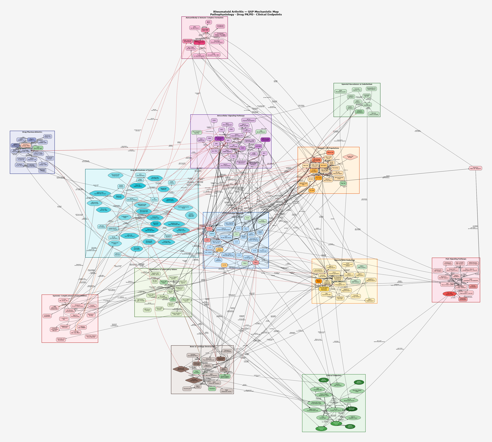

# qsp

## mrgsolve

- <https://vantage-research.net/qsp-in-r/>
- gPKPDviz: A flexible R shiny tool for pharmacokinetic/pharmacodynamic simulations using mrgsolve
    - <https://pmc.ncbi.nlm.nih.gov/articles/PMC10941578/>
    - <https://github.com/Genentech/gPKPDviz/>
    

## iqrtools

- <https://www.intiquan.com/acop2019_qsp/>

---

## QSP Disease Models

Each model lives in its own subdirectory (lowercase with dashes). Every directory contains:
- `*.dot` — Mechanistic map source (Graphviz DOT format, >100 nodes)
- `*.svg` / `*.png` — Rendered mechanistic map
- `*references.md` — Curated PubMed literature
- `*_model.R` / `*_mrgsolve_model.R` — mrgsolve ODE model + simulation scenarios
- `shiny_app/app.R` / `*_shiny_app.R` — Interactive Shiny PK/PD dashboard

| Date | Disease | Category | Mechanism Summary | Map | Model | Refs | App |
|------|---------|----------|-------------------|-----|-------|------|-----|
| 2026-06-16 | [**Rheumatoid Arthritis**](#rheumatoid-arthritis) | 자가면역질환 | T/B cell–driven synovitis; TNF-α / IL-6 / JAK-STAT; bone erosion (RANKL/OPG); cDMARDs + biologics (TNFi, IL-6Ri, JAKi) |  | [R](rheumatoid-arthritis/ra_model.R) | [refs](rheumatoid-arthritis/references.md) | [Shiny](rheumatoid-arthritis/shiny_app/app.R) |
| 2026-06-16 | [**Pulmonary Arterial Hypertension**](#pulmonary-arterial-hypertension-pah) | 만성질환 / 폐혈관 | EC dysfunction → ET-1↑/NO↓/PGI₂↓ → vasoconstriction + PASMC remodelling; BMPR2 loss; RV failure; ERA + PDE5i + PGI₂ |  | [R](pulmonary-arterial-hypertension/pah_mrgsolve_model.R) | [refs](pulmonary-arterial-hypertension/pah_references.md) | [Shiny](pulmonary-arterial-hypertension/pah_shiny_app.R) |
| 2026-06-16 | [**IgA Nephropathy**](#iga-nephropathy-igan) | 자가면역질환 / 신장 | Four-hit: Gd-IgA1↑ (C1GalT1/Cosmc↓) → anti-Gd-IgA1 IgG → IC mesangial deposition → complement AP + MAC → podocyte injury + TIF; Budesonide TRF / Sparsentan / Iptacopan / Sibeprenlimab |  | [R](iga-nephropathy/igan_mrgsolve_model.R) | [refs](iga-nephropathy/igan_references.md) | [Shiny](iga-nephropathy/igan_shiny_app.R) |

---

### Rheumatoid Arthritis

> Directory: [`rheumatoid-arthritis/`](rheumatoid-arthritis/)

**Mechanistic Map** (130+ nodes, 13 pathway clusters):

| Cluster | Coverage |
|---------|----------|
| Immune Cell Activation | DC, Macrophage M0/M1, Th1/Th17/Treg, Tfh, B cells, Plasma cells, NK, Neutrophils, Mast cells, NETosis |
| Autoantibody Formation | PAD4, citrullination, ACPA/RF, immune complexes, complement (C1q/C3/C5a), FcγRIII |
| Cytokine Network | TNF-α, IL-1β, IL-6, IL-8, IL-10, IL-12, IL-17A/F, IL-21, IL-23, IFN-γ, GM-CSF, TGF-β, VEGF, OSM, CXCL13, CCL2/5 |
| Intracellular Signaling | JAK1/2/3/TYK2, STAT1/3/4/5/6, NF-κB/IKK, p38 MAPK, ERK, JNK, PI3K/Akt/mTOR, AP-1, HIF-1α, NFATc1, Wnt/β-catenin |
| Synovial Pathology | FLS (quiescent/activated), synovial macrophage, pannus, COX-2/PGE2/LTB4, MMPs 1/2/3/9/13, ADAMTS-4/5, TIMPs |
| Synovial Vasculature | Endothelium, ICAM-1/VCAM-1, E-selectin, VEGF-driven neo-angiogenesis, HIF-1α, eNOS |
| Bone & Cartilage | RANKL/RANK/OPG, osteoclast/osteoblast, bone erosion, cartilage ECM (type II collagen, aggrecan), Wnt/DKK-1/sclerostin, chondrocyte apoptosis |
| Pain Signaling | Nociceptor (C/Aδ), NGF/TrkA, TRPV1, Nav1.7/1.8, Substance P/CGRP, bradykinin, peripheral & central sensitization |
| Drug PK | Oral/SC/IV compartments, FcRn recycling, TMDD, ADA, protein binding |
| Drug Mechanisms | MTX (DHFR/adenosine), LEF (DHODH), HCQ (lysosomal), SSZ (NF-κB); 5×TNFi; 4×IL-6Ri; Abatacept; Rituximab; Denosumab; 4×JAKi |
| Biomarkers | CRP, ESR, IL-6, TNF-α, MMP-3, RF, Anti-CCP, fibrinogen, SAA, hepcidin, Hb, RANKL/OPG serum |
| Clinical Endpoints | DAS28-CRP/ESR, ACR20/50/70, CDAI, SDAI, HAQ-DI, Sharp/vdH score, RAMRIS, EULAR remission, MBDA |
| Systemic Complications | CV risk, atherosclerosis, BMD loss, RA-ILD, lymphoma, infections, VTE (JAKi), anemia, depression |

**Mechanistic Map Preview:**

**mrgsolve Model Summary:**

| Compartment | States | Description |
|-------------|--------|-------------|
| TCZ PK | DEPOT_TCZ, C1_TCZ, C2_TCZ | 2-compartment SC/IV with first-order absorption |
| TMDD | R_FREE, RC | Free sIL-6Rα and TCZ-receptor complex |
| MTX PK | GI_MTX, C1_MTX | 1-compartment oral; active metabolite proxy |
| PD | TNFa, IL6, CRP, RANKL_pd | Cytokine and biomarker ODE dynamics |
| Scores | SJC28_ode, TJC28_ode | Inflammation-driven joint count adaptation |

**Key ODE relationships:**
- `dCRP/dt = ksyn_CRP × IL6_eff/(EC50+IL6_eff) − kout_CRP × CRP` (IL-6R blockade suppresses IL6_eff via TMDD)
- `DAS28-CRP = 0.56√TJC + 0.28√SJC + 0.36·ln(CRP+1) + 0.014·PtGA + 0.96`

**Files:**

| File | Description |
|------|-------------|
| [`ra_qsp.dot`](rheumatoid-arthritis/ra_qsp.dot) | Graphviz source (fdp layout, 130+ nodes) |
| [`ra_qsp.svg`](rheumatoid-arthritis/ra_qsp.svg) | Vector mechanistic map (511 KB) |
| [`ra_qsp.png`](rheumatoid-arthritis/ra_qsp.png) | Raster mechanistic map (3.3 MB, 150 dpi) |
| [`references.md`](rheumatoid-arthritis/references.md) | 66 annotated references (PubMed links) |
| [`ra_model.R`](rheumatoid-arthritis/ra_model.R) | mrgsolve ODE model + 4 dosing scenarios |
| [`shiny_app/app.R`](rheumatoid-arthritis/shiny_app/app.R) | Interactive Shiny simulator |

---

### Pulmonary Arterial Hypertension (PAH)

> Directory: [`pulmonary-arterial-hypertension/`](pulmonary-arterial-hypertension/)

> 폐동맥 내피세포 기능 부전 및 혈관 평활근 비대로 폐혈관 저항이 상승하여 우심실 부전을 유발하는 희귀 진행성 질환.

**Mechanistic Map** (130+ nodes, 10 pathway clusters):

| Cluster | Coverage |
|---------|----------|
| ET-1 Vasoconstriction | ET-1 → ETA/ETB → Gq/G12 → PLC/RhoA → IP₃/Ca²⁺/ROCK → MLCK/MLCP → vasoconstriction |
| NO-cGMP Vasodilation | eNOS/BH4/L-Arg → NO → sGC → cGMP → PKG → Kv-channel opening → vasodilation; PDE5 degradation |
| PGI₂-cAMP Vasodilation | AA → COX → PGIS → PGI₂ → IP-receptor → Gs → AC → cAMP → PKA → vasodilation |
| Growth Factor Signalling | BMPR2/ALK1/BMP9 → SMAD1/5/8 → ID1; TGF-β → SMAD2/3; PDGFR/VEGFR/FGFR → RAS-ERK/PI3K-AKT-mTOR/STAT3 |
| Vascular Remodelling | PASMC proliferation, EC dysfunction, EndMT, collagen synthesis, MMP-2/9, ECM remodelling, plexiform lesion |
| Inflammation & Immune | Th1/Th2/Th17/Treg, M1/M2 macrophage, mast cells, B cells, NK/CD8+, IL-6/IL-1β/TNF-α → NF-κB |
| Hypoxia & Metabolism | HIF-1α/2α, VHL/PHD axis, Warburg glycolysis, mitochondrial fission (DRP1/OPA1), Kv1.5↓, ROS/NOX4/SOD2 |
| RV-PA Haemodynamics | PVR → mPAP (Ohm's law); Ees/Ea coupling; Frank-Starling; RV hypertrophy → failure; TR; IVS bowing; RAAS/SNS |
| Biomarkers | BNP/NT-proBNP, hs-TnI, TAPSE, RVEF, RAP, ET-1, DLCO |
| Drug PK/PD | ERA (bosentan/ambrisentan/macitentan, IC₅₀ Emax Hill); PDE5i (sildenafil/tadalafil); sGC stimulator (riociguat); PGI₂ analogues (epoprostenol/treprostinil/selexipag) |

**Mechanistic Map Preview:**

**mrgsolve Model Summary:**

| Compartment | States | Description |
|-------------|--------|-------------|
| ERA PK | ERA_gut, ERA_central, ERA_periph, ERA_effect | 2-compartment oral + effect-site equilibration |
| PDE5i PK | PDE5_gut, PDE5_central, PDE5_effect | 1-compartment oral + effect-site |
| PGI₂ PK | PGI2_central, PGI2_effect | IV infusion (t½ ~3 min) |
| PD — Mediators | ET1, cGMP, cAMP | Turnover ODE for each second messenger |
| PD — Structure | VRI | Vascular Remodelling Index (logistic growth, drug reversal) |
| RV Function | Ees_RV | Adaptive hypertrophy → maladaptive decompensation |
| Biomarker | BNP_conc | Wall-stress–driven BNP production |

**Key ODE relationships:**
- `dVRI/dt = k_growth × VRI × (1 − VRI/VRI_max) − (k_ERA×ERA_Inh + k_PDE×ΔcGMP + k_PGI×PGI₂_Act) × VRI`
- `PVR = PVR_normal + (PVR_PAH0 − PVR_normal) × [tone_frac × ET1/ET1_PAH × (1−ERA_Inh) × cGMP₀/cGMP × cAMP₀/cAMP + remod_frac × VRI/VRI₀]`
- `mPAP = CO × PVR/80 + PAWP`
- Simulates 6 scenarios (no treatment → triple ERA+PDE5i+PGI₂) over 12 weeks

**Files:**

| File | Description |
|------|-------------|
| [`pah_qsp_model.dot`](pulmonary-arterial-hypertension/pah_qsp_model.dot) | Graphviz DOT source (736 lines, 130+ nodes, 8 subgraphs) |
| [`pah_qsp_model.svg`](pulmonary-arterial-hypertension/pah_qsp_model.svg) | Vector mechanistic map (256 KB) |
| [`pah_qsp_model.png`](pulmonary-arterial-hypertension/pah_qsp_model.png) | Raster mechanistic map (7.3 MB, 150 dpi) |
| [`pah_references.md`](pulmonary-arterial-hypertension/pah_references.md) | 40 annotated references with PubMed links |
| [`pah_mrgsolve_model.R`](pulmonary-arterial-hypertension/pah_mrgsolve_model.R) | mrgsolve ODE model + 6 treatment scenarios + dose-response |
| [`pah_shiny_app.R`](pulmonary-arterial-hypertension/pah_shiny_app.R) | 8-tab Shiny dashboard (patient profile, PK, DR, ESC/ERS risk) |

---

### IgA Nephropathy (IgAN)

> Directory: [`iga-nephropathy/`](iga-nephropathy/)

> 비정상적으로 당화된 IgA1(Gd-IgA1) 면역복합체가 사구체 메산지움에 침착되어 보체를 활성화시켜 족세포 손상 및 심한 단백뇨를 유발하는 면역 매개 사구체신염. **사중 타격 가설(four-hit hypothesis)** 기반 QSP 모델.

**Mechanistic Map** (155+ nodes, 12 pathway clusters):

| Cluster | Coverage |
|---------|----------|
| Genetic/Environmental Risk | HLA-DQB1, TNFSF13/TNFSF13B (APRIL/BAFF genes), C1GALT1/Cosmc mutations, ST6GalNAc-II, DEFA1A3, gut dysbiosis, mucosal infection |
| Mucosal Immunity | Naive B → Peyer's patch GC / tonsillar MALT, Tfh, IL-21/IL-4/IL-6/IL-10/TGF-β class switching, AID, APRIL/BAFF, pIgR, sIgA |
| Hit 1 – Gd-IgA1 | IgA1 hinge O-glycosylation; C1GalT1↓/Cosmc↓ → exposed GalNAc → Gd-IgA1 serum elevation; ST6GalNAc-II competition; ASGPR hepatic clearance |
| Hit 2 – Autoantibody | BCR (GalNAc epitope), GC reaction, SHM, class-switch → anti-Gd-IgA1 IgG/IgA; CD4+ Tfh, IL-21, IL-17A |
| Hit 3+4 – IC Deposition | Gd-IgA1 × IgG IC formation, IC polymerization/hexamerization, FcαRI (CD89)/TfR1 mesangial receptors, mesangial deposition ↑↑↑ |
| Complement System | Lectin (MBL/Ficolins/MASP-1/2), Classical (C1q), AP amplification (Factor B/D/P), C3 convertases CP+AP, C3 cleavage → C3a/C3b, C5 convertase → C5a/MAC (C5b-9), CD46/CD55 regulators |
| Mesangial Signaling | MC quiescent→activated; NF-κB, ERK, PI3K/AKT, PDGFR-β/PDGF-BB; TGF-β1/SMAD2-3/CTGF; IL-6/TNF-α/MCP-1; MC proliferation, mesangial matrix expansion; ROS/NOX4; HIF-1α |
| Glomerular Injury | Podocyte (healthy→injured); Nephrin/Podocin/Synaptopodin/TRPC6; foot process effacement; GBM thickening; ↑glomerular permeability; proteinuria; hematuria; crescents; VEGF/Ang-2 |
| Tubular/Interstitial Fibrosis | PTC protein overload, TEC-EMT, interstitial macrophage/T cell, TGF-β1 TIF, myofibroblast, Collagen I/III, MMP-2/9, TIMP-1/2, tubulointerstitial fibrosis, tubular atrophy |
| RAAS | Renin/AGT/AngI/ACE/AngII/AT1R–AT2R, aldosterone, Na⁺ retention, intraglomerular hypertension, SNS, ET-1, ACE2/Ang(1-7)/MasR |
| Drug PK/PD | ACEi/ARB, Sparsentan (dual AT1R+ETB), Budesonide TRF/Nefecon (mucosal APRIL suppression), Iptacopan (Factor B), Sibeprenlimab (anti-APRIL), Zigakibart (anti-C5), SGLT2i (dapagliflozin), Prednisolone, MMF, Atrasentan, Belimumab |
| Clinical Endpoints | eGFR, UPCR, 24-h proteinuria, serum Gd-IgA1/IgA, serum C3, creatinine, BP, Oxford MEST-C score (M/E/S/T/C), ESKD, CR50, complete remission, eGFR slope |

**Mechanistic Map Preview:**

**mrgsolve Model Summary:**

| Compartment | States | Description |
|-------------|--------|-------------|
| Budesonide TRF PK | BUD_gut, BUD_central | 1-compartment oral; F=15% (high hepatic extraction) |
| Sparsentan PK | SPA_gut, SPA_central | 1-compartment oral; F=85% |
| Iptacopan PK | IPT_gut, IPT_central | 1-compartment oral; BID dosing |
| Sibeprenlimab PK | SIB_depot, SIB_central, SIB_periph | SC 2-compartment; Q4W dosing |
| Four-hit PD | GdIgA1, AutoAb, IC_mes, CompAP | Hit 1–4 cascade with Emax drug effects |
| Glomerular | Podocyte, UPCR | Injury/repair ODE; proteinuria driven by podocyte loss |
| Fibrosis | TIF | Slow logistic fibrosis; protein-overload amplification |
| Renal function | eGFR | Continuous GFR loss from TIF + podocyte depletion |
| Hemodynamics | BP_sys | AngII-driven setpoint model |

**Key ODE relationships:**
- `dGdIgA1/dt = k_syn × (1 − E_mucosal) − k_deg × GdIgA1`  (budesonide + sibeprenlimab reduce synthesis)
- `dCompAP/dt = k_syn_CP × IC_mes × (1 − E_iptacopan) − k_deg × CompAP`  (AP pathway; Factor B blocked by iptacopan)
- `dUPCR/dt = k_syn_UPCR × (1−Podocyte) × (1+0.4×Mesangial) × (1−E_spa) × (1−E_RAAS) − k_deg × UPCR`
- `deGFR/dt = −[k_loss_GFR × TIF + k_RAAS_GFR × (1−E_RAAS) × (1−Podocyte)] × eGFR`
- Simulates 7 scenarios (untreated → triple Budesonide+Sparsentan+Iptacopan) over 2 years

**Calibration landmarks (trial data):**
- NefIgArd (Barratt 2023): Budesonide TRF → UPCR −22% at 9 months ✓
- PROTECT (Heerspink 2023/2024): Sparsentan → UPCR −49% at week 36 vs. irbesartan ✓
- APPLAUSE-IgAN (Rovin 2024): Iptacopan → UPCR −38% vs. placebo ✓
- AFFINITY (Barratt 2023): Sibeprenlimab 700 mg → UPCR −47% at 9 months ✓
- DAPA-CKD IgAN sub-analysis: dapagliflozin → 71% RR reduction in composite ESKD ✓

**Files:**

| File | Description |
|------|-------------|
| [`igan_qsp_model.dot`](iga-nephropathy/igan_qsp_model.dot) | Graphviz DOT source (155+ nodes, 12 subgraphs) |
| [`igan_qsp_model.svg`](iga-nephropathy/igan_qsp_model.svg) | Vector mechanistic map |
| [`igan_qsp_model.png`](iga-nephropathy/igan_qsp_model.png) | Raster mechanistic map (150 dpi) |
| [`igan_references.md`](iga-nephropathy/igan_references.md) | 47 annotated references with PubMed links |
| [`igan_mrgsolve_model.R`](iga-nephropathy/igan_mrgsolve_model.R) | mrgsolve ODE model + 7 treatment scenarios + dose-response |
| [`igan_shiny_app.R`](iga-nephropathy/igan_shiny_app.R) | 8-tab Shiny dashboard (patient profile, PK, UPCR, eGFR, MEST-C, biomarkers) |
