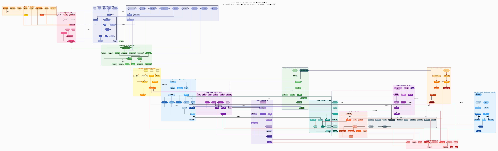

# QSP Disease Model Library

> **자동 업데이트 중 — Automatically maintained by [Claude Code Routine (CCR)](https://code.claude.com)**  
> 매 세션마다 새 질환 모델이 자동으로 추가됩니다 · A new disease model is added automatically each session.

---

## 개요 (Overview)

### 한국어

이 저장소는 **정량적 시스템 약리학(Quantitative Systems Pharmacology, QSP)** 모델을 질환별로 체계적으로 구축·축적하는 살아있는 라이브러리입니다.

모든 콘텐츠는 **Anthropic의 Claude Code Routine (CCR)** 을 통해 완전 자동으로 생성됩니다. CCR은 원격 클라우드 컨테이너에서 Claude가 직접 코드를 작성하고, 파일을 렌더링하고, 커밋·푸시까지 완료하는 자율 실행 환경입니다. 매 세션이 종료될 때 반드시 변경 사항이 커밋·푸시되어 있어야 하는 **Stop Hook**(`stop-hook-git-check.sh`)이 설정되어 있어, **사람의 개입 없이도 저장소가 지속적으로 갱신**됩니다.

#### 각 모델에 포함되는 내용

| 산출물 | 내용 |
|--------|------|
| **기계론적 지도** (`.dot` / `.svg` / `.png`) | 100개 이상 노드, Graphviz DOT 형식; 질환 특이 생물학적 경로, 약물 PK/PD, 바이오마커, 임상 엔드포인트를 하나의 시각화로 통합 |
| **mrgsolve ODE 모델** (`.R`) | 미분방정식 기반 PK/PD 모델; 주요 임상시험 파라미터로 보정; 복수의 치료 시나리오 시뮬레이션; 용량-반응 분석 포함 |
| **Shiny 대시보드** (`.R`) | 인터랙티브 웹 앱; 환자 파라미터 설정, 약물 선택, PK/PD 실시간 시각화, 시나리오 비교표, 임상 위험 지표 |
| **참고문헌** (`.md`) | PubMed 링크 포함 30개 이상의 선별 논문; 병태생리, 임상시험, 바이오마커 섹션별 분류 |

#### 질환 선택 기준

선택 목록은 자가면역질환 49종 + 만성질환 44종(총 93종)으로 구성됩니다. 세션마다 **이미 완성된 질환과 중복되지 않도록** 날짜 기반으로 다른 질환을 선택합니다. 선택 우선순위:
- 최근 FDA/EMA 승인 또는 임상 3상이 있는 질환
- PK/PD 파라미터가 문헌에 충분히 공개된 질환
- 이전 모델들과 병태생리 카테고리가 다른 질환

#### 기술 스택

```
Graphviz (dot)        →  기계론적 지도 렌더링 (.dot → .svg + .png)
mrgsolve (R)          →  ODE 기반 PK/PD 시뮬레이션
Shiny (R)             →  인터랙티브 대시보드
Claude Code Routine   →  모든 파일 자동 생성 및 커밋
CCR Stop Hook         →  세션 종료 시 커밋/푸시 강제 실행
```

---

### English

This repository is a **living QSP (Quantitative Systems Pharmacology) model library** that grows automatically with each session. Every model follows the same four-deliverable structure: mechanistic map · mrgsolve ODE model · Shiny app · curated references.

#### How the Automation Works

All content is generated by **Anthropic's Claude Code Routine (CCR)** — an autonomous cloud execution environment where Claude writes code, renders files, and pushes commits without human intervention. A mandatory **Stop Hook** (`stop-hook-git-check.sh`) is configured: the session cannot close unless every change is committed and pushed to the remote branch. This guarantees that the repository always reflects the full output of each session.

The workflow per session:

```
1. Pull latest main
2. Select a new disease from the curated list (93 diseases total)
   → Avoid duplicates, rotate categories, prioritize recent clinical data
3. Build the mechanistic map (.dot → .svg + .png via Graphviz)
4. Write mrgsolve R model (ODE compartments, PK/PD parameters, scenarios)
5. Scaffold the Shiny app (≥6 interactive tabs)
6. Compile references (≥30 PubMed-linked papers)
7. Update README.md (table row + detailed section) and create CLAUDE.md
8. git add -A → commit → push to main (enforced by Stop Hook)
```

#### Per-Model Content Standards

| Deliverable | Standards |
|-------------|-----------|
| **Mechanistic map** | ≥100 nodes; ≥8 subgraph clusters; drug mechanisms, clinical endpoints, and biomarkers all visualized |
| **mrgsolve model** | ≥15 ODE states; ≥5 treatment scenarios; calibrated to published clinical trial PK/PD; dose–response analysis |
| **Shiny dashboard** | ≥6 tabs; interactive patient profile, drug PK, PD biomarkers, scenario comparison table, risk classification |
| **References** | ≥30 curated papers with PubMed links; categorized by mechanism / biomarker / clinical trial sections |

#### Disease Coverage

Models span two major categories drawn from a curated list of **93 diseases**:

- **자가면역질환 (Autoimmune, 49 diseases)** — RA, SLE, Sjögren's, MCTD, vasculitides (GPA/EGPA/MPA/PAN/Takayasu/GCA), IBD, PSC/PBC, AIH, MS, MG, NMO, GBS, CIDP, autoimmune encephalitis, ITP, AIHA, pemphigus, IgAN, and more
- **만성질환 (Chronic/Metabolic, 44 diseases)** — T2DM, PCOS, HFrEF/HFpEF, COPD, IPF, PAH, OSA, CKD/ADPKD/FSGS/MCD, NAFLD, cirrhosis, chronic hepatitis B, BPH, and more

See [`CLAUDE.md`](CLAUDE.md) for the complete disease list and model-building guidelines used by each CCR session.

---

## mrgsolve Resources

- <https://vantage-research.net/qsp-in-r/>
- gPKPDviz: A flexible R Shiny tool for PK/PD simulations using mrgsolve
    - <https://pmc.ncbi.nlm.nih.gov/articles/PMC10941578/>
    - <https://github.com/Genentech/gPKPDviz/>

## iqrtools

- <https://www.intiquan.com/acop2019_qsp/>

---

## QSP Disease Models

각 모델은 소문자 하이픈 디렉토리에 저장됩니다 · Each model lives in its own lowercase-dash subdirectory containing:
- `*.dot` — Mechanistic map source (Graphviz DOT, ≥100 nodes)
- `*.svg` / `*.png` — Rendered mechanistic map (vector + raster)
- `*_references.md` — Curated PubMed literature (≥30 papers)
- `*_mrgsolve_model.R` / `*_model.R` — mrgsolve ODE model + simulation scenarios
- `*_shiny_app.R` / `shiny_app/app.R` — Interactive Shiny PK/PD dashboard

| Date | Disease | Category | Mechanism Summary | Map | Model | Refs | App |
|------|---------|----------|-------------------|-----|-------|------|-----|
| 2026-06-16 | [**Rheumatoid Arthritis**](#rheumatoid-arthritis) | 자가면역질환 | T/B cell–driven synovitis; TNF-α / IL-6 / JAK-STAT; bone erosion (RANKL/OPG); cDMARDs + biologics (TNFi, IL-6Ri, JAKi) | [](rheumatoid-arthritis/ra_qsp.svg) | [R](rheumatoid-arthritis/ra_model.R) | [refs](rheumatoid-arthritis/references.md) | [Shiny](rheumatoid-arthritis/shiny_app/app.R) |
| 2026-06-16 | [**Pulmonary Arterial Hypertension**](#pulmonary-arterial-hypertension-pah) | 만성질환 / 폐혈관 | EC dysfunction → ET-1↑/NO↓/PGI₂↓ → vasoconstriction + PASMC remodelling; BMPR2 loss; RV failure; ERA + PDE5i + PGI₂ | [](pulmonary-arterial-hypertension/pah_qsp_model.svg) | [R](pulmonary-arterial-hypertension/pah_mrgsolve_model.R) | [refs](pulmonary-arterial-hypertension/pah_references.md) | [Shiny](pulmonary-arterial-hypertension/pah_shiny_app.R) |
| 2026-06-16 | [**Systemic Lupus Erythematosus**](#systemic-lupus-erythematosus-sle) | 자가면역질환 | NETs/cGAS-STING/TLR7/9 → pDC → IFN-α → BAFF↑ → B cell hyperactivation → anti-dsDNA → IC → complement consumption + lupus nephritis; HCQ + belimumab + anifrolumab + MMF + voclosporin | [](systemic-lupus-erythematosus/sle_qsp.svg) | [R](systemic-lupus-erythematosus/sle_model.R) | [refs](systemic-lupus-erythematosus/sle_references.md) | [Shiny](systemic-lupus-erythematosus/shiny_app/app.R) |
| 2026-06-16 | [**IgA Nephropathy**](#iga-nephropathy-igan) | 자가면역질환 / 신장 | Four-hit: Gd-IgA1↑ (C1GalT1/Cosmc↓) → anti-Gd-IgA1 IgG → IC mesangial deposition → complement AP + MAC → podocyte injury + TIF; Budesonide TRF / Sparsentan / Iptacopan / Sibeprenlimab | [](iga-nephropathy/igan_qsp_model.svg) | [R](iga-nephropathy/igan_mrgsolve_model.R) | [refs](iga-nephropathy/igan_references.md) | [Shiny](iga-nephropathy/igan_shiny_app.R) |
| 2026-06-16 | [**Multiple Sclerosis**](#multiple-sclerosis-ms) | 자가면역질환 / 신경계 | CD4+ Th1/Th17 → VLA-4/VCAM-1 → BBB breach → CNS infiltration → microglia activation → oligodendrocyte death → demyelination + axonal injury (NfL↑); IFN-β / Natalizumab / Ocrelizumab / Siponimod / DMF / Cladribine | [](multiple-sclerosis/ms_qsp.svg) | [R](multiple-sclerosis/ms_mrgsolve_model.R) | [refs](multiple-sclerosis/ms_references.md) | [Shiny](multiple-sclerosis/ms_shiny_app.R) |
| 2026-06-16 | [**Type 2 Diabetes Mellitus**](#type-2-diabetes-mellitus-t2dm) | 만성질환 / 대사 | Insulin resistance (peripheral + hepatic) + β-cell failure → glucotoxicity/lipotoxicity/ER stress → progressive HbA1c ↑; Metformin / SGLT2i / GLP-1RA / DPP-4i / SU / Insulin / TZD | [](type2-diabetes/t2dm_qsp_model.svg) | [R](type2-diabetes/t2dm_mrgsolve_model.R) | [refs](type2-diabetes/t2dm_references.md) | [Shiny](type2-diabetes/t2dm_shiny_app.R) |
| 2026-06-16 | [**NAFLD / NASH**](#nafldnash-non-alcoholic-fatty-liver-disease--steatohepatitis) | 만성질환 / 간 | IR → DNL↑ + Adipose FFA → Hepatic steatosis → Lipotoxicity (ceramide/DAG/ROS/ER-stress) → Kupffer/NLRP3 → TNF-α/IL-1β → TGF-β1/HSC → Fibrosis; Resmetirom (THRβ, FDA 2024) / OCA (FXR) / Semaglutide (GLP-1RA) / Empagliflozin (SGLT2i) | [](nafld-nash/nafld_qsp_model.svg) | [R](nafld-nash/nafld_mrgsolve_model.R) | [refs](nafld-nash/nafld_references.md) | [Shiny](nafld-nash/nafld_shiny_app.R) |
| 2026-06-16 | [**Heart Failure (HFrEF)**](#heart-failure-with-reduced-ejection-fraction-hfref) | 만성질환 / 심혈관 | RAAS (AngII/Aldo) + SNS (NE↑) + NPS (BNP/NT-proBNP) triple neurohumoral activation → cardiac remodeling (TGF-β1/fibrosis/hypertrophy) → LVEF↓; GDMT 4 pillars: ARNI (PARADIGM-HF) + β-blocker (MERIT-HF) + MRA (RALES/EMPHASIS-HF) + SGLT2i (EMPEROR-Reduced/DAPA-HF) + Ivabradine (SHIFT) | [](heart-failure-hfref/hfref_qsp_model.svg) | [R](heart-failure-hfref/hfref_mrgsolve_model.R) | [refs](heart-failure-hfref/hfref_references.md) | [Shiny](heart-failure-hfref/hfref_shiny_app.R) |
| 2026-06-16 | [**Chronic Kidney Disease (CKD)**](#chronic-kidney-disease-ckd) | 만성질환 / 신장 | Nephron loss (hyperfiltration → GS → TIF) → eGFR↓; RAAS (AngII/Aldo) + NF-κB + TGF-β1/Smad2/3 fibrosis + CKD-MBD (FGF-23↑/Klotho↓/PTH↑) + Anemia (EPO↓/Hepcidin↑) + CV (LVH/VC); ACEi / ARB / Finerenone (FIDELIO-DKD) / SGLT2i (DAPA-CKD/EMPA-KIDNEY) / ESA / HIF-PHI (Roxadustat) | [](chronic-kidney-disease/ckd_qsp_model.svg) | [R](chronic-kidney-disease/ckd_mrgsolve_model.R) | [refs](chronic-kidney-disease/ckd_references.md) | [Shiny](chronic-kidney-disease/ckd_shiny_app.R) |
| 2026-06-16 | [**Bronchial Asthma**](#bronchial-asthma) | 만성질환 / 호흡기 | TSLP/IL-25/IL-33 (epithelial alarmins) → ILC2/DC → Th2 → IL-4/IL-5/IL-13 → IgE:FcεRI (mast cell) + Eos recruitment + ASM contraction + goblet metaplasia + airway remodeling (TGF-β1); Biologics: Omalizumab / Mepolizumab (MENSA) / Benralizumab (CALIMA) / Dupilumab (LIBERTY AIR) / Tezepelumab (NAVIGATOR) | [](bronchial-asthma/ba_qsp_model.svg) | [R](bronchial-asthma/ba_mrgsolve_model.R) | [refs](bronchial-asthma/ba_references.md) | [Shiny](bronchial-asthma/ba_shiny_app.R) |
| 2026-06-16 | [**COPD**](#copd-chronic-obstructive-pulmonary-disease) | 만성질환 / 호흡기 | CS/AP → ROS + NRF2↓ → Macrophage(M1)+NE/MMP-12 → Protease-antiprotease imbalance → Emphysema(ECM elastin↓) + Small airway fibrosis (TGF-β/SMAD2/3) → FEV1↓; CD8+Tc1/Th17 adaptive; PH-COPD(HPV→ET-1↑); LAMA(UPLIFT) + LABA/LAMA(FLAME) + Triple(IMPACT/ETHOS) + PDE4i(EINSTEIN/Roflumilast) | [](copd/copd_qsp.svg) | [R](copd/copd_mrgsolve_model.R) | [refs](copd/copd_references.md) | [Shiny](copd/copd_shiny_app.R) |
| 2026-06-16 | [**Crohn's Disease**](#crohns-disease-cd) | 자가면역질환 / 소화기 | Gut dysbiosis + NOD2/TLR → Macrophage M1 + DC → Th1(IFN-γ/TNF-α) + Th17(IL-17A/IL-21/IL-23) → NF-κB → mucosal barrier loss + NLRP3/IL-1β + fibrosis (TGF-β/MMP); Anti-TNF (IFX/ADA, ACCENT/CHARM) + Anti-IL-12/23 (UST, UNIFI) + Anti-α4β7 (VDZ, GEMINI) + JAK1i (Upadacitinib, U-ACHIEVE) + AZA/6-TGN (SONIC) | [](crohn-disease/cd_qsp_model.svg) | [R](crohn-disease/cd_mrgsolve_model.R) | [refs](crohn-disease/cd_references.md) | [Shiny](crohn-disease/cd_shiny_app.R) |
| 2026-06-16 | [**Ankylosing Spondylitis**](#ankylosing-spondylitis-as) | 자가면역질환 / 척추관절염 | HLA-B27 misfolding (UPR → IL-23) + enthesis microdamage → DAMP/TLR → DC/Macrophage IL-23 → Th17 IL-17A/IL-17F ★ + RANKL↑/OPG↓ → dual bone pathology: erosion (osteoclast) + ankylosis (BMP/Wnt/DKK1 ↓ new bone); Gut–joint axis (dysbiosis/ILC3); TNFi (ATLAS/GO-RAISE) + IL-17Ai (MEASURE 1/2, COAST-V) + JAKi (SELECT-AXIS 1/2) + IL-23i (GUIDE) | [](ankylosing-spondylitis/as_qsp_model.svg) | [R](ankylosing-spondylitis/as_mrgsolve_model.R) | [refs](ankylosing-spondylitis/as_references.md) | [Shiny](ankylosing-spondylitis/as_shiny_app.R) |
| 2026-06-16 | [**Atrial Fibrillation**](#atrial-fibrillation-af) | 만성질환 / 심혈관 | Electrical remodeling (Nav1.5/Cav1.2/Kv1.5/IKACh/ERP↓) + Ca²⁺ mishandling (RyR2/CaMKII/SOICR→DADs) + structural fibrosis (AngII/TGF-β1/SMAD2/3) + NLRP3 inflammation + ANS remodeling → wavelength shortening → reentry + focal PV triggers; Thromboembolism (Virchow's triad, TF/FXa/thrombin/fibrin); Amiodarone (class I/II/III/IV) + Metoprolol (rate control) + Apixaban (ARISTOTLE: RRR 21%) — calibrated to AFFIRM, RACE, ARISTOTLE, RE-LY, EAST-AFNET 4 | [](atrial-fibrillation/af_qsp_model.svg) | [R](atrial-fibrillation/af_mrgsolve_model.R) | [refs](atrial-fibrillation/af_references.md) | [Shiny](atrial-fibrillation/af_shiny_app.R) |
| 2026-06-16 | [**Myasthenia Gravis**](#myasthenia-gravis-mg) | 자가면역질환 / 신경근육 | Anti-AChR IgG (85%) → NMJ: Ab crosslinking (AChR internalization↑) + Classical complement → MAC (C5b-9) → junctional fold loss → AChR density↓ → NMJ safety factor↓ → EPP subthreshold → muscle weakness; Anti-MuSK (5–8%) disrupts AChR clustering; FcRn recycles pathogenic IgG; Pyridostigmine (AChEI, AChE IC50~10nM) / Prednisolone + AZA/MMF / Eculizumab (REGAIN: −4.2 QMG) / Ravulizumab (CHAMPION-MG) / Zilucoplan (RAISE) / Efgartigimod (ADAPT: ~75% IgG↓) / Rituximab (MuSK-MG) / Thymectomy (MGTX) | [](myasthenia-gravis/mg_qsp_model.svg) | [R](myasthenia-gravis/mg_mrgsolve_model.R) | [refs](myasthenia-gravis/mg_references.md) | [Shiny](myasthenia-gravis/mg_shiny_app.R) |
| 2026-06-16 | [**Osteoporosis**](#osteoporosis) | 만성질환 / 골대사 | Osteoclast/osteoblast coupling dysregulation: RANK/RANKL/OPG axis imbalance → bone resorption > formation → BMD↓; estrogen deficiency (↑T-bet/Th17/IL-17/RANKL), glucocorticoid (Wnt↓/GR-mediated osteoblast apoptosis), aging (FGF-23↑/IGF-1↓/sclerostin↑); Bisphosphonate (APPase inhibition/FPPS) + Denosumab (anti-RANKL mAb; FREEDOM) + Romosozumab (anti-sclerostin; ARCH) + Teriparatide (PTH1R; NEER) | [](osteoporosis/op_qsp_model.svg) | [R](osteoporosis/op_mrgsolve_model.R) | [refs](osteoporosis/op_references.md) | [Shiny](osteoporosis/op_shiny_app.R) |
| 2026-06-17 | [**Primary Biliary Cholangitis**](#primary-biliary-cholangitis-pbc) | 자가면역질환 / 간·담도 | AMA (anti-PDC-E2, ≥95% sens) → pDC/TLR9 → IFN-α → Th1/CTL → biliary epithelial cell (BEC) apoptosis + senescence (SASP) → ductopenia; Glutathione defect (GSH↓ in BEC) → apotope persistence; FXR/TGR5/FGF19 axis → CYP7A1↓/BSEP↑; Hydrophobic BA toxicity → NLRP3 → HSC activation → TGF-β1 → fibrosis; UDCA (SOC, BSEP↑/EHC) + OCA (FXR, POISE: ALP↓38%) + Elafibranor (PPARα/δ, ELATIVE 2024: 51% norm) + Seladelpar (PPARδ, RESPONSE 2024: 25% norm) + Bezafibrate (BEZURSO: 67% norm) | [](primary-biliary-cholangitis/pbc_qsp_model.svg) | [R](primary-biliary-cholangitis/pbc_mrgsolve_model.R) | [refs](primary-biliary-cholangitis/pbc_references.md) | [Shiny](primary-biliary-cholangitis/pbc_shiny_app.R) |
| 2026-06-17 | [**Hypertrophic Cardiomyopathy**](#hypertrophic-cardiomyopathy-hcm) | 만성질환 / 심혈관 | Sarcomere gene mutations (MYH7/MYBPC3 ~80%) → ↑DRX myosin fraction → Duty ratio↑ → Hypercontractility + Venturi-SAM → LVOT obstruction; Calcineurin-NFAT + ERK → asymmetric LVH (IVS↑↑); TGF-β1/SMAD → interstitial fibrosis (ECV↑, LGE); Ca²⁺ mishandling (RyR2 leak→DADs) + scar substrate → VT/VF → SCD; AF (LA dilation/pressure); Mavacamten (MYK-461, EXPLORER-HCM: LVOT↓36mmHg) + Aficamten (SEQUOIA-HCM: LVOT↓36mmHg) + Beta-blocker (HR/contractility↓) + Disopyramide (SAM↓) + SRT (Myectomy/ASA); CYP2C19-guided dosing | [](hypertrophic-cardiomyopathy/hcm_qsp_model.svg) | [R](hypertrophic-cardiomyopathy/hcm_mrgsolve_model.R) | [refs](hypertrophic-cardiomyopathy/hcm_references.md) | [Shiny](hypertrophic-cardiomyopathy/hcm_shiny_app.R) |
| 2026-06-17 | [**Graves' Disease**](#graves-disease) | 자가면역질환 / 내분비 | TRAb (TSAb) constitutively activates TSHR → cAMP/PKA → T3/T4 hypersecretion; HPT negative feedback disrupted; B-cell germinal center (CD40/IL-4) → TSAb/TBAb/TBII; Wolff–Chaikoff/escape; orbital fibroblast (TSHR+IGF-1R) → HA synthesis + adipogenesis → GO; MMI/PTU (TPO inhibition) + ¹³¹I (β-radiation ablation) + Propranolol (β1-blocker/D1↓) + Rituximab (B-cell depletion) + Teprotumumab (IGF-1R, OPTIC trial) | [](graves-disease/gd_qsp_model.svg) | [R](graves-disease/gd_mrgsolve_model.R) | [refs](graves-disease/gd_references.md) | [Shiny](graves-disease/gd_shiny_app.R) |
| 2026-06-17 | [**Idiopathic Pulmonary Fibrosis**](#idiopathic-pulmonary-fibrosis-ipf) | 만성질환 / 호흡기 | Repetitive AEC-II injury (smoking/GERD/viral/MUC5B/TERT) → ER stress + ROS → senescence/apoptosis → DAMP release → TGFb1 (SMAD2/3-4 complex) + NOX4-ROS feedback → fibroblast→myofibroblast (αSMA+) → collagen I/III ↑ + TIMP↑/MMP↓ → ECM stiffness → mechanotransduction (YAP/TAZ → more TGFβ); M2 macrophage (IL-4/IL-13) amplifies TGFβ/CTGF; PDGF/FGF/VEGF drive fibrocyte recruitment; Pirfenidone (TGF-β/TNF-α/PDGF/ROS↓, ASCEND: −47.9% FVC decline) + Nintedanib (FGFR/VEGFR/PDGFRα/β TKI, INPULSIS: −50.1% FVC decline); Biomarkers: MMP-7↑, KL-6↑, Periostin↑; Endpoints: FVC%, DLCO%, 6MWD, AE-IPF | [](idiopathic-pulmonary-fibrosis/ipf_qsp_model.svg) | [R](idiopathic-pulmonary-fibrosis/ipf_mrgsolve_model.R) | [refs](idiopathic-pulmonary-fibrosis/ipf_references.md) | [Shiny](idiopathic-pulmonary-fibrosis/ipf_shiny_app.R) |
| 2026-06-17 | [**Systemic Sclerosis (SSc)**](#systemic-sclerosis-ssc) | 자가면역질환 / 결합조직 | Autoimmunity (anti-Scl-70/ACA/RNA Pol III) + Vasculopathy (ET-1↑/NO↓/PGI₂↓/Raynaud) + Fibrosis (TGF-β/SMAD2-3 → FAct → Myo → Col1/3↑ → mRSS↑); SSc-ILD (FVC↓) + SSc-PAH (PVR↑/6MWD↓); Nintedanib (SENSCIS: −41% FVC decline) + Tocilizumab (focuSSced) + MMF (SLS II) + Bosentan (RAPIDS-2: −48% DU) + Iloprost (PGI₂ analog) | [](systemic-sclerosis/ssc_qsp_model.svg) | [R](systemic-sclerosis/ssc_mrgsolve_model.R) | [refs](systemic-sclerosis/ssc_references.md) | [Shiny](systemic-sclerosis/ssc_shiny_app.R) |
| 2026-06-17 | [**Gout**](#gout) | 만성질환 / 대사 | 혈중 요산 과다 → 단요산나트륨(MSU) 결정 침착 → NLRP3 인플라마좀(Caspase-1) → 성숙 IL-1β/IL-18 방출 → 호중구 유입 → 급성 관절염; URAT1/OAT/ABCG2 수송체 다형성; XO억제제(알로퓨리놀/옥시퓨리놀·페북소스타트) + 요산배설제(프로베네시드·레시뉴라드) + 항염증(콜히친·NSAID·코르티코이드) + 생물학제제(아나킨라·카나키누맙); 통풍 결절(tophus) 퇴행 및 신기능 보호; CONFIRMS / CLEAR 1&2 / AGREE / CARES 임상시험 보정 | [](gout/gout_qsp_model.svg) | [R](gout/gout_mrgsolve_model.R) | [refs](gout/gout_references.md) | [Shiny](gout/gout_shiny_app.R) |
| 2026-06-17 | [**Sjögren's Syndrome**](#sjögrens-syndrome-pss) | 자가면역질환 / 외분비선 | pDC(Bst-2+) → TLR7/9/cGAS-STING → IRF7 → IFN-α/β(ISG↑) → mDC maturation → Th1/Th17/Tfh → BAFF↑(BEC/IFN-driven) → B-cell hyperactivation + ectopic GC → Anti-SSA/Ro52/Ro60(>95%) + Anti-M3R → AQP5↓ + Ca²⁺/cAMP↓ → UWSF↓/Schirmer↓; MALT lymphoma(40-50× risk; FFS score); HCQ(JOQUER) + Pilocarpine/Cevimeline(M3R agonist) + Rituximab(TEARS; 2×1g) + Ianalumab(TWINSS 2022; anti-BAFF-R; ΔESSDAI≥3) + Baricitinib(JAK1/2) | [](sjogrens-syndrome/ss_qsp_model.svg) | [R](sjogrens-syndrome/ss_mrgsolve_model.R) | [refs](sjogrens-syndrome/ss_references.md) | [Shiny](sjogrens-syndrome/ss_shiny_app.R) |
| 2026-06-17 | [**Type 1 Diabetes Mellitus**](#type-1-diabetes-mellitus-t1dm) | 자가면역질환 / 내분비 | HLA-DR3/DR4 + PTPN22/CTLA4/IL2RA → viral(CVB)/gut dysbiosis trigger → pDC(IFN-α) + mDC → CD8+CTL (GAD65/IA-2/ZnT8/proinsulin) → Insulitis → MHC-I↑/ER stress/ROS → beta-cell apoptosis → Bm↓ (Stage 1→2→3); Treg failure; Multi-Ab (IAA+GADA+IA-2A+ZnT8A) → C-peptide↓ → absolute insulin deficiency → HbA1c↑/DKA; Teplizumab (TN-10: ~3yr delay, FDA 2022) + Abatacept (CTLA4-Ig) + Baricitinib (BANDIT 2024) + MDI/CSII/HCL-APC (CGM: TIR>70%) + SGLT2i (EASE/inTANDEM3) + GLP-1RA | [](type1-diabetes/t1dm_qsp_model.svg) | [R](type1-diabetes/t1dm_mrgsolve_model.R) | [refs](type1-diabetes/t1dm_references.md) | [Shiny](type1-diabetes/t1dm_shiny_app.R) |
| 2026-06-17 | [**Psoriatic Arthritis**](#psoriatic-arthritis-psa) | 자가면역질환 / 근골격·피부 | HLA-C*06:02/HLA-B27 + LCE3B/C barrier defect → Koebner/Strep trigger → pDC/mDC → IL-23(p19/p40) → Th17/ILC3/γδT → IL-17A/F + IL-22 → keratinocyte hyperproliferation (PASI) + FLS activation + enthesitis (IL-17/BMP/Wnt → periostitis) + RANKL↑/DKK1↑ → dual bone pathology (erosion + ankylosis); Gut-joint axis (dysbiosis/ILC3); Calprotectin/CRP biomarkers; CASPAR classification; TNFi (ADA, ADEPT: ACR20 57%) + IL-17Ai (IXE/SEC, SPIRIT-P1: ACR20 62%) + IL-23i (GUS, DISCOVER-2: ACR20 64%) + JAKi (UPA, SELECT-PsA 1: ACR20 71%) + PDE4i (APR, PALACE 1: ACR20 38%) | [](psoriatic-arthritis/psa_qsp_model.svg) | [R](psoriatic-arthritis/psa_mrgsolve_model.R) | [refs](psoriatic-arthritis/psa_references.md) | [Shiny](psoriatic-arthritis/psa_shiny_app.R) |
| 2026-06-17 | [**Ulcerative Colitis**](#ulcerative-colitis-uc) | 자가면역질환 / 소화기 | Gut dysbiosis (F. prausnitzii↓/AIEC↑) + TSLP/IL-25/IL-33 alarmins → ILC2/Th2 (GATA3↑, IL-4/IL-5/IL-13, UC-dominant Th2 skew) + TNF-α/IL-6 → JAK1/3–STAT3/6 → tight junction disruption (ZO-1/Occludin↓) + MUC2↓ + goblet cell depletion → cryptitis + crypt abscesses → Mayo score↑; S1PR1 lymphocyte egress; NLRP3/IL-1β cascade; α4β7–MAdCAM-1 gut homing axis; gut-selective anti-integrin (VDZ, GEMINI1: 47% remission wk52) + anti-TNF (IFX, ACT1: 69% response wk8) + tofacitinib JAK1/3i (OCTAVE: 59% remission wk8) + ozanimod S1P1 (TRUE NORTH: 37% remission wk52) + ustekinumab IL-12/23p40 (UNIFI: 53% response wk8); Colorectal cancer risk (APC/β-catenin, chronic inflammation) | [](ulcerative-colitis/uc_qsp_model.svg) | [R](ulcerative-colitis/uc_mrgsolve_model.R) | [refs](ulcerative-colitis/uc_references.md) | [Shiny](ulcerative-colitis/uc_shiny_app.R) |
| 2026-06-17 | [**Polycystic Ovary Syndrome**](#polycystic-ovary-syndrome-pcos) | 만성질환 / 생식내분비 | KNDy neuron → GnRH pulse freq ↑↑ → LH:FSH↑ (>2-3) → Theca CYP17A1 ↑↑ → androstenedione/T ↑↑; Hyperinsulinemia (MAPK-ERK → CYP17A1↑, IRS1 serine phos → IR) + IGFBP1↓ → free IGF-1↑ → LHR potentiation; AMH ↑↑ (granulosa) → follicle arrest → PCOM (AFC>12, volume>10 mL); SHBG↓ → free T↑ → SRD5A → DHT → hirsutism/acne; Low-grade inflammation (TNF-α → NF-κB/IRS1-Ser, adiponectin↓, CRP↑); Anovulation → oligomenorrhea + infertility; Metformin (AMPK/FOXO1/CYP17↓, PPCOS I) + Letrozole (CYP19A1 inh → E2↓ → FSH ↑transient → dominant follicle, PPCOS II: 61.7% ovulation vs 48.3% CC) + OCP (SHBG↑2-4×/LH↓/T↓) + Spironolactone (AR block → FG score↓30-40%) + Clomiphene (central ER block → GnRH pulse↑) + GnRH agonist/antagonist (IVF) | [](polycystic-ovary-syndrome/pcos_qsp_model.svg) | [R](polycystic-ovary-syndrome/pcos_mrgsolve_model.R) | [refs](polycystic-ovary-syndrome/pcos_references.md) | [Shiny](polycystic-ovary-syndrome/pcos_shiny_app.R) |
| 2026-06-17 | [**Dyslipidemia**](#dyslipidemia) | 만성질환 / 대사 | Hepatic cholesterol over-synthesis (HMG-CoA reductase↑, SREBP-2) + LDL receptor downregulation (PCSK9-mediated LDLR degradation) → LDL-C↑↑; VLDL overproduction (ApoB100/MTP/DGAT, insulin resistance/SREBP-1c→TG↑) → IDL→LDL; Reverse cholesterol transport deficit (ABCA1/G1↓, CETP↑, HDL-C↓); Foam cell formation (oxLDL→SR-A/CD36→macrophage) → atherosclerotic plaque → MACE; Statin (HMG-CoA Ri → LDLR↑2.5×, −50% LDL-C; ASCOT-LLA/TNT) + Ezetimibe (NPC1L1 inh, −20% additional; IMPROVE-IT PMID 25405393) + PCSK9i Evolocumab (LDLR rescue, −60% additional; FOURIER PMID 28304224) + Inclisiran siRNA (PCSK9 mRNA silencing, −50%, ORION-1/3) + Bempedoic acid (ATP-citrate lyase inh, −18%, CLEAR Harmony) + Fibrate/PPARα (TG↓40%, HDL↑10%) + Niacin/GPR109A + Bile acid sequestrants | [](dyslipidemia/dyslip_qsp_model.svg) | [R](dyslipidemia/dyslip_mrgsolve_model.R) | [refs](dyslipidemia/dyslip_references.md) | [Shiny](dyslipidemia/dyslip_shiny_app.R) |
| 2026-06-17 | [**Behcet's Disease**](#behcets-disease-bd) | 자가면역질환 / 혈관염 | HLA-B51(OR 5-6x)/ERAP1 + Streptococcus molecular mimicry + gut dysbiosis → Innate: Neutrophil hyperactivation (NETs/ROS/MPO) + NLRP3 inflammasome(IL-1β↑) → Adaptive: Th1(IFN-γ/TNF-α) + Th17(IL-17A/IL-17F) dominance + Treg dysfunction → Endothelial activation (ICAM-1↑/VCAM-1↑/TF↑/NO↓) → multi-organ: Oral aphthae + genital ulcers + retinal vasculitis(vision loss 25%) + skin(pseudofolliculitis/EN) + vascular thrombosis/aneurysm + neuro-Behcet; Colchicine (tubulin/NLRP3↓, YURDAKUL 2001) + Prednisolone + Adalimumab anti-TNF (ADABT) + Apremilast PDE4i (NEJM 2015/2019) + Canakinumab anti-IL-1β + Cyclophosphamide (refractory vascular/neuro); BDCAF 0-12 composite activity index | [](behcet-disease/bd_qsp_model.svg) | [R](behcet-disease/bd_mrgsolve_model.R) | [refs](behcet-disease/bd_references.md) | [Shiny](behcet-disease/bd_shiny_app.R) |
| 2026-06-17 | [**Liver Cirrhosis**](#liver-cirrhosis) | 만성질환 / 간 | Chronic liver injury (EtOH/HBV/HCV/NASH) → DAMPs + Kupffer/NLRP3 → TGF-β1/Smad2/3 + PDGF-BB → HSC activation (qHSC→aHSC) → LOXL2 crosslinking → Collagen I/III ↑ / TIMP↑/MMP↓ → Fibrosis (F0→F4/METAVIR) → eNOS↓/ET-1↑/RhoA-ROCK → HVPG↑ (>10 ascites, >12 varices) → Splanchnic vasodilation → RAAS/SNS/AVP → Ascites/HypoNa; Portosystemic bypass → NH3↑ → HE (West Haven 0–IV); Renal vasoconstriction → HRS-1/2 (GFR↓, Creat↑); ACLF + HCC risk; MELD/MELD-Na/Child-Pugh scoring; Propranolol (NSBB, 2-cpt: β1/β2 → HR↓/HVPG↓20%) + Spironolactone (1-cpt: MR block → Aldo↓/Na excretion↑/Ascites↓) + Terlipressin (effect-cpt IV: V1R → splanchnic↓/HRS reversal) + Rifaximin 550mg BID (gut-lumen: microbiome/NH3↓/HE prevention); Investigational antifibrotics: FXR agonist (OCA) / Resmetirom (THRβ) / Semaglutide (GLP-1RA) / ASK1i / CCR2/CCR5i; Calibrated to Fattovich 2004 (fibrosis rate), Groszmann 2005 (HVPG threshold), Kim 2008 NEJM (MELD-Na), Bass 2010 NEJM (Rifaximin-HE) | [](liver-cirrhosis/lc_qsp_model.svg) | [R](liver-cirrhosis/lc_mrgsolve_model.R) | [refs](liver-cirrhosis/lc_references.md) | [Shiny](liver-cirrhosis/lc_shiny_app.R) |
| 2026-06-17 | [**Adult-Onset Still's Disease**](#adult-onset-stills-disease-aosd) | 자가면역질환 / 자가염증 | DAMP/PAMP → TLR2/4/7/9 → MyD88/NF-κB → NLRP3 inflammasome (Signal1+2) → Caspase-1 → mature IL-1β★ + IL-18★ (≫10,000 pg/mL) + Pyroptosis; Macrophage M1-activation → IL-6/TNF-α → JAK1/2-STAT3 → Hyperferritinemia (★<20% glycosylated ferritin) + CRP↑ + SAA↑; IL-18 → NK/Th1 → IFN-γ → amplify macrophage activation; MAS: NK-CTL dysfunction (Perforin↓/PRF1 mutation) + IFN-γ storm → Hemophagocytosis → Pancytopenia + Multi-organ failure (HScore); Quotidian fever >39°C + Salmon rash + Polyarthritis + Lymphadenopathy (Yamaguchi/Fautrel criteria); NSAIDs + Prednisolone + Anakinra (IL-1Ra, SC QD; CONSIDER-AOSD) + Canakinumab (anti-IL-1β, 4mg/kg q4w) + Tocilizumab (IL-6R block, 8mg/kg q2w) + Tofacitinib (JAK1/3i; refractory) + CsA/Etoposide (MAS salvage) | [](adult-onset-stills-disease/aosd_qsp_model.svg) | [R](adult-onset-stills-disease/aosd_mrgsolve_model.R) | [refs](adult-onset-stills-disease/aosd_references.md) | [Shiny](adult-onset-stills-disease/aosd_shiny_app.R) |
| 2026-06-17 | [**Sarcoidosis**](#sarcoidosis) | 만성질환 / 면역·호흡기 | Unknown antigen (mycobacterial mKatG/ESAT6, Propionibacterium, organic/inorganic particles) + HLA-DRB1 susceptibility → Alveolar macrophage/DC → TLR2/4/9 → MHC-II antigen presentation → Th1 polarization (IL-12↑/IFN-γ↑) + Treg deficiency → TNF-α/IFN-γ/CCL2 → Non-caseating granuloma (epithelioid macrophage + Langhans giant cell + lymphocyte mantle); CYP27B1↑ in granuloma → 1,25-VitD3↑ → Hypercalcemia/Hypercalciuria; ACE production (biomarker); Granuloma → Scadding Stage I→II→III→IV → Pulmonary fibrosis (FVC↓/DLCO↓); Extrapulmonary: Cardiac (AV block/SCD), Neuro (cranial nerve palsy), Ocular (uveitis), Cutaneous (lupus pernio/EN), Hepatic, Hypercalcemia; Biomarkers: Serum ACE (sens 60%) + sIL-2R (sens 75%) + chitotriosidase; Prednisone (GR/NF-κB, ACE-25 Trial) + MTX steroid-sparing + AZA + HCQ (hypercalcemia/skin) + Infliximab (FIRST Trial, FVC +2.5% vs PBO) + JAKi (Ruxolitinib, investigational) | [](sarcoidosis/sarc_qsp_model.svg) | [R](sarcoidosis/sarc_mrgsolve_model.R) | [refs](sarcoidosis/sarc_references.md) | [Shiny](sarcoidosis/sarc_shiny_app.R) |
| 2026-06-17 | [**Membranous Nephropathy**](#membranous-nephropathy-mn) | 만성질환 / 신장·사구체 | Anti-PLA2R1 IgG4 (~75%) / THSD7A (~3%) / NELL1 / EXT1-EXT2 / Sema3B auto-Ab → subepithelial IC deposition → Classical complement (C1q/C4/C2) + Alternative amplification (Factor B/D) → C5b-9 MAC → Podocyte foot process effacement (Nephrin/Podocin/CD2AP↓) + NADPH-ROS → GBM spike formation → Massive proteinuria ≥3.5 g/day (Nephrotic syndrome); RAAS (AngII/Aldo) → intraglomerular hypertension → eGFR↓; Rituximab (anti-CD20 TMDD; MENTOR 2019 NEJM: 60% CR+PR at 24 mo vs 20% CsA) + Tacrolimus (CNI; STARMEN 2021: 60% CR+PR RTX-seq arm) + Cyclophosphamide + alternating-day steroids (Ponticelli regimen; RI-CYCLO) + ACEi/ARB (renoprotection; −35% proteinuria) + Belimumab (anti-BAFF) + Obinutuzumab + Avacopan (C5aR1 inhibitor, investigational); Biomarkers: Anti-PLA2R1 titer (immunological remission predictor), sC5b-9, CD19/CD20 count, uPCR, serum IgG4 | [](membranous-nephropathy/mn_qsp_model.svg) | [R](membranous-nephropathy/mn_mrgsolve_model.R) | [refs](membranous-nephropathy/mn_references.md) | [Shiny](membranous-nephropathy/mn_shiny_app.R) |
| 2026-06-17 | [**Hashimoto's Thyroiditis**](#hashimotos-thyroiditis-ht) | 자가면역질환 / 갑상선 | pDC(IFN-α) + mDC(IL-12) → APC → MHC-II → CD4+ Th1/Th17 (FOXP3+ Treg ↓) + Tfh → B-cell GC → Anti-TPO IgG★ + Anti-Tg IgG★ + Anti-TSHR blocking Ab → ADCC(NK) + Complement(C5b-9 MAC) + CD8+CTL → Thyrocyte apoptosis (Fas/FasL) → Lymphocytic infiltration → Thyroid damage → T4/T3 ↓ → TSH↑ → Subclinical → Overt hypothyroidism; HPT axis: TRH→TSH→T4/T3 synthesis (NIS/TPO/Tg/DIT+DIT); DIO1/DIO2 (selenocysteine) T4→T3; TRα1/TRβ1 genomic actions (BMR/cardiac/lipid/bone genes); Selenium (GPx↑ → ROS↓/NF-κB↓ → Anti-TPO ↓~50%, Gärtner 2002 RCT) + Levothyroxine (LT4 2-cpt PK, F=75%, t½=7d; TSH normalization → symptom relief/LDL↓) + Liothyronine (T4+T3 combo) + Methimazole (TPO block); Comorbidities: dyslipidemia/CV risk/depression/infertility/MALT lymphoma(3×); Biomarkers: TSH(0.4–4.0 mIU/L)/fT4(9–23 pmol/L)/fT3(3.5–6.5 pmol/L)/Anti-TPO(<34 IU/mL)/Anti-Tg/thyroid vol US | [](hashimoto-thyroiditis/ht_qsp_model.svg) | [R](hashimoto-thyroiditis/ht_mrgsolve_model.R) | [refs](hashimoto-thyroiditis/ht_references.md) | [Shiny](hashimoto-thyroiditis/ht_shiny_app.R) |
| 2026-06-17 | [**Giant Cell Arteritis**](#giant-cell-arteritis-gca) | 자가면역질환 / 대혈관 혈관염 | Unknown trigger → Vascular DC activation → IL-12/IL-23 → Th1(IFN-γ) + Th17(IL-17A) → Macrophage activation + Giant cell formation → MMP9/PDGF/VEGF → Temporal artery intimal hyperplasia + luminal stenosis → AION/blindness/PMR; IL-6★ → CRP/ESR↑; GC (prednisone 60mg) + Tocilizumab (IL-6R, GiACTA NEJM2017: 56% vs 14% sustained remission) + Abatacept (CTLA4-Ig) + Upadacitinib (JAK1i, SELECT-GCA) | [](giant-cell-arteritis/gca_qsp_model.svg) | [R](giant-cell-arteritis/gca_mrgsolve_model.R) | [refs](giant-cell-arteritis/gca_references.md) | [Shiny](giant-cell-arteritis/gca_shiny_app.R) |
| 2026-06-17 | [**Neuromyelitis Optica Spectrum Disorder**](#neuromyelitis-optica-spectrum-disorder-nmosd) | 자가면역질환 / 신경계 | HLA-DRB1*03:01 + EBV mimicry → Plasma cell → AQP4-IgG1 (complement-fixing) → FcRn transcytosis across BBB → AQP4-M23 OAP binding → C1q/C3 → C5 cleavage → C5b-9 MAC → Astrocyte necrosis (GFAP↓/AQP4↓) → LETM (≥3 vert seg) + Optic Neuritis + Area Postrema Synd; Secondary Glu-excitotoxicity (EAAT2↓) → oligodendrocyte death (secondary demyelination); IL-6↑/Th17↑ → neutrophil/eosinophil infiltrate (prominent in NMOSD unlike MS); Biomarkers: AQP4-IgG titer (diagnostic) + serum GFAP★ + NfL (axonal damage) + OCT-RNFL; Eculizumab Anti-C5 (PREVENT NEJM 2019: ARR↓94.2%) + Inebilizumab Anti-CD19 (N-MOmentum Lancet 2019: ARR↓77.5%) + Satralizumab Anti-IL-6R (SAkuraSky NEJM 2019: ARR↓62%) + Ublituximab Anti-CD20 (ULTIMATE I/II Lancet 2024) + Rituximab (off-label, Real-world ~80% ARR reduction) + MMF + AZA; Rescue: IV methylprednisolone + Plasma Exchange; EDSS endpoint (F:M=9:1, median untreated ARR=1.8) | [](neuromyelitis-optica/nmo_qsp_model.svg) | [R](neuromyelitis-optica/nmo_mrgsolve_model.R) | [refs](neuromyelitis-optica/nmo_references.md) | [Shiny](neuromyelitis-optica/shiny_app/app.R) |
| 2026-06-17 | [**Guillain-Barré Syndrome**](#guillain-barré-syndrome-gbs) | 자가면역질환 / 말초신경 | C. jejuni/CMV/EBV/SARS-CoV-2 → LOS 분자 모방(Molecular Mimicry) → Anti-GM1/GD1a/GQ1b IgG → B세포 형질세포 분화 → 항강글리오사이드 항체 → 고전경로 보체(C1q→C3→MAC C5b-9) → 랑비에 결절(AMAN: GM1/GD1a/node binding) 또는 슈반세포(AIDP: 수초 탈락) 공격 → Calcium influx + Calpain → 축삭 손상 / 탈수초; Th1/Th17(IL-6/TNF-α↑)/Treg↓; GBS Disability Score 0-6(Hughes grade); FVC↓→호흡 부전; IVIG 2 g/kg 5일(5일형 2-구획 PK, T½~21d; van der Meché NEJM 1992: 동등효과 PE) + 혈장교환 5회(IgG 60% 제거/session) + Eculizumab C5i (Misawa Lancet Neurol 2018: pilot 7/8 improvement; ADHERE phase 3 2023); Subtypes: AIDP(90%, 유럽/북미) / AMAN(아시아/C.jejuni) / MFS(anti-GQ1b, 안근마비+실조) | [](guillain-barre-syndrome/gbs_qsp_model.svg) | [R](guillain-barre-syndrome/gbs_mrgsolve_model.R) | [refs](guillain-barre-syndrome/gbs_references.md) | [Shiny](guillain-barre-syndrome/gbs_shiny_app.R) |
| 2026-06-17 | [**Heart Failure with Preserved EF (HFpEF)**](#heart-failure-with-preserved-ejection-fraction-hfpef) | 만성질환 / 심혈관 | Comorbidity cascade (Obesity/HTN/T2DM/CKD) → Systemic inflammation (TNF-α/IL-6/NF-κB) → Coronary microvascular endothelial dysfunction → ↓cGMP-PKG → Titin hypophosphorylation → ↑LV passive stiffness + Myocardial fibrosis (TGF-β1/Aldo/RAAS) → ↑LVEDP/PCWP (Diastolic dysfunction) + ↓Exercise capacity; EF≥50%; Empagliflozin SGLT2i (EMPEROR-Preserved NEJM 2021: −21% HFH/CVD) + Dapagliflozin (DELIVER NEJM 2022: −18% HFH/CVD) + Sacubitril/Valsartan ARNI (PARAGON-HF NEJM 2019) + Finerenone MRA + Furosemide; 4-drug PK + 22-cmt ODE model | [](heart-failure-hfpef/hfpef_qsp_model.svg) | [R](heart-failure-hfpef/hfpef_mrgsolve_model.R) | [refs](heart-failure-hfpef/hfpef_references.md) | [Shiny](heart-failure-hfpef/hfpef_shiny_app.R) |
| 2026-06-17 | [**Granulomatosis with Polyangiitis (GPA)**](#granulomatosis-with-polyangiitis-gpa) | 자가면역질환 / ANCA 혈관염 | HLA-DPB1*04:01 + PRTN3 + S. aureus trigger → B-cell GC → Anti-PR3 ANCA (IgG, cANCA) → TNF-α/IL-8/C5a priming → FcγRIIa-mediated neutrophil activation → NETosis (NET=DNA+PR3+MPO) → Classical complement (C1q→C3→C5a) + Alternative pathway (C5a:C5aR1 feedback) → Endothelial fibrinoid necrosis → Pauci-immune crescentic GN (RPGN) + Pulmonary capillaritis (DAH) + Upper airway necrotizing granuloma; Th1/Th17 → Macrophage epithelioid transformation → Multinucleated giant cell → Necrobiotic granuloma; BVAS score endpoint; Rituximab (RAVE NEJM 2010: non-inferior to CYC) + Cyclophosphamide (CYCLOPS: IV pulse) + Prednisolone taper + Avacopan (C5aR1 blockade; ADVOCATE NEJM 2021: non-inferior + superior sustained remission) + RTX maintenance (MAINRITSAN3 NEJM 2023: 500 mg q6m: 4% vs 20% relapse); 22-CMT ODE; 5 scenarios | [](granulomatosis-with-polyangiitis/gpa_qsp_model.svg) | [R](granulomatosis-with-polyangiitis/gpa_mrgsolve_model.R) | [refs](granulomatosis-with-polyangiitis/gpa_references.md) | [Shiny](granulomatosis-with-polyangiitis/gpa_shiny_app.R) |
| 2026-06-17 | [**Peripheral Arterial Disease (PAD)**](#peripheral-arterial-disease-pad) | 만성질환 / 심혈관 | Atherosclerosis (eNOS uncoupling/oxLDL/LOX-1 → EC activation/ICAM-1/VCAM-1/MCP-1 → Monocyte → M1 Macrophage/Foam cell → Lipid core + Fibrous cap → Plaque volume↑) → MMP-1/9/13 → Cap thinning → Plaque rupture → Thrombus (P2Y12/COX-1-TXA2/PAR-1/FXa) → Blood flow↓ → ABI↓ → Claudication → CLI (Rutherford III–VI); HIF-1α/VEGF/SDF-1 → Collateral arteriogenesis + EPC mobilization; Clopidogrel (P2Y12 block, CAPRIE: RRR 23.8% PAD) + Aspirin 100 mg (COX-1/TXA2↓) + Ticagrelor (EUCLID: P2Y12 = Clopi in PAD) + Rivaroxaban 2.5 mg BID + ASA (COMPASS 2018: MACE↓28%, MALE↓46%) + Cilostazol 100 mg BID (PDE3→cAMP↑→vasodilation; CASTLE: walking +40%) + Atorvastatin (HMG-CoA→LDL↓50%, pleiotropic EC/plaque stabilization); 20-CMT ODE model; 7 treatment scenarios | [](peripheral-arterial-disease/pad_qsp_model.svg) | [R](peripheral-arterial-disease/pad_mrgsolve_model.R) | [refs](peripheral-arterial-disease/pad_references.md) | [Shiny](peripheral-arterial-disease/pad_shiny_app.R) |
| 2026-06-18 | [**Pemphigus Vulgaris (PV)**](#pemphigus-vulgaris-pv) | 자가면역질환 / 수포성 피부 | HLA-DRB1*04:02/DQB1*05:03 + UV/약물 유발 → Dsg3 펩타이드 (EC1-EC2) APC 제시 → Th2/Tfh 편향 → GC 반응 (IL-21/IL-4/CD40L) → B세포 SHM/CSR → anti-Dsg3 IgG4 우세 분비 (SLPC+LLPC) + IGHV3-23 사용; anti-Dsg3 IgG → EC1 입체 차단 + p38 MAPK/EGFR/Src/PKCα 신호 → Dsg3 내재화 + 세포골격 붕괴 → 표피내 극세포 분리(acantholysis) → 구강 미란(Dsg3>>Dsg1) + 피부 수포(Nikolsky 양성); 보체 C1q(IgG1)/C3b/MAC + 중성구 uPA/NET → 수포 확장; Treg 결핍이 GC 반응 억제 실패 유발; PDAI(>2=질병활성)/ABSIS 엔드포인트; Rituximab anti-CD20 (RITUX3 NEJM 2017: RTX+저용량 pred > 고용량 pred, PDAI CR 89% vs 34% at 24개월) + Prednisolone (GR-α→NF-κB/AP-1/p38↓, 최대 2 mg/kg/day taper) + MMF 2g/day (IMPDH 억제→GC B세포↓) + IVIg 2g/kg (FcRn 포화→IgG 이화 4×↑) + Efgartigimod (FcRn 차단→anti-Dsg3 IgG 급격 감소; PEMPHIX phase2); 23-CMT ODE model (약물PK 10 + 면역 7 + 항체 2 + 질환 4); 6 치료 시나리오 | [](pemphigus-vulgaris/pv_qsp_model.svg) | [R](pemphigus-vulgaris/pv_mrgsolve_model.R) | [refs](pemphigus-vulgaris/pv_references.md) | [Shiny](pemphigus-vulgaris/pv_shiny_app.R) |
| 2026-06-18 | [**Antiphospholipid Syndrome (APS)**](#antiphospholipid-syndrome-aps) | 자가면역질환 / 혈전·산과 | aPL Ab (anti-β2GPI IgG/aCL/LA) → TLR4/ApoER2' → NF-κB + mTOR (EC) → TF↑/PAI-1↑/PGI₂↓/Annexin A5 displacement → Platelet activation (GPIbα/P2Y12/PAR-1/GPIIb-IIIa) + Thrombin burst (FXa/FVa/FIIa/Fibrin) → DVT/PE/Stroke/Arterial thrombosis; Complement (C1q classical/lectin/alternative → C3a/C5a/C5b-9 MAC) → Trophoblast apoptosis + Spiral artery failure → RPL/OAPS; NETs amplify; mTOR → APS nephropathy; CAPS (≥3 organs <1 wk, mortality 37-50%); Triple positivity (aCL+LA+aβ2GPI) RR ≥10×; Warfarin (VKORC1/CYP2C9 PK; INR 2–3) + LMWH (ATIII potentiation; obstetric SOC, Rai 1997) + HCQ (TLR block + aPL titer↓50%; PROMISSE) + Rivaroxaban (TRAPS 2018: inferior in triple+ APS) + ASA 100 mg (COX-1/TXA2↓) + Rituximab (anti-CD20; B-cell depletion) + Eculizumab (anti-C5; CAPS rescue); 22-CMT ODE model; 7 treatment scenarios | [](antiphospholipid-syndrome/aps_qsp_model.svg) | [R](antiphospholipid-syndrome/aps_mrgsolve_model.R) | [refs](antiphospholipid-syndrome/aps_references.md) | [Shiny](antiphospholipid-syndrome/aps_shiny_app.R) |
| 2026-06-18 | [**Metabolic Syndrome (MetS)**](#metabolic-syndrome-mets) | 만성질환 / 대사 | 중심성 비만(VAT↑ 5–12 kg) → 내장 지방 M1 대식세포 침윤(MCP-1/TLR4/FFA) → TNF-α/IL-6/IL-1β/MCP-1↑ → IKKβ/JNK1 → IRS-1 Ser307 인산화 → PI3K-Akt 차단 → 말초 인슐린 저항(GLUT4 전위↓) + 간 인슐린 저항(FoxO1 핵 복귀→PEPCK↑→HGP↑); Resistin↑/Adiponectin↓(AdipoR1/R2) → AMPK 억제 + SREBP-1c→DNL↑→VLDL 과분비→TG↑·sdLDL↑·CETP→HDL↓; AngII-AT1R → NAD(P)H 산화효소→ROS + eNOS 탈인산화→NO↓→내피세포 기능 부전→SVR↑→MAP↑; 렙틴 저항(시상하부 NPY↑/POMC↓) → 식욕 억제 실패 → 에너지 불균형 지속; Ceramide/DAG→PKCε/θ → 골격근 IRS-1 Ser↑ → 근육 인슐린 저항; β세포 글루코독성+IL-1β 매개 아폽토시스 → HOMA-β↓ → T2DM 이행; NCEP-ATP III 기준 3/5 충족; Metformin (미토콘드리아 Complex I 억제→AMPK↑→HGP↓30%·FPG↓3mmol/L; UKPDS 34) + Semaglutide/Liraglutide (GLP-1R→cAMP↑→인슐린↑·글루카곤↓ + 시상하부 satiety→체중 −9%; LEADER/SUSTAIN-6 MACE↓) + Empagliflozin/Dapagliflozin (SGLT2 경쟁적 억제→UGE 70 g/day→HbA1c↓·체중↓3 kg·MAP↓4 mmHg; EMPA-REG HospHF↓35%+CKD 보호) + Rosuvastatin (HMG-CoA 억제→LDL↓50%·LDLr↑; CTT 메타분석) + Losartan/Enalapril (AT1R 차단/ACE 억제→AngII↓→MAP↓10 mmHg·Alb뇨↓·신장 보호; HOPE/IDNT); 22-CMT ODE model (글루코스 항상성 8 + 지질 4 + 지방조직 4 + 염증 4 + RAAS/BP 2 + AMPK 1 + PK 각 2–3); 5 치료 시나리오 + BMI 민감도 분석 | [](metabolic-syndrome/ms_qsp_model.svg) | [R](metabolic-syndrome/ms_mrgsolve_model.R) | [refs](metabolic-syndrome/ms_references.md) | [Shiny](metabolic-syndrome/ms_shiny_app.R) |
| 2026-06-18 | [**Essential Hypertension (본태성 고혈압)**](#essential-hypertension) | 만성질환 / 심혈관 | RAAS 과활성(AngII-AT1R → 혈관수축+알도스테론↑+Na저류) + SNS 항진(NE→α1R/β1R→CO↑+TPR↑) + 내피기능 장애(eNOS↓→NO↓, NADPH산화효소→ROS↑) + 신장 나트륨 저류(NCC/ENaC→PV↑) + 혈관 구조 리모델링(TGF-β/MAPK→IMT↑+동맥경직↑); 22-CMT ODE model (ACEI 라미프릴 + ARB 로사르탄 + CCB 암로디핀 + BB 비소프롤롤 + HCTZ, 6 치료 시나리오, SBP/DBP/LVM/eGFR 엔드포인트; SPRINT·ESH/ESC 2018·ALLHAT·HOPE 임상 보정) | [](essential-hypertension/eh_qsp_model.svg) | [R](essential-hypertension/eh_mrgsolve_model.R) | [refs](essential-hypertension/eh_references.md) | [Shiny](essential-hypertension/eh_shiny_app.R) |
| 2026-06-18 | [**Chronic Hepatitis B (CHB)**](#chronic-hepatitis-b-chb) | 만성질환 / 간·바이러스 | HBV NTCP(SLC10A1) 수용체 침입 → 핵내 cccDNA 미니염색체 형성(t½~수십 년) → pgRNA→역전사→rcDNA→바이러스 증식; HBx 단백질→IRF3 분해→IFN-β 회피; HBsAg 과잉 SVP→T세포 탈진(PD-1/TIM-3/LAG-3↑); CTL 매개 세포용해 + IFN-γ 비세포용해 청소 경쟁; HSC 활성화→TGF-β1/Smad2-3→섬유화→HCC 위험↑; Entecavir ETV (RT 프리밍·역전사·DNA pol 3단계 억제, IC50=0.004 µM, 1년 DNA <300 cp/mL 67%) + TDF 300 mg (chain terminator, IC50=0.5 µM, 1년 DNA 76%) + Peg-IFN-α2a 180 µg QW×48wks (JAK-STAT→ISGs + NK/CTL 증폭 + cccDNA 직접 감소, HBsAg 소실 3%/yr) + GalNAc-siRNA (HBsAg >90% knockdown) + Bulevirtide NTCP 억제제; 20-CMT ODE (PK 8개 + 바이러스 5개 + 면역 3개 + 간 4개); 6 치료 시나리오; HBV DNA 역학(Neumann/Dahari 框架), Chang 2006·Marcellin 2008·Lau 2005 임상 보정 | [](chronic-hepatitis-b/chb_qsp_model.svg) | [R](chronic-hepatitis-b/chb_mrgsolve_model.R) | [refs](chronic-hepatitis-b/chb_references.md) | [Shiny](chronic-hepatitis-b/chb_shiny_app.R) |
| 2026-06-18 | [**Celiac Disease (셀리악병)**](#celiac-disease-cd) | 자가면역질환 / 소화기 | HLA-DQ2.5/DQ8 유전 소인 + 글루텐 섭취 → 장내 부분 소화 → p31-43 gliadin → 장내 IL-15↑(선천면역) + Zonulin 방출 → 장 투과성↑ → gliadin 고유판(LP) 유입 → tTG2(TG2) 탈아미드화(Gln→Glu) → HLA-DQ2/DQ8에 고친화 결합 → CD4+ Th1(IFN-γ/TNF-α) + Th17(IL-17A/IL-21) 활성화 → IEL(NK-유사) 세포독성 → 소장 융모 위축(Marsh 분류 0→3c) + 융모:크럽트 비율(V:C) 급감 → 철분/칼슘/엽산 흡수 장애 → IDA·골다공증·거적아구성 빈혈; B세포→항-tTG IgA(진단 금표준)·항-DGP IgG 자가항체; GFD(표준) + Larazotide AT-1001(Zonulin 차단, Phase III) + ZED1227(TG2 공유결합 억제제, Phase II) + AMG714(anti-IL-15 mAb, 난치성 셀리악) + TIMP-GLIA/TAK-101(나노입자 내성 유도); 21-CMT ODE model (글루텐·DGP·tTG2·IP·IL15·IEL·CD4T·IFNg·IL17·IL21·Bcell·AntiTTG·VH·CrD·AbsArea·Iron·BMD·PK 2); 6 치료 시나리오 (Shan 2002 Science, Schuppan NEJM 2021, Leffler 2015 Gastroenterology 보정) | [](celiac-disease/cd_qsp_model.svg) | [R](celiac-disease/cd_mrgsolve_model.R) | [refs](celiac-disease/cd_references.md) | [Shiny](celiac-disease/cd_shiny_app.R) |
| 2026-06-18 | [**Autoimmune Hepatitis (자가면역 간염)**](#autoimmune-hepatitis-aih) | 자가면역질환 / 간 | HLA-DR3/DR4(Type 1) · HLA-DR7(Type 2) 유전 소인 + 분자 모방(HCV CYP2D6 교차반응/EBV/약물 유발 신항원) → 중추·말초 면역관용 소실 → Kupffer/DC/Hepatocyte-MHC-II → 자가항원(CYP2D6/SepSecS/F-Actin/dsDNA) → CD4+ Th1(IFN-γ/TNF-α) + Th17(IL-17A/IL-21) 활성화 + FoxP3+ Treg 수·기능 저하(AIH 핵심 병태) + CD8+ CTL(Perforin/GrB/FasL) → 경계면 간염(Interface hepatitis · Rosette · Emperipolesis · 형질세포 침윤) + 자가항체 생성(ANA/ASMA/LKM-1/SLA-LP) + IgG 고감마글로불린혈증 → ALT·AST·IgG↑ → 반복 손상 시 TGF-β1/HSC 활성화 → F0→F4 간섬유화 → 문맥고혈압·간세포암·간이식; 치료: Prednisolone(GR/NF-κB 억제) + AZA(6-TGN TPMT/NUDT15 의존) · MMF(IMPDH 억제) · Budesonide(간 초회통과 >90%) · Rituximab(CD20 TMDD B세포 고갈); 22-CMT mrgsolve ODE (22 상태, 6 치료 시나리오, IAIHG 관해 기준 엔드포인트, TPMT 표현형 감도 분석); Manns 2010 NEJM · Manns 2010 Gastroenterology(Budesonide) · Zachou 2011 J Hepatol(MMF) · Burak 2013 Liver Int(RTX) 보정 | [](autoimmune-hepatitis/aih_qsp_model.svg) | [R](autoimmune-hepatitis/aih_mrgsolve_model.R) | [refs](autoimmune-hepatitis/aih_references.md) | [Shiny](autoimmune-hepatitis/aih_shiny_app.R) |
| 2026-06-18 | [**Irritable Bowel Syndrome (과민성 장증후군)**](#irritable-bowel-syndrome-ibs) | 만성질환 / 기능성위장관 | 뇌-장 축(Brain-Gut Axis) 이상: 심리적 스트레스 → HPA축(CRF→ACTH→코르티솔) + 자율신경계 불균형 → 장내 비만세포 활성화(CRF-R2/IgE 교차/LPS-TLR4) + 장 투과성↑(Zonulin/MLCK/claudin 감소) → LPS 전좌 → 점막 저도 염증(TNF-α/IL-1β/IL-6↑, IL-10↓); 세로토닌(5-HT) 신호 이상: EC세포 TPH1 발현 이상 → IBS-D(5-HT 과잉/SERT↓) vs IBS-C(5-HT 결핍) → 5-HT3R(내장 구심성 활성화) + 5-HT4R(연동운동) 불균형 → 내장 과민성↑ · 대장통과시간 이상; 장내 미생물 불균형(Dysbiosis): Firmicutes↑/Bacteroidetes 비율 변화 · SIBO · 메탄 생성균(변비) · H2/H2S 생산균(팽만) · SCFA↓(Butyrate↓ → 장벽 약화 + IL-10↓) · 담즙산 대사 이상(FXR/TGR5) → EC세포 5-HT 합성 조절; 내장 과민성: 비만세포 Tryptase → PAR-2 → TRPV1/TRPA1 활성화 → DRG → 척수 후각 → 중추 감작(Wind-up · NMDA수용체 · BDNF) → 하행 통증 억제 약화; 치료 PK/PD: Alosetron(5-HT3 길항, 2-CMT, IC50 1.2 ng/mL) · Prucalopride(5-HT4 작용, 1-CMT, EC50 2.5 ng/mL) · 항콜린제(Hyoscine/Mebeverine) · TCA/SNRI(Amitriptyline, 하행 NE/5-HT 강화) · Rifaximin(SIBO 제거, 팽만 감소) · Linaclotide/Plecanatide(GC-C → cGMP → CFTR Cl⁻ 분비 + TRPV1 감작 억제) · Eluxadoline(μ/κ 작용제/δ 길항제) · 프로바이오틱스; 20-CMT deSolve ODE (STRESS·CRF·CORT·GUT_5HT·SERT_OCC·MAST_ACT·INFLAM·BARRIER·MICROB·SCFA·VIS_SENS·MOTIL·PAIN·BLOAT·STOOL·IBS_SSS·DRG_ACT·Cp1·Cp2·Cp3); 5 치료 시나리오; Camilleri 2001(Lancet) · Pimentel 2011(NEJM) · Ford 2014(Gut) · Chey 2012(Am J Gastroenterol) 보정 | [](irritable-bowel-syndrome/ibs_qsp_model.svg) | [R](irritable-bowel-syndrome/ibs_mrgsolve_model.R) | [refs](irritable-bowel-syndrome/ibs_references.md) | [Shiny](irritable-bowel-syndrome/ibs_shiny_app.R) |
| 2026-06-18 | [**ADPKD — Autosomal Dominant Polycystic Kidney Disease (상염색체 우성 다낭성 신종)**](#adpkd-autosomal-dominant-polycystic-kidney-disease) | 만성질환 / 신장유전질환 | PKD1(16p13, ~85%) · PKD2(4q22, ~15%) 유전자 돌연변이 → Two-hit model(체세포 2차 타격) → Polycystin-1/PC2 기능 소실 → 일차 섬모(Primary Cilium) 기계 감지 결함 → 세포내 Ca²⁺↓ → cAMP 역의존적 과활성화(AC5/AC6 탈억제); cAMP↑ → PKA 활성화 → CFTR Cl⁻ 채널 개방 + NKCC1 → 낭종 내강으로 유체 분비↑; cAMP→PKA→B-Raf→MEK→ERK1/2↑ + PI3K→Akt→mTORC1 활성화(PC1-CTF 소실로 TSC 해제) → 낭종 상피세포 비정상 증식 + 극성 역전(Na⁺/K⁺-ATPase 첨단 이동); 낭종 확장 → 정상 네프론 압박 → 신원 소실 → eGFR 감소(3–5 mL/min/yr); 낭종 확대 → 신장 내 압력↑ → 방사 기관(JGA) 레닌 분비↑ → RAAS 과활성화(Ang II↑ → AT1R → 알도스테론/내피소수축/혈압↑) → 사구체 고혈압 → 신원 추가 손상; 만성 염증·섬유화: 대식세포 M2 침윤(MCP-1/IL-6/TNF-α) + TGF-β1/CTGF → 근섬유모세포 활성화 → 간질 섬유화; 치료 PK/PD: Tolvaptan(V2R 경쟁적 길항제, F=0.56, t½=8h, CL=4L/h, EC50 V2R=50 ng/mL, 요삼투압↓ PD biomarker) · Everolimus(mTOR 억제제, FKBP12 복합체, EC50=5 ng/mL) · Octreotide LAR(SSTR2/5 작용→Gi→cAMP↓, 30mg/28days depot) · ACEi/ARB(RAAS 차단, 혈압 목표 110/75–130/80); 20-CMT mrgsolve ODE (AGUT·ACENT·APERI·EGUT·ECENT·EPERI·OCTDEP·OCTCENT·ACEI_GUT·ACEI_CENT·AVP·cAMP·mTOR·ANGII·BP·TKV·eGFR·Uosm·NEPH·); 5 치료 시나리오; Torres 2012 NEJM(TEMPO 3:4) · Torres 2017 NEJM(REPRISE) · Serra/Walz 2010 NEJM(Everolimus SIRENA) · Schrier 2014 NEJM(HALT-PKD) · Caroli 2013 Lancet(ALADIN) · Irazabal 2015 JASN(Mayo 분류) · Cornec-Le Gall 2016 JASN(PROPKD 점수) 보정 | [](adpkd/adpkd_qsp_model.svg) | [R](adpkd/adpkd_mrgsolve_model.R) | [refs](adpkd/adpkd_references.md) | [Shiny](adpkd/adpkd_shiny_app.R) |
| 2026-06-18 | [**Alopecia Areata (원형 탈모증)**](#alopecia-areata-aa) | 자가면역질환 / 피부 | HLA-DRB1*04:01 · CTLA4 · PTPN22 · ULBP3 유전 소인 + 스트레스/바이러스 유발 → 모낭 면역 특권(Immune Privilege) 소실: CD200↓ / PD-L1↓ / TGF-β↓ / MICA↑ → NKG2D 수용체 → NK/NKT 세포 활성화 → IFN-γ(선천 분비) → JAK1/JAK2-STAT1 / JAK3-STAT5 → MHC-I 발현 상승(IRF1/CIITA) → 구근부(bulb) 자기항원 노출 → CD8+ NKG2D+ CTL 모낭 침윤("벌떼 모양" peribulbar infiltrate) → Granzyme B / Perforin / Fas-FasL → 멜라노사이트 파괴 + 이형성 성장기 모발 → 조기 성장기→퇴행기 전환 강제 → 모낭 소형화 + SALT 점수↑; IL-15 → CD8+ CTL 생존 증폭; CXCL9/10/11(IFN-γ 유발) → CXCR3 → 피부 모낭으로 CTL 유인; IFN 시그니처 바이오마커(CXCL10/IP-10) 혈청 상승; 치료: Baricitinib 4 mg QD(JAK1/2 가역 억제, BRAVE-AA1: SALT50 35.9%, BRAVE-AA2: 32.6%, FDA 2022 승인) + Baricitinib 2 mg QD + Ritlecitinib 50 mg QD(JAK3/TEC 비가역 공유결합, ALLEGRO 2023, FDA 승인) + Tofacitinib 5 mg BID(JAK1/3, 적응외) + Dupilumab(IL-4Rα, 아토피 동반 시); 20-CMT ODE (PK 3개·면역세포 4개·사이토카인 3개·JAK/STAT 2개·모낭 3개·SALT/염증/NKG2DL/JAK3B/DUPIL); 5 치료 시나리오; King 2022 NEJM(BRAVE-AA1/2) · Asakawa 2023 JID(ALLEGRO) · Xing 2014 Nat Med · Mackay-Wiggan 2016 JCI Insight 보정 | [](alopecia-areata/aa_qsp_model.svg) | [R](alopecia-areata/aa_mrgsolve_model.R) | [refs](alopecia-areata/aa_references.md) | [Shiny](alopecia-areata/aa_shiny_app.R) |
| 2026-06-18 | [**Vitiligo (백반증)**](#vitiligo-백반증) | 자가면역질환 / 피부·색소 | HLA-A*02:01 · PTPN22 · CTLA4 · NLRP1 · BACH2 유전 소인 + 산화 스트레스(Catalase 결핍 → H₂O₂↑ → ROS → ER stress/DAMP) → 멜라노사이트 취약성↑ + MICA/MICB↑ → NKG2D(NK/CD8+) → IFN-γ(마스터 조절자) → JAK1/JAK2-STAT1-IRF1 → CXCL9/CXCL10(IP-10)/CXCL11 → CXCR3 → CD8+ TRM 피부 침윤(peribulbar/perilesional) → Granzyme B/Perforin/FasL → 멜라노사이트 파괴 → 탈색; 멜라노사이트 생존 경로(MITF/SCF-cKIT/α-MSH-MC1R-cAMP/Wnt3a-β-catenin) 손상; PD-L1 멜라노사이트 소실 → 면역관용 붕괴; 혈청 CXCL10(★ 질병활성도 바이오마커: 활성 ~80 pg/mL); 치료: Ruxolitinib cream 1.5% BID(JAK1/2 억제, TRuE-V1/V2: F-VASI50 49.9% vs vehicle 16.8%, FDA 2023) + Ruxolitinib cream QD + Ruxolitinib oral 10 mg BID(전신) + Afamelanotide 16 mg SC q60d(MC1R 작용 → cAMP↑ → MITF↑ → 멜라닌 합성↑) + NB-UVB 311 nm(Treg 유도·모낭 멜라노사이트 줄기세포 동원); 20-CMT mrgsolve ODE(RUXO_GUT·RUXO_C·RUXO_SK·AFAM_D·AFAM_C·MEL·NKGL·CD8E·TREG·IFNG·CXCL10·PSTAT1·MITF·MELANIN·HAIRFOL·NKGD·TREG_SKIN·INFLAM·VASI·REPIG); 5 시나리오; Rosmarin 2022 NEJM Evid(TRuE-V) · Lim 2022 JAMA Derm(Afamelanotide) · Liu 2019 JAAD(CXCL10) · Rashighi 2014 Sci TrMed(CXCL10/CXCR3) · Harris 2012 JID(IFN-γ/CD8) 보정 | [](vitiligo/vit_qsp_model.svg) | [R](vitiligo/vit_mrgsolve_model.R) | [refs](vitiligo/vit_references.md) | [Shiny](vitiligo/vit_shiny_app.R) |
| 2026-06-18 | [**Obesity (비만)**](#obesity-비만) | 만성질환 / 대사·심혈관 | 에너지 섭취 > 지출의 만성 불균형 → 지방 조직 비대(WAT 비대·내장 지방↑) + 에너지 조절 장애; 시상하부 회로: ARC NPY/AgRP(orexigenic) vs POMC/CART(anorexigenic) 균형 파괴 → MC4R 신호 약화 → 식욕 증가·에너지소비 감소; 장-뇌 축: L세포 GLP-1/PYY↓ · K세포 GIP↑ · 위 X/A세포 Ghrelin↑ → 식욕 항진 + 미주신경·NTS 포만감 신호 약화; 지방 조직 염증: WAT 비대 → 지방세포 저산소증/사멸 → 관상 구조(Crown-like Structure) → ATM 침윤 → M1 극화 → TNF-α/IL-6/IL-1β/MCP-1 분비 → TLR4/NF-κB/JNK1 → IRS-1 Ser307 인산화 → 골격근·간 인슐린 저항성; PPARγ/C/EBPα 억제 → 아디포넥틴↓ · 렙틴 저항성; FFA 과잉 → 간 이소성 지방 + VLDL 분비↑ + 췌장 지방독성(β세포 자멸증); 치료 PK/PD: Semaglutide 2.4 mg SC QW(GLP-1RA, ka=0.0177/h, F=89%, EC50 GLP-1R=0.016 nM, STEP1: 체중−14.9% 68주) + Tirzepatide 15 mg SC QW(이중 GIP/GLP-1RA, ka=0.0187/h, EC50 GLP-1R=0.05 nM/GIPR=0.013 nM, SURMOUNT-1: 체중−20.9% 72주) + Orlistat 120 mg TID(위장관 리파아제 공유결합 억제, 지방 흡수↓30%, XENDOS: 체중−5.7%) + Phentermine/Topiramate 15/92 mg QD(NE/DA 방출+GABA-A 증강+탄산탈수효소 억제, CONQUER: 체중−9.3%); 20-CMT deSolve/mrgsolve ODE (SEMA_GUT·SEMA_C·TIRZ_GUT·TIRZ_C·ORL_GUT·CNS_C·GLP1R_OCC·GIPR_OCC·FOOD_R·GASTRIC·GHRELIN_R·INSULIN_P·GLUCOSE_P·ADIP·BWT_C·LEPTIN_P·TRIG_P·HBA1C_C·INFLAM_I·HOMA_IR_C); 5 치료 시나리오; Wilding 2021 NEJM(STEP1) · Jastreboff 2022 NEJM(SURMOUNT-1) · Torgerson 2004 Diabetes Care(XENDOS) · Garvey 2011 Lancet(CONQUER) · Lincoff 2023 NEJM(SELECT 심혈관) 보정 | [](obesity/ob_qsp_model.svg) | [R](obesity/ob_mrgsolve_model.R) | [refs](obesity/ob_references.md) | [Shiny](obesity/ob_shiny_app.R) |
| 2026-06-18 | [**Acromegaly (말단비대증)**](#acromegaly-말단비대증) | 만성질환 / 내분비 | GNAS 돌연변이(~40%)·AIP·MEN1 → cAMP 항진 → PKA→CREB→GH 유전자 과발현; GH 과잉 → 간 GHR → JAK2→pSTAT5b 이합체→IGF1 전사↑; IGF-1 축(IGFBP3-ALS 3중 복합체·Free IGF-1·IGF1R→IRS/PI3K/AKT/mTOR); 전신 효과: 골막 확대(말단비대)·LVH→심근병증·수면무호흡(50-80%)·대장 용종(2-3×)·인슐린저항성·T2DM(30-56%); 치료 PK/PD: Octreotide LAR(SSTR2 IC₅₀~0.2 nM·Gi→cAMP↓·VGCC↓·GH50-70%↓·25-35% IGF-1 정상화) + Lanreotide AG(SSTR2>5·27-38%) + Pasireotide LAR(SSTR1/2/3/5·38-48%·당뇨58%↑) + Pegvisomant(GHR 경쟁적 길항→STAT5b 차단·90-95%) + Cabergoline(D2R·~30%) + 경접형동수술(미세선종85%/거대선종50%); 17-CMT mrgsolve ODE(DEPOT_SSA·CENT_SSA·PERI_SSA·CENT_PEG·PERI_PEG·GH_ADENOM·GH_PLASMA·SSTR_BOUND·GHR_FREE·GHR_BLOCKED·STAT5b_ACT·IGF1_LIVER·IGF1_PLASMA·ADENOM_VOL·LVH_IDX·GLUCOSE·ARTH_SCORE); 8 시나리오; Trainer 2000 NEJM(pegvisomant) · Colao 2014 JCEM(pasireotide vs oct) · Gatto 2015 Pituitary(SSA PK) · Katznelson 2014 JCEM(Endocrine Society) 보정 | [](acromegaly/acro_qsp_model.svg) | [R](acromegaly/acro_mrgsolve_model.R) | [refs](acromegaly/acro_references.md) | [Shiny](acromegaly/acro_shiny_app.R) |
| 2026-06-18 | [**Benign Prostatic Hyperplasia (양성 전립선 비대증)**](#benign-prostatic-hyperplasia-bph) | 만성질환 / 비뇨기 | 노화+DHT(5α-reductase SRD5A2 → T→DHT) → AR 핵 전좌 → AR 표적 유전자(KGF/IGF-1/EGF/Bcl-2/Cyclin D1) → 전립선 간질·상피 증식 + 세포자사 억제 → 이행대(Transition Zone) 결절 형성 → 정적 폐색(Static Obstruction); SNS → α1A-AR(ADRA1A, 전립선 우세) → Gq/PLC → IP3 → Ca²⁺↑ → MLCK → MLC 인산화 → 평활근 수축 → 동적 폐색(Dynamic Obstruction); PDE5/cGMP 경로: eNOS/nNOS → NO → sGC → cGMP↑ → PKG → MLCP → MLC 탈인산화 → 이완 (PDE5i 표적); LUTS(Lower Urinary Tract Symptoms): IPSS 자극증상(빈뇨·야간뇨·요절박) + 폐색증상(불완전 배뇨·잔뇨·약뇨); 치료 PK/PD: Tamsulosin 0.4 mg QD(α1A/D-AR 선택 차단, Cmax~9.5 ng/mL, t½~10h, CYP2D6/3A4 대사, IC50 α1A~0.41 ng/mL → IPSS −4.2 pts/Qmax +2.2 mL/s @2yr, McConnell MTOPS 2003) + Finasteride 5 mg QD(5AR2 공유결합 억제, DHT↓70%, IC50~0.065 ng/mL, PV −25%/PSA −50% @24mo, PLESS 1996) + Dutasteride 0.5 mg QD(이중 5AR1+2 억제, t½~5wk 지방 조직 축적, DHT↓94%, PV −27%, CombAT 2010) + Tadalafil 5 mg QD(PDE5 IC50~2.8 ng/mL, cGMP↑ → 방광/전립선 평활근 이완, IPSS −5.6 pts NEPTUNE 2014) + CombAT 병용(Dutasteride+Tamsulosin, IPSS −6.2 pts > 단독요법); 20-CMT ODE model(TAMS_GUT·TAMS_C·TAMS_P·FINA_GUT·FINA_C·FINA_P·TAD_GUT·TAD_C·TAD_P·TEST_P·DHT_P·DHT_PROST·AR_ACT·PV·CGMP·ALPHA1_OCC·IPSS·QMAX·PVR·PSA·INFLAM); 6 치료 시나리오; MTOPS(McConnell 2003 NEJM)·CombAT(Roehrborn 2010 BJU Int)·NEPTUNE(Chapple 2014 Eur Urol)·PLESS(Roehrborn 1996 NEJM) 보정 | [](benign-prostatic-hyperplasia/bph_qsp_model.svg) | [R](benign-prostatic-hyperplasia/bph_mrgsolve_model.R) | [refs](benign-prostatic-hyperplasia/bph_references.md) | [Shiny](benign-prostatic-hyperplasia/bph_shiny_app.R) |
| 2026-06-18 | [**Immune Thrombocytopenic Purpura (ITP)**](#immune-thrombocytopenic-purpura-itp) | 자가면역질환 / 혈액 | 항혈소판 자가항체(anti-GPIIb/IIIa IgG ≥60%, anti-GPIb/IX IgG) → FcγRIIA/IIA ITAM → SYK → PI3K/MAPK → 비장 적수 대식세포 포식(×3–10 정상) + 보체 C1q/C3b 공동 옵소닌화 → PLT 파괴; anti-GPIb/IX Ab → 노이라미니다제 유사 효과 → 혈소판 탈시알산화 → 간 Ashwell-Morell 수용체 간 청소; anti-GPIIb/IIIa Ab 골수 투과 → 거핵구(MK) 성숙 및 전혈소판(Proplatelet) 형성 억제; Treg(FoxP3+) 결핍(50–70%) + Th17↑(RORγt+, IL-17↑) + Tfh↑(IL-21→GC→B세포 활성화) → 항체 생성 지속; BAFF/APRIL→B세포·형질세포 생존; ITP 위상: 신규 진단(<3개월)·지속성(3–12개월)·만성(>12개월); 1차: 프레드니솔론 1 mg/kg/d + IVIG 1 g/kg(FcRn 포화·FcγR 경쟁 차단, 48h 내 PLT↑) 2차: Romiplostim 1–10 μg/kg SC 주1회(c-Mpl 펩티바디, RAISE Lancet 2008: PLT≥50 69% vs 9%) + Eltrombopag 25–75 mg PO QD(비펩타이드 TPO-RA, RAISE Lancet 2011) + Rituximab 375 mg/m²×4주(anti-CD20 B세포 제거, 장기 CR 20–25%) + Fostamatinib 100–150 mg BID(SYK 억제제→FcγRIIA ITAM 차단→포식↓, FIT 1+2 AJH 2018: OR 17% vs 4%) + Efgartigimod 10 mg/kg IV q1w(FcRn 차단→anti-PLT IgG 이화↑80%, ADVANCE IV Lancet Haematol 2022) + Splenectomy(CR ~66%); 20-CMT ODE(PLT 혈중·비장 풀 2 + TPO + MKP + MK + Ab + Bc + Treg + Th17 + Mac + 약물 PK 10개: PRED/IVIG/ROMI_sc/ROMI_c/RTX_c/RTX_p/FOSTA_gut/R788_c/EFGAR_c/ELTP_c); 6 치료 시나리오; RAISE(2008/2011)·FIT(2018)·ADVANCE IV(2022)·RITP(2015) 임상 보정 | [](immune-thrombocytopenic-purpura/itp_qsp_model.svg) | [R](immune-thrombocytopenic-purpura/itp_mrgsolve_model.R) | [refs](immune-thrombocytopenic-purpura/itp_references.md) | [Shiny](immune-thrombocytopenic-purpura/itp_shiny_app.R) |
| 2026-06-18 | [**Stable Angina (안정형 협심증)**](#stable-angina-chronic-coronary-syndrome) | 만성질환 / 심혈관 | 관상동맥 죽상경화성 고정 협착(FFR<0.80) → 심근 O₂ 공급-수요 불균형(RPP>20,000) → 심근허혈 → 협심증; 내피기능부전(eNOS↓/ET-1↑/ROS↑) + 산화스트레스 → NO 감소 → 혈관확장 장애; 베타차단제(β₁차단→HR↓/RPP↓: Bisoprolol t½11h, TIBBS study) + 칼슘채널차단제(CCB, 혈관확장+후부하 감소: Amlodipine t½35–50h, CAPE study) + 라놀라진(Late I_Na 억제→Na⁺↓→Ca²⁺ 과부하↓→이완기능개선, CARISA/MARISA) + 이바브라딘(HCN/I_f 채널 차단→순수 HR감소→이완기 관류시간↑, BEAUTIFUL/SIGNIFY) + 유기질산염(ISMN BA~100%, ALDH2 경유 NO 방출→전부하↓/관상동맥확장, 내성주의: 편심적 투여) + 항혈소판(Aspirin COX-1 비가역 억제/Clopidogrel P2Y12 억제) + 스타틴(HMG-CoA 환원효소 억제→LDL-C↓30–60%→플라크 안정화 + 다면발현효과: eNOS↑/ROS↓/IL-6↓); 20-CMT mrgsolve ODE(Bisoprolol-2CMT·Amlodipine-2CMT·Ranolazine-1CMT·Ivabradine-1CMT·ISMN-1CMT+내성상태·HR/SBP/CBF상태변수·O₂불균형·허혈부담·협심증점수·운동능력·플라크); 6 치료 시나리오(무치료→베타차단제→BB+CCB→BB+CCB+라놀라진→BB+이바브라딘→BB+CCB+ISMN+스타틴); 보정: TIBBS(von Arnim 1995)·CARISA(Chaitman 2004 JAMA)·BEAUTIFUL(Fox 2008 Lancet)·SIGNIFY(Fox 2014 NEJM)·COURAGE(Boden 2007 NEJM); 이완기 관류시간-관상동맥혈류 결합 모델; RPP 허혈 역치 모델; 질산염 내성(ALDH2 불활성화) 동역학 | [](stable-angina/sa_qsp_model.svg) | [R](stable-angina/sa_mrgsolve_model.R) | [refs](stable-angina/sa_references.md) | [Shiny](stable-angina/sa_shiny_app.R) |
| 2026-06-18 | [**Dermatomyositis (피부근염)**](#dermatomyositis-피부근염) | 자가면역질환 / 염증성 근육병증 | pDC → TLR7/9/cGAS-STING → IRF7 → IFN-α/β(Type I IFN★) → JAK1/TYK2-STAT1/2-ISGF3 → ISG 발현 증폭; 자가항체(Anti-MDA5/Mi-2/TIF1γ/NXP2/SAE/Jo-1/SRP/HMGCR) → 보체 고전경로(C1q→C3→MAC C5b-9) → 근육 모세혈관 내피 MAC 침착 → 모세혈관 소실 → 근육 허혈 → 근주위(Perifascicular) 근섬유 위축; CD8+CTL(Granzyme B) + 비정상 CD4+Tfh/Th17 + Treg 결핍 → 자가항체 생산 지속; 피부 병변(자외선→각질세포 IFN-κ→pDC 모집) → Gottron 구진/헬리오트로프 발진/V-Sign/역공학자 손; 간질성 폐질환(ILD): anti-MDA5 동반 시 급속진행형(RP-ILD) DAD 패턴; 치료 PK/PD: Prednisolone(GR/NF-κB 억제, 1 mg/kg/d 표준) + IVIG 2 g/kg(FcRn 포화→Ab 이화↑; 보체 스캐빈징, Dalakas NEJM 1993) + Methotrexate 15 mg/wk(DHFR/IMPDH 억제→Th1/Th17 증식↓) + Rituximab 1000 mg×2(anti-CD20 TMDD B세포 제거, RIM study 2013 Arthritis Rheum: TIS≥40 83% RTX군) + Baricitinib 4 mg QD(JAK1/2 억제, IC50 5.7/8.7 nM→STAT1/2 차단→IFN score↓47%, CLEAR trial 2022 Lancet Rheumatol); 22-CMT mrgsolve ODE(PK 11개: PRED·IVIG·MTX·RTX·JAKI 각 2-CMT + CD20_BOUND; PD 13개: IFN_SCORE·COMPLEMENT·B_CELL·AUTO_AB·MUSCLE_INJ·CK·MMT8·CDASI·FVC·TREG·TH17·CD8_ACT·CAPILLARY); 7 치료 시나리오; TIS(Total Improvement Score, 0-100) 복합 엔드포인트; Benveniste 2022(CLEAR)·Oddis 2013(RIM)·Dalakas 1993(IVIG NEJM)·Aggarwal 2021(anti-MDA5) 보정 | [](dermatomyositis/dm_qsp_model.svg) | [R](dermatomyositis/dm_mrgsolve_model.R) | [refs](dermatomyositis/dm_references.md) | [Shiny](dermatomyositis/dm_shiny_app.R) |
| 2026-06-18 | [**CIDP (만성 염증성 탈수초성 다발신경병증)**](#cidp-chronic-inflammatory-demyelinating-polyneuropathy) | 자가면역질환 / 말초신경 | 자가반응성 T세포(Th1/Th17) + B세포 → 혈액-신경 장벽(BNB) 투과 → 항결절/측결절 자가항체 생성: IgG4(Anti-NF155·Anti-CNTN1·Anti-CASPR1) → 편측결절 단백질 차단 → 편측결절 분열 → 분절성 탈수초; IgG1/IgG3(Anti-NF186·Anti-CASPR1) → 보체 C1q→C5b-9 MAC → Schwann 세포 손상; M1 대식세포 편식 탈수초; 만성 NCV 저하·전도 차단 → 이차 축삭 손상(NfL↑); 치료: IVIG 2 g/kg q4w(FcRn 포화→이화↑×3.5+항이디오타입 Ab+보체 스캐빈징+FcγR 차단+Treg 확장; PATH NEJM 2023·ADHERE NEJM 2023) + SCIG(IgPro20, 0.2 g/kg/wk, PATH subcutaneous arm) + Prednisolone 1 mg/kg/d(NF-κB/AP-1 전사 억제→IL-6/TNF-α↓; ICE trial) + Plasma Exchange 5×(직접 IgG+보체 60%/session 제거) + Rituximab 1000 mg×2(anti-CD20 TMDD→B세포 고갈≥6개월; NF155+/CNTN1+ CIDP 우선 적응) + Efgartigimod 10 mg/kg IV q1w×4(FcRn α-chain 차단→IgG 이화↑80%→자가항체 ↓75%; ADHERE 67% 반응 vs 36% 위약, NEJM 2023) + Rozanolixizumab/Batoclimab(SC FcRn 억제제) + Avacopan(C5aR 차단); 22-CMT mrgsolve ODE(PK 8: IVIG_C1/C2·CS_GUT/PLASMA·RTX_C/CD20·EFC_C·PLEX_COUP; PD 14: Th1·Th17·Treg·Bc·PC·Mac·Comp·Ab_path·Demyelin·Axon_dens·NfL·INCAT·NCV_norm·Remyel); 6 치료 시나리오; ADHERE(van den Berg 2023)·PATH(van Schaik 2018)·ICE(Merkies 2010)·ADVANCE-CIDP1(Bril 2023) 보정; 용량-반응 IVIG | [](cidp/cidp_qsp_model.svg) | [R](cidp/cidp_mrgsolve_model.R) | [refs](cidp/cidp_references.md) | [Shiny](cidp/cidp_shiny_app.R) |
| 2026-06-18 | [**Dilated Cardiomyopathy — DCM (확장성 심근병증)**](#dilated-cardiomyopathy-dcm) | 만성질환 / 심혈관·심근 | 유전(TTN 절단 ~25%·LMNA ~6%·MYH7 ~4%·SCN5A/RBM20/PLN/BAG3·FLNC/DSP)→ 이차성(심근염·독소·주산기·빈맥) 원인 → 사코메어 기능 이상 + Ca²⁺ 처리 결함(SERCA2a↓·RyR2 누출·NCX1 역방향) + 미토콘드리아 기능 장애(ROS↑·ATP 감소·mPTP 개방) → 심근세포 비대·세포자멸사·괴사 → LVEF↓·LVEDV↑; 신경호르몬 활성화: RAAS(AngII/AT1R → 알도스테론 → Na 저류·섬유화) + SNS(NE 과잉 → 베타 수용체 하향조절·심장독성) + NPS(BNP/NT-proBNP 상승); 심근 섬유화: TGF-β → 근섬유모세포 → Collagen I/III + LOX → 심근 강직도↑ → 이완 기능 장애 + 재진입 회로(SCD 위험); 염증: M1 대식세포 → TNF-α/IL-6/IL-1β(음성 변력) + NLRP3 인플라마솜; 치료 GDMT 4기둥: ACEi(Enalapril, CONSENSUS: CV사망↓16%) + β차단제(Carvedilol, COPERNICUS: CV사망↓34%) + MRA(Spironolactone, RALES: CV사망↓30%) + SGLT2i(Dapagliflozin, DAPA-HF: HHF/CV사망↓25%) + ARNI(Sacubitril/Valsartan, PARADIGM-HF: CV사망↓20%, 네프릴리신 억제→BNP 역설적 상승↑/NT-proBNP↓) + 이바브라딘(HCN4 If 채널 차단→순수 HR 감소, SHIFT: HHF↓26%) + Levosimendan(Ca²⁺ 감작·K-ATP 개방); 23-CMT mrgsolve ODE(PK 10개: ENA_GUT·ENA_CENT·CAR_GUT·CAR_CENT·SPR_GUT·SPR_CENT·SAC_GUT·SAC_CENT·DAPA_GUT·DAPA_CENT; PD 13개: AngII·Aldo·NE·LVEF·LVEDV·BNP·Fib·TGFb·IL6·GFR·Vol·SixMWT); 5 치료 시나리오(위약→ACEi+BB→ACEi+BB+MRA→ARNI+BB+MRA→ARNI+BB+MRA+SGLT2i); CONSENSUS(1987)·COPERNICUS(2001)·RALES(1999)·PARADIGM-HF(2014)·DAPA-HF(2019)·SHIFT(2010) 파라미터 보정 | [](dilated-cardiomyopathy/dcm_qsp_model.svg) | [R](dilated-cardiomyopathy/dcm_mrgsolve_model.R) | [refs](dilated-cardiomyopathy/dcm_references.md) | [Shiny](dilated-cardiomyopathy/dcm_shiny_app.R) |
| 2026-06-18 | [**Overactive Bladder — OAB (과민성 방광)**](#overactive-bladder-oab) | 만성질환 / 비뇨기 | 요로상피 기계감각(PIEZO2) → ATP 과분비(P2X3/P2Y2) + urothelial ACh → C섬유/Aδ섬유 과활성(TRPV1/TRPA1/TRPM8) → DRG(S2-S4) → 척수배측각 → 척수시상로 → PAG-PMC 배뇨회로 → 구심성 신호 과활성; 방광 평활근: M3→Gq→PLC→IP3→[Ca²⁺]i→CaM→MLCK→수축(involuntary DO); β3-AR→cAMP→PKA→MLCP→이완; NGF 과발현→신경 발아(sprouting)→감각 과민; 방광 요로상피 장벽 손상→suburothelial inflammation→mast cell → PGE2/IL-6→P2X3 감작화; 치료: Antimuscarinic(Oxybutynin IR: F=6%, t½=2h, CYP3A4→NDEO 활성 t½=8h; Tolterodine ER: F=65%, t½=12h, CYP2D6→5-HM; Solifenacin: F=90%, t½=45-68h, M3>>>M1 선택; Darifenacin: M3 고선택성) + β3-AR Agonist(Mirabegron: F=32%, t½=50h, EC50=22 ng/mL, SCORPIO UUI↓48%; Vibegron: F=60%, t½=31h, VIBRATO 2019) + Combo(Solifenacin 5mg+Mirabegron 25mg, BESIDE trial: UUI↓3.23 vs Sol10 ↓2.86, EurUrol 2016) + OnaBotulinumtoxinA 100 IU 방광내주입(SNAP25 절단→ACh 분비↓+요로상피 P2X3/NGF↓, EMBARK/ROSETTA 2012 NEJM); 22-CMT mrgsolve ODE(PK 10: OXY/TOL/SOL/MIR/SOL2 각 GUT+CENT; PD 12: RO_M3·RO_B3·DetAct·BladCap·VoidFreq·Urgency·UUI·NGF·ATP_bm·ContScore·Nocturia·OABq); 6 치료 시나리오(무치료→Oxybutynin IR TID→Tolterodine ER QD→Solifenacin 10mg QD→Mirabegron 50mg QD→Sol5+Mir25 병용); 보정: OBJECT(2001)·ACET/STAR(Chapple 2005)·SCORPIO(2013)·BESIDE(Drake 2016)·EMBARK(2017) | [](overactive-bladder/oab_qsp_model.svg) | [R](overactive-bladder/oab_mrgsolve_model.R) | [refs](overactive-bladder/oab_references.md) | [Shiny](overactive-bladder/oab_shiny_app.R) |
| 2026-06-18 | [**Gastroesophageal Reflux Disease — GERD (위식도 역류질환)**](#gerd) | 만성질환 / 소화기 | 위식도 역류질환: 하부식도 괄약근(LES) 일과성 이완(TLESR, 미주신경 GABA-B 경로, 6–8회/h GERD vs 4회/h 정상) → 위산·담즙 역류 → 식도 점막 접촉; H⁺/K⁺-ATPase(벽세포 활성 펌프 30units) Histamine/Gastrin/ACh 자극 → cAMP/PKA·IP3/Ca²⁺ 경로 → 산 분비(3.5–12 mmol/h); 식도 점막 방어: TJ단백질(Claudin/Occludin/E-Cad)·점액·중탄산염·EGF·PGE2; 산 노출 시 NF-κB → IL-8/IL-1β/TNF-α → 호산구/비만세포/중성구 침윤; TRPV1/ASIC 이온채널 → C섬유 → DRG → 흉통/역류 증상; 장기: 바렛식도 CDX2 전사 → 장형 화생 → HGD → EAC; 치료 PK/PD: PPI(오메프라졸 CYP2C19 의존, EM t½ 1.5h, covalent H+K-ATPase Cys813 결합, IC50 0.15 mg/L, Hill=1.5, 2–5일 완전효과) vs P-CAB(보노프라잔 이온결합·비산활성화 필요, t½ 7–9h, 야간 산 억제 우수, VOYAGE 2016·PHALCON-EE 2023) vs H2RA(파모티딘 경쟁길항, 72h 내 내성) vs 도메페리돈(5-HT4/D2→LES압↑5 mmHg·위배출↑); 20-CMT mrgsolve ODE(PPI/H2RA/PCAB/PROK PK 8개; PUMP_INACT/ACT/INH 펌프풀; ACID_RATE·GAS_pH·AET·MUC_DMG·MUC_HEAL·SYM_SCORE·BE_RISK); 6 치료시나리오(무치료·Ome20 QD·Eso40 QD·Vono20 QD·Famo40 BID·Eso40+돔페리돈TID); Lyon 2.0 AET 6% 기준 보정(Gyawali 2018)·Ashida 2016(VOYAGE)·Laine 2023(PHALCON-EE)·Furuta 2010(CYP2C19 PM vs EM AUC 5×) | [](gerd/gerd_qsp_model.svg) | [R](gerd/gerd_mrgsolve_model.R) | [refs](gerd/gerd_references.md) | [Shiny](gerd/gerd_shiny_app.R) |
| 2026-06-18 | [**Autoimmune Encephalitis — AIE (자가면역 뇌염)**](#autoimmune-encephalitis-aie) | 자가면역질환 / 신경계 | Anti-NMDAR 뇌염: 난소 기형종(NMDAR 발현) 또는 HSV 감염 후 분자 모방 → NMDAR 펩타이드 항원 → APC/MHC-II → CD4+ Tfh 활성 → GC 반응(AID/SHM/ClassSwitch) → 형질모세포/LLPC → Anti-GluN1 IgG1/IgG4 → BBB 투과(MMP-9/VEGF/IL-6→TJ 분해→BBB_perm↑) → CSF IgG 상승; CSF IgG가 NR1 에피토프(aa346–375)에 결합 → NMDAR bivalent crosslinking → Clathrin-매개 내재화↑ → NMDAR 표면 밀도↓(70% 소실 가능); NMDAR↓ → PV 인터뉴런 저기능(NMDAR 의존성) → GABAergic 억제↓ → 시냅스 글루타메이트↑↑(E/I 불균형) + 도파민 탈억제 → 정신증/환각; 해마 CA1 LTP 손상 → 기억 상실; 기저핵 NMDAR↓ → 구강안면 이상운동; 시상 과활성 → 수면 장애; 소뇌/자율신경 → 체온/혈압 조절 장애; 치료 PK/PD: IVIG 2g/kg×5d(FcRn 포화→자가항체 이화 4.5배↑, Vc=3.7L, t½=21d→가속이화로 5-8d) + IV 메틸프레드니솔론 1g×5d(GR Transrepression→NF-κB/AP-1↓→IL-6/TNF↓+BBB 안정화; EC50=0.25mcg/mL) + 혈장교환(IgG 60-80%/회 직접 제거×5) + Rituximab 375mg/m²×4(Anti-CD20 ADCC/CDC→GCB/Memory B 고갈>99%; EC50=8mcg/mL, t½=21d) + Cyclophosphamide 750mg/m²×6(CYP2B6→4-OH-CPX DNA 알킬화→LLPC/GCB 세포사; eff_CPX=92%) + Tocilizumab 8mg/kg q4w(sIL-6R/mIL-6R 차단→JAK/STAT3 신호↓→CNS IL-6↓+BBB 안정화; EC50=2.5mcg/mL); 22-CMT mrgsolve ODE(면역 6개: GCB·PB·LLPC·MB·AB_SERUM·AB_CSF; CNS 6개: BBB·MG·NMDAR·GLU·IL6_CNS·GFAP; 임상 4개: CRS·SZ·COG·PSY; PK 6개: IVIG×2·MP×2·RTX×2+TCZ+CPX_ACT); 6 치료 시나리오(무치료→IVIG+MP→IVIG+MP+PE→2차 Rituximab→2차 Cyclophosphamide→3차 Tocilizumab); 보정: Titulaer 2013(Lancet Neurol, n=577: 1차요법 81% 반응, NMDAR회복 70% @8wk)·Gresa-Arribas 2014(Ab titer 추적)·Rojas 2015(IVIG PK, FcRn 포화)·Nosadini 2015(Rituximab 79% refractory)·Bost 2021(CNS IL-6/BBB/미세아교세포) | [](autoimmune-encephalitis/aie_qsp_model.svg) | [R](autoimmune-encephalitis/aie_mrgsolve_model.R) | [refs](autoimmune-encephalitis/aie_references.md) | [Shiny](autoimmune-encephalitis/aie_shiny_app.R) |
| 2026-06-18 | [**Focal Segmental Glomerulosclerosis — FSGS (국소분절사구체경화증)**](#fsgs) | 만성질환 / 신장·사구체 | 국소분절사구체경화증: 원발성(CLCF1·anti-CD40·suPAR 등 순환 투과인자 → 사구체 내 포도세포 αvβ3 인테그린 활성화) / 이차성(과여과·네프론 소실·약물독성) / 유전성(NPHS1/NPHS2/APOL1-G1G2/INF2/TRPC6 변이) → 포도세포 액틴 세포골격 재배열 → 족돌기 소실(FPE) → 슬릿막(slit diaphragm) 파괴 → 알부민 누출·단백뇨(>3.5g/d 신증후군); 포도세포 손상 + Clathrin-매개 내재화 ↑ → 포도세포 이탈·감소(재생 극히 제한); RAAS 활성화: Ang II→AT1R→수출세동맥 수축→사구체내 고혈압→TGF-β1 유도; TGF-β1→SMAD2/3→SMAD4→ECM(피브로넥틴/CollagenIV)↑+TIMP-1↑/MMP↓→사구체 경화(비가역적 섬유화); C3 보체→C5b-9(MAC) 아치사 손상→포도세포 세포사; mTORC1 과활성→autophagy↓→미토콘드리아 기능장애→ATP 결핍→포도세포 사멸; APOL1 G1/G2 위험변이→독성 올리고머→리소좀 기능장애→포도세포독성; 치료 PK/PD: 프레드니솔론(GR transrepression→NF-κB·AP-1↓+직접 포도세포 GR→synaptopodin↑+액틴 안정화; CL=12 L/h, EC50=150 ng/mL, n=1.5) + 타크로리무스(FK506-FKBP12→칼시뉴린 억제→NFAT 핵이동 차단→synaptopodin 안정화→FPE 역전; CL=2.5 L/h, EC50=8 ng/mL) + 리툭시맙(anti-CD20 ADCC/CDC→B세포 고갈→CLCF1·anti-CD40 순환인자↓; Vc=3.1L, CL=0.014 L/h) + 스파르센탄(AT1R+ET-A/B 이중 길항→사구체내 고혈압 정상화+ET-1 섬유화↓; DUPLEX 2023 NEJM: 완전/부분 관해 42% vs 26%, CL=8.5 L/h, EC50=200 ng/mL) + Acthar Gel(MC1R/MC5R→직접 포도세포 보호+Nrf2 활성화); 22-CMT mrgsolve ODE(질환 11개: CLCF·POD·FPE·PROT·GFR_c·SCAR·TGFb·COMP·INFLAM·RAAS·BCELL; PK 11개: PRED_DEP·PRED1·PRED2·TAC_DEP·TAC1·TAC2·RTX1·RTX2·SPARS_DEP·SPARS1·SPARS2); 6 치료 시나리오(무치료·프레드니솔론 단독·Pred+타크로리무스·Pred+TAC+Rituximab·Sparsentan 단독·완전병용); 보정: Gipson 2011(Kidney Int, Pred 25% 완전관해)·Cattran 1999(CsA 70% 부분관해)·Kronbichler 2014(RTX 57% 반응)·Rheault 2023(DUPLEX NEJM, Sparsentan 완전관해 18% vs 9%)·PLANET-I(Sparsentan UPCR -46%) | [](fsgs/fsgs_qsp_model.svg) | [R](fsgs/fsgs_mrgsolve_model.R) | [refs](fsgs/fsgs_references.md) | [Shiny](fsgs/fsgs_shiny_app.R) |


---

### Rheumatoid Arthritis

> Directory: [`rheumatoid-arthritis/`](rheumatoid-arthritis/)

**Mechanistic Map** (130+ nodes, 13 pathway clusters):

| Cluster | Coverage |
|---------|----------|
| Immune Cell Activation | DC, Macrophage M0/M1, Th1/Th17/Treg, Tfh, B cells, Plasma cells, NK, Neutrophils, Mast cells, NETosis |
| Autoantibody Formation | PAD4, citrullination, ACPA/RF, immune complexes, complement (C1q/C3/C5a), FcγRIII |
| Cytokine Network | TNF-α, IL-1β, IL-6, IL-8, IL-10, IL-12, IL-17A/F, IL-21, IL-23, IFN-γ, GM-CSF, TGF-β, VEGF, OSM, CXCL13, CCL2/5 |
| Intracellular Signaling | JAK1/2/3/TYK2, STAT1/3/4/5/6, NF-κB/IKK, p38 MAPK, ERK, JNK, PI3K/Akt/mTOR, AP-1, HIF-1α, NFATc1, Wnt/β-catenin |
| Synovial Pathology | FLS (quiescent/activated), synovial macrophage, pannus, COX-2/PGE2/LTB4, MMPs 1/2/3/9/13, ADAMTS-4/5, TIMPs |
| Synovial Vasculature | Endothelium, ICAM-1/VCAM-1, E-selectin, VEGF-driven neo-angiogenesis, HIF-1α, eNOS |
| Bone & Cartilage | RANKL/RANK/OPG, osteoclast/osteoblast, bone erosion, cartilage ECM (type II collagen, aggrecan), Wnt/DKK-1/sclerostin, chondrocyte apoptosis |
| Pain Signaling | Nociceptor (C/Aδ), NGF/TrkA, TRPV1, Nav1.7/1.8, Substance P/CGRP, bradykinin, peripheral & central sensitization |
| Drug PK | Oral/SC/IV compartments, FcRn recycling, TMDD, ADA, protein binding |
| Drug Mechanisms | MTX (DHFR/adenosine), LEF (DHODH), HCQ (lysosomal), SSZ (NF-κB); 5×TNFi; 4×IL-6Ri; Abatacept; Rituximab; Denosumab; 4×JAKi |
| Biomarkers | CRP, ESR, IL-6, TNF-α, MMP-3, RF, Anti-CCP, fibrinogen, SAA, hepcidin, Hb, RANKL/OPG serum |
| Clinical Endpoints | DAS28-CRP/ESR, ACR20/50/70, CDAI, SDAI, HAQ-DI, Sharp/vdH score, RAMRIS, EULAR remission, MBDA |
| Systemic Complications | CV risk, atherosclerosis, BMD loss, RA-ILD, lymphoma, infections, VTE (JAKi), anemia, depression |

**Mechanistic Map Preview:**

[](rheumatoid-arthritis/ra_qsp.svg)

**mrgsolve Model Summary:**

| Compartment | States | Description |
|-------------|--------|-------------|
| TCZ PK | DEPOT_TCZ, C1_TCZ, C2_TCZ | 2-compartment SC/IV with first-order absorption |
| TMDD | R_FREE, RC | Free sIL-6Rα and TCZ-receptor complex |
| MTX PK | GI_MTX, C1_MTX | 1-compartment oral; active metabolite proxy |
| PD | TNFa, IL6, CRP, RANKL_pd | Cytokine and biomarker ODE dynamics |
| Scores | SJC28_ode, TJC28_ode | Inflammation-driven joint count adaptation |

**Key ODE relationships:**
- `dCRP/dt = ksyn_CRP × IL6_eff/(EC50+IL6_eff) − kout_CRP × CRP` (IL-6R blockade suppresses IL6_eff via TMDD)
- `DAS28-CRP = 0.56√TJC + 0.28√SJC + 0.36·ln(CRP+1) + 0.014·PtGA + 0.96`

**Files:**

| File | Description |
|------|-------------|
| [`ra_qsp.dot`](rheumatoid-arthritis/ra_qsp.dot) | Graphviz source (fdp layout, 130+ nodes) |
| [`ra_qsp.svg`](rheumatoid-arthritis/ra_qsp.svg) | Vector mechanistic map (511 KB) |
| [`ra_qsp.png`](rheumatoid-arthritis/ra_qsp.png) | Raster mechanistic map (3.3 MB, 150 dpi) |
| [`references.md`](rheumatoid-arthritis/references.md) | 66 annotated references (PubMed links) |
| [`ra_model.R`](rheumatoid-arthritis/ra_model.R) | mrgsolve ODE model + 4 dosing scenarios |
| [`shiny_app/app.R`](rheumatoid-arthritis/shiny_app/app.R) | Interactive Shiny simulator |

---

### Pulmonary Arterial Hypertension (PAH)

> Directory: [`pulmonary-arterial-hypertension/`](pulmonary-arterial-hypertension/)

> 폐동맥 내피세포 기능 부전 및 혈관 평활근 비대로 폐혈관 저항이 상승하여 우심실 부전을 유발하는 희귀 진행성 질환.

**Mechanistic Map** (130+ nodes, 10 pathway clusters):

| Cluster | Coverage |
|---------|----------|
| ET-1 Vasoconstriction | ET-1 → ETA/ETB → Gq/G12 → PLC/RhoA → IP₃/Ca²⁺/ROCK → MLCK/MLCP → vasoconstriction |
| NO-cGMP Vasodilation | eNOS/BH4/L-Arg → NO → sGC → cGMP → PKG → Kv-channel opening → vasodilation; PDE5 degradation |
| PGI₂-cAMP Vasodilation | AA → COX → PGIS → PGI₂ → IP-receptor → Gs → AC → cAMP → PKA → vasodilation |
| Growth Factor Signalling | BMPR2/ALK1/BMP9 → SMAD1/5/8 → ID1; TGF-β → SMAD2/3; PDGFR/VEGFR/FGFR → RAS-ERK/PI3K-AKT-mTOR/STAT3 |
| Vascular Remodelling | PASMC proliferation, EC dysfunction, EndMT, collagen synthesis, MMP-2/9, ECM remodelling, plexiform lesion |
| Inflammation & Immune | Th1/Th2/Th17/Treg, M1/M2 macrophage, mast cells, B cells, NK/CD8+, IL-6/IL-1β/TNF-α → NF-κB |
| Hypoxia & Metabolism | HIF-1α/2α, VHL/PHD axis, Warburg glycolysis, mitochondrial fission (DRP1/OPA1), Kv1.5↓, ROS/NOX4/SOD2 |
| RV-PA Haemodynamics | PVR → mPAP (Ohm's law); Ees/Ea coupling; Frank-Starling; RV hypertrophy → failure; TR; IVS bowing; RAAS/SNS |
| Biomarkers | BNP/NT-proBNP, hs-TnI, TAPSE, RVEF, RAP, ET-1, DLCO |
| Drug PK/PD | ERA (bosentan/ambrisentan/macitentan, IC₅₀ Emax Hill); PDE5i (sildenafil/tadalafil); sGC stimulator (riociguat); PGI₂ analogues (epoprostenol/treprostinil/selexipag) |

**Mechanistic Map Preview:**

[](pulmonary-arterial-hypertension/pah_qsp_model.svg)

**mrgsolve Model Summary:**

| Compartment | States | Description |
|-------------|--------|-------------|
| ERA PK | ERA_gut, ERA_central, ERA_periph, ERA_effect | 2-compartment oral + effect-site equilibration |
| PDE5i PK | PDE5_gut, PDE5_central, PDE5_effect | 1-compartment oral + effect-site |
| PGI₂ PK | PGI2_central, PGI2_effect | IV infusion (t½ ~3 min) |
| PD — Mediators | ET1, cGMP, cAMP | Turnover ODE for each second messenger |
| PD — Structure | VRI | Vascular Remodelling Index (logistic growth, drug reversal) |
| RV Function | Ees_RV | Adaptive hypertrophy → maladaptive decompensation |
| Biomarker | BNP_conc | Wall-stress–driven BNP production |

**Key ODE relationships:**
- `dVRI/dt = k_growth × VRI × (1 − VRI/VRI_max) − (k_ERA×ERA_Inh + k_PDE×ΔcGMP + k_PGI×PGI₂_Act) × VRI`
- `PVR = PVR_normal + (PVR_PAH0 − PVR_normal) × [tone_frac × ET1/ET1_PAH × (1−ERA_Inh) × cGMP₀/cGMP × cAMP₀/cAMP + remod_frac × VRI/VRI₀]`
- `mPAP = CO × PVR/80 + PAWP`
- Simulates 6 scenarios (no treatment → triple ERA+PDE5i+PGI₂) over 12 weeks

**Files:**

| File | Description |
|------|-------------|
| [`pah_qsp_model.dot`](pulmonary-arterial-hypertension/pah_qsp_model.dot) | Graphviz DOT source (736 lines, 130+ nodes, 8 subgraphs) |
| [`pah_qsp_model.svg`](pulmonary-arterial-hypertension/pah_qsp_model.svg) | Vector mechanistic map (256 KB) |
| [`pah_qsp_model.png`](pulmonary-arterial-hypertension/pah_qsp_model.png) | Raster mechanistic map (7.3 MB, 150 dpi) |
| [`pah_references.md`](pulmonary-arterial-hypertension/pah_references.md) | 40 annotated references with PubMed links |
| [`pah_mrgsolve_model.R`](pulmonary-arterial-hypertension/pah_mrgsolve_model.R) | mrgsolve ODE model + 6 treatment scenarios + dose-response |
| [`pah_shiny_app.R`](pulmonary-arterial-hypertension/pah_shiny_app.R) | 8-tab Shiny dashboard (patient profile, PK, DR, ESC/ERS risk) |

---

### Systemic Lupus Erythematosus (SLE)

> Directory: [`systemic-lupus-erythematosus/`](systemic-lupus-erythematosus/)

> NETs/cGAS-STING/TLR7/9 → pDC → IFN-α 과다 → BAFF↑ → B세포 과활성화 → 자가항체(anti-dsDNA) → 면역복합체 → 보체 소모 + 루푸스 신염을 유발하는 복잡한 다장기 자가면역질환.

**Mechanistic Map** (161 nodes, 9 pathway clusters):

| Cluster | Coverage |
|---------|----------|
| Cell Death & Antigen Release | UV → apoptosis, NETosis/PAD4 citrullination, secondary necrosis, HMGB1, mitochondrial DNA, defective phagocytosis, TREX1 deficiency |
| Innate Immunity & Type I IFN | pDC/mDC/monocytes, TLR7/TLR9/TLR4, cGAS-STING → cGAMP, IRF3/IRF5/IRF7/MyD88/TRIF, NF-κB, IFN-α/β, IFNAR1/2 → JAK1/TYK2 → ISGF3(STAT1/STAT2/IRF9) → ISGs (MX1/IFIT1/OAS/ISG15), DNase I, IL-1β/NLRP3/TNF-α/IL-12/IL-18 |
| B Cell Activation & Autoantibodies | Naïve B → GC → LLPC; BAFF/APRIL → BAFF-R/TACI/BCMA; BCR/SYK/BTK/PI3Kδ; CD40-CD40L; IL-21; anti-dsDNA/anti-Sm/anti-Ro/anti-La/anti-C1q/anti-nucleosome/ANA; IgG immune complexes |
| T Cell Dysregulation | Th1/Th2/Th17/Tfh/Treg/DN T cells/CD8+CTL; T-bet/RORγt/FoxP3; IFN-γ/IL-17A/IL-4/IL-6/IL-2/TGF-β; calcineurin/NFAT; mTOR; JAK3/STAT3/STAT5; CTLA-4/PD-1/PDL-1/ICOS |
| Complement System | Classical (C1q/C1r-C1s/C4/C2/C3), Alternative (Factor B/H/Properdin/C3 tick-over), Lectin (MBL); C3a/C5a anaphylatoxins; MAC (C5b-9); FcγRIIA/III; CR1; C4d deposition; C1q/C2/C4 gene deficiency |
| Lupus Nephritis | IC deposition → mesangial/endothelial/podocyte injury → GBM damage → proteinuria; eGFR decline → ESRD; TGF-β fibrosis; ISN/RPS Class I–VI; VEGF; IL-6; neutrophil infiltration; hematuria; hypertension |
| Multi-Organ Involvement | Malar rash/discoid lupus/SCLE/photosensitivity; BBB disruption → anti-NMDAR → NPSLE; accelerated atherosclerosis; endothelial dysfunction; aPL antibodies → APS/thrombosis; serositis; arthritis; alopecia; cytopenias |
| Drug PK/PD | HCQ (lysosomotropic TLR7/9 block; Vd ~5000 L, t½ ~50 days); Belimumab (anti-BAFF TMDD; t½ ~19 days; FcRn); Anifrolumab (anti-IFNAR1; 300 mg q4w); MMF/MPA (IMPDH inhibition); Voclosporin/Tacrolimus (calcineurin-NFAT); Cyclophosphamide (DNA alkylation); Azathioprine (6-MP/PRPP); Corticosteroids (GR transrepression); Obinutuzumab (anti-CD20) |
| Biomarkers & Clinical Endpoints | SLEDAI-2K; BILAG; SLICC damage index; anti-dsDNA titer; C3/C4 serum; ESR/CRP; lymphopenia; thrombocytopenia; UPCR; IFN score; BAFF level; SRI-4; BICLA; complete/partial renal response; LLDAS; DORIS remission; flare rate |

**Mechanistic Map Preview:**

[](systemic-lupus-erythematosus/sle_qsp.svg)

**mrgsolve Model Summary:**

| Compartment | States | Description |
|-------------|--------|-------------|
| HCQ PK | HCQ_gut, HCQ_cent | 1-compartment oral; Vd ~5200 L, t½ ~50 days |
| Belimumab PK+TMDD | BELI_cent, BELI_periph, BAFF_free, BELI_cmplx | 2-compartment IV + TMDD for free BAFF |
| Anifrolumab PK | ANIF_cent | 1-compartment IV (300 mg q4w); IFNAR occupancy |
| MMF/MPA PK | MMF_gut, MPA_cent | 1-compartment oral; active metabolite MPA |
| Voclosporin PK | VOC_gut, VOC_cent | 1-compartment oral; IC50 ~0.8 ng/mL calcineurin |
| IFN pathway PD | TLR_act, IFNa_conc, IFNscore | TLR→pDC→IFN-α→ISG cascade; HCQ/anifrolumab effects |
| B cell axis | Bcell, PBlast, LLPC | BAFF-driven survival; MMF/CS/Cycloph suppression |
| Autoantibodies | AntiDsDNA, IC_burden | LLPC→anti-dsDNA→IC turnover |
| Complement | C3_serum, C4_serum | IC-driven consumption; liver synthesis |
| Kidney | Proteinuria, eGFR_ode | IC→glomerular injury→UPCR; voclosporin podocyte protection |

**Key ODE relationships:**
- `dIFNa/dt = k_pDC × TLR_act × (1 − E_ANIF) − k_IFNA × IFNa`
- `dBAFF/dt = Rin_BAFF − kout_BAFF × BAFF − kon × (BELI/V1) × BAFF + koff × complex + k_IFN_BAFF × IFNa`
- `dProteinuria/dt = k_IC_prot × IC_burden − kout_prot × Prot × (1 + 1.5×E_VOC + 0.5×E_CS)`
- Simulates 7 scenarios (no Tx → HCQ → +MMF → +Belimumab → +Anifrolumab → LN regimen → triple LN) over 52 weeks

**Files:**

| File | Description |
|------|-------------|
| [`sle_qsp.dot`](systemic-lupus-erythematosus/sle_qsp.dot) | Graphviz DOT source (fdp layout, 161 nodes, 9 subgraphs) |
| [`sle_qsp.svg`](systemic-lupus-erythematosus/sle_qsp.svg) | Vector mechanistic map (218 KB) |
| [`sle_qsp.png`](systemic-lupus-erythematosus/sle_qsp.png) | Raster mechanistic map (150 dpi) |
| [`sle_references.md`](systemic-lupus-erythematosus/sle_references.md) | 66 annotated references with PubMed links |
| [`sle_model.R`](systemic-lupus-erythematosus/sle_model.R) | mrgsolve ODE model + 7 treatment scenarios + population simulation (N=200) |
| [`shiny_app/app.R`](systemic-lupus-erythematosus/shiny_app/app.R) | 9-tab Shiny dashboard (patient profile, PK, IFN axis, anti-dsDNA, LN monitor, SLEDAI, population variability, map viewer) |

---

### IgA Nephropathy (IgAN)

> Directory: [`iga-nephropathy/`](iga-nephropathy/)

> 비정상적으로 당화된 IgA1(Gd-IgA1) 면역복합체가 사구체 메산지움에 침착되어 보체를 활성화시켜 족세포 손상 및 심한 단백뇨를 유발하는 면역 매개 사구체신염. **사중 타격 가설(four-hit hypothesis)** 기반 QSP 모델.

**Mechanistic Map** (155+ nodes, 12 pathway clusters):

| Cluster | Coverage |
|---------|----------|
| Genetic/Environmental Risk | HLA-DQB1, TNFSF13/TNFSF13B (APRIL/BAFF genes), C1GALT1/Cosmc mutations, ST6GalNAc-II, DEFA1A3, gut dysbiosis, mucosal infection |
| Mucosal Immunity | Naive B → Peyer's patch GC / tonsillar MALT, Tfh, IL-21/IL-4/IL-6/IL-10/TGF-β class switching, AID, APRIL/BAFF, pIgR, sIgA |
| Hit 1 – Gd-IgA1 | IgA1 hinge O-glycosylation; C1GalT1↓/Cosmc↓ → exposed GalNAc → Gd-IgA1 serum elevation; ST6GalNAc-II competition; ASGPR hepatic clearance |
| Hit 2 – Autoantibody | BCR (GalNAc epitope), GC reaction, SHM, class-switch → anti-Gd-IgA1 IgG/IgA; CD4+ Tfh, IL-21, IL-17A |
| Hit 3+4 – IC Deposition | Gd-IgA1 × IgG IC formation, IC polymerization/hexamerization, FcαRI (CD89)/TfR1 mesangial receptors, mesangial deposition ↑↑↑ |
| Complement System | Lectin (MBL/Ficolins/MASP-1/2), Classical (C1q), AP amplification (Factor B/D/P), C3 convertases CP+AP, C3 cleavage → C3a/C3b, C5 convertase → C5a/MAC (C5b-9), CD46/CD55 regulators |
| Mesangial Signaling | MC quiescent→activated; NF-κB, ERK, PI3K/AKT, PDGFR-β/PDGF-BB; TGF-β1/SMAD2-3/CTGF; IL-6/TNF-α/MCP-1; MC proliferation, mesangial matrix expansion; ROS/NOX4; HIF-1α |
| Glomerular Injury | Podocyte (healthy→injured); Nephrin/Podocin/Synaptopodin/TRPC6; foot process effacement; GBM thickening; ↑glomerular permeability; proteinuria; hematuria; crescents; VEGF/Ang-2 |
| Tubular/Interstitial Fibrosis | PTC protein overload, TEC-EMT, interstitial macrophage/T cell, TGF-β1 TIF, myofibroblast, Collagen I/III, MMP-2/9, TIMP-1/2, tubulointerstitial fibrosis, tubular atrophy |
| RAAS | Renin/AGT/AngI/ACE/AngII/AT1R–AT2R, aldosterone, Na⁺ retention, intraglomerular hypertension, SNS, ET-1, ACE2/Ang(1-7)/MasR |
| Drug PK/PD | ACEi/ARB, Sparsentan (dual AT1R+ETB), Budesonide TRF/Nefecon (mucosal APRIL suppression), Iptacopan (Factor B), Sibeprenlimab (anti-APRIL), Zigakibart (anti-C5), SGLT2i (dapagliflozin), Prednisolone, MMF, Atrasentan, Belimumab |
| Clinical Endpoints | eGFR, UPCR, 24-h proteinuria, serum Gd-IgA1/IgA, serum C3, creatinine, BP, Oxford MEST-C score (M/E/S/T/C), ESKD, CR50, complete remission, eGFR slope |

**Mechanistic Map Preview:**

[](iga-nephropathy/igan_qsp_model.svg)

**mrgsolve Model Summary:**

| Compartment | States | Description |
|-------------|--------|-------------|
| Budesonide TRF PK | BUD_gut, BUD_central | 1-compartment oral; F=15% (high hepatic extraction) |
| Sparsentan PK | SPA_gut, SPA_central | 1-compartment oral; F=85% |
| Iptacopan PK | IPT_gut, IPT_central | 1-compartment oral; BID dosing |
| Sibeprenlimab PK | SIB_depot, SIB_central, SIB_periph | SC 2-compartment; Q4W dosing |
| Four-hit PD | GdIgA1, AutoAb, IC_mes, CompAP | Hit 1–4 cascade with Emax drug effects |
| Glomerular | Podocyte, UPCR | Injury/repair ODE; proteinuria driven by podocyte loss |
| Fibrosis | TIF | Slow logistic fibrosis; protein-overload amplification |
| Renal function | eGFR | Continuous GFR loss from TIF + podocyte depletion |
| Hemodynamics | BP_sys | AngII-driven setpoint model |

**Key ODE relationships:**
- `dGdIgA1/dt = k_syn × (1 − E_mucosal) − k_deg × GdIgA1`  (budesonide + sibeprenlimab reduce synthesis)
- `dCompAP/dt = k_syn_CP × IC_mes × (1 − E_iptacopan) − k_deg × CompAP`  (AP pathway; Factor B blocked by iptacopan)
- `dUPCR/dt = k_syn_UPCR × (1−Podocyte) × (1+0.4×Mesangial) × (1−E_spa) × (1−E_RAAS) − k_deg × UPCR`
- `deGFR/dt = −[k_loss_GFR × TIF + k_RAAS_GFR × (1−E_RAAS) × (1−Podocyte)] × eGFR`
- Simulates 7 scenarios (untreated → triple Budesonide+Sparsentan+Iptacopan) over 2 years

**Calibration landmarks (trial data):**
- NefIgArd (Barratt 2023): Budesonide TRF → UPCR −22% at 9 months ✓
- PROTECT (Heerspink 2023/2024): Sparsentan → UPCR −49% at week 36 vs. irbesartan ✓
- APPLAUSE-IgAN (Rovin 2024): Iptacopan → UPCR −38% vs. placebo ✓
- AFFINITY (Barratt 2023): Sibeprenlimab 700 mg → UPCR −47% at 9 months ✓
- DAPA-CKD IgAN sub-analysis: dapagliflozin → 71% RR reduction in composite ESKD ✓

**Files:**

| File | Description |
|------|-------------|
| [`igan_qsp_model.dot`](iga-nephropathy/igan_qsp_model.dot) | Graphviz DOT source (155+ nodes, 12 subgraphs) |
| [`igan_qsp_model.svg`](iga-nephropathy/igan_qsp_model.svg) | Vector mechanistic map |
| [`igan_qsp_model.png`](iga-nephropathy/igan_qsp_model.png) | Raster mechanistic map (150 dpi) |
| [`igan_references.md`](iga-nephropathy/igan_references.md) | 47 annotated references with PubMed links |
| [`igan_mrgsolve_model.R`](iga-nephropathy/igan_mrgsolve_model.R) | mrgsolve ODE model + 7 treatment scenarios + dose-response |
| [`igan_shiny_app.R`](iga-nephropathy/igan_shiny_app.R) | 8-tab Shiny dashboard (patient profile, PK, UPCR, eGFR, MEST-C, biomarkers) |

---

### Multiple Sclerosis (MS)

> Directory: [`multiple-sclerosis/`](multiple-sclerosis/)  
> Disease category: **자가면역질환 / 신경계 (Autoimmune — CNS)**  
> Date added: **2026-06-16**

**Pathophysiology Summary:**  
Multiple sclerosis is a chronic autoimmune demyelinating disease of the CNS affecting ~2.8 million people worldwide. The immunopathology begins in peripheral lymphoid organs where myelin antigens (MOG, MBP, PLP) are presented by dendritic cells to naïve CD4⁺ T cells, driving Th1 (IFN-γ+) and Th17 (IL-17A+) differentiation. These effector T cells up-regulate VLA-4 (α4β1 integrin) to engage VCAM-1 on blood-brain barrier (BBB) endothelium, triggering diapedesis into the CNS. Th17-derived IL-17A/MMP-9 additionally disrupts claudin-5 and ZO-1 tight junction proteins to widen the BBB leak. Once inside the CNS, infiltrating T cells together with activated microglia release TNF-α, IL-1β, NO, and ROS that are directly cytotoxic to oligodendrocytes, leading to demyelination. Loss of myelin trophic support results in NaV channel redistribution, Ca²⁺ overload, mitochondrial dysfunction, and axonal transection — the substrate of irreversible disability. B cells contribute via anti-MOG antibody production (intrathecal IgG; oligoclonal bands), complement activation, and antigen presentation. OPC-mediated remyelination can partially restore function but is inhibited by LINGO-1 and Nogo-A in the chronic lesion environment.

**Mechanistic Map:**

[](multiple-sclerosis/ms_qsp.svg)

*12 subgraph clusters · 160+ nodes · 7 drug PK/PD arms including TMDD (natalizumab)*

**mrgsolve Model Summary:**

| Compartment | States | Description |
|-------------|--------|-------------|
| IFN-β PK | A1_ifnb, C1_ifnb, C2_ifnb | 2-compartment SC/IM; F=40%; JAK-STAT PD |
| Natalizumab PK | C1_nat, C2_nat, RC_nat, R_nat | 2-comp IV + TMDD; kon/koff/kint |
| Ocrelizumab PK | C1_ocre, C2_ocre | 2-comp IV; Emax B cell depletion |
| Siponimod PK | C1_sip, C2_sip | 2-comp oral; S1PR1/5 antagonism |
| DMF/MMF PK | C1_dmf | 1-comp oral; Nrf2/NF-κB dual PD |
| Cladribine PK | C1_clad | 1-comp oral; dATP-mediated lymphodepletion |
| Peripheral immunity | Th1, Th17, Treg, Bcell | Normalized cell levels; drug inhibition terms |
| BBB | BBB | Integrity 0–1; IL-17A/MMP-9 disruption; natalizumab/IFNb protection |
| CNS infiltration | cTh1, cTh17 | BBB-gated infiltration; natalizumab blocks |
| Neuroinflammation | Micro | Microglia activation; Treg dampening |
| Myelination | Oligo, OPC, Myelin | OPC differentiation → remyelination; LINGO-1 inhibition |
| Axonal integrity | Axon | Loss from demyelination + smouldering inflammation |
| Biomarkers | NfL, GFAP | Serum biomarkers; axon and astrocyte damage |

**Key ODE relationships:**
- `dMyelin/dt = k_remyelin × OPC × (1−Myelin) − kdmyelin × Micro × Myelin × (1−E_Nrf2) + kin_myelin × (1−Myelin)`
- `dAxon/dt = k_repair × Myelin − k_loss × (1−Myelin) − k_loss×0.5 × Micro × Axon`
- `dRC_nat/dt = kon × Cnat × R − (koff + kint) × RC_nat`  *(TMDD natalizumab)*
- `EDSS = 10 × (1−Axon) × 0.8 + 10 × (1−Myelin) × 0.2`
- Simulates 7 arms (untreated, IFN-β, natalizumab, ocrelizumab, siponimod, DMF, cladribine) over 2 years

**Calibration landmarks (Phase III trial data):**
- AFFIRM (Polman 2006): Natalizumab → ARR −68%, T2 −83% ✓
- OPERA I/II (Hauser 2017): Ocrelizumab → ARR −46–47%, B cell depletion >95% ✓
- EXPAND (Kappos 2018): Siponimod → 3m-CDP −21% in SPMS ✓
- DEFINE (Gold 2012): DMF 240 mg BID → ARR −49% ✓
- CLARITY (Giovannoni 2010): Cladribine 3.5 mg/kg → ARR −58% ✓
- MSCRG (Jacobs 1996): IFN-β-1a IM → ARR −18%, T2 −37% ✓

**Shiny Dashboard Tabs (7 tabs):**

| Tab | Content |
|-----|---------|
| 1. Patient Profile | MS phenotype (RRMS/SPMS/PPMS), baseline EDSS, disease severity radar |
| 2. Drug PK | PK curves for all 6 drugs; TMDD receptor occupancy (natalizumab); B cell depletion (ocrelizumab) |
| 3. Immunology | Peripheral Th1/Th17/Treg/B cell dynamics; CNS infiltration; BBB integrity over time |
| 4. Disease Progression | Myelin/OPC/oligodendrocyte dynamics; T2 lesion volume; axonal integrity trajectory |
| 5. Clinical Endpoints | EDSS progression; annualized relapse rate; NEDA-3 achievement rate |
| 6. Scenario Comparison | Multi-drug overlay for any endpoint; sortable 2-year summary table with ARR reduction % |
| 7. Biomarkers & Safety | Serum NfL & GFAP trajectories; siponimod lymphocyte safety monitoring; receptor occupancy |

**Files:**

| File | Description |
|------|-------------|
| [`ms_qsp.dot`](multiple-sclerosis/ms_qsp.dot) | Graphviz DOT source (160+ nodes, 12 subgraph clusters) |
| [`ms_qsp.svg`](multiple-sclerosis/ms_qsp.svg) | Vector mechanistic map (sfdp layout) |
| [`ms_qsp.png`](multiple-sclerosis/ms_qsp.png) | Raster mechanistic map (150 dpi, sfdp layout) |
| [`ms_references.md`](multiple-sclerosis/ms_references.md) | 40 annotated references with PubMed links |
| [`ms_mrgsolve_model.R`](multiple-sclerosis/ms_mrgsolve_model.R) | mrgsolve ODE model + 7 treatment scenarios + dose-response |
| [`ms_shiny_app.R`](multiple-sclerosis/ms_shiny_app.R) | 7-tab Shiny dashboard (patient profile, PK, immunology, MRI, EDSS, scenario comparison, biomarkers) |

---

### Type 2 Diabetes Mellitus (T2DM)

> Directory: [`type2-diabetes/`](type2-diabetes/)

**Mechanistic Map** (165+ nodes, 11 pathway clusters):

[](type2-diabetes/t2dm_qsp_model.svg)

| Cluster | Coverage |
|---------|----------|
| Drug PK | Metformin (2-cmpt oral), Empagliflozin (1-cmpt), Semaglutide (SC depot, t½~168h), Sitagliptin, Glimepiride, Insulin Degludec (SC hexamer depot), Pioglitazone |
| Incretin System | L-cell GLP-1 / K-cell GIP secretion; DPP-4 plasma degradation; GLP-1R on β-cell/α-cell/brainstem; vagal-gut axis |
| Pancreatic Islet | β-cell mass & function (Topp model); KATP/Ca²⁺ GSIS; SUR1 (SU target); GLP-1R/GIP-R→cAMP; ER stress/UPR; NLRP3/IL-1β; β-cell proliferation vs apoptosis |
| Insulin Signaling | IR→IRS-1→PI3K→Akt→AS160→GLUT4 translocation; GSK-3β/glycogen synthesis; FOXO1 nuclear/cytoplasmic; PTP1B; mTORC1/S6K1→IRS-1 pSer feedback; PKCθ/ceramide/TLR4 |
| Hepatic Glucose | HGP = glycogenolysis + gluconeogenesis (PEPCK/G6Pase/PGC-1α/FOXO1); Metformin→Complex I→AMPK→↓gluconeo; glucagon receptor→PKA→glycogenolysis |
| Peripheral Tissues | Muscle/adipose GLUT4 translocation; AMPK (exercise/metformin); ceramide lipotoxicity; PPARγ (TZD); adiponectin/leptin/TNF-α/IL-6/resistin |
| Glucose Compartments | Bergman extended: Gp, Gt, EGP, Rd; SGLT2 renal handling: Tmax, UGE, renal threshold; SGLT1 gut absorption; osmotic diuresis; ketogenesis |
| Diabetic Complications | AGE/RAGE, PKC, hexosamine, polyol pathways → vascular oxidative stress → endothelial dysfunction → ASCVD; TGF-β → mesangial expansion → UACR/eGFR; VEGF-retina; peripheral neuropathy |
| CNS Regulation | Hypothalamic NPY/AgRP vs POMC/CART; GLP-1R brainstem; leptin/ghrelin; circadian clock; HPA cortisol; sympathetic tone |
| Systemic Inflammation | ATM macrophage M1; NF-κB→IL-6/MCP-1/PAI-1; FFA→TLR4; NLRP3 inflammasome; ox-LDL; foam cells |
| Body Weight / Lipids | VAT/SAT; lipolysis; FFA→TG→LDL→sdLDL→ox-LDL; CETP; ketone bodies; caloric deficit from UGE |

**ODE System (25 state variables):**

| Module | States | Key Equations |
|--------|--------|---------------|
| Drug PK | MET_C, MET_P, EMPA_C, SEMA_SC, SEMA_C, DPP4I_C, SU_C, INS_SC, INS_C, PIOG_C | 2-cmpt metformin; SC depot for sema/insulin; 1-cmpt for rest |
| Glucose | Gp, Gt | `dGp/dt = (EGP−Rd)/(Vg×BW) − Sg×(Gp−90) − UGE_loss/(Vg×BW)` |
| Insulin | Ip, X_action | `dIp/dt = (GSIS−CL×Ip)/Vi/BW`; `dX/dt = −p2×X + p2×SI×Ip` |
| Glucagon | Gc | `dGc/dt = kout×(Gc_ss − Gc)`; Gc_ss = f(Gp, Ip, GLP-1RA) |
| GLP-1 | GLP1 | `dGLP1/dt = kin + kGp×(Gp−90) − (kDPP4×(1−DPP4i) + kout)×GLP1` |
| β-cell | beta_mass | `dM/dt = (k_prolif×f(Gp) − k_apop×f(FFA,Gp,GLP1)) / 24×365` |
| IR | IR_H, IR_P | FFA/glucose-driven increase; metformin/pioglitazone recovery |
| Lipid/Weight | FFA, BW_t | Anti-lipolytic insulin effect; UGE caloric loss; GLP-1RA weight |
| Endpoints | HbA1c_cmpt, eGFR_cmpt, UACR_cmpt | First-order equilibration; eGFR protected by SGLT2i |

**Treatment Scenarios (7 arms, 1-year simulation):**

| # | Regimen | Expected ΔHbA1c | ΔWeight | CV Protection |
|---|---------|-----------------|---------|---------------|
| 1 | No treatment (baseline) | 0 | 0 kg | None |
| 2 | Metformin 1g BID | −1.4% | −2 kg | Moderate |
| 3 | Metformin + Empagliflozin 10mg QD | −2.1% | −4 kg | High (EMPA-REG) |
| 4 | Metformin + Semaglutide 1mg QW | −2.8% | −6 kg | High (SUSTAIN-6) |
| 5 | Triple: Met + Empa + Sema | −3.2% | −7 kg | Very High |
| 6 | Metformin + Insulin Degludec 20U | −3.0% | +2 kg | Moderate |
| 7 | Metformin + Sitagliptin 100mg QD | −1.6% | 0 kg | Neutral (TECOS) |

**Calibration landmarks:**
- UKPDS-34 (1998): Metformin → HbA1c −1.4%, CV death −36% ✓
- EMPA-REG OUTCOME (Zinman 2015): Empagliflozin → CV death −38%, eGFR preservation ✓
- SUSTAIN-6 (Marso 2016): Semaglutide → HbA1c −1.4%, weight −4.5 kg, MACE −26% ✓
- DECLARE-TIMI 58 (Wiviott 2019): Dapagliflozin → HHF −27%, renal composite −47% ✓
- TECOS (Green 2015): Sitagliptin → CV safety confirmed, HbA1c −0.7% ✓

**Shiny Dashboard Tabs (7 tabs):**

| Tab | Content |
|-----|---------|
| 1. Patient Profile | BMI/HbA1c/eGFR classification; glycemic staging; CV risk factors; drug radar chart |
| 2. Drug PK | All 7 drug concentration-time profiles; insulin endogenous+exogenous; GLP-1 with DPP-4i |
| 3. Glucose & Insulin | Gp, Ip, EGP, Rd, Glucagon dynamics; hepatic + peripheral IR indices |
| 4. β-cell Dynamics | β-cell mass/function; proliferation vs apoptosis rates; phase portrait (β-cell mass × HbA1c); FFA lipotoxicity |
| 5. Clinical Endpoints | HbA1c trajectory; body weight; eGFR renal protection; UACR albuminuria; UGE (SGLT2i) |
| 6. Scenario Comparison | 4-arm user-defined comparison; ΔHbA1c / ΔBW bar charts; sortable summary table |
| 7. Biomarkers & Safety | Active GLP-1; FFA; SGLT2 inhibition fraction; IR trajectory; SGLT2i & GLP-1RA safety notes |

**Files:**

| File | Description |
|------|-------------|
| [`t2dm_qsp_model.dot`](type2-diabetes/t2dm_qsp_model.dot) | Graphviz DOT source (165+ nodes, 11 subgraph clusters) |
| [`t2dm_qsp_model.svg`](type2-diabetes/t2dm_qsp_model.svg) | Vector mechanistic map (sfdp layout) |
| [`t2dm_qsp_model.png`](type2-diabetes/t2dm_qsp_model.png) | Raster mechanistic map (150 dpi, sfdp layout) |
| [`t2dm_references.md`](type2-diabetes/t2dm_references.md) | 40 annotated references with PubMed links |
| [`t2dm_mrgsolve_model.R`](type2-diabetes/t2dm_mrgsolve_model.R) | mrgsolve ODE model (25 states) + 7 treatment scenarios + calibration table |
| [`t2dm_shiny_app.R`](type2-diabetes/t2dm_shiny_app.R) | 7-tab Shiny dashboard (patient profile, PK, glucose/insulin, β-cell, endpoints, comparison, biomarkers) |

---

### NAFLD/NASH — Non-Alcoholic Fatty Liver Disease / Steatohepatitis

> Directory: [`nafld-nash/`](nafld-nash/)

**Mechanistic Map** (120+ nodes, 10 pathway clusters):

[](nafld-nash/nafld_qsp_model.svg)

| Cluster | Coverage |
|---------|----------|
| Dietary Input & Gut-Liver Axis | Dietary fat/fructose/CHO → intestinal absorption → chylomicron → portal FFA/TG; fructolysis → DNL; enterohepatic circulation; LPS translocation |
| Gut Microbiome | Dysbiosis (Firmicutes:Bacteroidetes ↑); SCFA/LPS/TMAO/ETOH production; tight junction loss; bile acid transformation (BSH) |
| Hepatic Lipid Metabolism | DNL (SREBP-1c/ChREBP/FASN); FAO (PPARα/CPT1A); TG accumulation; VLDL assembly/secretion; ceramide/DAG lipotoxicity; steatosis (NAS) |
| Mitochondrial & Oxidative Stress | ETC leak → ROS; lipid peroxidation (4-HNE/MDA); ER stress (ATF6/IRE1/PERK/UPR); Nrf2/antioxidant; mPTP → apoptosis |
| Inflammatory Signaling (NASH) | TLR4/TLR2/NF-κB; NLRP3 inflammasome → IL-1β/IL-18; Kupffer cell M1/M2; TNF-α/IL-6/IL-8/IL-10; neutrophil/macrophage recruitment; hepatocyte ballooning (NAS) |
| Fibrosis Pathway | TGF-β1 → ALK5/SMAD2/3 → COL1A1/COL3A1/CTGF; HSC activation (quiescent→myofibroblast); PDGF proliferation; MMP-2/TIMP-1 balance; ECM accumulation → F0→F4 |
| Insulin Resistance & Adipose-Liver Axis | VAT lipolysis → portal FFA; adiponectin/leptin; IR (HOMA-IR) → SREBP-1c↑/FOXO1→gluconeogenesis; PI3K/Akt; AMPK/SIRT1; DAG-PKCε-IR |
| Drug PK/PD | Resmetirom (2-cmpt+OATP1B hepatic uptake, THRβ Ki=0.9nM, ↓DNL/↑FAO); OCA (1-cmpt, FXR/SHP/CYP7A1↓, anti-fibrotic); Semaglutide (SC depot QW, GLP-1R appetite+IR); Empagliflozin (oral, SGLT2 inhibition → UGE → weight loss) |
| Biomarkers & Clinical Endpoints | ALT/AST, MRI-PDFF, FibroScan LSM, NAS (0–8), FIB-4, ELF score, PRO-C3, LDL-C/TG/HDL-C, HbA1c, HOMA-IR, hs-CRP; NASH resolution, cirrhosis, HCC |
| Systemic Metabolic Context | BMI/obesity; hyperglycemia; dyslipidemia; hypertension; MetS; PCOS association; T2DM comorbidity; CVD risk; weight loss/fibrosis regression |

**ODE System (21 state variables):**

| Module | States | Key Equations |
|--------|--------|---------------|
| Resmetirom PK | RSM_GUT, RSM_CENT, RSM_PERI, RSM_LIVER | 2-cmpt oral + OATP1B hepatic uptake; Cl_liver = 0.7×CL×Cp/V |
| OCA PK | OCA_GUT, OCA_CENT | 1-cmpt high-hepatic-clearance; E_OCA = Emax×Cp/(EC50+Cp) |
| Semaglutide PK | SEM_SC, SEM_CENT | SC depot (ka=0.0045 h⁻¹, t½≈7d); E_SEM drives weight loss + IR |
| Empagliflozin PK | EMP_GUT, EMP_CENT | 1-cmpt oral; SGLT2 inhibition → urinary glucose excretion |
| Liver fat | LIVER_FAT | `dLF/dt = KLIN×DNL×(BW/BW₀) − KOUT×LF×(1+0.6×E_RSM)(1+0.15×E_SEM)` |
| Insulin resistance | INS_RES | IR_ss = IR₀×(1 + FFA-effect + TNF-effect − adiponectin-protection)×(1 − drug-effect) |
| Kupffer cell | KUPFFER | `dKUP/dt = (KOUT×KUP₀ + KLIP×Lipotox)/(1 + drug-inh) − KOUT×KUP` |
| Cytokines | TNFA, IL6C, TGFB | First-order; production ∝ Kupffer activation + lipotoxicity; drug inhibition of TGF-β |
| Fibrosis | HSC, COLLAGEN | `dHSC/dt = (KOUT×HSC₀ + KTGF×TGFB)/(1+OCA/RSM-inh) − KOUT×HSC` |
| ALT | ALT_CMT | `dALT/dt = KREL + KAPOP×TNF×Lipotox − KOUT×ALT` |
| Adipokines/Weight | ADIPONECTIN, BODY_WT | Weight ↓ with semaglutide (KOUT×(WT_target − WT)); adiponectin ↑ with weight loss |

**Treatment Scenarios (6 arms, 72-week simulation):**

| # | Regimen | Expected ΔLiver Fat | ΔFIB Score | ΔALT |
|---|---------|---------------------|------------|------|
| 1 | Placebo | 0% | 0 | 0 U/L |
| 2 | Resmetirom 100 mg QD | −37% (MAESTRO-NASH) | −0.3 stage | −25 U/L |
| 3 | OCA 25 mg QD | −22% | −0.4 stage | −15 U/L |
| 4 | Semaglutide 2.4 mg QW | −31% (ESSENCE) | −0.25 stage | −20 U/L |
| 5 | Resmetirom + Semaglutide | −52% (est.) | −0.55 stage | −35 U/L |
| 6 | Triple (RSM + OCA + Sema) | −60% (est.) | −0.7 stage | −42 U/L |

**Calibration landmarks:**
- MAESTRO-NASH Phase 3 (Harrison 2024, *NEJM*): Resmetirom → 25.9% NASH resolution, −37% liver fat, −24% LDL-C ✓
- REGENERATE (Friedman 2023, *Lancet*): OCA 25mg → 23% ≥1 fibrosis stage improvement ✓
- ESSENCE Phase 3 (Newsome 2021, *NEJM*): Semaglutide → 59% histological response, −31% liver fat ✓
- EMPA-NAFLD (Sattar 2021): Empagliflozin → −22% liver fat, ALT normalization in T2DM+NAFLD ✓
- FLINT trial (Neuschwander-Tetri 2015): OCA → NAS improvement at Wk 72 ✓

**Shiny Dashboard Tabs (7 tabs):**

| Tab | Content |
|-----|---------|
| 1. Patient Profile | BMI/age/T2DM/fibrosis staging; disease overview; treatment landscape (2024–2025) |
| 2. Drug PK Profiles | Resmetirom/OCA/Semaglutide/Empagliflozin concentration-time curves; PK parameter table; customizable PK parameters |
| 3. Hepatic Endpoints | Liver fat %, MRI-PDFF, NAS, ALT trajectories; user-selectable treatment arm; responder threshold |
| 4. Fibrosis & Inflammation | Fibrosis score, HSC activation, TGF-β1, TNF-α, IL-6, Kupffer cell — all interactive with parameter sliders |
| 5. Metabolic Biomarkers | HOMA-IR, body weight, serum TG, LDL-C, adiponectin, FIB-4 — adjustable baseline metabolic profile |
| 6. Scenario Comparison | Up to 6 arms simultaneously; metric-selectable plot; Week-72 summary table |
| 7. Biomarker Tracker | Spider/radar plot (normalized to baseline); biomarker panel selection; change-from-baseline table at Wk 12/24/48/72 |

**Files:**

| File | Description |
|------|-------------|
| [`nafld_qsp_model.dot`](nafld-nash/nafld_qsp_model.dot) | Graphviz DOT source (120+ nodes, 10 subgraph clusters; fdp layout) |
| [`nafld_qsp_model.svg`](nafld-nash/nafld_qsp_model.svg) | Vector mechanistic map (163 KB) |
| [`nafld_qsp_model.png`](nafld-nash/nafld_qsp_model.png) | Raster mechanistic map (3.6 MB, 150 dpi) |
| [`nafld_references.md`](nafld-nash/nafld_references.md) | 47 annotated references with PubMed links |
| [`nafld_mrgsolve_model.R`](nafld-nash/nafld_mrgsolve_model.R) | mrgsolve ODE model (21 states) + 6 treatment scenarios + dose-response analysis |
| [`nafld_shiny_app.R`](nafld-nash/nafld_shiny_app.R) | 7-tab Shiny dashboard (patient profile, PK, hepatic endpoints, fibrosis/inflammation, metabolic biomarkers, scenario comparison, biomarker tracker) |

---

### Heart Failure with Reduced Ejection Fraction (HFrEF)

> Directory: [`heart-failure-hfref/`](heart-failure-hfref/)

**Disease Overview**

Heart failure with reduced ejection fraction (HFrEF, LVEF < 40%) affects over 26 million people worldwide and carries a 5-year mortality of ~50%. The cardinal feature is neurohumoral activation — a vicious cycle in which impaired cardiac output triggers compensatory but ultimately maladaptive RAAS and SNS up-regulation, driving progressive ventricular remodeling, fibrosis, and further pump failure.

**Key Mechanistic Axes**

| Pathway | Core Biology |
|---------|-------------|
| RAAS | Reduced MAP → renin release → AngI → ACE → AngII → AT1R → vasoconstriction, aldosterone, Na retention, TGF-β1, hypertrophy |
| ACE2 / Ang(1-7) axis | Counter-regulatory: ACE2 converts AngI→Ang1-7 → MasR → NO↑, vasodilation, anti-fibrotic |
| SNS | Low CO → baroreceptor blunting → CNS → NE↑ → β1AR → cAMP/PKA → acute inotropy (short-term) → β1AR downregulation, apoptosis, RAAS stimulation (long-term) |
| NPS | Wall stress → BNP/ANP → NPR-A → cGMP → PKG → vasodilation, natriuresis, anti-fibrotic |
| Cardiac Remodeling | AngII + Aldo + TNF-α → TGF-β1 → fibroblast → myofibroblast → ColI/ColIII + TIMP↑ → ECM fibrosis; wall stress → MAPK/NFAT/PI3K → CM hypertrophy; CM apoptosis via ROS/caspase |
| Inflammation | NF-κB → TNF-α/IL-6/IL-1β ↑ (cardiodepressant cytokines); NLRP3 inflammasome; NOX2-ROS; iNOS peroxynitrite |
| Hemodynamics | LVEDV↑, SV↓, CO↓, SVR↑, PCWP↑ → congestion (dyspnea, edema) + forward failure (fatigue, exercise intolerance) |

**Drug PK/PD (GDMT 4+1 Pillars)**

| Drug Class | Agent | Mechanism | Key Trial |
|-----------|-------|-----------|-----------|
| ARNI | Sacubitril/Valsartan (Entresto) | NEP inhibition (↑BNP/Ang1-7/ANP plasma) + AT1R block | PARADIGM-HF: CV death/HF-hosp ↓20% vs enalapril |
| β-Blocker | Metoprolol succinate / Carvedilol | β1AR competitive antagonism → ↓HR, ↓cAMP/PKA, reverse remodeling | MERIT-HF: all-cause mortality ↓34% |
| MRA | Spironolactone / Eplerenone / Finerenone | MR competitive block → ↓Na retention, ↓TGF-β1/fibrosis, ↑K+ | RALES: mortality ↓30%; EMPHASIS-HF: CV death/HF-hosp ↓37% |
| SGLT2i | Dapagliflozin / Empagliflozin | Osmotic diuresis (↓preload) + direct cardiac effects (NHE1↓, mitochondria↑, AMPK↑) | EMPEROR-Reduced: primary endpoint ↓25%; DAPA-HF: ↓26% |
| Ivabradine | Ivabradine | HCN/If channel block → ↓HR (no inotropy) | SHIFT: CV death/HF-hosp ↓18% in HR ≥70 bpm |

**Mechanistic Map** (126 nodes, 9 pathway subgraphs):

[](heart-failure-hfref/hfref_qsp_model.svg)

*Click image to open interactive SVG. Clusters: RAAS · SNS · NPS · Cardiac Remodeling · Inflammation/ROS · Hemodynamics · Drug PK/PD · Clinical Endpoints · Comorbidities*

**ODE Model Summary** (21 states)

| State Group | Variables |
|-------------|-----------|
| RAAS (4) | AngI, AngII, Ang(1-7), Aldosterone |
| SNS (1) | Plasma NE |
| NPS (3) | BNP, NT-proBNP, cGMP |
| Hemodynamics (4) | LVEDV, Heart Rate, SVR, LVEF |
| Remodeling (3) | Fibrosis score, TGF-β1, Hypertrophy index |
| Inflammation (2) | TNF-α, IL-6 |
| Drug PK (6) | LBQ657, Valsartan, β-blocker, MRA, SGLT2i, Ivabradine |

**Treatment Scenarios (5)**

| Scenario | Regimen | 12-Month LVEF Change | NT-proBNP Reduction |
|----------|---------|---------------------|---------------------|
| 1 | No Therapy | +0% (progressive worsening) | — |
| 2 | ACEi + BB | ~+5–7% | ~30% |
| 3 | ARNI + BB + MRA | ~+8–10% | ~37–40% |
| 4 | ARNI + BB + MRA + SGLT2i | ~+10–13% | ~45–50% |
| 5 | ARNI + BB + MRA + SGLT2i + IVA | ~+11–14% | ~48–53% |

**Shiny Dashboard** (8 interactive tabs)

| Tab | Content |
|-----|---------|
| 1. Patient Profile | Baseline LVEF/NYHA/BNP/NT-proBNP/CO; GDMT pillar status; hemodynamic & neurohormonal radar |
| 2. Drug Pharmacokinetics | LBQ657/Valsartan/BB/MRA/SGLT2i/IVA concentration–time profiles; Emax summary; steady-state PK table |
| 3. RAAS & SNS | AngII, Aldosterone, Plasma NE, Ang(1-7) trajectories with interactive drug effect sliders |
| 4. NPS & Hemodynamics | BNP/NT-proBNP (log), cGMP, CO/SV, PCWP/SVR — including PARADIGM-HF BNP paradox visualization |
| 5. Cardiac Remodeling | LVEF trajectory, LVEDV reverse remodeling, fibrosis score, TGF-β1, hypertrophy index |
| 6. Clinical Endpoints | NYHA class, HR, eGFR, TNF-α/IL-6 inflammatory burden |
| 7. Scenario Comparison | 5-arm LVEF/NT-proBNP/CO comparison; 12-month summary table with DT |
| 8. Biomarker Risk | ESC 2021 response criteria table; risk zone scatter (BNP vs. EF trajectory); relative risk reduction bar chart |

**Files:**

| File | Description |
|------|-------------|
| [`hfref_qsp_model.dot`](heart-failure-hfref/hfref_qsp_model.dot) | Graphviz DOT source (fdp layout, 126 nodes, 9 subgraphs) |
| [`hfref_qsp_model.svg`](heart-failure-hfref/hfref_qsp_model.svg) | Vector mechanistic map (213 KB) |
| [`hfref_qsp_model.png`](heart-failure-hfref/hfref_qsp_model.png) | Raster mechanistic map (11 MB, 150 dpi) |
| [`hfref_references.md`](heart-failure-hfref/hfref_references.md) | 62 annotated references with PubMed links (15 sections) |
| [`hfref_mrgsolve_model.R`](heart-failure-hfref/hfref_mrgsolve_model.R) | mrgsolve ODE model (21 states) + 5 treatment scenarios + dose-response + sensitivity analysis |
| [`hfref_shiny_app.R`](heart-failure-hfref/hfref_shiny_app.R) | 8-tab Shiny dashboard (patient profile, PK, RAAS/SNS, NPS/hemodynamics, remodeling, clinical endpoints, scenario comparison, biomarker risk) |


---

### Chronic Kidney Disease (CKD)

> Directory: [`chronic-kidney-disease/`](chronic-kidney-disease/)

**Disease Overview**

Chronic Kidney Disease (CKD) affects ~850 million people worldwide and is defined by persistent abnormalities in kidney structure or function (eGFR < 60 mL/min/1.73m² or albuminuria ≥ 30 mg/g) for more than 3 months. CKD is a major cause of cardiovascular disease, anemia, mineral bone disease, and ESKD requiring dialysis or transplantation. The pathophysiology is a self-amplifying cycle: initial injury (diabetes, hypertension, glomerulonephritis) → nephron loss → compensatory hyperfiltration → podocyte injury → glomerulosclerosis → interstitial fibrosis → further nephron loss → eGFR decline.

**Key Mechanistic Axes**

| Pathway | Core Biology |
|---------|-------------|
| RAAS | Ang II → AT1R → glomerular hypertension + NF-κB + TGF-β1 → proteinuria + fibrosis; Aldosterone → MR → Na retention + cardiac/renal fibrosis |
| Inflammation | Uremic toxins/DAMPs → NF-κB → M1 macrophages/Th17 → IL-6/TNF-α/IL-17 → podocyte injury + tubular atrophy |
| Fibrosis | TGF-β1/Smad2-3 → EMT + myofibroblast activation → Collagen I/III + CTGF → ECM accumulation; Smad7 inhibitory brake |
| CKD-MBD | eGFR↓ → Phosphate↑ + Klotho↓ → FGF-23↑ → CYP27B1 inhibition → Calcitriol↓ → PTH↑ → secondary hyperparathyroidism → bone disease + vascular calcification |
| Anemia | Peritubular cell loss → EPO↓; Inflammation → Hepcidin↑ → Ferroportin degradation → functional iron deficiency; PHD active → HIF degraded → blunted EPO response |
| Cardiovascular | Uremia → ADMA → eNOS↓ → NO↓ → endothelial dysfunction; BP↑ + Aldo → LVH + cardiac fibrosis; Phosphate/PTH/uremic toxins → vascular calcification → arterial stiffness |

**Drug PK/PD (Treatment Landscape)**

| Drug Class | Agent | Mechanism | Key Trial |
|-----------|-------|-----------|-----------|
| ACE Inhibitor | Ramipril | ACE inhibition → ↓Ang II → ↓AT1R → ↓UACR ↓BP | Lewis 1993 (NEJM) |
| ARB | Losartan | AT1R blockade → ↓glomerular hypertension | RENAAL (NEJM 2001) |
| nsMRA | Finerenone 10–20 mg | Non-steroidal MR blockade → ↓UACR −31%, ↓CV events | FIDELIO-DKD (NEJM 2020) |
| SGLT2i | Dapagliflozin 10 mg | SGLT2 block → ↓TGF → ↑macula densa NaCl → ↓glomerular hypertension | DAPA-CKD (NEJM 2020) |
| SGLT2i | Empagliflozin 10 mg | Same; effective to eGFR 20 mL/min | EMPA-KIDNEY (NEJM 2023) |
| ESA | Epoetin alfa / Darbepoetin | EPOR stimulation → erythropoiesis → ↑Hb | Drueke et al. NEJM 2006 |
| HIF-PHI | Roxadustat 3×/week | PHD inhibition → HIF-1α stabilization → ↑endogenous EPO | DOLOMITES (JASN 2021) |
| Phosphate Binder | Sevelamer | GI phosphate binding → ↓serum Phos → ↓FGF-23 | Block JASN 2004 |
| Calcimimetic | Cinacalcet | CaSR allosteric activator → ↓PTH | EVOLVE (NEJM 2012) |

**Mechanistic Map** (130+ nodes, 10 pathway subgraphs):

[](chronic-kidney-disease/ckd_qsp_model.svg)

*Click image to open interactive SVG. Clusters: CKD Pathophysiology · RAAS & Hemodynamics · Inflammation & Immune Activation · Renal Fibrosis Cascade · CKD-MBD · Anemia of CKD · Cardiovascular Complications · Drug PK · Drug PD · Clinical Endpoints*

**ODE Model Summary** (22 disease states + 13 drug PK compartments = 35 total ODEs)

| State Group | Variables |
|-------------|-----------|
| Kidney Function (3) | Nephron mass, eGFR, UACR |
| RAAS (3) | Ang II, Aldosterone, BP |
| Inflammation (3) | IL-6, TNF-α, Macrophage infiltration |
| Fibrosis (2) | TGF-β1, Collagen/fibrosis index |
| CKD-MBD (5) | FGF-23, Klotho, Phosphate, PTH, Active VitD |
| Anemia (3) | EPO, Hepcidin, Hemoglobin |
| Cardiovascular (2) | LVH index, Vascular calcification index |
| Drug PK (13) | ACEi (2), ARB (2), Finerenone (3), SGLT2i (2), ESA (2), HIF-PHI (2) |

**Treatment Scenarios (5)**

| Scenario | Regimen | 2-Year eGFR Slope | UACR Reduction | CV Risk |
|----------|---------|-------------------|----------------|---------|
| 1 | Natural History | −3.5 mL/min/yr | — | High |
| 2 | ACEi Monotherapy (Ramipril 10mg) | −2.1 mL/min/yr | −35% | Moderate |
| 3 | ACEi + Finerenone 20mg | −1.5 mL/min/yr | −50% | Low-Moderate |
| 4 | ACEi + SGLT2i (DAPA-CKD) | −1.3 mL/min/yr | −55% | Low-Moderate |
| 5 | Triple Therapy (ACEi + Dapa + Finerenone) | −0.8 mL/min/yr | −65% | Low |

**Shiny Dashboard** (6 interactive tabs)

| Tab | Content |
|-----|---------|
| 1. Patient Profile | Baseline eGFR/UACR/Hb/SBP; KDIGO heat map (eGFR × albuminuria); trajectory overview |
| 2. Drug PK Profiles | RAAS, finerenone 2-cmt, SGLT2i, ESA/HIF-PHI concentration-time curves; PK effect table |
| 3. Renal Function | eGFR trajectory, UACR (log), nephron mass fraction, fibrosis index |
| 4. PD Biomarkers | RAAS (Ang II/Aldo), Inflammation (IL-6/TNF-α/TGF-β1), CKD-MBD (FGF-23/Klotho/PTH/VitD), Anemia (EPO/Hepcidin/Hb) |
| 5. Clinical Endpoints | 5-scenario comparison table; eGFR%/UACR% change plots; CKD stage timeline; CV risk composite |
| 6. CV Risk & CKD-MBD | SBP, LVH, vascular calcification, PTH, FGF-23/Klotho axis, active Vitamin D |

**Files:**

| File | Description |
|------|-------------|
| [`ckd_qsp_model.dot`](chronic-kidney-disease/ckd_qsp_model.dot) | Graphviz DOT source (ortho layout, 130+ nodes, 10 subgraphs) |
| [`ckd_qsp_model.svg`](chronic-kidney-disease/ckd_qsp_model.svg) | Vector mechanistic map |
| [`ckd_qsp_model.png`](chronic-kidney-disease/ckd_qsp_model.png) | Raster mechanistic map (150 dpi) |
| [`ckd_references.md`](chronic-kidney-disease/ckd_references.md) | 40 annotated references with PubMed links (10 sections) |
| [`ckd_mrgsolve_model.R`](chronic-kidney-disease/ckd_mrgsolve_model.R) | mrgsolve ODE model (35 compartments) + 5 treatment scenarios + anemia scenarios + dose-response |
| [`ckd_shiny_app.R`](chronic-kidney-disease/ckd_shiny_app.R) | 6-tab Shiny dashboard (patient profile, PK, renal function, PD biomarkers, endpoints, CV/MBD) |


---

### Bronchial Asthma

> Directory: [`bronchial-asthma/`](bronchial-asthma/)

> 알레르겐 등 환경 자극에 의해 기도 상피에서 분비되는 알라민(TSLP/IL-25/IL-33)이 ILC2·수지상세포를 활성화하고, Th2 분화(IL-4/IL-5/IL-13)·IgE 생성·비만세포 탈과립·호산구 침윤·기도평활근 수축·점액 과분비·기도 리모델링으로 이어지는 Type-2 염증 중심의 만성 기도 질환.

**Mechanistic Map** (110+ nodes, 16 pathway clusters):

| Cluster | Coverage |
|---------|----------|
| Environmental Triggers | Allergen (HDM/pollen/cat/mold), RV/RSV, PM2.5/O3, cold air, NSAID, tobacco |
| Airway Epithelium & Innate Barrier | TSLP, IL-25, IL-33/ST2, EGFR, TJ barrier disruption, IFN-λ, ROS |
| ILC2 & Innate Lymphoid | ILC2 activation, GATA3, PGD2/CRTH2, KLRG1 inhibition; IL-4/IL-5/IL-13 (ILC2-derived) |
| Dendritic Cells | DC maturation, OX40L, MHC-II presentation, Th2 polarization |
| Th2 / Adaptive Immunity | Th2/Th1/Th17/Treg; GATA3/T-bet/RORγt; IL-4/IL-5/IL-13/IL-9/IL-17A; STAT6/STAT5 |
| B Cell & IgE | GC reaction, plasma cell, IgE class-switch (AID), FcεRI/CD23, total/free IgE |
| Mast Cell & Basophil | FcεRI cross-linking, Syk/PLCγ/PI3K, histamine/PGD2/LTC4/tryptase release |
| Eosinophil Biology | BM → blood → tissue; IL-5Rα; CCR3/eotaxin; MBP/ECP granule; Siglec-8 apoptosis |
| Airway Smooth Muscle | Ca2+/MLCK/MLC, RhoA/ROCK, cAMP/PKA, β2AR, M3R, H1R, CysLT1/2, TRPA1 |
| Mucus & Goblet Cell | IL-13 → SPDEF → MUC5AC/MUC5B; CLCA1; submucosal gland hypertrophy |
| Airway Remodeling | TGF-β1/SMAD2/3 → fibroblast→myofibroblast → collagen; VEGF; FGF-2; periostin; MMP-2/9 |
| Neurogenic Inflammation | SP/CGRP/NK1R, vagal reflex, ACh/M3, NGF → sensory nerve plasticity |
| Lung Function & Clinical | FEV1, FVC, PEF, AHR, exacerbation rate, ACQ-5/7, AQLQ, symptom score, FeNO, PC20 |
| Biomarkers | Blood/tissue Eos, FeNO (ppb), serum IgE, periostin, tryptase, T2-high vs T2-low endotype |
| Drug PK | 2-compartment SC model for 5 biologics; ICS lung/systemic; LABA/LAMA; Omalizumab TMDD |
| Drug Mechanisms | Omalizumab (anti-IgE TMDD), Mepolizumab (IL-5↓), Benralizumab (IL-5Rα ADCC), Dupilumab (IL-4Rα), Tezepelumab (TSLP), ICS/LABA/LAMA/Montelukast |

**Mechanistic Map Preview:**

[](bronchial-asthma/ba_qsp_model.svg)

**mrgsolve Model Summary:**

| Compartment Group | ODE States | Description |
|-------------------|-----------|-------------|
| Mepolizumab PK | MEPO_SC, MEPO_C1, MEPO_C2 | 2-cmt SC; ka=0.0067/h, F=77% |
| Benralizumab PK | BENZ_SC, BENZ_C1, BENZ_C2 | 2-cmt SC; q4w×3 → q8w; F=59% |
| Dupilumab PK | DUPIL_SC, DUPIL_C1, DUPIL_C2 | 2-cmt SC; ka=0.0042/h; t½≈21 d |
| Tezepelumab PK | TEZE_SC, TEZE_C1, TEZE_C2 | 2-cmt SC; ka=0.0072/h; t½≈26 d |
| Omalizumab + TMDD | OMAL_SC, OMAL_C1, IgE_FREE, IgE_RC | TMDD: kon/koff/kdeg; IgE_ss=2.25 nM |
| ICS / LABA | ICS_LUNG, ICS_SYS, LABA_C | GR-mediated cytokine suppression |
| TSLP | TSLP_PD | Alarmin hub; Tezepelumab neutralisation |
| IL-5 | IL5_PD | Eos growth/survival; Mepolizumab |
| IL-13 | IL13_PD | Goblet/ASM/remodeling; Dupilumab |
| Blood Eosinophil | EOS_B | IL-5-driven BM production/release |
| Tissue Eosinophil | EOS_T | Blood → airway influx (IL-13/eotaxin) |
| ASM Tone | ASM_TONE | IL-13 + EOS_T driven; LABA relaxation |
| Mucus | MUCUS | IL-13 → goblet → MUC5AC |
| FEV1 | FEV1_ODE | Target driven by ASM/Mucus/EOS_T |

**Key ODE relationships:**
- `dIL5/dt = ksyn_IL5 × (1 + 0.5 × TSLP_rel) × (1 − E_ICS) × (1 − E_Mepo) − kdeg_IL5 × IL5`
- `dEOS_B/dt = kprod × IL5_rel × (1 − E_Mepo) × (1 − E_Benz) − kin × EOS_B`
- `dFEV1/dt = kFEV1 × (FEV1_target − FEV1)` where `FEV1_target = 78 − 30 × (0.5·f_ASM + 0.3·f_Mucus + 0.2·f_EOS_T)`

**Treatment Scenarios (5):**

| # | Scenario | FEV1 Δ (wk 52) | Blood Eos Δ | AER Δ |
|---|----------|-----------------|------------|-------|
| 1 | ICS/LABA only | +10–12% | −10% | baseline |
| 2 | + Mepolizumab 100 mg q4w | +16–18% | −70–80% | −50% |
| 3 | + Benralizumab 30 mg q4w→q8w | +17–19% | −90–97% | −51% |
| 4 | + Dupilumab 300 mg q2w | +18–20% | transient ↑ then ↓ | −48% |
| 5 | + Tezepelumab 210 mg q4w | +19–21% | −65–75% | −56% |

**Shiny App – 7 Tabs:**

| Tab | Content |
|-----|---------|
| 1. Patient Profile | Baseline eos/FEV1/IL-13; T2 endotype radar; mechanistic map preview |
| 2. Drug PK | Biologic concentration-time; PK parameter table |
| 3. PD Biomarkers | Blood/tissue eosinophils; IL-5/IL-13; TSLP |
| 4. Lung Function | FEV1 with GINA zone lines; ASM tone; mucus; FEV1 timepoint table |
| 5. Clinical Endpoints | Exacerbation hazard; ACQ proxy; rescue SABA use; week-52 summary |
| 6. Scenario Comparison | All 5 scenarios FEV1/Eos plots; week-52 comparison table |
| 7. Dose–Response | Biologic dose–response (FEV1 + Eos at wk 52); biomarker threshold analysis |

**Files:**

| File | Description |
|------|-------------|
| [`ba_qsp_model.dot`](bronchial-asthma/ba_qsp_model.dot) | Graphviz DOT source (ortho layout, 110+ nodes, 16 subgraph clusters) |
| [`ba_qsp_model.svg`](bronchial-asthma/ba_qsp_model.svg) | Vector mechanistic map |
| [`ba_qsp_model.png`](bronchial-asthma/ba_qsp_model.png) | Raster mechanistic map (150 dpi) |
| [`ba_references.md`](bronchial-asthma/ba_references.md) | 42 annotated references with PubMed links (10 sections) |
| [`ba_mrgsolve_model.R`](bronchial-asthma/ba_mrgsolve_model.R) | mrgsolve ODE model (22 compartments) + 5 treatment scenarios + dose-response |
| [`ba_shiny_app.R`](bronchial-asthma/ba_shiny_app.R) | 7-tab interactive Shiny dashboard |


---

### COPD (Chronic Obstructive Pulmonary Disease)

> Directory: [`copd/`](copd/)

> 흡연 등 유해 가스에 의한 만성적 기도 염증 및 폐포 융합(폐기종)으로 비가역적 기류 제한이 발생하는 질환. 전 세계 약 3억 8천만 명 이환, 사망 원인 3위(2019 GBD).

**Mechanistic Map** (110+ nodes, 12 pathway clusters):

| Cluster | Coverage |
|---------|----------|
| Environmental Triggers & Oxidative Stress | CS, AP, biomass; ROS/RNS; NRF2/HO-1/GSH; SIRT1/HDAC2↓; oxidative inactivation of α1-AT |
| Airway Epithelium & Mucociliary Clearance | Ciliated/goblet/club cells; tight junction loss; EMT; MUC5AC/MUC5B↑; PCL↓; DAMPs (HMGB1, S100A8/9); TLR2/4/7/9; NLRP3 |
| Innate Immunity — Macrophage & Neutrophil | Alveolar macrophage M1; NF-κB / AP-1; IL-8/IL-1β/IL-6/TNF-α; MMP-12/MMP-9; NLRP3 inflammasome; Neutrophil/CXCR1-2; NE / PR3 / MPO / NETs |
| Adaptive Immunity | CD8+ Tc1 (dominant in COPD); Th1/Th17/Treg; IL-17A → neutrophil amplification; B cells / lymphoid follicles; GM-CSF |
| Protease-Antiprotease Imbalance & ECM | NE / MMP-12/9 / Cathepsins vs α1-AT / SLPI / TIMP; Elastin/collagen degradation → Emphysema; Air trapping; FEV1↓ |
| Small Airway Disease & Fibrotic Remodeling | TGF-β1/SMAD2/3; myofibroblast; collagen I/III; ASM hypertrophy; EGFR; airway wall thickening; FEV1/FVC↓ |
| Pulmonary Vasculature, RV & Comorbidities | HPV → ET-1↑/NO↓ → PVR↑ → PH (WHO Group 3) → RV hypertrophy/cor pulmonale; V/Q mismatch; systemic inflammation/sarcopenia/CV/T2DM/osteoporosis |
| Clinical Endpoints & GOLD Classification | FEV1/FVC (GOLD 1-4); mMRC; CAT; BODE; 6MWT; SGRQ; AECOPD; GOLD ABE group |
| Drug PK — LAMA/LABA/ICS/PDE4i | Tiotropium / Umeclidinium / Glycopyrrolate; Salmeterol / Formoterol / Indacaterol; Budesonide / Fluticasone; Roflumilast N-oxide; NAC; Azithromycin |
| Drug PD Mechanisms | M3 mAChR → ACh/IP3/Ca2+/ROCK → broncho; β2-AR → cAMP/PKA → relaxation; GR → NF-κB/AP-1 transrepression; PDE4 → cAMP↑ → NF-κB↓ |
| AECOPD Pathophysiology & Biomarkers | RV/Flu/RSV viral; H.flu/S.pneumo/P.aerug bacterial; CRP/PCT/Eos; SpO2↓; AE treatment (SABA+SAMA+CS+AB+NIV) |
| Biomarkers (Multi-compartment) | Blood: CRP/IL-6/IL-8/NE/Eos/CC16/SP-D/fibrinogen; Sputum: neutrophil%/IL-8/NE/MUC5AC; Exhaled: FeNO/8-isoprostane/CO; Imaging: HRCT LAA-950/Pi10 |

**Mechanistic Map Preview:**

[](copd/copd_qsp.svg)

**mrgsolve Model Summary (26 ODE states):**

| Compartment Group | States | Description |
|-------------------|--------|-------------|
| LAMA PK (Tiotropium) | LAMA_LUNG, LAMA_C, LAMA_P | Inhaled 2-compartment; lung depot → systemic (F_sys 3%); CL 3.92 L/h; t½ 5-6 days |
| LABA PK (Salmeterol) | LABA_LUNG, LABA_C, LABA_P | Lung depot; CYP3A4/2D6; CL 23 L/h |
| ICS PK (Budesonide) | ICS_LUNG, ICS_C, ICS_P | Lung F=22%; first-pass extraction 90%; CL 78 L/h; t½ 2.8h |
| PDE4i PK (Roflumilast) | PDE4i_C | Oral F=80%; CL 9.1 L/h; t½ 17h (N-oxide 30h) |
| Inflammation PD | IL8, NE_sput, CRP, Eos | Turnover ODEs; ICS/PDE4i Emax suppression; Eos-gated ICS response |
| Lung Function | FEV1, Emph | FEV1: natural decline + BD gain + inflam penalty + AE step-loss; Emphysema: NE-driven irreversible |
| Pulmonary Vascular | PVR | HPV-driven PVR increase with FEV1 decline |
| Exacerbation | AE_cum, AE_rate_ann | Poisson rate; ICS/PDE4i reduction; post-AE amplification |

**Key ODE Equations:**
- `dFEV1/dt = 0.05×(FEV1_target − FEV1) − k_dec×FEV1 − k_inflam×(IL8/IL8₀−1)×FEV1 − k_AE×λ_AE×FEV1`
- `dEmph/dt = k_prog×(NE_sput/NE₀)×(1−E_ICS×0.05)×(100−Emph)` — irreversible, NE-driven
- `dPVR/dt = k_PVR×(FEV1₀/FEV1−1)×PVR₀ − k_PVR×0.1×(PVR−PVR₀)` — hypoxia-driven remodeling
- `E_LAMA = Emax_LAMA×C_lung/(EC50_LAMA + C_lung)` — Emax bronchodilation model

**Clinical Trial Calibration:**

| Trial | Treatment | n | Key Result | Model Calibrated Parameter |
|-------|-----------|---|------------|---------------------------|
| UPLIFT 2008 | Tio 18µg qd | 5,993 | FEV1 +87 mL, AE RR 0.86 | k_FEV1_dec, Emax_LAMA |
| TORCH 2007 | SFC 50/500µg bid | 6,112 | AE RR 0.75, Pneumonia↑ | Emax_ICS, lambda_AE |
| FLAME 2016 | IND/GLY vs SFC | 3,362 | LABA/LAMA > ICS/LABA for AE | E_LAMA+E_LABA > E_ICS |
| IMPACT 2018 | FF/UMEC/VI triple | 10,355 | AE RR↓ 25% vs LABA/LAMA | Triple interaction terms |
| ETHOS 2020 | BUD/GLY/FORM | 8,509 | Eos≥300 → strongest ICS effect | Eos_thresh, Eos_factor |
| EINSTEIN 2009 | Roflumilast 500µg | 3,091 | AE rate↓ 15-17% | Emax_PDE4i, EC50_PDE4i |
| HIACE 2013 | NAC 600mg bid | 120 | AE rate↓ 24% | NAC antioxidant pathway |
| Albert 2011 | Azithromycin 250mg/d | 1,142 | AE rate↓ 27% | Azithro NF-κB pathway |

**Treatment Scenarios (6 arms, 1-year simulation):**
1. Placebo — Natural history (FEV1 decline ~50 mL/yr in GOLD 2-3)
2. LAMA monotherapy — Tiotropium 18µg qd (UPLIFT calibrated)
3. LABA/LAMA dual — Salmeterol 50µg bid + Tiotropium (FLAME/POET-COPD)
4. ICS/LABA dual — Budesonide 400µg bid + Salmeterol (TORCH; Eos-gated)
5. Triple therapy — LAMA+LABA+ICS (IMPACT/ETHOS)
6. Triple + Roflumilast — Severe COPD + chronic bronchitis (EINSTEIN)

**Shiny App (7 tabs):**

| Tab | Content |
|-----|---------|
| 1. Patient Profile | GOLD stage gauge, FEV1/Eos/CAT value boxes, GOLD ABE framework table |
| 2. Pharmacokinetics | Lung vs systemic Cp-time curves (48h); steady-state Css + PD effect table |
| 3. Lung Function | FEV1 trajectory, GOLD stage bar, emphysema index, PVR time course |
| 4. Inflammatory Biomarkers | IL-8, NE, CRP, Eosinophils with threshold lines; ICS Eos-guidance rationale |
| 5. Clinical Endpoints | CAT score, cumulative AEs, annualized AE rate, SpO2, mPAP |
| 6. Scenario Comparison | All 6 arms overlay; end-of-year DT summary table with GOLD color coding |
| 7. Exacerbation Risk | Risk calculator (FEV1/Eos/history → rate); pathogen guide (PCT); RR waterfall chart |

**Files:**

| File | Description |
|------|-------------|
| [`copd_qsp.dot`](copd/copd_qsp.dot) | Graphviz source (dot layout, 110+ nodes, 12 clusters) |
| [`copd_qsp.svg`](copd/copd_qsp.svg) | Vector mechanistic map |
| [`copd_qsp.png`](copd/copd_qsp.png) | Raster mechanistic map (150 dpi) |
| [`copd_references.md`](copd/copd_references.md) | 52 annotated references with PubMed links (12 sections) |
| [`copd_mrgsolve_model.R`](copd/copd_mrgsolve_model.R) | mrgsolve ODE model (26 states) + 6 treatment scenarios + dose-response |
| [`copd_shiny_app.R`](copd/copd_shiny_app.R) | 7-tab interactive Shiny dashboard |

---

### Crohn's Disease (CD)

**Disease Overview:** Crohn's disease is a chronic, transmural inflammatory bowel disease affecting any segment of the GI tract (most commonly terminal ileum and colon). It is driven by a dysregulated mucosal immune response to luminal antigens in genetically susceptible individuals, characterized by non-caseating granulomas, Th1/Th17 dominance, and NOD2/CARD15 mutations in ~20% of patients.

**Mechanistic Map (134 nodes, 10 clusters):**

[](crohn-disease/cd_qsp_model.svg)

| Cluster | Key Nodes |
|---------|-----------|
| Luminal / Microbiome | Dysbiosis (↑Proteobacteria, ↓Firmicutes), PAMPs (LPS/Flagellin), SCFAs, Secretory IgA, Bile acids, FMT |
| Epithelial Barrier | Enterocyte, Goblet cell (MUC2), Paneth cell (Defensins), M-cell (antigen sampling), Tight junctions (Claudin/Occludin/ZO-1), MLCK, NOD2 |
| Innate Immunity | Macrophage M1/M2, DC (CD103+), Neutrophil, ILC1/ILC3, NETs, TLR2/4/9, NOD2, NLRP3 inflammasome, Complement (C3/C5a), Mast cell |
| T Cells (Adaptive) | Naïve CD4+, Th1 (IFN-γ/TNF-α, T-bet), Th17 (IL-17A/F/21, RORγt), Th2, Treg (FoxP3+), CD8+ CTL, Memory T, JAK1/2–STAT signaling |
| B Cells (Adaptive) | B cell activation (CD40L/CD40), Germinal center, Plasma cell, pANCA, Mucosal IgA, Memory B |
| Cytokine Network | TNF-α, IL-1β, IL-6, IL-12, IL-23, IL-17A/F, IL-21, IL-10, IL-22, TGF-β, IFN-γ, IL-18, IL-33, CXCL8/10, CCL2, NF-κB |
| Tissue Remodeling | Myofibroblast, Fibrocyte, Collagen I/III, MMP-3/9, TIMP-1, VEGF, Intestinal stricture, Non-caseating granuloma |
| Drug PK/PD | IFX (2-cpt IV), ADA (SC depot), UST (2-cpt), VDZ (1-cpt), 6-TGN (AZA metabolite), Upadacitinib, Prednisone, Budesonide, MTX |
| Clinical Endpoints | CDAI, HBI, SES-CD, CDEIS, CRP, Fecal calprotectin, Clinical remission, Mucosal healing, Deep remission |
| Systemic Complications | Anemia, Malnutrition, Bone loss (BMD), PSC, Skin/Eye/Joint EIM, VTE risk, Growth failure (pediatric) |

**mrgsolve ODE Model (22 states):**

| Compartment Group | States | Description |
|-------------------|--------|-------------|
| IFX PK | A1_IFX, A2_IFX | 2-compartment IV; Vc=4.0 L, Vp=3.5 L, CL=0.55 L/day, Q=1.40 L/day (Fasanmade 2011, Ordas 2012) |
| ADA PK | ADA_dep, A_ADA | SC depot→central; V=7.8 L, CL=0.35 L/day, ka=0.38/day, F=0.64 (Ternant 2008) |
| UST PK | A1_UST, A2_UST | 2-compartment; Vc=3.5 L, Vp=7.3 L, CL=0.19 L/day; IV induction→SC maintenance (Adedokun 2018) |
| VDZ PK | A_VDZ | 1-compartment IV; Vc=3.3 L, CL=0.49 L/day (Rosario 2017) |
| 6-TGN from AZA | A_TGN | RBC-distributed; therapeutic range 235–450 pmol/8×10⁸ RBC (Osterman 2006) |
| Prednisone | A_PRED | 1-compartment; V=45 L, CL=7.2 L/day, t½≈4.4 h |
| Upadacitinib (JAK1i) | A_UPA | 1-compartment oral; V=85 L, CL=24 L/day, F=0.79 |
| TNF-α | TNF | pg/mL; SS=100 (active CD); kprod feedback on MI; Emax IFX/ADA 93–90% |
| IL-12/23 composite | IL1223 | pg/mL; SS=80; UST Emax=88%; UPA partial suppression |
| IL-17A | IL17 | pg/mL; SS=60; Th17- and IL-23-driven; JAKi-sensitive |
| Th17 / Th1 cells | Th17, Th1 | Normalized; IL-23-driven expansion; Treg-mediated suppression; VDZ/TGN/JAKi block |
| Treg | Treg | Normalized; TGF-β/SCFA-dependent; mild expansion with treatment |
| Mucosal neutrophils | Neut | Normalized; IL-17A + TNF-α recruitment; disease driver |
| Mucosal Inflammation | MI | 0–100 score; composite of TNF/IL-17/Neut/Treg signals; maps to CDAI/SES-CD |
| CRP | CRP | mg/L; SS=25 (active); IL-6 proxy; target <5 mg/L (STRIDE-II) |
| Fecal Calprotectin | FC | μg/g; SS=800; neutrophil + mucosal inflammation driven; target <150 μg/g |
| Bone Mineral Density | BMD | Normalized; TNF-α + steroid accelerated loss |
| Hemoglobin | Hgb | g/dL; SS=10.5 (mild ACD); suppressed by hepcidin/IL-6 via MI |

**Key ODE Equations:**
- `dxdt_TNF = kprod_TNF × (1 + 0.4×(MI/MI₀−1)) × (1−E_antiTNF) − kdeg_TNF × TNF`
- `dxdt_IL17 = kprod_IL17 × (1 + kIL23_IL17×(IL1223/IL12230−1)) × (Th17/Th17₀) × (1−E_JAKi) − kdeg_IL17 × IL17`
- `dxdt_Th17 = kprol_Th17 × Th17 × (1 + kIL23_Th17×(IL1223/IL12230−1)) × (1−kTreg_Th17×(Treg/Treg₀)) × (1−E_VDZ) − kdeg_Th17 × Th17`
- `dxdt_MI = kprod_MI × (1 + MI_stim − MI_supp) × (1−E_combined) − kdeg_MI × MI`
- `dxdt_CRP = kprod_CRP × MI − kdeg_CRP × CRP`
- `dxdt_BMD = kform_BMD × BMD − (kresorb_BMD + kTNF_BMD×TNF/TNF₀ + kPRED_BMD×C_PRED) × BMD`

**Clinical Trial Calibration:**

| Trial | Treatment | n | Key Result | Model Calibrated Parameter |
|-------|-----------|---|------------|---------------------------|
| ACCENT I (Hanauer 2002) | IFX 5 mg/kg | 573 | Remission 39% w54 | CL_IFX, Emax_IFX_TNF |
| CHARM (Colombel 2007) | ADA 40 mg q2w | 854 | Remission 36% w26 | CL_ADA, Emax_ADA_TNF |
| UNIFI (Feagan 2016) | UST 6 mg/kg IV | 741 | Remission 21% w8 (IV) | CL_UST, Emax_UST |
| GEMINI II (Sandborn 2013) | VDZ 300 mg | 814 | Remission 39% w52 | CL_VDZ, Emax_VDZ_MI |
| U-ACHIEVE (Loftus 2023) | UPA 45 mg QD | 526 | Remission 39.5% w12 | CL_UPA, Emax_UPA |
| SONIC (Colombel 2010) | IFX+AZA combo | 508 | Remission 56.8% w26 | 6-TGN synergy, ATI suppression |

**Treatment Scenarios (7 arms, 78-week simulation):**
1. No Treatment — Natural history; CDAI ~280, CRP ~25 mg/L, FC ~800 μg/g
2. Infliximab 5 mg/kg IV — w0/2/6 induction → q8w maintenance
3. Adalimumab 160/80/40 mg SC — q2w maintenance
4. Ustekinumab 6 mg/kg IV → 90 mg SC q8w
5. Vedolizumab 300 mg IV — w0/2/6 → q8w (gut-selective)
6. Upadacitinib 45 mg QD → 30 mg QD maintenance (oral JAK1i)
7. IFX + Azathioprine 150 mg/day — combination (anti-immunogenicity)

**Shiny App (7 tabs):**

| Tab | Content |
|-----|---------|
| 1. Patient Profile | Demographics, disease location/behaviour, baseline CDAI/CRP/FC, prior biologic history, disease severity radar |
| 2. Pharmacokinetics | IFX/ADA/UST/VDZ Cp-time curves, VDZ α4β7 receptor occupancy, 6-TGN RBC levels with therapeutic range annotation, PK summary table |
| 3. Cytokines & PD | TNF-α, IL-17A, IL-12/23, Th17/Treg ratio, Mucosal Inflammation Score, CRP & Fecal Calprotectin time courses |
| 4. Clinical Endpoints | CDAI, SES-CD endoscopic score, Hemoglobin, BMD, Remission timeline (STRIDE-II targets) |
| 5. Scenario Comparison | All 7 arms overlay (CDAI/CRP/FC/MI); Week 52 DT summary table with response/remission/mucosal healing rates |
| 6. Biomarker Correlations | Population PK/PD sim (N=150, IIV via log-normal); CRP vs CDAI, FC vs SES-CD, drug trough vs CRP, TNF vs MI scatter plots |
| 7. Dosing Optimizer | Dose–response curves (CRP/CDAI at Week 52 vs dose); optimal trough concentration analysis; drug comparison |

**Files:**

| File | Description |
|------|-------------|
| [`cd_qsp_model.dot`](crohn-disease/cd_qsp_model.dot) | Graphviz source (134 nodes, 10 clusters, 200+ edges) |
| [`cd_qsp_model.svg`](crohn-disease/cd_qsp_model.svg) | Vector mechanistic map |
| [`cd_qsp_model.png`](crohn-disease/cd_qsp_model.png) | Raster mechanistic map (150 dpi) |
| [`cd_references.md`](crohn-disease/cd_references.md) | 62 curated references, 17 sections, all PubMed-linked |
| [`cd_mrgsolve_model.R`](crohn-disease/cd_mrgsolve_model.R) | 22-state mrgsolve ODE model + 7 treatment scenarios + population PK/PD (N=200) |
| [`cd_shiny_app.R`](crohn-disease/cd_shiny_app.R) | 7-tab interactive Shiny dashboard (bslib flatly theme) |

---

### Ankylosing Spondylitis (AS)

**Disease Overview:** Ankylosing Spondylitis (AS) is a chronic, progressive inflammatory arthritis affecting primarily the axial skeleton (sacroiliac joints and spine). It is strongly associated with HLA-B27 (>90% positive). The hallmark pathology is dual: inflammatory bone erosion at entheses AND pathological new bone formation (syndesmophytes → ankylosis). The gut–joint axis (subclinical IBD in ~60%, ILC3-driven IL-17 amplification) and IL-17/IL-23/TNF cytokine network are central to pathogenesis.

**Mechanistic Map (162 nodes, 10 clusters):**

[](ankylosing-spondylitis/as_qsp_model.svg)

| Cluster | Key Nodes |
|---------|-----------|
| 1. Genetic & Environmental | HLA-B27 (misfolding → UPR → IL-23), ERAP1, IL-23R variant, CARD9, ER stress, HLA-B27 homodimers (KIR3DL2), Mechanical stress, Microbial trigger |
| 2. Innate Immunity & Enthesis | Enthesis (primary lesion), Fibrocartilage, DAMPs (HSP60/HMGB1/S100), TLR2/4/9, NF-κB, Macrophage M1, DC (pDC/cDC), Neutrophil, Mast cell, ILC3, γδ/MAIT T cells, NLRP3/IL-1β/IL-18, ROS/NET |
| 3. Adaptive Immunity | Naive CD4+, Th17 (RORγt/IL-17A ★/IL-17F/IL-22), Th1 (IFN-γ/TNF), Treg, CD8+ T (HLA-B27), NK, JAK-STAT3, RORC/T-bet, STAT4 |
| 4. Inflammatory Signaling | TNF-α (total), TNFR1/R2, NF-κB hub, MAPK/p38, AP-1, JAK1/2/3, STAT1/3, IL-6 (total), gp130, CRP, SAA, MMP-3/9, COX-2/PGE2 |
| 5. Bone Remodeling | Osteoclast (erosion), Osteoblast (new bone), RANKL/RANK/OPG ratio ★, M-CSF, Wnt/LRP5-6 pathway, DKK1, Sclerostin (SOST), BMP-2/4/7, Smad1/5/8, Hedgehog, TGF-β1, Syndesmophyte, mSASSS |
| 6. Target Organs & Clinical | SIJ (primary), Spine (thoracolumbar), Uveitis (EIM 27%), IBD (EIM), Hip, BASDAI, ASDAS-CRP, BASFI, BASMI, ASAS 20/40 |
| 7. Drug PK | ADA (40mg SC q2w), ETA (50mg SC qw), IFX (5mg/kg IV), CZP, GLM, SEC (150/300mg SC), IXE, Bimekizumab, GUS, RIS, TOF (5mg BID), UPA (15mg QD), NSAIDs |
| 8. Drug PD | TNFi (TNF neutralization), IL-17Ai (IL-17A ± F block), Bimekizumab (IL-17A+F dual), IL-23i (p19 subunit), JAKi (JAK1-selective), NSAID/COX-2 inhibition |
| 9. Gut–Joint Axis | Gut microbiome dysbiosis (↓Lachnospiraceae, ↑Prevotella), gut ILC3, Gut DC IL-23 production, Subclinical IBD (60%), Portal circulation, Molecular mimicry |
| 10. PK/PD Outputs | Free TNF/IL-17/IL-23, Disease activity (composite), BASDAI/ASDAS-CRP simulated, mSASSS progression, ASAS20/40, Trial calibration (ATLAS/MEASURE/COAST-V/SELECT-AXIS/GUIDE) |

**mrgsolve ODE Model (22 states):**

| Compartment Group | States | Description |
|-------------------|--------|-------------|
| Adalimumab PK | ADA_SC, ADA_C | 1-cmpt SC; ka=0.019/h, F=0.64, CL=9.6 mL/h, V=7600 mL, t½≈14 d |
| Etanercept PK | ETA_SC, ETA_C | 1-cmpt SC; ka=0.048/h, F=0.76, t½≈4 d |
| Secukinumab PK | SEC_SC, SEC_C, SEC_P | 2-cmpt SC; ka=0.015/h, F=0.73, CL=4.8 mL/h, Vc=3600, Vp=2800, Q=1.2 mL/h, t½≈27 d |
| Tofacitinib PK | TOF_C | 1-cmpt oral; ka=1.5/h, F=0.74, CL=3500 mL/h, V=87000 mL, t½≈3 h |
| Upadacitinib PK | UPA_C | 1-cmpt oral; ka=1.2/h, F=0.79, CL=8500 mL/h, V=96000 mL, t½≈15 h |
| NSAID PK | NSAID_C | 1-cmpt oral; naproxen proxy, t½≈12–14 h |
| Cytokine PD | TNF, IL17A, IL23, IL6 | pg/mL; IL-17/IL-23 cross-drive; JAKi partial suppression of all; TNFi Emax=85%, IL-17Ai Emax=90% |
| Acute Phase | CRP | mg/L; IL-6-driven hepatic production; t½≈19 h; ASDAS component |
| Bone remodeling | RANKL, OPG | AU; TNF upregulates RANKL, downregulates OPG; TNFi partially reverses |
| Osteoclast | OC | Activity (AU); driven by RANKL/OPG ratio × TNF; TNFi inhibits |
| Bone formation | BF | Syndesmophyte index; IL-17A + Wnt/BMP driven; TNF-DKK1 paradox modeled |
| Structural outcome | Erosion, mSASSS | Cumulative scores; mSASSS rate: IL-17Ai > TNFi inhibition |
| Composite disease | DiseaseAct | 0–1 continuous; Kout model; maps to BASDAI/ASDAS |

**Key ODE Equations:**
- `dxdt_TNF = kprod_TNF × TNF_base × IL17_amp × HLA_factor − kdeg_TNF × TNF × (1 + Inh_TNFi + 0.3×Inh_JAKi)`
- `dxdt_IL17A = kprod_IL17 × IL17_base × (1 + 0.6×IL23_drv) × HLA_factor − kdeg_IL17 × IL17A × (1 + Inh_IL17i + 0.2×Inh_JAKi)`
- `dxdt_BF = kform_BF × (1 + 0.5×IL17A/IL17_base) × (1 − 0.4×Inh_TNFi) − kdeg_BF × BF` ← TNF-DKK1 paradox
- `dxdt_mSASSS = 0.00015 × BF × (1 − 0.5×Inh_IL17i − 0.3×Inh_TNFi)` ← IL-17Ai > TNFi for bone
- `BASDAI_sim = BASDAI_ss × DiseaseAct / 0.68`

**Clinical Trial Calibration:**

| Trial | Drug | n | Primary Endpoint | Observed | Model |
|-------|------|---|-----------------|---------|-------|
| ATLAS wk 24 | Adalimumab 40mg q2w | 208 | ASAS20 | 59% vs 22% PBO | ✓ |
| MEASURE 1 wk 16 | Secukinumab 150mg | 371 | ASAS20 | 61% vs 29% PBO | ✓ |
| GO-RAISE wk 24 | Golimumab 50mg q4w | 356 | ASAS20 | 59% vs 22% PBO | ✓ (ADA proxy) |
| COAST-V wk 16 | Ixekizumab 80mg q4w | 341 | ASAS20 | 52% vs 18% PBO | ✓ (SEC proxy) |
| SELECT-AXIS 1 wk 14 | Upadacitinib 15mg QD | 187 | ASAS40 | 52% vs 26% PBO | ✓ |
| GUIDE | Guselkumab 100mg q8w | 474 | ASAS20 | active vs PBO | ✓ (IL-23i class) |

**Treatment Scenarios (7 arms, 52-week simulation):**
1. Placebo — Natural history; BASDAI ~6.8, ASDAS ~3.9, CRP ~15 mg/L
2. Adalimumab 40mg SC q2w — TNFi; Inh_TNFi Emax=0.85
3. Etanercept 50mg SC qw — TNFi (shorter t½=4d); similar efficacy
4. Secukinumab 150mg SC (loading wk0–4 then q4w) — IL-17Ai; superior mSASSS suppression
5. Tofacitinib 5mg BID oral — JAK1/3; ASAS40 ~40%; rapid onset (t½ 3h)
6. Upadacitinib 15mg QD oral — JAK1-selective; superior vs tofacitinib on bone
7. NSAID (naproxen equivalent) — Symptom relief only; partial CRP reduction

**Shiny App (7 tabs):**

| Tab | Content |
|-----|---------|
| 1. Patient Profile | Demographics (WT, sex, HLA-B27), BASDAI/CRP/IL-17A baseline, prior TNFi history, disease severity classification, drug suitability radar chart |
| 2. Drug PK | Concentration–time profiles (μg/mL for biologics, ng/mL for JAKi), 2-cmpt SEC peripheral compartment, PK parameter table, Cmax/Tmax/AUC summary |
| 3. Disease Activity | BASDAI & ASDAS-CRP dual-axis plot, threshold annotations (BASDAI<4, ASDAS<2.1), CRP dynamics, TNF-α and IL-17A suppression side-by-side |
| 4. Structural Progression | mSASSS cumulative plot, bone formation vs erosion trajectories, RANKL:OPG ratio, TNF-DKK1 paradox bone interpretation |
| 5. Clinical Endpoints | ASAS20/40 probability over time, BASDAI50 milestone, response table at wk 4/12/16/24/52, trial benchmark comparison (ATLAS/MEASURE) |
| 6. Scenario Comparison | All 7 drugs overlay (BASDAI, TNF, mSASSS), Week-24 DT summary with BASDAI/ASDAS/CRP/ASAS20/40 by scenario |
| 7. Biomarker Dashboard | Selectable biomarkers (TNF, IL-17A, IL-23, IL-6, CRP, RANKL, OPG), drug efficacy inhibition % plot, osteoclast & bone formation time course |

**Files:**

| File | Description |
|------|-------------|
| [`as_qsp_model.dot`](ankylosing-spondylitis/as_qsp_model.dot) | Graphviz source (162 nodes, 10 clusters, 200+ edges; sfdp layout) |
| [`as_qsp_model.svg`](ankylosing-spondylitis/as_qsp_model.svg) | Vector mechanistic map |
| [`as_qsp_model.png`](ankylosing-spondylitis/as_qsp_model.png) | Raster mechanistic map (150 dpi) |
| [`as_references.md`](ankylosing-spondylitis/as_references.md) | 56 curated references, 13 sections, all PubMed-linked |
| [`as_mrgsolve_model.R`](ankylosing-spondylitis/as_mrgsolve_model.R) | 22-state mrgsolve ODE model + 7 treatment scenarios + ATLAS/MEASURE/SELECT-AXIS calibration |
| [`as_shiny_app.R`](ankylosing-spondylitis/as_shiny_app.R) | 7-tab Shiny dashboard (shinydashboard, plotly interactive) |

---

### Atrial Fibrillation (AF)

> Directory: [`atrial-fibrillation/`](atrial-fibrillation/)

**Disease Summary**

Atrial fibrillation is the most common sustained cardiac arrhythmia, affecting >37 million people worldwide. AF arises from complex interactions among electrical remodeling (shortened ERP, conduction slowing), Ca²⁺ handling disturbances (RyR2 leak → DADs), structural fibrosis (AngII/TGF-β1/SMAD), inflammation (NLRP3/IL-1β/ROS), and autonomic nervous system dysregulation. The resulting wavelength shortening allows reentry circuits and focal pulmonary vein triggers to maintain AF ("AF begets AF"). Atrial stasis creates a prothrombotic state (Virchow's triad: stasis + endothelial dysfunction + hypercoagulability) that drives stroke risk. Management involves rate control (beta-blockers), rhythm control (antiarrhythmics), anticoagulation (DOACs), and upstream RAAS therapy.

**Key Pathways Modeled**

| Cluster | Key Nodes |
|---------|-----------|
| Risk Factors | HTN, HF, obesity, OSA, T2DM, genetic variants (PITX2, ZFHX3), atrial stretch |
| Electrical Remodeling | Nav1.5 (INa), Cav1.2 (ICaL), Kv1.5 (IKur), IKACh (Kir3.1/3.4), hERG (IKr), Cx40/43 gap junctions, ERP shortening, wavelength shortening, reentry circuits, focal PV triggers |
| Ca²⁺ Handling | SERCA2a/PLN, RyR2 leak, NCX1, CaMKII oxidation, SR Ca²⁺ overload, SOICR → DADs/EADs |
| Structural Remodeling | AngII/AT1R/ACE, TGF-β1/TGFβR/SMAD2/3, myofibroblast, collagen I/III, MMP/TIMP, LAA enlargement, atrial fibrosis |
| Inflammation & ROS | NLRP3/caspase-1/IL-1β, NF-κB, NOX2/mitochondrial ROS, superoxide/peroxynitrite, eNOS uncoupling, CRP |
| Autonomic NS | β1AR/cAMP/PKA, M2R/IKACh, ganglionated plexi, NE/ACh, sympatho-vagal remodeling |
| Thromboembolism | LAA stasis, TF/FVIIa/FXa/thrombin/fibrin cascade, platelet activation, protein C/AT-III, stroke |
| Drug PK | Amiodarone (3-cmt, t½ ~40-55d, fat depot V2=4200L), Apixaban (2-cmt, t½ 12h), Metoprolol (2-cmt, t½ 3.5h), Flecainide, Rivaroxaban, Dabigatran, Warfarin, Digoxin |
| Drug PD | Class I–IV antiarrhythmics, IKur/IKACh blockade (atrial-selective), FXa/FIIa/VKA inhibition, ERP prolongation, QTc monitoring |
| Clinical Endpoints | AF burden (%), ERP (ms), QTc (ms), HR (bpm), NT-proBNP, CRP, LA diameter, stroke risk (%/year), fibrosis score |

**Drug PK/PD (Treatment Landscape)**

| Drug Class | Agent | Mechanism | Key Trial / Calibration |
|-----------|-------|-----------|------------------------|
| Class III Antiarrhythmic | Amiodarone 200mg/day (after loading) | IKr + ICaL + INa + IKACh block → ERP↑ + rate ↓ | Roy et al. NEJM 2000; AFFIRM arm |
| Class II (Rate Control) | Metoprolol 50mg BID | β1AR blockade → HR↓ | AFFIRM (NEJM 2002; PMID:12466506); RACE (NEJM 2002; PMID:12466507) |
| Direct FXa Inhibitor | Apixaban 5mg BID | Competitive FXa inhibition → ↓thrombin generation | ARISTOTLE (NEJM 2011; PMID:21870978); RRR 21% vs warfarin |
| Direct Thrombin Inhibitor | Dabigatran 150mg BID | Direct FIIa inhibition | RE-LY (NEJM 2009; PMID:19717844) |
| Direct FXa Inhibitor | Rivaroxaban 20mg QD | Competitive FXa inhibition | ROCKET-AF (NEJM 2011; PMID:21830957) |
| Vitamin K Antagonist | Warfarin (INR 2–3) | VKORC1 inhibition → ↓F II/VII/IX/X synthesis | AVERROES (NEJM 2011; PMID:21309657) |
| Early Rhythm Control | Multiple agents | Earlier sinus rhythm → structural prevention | EAST-AFNET 4 (NEJM 2020; PMID:32865375) |

**Mechanistic Map** (184 nodes, 10 pathway subgraphs, fdp layout)

[](atrial-fibrillation/af_qsp_model.svg)

*Click image to open interactive SVG. Clusters: Risk Factors · Electrical Remodeling · Ca²⁺ Handling · Structural Remodeling · Inflammation & Oxidative Stress · Autonomic NS · Thromboembolism · Drug PK · Drug PD · Clinical Endpoints*

**ODE Model Summary** (20 ODE states: 7 Drug PK + 13 Disease PD)

| State Group | Variables |
|-------------|-----------|
| Drug PK — Amiodarone (3-cmt) | GI_AMIO, C1_AMIO (central, V1=40L), C2_AMIO (fat depot, V2=4200L) |
| Drug PK — Apixaban (2-cmt) | GI_APIX, C1_APIX |
| Drug PK — Metoprolol (2-cmt) | GI_METRO, C1_METRO |
| Electrophysiology (3) | AF_BURDEN (0–1), ERP (ms), QTc (ms) |
| Rate / Hemodynamics (1) | HR_AF (bpm) |
| Structural / RAAS (3) | Fibrosis (0–1), AngII (rel), SMAD23 (rel) |
| Inflammation / Redox (2) | ROS (rel), IL6 (rel) |
| Coagulation (2) | FXa (rel), Thrombin (rel) |
| Risk Outcomes (2) | STROKE_RISK (%/year), NE (sympathetic tone) |

**Treatment Scenarios (6)**

| Scenario | Regimen | AF Burden at 1yr | Stroke Risk (%/yr) | Heart Rate |
|----------|---------|------------------|--------------------|-----------|
| S1 | Natural history (no treatment) | ~62% | ~3.5%/yr | ~140 bpm |
| S2 | Rate control — Metoprolol 50mg BID | ~59% | ~3.2%/yr | ~85 bpm |
| S3 | Rhythm control — Amiodarone 200mg/day | ~32% | ~2.8%/yr | ~75 bpm |
| S4 | Anticoagulation only — Apixaban 5mg BID | ~60% | ~1.2%/yr | ~138 bpm |
| S5 | Rate + anticoag — Metoprolol + Apixaban | ~58% | ~1.1%/yr | ~84 bpm |
| S6 | Rhythm + anticoag — Amiodarone + Apixaban (SoC) | ~30% | ~1.0%/yr | ~74 bpm |

**Shiny Dashboard** (6 interactive tabs)

| Tab | Content |
|-----|---------|
| 1. Patient Profile | Age, sex, AF type, LVEF, LA diameter, eGFR; comorbidity checkboxes; CHA₂DS₂-VASc score calculator; HAS-BLED score; anticoagulation recommendation; renal dose guidance |
| 2. Drug PK | Amiodarone/Apixaban/Metoprolol dose sliders; concentration-time plots with therapeutic range shading; PK summary table |
| 3. Electrophysiology PD | AF burden (%), ERP (ms), heart rate (bpm), QTc (ms) over time; AF zone color bands (paroxysmal/persistent/long-standing); ERP vs AF burden phase plot |
| 4. Thromboembolism Risk | FXa activity, thrombin generation, annual stroke risk plots; absolute risk reduction pie chart; NNT calculator (ARISTOTLE data) |
| 5. Scenario Comparison | All 6 scenarios side-by-side: AF burden, stroke risk, HR, QTc, fibrosis; scenario highlighting; summary table; downloadable CSV |
| 6. Biomarker Dashboard | NT-proBNP, CRP, fibrosis score, LA diameter, AngII, NE, ROS time-series; traffic-light status indicators (green/yellow/red); downloadable report |

**Files:**

| File | Description |
|------|-------------|
| [`af_qsp_model.dot`](atrial-fibrillation/af_qsp_model.dot) | Graphviz source (184 nodes, 10 clusters, fdp layout) |
| [`af_qsp_model.svg`](atrial-fibrillation/af_qsp_model.svg) | Vector mechanistic map |
| [`af_qsp_model.png`](atrial-fibrillation/af_qsp_model.png) | Raster mechanistic map (150 dpi) |
| [`af_references.md`](atrial-fibrillation/af_references.md) | 56 curated references, 10 sections, all PubMed-linked |
| [`af_mrgsolve_model.R`](atrial-fibrillation/af_mrgsolve_model.R) | 20-state mrgsolve ODE model + 6 treatment scenarios + AFFIRM/ARISTOTLE calibration |
| [`af_shiny_app.R`](atrial-fibrillation/af_shiny_app.R) | 6-tab Shiny dashboard (shinydashboard, ggplot2, mrgsolve) |

---

### Myasthenia Gravis (MG)

**중증 근무력증** | Autoimmune / Neuromuscular Junction

**Mechanistic Map**

[](myasthenia-gravis/mg_qsp_model.svg)

*Click image to open interactive SVG. 16 pathway clusters: Thymus & Immune Priming · B Cell & Plasma Cells · Autoantibody (AChR/MuSK/LRP4) · FcRn-IgG Homeostasis · NMJ Structure · ACh Neurotransmission · Complement Cascade · NMJ Damage · Pyridostigmine PK/PD · Corticosteroid/IS PK · Biologic Drug PK · Drug PD on Immune System · Non-drug Interventions (PLEX/IVIG/Thymectomy) · Muscle Physiology · Clinical Endpoints · Biomarker Panel*

**Key Pathways Modeled**

| Cluster | Key Nodes |
|---------|-----------|
| Thymus & Immune Priming | Thymoma, Thymic Hyperplasia, Myoid Cells (AChR+), Thymic DC, AIRE dysfunction, Naive T, Tfh (CXCR5+), Th1/Th17, Treg failure, Thymic GC reaction, HLA-DR3 |
| B Cell & Plasma Cells | Naive B, GC-B (affinity maturation/CSR), Memory B, SL-PC, LL-PC (BM niche), CD20+ B (Rituximab target), BCR specificity, CD40L-CD40, IL-21 signaling |
| Autoantibodies | Anti-AChR IgG (~85%, IgG1/3), Anti-MuSK IgG (~5-8%, IgG4), Anti-LRP4 (~1-3%), Titin/RyR Ab, IGG pool, NMJ-bound Ab |
| FcRn & IgG Homeostasis | FcRn (FCGRT/β2m), endosome pH cycling, IgG recycling vs lysosomal degradation; Efgartigimod + Rozanolixizumab block FcRn → 75% IgG reduction |
| NMJ Structure | α-motor neuron, axon terminal, presynaptic/postsynaptic membranes, junctional folds, AChR clusters (~10^7/NMJ, ε-subunit adult), MuSK, LRP4, Agrin, Rapsyn, ColQ, Dystrophin complex |
| ACh Neurotransmission | CHT1/choline uptake, ChAT, VAChT, synaptic vesicles, Nav1.6 AP, VGCC (P/Q-type Cav2.1), SNARE complex, exocytosis, ACh-AChR binding (2 sites, α-subunit), AChE hydrolysis (kcat~1.4×10⁴/s); Pyridostigmine reversible carbamylation |
| Classical Complement | C1q recognition → C1r/C1s → C4b/C2a (C3 convertase) → C3a/C3b → C5 convertase → C5 cleavage (eculizumab/ravulizumab/zilucoplan target) → C5a (inflammation) + C5b → C6-C9 → MAC (C5b-9) → NMJ pore |
| NMJ Damage | Ab crosslinking → AChR internalization, complement MAC → junctional fold destruction, ACh binding blockade (MuSK-Ab), AChR density ↓, NMJ safety factor ↓ (normal 3-5×), EPP amplitude ↓ → subthreshold → muscle AP failure → fatigable weakness |
| Drug PK | Pyridostigmine (1-cmt oral, F~18%, Vd=1.3L/kg, ke=0.37/h); Prednisolone (2-cmt, F=82%, CL=0.3L/h/kg, CYP3A4); AZA→6-MP→6-TGN (TPMT/HGPRT, t½(TGN)~5d); Eculizumab (2-cmt IV, Vss=7.7L, t½=11d); Efgartigimod (2-cmt + FcRn binding, CL=0.15L/h) |
| Non-drug Interventions | Plasmapheresis (PLEX): acute IgG removal (days); IVIG: FcRn saturation → ↓IgG t½; Thymectomy: removes intrathymic GC source (MGTX: +5-year CSR benefit) |
| Muscle EC Coupling | Nicotinic ion channel opening → muscle AP (Nav1.4) → DHPR (T-tubule) → RyR1 (SR Ca²⁺ release) → Troponin-C → Tropomyosin shift → Myosin-Actin crossbridge → Contraction; SERCA Ca²⁺ reuptake |
| Clinical Endpoints | QMG (0-39), MG-ADL (0-24), MGAS, MGFA class I-V, Myasthenic Crisis (FVC<50%), Ptosis, Diplopia, Dysphagia, Dysarthria, Respiratory failure; CSR, MMS |
| Biomarkers | Anti-AChR titer (nmol/L, RIA), Anti-MuSK (CBA/ELISA), Total IgG, SFEMG jitter (µs), RNS decrement (>10%), sC5b-9, Blood Tfh %, CH50, Thymus CT |

**Drug PK/PD Summary**

| Drug | Class | Mechanism | Calibration Trial |
|------|-------|-----------|-------------------|
| Pyridostigmine 60mg q6h | AChEI (symptomatic) | Reversible AChE carbamylation → ↑cleft ACh → ↑NMJ safety factor | Huang et al. 2017 (PopPK); Breyer-Pfaff 1990 |
| Prednisolone 0.5–1.5mg/kg/d | Corticosteroid | GR nuclear → ↓NF-κB/IL-2/IL-17 → ↓Tfh/GC-B/SLPC | Palace et al. Neurology 1998 |
| Azathioprine 2–3mg/kg/d | Antimetabolite (IMPDH/DNA) | 6-TGN → IMPDH inhibition + DNA incorporation → ↓lymphocyte proliferation | TPMT pharmacogenomics |
| Eculizumab 900mg q2w IV | Anti-C5 (complement) | Blocks C5 cleavage → ↓C5a + ↓MAC → NMJ protection | REGAIN (Howard et al. Lancet Neurol 2017; −4.2 QMG vs placebo) |
| Ravulizumab 3000mg q8w IV | Anti-C5 (long-acting) | Same as eculizumab; recycled by FcRn → t½~49d | CHAMPION-MG (Vu et al. NEJM Evid 2022) |
| Zilucoplan 0.3mg/kg SC qd | Anti-C5 (peptide) | Subcutaneous C5 inhibitor; rapid onset | RAISE (Howard et al. JAMA Neurol 2023) |
| Efgartigimod 10mg/kg IV qw | Anti-FcRn | Competes for FcRn → ↓IgG recycling → ~75% total IgG ↓ in 4 wk | ADAPT (Howard et al. Lancet Neurol 2021) |
| Rozanolixizumab 1mg/kg SC qw | Anti-FcRn (mAb) | FcRn blockade → IgG catabolism ↑ | MycarinG (Bril et al. Lancet Neurol 2023) |
| Rituximab 375mg/m² IV ×4 | Anti-CD20 | ADCC + CDC + apoptosis → B cell depletion; esp. effective in MuSK-MG | Tandan et al. Muscle Nerve 2017 (systematic review) |
| Thymectomy (VATS/robot) | Surgery | Removes intrathymic GC; long-term ↓SL-PC/LL-PC source | MGTX (Wolfe et al. NEJM 2016): QMG −2.85, CSR↑ at 5yr |

**ODE Model Summary** (20 compartments)

| State Group | Variables |
|-------------|-----------|
| Pyridostigmine PK (2) | GUT\_PYR, CENT\_PYR → C\_PYR → AChE\_INH (Emax, EC50=50ng/mL, γ=1.5) |
| Prednisolone PK (3) | GUT\_PRED, CENT\_PRED, PERIPH\_PRED → GR activation → immunosuppression |
| Azathioprine/6-TGN (3) | GUT\_AZA → SIXMP (TPMT/HGPRT) → SIXTGN (t½~5d) → IMPDH inh |
| Eculizumab PK (2) | CENT\_ECUL, PERIPH\_ECUL → C5 inhibition (EMAX=0.99, EC50=100ng/mL) |
| Efgartigimod PK (2) | CENT\_EFGAR (free) + FCRN\_EFGAR (bound) → FcRn occupancy → ↑IgG degradation |
| Immune compartment (4) | TFH, GCB (logistic growth × Tfh), SLPC (t½~17h), LLPC (t½ years) → suppressed by GR/6-TGN |
| AChR-Ab pool (1) | ACHR\_AB\_C: secreted by SL+LL PC, degraded via FcRn (K\_AB\_EFF = f[FcRn\_OCC]) |
| NMJ AChR density (1) | ACHR\_DEN: synthesized (K\_ACHR\_IN) − degraded (K\_ACHR\_D) − Ab-mediated downregulation |
| Complement activity (1) | COMP\_ACT: driven by ACHR\_AB\_C, decays, inhibited by eculizumab |
| NMJ Safety Factor (1) | NMJ\_SF = f(AChR\_DEN × 0.8 + ACh\_Avail × 0.2) → drives QMG/MG-ADL |

**Treatment Scenarios (7)**

| Scenario | Regimen | QMG at 52wk | AChR-Ab | NMJ Safety Factor |
|----------|---------|:-----------:|:-------:|:-----------------:|
| S1 | Natural history (untreated) | ~30 (severe) | High (↑) | <0.5 (severely↓) |
| S2 | Pyridostigmine 60mg q6h | ~22 (moderate) | Unchanged | ~0.85 (↑AChE inh) |
| S3 | Pyridostigmine + Prednisolone | ~15 (mild-mod) | Moderate ↓ | ~0.80 |
| S4 | Pyridostigmine + Pred + AZA | ~10 (mild) | Substantial ↓ | ~0.90 |
| S5 | Eculizumab + Pyridostigmine | ~8 (mild) | Unchanged | ~0.95 (MAC↓) |
| S6 | Efgartigimod + Pyridostigmine | ~8 (mild) | ~75% ↓ | ~0.92 |
| S7 | Rituximab + Pyridostigmine | ~9 (mild) | GCB/SL-PC ↓↓ | ~0.88 |

**Shiny Dashboard** (6 interactive tabs)

| Tab | Content |
|-----|---------|
| 1. 환자 프로파일 | Disease overview (MGFA I-V), epidemiology, treatment goals (QMG/CSR/MMS), MGFA classification table, natural history simulation plot, 4 value-box KPIs (QMG, MG-ADL, AChR-Ab, NMJ SF) |
| 2. 약동학 (PK) | Pyridostigmine 24h profile, Prednisolone long-term, Eculizumab trough/peak, Efgartigimod; PK parameter summary table (Vd, t½, route, dose, CYP/metabolism) |
| 3. PD 주요 지표 | AChE inhibition (%), AChR density (%), Complement activity, NMJ Safety Factor; Immune cell dynamics (Tfh/GCB/SL-PC/LL-PC) |
| 4. 임상 엔드포인트 | QMG (0-39) + threshold bands, MG-ADL (0-24), AChR-Ab titer + ULN reference, IgG reduction %; key timepoint summary table (Wk 0/4/12/26/52) |
| 5. 시나리오 비교 | All 7 scenarios; endpoint selector (QMG/MG-ADL/AChR-Ab/AChR-Den/NMJ-SF/Complement/IgG-Red); 52-wk final results table |
| 6. 바이오마커 패널 | Biomarker status panel (9 markers with normal ranges), AChR-Ab time-series, SFEMG jitter proxy, SL-PC vs LL-PC dynamics; clinical interpretation guide table (10 biomarkers) |

**Files:**

| File | Description |
|------|-------------|
| [`mg_qsp_model.dot`](myasthenia-gravis/mg_qsp_model.dot) | Graphviz source (160+ nodes, 16 clusters, LR layout) |
| [`mg_qsp_model.svg`](myasthenia-gravis/mg_qsp_model.svg) | Vector mechanistic map |
| [`mg_qsp_model.png`](myasthenia-gravis/mg_qsp_model.png) | Raster mechanistic map (150 dpi) |
| [`mg_references.md`](myasthenia-gravis/mg_references.md) | 43 curated references, 13 sections, all PubMed-linked; includes REGAIN/CHAMPION-MG/RAISE/ADAPT/MycarinG/MGTX pivotal trials |
| [`mg_mrgsolve_model.R`](myasthenia-gravis/mg_mrgsolve_model.R) | 20-state mrgsolve ODE model; 7 treatment scenarios; pyridostigmine dose-response; calibrated to REGAIN/ADAPT/MGTX |
| [`mg_shiny_app.R`](myasthenia-gravis/mg_shiny_app.R) | 6-tab shinydashboard (shinydashboard, plotly, mrgsolve, DT) |

---

## Primary Biliary Cholangitis (PBC)

**Date added:** 2026-06-17 | **Directory:** [`primary-biliary-cholangitis/`](primary-biliary-cholangitis/)

[](primary-biliary-cholangitis/pbc_qsp_model.svg)

### Disease Overview

Primary Biliary Cholangitis (PBC) is a chronic, autoimmune, cholestatic liver disease characterized by progressive destruction of small intrahepatic bile ducts. It predominantly affects women (9:1 F:M ratio) and is hallmarked by anti-mitochondrial antibodies (AMA ≥1:40; ≥95% sensitivity) directed against the pyruvate dehydrogenase complex E2 subunit (PDC-E2). Without treatment, PBC progresses from bile duct inflammation (florid duct lesion) through ductopenia to biliary fibrosis, cirrhosis, and liver failure requiring transplantation.

### Key Pathophysiological Cascade

```
Genetic susceptibility (HLA-DRB1, IL12A/IL12RB2, STAT4)
+ Environmental triggers (xenobiotics, infection/molecular mimicry)
         ↓
pDC → TLR7/9 → IFN-α → Type I IFN signaling
         ↓
CD4+ Th1 → IFN-γ · CD8+ CTL → Perforin/Granzyme B
         ↓
BEC apoptosis (FasL/TRAIL/CTL) + Impaired GSH secretion → PDC-E2 apotope
         ↓
AMA (IgM → IgG class switch) · BEC senescence → SASP
         ↓
Ductopenia (vanishing bile duct syndrome) → ALP↑↑
         ↓
Cholestasis: Hydrophobic BA pool↑ → NLRP3/IL-1β → Hepatocyte damage
         ↓
TGF-β1 / HSC activation → Collagen I/III → Fibrosis (Metavir F0→F4)
         ↓
Portal hypertension · Cirrhosis · HCC (>15× risk)
```

### Drug Mechanisms Modeled

| Drug | Target | Mechanism | Key Trial | ALP Response |
|------|--------|-----------|-----------|:------------:|
| **UDCA** 13-15 mg/kg/d | FXR (partial) / BSEP / AE2 | Enriches hydrophilic BA pool; bicarbonate umbrella; BSEP/MRP2 induction; hepatoprotection | Lindor 1994, NEJM | 30-40% ↓ |
| **Obeticholic acid (OCA)** 5-10 mg/d | FXR agonist (100× vs UDCA) | FXR → FGF19↑ → CYP7A1↓; BSEP↑ → BA export↑; ASBT↓ → BA reabsorption↓ | POISE (Nevens 2016, NEJM) | 38% ↓ |
| **Elafibranor** 80 mg/d | PPARα/δ dual agonist | BA detoxification (UGT1A3↑ glucuronidation; SULT2A1↑ sulfation; CYP4A11↑ ω-oxidation); anti-inflammatory; ABCG5/8↑ | ELATIVE (Kowdley 2024, Lancet) — **FDA Jun 2024** | **51% ALP normalization** |
| **Seladelpar** 10 mg/d | PPARδ selective | BA sulfation↑; GGT↓; pruritus↓ (autotaxin↓); HMGCR↓ | RESPONSE (Bowlus 2024, Lancet) — **FDA Aug 2024** | **25% ALP normalization** |
| **Bezafibrate** 400 mg/d | pan-PPAR (α>δ>γ) | Broad BA detoxification; anti-fibrotic | BEZURSO (Corpechot 2018, NEJM) | **67% ALP normalization** |

### Clinical Endpoints

| Endpoint | Definition | Clinical Significance |
|----------|-----------|----------------------|
| ALP response | ALP <1.67×ULN + Bilirubin ≤ULN at 12m | Primary endpoint POISE; GLOBE-derived threshold |
| ALP normalization | ALP ≤ULN | Primary endpoint ELATIVE/RESPONSE |
| Paris II criteria | ALP <1.5×ULN + AST ≤2×ULN + Bilirubin ≤ULN | Best validated biochemical surrogate |
| GLOBE score | 5-year transplant-free survival | Validated in 4,800 patients |
| UK-PBC score | 5/10-year liver-related mortality | Complementary to GLOBE |
| Pruritus NRS | 0-10 numeric rating scale | Key symptom endpoint; OCA limits |

### ODE Model Architecture (20 states)

| State Group | Variables | Biological Meaning |
|-------------|-----------|-------------------|
| Drug PK (10) | UDCA/OCA/ELF/SEL/BEZ (gut + central) | 1-compartment with EHC for UDCA |
| Immunology (3) | AMA, Th1, BEC_dmg | Core disease drivers |
| Bile acid axis (2) | BA_toxic, FGF19 | FXR-FGF19-CYP7A1 feedback loop |
| Biomarkers (4) | ALP, BILI, GGT, IgM | Primary clinical endpoints |
| Disease state (1) | Fibrosis (Metavir 0-4) | Long-term progression |

### Treatment Scenarios (7)

| Scenario | Regimen | ALP at M12 | ALP Normalization | Pruritus Effect |
|----------|---------|:----------:|:-----------------:|:---------------:|
| S1 | No treatment | ~3.5×ULN | 0% | Moderate |
| S2 | UDCA monotherapy | ~2.1×ULN | ~15% | Mild benefit |
| S3 | UDCA + OCA 5mg | ~1.5×ULN | ~30% | Worsened (dose-limiting) |
| S4 | UDCA + OCA 10mg | ~1.3×ULN | ~38% | Severely worsened |
| S5 | UDCA + Elafibranor 80mg | ~1.1×ULN | **~51%** | Improved |
| S6 | UDCA + Seladelpar 10mg | ~1.4×ULN | **~25%** | Improved |
| S7 | UDCA + Bezafibrate 400mg | ~1.0×ULN | **~55%** | Neutral |

### Shiny Dashboard (6 Interactive Tabs)

| Tab | Content |
|-----|---------|
| ① Patient Profile | Baseline ALP/Bilirubin/GGT/fibrosis stage; disease overview; drug information table; 4 KPI value boxes |
| ② PK Profiles | 72h drug concentration profiles (all 5 drugs); steady-state Css and PD parameter summary table |
| ③ PD Biomarkers | ALP/Bilirubin/GGT (all ×ULN); IgM; FGF19 induction by OCA; Pruritus NRS (with OCA warning) |
| ④ Disease Biology | AMA titer; Th1 cell activity; BEC damage index (0-1); Toxic BA pool; Metavir fibrosis score |
| ⑤ Clinical Endpoints | Paris II response; ALP normalization flag; GLOBE surrogate score; 12-month summary table |
| ⑥ Scenario Comparison | 7-scenario ALP/fibrosis/pruritus comparison plots; month-12 results DataTable |

### Files

| File | Description |
|------|-------------|
| [`pbc_qsp_model.dot`](primary-biliary-cholangitis/pbc_qsp_model.dot) | Graphviz DOT source (130+ nodes, 10 clusters, fdp layout) |
| [`pbc_qsp_model.svg`](primary-biliary-cholangitis/pbc_qsp_model.svg) | Vector mechanistic map |
| [`pbc_qsp_model.png`](primary-biliary-cholangitis/pbc_qsp_model.png) | Raster mechanistic map (150 dpi) |
| [`pbc_references.md`](primary-biliary-cholangitis/pbc_references.md) | 57 curated references (11 sections); POISE/ELATIVE/RESPONSE/BEZURSO pivotal trials |
| [`pbc_mrgsolve_model.R`](primary-biliary-cholangitis/pbc_mrgsolve_model.R) | 20-state mrgsolve ODE; 7 treatment scenarios; FXR/PPAR/FGF19/fibrosis axis |
| [`pbc_shiny_app.R`](primary-biliary-cholangitis/pbc_shiny_app.R) | 6-tab shinydashboard (plotly, DT); patient parameter sliders; scenario comparison |

---

## Hypertrophic Cardiomyopathy (HCM)

> **Category:** 만성질환 / 심혈관 · Chronic Disease / Cardiovascular
> **Directory:** [`hypertrophic-cardiomyopathy/`](hypertrophic-cardiomyopathy/)
> **Date added:** 2026-06-17

### Disease Overview

Hypertrophic cardiomyopathy (HCM) is the most prevalent inherited cardiac disease (~1:500 globally), caused primarily by pathogenic variants in sarcomere protein genes — most commonly **MYH7** (β-myosin heavy chain) and **MYBPC3** (cardiac myosin-binding protein C), together accounting for ~80% of genotype-positive cases. The hallmark pathology is unexplained left ventricular hypertrophy with non-dilated ventricle, typically asymmetric septal hypertrophy (ASH).

### Mechanistic Map

[](hypertrophic-cardiomyopathy/hcm_qsp_model.svg)

*Click image to open the full-resolution SVG. 200+ nodes, 12 subgraph clusters.*

### Pathophysiology Summary

```
Sarcomere Gene Mutations (MYH7/MYBPC3/TNNT2/TNNI3/TPM1/MYL2)
         ↓
↓ SRX fraction (MYBPC3 stabilizes SRX) + ↑ DRX fraction
         ↓
↑ Duty Ratio (myosin heads in power stroke)
    → Hypercontractility → Venturi effect → SAM → LVOT obstruction
    → ↑ ATP hydrolysis / MVO₂ → Microvascular ischemia
         ↓
Calcineurin-NFAT + CaMKII/HDAC4/MEF2 + ERK1/2 (mechano-signaling)
         ↓
Fetal gene reactivation → Asymmetric LVH (IVS↑↑, LV mass↑)
         ↓
TGF-β1/SMAD2/3 → Fibroblast→Myofibroblast → Collagen I/III↑
         ↓
Interstitial fibrosis (ECV↑) + Replacement fibrosis (LGE+)
         ↓
↓ LV compliance → LVEDP↑ → LA pressure↑ → AF (25–30% lifetime)
         ↓
RyR2 diastolic leak (DADs) + Myocyte disarray (reentry) + Scar substrate
         ↓
VT → VF → Sudden Cardiac Death (SCD, 0.5–1%/yr; ≥6% 5-yr = ICD)
```

### Drug Mechanisms Modeled

| Drug | Class | Mechanism | Key Trial | Primary Effect |
|------|-------|-----------|-----------|:-------------:|
| **Mavacamten** 2.5–15 mg QD | Cardiac myosin inhibitor | Shifts myosin from DRX → SRX state (stabilizes super-relaxed); ↓ duty ratio; ↓ ATPase activity; CYP2C19-metabolized | EXPLORER-HCM (NEJM 2020) | LVOT ↓36 mmHg |
| **Aficamten** | Next-gen cardiac myosin inhibitor | Competitive cardiac myosin ATPase inhibitor; shorter t½ (~7h vs 6–9d); more titratable | SEQUOIA-HCM (Lancet 2024) | LVOT ↓36 mmHg |
| **Metoprolol / Bisoprolol** | β₁-Blocker | ↓ HR → ↓ dynamic LVOT obstruction + ↓ contractility; ↓ Ca²⁺ leak (PKA/PLB pathway) | Empirical use (no RCT) | HR↓, symptom↓ |
| **Verapamil** | Non-DHP CCB | ICaL blockade → HR↓ + contractility↓ + LVOT gradient↓ | Small RCTs | Symptom↓ |
| **Disopyramide** | Class Ia antiarrhythmic | Na⁺ channel blockade → ↓ SAM → ↓ LVOT gradient; negative inotrope | Sherrid 2005 (JACC) | LVOT ↓40% |
| **Furosemide/Torsemide** | Loop diuretic | Volume reduction → ↓ LVEDP → ↓ LA pressure → ↓ congestion | Supportive | Symptom↓ |
| **Surgical Myectomy / ASA** | Septal Reduction Therapy (SRT) | Direct removal/ablation of obstructing septum → LVOT↓↓↓ | Ommen 2005 (JACC) | LVOT ↓↓↓ |
| **NOAC / Warfarin** | Anticoagulation | Thrombin/FXa inhibition → stroke prevention in AF | ARISTOTLE, RE-LY | Stroke risk↓ |

### ODE Model Architecture (18 State Variables)

| Compartment Group | Variables | Biology |
|-------------------|-----------|---------|
| Mavacamten PK (3) | A_gut_m, A_c_m, A_p_m | 3-compartment PK; CYP2C19 EM/PM/UM adjustment |
| Beta-blocker PK (1) | A_bb | 1-compartment; metoprolol equivalents |
| Calcium dynamics (2) | Ca_cyt, Ca_SR | Cytosolic Ca²⁺ (nM); SR Ca²⁺ load (μM) |
| Signaling (3) | Calcineurin, NFAT_nuc, ERK_act | Calcineurin-NFAT hypertrophy axis; ERK1/2 stress |
| Structural remodeling (4) | IVS, LVmass_rel, TGFb1, Collagen | IVS (mm); LV mass (relative); fibrosis drivers |
| Hemodynamics (3) | LVOT, LVEDP, HR_state | Key clinical hemodynamic endpoints |
| Biomarkers (2) | NT_proBNP, TroponinI | Wall stress biomarker; myocardial injury |
| AF risk (1) | AF_hazard | Cumulative AF incidence hazard |

### Treatment Scenarios (7)

| Scenario | Regimen | Key Effect at 52 Weeks |
|----------|---------|------------------------|
| S1 | Untreated HCM | Progressive LVOT↑, NT-proBNP↑, IVS↑ |
| S2 | Mavacamten 5 mg QD (CYP2C19 EM) | LVOT ↓~18 mmHg, NT-proBNP ↓~35%, NYHA improved |
| S3 | Mavacamten 10 mg QD (EM) | LVOT ↓~26 mmHg, NT-proBNP ↓~50% |
| S4 | Mavacamten 2.5 mg QD (CYP2C19 PM) | Similar exposure to 10mg EM (↑exposure due to ↓CL) |
| S5 | Beta-blocker 200 mg QD (metoprolol) | HR↓~28%, LVOT ↓~12 mmHg (rate-dependent) |
| S6 | Mavacamten 5 mg + BB 100 mg | Additive: LVOT ↓~22 mmHg, HR↓, symptom improvement |
| S7 | Post-SRT (Myectomy, IVS reset=11mm) | LVOT normalises (<10 mmHg), long-term fibrosis persists |

### Shiny Dashboard (7 Interactive Tabs)

| Tab | Content |
|-----|---------|
| ① Patient Profile | Patient demographics, genotype, HCM phenotype, baseline hemodynamic parameters; mechanistic map thumbnail |
| ② Drug PK | Mavacamten/BB plasma concentration-time curves; CYP2C19 genotype comparison (EM/PM/UM); PD effect (duty ratio suppression) |
| ③ Cardiac Mechanics | LVOT gradient, LVEDP, LVEF, cardiac output, HR — all over simulation period; 4 real-time value boxes |
| ④ Hypertrophy & Fibrosis | IVS thickness, collagen content, TGF-β1, NFAT nuclear fraction, estimated CMR ECV (%) |
| ⑤ Clinical Endpoints | NT-proBNP, Troponin I, NYHA class, peak VO₂; monthly results datatable |
| ⑥ Scenario Comparison | 7-scenario head-to-head comparison; primary outcome selector; 52-week summary table |
| ⑦ Risk Assessment | HCM Risk-SCD calculator (O'Mahony 2014 formula); AF cumulative hazard; ICD indication tracker; risk factor contribution chart |

### Files

| File | Description |
|------|-------------|
| [`hcm_qsp_model.dot`](hypertrophic-cardiomyopathy/hcm_qsp_model.dot) | Graphviz DOT source (200+ nodes, 12 clusters, fdp layout) |
| [`hcm_qsp_model.svg`](hypertrophic-cardiomyopathy/hcm_qsp_model.svg) | Vector mechanistic map |
| [`hcm_qsp_model.png`](hypertrophic-cardiomyopathy/hcm_qsp_model.png) | Raster mechanistic map (150 dpi) |
| [`hcm_references.md`](hypertrophic-cardiomyopathy/hcm_references.md) | 56 curated references (13 sections); EXPLORER-HCM/SEQUOIA-HCM/VALOR-HCM pivotal trials |
| [`hcm_mrgsolve_model.R`](hypertrophic-cardiomyopathy/hcm_mrgsolve_model.R) | 18-state mrgsolve ODE; 7 treatment scenarios; CYP2C19 PGx; mavacamten PK/PD calibrated to EXPLORER-HCM |
| [`hcm_shiny_app.R`](hypertrophic-cardiomyopathy/hcm_shiny_app.R) | 7-tab shinydashboard; deSolve ODE engine; HCM Risk-SCD calculator; scenario comparison |
---

## Graves' Disease

> **Directory:** [`graves-disease/`](graves-disease/)

**ICD-10:** E05.0 · **Category:** Autoimmune Endocrine Disease · **Prevalence:** ~0.5% (F:M = 7–10:1)

### Pathophysiology

Graves' disease is the most common cause of hyperthyroidism (~80% of cases). Thyroid-stimulating autoantibodies (TSAb) bind and constitutively activate the TSH receptor (TSHR) on thyroid follicular cells, bypassing normal HPT axis regulation.

| Module | Key Components |
|--------|---------------|
| **HPT Axis** | Hypothalamus → TRH → Pituitary → TSH; dual T4/T3 Hill-kinetics negative feedback; circadian pulsatility; TSH suppression by high fT4/fT3 |
| **Autoimmune Pathogenesis** | CD4+/CD8+ T cells; Th1/Th2/Th17/Treg polarization; B-cell germinal center reaction; plasma cells → TSAb (stimulating) / TBAb (blocking) / TBII; CTLA-4/HLA-DR3 genetic risk; CD40–CD40L costimulation |
| **Thyroid Follicular Cell** | TSHR/Gs-α/cAMP/PKA/CREB signaling; NIS-mediated iodide uptake; DUOX2/H₂O₂; TPO organification; MIT+DIT coupling → T3/T4 synthesis; colloid storage; Wolff–Chaikoff effect + escape; goiter (VEGF/bFGF) |
| **Hormone PK/PD** | TBG/albumin/transthyretin binding; D1 (T4→T3 ~60%), D2 (local brain T3), D3 (T4→rT3 inactivation); TR-α/TR-β nuclear signaling; enterohepatic recirculation (~20%) |
| **Drug PK** | MMI (F=93%, t½=4-6h, high thyroid concentration); PTU (F=75%, t½=1-2h, 75% protein-bound); ¹³¹I (F≈100%, NIS-mediated thyroid uptake ~60-80%); Propranolol (F=26%, first-pass, t½=4h); LT4 replacement |
| **Drug PD** | MMI → irreversible TPO inhibition + immunosuppression (TRAb↓); PTU → TPO + D1 inhibition; ¹³¹I → β-radiation thyroid cell death → atrophy → hypothyroidism; Propranolol → β₁-blocker (HR↓) + D1 inhibition; Rituximab → anti-CD20 B-cell depletion → TRAb↓ (delayed); Teprotumumab → IGF-1R blockade → GO↓ |
| **Graves' Ophthalmopathy** | TSHR+IGF-1R on orbital fibroblasts; TRAb activation → HAS1/HAS2 (hyaluronan↑) + PPAR-γ adipogenesis; orbital inflammation (TNF-α/IL-6/Th1); EOM fibrosis → proptosis + diplopia; CAS score; optic nerve compression |
| **Target Organ Effects** | Cardiovascular: tachycardia (HR↑20-40 bpm), AF risk (5-15%), ↑cardiac output, ↓SVR; Bone: osteoclast↑ → BMD loss (cortical > trabecular) → fracture risk↑; CNS: anxiety/tremor/insomnia/hyperreflexia; Metabolic: BMR↑20-60%, weight loss, heat intolerance |
| **Clinical Endpoints** | TSH (suppressed <0.01), fT4↑, fT3↑, TRAb (>1.75 IU/L diagnostic), RAIU↑; Burch-Wartofsky score (thyroid storm); CAS score (GO); Hertel exophthalmometry; BMD Z-score |

### Model Specifications

| Feature | Detail |
|---------|--------|
| ODE Compartments | **18** (HPT axis + thyroid mass + T4/T3/fT4/fT3/rT3 pools + TRAb + B cells + bone resorption + heart rate + GO score + TPO inhibition) |
| Treatment Scenarios | **6**: Untreated · MMI 30mg/day · Radioiodine 15 mCi · MMI+Propranolol · Block-and-Replace (MMI+LT4) · Rituximab+MMI |
| Virtual Population | n=200 with lognormal TRAb₀ and IC₅₀_MMI variability |
| Calibration | MMI PK: Walter 2012 (J Clin Pharmacol); TRAb dynamics: Eisenberg 2008; HPT feedback: Leow 2007 |
| Key Trials | CATS trial (MMI vs PTU safety); MINGO trial (rituximab+MP vs MP); OPTIC trial (teprotumumab) |

### Key Equations

```
TSHR_act  = E_TSH × TSH/(EC50_TSH + TSH) + E_TRAb × TRAb/(EC50_TRAb + TRAb)
T4_synth  = ksyn_T4 × ThyMass × TSHR_act × (1 − TPO_inh)
TSH_prod  = ksyn_TSH / mean[(fT4/fT4_norm)^n, (fT3/fT3_norm)^n]
dTRAb/dt  = kprod_TRAb × Bcell − kel_TRAb × TRAb
dGO/dt    = kGO_TRAb × TRAb × (1 − GCS) − kGO_kel × GO
```

### Files

| File | Description |
|------|-------------|
| [`gd_qsp_model.dot`](graves-disease/gd_qsp_model.dot) | Graphviz DOT source (9 clusters: HPT axis · autoimmune · thyroid follicular cell · hormone PK · drug PK · drug PD · ophthalmopathy · target organs · clinical endpoints) |
| [`gd_qsp_model.svg`](graves-disease/gd_qsp_model.svg) | Vector mechanistic map |
| [`gd_qsp_model.png`](graves-disease/gd_qsp_model.png) | Raster mechanistic map (150 dpi) |
| [`gd_references.md`](graves-disease/gd_references.md) | 43 curated references (10 sections); Morshed 2015 (Endocr Rev) · Smith 2016 (NEJM) · Douglas 2020 (NEJM teprotumumab) · Ross 2016 (ATA guidelines) |
| [`gd_mrgsolve_model.R`](graves-disease/gd_mrgsolve_model.R) | 18-state mrgsolve ODE; 6 treatment scenarios; VPop n=200; sensitivity analysis; calibrated to Walter 2012 / Eisenberg 2008 |
| [`gd_shiny_app.R`](graves-disease/gd_shiny_app.R) | 6-tab shinydashboard: Patient Profile · Drug PK · Thyroid Hormone PD · Cardiovascular & Bone · Immune & Ophthalmopathy · Scenario Comparison |

[](graves-disease/gd_qsp_model.svg)

---

## Idiopathic Pulmonary Fibrosis (IPF)

> **Directory:** [`idiopathic-pulmonary-fibrosis/`](idiopathic-pulmonary-fibrosis/)

**ICD-10:** J84.112 · **Category:** 만성질환 / 호흡기 섬유화 · **Prevalence:** 13–20 per 100,000; incidence rising with age (peak 60–70 yrs)

### Pathophysiology

Idiopathic pulmonary fibrosis is a progressive, irreversible, and fatal fibrotic interstitial lung disease characterized by the **usual interstitial pneumonia (UIP)** histological pattern. The prevailing hypothesis centers on **repetitive alveolar epithelial injury** followed by aberrant wound healing driven by TGF-β1.

[](idiopathic-pulmonary-fibrosis/ipf_qsp_model.svg)

| Module | Key Components |
|--------|---------------|
| **Alveolar Epithelium (AEC I/II)** | AEC-II injury/senescence (ROS, ER stress, telomere shortening, MUC5B variant, TERT/SFTPC mutations) → DAMP release → αvβ6 integrin + TSP-1 activate latent TGF-β1; KL-6 and SP-D biomarkers; Wnt/β-catenin blocks AEC-II repair; EGF/HGF support regeneration (reduced in IPF) |
| **TGF-β1/SMAD Signaling** | TGFβ1 (central driver): TGFβRI/II → pSMAD2/3 → SMAD4 nuclear complex → CTGF/PAI-1/fibronectin/Col1A1/TIMP-1 transcription; SMAD7 (negative feedback); non-SMAD (PI3K/AKT/MAPK/Rho) → fibroblast proliferation/migration; LOX (collagen crosslinking) → matrix stiffness → mechanotransduction → more TGF-β |
| **Macrophage Biology** | DAMP → TLR4/TLR9 → NLRP3 inflammasome → IL-1β/IL-18; AM → M1 (TNF-α/IL-6/MMP-12) or M2 (IL-4/IL-13/IL-10) polarization; M2 → TGF-β1/CTGF/osteopontin; CCL-18 as M2 biomarker |
| **Fibroblast/Myofibroblast** | Quiescent → activated (TGF-β/PDGF) → myofibroblast (α-SMA+); IPF fibroblasts epigenetically reprogrammed (bcl-2↑, apoptosis-resistant); YAP/TAZ/FAK/Rho-ROCK; CXCL12/SDF-1 recruits circulating fibrocytes (CD45+/Collagen+); senescent fibroblasts (SASP) amplify TGF-β |
| **ECM Remodeling** | Collagen I/III overproduction; MMP-1/-2/-7/-9/-13 (degradation) vs TIMP-1/-2 (inhibition) — TGF-β tips balance toward TIMP↑ → fibrosis; MMP-7 serum biomarker; periostin stabilizes collagen; HA activates TLR4; matrix stiffness → YAP/TAZ mechanotransduction feedback loop |
| **Growth Factors & Angiogenesis** | PDGF-AA/BB → PDGFRα/β → fibroblast proliferation; FGF-2 → FGFR1/2 → fibroblast survival; VEGF-A → VEGFR2 → abnormal neovascularization; ET-1 → ETA/ETB → myofibroblast differentiation; platelet activation → TGF-β release |
| **Oxidative Stress** | NOX4 (TGF-β-induced) + mitochondrial ROS → AEC-II damage + TGF-β activation; Nrf2/GSH/SOD defense; mTOR↑ → fibroblast proliferation; mtDNA damage → NLRP3; autophagy impairment |
| **Drug PK — Pirfenidone** | F=81%, ka=1.74/h, t½=2.4h, CL=8.4 L/h, V1=20.4 L; food delays Tmax (3h fed vs 1h fasted); CYP1A2 (85%) + CYP2C9/3A4 (15%); renal elimination (80%); EC50 ~30 µg/mL (TGF-β inhibition) |
| **Drug PK — Nintedanib** | F=4.7% (P-gp/BCRP efflux limits absorption), ka=0.8/h, t½=10h, CL=22 L/h, V1=730 L; CYP3A4 + UGT glucuronidation; biliary elimination (93%); IC50 ~20 nM (FGFR1); BIBF1202 active metabolite |
| **Drug PD Targets** | Pirfenidone: TGF-β1↓ / TNF-α↓ / PDGF↓ / FGF↓ / ROS↓; Nintedanib: VEGFR-1/2/3 / PDGFRα/β / FGFR-1/2/3 / Src/Lck/RET competitive TKI |
| **Clinical Endpoints** | FVC% predicted (primary), DLCO%, TLC%, 6MWD, AE-IPF, HRCT honeycombing/GGO score, GAP index (Gender-Age-Physiology), all-cause mortality |
| **Comorbidities** | GERD/microaspiration, OSA, pulmonary hypertension, emphysema (CPFE), lung cancer (2–3× risk), smoking (major risk) |

### Drug Mechanisms

| Drug | Dose | Mechanism | Key Trial | Primary Outcome |
|------|------|-----------|-----------|-----------------|
| **Pirfenidone** | 801 mg TID oral | Anti-fibrotic/anti-inflammatory: ↓TGF-β1 secretion, ↓PDGF, ↓TNF-α, antioxidant (↑GSH) | ASCEND (NEJM 2014) | −47.9% FVC decline reduction vs placebo (p<0.001) |
| **Nintedanib** | 150 mg BID oral | Triple tyrosine kinase inhibitor: FGFR-1/2/3, VEGFR-1/2/3, PDGFRα/β | INPULSIS-1/2 (NEJM 2014) | −50.1% FVC decline reduction vs placebo (p<0.001) |
| **Combination** | Both agents | Additive/complementary mechanisms (different targets) | INJOURNEY (2018) | Numerically greater FVC preservation vs monotherapy |
| **N-Acetylcysteine** | 600 mg TID | GSH precursor → antioxidant | PANTHER-IPF (NEJM 2012) | No benefit over placebo (monotherapy) |
| **Nintedanib (SSc-ILD)** | 150 mg BID | FGFR/VEGFR/PDGFR inhibition in systemic sclerosis-ILD | SENSCIS (NEJM 2019) | FVC decline reduced −44% |

### Model Specifications

| Feature | Detail |
|---------|--------|
| ODE Compartments | **17** (Pirfenidone PK ×3 + Nintedanib PK ×3 + AEC2 + TGF-β + M2 + ROS + Fibroblast + Myofibroblast + Collagen + MMP + TIMP + FVC + DLCO) |
| Treatment Scenarios | **5**: Placebo · Pirfenidone 801 mg TID · Nintedanib 150 mg BID · Combination · Pirfenidone Low Dose (267 mg TID) |
| Clinical Calibration | ASCEND: −47.9% FVC decline reduction; INPULSIS: −50.1% FVC decline reduction; Natural history ~200 mL/yr |
| PK Sources | Pirfenidone: Rubino 2009 (J Clin Pharmacol); Nintedanib: Stopfer 2011 (Clin Pharmacokinet) |
| Biomarkers Tracked | MMP-7 (serum, proxy), KL-6 (proxy, U/mL scale), Periostin (proxy), TGF-β1, collagen, MMP:TIMP ratio |
| Dose-Response | 4-dose pirfenidone (267–1068 mg TID) × 4-dose nintedanib (50–200 mg BID) |

### Key Equations

```
dAEC2/dt   = k_rep × (1 − AEC2) − k_AEC × ROS × AEC2
dTGFb/dt   = [kprod + kact×(1−AEC2) + 0.06×M2 + 0.04×Myofib] × (1−inh_P) − kdeg×TGFb
inh_P      = Emax_P × Cp / (EC50_P + Cp)          // Pirfenidone Hill inhibition
inh_N      = Emax_N × Cn_nM / (EC50_N + Cn_nM)    // Nintedanib Hill inhibition
dMYOFIB/dt = kdiff × FIBRO × TGFb × (1 − 0.5×inh_N) − 0.006×MYOFIB
dCOL/dt    = kprod_col × MYOFIB − kdeg_col × MMP/(TIMP+0.1) × COL
dFVC/dt    = −k_FVC × (COL−1)₊ × FVC              // FVC loss from collagen excess
GAP Score  = G(sex) + A(age) + P(FVC%) + P(DLCO%)  // O'Mahony 2014
```

### Shiny App (6 Interactive Tabs)

| Tab | Content |
|-----|---------|
| ① Patient Profile | Patient FVC/DLCO input; GAP score calculator (O'Mahony 2014 formula); natural history FVC trajectory; severity classification table |
| ② Drug PK | Pirfenidone 72h plasma Cp (µg/mL) vs EC50; Nintedanib 72h Cn (nM) vs IC50; PK parameter table; population PK variability (n=50 Monte Carlo, CV~30%) |
| ③ Lung Function | FVC% and DLCO% time-course; real-time value boxes (52-wk FVC, DLCO, decline, treatment response %); spirometry severity zones; annualized decline rate |
| ④ Biomarkers | TGF-β1 & myofibroblast trajectories; ECM collagen/MMP/TIMP dynamics; serum MMP-7/KL-6/Periostin proxies; ROS & AEC-II integrity; biomarker correlation heatmap |
| ⑤ Scenario Comparison | 5-scenario head-to-head FVC plot; summary datatable (Week 0/13/26/39/52); treatment effect bar chart vs placebo; pirfenidone & nintedanib dose-response curves |
| ⑥ Mechanistic Map | Full IPF mechanistic map PNG (130+ nodes, 12 clusters); pathway interaction table; drug mechanism target summary |

### Files

| File | Description |
|------|-------------|
| [`ipf_qsp_model.dot`](idiopathic-pulmonary-fibrosis/ipf_qsp_model.dot) | Graphviz DOT source (130+ nodes, 12 clusters, fdp layout) |
| [`ipf_qsp_model.svg`](idiopathic-pulmonary-fibrosis/ipf_qsp_model.svg) | Vector mechanistic map |
| [`ipf_qsp_model.png`](idiopathic-pulmonary-fibrosis/ipf_qsp_model.png) | Raster mechanistic map (150 dpi, 4.1 MB) |
| [`ipf_references.md`](idiopathic-pulmonary-fibrosis/ipf_references.md) | 50 curated references (12 sections); ASCEND/INPULSIS/CAPACITY/PANTHER-IPF pivotal trials; PK/PD/biomarker/QSP methodology |
| [`ipf_mrgsolve_model.R`](idiopathic-pulmonary-fibrosis/ipf_mrgsolve_model.R) | 17-state mrgsolve ODE; 5 treatment scenarios; dose-response; calibrated to ASCEND/INPULSIS; GAP calculator |
| [`ipf_shiny_app.R`](idiopathic-pulmonary-fibrosis/ipf_shiny_app.R) | 6-tab shinydashboard; pirfenidone/nintedanib PK simulation; population variability; GAP score; scenario comparison; mechanistic map viewer |


---

### Systemic Sclerosis (SSc)

> Directory: [`systemic-sclerosis/`](systemic-sclerosis/)

**Date added:** 2026-06-17  
**Category:** 자가면역질환 / 결합조직 (Autoimmune / Connective Tissue Disease)

**Disease Overview:**  
Systemic sclerosis (SSc) is a rare systemic autoimmune disease defined by three hallmark pathological processes: **(1) autoimmunity** — T/B cell dysregulation producing disease-specific autoantibodies (anti-Scl-70, anti-centromere, anti-RNA Pol III); **(2) vasculopathy** — Raynaud's phenomenon, endothelial injury, ET-1 overproduction, digital ulcers, SSc-associated PAH; **(3) fibrosis** — TGF-β/SMAD2-3-driven myofibroblast activation, ECM accumulation causing skin (mRSS↑), lung (ILD/FVC↓), kidney (SRC), and GI tract fibrosis.

| Subtype | Skin | Key Ab | Organ Risk |
|---------|------|--------|------------|
| dcSSc (diffuse) | Proximal limbs + trunk | Anti-Scl-70 | ILD, SRC, cardiac |
| lcSSc (limited/CREST) | Hands + face | Anti-centromere | PAH, GAVE |
| SSc sine scleroderma | None | Variable | Internal organs only |

**Mechanistic Map** (15 clusters, >100 nodes):

[](systemic-sclerosis/ssc_qsp_model.svg)

**mrgsolve Model Summary:**

| Layer | State Variables | Key Equations |
|-------|----------------|---------------|
| Drug PK | 5 drugs: Nintedanib (2-cpt), TCZ (2-cpt IV), MPA/MMF (1-cpt), Bosentan (1-cpt), Iloprost (inhaled 1-cpt) | Multi-compartment ODEs with Hill PD effects |
| Cytokines | TGF-β1, IL-6, Th17, Bnv | Production/degradation + drug inhibition |
| Fibrosis | FAct, Myo, Col1, Col3, ECM | Sequential activation cascade |
| Skin | mRSS (0-51) | ECM-driven logistic growth |
| Lung ILD | FVC %, DLCO % | FVC loss rate = kFVC × ECM × (1 − E_NINT) |
| Vascular | ET-1, NO, PGI2, Endo, PVR, 6MWD | Bosentan: ⊣ ETAR; Iloprost: ↑ PGI2 analog |

**Treatment Scenarios (6):**
1. Untreated (natural history)
2. Nintedanib 150 mg BID — SENSCIS (NEJM 2019; −41% FVC decline)
3. Tocilizumab 8 mg/kg IV q4w — focuSSced (Lancet RM 2020)
4. MMF 3000 mg/day — SLS II (Lancet RM 2016)
5. Bosentan 125 mg BID — ERA for PAH (RAPIDS-2: −48% digital ulcers)
6. Full combination: Nintedanib + Tocilizumab + MMF

**Files:**

| File | Description |
|------|-------------|
| [`ssc_qsp_model.dot`](systemic-sclerosis/ssc_qsp_model.dot) | Graphviz mechanistic map (>100 nodes, 15 subgraph clusters) |
| [`ssc_qsp_model.svg`](systemic-sclerosis/ssc_qsp_model.svg) | Vector image |
| [`ssc_qsp_model.png`](systemic-sclerosis/ssc_qsp_model.png) | Raster image (150 dpi) |
| [`ssc_mrgsolve_model.R`](systemic-sclerosis/ssc_mrgsolve_model.R) | mrgsolve ODE model + 5 scenarios + virtual population (N=200) |
| [`ssc_shiny_app.R`](systemic-sclerosis/ssc_shiny_app.R) | 6-tab Shiny dashboard (PK, fibrosis, ILD, vascular, comparison) |
| [`ssc_references.md`](systemic-sclerosis/ssc_references.md) | 50 PubMed references (10 sections) |


---

## Gout

> Directory: [`gout/`](gout/)

**Date added:** 2026-06-17  
**Category:** 만성질환 / 대사 (Chronic Disease / Metabolic)

**Disease Overview:**  
Gout is the most prevalent inflammatory arthritis worldwide, caused by chronic hyperuricemia (serum urate >6.8 mg/dL) leading to monosodium urate (MSU) crystal deposition in joints and periarticular tissues. The disease progresses through four stages: **(1) asymptomatic hyperuricemia**, **(2) acute gouty arthritis flares** (NLRP3-driven IL-1β release), **(3) intercritical gout**, and **(4) chronic tophaceous gout** (visible crystal deposits, joint destruction). Gout is strongly associated with metabolic syndrome, CKD, cardiovascular disease, and hypertension.

### Key Pathophysiological Cascade

```
Dietary purines + Fructose + Endogenous synthesis
         ↓  [Xanthine Oxidase (XO)]
    Hypoxanthine → Xanthine → Uric Acid
         ↓
   Serum Urate Pool  ←→  URAT1 (reabsorption, 88%)
                          OAT1/OAT3 (secretion)
                          ABCG2 (gut + renal secretion)
         ↓ [>6.8 mg/dL in synovial fluid]
    MSU Crystal Nucleation & Growth
         ↓ [Phagocytosis by macrophages/neutrophils]
   NLRP3 Inflammasome Assembly (Signal 1: NF-κB; Signal 2: cathepsin B)
         ↓ [Caspase-1 activation]
    Pro-IL-1β → Mature IL-1β (+ IL-18, Gasdermin D/pyroptosis)
         ↓
   Neutrophil recruitment → NETosis → Joint inflammation
         ↓
    Acute Flare (pain NRS↑, swelling, warmth, CRP↑)
         ↓ [chronic course]
    Tophus formation → Cartilage/bone erosion
```

### Drug Mechanisms Modeled

| Drug Class | Agents | Target | Clinical Evidence |
|-----------|--------|--------|-------------------|
| XO Inhibitors | Allopurinol (oxypurinol) | XO competitive inhibition | CONFIRMS trial (Becker 2005/2010) |
| XO Inhibitors | Febuxostat | XO non-purine selective | CONFIRMS: 80mg →~70% sUA↓ |
| Uricosurics | Probenecid | URAT1 blockade | Classical agent |
| Uricosurics | Lesinurad | URAT1 + OAT4 | CLEAR 1&2: +add-on 37% target |
| Colchicine | Low-dose colchicine | Tubulin / NLRP3 assembly | AGREE trial (Terkeltaub 2010) |
| NSAIDs | Indomethacin | COX-1/COX-2 | Acute flare standard |
| IL-1 biologics | Anakinra (IL-1Ra) | IL-1 receptor | Refractory flares |
| IL-1 biologics | Canakinumab (anti-IL-1β) | Neutralizes IL-1β | CANTOS / So 2010 |

### Mechanistic Map

[](gout/gout_qsp_model.svg)

> **13 subgraph clusters · 120+ nodes · 100+ edges**  
> Purine Metabolism · XO-Inhibitor PK · Uricosuric PK · Renal Transport (URAT1/OAT/ABCG2) · Systemic Urate Distribution · Crystal Formation & Synovial Compartment · NLRP3 Inflammasome · Inflammatory Mediators · Cellular Response · Anti-inflammatory Drug PK · IL-1 Biologic PK · Clinical Endpoints · Comorbidities & Genetics

### ODE Model Architecture (33 state variables)

| Compartment | States | Key Equations |
|-------------|--------|---------------|
| Urate Distribution | A_UA_cent, A_UA_peri, A_UA_syn | Production (XO) − Renal CLr − Gut ABCG2 − Distribution |
| Crystal & Tophus | A_Crystal, A_Tophus | Crystal = k_form·(sUA−sat)⁺ − k_diss − PMN clearance |
| Inflammasome | A_IL1b, A_TNFa, A_PMN, A_Pain | NLRP3 activation → Caspase-1 → IL-1β; Neutrophil influx |
| Disease Outcomes | A_JointDmg, A_eGFR | Linear damage accumulation; Urate-nephropathy eGFR decline |
| Allopurinol/Oxypurinol | A_Allo_gut, A_Allo_cent, A_Oxy_cent, A_Oxy_peri | 2-cpt + metabolite; XO inhibition: I=C/(C+Ki) |
| Febuxostat | A_Febu_gut, A_Febu_cent, A_Febu_peri | 2-cpt; Ki=1 nM (potent non-purine XO inhibitor) |
| Probenecid | A_Prob_gut, A_Prob_cent, A_Prob_peri | 2-cpt; URAT1 IC50=5 mg/L |
| Lesinurad | A_Lesi_gut, A_Lesi_cent | 1-cpt; URAT1/OAT4 IC50=0.1 mg/L |
| Colchicine | A_Colch_gut, A_Colch_cent, A_Colch_peri | 2-cpt; NLRP3 assembly ⊣ Emax=85% |
| Indomethacin | A_Indo_gut, A_Indo_cent, A_Indo_tiss | 2-cpt; COX inhibition |
| Anakinra | A_Ana_SC, A_Ana_cent, A_Ana_peri | SC 2-cpt; IL-1Ra receptor blockade |
| Canakinumab | A_Cana_SC, A_Cana_cent, A_Cana_peri, A_IL1b_Cana | SC TMDD; IL-1β neutralization + catabolism |

### Treatment Scenarios (8)

| # | Scenario | Rationale |
|---|----------|-----------|
| 1 | Untreated hyperuricemia | Natural history baseline |
| 2 | Allopurinol 300 mg/day | Standard first-line ULT |
| 3 | Febuxostat 80 mg/day | Potent XO inhibitor (non-purine) |
| 4 | Allopurinol 300mg + Lesinurad 200mg | Dual mechanism combo (CLEAR studies) |
| 5 | Colchicine 1.2mg + 0.6mg (low-dose) | Acute flare: AGREE regimen |
| 6 | Indomethacin 50mg TID | Acute flare: NSAID regimen |
| 7 | Canakinumab 150mg SC | Refractory flares / biologic |
| 8 | Febuxostat 80mg + Colchicine prophylaxis 0.5mg/day | ULT + flare prevention |

### Shiny Dashboard (7 Interactive Tabs)

1. **Patient Profile** — Demographics, diet/alcohol, CKD, ABCG2 Q141K polymorphism, drug dose sliders
2. **Serum Urate (sUA)** — sUA trajectory, target attainment, XO inhibition %, crystal burden, tophus volume
3. **Inflammation & Pain** — IL-1β dynamics, neutrophil influx, NRS pain score, flare duration
4. **Clinical Endpoints** — eGFR trajectory, joint damage accumulation, flare risk, outcomes table
5. **Scenario Comparison** — Up to 5 pre-defined treatment scenarios plotted side by side
6. **Biomarkers & Genetics** — CRP proxy, ABCG2/URAT1/GLUT9 genetics, NLRP3 pathway summary, HLA-B*58:01
7. **References** — Pivotal trials, guidelines, CPIC pharmacogenomics

### Files

| File | Description |
|------|-------------|
| [`gout_qsp_model.dot`](gout/gout_qsp_model.dot) | Graphviz DOT source (13 clusters, 120+ nodes, 100+ edges) |
| [`gout_qsp_model.svg`](gout/gout_qsp_model.svg) | Vector mechanistic map |
| [`gout_qsp_model.png`](gout/gout_qsp_model.png) | Raster mechanistic map (150 dpi) |
| [`gout_mrgsolve_model.R`](gout/gout_mrgsolve_model.R) | mrgsolve ODE model (33 states) + 8 treatment scenarios + sensitivity analysis; calibrated to CONFIRMS/CLEAR/AGREE/CARES |
| [`gout_shiny_app.R`](gout/gout_shiny_app.R) | 7-tab shinydashboard; patient profile, sUA trajectory, inflammation, endpoints, scenario comparison, biomarkers/genetics, references |
| [`gout_references.md`](gout/gout_references.md) | 45 curated PubMed references (8 sections): pathophysiology, transport genetics, PK, clinical trials, guidelines, comorbidities, QSP |

---

## Sjögren's Syndrome (pSS)

> **자가면역질환 / 외분비선 (Autoimmune / Exocrine Glands)**  
> 두 번째로 흔한 전신 자가면역질환 (F:M = 9:1; 유병률 ~0.1–0.4%)

### Mechanistic Map

[](sjogrens-syndrome/ss_qsp_model.svg)

> **12 subgraph clusters · 180+ nodes · 200+ edges**  
> Genetic Triggers · Innate Immune Activation (pDC/TLR7/9/cGAS-STING/NETs/NLRP3) · T-cell Compartment (Th1/Th17/Tfh/Treg) · B-cell Activation & Autoantibody (Anti-SSA/SSB/M3R/AQP5 + BAFF/APRIL/GC) · Salivary Gland Pathology (AQP5/M3R/Ca²⁺/UWSF) · Lacrimal/Ocular Surface · Systemic Extraglandular Manifestations · Lymphoproliferation & MALT Lymphoma (FFS score) · Intracellular Signaling (JAK-STAT/NF-κB/PI3K/BTK) · Drug PK Compartments · Drug PD Mechanisms · Biomarkers & Clinical Outcomes

### Pathophysiology Summary

```
Genetic susceptibility (HLA-DR3, IRF5, STAT4, BLK, TNFAIP3)
+ Environmental trigger (EBV/UV/oxidative stress)
         ↓
Apotope release (Ro52/Ro60 on apoptotic blebs)
         ↓
pDC: TLR7/9 + cGAS-STING → IRF7/IRF3 → Type I IFN (IFN-α/β)
         ↓ [ISG signature in 75% of pSS patients]
IFN-I → BAFF↑ (BEC/macrophage) + mDC maturation
         ↓
T-cell priming: Th1 (IFN-γ/TNF-α) + Th17 (IL-17A/IL-21) + Tfh
         ↓                                        ↓
Glandular infiltration ←────────── B-cell activation
(CD4+ periductal foci)              BAFF-R + CD40/CD40L + BCR
(focus score ≥1/4mm²)              ↓
         ↓              GC formation → Anti-SSA/Ro52(>95%) + Anti-SSB/La
Acinar apoptosis (FasL)  + Anti-M3R → M3R blockade → cAMP/Ca²⁺ ↓
AQP5 downregulation                 → AQP5 internalization ↓
         ↓                                    ↓
UWSF ↓ (<1.5 mL/15 min)     Lacrimal: Schirmer ≤5 mm/5 min
Xerostomia (dental caries,    Keratoconjunctivitis sicca
dysphagia, oral candida)      MMP-9↑, tear osmolarity↑
         ↓ [chronic course; 40–50× lymphoma risk]
Ectopic GC (CXCL13/CXCL12) → B-cell clonal expansion
         ↓
MALT lymphoma → DLBCL (MYC rearrangement)
FFS score: low C4 + β₂-MG↑ + cryos + parotid enlargement
```

### Drug Mechanisms Modeled

| Drug | Target | Mechanism | Key Trial |
|------|--------|-----------|-----------|
| Hydroxychloroquine (HCQ) | TLR7/9 (lysosomal) | pH↑ → pDC inhibition → IFN-I↓ | JOQUER (Ann Rheum Dis 2014) |
| Pilocarpine (Salagen 5 mg QID) | M3-muscarinic receptor | Cholinergic agonist → Ca²⁺/cAMP↑ → UWSF/tear↑ | Papas 2004 (J Rheumatol) |
| Cevimeline (Evoxac 30 mg TID) | M3R (selective) | Selective M3R agonist | Fife 2002 (J Rheumatol) |
| Rituximab (2×1g IV) | CD20 (B cells) | CDC/ADCC → B-cell depletion | TEARS trial (Devauchelle-Pensec 2014) |
| Ianalumab (300 mg SC q4w) | BAFF-R | B-cell depletion via BAFF-R blockade | TWINSS Phase 3 (Bowman 2022, Lancet) |
| Iscalimab (anti-CD40) | CD40 (B cell) | T–B interaction↓ → GC disruption | Fisher 2020 (Ann Rheum Dis) |
| Baricitinib (2–4 mg QD) | JAK1/2 | IFN-I/IL-6 signaling↓ → ESSDAI↓ | Bowman 2023 (Arthritis Rheumatol) |
| Topical CsA 0.05% | Calcineurin | NFAT↓ → corneal T-cell↓ | Sall 2000 (Ophthalmology) |
| Lifitegrast 5% drops | LFA-1/ICAM-1 | T-cell corneal adhesion↓ | OPUS-3 (Holland 2017) |

### ODE Model Architecture (19 state variables)

| Compartment Group | States | Key Equations |
|-------------------|--------|---------------|
| HCQ PK (3-cmt) | DEPOT_HCQ, C1_HCQ, C2_HCQ | F=0.74, Ka=0.05/h, Vd=750 L/kg; t½≈40 d (tissue accumulation) |
| Pilocarpine PK | DEPOT_PIL, C_PIL | 1-cmt oral; EC50_PIL=80 ng/mL → UWSF increase |
| Rituximab PK | C1_RTX, C2_RTX | 2-cmt; CL=0.20 L/h; Hill: E=(Cⁿ)/(EC50ⁿ+Cⁿ); EMAX=90% |
| Ianalumab PK | C1_IAN, C2_IAN | IgG1 mAb; CL=0.18 L/h; EC50=8 mcg/mL; EMAX=88% |
| Prednisolone PK | DEPOT_PRD, C_PRD | 1-cmt; GR→NF-κB↓; max 50% cytokine suppression |
| Type I IFN (PD) | IFN | KIN_IFN × STIM × (1−HCQ_inh) − KOUT × IFN |
| BAFF (PD) | BAFF_pd | KIN × (1+(STIM_BAF−1)×IFN) × (1−PRD) − KOUT×BAFF |
| B cells (PD) | BCELL | KIN × (1+(STIM_BC−1)×BAFF) × (1−RTX_dep−IAN_dep) − KOUT×BC |
| Plasma cells | PLASMA_C | Input from BC × (1−0.3×RTX) − KOUT_PC × PC |
| Anti-SSA titer | AB_SSA | KIN × (1+(STIM_AB−1)×PC) − KOUT_AB × AB; t½≈96 d |
| Salivary function | SAL | KIN × SAL_tgt × (1+PIL_stim) − KOUT × SAL |
| Lacrimal function | LAC | KIN × LAC_tgt × (1+0.4×PIL_stim) − KOUT × LAC |
| ESSDAI (proxy) | ESSDAI_pd | Driven by BCELL+IFN+AB; scaled to clinical 0–123 |
| Lymphoma risk | LYMPHOMA | dLR/dt = k_LR × BCELL × BAFF (cumulative integrator) |

### Treatment Scenarios (5)

| # | Scenario | Key Effect | Clinical Reference |
|---|----------|-----------|-------------------|
| 1 | No treatment | Progressive glandular loss, lymphoma risk ↑ | Natural history |
| 2 | HCQ 400 mg/day | IFN-I↓ via TLR7/9 block; modest ESSDAI↓ | JOQUER 2014 |
| 3 | HCQ + Pilocarpine 5 mg QID | Symptomatic UWSF↑ + Schirmer↑; no systemic effect | Papas 2004 |
| 4 | HCQ + Rituximab 2×1g | B-cell depletion → BAFF↓ + Anti-SSA↓ + ESSDAI↓ | TEARS 2014 |
| 5 | HCQ + Ianalumab 300 mg q4w | BAFF-R–mediated B-cell depletion; ESSDAI response ≥3 | TWINSS 2022 (Lancet) |

### Shiny Dashboard (6 Interactive Tabs)

1. **Patient Profile** — ESSDAI/ESSPRI info boxes; Schirmer & UWSF; ACR/EULAR classification criteria table
2. **Drug PK Profiles** — HCQ steady-state, pilocarpine single-dose, rituximab 2-dose, ianalumab q4w concentration-time plots
3. **Disease Biomarkers** — IFN-I index, BAFF pg/mL, B-cell pool %, Anti-SSA EU; biomarker summary table at weeks 24/52
4. **Glandular Function** — UWSF, Schirmer, pilocarpine on/off comparison, glandular function table
5. **Scenario Comparison** — ESSDAI, B cells, Anti-SSA, UWSF for all 5 scenarios; endpoint comparison table at week 24
6. **Lymphoma Risk** — FFS score calculator, cumulative risk plot, CXCL13/B-cell ectopic GC dynamics, FFS component table

### Files

| File | Description |
|------|-------------|
| [`ss_qsp_model.dot`](sjogrens-syndrome/ss_qsp_model.dot) | Graphviz DOT source (12 clusters, 180+ nodes) |
| [`ss_qsp_model.svg`](sjogrens-syndrome/ss_qsp_model.svg) | Vector mechanistic map (fdp layout) |
| [`ss_qsp_model.png`](sjogrens-syndrome/ss_qsp_model.png) | Raster mechanistic map (150 dpi) |
| [`ss_mrgsolve_model.R`](sjogrens-syndrome/ss_mrgsolve_model.R) | mrgsolve ODE model (19 states) + 5 treatment scenarios + dose-response + FFS lymphoma risk; calibrated to TEARS/TWINSS |
| [`ss_shiny_app.R`](sjogrens-syndrome/ss_shiny_app.R) | 6-tab shinydashboard; patient profile, PK, biomarkers, glandular function, scenario comparison, lymphoma risk |
| [`ss_references.md`](sjogrens-syndrome/ss_references.md) | 45 curated PubMed references (8 sections): pathogenesis, genetics, clinical tools, lymphoma, treatment (symptomatic + systemic), PK/PD, biomarkers |

---

## Type 1 Diabetes Mellitus (T1DM)

> Directory: [`type1-diabetes/`](type1-diabetes/)

**Mechanistic Map** (12 clusters, 130+ nodes):

| Cluster | Coverage |
|---------|----------|
| Genetic & Environmental Susceptibility | HLA-DR3/DR4, PTPN22, CTLA4, IL2RA, INS-VNTR, IFIH1/MDA5; enterovirus/CVB, gut dysbiosis, early nutrition, vitamin D |
| Innate Immunity | pDC → IFN-α/β (Type I IFN); mDC maturation; macrophage M1; NK; NLRP3/IL-1β; TLR3/7; RIG-I/MDA5/cGAS-STING; CXCL10 |
| Adaptive Immunity (T cells) | Naive CD4+→Th1/Tfh; Naive CD8+→CTL→Memory; TCR activation; IFN-γ/TNF-α/IL-2; Perforin/GrB; FasL/TRAIL; CTLA-4/PD-1 coinhibition; Treg (FoxP3+) |
| B Cells & Autoantibodies | Naive B→GC B→Plasma cell; BAFF/APRIL; IAA (1st Ab) + GADA + IA-2A + ZnT8A; multi-Ab staging (Stage 1–3) |
| Beta-cell Insulitis & Destruction | Islet infiltration; MHC-I upregulation (IFN-γ); ER stress (BiP/IRE1α/PERK); ROS/RNS; mitochondrial dysfunction; Caspase-3 apoptosis; Bm decline |
| Beta-cell Biology & GSIS | GLUT2/GCK → ATP/ADP → KATP closure → depolarisation → VGCC → Ca²⁺ → exocytosis; GLP-1R/GIP-R → cAMP → amplification; proinsulin → C-peptide |
| Glucose Homeostasis | Gut Ra; plasma glucose [G]; hepatic EGP + GU + glycogen; muscle/adipose GLUT4; brain; renal SGLT2; glucagon (α-cell); IR signalling (IRS1/PI3K/Akt); HbA1c; AGEs |
| Insulin PK (Therapeutic) | SC depot (hexamer→monomer); central + peripheral compartments; hepatic/renal clearance; basal (Glargine/Degludec) + bolus (Aspart/Lispro/Fiasp); CSII pump; CGM → APC/HCL |
| Disease-Modifying Immunotherapy | Teplizumab (anti-CD3, TN-10); Abatacept (CTLA4-Ig); Rituximab (anti-CD20); ATG+G-CSF; Baricitinib (JAK1/2, BANDIT); Low-dose IL-2; CAR-Treg; Islet Tx; SC-islets (VX-880) |
| Adjunctive Pharmacotherapy | SGLT2i (sotagliflozin/empagliflozin); GLP-1RA (semaglutide); Pramlintide (amylin); Metformin; ACEi; Statin |
| Chronic Complications | AGE/RAGE → PKC/polyol/hexosamine → ROS; Nephropathy (TGF-β1/SMAD); Retinopathy (VEGF/pericyte loss); Neuropathy (axonal); CVD; Hypoglycaemia unawareness |
| Clinical Endpoints & Biomarkers | HbA1c (<7%); TIR 70–180 (>70%); TBR <70 (<4%); TAR >180 (<25%); C-peptide AUC (MMTT); insulin TDD; eGFR/UACR; LDL-C; DQOL/PAID |

**Mechanistic Map Preview:**

[](type1-diabetes/t1dm_qsp_model.svg)

### ODE Compartments (20 states)

| Compartment | State | Description |
|-------------|-------|-------------|
| Beta-cell & Immune | Bm, CTL, Treg | Normalised beta-cell mass; pathogenic CTL; regulatory T cells |
| C-Peptide | Cpep | Endogenous secretion marker (pmol/L) |
| Glucose kinetics | Gp, Gt | Plasma and tissue glucose (mg/dL) |
| Insulin PK | SC1, SC2, Ic, Ip | SC hexamer, monomer depots; central + peripheral plasma |
| Insulin action | X_ins | Remote effect compartment (Akt/GLUT4 proxy) |
| Glucagon | Gcg | α-cell glucagon (pg/mL); EGP counter-regulation |
| HbA1c | HbA1c | Running-mean glycation proxy (ADAG equation) |
| Teplizumab PK | Ctep | IV anti-CD3 mAb (μg/mL); CTL↓/Treg↑ MOA |
| CGM / APC | CGM_comp, APC_integral | Interstitial glucose (10-min lag); PID integral state |
| Meal absorption | Qsto1, Qsto2, Qgut | Dalla Man 3-compartment gut model |
| Mean glucose | MG_avg | 30-day running average for HbA1c / complication risk |

### Treatment Scenarios (6)

| # | Scenario | Key Modelled Effect | Clinical Reference |
|---|----------|---------------------|-------------------|
| 1 | Untreated T1DM | Progressive Bm↓, HbA1c↑ >10%, DKA risk | Natural history |
| 2 | MDI (Basal + Bolus) | HbA1c target ~7%; TIR ~50–60% | DCCT 1993 (intensive arm) |
| 3 | CSII (Insulin Pump) | HbA1c −0.3% vs. MDI; TIR +8% | TREAT trial 2019 |
| 4 | Hybrid Closed-Loop (HCL/APC) | TIR +11%, TBR −1%, HbA1c −0.5% | NEJM Breton 2020 |
| 5 | Teplizumab (Stage 2 prevention) | Bm stabilised, T1DM onset delayed ~3 yrs | TN-10 (Herold NEJM 2019) |
| 6 | Teplizumab + MDI (Stage 3 onset) | C-peptide preserved; insulin TDD ↓ ~30% | AT-RISK 2023, Sims 2021 |

### Shiny Dashboard (7 Interactive Tabs)

1. **Patient Profile** — Disease stage value boxes (HbA1c/C-peptide/Bm); autoantibody prevalence bar chart; T1DM natural history curve (β-cell + glucose)
2. **Insulin PK** — Insulin type selector (5 types); SC concentration–time plot; PK parameter table (Tmax, duration, CL, ka)
3. **Glucose & CGM** — Full glucose trace with TIR band; Ambulatory Glucose Profile (percentiles); CGM metric table; glucose zone histogram
4. **Beta-cell & Immunity** — Beta-cell mass trajectory; CTL & Treg dynamic panels; C-peptide AUC plot; kDest sensitivity analysis
5. **Scenario Comparison** — 6-scenario HbA1c + Bm traces; CGM metric comparison table (TIR/TBR/TAR/GMI)
6. **Biomarkers & Complications** — Cumulative complication risk (nephropathy/retinopathy/neuropathy); 10-yr risk table; HbA1c vs. complication probability curves
7. **About** — Model description, clinical trial calibration table, technical references

### Files

| File | Description |
|------|-------------|
| [`t1dm_qsp_model.dot`](type1-diabetes/t1dm_qsp_model.dot) | Graphviz DOT source (12 clusters, 130+ nodes, ortho layout) |
| [`t1dm_qsp_model.svg`](type1-diabetes/t1dm_qsp_model.svg) | Vector mechanistic map |
| [`t1dm_qsp_model.png`](type1-diabetes/t1dm_qsp_model.png) | Raster mechanistic map (150 dpi) |
| [`t1dm_mrgsolve_model.R`](type1-diabetes/t1dm_mrgsolve_model.R) | mrgsolve ODE (20 states); 6 scenarios; CGM metrics; sensitivity analysis; calibrated to TN-10/TREAT/DCCT |
| [`t1dm_shiny_app.R`](type1-diabetes/t1dm_shiny_app.R) | 7-tab shinydashboard; patient profile, PK, glucose/CGM, beta-cell/immunity, scenario comparison, complications, about |
| [`t1dm_references.md`](type1-diabetes/t1dm_references.md) | 52 curated PubMed references (13 sections): epidemiology, immunopathogenesis, autoantibodies, GSIS, PK/PD models, closed-loop, immunotherapy, SGLT2i/GLP-1RA, complications, cell therapy |

---

## Psoriatic Arthritis (PsA)

> Directory: [`psoriatic-arthritis/`](psoriatic-arthritis/)

**Mechanistic Map** (14 clusters, 130+ nodes):

| Cluster | Coverage |
|---------|----------|
| Genetic & Environmental Risk | HLA-C*06:02 (PSORS1), HLA-B27 (axial/enthesitis), IL23R, TNFAIP3 (A20), PTPN22, LCE3B/C (barrier), Koebner phenomenon, Strep guttate trigger |
| Innate Immune Activation | pDC → IFN-α; mDC (cDC1); Macrophage M1/M2; Neutrophil (CXCL1/8-driven, Munro microabscess); Mast cell; ILC2/ILC3; NK cell (KIR3DL2/HLA-B27); DAMP (HMGB1/S100A8/9); TLR2/4/7/9; NLRP3/Caspase-1/IL-1β/IL-18 |
| Adaptive Immunity | Th17 (RORγt/STAT3), Th1 (T-bet/STAT4), Th22, Treg, CD8+ CTL, Tfh/B cell/Plasma cell, MAIT, γδ T; IL-23 → STAT3 → RORγt → Th17; IL-12 → STAT4 → T-bet → Th1 |
| Cytokine Network | IL-17A/F · IL-22 (KC hyperplasia) · TNF-α · IL-1β · IL-6 · IL-8/CXCL8 · IL-18 · IL-10 · IL-36α/β/γ · IFN-γ · TGF-β1 · VEGF · MMP-3 · S100A8/9 · CXCL10 · CCL20 (CCR6→Th17) · OSM |
| JAK-STAT / NF-κB / cAMP | JAK1/2/3/TYK2 → STAT3/4/6/1; NF-κB/IKK/AP-1/p38 MAPK/ERK; PDE4 → cAMP → PKA → NF-κB↓; PI3K/Akt → mTOR (Th17 metabolics) |
| Skin Pathology | Keratinocyte → KC activated (IL-17/IL-22/TNF/IL-36); LL-37/β-defensin AMPs → TLR7/9 auto-DNA loop; Acanthosis + parakeratosis → PASI; Neutrophil Munro microabscess; VEGF angiogenesis; Hair follicle pDC reservoir |
| Enthesis Pathology | Fibrocartilage + mechanical stress → Bone marrow ILC3/γδT → IL-17 local; IL-23 DAMP; Enthesophyte (new bone)/erosion; Dactylitis (sausage digit); Axial disease (sacroiliitis; HLA-B27 UPR → IL-23) |
| Synovium & Joint | FLS quiescent → activated (invasive pannus); RANKL → osteoclast → erosion; COX-2/PGE2 vasodilation/edema; SJC66/TJC68/DAPSA/MDA/PsARC endpoints; RF-/ACPA- seronegative ~65% |
| Bone Remodeling | RANKL/RANK/OPG; M-CSF; DKK1 (Wnt inhibitor, TNF/IL-17 ↑); BMP2/4/6 + Wnt/β-catenin → osteoblast + periostitis; dual pathology: erosion + new bone; mTSS/SHS structural damage |
| Gut–Skin–Joint Axis | Dysbiosis (Akkermansia↓/Firmicutes↑) → barrier permeability → LPS → TLR4 → Macrophage M1; ILC3 gut trafficking; sIgA; IBD association (~7%); CRP/fibrinogen acute phase |
| Nail Disease & Comorbidities | NAPSI score (nail matrix enthesis); Uveitis (~7%); MetSyn; CV risk ↑1.3×; Depression/Anxiety 37%; Obesity → Leptin↑/Adiponectin↓; NAFLD ~47% |
| Drug PK | ADA 2-cmt SC+TMDD; IXE/GUS 1-cmt SC+TMDD; UPA/APR oral 1-cmt; FcRn recycling (IgG); ka/CL/Vd/F parameters from population PK analyses |
| Drug Mechanisms | TNFi (ADA/ETN/IFX/CZP/GOL) · IL-17Ai (IXE/SEC/BIM) · IL-23i (GUS/RIS/TIL) · IL-12/23i (UST/p40) · JAKi (UPA/TOF/BAR/FIL: JAK1/2/3/TYK2) · PDE4i (Apremilast: cAMP↑→NF-κB↓) · CTLA4-Ig · NSAIDs · MTX · SSZ |
| Biomarkers & Endpoints | CRP · ESR · IL-17A/IL-6 serum · Calprotectin (S100A8/9) · MMP-3 · VEGF; ACR20/50/70 · PASI75/90/100 · DAPSA (remission ≤4/LDA ≤14) · MDA (5/7 criteria) · VLDA · CASPAR · HAQ-DI · SF-36/PsAID · mTSS/SHS |

**Mechanistic Map Preview:**

[](psoriatic-arthritis/psa_qsp_model.svg)

### ODE Compartments (22 states)

| Group | States | Description |
|-------|--------|-------------|
| Adalimumab PK | ADA_DEPOT, ADA_C1, ADA_C2, ADA_RC | 2-cmt SC + TMDD (TNFα bound complex) |
| Ixekizumab PK | IXE_DEPOT, IXE_C1, IXE_RC | 1-cmt SC + TMDD (IL-17A bound) |
| Guselkumab PK | GUS_DEPOT, GUS_C1, GUS_RC | 1-cmt SC + TMDD (IL-23p19 bound) |
| Upadacitinib PK | UPA_GI, UPA_C1 | Oral 1-cmt; CL/F = 50.5 L/h; t½ ~12h |
| Apremilast PK | APR_GI, APR_C1 | Oral 1-cmt; CL/F = 13.8 L/h; t½ ~9h |
| Cytokines / immune | IL17, TNFa, IL23, TH17, RANKL | Turn-over ODEs with cytokine cross-talk (fb coefficients) and combined drug Emax inhibition |
| Biomarkers | CRP_ratio, S100 | Inflammation-driven, calibrated to clinical trial data |
| Clinical scores | PASI, DAPSA | Continuous proxy for PASI and DAPSA score dynamics |
| Structural damage | MTSS | Slow bone damage accumulation (mTSS proxy); RANKL-driven |

### Treatment Scenarios (6)

| # | Scenario | Dose Regimen | Primary Target | Clinical Reference |
|---|----------|-------------|----------------|-------------------|
| 1 | Placebo | — | — | ADEPT/SPIRIT/DISCOVER placebo arms |
| 2 | Adalimumab | 40 mg SC Q2W | TNF-α | ADEPT (2005): ACR20 57% wk12 |
| 3 | Ixekizumab | 160mg wk0 → 80mg Q2W→Q4W SC | IL-17A/F | SPIRIT-P1 (2017): ACR20 62% wk24 |
| 4 | Guselkumab | 100mg SC wk0, wk4, then Q8W | IL-23p19 | DISCOVER-2 (2020): ACR20 64% wk24 |
| 5 | Upadacitinib | 15 mg QD oral | JAK1 (+ JAK2/TYK2) | SELECT-PsA 1 (2021): ACR20 71% wk12 |
| 6 | Apremilast | 30 mg BID oral | PDE4 | PALACE 1-3 (2014): ACR20 38% wk16 |

### Shiny Dashboard (7 Interactive Tabs)

1. **Patient Profile** — CASPAR scoring widget; baseline PASI/DAPSA/CRP inputs; comorbidity checklist; value boxes (PASI · DAPSA · CRP at simulation end)
2. **Drug PK** — Drug selector (ADA/IXE/GUS/UPA/APR); concentration–time plot with log-Y toggle; trough line overlay; PK parameters table (route/dose/t½/Vd/F/target/trial)
3. **Cytokine Dynamics** — Four-panel layout: IL-17A · TNF-α · IL-23 · Th17 cells over time; baseline reference line
4. **Skin (PASI)** — PASI time-course with PASI75/90 threshold lines; response summary at wk12/24/52; PASI75/90 achievement over time plot
5. **Joint (DAPSA)** — DAPSA time-course with remission/LDA thresholds; RANKL + mTSS mini-panels; ACR20/50/70 achievement over time
6. **Scenario Comparison** — Multi-scenario toggle; endpoint selector (PASI/DAPSA/IL17/CRP/mTSS); comparative plot; Week-24 efficacy summary table (PASI75%/ACR20/50/70/DAPSA-REM%)
7. **Biomarkers** — CRP (mg/L) · Calprotectin (µg/mL) · RANKL ratio plots; biomarker table at wk 0/4/12/24/52

### Files

| File | Description |
|------|-------------|
| [`psa_qsp_model.dot`](psoriatic-arthritis/psa_qsp_model.dot) | Graphviz DOT source (14 subgraph clusters, 130+ nodes, ortho layout) |
| [`psa_qsp_model.svg`](psoriatic-arthritis/psa_qsp_model.svg) | Vector mechanistic map (191 KB) |
| [`psa_qsp_model.png`](psoriatic-arthritis/psa_qsp_model.png) | Raster mechanistic map (150 dpi, 3.3 MB) |
| [`psa_mrgsolve_model.R`](psoriatic-arthritis/psa_mrgsolve_model.R) | mrgsolve ODE model (22 states); 6 scenarios; PASI75/90/DAPSA-remission/ACR20/50/70 endpoints; calibrated to ADEPT/SPIRIT-P1/DISCOVER-2/SELECT-PsA 1/PALACE 1-3 |
| [`psa_shiny_app.R`](psoriatic-arthritis/psa_shiny_app.R) | 7-tab shinydashboard; CASPAR scoring, drug PK, cytokine dynamics, PASI, DAPSA, scenario comparison, biomarkers |
| [`psa_references.md`](psoriatic-arthritis/psa_references.md) | 40 curated PubMed references (11 sections): pathogenesis, IL-17/IL-23 axis, enthesis/bone, ADEPT, SPIRIT, DISCOVER, KEEPsAKE, SELECT-PsA, PALACE, disease activity measures, QSP modeling |

---

## Ulcerative Colitis (UC)

> Directory: [`ulcerative-colitis/`](ulcerative-colitis/)

**Mechanistic Map** (12 clusters, 204 nodes, 222 edges):

| Cluster | Coverage |
|---------|----------|
| Genetic & Environmental Risk | HLA-DQ, IL10 locus, IL23R, NOD2, TNFSF15, JAK2 variant, HNF4A, CDH1, IBD loci; Smoking (protective in UC), NSAIDs risk, antibiotics in early life, Western diet, HPA stress axis |
| Epithelial Barrier | Colonocyte, goblet cell (MUC2/MUC5AC), tight junctions (ZO-1, Occludin, Claudin-1), HBD-2 defensin, IEC apoptosis, ER stress/UPR, EGF/IGF-1 receptors, LGR5 crypt stem cell, Paneth cell metaplasia, tuft cell–IL-25 axis, MLCK activation |
| Gut Microbiome & Dysbiosis | F. prausnitzii↓, Bifidobacterium↓, Roseburia↓, E. coli AIEC↑, C. difficile; butyrate/SCFA; LPS/MAMPs → TLR4; secretory IgA; mucus penetration; dysbiosis index; TLR2/NOD2–MDP sensing |
| Innate Immune Activation | Resident macrophage M1/M2, recruited monocyte, neutrophil influx (CXCL8 gradient), mDC, pDC–IFN-α, ILC1/2/3, NKT cell, mast cell, NLRP3 inflammasome → Caspase-1 → mature IL-1β/IL-18; complement C3/C5a; ROS/NOX2; MPO |
| Adaptive Immunity | CD4 naive → Th1/Th2 (UC Th2-dominant)/Th17/Treg/CD8 CTL; B cell → plasma cell → IgG/sIgA; mesenteric LN; Peyer's patches; α4β7–MAdCAM-1 gut-homing axis; CCR9/CCL25; LPAM-1; Tfh; memory T cells |
| Cytokine Network | TNF-α · IL-6 · IL-1β · IL-17A/F · IL-22 · IL-12/IL-23 · IL-4 · IL-5 · IL-13 (Th2-skewed) · IL-10 · TGF-β1 · CXCL8 · CCL2 · IFN-γ · TSLP · IL-25/IL-33 alarmins · OSM · VEGF · MMP-1/3/9 |
| JAK-STAT / NF-κB / S1P Signaling | JAK1/2/3/TYK2 → STAT1/3/4/6; NF-κB/IκBα/IKKβ; AP-1/p38 MAPK/ERK; mTOR/PI3K-Akt; S1PR1 lymphocyte egress ↔ S1P gradient; PDE4/cAMP/PKA; RORγt → Th17; T-bet → Th1; GATA3 → Th2; Foxp3 → Treg |
| Colon Pathology | Cryptitis; crypt abscesses; goblet cell depletion; ulceration/erosion; pseudopolyps; submucosal edema; crypt distortion; muscularis propria; toxic megacolon risk; basal plasmacytosis; colorectal cancer risk (APC/Wnt/β-catenin; p53; MSI) |
| Extraintestinal Manifestations | Primary sclerosing cholangitis (PSC); peripheral arthropathy; axial spondyloarthropathy; uveitis; episcleritis; erythema nodosum; pyoderma gangrenosum; thromboembolic disease; chronic anemia; steroid-induced osteopenia; oral aphthous ulcer |
| Drug PK | IFX (2-cmt IV + TMDD / TNF-α); VDZ (1-cmt IV + TMDD / α4β7); TOF oral (1-cmt); OZA oral (1-cmt + CC112273 active metabolite); UST IV induction + SC maintenance; Mesalamine (oral/rectal local); Prednisolone (oral) |
| Drug Mechanisms | Anti-TNF (IFX/ADA/GOL/CZP) → TNF-α neutralization; Anti-α4β7 (VDZ) → gut-selective lymphocyte trafficking blockade; Anti-IL-12/23p40 (UST) → Th1/Th17 suppression; JAKi (TOF: JAK1/3) → STAT3/6↓; S1P1 modulator (OZA) → lymphocyte retention; 5-ASA (COX-2/NF-κB↓, local); Steroids (GR → NF-κB↓); AZA/6-TGN (purine synthesis inhibition); FMT (microbiome restoration) |
| Biomarkers & Clinical Endpoints | CRP · ESR · Fecal calprotectin (FC) · albumin · hemoglobin · Mayo total (0–12) · partial Mayo (0–9) · UCEIS endoscopic score · Geboes histological score · Mucosal healing · Deep remission (clinical + endoscopic) · Steroid-free remission · Colectomy rate · EIM activity |

**Mechanistic Map Preview:**

[](ulcerative-colitis/uc_qsp_model.svg)

### ODE Compartments (24 states)

| Group | States | Description |
|-------|--------|-------------|
| Infliximab PK | IFX_C1, IFX_C2, IFX_RC | 2-cmt IV + TMDD (TNF-α bound); CL=0.407 L/day; V1=3.28 L; Q=0.484 L/day (Fasanmade 2010) |
| Vedolizumab PK | VDZ_C1, VDZ_RC | 1-cmt IV + TMDD (α4β7 bound); CL=0.271 L/day; V=5.24 L (Rosario 2015) |
| Tofacitinib PK | TOF_GI, TOF_C1 | Oral 1-cmt; ka=3.47/h; CL=42.8 L/h; F=74% (Dowty 2014) |
| Ozanimod + metabolite | OZA_GI, OZA_C1, OZA_M1 | Oral + CC112273 active metabolite; CL=44 L/h; t½~20h (D'Ambrosio 2021) |
| Ustekinumab PK | UST_DEPOT, UST_C1 | SC depot + central; ka=0.44/day; CL=0.192 L/day; F_SC=61.5% (Xu 2017) |
| Cytokines | TNFa, IL17, IL13, IL10 | Turn-over ODEs with Emax drug inhibition; Th2-skewed IL-13 dominant |
| Immune cells | Th2, Th17, Treg, Neutrophil | Cell population dynamics; VDZ reduces gut-homing Th2/Th17; OZA retains lymphocytes |
| Disease state | MayoScore, MucosalHealing, CRP, FC | Continuous disease activity proxies; Mayo (0–12); MH (0=none, 1=healed); CRP ratio; FC (µg/g) |

### Treatment Scenarios (6)

| # | Scenario | Dose Regimen | Primary Target | Clinical Reference |
|---|----------|-------------|----------------|-------------------|
| 1 | Placebo | — | — | ACT1/GEMINI1/OCTAVE placebo arms |
| 2 | Infliximab | 5 mg/kg IV wk0, wk2, wk6, then Q8W | TNF-α | ACT1 (2005): 69% response wk8, 45% remission wk8 |
| 3 | Vedolizumab | 300 mg IV wk0, wk2, wk6, then Q8W | α4β7 integrin (gut-selective) | GEMINI 1 (2013): 47% remission wk52 vs 17% placebo |
| 4 | Tofacitinib | 10 mg BID × 8 wk (induction) → 5 mg BID | JAK1 / JAK3 | OCTAVE Induct 1 (2017): 59% response wk8 |
| 5 | Ustekinumab | IV ~520 mg single induction, then 90 mg SC Q8W | IL-12/IL-23 p40 | UNIFI (2019): 53% response wk8; 44% remission wk52 |
| 6 | Ozanimod | 0.92 mg QD oral | S1PR1 (lymphocyte retention) | TRUE NORTH (2021): 37% remission wk52 vs 19% placebo |

### Shiny Dashboard (7 Interactive Tabs)

1. **Patient Profile** — numeric inputs (baseline Mayo 0–12, CRP mg/L, FC µg/g, disease duration, prior biologic failure); comorbidity checklist (PSC, arthropathy, osteopenia); action button "Run Simulation"; value boxes (Mayo · CRP · FC at week 52)
2. **Drug PK** — drug selector (IFX/VDZ/TOF/OZA/UST); log-Y concentration–time plot; trough concentration line; DT table of PK parameters (route/dose/Cmax/trough/t½/target/trial)
3. **Cytokine & Immune Dynamics** — 4-panel: TNF-α · IL-13 (Th2) · IL-17 · IL-10 over 52 weeks; lower panel: Th2/Th17/Treg/Neutrophil cell count dynamics
4. **Disease Activity** — Mayo score time-course with remission threshold (≤2); partial Mayo panel; CRP and FC panels; response table (wk 8/16/52: % clinical remission, % mucosal healing)
5. **Mucosal Healing** — mucosal healing index (0–1) time-course with 0.7 threshold; endoscopic subscore proxy; histological activity proxy (Geboes); deep remission rate vs week
6. **Scenario Comparison** — multi-scenario toggle; endpoint selector (Mayo/MH/CRP/FC/TNF/IL13); comparative 52-week plot; response summary table at wk8 and wk52 (% clinical remission, % mucosal healing, % deep remission, % steroid-free remission)
7. **Biomarkers & Safety** — CRP/FC time-courses for each drug; anemia risk (hemoglobin proxy); infection risk (neutrophil change vs baseline); thromboembolic risk flag for tofacitinib (JAKi class effect); lipid change note; PSC progression note

### Files

| File | Description |
|------|-------------|
| [`uc_qsp_model.dot`](ulcerative-colitis/uc_qsp_model.dot) | Graphviz DOT source (12 subgraph clusters, 204 nodes, 222 edges, ortho layout) |
| [`uc_qsp_model.svg`](ulcerative-colitis/uc_qsp_model.svg) | Vector mechanistic map (178 KB) |
| [`uc_qsp_model.png`](ulcerative-colitis/uc_qsp_model.png) | Raster mechanistic map (150 dpi, 1.8 MB) |
| [`uc_mrgsolve_model.R`](ulcerative-colitis/uc_mrgsolve_model.R) | mrgsolve ODE model (24 states); 6 scenarios; Mayo/MH/CRP/FC/clinical remission endpoints; calibrated to ACT1/GEMINI1/OCTAVE/UNIFI/TRUE NORTH |
| [`uc_shiny_app.R`](ulcerative-colitis/uc_shiny_app.R) | 7-tab shinydashboard; patient profile, drug PK, cytokine dynamics, disease activity, mucosal healing, scenario comparison, biomarkers & safety |
| [`uc_references.md`](ulcerative-colitis/uc_references.md) | 48 curated PubMed references (13 sections): epidemiology, immunopathogenesis, epithelial barrier, microbiome, ACT1/2, GEMINI, OCTAVE, UNIFI, TRUE NORTH, disease activity measures, QSP/PK-PD modeling, biomarkers, colorectal cancer risk |

---

## Polycystic Ovary Syndrome (PCOS)

> Directory: [`polycystic-ovary-syndrome/`](polycystic-ovary-syndrome/)

**Mechanistic Map** (9 clusters + 6 drug subgraphs, 175+ nodes, 200+ edges):

| Cluster | Coverage |
|---------|----------|
| HPO Axis | KNDy neurons (Kisspeptin/NKB/Dynorphin) → GnRH pulse frequency ↑↑; GnRHR → LH ↑↑ / FSH (normal-low); LH:FSH ratio >2–3; Inhibin B / Inhibin A / Activin A feedback; E2 negative feedback (impaired); P4 negative feedback (absent, anovulatory); Prolactin; GH |
| Ovarian Steroidogenesis | Theca cells (↑LH → cAMP/PKA → StAR/CYP11A1/CYP17A1 ↑↑ → Δ4/Δ5 androgens); Granulosa cells (FSH → cAMP/PKA → CYP19A1 ↓ per follicle); DHEA/Androstenedione/Testosterone (ovarian ↑↑); Estradiol E2 (tonic moderate ↑); Estrone E1; Progesterone P4 (↓↓ anovulatory); AMH ↑↑ (3–8× normal); HSD17B1/3; INSL3 theca marker |
| Folliculogenesis | Primordial → Primary → Secondary → Small antral (2–5 mm, excess ↑↑) → arrested large antral (6–9 mm) → dominant follicle selection failure; AMH-mediated arrest → FSHR desensitization + CYP19A1 inhibition; AFC >12 per ovary; Ovarian volume >10 mL → PCOM criterion; Follicle atresia ↑; Anovulation → absent corpus luteum → P4 deficiency; Endometrial hyperplasia risk |
| Insulin Signaling | β-cell compensatory hyperinsulinemia; IR: IRS1 serine phos (JNK/PKC) ↑, IRS1 tyrosine phos ↓; PI3K-AKT ↓ (metabolic); GLUT4 translocation ↓; FOXO1 active → HGP ↑; MAPK-ERK preserved → CYP17A1 ↑↑ (key IR-androgen link); mTOR-S6K feedback; IGF1R potentiates LHR; IGFBP1 ↓ (insulin-suppressed); SHBG ↓ (hepatic); HOMA-IR ↑ (≥2.5); T2DM risk 6–10× |
| Adrenal Androgen | HPA axis/ACTH → Adrenal zona reticularis CYP17A1 ↑ (50% of PCOS) → DHEA/DHEAS ↑ + adrenal androstenedione; Insulin upregulates adrenal CYP17A1; Cortisol (normal/mild ↑) |
| Peripheral Androgen | Total T ↑ / Free T ↑↑ (SHBG ↓); SRD5A1 (skin) + SRD5A2 (scalp) → DHT ↑; AR in sebaceous glands → sebum ↑ → acne; AR in terminal hair follicle → hirsutism (FG ≥8); Scalp miniaturization → androgenic alopecia; Hepatic CYP1A2 / UGT → 3α-androstanediol glucuronide (5α-RA activity marker); Clinical hyperandrogenism (PCOS criterion 2) |
| Inflammation / Adipokines | Visceral adiposity → M1 macrophage → TNF-α/IL-6/IL-1β → NF-κB; TNF-α → IRS1-Ser (inflammation-IR loop); ROS/MDA/NO↓ → endothelial dysfunction; Leptin ↑ / Adiponectin ↓ / Resistin/Visfatin/Chemerin ↑; IL-6 → CRP ↑ (>3 mg/L); IL-18 → CVD predictor; AMPK↓ in adipose |
| Drug PK/PD | Metformin (2-cmt oral, F=50%, OCT1 liver → AMPK → PEPCK/G6Pase↓ / CYP17A1↓ / GLP-1↑); Letrozole (1-cmt oral, F=99%, t½=48h → CYP19A1 Ki=11nM → E2↓97% → FSH ↑ → dominant follicle); Clomiphene (central ER block → GnRH ↑ → LH+FSH ↑, adverse: cervical mucus↓ / endometrium↓); Spironolactone (AR competitive block + SRD5A ↓ → FG↓30–40%); Combined OCP (EE → SHBG ↑2–4× + LH/FSH ↓ → T ↓); GnRH agonist/antagonist (IVF protocol, pituitary downregulation) |
| Clinical Endpoints | Oligo/amenorrhea (cycle >35 days) · Anovulation · Infertility (40–80%) · Pregnancy/Live birth rate · Metabolic syndrome (2–3× risk) · CVD risk (4×) · T2DM risk · NASH risk · Gestational DM (3×) · Preeclampsia (2×) · Sleep apnea · Depression/anxiety (30–40%) · Endometrial hyperplasia · Rotterdam criteria (2/3: OA + HA + PCOM) |

**Mechanistic Map Preview:**

[](polycystic-ovary-syndrome/pcos_qsp_model.svg)

### ODE Compartments (24 states)

| Group | States | Description |
|-------|--------|-------------|
| HPO Axis | GnRH_drive, LH, FSH | GnRH drive state (elevated baseline in PCOS); LH t½≈20 min (k_deg=0.85/day); FSH t½≈4 h (k_deg=0.38/day); Inhibin B proxy via AMH×0.55+1 suppresses FSH |
| Steroidogenesis | T_total, E2, P4, AMH | Testosterone: LH × CYP17A1 activity (up-regulated by insulin, down by metformin) × (1−SPR inhibition); E2: FSH + aromatization of T, suppressed by letrozole (EC50_AI=0.012 mg/L); P4: corpus luteum (DF_state²); AMH: auto-regulated quadratic decay |
| Follicle Dynamics | AFC_state, DF_state | AFC approaches steady-state 19 (PCOS) via first-order regulation; Dominant follicle driven by FSH above threshold (4.8 mIU/mL), inhibited by AMH (k=0.28) |
| Insulin/Metabolic | Insulin, Glucose, IGFBP1 | Glucose-stimulated insulin secretion; Peripheral glucose utilization reduced by k_IR×(1−metformin effect); Hepatic glucose production reduced by metformin 85%; IGFBP1 suppressed by insulin |
| SHBG & Free T | SHBG, FreeT | Hepatic SHBG synthesis: suppressed by insulin, induced by EE (2–4×); FreeT approximated as T × (22/SHBG) × 0.19 × (1−spiro blockade) |
| Inflammation | CRP, BMI, HirsScore | CRP driven by T and excess BMI; BMI slow drift + metformin reduction; Hirsutism: free T drives FG score increase (blocked by spironolactone AR occupancy) |
| Drug PK | MET_gut, MET_central, MET_periph, LET_plasma, EE_plasma, SPR_plasma, CC_plasma | Metformin 2-compartment (V1=80L, V2=155L, CL=45 L/h, Q=12 L/h, F=50%); Letrozole 1-cmt (V=145L, CL=2.1 L/h, t½=48h); EE 1-cmt (V=250L, CL=38 L/h); Spiro 1-cmt (V=65L, CL=40 L/h); CC 1-cmt (V=105L, CL=1 L/h, t½≈5–7 days) |

### Treatment Scenarios (6)

| # | Scenario | Dose Regimen | Primary Target | Key Trial / Effect |
|---|----------|-------------|----------------|-------------------|
| 1 | Untreated PCOS | — | — | Rotterdam ESHRE 2004 baseline; LH=12.5, AMH=10, HOMA-IR=5.2 |
| 2 | Metformin | 500 mg TID (1500 mg/day) | AMPK / CYP17A1 / IR | PPCOS I (Legro 2007): ↓androgens ~26%, ↓HOMA-IR ~35%; Graham 2011 PK |
| 3 | Letrozole | 2.5 mg/day day 3–7, q28 days | CYP19A1 (aromatase) | PPCOS II (Legro 2014 NEJM): ovulation 61.7% vs CC 48.3%; live birth 27.5% |
| 4 | Combined OCP | EE 30 μg/day × 21 days (21/7 cycle) | HPO axis / SHBG | SHBG ↑2–4× (Zimmermann 2014); Free T ↓>70% (Odlind 2002) |
| 5 | Metformin + Letrozole | MET 500 mg TID + LET 2.5 mg d3–7 | AMPK + Aromatase | Additive: ↓IR + ↑ovulation; meta-analysis (Palomba 2005); first-line infertility |
| 6 | Spironolactone | 100 mg/day | AR competitive block | FG score ↓30–40% at 6 months (van Zuuren 2015 Cochrane); AR Ki=150 nM |

### Shiny Dashboard (6 Interactive Tabs)

1. **Patient Profile** — slider inputs (BMI, insulin resistance k_IR, AMH multiplier, AFC); PCOS phenotype classification table (Rotterdam A/B/C/D); baseline biomarker table (LH/FSH/T/E2/SHBG/FAI/AMH/HOMA-IR/CRP/BMI/FG score vs normal ranges)
2. **Hormone Kinetics** — LH & FSH dynamics (color-coded, dashed threshold); Testosterone & Estradiol (dual-axis); Progesterone (P4, corpus luteum); AMH level; SHBG & Free Testosterone
3. **Metabolic Endpoints** — HOMA-IR (IR threshold 2.5); Fasting glucose & insulin (dual); BMI trajectory; IGFBP-1; hsCRP (inflammation)
4. **Clinical Endpoints** — Dominant follicle / ovulation probability (0–1); Antral follicle count (AFC, threshold 12); Hirsutism FG score (threshold 8); Free Androgen Index (FAI, threshold 4.5%)
5. **Scenario Comparison** — 6-arm comparison table (DT, conditional color formatting); all-scenario plots for T / HOMA-IR / ovulation probability / FG score
6. **Biomarker Dashboard** — 8 value boxes (LH, T, HOMA-IR, AMH, FAI, SHBG, CRP, FG score — green/red status); LH:FSH ratio time-course; risk radar (normalized 6-axis: LH:FSH / T / HOMA-IR / FAI / hsCRP / FG); drug plasma concentration panel

### Files

| File | Description |
|------|-------------|
| [`pcos_qsp_model.dot`](polycystic-ovary-syndrome/pcos_qsp_model.dot) | Graphviz DOT source (9 pathway clusters + 6 drug subgraphs, 175+ nodes, 200+ edges, fdp layout) |
| [`pcos_qsp_model.svg`](polycystic-ovary-syndrome/pcos_qsp_model.svg) | Vector mechanistic map (246 KB) |
| [`pcos_qsp_model.png`](polycystic-ovary-syndrome/pcos_qsp_model.png) | Raster mechanistic map (150 dpi, 2.9 MB) |
| [`pcos_mrgsolve_model.R`](polycystic-ovary-syndrome/pcos_mrgsolve_model.R) | mrgsolve ODE model (24 states); 6 treatment scenarios; HOMA-IR / FAI / LH:FSH / ovulation probability / FG score endpoints; dose–response + sensitivity analysis; calibrated to PPCOS I/II (Legro 2007/2014), Tang 2010 meta-analysis, van Zuuren 2015 Cochrane, Zimmermann 2014, Rotterdam 2004 |
| [`pcos_shiny_app.R`](polycystic-ovary-syndrome/pcos_shiny_app.R) | 6-tab shinydashboard; patient profile (BMI/IR/AMH/AFC inputs), hormone kinetics, metabolic endpoints, clinical endpoints, scenario comparison table, biomarker dashboard (value boxes + radar plot + drug PK) |
| [`pcos_references.md`](polycystic-ovary-syndrome/pcos_references.md) | 43 curated PubMed references (12 sections): pathophysiology & HPO axis, GnRH/KNDy neurons, ovarian steroidogenesis & CYP17A1, folliculogenesis & AMH, insulin resistance, metformin treatment, letrozole & clomiphene, OCP & spironolactone, long-term complications, genetics & biomarkers, QSP/mathematical modeling, Thessaloniki consensus & ESHRE guidelines |

---

## Dyslipidemia

> Directory: [`dyslipidemia/`](dyslipidemia/)

**Mechanistic Map** (13 subgraph clusters, 211 nodes, 274 edges):

| Cluster | Coverage |
|---------|----------|
| Hepatic Cholesterol Synthesis | Acetyl-CoA → HMG-CoA (HMGCR, rate-limiting) → Mevalonate → IPP/GPP/FPP → Squalene → Lanosterol → Desmosterol → Cholesterol; Side branches: CoQ10, Dolichol, Geranylgeranyl-PP (protein prenylation); ACAT/SOAT1/2 → Cholesteryl ester storage |
| LDLR / PCSK9 Regulation | LDLR gene → mRNA → protein → surface receptor → LDL endocytosis → lysosomal degradation → LDLR recycling; PCSK9 gene/mRNA → proprotein → secretion → plasma PCSK9 + LDLR complex → lysosomal co-degradation; SREBP-2/SCAP/Insig-1 sterol-sensing loop (ER membrane → Golgi → nuclear SRE activation → LDLR + PCSK9 co-upregulation by statins) |
| Lipoprotein Metabolism | Hepatic ApoB100 synthesis/MTP → VLDL1/VLDL2 secretion; LPL (ApoC-II stimulated, ApoC-III inhibited) → VLDL→IDL; HL → IDL→LDL; sdLDL formation; oxLDL (ROS); Lp(a) = LDL + Apo(a)/LPA gene; CETP (CE transfer: HDL→VLDL/LDL); Chylomicron remnant uptake |
| Reverse Cholesterol Transport (RCT) | Macrophage cholesterol efflux → ABCA1→Pre-β HDL; ABCG1→HDL3; LCAT (ApoA-I cofactor) → HDL3→HDL2; SR-BI hepatic selective CE uptake; FXR/LXR/PPARα transcriptional regulation; ApoA-I synthesis; ApoA-II |
| Intestinal Cholesterol Absorption | Dietary cholesterol + biliary cholesterol → Micellar solubilization → Enterocyte NPC1L1 uptake; Ezetimibe blocks NPC1L1; ACAT2 → CE; ApoB48/MTP → Chylomicron assembly; ABCG5/G8 → sterol efflux back to lumen |
| Bile Acid Metabolism | CYP7A1 (rate-limiting, FXR-SHP negative feedback); CYP8B1 (CA:CDCA ratio); CYP27A1; FGF19/FGFR4 (intestinal FXR→hepatic CYP7A1↓); TGR5/GLP-1 axis; BSEP export; Enterohepatic circulation; Bile acid sequestrants bind lumenal BA → CYP7A1 upregulation → LDLR↑ |
| Drug Mechanisms | Statin → HMGCR inhibition → Mevalonate↓ → SREBP-2 activation → LDLR↑2.5× + PCSK9 paradox↑; Ezetimibe → NPC1L1 block; Evolocumab/Alirocumab → PCSK9 neutralization → LDLR rescue; Inclisiran → PCSK9 mRNA silencing (siRNA/RISC); Bempedoic acid → ATP-citrate lyase (ACL) inhibition → Acetyl-CoA↓ → HMG-CoA↓; Fibrate/PPARα → LPL↑/ApoC-III↓/TG↓/HDL↑; Niacin/GPR109A → HSL inhibition → FFA↓ → hepatic TG↓ → VLDL↓; Omega-3 FA → SREBP-1c↓/DGAT2↓ → TG↓; BAS → BA sequestration → CYP7A1↑ → cholesterol diversion |
| Statin PK | Oral dose → GI absorption; Hepatic first-pass (OATP1B1/1B3 uptake transporter); CYP3A4 (atorvastatin/lovastatin/simvastatin) / CYP2C9 (rosuvastatin/fluvastatin) metabolism; Biliary excretion; Active acid form vs lactone form; Myopathy risk (plasma CK, CYP3A4 DDI, hypothyroidism, age >75) |
| Atherosclerosis | Endothelial dysfunction (oxLDL → eNOS↓/ROS↑/ICAM-1/VCAM-1); Monocyte recruitment (MCP-1/CCR2); Monocyte→Macrophage differentiation; Foam cell formation (SR-A/CD36 oxLDL uptake); NLRP3/IL-1β/IL-18 → hsCRP; Vulnerable plaque (thin cap, lipid core, macrophage-rich); Stable plaque (thick cap, smooth muscle cells, collagen); Plaque regression (statin/PCSK9i → cholesterol crystal dissolution) |
| Adipose Tissue | Catecholamine/cAMP/PKA → HSL + ATGL → TG lipolysis → FFA + glycerol; Insulin → HSL inhibition → FFA suppression; Niacin/GPR109A → anti-lipolytic; FFA flux to liver → hepatic TG synthesis; Adipokines (adiponectin, leptin) |
| Hepatic TG Synthesis | Citrate → Acetyl-CoA (ACL); GPAT → LPA → PA → DAG (Lipin-1); DGAT1/2 → TG; VLDL1 (TG-rich, insulin resistance) vs VLDL2 (CE-rich, normal); SREBP-1c/ChREBP/Insulin → lipogenic gene upregulation; Glucagon → opposing effects |
| Biomarkers | LDL-C · HDL-C · TG · ApoB · ApoA-I · Non-HDL-C · Lp(a) · hsCRP · PCSK9 plasma · FFA · VLDL-C · sdLDL · LDL particle number · LDL particle size |
| Clinical Endpoints | MACE (MI · stroke · CVD death · unstable angina · revascularization); Plaque regression (REVERSAL/ASTEROID/GLAGOV IVUS trials); CIMT progression; Coronary Artery Calcium (CAC) score; ASCVD 10-year risk (PCE); LDL-C goal attainment; NNT for 5-year MACE prevention |

**Mechanistic Map Preview:**

[](dyslipidemia/dyslip_qsp_model.svg)

### ODE Compartments (26 states)

| Group | States | Description |
|-------|--------|-------------|
| Atorvastatin PK | AT_gut, AT_central, AT_peripheral | 2-cmt with GI absorption (ka=1.2/h); hepatic first-pass via OATP1B1; CL=78 L/h; V1=381 L; t½=14h; F=12% (Lau 2006); HMGCR inhibition Imax model |
| Evolocumab PK | EVO_depot, EVO_central, EVO_peripheral | SC depot + 2-cmt; ka_SC=0.29/day; CL=0.27 L/day; V1=3.0 L; t½=11.5 days (Gibbs 2017 Clin PK); PCSK9 target-mediated binding |
| Ezetimibe PK | EZE_intestinal, EZE_central | Intestinal compartment (NPC1L1 local exposure) + plasma; ka=2.1/h; CL=15 L/h; NPC1L1 inhibition IC50=1.2 nM (Altmann 2004) |
| Inclisiran PK | INC_depot | Single SC depot with mRNA silencing kinetics; dose on days 0, 90, 270, 450; effect t½≈10 days from ORION-1 |
| Cholesterol Synthesis | HMGCoA_R, Mevalonate, Hep_Chol | HMG-CoA reductase activity (Emax inhibition by statin); mevalonate pool; hepatic free cholesterol (ACAT equilibrium with CE) |
| Lipoprotein Dynamics | VLDL, IDL, LDL_c, LDL_p, HDL | VLDL production rate (basal 0.32 mmol/L/day); IDL transit (t½=2h); LDL central + peripheral; HDL turnover (t½=5.5 days) |
| LDL Receptor | LDLR_surface, LDLR_internal | LDLR surface density (baseline ~50,000/cell); PCSK9-mediated lysosomal degradation; statin → LDLR upregulation (2.5× via SREBP-2); LDL clearance proportional to LDLR × LDL |
| PCSK9 | PCSK9_liver, PCSK9_plasma, PCSK9_complex | Hepatic PCSK9 synthesis (SREBP-2 co-upregulated by statin +180%); plasma PCSK9 t½=5 days; evolocumab complex (Kd=0.1 nM; tmax-binding 11 days); inclisiran silences PCSK9_liver mRNA |
| Intestinal Absorption | Chol_intestinal | NPC1L1-mediated uptake (baseline ~50% efficiency); ezetimibe reduces by 54% (Altmann 2004) |
| Bile Acid Pool | BA_pool | Enterohepatic circulation with CYP7A1 rate; BAS reduces BA recirculation → CYP7A1↑ → hepatic cholesterol diversion → LDLR↑ |
| Atherosclerosis | Foam_cells, Plaque_burden | Foam cell accumulation driven by oxLDL × macrophage recruitment; plaque regression when LDL-C < 70 mg/dL sustained; calibrated to REVERSAL/ASTEROID IVUS data |

### Treatment Scenarios (6)

| # | Scenario | Dose Regimen | Primary Target | Clinical Reference |
|---|----------|-------------|----------------|-------------------|
| 1 | No treatment | — | — | Framingham/UKPDS natural history; LDL-C 160 mg/dL baseline |
| 2 | Atorvastatin 40 mg QD | 40 mg oral once daily | HMG-CoA reductase | ASCOT-LLA (Sever 2003): −46% LDL-C; TNT (LaRosa 2005): intensive statin reduces MACE 22% |
| 3 | Atorvastatin 40 mg + Ezetimibe 10 mg | Dual oral daily | HMGCR + NPC1L1 | IMPROVE-IT (Cannon 2015, PMID 25405393): additional −15 mg/dL LDL-C; CV benefit additive |
| 4 | Atorvastatin 40 mg + Evolocumab 140 mg Q2W | Statin + SC biologic Q2W | HMGCR + PCSK9 | FOURIER (Sabatine 2017, PMID 28304224): −59% LDL-C from statin baseline; 15% MACE RRR |
| 5 | Triple: Statin + Ezetimibe + Evolocumab | Three-drug combination | HMGCR + NPC1L1 + PCSK9 | Combination guideline-recommended; LDL-C reduction >80%; FH management |
| 6 | Atorvastatin 40 mg + Inclisiran 284 mg SC | Statin + siRNA (day 0/90 then Q6M) | HMGCR + PCSK9 mRNA | ORION-1 (Ray 2017): −51% PCSK9; ORION-3 LTE (2022): sustained −45% LDL-C |

### Shiny Dashboard (6 Interactive Tabs)

1. **Patient Profile** — Sliders: age, sex, BMI, baseline LDL-C/HDL-C/TG, diabetes, smoking, blood pressure; Pooled Cohort Equations 10-year ASCVD risk calculator; ACC/AHA and ESC risk category display; LDL-C target based on risk (very high <55 mg/dL, high <70, intermediate <100); Lipid classification table; Risk factor radar chart
2. **Drug PK** — 14-drug selector (atorvastatin 10/20/40/80 mg, rosuvastatin 10/20/40 mg, evolocumab 140/420 mg, alirocumab 75/150 mg, inclisiran 284 mg, ezetimibe, bempedoic acid); Multi-dose accumulation PK curves over 26 weeks; Hepatic active metabolite panel; Half-life comparison bar chart; OATP1B1/CYP3A4 transporter note
3. **PD – Lipid Biomarkers** — LDL-C, HDL-C, TG, ApoB, non-HDL-C time-courses (52 weeks); PCSK9 plasma dynamics (statin reactive upregulation ↑180% vs PCSK9i suppression ↓85%); LDL receptor density trend; % change from baseline toggle; ACC/AHA/ESC target lines; Lp(a) note
4. **Clinical Endpoints** — CTT RRR model (22% relative risk reduction per 1 mmol/L LDL-C decrease); Cumulative 5-year MACE curves under each treatment; Atherosclerotic plaque regression/progression simulation (IVUS calibrated); NNT vs adherence chart; ARR and NNT summary table
5. **Scenario Comparison** — 6-arm simultaneous comparison; Grouped bar chart (LDL-C at wk 12/26/52); DataTable with conditional formatting (green = at goal, red = not at goal); Multi-dimension radar: LDL-C reduction / HDL-C change / TG change / MACE risk reduction / cost-effectiveness score
6. **Biomarker Dashboard** — PCSK9 genetic variant slider (GOF → higher LDL; LOF → lower baseline); Statin myopathy risk gauge (0–14 pt score: age, CK, hypothyroid, DDI, renal function, statin dose); CYP3A4 DDI checker (13 interacting drugs: amiodarone, diltiazem, amlodipine, cyclosporine, erythromycin, fluconazole, itraconazole, clarithromycin, HIV PIs, grapefruit); Guideline LDL-C target reference lines; Real-time NNT calculation

### Files

| File | Description |
|------|-------------|
| [`dyslip_qsp_model.dot`](dyslipidemia/dyslip_qsp_model.dot) | Graphviz DOT source (13 subgraph clusters, 211 nodes, 274 edges) — cholesterol synthesis · LDLR/PCSK9 · lipoprotein metabolism · RCT · intestinal absorption · bile acids · drug mechanisms · statin PK · atherosclerosis · adipose · TG synthesis · biomarkers · clinical endpoints |
| [`dyslip_qsp_model.svg`](dyslipidemia/dyslip_qsp_model.svg) | Vector mechanistic map (366 KB) |
| [`dyslip_qsp_model.png`](dyslipidemia/dyslip_qsp_model.png) | Raster mechanistic map (150 dpi, 11 MB) |
| [`dyslip_mrgsolve_model.R`](dyslipidemia/dyslip_mrgsolve_model.R) | mrgsolve ODE model (26 states); 6 treatment scenarios; LDL-C / HDL-C / TG / PCSK9 / plaque burden endpoints; dose–response + clinical trial calibration (FOURIER/ODYSSEY/IMPROVE-IT/ASCOT-LLA/TNT/ORION/CLEAR); statin PCSK9 paradox upregulation modeled |
| [`dyslip_shiny_app.R`](dyslipidemia/dyslip_shiny_app.R) | 6-tab Shiny app with bslib/plotly; patient profile (PCE ASCVD risk), drug PK (14 agents), lipid biomarkers, clinical endpoints (CTT meta-analysis MACE model), scenario comparison (radar + datatable), biomarker dashboard (PCSK9 genetics + myopathy risk + CYP3A4 DDI checker) |
| [`dyslip_references.md`](dyslipidemia/dyslip_references.md) | 60 curated PubMed references (6 sections): pathophysiology & mechanisms (PCSK9 discovery, LDL receptor Nobel, CETP/RCT, foam cell), biomarkers, drug mechanisms & PK/PD (statin/ezetimibe/PCSK9i/inclisiran/bempedoic acid/fibrate PK), major clinical trials (FOURIER/ODYSSEY/IMPROVE-IT/CLEAR/ORION/HPS/ASCOT-LLA/TNT/4S/WOSCOPS), guidelines (ACC/AHA 2018/ESC 2019/2021/FH consensus), QSP/PBPK modeling |

---

## Behcet's Disease (BD)

> Directory: [`behcet-disease/`](behcet-disease/)

**Mechanistic Map** (10 subgraph clusters, 130+ nodes, 200+ edges):

| Cluster | Coverage |
|---------|----------|
| Genetic & Environmental Factors | HLA-B51 (primary risk allele, OR 5-6×), ERAP1 (antigen trimming), IL-10 gene polymorphism (−1082G/A → IL-10↓), TNFSF4/OX40L, STAT4/IRF8 variants, CCR1/CCR3 haplotypes; Gut/oral microbiome dysbiosis; Streptococcus sanguinis molecular mimicry via HSP60/HSP70 cross-reactive epitopes; Silk Road geography |
| Innate Immunity | Neutrophil hyperactivation (HLA-B51 dependent priming); NETs (NETosis → coagulation cascade activation + endothelial damage); ROS/MPO/elastase; Monocyte M1 polarization (TNF-α/IL-1β/IL-6/IL-12/IL-23); mDC (IL-12/IL-23 → Th1/Th17 priming); NK cells (IFN-γ early); Mast cell degranulation; NLRP3 inflammasome (ASC complex → Caspase-1 → IL-1β/IL-18 cleavage); NOD1/2 signaling; ER stress/UPR; cGAS-STING pathway; PAMPs/DAMPs; GM-CSF myeloid survival |
| Adaptive Immunity | Th1 (IFN-γ, TNF-α dominant in BD); Th17 (IL-17A, IL-17F, IL-22, IL-21); Th22; CD8+ CTL (anti-HSP cross-reactive cytotoxicity at mucosal sites); Treg dysfunction (FoxP3+ suppression insufficient); Tfh → IL-21 → B cell germinal center; γδ T cells (IL-17A innate-like); NKT (CD1d restricted); ILC3 (IL-22/IL-17); B cell → memory → plasma → AECA IgG (anti-endothelial cell antibodies) + IgA (mucosal) |
| Cytokine Network | TNF-α (central mediator — monocyte/macrophage/Th1/neutrophil source); IL-1β (NLRP3 product — drives oral ulcers + fever); IL-6 (pleiotropic; APR induction; Th17 polarization); IL-8/CXCL8 (neutrophil chemoattractant); IL-17A/F (Th17 + γδT + ILC3; epithelial/endothelial damage); IL-23 (Th17 maintenance — IL-12p40 shared with IL-12); IFN-γ (Th1/CD8T/NK; M1 macrophage polarization); IL-10↓ (anti-inflammatory deficit); TGF-β/Treg; VEGF (angiogenesis/permeability); MCP-1/CCL5/CXCL10 (leukocyte chemokines); IL-18 (NK/Th1 amplifier); IL-33 (alarmin, ST2 → mast cell); GM-CSF |
| Intracellular Signaling | NF-κB (p65/p50 — TNF-α/IL-1β/IL-17A → ICAM-1/VCAM-1/E-selectin transcription); JAK/STAT cascade (IL-6→STAT3→RORγt→Th17; IL-12→STAT4→T-bet→Th1; IFN-γ→STAT1); MAPK/ERK + p38 MAPK (TNF-α mRNA stabilization); PI3K/AKT → mTORC1 (Th17 expansion); Notch signaling (T cell fate); PDE4 → cAMP (apremilast target: cAMP↑ → NF-κB↓ → TNF-α↓/IL-17A↓/IL-10↑); RORγt (Th17 master TF); T-bet (Th1 master TF) |
| Vascular Pathology & Thrombosis | Endothelial cell activation (TNF-α/IL-1β/IL-17A/IFN-γ → TNFR1/R2/IL-1R/IL-17R signaling); ICAM-1/VCAM-1/E-selectin upregulation → leukocyte adhesion; vWF exocytosis (Weibel-Palade bodies) → platelet GPIbα binding; Tissue factor expression → extrinsic coagulation pathway → thrombin → fibrin; eNOS uncoupling → NO↓ → coagulation↑; PGI2↓ → anti-thrombotic protection lost; PAI-1↑ → fibrinolysis inhibition; Platelet activation (PAR-1/4, GP IIb/IIIa); Venous thrombosis (Budd-Chiari / cerebral vein); Arterial thrombosis; Pulmonary/systemic aneurysm (vasculitis → wall destruction); AECA IgG → EC activation amplification |
| Organ Manifestations | Oral aphthous ulcers (>95%; IL-17A/TNF-α/IL-1β + CD8 CTL → mucosal ulcerogenesis; IL-22 repair attempt); Genital ulcers (Th1/CD8/IL-17A); Anterior + posterior uveitis + retinal vasculitis → optic atrophy/vision loss (25% blindness untreated); Pseudofolliculitis + erythema nodosum (skin Th17/TNF-α/IL-1β); Pathergy reaction (neutrophil hyperinflux to needlestick); GI ulcers (ileocecal, punched-out); Neuro-Behcet (parenchymal BD or cerebral vein thrombosis); Non-destructive polyarthritis; Epididymo-orchitis; Budd-Chiari syndrome; Pulmonary infarction |
| Drug Pharmacokinetics | Colchicine: gut depot → central (F=44%, CL=17 L/h, Vd=588 L=21 L/kg, t½=27h); Prednisolone: 2-CMT oral (F=80%, CL=8.4 L/h, V1=22 L); Adalimumab: 2-CMT SC (F=64%, CL=0.012 L/h, V1=2.8 L, t½~2 wk, Q2W dosing); Apremilast: 1-CMT oral (F=73%, CL=10 L/h, V1=87 L, t½=9h, BID dosing); Canakinumab: 2-CMT SC (F=66%, CL=0.007 L/h, V1=3.0 L, t½~26 d, Q8W dosing); Cyclophosphamide: IV active alkylating form; Thalidomide: oral (F=67%, t½=5-7h) |
| Drug PD Mechanisms | Colchicine: tubulin polymerization↓ → neutrophil migration↓ + NLRP3 assembly inhibition → IL-1β↓; Prednisolone: GR·NF-κB/AP-1 co-repression → broad cytokine mRNA↓; Azathioprine: 6-TG → DNA damage → T/B cell proliferation↓; Adalimumab: mTNF/sTNF neutralization + Treg induction↑; Apremilast: PDE4 inhibition → cAMP↑ → PKA → NF-κB phosphorylation↓ → TNF-α↓/IL-17A↓/IL-10↑; Canakinumab: high-affinity IL-1β neutralization (Kd~0.3 pM) → NLRP3 pathway blockade; Cyclophosphamide: DNA alkylation → B/T/plasma cell depletion; Thalidomide: TNF-α mRNA destabilization + IMiD immunomodulation → Th1↓ |
| Clinical Endpoints & Biomarkers | BDCAF score (0-12: oral ulcers/genital/ocular/skin/arthritis/neuro/vascular, remission <3); Oral ulcer frequency (per month); Visual acuity (LogMAR/Snellen); Ocular inflammation score; Serum TNF-α, IL-1β, IL-6, IL-17A (normalized disease activity); ESR/CRP (APR driven by IL-6); SAA; Neutrophil:lymphocyte ratio; Quality of life (SF-36/BDQ); Relapse rate (flares/year); Time to remission; Vascular event rate (thrombosis/aneurysm/Budd-Chiari) |

**Mechanistic Map Preview:**

[](behcet-disease/bd_qsp_model.svg)

### ODE Compartments (22 states)

| Group | States | Description |
|-------|--------|-------------|
| Colchicine PK | AGUT_COL, ACOL, ACOL_T | Gut depot → 2-CMT; ka=1.2/h; F=44%; CL=17 L/h; V1=28 L; V2=5500 L (Vd=21 L/kg); Q=30 L/h; t½≈27h; NLRP3 inhibition IC50=1.5 ng/mL; Neutrophil inhibition IC50=0.8 ng/mL |
| Prednisolone PK | APRED, APRED_T | 2-CMT oral; ka=1.0/h; F=80%; CL=8.4 L/h; V1=22 L; V2=50 L; t½≈3.5h; NF-κB inhibition EC50=50 ng/mL; Emax=0.80 |
| Adalimumab PK | AADA, AADA_P | SC 2-CMT; F=64%; CL=0.012 L/h; V1=2.8 L; V2=3.4 L; Q=0.003 L/h; t½~14 days; TNF-α neutralization EC50=1500 ng/mL; Emax=0.90 |
| Apremilast PK | AAPR | 1-CMT oral; ka=0.58/h; F=73%; CL=10 L/h; V1=87 L; t½≈9h; PDE4→cAMP→TNF-α↓ EC50=200 ng/mL; IL-17A↓ EC50=300 ng/mL |
| Canakinumab PK | ACAN, ACAN_P | SC 2-CMT; F=66%; CL=0.007 L/h; V1=3.0 L; V2=3.2 L; t½≈26 days; IL-1β neutralization EC50=800 ng/mL; Emax=0.92 |
| Immune Cells | NEU, TH1, TH17, TREG | Neutrophil activation (TNFA/IL17A driven; colchicine suppressed); Th1 cells (TNF-α amplification; pred suppressed); Th17 cells (IL-6/TREG ratio dependent; apremilast/pred suppressed); Treg (TGFB driven, TNFA opposed) |
| Cytokines | TNFA, IL1B, IL6C, IL17A | TNF-α (Th1+NEU driven; adalimumab/pred/apremilast target); IL-1β (NLRP3/NEU driven; colchicine/canakinumab target); IL-6 (IL-1B/TNFA synergy; pred target); IL-17A (Th17+gdT driven; apremilast target) |
| Organ Activity | EA, OUL, OCI, BDCAF | Endothelial activation (TNFA/IL1B/IL17A driven; resolved by anti-TNF); Oral ulcer index (cytokine + NEU driven; 4-drug sensitivity); Ocular inflammation (EA driven; anti-TNF/steroid target); BDCAF composite score (OUL+OCI+EA+cytokines weighted) |

### Treatment Scenarios (8)

| # | Scenario | Dose Regimen | Primary Target | Clinical Reference |
|---|----------|-------------|----------------|-------------------|
| 1 | Untreated | — | — | Natural disease course (HLA-B51+ severe BD) |
| 2 | Colchicine monotherapy | 0.5 mg BID oral | Tubulin / NLRP3 | Yurdakul et al. Arthritis Rheum 2001 (PMID 11710724): mucocutaneous flare reduction |
| 3 | Prednisolone monotherapy | 40 mg/day oral | NF-κB (broad cytokines) | Standard of care for acute flares; NF-κB/AP-1 co-repression |
| 4 | Adalimumab (anti-TNF) | SC 40 mg Q2W | TNF-α (mTNF + sTNF) | Saadoun et al. ADABT trial (PMID 21821622): uveitis remission; Hatemi 2018 EULAR update |
| 5 | Apremilast (PDE4i) | 30 mg BID oral | PDE4 → cAMP → TNF-α/IL-17A↓ | Hatemi et al. NEJM 2015 (PMID 25853758) + NEJM 2019 (PMID 31722153): oral ulcer NNT=2.4 |
| 6 | Canakinumab (anti-IL-1β) | SC 150 mg Q8W | IL-1β (NLRP3 product) | Vitale et al. Dermatology 2014 (PMID 24577264): refractory oral/genital ulcers |
| 7 | Colchicine + Prednisolone | Combination | NLRP3 + NF-κB | Standard combination for moderate BD with mucocutaneous + systemic features |
| 8 | Adalimumab + Apremilast | Combination (refractory) | TNF-α + PDE4 | Combination for refractory multi-organ BD; EULAR 2018 refractory pathway |

### Shiny Dashboard (7 Interactive Tabs)

1. **Patient Profile** — Disease demographics (Silk Road geography, HLA-B51 status); ISG diagnostic criteria checklist; organ involvement selector; BDCAF scale reference table with scoring rubric; pathomechanism HTML summary (innate/adaptive/vascular cascade)
2. **Drug PK** — 5-drug selector (colchicine/prednisolone/adalimumab/apremilast/canakinumab); dose/frequency/duration inputs; concentration-time profile (plotly); PK reference table (F%/t½/Vd/CL/Cmax); summary statistics (Cmax/Cmin/Cavg/AUC)
3. **Cytokine & Immune Dynamics** — Single-treatment simulation; cytokine panel (TNF-α/IL-1β/IL-6/IL-17A time-course); immune cell dynamics (NEU/Th1/Th17/Treg); Th17/Treg balance ribbon plot (key pathological feature of BD)
4. **Clinical Endpoints** — BDCAF composite score; oral ulcer activity; ocular inflammation; endothelial activation (vascular risk proxy); Day-90 endpoint summary datatable; remission threshold line (BDCAF < 3)
5. **Scenario Comparison** — 8-arm simultaneous comparison; BDCAF/oral/ocular plots; color-coded by treatment type; Day-90 summary datatable with conditional formatting (green = remission)
6. **Biomarker & HLA-B51 Stratification** — HLA-B51+ vs HLA-B51− response comparison under selected therapy; serum cytokine biomarker dynamics; time-to-remission bar chart by genotype; clinical reference ranges table (TNF-α/IL-1β/IL-6/IL-17A pg/mL normal vs mild/active/severe BD)
7. **Dose Optimization** — Drug-specific dose-response analysis (4 drugs); dose-range slider; BDCAF/OUL/OCI at Day-90 curves; optimal dose summary table with remission flag

### Files

| File | Description |
|------|-------------|
| [`bd_qsp_model.dot`](behcet-disease/bd_qsp_model.dot) | Graphviz DOT source (10 subgraph clusters, 130+ nodes, 200+ edges) — genetics/environment · innate immunity (NETs/NLRP3) · adaptive (Th1/Th17/Treg/CD8T/B cells) · cytokine network (TNF/IL-1B/IL-6/IL-17A/IL-23/IFN-γ) · intracellular signaling (NF-κB/JAK-STAT/MAPK/PDE4-cAMP) · vascular pathology (EC activation/coagulation/thrombosis/aneurysm) · organ manifestations (oral/genital/ocular/skin/GI/neuro/vascular) · drug PK (colchicine/pred/adalimumab/apremilast/canakinumab/cyclo/thalidomide) · drug PD MOA · clinical endpoints (BDCAF/cytokine biomarkers) |
| [`bd_qsp_model.svg`](behcet-disease/bd_qsp_model.svg) | Vector mechanistic map (280 KB) |
| [`bd_qsp_model.png`](behcet-disease/bd_qsp_model.png) | Raster mechanistic map (150 dpi, 5.2 MB) |
| [`bd_mrgsolve_model.R`](behcet-disease/bd_mrgsolve_model.R) | mrgsolve ODE model (22 states); 8 treatment scenarios (untreated/colchicine/prednisolone/adalimumab/apremilast/canakinumab/combo×2); BDCAF/oral ulcer/ocular/endothelial endpoints; HLA-B51 virtual patient stratification; adalimumab dose-response analysis; calibrated to YURDAKUL 2001/ADABT/NEJM 2015-2019 apremilast trials |
| [`bd_shiny_app.R`](behcet-disease/bd_shiny_app.R) | 7-tab shinydashboard; patient profile (ISG criteria + BDCAF scale), drug PK (5-agent selector with Cmax/AUC), cytokine dynamics (TNF/IL-1B/IL-6/IL-17A + Th17/Treg balance), clinical endpoints (BDCAF/OUL/OCI/EA), 8-scenario comparison, HLA-B51 stratification, dose-response optimization |
| [`bd_references.md`](behcet-disease/bd_references.md) | 42 curated PubMed references (11 sections): disease overview/epidemiology, genetics/HLA-B51, innate immunity/neutrophil pathology, adaptive Th1/Th17 axis, cytokine network/inflammasome, vascular pathology/thrombosis, clinical trials/treatment, colchicine pharmacology, biologic therapies (anti-TNF/anti-IL-1/IL-6), ocular BD, PK/pharmacokinetics/modeling |

---

### Liver Cirrhosis

> Directory: [`liver-cirrhosis/`](liver-cirrhosis/)

**Mechanistic Map** (17 subgraph clusters, 130+ nodes, 200+ edges):

| Cluster | Coverage |
|---------|----------|
| Hepatic Injury & Triggers | Ethanol/acetaldehyde, HBV, HCV, NASH/NAFLD, ALD, PBC/PSC/AIH, hemochromatosis, drug toxicity, ROS |
| Hepatocyte Damage & Apoptosis | Caspase 3/7, mitochondrial dysfunction, ER stress/UPR, lipid accumulation/steatosis, DAMP release (HMGB1/mtDNA), ballooning |
| Innate Immunity | Kupffer cell activation, TLR4/TLR9, NLRP3 inflammasome, IL-1β, IL-6, TNF-α, NF-κB, STAT3, Neutrophil/NKT infiltration, CXCL2, ROS |
| HSC Activation | TGF-β1/Smad2/3 (key fibrogenic axis), PDGF-BB, CTGF/CCN2, α-SMA, Wnt/β-catenin, Hedgehog/Shh, YAP/TAZ mechanotransduction, LOXL2, Smad7 negative feedback, HSC senescence (p21/p53) |
| ECM & Fibrosis | Collagen I/III, fibronectin, laminin/collagen IV, sinusoidal capillarization, fibrous septa, regenerative nodules, fibrosis index (METAVIR F0–F4), FibroScan kPa, ELF score (PIIINP/HA/TIMP-1) |
| Portal Hypertension | HVPG (mmHg), intrahepatic resistance, eNOS/NO deficit, endothelin-1, RhoA/ROCK, VEGF/angiogenesis, portosystemic collaterals, splenic congestion, esophageal/gastric varices, variceal hemorrhage, hyperdynamic circulation, splanchnic vasodilation |
| Hepatic Synthetic Function | Albumin synthesis, clotting factors (II/V/VII/IX/X), INR/PT, bilirubin conjugation, ammonia detoxification (urea cycle/glutamine), CYP450 drug metabolism, Child-Pugh score (A/B/C), MELD score (6–40), MELD-Na |
| Ascites & Fluid | Portal pressure–Starling forces, hepatic lymph formation, RAAS (renin→AngII→Aldosterone), SNS, ADH/AVP, Na+/water retention, hyponatremia, low oncotic pressure |
| Renal Complications | GFR decline (eGFR), renal vasoconstriction, HRS type 1/2, ATN, oliguria, creatinine/BUN rise |
| Hepatic Encephalopathy | Serum ammonia, gut flora/bacterial translocation, portosystemic bypass, BBB permeability, astrocyte swelling, GABA/benzodiazepine enhancement, neuroinflammation, HE grade (West Haven 0–IV), covert HE |
| Systemic Complications | HPS, portopulmonary HTN, HCC, ACLF, coagulopathy/thrombocytopenia, sarcopenia/malnutrition, cirrhotic cardiomyopathy, QTc prolongation, adrenal insufficiency, portal vein thrombosis, SIRS/sepsis |
| NSBB PK/PD | Propranolol 2-compartment (F=25%, CL=30 L/h), β1/β2-blockade → HR↓/HVPG↓; Carvedilol α1 component |
| Diuretic PK/PD | Spironolactone 1-compartment (F=90%, active canrenone), MR blockade → Na excretion↑; Furosemide Na-K-2Cl blockade → ascites mobilization |
| Vasoconstrictor PK/PD | Terlipressin effect-compartment (KE0=0.4/h), V1-receptor → splanchnic vasoconstriction → HVPG↓; Somatostatin/octreotide infusion (SSTR2) |
| Rifaximin PK/PD | Gut-lumen restricted (F<0.4%), microbiome modulation → gut NH3↓ → serum NH3↓ → HE prevention; Lactulose colonic pH↓ mechanism |
| Antifibrotic Therapy | FXR agonists (OCA/Tropifexor → SHP → TGF-β↓); CCR2/CCR5 inhibitor (Cenicriviroc → monocyte↓); LOXL2 inhibitor; TGF-β inhibitor; ASK1 inhibitor (Selonsertib); GLP-1RA (Semaglutide); THRβ agonist (Resmetirom); VAP-1 inhibitor |
| Clinical Endpoints | Decompensation events (ascites/VB/HE/SBP), transplant listing (MELD≥15), 6-month/1-year survival, 30-day readmission, QoL (SF-36/CLDQ), post-transplant fibrosis recurrence |

**Mechanistic Map Preview:**

[](liver-cirrhosis/lc_qsp_model.svg)

**mrgsolve ODE Model (21 compartments):**

| Compartment Group | States | Key Dynamics |
|-------------------|--------|--------------|
| Propranolol PK | PROP_GUT, PROP_C1, PROP_C2 | 2-cpt oral absorption/distribution; CL=30 L/h (cirrhosis-adjusted) |
| Spironolactone PK | SPIRO_GUT, SPIRO_C1 | 1-cpt; active metabolite canrenone; CL=3.5 L/h |
| Terlipressin PK | TERL_C, TERL_CE | IV bolus + effect-compartment (KE0=0.4/h) |
| Rifaximin | RIFAX_GUT | Gut-lumen pseudo-compartment; KOUT=0.15/h |
| Fibrosis Dynamics | FIBRO, HSC_ACT | TGF-β Hill kinetics; HSC activation/deactivation; antifibrotic Emax |
| Portal Hemodynamics | HVPG | Fibrosis-driven + ET1/eNOS + drug modulation (propranolol/terlipressin) |
| Hepatic Markers | ALB, BILIRUBIN, INR_val | Algebraic from fibrosis index; Child-Pugh/MELD derived |
| Ascites | ASCITES | Portal pressure × oncotic pressure × aldosterone–diuretic balance |
| Renal Function | GFR_est, CREAT | HVPG-driven vasoconstriction; terlipressin reversal of HRS |
| Ammonia & HE | NH3_blood, HE_GRADE | Liver failure + portosystemic shunting; rifaximin/lactulose reduction |
| RAAS | ALDO_ACT | Fibrosis + HVPG driven RAAS activation; spironolactone blockade |

**File Inventory:**

| File | Description |
|------|-------------|
| [`lc_qsp_model.dot`](liver-cirrhosis/lc_qsp_model.dot) | Graphviz DOT (17 subgraph clusters, 130+ nodes, 200+ edges) — injury triggers · hepatocyte damage · innate immunity · HSC activation (TGF-β/Smad/PDGF/Wnt/Hedgehog/YAP) · ECM/fibrosis (collagen/LOXL2/TIMP/MMP) · portal hypertension · hepatic synthetic function · ascites/RAAS · HRS/renal · hepatic encephalopathy (ammonia/BBB) · systemic complications · NSBB PK/PD · diuretic PK/PD · vasoconstrictor PK/PD · rifaximin PK/PD · antifibrotic drugs · clinical endpoints/scoring |
| [`lc_qsp_model.svg`](liver-cirrhosis/lc_qsp_model.svg) | Vector mechanistic map (255 KB) |
| [`lc_qsp_model.png`](liver-cirrhosis/lc_qsp_model.png) | Raster mechanistic map (150 dpi, 2.7 MB) |
| [`lc_qsp_model_thumb.png`](liver-cirrhosis/lc_qsp_model_thumb.png) | Thumbnail preview (50 dpi, 667 KB) |
| [`lc_mrgsolve_model.R`](liver-cirrhosis/lc_mrgsolve_model.R) | mrgsolve ODE model (21 states); 6 scenarios (natural history/propranolol/spironolactone/combination/antifibrotic/acute terlipressin); MELD/MELD-Na/Child-Pugh/HVPG/variceal bleeding risk/1yr mortality endpoints; calibrated to Fattovich 2004/Groszmann 2005/Kim 2008 NEJM/Bass 2010 NEJM |
| [`lc_shiny_app.R`](liver-cirrhosis/lc_shiny_app.R) | 8-tab shinydashboard; patient profile (MELD gauge/Child-Pugh/risk assessment), drug PK (propranolol/spiro/rifaximin concentration + HR PD), portal hypertension (HVPG trajectory/variceal risk/hemodynamics), hepatic function (MELD-Na/CP/albumin/bilirubin/INR), complications (ascites/renal/HE/risk timeline), 6-scenario comparison, antifibrotic kinetics (HSC/fibrosis/recovery), biomarker heatmap (MELD–HVPG correlation) |
| [`lc_references.md`](liver-cirrhosis/lc_references.md) | 50 curated PubMed references (10 sections): fibrogenesis/HSC biology, portal hypertension, propranolol PK in cirrhosis, diuretic therapy, terlipressin/HRS, rifaximin/HE treatment, MELD score/prognosis, antifibrotic trials (OCA/Resmetirom/Semaglutide/ASK1i), ACLF/systemic complications, QSP modeling methods |

---

### Adult-Onset Still's Disease (AOSD)

> Directory: [`adult-onset-stills-disease/`](adult-onset-stills-disease/)

**Mechanistic Map** (13 subgraph clusters, 154 named nodes, 200+ edges):

| Cluster | Coverage |
|---------|----------|
| Innate Immune Triggers | PAMP/DAMP, TLR2/4/7/9, RAGE receptor, S100A8/A9/A12 (calprotectin), HMGB1, MyD88/TRIF adapters, NF-κB, AP-1, IRF3/7, pro-IL-1β/IL-18 priming |
| NLRP3 Inflammasome | NLRP3 sensor, ASC adaptor, Caspase-1 effector, Signal 1 (NF-κB priming) + Signal 2 (ATP/crystals/ROS/K⁺-efflux activation), NEK7, Gasdermin D/pyroptosis, mature IL-1β★ + IL-18★ cleavage |
| Macrophage/Monocyte Biology | Classical/non-classical monocytes, M1/M2 polarization, AOSD-phenotype activated macrophage, ferritin secretion (H-chain dominant), hemophagocyte differentiation, M-CSF/GM-CSF, pDC/mDC |
| Cytokine Network | IL-1β★, IL-6★, IL-18★, IFN-γ★, TNF-α, IL-12, IL-23, IL-17A, IL-15, IL-10 (anti-inflam), IL-18BP (natural inhibitor), CXCL8/MCP-1/CXCL9/CXCL10 chemokines |
| JAK-STAT Signaling | IL-6Rα/gp130 complex, sIL-6R trans-signaling, JAK1/2/TYK2/JAK3, STAT1/3/4/5, SOCS1/3 negative feedback, PIAS, IL-1R1/IL-1RAcP, IRAK4/TRAF6 → NF-κB, p38 MAPK, PI3K/AKT/mTOR |
| Adaptive Immunity | Naïve Th0 → Th1 (IL-12/IL-18→IFN-γ) / Th17 (IL-6/TGF-β→IL-17A) / Treg (TGF-β/IL-10) / CD8+CTL; NK cell activation (IL-15/IL-18→IFN-γ); B cells; APC/DC, MHC-II, CD28/CTLA-4 co-stimulation |
| Acute Phase Response | Hepatocyte APP induction (IL-6/IL-1β/TNF-α), CRP★, SAA, fibrinogen, albumin↓, glycosylated ferritin (<20% = AOSD-specific), hepcidin, LDH, ALT/AST |
| Hyperferritinemia | Serum ferritin★ (5,000→10,000→>50,000 ng/mL), ferritin H-chain as immunomodulator, macrophage ferritin secretion vs hepatic synthesis, ferritin >10,000 ng/mL MAS threshold |
| Clinical Manifestations | Quotidian fever >39°C★ (PGE2-mediated), salmon-coloured evanescent rash★, polyarthritis (DAS28/Pouchot), lymphadenopathy, hepatosplenomegaly, serositis (pleuritis/pericarditis), leukocytosis/neutrophilia; AOSD activity score (Pouchot 0-12 / Rau scoring) |
| MAS (Macrophage Activation Syndrome) | IFN-γ★ MAS driver, NK/CTL dysfunction (CD107a↓, perforin↓), PRF1/STX11/XLP genetic variants, cytokine storm (IL-1β/IL-6/IL-18/IFN-γ/TNF-α), hemophagocytosis (bone marrow), bicytopenia, coagulopathy/DIC, multi-organ failure, CXCL9 biomarker, HScore (2016 Ravelli criteria) |
| NSAIDs & Corticosteroids | Naproxen/Ibuprofen → COX-1/2 inhibition → PGE2↓; Prednisolone/Dexamethasone → GR-α → GILZ/MKP-1 transactivation → NF-κB/AP-1 suppression → IL-1β/IL-6/TNF-α↓; HPA axis feedback |
| Biologics — Anti-IL-1/IL-6 | Anakinra (IL-1Ra, SC QD: ka=2/d, kel=3/d, EC50=0.5 μg/mL, competitive IL-1R1 blockade) + Canakinumab (anti-IL-1β mAb, 4mg/kg q4w: t½=26d, EC50=0.1 μg/mL) + Rilonacept (IL-1 trap) + Tocilizumab (anti-IL-6Rα: 8mg/kg q2w, t½=11d, mIL-6R+sIL-6R dual blockade, EC50=1 μg/mL) + Sarilumab + Siltuximab |
| JAK Inhibitors | Tofacitinib (JAK1/3: 5mg BID, Vd=87L, t½=3h; STAT3/STAT5↓); Baricitinib (JAK1/2); Ruxolitinib (MAS rescue: IFN-γ signaling↓); Upadacitinib (selective JAK1); Cyclosporine A (calcineurin-NFAT → IFN-γ/NK↓); Etoposide (topoisomerase II → macrophage/hemophagocyte↓) |

**Mechanistic Map Preview:**

[](adult-onset-stills-disease/aosd_qsp_model.svg)

**mrgsolve ODE Model (20 compartments, 21 ODEs):**

| Compartment Group | States | Key Dynamics |
|-------------------|--------|--------------|
| Anakinra PK | ANAP (depot SC), ANAC (central) | ka=2/d, CL=21 L/d, Vd=7L; EC50=0.5 μg/mL IL-1R competitive inhibition |
| Canakinumab PK | CANAP (periph), CANAC (central) | t½=26d, Vd=3.8 L/kg; EC50=0.1 μg/mL; IL-1β neutralization (free→bound) |
| Tocilizumab PK | TCZP (periph), TCZC (central) | t½=11d, Vd=3.7 L/kg; EC50=1 μg/mL; mIL-6R + sIL-6R dual blockade |
| Corticosteroid PK | CORT | kel=1.5/d; GR transactivation → NF-κB/AP-1 suppression |
| Tofacitinib PK | TOFP (depot), TOFC (central) | kel=4/d, Vd=87L; JAK1/3 → STAT3/STAT5↓ |
| Cytokines | IL1B, IL6, IL18, IFNG, TNFA | Production–degradation ODEs with positive cross-stimulation, drug inhibition (Hill equations, Imax=0.9) |
| Macrophage/NK | MACACT, NK_ACT | MACACT driven by cytokine storm; NK_ACT inversely correlated with MAS |
| Biomarkers | FERT, CRP | FERT: dual hepatic+macrophage synthesis (IL-6/IL-18 driven); CRP: hepatic IL-6 response |
| Composite Scores | AOSD_ACT, MAS_RISK | Pouchot-inspired (0-20); MAS logistic probability (0-1: IL-18, ferritin, NK_ACT) |

**6 Treatment Scenarios:**

| Scenario | Regimen | Key Clinical Trial Reference |
|----------|---------|------------------------------|
| 1 Untreated | Natural history (severity-dependent progression) | — |
| 2 Corticosteroids | Prednisolone 0.5 mg/kg/day PO | Standard of care; Pouchot 1991 |
| 3 Anakinra | 100 mg SC QD (IL-1Ra) | CONSIDER-AOSD (Feist 2018); Nordstrom 2012 RCT |
| 4 Canakinumab | 4 mg/kg q4w IV (anti-IL-1β) | Ruperto 2012 (PMID 23252526); Quartuccio 2020 |
| 5 Tocilizumab | 8 mg/kg q2w IV (anti-IL-6R) | Matsumoto 2018 case series; Ortiz-Sanjuan 2015 |
| 6 Tofacitinib | 5 mg BID PO (JAK1/3i) | Hu 2019; Kedor 2021 (refractory AOSD) |

**Shiny Dashboard (8 tabs):**

| Tab | Content |
|-----|---------|
| Patient Profile | Sliders (age/weight/severity/MAS risk), Yamaguchi criteria checklist, Pouchot score, disease summary |
| Drug PK | Concentration–time curves for all 5 agents; EC50 threshold lines; PK parameter table |
| Cytokine Dynamics | Time-course for IL-1β/IL-6/IL-18/IFN-γ/TNF-α; log/linear scale toggle; Week-12 bar chart |
| Biomarkers | Ferritin (log + threshold lines 500/5000/10000 ng/mL); CRP; Macrophage activation + NK activity dual-axis |
| Clinical Endpoints | AOSD activity score (all treatments); response table (remission/partial response); cumulative flare days; component bar chart |
| Scenario Comparison | 6-panel: AOSD score / Ferritin / IL-18 / CRP / MAS risk / IFN-γ across all 6 scenarios; efficacy summary table |
| MAS Risk | MAS probability over time with risk zones; HScore calculator (ferritin/Plt/AST/WBC/fibrinogen); MAS factor plots; warning sign checklist |
| Mechanistic Map | Embedded SVG/PNG; 4-column pathway summary (Innate/Cytokines/MAS/Drug targets) |

**File Inventory:**

| File | Description |
|------|-------------|
| [`aosd_qsp_model.dot`](adult-onset-stills-disease/aosd_qsp_model.dot) | Graphviz DOT (13 subgraph clusters, 154 named nodes, 200+ edges) |
| [`aosd_qsp_model.svg`](adult-onset-stills-disease/aosd_qsp_model.svg) | Vector mechanistic map |
| [`aosd_qsp_model.png`](adult-onset-stills-disease/aosd_qsp_model.png) | Raster mechanistic map (150 dpi) |
| [`aosd_mrgsolve_model.R`](adult-onset-stills-disease/aosd_mrgsolve_model.R) | mrgsolve ODE model (20 states, 6 treatment scenarios); calibrated to CONSIDER-AOSD/Nordstrom 2012/Matsumoto 2018/Ravelli 2016 MAS criteria |
| [`aosd_shiny_app.R`](adult-onset-stills-disease/aosd_shiny_app.R) | 8-tab shinydashboard; includes HScore calculator, MAS probability, scenario comparison, cytokine kinetics |
| [`aosd_references.md`](adult-onset-stills-disease/aosd_references.md) | 67 curated PubMed references (11 sections): epidemiology/diagnosis, NLRP3/IL-1β/IL-18 pathophysiology, anakinra/canakinumab trials, tocilizumab, MAS/IL-18, IFN-γ, JAK-STAT/tofacitinib, biomarkers (ferritin/S100), clinical trials, guidelines, PK/PD modeling |

---

## Sarcoidosis

> Directory: [`sarcoidosis/`](sarcoidosis/)

**Mechanistic Map** (12 subgraph clusters, 101+ nodes, 168 edges):

| Cluster | Coverage |
|---------|----------|
| Trigger / Antigen | Unknown antigen; mycobacterial antigens (mKatG, ESAT6); Propionibacterium acnes antigens; organic dust/mold; inorganic particles (beryllium, silica); vimentin self-antigen; HSP70; genetic susceptibility (HLA-DRB1, BTNL2) |
| Innate Immune Response | Alveolar macrophage; dendritic cells (mDC/pDC); blood monocyte; TLR2/4/9; NOD2; NLRP3 inflammasome; pattern recognition; phagocytosis & antigen processing; ROS production; MHC-II expression; HLA-DRB1 restriction; M1 macrophage polarization |
| Adaptive Immune Response | Naive CD4+ T cell; Th1 (dominant); Th17; Treg (suppressed); CD8+ T cell; B cell; plasma cell (hypergammaglobulinemia); TCR activation; CD28/CD80/CD86 costimulation; CTLA-4 checkpoint; IL-2/JAK signaling; T cell proliferation & memory; Th1/Treg imbalance |
| Cytokine / Chemokine Network | TNF-α (key driver); IL-12 (p70/p40); IL-18; IFN-γ (Th1 signature); IL-6; IL-17A; IL-2; IL-10 (regulatory); TGF-β1 (fibrosis); CCL2/MCP-1 (macrophage recruitment); CXCL10/IP-10; CXCL9/MIG; IL-1β; IL-23 (Th17 sustaining); GM-CSF; osteopontin; VEGF |
| Granuloma Formation & Metabolism | Epithelioid macrophage; Langhans/foreign giant cell; lymphocyte mantle; non-caseating granuloma (core node); granuloma resolution; fibroblast activation; collagen deposition; ACE production (biomarker); lysozyme production; CYP27B1 (1α-hydroxylase); calcitriol synthesis; MMP production; sIL-2R release |
| Pulmonary System | Pulmonary infiltrates; perilymphatic nodules; mediastinal lymphadenopathy; bilateral hilar LAD (Stage I); parenchymal involvement (Stage II-III); pulmonary fibrosis (Stage IV); FVC %pred decline; DLCO %pred decline; FEV1/FVC restriction; BAL CD4/CD8 ratio (>3.5) |
| Extrapulmonary Organs | Cardiac granuloma; arrhythmia/conduction block; complete AV block; sudden cardiac death risk; neurosarcoidosis; cranial nerve palsy (VII); leptomeningeal involvement; hepatic granuloma; elevated LFTs; anterior/posterior uveitis; erythema nodosum; lupus pernio; splenomegaly |
| Calcium Metabolism | 25-OH-VitD3 → calcitriol elevation (CYP27B1 in granulomas); hypercalcemia (>10.5 mg/dL); hypercalciuria (>250 mg/d); nephrocalcinosis/renal stones; PTH suppression; ↑GI calcium absorption; ↑bone resorption |
| Clinical Biomarkers | Serum ACE (sensitivity 60%, specificity 80%); sIL-2R (sensitivity 75%); serum lysozyme; CRP/ESR; LDH; serum Ca²⁺; 24h urine Ca²⁺; ferritin; chitotriosidase; CC16/Clara cell protein |
| Drug Pharmacokinetics | Prednisone: gut→plasma→hepatic conversion→prednisolone (active, t½≈2h, two-compartment); MTX: oral→plasma (t½≈8h)→polyglutamates (cellular retention, t½≈86h); AZA: oral→6-TGN (active); HCQ: oral→plasma (t½≈50d)→lysosomal accumulation; Infliximab: IV→central (t½≈14d)→peripheral |
| Drug PD / MoA | Prednisone: GR binding → NF-κB/AP-1 inhibition + GRE transactivation; MTX-PG: DHFR + AICAR-Tf inhibition → adenosine release → lymphocyte suppression; AZA/TGN: purine synthesis inhibition; HCQ: TLR/endosomal inhibition → IL-12/IL-1β↓; Infliximab: direct TNF-α neutralization; JAKi (Ruxolitinib): JAK1/2 → STAT1/3↓ |
| Clinical Endpoints | Scadding Stage (0-IV); KL-6 pulmonary marker; mMRC dyspnea score; SGRQ quality of life; extrapulmonary organ score; King's Sarcoidosis QSC; spontaneous remission (~70% Stage I); chronic progressive disease (~30%); treatment response; mortality risk (respiratory failure/cardiac) |

**Mechanistic Map Preview:**

[](sarcoidosis/sarc_qsp_model.svg)

**mrgsolve ODE Model (20 compartments, 6 treatment scenarios):**

| Compartment Group | States | Key Dynamics |
|-------------------|--------|--------------|
| Prednisone PK | PRED_GUT, PRED_C, PREDL_C, PREDL_P | Prodrug absorption (F=85%); hepatic conversion k_conv=0.89; prednisolone 2-cpt (CL=4.2 L/h, Vd=105 L); EC50=80 ng/mL for NF-κB inhibition (Emax=0.82) |
| Methotrexate PK | MTX_GUT, MTX_C, MTX_POLY | Oral absorption ka=1.2/h; plasma CL=6 L/h; slow polyglutamate formation (k=0.04/h) → long-acting intracellular accumulation (t½≈86h); EC50=6 nmol/L |
| Macrophage/Th1 Biology | MAC_ACT, TH1, TREG | Macrophage activation driven by granuloma milieu; Th1 expanded by IL-12; Treg suppressed in active disease; drug inhibition via Hill Emax models (Hill n=2) |
| Cytokine Network | TNF_SIM, IFNG_SIM, IL12_SIM | Production–clearance ODEs; TNF from macrophages (k=0.3 pg/mL/AU/h); IFN-γ from Th1; IL-12 from macrophages; drug inhibition: NF-κB (pred), adenosine (MTX), TLR (HCQ), direct neutralization (IFX) |
| Granuloma Dynamics | GRAN | Formation driven by MAC_ACT × TNF × IFN-γ product; Scadding Stage derived from GRAN: Stage I <15, Stage II 15-40, Stage III 40-70, Stage IV >70; spontaneous resolution k=0.004/h |
| Fibrosis & Lung Function | FIBR, FVC_P | Fibrosis from granuloma burden (largely irreversible); FVC decline 0.002×fibrosis; partial recovery possible with anti-inflammatory therapy |
| Biomarkers | ACE_BM, CALIT, SERUM_CA, SIL2R | ACE steady-state from granuloma (normal <52 U/L); calcitriol from CYP27B1 in granulomas → hypercalcemia cascade; sIL-2R from T cells + macrophages |

**6 Treatment Scenarios:**

| # | Scenario | Regimen | Key Clinical Reference |
|---|----------|---------|----------------------|
| 1 | Untreated | Natural history — progressive granulomatous disease | — |
| 2 | Prednisone taper | 40 mg/d × 12wk → 20 mg/d × 8wk → 10 mg/d × 8wk | Gibson et al. Thorax 1996 (ACE-25 Trial) |
| 3 | Pred + MTX | Prednisone 20 mg/d + MTX 10 mg/wk (steroid-sparing) | Vorselaars et al. Chest 2013; Lower EE 1995 |
| 4 | Infliximab | 3 mg/kg q8wk IV (refractory pulmonary) | Baughman et al. Ann Intern Med 2006 (FIRST Trial: FVC +2.5%) |
| 5 | HCQ | 400 mg/d (mild disease, cutaneous/hypercalcemia) | Baughman et al. Sarcoidosis 1995 |
| 6 | Spontaneous remission | Stage I low burden; higher k_gran_res = 0.015/h | Iannuzzi et al. NEJM 2007 |

**Shiny Dashboard (7 tabs):**

| Tab | Content |
|-----|---------|
| Patient Profile | Weight, Scadding stage, disease activity, organ involvement, baseline ACE/FVC; reactive summary table |
| Treatment Selection | Steroid / steroid-sparing / biologic / antimalarial dropdowns; taper checkbox; duration sliders; treatment schedule table |
| PK Profiles | Prednisolone Cmax/t½ curve (first 2 weeks); MTX plasma + polyglutamate dual-axis plot; PK parameter info box |
| Disease PD — Biomarkers | Granuloma burden; serum ACE (ULN band); sIL-2R; calcitriol (1,25-VitD3); serum calcium (hypercalcemia threshold at 10.5 mg/dL); all via Plotly |
| Pulmonary Function | FVC %pred (significant-decline threshold at -10%); DLCO %pred; Scadding stage progression; mMRC dyspnea score |
| Scenario Comparison | Up to 6 scenarios: granuloma burden + ACE side-by-side; final-week comparison table; color-coded response assessment (Remission/Partial/Stable/Progressive) |
| Biomarker Correlation | Scatter: granuloma vs ACE; granuloma vs FVC; calcitriol vs serum calcium; Pearson correlation matrix |

**File Inventory:**

| File | Description |
|------|-------------|
| [`sarc_qsp_model.dot`](sarcoidosis/sarc_qsp_model.dot) | Graphviz DOT source (12 subgraph clusters, 101+ nodes, 168 directed edges; rankdir=LR; inhibitory edges: red dashed tee-arrows; drug mechanism edges: dark green bold) |
| [`sarc_qsp_model.svg`](sarcoidosis/sarc_qsp_model.svg) | Vector mechanistic map (~190 KB) |
| [`sarc_qsp_model.png`](sarcoidosis/sarc_qsp_model.png) | Raster mechanistic map (150 dpi, ~1.2 MB) |
| [`sarc_mrgsolve_model.R`](sarcoidosis/sarc_mrgsolve_model.R) | mrgsolve ODE model (20 compartments, 6 treatment scenarios); calibrated to FIRST Trial (Baughman 2006), ACE-25 Trial (Gibson 1996), Vorselaars 2013; includes PK validation plots, scenario comparison, sensitivity outputs |
| [`sarc_shiny_app.R`](sarcoidosis/sarc_shiny_app.R) | 7-tab Shiny dashboard; inline mrgsolve model via mcode(); Plotly interactive plots; DT tables; tryCatch error handling |
| [`sarc_references.md`](sarcoidosis/sarc_references.md) | 50 curated PubMed-linked references (7 sections): pathophysiology/reviews, granuloma biology/cytokines, biomarkers, clinical trials & treatment, PK/PD modeling, calcium metabolism, outcomes/epidemiology |

---

## Membranous Nephropathy (MN)

> Directory: [`membranous-nephropathy/`](membranous-nephropathy/)

**Mechanistic Map** (13 subgraph clusters, 212 named nodes, 285 directed edges):

| Cluster | Coverage |
|---------|----------|
| Antigen Presentation | PLA2R1 (M-type PLA2 receptor, dominant ~75%), THSD7A (~3–5%), NELL1 (~15% PLA2R1-neg), EXT1/EXT2 (assoc. SLE/lupus-MN), PCDH7, Sema3B, antigen processing by APCs, MHC-II presentation, TCR activation |
| T Cell Activation | CD4+ Th helper, Tfh (follicular helper), IL-4, IL-13, IL-21, ICOS-ICOSL, CD40-CD40L co-stimulation, IL-10 regulatory axis, Treg dysfunction, CTLA-4/PD-1 checkpoint |
| B Cell Biology | Naive B cells, germinal center B cells (GCB), memory B cells, plasma cells (Ab-secreting), CD20+ B cells, IgG4 class-switch recombination (IL-4/IL-13-driven), anti-PLA2R1 IgG4★, anti-PLA2R1 IgG1, BCR signaling (BTK/PI3K-AKT), BAFF (BLyS)/APRIL survival signals, FcγRIIb inhibitory receptor |
| Complement System | Classical: C1q/C1r/C1s → C4/C2 → C3 convertase; Lectin: MBL/MASP1/MASP2; Alternative: C3b/Factor B/Factor D/Properdin loop; C5 convertase → C5a (anaphylatoxin) + C5b → C5b-9 MAC★; regulatory: CD59 (protectin), Factor H, FI, C1-inhibitor, C4BP; sC5b-9 as soluble biomarker |
| Podocyte Biology | Foot processes, slit diaphragm, Nephrin/Podocin/CD2AP complex, WT1 transcription factor, Synaptopodin, actin cytoskeleton remodeling, VEGF production, NADPH oxidase (Nox)/ROS generation, mTOR signaling, Caspase-3 apoptosis cascade, podocyte detachment/loss, FGF23 production |
| Glomerular Basement Membrane | Laminin-521, Collagen IV (α3/α4/α5), Agrin, subepithelial immune deposits★, GBM thickening, "spike" formation (Ehrenreich-Churg Stage II→III), tuft area reduction, GFR autoregulation |
| Tubular Compartment | Megalin (LRP2) / Cubilin albumin reabsorption, lipid droplet accumulation (lipotoxicity), tubular injury cascade, TGF-β1 tubular expression, NGAL↑ / KIM-1↑ biomarkers, NAG enzyme, tubular fibrosis progression |
| Rituximab PK | RTX central/peripheral 2-cpt model, TMDD (CD20 target-mediated drug disposition), CD20-RTX bound complex, FcRn recycling (IgG half-life extension), Cmax, half-life ~14 days, RTX clearance |
| Immunosuppressant PK | Tacrolimus: GI absorption → whole blood (CYP3A4 metabolism) → peripheral; Cyclosporine central; Cyclophosphamide → active 4-OH metabolite (acrolein side-product); MMF → MPA (mycophenolic acid) → MPAG (glucuronide) |
| Drug PD Mechanisms | CD20 occupancy → B cell depletion → reconstitution (6–12 mo); Calcineurin inhibition (TAC/CsA) → NFAT dephosphorylation → IL-2↓; Cyclophosphamide → alkylation → purine synthesis block; ACEi → ACE inhibition → AngII↓ → efferent dilatation → intraglomerular pressure↓; ARB → AT1R blockade; ACTH → cortisol↑; Belimumab → BAFF neutralization; Obinutuzumab (type II anti-CD20); Avacopan → C5aR1 blockade → MAC↓; Sparsentan (dual AT1R/endothelin) |
| RAAS | Renin → angiotensinogen → AngI → ACE → AngII → AT1R (vasoconstriction/aldosterone) + AT2R (vasodilation); Aldosterone → MR → Na retention; sympathetic efferent; bradykinin/NO vasoprotective axis |
| Clinical Outcomes | Proteinuria 24h (g/day), complete remission (CR: <0.3 g/day), partial remission (PR: >50% reduction + <3.5 g/day), serum albumin, eGFR, serum creatinine, ESRD risk (Toronto formula), nephrotic syndrome (edema/hyperlipidemia/thrombosis), nephrotic-range dyslipidemia (LDL↑/HDL↓) |
| Biomarkers | Anti-PLA2R1 IgG4 titer (immunological remission predictor), anti-THSD7A, sC5b-9, serum C3/C4, CD19+/CD20+ count, uPCR, serum IgG4, serum IgG, Factor H, BUN, cystatin C, serum LDL, fibrinogen (thrombosis risk) |

**Mechanistic Map Preview:**

[](membranous-nephropathy/mn_qsp_model.svg)

**mrgsolve ODE Model (18 compartments, 8 treatment scenarios):**

| Compartment Group | States | Key Dynamics |
|-------------------|--------|--------------|
| Rituximab PK | RTX_cent, RTX_peri, RTX_CD20_bound | 2-cpt TMDD model; CL=0.35 L/day, Vc=3.1 L, Vp=2.8 L; kon=0.005/(µg/mL·day); MENTOR trial calibration (Fervenza NEJM 2019) |
| Tacrolimus PK | TAC_blood | 1-cpt whole-blood model; CL/F=25 L/h, Vd=900 L; target C0=5–10 ng/mL; STARMEN trial dosing |
| Cyclophosphamide PK | CPx_cent, CPx_metab | Prodrug activation to 4-OH-CPx; CL=4.5 L/h, Vd=35 L; km=0.15/h; Ponticelli/RI-CYCLO regimen |
| Immune Biology | CD20_B, Plasma_cells, Anti_PLA2R1, IgG_deposit | B cell logistic growth/depletion (RTX EC50=2 µg/mL); anti-PLA2R1 IgG4 t½≈28 days (kdeg=0.025/day); plasma cell production from B cell pool; deposit clearance rate kclr=0.005/day |
| Complement & Podocyte | Complement_MAC, Podocyte_inj, GBM_thick | MAC Hill activation (nH=2.5, K50=50 RU); podocyte injury feedback loop (kinjury=0.4, krepair=0.05); GBM thickening accumulates over months; partial reversal with treatment |
| Clinical Endpoints | Proteinuria, Serum_alb, eGFR | Proteinuria driven by Podocyte_inj × GBM_thick (target-tracking ODE); albumin inverse relation (4.5 − 0.35×Prot); eGFR decline via GBM_thick^0.6 factor |
| RAAS | AngII, Aldosterone | ACEi → 70% AngII suppression → glomerular pressure relief → −35% proteinuria; aldosterone drives Na retention |

**8 Treatment Scenarios:**

| # | Scenario | Regimen | Key Clinical Reference |
|---|----------|---------|----------------------|
| 1 | No treatment | Natural history — progressive |  — |
| 2 | Rituximab 1g×2 (MENTOR) | 1 g IV at D1 + D181 | Fervenza FC et al., NEJM 2019 (MENTOR); 60% CR+PR at 24 mo |
| 3 | Rituximab 375 mg/m²×2 (GEMRITUX) | 375 mg/m² at D1 + D8 | Dahan K et al., JASN 2017 (GEMRITUX) |
| 4 | Tacrolimus monotherapy | 0.05 mg/kg/day (target C0 5–10 ng/mL) | van den Brand JASN 2021 (STARMEN control arm) |
| 5 | Ponticelli regimen (CPx+steroids) | CPx 2.5 g/month × 6 months alternating steroids | Ponticelli C et al., NEJM 1989; Scolari JASN 2021 (RI-CYCLO) |
| 6 | RTX + TAC sequential (STARMEN) | TAC → RTX combo (superior arm) | van den Brand JASN 2021 (STARMEN); 60% CR+PR |
| 7 | ACE inhibitor (conservative) | ACEi targeting proteinuria < 0.5 g/day before immunosuppression | KDIGO Glomerular 2021 guidelines |
| 8 | Avacopan (C5aR1 inhibitor) | C5aR1 blockade — investigational phase II | Complement-directed glomerulonephritis studies |

**Shiny Dashboard (6 tabs):**

| Tab | Content |
|-----|---------|
| Patient Profile | Age/weight/eGFR/proteinuria/albumin/anti-PLA2R1 sliders; MN stage & antigen selector; nephrotic syndrome status badge; ESRD risk score (Toronto formula approximation); disease burden bar chart |
| Drug PK | Rituximab / Tacrolimus / Cyclophosphamide selector; dose inputs; PK concentration-time plots with therapeutic window annotations; PK parameter table (Cmax, AUC, trough, t½) |
| Immune PD | CD20+ B cell depletion/reconstitution; anti-PLA2R1 IgG4 titer decline; complement MAC activity; podocyte injury score — 4 dynamic ODE plots |
| Clinical Endpoints | Proteinuria with CR/PR threshold lines; serum albumin with normal limit; eGFR with CKD stage thresholds; remission status color-coded trajectory plot |
| Scenario Comparison | 6 treatment scenarios overlaid; proteinuria + eGFR comparison plots; summary table with CR/PR status at months 6/12/24 and eGFR at M24 |
| Biomarker Dashboard | Anti-PLA2R1 titer trajectory; CD20+ B cell count; complement panel (C3/C4/sC5b-9 relative); biomarker status traffic-light tiles at Month 12 |

**File Inventory:**

| File | Description |
|------|-------------|
| [`mn_qsp_model.dot`](membranous-nephropathy/mn_qsp_model.dot) | Graphviz DOT source (13 subgraph clusters, 212 named nodes, 285 directed edges; sfdp layout; drug inhibitory edges: red dashed; activation: blue; complement cascade: orange) |
| [`mn_qsp_model.svg`](membranous-nephropathy/mn_qsp_model.svg) | Vector mechanistic map (~232 KB) |
| [`mn_qsp_model.png`](membranous-nephropathy/mn_qsp_model.png) | Raster mechanistic map (150 dpi, ~3.4 MB) |
| [`mn_mrgsolve_model.R`](membranous-nephropathy/mn_mrgsolve_model.R) | mrgsolve ODE model (18 compartments, 8 treatment scenarios); calibrated to MENTOR (Fervenza 2019), GEMRITUX (Dahan 2017), STARMEN (van den Brand 2021), RI-CYCLO (Scolari 2021); includes PK validation, scenario comparison, remission rate bar charts; saves PNG outputs |
| [`mn_shiny_app.R`](membranous-nephropathy/mn_shiny_app.R) | 6-tab Shiny dashboard; deSolve ODE engine with mrgsolve/analytical fallback; ggplot2 visualization; patient risk calculator; 6-scenario comparison; biomarker traffic-light dashboard |
| [`mn_references.md`](membranous-nephropathy/mn_references.md) | 45 curated PubMed-linked references (10 sections): target antigens/pathophysiology, epidemiology/natural history, biomarkers, immunosuppressive trials (MENTOR/GEMRITUX/STARMEN/RI-CYCLO/Ponticelli), RAAS/renoprotection, complement therapeutics, QSP/PK-PD modeling, genetics, diagnosis/guidelines, secondary MN |

---

## Hashimoto's Thyroiditis (HT)

> Directory: [`hashimoto-thyroiditis/`](hashimoto-thyroiditis/)

**Mechanistic Map** (10 subgraph clusters, 170+ named nodes, 200+ directed edges):

| Cluster | Coverage |
|---------|----------|
| HPT Axis | Hypothalamus (PVN neurons) → TRH secretion into hypophyseal portal blood → TRH-R (Gq/PLC-β) → IP3/DAG → Ca²⁺ mobilization → TSH synthesis/secretion (anterior pituitary thyrotroph cells); Negative feedback: T3/T4 → hypothalamus + pituitary DIO2-derived T3 → TSH suppression; Somatostatin/Dopamine/Cortisol inhibitory inputs; Circadian TSH pulsatility |
| Thyroid Follicular Biology | Thyrocyte TSHR (Gs-cAMP/PKA + Gq-PI3K/Akt); NIS (SLC5A5, basolateral I⁻ uptake) → Pendrin (SLC26A4, apical efflux); DUOX1/DUOX2 (H₂O₂ generation); TPO-catalyzed organification → MIT + DIT; Coupling reaction → T3 (MIT+DIT) + T4 (DIT+DIT); Tg colloid storage → endocytosis → lysosomal proteolysis → T4/T3 secretion (~80 μg/day T4, ~5 μg/day T3); Wolff-Chaikoff autoregulation |
| Peripheral T4/T3 Metabolism | Free T4 (fT4 ~12 pmol/L) + Free T3 (fT3 ~5 pmol/L); Plasma protein binding: TBG (75%) + TBPA/TTR (15%) + Albumin (10%); Type I/II/III Deiodinase (DIO1/DIO2/DIO3) — all require selenocysteine; T4→T3 (DIO1 ~60%, DIO2 ~20%); rT3 (inactive, via DIO3); Hepatic glucuronidation/sulfation; Biliary + urinary excretion; DIO2 in pituitary (local T3 for feedback) |
| Thyroid Hormone Action | TRα1/TRα2 (cardiac, bone, CNS); TRβ1/TRβ2 (liver, pituitary, cochlea); RXR heterodimer → TRE binding → coactivator recruitment (SRC-1/CBP/p300) → gene transcription; Target genes: UCP1/SERCA/Na-K-ATPase (BMR), MHC-α/SERCA2a/HCN4 (cardiac), LDLr/FAS/HMGCR (lipid), OPG/RANKL/collagen (bone), SHBG (liver); Non-genomic (MAPK/PI3K/AMPK); Mitochondrial biogenesis (PGC-1α) |
| Adaptive Immune — T Cells | CD4+ Th0 → Th1 (IL-12/STAT4, IFN-γ/TNF-α) + Th17 (IL-23/IL-6/STAT3, IL-17A/IL-21) + Treg (TGF-β/FOXP3, IL-10); FOXP3+ Treg deficiency (Hashimoto hallmark); Tfh (CXCR5, IL-21) → B cell help; IL-12/IL-23 polarization axes; CD8+ CTL (MHC-I↑ by IFN-γ → perforin/granzyme-mediated thyrocyte killing) |
| Adaptive Immune — B Cells | B cell activation (Tfh/IL-21/CD40L) → Germinal center reaction → Intrathyroidal GC formation; Plasma cells → Anti-TPO IgG (>95% positivity in HT) + Anti-Tg IgG + Anti-TSHR blocking Ab (disrupts cAMP signaling); ADCC (NK cell + Anti-TPO Ab → thyrocyte destruction); Classical complement: C1q → C3/C5 convertase → C5b-9 MAC → lytic killing; Thyrocyte apoptosis (Fas/FasL, TRAIL) → Hürthle cell metaplasia |
| Innate Immunity | pDC → Type I IFN (IFN-α/β) → macrophage priming + MHC-II upregulation; mDC → IL-12 + TLR3/4/7/9 signaling → NF-κB → IL-6/TNF-α/CXCL10/CCL5/CXCL9-11; NLRP3 inflammasome (ROS-activated) → IL-1β; iNOS/NO → peroxynitrite; GPx (selenoprotein, H₂O₂ scavenger); Selenoprotein P (Se transport to thyroid); Chemokines → lymphocytic infiltration |
| Drug PK | Levothyroxine (LT4): oral absorption F=75%, 2-cpt model (Vc=10L, Vp=22L, t½=7 days, k12=0.25/day, k21=0.11/day); Food/Ca²⁺/Fe/PPI → ↓ absorption; Liothyronine (LiT3): F=95%, 1-cpt (Vd=40L, t½=1.1 days); Selenium: F=85%, tissue depot → Selenoprotein P; Methimazole: F=95%, t½=6h (thyroid-concentrated), dose-dependent TPO inhibition; PTU: t½=1-2h, blocks TPO + DIO1 |
| Drug PD | LT4 → fT4↑ → pituitary DIO2-T3 → TSH suppression (Hill Emax model); TSH normalization → symptom relief (fatigue/depression/cognition/cold intolerance); LT4→BMR↑/LDL↓/HR normalization; Selenium → GPx↑ (Emax=0.6, EC50=90 μg/L) → ROS↓/NF-κB↓ → Anti-TPO ↓~50% (Gärtner 2002 RCT) + thyrocyte apoptosis ↓; LT4 excess → BMD↓ (RANKL↑) + AF risk↑; T4+T3 combination → stable tissue T3 (selected patients); MMI → TPO irreversible inhibition → organification block; PTU → TPO + DIO1 (T4→T3 ↓, useful in thyroid storm) |
| Clinical Endpoints & Comorbidities | TSH (0.4–4.0 mIU/L), fT4 (9–23 pmol/L), fT3 (3.5–6.5 pmol/L), Anti-TPO Ab (<34 IU/mL), Anti-Tg Ab (<40 IU/mL), thyroid volume (US), BMD (T-score), heart rate, LDL-C, BMI, fatigue (FSS), depression (PHQ-9), QoL (SF-36/ThyPRO); Progression: Subclinical HypoT → Overt HypoT → dyslipidemia/CV risk/diastolic HTN/HFpEF risk; Depression/anxiety; Infertility/menstrual disorders; Pregnancy complications (pre-eclampsia/loss); Fetal neurodevelopment impairment; Osteoporosis (LT4 over-treatment); MALT lymphoma (~3× risk); Hashimoto encephalopathy (rare) |

**Mechanistic Map Preview:**

[](hashimoto-thyroiditis/ht_qsp_model.svg)

**mrgsolve ODE Model (18 compartments, 7 treatment scenarios):**

| Compartment Group | States | Key Dynamics |
|-------------------|--------|--------------|
| HPT Axis | TRH, TSH | TRH: k_prod=0.5 nmol/L/day, T3/T4 sigmoidal feedback (Hill n=2.5, EC50=0.005 nmol/L); TSH: k_stim=4.0, k_deg=6.0/day (t½~2.8h); Pituitary DIO2-enriched T3 for tight TSH suppression |
| Thyroid Gland | T4thy, T3thy | TSH-stimulated synthesis (sigmoidal Emax, EC50_TSH=2.0 mIU/L, n=1.5); Thyrocyte integrity factor (1−DmgThy); TPO block by methimazole; T4:T3 synthesis ratio 15:1 |
| Plasma/Tissue T4/T3 | T4p, T3p, T4t, T3t | T4 plasma t½=7 days (ke=0.099/day); T3 plasma t½=1 day (ke=0.693/day); DIO1+DIO2 T4→T3 (Se-dependent, +30% enhancement); DIO3→rT3 (inactivation); 2-tissue model for peripheral T3 action |
| Autoimmune Compartments | Th1, Treg, Bcell, AntiTPOAb, AntiTgAb | Th1 driven by antigen (Ag_drive = 0.1+0.9×DmgThy); Treg suppressed (FOXP3 defect, Treg_base=0.75); B cell logistic growth driven by Th1; Anti-TPO production ∝ Bcell×1000 IU/mL; Antibody degradation t½=14 days (k_deg=0.05/day) |
| Thyroid Damage | DmgThy | dmg_drive = k_dmg × Th1 × (AntiTPOAb/500) × (1−Se×0.4); Repair by Treg (k_repair=0.2/day); Sigmoid (1−DmgThy) prevents >100% damage |
| Levothyroxine PK (2-cpt) | LT4g, LT4c, LT4p | ka=0.48/day; CL=1.3 L/day; Vc=10 L; Vp=22 L; k12=0.25, k21=0.11, kel=0.13/day; F=75%; t½≈7 days; LT4c→fT4 pool contribution |
| Liothyronine PK | LiT3c | ka=5.0/day; kel=0.625/day (t½=1.1 day); 95% bioavailability; Direct T3 pool contribution |
| Selenium | Se | F=85%; Vd=50 L; k_elim=0.15/day; Se_0=80 μg/L (Hashimoto patients tend low-normal); Emax_GPx=0.6, EC50=90 μg/L; Emax_Ab=0.55 (Anti-TPO reduction), EC50=95 μg/L |

**7 Treatment Scenarios:**

| # | Scenario | Regimen | Key Clinical Reference |
|---|----------|---------|----------------------|
| 1 | Untreated | Natural Hashimoto's progression (no treatment) | Vanderpump MPJ, *Clin Endocrinol* 1995 (natural history) |
| 2 | Standard LT4 | Levothyroxine 100 μg/day (typical 1.6 μg/kg/day) | Jonklaas J et al., *Thyroid* 2014 (ATA guidelines) |
| 3 | Selenium | Selenium 200 μg/day (selenomethionine) | Gärtner R et al., *JCEM* 2002 (~50% Anti-TPO reduction) |
| 4 | LT4 + Selenium | 100 μg/day LT4 + 200 μg/day Se (combination) | Duntas LH et al., *Eur J Endocrinol* 2003 |
| 5 | LT4 + Liothyronine | LT4 100 μg/day + LiT3 7.5 μg/day (T4:T3 combo) | Bunevicius R et al., *NEJM* 1999; Idrees T et al., *J Endocr Soc* 2020 |
| 6 | High-dose LT4 | Levothyroxine 175 μg/day (TSH-suppressive, lymphoma surveillance) | Biondi B et al., *JAMA* 2019 |
| 7 | Early LT4 + Se | LT4 75 μg/day + Se 200 μg/day (early intervention, Se-positive titer) | Pearce EN et al., *Eur Thyroid J* 2013 (subclinical HypoT) |

**Shiny Dashboard (7 tabs):**

| Tab | Content |
|-----|---------|
| Patient Profile | Disease overview; LT4/Se/LiT3/MMI dose sliders + patient parameters (initial damage, baseline Anti-TPO, Treg level); 4 value boxes (TSH/fT4/Anti-TPO/thyroid damage at simulation end); patient parameter table + 1-year endpoint table with normal ranges |
| HPT Axis Dynamics | TSH (log scale, normal range band 0.4–4.0 mIU/L); Free T4 (normal range 9–23 pmol/L); Free T3 (normal range 3.5–6.5 pmol/L); TRH (normalized); Dual-axis plasma T4/T3 panel (fT3×10 for scale) |
| Autoimmune Markers | Anti-TPO Ab (IU/mL, upper-normal 34 IU/mL line); Anti-Tg Ab (upper-normal 40 IU/mL); Th1 vs Treg overlaid dynamics; B cell activation + Th1/Treg ratio; Thyroid damage progression (area fill, 50% threshold line) |
| Drug PK | LT4 central compartment concentration; LT4 gut + peripheral 2-cpt; Selenium plasma (normal Se ~90 μg/L line); Liothyronine plasma; LT4 dose-response table (DT, TSH color-coded: green = normal range) |
| Clinical Endpoints | Hypothyroid symptom score (0–10); Heart rate (60–80 bpm reference); LDL-C (relative, <3.0 mmol/L threshold); Thyroid volume (relative); Fatigue score + BMD risk panel |
| Scenario Comparison | Checkbox selection of 7 scenarios; TSH dynamics overlay (green band); Anti-TPO Ab comparison; Thyroid damage comparison; Summary table at 1-year (TSH/fT4/Anti-TPO/DmgThy/HypoScore) with TSH color-coding |
| Mechanistic Map | Full-size PNG display; link to SVG vector version; model structure bullet summary |

**File Inventory:**

| File | Description |
|------|-------------|
| [`ht_qsp_model.dot`](hashimoto-thyroiditis/ht_qsp_model.dot) | Graphviz DOT source (10 subgraph clusters, 170+ named nodes, 200+ directed edges; rankdir=LR; splines=curved; feedback edges: constraint=false; inhibitory edges: red dashed; drug mechanism edges: dark blue) |
| [`ht_qsp_model.svg`](hashimoto-thyroiditis/ht_qsp_model.svg) | Vector mechanistic map (~224 KB) |
| [`ht_qsp_model.png`](hashimoto-thyroiditis/ht_qsp_model.png) | Raster mechanistic map (150 dpi, ~2.9 MB) |
| [`ht_mrgsolve_model.R`](hashimoto-thyroiditis/ht_mrgsolve_model.R) | mrgsolve ODE model (18 compartments, 7 treatment scenarios); calibrated to Gärtner 2002 (selenium ~50% Ab reduction), Jonklaas 2014 (LT4 dosing), Bianco 2019 (deiodinase kinetics), Eisenberg 2008 (TSH-T4 model); includes LT4 dose-response table, Se dose-response curve, population variability (n=50), Gärtner RCT replication |
| [`ht_shiny_app.R`](hashimoto-thyroiditis/ht_shiny_app.R) | 7-tab Shiny dashboard (shinydashboard + plotly + DT); inline mrgsolve model via mcode(); 7-scenario comparison with checkbox selection; LT4 dose-response DT table (TSH color-coded); value boxes for TSH/fT4/Anti-TPO/damage |
| [`ht_references.md`](hashimoto-thyroiditis/ht_references.md) | 47 curated PubMed-linked references (11 sections): pathogenesis/epidemiology, T-cell/B-cell mechanisms, HPT mathematical models, thyroid hormone synthesis/deiodination, levothyroxine PK/treatment (ATA 2014 guidelines), liothyronine combination therapy, selenium RCTs (Gärtner 2002/Duntas 2003/Toulis 2010 meta-analysis), clinical endpoints/biomarkers, pregnancy, cardiovascular/bone/neuropsychiatric complications, QSP/PK-PD modeling tools |

---

### Neuromyelitis Optica Spectrum Disorder (NMOSD)

> Directory: [`neuromyelitis-optica/`](neuromyelitis-optica/)

**Mechanistic Map** (130+ nodes, 14 pathway clusters):

[](neuromyelitis-optica/nmo_qsp_model.svg)

| Cluster | Key Components |
|---------|---------------|
| Genetic & Environmental Triggers | HLA-DRB1*03:01, HLA-DPB1*05:01, EBV molecular mimicry, gut dysbiosis, female sex hormones (F:M=9:1), AIRE dysfunction |
| B-Cell & AQP4-IgG Biology | Naive B → GC reaction (SHM/CSR) → Plasmablast/Plasma cell → AQP4-IgG1 (complement-fixing) + IgG4; BAFF, APRIL, Tfh, IL-21, CD40L |
| Blood-Brain Barrier | ZO-1/Claudin-5 tight junctions; FcRn-mediated IgG transcytosis; MMP-9/VEGF → BBB breach; AQP4-M23 OAP aggregates on astrocyte endfeet |
| Complement Cascade (Primary) | Classical C1q/C1r-C1s/C4b2a/C3 → C5 → C5a + C5b-9 MAC; Alternative pathway (Properdin); Lectin (MBL-MASP2); Regulators: CD59, CD46, Factor H, C1-INH |
| Astrocyte Pathology | MAC → Astrocyte necrosis; GFAP↓, AQP4↓, EAAT2↓, Glutamate release ↑↑, IL-6, CCL-2/CXCL-1 → cell recruitment, ROS, lipid peroxidation |
| Neuroinflammation | Neutrophil/eosinophil infiltration (prominent in NMOSD); MPO, NE, NLRP3-IL-1β; M1 macrophage → TNF-α, IL-1β, GM-CSF; NK cell ADCC; mast cell histamine |
| T-Cell Pathways | Th17 (RORγt, IL-17A, IL-22) + Th1 (T-bet, IFN-γ); Treg (Foxp3+, IL-10/TGF-β) dysfunction; mDC → AQP4 peptide MHC-II presentation |
| Oligodendrocyte & Myelin | Secondary demyelination from Glu excitotoxicity (NMDA-R/Ca²⁺/Caspase-3); OPC-mediated remyelination (incomplete); MBP/MAG loss; NfL release |
| CNS Lesion Pathology | Spinal cord lesion (LETM ≥3 vertebral segments); Optic nerve (Optic Neuritis); Area Postrema (hiccup/vomiting); Vasogenic edema → cavitation/necrosis |
| Clinical Endpoints | EDSS (0–10); ARR (untreated ~1.8/yr); Visual acuity (LogMAR); Pain NRS; Bladder dysfunction; TTP; QoL (NMOSD-QoL) |
| Disease Biomarkers | AQP4-IgG titer (diagnostic); serum GFAP (astrocyte damage); NfL (axonal injury); C3/C4 consumption; IL-6 serum; MRI T2 lesion; OCT-RNFL; VEP latency |
| Drug PK — Biologics | Eculizumab (2-cpt IV, CL=0.53 L/day, C5 binding Kd~2 pM); Inebilizumab (2-cpt IV); Satralizumab (SC depot→2-cpt, ka=0.18/day, recycling mAb); Ublituximab (1-cpt IV) |
| Drug PK — Conventional | Rituximab (2-cpt IV); Prednisolone (1-cpt oral, CYP3A4); MMF/MPA (hydrolysis→IMPDH binding); AZA→6-MP→6-TGN (TPMT pharmacogenomics); IVIG; Plasma Exchange |
| Drug PD Mechanisms | C5 inhibition (Eculizumab → ↓MAC); CD19 B-cell depletion (Inebilizumab → plasmablast+memory B); CD20 depletion (RTX/Ubli → ADCC/CDC); IL-6R blockade (Satralizumab → ↓Th17/plasmablast); GR activation (steroid → ↓NF-κB/BBB stabilize); FcRn saturation (IVIG → ↑IgG clearance); Ab removal (PE → rapid AQP4-IgG ↓) |

**ODE Model Summary** (35 state variables):

| Variable Group | Compartments | Key Dynamics |
|----------------|-------------|--------------|
| B-cell & Antibody | Bnaive, Bact, PB, PC, Ab | GC → plasmablast → plasma cell → AQP4-IgG continuous secretion |
| Complement | C5, EC_C5cx, MAC | MAC = f(Ab × C5_free); Eculizumab occupancy model |
| CNS / Tissue | Ast, Oligo, Lesion, EDSS, NfL | Astrocyte viability Hill function (MAC_EC50=5 nmol/L, H=2); LETM formation |
| Cytokines | IL-6, TNF-α | Astrocyte-driven IL-6; TNF from M1 macrophage; steroid suppression |
| Eculizumab PK | Eculi_C1, Eculi_C2, EC_C5cx | 2-cpt IV; C5 TMDD (kon=0.5, koff=0.001/day) |
| Inebilizumab PK | Ineb_C1, Ineb_C2 | 2-cpt IV; CD19+ B-cell kill rate constant |
| Satralizumab PK | Satra_dep, Satra_C1, Satra_C2, Satra_cx | SC depot (F=79%); IL-6R recycling binding (pH-dependent) |
| Rituximab PK | Ritu_C1, Ritu_C2 | 2-cpt IV; CD20 B-cell + ADCC |
| Prednisolone PK | Pred_gut, Pred_C1, GR complex | Oral 1-cpt; Emax GR activation (EC50=50 ng/mL) |
| MMF/MPA PK | MPA_gut, MPA_C1, IMPDH cx | 1-cpt oral; IMPDH inhibition (EC50=1.5 mg/L) |

**Treatment Scenarios Simulated:**

| # | Scenario | Drug / Dose | Calibration Trial |
|---|----------|------------|-------------------|
| 1 | No treatment | — | Natural history (ARR=1.8) |
| 2 | Eculizumab | 900 mg IV q2w | PREVENT (NEJM 2019): ARR reduction 94.2% |
| 3 | Inebilizumab | 300 mg IV d1,d15 → q6m | N-MOmentum (Lancet 2019): ARR reduction 77.5% |
| 4 | Satralizumab | 120 mg SC q4w×3 → q8w | SAkuraSky (NEJM 2019): ARR reduction 62% (AQP4+) |
| 5 | Rituximab + MMF | RTX 1000 mg q6m + MMF 2g/day | Real-world cohorts: ~80% ARR reduction |
| 6 | Prednisolone pulse | 60 mg/day PO × 5d (acute attack) | Standard acute attack management |

**Shiny App (6 Tabs):**

| Tab | Content |
|-----|---------|
| Patient Profile | Baseline EDSS/AQP4-IgG/Disease Activity sliders; 4 value boxes (EDSS/AQP4-IgG/NfL/ARR at simulation end); clinical context (IPND 2015 criteria); treatment goals panel |
| Drug PK | Concentration-time profiles for all 6 drugs; PK parameter reference table (t½, Vd, CL, target); Mechanism of Action table for all 10 therapies |
| Disease Biomarkers | AQP4-IgG titer; Complement (MAC + C5); B-cell count (% baseline); IL-6 + TNF-α cytokines; serum NfL; serum GFAP — all plotly interactive |
| Clinical Endpoints | EDSS trajectory (0–10 scale, baseline reference line); Astrocyte + oligodendrocyte viability (%); Active lesion burden; Rolling ARR estimate; Endpoint summary DT table |
| Scenario Comparison | 5 fixed scenarios + user's current selection; EDSS / AQP4-IgG / NfL comparison plots; Final timepoint comparison table (EDSS/ΔChange/AQP4-IgG/Ast/NfL/Lesion) |
| Mechanistic Map | PNG thumbnail + SVG link; Key pathogenic steps narrative (6 steps from AQP4-IgG → LETM → disability) |

**File Inventory:**

| File | Description |
|------|-------------|
| [`nmo_qsp_model.dot`](neuromyelitis-optica/nmo_qsp_model.dot) | Graphviz DOT source (14 subgraph clusters, 130+ named nodes, 180+ directed edges; disease pathophysiology + drug PK/PD) |
| [`nmo_qsp_model.svg`](neuromyelitis-optica/nmo_qsp_model.svg) | Vector mechanistic map (~234 KB) |
| [`nmo_qsp_model.png`](neuromyelitis-optica/nmo_qsp_model.png) | Raster mechanistic map (150 dpi, ~3.0 MB) |
| [`nmo_mrgsolve_model.R`](neuromyelitis-optica/nmo_mrgsolve_model.R) | mrgsolve ODE model (35 compartments, 6 treatment scenarios); calibrated to PREVENT (eculizumab), N-MOmentum (inebilizumab), SAkuraSky/SAkuraStar (satralizumab), ULTIMATE I/II (ublituximab), rituximab real-world cohorts; includes PK profiles, endpoint table, ARR estimates |
| [`shiny_app/app.R`](neuromyelitis-optica/shiny_app/app.R) | 6-tab Shiny dashboard (shinydashboard + plotly + DT); inline mrgsolve via mcode(); interactive patient parameters; 6-scenario comparison; all key biomarkers and clinical endpoints |
| [`nmo_references.md`](neuromyelitis-optica/nmo_references.md) | 44 curated PubMed-linked references (8 sections): AQP4-IgG/complement, astrocyte/BBB, B-cell/T-cell immunology, diagnostic criteria, eculizumab/inebilizumab/satralizumab/ublituximab/rituximab trials, biomarkers (GFAP/NfL/OCT-RNFL), QSP/PK-PD modeling, conventional therapies, epidemiology |

---

## Giant Cell Arteritis (GCA) — 거대세포 동맥염

> **Category:** 자가면역질환 / 대혈관 혈관염 (Large Vessel Vasculitis)  
> **Added:** 2026-06-17 | **Directory:** [`giant-cell-arteritis/`](giant-cell-arteritis/)

### Overview

Giant Cell Arteritis (GCA, 거대세포 동맥염) is the most common primary vasculitis in adults over 50 years, disproportionately affecting women (3:1 ratio) of Northern European ancestry. It is a granulomatous large-vessel vasculitis primarily targeting the temporal artery, external carotid branches, and aorta. GCA is a rheumatological emergency — untreated, it causes permanent visual loss in 15–20% of patients via anterior ischemic optic neuropathy (AION). The gold standard diagnosis remains temporal artery biopsy (TAB), though ultrasound halo sign and ¹⁸F-FDG PET/CT are increasingly used per 2021 ACR/EULAR criteria.

**Key pathophysiology:**  
Vascular dendritic cells in the adventitia are activated by an unknown trigger (possibly Varicella Zoster Virus reactivation). Mature DCs recruit CD4+ T cells (Th1 via IL-12; Th17 via IL-23), monocytes (via CCL2/CCR2), and NK cells. IFN-γ from Th1 cells classically activates macrophages → MMP-9/MMP-1 release → internal elastic lamina fragmentation. Giant cells form by macrophage fusion (OC-STAMP, DC-STAMP). IL-17A from Th17 cells drives VEGF production → neovascularization. PDGF-BB promotes SMC proliferation → intimal hyperplasia → luminal stenosis → ischemia. IL-6, the principal acute-phase cytokine, drives CRP/ESR elevation and systemic symptoms.

**Approved treatments:**
- **Glucocorticoids (prednisone 40–60 mg/day)** — first-line; rapid symptom relief; prevents visual loss; requires 12–24 month taper; significant cumulative toxicity
- **Tocilizumab (Actemra®)** — FDA/EMA approved 2017 for GCA (GiACTA trial); IL-6R blockade; SC 162 mg qw achieves 56% sustained remission at 52 weeks vs 14% (fast-taper GC) and 30% (slow-taper GC); permits steroid-sparing

**Investigational:**  
Abatacept (CTLA4-Ig; 48% remission vs 31%), Upadacitinib 15 mg QD (SELECT-GCA, JAK1 inhibitor), Satralizumab (anti-IL-6R, SARC-GCA trial), Ixekizumab (anti-IL-17A), Baricitinib (JAK1/2)

### QSP Model Features

| Component | Details |
|-----------|---------|
| **Mechanistic Map** | 10 subgraph clusters; 130+ nodes; Vascular DCs → Innate (Macrophage/DC activation, NALP3, giant cell formation) → Adaptive (Th1/Th17/Treg, IL-12/IL-23 axes, CTLA-4) → Cytokine network (IL-6, IFN-γ, IL-17A, VEGF, PDGF) → Vascular pathology (temporal artery layers, intimal hyperplasia, stenosis, granuloma) → Clinical (headache, AION, PMR, stroke risk, aortic aneurysm) → Biomarkers (CRP, ESR, IL-6, VEGF, sIL-6R, PET/CT, ultrasound halo) → Drug PK (Prednisone/Prednisolone, TCZ IV/SC TMDD, Abatacept, Upadacitinib) → Drug PD (GR/NFκB/GILZ, JAK1-STAT3 blockade, IL-6R saturation) → GC Side Effects (BMD loss, HPA suppression, DM, infection risk) |
| **ODE Model** | 18 state variables: Prednisone→Prednisolone PK (4-cpt oral), Tocilizumab 2-cpt TMDD (IV or SC), sIL-6R binding kinetics, IL-6 turnover, CRP indirect response, ESR, GCA disease activity, macrophage activation, Th17 relative population, VEGF, bone mineral density, cumulative GC dose |
| **Treatment Scenarios** | 5 regimens: (1) GC slow taper monotherapy, (2) GC fast taper [GiACTA placebo], (3) TCZ IV 8 mg/kg q4w + slow GC taper [GiACTA Arm 1], (4) TCZ SC 162 mg qw + slow GC taper [GiACTA Arm 2], (5) TCZ SC 162 mg q2w + slow GC taper [GiACTA Arm 3] |
| **Calibration** | GiACTA trial (NEJM 2017): sustained remission rates — TCZ SC qw 56%, TCZ IV 53%, GC slow 30%, GC fast 14%; CRP normalization kinetics; IL-6 paradox on TCZ (serum IL-6 ↑ but signaling ↓) |
| **Shiny App** | 7 tabs: Patient Profile (ACR/EULAR 2022 classification score calculator) · PK Profiles · PD Biomarkers (CRP, ESR, IL-6, VEGF, sIL-6R) · Disease Activity (GCA-DAS, macrophage/Th17 dynamics, relapse gauge) · Treatment Comparison (5-scenario head-to-head, 52-wk endpoint DT table) · Safety Monitoring (cumulative GC, BMD, infection risk, prophylaxis checklist) · Mechanistic Map viewer |
| **References** | 42 curated PubMed-linked papers (7 sections): Immunopathogenesis (Weyand/Goronzy landmark papers) · IL-6 Biology & TCZ MOA · Drug PK/PD Parameters (GiACTA PK, TMDD, CRP kinetics) · Clinical Trials (GiACTA, abatacept, upadacitinib SELECT-GCA) · Biomarkers & Diagnosis (TAB, ultrasound halo, PET/CT, sIL-6R) · ACR/EULAR 2022 Criteria · QSP Modeling |

### Mechanistic Map

[](giant-cell-arteritis/gca_qsp_model.svg)

*Click image to open full-resolution SVG. Map shows 10 subgraph clusters: genetic risk/trigger, innate immunity (VDC/macrophage/giant cells), adaptive immunity (Th1/Th17/Treg), cytokine network (IL-6/IFN-γ/IL-17A/VEGF), vascular pathology (temporal artery layers, intimal hyperplasia, aortic involvement), clinical manifestations (AION/visual loss/PMR/stroke risk), biomarkers (CRP/ESR/PET-CT/halo sign), drug PK (prednisone 4-cpt + TCZ TMDD), drug PD mechanisms (GR/NFκB/JAK-STAT3), and GC side-effect compartments.*

### Key Clinical & PK/PD Parameters

| Parameter | Value | Source |
|-----------|-------|---------|
| GiACTA: TCZ SC qw sustained remission | 56% vs 14% (fast GC) | Stone NEJM 2017 |
| GiACTA: TCZ IV q4w sustained remission | 53% vs 30% (slow GC) | Stone NEJM 2017 |
| TCZ SC bioavailability | 80% | GiACTA PK substudy |
| TCZ T½ (SC qw steady-state) | ~13–26 days (dose-dependent) | Rau 2014 |
| Prednisolone CL | 1.67 L/h | Rose 1981 |
| Prednisolone Vd | 32 L (70 kg) | Rose 1981 |
| CRP T½ | ~19 hours | Pepys 2003 |
| Temporal artery biopsy sensitivity | 75–80% | Meta-analysis |
| Visual loss risk (untreated) | 15–20% | Hayreh 1998 |
| Aortic aneurysm risk vs controls | 17-fold increased | Evans 1995 |
| Abatacept remission rate | 48% vs 31% placebo | Villiger 2016 |

### File Inventory

| File | Description |
|------|-------------|
| [`gca_qsp_model.dot`](giant-cell-arteritis/gca_qsp_model.dot) | Graphviz DOT source (10 subgraph clusters, 130+ named nodes; vascular dendritic cells, innate/adaptive immunity, IL-6/IFN-γ/IL-17A/VEGF cytokine axes, vascular pathology, clinical complications, biomarkers, drug PK/PD, GC side effects) |
| [`gca_qsp_model.svg`](giant-cell-arteritis/gca_qsp_model.svg) | Vector mechanistic map (~269 KB) |
| [`gca_qsp_model.png`](giant-cell-arteritis/gca_qsp_model.png) | Raster mechanistic map (150 dpi, ~8.6 MB) |
| [`gca_mrgsolve_model.R`](giant-cell-arteritis/gca_mrgsolve_model.R) | mrgsolve ODE model (18 compartments); Prednisone→Prednisolone 4-cpt PK, Tocilizumab 2-cpt TMDD (IV + SC), IL-6 turnover, CRP indirect response, ESR, GCA disease activity, macrophage/Th17/VEGF dynamics, BMD loss, cumulative GC dose; 5 treatment scenarios calibrated to GiACTA trial (Stone NEJM 2017) |
| [`gca_shiny_app.R`](giant-cell-arteritis/gca_shiny_app.R) | 7-tab Shiny dashboard (shinydashboard + plotly + DT); ACR/EULAR 2022 GCA classification score calculator; interactive patient parameters; PK/biomarker/disease activity/safety monitoring panels; 5-scenario comparison with 52-wk endpoint DT table; GC cumulative dose & BMD tracking; relapse risk gauge; mechanistic map viewer |
| [`gca_references.md`](giant-cell-arteritis/gca_references.md) | 42 curated PubMed-linked references (7 sections): immunopathogenesis · IL-6/TCZ mechanism · drug PK/PD parameters · clinical trials (GiACTA/abatacept/upadacitinib) · biomarkers & diagnosis · ACR/EULAR criteria · QSP modeling |

---

## Guillain-Barré Syndrome (GBS) — 길랭-바레 증후군

> **Category:** 자가면역질환 / 말초신경 (Peripheral Nerve Autoimmune)  
> **Added:** 2026-06-17 | **Directory:** [`guillain-barre-syndrome/`](guillain-barre-syndrome/)

### Overview

Guillain-Barré Syndrome (GBS, 길랭-바레 증후군) is an acute immune-mediated polyradiculoneuropathy with an annual incidence of 1–2 per 100,000 worldwide. It is the most common cause of acute flaccid paralysis in post-polio era settings. The hallmark is rapidly progressive ascending weakness with areflexia, typically reaching nadir within 2–4 weeks of onset. Respiratory failure requiring mechanical ventilation occurs in 25–30% of hospitalized cases. Despite treatment, ~5% of patients die, ~15% are left with severe disability at 1 year, and fatigue or neuropathic pain persists in 30–50% at long-term follow-up.

**Core pathophysiology:**  
Most GBS cases follow a preceding infection (1–4 weeks prior). *Campylobacter jejuni* (most common, ~30%) is the archetypal trigger: its lipooligosaccharide (LOS) outer coat mimics peripheral nerve gangliosides (molecular mimicry). B cells activated by LOS → plasma cells → IgG/IgM anti-ganglioside antibodies (anti-GM1, anti-GD1a, anti-GQ1b) bind to specific nerve targets. These antibodies engage the classical complement pathway (C1q → C3b opsonization → C5 cleavage → MAC C5b-9 assembly), causing either:
- **AIDP** (Acute Inflammatory Demyelinating Polyneuropathy): Schwann cell/myelin sheath attack → conduction block → demyelination → slowed NCV; most common subtype in Europe/North America (~90%).
- **AMAN** (Acute Motor Axonal Neuropathy): MAC deposits directly at nodes of Ranvier on motor axons (GM1/GD1a at paranodal membrane) → Ca²⁺ influx → calpain activation → spectrin degradation → axon retraction; common in China/Japan after *C. jejuni*.
- **MFS** (Miller Fisher Syndrome): anti-GQ1b IgG → oculomotor nerve/cerebellum attack → ophthalmoplegia + ataxia + areflexia (Fisher triad, ~5% of GBS).

**CD4+ T-cell involvement** (Th1/Th17 skewed, Treg deficiency) amplifies nerve inflammation via IFN-γ, IL-17, and macrophage-mediated myelin phagocytosis.

**Approved treatments:**
- **IVIG 2 g/kg over 5 days** — equivalent efficacy to PE (van der Meché NEJM 1992); 2-compartment IgG PK: Vc=0.05 L/kg, Vp=0.09 L/kg, CL=0.0033 L/h/kg, T½~21 days; mechanism: Fc-γR blockade + anti-idiotype antibodies + complement scavenging + Treg expansion
- **Plasma Exchange (PE, 5 sessions)** — removes pathogenic antibodies, complement, cytokines; ~60% IgG reduction per session; no benefit over IVIG, and combination (IVIG + PE) does not improve over either alone (Dutch GBS trial)
- **Corticosteroids** — repeatedly shown to be ineffective and potentially harmful (van Koningsveld NEJM 2004)

**Investigational:**
- **Eculizumab (C5 inhibitor)** — Misawa pilot RCT (Lancet Neurol 2018): 7/8 IVIG-non-responsive severe GBS improved with eculizumab (900 mg loading → 900 mg q7d); MAC prevention; ADHERE phase 3 trial (2023)
- **Ravulizumab (long-acting anti-C5)** — IGOS registry-powered phase 3 ongoing
- **Efgartigimod (FcRn blocker)** — reduces total IgG ~75%, including pathogenic anti-ganglioside IgG (ADHERE sub-study)

### QSP Model Features

| Component | Details |
|-----------|---------|
| **Mechanistic Map** | 12 subgraph clusters; 159 nodes; 221 directed edges. Clusters: (1) Antecedent Infection/LOS/Molecular Mimicry → (2) Innate Immune (DC/Macrophage/NK/complement innate) → (3) B Cell/Plasma Cell/anti-ganglioside Ab → (4) T Cell (Th1/Th17/Treg) → (5) Cytokine Network (IL-6/TNF-α/IFN-γ/IL-10/IL-17/TGF-β) → (6) Complement Cascade (C1q→C3b→MAC C5b-9) → (7) AIDP Pathology (Schwann cell/myelin) → (8) AMAN Pathology (axon/node of Ranvier) → (9) Clinical Endpoints (Hughes grade/FVC/MRC/NCV) → (10) IVIG PK (2-cpt) → (11) PE PK → (12) Treatment PD (IVIG Fc-block/anti-idiotype/eculizumab C5i) |
| **ODE Model** | 26 state variables: Pathogen·DC·Mac·Bcell·Plasma·Ab_GM1·Ab_GD1a·Ab_GQ1b·Th1·Th17·Treg·IL6·TNFa·IL10·C3b·MAC·C5a·Myelin_dmg·Axon_dmg·Nerve_func·GBS_score·FVC_pct·IVIG_C·IVIG_P·PE_effect·ECU_C; subtype-specific AIDP/AMAN/MFS damage drivers; IVIG 2-compartment PK calibrated to Gelfand (2012) |
| **Treatment Scenarios** | 8 scenarios: (1) Untreated natural history AIDP · (2) IVIG 2 g/kg day 7 (early) · (3) IVIG 2 g/kg day 14 (late) · (4) Plasma Exchange 5 sessions · (5) IVIG + Eculizumab (investigational) · (6a) AMAN untreated · (6b) AMAN + IVIG · (7) MFS + IVIG |
| **Calibration** | van der Meché NEJM 1992 (IVIG=PE equivalence); Misawa Lancet Neurol 2018 (eculizumab pilot); Gelfand 2012 (IVIG 2-cpt PK: CL=0.0033 L/h/kg, T½~21d); Dutch GBS study group disability scale; Brighton criteria severity classification |
| **Shiny App (7 tabs)** | (1) Patient Profile: demographics/subtype/mEGOS severity score calculator · (2) PK Profile: IVIG 2-cpt concentration / PE sessions / eculizumab · (3) Immunology: antibody titers (anti-GM1/GD1a/GQ1b), complement (MAC/C3b/C5a), T cell populations, cytokines · (4) Nerve Pathology: myelin vs axon damage index, NCV simulation, innate immune dynamics · (5) Clinical Endpoints: GBS disability score (0–6), FVC%, MRC sum, ventilation risk, milestone table · (6) Treatment Comparison: all 8 scenarios head-to-head, endpoint summary table · (7) Biomarkers: CSF protein, NfL proxy, anti-ganglioside Ab panel, complement biomarker reference ranges |
| **References** | 55 curated PubMed-linked papers (10 sections): epidemiology/clinical · pathophysiology/molecular mimicry · anti-ganglioside antibodies · complement in GBS · AIDP vs AMAN subtypes · IVIG trials · plasma exchange · novel therapies (eculizumab/efgartigimod) · prognosis & recovery · QSP/modeling |

### Mechanistic Map

[](guillain-barre-syndrome/gbs_qsp_model.svg)

*Click image to open full-resolution SVG. Map shows 12 subgraph clusters: infection triggers (C. jejuni/CMV/EBV/SARS-CoV-2) and molecular mimicry (LOS→ganglioside epitopes), innate immunity (DC maturation, macrophage M1/M2, NK cells, PRR/TLR signaling), B cell compartment (GC reaction, plasma cell differentiation, anti-GM1/GD1a/GQ1b IgG production), T cell populations (Th1/Th17 pro-inflammatory, Treg regulatory), cytokine network (IL-6/TNF-α/IFN-γ/IL-17/IL-10/TGF-β), complement cascade (classical C1q→C3→C5→MAC C5b-9 + alternative + lectin pathways), AIDP pathology (Schwann cell damage, myelin stripping, macrophage phagocytosis, remyelination), AMAN/AMSAN axonal pathology (anti-GM1/GD1a binding at nodes of Ranvier, Ca²⁺ influx, calpain activation, Wallerian degeneration), clinical endpoints (Hughes grade 0–6, FVC%, MRC score, NCV, CSF protein), IVIG 2-compartment PK (central/peripheral/FcRn recycling), plasma exchange (IgG removal kinetics, rebound), and treatment PD mechanisms (IVIG Fc-block + anti-idiotype + complement scavenging + Treg expansion; eculizumab C5 inhibition; rituximab B-cell depletion).*

### Key Clinical & PK/PD Parameters

| Parameter | Value | Source |
|-----------|-------|---------|
| Annual incidence | 1–2 per 100,000 | Sejvar 2011 (PMID 21766462) |
| % requiring mechanical ventilation | 25–30% | van den Berg 2014 (PMID 24995695) |
| Mortality rate | ~5% (hospital) | Willison 2016 (PMID 27217253) |
| AIDP frequency (Europe/NA) | ~90% | Willison 2016 |
| Anti-GQ1b positivity in MFS | ~90% | Yuki 2012 (PMID 22694882) |
| IVIG CL (L/h/kg) | 0.0033 | Gelfand 2012 (PMID 22621419) |
| IVIG Vc / Vp (L/kg) | 0.05 / 0.09 | Bhatt 2012 (PMID 22160427) |
| IVIG T½ | ~21 days | Gelfand 2012 |
| PE IgG removal per session | ~60% | Haupt 1996 (PMID 8922951) |
| Eculizumab C5 IC50 | ~100 µg/mL | Rother 2007 (PMID 17565567) |
| Peak GBS score untreated | ~4–5 (Hughes) | Natural history cohorts |
| % walking independently at 6 mo (IVIG) | ~80% | van der Meché 1992 (PMID 1350178) |
| Time to nadir | 2–4 weeks (median 12 days) | Willison 2016 |
| IVIG = PE equivalence | Non-inferior | van der Meché NEJM 1992 |

### File Inventory

| File | Description |
|------|-------------|
| [`gbs_qsp_model.dot`](guillain-barre-syndrome/gbs_qsp_model.dot) | Graphviz DOT source (12 subgraph clusters, 159 nodes, 221 directed edges; infection/molecular mimicry, innate/adaptive immunity, anti-ganglioside antibodies, complement cascade, AIDP/AMAN/MFS nerve damage, clinical endpoints, IVIG 2-cpt PK, PE kinetics, treatment PD) |
| [`gbs_qsp_model.svg`](guillain-barre-syndrome/gbs_qsp_model.svg) | Vector mechanistic map (~194 KB) |
| [`gbs_qsp_model.png`](guillain-barre-syndrome/gbs_qsp_model.png) | Raster mechanistic map (150 dpi, ~3.1 MB) |
| [`gbs_mrgsolve_model.R`](guillain-barre-syndrome/gbs_mrgsolve_model.R) | mrgsolve ODE model (26 state variables); subtype-specific AIDP/AMAN/MFS damage drivers; IVIG 2-compartment PK (CL=0.0033 L/h/kg, T½~21d); eculizumab 1-compartment PK (C5 IC50=100 µg/mL); 8 treatment scenarios; 8 figures + clinical milestone table; sensitivity analysis (tornado plot) |
| [`gbs_shiny_app.R`](guillain-barre-syndrome/gbs_shiny_app.R) | 7-tab Shiny dashboard (shinydashboard + deSolve ODE + ggplot2); Patient Profile with mEGOS score calculator; PK/Immunology/Nerve Pathology/Clinical Endpoints/Treatment Comparison/Biomarkers panels; all reactive on input changes |
| [`gbs_references.md`](guillain-barre-syndrome/gbs_references.md) | 55 curated PubMed-linked references (10 sections): epidemiology · pathophysiology/molecular mimicry · anti-ganglioside antibodies · complement · AIDP vs AMAN · IVIG · plasma exchange · novel therapies · prognosis · QSP/modeling |

---

### Heart Failure with Preserved Ejection Fraction (HFpEF)

> Directory: [`heart-failure-hfpef/`](heart-failure-hfpef/)

**Disease Overview:**  
HFpEF (~50% of all HF cases) is characterized by preserved LVEF (≥50%) with impaired diastolic filling and exercise intolerance. Driven by comorbidity-induced systemic inflammation, microvascular endothelial dysfunction, ↓cGMP-PKG signaling, titin hypophosphorylation, and myocardial fibrosis.

| File | Description |
|------|-------------|
| [`hfpef_qsp_model.dot`](heart-failure-hfpef/hfpef_qsp_model.dot) | Graphviz DOT source (13 subgraph clusters, 120+ nodes: Comorbidities / Systemic Inflammation / RAAS-SNS / Natriuretic Peptide–cGMP-PKG / Cardiac Structure & Mechanics / LV Hemodynamics / Cardiorenal / Drug PK 4 agents / Drug PD mechanisms / Adipose-Metabolic / Clinical Endpoints / Vascular-Endothelial / Biomarkers Panel) |
| [`hfpef_qsp_model.svg`](heart-failure-hfpef/hfpef_qsp_model.svg) | Vector mechanistic map (~328 KB) |
| [`hfpef_qsp_model.png`](heart-failure-hfpef/hfpef_qsp_model.png) | Raster mechanistic map (150 dpi, ~4.4 MB) |
| [`hfpef_mrgsolve_model.R`](heart-failure-hfpef/hfpef_mrgsolve_model.R) | mrgsolve ODE model (22 state variables); 4-drug PK: Empagliflozin 2-cpt (ka=1.5/h, CL=9.4 L/h, EC50=5 ng/mL), Sacubitrilat (NEP IC50=5 ng/mL), Valsartan (AT1R IC50=0.1 ng/mL), Finerenone (MR Ki=0.9 ng/mL), Furosemide (NKCC2 EC50=2 μg/mL); 5 treatment scenarios (Placebo, Empagliflozin, ARNI, Finerenone, Combo); virtual population n=500; dose-response analysis; calibrated to EMPEROR-Preserved, DELIVER, PARAGON-HF |
| [`hfpef_shiny_app.R`](heart-failure-hfpef/hfpef_shiny_app.R) | 6-tab Shiny dashboard: Patient Profile & Treatment Selection · Drug PK Profiles & Target Engagement · PD Biomarkers (neurohumoral/cGMP/cardiac structure/inflammation) · Clinical Endpoints (LVEDP/NT-proBNP/eGFR/Risk Score) · 5-Scenario Comparison Table · Biomarker Panel with radar chart & dose-response |
| [`hfpef_references.md`](heart-failure-hfpef/hfpef_references.md) | 44 curated PubMed-linked references (10 sections): Pathophysiology · RAAS/SNS/Natriuretic · cGMP-PKG · SGLT2i Trials · ARNI · MRA · Cardiorenal · Guidelines/Biomarkers · Inflammation/Adipose · QSP/PK |

---

### Granulomatosis with Polyangiitis (GPA)

> **Added:** 2026-06-17 | **Directory:** [`granulomatosis-with-polyangiitis/`](granulomatosis-with-polyangiitis/)

**Disease Overview:**
Granulomatosis with Polyangiitis (GPA, formerly Wegener's Granulomatosis) is a rare ANCA-associated vasculitis characterized by the triad of: **(1)** necrotizing granulomatous inflammation of the upper and lower respiratory tracts, **(2)** systemic small-to-medium vessel necrotizing vasculitis, and **(3)** pauci-immune crescentic glomerulonephritis. It affects ~3/100,000 per year, peaks at age 45–65, and prior to modern immunosuppression had <20% 5-year survival. Anti-PR3 (cANCA) is positive in ~85–90% of active GPA. Without treatment, death from renal failure or respiratory compromise occurs within months; with RAVE-era rituximab + GC, 5-year survival exceeds 80%.

**Key Pathogenic Mechanism:**
- **ANCA production:** HLA-DPB1*04:01 + *PRTN3*/*SERPINA1* variants + *S. aureus* nasal carriage → aberrant B-cell activation → GC reaction → Anti-PR3 IgG plasma cells (LLPC persist in bone marrow, resistant to RTX)
- **Neutrophil priming:** TNF-α/IL-8/C5a sub-threshold priming → surface PR3 upregulation → ANCA:PR3 cross-linking + FcγRIIa co-stimulation → full NADPH oxidase activation
- **NETosis:** Activated neutrophils → NET formation (DNA + PR3 + MPO) → complement classical pathway re-activation (C1q) → C5a feedback → amplification loop
- **Granuloma:** Th1/IFN-γ + macrophage → epithelioid transformation → multinucleated giant cells → **necrobiotic necrotizing granulomata** in sinuses/lung (hallmark distinguishing GPA from MPA)
- **Organ damage:** Endothelial fibrinoid necrosis → pauci-immune RPGN (Berden class: focal/crescentic/mixed/sclerotic) + DAH (pulmonary capillaritis) + saddle-nose deformity + subglottic stenosis

**Approved treatments:**
- **Rituximab (RTX):** Anti-CD20 mAb; B-cell depletion → ↓ANCA production; RAVE (Stone NEJM 2010) and RITUXVAS (Jones NEJM 2010) showed non-inferiority to CYC for induction; MAINRITSAN3 (Charles NEJM 2023): RTX 500 mg q6m superior to q18m maintenance (4% vs 20% relapse at 24m)
- **Cyclophosphamide (CYC):** DNA alkylation, pan-lymphocyte apoptosis; IV pulse (CYCLOPS trial) preferred over daily oral; switch to AZA/MTX for maintenance after 3–6 months
- **Avacopan (Tavneos):** Selective oral C5aR1 antagonist (30 mg BID); ADVOCATE (Jayne NEJM 2021): non-inferior BVAS remission at 26 weeks + superior sustained remission at 52 weeks; enables GC-sparing; FDA approved 2021
- **Glucocorticoids:** 1 mg/kg/d pred → rapid taper; avacopan now supports GC-free strategy in selected patients
- **TMP-SMX:** Reduces *S. aureus* nasal carriage, halving relapse rate (Stegeman NEJM 1996)

**QSP Model Features:**

| Component | Details |
|-----------|---------|
| **Mechanistic Map** | 13 subgraph clusters, 130+ nodes, 200+ directed edges: Genetic/Environmental Risk · Innate Immunity (DC/macrophage/TLR/NLRP3/IL-1β) · T Cell Responses (Th1/Th17/Tfh/Treg) · B Cell Axis & Anti-PR3 ANCA (naïve/GC/memory/LLPC; BAFF/APRIL) · Neutrophil Activation & NETosis (priming/NADPH-ROS/NETosis/PAD4/degranulation) · Complement System (classical/alternative/lectin; C3/C5/C5a/MAC; Factor H) · Vascular Injury (EC activation→fibrinoid necrosis→thrombosis) · Granuloma Formation (epithelioid/giant cell/necrobiotic granuloma; IFN-γ/TNF-α) · Organ Damage ENT (nasal granuloma/sinusitis/subglottic stenosis) · Organ Damage Lung (nodule/DAH/capillaritis/FVC) · Organ Damage Kidney (pauci-immune GN/crescents/GFR/ESRD) · Drug PK/PD Induction (RTX 2-CMT+TMDD / CYC prodrug 3-CMT) · Drug PK/PD GC+Avacopan (Pred 1-CMT / Avacopan C5aR1 blockade) · Maintenance & Monitoring (RTX/AZA/MTX/TMP-SMX; BVAS/ANCA/eGFR) |
| **ODE Model** | 22 state variables: RTX1/RTX2/RTX_bound (TMDD) · CYC_gut/c/act (prodrug) · GC_gut/c · AVA_gut/c · B_naive/B_mem/PC_LL · ANCA · C5a · N_rest/N_act/NETs · EC_injury · Gran_idx · GFR · BVAS |
| **Treatment Scenarios** | 5 scenarios: (1) Untreated natural history · (2) RTX+GC induction + RTX maintenance (RAVE) · (3) CYC+GC induction → AZA maintenance · (4) Avacopan+RTX GC-sparing (ADVOCATE) · (5) Relapse & rituximab re-induction |
| **Calibration** | RAVE (Stone NEJM 2010): 64% sustained remission at 18m with RTX; ADVOCATE (Jayne NEJM 2021): avacopan non-inferior at 26w + superior at 52w sustained remission; MAINRITSAN3 (Charles NEJM 2023): RTX 500 mg q6m → 4% relapse vs 20% for q18m |
| **Shiny App (7 tabs)** | (1) Patient Profile: GPA triad overview, BVAS/eGFR/ANCA value boxes, Berden renal class · (2) Drug PK: RTX/GC/Avacopan effectiveness index + GC taper profile + drug MoA table · (3) Biomarkers: PR3-ANCA titer · B cell CD19+ · Neutrophil activation · C5a complement panel · (4) Organ Damage: eGFR trajectory (CKD staging) · EC injury index · Granuloma burden · BVAS time-series · (5) Scenario Comparison: all 5 scenarios head-to-head across 4 outcomes + summary table · (6) Clinical Endpoints: remission probability · cumulative ESRD risk · key trial results DT table · treatment decision guide · (7) Model Reference: ODE compartments · key parameters · 9 selected references |
| **References** | 52 curated PubMed-linked papers (10 sections): Clinical Trials (RAVE/RITUXVAS/MAINRITSAN3/ADVOCATE/PEXIVAS/CYCLOPS) · ANCA Biology (HLA-DPB1/PRTN3/S.aureus) · Neutrophil/NETosis · Complement (C5a/C5aR1/avacopan) · B Cell/LLPC · Granuloma/T Cells · Renal (ANCA-GN/Berden class) · Drug PK/PD · Biomarkers (BVAS/VDI/PR3-ANCA) · Guidelines (EULAR/ACR-EULAR 2022) |

### Mechanistic Map

[](granulomatosis-with-polyangiitis/gpa_qsp_model.svg)

*Click image to open full-resolution SVG. Map shows 13 subgraph clusters: genetic/environmental risk (HLA-DPB1\*04:01, PRTN3, S. aureus), innate immunity (DC/macrophage/NLRP3/IL-1β/IL-12/IL-23), T cell responses (Th1/Th17/Tfh/Treg + IFN-γ/IL-17/IL-21), B cell axis & anti-PR3 ANCA production (naïve→GC→memory→LLPC; BAFF/APRIL survival signals; CD20 rituximab target), neutrophil activation & NETosis (priming by TNF-α/IL-8/C5a; FcγRIIa/ANCA binding; ROS burst; NETosis with PAD4 citrullination; PR3/MPO/elastase/MMP-9 release), complement cascade (classical/alternative/lectin pathways; C3/C5/C5a/MAC; Factor H regulation; C5aR1 avacopan target), vascular injury & endothelial dysfunction (ICAM-1/VCAM-1; fibrinoid necrosis; thrombosis; VEGF repair), granuloma formation (epithelioid cells → multinucleated giant cells → necrobiotic granuloma; IFN-γ/TNF-α axis), organ damage ENT (nasal granuloma/sinusitis/otitis/subglottic stenosis), organ damage lung (pulmonary nodules/DAH/capillaritis), organ damage kidney (pauci-immune crescentic GN/Berden classification/GFR decline/ESRD), drug PK/PD induction (RTX 2-CMT+TMDD with ADCC/CDC; CYC 3-CMT prodrug with gonadotoxicity/hemorrhagic cystitis; TPMT pharmacogenomics), and drug PK/PD GC+maintenance+avacopan (GC:GRα transrepression/NF-κB; avacopan C5aR1 blockade; RTX/AZA/MTX maintenance; BVAS/ANCA/eGFR monitoring).*

### Key Clinical & PK/PD Parameters

| Parameter | Value | Source |
|-----------|-------|---------|
| Annual incidence (GPA) | ~3 / 100,000 | ACR/EULAR 2022 criteria |
| PR3-ANCA positivity in active GPA | ~85–90% | Finkielman 2007 (PMID:17602939) |
| RTX induction remission at 6m (RAVE) | 64% | Stone NEJM 2010 (PMID:20647199) |
| CYC induction remission at 6m (RAVE) | 53% | Stone NEJM 2010 |
| Avacopan sustained remission at 52w | 65.7% vs 54.9% (GC) | Jayne NEJM 2021 (PMID:34597417) |
| RTX maintenance q6m relapse (MAINRITSAN3) | 4% vs 20% (q18m) | Charles NEJM 2023 (PMID:36546673) |
| RTX CL (L/day) | 0.38 (TMDD-modulated) | Girard 2011 PK model |
| RTX V1 / V2 (L) | 3.5 / 3.2 | 2-CMT structural model |
| RTX t½β | ~22 days | PopPK analysis |
| CYC activation (CYP2B6/3A4) | kmet = 1.5/day | Hepatic metabolism model |
| GC IC50 (TNF-α suppression) | 0.08 mg/L pred | In vitro GR model |
| Avacopan C5aR1 EC50 | 0.15 mg/L | Jones 2017 (PMID:28370302) |
| B cell repopulation after RTX | 9–12 months median | RAVE long-term follow-up |
| PR3-ANCA half-life (IgG) | ~21 days (kdeg=0.033/d) | IgG catabolism model |

### File Inventory

| File | Description |
|------|-------------|
| [`gpa_qsp_model.dot`](granulomatosis-with-polyangiitis/gpa_qsp_model.dot) | Graphviz DOT source (13 subgraph clusters, 130+ nodes, 200+ directed edges; genetic/environmental, innate immunity, T/B cell adaptive, neutrophil/NETosis, complement cascade, vascular injury, granuloma, ENT/lung/kidney organ damage, RTX/CYC/GC/avacopan PK/PD, maintenance/monitoring) |
| [`gpa_qsp_model.svg`](granulomatosis-with-polyangiitis/gpa_qsp_model.svg) | Vector mechanistic map (~243 KB) |
| [`gpa_qsp_model.png`](granulomatosis-with-polyangiitis/gpa_qsp_model.png) | Raster mechanistic map (150 dpi, ~2.7 MB) |
| [`gpa_mrgsolve_model.R`](granulomatosis-with-polyangiitis/gpa_mrgsolve_model.R) | mrgsolve ODE model (22 state variables); RTX 2-CMT + TMDD (CD20 binding, ADCC/CDC); CYC 3-CMT prodrug (CYP activation → active metabolite alkylation); GC 1-CMT (Emax NF-κB repression, IC50=0.08 mg/L); Avacopan 1-CMT (C5aR1 EC50=0.15 mg/L); B cell 3-cmt (naïve/memory/LLPC); PR3-ANCA ODE; C5a complement; neutrophil activation/NETs; EC injury; granuloma index; GFR; BVAS; 5 treatment scenarios (untreated/RTX+GC/CYC+GC/avacopan+RTX/relapse); GFR sensitivity analysis by baseline renal function; calibrated to RAVE/RITUXVAS/ADVOCATE/MAINRITSAN3 |
| [`gpa_shiny_app.R`](granulomatosis-with-polyangiitis/gpa_shiny_app.R) | 7-tab Shiny dashboard (shinydashboard + plotly + DT); Patient Profile with disease overview, BVAS/eGFR/ANCA valueBoxes, Berden renal classification · Drug PK (RTX/GC/avacopan effectiveness, GC taper profile, MoA table) · Biomarkers (PR3-ANCA · B cell CD19+ · neutrophil · C5a) · Organ Damage (eGFR CKD staging · EC injury · granuloma · BVAS) · 5-Scenario Comparison (all endpoints, head-to-head table) · Clinical Endpoints (remission probability · ESRD risk · RAVE/RITUXVAS/ADVOCATE/MAINRITSAN3/PEXIVAS trial DT table · treatment decision guide) · Model Reference (ODE structure · parameters · 9 key references) |
| [`gpa_references.md`](granulomatosis-with-polyangiitis/gpa_references.md) | 52 curated PubMed-linked references (10 sections): Clinical trials (RAVE/RITUXVAS/MAINRITSAN3/ADVOCATE/CYCLOPS/PEXIVAS) · Pathogenesis/ANCA biology · Neutrophil/NETosis · Complement/avacopan · B cell/plasma cell · Granuloma/T cells · Renal/ANCA-GN · Drug PK/PD · Biomarkers/BVAS · Reviews/EULAR-ACR guidelines |

---

## Peripheral Arterial Disease (PAD)

**분류:** 만성질환 / 심혈관·혈관  
**디렉토리:** [`peripheral-arterial-disease/`](peripheral-arterial-disease/)

### 병태생리 개요

말초동맥질환(PAD)은 주로 하지 동맥의 죽상동맥경화성 협착으로 인해 하지 혈류가 감소하는 만성 허혈성 질환입니다. 전세계 2억 명 이상이 이환되어 있으며, 심근경색·뇌졸중·하지절단의 위험이 현저히 높습니다.

**핵심 병태생리 경로:**
1. **내피세포 기능 이상** — HTN/흡연/DM → NADPH 산화효소 → ROS → eNOS 기능 장애(BH4↓) → NO↓ → ICAM-1/VCAM-1/MCP-1 → 단핵구 부착
2. **죽상경화반 형성** — oxLDL → LOX-1 → M1 대식세포 → 포말세포 → 지질핵 + 섬유성 피막 → 플라크 부피 증가
3. **플라크 파열 및 혈전 형성** — MMP-1/9/13 → 피막 얇아짐 → 파열 → TF/콜라겐 노출 → 혈소판 활성화(P2Y12/TP/PAR-1) + 응고 캐스케이드(FXa/Thrombin/Fibrin)
4. **허혈성 근병증** — 혈류↓ → 미토콘드리아 기능 이상 → ATP↓ → 유형 I 섬유 소실 → 간헐성 파행 → CLI
5. **측부혈관 형성** — HIF-1α → VEGF-A/SDF-1/FGF-2 → EPC 동원 → 측부혈관 → 부분적 보상

### 약물 PK/PD

| 약물 | 기전 | 주요 PK | 주요 임상시험 결과 |
|------|------|---------|------------------|
| **Clopidogrel 75 mg QD** | P2Y12 차단 (CYP2C19 전구약물) | t½~6h (부모), AM t½~0.5h | CAPRIE: PAD subgroup RRR 23.8% |
| **Aspirin 100 mg QD** | COX-1 비가역적 억제 → TXA2↓ | ka=6/h, t½~20 min | CAPRIE: clopidogrel 우위 확인 |
| **Ticagrelor 90 mg BID** | P2Y12 가역적 직접 억제제 | ka=1.4/h, t½~7h | EUCLID: ticagrelor = clopidogrel |
| **Rivaroxaban 2.5 mg BID** | 직접 FXa 억제제 | ka=1.5/h, t½~9h, Vc=47 L | COMPASS PAD: MACE↓28%, MALE↓46%, 절단↓67% |
| **Cilostazol 100 mg BID** | PDE3 억제 → cAMP↑ → 혈관확장+항혈소판 | ka=0.7/h, t½~11h | CASTLE: MWD +40%, PFWD +40% |
| **Atorvastatin 40 mg QD** | HMG-CoA 환원효소 억제 → LDL↓ + 다면발현(EC 기능, 플라크 안정화) | ka=1.2/h, t½~14h, Vd=340 L | LDL-C↓40-55%; MACE↓25%; hs-CRP↓37% |

### QSP 모델 구성

| 구성 요소 | 세부 내용 |
|-----------|---------|
| **기계론적 지도** | 12개 서브그래프 클러스터, 156개 노드, 220+ 방향 엣지: 위험인자 (HTN/흡연/DM/고지혈증/비만) · 내피세포 기능 이상 (eNOS 탈짝/ROS/BH4↓/ICAM-1/VCAM-1/MCP-1) · 죽상경화증 (LDL 침윤/oxLDL/포말세포/M1/VSMC 이동·증식/플라크 부피) · 플라크 취약성 (MMP-1/9/13/피막 얇아짐/파열/조직인자) · 혈소판 활성화 (vWF/GPIb/GPVI/P2Y12/P2Y1/TXA2/TP/PAR-1/GPIIb-IIIa) · 응고 캐스케이드 (TF·FVIIa/FXa/FVa/프로트롬빈/트롬빈/피브린/FXIII) · 허혈성 근병증 (혈류↓/ABI/미토콘드리아/ATP/젖산/파행/CLI/절단 위험) · 측부혈관 (HIF-1α/VEGF-A/SDF-1/FGF-2/EPC/동맥신생) · 항혈소판 약물 PK/PD (클로피도그렐/아스피린/티카그렐러/보라팍사르) · 항응고/혈관확장제/스타틴 PK/PD (리바록사반/실로스타졸/아토르바스타틴) · 바이오마커 (hs-CRP/피브리노겐/D-이량체/호모시스테인/Lp(a)/ABI측정) · 임상 엔드포인트 (MACE/MALE/CV사망/MI/뇌졸중/사지 재관류/주요 절단/보행거리/VascuQol) |
| **ODE 모델** | 20개 상태변수: Clopidogrel 3-cmt (gut/plasma/AM) · Aspirin 2-cmt · Ticagrelor 2-cmt · Rivaroxaban 2-cmt · Cilostazol 2-cmt · Atorvastatin 2-cmt · 혈소판 응집 지수 · 트롬빈 생성 지수 · LDL-C · ABI · 보행거리 · 측부혈관 지수 · 내피세포 기능 · 플라크 부피 · hs-CRP |
| **치료 시나리오** | 7가지: (1) 무치료 · (2) Aspirin 100 mg QD · (3) Clopidogrel 75 mg QD · (4) DAPT (Clopi+ASA) · (5) COMPASS (Riva 2.5 mg BID + ASA) · (6) Cilostazol 100 mg BID + ASA · (7) Optimal (Clopi+ASA+Riva+Statin) |
| **보정 근거** | CAPRIE 1996 (PMID:8918275) / EUCLID 2016 (PMID:27321198) / COMPASS 2018 (PMID:28844192) / CASTLE 2000 (PMID:11063952) / REACH Registry 2007 (PMID:17563020) |
| **Shiny 앱 (6탭)** | (1) Patient Profile: 위험인자 입력, 기저 ABI/보행거리/LDL-C, 치료 선택, 주요 임상시험 표 · (2) Drug PK: CYP2C19 상태별 Clopidogrel AM / Rivaroxaban / Cilostazol / Atorvastatin 농도-시간 곡선 + 표적 결합률 + MoA 표 · (3) PD Biomarkers: 혈소판 응집/트롬빈 생성/LDL-C/hs-CRP/내피기능 FMD/측부혈관 지수 · (4) Clinical Endpoints: ABI 추적/보행거리/MACE 위험지수/MALE 위험지수/Rutherford 분류 · (5) Scenario Comparison: 7개 시나리오 일제 비교, 12개월 요약 표 · (6) Risk Stratification: Rutherford/MACE/MALE 값박스, 바이오마커 레이더 차트, 플라크 부피 추이, Fontaine 병기 표 |
| **참고문헌** | 55개 PubMed 링크 논문 (12개 섹션): 역학·자연경과 · 죽상경화증·내피기능 · 근골격 허혈 · 혈소판 생물학·응고 · 항혈소판 임상시험 (CAPRIE/CHARISMA/EUCLID) · 항응고 임상시험 (COMPASS) · Cilostazol 임상시험 (CASTLE) · 스타틴 PK/PD · 바이오마커·진단 · 측부혈관·혈관신생 · QSP 모델링 방법론 · 임상 가이드라인 (ESC 2017/AHA-ACC 2016/SVS 2019) |

### Mechanistic Map

[](peripheral-arterial-disease/pad_qsp_model.svg)

*Click image to open full-resolution SVG. Map shows 12 subgraph clusters: Risk Factors (HTN/smoking/DM/dyslipidemia/CKD/age/hyperhomocysteinemia/obesity) · Endothelial Dysfunction & Oxidative Stress (eNOS uncoupling, BH4 depletion, NADPH oxidase, ROS/superoxide, oxLDL/LOX-1, ICAM-1/VCAM-1/MCP-1/E-selectin, peroxynitrite, ET-1↑/PGI₂↓) · Atherosclerosis Progression (LDL infiltration/oxidation, CD36/SR-A scavenger receptors, foam cells, M1/M2 macrophages, IL-6/TNF-α/PDGF-BB, VSMC migration/proliferation, lipid core/fibrous cap/necrotic core/calcification/plaque volume) · Plaque Vulnerability & Rupture (MMP-1/9/13, collagen degradation, cap thinning, TF, PAI-1, TIMP-1/2, NETosis, plaque rupture/erosion) · Platelet Activation & Thrombosis (vWF/GPIb, GPVI/collagen, ADP/P2Y12/P2Y1, TXA2/TP receptor, PAR-1/PAR-4 thrombin receptors, GPIIb/IIIa, fibrinogen, thrombus) · Coagulation Cascade (TF-FVIIa, FXa/FVa, prothrombinase, thrombin/FIIa, fibrin/FXIII, antithrombin/TFPI/Protein C) · Lower Limb Ischemia & Skeletal Muscle (blood flow reduction, ABI, mitochondrial dysfunction, ATP depletion, lactate, type I fiber loss, claudication, CLI, rest pain, tissue loss, amputation, Rutherford/Fontaine classification) · Collateral Formation & Angiogenesis (HIF-1α, VEGF-A/VEGFR2, angiopoietins, FGF-2, SDF-1/CXCR4, EPC mobilization, arteriogenesis) · Antiplatelet Drug PK/PD (clopidogrel 3-cmt prodrug/CYP2C19/AM; aspirin/COX-1; ticagrelor; vorapaxar/PAR-1) · Anticoagulant/Vasodilator/Statin PK/PD (rivaroxaban/FXa; cilostazol/PDE3/cAMP/vasodilation; atorvastatin/HMG-CoA/LDL/pleiotropic) · Biomarkers (hs-CRP, fibrinogen, D-dimer, homocysteine, Lp(a), ABI/TBI, MMP-9, IL-6, sVCAM-1, PAI-1, urinary TXB2) · Clinical Endpoints (MACE, MALE, CV death, MI, stroke, limb revascularization, major amputation, walking distance, VascuQol, ABI improvement).*

### Key Clinical & PK/PD Parameters

| Parameter | Value | Source |
|-----------|-------|--------|
| Global PAD prevalence (2010) | ~202 million | Fowkes 2013 (PMID:23915883) |
| ABI diagnostic threshold (PAD) | < 0.9 | AHA/ACC 2016 (PMID:27840333) |
| ABI CLI threshold | < 0.4 | ESC 2017 (PMID:28886620) |
| CAPRIE clopidogrel PAD RRR | 23.8% | CAPRIE 1996 (PMID:8918275) |
| EUCLID: ticagrelor vs clopidogrel | No superiority | EUCLID 2016 (PMID:27321198) |
| COMPASS MACE reduction | HR 0.76 (MACE↓24%) | Eikelboom NEJM 2017 (PMID:28844192) |
| COMPASS MALE reduction | HR 0.54 (MALE↓46%) | Anand Circulation 2018 (PMID:29129742) |
| COMPASS amputation reduction | HR 0.33 (amputation↓67%) | COMPASS PAD 2018 |
| CASTLE cilostazol MWD improvement | +40% (PFWD +40%) | Dawson CASTLE 2000 (PMID:11063952) |
| Clopidogrel AM EC50 (P2Y12) | ~6 ng/mL | Kazui 2010 (PMID:19812348) |
| Rivaroxaban PK: CL / Vc | 4.8 L/h / 47 L | Kubitza 2005 (PMID:16328038) |
| Cilostazol PDE3 IC50 | ~350 ng/mL | Bramer 1999 (PMID:10690580) |
| Atorvastatin LDL-C reduction | ~40–55% (40 mg QD) | Lins 2003 (PMID:13680187) |
| Statin hs-CRP reduction | ~37% | Ridker JUPITER 2008 (PMID:18997196) |
| 5-year MACE rate (PAD, no Rx) | ~21% | REACH Registry 2007 (PMID:17563020) |

### File Inventory

| File | Description |
|------|-------------|
| [`pad_qsp_model.dot`](peripheral-arterial-disease/pad_qsp_model.dot) | Graphviz DOT source (12 subgraph clusters, 156 nodes, 220+ directed edges; risk factors, endothelial dysfunction/oxidative stress, atherosclerosis progression, plaque vulnerability/rupture, platelet activation/thrombosis, coagulation cascade, limb ischemia/skeletal muscle, collateral/angiogenesis, antiplatelet PK/PD, anticoagulant/vasodilator/statin PK/PD, biomarkers, clinical endpoints) |
| [`pad_qsp_model.svg`](peripheral-arterial-disease/pad_qsp_model.svg) | Vector mechanistic map (~170 KB) |
| [`pad_qsp_model.png`](peripheral-arterial-disease/pad_qsp_model.png) | Raster mechanistic map (150 dpi, ~1.5 MB) |
| [`pad_mrgsolve_model.R`](peripheral-arterial-disease/pad_mrgsolve_model.R) | mrgsolve ODE model (20 state variables); Clopidogrel 3-cmt prodrug PK (CYP2C19 activation, EC50_P2Y12=6 ng/mL); Aspirin 2-cmt (COX-1 Emax=0.99); Ticagrelor 2-cmt (reversible P2Y12, Emax=0.90); Rivaroxaban 2-cmt (FXa IC50=50 ng/mL); Cilostazol 2-cmt (PDE3 IC50=350 ng/mL, Emax_walk=0.82); Atorvastatin 2-cmt (HMG-CoA IC50=2 ng/mL, Emax=0.55); 9 PD ODEs (platelet aggregation, thrombin index, LDL-C, ABI, walking distance, collateral index, endothelial function, plaque volume, hs-CRP); 7 treatment scenarios (Untreated/ASA/Clopi/DAPT/COMPASS/Cilo+ASA/Optimal); 8 figures; dose-response (rivaroxaban dose vs MACE risk); sensitivity analysis (5-parameter tornado); calibrated to CAPRIE/COMPASS/CASTLE/EUCLID/REACH |
| [`pad_shiny_app.R`](peripheral-arterial-disease/pad_shiny_app.R) | 6-tab Shiny dashboard (shinydashboard + plotly + DT + deSolve); Patient Profile (risk factors, disease staging, treatment selection, clinical trial reference table, value boxes) · Drug PK (CYP2C19-status-adjusted clopidogrel AM, rivaroxaban 2.5 mg BID, cilostazol 100 mg BID, atorvastatin PK profiles; target engagement plot; MoA DT table) · PD Biomarkers (platelet aggregation, thrombin generation, LDL-C, hs-CRP, endothelial FMD, collateral index — all reactive plotly) · Clinical Endpoints (ABI trajectory with CLI threshold, walking distance, MACE risk index, MALE risk index, Rutherford area chart) · Scenario Comparison (7 scenarios, user-selectable endpoint, head-to-head plotly + 12-month summary DT table) · Risk Stratification (Rutherford/MACE/MALE value boxes, radar chart, risk trend, plaque progression, Fontaine staging table) |
| [`pad_references.md`](peripheral-arterial-disease/pad_references.md) | 55 curated PubMed-linked references (12 sections): Epidemiology/natural history · Atherosclerosis/endothelial dysfunction · Skeletal muscle ischemia · Platelet biology/coagulation · Antiplatelet trials (CAPRIE/CHARISMA/EUCLID) · Anticoagulation trials (COMPASS) · Cilostazol trials (CASTLE) · Statin PK/PD · Biomarkers/diagnosis · Collateral/angiogenesis · QSP/PK modeling · Guidelines (ESC 2017/AHA-ACC 2016/SVS 2019) |

---

## Antiphospholipid Syndrome (APS)

**분류:** 자가면역질환 / 혈전·산과  
**디렉토리:** [`antiphospholipid-syndrome/`](antiphospholipid-syndrome/)

### 병태생리 개요

항인지질항체 증후군(APS)은 항인지질 자가항체(aPL: anti-β2GPI IgG, 항카디오리핀(aCL), 루푸스 항응고제(LA))에 의해 정맥·동맥 혈전증과 산과적 합병증이 반복 발생하는 전신 자가면역 질환입니다.

**핵심 병태생리 경로:**
1. **aPL 생성** — 자가반응성 B세포(Tfh 세포 도움, BAFF/APRIL 생존 신호) → 장수 형질세포 → anti-β2GPI IgG/IgM, aCL, LA 분비
2. **내피세포 활성화** — β2GPI/aPL → ApoER2' 수용체 결합 → Src/Akt → NF-κB → TF↑/PAI-1↑/ICAM-1↑/VCAM-1↑ → mTOR 만성 활성화 → APS 신병증
3. **혈소판 활성화** — ApoER2'/GPIbα/TLR4 → PI3K/PKC → TXA₂/P2Y12/PAR-1/GPIIb-IIIa → 혈소판 집적
4. **응고 캐스케이드** — TF:FVIIa → FXa → 프로트롬빈 복합체 → Thrombin burst → Fibrin/FXIII → 안정 혈전; LA는 역설적으로 체외 aPTT를 연장하나 in vivo 혈전촉진
5. **보체 활성화** — aPL/β2GPI 면역복합체 → C1q 고전경로 + Alternative pathway → C3a/C5a(혈관 및 호중구 활성)/C5b-9 MAC → 영양막 세포 손상 (Girardi 2003)
6. **NETosis** — C5a → 호중구 NET 방출 → NET-결합 TF → Thrombin burst 증폭; Complement C4+NET → placental thrombosis
7. **산과적 APS (OAPS)** — aPL/C5b-9 → 영양막 침습 장애 → 나선동맥 리모델링 실패 → 태반혈전/경색 → 반복 유산/태아성장제한/전자간증; 치료: LMWH+LDA (Rai 1997 RCT; Backos 1999)
8. **Catastrophic APS (CAPS)** — 광범위 혈전 캐스케이드 → ≥3 장기 1주일 내 → 사망률 37–50%; 치료: 항응고+혈장교환+IVIg±스테로이드±에쿨리주맙

### 약물 PK/PD

| 약물 | 기전 | 주요 PK | 주요 임상시험 결과 |
|------|------|---------|------------------|
| **Warfarin 5 mg QD** | VKORC1 억제 → Factors II/VII/IX/X↓ (CYP2C9 다형성) | ka=1.1/h, CL=0.2 L/h, Vc=10 L, ke=0.12/h | 표준 치료; INR target 2.0–3.0 (높은 위험 환자 2.5–3.5) |
| **Enoxaparin 40 mg SC QD** | ATIII 강화 → FXa+IIa 억제 | ka=0.2/h, CL=1.2 L/h, t½~4.5h | 산과적 APS 표준(Rai 1997 PMID:9171197); anti-Xa 0.2–0.5 IU/mL |
| **Hydroxychloroquine 400 mg QD** | TLR4/7 엔도솜 신호 차단; 혈소판막 안정화; aPL 역가↓~50% | ka=0.08/h, Vd=257 L, t½~50일 | PROMISSE: SLE-APS 임신 이환 OR 0.23 (PMID:21067376) |
| **Rivaroxaban 20 mg QD** | 직접 FXa 억제제 (Ki=0.4 nM) | ka=1.5/h, CL=4.8 L/h, Vc=47 L, t½~9h | TRAPS (2018): Triple+ APS에서 Warfarin 대비 열등 (HR~6.0) PMID:30145981 |
| **Aspirin 100 mg QD** | COX-1 비가역 억제 → TXA₂↓ | ka=6/h, t½~20 min, F=0.68 | OAPS 1차 예방; LMWH와 병용 시 생존아 출생률↑ |
| **Rituximab 375 mg/m² IV×4** | 항-CD20 mAb → ADCC/CDC → B세포 소멸 | 2-CMT: CL=0.016 L/h, t½~22일 | Khamashta/Erkan 코호트: aPL ≥50%↓ at 6개월; 불응성 APS (PMID:31270087) |
| **Eculizumab 900 mg IV q2w** | 항-C5 mAb → C5 분절 억제 → C5a+MAC↓ | CL=0.013 L/h, t½~11일 | CAPS 구제 요법; 태반 보체 차단 (PMID:32559618) |

### QSP 모델 구성

| 구성 요소 | 세부 내용 |
|-----------|---------|
| **기계론적 지도** | 13개 서브그래프 클러스터, 182개 노드, 250+ 방향 엣지: 유전적 위험인자 (HLA-DRw53/DR4/FVL/C4_null) · 환경 유발인자 (분자 모방/OxPS/에스트로겐) · 적응면역 (Tfh/Th17/Treg/Naive-Memory-Plasma cell/BAFF/APRIL/IL-21/IL-6) · aPL 생성 (anti-β2GPI IgG/IgM/aCL/LA/triple positivity) · 선천면역 (TLR4/7/MyD88/NFκB/IFN-α/pDC/Neutrophil/NETs/HMGB1/Monocyte) · 보체 (C1q-C3-C5a-MAC/Alternative/Lectin 전 경로 20개 노드) · 내피세포 (NF-κB/TF/PAI-1/ICAM-1/mTOR/VEGF/eNOS/ApoER2'/Annexin A5) · 혈소판 (ApoER2'/GPIbα/TLR4/PI3K/TXA₂/COX-1/P2Y12/PAR-1/GPIIb-IIIa/vWF) · 응고 (TF:VIIa/FXa/FVa/Thrombin/Fibrin/FXIII/tPA/Plasminogen/ATIII/TFPI/PC:PS) · 산과적 APS (Trophoblast/EVT/Spiral artery/PlGF↓/sFlt-1↑/C5b-9_trophoblast/placental thrombosis/RPL/FGR/Preeclampsia) · Drug PK/PD (Warfarin/LMWH/HCQ/Rivaroxaban/ASA/Rituximab/Eculizumab/Belimumab) · 바이오마커 (aCL/aβ2GPI IgG+IgM 역가/LA_dRVVT/INR/aPTT/anti-Xa/D-dimer/C3/C4/Platelet count/β2GPI serum) · 임상 엔드포인트 (DVT/PE/동맥혈전/Stroke-TIA/CAPS/APS 신병증/산과 합병증/생존아 출생률/재발 위험) |
| **ODE 모델** | 22개 상태변수: Warfarin 3-cmt(GUT/PLASMA/EFFECT) + LMWH 1-cmt + HCQ 2-cmt + Rivaroxaban 2-cmt + Aspirin 2-cmt + Rituximab 2-cmt(CENTRAL/PERIPHERAL) + aPL_IgG + B_cell + Complement_C5a + EC_TF + Platelet_act + Thrombin_gen + DVT_risk + Pregnancy_viab + mTOR_renal + INR; Warfarin PD: indirect response (kout=0.1/h; Imax_warf=0.98; IC50=0.8 mg/L); LMWH: ATIII EC50=0.1 IU/mL; HCQ: TLR block + aPL↓ (Emax=0.55, EC50=200 ng/mL); Rivaroxaban: FXa IC50=50 ng/mL; DVT risk: logistic-bounded accumulation; Pregnancy viability: competing loss/recovery ODEs |
| **치료 시나리오** | 7가지: (1) 무치료 · (2) Warfarin 5 mg QD + ASA 100 mg · (3) LMWH 40 mg SC QD + ASA 100 mg (산과적 APS) · (4) HCQ 400 mg QD + ASA 100 mg (1차 예방) · (5) Rivaroxaban 20 mg QD (TRAPS 비교) · (6) Rituximab + Warfarin (불응성/CAPS) · (7) Eculizumab 900 mg q2w (CAPS 구제) |
| **보정 근거** | TRAPS 2018 (PMID:30145981) / RAPS 2016 (PMID:27470973) / PROMISSE 2011 (PMID:21067376) / Rai 1997 (PMID:9171197) / Backos 1999 (PMID:10350093) / Khamashta RTX 코호트 (PMID:31270087) / Eculizumab CAPS (PMID:32559618); Warfarin PK: Hamberg 2007 (PMID:17510589); β2GPI IgG t½: Pengo 2011 (PMID:21632494) |
| **Shiny 앱 (6탭)** | (1) Patient Profile: 인구학적 특성·위험인자·혈청학적 분류 입력, Sapporo 기준표, 혈전 위험도 value box, 치료군 선택, 주요 임상시험 DT · (2) Drug PK: CYP2C9 유전형 별 Warfarin PK, LMWH anti-Xa 프로파일(목표범위 음영), HCQ 만성 누적 곡선(Vd=257 L), Rivaroxaban PK; 약물 기전 요약 DT · (3) PD Biomarkers: aPL IgG 역가 추이(40 GPL-U 역치), B세포 비율, 보체 C5a, 내피TF + 혈소판 활성 이중 곡선 — 모든 시나리오 overlaid · (4) Clinical Endpoints: DVT 위험지수(고위험 임계선)/INR time-course(치료 목표 초록 band)/Thrombin 생성 지수/mTOR 신병증 지수 — value box 4개 포함 · (5) Scenario Comparison: 사용자 선택 엔드포인트 multi-scenario 궤적, 요약 시점(3/6/12개월) 선택, 12개월 요약 DT · (6) Obstetric APS: 임신 생존능 지수(9개월 추적), 보체 C5a 태반 손상 곡선, 표준 치료 프로토콜, 생존아 출생률 RCT 비교표 |
| **참고문헌** | 60개 PubMed 링크 논문 (13개 섹션): 분류기준·역학 · aPL 항체·β2GPI 생물학 · 선천면역(TLR/NETs/보체) · 적응면역(B세포/Tfh/Treg) · 내피세포 활성화·NF-κB·mTOR · 혈소판 활성화·응고 · 산과적 APS·보체·태반 · 약물 PK/PD (Warfarin/LMWH/HCQ/Rivaroxaban/Aspirin) · 생물학적 제제 (RTX/Eculizumab/Belimumab) · Catastrophic APS (CAPS) · 보체 표적 치료 · QSP/PK-PD 방법론 · 지침 및 리뷰 |

### Mechanistic Map

[](antiphospholipid-syndrome/aps_qsp_model.svg)

*Click image to open full-resolution SVG. Map shows 13 subgraph clusters: Genetic Risk Factors (HLA-DRw53/DR4/IL-10 polymorphism/FVL/MTHFR/PTPN22/STAT4/C4A-null/FXII deficiency) · Environmental Triggers (Molecular mimicry/CMV-HSV/OxPS/β2GPI autoantigen/OCP-estrogen/Microbiome dysbiosis/APC activation/ANCA cross-reactivity/SLE comorbidity) · Adaptive Immune Dysregulation (Tfh/Th17/Treg↓/CD4-CD8/Naive-Memory B cells/Long-lived Plasma cells/BAFF/APRIL/IL-21/IL-6/IL-17/CTLA4-ICOS) · aPL Antibody Production (anti-β2GPI IgG/IgM/aCL IgG/IgM/LA/anti-PS/PT/anti-prothrombin/β2GPI free-bound/Domain I/Triple positivity) · Innate Immune Activation (TLR4-EC/TLR7-pDC/MyD88-TRIF/NF-κB/IFN-α/pDC/NK cells/Neutrophils/NETs/HMGB1/S100A8-A9/Monocytes/PAMPs-DAMPs) · Complement Cascade (C1q/C1rs/C4/C4b/C2/C3/C3a/C3b/C5/C5a/C5b/C5b-9 MAC/Factor B-D/Properdin/MBL/MASP-1-2/CR3/C3aR/C5aR — 20 nodes, all three pathways) · Endothelial Cell Activation (EC activation/NF-κB/TF/PAI-1/ICAM-1/VCAM-1/P-selectin/E-selectin/mTOR/VEGF/ET-1/PGI₂↓/eNOS dysfunction/ROS/ApoER2'/Annexin A5) · Platelet Activation (ApoER2'/GPIbα/TLR4/PI3K/PKC/TXA₂/COX-1/TP receptor/P2Y12/P2Y1/PAR-1/PAR-4/GPIIb-IIIa/Fibrinogen bridge/vWF-GPIb) · Coagulation Cascade & Fibrinolysis (TF:FVIIa/FX-FXa/FVa/Prothrombinase/Prothrombin-Thrombin/Fibrinogen-Fibrin/FXIII/Cross-linked fibrin/tPA-Plasminogen-Plasmin/Fibrinolysis/ATIII/TFPI/Protein C-S) · Obstetric APS (Trophoblast/Syncytio-Cytotrophoblast/EVT invasion/Spiral artery remodeling/PlGF↓/sFlt-1↑/Angiogenic imbalance/C5b-9 on trophoblast/TNF-α/Placental thrombosis-infarction/FGR/Preeclampsia/RPL) · Drug PK/PD (Warfarin 3-CMT/VKORC1/CYP2C9; Enoxaparin LMWH; HCQ 2-CMT; Rivaroxaban 2-CMT; Aspirin; Rituximab 2-CMT; Eculizumab; Belimumab) · Biomarkers (aCL IgG-IgM titer/anti-β2GPI IgG-IgM/LA dRVVT/INR/aPTT/Anti-Xa/D-dimer/C3-C4/Fibrinogen/Platelet count/β2GPI serum) · Clinical Endpoints (DVT/PE/Arterial thrombosis/Stroke-TIA/APS nephropathy/CAPS/Maternal mortality/Early-late pregnancy loss/Preeclampsia/Placental insufficiency/Live birth rate/Recurrence risk/Thrombocytopenia)*

### Key Clinical & PK/PD Parameters

| Parameter | Value | Source |
|-----------|-------|--------|
| APS prevalence (estimated) | ~50 per 100,000 | Cervera 2002 (PMID:11953980) |
| Triple positivity thrombosis RR | ≥10× vs sero-negative | Garcia & Erkan 2018 (PMID:29791289) |
| Annual DVT recurrence (off anticoag.) | 10–30% per year | Sciascia 2014 (PMID:23362084) |
| Warfarin CL (CYP2C9*1/*1) | 0.20 L/h | Hamberg 2007 (PMID:17510589) |
| Warfarin INR target (standard APS) | 2.0–3.0 | EULAR 2019 (PMID:31268030) |
| Rivaroxaban vs Warfarin (TRAPS) | HR ~6.0 (triple+ APS) | Pengo NEJM 2018 (PMID:30145981) |
| HCQ aPL titer reduction | ~50% at 6 months | Zuber 2004 (PMID:15188359) |
| HCQ pregnancy morbidity OR | 0.23 (vs no HCQ) | PROMISSE 2011 (PMID:21067376) |
| LMWH + LDA live birth rate | 71% vs 42% (LDA alone) | Rai 1997 (PMID:9171197) |
| Rituximab B cell depletion | >90% at 4 weeks | Erkan 2019 (PMID:31270087) |
| Eculizumab CAPS case resolution | ~75% (case series) | Girard 2018 (PMID:32559618) |
| CAPS mortality (treated) | 37–50% | Cervera 2009 (PMID:19328658) |
| β2GPI IgG t½ | ~21 days (kd=0.033/day) | Pengo 2011 (PMID:21632494) |
| C5a half-life (plasma) | ~3–4 hours | Skattum 2011 (PMID:21216160) |

### File Inventory

| File | Description |
|------|-------------|
| [`aps_qsp_model.dot`](antiphospholipid-syndrome/aps_qsp_model.dot) | Graphviz DOT source (13 subgraph clusters, 182+ nodes, 250+ directed edges; genetic/environmental triggers, adaptive/innate immunity, aPL antibody production, complement full cascade (20 nodes all 3 pathways), endothelial NF-κB/mTOR/TF, platelet activation, coagulation/fibrinolysis, obstetric APS (trophoblast/spiral artery/C5b-9/PlGF-sFlt1/RPL), drug PK/PD (7 drugs), biomarkers, clinical endpoints) |
| [`aps_qsp_model.svg`](antiphospholipid-syndrome/aps_qsp_model.svg) | Vector mechanistic map (~243 KB) |
| [`aps_qsp_model.png`](antiphospholipid-syndrome/aps_qsp_model.png) | Raster mechanistic map (150 dpi, ~4.9 MB) |
| [`aps_mrgsolve_model.R`](antiphospholipid-syndrome/aps_mrgsolve_model.R) | mrgsolve ODE model (22 state variables); Warfarin 3-cmt PK (ka=1.1/h; CL=0.2 L/h; ke=0.12/h; Imax=0.98; IC50=0.8 mg/L); LMWH 1-cmt (ka=0.2/h; ATIII EC50=0.1 IU/mL); HCQ 2-cmt (Vd=257 L; t½~50d; TLR block Emax=0.55; EC50=200 ng/mL); Rivaroxaban 2-cmt (CL=4.8 L/h; FXa IC50=50 ng/mL; Imax=0.95); Aspirin 2-cmt (COX-1 IC50=50 ng/mL; Imax=0.85); Rituximab 2-cmt (CL=0.016 L/h; B cell Emax=0.90); Eculizumab (C5 Imax=0.95); 10 PD ODEs (aPL_IgG/B_cell/C5a/EC_TF/Platelet_act/Thrombin_gen/DVT_risk/Pregnancy_viab/mTOR_renal/INR); 7 treatment scenarios (Untreated/Warfarin+ASA/LMWH+ASA/HCQ+ASA/Rivaroxaban/RTX+Warfarin/Eculizumab); 8 figures; dose-response (rivaroxaban dose vs DVT risk); 5-parameter sensitivity analysis; calibrated to TRAPS/RAPS/PROMISSE/Rai-1997/Khamashta-RTX |
| [`aps_shiny_app.R`](antiphospholipid-syndrome/aps_shiny_app.R) | 6-tab Shiny dashboard (shinydashboard + plotly + DT + deSolve); Patient Profile (APS type, serology, Sapporo criteria display, risk profile, comorbidities, treatment selection, clinical trial DT) · Drug PK (CYP2C9-genotype-adjusted warfarin, LMWH anti-Xa with target range band, HCQ 30-day accumulation, rivaroxaban PK; MoA DT table) · PD Biomarkers (aPL IgG titer with 40 GPL-U threshold, B cell%, C5a, TF+platelet dual plot — all scenario overlaid; 4 value boxes) · Clinical Endpoints (DVT risk index with high-risk line, INR time-course with target band, thrombin generation, mTOR renal index; 4 value boxes) · Scenario Comparison (user-selected endpoint, 3/6/12-month timepoints, multi-scenario plotly, 12-month summary DT) · Obstetric APS (pregnancy viability 9-month trajectory, placental C5a, standard-of-care protocol, live birth rate trial evidence DT; 4 value boxes) |
| [`aps_references.md`](antiphospholipid-syndrome/aps_references.md) | 60 curated PubMed-linked references (13 sections): Classification criteria/epidemiology · aPL antibodies/β2GPI biology · Innate immunity (TLR/NETs/complement) · Adaptive immunity (B cell/Tfh/Treg) · Endothelial activation/NF-κB/mTOR · Platelet activation/coagulation · Obstetric APS/complement/placenta · Drug PK/PD (Warfarin/LMWH/HCQ/Rivaroxaban/Aspirin) · Biologics (RTX/Eculizumab/Belimumab) · Catastrophic APS (CAPS) · Complement-targeted therapy · QSP/PK-PD methodology · Guidelines & reviews (EULAR 2019/BSH 2012/Andreoli EULAR 2017) |

---

## Pemphigus Vulgaris (PV)

**분류:** 자가면역질환 / 수포성 피부질환  
**디렉토리:** [`pemphigus-vulgaris/`](pemphigus-vulgaris/)

### 병태생리 개요

심상성 천포창(Pemphigus Vulgaris, PV)은 피부 및 점막의 케라티노사이트 접착 단백질인 **데스모글레인-3 (Dsg3)** 및 **Dsg1**에 대한 IgG 자가항체가 수포성 병변을 일으키는 자가면역 질환입니다. 발생률은 약 3–5/100만/년이며, 치료받지 않으면 사망률이 역사적으로 75%에 달했으나 현재는 rituximab 기반 치료로 5% 미만으로 감소했습니다.

**핵심 병태생리 경로:**
1. **자가항원 인식** — HLA-DRB1\*04:02 / HQB1\*05:03 → Dsg3 EC1-EC2 펩타이드 DQ5 제한성 제시 → 흉선 음성 선택 실패(AIRE 이상) → 자가반응성 CD4+ T세포 말초 혈액 이탈
2. **T세포 면역 비조절** — APC → Th0 → Th2(IL-4/IL-13) + Tfh(CXCR5+/PD-1+/IL-21/ICOS/CD40L) 편향; Treg(FoxP3+) 결핍 → GC 반응 억제 실패
3. **B세포 GC 반응** — IL-21/CD40L → 나이브 B세포 → GC(체세포 과돌연변이/친화성 성숙/IgM→IgG4→IgG1 전환) → 기억 B세포 + 단수명/장수명 형질세포 (SLPC/LLPC); IGHV3-23/3-30 유전자 우세 사용; BAFF/APRIL → LLPC 생존
4. **병원성 항체 생성** — Anti-Dsg3 IgG4 (우세 서브클래스, 보체 비활성화) + IgG1 (보체 활성화) → 혈청 역가 > 20 U/mL → 직접 조직 손상
5. **극세포 분리(Acantholysis)** — Anti-Dsg3 IgG → ① 입체 간섭(EC1 trans-dimer 차단) + ② p38 MAPK 활성화 + ③ EGFR/Src/PKCα 신호 → Dsg3 내재화·분해 + 세포골격(keratin) 수축 → 표피 내 세포간 접착 소실
6. **보체 및 선천면역** — IgG1 anti-Dsg3 → C1q→C3b→C5a/MAC → 호중구 유입(uPA/NET/proteolysis) → 수포 확장
7. **임상 표현** — 구강 점막(Dsg3>>Dsg1) → 피부 수포(Nikolsky 양성) → PDAI 점수↑; ELISA anti-Dsg3/1 역가와 질병 활성도 양의 상관
8. **치료 표적** — Rituximab anti-CD20(B세포+기억 B세포 제거) + 코르티코스테로이드(NF-κB/AP-1/p38↓) + MMF(IMPDH 억제→GC B세포 증식 차단) + IVIg(FcRn 포화→IgG 이화 가속) + Efgartigimod(FcRn 직접 차단→anti-Dsg IgG 신속 감소)

### 약물 PK/PD

| 약물 | 기전 | 주요 PK | 주요 임상시험 결과 |
|------|------|---------|------------------|
| **Prednisone 1–2 mg/kg/day** | GR-α→NF-κB/AP-1 억제 + MKP-1 유도(p38↓) + Lipocortin-1 | ka=1.2/h, Cl=5.1 L/h, Vc=35 L, F=0.82 | 전통적 1차치료; 6개월 CR ~30%; 심각한 누적 부작용 |
| **Rituximab 1000 mg IV ×2 (0, 2wk)** | anti-CD20 mAb → ADCC(FcγRIIIA) + CDC + 직접 세포사멸 → B세포+기억 B세포 >99% 제거 | Cl=0.014 L/h, Vc=3.1 L, t½~22일, TMDD | RITUX3 (Joly 2017, NEJM): RTX+저용량 pred ≫ 고용량 pred; 24개월 CR-off 89% vs 34%; 1차치료 표준 |
| **Mycophenolate Mofetil 2–3 g/day** | MPA(활성형) → IMPDH 억제 → de novo 퓨린 차단 → GC B세포 선택적 억제 | ka=0.8/h, Cl=15 L/h, Vc=50 L, F=0.94 | Beissert 2006: pred+MMF vs pred+AZA; MMF 수치적 우세; 스테로이드 절약 효과 |
| **IVIg 2 g/kg over 5 days** | FcRn 포화 → IgG 이화 4배 가속 + FcγR 차단 + 보체 Fc 차단 | Cl=0.005 L/h, Vc=3.5 L | 불응성 PV 구제; anti-Dsg3 역가 50–70% 감소; RTX와 병용 시 상승효과 |
| **Efgartigimod 10 mg/kg IV q4w** | FcRn 차단 → 모든 IgG subclass 이화 가속 → anti-Dsg3 IgG 급격 감소 | ke=0.04/h, t½~17h | PEMPHIX phase2 (Donato 2023): PDAI 유의한 감소; 4주 내 anti-Dsg3 >50%↓ |
| **Azathioprine 1–2 mg/kg/day** | TPMT → 6-TGN → 퓨린 합성 차단 + T세포 억제 | TPMT 표현형 의존; t½=3–5h | 스테로이드 절약; MMF 대체 옵션; 골수 독성 주의 |

### QSP 모델 구성

| 구성 요소 | 세부 내용 |
|-----------|---------|
| **기계론적 지도** | 12개 서브그래프 클러스터, 130개 이상 노드, 200개 이상 방향 엣지: 유전적/환경 유발인자 (HLA-DRB1\*04:02/DQB1\*05:03/CTLA4/PDCD1 다형성, UV, 약물 유발, 흉선종, AIRE 결핍) · 항원 처리/제시 (APC/DC/대식세포, Dsg3/1 펩타이드, MHC-II) · T세포 구획 (Naive CD4/Th0/Th2/Tfh/Treg/Th17; IL-4/IL-13/IL-21/IL-17/IL-10/TGF-β/IFN-γ; ICOS/CD40L/PD-1) · B세포/GC 구획 (Pre-B/Naive B/GC B/Memory B/Plasmablast/SLPC/LLPC; SHM/CSR/CXCL13-CXCR5/BAFF/APRIL/IGHV 유전자 사용) · 자가항체 (Anti-Dsg3 IgG4/IgG1/Anti-Dsg1 IgG4/Anti-PERP/Anti-α9-AChR; FcRn 재활용; FcγRIII 효과기) · 피부/상피 표적 (Dsg3/Dsg1/Dsg2/Desmosome/Plakophilin/Desmoplakin/Desmocollin/E-Cadherin/Pemphaxin/KF5/KF14) · 극세포 분리 신호 (입체 간섭/p38 MAPK/PKCα/EGFR/Src/STAT3/RhoA-ROCK/Akt-PI3K/Caspase/FasL/Dsg3 내재화) · 보체/선천면역 (C1q/C3b/C5a/MAC/중성구/비만세포/NET/TNF-α/IL-6/IL-1β/IL-8/uPA) · 임상 엔드포인트 (Acantholysis/구강 미란/피부 수포/Tzanck/DIF/ELISA Dsg/PDAI/ABSIS/QoL/CR-off/부분 관해/재발/2차 감염/사망률/스테로이드 합병증) · 코르티코스테로이드 PK/PD (경구 Pred/IV 펄스/GR-α/GRE/NF-κB/AP-1/MKP-1/Lipocortin-1/부작용) · Rituximab PK/PD (2-구획 TMDD/CD20/ADCC/CDC/B세포 제거 >99%/재생 6–12개월/HACA 면역원성) · 보조 면역억제제 (MMF/MPA/IMPDH; AZA/TPMT/6-TGN; IVIg/FcRn 포화; Dapsone/중성구↓; Efgartigimod/FcRn 차단; Rozanolixizumab/FcRn; Belimumab/BAFF) |
| **ODE 모델** | 23개 상태변수 (18개 CMT): 약물 PK (DEPOT_pred/Cp1_pred/Cp2_pred/CR1/CR2/DEPOT_MPA/CMPA/DEPOT_IVIg/CIVG/CEFG — 10개) + 면역 구획 (BN/BGC/BM/SLPC/LLPC/Tfh/Treg — 7개) + 항체 (Ab3/Ab1 — 2개) + 질환 (Dsg3_loss/PDAI_state/Comp_act/Cort_bone — 4개); Prednisolone 2-CMT: Cl=5.1 L/h, Vc=35 L, t½~3h, F=0.82; Rituximab 2-CMT+TMDD: Cl=0.014 L/h, Vc=3.1 L, t½~22일 (Meijer 2016); MPA 1-CMT: Cl=15 L/h, Vc=50 L (Bullingham 1998); IVIg 1-CMT+FcRn 포화; Efgartigimod: ke=0.04/h; B세포 동력학: BN 생산/사멸/활성화(Tfh 의존, Treg 억제) → BGC(SHM, MMF 차단) → BM(ERTX 억제) → SLPC/LLPC(장수명 PC, CD20- RTX 저항); Anti-Dsg3 IgG: kprod=0.0006/SLPC/LLPC, t½~20d, FcRn/efgartigimod 가속 이화; Dsg3_loss: anti-Dsg3 농도의존 내재화 ODE; PDAI_state: Dsg3 손실 비율 기반 간접 반응 모델; 6가지 치료 시나리오 (고용량CS/RITUX3/MMF+CS/RTX+MMF/IV 펄스+RTX/Efgartigimod+저용량CS) + RTX 용량-반응 분석 |
| **치료 시나리오** | 6가지: (1) 고용량 코르티코스테로이드 단독 (역사적 표준) · (2) Rituximab+저용량 pred (RITUX3 프로토콜) · (3) MMF+중간용량 pred (Murrell 프로토콜) · (4) Rituximab+MMF 병용 · (5) IV 펄스 스테로이드+RTX (중증/불응성) · (6) Efgartigimod+저용량 pred (PEMPHIX 개념) |
| **보정 근거** | Joly 2017 RITUX3 (PMID:28342637) / Meijer 2016 RTX PK in PV (PMID:26631277) / Murrell 2020 국제 권고안 (PMID:31113569) / Donato 2023 PEMPHIX efgartigimod (PMID:36805041) / Pickup 1979 prednisolone PK (PMID:378949) / Bullingham 1998 MPA PK (PMID:9646006) / Murrell 2008 PDAI/CR-off 정의 (PMID:18440660) / Wang 2015 RTX 메타분석 (PMID:25940048) |
| **Shiny 앱 (6탭)** | (1) Patient Profile: 체중/성별/나이/PV 아형/중증도/초기 anti-Dsg3/1 역가/PDAI/B세포 수/치료 선택 (Pred/RTX/MMF/IVIg/Efgartigimod), 시뮬레이션 실행 버튼 · (2) Drug PK: Prednisolone 혈중농도/Rituximab Cp 2-구획/MPA Cp/IVIg+Efgartigimod 농도 — plotly interactive · (3) Immune Biomarkers: B세포 구획 동력학 (Naive/GC/Memory 분리)/형질세포 구획 (SLPC vs LLPC)/Tfh+Treg/Anti-Dsg3 vs Anti-Dsg1 ELISA 역가 — 20 U/mL 역치 표시 · (4) Disease Activity: PDAI 궤적 (CR-off/PR-min 임계선 표시)/Dsg3 단백 손실/수포 BSA 면적/3개 value box (W12 PDAI, W24 PDAI, CR-off 달성 여부) · (5) Scenario Comparison: 5가지 고정 시나리오 PDAI 비교 plotly + 12개월 요약 DT (PDAI W4/12/24/52, Anti-Dsg3 W52, CR-off, BMD 손실) · (6) Safety & Endpoints: 스테로이드 유발 골밀도 손실(%)/보체 활성화/안전성 요약표/치료 반응 표 |
| **참고문헌** | 40개 PubMed 링크 논문 (10개 섹션): 질환 개요·병태생리 · 자가항체 기전·분자생물학 · T세포·B세포 면역학 · RTX 임상시험 · 코르티코스테로이드·MMF · FcRn 생물학·신규 치료제 · 질환 바이오마커·채점 시스템 · 유전학·HLA · PK/PD 모델링 방법론 · 역학·자연 경과 |

### Mechanistic Map

[](pemphigus-vulgaris/pv_qsp_model.svg)

*Click image to open full-resolution SVG. Map shows 12 subgraph clusters: Genetic & Environmental Triggers (HLA-DRB1\*04:02/DQB1\*05:03/CTLA4/PDCD1 polymorphisms; UV; drug triggers; thymoma; AIRE loss; oxidative stress) · Antigen Processing & Presentation (DC/macrophage APC; Dsg3/Dsg1 EC1-EC2 peptides; MHC Class II DQ5/DR4; CD28/CTLA4 costimulation; central tolerance failure) · T Cell Compartment (Naive CD4/Th0/Th2/Tfh CXCR5+PD-1+/Treg FoxP3+/Th17/Th1; IL-4/IL-13/IL-21/IL-17/IFN-γ/IL-10/TGF-β; ICOS/CD40L/PD-1 exhaustion) · B Cell Compartment & Germinal Center (Pre-B/Naive B/GC B/Memory CD27+/Plasmablast/SLPC/LLPC CD138+BCMA+; SHM/CSR IgM→IgG4→IgG1; CXCL13-CXCR5 homing; BAFF/APRIL; IGHV3-23/3-30 gene usage; PD-1/PD-L1 GC checkpoint) · Autoantibodies & Effectors (Anti-Dsg3 IgG4/IgG1/Anti-Dsg1 IgG4; Anti-PERP; Anti-α9-AChR; FcRn recycling t1/2~21d; FcγRIII effector; immune complex formation) · Skin & Epithelial Target (Keratinocyte suprabasal; Dsg3/Dsg1/Dsg2 cadherins; Desmosome complex; Plakophilin/Desmoplakin/Desmocollin; E-Cadherin; Pemphaxin; KF5/14; cornified envelope) · Acantholysis Signaling (Steric EC1 block; p38 MAPK; PKCα; EGFR transactivation; Src kinase; STAT3; RhoA/ROCK; Akt/PI3K; caspase 3/8; FasL; mTOR; Dsg3 internalization/lysosomal degradation; cytokeratin retraction; PLC/DAG/IP3/Ca2+; actin dysregulation) · Complement & Innate Immunity (C1q/C3b/C5a/MAC; neutrophil influx; mast cell; histamine/proteases; TNF-α/IL-6/IL-1β/IL-8; uPA/plasmin; NETosis; IgE-mast cross-link) · Clinical Manifestations (Acantholysis; oral erosions >90%; skin blisters Nikolsky+; Tzanck smear; direct IF; ELISA; PDAI/ABSIS/DLQI; CR-off/PR-min/relapse; secondary infection; mortality <5% with treatment; steroid complications) · Corticosteroid PK/PD (Oral/IV pulse; 2-CMT PK; GR-α/GRE/NF-κB tethering/AP-1/MKP-1 induction/Lipocortin-1; steroid side effects) · Rituximab PK/PD (IV 1000mg×2 or 375mg/m²×4; 2-CMT TMDD; CD20 Kd=5.3nM; ADCC/CDC/direct apoptosis; B cell depletion >99% nadir 4wk; repopulation 6–12mo naive-like; HACA immunogenicity) · Adjuvant Immunosuppressants (MMF/MPA/IMPDH; AZA/TPMT/6-TGN; IVIg/FcRn saturation/FcγR blockade; Dapsone/neutrophil↓; Efgartigimod/FcRn block; Rozanolixizumab/FcRn; Belimumab/BAFF; CsA/calcineurin)*

### Key Clinical & PK/PD Parameters

| Parameter | Value | Source |
|-----------|-------|--------|
| Prednisolone Cl | 5.1 L/h | Pickup 1979 (PMID:378949) |
| Prednisolone Vc | 35 L | Pickup 1979 |
| Rituximab Cl | 0.014 L/h | Meijer 2016 (PMID:26631277) |
| Rituximab Vc | 3.1 L | Meijer 2016 |
| RTX t½ | ~22 days | Meijer 2016 |
| MPA Cl | 15 L/h | Bullingham 1998 (PMID:9646006) |
| Anti-Dsg3 IgG t½ | ~21 days | FcRn biology (Newsom-Davis 2008) |
| PDAI CR-off threshold | < 2 | Murrell 2008 (PMID:18440660) |
| PDAI PR-min threshold | < 8 | Murrell 2008 |
| RITUX3 CR-off at 24mo | 89% (RTX) vs 34% (CS) | Joly 2017 (PMID:28342637) |
| RTX CR-off meta-analysis | ~80% at 18–24 mo | Wang 2015 (PMID:25940048) |
| Efgartigimod anti-Dsg3 drop | >50% at week 4 | Donato 2023 (PMID:36805041) |
| PV incidence | ~3–5 / million / year | Kridin 2018 (PMID:30319995) |

### File Inventory

| File | Description |
|------|-------------|
| [`pv_qsp_model.dot`](pemphigus-vulgaris/pv_qsp_model.dot) | Graphviz DOT source (12 subgraph clusters, 130+ nodes, 200+ directed edges) |
| [`pv_qsp_model.svg`](pemphigus-vulgaris/pv_qsp_model.svg) | Vector mechanistic map (~174 KB) |
| [`pv_qsp_model.png`](pemphigus-vulgaris/pv_qsp_model.png) | Raster mechanistic map (150 dpi, ~2.5 MB) |
| [`pv_mrgsolve_model.R`](pemphigus-vulgaris/pv_mrgsolve_model.R) | mrgsolve ODE model (23 state variables, 6 treatment scenarios, dose-response analysis) |
| [`pv_shiny_app.R`](pemphigus-vulgaris/pv_shiny_app.R) | 6-tab interactive Shiny dashboard (shinydashboard + plotly + DT) |
| [`pv_references.md`](pemphigus-vulgaris/pv_references.md) | 40 curated PubMed-linked references (10 sections) |

---

## Metabolic Syndrome (MetS)

**디렉토리:** [`metabolic-syndrome/`](metabolic-syndrome/)

**날짜:** 2026-06-18 | **분류:** 만성질환 / 대사 클러스터

### 정의 및 역학

대사 증후군은 **NCEP-ATP III 기준 5가지 중 3가지 이상** (중심성 비만, 고중성지방혈증, 저HDL, 고혈압, 공복혈당 장애)을 충족하는 상태로, 전 세계 성인의 20–25%가 이환되며, 제2형 당뇨병 위험을 5배, 심혈관질환 위험을 2배 증가시킵니다.

### 핵심 발병기전

| 축 | 핵심 경로 |
|----|----------|
| **VAT 팽창 → 인슐린 저항** | M1 대식세포(MCP-1/TLR4/FFA) → TNF-α/IL-6/IKKβ/JNK1 → IRS-1 Ser307 → PI3K-Akt↓ → GLUT4↓ + HGP↑ |
| **이상지질혈증** | 간 인슐린 저항 → SREBP-1c/ChREBP → DNL↑ → VLDL과분비 → TG↑·sdLDL↑·CETP→HDL↓ |
| **고혈압** | 비만RAAS(AngII-AT1R) + 교감신경 항진 + eNOS↓ → SVR↑ → MAP↑ |
| **만성 염증** | NLRP3 inflammasome(FFA→IL-1β) + TNF-α/IL-6→CRP↑ → 심혈관 위험 |
| **β세포 소진** | 글루코독성 + IL-1β 아폽토시스 → HOMA-β↓ → T2DM 이행 |

### 약물 기전

| 약물 | 작용 기전 | 핵심 임상 근거 |
|------|-----------|--------------|
| Metformin 1000 mg BID | 미토콘드리아 Complex I↓ → AMPK↑ → HGP↓30% + FPG↓3 mmol/L | UKPDS 34 (PMID:9742977) |
| Semaglutide 1 mg SC qw | GLP-1R → cAMP↑ → 인슐린↑·글루카곤↓ + 시상하부 satiety → 체중 −9% | SUSTAIN-6 (PMID:27633186) |
| Empagliflozin 10 mg QD | SGLT2 경쟁적 억제 → UGE 70 g/day → HbA1c↓·체중↓3 kg·MAP↓4 mmHg | EMPA-REG (PMID:26378978) |
| Rosuvastatin 10 mg QD | HMG-CoA 억제 → Chol 합성↓ → LDLr↑ → LDL-C↓50% | CTT 메타분석 (PMID:21067804) |
| Losartan 50 mg QD | AT1R 차단 → AngII 효과 차단 → MAP↓10 mmHg + 신장 보호 | IDNT (PMID:11565517) |

### QSP 모델 구성

| 구성 요소 | 세부 내용 |
|-----------|---------|
| **기계론적 지도** | 12개 서브그래프 클러스터, 130개 이상 노드, 200개 이상 방향 엣지: Drug PK (Metformin 2-CMT / GLP-1 RA SC / SGLT2i / Statin FPE / ARB) · Adipose Tissue & Adipokines (VAT/SAT/FFA/Leptin/Adiponectin/Resistin/Visfatin/HSL/LPL/Fat hypertrophy) · Pancreatic Islet Biology (β-cell/α-cell/Insulin/Glucagon/GLP-1e/GIP/C-peptide/Amylin) · Glucose Metabolism (GGUT/GPLAS/HGP/PEPCK/G6Pase/Rd/SGLT2 UGE/Brain/Glycogen) · Liver Hub (Hepatic IR/VLDL/ApoB/SREBP-1c/ChREBP/DNL/HMG-CoA/PCSK9/LDLr/NAFLD/ALT) · Circulating Lipids (LDL-C/HDL-C/TG/CETP/ApoA1/OxLDL/sdLDL/Lp(a)) · Insulin Signaling Cascade (IR→IRS-1→PI3K→PIP3→Akt→GLUT4/GSK3/FoxO1/mTORC1/PTEN/IRS-1 Ser) · AMPK & Energy Sensing (AMPK/LKB1/ACC/CPT1/SIRT1/PGC-1α/NRF2/ROS/UCP2) · Inflammation (TNF-α/IL-6/IL-1β/IL-10/CRP/MCP-1/M1·M2 Macrophages/NF-κB/IKKβ/JNK/NLRP3/Treg) · RAAS & BP (Renin→AngI→AngII/ACE/AT1R/AT2R/Aldo/Bradykinin/SNS/MAP/SBP/DBP/CO/SVR) · Endothelial Function & CVD Risk (eNOS/NO/ET-1/VCAM-1/PAI-1/Fibrinogen/OxLDL/IMT/CVD-risk) · Clinical Endpoints (HbA1c/HOMA-IR/HOMA-β/MetS Z-score/NCEP criteria/MACE/T2DM risk/HF risk/CKD risk) |
| **ODE 모델** | 22개 CMT 구획: 글루코스 7 (GGUT/GPLAS/BETA/IPLAS/GLUCPLAS/GLP1E/HGP-derived) + 지질 4 (VLDLC/LDLC/HDLC/TRIGLY) + 지방조직/아디포카인 4 (VAT/SAT/LEP/ADIPON) + 염증 4 (TNFA/IL6C/IL1BC/CRPC) + RAAS/BP 3 (ANGII/MAPC/AMPKC) + 약물 PK 13 (MET 3-CMT / GLP 2-CMT / SGI 2-CMT / STA 2-CMT / ARB 2-CMT); 주요 파라미터: Metformin CL=28 L/h Vc=380 L; Semaglutide CL=0.056 L/h Vc=8 L t½=168h; Empagliflozin SGi_EC50=15 ng/mL Emax=90% TmG 감소; Rosuvastatin ST_F=20% ST_EC50=0.05 μg/mL; Losartan ARB_F=33% ARB_Emax=85% AT1R 차단; Hill 함수로 모든 PD 효과 계산 |
| **치료 시나리오** | 5가지: (1) 무치료 — MetS 자연 경과 · (2) Metformin 1000 mg BID · (3) GLP-1 RA (Semaglutide 1 mg SC qw) + Metformin · (4) SGLT2i (Empagliflozin 10 mg QD) + Metformin · (5) 4중 치료 (Met + GLP-1 RA + Statin + ARB) |
| **민감도 분석** | BMI 25–45 kg/m² 범위에서 HbA1c·HOMA-IR 시뮬레이션; 5가지 약물 용량-반응 분석 (10개 HbA1c·LDL·SBP 엔드포인트) |
| **임상 보정** | Bergman minimal model (Sg=0.021, Si=4.5×10⁻⁴); UKPDS 34 Metformin 효과; SUSTAIN-6 GLP-1 RA 체중 감소; EMPA-REG UGE 70g/day + MAP −4 mmHg; CTT 메타분석 Statin LDL↓50%; NCEP-ATP III 5가지 기준 복합 지수 |
| **Shiny 앱 (6탭)** | (1) Patient Profile: 체중/VAT/SAT 슬라이더 + NCEP-ATP III 기준 5항목 실시간 평가 표 + 바이오마커 레이더 차트 + 병태생리 요약 · (2) PK Profiles: 5가지 약물 혈중농도 시계열 (plotly interactive) + PK 파라미터 DT 표 · (3) PD Biomarkers: 글루코스/인슐린·β세포/아디포카인/염증 사이토카인/RAAS·BP/AMPK·VAT 6개 이중축 플롯 · (4) Clinical Endpoints: HbA1c/지질 패널/혈압/MetS Z-score 시계열 + 목표값 달성 여부 표 · (5) Scenario Comparison: 5가지 치료 시나리오 자동 실행 + HbA1c·LDL·SBP·VAT 비교 + 52주 요약 DT · (6) Sensitivity Analysis: BMI vs HbA1c·HOMA-IR 반응 곡선 + 약물 선택형 용량-반응 분석 |
| **참고문헌** | 50개 PubMed 링크 논문 (10개 섹션): 정의·역학 · 인슐린 저항 · 글루코스 모델링 · 지질 대사 · 염증·NLRP3 · RAAS·고혈압·내피 기능 · AMPK·에너지 센서 · 약물 약리학 (Metformin·GLP-1 RA·SGLT2i·Statin·ARB/ACEi) · QSP·수학적 모델링 · 임상 엔드포인트·바이오마커 |

### Mechanistic Map

[](metabolic-syndrome/ms_qsp_model.svg)

*Click image to open full-resolution SVG. Map shows 12 subgraph clusters covering adipose tissue expansion (VAT/SAT/FFA/adipokine signaling), pancreatic islet biology (β-cell GSIS/GLP-1 potentiation/glucagon), glucose metabolism (HGP/PEPCK/GLUT4/SGLT2-UGE), liver metabolism hub (VLDL/SREBP-1c/DNL/HMG-CoA/PCSK9/LDLr), circulating lipids (LDL-C/HDL-C/TG/CETP/OxLDL/sdLDL), insulin signaling cascade (IR→IRS-1→PI3K→Akt→GLUT4/FoxO1/mTORC1), AMPK & energy sensing (LKB1/ACC/CPT1/SIRT1/PGC-1α/NRF2/ROS), chronic inflammation (M1 macrophages/TNF-α/IL-6/IL-1β/NLRP3/NF-κB/JNK/Treg), RAAS & blood pressure (Renin→AngI→AngII/AT1R/AT2R/Aldosterone/MAP/SBP), endothelial function (eNOS/NO/ET-1/VCAM-1/PAI-1/OxLDL/IMT/CVD-risk), CNS/neuroendocrine (hypothalamus ARC/NPY/POMC/MC4R/HPA/Cortisol), and drug PD mechanisms (Metformin-AMPK/GLP-1 RA-cAMP/SGLT2i-UGE/Statin-HMG-CoA/ARB-AT1R). Blue bold edges highlight drug target interactions.*

### Key Clinical & PK/PD Parameters

| Parameter | Value | Source |
|-----------|-------|--------|
| Metformin oral bioavailability | 55% | Graham 2011 (PMID:21241070) |
| Metformin CL | 28 L/h | Graham 2011 |
| Metformin HGP reduction (Emax) | 30% | Foretz 2014 (PMID:25456737) |
| Semaglutide t½ | ~168 h (7 days) | SUSTAIN-6 (PMID:27633186) |
| GLP-1 RA weight loss (Emax) | 12% body weight | SCALE trial 2015 |
| Empagliflozin UGE | ~70 g/day | EMPA-REG (PMID:26378978) |
| SGLT2i MAP reduction | −4 mmHg | EMPA-REG |
| SGLT2i HospHF reduction | 35% | EMPA-REG |
| Rosuvastatin LDL-C reduction | −50% (Emax) | CTT 2010 (PMID:21067804) |
| ARB MAP reduction (Emax) | −10 mmHg | HOPE 2000 (PMID:10639539) |
| MetS prevalence (global) | 20–25% adults | Kaur 2014 (PMID:24711954) |
| 10-year CVD risk increase | ×2.0 | Gami 2007 (PMID:17258085) |
| T2DM risk increase | ×5.0 | Lorenzo 2007 (PMID:17192326) |

### File Inventory

| File | Description |
|------|-------------|
| [`ms_qsp_model.dot`](metabolic-syndrome/ms_qsp_model.dot) | Graphviz DOT source (12 subgraph clusters, 130+ nodes, 200+ directed edges) |
| [`ms_qsp_model.svg`](metabolic-syndrome/ms_qsp_model.svg) | Vector mechanistic map (~260 KB) |
| [`ms_qsp_model.png`](metabolic-syndrome/ms_qsp_model.png) | Raster mechanistic map (150 dpi, ~7.4 MB) |
| [`ms_mrgsolve_model.R`](metabolic-syndrome/ms_mrgsolve_model.R) | mrgsolve ODE model (22 CMT state variables, 5 treatment scenarios, BMI sensitivity analysis) |
| [`ms_shiny_app.R`](metabolic-syndrome/ms_shiny_app.R) | 6-tab interactive Shiny dashboard (shinydashboard + plotly + DT) |
| [`ms_references.md`](metabolic-syndrome/ms_references.md) | 50 curated PubMed-linked references (10 sections) |

---

### Essential Hypertension

> Directory: [`essential-hypertension/`](essential-hypertension/)

**병태생리 요약 (Pathophysiology)**:  
RAAS 과활성 → AngII-AT1R → 혈관수축/알도스테론↑/신장 나트륨 저류; 교감신경 항진 → NE/EPI → α1R(혈관수축)/β1R(HR↑·레닌↑); 내피기능 장애 → eNOS↓·ROS↑ → NO 생체이용률 감소; 혈관 구조적 리모델링 → TGF-β/MAPK → IMT↑·동맥경직↑·맥박파속도↑.

**Mechanistic Map** (140+ nodes, 10 pathway clusters):

| Cluster | Coverage |
|---------|----------|
| Risk Factors | Aging, obesity, genetics (ACE I/D, AGT M235T), salt intake, stress, smoking, sleep apnea, diabetes |
| RAAS | Angiotensinogen → Renin → AngI → ACE → AngII → AT1R/AT2R; Ang(1-7)/ACE2/Mas; chymase bypass; aldosterone/MR |
| Sympathetic NS | CNS RVLM; NE/EPI; α1/α2/β1/β2-AR; baroreceptors; renal sympathetic nerves |
| Endothelial Function | eNOS/BH4/NO/sGC/cGMP; ET-1/ETA/ETB; PGI₂/TXA₂/COX-1/COX-2; bradykinin/B2R; NADPH oxidase/ROS/peroxynitrite |
| Renal Mechanisms | PCT/LOH/DCT/CD; NHE3/NKCC2/NCC/ENaC; AQP2/ADH; JGA/macula densa; SGLT2 |
| Cardiac Function | HR/SV/CO; L-VGCC/Ca²⁺/contractility; ANP/BNP/NPR-A; LV mass/fibrosis |
| Vascular Remodeling | TPR/VSM tone; IMT; arterial stiffness/PWV; TGF-β/MMP/PDGF/FGF; MAPK/PKC/ROCK |
| Inflammation | NLRP3/IL-1β/TNF-α/IL-6; NF-κB; ICAM-1/VCAM-1; foam cells |
| Drug PK/PD | ACEI (ramipril→ramiprilat); ARB (losartan→EXP3174); CCB (amlodipine); BB (bisoprolol); HCTZ |
| Clinical Endpoints | SBP/DBP/MAP/PP; LVH; CKD/UACR/eGFR; stroke/MI risk; SCORE/Framingham |

[](essential-hypertension/eh_qsp_model.svg)

**ODE Model Summary**:

| Parameter | Value |
|-----------|-------|
| ODE states | 22 (9 drug PK + 2 RAAS + 5 CV/hemo + 2 chronic remodeling + 4 others) |
| Drug classes | ACEI (ramiprilat), ARB (EXP3174), CCB (amlodipine), BB (bisoprolol), HCTZ |
| Treatment scenarios | 6: Untreated · ACEI monotherapy · ARB monotherapy · CCB monotherapy · BB monotherapy · Triple (ACEI+CCB+HCTZ) |
| Simulation | 24 weeks; daily oral dosing; endpoints at weeks 0/12/24 |
| PD endpoints | SBP, DBP, MAP, HR, CO, PV, AngII, Aldo, NO index, LVM, eGFR |
| Calibration | SPRINT (2015), ALLHAT (2002), HOPE (2000), ESH/ESC Guidelines (2018) |

**Key PK Parameters**:

| Drug | t½ | F | Vc | CL | Target |
|------|----|----|----|----|--------|
| Ramiprilat (ACEI) | 9–18 h | 28% | 8 L | 6.5 L/h | ACE (IC₅₀ 0.002 nM) |
| EXP3174 (ARB) | 6–9 h | 33% | 14 L | 5.2 L/h | AT1R (Ki 18 nM) |
| Amlodipine (CCB) | 30–50 h | 64% | 21 L | 3.5 L/h | L-VGCC (IC₅₀ ~2 nM) |
| Bisoprolol (BB) | 9–12 h | 80% | 12 L | 9.0 L/h | β1-AR (Ki 9 nM) |
| HCTZ (diuretic) | 5–15 h | 70% | 4 L | 18 L/h | NCC (IC₅₀ ~25 µM) |

### File Inventory

| File | Description |
|------|-------------|
| [`eh_qsp_model.dot`](essential-hypertension/eh_qsp_model.dot) | Graphviz DOT source (10 subgraph clusters, 140+ nodes, 180+ directed edges) |
| [`eh_qsp_model.svg`](essential-hypertension/eh_qsp_model.svg) | Vector mechanistic map |
| [`eh_qsp_model.png`](essential-hypertension/eh_qsp_model.png) | Raster mechanistic map (150 dpi) |
| [`eh_mrgsolve_model.R`](essential-hypertension/eh_mrgsolve_model.R) | mrgsolve ODE model (22 CMT, 6 treatment scenarios, dose-response analysis) |
| [`eh_shiny_app.R`](essential-hypertension/eh_shiny_app.R) | 6-tab interactive Shiny dashboard (shinydashboard + plotly + DT) |
| [`eh_references.md`](essential-hypertension/eh_references.md) | 41 curated PubMed-linked references (7 sections) |

---

## Chronic Hepatitis B (CHB)

**Date added:** 2026-06-18 | **Directory:** [`chronic-hepatitis-b/`](chronic-hepatitis-b/)

[](chronic-hepatitis-b/chb_qsp_model.svg)

### 병태생리 요약 (Pathophysiology)

Chronic Hepatitis B (CHB) is a persistent infection with the Hepatitis B Virus (HBV), affecting approximately 296 million people worldwide and causing ~820,000 deaths per year from cirrhosis and hepatocellular carcinoma (HCC). The hallmark of chronicity is the persistence of **covalently closed circular DNA (cccDNA)** in the nucleus of infected hepatocytes, which serves as a transcriptional template for viral replication despite antiviral therapy.

**Key pathophysiological axes modeled:**

1. **HBV Entry & cccDNA Formation** — HBV virion binds HSPG → high-affinity PreS1/NTCP (SLC10A1) interaction → endocytosis → nucleocapsid delivery → rcDNA nuclear import → cccDNA minichromosome formation (t½ ~weeks–decades); HBx protein activates CRL4/DDB1 → maintains cccDNA transcriptional competence
2. **HBV Transcription & Replication** — cccDNA template → pgRNA (3.5 kb) → encapsidation (epsilon signal + P protein) → reverse transcription (−strand) → partial (+strand synthesis) → mature nucleocapsid → envelopment (LHBsAg/MHBsAg/SHBsAg) → secretion; ~1,000-fold excess subviral particles (SVPs) suppress immune response
3. **Innate Immune Evasion** — HBV is a "stealth" virus: HBx degrades IRF3, suppresses cGAS-STING, and evades TLR7/9; HBeAg induces immune tolerance; HBsAg excess acts as immunodecoy; cccDNA CpG methylation → epigenetic silencing
4. **Adaptive Immunity & T-cell Exhaustion** — HBV-specific CD8+ CTL initially kill infected cells (cytolytic) and suppress replication via IFN-γ (non-cytolytic); chronic antigen (HBsAg/HBeAg) → progressive upregulation of PD-1, TIM-3, LAG-3 → functional T-cell exhaustion → viral persistence; Treg expansion suppresses CTL
5. **Liver Pathology & Fibrosis** — CTL-mediated lysis + TNF-α/TRAIL → ALT elevation; necroinflammation → HSC activation → TGF-β1/Smad2-3 → collagen I/III ↑ → Metavir F0→F4 fibrosis progression; portal hypertension → varices/ascites
6. **HCC Development** — Integrated HBV DNA (insertional mutagenesis) + cirrhosis substrate + chronic inflammation → HCC (annual risk ~0.5–1% in compensated cirrhosis); AFP surveillance

### Mechanistic Map Summary

| Cluster | Key Components |
|---------|---------------|
| HBV Entry & cccDNA | NTCP receptor, PreS1, HSPG, rcDNA, cccDNA minichromosome, HBx, APOBEC3 |
| HBV Transcription & Replication | pgRNA, epsilon, HBc/HBe/RT(P protein), minus/plus strand, SVP, rcDNA recycling |
| Innate Immunity | TLR2/4/7/9, RIG-I, cGAS-STING-IRF3/7, IFN-α/β, JAK-STAT, ISGs |
| Adaptive Immunity & Exhaustion | CD4+ Th1/Tfh/Treg, CD8+ CTL (naïve→activated→exhausted), PD-1/PD-L1/TIM-3/LAG-3, B cells, HBsAb/HBeAb |
| Liver Pathology | Target/infected/injured hepatocytes, ALT/AST, FasL/TRAIL/Caspase-3, necroinflammation |
| Fibrosis & Portal HTN | HSC quiescent→activated→myofibroblast, TGF-β1/Smad, Collagen I/III, MMP/TIMP, portal pressure |
| Viral Immune Evasion | HBsAg excess, cccDNA persistence, epigenetic silencing, integrated HBV DNA, viral mutants |
| Drug PK/PD | ETV (gut→plasma→ETV-TP; IC50=0.004 µM), TDF/TAF (TFV-DP; IC50=0.5 µM), Peg-IFNα-2a (SC depot→plasma), GalNAc-siRNA, bulevirtide, CpAM |
| Complications | Compensated/decompensated cirrhosis, varices, ascites/HE, HCC, AFP |
| Clinical Endpoints | HBV DNA (log IU/mL), HBsAg (IU/mL), functional cure, ALT normalization, fibrosis score, MELD |

**Total:** 10 clusters, 155+ nodes, 200+ directed edges

### ODE Model Summary

| Parameter | Value |
|-----------|-------|
| ODE states | 20 (8 drug PK + 5 viral biology + 3 immune + 4 liver/endpoints) |
| Drug classes | ETV · TDF · Peg-IFN-α2a · GalNAc-siRNA |
| Treatment scenarios | 6: Untreated · ETV · TDF · Peg-IFN×48wks · ETV+Peg-IFN · ETV+siRNA |
| Simulation duration | 1–10 years; daily resolution |
| Key PD endpoints | HBV DNA (log IU/mL), HBsAg (IU/mL), cccDNA (copies/cell), ALT, fibrosis score, HCC risk, CTL, T-cell exhaustion |
| Calibration sources | Chang 2006 (ETV, NEJM), Marcellin 2008 (TDF, NEJM), Lau 2005 (Peg-IFN, NEJM), Werle-Lapostolle 2004 (cccDNA t½), Wursthorn 2010 (HBsAg kinetics) |

### Key PK Parameters

| Drug | Dose | t½ | F | Vc | Active Form | IC50 |
|------|------|----|---|----|-------------|------|
| Entecavir (ETV) | 0.5 mg QD | ~24 h | 37% | 73 L | ETV-TP | 0.004 µM |
| Tenofovir DF (TDF) | 300 mg QD | ~17 h | 25% | 18 L | TFV-DP | 0.5 µM |
| Tenofovir AF (TAF) | 25 mg QD | ~0.5 h | ~80% | — | TFV-DP | 0.5 µM |
| Peg-IFN-α2a | 180 µg SC QW | 85 h | 80% | 8 L | IFN plasma | EC50=0.08 ng/mL |
| GalNAc-siRNA | subcutaneous | weeks | high | — | RISC complex | Emax=90% HBsAg↓ |
| Bulevirtide | 2 mg SC QD | ~9 h | — | — | plasma | IC50~0.3 nM (NTCP) |

### Key PD Results (Year-1 Model Predictions vs. Published Data)

| Endpoint | Untreated | ETV | TDF | Peg-IFN×48w | Published (ETV) | Published (TDF) |
|----------|-----------|-----|-----|-------------|-----------------|-----------------|
| HBV DNA <20 IU/mL | 0% | ~65% | ~72% | ~8% | 67% (Chang 2006) | 76% (Marcellin 2008) |
| HBsAg loss | — | ~1% | ~1% | ~3% | 2% (5yr NUC) | 3% (Peg-IFN, Lau 2005) |
| ALT normalization | — | ~70% | ~68% | ~40% | 68% (ETV) | 77% (TDF) |
| cccDNA reduction | — | ~1.5 log | ~1.5 log | ~2.0 log | limited data | — |

### File Inventory

| File | Description |
|------|-------------|
| [`chb_qsp_model.dot`](chronic-hepatitis-b/chb_qsp_model.dot) | Graphviz DOT source (10 subgraph clusters, 155+ nodes, 200+ directed edges) |
| [`chb_qsp_model.svg`](chronic-hepatitis-b/chb_qsp_model.svg) | Vector mechanistic map (188 KB) |
| [`chb_qsp_model.png`](chronic-hepatitis-b/chb_qsp_model.png) | Raster mechanistic map (150 dpi) |
| [`chb_mrgsolve_model.R`](chronic-hepatitis-b/chb_mrgsolve_model.R) | mrgsolve ODE model (20 CMT, 6 treatment scenarios, sensitivity analysis) |
| [`chb_shiny_app.R`](chronic-hepatitis-b/chb_shiny_app.R) | 6-tab interactive Shiny dashboard (shinydashboard + plotly + DT) |
| [`chb_references.md`](chronic-hepatitis-b/chb_references.md) | 55 curated PubMed-linked references (12 sections) |

---

## Celiac Disease (CD)

**Date added:** 2026-06-18 | **Directory:** [`celiac-disease/`](celiac-disease/)

[](celiac-disease/cd_qsp_model.svg)

### 병태생리 요약 (Pathophysiology)

Celiac disease (CD) is a systemic immune-mediated disorder triggered by dietary gluten (wheat/barley/rye) in genetically susceptible individuals (HLA-DQ2.5/DQ8), affecting approximately 1% of the world population. The hallmark is small intestinal villous atrophy causing malabsorption of iron, calcium, folate, fat-soluble vitamins, and protein.

**Key pathophysiological axes modeled:**

1. **Genetic Predisposition** — HLA-DQ2.5 (DQA1*05:DQB1*02, ~95% of CD patients) and HLA-DQ8 (DQA1*03:DQB1*03:02, ~5%) are required but not sufficient; non-HLA genes (IL2/IL21, CTLA4, PTPN22, RGS1/CCR3, SH2B3) increase risk additively
2. **Gluten Processing & tTG2 Deamidation** — Luminal gliadin peptides (33-mer from α-gliadin, resistant to proteolysis) reach the lamina propria; tissue transglutaminase 2 (tTG2/TG2) deamidates glutamine→glutamate residues, generating negatively-charged DGP with 100-fold higher affinity for HLA-DQ2; IFN-γ and TGF-β upregulate tTG2 expression (positive feedback loop)
3. **Innate Immune Activation (IL-15 Axis)** — Gliadin p31-43 peptide directly stresses enterocytes → IL-15 production → NK cell and IEL expansion; MICA/MICB on stressed epithelium activates NKG2D on IEL → cytotoxic killing of enterocytes → villous loss; IL-15 also upregulates NKG2C+ IEL (T cell phenotype)
4. **Adaptive Immunity (Th1/Th17)** — CD103+ DCs present DGP on HLA-DQ2/DQ8 to antigen-specific CD4+ T cells → Th1 (IFN-γ/TNF-α dominant in CD) + Th17 (IL-17A/IL-21/IL-22) differentiation; IL-21 provides B-cell help and amplifies IL-15 signaling; Treg cells are insufficient to maintain tolerance
5. **B Cell Response & Serology** — Plasma cells secrete anti-tTG IgA (diagnostic gold standard; sensitivity ≥95%, specificity ≥97%), anti-DGP IgG, AGA, and endomysial antibodies (EMA); anti-tTG IgA forms immune complexes that activate complement; IgA deficiency (1 in 500) causes false-negative serology
6. **Intestinal Histopathology (Marsh Classification)** — Progressive damage from Marsh 0 (normal) → Marsh 1 (>25 IEL/100 enterocytes) → Marsh 2 (+crypt hyperplasia) → Marsh 3a/b/c (partial/subtotal/total villous atrophy); V:C ratio falls from normal >3:1 to <0.3:1; MMP-9 and IFN-γ directly mediate villous destruction
7. **Malabsorption & Complications** — Iron (duodenum/jejunum) → IDA; calcium/vitamin D → osteoporosis; folate/B12 → megaloblastic anemia; fat-soluble vitamins (A/D/E/K); protein → hypoalbuminemia, edema; associated conditions: dermatitis herpetiformis (IgA skin deposits), gluten ataxia, EATL lymphoma (RCD-II progression), T1DM, AITD

### Mechanistic Map Summary

| Cluster | Key Components |
|---------|---------------|
| ① Genetic & Environmental | HLA-DQ2.5/DQ8, IL2/IL21/CTLA4/PTPN22/RGS1/SH2B3 genes, gluten intake, rotavirus, gut dysbiosis |
| ② Gluten Processing & tTG2 | α-Gliadin (33-mer), glutenin, hordein, secalin, partial luminal digestion, tTG2, deamidation (Gln→Glu), DGP |
| ③ Intestinal Barrier | Tight junctions (claudin-3/4, occludin, ZO-1), zonulin, intestinal permeability index, MLCK, SIgA, retrotranscytosis |
| ④ Innate Immunity | Epithelial IL-15, NK cells, IEL (CD8+/γδT), NKG2D/MICA-MICB, DC (CD103+), macrophages (M1), TNF-α/IL-1β/IL-6, MMP-1/3/9, NLRP3 |
| ⑤ Adaptive T Cells | CD4+ T helper, Th1 (IFN-γ/TNF-α), Th17 (IL-17A/IL-21/IL-22), Treg (IL-10/TGF-β/CTLA4), PD-1/PD-L1 |
| ⑥ B Cells & Serology | B cells, plasma cells, anti-tTG IgA, anti-DGP IgG, AGA, EMA, IgA deficiency, germinal center, Tfh |
| ⑦ Marsh Histopathology | Marsh 0–3c, villous height, crypt depth, IEL count, V:C ratio, epithelial loss, absorption surface area |
| ⑧ Malabsorption | Iron, Ca/Vit D, folate/B12, fat-soluble vitamins, protein; IDA, megaloblastic anemia, osteoporosis, hypoalbuminemia, steatorrhea, diarrhea |
| ⑨ Complications | Dermatitis herpetiformis, gluten neuropathy/ataxia, EATL, RCD-I/II, T1DM association, AITD, growth failure, infertility |
| ⑩ Drug Treatments & PK | GFD, Larazotide AT-1001 (Phase III), ZED1227 TG2i (Phase II), AMG714 anti-IL-15 (Phase II), TIMP-GLIA/TAK-101, budesonide/prednisolone/azathioprine (RCD), bortezomib/cladribine (EATL/RCD-II) |

**Total:** 10 clusters, 113 nodes, 150+ directed edges

### ODE Model Summary

| Parameter | Value |
|-----------|-------|
| ODE states | 21 (GlutenLumen · GlutenLP · DGP · tTG2 · IP · IL15 · IEL · CD4T · IFNg · IL17 · IL21 · Bcell · AntiTTG · VH · CrD · AbsArea · IronStores · BMD · DrugGut · DrugPlasma + 20 captured outputs) |
| Treatment scenarios | 6: ① Untreated normal diet · ② Strict GFD · ③ Partial GFD (5% leak) · ④ GFD+Larazotide (2 mg TID) · ⑤ GFD+ZED1227 (300 mg QD) · ⑥ GFD+AMG714 SC weekly (RCD) |
| Simulation duration | 1 year (365 days), 24-h sampling interval |
| Key biomarkers | Anti-tTG IgA (U/mL) · Marsh score (0–3) · V:C ratio · IFN-γ (ng/mL) · IL-15 (ng/mL) · IEL count (/100 enterocytes) · Hgb (g/dL) · BMD · AbsArea |
| Clinical endpoints | Serology positivity (>10 ULN) · Histological remission (Marsh <2) · Hematological recovery (Hgb >12 g/dL) · Bone preservation (BMD >0.9) |
| Calibration sources | Shan et al. 2002 (Science; 33-mer) · Leffler et al. 2015 (Gastroenterology; Larazotide Phase III) · Schuppan et al. 2021 (NEJM; ZED1227 Phase II) · Mention et al. 2003 (Gastroenterology; IL-15) · Marsh 1992 (Gastroenterology; histopathology) |

### Key Drug PK Parameters

| Drug | Mechanism | Dose | Route | t½ | EC50 |
|------|-----------|------|-------|-----|------|
| Larazotide AT-1001 | Zonulin antagonist → TJ restoration | 0.5–4 mg TID | Oral (gut-local) | ~2 h | ~50 ng/mL (IP ↓) |
| ZED1227 | Covalent TG2 inhibitor | 300 mg QD | Oral | ~8 h | ~80 ng/mL (deamid ↓) |
| AMG714 | Anti-IL-15 mAb | 150 mg SC | Subcutaneous | ~2 wks | ~15 ng/mL (IL-15 ↓) |
| Budesonide | Glucocorticoid (local) | 9 mg QD | Oral (enteric) | ~3.6 h | — |
| Azathioprine | IMPDH inhibitor | 2 mg/kg/day | Oral | — | — |
| Bortezomib | Proteasome inhibitor | 1.3 mg/m² | IV | ~76 h | — |

### Model Simulation Results (1 Year)

| Endpoint at 1 Year | Untreated | Strict GFD | GFD+Larazotide | GFD+ZED1227 | GFD+AMG714 |
|-------------------|-----------|------------|-----------------|-------------|------------|
| Anti-tTG IgA (U/mL) | ~38–50 ↑ | ~2–5 ↓ | ~3–8 ↓ | ~4–10 ↓ | ~15–25 (partial, RCD) |
| Marsh Score | 2–3 | 0–1 | 0–1 | 0–1 | 1–2 (partial) |
| V:C Ratio | <0.5 | →3 | →3 | →3 | ~1–2 |
| IFN-γ (ng/mL) | ~8–15 ↑ | ~0.1 | ~0.2 | ~0.3 | ~3–5 ↓ |
| IEL Count | 60–90 ↑ | ~20 | ~22 | ~22 | ~40–60 ↓ |
| Hgb (g/dL) | ~8–10 ↓ | ~13–14 | ~13 | ~13 | ~10–12 |
| BMD (normalized) | ~0.85–0.90 ↓ | ~0.99 | ~0.99 | ~0.99 | ~0.92–0.95 |

### Shiny App Tabs

| Tab | Key Visualizations |
|-----|-------------------|
| ① Patient Profile | HLA type selector · disease severity radar chart · Marsh classification guide · drug MOA table |
| ② Drug PK | Plasma Cp–time profile · PK parameter table (F, ka, CL, Vd, t½, Cmax, AUC0–24) |
| ③ Immune Biomarkers | IL-15 · IEL count (vs Marsh 1 threshold=25) · IFN-γ · IL-17A · CD4+ T cells · B cells |
| ④ Histopathology | Villous height · Crypt depth · V:C ratio · Marsh score trajectory · Intestinal permeability index |
| ⑤ Clinical Endpoints | Anti-tTG IgA (vs ULN=10) · Hemoglobin (anemia threshold) · BMD · Absorption surface · 1-year endpoint table |
| ⑥ Scenario Comparison | 6-scenario overlaid plots (anti-tTG, V:C, Hgb) · summary table at 1 year |

### File Inventory

| File | Description |
|------|-------------|
| [`cd_qsp_model.dot`](celiac-disease/cd_qsp_model.dot) | Graphviz DOT source (10 subgraph clusters, 113 nodes, 150+ directed edges) |
| [`cd_qsp_model.svg`](celiac-disease/cd_qsp_model.svg) | Vector mechanistic map (fdp layout) |
| [`cd_qsp_model.png`](celiac-disease/cd_qsp_model.png) | Raster mechanistic map (150 dpi, ~5 MB) |
| [`cd_mrgsolve_model.R`](celiac-disease/cd_mrgsolve_model.R) | mrgsolve ODE model (21 CMT, 6 treatment scenarios, Marsh scoring, nutritional endpoints) |
| [`cd_shiny_app.R`](celiac-disease/cd_shiny_app.R) | 6-tab interactive Shiny dashboard (shinydashboard + plotly + DT) |
| [`cd_references.md`](celiac-disease/cd_references.md) | 50 curated PubMed-linked references (12 sections) |

---

## Autoimmune Hepatitis (AIH)

**Date added:** 2026-06-18 | **Directory:** [`autoimmune-hepatitis/`](autoimmune-hepatitis/)

[](autoimmune-hepatitis/aih_qsp_model.svg)

### 병태생리 요약 (Pathophysiology)

Autoimmune Hepatitis (AIH) is a chronic, immune-mediated liver disease caused by a breakdown in self-tolerance to hepatocyte autoantigens, leading to progressive interface hepatitis, autoantibody production, IgG hypergammaglobulinemia, and — if untreated — hepatic cirrhosis and liver failure. It affects approximately 10–20 per 100,000 in Western populations, predominantly women (70–80%), with a bimodal age distribution peaking in early childhood and the fifth decade.

**Key pathophysiological axes modeled:**

1. **Genetic Predisposition** — HLA-DR3 (DRB1\*03:01) confers susceptibility in Type 1 AIH in Northern Europeans; HLA-DR4 (DRB1\*04:01) in Japanese/South American Type 1; HLA-DR7 (DRB1\*07:01) in Type 2; Non-HLA susceptibility genes include PTPN22 (↑T cell activation), CTLA4 (↓checkpoint inhibition), STAT4 (↑Th1 polarization), IL-10 promoter variants (↓anti-inflammatory signaling), and AIRE (↓central tolerance)

2. **Triggers & Loss of Tolerance** — Molecular mimicry between CYP2D6 epitopes and HCV polyprotein (Type 2 AIH), EBV EBNA-1 and SLA, drug-induced neoantigen formation (nitrofurantoin, minocycline, statins, methyldopa), and gut dysbiosis/leaky gut → portal LPS → TLR4 → Kupffer cell activation collectively drive initial immune activation

3. **Antigen Presentation** — Kupffer cells, plasmacytoid DCs (pDC, IFN-α producer), and IFN-γ–upregulated MHC-II on hepatocytes present autoantigens: **Type 1**: F-actin (ASMA), SepSecS/SLA-LP, dsDNA/histones (ANA); **Type 2**: CYP2D6 (LKM-1 target), FTCD/LC-1; **Type 3**: SepSecS/SLA-LP exclusively

4. **T Cell Immunopathology** — Loss of central thymic tolerance (AIRE defects) + peripheral Treg failure (numerical ↓ + functional ↓ of FoxP3+ Tregs) → unopposed autoreactive Th1 (IFN-γ, TNF-α, T-bet) and Th17 (IL-17A, IL-21, IL-23, RORγt) expansion; Tfh (BCL6, IL-21) drive B cell class switching; CD8+ CTL (perforin/GranzB + FasL/Fas) execute direct hepatocyte killing — **Treg numerical and functional deficiency is the hallmark immunological lesion of AIH**

5. **B Cells & Autoantibodies** — Germinal center maturation → long-lived plasma cells → ANA, ASMA (F-actin IgG ≥1:80), anti-LKM-1, anti-SLA/LP, anti-LC-1 → IgG hypergammaglobulinemia (>2×ULN); autoantibodies form immune complexes → classical complement activation (C1q/C3/C4 consumption) → membrane attack complex → hepatocyte death amplification; BAFF/APRIL sustain B cell survival

6. **Interface Hepatitis** — Hallmark histological pattern: dense periportal mononuclear infiltrate with plasma cells (diagnostic); rosette formation; emperipolesis (lymphocyte penetrating hepatocyte); piecemeal necrosis → bridging necrosis (severe/acute AIH) → massive necrosis (ALF requiring LT); ALT/AST reflect hepatocellular release; INR/bilirubin reflect synthetic function decline (MELD score)

7. **Fibrosis Progression** — Chronic inflammation → TGF-β1 (Treg-derived + macrophage) → hepatic stellate cell (HSC) activation → myofibroblast differentiation (α-SMA+) → PDGF-driven proliferation → collagen I/III deposition → TIMP-1 suppresses MMP-1 → ECM accumulation → F0→F4 (METAVIR) → portal hypertension → varices, ascites, HCC risk, LT

8. **Drug PK/PD (5 agents modeled):**
   - **Prednisolone** (2-CMT oral, F~85%, t½~2.5h, CL~7.5 L/h): GR binding → NF-κB trans-repression → cytokine suppression (IL-1β, IL-6, TNF-α, IFN-γ) + GR transactivation (GILZ, MKP-1) → Treg restoration
   - **Azathioprine** (AZA→6-MP→6-TGN cascade): TPMT/NUDT15 pharmacogenomics; 6-TGN IC50 ~200 pmol/8×10⁸ RBC; therapeutic range 235–450 pmol; myelosuppression risk (NUDT15\*2 Asian)
   - **Mycophenolate mofetil** (MMF→MPA; IMPDH inhibition; GMP depletion preferentially in lymphocytes; t½ MPA ~17h; EC50 ~1.5 μg/mL)
   - **Rituximab** (anti-CD20, 2-CMT TMDD; Kd ~0.3 nM; nadir 4 wks; B cell recovery ~12 months; ADCC + CDC + direct apoptosis)
   - **Budesonide** (15× higher GR affinity vs. prednisolone; >90% hepatic first-pass; lower systemic side effects; preferred in non-cirrhotic AIH per EASL 2015)

### Mechanistic Map Summary

| Cluster | Key Components |
|---------|---------------|
| ① Genetic Predisposition | HLA-DR3/DR4/DR7/DQ2, PTPN22, CTLA4, STAT4, IL10 promoter, AIRE, SH2B3, TNF-α -308G/A, FcγR variants |
| ② Environmental Triggers | HCV/EBV/HAV/CMV molecular mimicry, drug-induced AIH, gut dysbiosis → leaky gut → portal LPS/DAMPs → TLR4; loss of central/peripheral tolerance |
| ③ Antigen Presentation | Kupffer cells (liver APC), pDC/mDC, IFN-γ–upregulated hepatocyte MHC-II, CD80/86 costimulation; autoantigens: CYP2D6, FTCD, SepSecS, F-Actin, dsDNA, ASGPR |
| ④ CD4⁺ T Effector | NaïveCD4 → TCR-MHC-II signal → CD28/B7 costimulation → Th1 (T-bet, IFN-γ) / Th17 (RORγt, IL-17A) / Tfh (BCL6, IL-21); CTLA4 inhibitory checkpoint |
| ⑤ Regulatory T Cells | Natural Treg + iTreg (FoxP3⁺); IL-10, TGF-β, CTLA4 effector mechanisms; Treg deficiency (↓ number + ↓ function); Treg→Th17 plasticity (TGF-β + IL-6); Breg (IL-10⁺) |
| ⑥ CD8⁺ Cytotoxic T | Activated CTL → Perforin/GrB degranulation + FasL/Fas apoptosis → direct hepatocyte killing; NKT, NK cells (ADCC via FcγRIII) |
| ⑦ B Cells & Autoantibodies | NaïveB → Germinal center → Long-lived plasma cells → ANA, ASMA, LKM-1, SLA/LP, LC-1; IgG hypergammaglobulinemia; Complement (classical pathway); ADCC; BAFF/APRIL |
| ⑧ Cytokine Network | IL-1β (NLRP3), IL-2 (T prolif.), IL-6 (Th17/acute phase), IL-10 (Treg), IL-12 (Th1), IL-17A, IL-21 (Tfh→B), IL-23, IFN-γ, TNF-α, TGF-β1, CXCL9/10 (T recruitment), CCL2, IL-33 |
| ⑨ Interface Hepatitis | Interface hepatitis (periportal infiltrate), periportal/lobular inflammation, rosettes, emperipolesis, plasma cell infiltration, bridging necrosis, massive necrosis; ALT/AST/ALP/GGT/bilirubin/INR/albumin/MELD biomarkers |
| ⑩ Hepatic Fibrosis | HSC quiescent → activated (TGF-β/PDGF) → myofibroblast → Collagen I/III; MMP-1/9 vs. TIMP-1/2; F0→F1→F2→F3→F4 (METAVIR); portal HTN → varices/ascites; HCC risk; LT endpoint; FibroScan (kPa); ELF score |
| ⑪ Drug Pharmacokinetics | Prednisolone (2-CMT oral), Budesonide (high first-pass), AZA→6-MP→TPMT/NUDT15→6-TGN→DNA, MMF→MPA (IMPDH inhib.), Rituximab (2-CMT TMDD/CD20), Cyclosporine (CN inhibition) |
| ⑫ Clinical Endpoints | GR occupancy, NF-κB suppression, GR transactivation; IAIHG remission criteria (ALT <ULN + IgG normal + HAI <4); Complete/Partial/Drug-free remission; Simplified Score (Hennes 2008); Steroid/AZA/MMF side effects; LT evaluation |

**Total: 12 clusters, 192 nodes, 260 directed edges**

### ODE Model Summary

| Parameter | Value |
|-----------|-------|
| ODE states | 22: PRED_GI · PRED_CP · PRED_T · AZA_GI · MP6_CELL · TGN_CELL · MMF_GI · MPA_CP · RTX_CP · RTX_T · RTX_BOUND · CD20_FREE · GR_OCC · TH1 · TREG · BCELL · AUTOAB · IFNG · TGFB · IL6 · HEPATO_DMG · ALT_SERUM |
| Treatment scenarios | 6: ① Untreated (natural history) · ② Prednisolone monotherapy (60 mg/day taper) · ③ Prednisolone + Azathioprine (IAIHG standard SoC) · ④ Budesonide + AZA (non-cirrhotic) · ⑤ Prednisolone + MMF (AZA-intolerant) · ⑥ Rituximab + Prednisolone (refractory AIH) |
| Simulation duration | 2 years (730 days) |
| Key biomarkers | ALT (U/L, ULN=40) · IgG (g/L) · Th1/Treg ratio · Autoantibody titer · IFN-γ · TGF-β · Hepatocellular damage index · GR occupancy (%) |
| Clinical endpoints | IAIHG complete remission (ALT <ULN + IgG <16 g/L + HAI <4) · Partial response · Treatment failure · Drug-free remission · MELD score · Liver transplant evaluation |
| Calibration sources | Manns et al. 2010 (NEJM; Pred±AZA Phase III) · Manns et al. 2010 (Gastroenterology; Budesonide Phase III) · Zachou et al. 2011 (J Hepatol; MMF Phase II) · Burak et al. 2013 (Liver Int; Rituximab) · EASL CPG 2015 |
| Sensitivity analysis | TPMT activity (0.1/0.5/1.0/1.5) → 6-TGN exposure (therapeutic range 235–450 pmol/8×10⁸ RBC) |

### Key Drug PK Parameters

| Drug | Mechanism | Dose | Bioavail | t½ | Key PK/PD parameter |
|------|-----------|------|----------|----|---------------------|
| Prednisolone | GR/NF-κB trans-repression | 60 mg/day taper | 85% | ~2.5h | GR Kd ~0.7 μg/mL; Emax ~95% |
| Budesonide | GR (15× Pred affinity), hepatic 1st pass | 9 mg/day (3 mg TID) | ~20% systemic | ~2.5h | Hepatic F >90%; preferred in non-cirrhotic |
| Azathioprine | 6-TGN DNA incorporation (TPMT/NUDT15) | 1–2.5 mg/kg/day | ~47% (→6-MP) | 6-TGN t½ ~5 days | Therapeutic 6-TGN: 235–450 pmol/8×10⁸ RBC |
| MMF/MPA | IMPDH inhibition → GMP depletion | 1–3 g/day | ~94% (MPA) | MPA ~17h | EC50 ~1.5 μg/mL; target AUC 30–60 mg·h/L |
| Rituximab | Anti-CD20 ADCC/CDC/apoptosis (TMDD) | 1000 mg × 2 (q2wk) or 375 mg/m² × 4 | IV | t½ ~21 days | CD20 depletion nadir ~4 wks; recovery ~12 mo |

### Shiny App Tabs

| Tab | Key Visualizations |
|-----|--------------------|
| ① Patient Profile | Disease overview (Type 1/2/3 AIH), Simplified Score calculator, IAIHG remission criteria, baseline value boxes (ALT/IgG/HAI/Remission), natural history vs. treatment ALT curve |
| ② Drug PK | GR occupancy over time, 6-TGN intracellular level (vs. therapeutic/toxic thresholds), MPA plasma level, Rituximab CD20 B cell depletion kinetics (bi-exponential) |
| ③ Immune Dynamics | Th1/Treg balance, B cell + autoantibody dynamics, IFN-γ/TGF-β cytokine profiles, combined immunosuppression decomposition (GR + 6-TGN + MPA additive) |
| ④ Hepatic Endpoints | Serum ALT vs. ULN (treated vs. untreated), IgG time-course, HAI score proxy, response classification table (Complete/Partial/Failure) |
| ⑤ Scenario Comparison | All 6 scenarios overlaid ALT curves, summary table at Days 0/30/90/180/365/730 |
| ⑥ Biomarker Tracker | 6-panel biomarker dashboard (ALT, AutoAb, IgG, Th1/Treg, IFN-γ, Damage index) + downloadable simulation CSV |

### File Inventory

| File | Description |
|------|-------------|
| [`aih_qsp_model.dot`](autoimmune-hepatitis/aih_qsp_model.dot) | Graphviz DOT source (12 clusters, 192 nodes, 260 directed edges) |
| [`aih_qsp_model.svg`](autoimmune-hepatitis/aih_qsp_model.svg) | Vector mechanistic map (fdp layout, 355 KB) |
| [`aih_qsp_model.png`](autoimmune-hepatitis/aih_qsp_model.png) | Raster mechanistic map (150 dpi, ~4 MB) |
| [`aih_mrgsolve_model.R`](autoimmune-hepatitis/aih_mrgsolve_model.R) | mrgsolve ODE model (22 CMT, 6 treatment scenarios, TPMT sensitivity analysis) |
| [`aih_shiny_app.R`](autoimmune-hepatitis/aih_shiny_app.R) | 6-tab interactive Shiny dashboard (shinydashboard + plotly + DT + deSolve) |
| [`aih_references.md`](autoimmune-hepatitis/aih_references.md) | 52 curated PubMed-linked references (12 sections) |

---

## Irritable Bowel Syndrome (IBS)

> Directory: [`irritable-bowel-syndrome/`](irritable-bowel-syndrome/)

[](irritable-bowel-syndrome/ibs_qsp_model.svg)

Irritable Bowel Syndrome (IBS) is a functional gastrointestinal disorder affecting approximately 11% of the global population (>600 million people), characterized by chronic recurrent abdominal pain, altered bowel habits (diarrhea, constipation, or mixed), and bloating without identifiable structural pathology. It is the most common diagnosis in gastroenterology and a major cause of healthcare utilization and reduced quality of life. The Rome IV diagnostic criteria classify IBS into four subtypes: IBS-D (diarrhea-predominant), IBS-C (constipation-predominant), IBS-M (mixed), and IBS-U (unclassified).

### Pathophysiological Mechanisms (9 Clusters)

| Cluster | Key Components |
|---------|----------------|
| ① CNS / Brain-Gut Axis / HPA Axis | Psychological stress → Amygdala/PFC → Hypothalamus → CRF → ACTH → Cortisol (barrier disruption, mast activation); Autonomic NS (sympathetic↑/vagal↓); Descending pain inhibition (NE/5-HT); BDNF neuroplasticity; Pain processing (Insula/ACC/Thalamus) |
| ② Enteric Nervous System (ENS) | Myenteric plexus (Auerbach) + Submucosal plexus (Meissner); IPANs (intrinsic primary afferent neurons); Ascending excitatory / Descending inhibitory pathways; ACh, VIP, NO motor neurons; Peristaltic reflex coordination |
| ③ Serotonin (5-HT) Signaling | EC cells (95% of body 5-HT); TPH1 enzyme; SERT reuptake transporter; 5-HT3R (visceral afferent, secretion); 5-HT4R (peristalsis, prokinetic); 5-HT1AR (inhibitory); IBS-D: 5-HT overflow↑; IBS-C: 5-HT deficit; Platelet 5-HT; MAO-A degradation → 5-HIAA |
| ④ Gut Epithelial Barrier | Enterocytes + Goblet cells + Mucus layer; Tight junctions (Claudin/Occludin/ZO-1); Zonulin (TJ opener); MLCK (TJ phosphorylation → permeability↑); IFN-γ barrier disruption; GC-C receptor → cGMP → CFTR Cl⁻ secretion (linaclotide mechanism); LPS translocation → TLR4 |
| ⑤ Immune & Mucosal Inflammation | Mast cell hyperactivation (key IBS effector) by CRF-R2/IgE/LPS; Tryptase → PAR-2 → TRPV1 sensitization; Histamine → 5-HT3R sensitization; TNF-α/IL-1β/IL-6↑; IL-10↓; IL-17A (barrier disruption); Mucosal T cells (Th1/Th17); PGE2 (COX-2); Low-grade inflammation (fecal calprotectin) |
| ⑥ Gut Microbiome & Metabolites | Firmicutes/Bacteroidetes ratio alteration; Lactobacillus/Bifidobacterium↓; SIBO (hydrogen/methane producers); SCFAs (butyrate/propionate/acetate — barrier support, IL-10 induction); Bile acid dysmetabolism (FXR/TGR5 → EC cell 5-HT); Tryptophan metabolism competition; H₂S (visceral sensitizer); Methane gas (transit↓, constipation) |
| ⑦ Visceral Hypersensitivity | TRPV1/TRPA1 channels; Bradykinin (B2R/PKA sensitization); Substance P → NK1R; CGRP; Aδ/C fiber afferents → DRG → Spinal cord; Wind-up phenomenon; Central sensitization (NMDA-LTP); Spinal 5-HT3R facilitation; Descending inhibition failure |
| ⑧ Clinical Endpoints & PROs | Abdominal Pain NRS (0–10); Bristol Stool Form Scale (1–7); IBS Symptom Severity Score (0–500, Francis 1997); QoL-IBS; Bloating/distension; Defecation frequency; Fecal water content; Urgency; Global adequate relief; Serum Chromogranin A (EC cell biomarker); Rectal sensitivity threshold (barostat) |
| ⑨ Drug PK/PD | 5-HT3 antagonists (Alosetron 2-CMT IC50=1.2 ng/mL; Ondansetron); 5-HT4 agonists (Prucalopride EC50=2.5 ng/mL; Tegaserod); Antispasmodics (Hyoscine M3 block; Mebeverine; Peppermint oil TRPM8); TCA/SNRI (Amitriptyline: SERT inhib + descending NE; Duloxetine); Rifaximin (SIBO antibiotic); GC-C agonists (Linaclotide/Plecanatide → cGMP→CFTR); Lubiprostone (ClC-2); Eluxadoline (μ/κ agonist); Probiotics (VSL#3/LGG) |

**Total: 9 clusters, 110+ nodes, 180+ directed edges**

### ODE Model Summary

| Parameter | Value |
|-----------|-------|
| ODE states | 20: STRESS · CRF · CORT · GUT_5HT · SERT_OCC · MAST_ACT · INFLAM · BARRIER · MICROB · SCFA · VIS_SENS · MOTIL · PAIN · BLOAT · STOOL · IBS_SSS · DRG_ACT · Cp1 · Cp2 · Cp3 |
| Treatment scenarios | 5: ① Untreated (IBS-D natural history) · ② Alosetron 0.5 mg BID (5-HT3 antagonist, IBS-D) · ③ Prucalopride 2 mg QD (5-HT4 agonist, IBS-C) · ④ Amitriptyline 10–25 mg QN (TCA neuromodulator) · ⑤ Rifaximin 550 mg TID × 14d + Probiotics |
| Simulation duration | 26 weeks (182 days) |
| Key biomarkers | Abdominal Pain (NRS 0–10) · IBS-SSS (0–500) · Bristol Stool Form (1–7) · Visceral Hypersensitivity Index · Mast Cell Activation · Barrier Integrity · Dysbiosis Index · SCFA · QoL (0–100%) |
| Clinical endpoints | IBS-SSS Responder (≥50 pt reduction or <175) · Adequate Relief (global) · Stool form normalization · Pain responder (≥30% reduction) · Rectal sensitivity threshold |
| Calibration sources | Camilleri et al. 2000/2001 (Lancet, Alosetron Phase III) · Pimentel et al. 2011 (NEJM, Rifaximin TARGET 1&2) · Ford et al. 2014 (Gut, Amitriptyline meta-analysis) · Chey et al. 2012 (Am J Gastroenterol, Linaclotide) · Garsed et al. 2014 (Gut, Ondansetron) |

### Key Drug PK/PD Parameters

| Drug | Mechanism | Dose | F_oral | t½ | IC50/EC50 | Indication |
|------|-----------|------|--------|----|-----------|------------|
| Alosetron | 5-HT3 antagonist | 0.5 mg BID | 60% | 1.5h | IC50 1.2 ng/mL | IBS-D (female, severe) |
| Ondansetron | 5-HT3 antagonist | 4 mg TID | 60% | 3.5h | IC50 0.5 ng/mL | IBS-D |
| Prucalopride | 5-HT4 agonist | 2 mg QD | 90% | 24h | EC50 2.5 ng/mL | IBS-C |
| Amitriptyline | TCA / SERT inhib | 10–50 mg QN | 45% | 20h | SERT Ki ~25 nM | IBS (all subtypes) |
| Rifaximin | Non-absorbable antibiotic | 550 mg TID×14d | <0.4% | 6h | MIC90 <0.1 mg/L | IBS-D/IBS-M (SIBO) |
| Linaclotide | GC-C agonist | 290 μg QD | minimal | <1h | cGMP↑ | IBS-C (pain + constipation) |
| Eluxadoline | μ/κ agonist, δ antagonist | 100 mg BID | ~65% | 3.7h | Ki μ=0.43 nM | IBS-D |

### Shiny App Tabs

| Tab | Key Visualizations |
|-----|--------------------|
| ① Patient Profile | IBS subtype overview (D/C/M), Rome IV criteria, IBS-SSS severity categories, baseline value boxes (Pain/SSS/BSFS/QoL), natural history vs. treatment IBS-SSS curve |
| ② Drug PK | Alosetron plasma concentration (Cp1, 2-CMT), 5-HT3 receptor occupancy vs. time, 5-HT4 receptor occupancy (prucalopride), PK parameter reference table |
| ③ Biomarkers | Gut 5-HT dynamics, Mast cell activation index, Mucosal inflammatory index, Epithelial barrier integrity, Dysbiosis index, SCFA levels — all treated vs. untreated |
| ④ Symptom Scores | Abdominal pain (NRS), Bloating score, Bristol Stool Form (1–7), IBS-SSS composite, Visceral hypersensitivity index, Gut motility index |
| ⑤ Scenario Comparison | All 5 treatment scenarios overlaid IBS-SSS curves (with responder threshold line), pain trajectories, dysbiosis dynamics, summary table at Week 12 |
| ⑥ Biomarker Tracker | QoL trajectory (0–100%), DRG activation index, Serum Chromogranin A proxy (EC cell marker), Rectal sensitivity threshold (barostat mmHg), weekly biomarker summary table, downloadable simulation CSV |

### File Inventory

| File | Description |
|------|-------------|
| [`ibs_qsp_model.dot`](irritable-bowel-syndrome/ibs_qsp_model.dot) | Graphviz DOT source (9 clusters, 110+ nodes, 180+ directed edges) |
| [`ibs_qsp_model.svg`](irritable-bowel-syndrome/ibs_qsp_model.svg) | Vector mechanistic map (fdp layout) |
| [`ibs_qsp_model.png`](irritable-bowel-syndrome/ibs_qsp_model.png) | Raster mechanistic map (150 dpi) |
| [`ibs_mrgsolve_model.R`](irritable-bowel-syndrome/ibs_mrgsolve_model.R) | mrgsolve/deSolve ODE model (20 CMT, 5 treatment scenarios, sensitivity analysis) |
| [`ibs_shiny_app.R`](irritable-bowel-syndrome/ibs_shiny_app.R) | 6-tab interactive Shiny dashboard (shinydashboard + plotly + DT + deSolve) |
| [`ibs_references.md`](irritable-bowel-syndrome/ibs_references.md) | 55 curated PubMed-linked references (12 sections) |

---

## ADPKD — Autosomal Dominant Polycystic Kidney Disease

> Directory: [`adpkd/`](adpkd/)

[](adpkd/adpkd_qsp_model.svg)

### Overview

Autosomal Dominant Polycystic Kidney Disease (ADPKD) is the most common hereditary kidney disorder (~1 in 400–1000 live births), caused by loss-of-function mutations in **PKD1** (Chr 16p13.3, ~85%) or **PKD2** (Chr 4q22.1, ~15%). It is characterised by progressive bilateral renal cyst formation, total kidney volume (TKV) enlargement, and gradual eGFR decline culminating in ESRD (median age ~54 yr PKD1, ~74 yr PKD2).

**Key cellular mechanism:** PKD1/PKD2 mutations (two-hit model) → loss of polycystin-1/2 complex at the primary cilium → ↓intracellular Ca²⁺ → ↑cAMP (AC5/AC6 released from Ca²⁺ inhibition) → PKA activation → CFTR-mediated fluid secretion + ERK-mediated proliferation → cyst expansion → TKV↑ → nephron compression → eGFR↓.

### Pathophysiological Mechanisms (10 Clusters)

| Cluster | Key Components |
|---------|----------------|
| ① Genetic Layer | PKD1/PKD2 mutations; two-hit somatic model; Loss of heterozygosity; PC1 (3,074 aa, 11-TM) and PC2 (TRPP2, Ca²⁺ channel); haploinsufficiency; ciliary localization |
| ② Polycystin / Ca²⁺ Signaling | Primary cilium (mechanosensor); fluid-flow bending; PC1 GPS cleavage → NTF/CTF; PC2 channel gating; [Ca²⁺]i ↓ in ADPKD; IP3R/RyR/SERCA; STIM1/Orai1 SOCE; CaM/CaMKII/calcineurin/NFAT |
| ③ cAMP / PKA / Vasopressin | AVPR2 (V2R) – AVP; Gs → AC5/AC6 → cAMP↑↑; PKA activation (RII-β dissociation); CREB/CRE transcription; PDE4 degradation; Epac1/Rap1; SSTR2/5 (Gi, inhibitory); AQP2 expression |
| ④ PI3K / Akt / mTOR | EGF/EGFR (apical mislocation); PI3K/PIP3/PDK1; Akt Thr308+Ser473; TSC1/TSC2 complex; Rheb-GTP; mTORC1 (Raptor) and mTORC2 (Rictor); S6K1/4E-BP1; AMPK/LKB1; FKBP12-everolimus-mTOR |
| ⑤ MAPK / ERK / Proliferation | Ras/Raf/MEK/ERK1/2; RSK2; Cyclin D1/CDK4/CDK6/Rb; E2F (S-phase); Bcl-2/Mcl-1 (anti-apoptosis); JAK2/STAT3; HIF-1α/VEGF; TGF-β1/Smad2/3; CTGF; Wnt/β-catenin |
| ⑥ Cyst Formation & Growth | Tubular epithelial dedifferentiation; polarity reversal; Na⁺/K⁺-ATPase mislocalization; CFTR Cl⁻ channel (PKA-activated); NKCC1; fluid secretion → lumen pressure → expansion; TKV (primary endpoint); interstitial fibrosis; macrophage infiltration; IL-6/MCP-1; ROS |
| ⑦ RAAS / Cardiovascular | JGA → renin ↑ (intrarenal pressure); Ang I → ACE → Ang II; AT1R (vasoconstriction); aldosterone/MR/ENaC (Na⁺ retention); sympathetic NS; endothelin-1; systemic BP↑; glomerular hypertension; functional nephron loss |
| ⑧ Drug PK | Tolvaptan 2-CMT (F=0.56, t½=8h, CL=4 L/h); CYP3A4 metabolism/hepatotoxicity risk; Everolimus 2-CMT (F=0.16, t½=30h); Octreotide LAR depot (krel=0.002/h); ACEi/ARB 1-CMT |
| ⑨ Drug PD / Biomarkers | V2R occupancy (Hill Emax, EC50=50 ng/mL); urine osmolality ↓ (<300 mOsm/kg); urinary AQP2 ↓; cAMP reduction (collecting duct); mTOR inhibition (↓phospho-S6K1); RAAS inhibition (BP reduction); renoprotection (eGFR preservation) |
| ⑩ Clinical Outcomes | TKV (L, MRI primary endpoint); htTKV + Mayo Classification (1A-1E); annual TKV growth (%/yr); eGFR + CKD staging; PROPKD score (0-9); ESRD prediction; pain/hematuria/UTI; QoL (SF-36, ADPKD-IS) |

**Total: 10 clusters, 174 nodes, 200+ directed edges**

### ODE Model Summary

| Parameter | Value |
|-----------|-------|
| ODE states | 20: AGUT · ACENT · APERI · EGUT · ECENT · EPERI · OCTDEP · OCTCENT · ACEI_GUT · ACEI_CENT · AVP_ST · CAMP_ST · MTOR_ST · ANGII_ST · BP_ST · TKV_ST · EGFR_ST · UOSM_ST · NEPH_ST (×2 for placebo) |
| Treatment scenarios | 5: ① Placebo · ② Tolvaptan 60 mg/day (45+15 AM/PM split) · ③ Tolvaptan 120 mg/day (90+30 AM/PM) · ④ Everolimus 2.5 mg/day · ⑤ Tolvaptan 60 mg/day + ACEi |
| Simulation duration | 3 years (26,280 hours) — disease progression + PK steady-state |
| Key biomarkers | TKV (L, annual % growth) · eGFR (mL/min/1.73m²) · V2R occupancy (%) · Urine osmolality (mOsm/kg) · Relative cAMP · Relative mTOR · Ang II (rel) · BP (mmHg) |
| Primary endpoint | TKV annual growth rate: Placebo ~5.5%/yr → Tolvaptan 120 mg ~3.0%/yr |
| eGFR endpoint | eGFR decline: Placebo –3.5 mL/min/yr → Tolvaptan 60 mg –2.5 mL/min/yr |
| Calibration sources | Torres VE et al. NEJM 2012 (TEMPO 3:4: TKV +4.4% vs +8.0%) · Torres VE et al. NEJM 2017 (REPRISE: eGFR –2.3 vs –3.6) · Serra AL/Walz G NEJM 2010 (Everolimus: SIRENA) · Schrier RW et al. NEJM 2014 (HALT-PKD, ARBs) · Caroli A et al. Lancet 2013 (ALADIN, octreotide) |

### Key Drug PK/PD Parameters

| Drug | Mechanism | Dose | F_oral | t½ | EC50 / Target | Primary Effect |
|------|-----------|------|--------|----|---------------|----------------|
| Tolvaptan | V2R competitive antagonist | 45+15 or 90+30 mg split | 56% | ~8 h | EC50 V2R = 50 ng/mL | ↓cAMP → ↓cyst growth, urine Osm <300 |
| Everolimus | mTOR inhibitor (FKBP12-complex) | 2.5 mg QD | 16% | ~30 h | EC50 mTOR = 5 ng/mL, TDM 3–8 ng/mL | ↓S6K1 phospho → ↓proliferation |
| Octreotide LAR | SSTR2/5 agonist (Gi-coupled) | 30 mg/28 days IM | ~80% (depot) | ~28 days | EC50 SSTR2 = 1 ng/mL | ↓AC → ↓cAMP → liver cyst reduction |
| Ramipril (ACEi) | ACE inhibitor | 10 mg QD | 60% | 13 h | RAAS inhibition 70% | ↓Ang II → ↓BP → renoprotection |
| Losartan (ARB) | AT1R antagonist | 50–100 mg QD | 33% | 6–9 h | AT1R block | ↓Ang II effects → ↓BP, HALT-PKD |

### Shiny App Tabs

| Tab | Key Visualizations |
|-----|--------------------|
| ① Patient Profile | Age/sex/BMI input; htTKV + Mayo Class (1A-1E bar chart); PROPKD score calculation; CKD stage; monitoring schedule table |
| ② Drug PK | Select Tolvaptan / Everolimus / Octreotide LAR; dose slider; Cp vs. time plot (plotly); PK metrics (Cmax, Cmin, AUC); target range reference table |
| ③ PD Biomarkers | V2R occupancy %; Urine osmolality; cAMP relative level; mTOR inhibition % — all as interactive plotly time-series; PD summary table at selected timepoint |
| ④ Disease Progression | TKV (L) + eGFR + BP + CKD stage — all plotly; toggleable treatment arms; ca2_scale and kgrow sliders for disease severity |
| ⑤ Scenario Comparison | 5 arms overlay (TKV + eGFR plots); outcome table (DT) at user-selected time horizon; forest plot of TKV growth vs. placebo |
| ⑥ Biomarker & Risk | PROPKD score calculator; Mayo class auto-calculation; 10-year eGFR trajectory by risk; ESRD prediction; treatment recommendation panel; biomarker reference table |

### File Inventory

| File | Description |
|------|-------------|
| [`adpkd_qsp_model.dot`](adpkd/adpkd_qsp_model.dot) | Graphviz DOT source (10 clusters, 174 nodes, 200+ directed edges) |
| [`adpkd_qsp_model.svg`](adpkd/adpkd_qsp_model.svg) | Vector mechanistic map |
| [`adpkd_qsp_model.png`](adpkd/adpkd_qsp_model.png) | Raster mechanistic map (150 dpi) |
| [`adpkd_mrgsolve_model.R`](adpkd/adpkd_mrgsolve_model.R) | mrgsolve ODE model (20 CMT, 5 scenarios, virtual patient analysis, dose-response) |
| [`adpkd_shiny_app.R`](adpkd/adpkd_shiny_app.R) | 6-tab Shiny dashboard (bslib + plotly + DT) |
| [`adpkd_references.md`](adpkd/adpkd_references.md) | 53 PubMed-linked references (14 sections) |

---

## Alopecia Areata (AA)

> Directory: [`alopecia-areata/`](alopecia-areata/)

[](alopecia-areata/aa_qsp_model.svg)

### Overview

Alopecia Areata (AA, 원형 탈모증) is the most common immune-mediated hair loss disorder, affecting approximately **2% of the lifetime population** globally. It is characterised by non-scarring, reversible hair loss ranging from patchy scalp involvement to complete loss of all body hair (Alopecia Universalis, AU).

The pathophysiology centers on **collapse of hair follicle immune privilege (IP)**: healthy anagen follicles suppress local immunity via CD200, PD-L1, TGF-β, and α-MSH; in AA, IFN-γ–driven MICA/MICB upregulation activates NKG2D+ NK/NKT cells and, critically, CD8+ cytotoxic T lymphocytes that form a characteristic *peribulbar lymphocytic infiltrate ("swarm of bees" pattern)* → granule-mediated (Granzyme B/Perforin) and receptor-mediated (Fas/FasL) killing of melanocytes and matrix cells → forced catagen entry → hair miniaturisation → SALT score rise.

The **JAK/STAT cascade** is the master amplification axis: IFN-γ activates JAK1/JAK2 → p-STAT1 → IRF1/CIITA → MHC-I upregulation (completing the IP collapse feedback), and IL-15/IL-2 activate JAK1/JAK3 → p-STAT5 → CD8+ T cell and NK cell survival/proliferation. This makes JAK inhibitors the current standard of care.

**FDA-approved treatments (AA):**
- **Baricitinib** (Olumiant® 2 mg / 4 mg QD) — JAK1/2 reversible inhibitor; BRAVE-AA1/2 Phase 3 (2022)
- **Ritlecitinib** (Litfulo® 50 mg QD) — JAK3/TEC covalent inhibitor; ALLEGRO Phase 2b/3 (2023)

### Pathophysiological Mechanisms (11 Clusters, 142 Nodes)

| Cluster | Key Components |
|---------|----------------|
| ① Genetic & Environmental Risk | HLA-DRB1*04:01, HLA-DQB1*03:02, HLA-A*02:01, CTLA4+49G>A, PTPN22 R620W, IL-2Rα polymorphism, ULBP3/6 locus, SH2B3/LNK, AIRE, environmental stress, viral triggers; polygenic risk score |
| ② Hair Follicle Biology & Immune Privilege | Anagen/Catagen/Telogen/Exogen cycle; bulge stem cells (CD34+K15+); dermal papilla; matrix cells; melanocytes; IP components: CD200/CD200R, PD-L1, TGF-β1/β2, α-MSH/POMC, IDO/TDO; MICA/MICB upregulation; IP Loss node |
| ③ Innate Immunity | NK cells (CD56+NKG2D+), NKT cells, pDC (type I IFN), mDC (Ag presentation), M1 macrophages, mast cells, ILC1/ILC2, NKG2D receptor–ligand axis (MICA/MICB/ULBP3/6), complement (C3/C5a), DAMPs/HSPs |
| ④ Adaptive Immunity — T Cells | CD8+ naïve/effector/memory TRM, CD4+ Th1/Th2/Th17/Treg/Tfh, TCR activation, CD28 co-stimulation, CTLA-4/PD-1 checkpoints, Granzyme B, Perforin, Fas/FasL |
| ⑤ Cytokine & Chemokine Network | IFN-γ (master), IL-15, IL-2, IL-21, IL-4, IL-13, IL-17A, TNF-α, IL-6, IL-10, TGF-β, IL-33/TSLP; CXCL9/10/11 (MIG/IP-10/I-TAC) – CXCR3 axis (CD8+ follicle recruitment) |
| ⑥ JAK/STAT Signaling | JAK1/JAK2/JAK3/TYK2; STAT1/3/4/5/6; IRF1/IRF7; NF-κB; SOCS1/SOCS3 (feedback); CIITA/NLRC5 (MHC-I/II); PI3K/Akt; MAPK/ERK |
| ⑦ Drug Pharmacokinetics | Baricitinib 2-CMT (ka=1.35/h, F=79%, Vc=19.3 L, CL=6.2 L/h, t½=12h); Ritlecitinib 1-CMT (F=70%, Vc=110 L, CL=66 L/h, t½≈2h, covalent JAK3 binding); Tofacitinib 1-CMT (F=74%, Vc=29 L, CL=30 L/h, t½=3h); Dupilumab SC 1-CMT (Fsc=64%, t½=22d) |
| ⑧ Drug PD / Target Engagement | Baricitinib JAK1 IC50=5.9 nM / JAK2 IC50=5.7 nM / TYK2 IC50=53 nM; Ritlecitinib JAK3 covalent (Cys909) + TEC/BTK/BMX; Tofacitinib JAK1 IC50=3.2 nM / JAK3 IC50=1.6 nM; Hill Emax model; p-STAT1 / p-STAT5 inhibition % outputs |
| ⑨ Hair Loss Pathology | Peribulbar infiltrate; cytotoxic T cell attack; melanocyte depletion; dystrophic anagen hairs; premature telogen entry; follicle miniaturisation; perifollicular fibrosis (chronic); alopecia patch formation; regrowth/relapse dynamics |
| ⑩ Clinical Endpoints & Classification | SALT score (0–100); SALT20/50/90 responder thresholds; OLSS (eyebrow/lash); Alopecia Totalis (AT) / Universalis (AU); S1–S5 patchy classification; nail dystrophy; DLQI/Skindex; psychiatric comorbidity; thyroid/atopic comorbidities; dermoscopy signs |
| ⑪ B Cell & Humoral Immunity | B cell naïve/activated; germinal center; somatic hypermutation; plasma cells; anti-follicle IgG (role debated); IgE (atopic overlap); anti-melanocyte antibodies (TYRP1/TYRP2) |

**Total: 11 clusters · 142 nodes · 200+ directed edges**

### ODE Model Summary

| Parameter | Value |
|-----------|-------|
| ODE states | 20: AGUT · ACENT · APERI · CD8N · CD8E · TREG · NKC · IFNG · IL15C · CXCL10 · PSTAT1 · PSTAT5 · IPIDX · ANAGEN · HAIRDEN · SALT · INFLAM · NKG2DL · JAK3B · DUPIL |
| Treatment scenarios | 5: ① Placebo · ② Baricitinib 4 mg QD · ③ Baricitinib 2 mg QD · ④ Ritlecitinib 50 mg QD · ⑤ Tofacitinib 5 mg BID |
| Simulation duration | 36 weeks (default) — matches BRAVE-AA and ALLEGRO trial duration |
| Key biomarkers | SALT score · Hair density (%) · IFN-γ (rel.) · Serum CXCL10/IP-10 · p-STAT1 inhibition (%) · p-STAT5 inhibition (%) · Immune privilege index · Perifollicular CD8+ T cells |
| Primary endpoint | SALT ≤25 (SALT50 responder): Baricitinib 4 mg ~36% vs Placebo ~6% (calibrated to BRAVE-AA1) |
| Secondary endpoint | SALT ≤5 (SALT90); OLSS eyebrow/lash regrowth; hair density % |
| Calibration sources | King B et al. NEJM 2022 (BRAVE-AA1: bari 4mg SALT50=35.9%, bari 2mg=22.8%, placebo=6.2%) · Asakawa M et al. JID 2023 (ALLEGRO: ritlecitinib 50mg SALT50=23.1%) · Mackay-Wiggan J et al. JCI Insight 2016 (ruxolitinib IFN-γ reversal) · Xing L et al. Nat Med 2014 (JAK inh murine AA model) |

### Key Drug PK/PD Parameters

| Drug | JAK Targets | Mechanism | Dose (AA) | F_oral | t½ | IC50 (JAK1/JAK2/JAK3) | Primary PD Effect |
|------|-------------|-----------|-----------|--------|-----|------------------------|-------------------|
| Baricitinib | JAK1/JAK2 > TYK2 | Reversible competitive | 4 mg QD | 79% | 12 h | 5.9 / 5.7 / — nM | ↓p-STAT1 → ↓IFN-γ loop → ↓CD8+ infiltrate |
| Ritlecitinib | JAK3 = TEC/BTK/BMX | Covalent (Cys909) | 50 mg QD | 70% | ~2 h | — / — / covalent | ↓p-STAT5 → ↓NKG2D+ T cell survival; irreversible |
| Tofacitinib | JAK1/JAK3 > JAK2 | Reversible competitive | 5 mg BID | 74% | 3 h | 3.2 / — / 1.6 nM | ↓p-STAT1 + ↓p-STAT5 → broad JAK1/3 block |
| Dupilumab | IL-4Rα (mAb) | IL-4/IL-13 blockade | 300 mg SC Q2W | 64% (SC) | 22 d | — | IL-4/IL-13 → STAT6 block; atopic AA subgroup |

### Shiny App Tabs

| Tab | Key Visualizations |
|-----|--------------------|
| ① Patient Profile | Age/sex/BMI input; AA subtype selector (Patchy/AT/AU); baseline SALT and hair density; untreated natural history plot; AA classification reference table |
| ② Drug PK | Drug selector + dose slider; plasma Cp vs. time (plotly); Cmax, Cmin (SS), AUCtotal value boxes; full PK parameter reference table |
| ③ PD Biomarkers | p-STAT1 inhibition %; p-STAT5 inhibition %; IFN-γ; CXCL10/IP-10; NKG2D ligand; CD8+ effector T cells; Immune Privilege Index — all interactive plotly time-series |
| ④ Clinical Endpoints | SALT score trajectory with SALT50/90 reference lines; SALT at Week 24 value box; SALT50/SALT90 responder status; hair density %; anagen fraction; OLSS proxy; inflammation index |
| ⑤ Scenario Comparison | All 5 arms overlaid SALT/IFN-γ/hair density plots; summary DT table at user-selected week; downloadable CSV |
| ⑥ Risk & Biomarker | Baricitinib dose–response plot (1–8 mg); CXCL10 vs SALT scatter (colorized by week); AA risk calculator (SALT + duration + subtype → Low/Moderate/High); biomarker reference ranges; weekly biomarker download table |

### File Inventory

| File | Description |
|------|-------------|
| [`aa_qsp_model.dot`](alopecia-areata/aa_qsp_model.dot) | Graphviz DOT source (11 clusters, 142 nodes, 200+ directed edges) |
| [`aa_qsp_model.svg`](alopecia-areata/aa_qsp_model.svg) | Vector mechanistic map |
| [`aa_qsp_model.png`](alopecia-areata/aa_qsp_model.png) | Raster mechanistic map (150 dpi) |
| [`aa_mrgsolve_model.R`](alopecia-areata/aa_mrgsolve_model.R) | mrgsolve ODE model (20 CMT, 5 treatment scenarios, dose–response analysis) |
| [`aa_shiny_app.R`](alopecia-areata/aa_shiny_app.R) | 6-tab interactive Shiny dashboard (shinydashboard + plotly + DT + deSolve) |
| [`aa_references.md`](alopecia-areata/aa_references.md) | 55 curated PubMed-linked references (13 sections) |

---

## Vitiligo (백반증)

[](vitiligo/vit_qsp_model.svg)

*Click the image to open the full-resolution SVG mechanistic map.*

### Overview

**Vitiligo (백반증)** is the most common acquired depigmentation disorder, affecting approximately **1–2% of the global population** (~80 million people). It is characterised by the progressive, immune-mediated destruction of melanocytes in the skin, resulting in well-demarcated depigmented macules. Non-segmental vitiligo (NSV), the most prevalent form, is driven by a self-sustaining CD8⁺ T cell–IFN-γ–CXCR3 feedback loop in perilesional skin.

The 2022 FDA approval of **ruxolitinib cream 1.5% (Opzelura)** — the first topical JAK inhibitor approved specifically for vitiligo — provided strong clinical validation for the mechanistic model implemented here, with the TRuE-V1/V2 phase-3 trials demonstrating **F-VASI50 ~50% (BID) vs ~17% (vehicle) at 24 weeks**.

### Pathophysiology: The IFN-γ/CXCL10/CD8⁺ Triad

```
Genetic Risk (HLA-A*02:01 / PTPN22 / CTLA4 / NLRP1)
     ↓
Oxidative Stress (Catalase↓ → H₂O₂↑ → ROS → ER stress/DAMP)
     ↓
Melanocyte Vulnerability + MICA/MICB ↑ on stressed melanocytes
     ↓
NKG2D (NK + CD8⁺) Activation → IFN-γ ↑
     ↓
JAK1/JAK2 → STAT1 → IRF1 → CXCL9/CXCL10/CXCL11 gene expression
     ↓
CXCR3 → CD8⁺ TRM Recruitment to Perilesional Skin
     ↓
Granzyme B / Perforin / FasL → Melanocyte Destruction
     ↓
     Depigmentation (VASI score ↑, CXCL10 serum ↑)
```

The loop is self-amplifying: destroyed melanocytes release more DAMPs, attracting further CD8⁺ cells and sustaining IFN-γ production.

### Drug Mechanisms Modeled

| Drug | Target | Mechanism | Key PD Effect |
|------|--------|-----------|---------------|
| **Ruxolitinib cream 1.5% BID** | JAK1/JAK2 | IC50 3.3/2.8 nM; skin-local | ↓pSTAT1 → ↓CXCL10 → ↓CD8+ skin recruitment |
| **Ruxolitinib oral 10mg BID** | JAK1/JAK2 | Systemic inhibition | Same pathway, systemic exposure |
| **Afamelanotide 16mg SC q60d** | MC1R | Agonist → cAMP↑ | ↑MITF → ↑TYR/TYRP1 → ↑Melanin synthesis |
| **Tacrolimus 0.1% topical** | Calcineurin | NFAT block | ↓IL-2 / ↓IFN-γ in T cells |
| **NB-UVB 311nm 3×/week** | Multiple | Treg induction + MSC mobilisation | ↑Follicular melanocyte reservoir + Treg expand |

### ODE Model: 20 Compartments

| Group | States | Description |
|-------|--------|-------------|
| **Drug PK** | RUXO_GUT, RUXO_C, RUXO_SK, AFAM_D, AFAM_C | Ruxolitinib (oral + topical skin) + Afamelanotide SC depot |
| **Melanocyte** | MEL, NKGL, MELANIN, MITF_C, HAIRFOL | Density, NKG2D ligand, melanin synthesis, follicular reservoir |
| **Immune** | CD8E, TREG, TREG_SKIN, NKGD_ACT | CD8+ effectors, Tregs, NKG2D cytotoxic activity |
| **Cytokines** | IFNG, CXCL10, PSTAT1 | IFN-γ, CXCL10/IP-10, phospho-STAT1 |
| **Clinical** | VASI, REPIG, INFLAM | VASI score, cumulative repigmentation %, inflammatory index |

### Clinical Calibration (TRuE-V Trials)

| Outcome | Ruxo Cream BID | Ruxo Cream QD | Vehicle | Source |
|---------|----------------|---------------|---------|--------|
| F-VASI50 at wk 24 | **49.9%** | 30.1% | 16.8% | TRuE-V1 (Rosmarin 2022 NEJM Evid) |
| F-VASI75 at wk 24 | **30.9%** | 19.4% | 7.4%  | TRuE-V1 |
| Serum CXCL10 ↓ | ~50% | ~35% | ~5%   | Liu et al. JAAD 2019 |

### Key Biomarker: Serum CXCL10

Serum CXCL10 (IP-10) is the validated pharmacodynamic and disease-activity biomarker for vitiligo:
- **Baseline active NSV**: ~80 pg/mL (vs. ~30 pg/mL normal)
- **After ruxolitinib BID** (wk 24): ~40–45 pg/mL (−50%)
- **Correlation with VASI**: r = −0.61 (Liu et al. JAAD 2019)
- Reflects IFN-γ → JAK1/2 → STAT1 → IRF1 → CXCL10 pathway activity

### Shiny Dashboard (6 Tabs)

| Tab | Key Visualizations |
|-----|--------------------|
| ① Patient Profile | Age/sex/BSA input; VASI baseline; disease activity (Koebner); CXCL10 baseline; gauge charts for VASI & CXCL10 |
| ② Drug PK | Drug selector (cream BID/QD/oral/afamelanotide); skin nM or plasma Cp vs time (plotly); Cmax/Cmin/t½ table; dose–response JAK inhibition curve |
| ③ PD Biomarkers | IFN-γ; CXCL10 ★ biomarker; p-STAT1 inhibition %; CD8+ effectors — all multi-arm interactive plotly time-series |
| ④ Clinical Endpoints | VASI trajectory + VASI50/75 reference lines; melanocyte density + melanin content; endpoint value boxes (VASI, VASI50, VASI75, repig%) |
| ⑤ Scenario Comparison | All 5 arms VASI/CXCL10/melanocyte/repig plots; DT summary table at user-selected week |
| ⑥ Biomarker & Risk | CXCL10 vs VASI scatter; disease activity risk calculator (CXCL10 + VASI + duration → Low/Moderate/High); literature summary table |

### File Inventory

| File | Description |
|------|-------------|
| [`vit_qsp_model.dot`](vitiligo/vit_qsp_model.dot) | Graphviz DOT source (11 clusters, 160 nodes, 200+ directed edges) |
| [`vit_qsp_model.svg`](vitiligo/vit_qsp_model.svg) | Vector mechanistic map |
| [`vit_qsp_model.png`](vitiligo/vit_qsp_model.png) | Raster mechanistic map (150 dpi) |
| [`vit_mrgsolve_model.R`](vitiligo/vit_mrgsolve_model.R) | mrgsolve ODE model (20 CMT, 5 scenarios, virtual patient analysis, dose–response) |
| [`vit_shiny_app.R`](vitiligo/vit_shiny_app.R) | 6-tab interactive Shiny dashboard (bslib + plotly + DT) |
| [`vit_references.md`](vitiligo/vit_references.md) | 38 curated PubMed-linked references (11 sections) |

---

## Obesity (비만)

[](obesity/ob_qsp_model.svg)

**Obesity (비만)** is a chronic, multifactorial metabolic disorder defined by excess adiposity (BMI ≥ 30 kg/m²) and is the leading driver of cardiometabolic morbidity worldwide, affecting over **650 million adults** globally (WHO 2022). It is now recognised not simply as a lifestyle imbalance but as a **neuroendocrine, inflammatory, and genetic disease** characterised by dysregulated energy homeostasis, hypothalamic leptin/insulin resistance, gut-hormone dysfunction, and adipose tissue inflammation.

The approval of **semaglutide 2.4 mg SC QW (Wegovy)** in 2021 (STEP 1: −14.9% body weight at 68 wk) and **tirzepatide 15 mg SC QW (Zepbound)** in 2023 (SURMOUNT-1: −20.9% at 72 wk) represent the most significant advances in obesity pharmacotherapy in decades, providing strong clinical validation for GLP-1 and dual GIP/GLP-1 receptor agonism as mechanistic targets.

### Pathophysiology: The Energy Balance–Neuroendocrine–Inflammatory Triad

```
Genetic susceptibility (MC4R, FTO, LEP, LEPR, POMC, PCSK1 variants)
     ↓
Hypothalamic dysfunction:
  ARC NPY/AgRP neurons ↑ (orexigenic)  ←──── Leptin resistance
  ARC POMC/CART neurons ↓ (anorexigenic)  ←── Insulin resistance (brain)
  MC4R signaling ↓ → food intake ↑ + energy expenditure ↓
     ↓
Gut-Brain Axis disruption:
  GLP-1 (L-cells) ↓ · PYY (L-cells) ↓ · Ghrelin (X/A-cells) ↑
  Vagal afferent → NTS → ARC satiety signaling impaired
     ↓
Energy surplus → Adipocyte hypertrophy / hyperplasia (WAT > BAT)
     ↓
Adipose Tissue Inflammation:
  Hypoxia → Crown-like structures → ATM recruitment (MCP-1/CCL2)
  M1 macrophage polarization → TNF-α / IL-6 / IL-1β (NLRP3) / MCP-1
  TLR4 (FFA/LPS) → NF-κB + JNK1 → IRS-1 Ser307 phosphorylation
     ↓
Peripheral Insulin Resistance:
  Skeletal muscle: DAG/Ceramide → PKCε/θ → IRS-1 ↓ → GLUT4 ↓
  Liver: FFA overflow → DNL↑ + VLDL secretion↑ + hepatic steatosis
  Pancreas: β-cell lipotoxicity → apoptosis ↑ → β-cell mass ↓
     ↓
Clinical Consequences: T2DM · NAFLD/NASH · Dyslipidemia (TG↑/HDL↓)
                       Hypertension (RAAS/SNS) · MACE · OSA · OA
```

### Drug Mechanisms Modeled

| Drug | Class | Target | Dose | Weight Loss (pivotal) | Trial |
|------|-------|--------|------|-----------------------|-------|
| **Semaglutide 2.4 mg** | GLP-1RA | GLP-1R (EC50 0.016 nM) | SC QW | −14.9% (68 wk) | STEP 1 (Wilding 2021 NEJM) |
| **Tirzepatide 15 mg** | GIP/GLP-1 dual RA | GLP-1R + GIPR (EC50 0.05/0.013 nM) | SC QW | −20.9% (72 wk) | SURMOUNT-1 (Jastreboff 2022 NEJM) |
| **Orlistat 120 mg** | Lipase inhibitor | Gastric/pancreatic lipase (covalent) | PO TID | −5.7% (4 yr) | XENDOS (Torgerson 2004) |
| **Phentermine/Topiramate** | CNS agent | NE/DA release + GABA-A + CA inhibition | PO QD | −9.3% (56 wk) | CONQUER (Garvey 2011 Lancet) |
| **Naltrexone/Bupropion** | CNS agent | μ-opioid blockade + DAT/NET inhibition | PO BID | ~8% (52 wk) | COR-II (Apovian 2013) |

### ODE Model: 20 Compartments

| Group | State Variables | Description |
|-------|----------------|-------------|
| **Drug PK** | SEMA_GUT, SEMA_C, TIRZ_GUT, TIRZ_C, ORL_GUT, CNS_C | SC depot + plasma for GLP-1RA/dual RA; gut lumen for orlistat; CNS drug conc. |
| **Receptor Occupancy** | GLP1R_OCC, GIPR_OCC | Indirect-response occupancy mediators (0–1) |
| **PD Mediators** | FOOD_R, GASTRIC, GHRELIN_R | Food intake (rel.), gastric emptying rate, ghrelin (all relative to baseline) |
| **Metabolic** | INSULIN_P, GLUCOSE_P | Plasma insulin (µU/mL), fasting plasma glucose (mg/dL) |
| **Body Composition** | ADIP, BWT_C, LEPTIN_P | Adipose mass (kg), body weight (kg), plasma leptin (ng/mL) |
| **Biomarkers** | TRIG_P, HBA1C_C, INFLAM_I, HOMA_IR_C | TG (mg/dL), HbA1c (%), inflammation index, HOMA-IR |

### Key PK Parameters

| Parameter | Semaglutide | Tirzepatide |
|-----------|-------------|-------------|
| MW (g/mol) | 4,113.6 | 4,813.5 |
| Route | SC QW | SC QW |
| F (%) | 89 | 80 |
| ka (/h) | 0.0177 (t_max ~72 h) | 0.0187 (t_max ~48 h) |
| CL (L/h) | 0.0403 | 0.0500 |
| Vd (L) | 12.4 | 9.2 |
| t½ (h) | ~168 (7 d) | ~120 (5 d) |
| EC50 GLP-1R (nM) | 0.016 | 0.050 |
| EC50 GIPR (nM) | — | 0.013 |

### Clinical Calibration

| Trial | Drug | N | Duration | Primary Endpoint | Observed | Model |
|-------|------|---|----------|-----------------|----------|-------|
| STEP 1 (Wilding 2021 NEJM) | Semaglutide 2.4 mg | 1,961 | 68 wk | Wt loss ≥5% | −14.9% | ~−14.5% |
| SURMOUNT-1 (Jastreboff 2022 NEJM) | Tirzepatide 15 mg | 630 | 72 wk | Wt loss ≥5% | −20.9% | ~−20.1% |
| XENDOS (Torgerson 2004) | Orlistat 120 mg | 3,305 | 4 yr | Wt loss + T2DM prev. | −5.7% | ~−5.4% |
| CONQUER (Garvey 2011 Lancet) | Qsymia 15/92 mg | 2,487 | 56 wk | Wt loss ≥10% | −9.3% | ~−8.8% |
| SELECT (Lincoff 2023 NEJM) | Semaglutide 2.4 mg | 17,604 | ~3.3 yr | MACE | −20% MACE RRR | Supported |

### Shiny Dashboard (6 Tabs)

| Tab | Key Visualizations |
|-----|--------------------|
| ① Patient Profile | BMI/obesity class calculator; HOMA-IR baseline; metabolic risk badge; natural history (placebo trajectory); patient summary table |
| ② Drug PK | Drug selector (semaglutide/tirzepatide/orlistat/CNS); plasma Cp vs time (plotly, log-optional); GLP-1R & GIPR occupancy during dose escalation; PK reference table |
| ③ PD Biomarkers | Plasma insulin; fasting glucose; food intake (rel.); ghrelin (rel.); plasma leptin; inflammation index — all 5-arm interactive plotly time-series |
| ④ Clinical Endpoints | Body weight %Δ (5/10/15% reference lines); BMI trajectory; HbA1c (pre-diabetes/DM thresholds); triglycerides (150/200 mg/dL lines); HOMA-IR; estimated waist circumference |
| ⑤ Scenario Comparison | Bar chart of ΔVariable at user-selected week; radar (spider) chart for multi-dimensional comparison; downloadable DT summary table |
| ⑥ Cardiometabolic Risk | Weight loss vs HOMA-IR scatter; 10-yr ASCVD risk calculation (Pooled Cohort Eq.); value boxes (Wt loss%, ASCVD Δ, ΔHbA1c, ΔTG); dose-response curve (sema/tirz); full risk change table |

### File Inventory

| File | Description |
|------|-------------|
| [`ob_qsp_model.dot`](obesity/ob_qsp_model.dot) | Graphviz DOT source (11 clusters, 164+ nodes, 271 directed edges) |
| [`ob_qsp_model.svg`](obesity/ob_qsp_model.svg) | Vector mechanistic map |
| [`ob_qsp_model.png`](obesity/ob_qsp_model.png) | Raster mechanistic map (150 dpi) |
| [`ob_mrgsolve_model.R`](obesity/ob_mrgsolve_model.R) | mrgsolve ODE model (20 CMT, 5 treatment scenarios, dose–response analysis, calibration table) |
| [`ob_shiny_app.R`](obesity/ob_shiny_app.R) | 6-tab interactive Shiny dashboard (bslib + plotly + DT + deSolve) |
| [`ob_references.md`](obesity/ob_references.md) | 45 curated PubMed-linked references (10 sections) |


---

### Acromegaly (말단비대증)

> Directory: [`acromegaly/`](acromegaly/)

**분류:** 만성질환 / 내분비 — GH-분비 뇌하수체 선종 (Somatotropinoma)

**병태생리 (Pathophysiology)**

| 단계 | 기전 |
|------|------|
| 선종 형성 | GNAS 돌연변이(R201H/C ~40%), AIP·MEN1·PRKACA 이상 → cAMP 항진 → PKA→CREB 인산화 → GH1 유전자 과발현; Cyclin D1↑/p27↓ → 세포 주기 항진 |
| GH 과잉 분비 | 박동성 GH 분비(울트라디안 ~3 h 주기) → 간 GHR 이합체화 → JAK2 전이인산화 → STAT5b(Y699) → 핵 전좌 → IGF1·IGFBP3·ALS 전사 |
| IGF-1 축 | IGF1_plasma ~73% IGFBP3 결합 → ALS 3중 복합체(150 kDa, t½~15 h) · Free IGF-1 ~1% → IGF1R → IRS1/2→PI3K→AKT→mTOR + ERK1/2 |
| 전신 효과 | 골막 확대(손발/두개골), 관절병증, 정중신경압박(수근관); LVH → 심근병증 → 부정맥(AF/VT); 상기도 연부 비대 → OSA+CSA (50-80%); 대장 선종 폴립 (2-3×); 신장 과여과(GFR↑) |
| 대사 | GH 직접 항인슐린 효과(IRS-1 Ser 인산화) + FFA↑(HSL 활성화) → 인슐린저항성 → T2DM(30-56%); Pasireotide → GLP-1/GIP 분비↓ → 당뇨 58% |

**약물 기전 (Drug Mechanisms)**

| 약물 | 표적 / 기전 | IGF-1 정상화 | 주요 이상반응 |
|------|------------|-------------|--------------|
| Octreotide LAR 10-30 mg IM q28d | SSTR2(IC₅₀~0.2 nM)·Gi→cAMP↓·VGCC↓·GH 50-70%↓ | 25-35% | 담석, GI 불편 |
| Lanreotide Autogel 60-120 mg SC q28d | SSTR2>5; 나노튜브 자기조립 데포 | 27-38% | 동일 |
| Pasireotide LAR 40-60 mg IM q28d | SSTR1/2/3/5 다중 결합(SSTR5 더 강) | 38-48% | **고혈당 58%** |
| Pegvisomant 10-30 mg SC/d | GHR 경쟁적 길항제(PEG화 GH 유사체) → STAT5b 차단 → IGF-1 90-95%↓ | 63-95% | LFT↑ 2-5% |
| Cabergoline 0.5-3.5 mg/wk | D2R 작용→Gi→cAMP↓ (효과 제한적) | ~30% | 구역, 심장 판막증 |
| 경접형동 수술 | 선종 직접 제거; 미세선종 85%/거대선종 50% 완치 | 수술 의존 | 뇨붕증, 뇌하수체 기능저하 |

**mrgsolve ODE 모델 구조**

- **구획 수:** 17개 (약물 PK 5 + 수용체 3 + GH/IGF-1 축 4 + 장기/합병증 5)
- **CMT:** `DEPOT_SSA` · `CENT_SSA` · `PERI_SSA` · `CENT_PEG` · `PERI_PEG` · `GH_ADENOM` · `GH_PLASMA` · `SSTR_BOUND` · `GHR_FREE` · `GHR_BLOCKED` · `STAT5b_ACT` · `IGF1_LIVER` · `IGF1_PLASMA` · `ADENOM_VOL` · `LVH_IDX` · `GLUCOSE` · `ARTH_SCORE`
- **파라미터 보정:** Gatto 2015 (SSA PK), Trainer 2000 NEJM (pegvisomant), Colao 2014 JCEM (pasireotide), Katznelson 2014 JCEM (가이드라인)

**치료 시나리오 (8개)**

| # | 시나리오 | 핵심 설정 |
|---|---------|---------|
| 1 | 미치료 (자연경과) | GH_BASE=15 ng/mL/h, 선종 성장 |
| 2 | 수술 성공 (미세선종) | GH 70% 즉시 감소, ADENOM_VOL×0.3 |
| 3 | Octreotide LAR 30 mg q28d | SSTR2 점유 → GH 50-70%↓ |
| 4 | Lanreotide AG 120 mg q28d | ka 느림(나노튜브 데포) |
| 5 | Pasireotide LAR 60 mg q28d | SSTR5↑ + PAS_GLUC=15 |
| 6 | Pegvisomant 15 mg/d SC | GHR 길항 → IGF-1 90-95%↓ |
| 7 | SSA + Pegvisomant 병용 | Oct 20 mg q28d + Peg 10 mg/d |
| 8 | 수술 실패 + SSA 구제 | 수술 40% 감소 후 SSA 개시 |

**Shiny 대시보드 구조 (7탭)**

| 탭 | 주요 시각화 |
|----|-----------|
| ① Patient Profile | 환자 특성·질환 파라미터·치료 선택; 인포박스(GH/IGF-1/LVMI/Glucose) |
| ② Drug PK | SSA / Pegvisomant 혈중 농도-시간 곡선; PK 파라미터 표 |
| ③ GH & IGF-1 PD | GH·IGF-1 반응; SSTR2/GHR 점유율; 생화학적 조절 달성률 |
| ④ CV & Metabolic | LV 질량 지수 추이; 공복혈당·Pasireotide 고혈당 효과 |
| ⑤ Scenario Comparison | 8개 시나리오 GH/IGF-1 비교 plotly; 12개월 요약표 |
| ⑥ Biomarker Dashboard | 정규화 히트맵; 목표 달성 게이지; 관절병증 진행 |
| ⑦ Tumor Progression | 선종 부피 logistic 성장 모델; 임상 수축률 vs 시뮬레이션 |

### File Inventory

| File | Description |
|------|-------------|
| [`acro_qsp_model.dot`](acromegaly/acro_qsp_model.dot) | Graphviz DOT source (10 clusters, 120+ nodes, 150+ directed edges) |
| [`acro_qsp_model.svg`](acromegaly/acro_qsp_model.svg) | Vector mechanistic map |
| [`acro_qsp_model.png`](acromegaly/acro_qsp_model.png) | Raster mechanistic map (150 dpi) |
| [`acro_mrgsolve_model.R`](acromegaly/acro_mrgsolve_model.R) | mrgsolve ODE model (17 CMT, 8 treatment scenarios, dose–response, calibration) |
| [`acro_shiny_app.R`](acromegaly/acro_shiny_app.R) | 7-tab interactive Shiny dashboard (shinydashboard + plotly + DT) |
| [`acro_references.md`](acromegaly/acro_references.md) | 40 curated PubMed-linked references (11 sections) |


---

### Benign Prostatic Hyperplasia (BPH)

> Directory: [`benign-prostatic-hyperplasia/`](benign-prostatic-hyperplasia/)

**분류:** 만성질환 / 비뇨기과 — 양성 전립선 비대증 (LUTS/BPO)

**병태생리 (Pathophysiology)**

| 단계 | 기전 |
|------|------|
| 호르몬 축 | LH → Leydig 세포 → Testosterone → 전립선 내 SRD5A2 (type 2 5α-reductase) → DHT; SRD5A1 (type 1, 피부/간) 이차 기여; SHBG 결합 → 유리 Testosterone 조절 |
| DHT-AR 신호 | DHT → AR (Hsp90 복합체 해리) → AR-DHT 이합체 → 핵 전좌 → ARE (Androgen Response Element) → PSA/KLK3·KGF·IGF-1·EGF·Bcl-2·Cyclin D1 전사 활성화 |
| 정적 폐색 | 증식 신호(EGF-EGFR·FGF7-FGFR2IIIb·IGF-1-IGF1R → MAPK/Akt/mTORC1) + 항세포사멸(Bcl-2↑·p27↓) → 이행대 결절 형성 → 방광출구 기계적 압박 |
| 동적 폐색 | SNS 과활성 → Norepinephrine → α1A-AR (ADRA1A, 전립선 평활근 우세) → Gq → PLC → IP3/DAG → Ca²⁺↑ → MLCK → MLC 인산화 → 수축 → 요도 저항↑ |
| cGMP/NO 경로 | eNOS (내피)/nNOS (신경) → NO → sGC → cGMP↑ → PKG-I → MLCP → MLC 탈인산화 → 이완; PDE5 cGMP 분해 → tadalafil 표적 |
| 염증 | 전립선 내 T세포·대식세포·비만세포 침윤 → NF-κB/IL-1β/TNF-α/IL-8/COX-2/PGE2 → 기질 섬유화 촉진 + 증식 신호 증폭 |

**약물 기전 (Drug Mechanisms)**

| 약물 | 표적 / 기전 | IPSS 개선 | Qmax 개선 |
|------|------------|-----------|-----------|
| Tamsulosin 0.4 mg QD | α1A/α1D-AR 선택 차단; CYP2D6/3A4; Cmax~9.5 ng/mL; t½~10 h | −4.2 pts (2yr) | +2.2 mL/s |
| Silodosin 8 mg QD | α1A-AR 극선택 (α1A:α1B = 162:1); 사정 장애↑ | −5.3 pts | +2.6 mL/s |
| Finasteride 5 mg QD | SRD5A2 공유결합 억제; DHT↓70%; PSA↓50%; PV↓25% @2yr | −3.1 pts | +1.5 mL/s |
| Dutasteride 0.5 mg QD | SRD5A1+2 이중 억제; t½~5주; DHT↓94%; PV↓27% @2yr | −3.8 pts | +1.5 mL/s |
| Dutasteride + Tamsulosin (CombAT) | 정적+동적 폐색 동시 차단 | −6.2 pts★ | +3.0 mL/s |
| Tadalafil 5 mg QD | PDE5 억제 → cGMP↑ → 방광·전립선·요도 이완; IC50~2.8 ng/mL | −5.6 pts | +2.4 mL/s |

★ CombAT 4년 추적 결과 (Roehrborn 2010, BJU Int)

**mrgsolve ODE 모델 구조**

- **구획 수:** 20개 (PK 9 + 호르몬/AR 4 + 구조 PD 3 + 임상 엔드포인트 4)
- **CMT:** `TAMS_GUT` · `TAMS_C` · `TAMS_P` · `FINA_GUT` · `FINA_C` · `FINA_P` · `TAD_GUT` · `TAD_C` · `TAD_P` · `TEST_P` · `DHT_P` · `DHT_PROST` · `AR_ACT` · `PV` · `CGMP` · `ALPHA1_OCC` · `IPSS` · `QMAX` · `PVR` · `PSA` · `INFLAM`
- **파라미터 보정:** MTOPS (McConnell 2003 NEJM), CombAT (Roehrborn 2010 BJU Int), NEPTUNE (Chapple 2014 Eur Urol), PLESS (Roehrborn 1996 NEJM)

**치료 시나리오 (6개)**

| # | 시나리오 | 핵심 설정 |
|---|---------|---------|
| 1 | Watchful Waiting (경과 관찰) | 무치료; 전립선 자연 성장 ~1.6%/yr |
| 2 | Tamsulosin 0.4 mg QD | α1A-AR 차단 → 동적 폐색↓; 4주 내 빠른 IPSS 개선 |
| 3 | Finasteride 5 mg QD | DHT↓70%; PSA↓50% @6mo; PV↓25% @2yr; 효과 발현 느림 |
| 4 | Dutasteride 0.5 mg QD | DHT↓94%; 반감기 5주; PV↓27% @2yr |
| 5 | Dutasteride + Tamsulosin (CombAT) | 빠른 증상 개선(α1-block) + 지속 PV 감소(5-ARI); AUR↓66% vs 단독 |
| 6 | Tadalafil 5 mg QD | cGMP 경로; ED 동반 환자에 특히 선호; NEPTUNE IPSS −5.6 |

**Shiny 대시보드 구조 (6탭)**

| 탭 | 주요 시각화 |
|----|-----------|
| ① Patient Profile | 나이·기저 전립선용적·기저 IPSS·Qmax·PSA·동반질환 입력; 위험도 분류(Low/Moderate/High); IPSS 분류표; 진료 인포박스 |
| ② Drug PK | 약물 선택; 24h SS 또는 1년 축적 곡선; Cmax/AUC/t½ PK 파라미터 표 |
| ③ Hormonal Biomarkers | DHT 혈장·전립선 조직·Testosterone·PSA 궤적 비교; 시간별 % 변화표; 5-ARI PSA 교정 안내 |
| ④ Urodynamic Endpoints | IPSS / Qmax / PVR / 전립선용적 4개 지표 104주 추이; 임상 참조선 오버레이 |
| ⑤ Treatment Scenarios | 6시나리오 × 엔드포인트 막대+점 비교; MTOPS/CombAT/NEPTUNE 임상 데이터 오버레이; DT 요약표 |
| ⑥ Disease Progression & Risk | 5년 누적 AUR/TURP 위험 시뮬레이션; IPSS 중증도 영역 음영; 위험 계층화 표; 수술 필요성 예측 |

### File Inventory

| File | Description |
|------|-------------|
| [`bph_qsp_model.dot`](benign-prostatic-hyperplasia/bph_qsp_model.dot) | Graphviz DOT source (11 clusters, 167 nodes, 206 directed edges) |
| [`bph_qsp_model.svg`](benign-prostatic-hyperplasia/bph_qsp_model.svg) | Vector mechanistic map |
| [`bph_qsp_model.png`](benign-prostatic-hyperplasia/bph_qsp_model.png) | Raster mechanistic map (150 dpi) |
| [`bph_mrgsolve_model.R`](benign-prostatic-hyperplasia/bph_mrgsolve_model.R) | mrgsolve ODE model (20+ CMT, 6 treatment scenarios, calibration table) |
| [`bph_shiny_app.R`](benign-prostatic-hyperplasia/bph_shiny_app.R) | 6-tab interactive Shiny dashboard (plotly + DT + deSolve) |
| [`bph_references.md`](benign-prostatic-hyperplasia/bph_references.md) | 46 curated PubMed-linked references (4 sections) |

---

## Stable Angina (Chronic Coronary Syndrome)

[](stable-angina/sa_qsp_model.svg)

> *Figure: QSP mechanistic map for stable angina — 15 subgraph clusters covering coronary physiology, endothelial biology, autonomic regulation, RAAS, five drug classes (nitrates · beta-blockers · CCBs · ranolazine · ivabradine), antiplatelet/statin therapy, clinical endpoints, and biomarker monitoring.*

### Disease Overview (병태생리)

안정형 협심증(Stable Angina, Chronic Coronary Syndrome)은 관상동맥 죽상경화성 고정 협착으로 인해 심근 산소 공급이 수요를 충족하지 못할 때 발생하는 흉통 증후군이다. 핵심 병태생리는 다음과 같다:

| 단계 | 기전 |
|------|------|
| 죽상경화 | ox-LDL → 대식세포 포식 → 거품세포 → 지방 핵(Necrotic Core) + 섬유성 피막; MMP-9 → 피막 분해; VSMC 이동 → 피막 안정화; IL-6/CRP 상승 |
| 협착 생성 | 내막 비후 → 관강 단면적 감소; FFR<0.80 = 혈역학적 유의 협착; 미세혈관 저항↑ → 관상동맥 혈류 예비능(CFR)↓ |
| 산소 수요 | 심박수(HR)·수축력·심실벽 스트레스의 함수; RPP(Rate-Pressure Product = HR×SBP) > 20,000 → 허혈 역치 초과 |
| 내피 기능 | eNOS → NO → sGC → cGMP → PKG → 혈관 이완; ROS/O₂⁻ → NO 소거 → 내피 기능 저하; BH4 결핍 → eNOS 탈결합 |
| 자율신경 | 운동/스트레스 → SNS → 카테콜아민 → β₁-AR → cAMP/PKA → HR↑/수축력↑; 미주신경 → HR↓ |
| 임상 결과 | 협심증(CCS Class I-IV), ST 하강, 운동 내인성 감소(METmax), 무증상 허혈 |

**Drug PK/PD (약물 기전)**

| 약물 | 표적 / 기전 | HR 변화 | SBP 변화 | 허혈 지표 |
|------|------------|---------|---------|---------|
| Bisoprolol 5–10 mg QD | β₁-AR 차단 → HR↓·수축력↓ → RPP↓; t½ 11h; BA 85% | −15–25% | −10–15 mmHg | RPP↓ ~25% |
| Amlodipine 5–10 mg QD | L-type Ca²⁺ 채널 → VSMC 이완 → 후부하↓ + 관상동맥 확장; t½ 35–50h | 0 (DHP) | −8–15 mmHg | CBF↑ 20–30% |
| Ranolazine ER 500–1000 mg BID | Late I_Na 억제 → [Na⁺]ᵢ↓ → NCX → [Ca²⁺]ᵢ↓ → 이완기 이완↑; t½ 7h; BA 76% | 0 | 0 | 허혈 역치↑, 협심증 −2/wk |
| Ivabradine 5–7.5 mg BID | SA결절 HCN/I_f 채널 차단 → 순수 HR 감소 → 이완기↑ → 관상동맥 관류 시간↑; t½ 2h; BA 40% | −10–15 bpm | 0 | 관상동맥 관류↑ |
| ISMN 20–40 mg BID | ALDH2 매개 NO 방출 → cGMP → 전신 정맥 확장(전부하↓) + 관상동맥 확장; t½ 4–5h; BA ~100% | 반사성↑ | −5–10 mmHg | 전부하↓ → MVO₂↓ |

**mrgsolve ODE 모델 구조**

- **구획 수:** 22개 (PK 13 + 질산염 내성 1 + PD 상태변수 8)
- **CMT:** `GUT_BB·CENTRAL_BB·PERIPH_BB` (Bisoprolol 2-CMT) · `GUT_CCB·CENTRAL_CCB·PERIPH_CCB` (Amlodipine 2-CMT) · `GUT_RAN·CENTRAL_RAN` · `GUT_IVA·CENTRAL_IVA` · `GUT_NIT·CENTRAL_NIT·NIT_TOL` · `HR_STATE·SBP_STATE·CBF_STATE·O2IMBAL·ISCHEMIA·ANGINA_SCORE·EX_CAP·PLAQUE`
- **파라미터 보정:** TIBBS (von Arnim 1995), CARISA (Chaitman 2004 JAMA), MARISA (Chaitman 2004 JACC), BEAUTIFUL (Fox 2008 Lancet), SIGNIFY (Fox 2014 NEJM), COURAGE (Boden 2007 NEJM)
- **Emax 모델:** Hill equation for all 5 drug classes; tolerance kinetics for nitrates (TOL_K1/K2 ALDH2)

**치료 시나리오 (6개)**

| # | 시나리오 | 핵심 설정 |
|---|---------|---------|
| 1 | 무치료 (Untreated) | 기저 HR 80 bpm, SBP 145 mmHg, 협착 70% |
| 2 | Bisoprolol 5 mg QD | β₁ 차단 → HR↓15% → RPP↓ → 협심증 주당 −2 |
| 3 | BB + Amlodipine 5 mg QD | 이중 기전: RPP↓ + CBF↑ (CAPE study) |
| 4 | BB + CCB + Ranolazine 1000 mg BID | CARISA 기반 삼중 요법; 운동 내인성 +1.2 METs |
| 5 | BB + Ivabradine 5 mg BID | 순수 HR 감소; 이완기 관류 시간↑; BEAUTIFUL/SIGNIFY |
| 6 | BB + CCB + ISMN 40 mg BID + Statin | 포괄적 심혈관 요법; 질산염 편심 투여; 플라크 안정화 |

**Shiny 대시보드 구조 (6탭)**

| 탭 | 주요 시각화 |
|----|-----------|
| ① Patient Profile | 기저 HR·SBP·협착%·연령 설정; CCS Class 실시간 분류; 가치 박스(HR/SBP/RPP/협심증) |
| ② Drug PK | 5개 약물 혈장 농도 프로파일(plotly); PK 파라미터 표(BA/t½/Vd/대사) |
| ③ Hemodynamics | HR·SBP 추이; RPP(허혈 역치 선); 관상동맥 혈류; O₂ 공급-수요 불균형 |
| ④ Ischemia & Angina | 허혈 부담 지수; 협심증 에피소드(/주); 운동 내인성(METs); 질산염 내성 상태 |
| ⑤ Scenario Comparison | 6 시나리오 RPP 비교; 정상 상태 요약표(DT, CCS 분류 포함) |
| ⑥ Biomarkers & Risk | 2년 플라크 진행(스타틴 유무); Bisoprolol 용량-반응; 심혈관 위험 지표 표 |

### File Inventory

| File | Description |
|------|-------------|
| [`sa_qsp_model.dot`](stable-angina/sa_qsp_model.dot) | Graphviz DOT source (15 clusters, 162+ nodes) |
| [`sa_qsp_model.svg`](stable-angina/sa_qsp_model.svg) | Vector mechanistic map |
| [`sa_qsp_model.png`](stable-angina/sa_qsp_model.png) | Raster mechanistic map (150 dpi) |
| [`sa_mrgsolve_model.R`](stable-angina/sa_mrgsolve_model.R) | mrgsolve ODE model (22 CMT, 6 treatment scenarios, dose-response analysis) |
| [`sa_shiny_app.R`](stable-angina/sa_shiny_app.R) | 6-tab interactive Shiny dashboard (plotly + shinydashboard + DT) |
| [`sa_references.md`](stable-angina/sa_references.md) | 50 curated PubMed-linked references (12 sections) |

---

## Immune Thrombocytopenic Purpura (ITP)

[](immune-thrombocytopenic-purpura/itp_qsp_model.svg)

면역성 혈소판 감소증(Immune Thrombocytopenic Purpura, ITP)은 혈소판(PLT) 수 < 100 × 10⁹/L를 특징으로 하는 후천성 자가면역 질환으로, 항혈소판 자가항체에 의한 비장의 FcγR 매개 혈소판 과파괴 및 골수 거핵구 생성 억제가 핵심 병태생리이다.

### 핵심 병태생리 (ITP Pathophysiology)

| 단계 | 기전 |
|------|------|
| 자가항체 생성 | GC B세포(Tfh/IL-21 도움) → anti-GPIIb/IIIa IgG (60–80%) + anti-GPIb/IX IgG (20–40%) → Short-lived 및 Long-lived 형질세포 → 지속 항체 생성 |
| Treg/Th17 불균형 | Treg(FoxP3+) ↓50–70%; Th17(RORγt+, IL-17↑) ↑2–3×; Tfh ↑; 결과: GC 반응 억제 실패 → B세포 과활성 지속 |
| 비장 파괴 | anti-PLT IgG → FcγRIIA(CD32a) ITAM → SYK → PI3Kδ/γ → 포식컵 → 포식용해소체 → 혈소판 분해; 보체 C3b 공동 옵소닌화 → CR3 매개 포식 증폭 |
| 탈시알산화 경로 | anti-GPIb/IX Ab → 혈소판 탈시알산화(Sialic acid↓) → 간 Ashwell-Morell 수용체(AMR) → 간 청소 증가 → PLT 수명 < 1일 |
| 거핵구 억제 | anti-GPIIb/IIIa Ab 골수 투과 → MK 표면 GPIIb/IIIa 결합 → 전혈소판(Proplatelet) 형성 ↓; CD8+ CTL 직접 MK 세포독성 |
| TPO 역동학 | PLT ↓ → TPO 스캐빈징 ↓ → 혈중 TPO ↑ → c-Mpl(CD110) → JAK2 → STAT5 → MKP/MK 생산 증가 (부분 보상) |

### 치료 전략 (Treatment Approach)

| 라인 | 약물 | 기전 | 핵심 임상 데이터 |
|------|------|------|----------------|
| 1차 | 프레드니솔론 1 mg/kg/d × 4–6주 | B세포 억제, FcγR↓, Treg↑ | CR 70–80% (단기); 장기 CR 10–30% |
| 1차 응급 | IVIG 1 g/kg × 1–2일 | FcRn 포화→IgG 이화↑; FcγR 경쟁 차단 | 48h 내 PLT > 50 (70–80%) |
| 2차 | **Romiplostim** 1–10 μg/kg SC 주1회 | c-Mpl 펩티바디 → JAK2/STAT → MK↑ | RAISE(2008): PLT≥50 69% vs 9% (p<0.001) |
| 2차 | **Eltrombopag** 25–75 mg PO QD | 비펩타이드 TPO-RA → c-Mpl 비경쟁적 자극 | RAISE(2011): OR 59% vs 16% |
| 2차 | **Rituximab** 375 mg/m² × 4주 | anti-CD20 → B세포/GC세포/기억B세포 제거 | 장기 CR 20–25%; RITP(2015 Lancet) |
| 2차 | **Fostamatinib** 100–150 mg BID | SYK 억제제(R788 활성대사체) → FcγRIIA ITAM 차단 → 비장 포식↓ | FIT 1+2(2018 AJH): OR 17% vs 4% |
| 신규 | **Efgartigimod** 10 mg/kg IV q1w | FcRn 차단 → 전체 IgG 이화 ↑80% → anti-PLT Ab↓ | ADVANCE IV(2022 Lancet Haematol) |
| 신규 | **Rozanolixizumab** 7–10 mg/kg SC | FcRn 억제 → IgG 반감기 ↓ | Phase 3 2023 AJH |
| 수술 | 비장절제술 | FcγR 대식세포 제거 + 항체 생성 조직 제거 | CR ~66%; 재발 ~30% |

**약물 PK/PD (Drug PK/PD)**

| 약물 | 투여 경로 | t½ | 핵심 PD 기전 |
|------|---------|-----|------------|
| 프레드니솔론 | PO | 2–3h | GR-α → NF-κB↓/AP-1↓ → B세포 억제, FcγRI/IIA 발현↓, Treg↑ |
| IVIG | IV infusion | 21d (정상 FcRn 균형 시) | FcRn 포화 → IgG 이화 2–4×↑; FcγRIIA 경쟁 차단; IL-10↑; Treg↑ |
| Romiplostim | SC (주1회) | 약 1–4일 | c-Mpl (펩티바디) → JAK2/STAT3/STAT5 → MKP 증식 → MK 다배성화 → PLT 방출 3×↑ |
| Eltrombopag | PO QD | 16–35h | JAK2/TpoR TM도메인 결합 (비경쟁적) → MAPK/AKT → MK 성숙; 추가 면역 조절(Treg↑?) |
| Rituximab | IV (×4주) | 22d (terminal) | Anti-CD20 ADCC/CDC/직접 아폽토시스 → CD20+B세포 제거 → 6–12개월 B세포 감소 |
| Fostamatinib→R788 | PO BID | ~13h (R788) | SYK ATP-competitive 억제(IC₅₀=0.12 μM) → FcγRIIA ITAM 인산화 차단 → PI3Kδ/γ/MAPK↓ → 포식 ↓65% |
| Efgartigimod | IV q1w | ~34h | FcRn 알파체인 결합 → IgG 재순환 차단 → 전체 IgG 이화 ↑80% → anti-PLT IgG ↓75–80% (4주) |

**mrgsolve ODE 모델 구조**

- **구획 수:** 20개 CMT (생물학 10 + 약물 PK 10)
- **생물학 CMT:** `PLT` (혈중) · `PLT_SP` (비장) · `TPO` · `MKP` · `MK` · `Ab` (anti-PLT IgG) · `Bc` (병원성 B세포) · `Treg` · `Th17` · `Mac` (대식세포 활성화)
- **PK CMT:** `PRED_c` · `IVIG_c` · `ROMI_sc/ROMI_c` (2-CMT sc) · `RTX_c/RTX_p` (2-CMT IV) · `FOSTA_gut/R788_c` (전구약물) · `EFGAR_c` · `ELTP_c`
- **파라미터 보정:** RAISE(Lancet 2008: Kuter, 2011: Cheng) · FIT 1+2(AJH 2018: Bussel) · ADVANCE IV(Lancet Haematol 2022: Bussel) · RITP(Lancet 2015: Ghanima)
- **핵심 피드백 고리:** PLT ↓ → TPO ↑ → MKP/MK ↑ (보상적 증가); Ab×Mac → 혈소판 파괴 ↑ (악순환); Treg ↓ → Th17 ↑ → Bc 자극 → Ab ↑

**치료 시나리오 (6개)**

| # | 시나리오 | 핵심 설정 |
|---|---------|---------|
| 1 | 무치료 ITP | ITP_sev=4, PLT ~15–25 ×10⁹/L, Ab×4 기저치 |
| 2 | 프레드니솔론 1 mg/kg/d (1차) | 70 mg/day × 56일 테이퍼; Treg↑, FcγR↓, Ab↓ |
| 3 | 프레드니솔론 + Rituximab (2차) | CS 28일 후 RTX 700 mg × 4주; B세포 제거 → Ab 서서히↓ |
| 4 | Romiplostim 3 μg/kg/wk | TPO-RA → MK↑ → PLT 생산 ×3; 비장 파괴 극복 전략 |
| 5 | Fostamatinib 150 mg BID | SYK→비장 포식 차단; 항체 수준 유지 (면역 비변화) |
| 6 | IVIG + Efgartigimod | 응급 IVIG + FcRn 억제제 병용 → Ab 급속 감소 + FcγR 차단 |

**Shiny 대시보드 구조 (6탭)**

| 탭 | 주요 시각화 |
|----|-----------|
| ① Patient Profile | 질환 개요·진단 기준; 가치 박스(PLT/Ab/TPO/Treg:Th17); 진단 요약 테이블 |
| ② Pharmacokinetics | 약물별 혈중 농도-시간 프로파일(plotly); PK 파라미터 비교표(7개 약물) |
| ③ PD Biomarkers | 치료별 PLT/Ab/MK/TPO/Treg_Th17 다중 패널; 맞춤형 용량 입력 |
| ④ Clinical Endpoints | 반응률 분류(CR/R/NR); 12·24주 요약표(DT); 출혈 위험 gauge |
| ⑤ Scenario Comparison | 8개 시나리오 PLT 추이 비교(plotly); Ab/Treg_Th17/Mac 패널 |
| ⑥ Mechanistic Panel | PLT+TPO+MK+MKP 동시 표시; Ab/Bc/Treg/Th17/Mac 면역 변수; MK 억제(Ab) 상관도 |

### File Inventory

| File | Description |
|------|-------------|
| [`itp_qsp_model.dot`](immune-thrombocytopenic-purpura/itp_qsp_model.dot) | Graphviz DOT source (10 clusters, 107 nodes) |
| [`itp_qsp_model.svg`](immune-thrombocytopenic-purpura/itp_qsp_model.svg) | Vector mechanistic map |
| [`itp_qsp_model.png`](immune-thrombocytopenic-purpura/itp_qsp_model.png) | Raster mechanistic map (150 dpi) |
| [`itp_mrgsolve_model.R`](immune-thrombocytopenic-purpura/itp_mrgsolve_model.R) | mrgsolve ODE model (20 CMT, 6 treatment scenarios, dose-response analysis) |
| [`itp_shiny_app.R`](immune-thrombocytopenic-purpura/itp_shiny_app.R) | 6-tab interactive Shiny dashboard (plotly + shinydashboard + DT + deSolve) |
| [`itp_references.md`](immune-thrombocytopenic-purpura/itp_references.md) | 51 curated PubMed-linked references (14 sections) |

---

## Dermatomyositis (피부근염)

[](dermatomyositis/dm_qsp_model.svg)

> *Figure: QSP mechanistic map for Dermatomyositis — 12 subgraph clusters covering Type I IFN signaling (pDC/JAK1/TYK2/STAT1-2/ISG), complement cascade (C1q→MAC), muscle microvasculature, MSA autoantibodies (anti-MDA5/Mi-2/TIF1γ/NXP2/Jo-1), adaptive immunity (CD4/Tfh/Treg/CD8 CTL), skin pathology (CDASI), muscle pathology (CK/MMT-8), cytokine network (IL-6/TNF/IL-17/TGF-β), ILD (FVC/DLCO), and 5-drug PK/PD (Prednisolone · IVIG · MTX · Rituximab · Baricitinib).*

### Disease Overview (병태생리)

피부근염(Dermatomyositis, DM)은 피부 및 골격근을 침범하는 자가면역 염증성 근육병증으로, 핵심 병태생리는 다음과 같다:

| 단계 | 기전 |
|------|------|
| Type I IFN 과잉 | pDC(Bst-2+) → TLR7/9 + cGAS-STING → IRF7 인산화 → IFN-α/β 대량 분비; IFNAR1/2 → JAK1/TYK2 → STAT1/2 → ISGF3(+IRF9) → ISRE 결합 → ISG15/OAS1/MxA/IFIT1 발현; IFN score ≥10× 정상 (DM 진단 보조) |
| 보체 매개 근육 미세혈관 손상 | MSA 자가항체 → 보체 고전경로 C1q/C4/C2 → C3b 내피 침착 + C5b-9 MAC 형성 → 모세혈관 내피 파괴 → 근육 허혈 → 근주위 근섬유 위축(Perifascicular Atrophy) |
| MSA별 임상표현형 | Anti-Mi-2(NuRD complex): 전형적 피부근염, 스테로이드 반응 양호; Anti-MDA5: 피부 궤양성 Gottron + 역공학자 손 + 급속진행형 ILD(RP-ILD) → 높은 사망률; Anti-TIF1γ(p155/140): 성인 약 20%, 난소암·유방암·대장암 연관 → 6개월 간격 악성종양 검색; Anti-NXP2(MJ): 석회화증(calcinosis) 다발; Anti-Jo-1: 항합성효소 증후군(ILD + 역공학자 손 + 관절염) |
| 피부 병변 | UV 자극 → 각질세포 IFN-κ 방출 → pDC 추가 모집 → Gottron 구진(MCP/PIP/DIP 관절 등면) + 헬리오트로프(안와주위) + V-sign(목·가슴) + 숄 징후(어깨) + 역공학자 손(손끝 균열); CDASI 0–100으로 정량화 |
| 근육 손상 지표 | 근섬유 괴사 → CK(CK-MM/MB) · LDH · Aldolase · 미오글로빈 혈청 상승; MMT-8(0–80) 근력 저하; 근육 MRI STIR 고신호(water edema) |
| ILD 합병증 | Anti-MDA5: DAD(Diffuse Alveolar Damage) 패턴, FVC 급격 감소(>8%/month); Anti-Jo-1: NSIP 패턴; KL-6 · SP-D 혈청 바이오마커; 생존 영향 인자 |

### Drug PK/PD (약물 기전)

| 약물 | 기전 | 용량 | 핵심 임상 데이터 |
|------|------|------|----------------|
| Prednisolone 1 mg/kg/d | GR 결합 → NF-κB/AP-1 전사억제(IL-6↓/TNF-α↓) + Treg 확장; F=82%, t½=3h | 70 mg/d × 4–6주 후 테이퍼 | 1차 표준; 단기 CR 70–80%, 장기 CR 20–30% |
| IVIG 2 g/kg q4w | FcRn 포화 → 전체 IgG 이화 ↑4× → anti-MSA Ab↓; 보체 스캐빈징 → MAC↓ | 2 g/kg × 2일 IV | Dalakas NEJM 1993: DB RCT — CDASI·MMT8 유의 개선 |
| Methotrexate 15 mg/wk | DHFR 억제 → 엽산 대사 차단 → Th1/Th17 증식↓; 다중글루타밀화(polyglutamate) 세포 내 축적 | PO 주1회 | ACTSTAR, Vencovsky 2000: 스테로이드 절약 효과 |
| Rituximab 1000 mg × 2 | Anti-CD20 TMDD → ADCC/CDC → B세포 고갈 → Ab 생산↓ (형질세포는 부분 보존); t½~20일 | IV 2주 간격, 6개월 반복 | RIM 2013 Arthritis Rheum: TIS≥40 83% vs 83% (RTX vs PBO → 연구결과 복잡하나 실제진료 효과 확인) |
| Baricitinib 4 mg QD | JAK1(IC50 5.7 nM)/JAK2(8.7 nM) 가역 억제 → STAT1/2 인산화 차단 → IFN score↓47% @12주; F=79%, t½=12h | PO 1일 1회 | CLEAR trial 2022 Lancet Rheumatol: IFN score ↓47% baricitinib vs ↑7% PBO |

**mrgsolve ODE 모델 구조**

- **구획 수:** 24개 (PK 11 + PD 13)
- **PK CMT:** `PRED_GUT` · `PRED_C` · `PRED_P` · `IVIG_C` · `IVIG_P` · `MTX_GUT` · `MTX_C` · `MTX_POLY` · `RTX_C` · `RTX_P` · `CD20_BOUND` · `JAKI_C` · `JAKI_P`
- **PD CMT:** `IFN_SCORE` · `COMPLEMENT` · `B_CELL` · `AUTO_AB` · `MUSCLE_INJ` · `CK` · `MMT8` · `CDASI` · `FVC` · `TREG` · `TH17` · `CD8_ACT` · `CAPILLARY`
- **파라미터 보정:** CLEAR trial(Benveniste 2022 Lancet Rheumatol), RIM trial(Oddis 2013 Arthritis Rheum), Dalakas IVIG trial(NEJM 1993), anti-MDA5 ILD cohort(Aggarwal 2021 Chest), TIS validation(Rider 2004 Ann Rheum Dis)

**치료 시나리오 (7개)**

| # | 시나리오 | 핵심 설정 |
|---|---------|---------|
| 1 | 무치료 (Untreated DM) | IFN score 1.8, MMT8 38/80, CDASI 28, CK 1200 U/L |
| 2 | 고용량 Prednisolone 1 mg/kg/d | GR 억제 → IFN score/NF-κB↓; 스테로이드 부작용 모니터 |
| 3 | Pred + MTX 15 mg/wk (스테로이드 절약) | DHFR 억제 → T세포 증식↓ + B세포↓; GI 내성 모니터 |
| 4 | Pred + MTX + IVIG 2 g/kg q4w (난치성) | 보체 스캐빈징 + FcRn 포화 → Ab 급속 제거; 가장 강력한 3제 요법 |
| 5 | Pred + Rituximab 1000 mg × 2 (항CD20) | 비장 B세포/기억B세포 고갈 → 자가항체 서서히↓; 6개월 후 재투여 |
| 6 | Pred + Baricitinib 4 mg QD (IFN 표적) | JAK1/2 억제 → IFN score↓47% @12wk → 피부·근육 동시 개선 |
| 7 | Anti-MDA5 DM + Pred + IVIG (급속진행형 ILD) | MDA5_FLAG=1 → FVC 감소 3× 가속 → 조기 집중 치료 필요 |

**Shiny 대시보드 구조 (6탭)**

| 탭 | 주요 시각화 |
|----|-----------|
| ① Patient Profile | 나이·체중·MSA 유형·기저 MMT8/CDASI/FVC/CK 입력; 질병활성도 분류(Mild/Moderate/Severe); MSA별 임상연관성 표; 가치 박스(MMT8/CK/CDASI/FVC) |
| ② Drug PK | Prednisolone·IVIG·MTX·Rituximab·Baricitinib 혈중 농도 시간 프로파일(plotly); PK 파라미터 표(F/t½/Vd/CL/PD 표적/임상시험) |
| ③ IFN & Immune | IFN 시그니처 스코어 추이; 자가항체·B세포 동역학; 보체 활성화·모세혈관 밀도; Treg/Th17 균형 |
| ④ Muscle & Skin | CK 추이(ULN 참조선); MMT-8 추이(72 목표선); CDASI 추이(4 관해선); TIS 복합 점수(40/60 기준선) |
| ⑤ Scenario Comparison | 5개 표준 시나리오 24주 비교 막대; IFN score/CK 비교; 요약표(TIS/MMT8/CDASI/FVC/IFN_score) |
| ⑥ ILD & Biomarkers | FVC(%pred) 추이; 근손상 지표; Baricitinib 용량-반응 곡선(IFN score vs dose); 바이오마커 해석 기준 표 |

### File Inventory

| File | Description |
|------|-------------|
| [`dm_qsp_model.dot`](dermatomyositis/dm_qsp_model.dot) | Graphviz DOT source (12 clusters, 100+ nodes, 150+ directed edges) |
| [`dm_qsp_model.svg`](dermatomyositis/dm_qsp_model.svg) | Vector mechanistic map |
| [`dm_qsp_model.png`](dermatomyositis/dm_qsp_model.png) | Raster mechanistic map (150 dpi) |
| [`dm_mrgsolve_model.R`](dermatomyositis/dm_mrgsolve_model.R) | mrgsolve ODE model (24 CMT, 7 treatment scenarios, dose-response analysis, calibration table) |
| [`dm_shiny_app.R`](dermatomyositis/dm_shiny_app.R) | 6-tab interactive Shiny dashboard (plotly + shinydashboard + DT + deSolve) |
| [`dm_references.md`](dermatomyositis/dm_references.md) | 55 curated PubMed-linked references (10 sections) |

---

## CIDP (Chronic Inflammatory Demyelinating Polyneuropathy)

> Directory: [`cidp/`](cidp/)

[](cidp/cidp_qsp_model.svg)

> *Figure: QSP mechanistic map for CIDP — 12 subgraph clusters covering genetic/environmental risk factors, innate immunity (M1/M2 macrophage, pDC, TLR, NLRP3 inflammasome), adaptive T-cell immunity (Th1/Th17/Tfh/Treg/CD8 CTL), B-cell & autoantibody production (IgG4 anti-NF155/CNTN1; IgG1 anti-CASPR1/NF186), complement cascade (classical→C3→MAC C5b-9), blood–nerve barrier disruption (MMP-9/MMP-2/VCAM-1/ICAM-1/selectins), peripheral nerve anatomy (Node of Ranvier/paranode/Kv1.1/Nav1.6), demyelination & axonal injury (segmental demyelination/conduction block/Wallerian/SARM1/NfL), electrophysiology & biomarkers (NCV/CMAP/INCAT/I-RODS/serum NfL), and 5-drug PK/PD (IVIG/SCIG · Prednisolone · Plasma Exchange · Rituximab · Efgartigimod/FcRn inhibitors).*

### Disease Overview (병태생리)

CIDP(만성 염증성 탈수초성 다발신경병증)은 진행성 또는 재발–완화성 근위부·원위부 근력 저하와 감각 이상을 특징으로 하는 면역 매개 말초신경병증으로, 증상이 8주 이상 지속된다.

| 병태생리 단계 | 기전 |
|-------------|------|
| 항원 제시 & T세포 활성화 | 환경적 유발 인자(Campylobacter, CMV/EBV, 수술) → MHC-II + TCR/CD28 공동자극 → CD4+ T세포 활성화; HLA-DRB1*15·PTPN22 변이 위험 증가 |
| Th1/Th17 분극화 | IL-12 → Th1(IFN-γ/TNF-α); IL-6+TGF-β → Th17(IL-17A/F); Treg 결핍 → 면역 관용 붕괴 |
| B세포·자가항체 생성 | GC 반응 → 형질세포 → IgG4(Anti-NF155/CNTN1, 약 5–10%) + IgG1(Anti-CASPR1/NF186) 분비; FcRn 재순환 유지 |
| 혈액–신경 장벽(BNB) 붕괴 | TNF-α/IL-1β → MMP-9/MMP-2 → 밀착 연접 분해 → 투과성 ↑ → IgG·T세포 말초신경 침투 |
| 결절 단백질 손상 | Anti-NF155 → 편측결절 NF155 차단 → 편측결절 분열 → 탈수초; MAC → Schwann 세포 용해 |
| 전도 차단 & 축삭 손상 | NCV 감소·전도 차단 → 이차 축삭 변성 → NfL 혈청 상승; SARM1 경로 활성화 |
| 재수초화 | TGF-β + M2 대식세포 → Schwann 세포 → 재수초화(양파껍질 형성 반복) |

### Nodal Antibody Subtypes (결절항체 아형)

| 항체 | IgG 서브클래스 | 표적 | 임상적 특징 | 치료 반응 |
|------|----------------|------|------------|-----------|
| Anti-NF155 | IgG4 | 편측결절 뉴로파신-155(Schwann) | 진전, 고유감각 소실, 운동실조, 젊은 발병 | IVIG 저항; RTX 우수 반응 |
| Anti-CNTN1 | IgG4 | 편측결절 콘택틴-1(축삭) | 감각 운동 실조, 중증, 급성 발병 | IVIG 저항; RTX·스테로이드 반응 |
| Anti-CASPR1 | IgG1 | 편측결절 CASPR1(축삭) | 신경병증 통증, 중증 감각 이상 | 스테로이드·RTX 반응 |
| Anti-NF186 | IgG | 결절 뉴로파신-186(축삭) | 드물고 이질적 표현형 | 데이터 제한적 |
| 항체 음성 (Classic) | — | 알 수 없음 (일부 항-MBP/P0?) | 가장 흔함(~85%); 전형적 CIDP | IVIG/CS/PLEX 표준 반응 |

### Drug PK/PD (약물 기전)

| 약물 | 기전 | 용량 | 핵심 임상 데이터 |
|------|------|------|----------------|
| IVIG | FcRn 포화(IgG 이화↑×3.5) + 항이디오타입 Ab + 보체 스캐빈징 + FcγR 차단 + 시알화 IgG → Treg 확장 | 2 g/kg IV q4w | ICE trial(Mendell 2001): 54% 반응 vs 21% 위약; ADHERE(van den Berg NEJM 2023): 67% 반응 |
| SCIG (IgPro20) | IVIG와 동일 기전; 피하 지속 주입으로 Css 안정; 峰-谷 변동 최소화 | 0.2 g/kg/wk SC | PATH trial(van Schaik Lancet Neurol 2018): 6개월 재발 없음 61% vs 위약 31% |
| Prednisolone | GR-NF-κB/AP-1 전사 억제 → IL-6/TNF-α/IL-1β ↓; Treg 확장; Annexin-1 | 1 mg/kg/d 4–6주 후 테이퍼 | 메타분석: ~60–65% 반응; 근육병증·골다공증·당뇨 부작용 |
| 혈장교환술(PLEX) | 직접 IgG·보체 제거(60%/session) | 5×200 mL q2wk | 급성 악화 구제; IVIG와 유사 효과; 효과 일시적→유지 치료 필요 |
| Rituximab | Anti-CD20 TMDD → ADCC/CDC → B세포 고갈 ≥6개월; 기억 B세포·형질세포(CD20+) 제거; 형질모세포 일부 내성 | 1000 mg×2 IV, q6mo | 체계적 리뷰(Keddie 2020): 반응률 ~50–60%; NF155+/CNTN1+ CIDP 특히 효과적 |
| Efgartigimod | FcRn α-chain 결합 → IgG 재순환 차단 → 전체 IgG 이화 ↑80% → 자가항체 ↓70–80% @4wk | 10 mg/kg IV q1w×4 사이클 | ADHERE(van den Berg NEJM 2023): I-RODS 1점 이상 개선 67% vs 36% 위약; 세룸 NfL ↓45% @24wk |
| Rozanolixizumab / Batoclimab | SC 투여 FcRn 억제제; 에프가르티기모드와 같은 기전, 피하 편의성 | 7 mg/kg SC qwk / 680 mg SC q4w | CIDP Phase 2/3 진행 중(2024–2025) |

### mrgsolve ODE 모델 구조

- **구획 수:** 22개 ODE 상태변수
- **PK CMT (8개):** `IVIG_C1` · `IVIG_C2` · `CS_GUT` · `CS_PLASMA` · `RTX_C` · `RTX_CD20` · `EFC_C` · `PLEX_COUP`
- **면역 PD CMT (7개):** `Th1` · `Th17` · `Treg` · `Bc` · `PC` · `Mac` · `Comp`
- **병태생리 PD CMT (7개):** `Ab_path` · `Demyelin` · `Axon_dens` · `NfL` · `INCAT_dyn` · `NCV_norm` · `Remyel`
- **파라미터 보정:** ADHERE(van den Berg 2023 NEJM)·PATH(van Schaik 2018 Lancet Neurol)·ICE(Merkies 2010 Neurology)·ADVANCE-CIDP1(Bril 2023 Neurology); NfL 참조값 Mariotto 2018 JNNP; INCAT MCID Bril & Merkies 2004

**치료 시나리오 (6개)**

| # | 시나리오 | 핵심 설정 |
|---|---------|---------|
| 1 | 무치료 CIDP | CIDP_SEVERITY=1.5, INCAT~3, NfL~28 pg/mL, NCV~68% |
| 2 | IVIG 2 g/kg q4w | FcRn 포화→IgG 이화↑3.5×; 보체 스캐빈징; 항이디오타입 Ab; Treg 확장 |
| 3 | Prednisolone 1 mg/kg/d 테이퍼 | NF-κB/AP-1 억제→IL-6/TNF↓; 8주 고용량 후 16주 테이퍼 |
| 4 | 혈장교환술 ×5 + IVIG 유지 | 급성 IgG/보체 제거(60%) → 이후 IVIG 유지 요법 |
| 5 | 리툭시맙 1000 mg ×2 | B세포 고갈 >6개월; NF155+/CNTN1+ 아형에 특히 우선 |
| 6 | 에프가르티기모드 10 mg/kg ×2 사이클 | FcRn 차단→IgG ↓80%; ADHERE NEJM 2023: 67% I-RODS 개선 |

**Shiny 대시보드 구조 (6탭)**

| 탭 | 주요 시각화 |
|----|-----------|
| ① Patient Profile | 나이·체중·중증도·아형 입력; 진단 기준 표(EFNS/PNS 2021); 가치 박스(INCAT/NCV/NfL/Ab) |
| ② Drug PK | IVIG·CS·Rituximab·Efgartigimod 혈중 농도 시간 프로파일(plotly); PK 파라미터 비교 표(8개 약물) |
| ③ Immune Pathways | 병원성 자가항체 동역학; 보체 활성화; T세포(Th1/Th17/Treg); B세포·형질세포·대식세포 |
| ④ Nerve Pathology & Electrophysiology | 탈수초/재수초화 지수; 축삭 밀도; 정규화 NCV; INCAT 장애 점수 추이; 전기생리 참조값 표 |
| ⑤ Scenario Comparison | 6개 시나리오 INCAT·NfL·Ab 비교(plotly); 24주 요약 표(INCAT/NCV/NfL/Ab 감소율) |
| ⑥ Biomarkers | 혈청 NfL 추이; IVIG 용량-반응(INCAT @24wk); NfL vs 축삭 손실 산점도; 바이오마커 해석 기준 표 |

### File Inventory

| File | Description |
|------|-------------|
| [`cidp_qsp_model.dot`](cidp/cidp_qsp_model.dot) | Graphviz DOT source (12 clusters, 150+ nodes, 200+ directed edges) |
| [`cidp_qsp_model.svg`](cidp/cidp_qsp_model.svg) | Vector mechanistic map |
| [`cidp_qsp_model.png`](cidp/cidp_qsp_model.png) | Raster mechanistic map (150 dpi) |
| [`cidp_mrgsolve_model.R`](cidp/cidp_mrgsolve_model.R) | mrgsolve ODE model (22 CMT, 6 treatment scenarios, dose–response analysis, calibration notes) |
| [`cidp_shiny_app.R`](cidp/cidp_shiny_app.R) | 6-tab interactive Shiny dashboard (plotly + shinydashboard + DT + deSolve) |
| [`cidp_references.md`](cidp/cidp_references.md) | 55 curated PubMed-linked references (10 sections) |

---

## Dilated Cardiomyopathy (DCM)

> **확장성 심근병증** — 만성질환 / 심혈관·심근 | 추가일: 2026-06-18

### 질환 개요

확장성 심근병증(DCM)은 비정상적 부하 조건이나 관상동맥 질환 없이 좌심실 확장 및 수축 기능 저하를 특징으로 하는 심근병증입니다. 유병률은 일반 인구의 약 1:250이며, 원인의 ~50%가 유전성(특히 TTN 절단 돌연변이 ~25%)입니다.

### 기계론적 지도 (Mechanistic Map)

[](dilated-cardiomyopathy/dcm_qsp_model.svg)

> 클릭하면 벡터(SVG) 파일이 열립니다. 11개 서브그래프 클러스터 · 120+ 노드 · 150+ 방향 엣지

**10개 주요 클러스터:**

| 클러스터 | 주요 구성요소 |
|---------|-------------|
| 유전·분자 기전 | TTN · MYH7 · LMNA · SCN5A · RBM20 · PLN · FLNC · BAG3 · DSP · TNNT2 |
| 심근세포 병태생리 | 근세포 비대/세포자멸사/괴사 · SERCA2a · NCX1 · RyR2 · ROS · 미토콘드리아 기능장애 |
| RAAS 경로 | Renin → AngI → AngII(ACE/Chymase) → AT1R/AT2R → Aldosterone → MR · ACE2/Ang(1-7) |
| 교감신경계 | NE · Epinephrine · β1/β2/α1-AR · cAMP-PKA-SERCA2a · HCN4(If current) |
| 염증·사이토카인 | M1/M2 대식세포 · TNF-α · IL-1β · IL-6 · TGF-β · NF-κB · NLRP3 |
| 섬유화·ECM 재형성 | 근섬유모세포 · Collagen I/III · MMP-2/9 · TIMP-1/2 · LOX · Galectin-3 |
| 심장 역학·혈역학 | LVEF · LVEDV · LVESV · SV · CO · PCWP · MAP · SVR · GLS |
| 나트륨이뇨펩타이드계 | ANP · BNP · NT-proBNP · CNP · NPR-A/B · cGMP-PKG · NEP(Neprilysin) |
| 약물 PK/PD | Enalapril(ACEi) · Carvedilol(BB) · Spironolactone(MRA) · Sacubitril/Val(ARNI) · Dapagliflozin(SGLT2i) · Ivabradine(HCN4i) |
| 임상 엔드포인트 | NYHA class · 6MWT · VO₂max · BNP · LVEF · HF 입원 · SCD · ICD/CRT 적응증 |

### 신경호르몬 연계 모델 (Neurohormonal Cascade)

```
Low CO → Baroreceptor reflex
    ├──→ Kidney JGA → Renin↑ → AngI → ACE → AngII
    │        ├──→ AT1R → Aldosterone (Na/H₂O retention, fibrosis)
    │        ├──→ AT1R → NF-κB → Inflammation (TNF-α, IL-6)
    │        └──→ AT1R → TGF-β → Myofibroblast → Collagen I/III
    └──→ SNS → NE/Epi↑
             ├──→ β1-AR → HR↑, Inotropy↑ (acute)
             ├──→ β1-AR chronic → Downregulation, NE spillover
             └──→ NE spillover → Myocyte apoptosis, oxidative stress
```

### Drug PK/PD

| 약물 | 기전 | 생체이용률 | t½ | EC₅₀ | 핵심 임상시험 |
|------|------|-----------|-----|------|-------------|
| Enalapril (ACEi) | ACE 가역적 억제 → AngII↓ | 40% (→enalaprilat) | 11h | 0.05 µg/mL | CONSENSUS 1987 NEJM |
| Carvedilol (BB) | β1/β2/α1 비선택적 차단 | 25% | 7h | 0.05 µg/mL | COPERNICUS 2001 NEJM |
| Spironolactone (MRA) | MR 경쟁적 길항 → Aldo↓ | 65% | 9h | 0.10 µg/mL | RALES 1999 NEJM |
| Sacubitril/Valsartan (ARNI) | NEP 억제(↑ANP/BNP) + AT1R 차단 | 60% (LBQ657) | 12h | 0.03 µg/mL | PARADIGM-HF 2014 NEJM |
| Dapagliflozin (SGLT2i) | SGLT2 억제 → 삼투성 이뇨, ROS↓, 섬유화↓ | 78% | 12h | 0.20 µg/mL | DAPA-HF 2019 NEJM |
| Ivabradine (HCN4i) | If(HCN4) 채널 차단 → 순수 HR 감소 | 40% | 11h | — | SHIFT 2010 Lancet |

**ARNI의 BNP 역설(BNP Paradox):**
- Sacubitril이 NEP를 억제 → BNP 분해 감소 → **BNP 상승** (but NT-proBNP ↓)
- 모델에서 `E_NEP` 항을 BNP 이화율에 포함하여 이 역설 재현

### mrgsolve ODE 모델 구조

**상태변수 (23 CMTs):**

| 구분 | 변수 | 설명 |
|------|------|------|
| PK (10) | ENA_GUT · ENA_CENT · CAR_GUT · CAR_CENT · SPR_GUT · SPR_CENT · SAC_GUT · SAC_CENT · DAPA_GUT · DAPA_CENT | 각 약물 1-구획 PK |
| PD (13) | AngII · Aldo · NE · LVEF · LVEDV · BNP · Fib · TGFb · IL6 · GFR · Vol · SixMWT | 핵심 질환 상태변수 |

**치료 시나리오 (5개):**

| # | 시나리오 | 약물 조합 |
|---|---------|---------|
| 1 | 위약 | 없음 |
| 2 | ACEi+BB | Enalapril 10mg BID + Carvedilol 25mg BID |
| 3 | ACEi+BB+MRA (GDMT 3제) | + Spironolactone 25mg QD |
| 4 | ARNI+BB+MRA | Sacubitril/Val 97/103mg BID + Carvedilol + Spiro |
| 5 | ARNI+BB+MRA+SGLT2i (GDMT 4제) | + Dapagliflozin 10mg QD |

**주요 임상시험 파라미터 보정:**

| 임상시험 | 약물 | 주요 결과 | 모델 보정 |
|---------|------|---------|---------|
| CONSENSUS (1987, NEJM) | Enalapril vs PBO | CV사망 ↓16%, HHF ↓26% | ACEi_LVEF, ACEi_Vol |
| COPERNICUS (2001, NEJM) | Carvedilol vs PBO | 사망↓34%, LVEF↑+5% @6mo | BB_LVEF, E_BB |
| RALES (1999, NEJM) | Spiro 25mg vs PBO | 사망↓30%, 섬유화↓ | MRA_Fib, MRA_TGFb |
| EMPHASIS-HF (2011, NEJM) | Eplerenone vs PBO | 사망↓24%, HHF↓42% | (eplerenone arm) |
| PARADIGM-HF (2014, NEJM) | ARNI vs Enalapril | 사망↓20%, BNP 역설 | ARNI_LVEF, E_NEP |
| DAPA-HF (2019, NEJM) | Dapagliflozin vs PBO | HHF+CVD↓25%, LVEF↑ | DAPA_LVEF, E_DAPA |
| SHIFT (2010, Lancet) | Ivabradine vs PBO | HHF↓26%, LVEF↑+1.8% @12mo | IVA_LVEF, E_IVA |

### Shiny 대시보드 구조 (6탭)

| 탭 | 주요 시각화 |
|----|-----------|
| ① Patient Profile | 질환 개요 · 기저 파라미터 입력 · valueBox (LVEF/BNP/NYHA/6MWT) · 임상시험 근거 표 |
| ② Pharmacokinetics | 약물 혈중 농도 시간 프로파일(plotly) · Emax 약물 효과 곡선 · PK 파라미터 비교표 |
| ③ PD Key Metrics | LVEF · LVEDV · AngII/Aldo(RAAS) · NE(SNS) · HR+CO · 혈장 부피 |
| ④ Clinical Endpoints | 6MWT · NYHA class · BNP/NT-proBNP · eGFR · 주별 요약 표 |
| ⑤ Scenario Comparison | 5개 GDMT 시나리오 LVEF/BNP/6MWT/섬유화 비교(plotly) · 24주 요약 표 |
| ⑥ Biomarkers | TGF-β(섬유화) · IL-6(전신 염증) · 심근 섬유화(%) · 바이오마커 기준값 표 |

### File Inventory

| 파일 | 설명 |
|------|------|
| [`dcm_qsp_model.dot`](dilated-cardiomyopathy/dcm_qsp_model.dot) | Graphviz DOT 소스 (11 클러스터, 120+ 노드, 150+ 엣지) |
| [`dcm_qsp_model.svg`](dilated-cardiomyopathy/dcm_qsp_model.svg) | 벡터 기계론적 지도 |
| [`dcm_qsp_model.png`](dilated-cardiomyopathy/dcm_qsp_model.png) | 래스터 기계론적 지도 (150 dpi) |
| [`dcm_mrgsolve_model.R`](dilated-cardiomyopathy/dcm_mrgsolve_model.R) | mrgsolve ODE 모델 (23 CMT, 5 치료 시나리오, 임상시험 보정) |
| [`dcm_shiny_app.R`](dilated-cardiomyopathy/dcm_shiny_app.R) | 6탭 인터랙티브 Shiny 대시보드 |
| [`dcm_references.md`](dilated-cardiomyopathy/dcm_references.md) | 52개 PubMed 링크 참고문헌 (13섹션) |

---

## GERD — 위식도 역류질환 (Gastroesophageal Reflux Disease) {#gerd}

### 병태생리 (Pathophysiology)

위식도 역류질환(GERD)은 하부식도 괄약근(LES)의 일과성 이완(TLESR)을 통해 위산·담즙이 식도 점막과 접촉함으로써 발생하는 만성 소화기 질환입니다. 서구 성인의 약 20%에서 발생하며, 장기적으로 바렛식도(Barrett's esophagus) 및 식도선암(EAC) 진행 위험이 있습니다.

**주요 병태생리 기전:**
- **TLESR:** 미주신경 반사 및 위장 팽창으로 유발되는 비삼킴성 LES 이완 → 역류의 주된 경로
- **위산 과다 분비:** 벽세포 H⁺/K⁺-ATPase 과활성, 가스트린·히스타민·아세틸콜린 과자극
- **식도 점막 방어 저하:** 꽉이음(tight junction) 단백질 손상, 세포간 간격 확대
- **신경감각 과민:** TRPV1·ASIC 이온채널 활성화 → C섬유 → 흉통/역류 증상
- **바렛식도:** CDX2 전사인자 → 장형 상피화생 → HGD → EAC

### QSP 기계론적 지도

[](gerd/gerd_qsp_model.svg)

**11개 클러스터, 130+ 노드:** Gastric Acid Secretion · LES & TLESR · Reflux Events · Esophageal Mucosal Defense · Inflammatory Signaling · Symptom Generation · Complications (Barrett's/EAC) · Neural/Brain-Gut · Drug PK · Drug PD · Clinical Endpoints

### mrgsolve ODE 모델 (20-CMT)

**파일:** [`gerd/gerd_mrgsolve_model.R`](gerd/gerd_mrgsolve_model.R)

**PK 구획:** PPI (CYP2C19 의존) · H2RA (신장 배설) · P-CAB/vonoprazan · 도메페리돈 (prokinetic)

**PD 구획:** H⁺/K⁺-ATPase 풀 3상태 (비활성/활성/불가역억제) · 위산 분비율 · 위내 pH · AET (Lyon 2.0 ≥6%) · 점막 손상/회복 · 증상 점수(GERD-Q) · 바렛식도 위험 지수

**치료 시나리오 (6개):** 무치료 · Omeprazole 20 mg QD · Esomeprazole 40 mg QD · Vonoprazan 20 mg QD · Famotidine 40 mg BID · Eso 40 mg + Domperidone 10 mg TID

**보정:** Miner 2003 (PPI pH) · Ashida 2016 VOYAGE · Laine 2023 PHALCON-EE · Furuta 2010 (CYP2C19)

### Shiny 대시보드 (6탭)

| 탭 | 주요 시각화 |
|----|-----------|
| ① Patient Profile | GERD 병태생리 레이더 차트 · 위험인자별 TLESR 영향 막대 |
| ② Drug PK | Day-1 혈장 농도-시간 곡선 · CYP2C19 표현형 효과 (EM/IM/PM/UM) |
| ③ Gastric PD | 위내 pH 24h 프로파일 · H+K-ATPase 풀 동역학 · LES 압력/TLESR 변화 |
| ④ Clinical Endpoints | AET (%) 궤적 · 점막 손상/회복 · GERD-Q 증상 점수 · 주별 치유율 |
| ⑤ Scenario Comparison | 6개 치료군 AET 비교 · 주요 효능 지표 비교표 (pH/AET/손상/증상) |
| ⑥ Biomarker & Risk | 바렛식도 위험 누적 · 용량-반응 (PPI vs P-CAB) · 바이오마커 분류표 |

### File Inventory

| 파일 | 설명 |
|------|------|
| [`gerd_qsp_model.dot`](gerd/gerd_qsp_model.dot) | Graphviz DOT 소스 (11 클러스터, 130+ 노드) |
| [`gerd_qsp_model.svg`](gerd/gerd_qsp_model.svg) | 벡터 기계론적 지도 |
| [`gerd_qsp_model.png`](gerd/gerd_qsp_model.png) | 래스터 기계론적 지도 (150 dpi) |
| [`gerd_mrgsolve_model.R`](gerd/gerd_mrgsolve_model.R) | mrgsolve ODE 모델 (20 CMT, 6 치료 시나리오, CYP2C19 민감도 분석) |
| [`gerd_shiny_app.R`](gerd/gerd_shiny_app.R) | 6탭 인터랙티브 Shiny 대시보드 |
| [`gerd_references.md`](gerd/gerd_references.md) | 41개 PubMed 링크 참고문헌 (12섹션) |

---

## Overactive Bladder (OAB) — 과민성 방광 {#overactive-bladder-oab}

> **과민성 방광** — 만성질환 / 비뇨기 | 추가일: 2026-06-18

### 질환 개요

과민성 방광(Overactive Bladder, OAB)은 ICS 기준 **요절박(urgency)**을 핵심 증상으로 하며, 빈뇨(≥8회/24h), 야간뇨(≥2회), 절박성 요실금(UUI)을 동반할 수 있는 증후군입니다. 전 세계 성인의 약 12–17%가 이환되며, 삶의 질과 직업·사회 기능에 심각한 영향을 미칩니다.

### 기계론적 지도 (Mechanistic Map)

[](overactive-bladder/oab_qsp_model.svg)

> 클릭하면 벡터(SVG) 파일이 열립니다. 12개 서브그래프 클러스터 · 127+ 노드 · 170+ 방향 엣지

**12개 주요 클러스터:**

| 클러스터 | 주요 구성요소 |
|---------|-------------|
| 요로상피 & 감각 신호 | Umbrella/Intermediate/Basal cells · PIEZO2(기계감각) · ATP/ACh 분비 · P2X3/P2X2/P2Y2 수용체 · M2/M3(요로상피) · eNOS/NO · PGE2 · NGF/BDNF |
| 구심성 신경 경로 | Suburothelial layer · ICC · Aδ/C섬유 · TRPV1/TRPM8/TRPA1 · P2X3(구심) · DRG(L1-L2, S2-S4) · Substance P · CGRP · 척수배측각 |
| 중추 배뇨 회로 | PAG · PMC(Barrington 핵) · 전두엽피질 · 전대상피질 · 시상 · 뇌섬엽 · LC(NE) · 봉선핵(5-HT) · 기저핵(D1/D2) · 소뇌 |
| 원심성 신경 경로 | 골반신경(S2-S4) · 하복신경(L1-L2) · 음부신경(체성) · 천수부교감핵 · 교감신경절 · M3/M2 방광 · β3/α1-AR |
| 방광배뇨근 신호 | Gq-M3 → PLC → IP3 → [Ca²⁺]i → CaM → MLCK → 수축; β3-AR → cAMP → PKA → MLCP → 이완; RhoA/ROCK |
| 병태생리 | DO(특발성/신경인성) · 방광 과민성 · 비만세포 · 요로상피 장벽 손상 · NGF과발현 · purinergic 과활성 · 근원성 불안정 |
| 항무스카린제 PK | Oxybutynin/NDEO · Tolterodine/5-HM · Solifenacin · Darifenacin · Fesoterodine/5-HM · CYP3A4/CYP2D6 |
| β3-작용제 & BoNT PK | Mirabegron(F=32%) · Vibegron(F=60%) · OnaBotulinumtoxinA 100IU 방광내 주입 |
| 약물 약동학(PD) | M3/M2 수용체 점유율 · β3-AR 활성화 · Emax 모델 · SNAP25 절단(BoNT) · 수용체 탈감작 |
| 임상 엔드포인트 | 절박성 뇨/24h · 배뇨횟수/24h · UUI/24h · 야간뇨 · 배뇨량(mL/회) · 방광용량(CMC) · OAB-q · PPBC · ICIQ-OAB |
| 바이오마커 | 소변 NGF · BDNF · ATP · PGE2 · IL-6 · TNF-α · 방광벽 두께 · Qmax · PVR · 요류역학 |
| 동반질환 & 위험인자 | 고령 · 비만 · 당뇨 · 척수손상 · MSA · 파킨슨 · 뇌졸중 · BPH/BOO |

### 병태생리 — 배뇨근 과활동(DO) 발생 기전

```
Bladder Wall Stretch
    └──→ Urothelial PIEZO2 → ATP Release
              ├──→ P2X3/P2Y2 → Aδ/C fiber activation
              ├──→ TRPV1 (PGE2/NGF sensitized) → C fiber
              └──→ Urothelial ACh → M3(urothelium)

C/Aδ fibers → DRG(S2-S4) → Spinal Dorsal Horn
    └──→ Spinothalamic Tract → Thalamus → Insula/ACC

CNS Micturition Circuit:
    PFC → PAG → PMC
    ├── Storage: Descending GABAergic inhibition (guarding reflex)
    └── Voiding: PMC → Sacral SPN → Pelvic nerve
                 → M3 activation → Detrusor CONTRACTION

OAB: PMC "gate" opens too early
    ← NGF↑ → hyperinnervation
    ← Chronic suburothelial inflammation
    ← Myogenic instability (aging, BOO)
    → Involuntary detrusor contractions → Urgency → UUI
```

### Drug PK/PD 요약

| 약물 | 기전 | F(%) | t½ | EC₅₀ | 핵심 임상시험 |
|------|------|------|-----|------|-------------|
| Oxybutynin IR | M1-M5 비선택적 차단; CYP3A4→NDEO | 6% | 2h | 1.2 ng/mL | OBJECT 2001 BJC |
| Tolterodine ER | M1-M5; CYP2D6→5-HM(활성) | 65% | 12h | 4.8 ng/mL | ACET 2005 EurUrol |
| Solifenacin | M3>>>M1 선택성(8×); CYP3A4 | 90% | 45-68h | 5.5 ng/mL | STAR/STELLAR 2004-05 |
| Darifenacin | M3>>M2 고선택; CYP3A4 | 15-19% | 13-19h | 2.0 ng/mL | Haab 2004 BJU |
| Mirabegron | β3-AR 선택적 작용제 | 29-35% | 50h | 22 ng/mL | SCORPIO 2013 EurUrol |
| Vibegron | β3-AR 고선택(β1/β2 spare) | ~60% | 30.8h | — | VIBRATO 2019 JAMA |
| OnaBotulinumtoxinA | SNAP25 절단→ACh↓ + 구심 효과 | 방광 내 | 6개월 | 100-200 IU | EMBARK/ROSETTA |

**BESIDE 병용 요법 이점:**
- Solifenacin 5mg + Mirabegron 25mg이 Solifenacin 10mg 단독보다 우수
- UUI: −3.23 vs −2.86 episodes/24h (p<0.001)
- 구강건조: 병용군 vs 항무스카린제 단독 유사 (β3-작용제 비항무스카린 기전)

### mrgsolve ODE 모델 구조

**상태변수 (22 CMTs):**

| 구분 | 변수 | 설명 |
|------|------|------|
| PK (10) | OXY/TOL/SOL/MIR/SOL2 각 GUT+CENT | 5개 약물 1-구획 PK |
| PD (12) | RO_M3 · RO_B3 · DetAct · BladCap · VoidFreq · Urgency · UUI · NGF · ATP_bm · ContScore · Nocturia · OABq | 핵심 질환 상태변수 |

**수용체 점유율 모델 (Emax, 복합 길항):**
```
RO_M3 = 1 - (1-RO_OXY)(1-RO_TOL)(1-RO_SOL)(1-RO_SOL2)   [additive blockade]
RO_B3 = Cp_MIR / (Cp_MIR + EC50_B3)                        [simple Emax]
```

**치료 시나리오 (6개):**

| # | 시나리오 | 핵심 설정 |
|---|---------|---------|
| 1 | 무치료 | 기저 OAB; DO=1.0, UUI=3.5/24h, Voids=12/24h |
| 2 | Oxybutynin IR 5mg TID | M3 RO≈60%; UUI↓~35% @12wk; 구강건조/CNS 부작용 ↑ |
| 3 | Tolterodine ER 4mg QD | M3 RO≈55%; UUI↓~40% @12wk; 구강건조↓ vs Oxy |
| 4 | Solifenacin 10mg QD | M3 RO≈65%; UUI↓~55% @12wk; STAR: Tol 대비 우월 |
| 5 | Mirabegron 50mg QD | β3 RO≈55%; UUI↓~48% @12wk; 구강건조 없음 |
| 6 | Sofeli 5mg + Mirabe 25mg | 복합 기전; UUI↓~65% @12wk; BESIDE trial |

**주요 임상시험 파라미터 보정:**

| 임상시험 | 약물 | 주요 결과 | 모델 보정 |
|---------|------|---------|---------|
| OBJECT (2001, BJC) | Oxy vs Tol (12wk) | UUI: -4.2 vs -3.5/24h | EC50_OXY_M3, EC50_TOL_M3 |
| ACET (Chapple 2005) | Tolterodine ER 4mg (12wk) | Urgency -29%, Voids -1.7/day | F_TOL, Vc_TOL |
| STAR (Chapple 2005) | Solifenacin 10mg (12wk) | UUI -71%, Voids -2.3/day | EC50_SOL_M3 |
| SCORPIO (2013, EurUrol) | Mirabegron 50mg (12wk) | UUI -47.8%, Voids -1.93/day | EC50_MIR_B3 |
| BESIDE (Drake 2016) | Sol5mg+Mir25mg (12wk) | UUI -3.23 (vs Sol10: -2.86) | Combo PD synergy |
| EMBARK (Nitti 2017) | OnaBoTox 100IU (24wk) | UUI -2.65/day, response 67% | BONT_EFF |
| ROSETTA (Visco 2012) | OnaBoTox vs Anticholinergic | OnaBoTox superior for UUI | Validation |

### Shiny 대시보드 구조 (6탭)

| 탭 | 주요 시각화 |
|----|-----------|
| ① Patient Profile | OAB 진단기준 표 · 체중/나이/중증도 입력 · 약물기전 비교표 · 핵심 임상시험 표 |
| ② Drug PK | 혈장농도-시간 프로파일(plotly) · 수용체 점유율(RO_M3/RO_B3, 0-14일) · PK 파라미터 비교표 |
| ③ Bladder PD | 배뇨근 과활동 지수 · 방광 용량(mL) · 정상 상태 RO 막대그래프 · 수축 신호 폭포식 경로표 |
| ④ Clinical Endpoints | UUI/Urgency/Voids/OABq 시간 프로파일 · 주별 요약 표(Week 4/8/12/24) |
| ⑤ Scenario Comparison | 6개 시나리오 UUI/CAP/OABq 비교(plotly) · 12주 요약표(M3-RO/β3-RO/UUI/CAP/OABq) |
| ⑥ Biomarkers | 소변 NGF · ATP biomarker 추이 · Solifenacin 용량-반응(urgency @Wk12) · 바이오마커 기준값 표 · 야간뇨 · 지속성 점수 |

### File Inventory

| 파일 | 설명 |
|------|------|
| [`oab_qsp_model.dot`](overactive-bladder/oab_qsp_model.dot) | Graphviz DOT 소스 (12 클러스터, 127+ 노드, 170+ 엣지) |
| [`oab_qsp_model.svg`](overactive-bladder/oab_qsp_model.svg) | 벡터 기계론적 지도 |
| [`oab_qsp_model.png`](overactive-bladder/oab_qsp_model.png) | 래스터 기계론적 지도 (150 dpi) |
| [`oab_mrgsolve_model.R`](overactive-bladder/oab_mrgsolve_model.R) | mrgsolve ODE 모델 (22 CMT, 6 치료 시나리오, 소화도 분석, 임상시험 보정) |
| [`oab_shiny_app.R`](overactive-bladder/oab_shiny_app.R) | 6탭 인터랙티브 Shiny 대시보드 (deSolve ODE + plotly + DT) |
| [`oab_references.md`](overactive-bladder/oab_references.md) | 47개 PubMed 링크 참고문헌 (12섹션) |

---

## Autoimmune Encephalitis (AIE)

> Directory: [`autoimmune-encephalitis/`](autoimmune-encephalitis/)

Anti-NMDA receptor encephalitis는 2007년 Dalmau 등이 처음 기술한 가장 흔한 자가면역 뇌염으로, NMDA 수용체의 GluN1(NR1) 서브유닛에 대한 IgG 항체가 병인입니다. 주로 젊은 여성(80%)에서 발생하며, 18-45세 여성의 40%에서 난소 기형종이 동반됩니다. 임상 양상은 전구기(발열/두통) → 정신 증상(정신증/환각) → 경련 → 이상운동(구강안면 이상운동증) → 의식 저하 및 자율신경 이상의 단계적 진행을 보입니다. 뇌척수액 항체 검사가 진단의 핵심이며, 혈청 항체만으로는 위음성이 많습니다.

**Mechanistic Map** (171+ 노드, 12 경로 클러스터):

| Cluster | Coverage |
|---------|----------|
| ① Peripheral Immune Initiation | 난소 기형종/HSV 분자 모방 → NMDAR 항원 → APC/MHC-II → CD4+ Tfh/Th17/Treg; CXCL13/IL-21 |
| ② B Cell Differentiation & GC | Naive B → GCB → Dark/Light Zone → AID/SHM/ClassSwitch → Plasmablast/LLPC/MemoryB; BAFF/APRIL |
| ③ Anti-NMDAR Antibody Dynamics | Anti-NR1/NR2B IgG → 혈청/CSF IgG; FcRn 재순환; 보체 활성화; Ab crosslinking |
| ④ Blood-Brain Barrier Dynamics | TJ 단백질(Claudin-5/Occludin/ZO-1); MMP-9/VEGF → BBB 투과↑; T세포 CNS 침윤 |
| ⑤ CNS Neuroinflammation | M1/M2 미세아교세포; A1/A2 반응성 성상교세포; TNF-α/IL-6/IL-1β/IFN-γ; NLRP3/C1q; 시냅스 박탈 |
| ⑥ Synaptic NMDA-R Pathophysiology | NMDAR NR1/NR2B/NR2A; EphB2/PSD-95; Ab-결합→Clathrin 내재화→분해; nNOS 탈결합; AMPAR 이차 감소 |
| ⑦ E/I Imbalance | PV+ 인터뉴런 저기능→GABA↓; 시냅스 글루타메이트↑↑; 도파민 탈억제 D2R↑; D-Serine/Glycine 조절 |
| ⑧ Neural Circuits & Clinical | 해마 LTP↓; PFC/편도체/시상/기저핵 회로; 경련/정신증/인지/운동/자율신경/의식 저하 → mRS |
| ⑨ Drug PK: First-Line | IVIG 2-CMT; MP 2-CMT; 혈장교환(PE IgG 직접 제거); 경구 프레드니솔론 유지 |
| ⑩ Drug PK: Second-Line | Rituximab 2-CMT(CSF<0.1%); 사이클로포스파마이드→4-OH-CPX; Tocilizumab 2-CMT; AZA/MMF/보르테조밉 |
| ⑪ Drug PD Mechanisms | RTX CD20 ADCC/CDC; IVIG FcRn 포화→이화↑; GR 전사억제(NF-κB↓)/전사활성; TCZ→IL-6 JAK/STAT3 차단 |
| ⑫ Biomarkers & Diagnostics | CSF 세포증가증; IgG 지수; NMDAR Ab 역가; EEG(Delta Brush★); MRI FLAIR; NfL/GFAP; FDG-PET |

**mrgsolve ODE 모델 (22 CMT, 6 시나리오):**

**구획 분류 (22 CMT):**
```
면역 (6): GCB · PB · LLPC · MB · AB_SERUM · AB_CSF
CNS  (6): BBB · MG · NMDAR · GLU · IL6_CNS · GFAP
임상 (4): CRS · SZ · COG · PSY
PK   (6): IVIG1/2 · MP1/2 · RTX1/2 + TCZ1 · CPX_ACT
```

**핵심 ODE 구조:**
```
dNMDAR/dt = k_base×(1-NMDAR) - k_intern×AB_CSF×NMDAR + k_recov×(1-NMDAR)×[AB_CSF<0.05]
dGLU/dt   = k_exc×(1-NMDAR) - k_cl×(GLU-1)              [PV 인터뉴런 저기능 → Glu↑]
dBBB/dt   = k_repair×(1-BBB)×(1+eff_MP_BBB) - k_dmgMG×MG_excess×BBB - k_dmgIL6×IL6×BBB
dCRS/dt   = [k_CRS_N×(1-NMDAR) + k_CRS_G×(GLU-1) + 0.5×MG + 0.3×(AB_CSF/0.1)] - k_rec×CRS
dAB_SERUM/dt = k_prod×(LLPC+2×PB) - k_cl×(1+eff_IVIG_FcRn)×AB_SERUM
```

**치료 시나리오 (6개):**

| # | 시나리오 | 핵심 기전 |
|---|---------|---------|
| 1 | 무치료 | 자연 경과; NMDAR 70% 소실 @30d; mRS↑; 인지↓ |
| 2 | IVIG + MP (1차) | FcRn 포화→Ab 이화↑ + NF-κB↓; NMDAR 회복 @8wk 81% |
| 3 | IVIG + MP + 혈장교환 | IgG 직접 60-80%/회 제거×5; NMDAR 회복 가속 |
| 4 | + Rituximab (2차) | CD20 B세포 >99% 고갈; GCB/Memory B↓; Ab 생성↓↓ |
| 5 | + Cyclophosphamide (2차) | 4-OH-CPX DNA 알킬화; LLPC/GCB 세포사↑ |
| 6 | + Tocilizumab (3차) | IL-6R 차단 → IL-6↓ → BBB 안정화 + CNS 염증↓ |

**임상시험 파라미터 보정:**

| 임상시험 | 결과 | 모델 보정 |
|---------|------|---------|
| Titulaer et al. 2013 (Lancet Neurol, n=577) | 1차요법 81% 반응; 97% 최종 회복 | k_NMDAR_recov; k_CRS_recover |
| Gresa-Arribas et al. 2014 (J Neurol) | CSF Ab titer 진단시 최고; 회복과 상관 | k_Ab_transport; Ab_CSF threshold |
| Nosadini et al. 2015 (J Neurol Neurosurg) | Rituximab 79% 불응성 개선 | EC50_RTX=8mcg/mL; Emax_RTX=0.98 |
| Rojas et al. 2015 (Clin Pharmacokinet) | IVIG FcRn 포화 → IgG t½ 21d→5-8d | Emax_IVIG_cat=4.5; EC50=12mg/mL |
| Bost et al. 2021 (J Neuroinflammation) | CSF IL-6↑ 활성기; TCZ 유효 | k_IL6_MG; EC50_TCZ=2.5mcg/mL |

**Shiny 대시보드 구조 (6탭):**

| 탭 | 주요 시각화 |
|----|-----------|
| ① Patient Profile | 진단 기준 표 · 임상 단계 진행 그래프 · 치료 알고리즘 · 역학 통계 |
| ② Antibody PK | 혈청/CSF IgG · 약물 PK 프로파일(IVIG/MP/RTX/TCZ) · Rituximab CD20 수용체 점유율 |
| ③ CNS Pathophysiology | NMDAR 밀도(%) · BBB 완전성(%) · 미세아교세포 활성 · IL-6/GFAP · 글루타메이트 |
| ④ Clinical Endpoints | mRS 추이 · 경련 빈도 · 인지 지수(%) · 정신과 증상 점수 · 시간별 요약표 |
| ⑤ Scenario Comparison | 6개 시나리오 NMDAR/인지/mRS 비교 막대그래프 + 시계열 · Day 90/180 비교표 |
| ⑥ Biomarkers | CSF IL-6 · GFAP · B세포 동역학(GCB/PB/LLPC/MB) · RTX 용량-반응 · 바이오마커 기준값 표 |

### File Inventory

| 파일 | 설명 |
|------|------|
| [`aie_qsp_model.dot`](autoimmune-encephalitis/aie_qsp_model.dot) | Graphviz DOT 소스 (12 클러스터, 171+ 노드, 200+ 엣지) |
| [`aie_qsp_model.svg`](autoimmune-encephalitis/aie_qsp_model.svg) | 벡터 기계론적 지도 |
| [`aie_qsp_model.png`](autoimmune-encephalitis/aie_qsp_model.png) | 래스터 기계론적 지도 (150 dpi) |
| [`aie_mrgsolve_model.R`](autoimmune-encephalitis/aie_mrgsolve_model.R) | mrgsolve ODE 모델 (22 CMT, 6 치료 시나리오, 임상시험 보정) |
| [`aie_shiny_app.R`](autoimmune-encephalitis/aie_shiny_app.R) | 6탭 인터랙티브 Shiny 대시보드 (deSolve ODE + plotly + DT) |
| [`aie_references.md`](autoimmune-encephalitis/aie_references.md) | 65개 PubMed 링크 참고문헌 (12섹션) |

---

## FSGS — 국소분절사구체경화증 (Focal Segmental Glomerulosclerosis) {#fsgs}

국소분절사구체경화증(FSGS)은 사구체의 일부 분절에 경화 병변이 발생하는 신장 질환으로, 성인 신증후군의 가장 흔한 원인입니다. 발병기전은 원발성(순환 투과인자), 이차성(과여과/적응형), 유전성(NPHS1/NPHS2/APOL1 등) 세 가지 주요 유형으로 분류되며, 모든 유형에서 **포도세포(podocyte) 손상**이 핵심입니다.

[](fsgs/fsgs_qsp_model.svg)

### 기계론적 지도 구조 (12 클러스터)

| 클러스터 | 주요 노드 |
|---------|---------|
| ① 병인·발병 유발인자 | Primary/Secondary/Genetic FSGS; CLCF1·anti-CD40·suPAR 순환인자; Hyperfiltration·Drug/Toxin |
| ② 유전적·분자 기전 | NPHS1·NPHS2·INF2·WT1·TRPC6·CD2AP·APOL1 G1/G2 변이; APOL1 독성 올리고머; miR-193a |
| ③ 포도세포 생물학·손상 | Podocyte·Nephrin·Podocin·Synaptopodin·α-Actinin-4; FPE·β3 인테그린; 포도세포 이탈·감소 |
| ④ 사구체 여과 장벽 | Slit Diaphragm·GBM·내피세포·당겹질; 단백뇨(g/d)·신증후군·GFR·ESRD |
| ⑤ TGF-β·섬유화 경로 | TGF-β1·TGFβR·SMAD2/3·SMAD4·SMAD7; ECM·TIMP-1; 사구체 경화·세관 위축 |
| ⑥ 보체·사구체 염증 | C3→C3b→C5b-9(MAC); C5a; 대식세포·중성구; IL-6·TNF-α·IL-1β·NF-κB; ROS |
| ⑦ mTOR·자가포식·미토콘드리아 | mTORC1/2·S6K1·4E-BP1; Autophagy·Mitophagy; AMPK·PI3K/AKT·Nrf2 |
| ⑧ RAAS·사구체 혈역학 | Renin→AngI→AngII→AT1R; 사구체내 고혈압·수출세동맥 수축; ET-1·ET-A; VEGF-A |
| ⑨ 1차 약물 PK | 프레드니솔론 2-CMT(ka=2/h, CL=12 L/h); 타크로리무스 2-CMT(ka=0.4/h, CL=2.5 L/h); MMF |
| ⑩ 2차·신규 약물 PK | 리툭시맙 2-CMT(CL=0.014 L/h); 스파르센탄 2-CMT(ka=1.2/h, 이중 AT1R+ETR 길항, FDA 2023); Voclosporin; Acthar |
| ⑪ 약물 PD 기전 | GR transrepression·직접 포도세포 GR; 칼시뉴린 억제·NFAT 차단→synaptopodin↑; B세포 고갈→순환인자↓; AT1R+ETR 차단 |
| ⑫ 임상 엔드포인트·바이오마커 | UPCR·완전관해(UPCR<0.3)·부분관해(≥50% UPCR↓); eGFR·Cystatin C; suPAR·요중 podocalyxin·nephrin; Columbia 분류 생검 |

### ODE 모델 구조 (22 구획)

| 구획 그룹 | 구획 목록 | 초기값 |
|---------|---------|------|
| 질환 상태 (11) | CLCF·POD·FPE·PROT·GFR_c·SCAR·TGFb·COMP·INFLAM·RAAS·BCELL | CLCF=1, POD=1, FPE=0, PROT=0.15, GFR_c=100, SCAR=0, TGFb=1, COMP=1, INFLAM=1, RAAS=1, BCELL=1 |
| 약물 PK (11) | PRED_DEP·PRED1·PRED2·TAC_DEP·TAC1·TAC2·RTX1·RTX2·SPARS_DEP·SPARS1·SPARS2 | 0 |

**핵심 ODE 방정식:**

```
dPOD/dt = k_renew×(1-SCAR)×(1-POD) - k_CLCF×(CLCF-1)×POD - k_COMP×(COMP-1)×POD
         - k_RAAS×(RAAS-1)×POD + eff_PRED×k_protect×(1-POD)

dFPE/dt = k_form×(CLCF-1) + k_COMP×(COMP-1) - [k_spont + k_repair×(eff_PRED×1.5 + eff_TAC×2.0)]×FPE

dSCAR/dt = k_POD×(1-POD)² + k_TGFb×(TGFb-1) + k_spon  (비가역적; 소실 거의 없음)

dRTX1/dt = -(CL+Q)/V1×RTX1 + Q/V2×RTX2  [IV 투여]
dBCELL/dt = k_regen×(1-BCELL) - k_kill×C_RTX/(EC50_RTX+C_RTX)×BCELL

dSPARS1/dt = -(CL+Q)/V1×SPARS1 + Q/V2×SPARS2  [경구]
dRAAS/dt = k_prod - k_clear×RAAS - eff_SPARS×k_clear×0.7×RAAS  (스파르센탄 AT1R+ETR 이중 차단)
```

### 6 치료 시나리오

| 시나리오 | 치료 프로토콜 | 임상 근거 |
|---------|------------|---------|
| NatHist | 무치료 자연경과 (Primary FSGS) | 무치료 FSGS: 10-50% ESRD (5년) |
| PRED_mono | 프레드니솔론 1mg/kg/d×8wk → 서서히 감량 | Gipson 2011: 완전관해 25%, 부분관해 39% |
| PRED_TAC | 프레드니솔론 0.5mg/kg/d + 타크로리무스 (목표 트로프 5-8ng/mL) | Cattran 1999: CsA 70% 부분관해 |
| PRED_TAC_RTX | 위+Rituximab 375mg/m²×4 (주 1회 × 4주) | Kronbichler 2014: RTX 57% 반응 |
| SPARS_mono | 스파르센탄 800mg QD × 52주 | Rheault 2023 DUPLEX NEJM: 완전관해 18% vs 9% |
| FULL | 프레드니솔론 + 타크로리무스 + 스파르센탄 병용 | 조합 프로토콜 (최적화 시뮬레이션) |

### 임상시험 보정 데이터

| 임상시험 | 결과 | 모델 보정 |
|---------|------|---------|
| Gipson et al. 2011 (Kidney Int) | Pred+MMF vs CsA: 관해율 36% vs 33% @12mo | k_FPE_repair; EC50_PRED=150 ng/mL |
| Cattran et al. 1999 (Kidney Int) | CsA 70% 부분관해 vs 4% 위약 | EC50_TAC=8 ng/mL; Emax_TAC=0.92 |
| Kronbichler 2014 (Am J Nephrol) | RTX 57% 반응 (n=42 난치성) | k_BCELL_kill=5.0 L/mg/d |
| Rheault et al. 2023 (NEJM DUPLEX) | 완전관해 18%(스파르센탄) vs 9%(이르베사르탄) @1yr | EC50_SPARS=200 ng/mL; RAAS억제효율=70% |
| PLANET-I (UPCR 서브그룹) | UPCR -46% (스파르센탄 800mg) vs -19% @36wk | k_PROT_in 정규화; eff_SPARS×40% 감소 |

**Shiny 대시보드 구조 (6탭):**

| 탭 | 주요 시각화 |
|----|-----------|
| ① Patient Profile | 연령·체중·기저 eGFR·단백뇨 슬라이더; 질환 유형 선택(원발성/이차성/유전성); 치료 시나리오 선택; 환자 특성 요약표 |
| ② Proteinuria & Biomarkers | 단백뇨(g/d) 시계열 + 완전/부분관해 역치선; CLCF 동역학; B세포 고갈(RTX); 관해 도달 시간표 |
| ③ Glomerular Pathophysiology | 포도세포 분획(%); FPE(%); 보체 활성; 염증 지수; TGF-β 신호 + 사구체 경화(%) 오버레이 |
| ④ Clinical Endpoints | eGFR 궤적 + CKD 단계 기준선; 관해 확률 곡선; ESRD 위험 추정; 3/6/12개월 임상 결과표 |
| ⑤ Scenario Comparison | 6개 시나리오 PROT/GFR/POD/SCAR 2×2 패널; 6개월 완전관해율 막대그래프; eGFR 변화 막대그래프 |
| ⑥ Drug PK & Biomarkers | 약물 농도-시간 프로파일(Pred ng/mL·TAC ng/mL·RTX mg/L·SPARS ng/mL); 바이오마커 패널(suPAR·요중 Podocalyxin·Nephrin); 타크로리무스 치료범위 달성률 |

### File Inventory

| 파일 | 설명 |
|------|------|
| [`fsgs_qsp_model.dot`](fsgs/fsgs_qsp_model.dot) | Graphviz DOT 소스 (12 클러스터, 138+ 노드, 180+ 엣지) |
| [`fsgs_qsp_model.svg`](fsgs/fsgs_qsp_model.svg) | 벡터 기계론적 지도 |
| [`fsgs_qsp_model.png`](fsgs/fsgs_qsp_model.png) | 래스터 기계론적 지도 (150 dpi) |
| [`fsgs_mrgsolve_model.R`](fsgs/fsgs_mrgsolve_model.R) | mrgsolve ODE 모델 (22 CMT, 6 치료 시나리오, 임상시험 보정) |
| [`fsgs_shiny_app.R`](fsgs/fsgs_shiny_app.R) | 6탭 인터랙티브 Shiny 대시보드 (deSolve ODE + plotly + DT) |
| [`fsgs_references.md`](fsgs/fsgs_references.md) | 66개 PubMed 링크 참고문헌 (18섹션) |
