# QSP 질환 모델 라이브러리 (QSP Disease Model Library)

> 매일 **Claude Code Routine(CCR)** 이 질환 하나를 선택해 **정량적 시스템 약리학(Quantitative Systems Pharmacology, QSP)** 모델을 처음부터 끝까지 구축하고 `main`에 직접 커밋하는, **살아 있는(living) 오픈 모델 라이브러리**입니다.

  

현재 **239개 질환**에 대한 완성된 QSP 모델이 수록되어 있으며, 각 모델은 ①기계론적 지도, ②mrgsolve ODE 모델, ③Shiny 대시보드, ④참고문헌의 네 가지 산출물로 구성됩니다. 아래 [모델 갤러리](#-모델-갤러리-model-gallery)에서 전체 목록을 확인할 수 있습니다.
---

## 1. 프로젝트 소개 (Overview)

이 저장소는 사람이 한 번에 설계한 정적인 모델 모음이 아니라, **자동화된 AI 에이전트가 매일 한 편씩 새로운 질환 모델을 추가하며 성장하는 라이브러리**입니다. 각 세션에서 Claude Code는 다음을 수행합니다.

1. 아직 다루지 않은 질환을 선택한다.
2. 최신 문헌과 임상시험 데이터를 바탕으로 질환의 **기계론적 병태생리 지도**를 그린다.
3. 약물 PK/PD와 질환 진행을 연결하는 **mrgsolve 기반 ODE 모델**을 작성한다.
4. 파라미터를 탐색·비교할 수 있는 **Shiny 대시보드**를 만든다.
5. 모든 가정과 파라미터의 근거가 되는 **참고문헌**을 정리한다.
6. 위 산출물을 커밋·푸시한다.

목표는 다양한 치료 영역에 걸쳐 **재현 가능하고, 투명하며, 교육적으로 활용 가능한 QSP 모델의 참조 컬렉션**을 구축하는 것입니다.

## 2. QSP란 무엇인가 (What is QSP?)

**정량적 시스템 약리학(QSP)** 은 시스템 생물학과 약동/약력학(PK/PD)을 결합하여, **약물–표적–경로–질환–환자**로 이어지는 인과 사슬을 수학적(주로 상미분방정식, ODE)으로 표현하는 모델링 분야입니다. 단순한 통계적 용량–반응 곡선을 넘어, **"왜 그리고 어떻게" 약효와 독성이 나타나는지**를 기전 수준에서 기술합니다.

QSP 모델은 다음과 같은 질문에 답하려 합니다.

- 이 표적을 조절하면 하류 경로와 임상 바이오마커가 어떻게 움직이는가?
- 작용기전이 다른 약물을 병용하면 어떤 시너지/상쇄가 나타나는가?
- 어떤 환자 아형(유전형·중증도·동반질환)에서 반응이 달라지는가?
- 어떤 용량·투여 간격이 효능과 안전성의 균형을 최적화하는가?

## 3. 신약개발에서의 중요성 (Why QSP Matters in Drug Development)

QSP는 규제기관이 권장하는 **모델 기반 신약개발(Model-Informed Drug Development, MIDD)** 패러다임의 핵심 도구로 자리 잡았습니다. 신약개발 전 주기에서 다음과 같은 가치를 제공합니다.

| 단계 | QSP의 기여 |
|------|------------|
| **표적 발굴·검증** | 경로 수준 시뮬레이션으로 표적 조절이 질환 표현형에 미치는 영향을 사전 평가하고, 우회 경로·내성 기전을 예측 |
| **작용기전(MoA) 규명** | in vitro/in vivo 데이터를 통합해 약효의 인과 구조를 정량화하고 바이오마커 전략을 수립 |
| **용량·용법 선택** | First-in-human 용량, 적정 용법, 치료 범위를 기전 기반으로 예측하여 임상 1상 설계를 합리화 |
| **임상시험 설계** | 환자 아집단별 반응을 시뮬레이션해 환자 선정·계층화·엔드포인트·샘플 크기 최적화 |
| **중개연구(Translation)** | 동물–인간, 성인–소아, 건강인–환자 간 외삽으로 종간/집단간 차이를 정량화 |
| **병용요법 전략** | 서로 다른 표적의 조합 효과(시너지/상쇄)를 가상 환자군에서 탐색 |
| **규제 소통** | FDA·EMA의 MIDD 프레임워크에서 근거 패키지로 활용되어 임상시험 면제·라벨 확장을 뒷받침 |

신약개발 실패의 상당수는 **효능 부족**과 **예상치 못한 안전성 문제**에서 비롯됩니다. QSP는 후보물질이 임상에 진입하기 전에 *in silico* 로 가설을 검증하여 **개발 후기 실패(late-stage attrition)를 줄이고**, 실패할 프로그램은 더 일찍·더 싸게 중단(fail fast)하도록 돕습니다. 본 라이브러리는 이러한 QSP 워크플로를 다양한 질환에 적용한 **재현 가능한 교육·연구용 예제**를 제공합니다.

## 4. 각 모델의 구성 (Four Deliverables per Model)

모든 질환 디렉토리는 동일한 4종 산출물 체계를 따릅니다.

| 산출물 | 파일 | 설명 |
|--------|------|------|
| 🗺️ **기계론적 지도** | `*_qsp_model.dot` / `.svg` / `.png` | Graphviz로 그린 병태생리·약물 작용 네트워크 (100+ 노드, 8+ 클러스터) |
| ⚙️ **mrgsolve 모델** | `*_mrgsolve_model.R` | 약물 PK + 질환 PD를 연결하는 ODE 모델 (15+ 구획, 5+ 치료 시나리오, 임상시험 보정 메모) |
| 📊 **Shiny 대시보드** | `*_shiny_app.R` | 환자 프로파일·PK·PD·임상 엔드포인트·시나리오 비교·바이오마커를 탐색하는 인터랙티브 앱 (6+ 탭) |
| 📚 **참고문헌** | `*_references.md` | 섹션별로 분류된 30+ PubMed 인용 |

각 디렉토리에는 위 산출물을 요약한 **개별 `README.md`** 가 포함되어, 해당 질환의 개요·핵심 경로·모델 사양·실행 방법을 한눈에 볼 수 있습니다.

## 5. 작업 방식 (How It Is Built)

- **자동 생성**: Claude Code Routine이 매일 1개 질환을 선택하여 4종 산출물과 디렉토리 README를 작성한 뒤 커밋·푸시합니다.
- **중복 방지**: 이미 존재하는 질환/디렉토리는 건너뛰고, 카테고리를 번갈아 선택합니다.
- **품질 기준**: 기계론적 지도(100+ 노드/8+ 클러스터), mrgsolve(15+ 구획/5+ 시나리오), Shiny(6+ 탭), 참고문헌(30+편)을 최소 기준으로 합니다.
- **명명 규칙**: 디렉토리는 소문자-하이픈 영문명, 파일은 `<약어>_qsp_model.*`, `<약어>_mrgsolve_model.R`, `<약어>_shiny_app.R`, `<약어>_references.md` 형식을 따릅니다.

## 6. 기술 스택 (Technology Stack)

| 도구 | 용도 |
|------|------|
| **Graphviz** (`dot`) | 기계론적 지도 렌더링 (`.dot` → `.svg`/`.png`) |
| **mrgsolve** (R) | ODE 기반 PK/PD/QSP 시뮬레이션 |
| **Shiny** (R) | 인터랙티브 시뮬레이션 대시보드 |
| **Claude Code Routine** | 매일 자동 모델 생성·문서화·커밋 |

## 7. 사용 방법 (Usage)

```bash
# 1) 기계론적 지도 렌더링 (Graphviz 필요)
dot -Tsvg <disease>/<abbr>_qsp_model.dot -o <abbr>_qsp_model.svg
dot -Tpng -Gdpi=150 <disease>/<abbr>_qsp_model.dot -o <abbr>_qsp_model.png
```

```r
# 2) mrgsolve 모델 실행 (R)
install.packages(c("mrgsolve", "dplyr", "ggplot2"))
library(mrgsolve)
mod <- mread("<disease>/<abbr>_mrgsolve_model.R")
out <- mrgsim(mod, end = 365)
plot(out)

# 3) Shiny 대시보드 실행
install.packages("shiny")
shiny::runApp("<disease>/<abbr>_shiny_app.R")
```

## 8. 디렉토리 구조 (Repository Layout)

```
qsp/
├── README.md                     # 본 문서 (전체 모델 갤러리)
├── CLAUDE.md                     # 라이브러리 운영·생성 지침
├── <disease>/                    # 질환별 디렉토리 (총 191개)
│   ├── README.md                 # 질환별 요약 문서
│   ├── <abbr>_qsp_model.dot      # 기계론적 지도 소스
│   ├── <abbr>_qsp_model.svg/.png # 렌더링 이미지
│   ├── <abbr>_mrgsolve_model.R   # mrgsolve ODE 모델
│   ├── <abbr>_shiny_app.R        # Shiny 대시보드
│   └── <abbr>_references.md      # 참고문헌
└── ...
```

---

## 📚 모델 갤러리 (Model Gallery)

전체 **243개** QSP 모델입니다. 모델명을 클릭하면 해당 디렉토리로, 그림을 클릭하면 확대 가능한 SVG 지도로 이동합니다. 각 행의 링크에서 기계론적 지도(🗺️), mrgsolve 모델(⚙️), 참고문헌(📚), 상세 README(📄)에 바로 접근할 수 있습니다.

**분류별 모델 수**: 내분비·대사 27 · 종양 24 · 소화기·간담도 22 · 자가면역·류마티스 17 · 심혈관 15 · 혈액 16 · 신장·비뇨 13 · 신경 13 · 혈관염 9 · 호흡기 9 · 피부 9 · 근골격·신경근육 6 · 희귀·유전 6 · 정신·신경 4 · 안과 3 · 감염 3 · 부인·생식 3

| # | 분류 | 모델 | 미리보기 | 요약 및 링크 |
|---|------|------|----------|--------------|
| 1 | 심혈관 | [**복부 대동맥류**<br><sub>Abdominal Aortic Aneurysm · AAA</sub>](abdominal-aortic-aneurysm/) | <a href="abdominal-aortic-aneurysm/aaa_qsp_model.svg"></a> | 대동맥 중막 ECM 분해(MMP)·만성 염증으로 인한 진행성 확장과 파열 위험. 베타차단·독시사이클린·항염증 표적을 모델링.<br>[🗺️ 지도](abdominal-aortic-aneurysm/aaa_qsp_model.svg) · [⚙️ mrgsolve](abdominal-aortic-aneurysm/aaa_mrgsolve_model.R) · [📚 문헌](abdominal-aortic-aneurysm/aaa_references.md) · [📄 README](abdominal-aortic-aneurysm/README.md) |
| 2 | 내분비·대사 | [**말단비대증**<br><sub>Acromegaly · ACRO</sub>](acromegaly/) | <a href="acromegaly/acro_qsp_model.svg"></a> | 뇌하수체 선종의 GH 과다분비 → IGF-1 상승. 소마토스타틴 유사체·페그비소만트·도파민작용제 PK/PD.<br>[🗺️ 지도](acromegaly/acro_qsp_model.svg) · [⚙️ mrgsolve](acromegaly/acro_mrgsolve_model.R) · [📚 문헌](acromegaly/acro_references.md) · [📄 README](acromegaly/README.md) |
| 3 | 내분비·대사 | [**급성 간헐성 포르피린증**<br><sub>Acute Intermittent Porphyria · AIP</sub>](acute-intermittent-porphyria/) | <a href="acute-intermittent-porphyria/aip_qsp_model.svg"></a> | HMBS(PBGD) 유전자 기능 상실 → PBGD 효소 활성 ~50% → 헴 전구체(ALA·PBG) 과축적 → 신경독성 급성 발작**. ALA(GABA 구조 유사체) → GABA-A 수용체 경쟁 억제 + Fe²⁺ 촉매 자동산화 ROS → 미토콘드리아 기능 부전 → 축삭 변성 → 자율신경·운동·감각 신경병증.<br>[🗺️ 지도](acute-intermittent-porphyria/aip_qsp_model.svg) · [⚙️ mrgsolve](acute-intermittent-porphyria/aip_mrgsolve_model.R) · [📚 문헌](acute-intermittent-porphyria/aip_references.md) · [📄 README](acute-intermittent-porphyria/README.md) |
| 4 | 종양 | [**급성 골수성 백혈병**<br><sub>Acute Myeloid Leukemia · AML</sub>](acute-myeloid-leukemia/) | <a href="acute-myeloid-leukemia/aml_qsp_model.svg"></a> | FLT3/NPM1/IDH/DNMT3A 돌연변이·BCL-2 패밀리·백혈병 줄기세포·골수 미세환경·후성유전학 이상. 베네토클락스(BCL-2)·아자시티딘·길테리티닙(FLT3)·에나시데닙(IDH2)·시타라빈 PK/PD. 21구획 ODE, Friberg 골수억제, 7치료 시나리오(VIALE-A·ADMIRAL·QuANTUM-R·RATIFY 임상 보정).<br>[🗺️ 지도](acute-myeloid-leukemia/aml_qsp_model.svg) · [⚙️ mrgsolve](acute-myeloid-leukemia/aml_mrgsolve_model.R) · [📚 문헌](acute-myeloid-leukemia/aml_references.md) · [📄 README](acute-myeloid-leukemia/README.md) |
| 5 | 내분비·대사 | [**애디슨병 (원발성 부신부전)**<br><sub>Addison's Disease · ADD</sub>](addisons-disease/) | <a href="addisons-disease/add_qsp_model.svg"></a> | 부신피질 자가면역 파괴로 코르티솔·알도스테론 결핍. HPA축·히드로코르티손/플루드로코르티손 보충 시뮬레이션.<br>[🗺️ 지도](addisons-disease/add_qsp_model.svg) · [⚙️ mrgsolve](addisons-disease/add_mrgsolve_model.R) · [📚 문헌](addisons-disease/add_references.md) · [📄 README](addisons-disease/README.md) |
| 6 | 정신·신경 | [**주의력결핍과잉행동장애**<br><sub>Attention Deficit Hyperactivity Disorder · ADHD</sub>](adhd/) | <a href="adhd/adhd_qsp_model.svg"></a> | 도파민(DA)·노르에피네프린(NE) 신경전달 저하로 인한 전전두피질(PFC) 기능 장애. DAT1/DRD4/DRD5/SNAP25/COMT 위험 유전자 → 중뇌(VTA→PFC) DA 합성 감소·청반(LC→PFC) NE 긴장도 저하 → PFC 피질 성숙 3년 지연**.<br>[🗺️ 지도](adhd/adhd_qsp_model.svg) · [⚙️ mrgsolve](adhd/adhd_mrgsolve_model.R) · [📚 문헌](adhd/adhd_references.md) · [📄 README](adhd/README.md) |
| 7 | 신장·비뇨 | [**상염색체 우성 다낭신 (ADPKD)**<br><sub>Autosomal Dominant PKD · ADPKD</sub>](adpkd/) | <a href="adpkd/adpkd_qsp_model.svg"></a> | PKD1/2 변이 → cAMP 증가로 낭종 성장·신기능 저하. 톨밥탄(V2 수용체 길항)의 TKV/eGFR 효과.<br>[🗺️ 지도](adpkd/adpkd_qsp_model.svg) · [⚙️ mrgsolve](adpkd/adpkd_mrgsolve_model.R) · [📚 문헌](adpkd/adpkd_references.md) · [📄 README](adpkd/README.md) |
| 8 | 자가면역·류마티스 | [**성인형 스틸병**<br><sub>Adult-Onset Still's Disease · AOSD</sub>](adult-onset-stills-disease/) | <a href="adult-onset-stills-disease/aosd_qsp_model.svg"></a> | IL-1/IL-6/IL-18 매개 자가염증, 발열·관절염·페리틴 급상승. 아나킨라·카나키누맙·토실리주맙 표적.<br>[🗺️ 지도](adult-onset-stills-disease/aosd_qsp_model.svg) · [⚙️ mrgsolve](adult-onset-stills-disease/aosd_mrgsolve_model.R) · [📚 문헌](adult-onset-stills-disease/aosd_references.md) · [📄 README](adult-onset-stills-disease/README.md) |
| 9 | 안과 | [**노인성 황반변성**<br><sub>Age-related Macular Degeneration · AMD</sub>](age-related-macular-degeneration/) | <a href="age-related-macular-degeneration/amd_qsp_model.svg"></a> | 노화·유전(CFH Y402H·ARMS2 A69S)·보체계 과활성화 → 드루젠 형성·Bruch막 두꺼워짐 → RPE 기능부전·지방갈색소(A2E) 축적 → MAC(C5b-9) 매개 RPE 세포사 → 지리적 위축(GA, 건성 말기).<br>[🗺️ 지도](age-related-macular-degeneration/amd_qsp_model.svg) · [⚙️ mrgsolve](age-related-macular-degeneration/amd_mrgsolve_model.R) · [📚 문헌](age-related-macular-degeneration/amd_references.md) · [📄 README](age-related-macular-degeneration/README.md) |
| 10 | 소화기·간담도 | [**알코올성 간질환**<br><sub>Alcoholic Liver Disease · ALD</sub>](alcoholic-liver-disease/) | <a href="alcoholic-liver-disease/ald_qsp_model.svg"></a> | 에탄올 → 아세트알데히드(ADH/CYP2E1) + ROS 생성 → GSH 고갈·Nrf2/KEAP1/ARE 산화스트레스 방어 → 장내 미생물 불균형(dysbiosis) → 장 투과성↑ → LPS 문맥 유입 → TLR4/MD-2/CD14 → Kupffer 세포 NF-κB 활성화 → NLRP3 인플라마솜 → IL-1β/TNF-α/CXCL8 폭포 → 호중구 CXCR2 매개 침윤 →…<br>[🗺️ 지도](alcoholic-liver-disease/ald_qsp_model.svg) · [⚙️ mrgsolve](alcoholic-liver-disease/ald_mrgsolve_model.R) · [📚 문헌](alcoholic-liver-disease/ald_references.md) · [📄 README](alcoholic-liver-disease/README.md) |
| 11 | 피부 | [**원형 탈모증**<br><sub>Alopecia Areata · AA</sub>](alopecia-areata/) | <a href="alopecia-areata/aa_qsp_model.svg"></a> | 모낭 면역특권 붕괴, IFN-γ/IL-15 JAK-STAT 신호로 모발 손실. 바리시티닙 등 JAK 억제제 반응.<br>[🗺️ 지도](alopecia-areata/aa_qsp_model.svg) · [⚙️ mrgsolve](alopecia-areata/aa_mrgsolve_model.R) · [📚 문헌](alopecia-areata/aa_references.md) · [📄 README](alopecia-areata/README.md) |
| 12 | 희귀·유전 | [**알파-1 항트립신 결핍증**<br><sub>Alpha-1 Antitrypsin Deficiency · AATD</sub>](alpha1-antitrypsin-deficiency/) | <a href="alpha1-antitrypsin-deficiency/aatd_qsp_model.svg"></a> | SERPINA1 Glu342Lys(Z 대립유전자) → Z-AAT 소포체 내 루프-시트 중합체 축적(gain-of-function 간독성) + 혈청 AAT 부족(<11 µM ELF 임계) → 중성구 엘라스타제(NE) 무제한 활성 → 범소엽성 폐기종**.<br>[🗺️ 지도](alpha1-antitrypsin-deficiency/aatd_qsp_model.svg) · [⚙️ mrgsolve](alpha1-antitrypsin-deficiency/aatd_mrgsolve_model.R) · [📚 문헌](alpha1-antitrypsin-deficiency/aatd_references.md) · [📄 README](alpha1-antitrypsin-deficiency/README.md) |
| 13 | 신경 | [**알츠하이머병**<br><sub>Alzheimer's Disease · AD</sub>](alzheimers-disease/) | <a href="alzheimers-disease/ad_qsp_model.svg"></a> | 아밀로이드-β 침착·타우 신경섬유엉킴·신경염증에 의한 진행성 인지저하. 항아밀로이드 항체(레카네맙/도나네맙)·콜린에스터분해효소 억제제.<br>[🗺️ 지도](alzheimers-disease/ad_qsp_model.svg) · [⚙️ mrgsolve](alzheimers-disease/ad_mrgsolve_model.R) · [📚 문헌](alzheimers-disease/ad_references.md) · [📄 README](alzheimers-disease/README.md) |
| 14 | 신경 | [**근위축성 측삭경화증 (ALS)**<br><sub>Amyotrophic Lateral Sclerosis · ALS</sub>](amyotrophic-lateral-sclerosis/) | <a href="amyotrophic-lateral-sclerosis/als_qsp_model.svg"></a> | 상·하위 운동신경세포의 진행성 변성(SOD1/TDP-43/C9orf72). 릴루졸·에다라본·토퍼센(SOD1).<br>[🗺️ 지도](amyotrophic-lateral-sclerosis/als_qsp_model.svg) · [⚙️ mrgsolve](amyotrophic-lateral-sclerosis/als_mrgsolve_model.R) · [📚 문헌](amyotrophic-lateral-sclerosis/als_references.md) · [📄 README](amyotrophic-lateral-sclerosis/README.md) |
| 15 | 자가면역·류마티스 | [**강직성 척추염**<br><sub>Ankylosing Spondylitis · AS</sub>](ankylosing-spondylitis/) | <a href="ankylosing-spondylitis/as_qsp_model.svg"></a> | HLA-B27·IL-23/IL-17·TNF 축의 부착부염·골증식. TNF/IL-17 억제제의 BASDAI 효과.<br>[🗺️ 지도](ankylosing-spondylitis/as_qsp_model.svg) · [⚙️ mrgsolve](ankylosing-spondylitis/as_mrgsolve_model.R) · [📚 문헌](ankylosing-spondylitis/as_references.md) · [📄 README](ankylosing-spondylitis/README.md) |
| 16 | 자가면역·류마티스 | [**항인지질항체 증후군**<br><sub>Antiphospholipid Syndrome · APS</sub>](antiphospholipid-syndrome/) | <a href="antiphospholipid-syndrome/aps_qsp_model.svg"></a> | 항인지질항체에 의한 동·정맥 혈전 및 임신 합병증. 항응고(와파린/헤파린)·히드록시클로로퀸.<br>[🗺️ 지도](antiphospholipid-syndrome/aps_qsp_model.svg) · [⚙️ mrgsolve](antiphospholipid-syndrome/aps_mrgsolve_model.R) · [📚 문헌](antiphospholipid-syndrome/aps_references.md) · [📄 README](antiphospholipid-syndrome/README.md) |
| 17 | 혈액 | [**재생불량성 빈혈**<br><sub>Aplastic Anemia · AA</sub>](aplastic-anemia/) | <a href="aplastic-anemia/aa_qsp_model.svg"></a> | 자가반응 CD8+ CTL 활성화(분자 모방·HLA-DR 제시) → IFN-γ/TNF-α 사이토카인 폭풍 → HSC에 FasL·퍼포린/그랜자임 B·NF-κB/ROS/p53 경로로 직접 세포자멸 → 조혈줄기세포(HSC) 풀 고갈 → 다계열 조혈부전(범혈구감소증) → 저세포성 골수(BM cellularity <25%)**.<br>[🗺️ 지도](aplastic-anemia/aa_qsp_model.svg) · [⚙️ mrgsolve](aplastic-anemia/aa_mrgsolve_model.R) · [📚 문헌](aplastic-anemia/aa_references.md) · [📄 README](aplastic-anemia/README.md) |
| 18 | 내분비·대사 | [**무증상 고요산혈증**<br><sub>Asymptomatic Hyperuricemia · AHU</sub>](asymptomatic-hyperuricemia/) | <a href="asymptomatic-hyperuricemia/ahy_qsp_model.svg"></a> | 요산 과포화(무증상)와 통풍·신질환 진행 위험. 생활습관 및 선택적 요산저하(잔틴산화효소 억제).<br>[🗺️ 지도](asymptomatic-hyperuricemia/ahy_qsp_model.svg) · [⚙️ mrgsolve](asymptomatic-hyperuricemia/ahy_mrgsolve_model.R) · [📚 문헌](asymptomatic-hyperuricemia/ahy_references.md) · [📄 README](asymptomatic-hyperuricemia/README.md) |
| 19 | 피부 | [**아토피 피부염**<br><sub>Atopic Dermatitis · AD</sub>](atopic-dermatitis/) | <a href="atopic-dermatitis/ad_qsp_model.svg"></a> | 피부장벽 기능장애·Th2(IL-4/IL-13/IL-31) 염증. 두필루맙·JAK 억제제·국소 칼시뉴린억제제.<br>[🗺️ 지도](atopic-dermatitis/ad_qsp_model.svg) · [⚙️ mrgsolve](atopic-dermatitis/ad_mrgsolve_model.R) · [📚 문헌](atopic-dermatitis/ad_references.md) · [📄 README](atopic-dermatitis/README.md) |
| 20 | 심혈관 | [**심방세동**<br><sub>Atrial Fibrillation · AF</sub>](atrial-fibrillation/) | <a href="atrial-fibrillation/af_qsp_model.svg"></a> | 심방 전기적·구조적 리모델링과 재진입 회로. 율동/심박수 조절 및 NOAC 항응고 전략.<br>[🗺️ 지도](atrial-fibrillation/af_qsp_model.svg) · [⚙️ mrgsolve](atrial-fibrillation/af_mrgsolve_model.R) · [📚 문헌](atrial-fibrillation/af_references.md) · [📄 README](atrial-fibrillation/README.md) |
| 21 | 신경 | [**자가면역 뇌염**<br><sub>Autoimmune Encephalitis · AIE</sub>](autoimmune-encephalitis/) | <a href="autoimmune-encephalitis/aie_qsp_model.svg"></a> | 항NMDAR 등 신경표면 항체에 의한 뇌염. 스테로이드·IVIG·혈장교환·리툭시맙 면역치료.<br>[🗺️ 지도](autoimmune-encephalitis/aie_qsp_model.svg) · [⚙️ mrgsolve](autoimmune-encephalitis/aie_mrgsolve_model.R) · [📚 문헌](autoimmune-encephalitis/aie_references.md) · [📄 README](autoimmune-encephalitis/README.md) |
| 22 | 혈액 | [**자가면역 용혈성 빈혈**<br><sub>Autoimmune Hemolytic Anemia · AIHA</sub>](autoimmune-hemolytic-anemia/) | <a href="autoimmune-hemolytic-anemia/aiha_qsp_model.svg"></a> | 온형 IgG·한랭 IgM 자가항체에 의한 적혈구 파괴. 스테로이드·리툭시맙·수티림맙(항C1s).<br>[🗺️ 지도](autoimmune-hemolytic-anemia/aiha_qsp_model.svg) · [⚙️ mrgsolve](autoimmune-hemolytic-anemia/aiha_mrgsolve_model.R) · [📚 문헌](autoimmune-hemolytic-anemia/aiha_references.md) · [📄 README](autoimmune-hemolytic-anemia/README.md) |
| 23 | 소화기·간담도 | [**자가면역 간염**<br><sub>Autoimmune Hepatitis · AIH</sub>](autoimmune-hepatitis/) | <a href="autoimmune-hepatitis/aih_qsp_model.svg"></a> | T세포 매개 간세포 손상과 자가항체·고감마글로불린혈증. 스테로이드·아자티오프린 유도/유지.<br>[🗺️ 지도](autoimmune-hepatitis/aih_qsp_model.svg) · [⚙️ mrgsolve](autoimmune-hepatitis/aih_mrgsolve_model.R) · [📚 문헌](autoimmune-hepatitis/aih_references.md) · [📄 README](autoimmune-hepatitis/README.md) |
| 24 | 소화기·간담도 | [**자가면역 췌장염**<br><sub>Autoimmune Pancreatitis · AIP</sub>](autoimmune-pancreatitis/) | <a href="autoimmune-pancreatitis/aip_qsp_model.svg"></a> | IgG4 관련 림프형질세포 침윤·섬유염증. 스테로이드 관해유도·리툭시맙 재발관리.<br>[🗺️ 지도](autoimmune-pancreatitis/aip_qsp_model.svg) · [⚙️ mrgsolve](autoimmune-pancreatitis/aip_mrgsolve_model.R) · [📚 문헌](autoimmune-pancreatitis/aip_references.md) · [📄 README](autoimmune-pancreatitis/README.md) |
| 25 | 내분비·대사 | [**자가면역 다발내분비병증 (APECED)**<br><sub>Autoimmune Polyendocrinopathy (APS-1) · APS-1</sub>](autoimmune-polyendocrinopathy/) | <a href="autoimmune-polyendocrinopathy/aps_qsp_model.svg"></a> | AIRE 변이로 중추관용 소실 → 다장기 내분비 자가면역. 호르몬 보충 및 면역조절 모델.<br>[🗺️ 지도](autoimmune-polyendocrinopathy/aps_qsp_model.svg) · [⚙️ mrgsolve](autoimmune-polyendocrinopathy/aps_mrgsolve_model.R) · [📚 문헌](autoimmune-polyendocrinopathy/aps_references.md) · [📄 README](autoimmune-polyendocrinopathy/README.md) |
| 26 | 혈관염 | [**베체트병**<br><sub>Behçet's Disease · BD</sub>](behcet-disease/) | <a href="behcet-disease/bd_qsp_model.svg"></a> | 구강/생식기 궤양·포도막염, 호중구·IL-1 매개 가변혈관 염증. 콜히친·TNF 억제·아프레밀라스트.<br>[🗺️ 지도](behcet-disease/bd_qsp_model.svg) · [⚙️ mrgsolve](behcet-disease/bd_mrgsolve_model.R) · [📚 문헌](behcet-disease/bd_references.md) · [📄 README](behcet-disease/README.md) |
| 27 | 신장·비뇨 | [**양성 전립선 비대증**<br><sub>Benign Prostatic Hyperplasia · BPH</sub>](benign-prostatic-hyperplasia/) | <a href="benign-prostatic-hyperplasia/bph_qsp_model.svg"></a> | DHT 매개 전립선 증식과 평활근 긴장에 의한 하부요로증상. α차단제·5α환원효소 억제제.<br>[🗺️ 지도](benign-prostatic-hyperplasia/bph_qsp_model.svg) · [⚙️ mrgsolve](benign-prostatic-hyperplasia/bph_mrgsolve_model.R) · [📚 문헌](benign-prostatic-hyperplasia/bph_references.md) · [📄 README](benign-prostatic-hyperplasia/README.md) |
| 28 | 혈액 | [**베타 지중해빈혈**<br><sub>Beta-Thalassemia · BThal</sub>](beta-thalassemia/) | <a href="beta-thalassemia/bth_qsp_model.svg"></a> | β-글로빈 합성 저하로 무효 조혈·만성 용혈성 빈혈·철 과부하. 수혈·철 킬레이션·루스파터셉트(GDF11 억제).<br>[🗺️ 지도](beta-thalassemia/bth_qsp_model.svg) · [⚙️ mrgsolve](beta-thalassemia/bth_mrgsolve_model.R) · [📚 문헌](beta-thalassemia/bth_references.md) · [📄 README](beta-thalassemia/README.md) |
| 29 | 정신·신경 | [**양극성 장애 (Bipolar Disorder)**<br><sub>Bipolar Disorder · BD-I / BD-II</sub>](bipolar-disorder/) | <a href="bipolar-disorder/bd_qsp_model.svg"></a> | 도파민 과활성(조증) ↔ 세로토닌·NE 결핍(우울) 반복 삽화. GSK-3β 과활성 → mTOR/BDNF↓ → 해마 신경발생↓; IL-6/TNF-α 신경염증; CLOCK/BMAL1 일주기 리듬 교란; CACNA1C(L형 Ca²⁺ 채널) 위험 대립유전자→신경 과흥분성**.<br>[🗺️ 지도](bipolar-disorder/bd_qsp_model.svg) · [⚙️ mrgsolve](bipolar-disorder/bd_mrgsolve_model.R) · [📚 문헌](bipolar-disorder/bd_references.md) · [📄 README](bipolar-disorder/README.md) |
| 30 | 종양 | [**유방암**<br><sub>Breast Cancer · BC</sub>](breast-cancer/) | <a href="breast-cancer/bc_qsp_model.svg"></a> | ER+/HER2+/TNBC 아형별 증식 신호. 내분비요법·CDK4/6 억제제·항HER2·면역항암제.<br>[🗺️ 지도](breast-cancer/bc_qsp_model.svg) · [⚙️ mrgsolve](breast-cancer/bc_mrgsolve_model.R) · [📚 문헌](breast-cancer/bc_references.md) · [📄 README](breast-cancer/README.md) |
| 31 | 호흡기 | [**기관지 천식**<br><sub>Bronchial Asthma · BA</sub>](bronchial-asthma/) | <a href="bronchial-asthma/ba_qsp_model.svg"></a> | Th2/호산구 기도 염증과 기관지 과민성. ICS·LABA 및 항IL-5/IL-4Rα 생물학제제.<br>[🗺️ 지도](bronchial-asthma/ba_qsp_model.svg) · [⚙️ mrgsolve](bronchial-asthma/ba_mrgsolve_model.R) · [📚 문헌](bronchial-asthma/ba_references.md) · [📄 README](bronchial-asthma/README.md) |
| 32 | 호흡기 | [**기관지 확장증**<br><sub>Bronchiectasis · BEX</sub>](bronchiectasis/) | <a href="bronchiectasis/bex_qsp_model.svg"></a> | 감염-염증 악순환(Cole vicious cycle)과 호중구 엘라스타제 기도 파괴. 기도청결·항생제·항염.<br>[🗺️ 지도](bronchiectasis/bex_qsp_model.svg) · [⚙️ mrgsolve](bronchiectasis/bex_mrgsolve_model.R) · [📚 문헌](bronchiectasis/bex_references.md) · [📄 README](bronchiectasis/README.md) |
| 33 | 피부 | [**수포성 유천포창**<br><sub>Bullous Pemphigoid · BP</sub>](bullous-pemphigoid/) | <a href="bullous-pemphigoid/bp_qsp_model.svg"></a> | 항BP180/BP230 항체에 의한 표피하 수포 형성. 스테로이드·리툭시맙·오말리주맙.<br>[🗺️ 지도](bullous-pemphigoid/bp_qsp_model.svg) · [⚙️ mrgsolve](bullous-pemphigoid/bp_mrgsolve_model.R) · [📚 문헌](bullous-pemphigoid/bp_references.md) · [📄 README](bullous-pemphigoid/README.md) |
| 34 | 소화기·간담도 | [**셀리악병**<br><sub>Celiac Disease · CD</sub>](celiac-disease/) | <a href="celiac-disease/cd_qsp_model.svg"></a> | 글루텐-tTG 면역반응(HLA-DQ2/8)으로 융모 위축. 글루텐 제거식 및 글루텐분해효소 신약.<br>[🗺️ 지도](celiac-disease/cd_qsp_model.svg) · [⚙️ mrgsolve](celiac-disease/cd_mrgsolve_model.R) · [📚 문헌](celiac-disease/cd_references.md) · [📄 README](celiac-disease/README.md) |
| 35 | 소화기·간담도 | [**담석증**<br><sub>Cholelithiasis · CHOL</sub>](cholelithiasis/) | <a href="cholelithiasis/chol_qsp_model.svg"></a> | 담즙 콜레스테롤 과포화·담낭 정체에 의한 결석 형성. 우르소데옥시콜산 용해 요법.<br>[🗺️ 지도](cholelithiasis/chol_qsp_model.svg) · [⚙️ mrgsolve](cholelithiasis/chol_mrgsolve_model.R) · [📚 문헌](cholelithiasis/chol_references.md) · [📄 README](cholelithiasis/README.md) |
| 36 | 소화기·간담도 | [**만성 위염**<br><sub>Chronic Gastritis · CGAST</sub>](chronic-gastritis/) | <a href="chronic-gastritis/cgast_qsp_model.svg"></a> | H. pylori-Correa 연쇄(위축→장상피화생→이형성). 제균요법·PPI의 점막 회복 효과.<br>[🗺️ 지도](chronic-gastritis/cgast_qsp_model.svg) · [⚙️ mrgsolve](chronic-gastritis/cgast_mrgsolve_model.R) · [📚 문헌](chronic-gastritis/cgast_references.md) · [📄 README](chronic-gastritis/README.md) |
| 37 | 소화기·간담도 | [**만성 B형 간염**<br><sub>Chronic Hepatitis B · CHB</sub>](chronic-hepatitis-b/) | <a href="chronic-hepatitis-b/chb_qsp_model.svg"></a> | HBV cccDNA 지속과 면역 매개 간손상. 뉴클레오시드유사체·페그IFN의 바이러스 억제.<br>[🗺️ 지도](chronic-hepatitis-b/chb_qsp_model.svg) · [⚙️ mrgsolve](chronic-hepatitis-b/chb_mrgsolve_model.R) · [📚 문헌](chronic-hepatitis-b/chb_references.md) · [📄 README](chronic-hepatitis-b/README.md) |
| 38 | 소화기·간담도 | [**만성 C형 간염**<br><sub>Chronic Hepatitis C · CHC/HCV</sub>](chronic-hepatitis-c/) | <a href="chronic-hepatitis-c/HCV_qsp_model.svg"></a> | Perelson 표적세포 제한 바이러스 동역학(T/I/V ODE)에 DAA PK/PD 통합. SOF/LED·SOF/VEL·GLE/PIB·PEG-IFN/RBV 7개 시나리오. NS5B·NS5A·NS3 억제 효능(εp/εi), CTL 소진, 간섬유화(Metavir F-score), HCC 위험 모델링. ION·ASTRAL·ENDURANCE 임상시험 보정.<br>[🗺️ 지도](chronic-hepatitis-c/HCV_qsp_model.svg) · [⚙️ mrgsolve](chronic-hepatitis-c/HCV_mrgsolve_model.R) · [📚 문헌](chronic-hepatitis-c/HCV_references.md) · [📄 README](chronic-hepatitis-c/README.md) |
| 39 | 내분비·대사 | [**만성 갑상선 기능 저하증**<br><sub>Chronic Hypothyroidism · HYPO</sub>](chronic-hypothyroidism/) | <a href="chronic-hypothyroidism/hypo_qsp_model.svg"></a> | 시상하부-뇌하수체-갑상선 축 저하(TSH↑/FT4↓). 레보티록신 보충의 용량-반응.<br>[🗺️ 지도](chronic-hypothyroidism/hypo_qsp_model.svg) · [⚙️ mrgsolve](chronic-hypothyroidism/hypo_mrgsolve_model.R) · [📚 문헌](chronic-hypothyroidism/hypo_references.md) · [📄 README](chronic-hypothyroidism/README.md) |
| 40 | 신장·비뇨 | [**만성 신부전**<br><sub>Chronic Kidney Disease · CKD</sub>](chronic-kidney-disease/) | <a href="chronic-kidney-disease/ckd_qsp_model.svg"></a> | 사구체 과여과·섬유화로 eGFR 진행성 저하. RAAS 억제·SGLT2i·피네레논 신보호.<br>[🗺️ 지도](chronic-kidney-disease/ckd_qsp_model.svg) · [⚙️ mrgsolve](chronic-kidney-disease/ckd_mrgsolve_model.R) · [📚 문헌](chronic-kidney-disease/ckd_references.md) · [📄 README](chronic-kidney-disease/README.md) |
| 41 | 종양 | [**만성 림프구성 백혈병**<br><sub>Chronic Lymphocytic Leukemia · CLL</sub>](chronic-lymphocytic-leukemia/) | <a href="chronic-lymphocytic-leukemia/cll_qsp_model.svg"></a> | CD19⁺CD5⁺CD23⁺ 단클론 B세포 축적(서구권 성인 가장 흔한 백혈병).<br>[🗺️ 지도](chronic-lymphocytic-leukemia/cll_qsp_model.svg) · [⚙️ mrgsolve](chronic-lymphocytic-leukemia/cll_mrgsolve_model.R) · [📚 문헌](chronic-lymphocytic-leukemia/cll_references.md) · [📄 README](chronic-lymphocytic-leukemia/README.md) |
| 42 | 종양 | [**만성 골수성 백혈병 (CML)**<br><sub>Chronic Myeloid Leukemia · CML</sub>](chronic-myeloid-leukemia/) | <a href="chronic-myeloid-leukemia/cml_qsp_model.svg"></a> | BCR-ABL 융합 티로신키나아제 구동 백혈병. 이매티닙 등 TKI·T315I 내성·무치료 관해(TFR).<br>[🗺️ 지도](chronic-myeloid-leukemia/cml_qsp_model.svg) · [⚙️ mrgsolve](chronic-myeloid-leukemia/cml_mrgsolve_model.R) · [📚 문헌](chronic-myeloid-leukemia/cml_references.md) · [📄 README](chronic-myeloid-leukemia/README.md) |
| 43 | 소화기·간담도 | [**만성 췌장염**<br><sub>Chronic Pancreatitis · CP</sub>](chronic-pancreatitis/) | <a href="chronic-pancreatitis/cp_qsp_model.svg"></a> | 반복 손상 → 췌성상세포 활성·섬유화·외분비 부전. 효소보충·통증관리 전략.<br>[🗺️ 지도](chronic-pancreatitis/cp_qsp_model.svg) · [⚙️ mrgsolve](chronic-pancreatitis/cp_mrgsolve_model.R) · [📚 문헌](chronic-pancreatitis/cp_references.md) · [📄 README](chronic-pancreatitis/README.md) |
| 44 | 신장·비뇨 | [**만성 신우신염**<br><sub>Chronic Pyelonephritis · CPN</sub>](chronic-pyelonephritis/) | <a href="chronic-pyelonephritis/cpn_qsp_model.svg"></a> | 반복 신장 감염·역류로 인한 신실질 흉터·신기능 저하. 항생제·역류 교정.<br>[🗺️ 지도](chronic-pyelonephritis/cpn_qsp_model.svg) · [⚙️ mrgsolve](chronic-pyelonephritis/cpn_mrgsolve_model.R) · [📚 문헌](chronic-pyelonephritis/cpn_references.md) · [📄 README](chronic-pyelonephritis/README.md) |
| 45 | 호흡기 | [**만성 비부비동염 동반 비용종**<br><sub>Chronic Rhinosinusitis with Nasal Polyps · CRSwNP</sub>](chronic-rhinosinusitis-with-nasal-polyps/) | <a href="chronic-rhinosinusitis-with-nasal-polyps/crsnp_qsp_model.svg">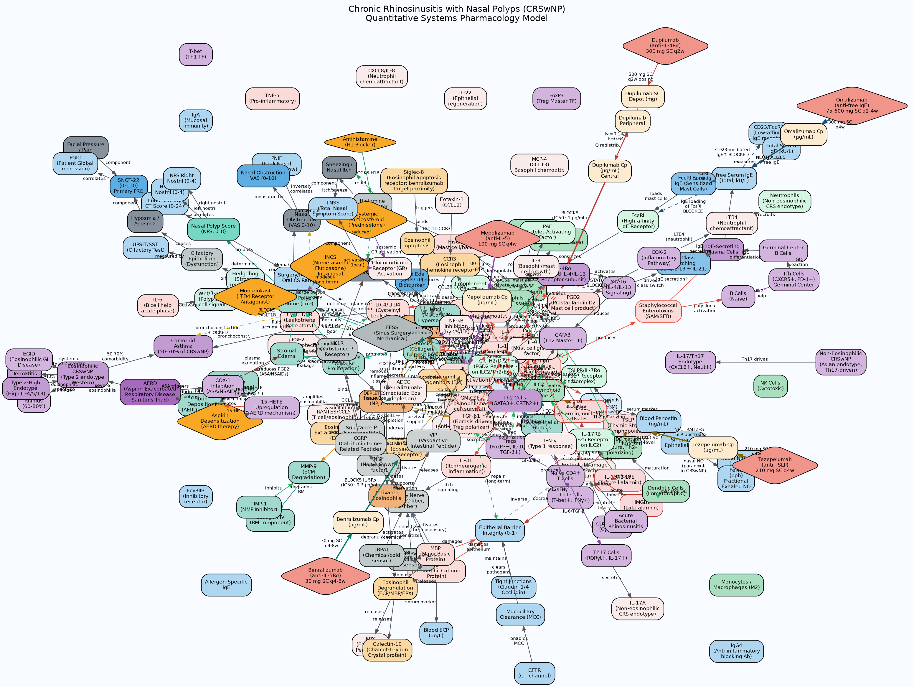</a> | 비강·부비동 상피세포 손상 → TSLP·IL-33·IL-25 경보소(alarmin) 방출 → ILC2 활성화·수지상세포 Th2 성숙화 → IL-4/IL-5/IL-13 폭포 → IgE 클래스 전환·호산구 동원·배상세포 과증식·점액 과분비. IL-13→ 퍼리오스틴·TGF-β1→ 섬유화; IL-5→ 혈중/조직 호산구→ ECP/MBP/EPX 탈과립→ 상피 추가 손상.<br>[🗺️ 지도](chronic-rhinosinusitis-with-nasal-polyps/crsnp_qsp_model.svg) · [⚙️ mrgsolve](chronic-rhinosinusitis-with-nasal-polyps/crsnp_mrgsolve_model.R) · [📚 문헌](chronic-rhinosinusitis-with-nasal-polyps/crsnp_references.md) · [📄 README](chronic-rhinosinusitis-with-nasal-polyps/README.md) |
| 46 | 심혈관 | [**만성 혈전색전성 폐동맥 고혈압**<br><sub>Chronic Thromboembolic Pulmonary Hypertension · CTEPH</sub>](chronic-thromboembolic-pulmonary-hypertension/) | <a href="chronic-thromboembolic-pulmonary-hypertension/cteph_qsp_model.svg"></a> | 폐색전증 불완전 섬유용해 → 조직화 혈전(기계적 고정 PVR↑) + 이차 혈관 리모델링(ET-1↑·NO↓·PGI₂↓·SMC 증식) → 총 PVR↑ → 우심실 압력 과부하·비후·확장·부전 → CO↓·SaO₂↓·6MWD↓. tPA 결핍·PAI-1↑·비정상 피브린 가교로 섬유용해 장애.<br>[🗺️ 지도](chronic-thromboembolic-pulmonary-hypertension/cteph_qsp_model.svg) · [⚙️ mrgsolve](chronic-thromboembolic-pulmonary-hypertension/cteph_mrgsolve_model.R) · [📚 문헌](chronic-thromboembolic-pulmonary-hypertension/cteph_references.md) · [📄 README](chronic-thromboembolic-pulmonary-hypertension/README.md) |
| 47 | 피부 | [**만성 자발성 두드러기**<br><sub>Chronic Spontaneous Urticaria · CSU</sub>](chronic-urticaria/) | <a href="chronic-urticaria/csu_qsp_model.svg"></a> | IgE/FcεRI-비만세포 축 → 팽진·홍반·소양감** — 자가항체(anti-FcεRIα·anti-IgE) 또는 자가항원-IgE → FcεRI 교차결합 → 비만세포 탈과립(히스타민·PGD2·LTC4) + IL-31·IL-33·TSLP Type-2 사이토카인 망 → 지속적 두드러기. BTK(PLCγ→IP3/DAG→Ca²⁺) 및 PI3K/Akt 경유 MC 활성화 신호.<br>[🗺️ 지도](chronic-urticaria/csu_qsp_model.svg) · [⚙️ mrgsolve](chronic-urticaria/csu_mrgsolve_model.R) · [📚 문헌](chronic-urticaria/csu_references.md) · [📄 README](chronic-urticaria/README.md) |
| 48 | 심혈관 | [**만성 정맥 부전**<br><sub>Chronic Venous Insufficiency · CVI</sub>](chronic-venous-insufficiency/) | <a href="chronic-venous-insufficiency/cvi_qsp_model.svg"></a> | 판막 부전·정맥압 상승·백혈구 트래핑에 의한 부종·궤양. 정맥활성약(MPFF)·압박요법.<br>[🗺️ 지도](chronic-venous-insufficiency/cvi_qsp_model.svg) · [⚙️ mrgsolve](chronic-venous-insufficiency/cvi_mrgsolve_model.R) · [📚 문헌](chronic-venous-insufficiency/cvi_references.md) · [📄 README](chronic-venous-insufficiency/README.md) |
| 49 | 신경 | [**만성 염증성 탈수초성 다발신경병증 (CIDP)**<br><sub>Chronic Inflammatory Demyelinating Polyneuropathy · CIDP</sub>](cidp/) | <a href="cidp/cidp_qsp_model.svg"></a> | 자가면역 말이집 파괴에 의한 진행/재발성 신경병증. IVIG·스테로이드·혈장교환.<br>[🗺️ 지도](cidp/cidp_qsp_model.svg) · [⚙️ mrgsolve](cidp/cidp_mrgsolve_model.R) · [📚 문헌](cidp/cidp_references.md) · [📄 README](cidp/README.md) |
| 50 | 종양 | [**대장암**<br><sub>Colorectal Cancer · CRC</sub>](colorectal-cancer/) | <a href="colorectal-cancer/crc_qsp_model.svg"></a> | APC/Wnt·KRAS/MAPK·PI3K/TP53 경로 통합, MSI-H/CMS 아형, 종양 미세환경(CD8/Treg/MDSC/TAM), 혈관신생(VEGF/VEGFR). 5-FU/옥살리플라틴/이리노테칸(UGT1A1)·베바시주맙(TMDD)·세툭시맙·펨브롤리주맙(MSI-H) PK/PD.<br>[🗺️ 지도](colorectal-cancer/crc_qsp_model.svg) · [⚙️ mrgsolve](colorectal-cancer/crc_mrgsolve_model.R) · [📚 문헌](colorectal-cancer/crc_references.md) · [📄 README](colorectal-cancer/README.md) |
| 51 | 내분비·대사 | [**선천성 부신 과형성 (CAH)**<br><sub>Congenital Adrenal Hyperplasia · CAH</sub>](congenital-adrenal-hyperplasia/) | <a href="congenital-adrenal-hyperplasia/cah_qsp_model.svg"></a> | 21-수산화효소 결핍으로 코르티솔 결핍·안드로겐 과잉. 글루코코르티코이드 보충·크리네세르폰트(CRF1 길항).<br>[🗺️ 지도](congenital-adrenal-hyperplasia/cah_qsp_model.svg) · [⚙️ mrgsolve](congenital-adrenal-hyperplasia/cah_mrgsolve_model.R) · [📚 문헌](congenital-adrenal-hyperplasia/cah_references.md) · [📄 README](congenital-adrenal-hyperplasia/README.md) |
| 52 | 호흡기 | [**만성 폐쇄성 폐질환 (COPD)**<br><sub>Chronic Obstructive Pulmonary Disease · COPD</sub>](copd/) | <a href="copd/copd_qsp.svg"></a> | 흡연-산화스트레스·단백분해효소 불균형에 의한 기도/폐포 파괴. LABA/LAMA·ICS 기관지확장.<br>[🗺️ 지도](copd/copd_qsp.svg) · [⚙️ mrgsolve](copd/copd_mrgsolve_model.R) · [📚 문헌](copd/copd_references.md) · [📄 README](copd/README.md) |
| 53 | 소화기·간담도 | [**크론병**<br><sub>Crohn's Disease · CD</sub>](crohn-disease/) | <a href="crohn-disease/cd_qsp_model.svg"></a> | Th1/Th17 경유 전층성 장 염증과 장벽 투과성. 항TNF·항IL-12/23·항인테그린 생물학제제.<br>[🗺️ 지도](crohn-disease/cd_qsp_model.svg) · [⚙️ mrgsolve](crohn-disease/cd_mrgsolve_model.R) · [📚 문헌](crohn-disease/cd_references.md) · [📄 README](crohn-disease/README.md) |
| 54 | 내분비·대사 | [**쿠싱 증후군**<br><sub>Cushing's Syndrome · CS</sub>](cushings-syndrome/) | <a href="cushings-syndrome/cs_qsp_model.svg"></a> | 뇌하수체 ACTH 선종(쿠싱병 70%)·이소성 ACTH(10%)·부신 선종(15%) 등에 의한 만성 고코르티솔혈증.<br>[🗺️ 지도](cushings-syndrome/cs_qsp_model.svg) · [⚙️ mrgsolve](cushings-syndrome/cs_mrgsolve_model.R) · [📚 문헌](cushings-syndrome/cs_references.md) · [📄 README](cushings-syndrome/README.md) |
| 55 | 호흡기 | [**낭성 섬유증**<br><sub>Cystic Fibrosis · CF</sub>](cystic-fibrosis/) | <a href="cystic-fibrosis/cf_qsp_model.svg"></a> | CFTR 변이(ΔF508)에 의한 점액 점성↑·만성 기도 감염. CFTR 조절제(엘렉사/테자/이바카프토르, Trikafta).<br>[🗺️ 지도](cystic-fibrosis/cf_qsp_model.svg) · [⚙️ mrgsolve](cystic-fibrosis/cf_mrgsolve_model.R) · [📚 문헌](cystic-fibrosis/cf_references.md) · [📄 README](cystic-fibrosis/README.md) |
| 56 | 종양 | [**사이토카인 방출 증후군 (CRS)**<br><sub>Cytokine Release Syndrome · CRS</sub>](cytokine-release-syndrome/) | <a href="cytokine-release-syndrome/crs_qsp_model.svg"></a> | CAR-T세포/이중특이항체 투여 후 면역 이펙터 세포 대규모 활성화 → T세포 IFN-γ·IL-2·GM-CSF 폭발 → 대식세포 M1 극화(JAK-STAT1) → IL-6↑↑↑(★핵심 드라이버)·IL-1β(NLRP3 인플라마솜)·TNF-α** — 내피세포 활성화(iNOS→NO↑→혈관확장→저혈압)·VEGF/ANG2→혈관 투과성↑→저산소증; 혈뇌장벽 붕괴→CNS 대식세포 활성화…<br>[🗺️ 지도](cytokine-release-syndrome/crs_qsp_model.svg) · [⚙️ mrgsolve](cytokine-release-syndrome/crs_mrgsolve_model.R) · [📚 문헌](cytokine-release-syndrome/crs_references.md) · [📄 README](cytokine-release-syndrome/README.md) |
| 57 | 자가면역·류마티스 | [**피부근염**<br><sub>Dermatomyositis · DM</sub>](dermatomyositis/) | <a href="dermatomyositis/dm_qsp_model.svg"></a> | I형 IFN·보체 매개 근육·피부 미세혈관병증. 스테로이드·IVIG·리툭시맙.<br>[🗺️ 지도](dermatomyositis/dm_qsp_model.svg) · [⚙️ mrgsolve](dermatomyositis/dm_mrgsolve_model.R) · [📚 문헌](dermatomyositis/dm_references.md) · [📄 README](dermatomyositis/README.md) |
| 58 | 내분비·대사 | [**당뇨병성 신병증**<br><sub>Diabetic Nephropathy · DN</sub>](diabetic-nephropathy/) | <a href="diabetic-nephropathy/dn_qsp_model.svg"></a> | 당뇨병 미세혈관 합병증 → 진행성 CKD** — 고혈당(AGE·PKC·헥소사민·폴리올 경로) → 산화스트레스(Nox4·ROS) + RAAS 활성화(AngII→인사구체 고혈압) + TGF-β1(Smad2/3·CTGF·ECM 축적·사구체경화) + NF-κB 염증(TNF-α·IL-1β·MCP-1·NLRP3) → 족세포 손상(네프린·포도신·족돌기 소실·단백뇨) → 세관 손상(SGL…<br>[🗺️ 지도](diabetic-nephropathy/dn_qsp_model.svg) · [⚙️ mrgsolve](diabetic-nephropathy/dn_mrgsolve_model.R) · [📚 문헌](diabetic-nephropathy/dn_references.md) · [📄 README](diabetic-nephropathy/README.md) |
| 59 | 안과 | [**당뇨병성 망막병증**<br><sub>Diabetic Retinopathy · DR</sub>](diabetic-retinopathy/) | <a href="diabetic-retinopathy/dr_qsp_model.svg"></a> | 고혈당 → 4가지 생화학 경로(폴리올·헥소사민·PKC·AGE-RAGE) → 산화스트레스/VEGF/신경염증 → 망막 혈관 구조 병변 → DME/PDR → 시력 소실** — 알도스환원효소(AR) → 소르비톨↑·NADPH 고갈; GFAT → O-GlcNAc → TGF-β/PAI-1↑; PKCβ2 → VEGF↑·NF-κB↑·eNOS↓·ET-1↑; 메틸글리옥살/글리옥살 → AGE →…<br>[🗺️ 지도](diabetic-retinopathy/dr_qsp_model.svg) · [⚙️ mrgsolve](diabetic-retinopathy/dr_mrgsolve_model.R) · [📚 문헌](diabetic-retinopathy/dr_references.md) · [📄 README](diabetic-retinopathy/README.md) |
| 60 | 심혈관 | [**확장성 심근병증**<br><sub>Dilated Cardiomyopathy · DCM</sub>](dilated-cardiomyopathy/) | <a href="dilated-cardiomyopathy/dcm_qsp_model.svg"></a> | 심실 확장·수축기능 저하·신경호르몬 활성화. GDMT(ARNI/BB/MRA/SGLT2i) 역리모델링.<br>[🗺️ 지도](dilated-cardiomyopathy/dcm_qsp_model.svg) · [⚙️ mrgsolve](dilated-cardiomyopathy/dcm_mrgsolve_model.R) · [📚 문헌](dilated-cardiomyopathy/dcm_references.md) · [📄 README](dilated-cardiomyopathy/README.md) |
| 61 | 소화기·간담도 | [**게실병**<br><sub>Diverticular Disease · DIV</sub>](diverticular-disease/) | <a href="diverticular-disease/div_qsp_model.svg"></a> | 장벽 구조·미생물·저섬유식에 의한 게실/게실염. 섬유·항생제·항염 치료.<br>[🗺️ 지도](diverticular-disease/div_qsp_model.svg) · [⚙️ mrgsolve](diverticular-disease/div_mrgsolve_model.R) · [📚 문헌](diverticular-disease/div_references.md) · [📄 README](diverticular-disease/README.md) |
| 62 | 근골격·신경근육 | [**뒤셴 근이영양증 (DMD)**<br><sub>Duchenne Muscular Dystrophy · DMD</sub>](duchenne-muscular-dystrophy/) | <a href="duchenne-muscular-dystrophy/dmd_qsp_model.svg">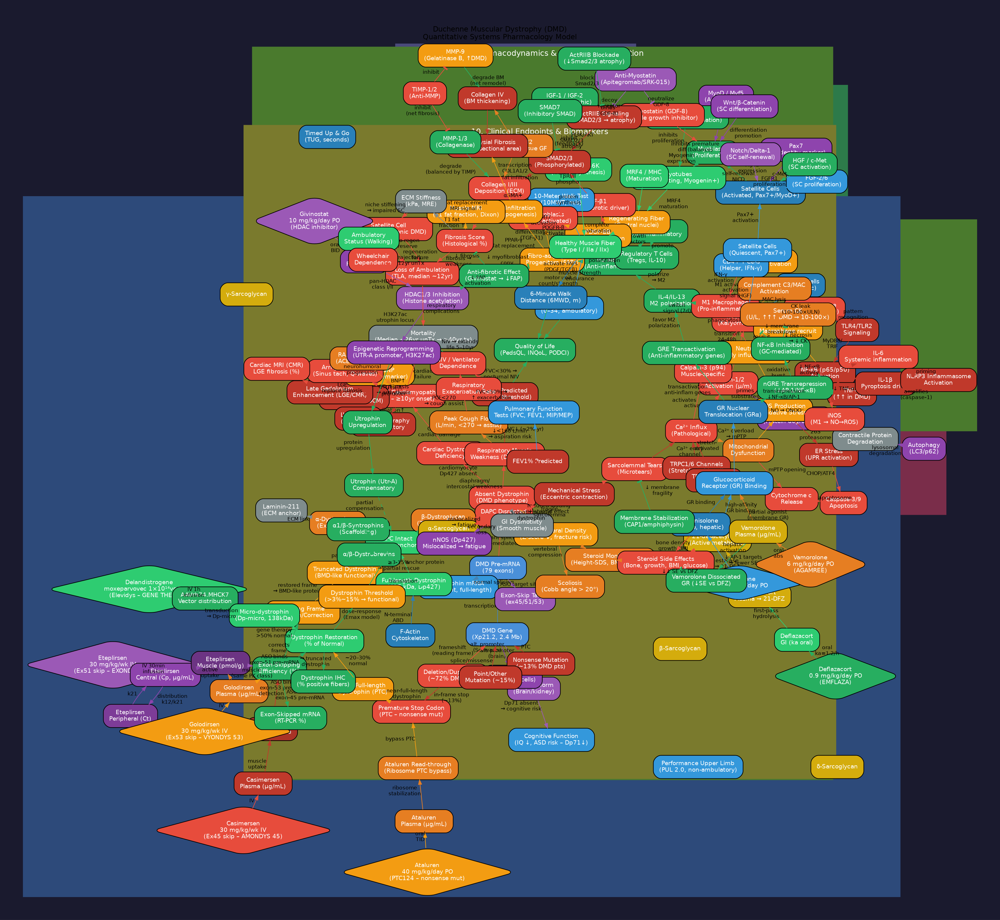</a> | 디스트로핀 결핍으로 진행성 근섬유 괴사·섬유화·심근병증. 코르티코스테로이드·엑손 스키핑·유전자 치료.<br>[🗺️ 지도](duchenne-muscular-dystrophy/dmd_qsp_model.svg) · [⚙️ mrgsolve](duchenne-muscular-dystrophy/dmd_mrgsolve_model.R) · [📚 문헌](duchenne-muscular-dystrophy/dmd_references.md) · [📄 README](duchenne-muscular-dystrophy/README.md) |
| 63 | 내분비·대사 | [**이상지질혈증**<br><sub>Dyslipidemia · DYSLIP</sub>](dyslipidemia/) | <a href="dyslipidemia/dyslip_qsp_model.svg"></a> | 간 콜레스테롤 합성·LDL 수용체·역수송 항상성. 스타틴·에제티미브·PCSK9 억제제.<br>[🗺️ 지도](dyslipidemia/dyslip_qsp_model.svg) · [⚙️ mrgsolve](dyslipidemia/dyslip_mrgsolve_model.R) · [📚 문헌](dyslipidemia/dyslip_references.md) · [📄 README](dyslipidemia/README.md) |
| 64 | 혈관염 | [**호산구 육아종증 다발혈관염 (EGPA)**<br><sub>Eosinophilic GPA · EGPA</sub>](egpa/) | <a href="egpa/egpa_qsp_model.svg"></a> | IL-5 매개 호산구증가와 ANCA 연관 소혈관염. 스테로이드·메폴리주맙·벤랄리주맙.<br>[🗺️ 지도](egpa/egpa_qsp_model.svg) · [⚙️ mrgsolve](egpa/egpa_mrgsolve_model.R) · [📚 문헌](egpa/egpa_references.md) · [📄 README](egpa/README.md) |
| 65 | 내분비·대사 | [**자궁내막증**<br><sub>Endometriosis · ENDO</sub>](endometriosis/) | <a href="endometriosis/endo_qsp_model.svg"></a> | 자궁내막 조직의 자궁외 이식·에스트로겐 의존 염증·통증. GnRH 길항제·프로게스틴.<br>[🗺️ 지도](endometriosis/endo_qsp_model.svg) · [⚙️ mrgsolve](endometriosis/endo_mrgsolve_model.R) · [📚 문헌](endometriosis/endo_references.md) · [📄 README](endometriosis/README.md) |
| 66 | 소화기·간담도 | [**호산구성 식도염 (EoE)**<br><sub>Eosinophilic Esophagitis · EoE</sub>](eosinophilic-esophagitis/) | <a href="eosinophilic-esophagitis/eoe_qsp_model.svg"></a> | Th2 사이토카인(IL-13·IL-5)·ILC2·호산구 축에 의한 만성 식도 염증. 두필루맙·부데소니드·센다키맙.<br>[🗺️ 지도](eosinophilic-esophagitis/eoe_qsp_model.svg) · [⚙️ mrgsolve](eosinophilic-esophagitis/eoe_mrgsolve_model.R) · [📚 문헌](eosinophilic-esophagitis/eoe_references.md) · [📄 README](eosinophilic-esophagitis/README.md) |
| 67 | 신경 | [**뇌전증**<br><sub>Epilepsy · EPI</sub>](epilepsy/) | <a href="epilepsy/epi_qsp_model.svg"></a> | 이온채널·흥분/억제 불균형에 의한 반복 발작. 항발작제(VPA/LEV/CBZ/LTG).<br>[🗺️ 지도](epilepsy/epi_qsp_model.svg) · [⚙️ mrgsolve](epilepsy/epi_mrgsolve_model.R) · [📚 문헌](epilepsy/epi_references.md) · [📄 README](epilepsy/README.md) |
| 68 | 심혈관 | [**본태성 고혈압**<br><sub>Essential Hypertension · EH</sub>](essential-hypertension/) | <a href="essential-hypertension/eh_qsp_model.svg"></a> | RAAS·교감신경·나트륨/체액 항상성에 의한 혈압 조절. ACEi/ARB·CCB·이뇨제.<br>[🗺️ 지도](essential-hypertension/eh_qsp_model.svg) · [⚙️ mrgsolve](essential-hypertension/eh_mrgsolve_model.R) · [📚 문헌](essential-hypertension/eh_references.md) · [📄 README](essential-hypertension/README.md) |
| 69 | 종양 | [**본태성 혈소판 증가증**<br><sub>Essential Thrombocythemia · ET</sub>](essential-thrombocythemia/) | <a href="essential-thrombocythemia/et_qsp_model.svg"></a> | JAK2 V617F(55–65%)·CALR Type1/2(25%)·MPL W515L(5%) 돌연변이 → JAK2 구성적 활성 → STAT5·PI3K·MAPK 하류 신호 → 메가카리오사이트 과증식·혈소판 생성 폭주(PLT 500–1500×10⁹/L).<br>[🗺️ 지도](essential-thrombocythemia/et_qsp_model.svg) · [⚙️ mrgsolve](essential-thrombocythemia/et_mrgsolve_model.R) · [📚 문헌](essential-thrombocythemia/et_references.md) · [📄 README](essential-thrombocythemia/README.md) |
| 70 | 혈액 | [**에반스 증후군**<br><sub>Evans Syndrome · ES</sub>](evans-syndrome/) | <a href="evans-syndrome/es_qsp_model.svg"></a> | AIHA와 ITP가 동반된 다계열 자가면역 혈구감소. 스테로이드·리툭시맙·TPO-RA.<br>[🗺️ 지도](evans-syndrome/es_qsp_model.svg) · [⚙️ mrgsolve](evans-syndrome/es_mrgsolve_model.R) · [📚 문헌](evans-syndrome/es_references.md) · [📄 README](evans-syndrome/README.md) |
| 71 | 희귀·유전 | [**파브리병**<br><sub>Fabry Disease · FBR</sub>](fabry-disease/) | <a href="fabry-disease/fbr_qsp_model.svg"></a> | X-연관 리소소말 저장 질환. *GLA* 변이 → α-갈락토시다제 A(α-Gal A) 결핍 → 글로보트리아오실세라미드(Gb3)·lyso-Gb3 조직축적 → 신세뇨관·심근·신경·혈관내피 손상. Gb3 합성(UGCG·B4GALT5)·M6PR/리소솜 가수분해·GCS 억제(SRT).<br>[🗺️ 지도](fabry-disease/fbr_qsp_model.svg) · [⚙️ mrgsolve](fabry-disease/fbr_mrgsolve_model.R) · [📚 문헌](fabry-disease/fbr_references.md) · [📄 README](fabry-disease/README.md) |
| 72 | 심혈관 | [**가족성 고콜레스테롤혈증**<br><sub>Familial Hypercholesterolemia · FH</sub>](familial-hypercholesterolemia/) | <a href="familial-hypercholesterolemia/fh_qsp_model.svg"></a> | LDLR 돌연변이(이형접합 1/250·동형접합 1/300,000) → LDLR 기능↓(0–50%) → LDL-C 극적 상승(HetFH 190–400 mg/dL, HomFH 400–1,000 mg/dL) → 조기 죽상동맥경화·심근경색**.<br>[🗺️ 지도](familial-hypercholesterolemia/fh_qsp_model.svg) · [⚙️ mrgsolve](familial-hypercholesterolemia/fh_mrgsolve_model.R) · [📚 문헌](familial-hypercholesterolemia/fh_references.md) · [📄 README](familial-hypercholesterolemia/README.md) |
| 73 | 자가면역·류마티스 | [**가족성 지중해열 (FMF)**<br><sub>Familial Mediterranean Fever · FMF</sub>](familial-mediterranean-fever/) | <a href="familial-mediterranean-fever/fmf_qsp_model.svg"></a> | MEFV 변이·피린 인플라마솜 과활성으로 주기적 발열·장막염·IL-1β. 콜히친·항IL-1 치료.<br>[🗺️ 지도](familial-mediterranean-fever/fmf_qsp_model.svg) · [⚙️ mrgsolve](familial-mediterranean-fever/fmf_mrgsolve_model.R) · [📚 문헌](familial-mediterranean-fever/fmf_references.md) · [📄 README](familial-mediterranean-fever/README.md) |
| 74 | 근골격·신경근육 | [**섬유근통**<br><sub>Fibromyalgia · FM</sub>](fibromyalgia/) | <a href="fibromyalgia/fm_qsp_model.svg"></a> | 중추감작(척수 WDR뉴런 LTP·wind-up·NMDA 수용체 탈억제); 하행성 통증조절계 결함(PAG-RVM-LC/Raphe 축, DPMS↓, DNIC 소실); 신경전달물질 불균형(CSF substance P↑·NE↓·5-HT↓); 신경염증(척수 미세아교세포 활성화·IL-1β/TNF-α·NLRP3 인플라마좀·KCC2↓→GABA 탈억제); HPA 축 이상(저코르티솔혈증·GH…<br>[🗺️ 지도](fibromyalgia/fm_qsp_model.svg) · [⚙️ mrgsolve](fibromyalgia/fm_mrgsolve_model.R) · [📚 문헌](fibromyalgia/fm_references.md) · [📄 README](fibromyalgia/README.md) |
| 75 | 신장·비뇨 | [**국소분절사구체경화증 (FSGS)**<br><sub>Focal Segmental Glomerulosclerosis · FSGS</sub>](fsgs/) | <a href="fsgs/fsgs_qsp_model.svg"></a> | 순환 투과인자·족세포 손상에 의한 신증후군 단백뇨. RAAS 억제·스테로이드·칼시뉴린억제제.<br>[🗺️ 지도](fsgs/fsgs_qsp_model.svg) · [⚙️ mrgsolve](fsgs/fsgs_mrgsolve_model.R) · [📚 문헌](fsgs/fsgs_references.md) · [📄 README](fsgs/README.md) |
| 76 | 종양 | [**위선암**<br><sub>Gastric Cancer · GC</sub>](gastric-cancer/) | <a href="gastric-cancer/gc_qsp_model.svg"></a> | H. pylori CagA/VacA·HER2/FGFR2/MET·VEGF 혈관신생·CLDN18.2·PD-L1/PD-1 면역관문·TCGA 아형(EBV/MSI-H/GS/CIN)·TME. 트라스투주맙(TMDD)·라무시루맙(VEGFR2)·니볼루맙(PD-1)·T-DXd(HER2 ADC)·졸베툭시맙(CLDN18.2 ADCC)·FLOT/FOLFOX PK/PD.<br>[🗺️ 지도](gastric-cancer/gc_qsp_model.svg) · [⚙️ mrgsolve](gastric-cancer/gc_mrgsolve_model.R) · [📚 문헌](gastric-cancer/gc_references.md) · [📄 README](gastric-cancer/README.md) |
| 77 | 소화기·간담도 | [**위마비 (Gastroparesis)**<br><sub>Gastroparesis · GP</sub>](gastroparesis/) | <a href="gastroparesis/gp_qsp_model.svg"></a> | ICC(카할 간질세포) 소실 + nNOS 뉴런 고갈 + 미주신경병증 → 위 배출 지연(4h 잔류 >10%) → GCSI 증상** — 당뇨병성(T1DM 29%·T2DM 1%)·특발성·수술 후 3대 아형.<br>[🗺️ 지도](gastroparesis/gp_qsp_model.svg) · [⚙️ mrgsolve](gastroparesis/gp_mrgsolve_model.R) · [📚 문헌](gastroparesis/gp_references.md) · [📄 README](gastroparesis/README.md) |
| 78 | 희귀·유전 | [**고셔병**<br><sub>Gaucher Disease · GCD</sub>](gaucher-disease/) | <a href="gaucher-disease/gcd_qsp_model.svg"></a> | GBA1* 이중대립변이 → 리소솜 β-글루코세레브로시다제(GBA) 결핍 → 글루코세레브로사이드(GC) 및 고독성 탈아실화 유도체 lyso-GL1 조직대식세포 축적 → 고셔세포 형성.<br>[🗺️ 지도](gaucher-disease/gcd_qsp_model.svg) · [⚙️ mrgsolve](gaucher-disease/gcd_mrgsolve_model.R) · [📚 문헌](gaucher-disease/gcd_references.md) · [📄 README](gaucher-disease/README.md) |
| 79 | 소화기·간담도 | [**위식도 역류질환 (GERD)**<br><sub>Gastroesophageal Reflux Disease · GERD</sub>](gerd/) | <a href="gerd/gerd_qsp_model.svg"></a> | 하부식도괄약근 이완·산 역류에 의한 식도 점막 손상. PPI·P-CAB 위산 억제.<br>[🗺️ 지도](gerd/gerd_qsp_model.svg) · [⚙️ mrgsolve](gerd/gerd_mrgsolve_model.R) · [📚 문헌](gerd/gerd_references.md) · [📄 README](gerd/README.md) |
| 80 | 혈관염 | [**거대세포 동맥염**<br><sub>Giant Cell Arteritis · GCA</sub>](giant-cell-arteritis/) | <a href="giant-cell-arteritis/gca_qsp_model.svg"></a> | 대혈관의 IL-6/Th17 육아종성 동맥염과 실명 위험. 스테로이드·토실리주맙(항IL-6R).<br>[🗺️ 지도](giant-cell-arteritis/gca_qsp_model.svg) · [⚙️ mrgsolve](giant-cell-arteritis/gca_mrgsolve_model.R) · [📚 문헌](giant-cell-arteritis/gca_references.md) · [📄 README](giant-cell-arteritis/README.md) |
| 81 | 종양 | [**교모세포종 (GBM)**<br><sub>Glioblastoma Multiforme · GBM</sub>](glioblastoma/) | <a href="glioblastoma/gbm_qsp_model.svg">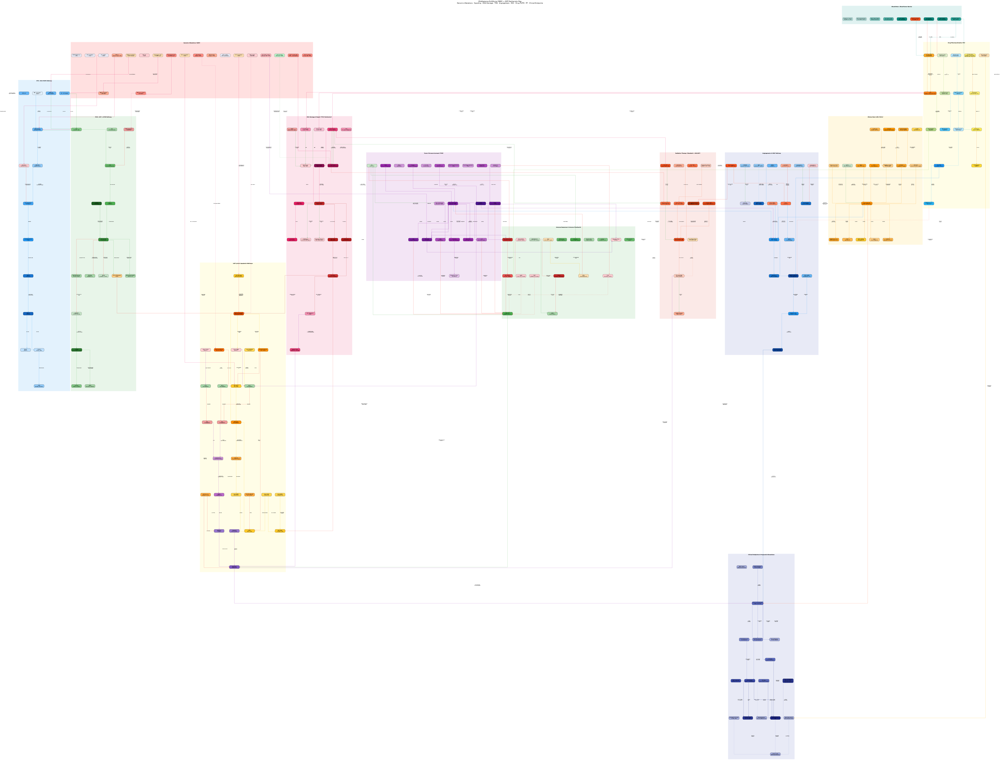</a> | EGFR 증폭/EGFRvIII → PI3K/AKT/mTOR 과활성화·PTEN 소실 → 무제한 증식; MGMT 비메틸화 → O6-MeG 신속 복구 → TMZ 내성; HIF-1α → VEGF-A → 혈관신생; M2-TAM·Treg·PD-L1 → 면역억제 미세환경.<br>[🗺️ 지도](glioblastoma/gbm_qsp_model.svg) · [⚙️ mrgsolve](glioblastoma/gbm_mrgsolve_model.R) · [📚 문헌](glioblastoma/gbm_references.md) · [📄 README](glioblastoma/README.md) |
| 82 | 신장·비뇨 | [**굿파스처 증후군**<br><sub>Goodpasture Syndrome · GPS</sub>](goodpasture-syndrome/) | <a href="goodpasture-syndrome/gps_qsp_model.svg"></a> | 항GBM 항체에 의한 급속진행성 사구체신염·폐포출혈. 혈장교환·CY·리툭시맙.<br>[🗺️ 지도](goodpasture-syndrome/gps_qsp_model.svg) · [⚙️ mrgsolve](goodpasture-syndrome/gps_mrgsolve_model.R) · [📚 문헌](goodpasture-syndrome/gps_references.md) · [📄 README](goodpasture-syndrome/README.md) |
| 83 | 내분비·대사 | [**통풍**<br><sub>Gout · GOUT</sub>](gout/) | <a href="gout/gout_qsp_model.svg"></a> | 요산 과포화·MSU 결정·NLRP3-IL-1β 염증성 관절염. 요산저하제(알로푸리놀/페북소스타트)·콜히친.<br>[🗺️ 지도](gout/gout_qsp_model.svg) · [⚙️ mrgsolve](gout/gout_mrgsolve_model.R) · [📚 문헌](gout/gout_references.md) · [📄 README](gout/README.md) |
| 84 | 혈액 | [**이식편대숙주병 (GvHD)**<br><sub>Graft-versus-Host Disease · GvHD</sub>](graft-versus-host-disease/) | <a href="graft-versus-host-disease/gvhd_qsp_model.svg"></a> | 동종 HSCT 후 공여자 T세포가 숙주 전처치(TBI/항암화학요법) 유발 조직손상(DAMP/PAMP)으로 활성화된 숙주 수지상세포(DC)에 의해 프라이밍 → TCR-MHC mismatch 직접/간접 동종반응(CD28-B7 공자극) → NFAT·NF-κB·JAK-STAT 경로 활성화 → Th1(IFN-γ·TNF-α)/Th17(IL-17A·IL-22) 극화·Treg 결핍 → 급…<br>[🗺️ 지도](graft-versus-host-disease/gvhd_qsp_model.svg) · [⚙️ mrgsolve](graft-versus-host-disease/gvhd_mrgsolve_model.R) · [📚 문헌](graft-versus-host-disease/gvhd_references.md) · [📄 README](graft-versus-host-disease/README.md) |
| 85 | 혈관염 | [**육아종증 다발혈관염 (GPA)**<br><sub>Granulomatosis with Polyangiitis · GPA</sub>](granulomatosis-with-polyangiitis/) | <a href="granulomatosis-with-polyangiitis/gpa_qsp_model.svg"></a> | PR3-ANCA 호중구 활성·육아종성 소혈관염. 리툭시맙·아바코판(C5aR 차단).<br>[🗺️ 지도](granulomatosis-with-polyangiitis/gpa_qsp_model.svg) · [⚙️ mrgsolve](granulomatosis-with-polyangiitis/gpa_mrgsolve_model.R) · [📚 문헌](granulomatosis-with-polyangiitis/gpa_references.md) · [📄 README](granulomatosis-with-polyangiitis/README.md) |
| 86 | 내분비·대사 | [**그레이브스병**<br><sub>Graves' Disease · GD</sub>](graves-disease/) | <a href="graves-disease/gd_qsp_model.svg"></a> | TSH 수용체 자극항체에 의한 갑상선기능항진. 항갑상선제·방사성요오드·수술.<br>[🗺️ 지도](graves-disease/gd_qsp_model.svg) · [⚙️ mrgsolve](graves-disease/gd_mrgsolve_model.R) · [📚 문헌](graves-disease/gd_references.md) · [📄 README](graves-disease/README.md) |
| 87 | 신경 | [**길랭-바레 증후군**<br><sub>Guillain-Barré Syndrome · GBS</sub>](guillain-barre-syndrome/) | <a href="guillain-barre-syndrome/gbs_qsp_model.svg"></a> | 분자모방 항강글리오시드 항체·보체 매개 급성 신경병증. IVIG·혈장교환.<br>[🗺️ 지도](guillain-barre-syndrome/gbs_qsp_model.svg) · [⚙️ mrgsolve](guillain-barre-syndrome/gbs_mrgsolve_model.R) · [📚 문헌](guillain-barre-syndrome/gbs_references.md) · [📄 README](guillain-barre-syndrome/README.md) |
| 88 | 내분비·대사 | [**하시모토 갑상선염**<br><sub>Hashimoto's Thyroiditis · HT</sub>](hashimoto-thyroiditis/) | <a href="hashimoto-thyroiditis/ht_qsp_model.svg"></a> | 항TPO/Tg 항체·T세포 매개 갑상선 파괴와 기능저하. 레보티록신 보충.<br>[🗺️ 지도](hashimoto-thyroiditis/ht_qsp_model.svg) · [⚙️ mrgsolve](hashimoto-thyroiditis/ht_mrgsolve_model.R) · [📚 문헌](hashimoto-thyroiditis/ht_references.md) · [📄 README](hashimoto-thyroiditis/README.md) |
| 89 | 심혈관 | [**심부전 (보존 박출률, HFpEF)**<br><sub>Heart Failure with Preserved EF · HFpEF</sub>](heart-failure-hfpef/) | <a href="heart-failure-hfpef/hfpef_qsp_model.svg"></a> | 심근 경직·전신 염증·미세혈관 기능부전에 의한 확장기 부전. SGLT2i·MRA·이뇨제.<br>[🗺️ 지도](heart-failure-hfpef/hfpef_qsp_model.svg) · [⚙️ mrgsolve](heart-failure-hfpef/hfpef_mrgsolve_model.R) · [📚 문헌](heart-failure-hfpef/hfpef_references.md) · [📄 README](heart-failure-hfpef/README.md) |
| 90 | 심혈관 | [**심부전 (감소 박출률, HFrEF)**<br><sub>Heart Failure with Reduced EF · HFrEF</sub>](heart-failure-hfref/) | <a href="heart-failure-hfref/hfref_qsp_model.svg"></a> | 신경호르몬(RAAS/SNS) 과활성과 심실 리모델링. ARNI·BB·MRA·SGLT2i 4대 요법.<br>[🗺️ 지도](heart-failure-hfref/hfref_qsp_model.svg) · [⚙️ mrgsolve](heart-failure-hfref/hfref_mrgsolve_model.R) · [📚 문헌](heart-failure-hfref/hfref_references.md) · [📄 README](heart-failure-hfref/README.md) |
| 91 | 혈액 | [**혈구탐식성 림프조직구증 (HLH)**<br><sub>Hemophagocytic Lymphohistiocytosis · HLH</sub>](hemophagocytic-lymphohistiocytosis/) | <a href="hemophagocytic-lymphohistiocytosis/hlh_qsp_model.svg"></a> | NK세포/CTL 세포독성 결함(PRF1·UNC13D·STXBP2…) 또는 외부 트리거(EBV·CMV·sJIA·악성 종양) → APC 제거 실패 → CD4/CD8 T세포 지속 활성화 → IFN-γ·IL-18 폭발적 생산(★ 핵심 사이토카인) → 대식세포 활성화(M1 극화) → 혈구탐식(적혈구·백혈구·혈소판 engulfment) → 페리틴↑↑↑(>10,000 ng/mL·★진단…<br>[🗺️ 지도](hemophagocytic-lymphohistiocytosis/hlh_qsp_model.svg) · [⚙️ mrgsolve](hemophagocytic-lymphohistiocytosis/hlh_mrgsolve_model.R) · [📚 문헌](hemophagocytic-lymphohistiocytosis/hlh_references.md) · [📄 README](hemophagocytic-lymphohistiocytosis/README.md) |
| 92 | 혈액 | [**혈우병 A**<br><sub>Hemophilia A · HA</sub>](hemophilia-a/) | <a href="hemophilia-a/ha_qsp_model.svg"></a> | X염색체 연관 FVIII 결핍(F8 유전자 돌연변이) → 내인성 Xase 복합체(FIXa·FVIIIa) 형성 불능 → 트롬빈 생성 급감 → 불안정 피브린 클롯. 중증(<1 IU/dL) ABR ~30/년; 억제항체(30% 중증) 발생으로 대체치료 실패.<br>[🗺️ 지도](hemophilia-a/ha_qsp_model.svg) · [⚙️ mrgsolve](hemophilia-a/ha_mrgsolve_model.R) · [📚 문헌](hemophilia-a/ha_references.md) · [📄 README](hemophilia-a/README.md) |
| 93 | 종양 | [**간세포암종 (HCC)**<br><sub>Hepatocellular Carcinoma · HCC</sub>](hepatocellular-carcinoma/) | <a href="hepatocellular-carcinoma/hcc_qsp_model.svg"></a> | HBV/HCV·NAFLD 기반 간암. RAS/RAF/MEK/ERK·PI3K/AKT/mTOR·Wnt/β-catenin·VEGF/혈관신생·종양면역 미세환경(PD-L1/CD8/Treg/TAM) 통합. 소라페닙·렌바티닙·아테조리주맙+베바시주맙(IMbrave150)·레고라페닙 PK/PD. 20구획 ODE, 5치료시나리오, AFP/간기능 바이오마커.<br>[🗺️ 지도](hepatocellular-carcinoma/hcc_qsp_model.svg) · [⚙️ mrgsolve](hepatocellular-carcinoma/hcc_mrgsolve_model.R) · [📚 문헌](hepatocellular-carcinoma/hcc_references.md) · [📄 README](hepatocellular-carcinoma/README.md) |
| 94 | 희귀·유전 | [**유전성 혈관부종**<br><sub>Hereditary Angioedema · HAE</sub>](hereditary-angioedema/) | <a href="hereditary-angioedema/hae_qsp_model.svg"></a> | SERPING1* 돌연변이 → C1-INH 결핍/기능이상(Type I/II) 또는 *F12* Thr328Lys 이득기능돌연변이(Type III) → 칼리크레인-키닌계(KKS) 무제한 활성화 → 브라디키닌(BK) 과잉 → B2R-Gq/IP3/Ca²⁺/eNOS/NO 경로 → VE-cadherin 소실·혈장삼출 → 피하/후두 혈관부종.<br>[🗺️ 지도](hereditary-angioedema/hae_qsp_model.svg) · [⚙️ mrgsolve](hereditary-angioedema/hae_mrgsolve_model.R) · [📚 문헌](hereditary-angioedema/hae_references.md) · [📄 README](hereditary-angioedema/README.md) |
| 95 | 내분비·대사 | [**유전성 혈색소증**<br><sub>Hereditary Hemochromatosis · HH</sub>](hereditary-hemochromatosis/) | <a href="hereditary-hemochromatosis/hh_qsp_model.svg">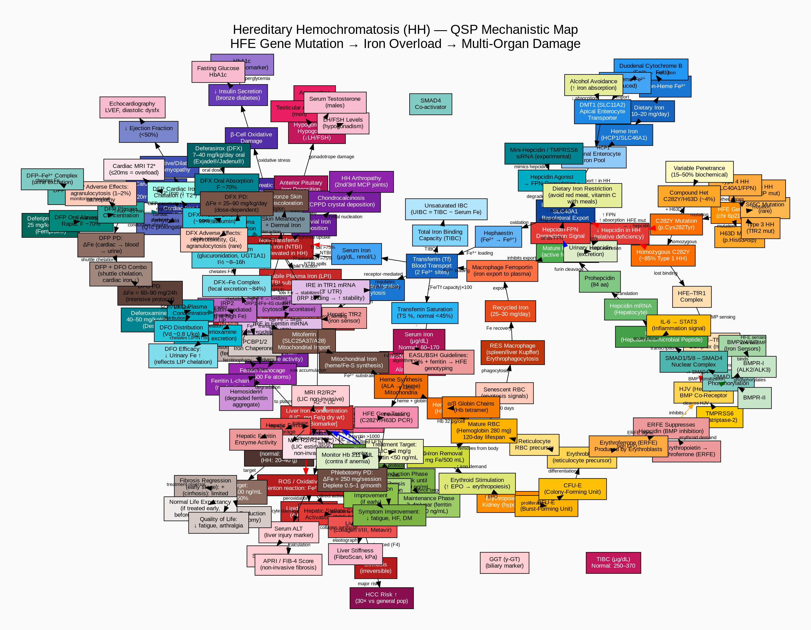</a> | HFE 변이·헵시딘 저하로 철 과흡수·장기 침착(간/심장/췌장). 정맥절개·철 킬레이션.<br>[🗺️ 지도](hereditary-hemochromatosis/hh_qsp_model.svg) · [⚙️ mrgsolve](hereditary-hemochromatosis/hh_mrgsolve_model.R) · [📚 문헌](hereditary-hemochromatosis/hh_references.md) · [📄 README](hereditary-hemochromatosis/README.md) |
| 96 | 피부 | [**화농성 한선염**<br><sub>Hidradenitis Suppurativa · HS</sub>](hidradenitis-suppurativa/) | <a href="hidradenitis-suppurativa/hs_qsp_model.svg"></a> | 모낭 파열 → 복합 면역 활성화 → 만성 피부 염증** — γ-Secretase 결함(NCSTN/PSEN1/2 변이)·과각화증·모낭 폐쇄 → 피지모낭단위 파열 → NLRP3 인플라마좀(IL-1β)·TLR2/4 NF-κB(TNF-α·IL-6)·Th17(IL-17A/F) 복합 활성화. S. aureus/혐기균 바이오필름·마이크로비옴 불균형이 염증 증폭.<br>[🗺️ 지도](hidradenitis-suppurativa/hs_qsp_model.svg) · [⚙️ mrgsolve](hidradenitis-suppurativa/hs_mrgsolve_model.R) · [📚 문헌](hidradenitis-suppurativa/hs_references.md) · [📄 README](hidradenitis-suppurativa/README.md) |
| 97 | 감염 | [**HIV/AIDS**<br><sub>HIV/AIDS · HIV</sub>](hiv-aids/) | <a href="hiv-aids/hiv_qsp_model.svg"></a> | HIV의 CD4 T세포 감염·고갈(Perelson 바이러스 동역학). 항레트로바이러스 병합요법(ART).<br>[🗺️ 지도](hiv-aids/hiv_qsp_model.svg) · [⚙️ mrgsolve](hiv-aids/hiv_mrgsolve_model.R) · [📚 문헌](hiv-aids/hiv_references.md) · [📄 README](hiv-aids/README.md) |
| 98 | 신경 | [**헌팅턴병 (Huntington's Disease)**<br><sub>Huntington's Disease · HD</sub>](huntingtons-disease/) | <a href="huntingtons-disease/hd_qsp_model.svg"></a> | CAG 반복 확장(≥36) → mHTT 생성·집적 → 선조체 중간가시신경세포(MSN) 변성. mHTT 집적 폭포(단량체→올리고머→섬유)·BDNF-TrkB 결핍(REST/NRSF·HAP1 축)·흥분독성(eNMDAR/Ca²⁺/calpain)·미토콘드리아 기능부전(PGC-1α·Complex I/II/III)·신경염증(NLRP3/IL-1β)·아포토시스(Casp-3/6).<br>[🗺️ 지도](huntingtons-disease/hd_qsp_model.svg) · [⚙️ mrgsolve](huntingtons-disease/hd_mrgsolve_model.R) · [📚 문헌](huntingtons-disease/hd_references.md) · [📄 README](huntingtons-disease/README.md) |
| 99 | 심혈관 | [**비후성 심근병증**<br><sub>Hypertrophic Cardiomyopathy · HCM</sub>](hypertrophic-cardiomyopathy/) | <a href="hypertrophic-cardiomyopathy/hcm_qsp_model.svg"></a> | 근절 변이에 의한 과수축·좌심실유출로 폐쇄. 마바캄텐(마이오신 억제)·베타차단제.<br>[🗺️ 지도](hypertrophic-cardiomyopathy/hcm_qsp_model.svg) · [⚙️ mrgsolve](hypertrophic-cardiomyopathy/hcm_mrgsolve_model.R) · [📚 문헌](hypertrophic-cardiomyopathy/hcm_references.md) · [📄 README](hypertrophic-cardiomyopathy/README.md) |
| 100 | 호흡기 | [**특발성 폐섬유화증 (IPF)**<br><sub>Idiopathic Pulmonary Fibrosis · IPF</sub>](idiopathic-pulmonary-fibrosis/) | <a href="idiopathic-pulmonary-fibrosis/ipf_qsp_model.svg"></a> | 상피손상-섬유아세포 활성·ECM 침착에 의한 진행성 섬유화. 닌테다닙·피르페니돈.<br>[🗺️ 지도](idiopathic-pulmonary-fibrosis/ipf_qsp_model.svg) · [⚙️ mrgsolve](idiopathic-pulmonary-fibrosis/ipf_mrgsolve_model.R) · [📚 문헌](idiopathic-pulmonary-fibrosis/ipf_references.md) · [📄 README](idiopathic-pulmonary-fibrosis/README.md) |
| 101 | 신장·비뇨 | [**IgA 신병증**<br><sub>IgA Nephropathy · IgAN</sub>](iga-nephropathy/) | <a href="iga-nephropathy/igan_qsp_model.svg"></a> | Gd-IgA1 면역복합체 메산지움 침착·보체 활성. 스테로이드·스파르센탄·보체억제제(이프타코판).<br>[🗺️ 지도](iga-nephropathy/igan_qsp_model.svg) · [⚙️ mrgsolve](iga-nephropathy/igan_mrgsolve_model.R) · [📚 문헌](iga-nephropathy/igan_references.md) · [📄 README](iga-nephropathy/README.md) |
| 102 | 혈관염 | [**IgA 혈관염 (HSP)**<br><sub>IgA Vasculitis · IgAV</sub>](iga-vasculitis/) | <a href="iga-vasculitis/igav_qsp_model.svg"></a> | Gd-IgA1 면역복합체 소혈관 침착에 의한 촉지성 자반·신염. 스테로이드·면역억제.<br>[🗺️ 지도](iga-vasculitis/igav_qsp_model.svg) · [⚙️ mrgsolve](iga-vasculitis/igav_mrgsolve_model.R) · [📚 문헌](iga-vasculitis/igav_references.md) · [📄 README](iga-vasculitis/README.md) |
| 103 | 자가면역·류마티스 | [**IgG4 연관 질환**<br><sub>IgG4-Related Disease · IgG4-RD</sub>](igg4-related-disease/) | <a href="igg4-related-disease/igg4rd_qsp_model.svg"></a> | Tfh·IgG4 형질모세포·근섬유아세포 활성에 의한 다장기 섬유염증·종괴. 스테로이드·리툭시맙.<br>[🗺️ 지도](igg4-related-disease/igg4rd_qsp_model.svg) · [⚙️ mrgsolve](igg4-related-disease/igg4rd_mrgsolve_model.R) · [📚 문헌](igg4-related-disease/igg4rd_references.md) · [📄 README](igg4-related-disease/README.md) |
| 104 | 혈액 | [**면역혈소판감소자반증 (ITP)**<br><sub>Immune Thrombocytopenic Purpura · ITP</sub>](immune-thrombocytopenic-purpura/) | <a href="immune-thrombocytopenic-purpura/itp_qsp_model.svg"></a> | 항혈소판 항체 매개 파괴와 생성 저하. 스테로이드·TPO 수용체작용제·리툭시맙.<br>[🗺️ 지도](immune-thrombocytopenic-purpura/itp_qsp_model.svg) · [⚙️ mrgsolve](immune-thrombocytopenic-purpura/itp_mrgsolve_model.R) · [📚 문헌](immune-thrombocytopenic-purpura/itp_references.md) · [📄 README](immune-thrombocytopenic-purpura/README.md) |
| 105 | 신장·비뇨 | [**간질성 방광염 / 방광 통증 증후군 (IC/BPS)**<br><sub>Interstitial Cystitis / Bladder Pain Syndrome · IC/BPS</sub>](interstitial-cystitis/) | <a href="interstitial-cystitis/ic_bps_qsp_model.svg"></a> | GAG층 결핍 → 요로상피 투과성↑ → 요중 K+ 누출 → C-섬유(TRPV1+·P2X3+) 탈분극 → 비만세포 활성화(히스타민·트립타아제·PGE2·TNF-α 분비) → PAR2 → 장벽↓(양성 피드백) → 서브스턴스 P·CGRP 역행성 분비(신경성 염증) → NGF↑ → C-섬유 증식·TRPV1 상향 → 척수 감작(Wind-up·NMDA·BDNF) → 중추 감작(ACC·도…<br>[🗺️ 지도](interstitial-cystitis/ic_bps_qsp_model.svg) · [⚙️ mrgsolve](interstitial-cystitis/ic_bps_mrgsolve_model.R) · [📚 문헌](interstitial-cystitis/ic_bps_references.md) · [📄 README](interstitial-cystitis/README.md) |
| 106 | 소화기·간담도 | [**과민성 장증후군 (IBS)**<br><sub>Irritable Bowel Syndrome · IBS</sub>](irritable-bowel-syndrome/) | <a href="irritable-bowel-syndrome/ibs_qsp_model.svg"></a> | 뇌-장축 이상·내장과민·미생물 변화. 식이·신경조절·장특이 약물(리나클로타이드 등).<br>[🗺️ 지도](irritable-bowel-syndrome/ibs_qsp_model.svg) · [⚙️ mrgsolve](irritable-bowel-syndrome/ibs_mrgsolve_model.R) · [📚 문헌](irritable-bowel-syndrome/ibs_references.md) · [📄 README](irritable-bowel-syndrome/README.md) |
| 107 | 신경 | [**허혈성 뇌졸중**<br><sub>Ischemic Stroke · IS</sub>](ischemic-stroke/) | <a href="ischemic-stroke/is_qsp_model.svg"></a> | 혈전/색전성 뇌혈관 폐색 → CBF 급감 → 허혈 핵심부(Core, <10 mL/100g/min) 불가역 괴사 + 반음영부(Penumbra, 10–20 mL/100g/min) 가역적 위험 조직 → ATP 고갈 → Na⁺/K⁺-ATPase 실패·탈분극 → 흥분독성 글루타메이트(NMDA/AMPA→Ca²⁺ 과부하) → ROS/NOS 과잉→미토콘드리아 기능부전→Cytc→Caspas…<br>[🗺️ 지도](ischemic-stroke/is_qsp_model.svg) · [⚙️ mrgsolve](ischemic-stroke/is_mrgsolve_model.R) · [📚 문헌](ischemic-stroke/is_references.md) · [📄 README](ischemic-stroke/README.md) |
| 108 | 자가면역·류마티스 | [**소아특발성 관절염**<br><sub>Juvenile Idiopathic Arthritis · JIA</sub>](juvenile-idiopathic-arthritis/) | <a href="juvenile-idiopathic-arthritis/jia_qsp_model.svg"></a> | T세포/B세포·사이토카인(TNF-α/IL-6/IL-1β/IL-18) 매개 활막 염증과 연골·골 파괴. 소수관절형/다관절형 RF±/전신형(sJIA)/ERA/건선성 7아형 모델링. sJIA: NLRP3→IL-1β/IL-18 자가염증 루프·MAS(대식세포 활성화 증후군) 경로 포함.<br>[🗺️ 지도](juvenile-idiopathic-arthritis/jia_qsp_model.svg) · [⚙️ mrgsolve](juvenile-idiopathic-arthritis/jia_mrgsolve_model.R) · [📚 문헌](juvenile-idiopathic-arthritis/jia_references.md) · [📄 README](juvenile-idiopathic-arthritis/README.md) |
| 109 | 혈관염 | [**가와사키병**<br><sub>Kawasaki Disease · KD</sub>](kawasaki-disease/) | <a href="kawasaki-disease/kd_qsp_model.svg"></a> | 원인 불명 트리거 → TLR/NLR 선천 면역 활성화 → NLRP3 인플라마좀(Caspase-1·IL-1β 성숙) → 사이토카인 폭풍(IL-1β·IL-6·TNF-α) → 혈관 내피 활성화(VCAM-1·ICAM-1·TF↑) → 관상동맥 중막 파괴·동맥류(AHA Z-점수 분류: small z≥2.5, medium z≥5, giant z≥10) → 혈소판 증가증(2주 피크) →…<br>[🗺️ 지도](kawasaki-disease/kd_qsp_model.svg) · [⚙️ mrgsolve](kawasaki-disease/kd_mrgsolve_model.R) · [📚 문헌](kawasaki-disease/kd_references.md) · [📄 README](kawasaki-disease/README.md) |
| 110 | 소화기·간담도 | [**간경변증**<br><sub>Liver Cirrhosis · LC</sub>](liver-cirrhosis/) | <a href="liver-cirrhosis/lc_qsp_model.svg"></a> | 만성 손상 → 성상세포 섬유화·문맥압항진·합병증. 원인치료 및 합병증 관리.<br>[🗺️ 지도](liver-cirrhosis/lc_qsp_model.svg) · [⚙️ mrgsolve](liver-cirrhosis/lc_mrgsolve_model.R) · [📚 문헌](liver-cirrhosis/lc_references.md) · [📄 README](liver-cirrhosis/README.md) |
| 111 | 감염 | [**롱 코비드 (Long COVID / PASC)**<br><sub>Post-Acute Sequelae of SARS-CoV-2 · PASC</sub>](long-covid/) | <a href="long-covid/pasc_qsp_model.svg"></a> | SARS-CoV-2 조직 저장소(장·림프절·CNS) 지속 → 잔류 항원 → 면역 이상(CD8+ 소진·자가항체·IFN-I 기능 부전) → 다계통 손상**.<br>[🗺️ 지도](long-covid/pasc_qsp_model.svg) · [⚙️ mrgsolve](long-covid/pasc_mrgsolve_model.R) · [📚 문헌](long-covid/pasc_references.md) · [📄 README](long-covid/README.md) |
| 112 | 신장·비뇨 | [**루푸스 신염**<br><sub>Lupus Nephritis · LN</sub>](lupus-nephritis/) | <a href="lupus-nephritis/ln_qsp_model.svg"></a> | type I IFN(pDC→cGAS-STING→TLR7/9) → BAFF↑ → B세포 과활성화 → 장수 형질세포 → anti-dsDNA IgG → 면역복합체(IC) → 사구체 메산지움·내피세포 침착 → 보체(C1q→C4→C3→C5a+C5b-9) → 족세포(podocyte) 손상 → nephrin↓ → 단백뇨(UPCR↑) → TGF-β→간질 섬유화→eGFR 감소**.<br>[🗺️ 지도](lupus-nephritis/ln_qsp_model.svg) · [⚙️ mrgsolve](lupus-nephritis/ln_mrgsolve_model.R) · [📚 문헌](lupus-nephritis/ln_references.md) · [📄 README](lupus-nephritis/README.md) |
| 113 | 내분비·대사 | [**림프구성 뇌하수체염**<br><sub>Lymphocytic Hypophysitis · LHY</sub>](lymphocytic-hypophysitis/) | <a href="lymphocytic-hypophysitis/lhyp_qsp_model.svg"></a> | 뇌하수체 자가면역 침윤·뇌하수체 기능저하(면역관문억제제 연관 포함). 스테로이드·호르몬 보충.<br>[🗺️ 지도](lymphocytic-hypophysitis/lhyp_qsp_model.svg) · [⚙️ mrgsolve](lymphocytic-hypophysitis/lhyp_mrgsolve_model.R) · [📚 문헌](lymphocytic-hypophysitis/lhyp_references.md) · [📄 README](lymphocytic-hypophysitis/README.md) |
| 114 | 정신·신경 | [**주요우울장애 (MDD)**<br><sub>Major Depressive Disorder · MDD</sub>](major-depressive-disorder/) | <a href="major-depressive-disorder/mdd_qsp_model.svg"></a> | 모노아민·HPA축·신경가소성 이상. SSRI/SNRI·케타민·신경자극.<br>[🗺️ 지도](major-depressive-disorder/mdd_qsp_model.svg) · [⚙️ mrgsolve](major-depressive-disorder/mdd_mrgsolve_model.R) · [📚 문헌](major-depressive-disorder/mdd_references.md) · [📄 README](major-depressive-disorder/README.md) |
| 115 | 심혈관 | [**마르팡 증후군 (Marfan Syndrome)**<br><sub>Marfan Syndrome · MFS</sub>](marfan-syndrome/) | <a href="marfan-syndrome/mfs_qsp_model.svg"></a> | FBN1 돌연변이(Chr 15q21.1) → 피브릴린-1 결함 → ECM 마이크로피브릴 파괴 → TGF-β 서열화 손상 → 자유 TGF-β1/2 증가 → p-SMAD2/3 + p-ERK1/2 과활성 → MMP-2/9↑ → 대동맥 중막 탄성 박판 분절화·낭성 괴사·평활근세포 세포자멸 → 대동맥 근부(발살바동) 확장 → 대동맥판 역류·박리(A/B형)·파열**.<br>[🗺️ 지도](marfan-syndrome/mfs_qsp_model.svg) · [⚙️ mrgsolve](marfan-syndrome/mfs_mrgsolve_model.R) · [📚 문헌](marfan-syndrome/mfs_references.md) · [📄 README](marfan-syndrome/README.md) |
| 116 | 종양 | [**악성 흑색종**<br><sub>Melanoma · MEL</sub>](melanoma/) | <a href="melanoma/melanoma_qsp_model.svg"></a> | BRAF V600E/K 돌연변이(~50%) → 구성적 MEK1/2 활성 → ERK1/2 핵 전위 → MITF·MYC·사이클린D1 전사 → 세포증식·생존·혈관신생. NRAS Q61(~20%)·NF1 결손(~15%)·WT 드라이버**.<br>[🗺️ 지도](melanoma/melanoma_qsp_model.svg) · [⚙️ mrgsolve](melanoma/melanoma_mrgsolve_model.R) · [📚 문헌](melanoma/melanoma_references.md) · [📄 README](melanoma/README.md) |
| 117 | 신장·비뇨 | [**막성 신병증**<br><sub>Membranous Nephropathy · MN</sub>](membranous-nephropathy/) | <a href="membranous-nephropathy/mn_qsp_model.svg"></a> | 항PLA2R 항체에 의한 상피하 면역침착·신증후군. 리툭시맙 B세포 고갈.<br>[🗺️ 지도](membranous-nephropathy/mn_qsp_model.svg) · [⚙️ mrgsolve](membranous-nephropathy/mn_mrgsolve_model.R) · [📚 문헌](membranous-nephropathy/mn_references.md) · [📄 README](membranous-nephropathy/README.md) |
| 118 | 내분비·대사 | [**대사 증후군**<br><sub>Metabolic Syndrome · MS</sub>](metabolic-syndrome/) | <a href="metabolic-syndrome/ms_qsp_model.svg"></a> | 인슐린 저항성·내장지방·이상지질·고혈압 군집. 생활습관 및 대사 표적 약물.<br>[🗺️ 지도](metabolic-syndrome/ms_qsp_model.svg) · [⚙️ mrgsolve](metabolic-syndrome/ms_mrgsolve_model.R) · [📚 문헌](metabolic-syndrome/ms_references.md) · [📄 README](metabolic-syndrome/README.md) |
| 119 | 혈관염 | [**현미경적 다발혈관염 (MPA)**<br><sub>Microscopic Polyangiitis · MPA</sub>](microscopic-polyangiitis/) | <a href="microscopic-polyangiitis/mpa_qsp_model.svg"></a> | MPO-ANCA 매개 소혈관염·급속진행성 사구체신염. 리툭시맙·아바코판.<br>[🗺️ 지도](microscopic-polyangiitis/mpa_qsp_model.svg) · [⚙️ mrgsolve](microscopic-polyangiitis/mpa_mrgsolve_model.R) · [📚 문헌](microscopic-polyangiitis/mpa_references.md) · [📄 README](microscopic-polyangiitis/README.md) |
| 120 | 신경 | [**편두통**<br><sub>Migraine · MGR</sub>](migraine/) | <a href="migraine/mgr_qsp_model.svg"></a> | 삼차혈관계·CGRP·피질확산성억제(CSD). 트립탄·항CGRP 항체·게판트.<br>[🗺️ 지도](migraine/mgr_qsp_model.svg) · [⚙️ mrgsolve](migraine/mgr_mrgsolve_model.R) · [📚 문헌](migraine/mgr_references.md) · [📄 README](migraine/README.md) |
| 121 | 신장·비뇨 | [**미세변화 신증후군**<br><sub>Minimal Change Disease · MCD</sub>](minimal-change-disease/) | <a href="minimal-change-disease/mcd_qsp_model.svg"></a> | T세포 매개 순환인자에 의한 족세포 손상·대량 단백뇨. 스테로이드·칼시뉴린억제제.<br>[🗺️ 지도](minimal-change-disease/mcd_qsp_model.svg) · [⚙️ mrgsolve](minimal-change-disease/mcd_mrgsolve_model.R) · [📚 문헌](minimal-change-disease/mcd_references.md) · [📄 README](minimal-change-disease/README.md) |
| 122 | 자가면역·류마티스 | [**혼합결합조직병 (MCTD)**<br><sub>Mixed Connective Tissue Disease · MCTD</sub>](mixed-connective-tissue-disease/) | <a href="mixed-connective-tissue-disease/mctd_qsp_model.svg"></a> | 항U1-RNP 항체 양성, SLE/SSc/PM 중복 양상. 스테로이드·면역억제.<br>[🗺️ 지도](mixed-connective-tissue-disease/mctd_qsp_model.svg) · [⚙️ mrgsolve](mixed-connective-tissue-disease/mctd_mrgsolve_model.R) · [📚 문헌](mixed-connective-tissue-disease/mctd_references.md) · [📄 README](mixed-connective-tissue-disease/README.md) |
| 123 | 종양 | [**다발골수종**<br><sub>Multiple Myeloma · MM</sub>](multiple-myeloma/) | <a href="multiple-myeloma/mm_qsp_model.svg"></a> | 골수 형질세포 클론 증식·골 파괴. 프로테아좀 억제제·IMiD·항CD38.<br>[🗺️ 지도](multiple-myeloma/mm_qsp_model.svg) · [⚙️ mrgsolve](multiple-myeloma/mm_mrgsolve_model.R) · [📚 문헌](multiple-myeloma/mm_references.md) · [📄 README](multiple-myeloma/README.md) |
| 124 | 신경 | [**다발성 경화증**<br><sub>Multiple Sclerosis · MS</sub>](multiple-sclerosis/) | <a href="multiple-sclerosis/ms_qsp.svg"></a> | 자가반응 T/B세포에 의한 중추신경 탈수초·축삭 손상. 질병조절치료(항CD20·S1P 조절제).<br>[🗺️ 지도](multiple-sclerosis/ms_qsp.svg) · [⚙️ mrgsolve](multiple-sclerosis/ms_mrgsolve_model.R) · [📚 문헌](multiple-sclerosis/ms_references.md) · [📄 README](multiple-sclerosis/README.md) |
| 125 | 신경 | [**중증 근무력증**<br><sub>Myasthenia Gravis · MG</sub>](myasthenia-gravis/) | <a href="myasthenia-gravis/mg_qsp_model.svg"></a> | 항AChR 항체·보체 매개 신경근접합 차단. 콜린에스터분해효소 억제·FcRn/보체 억제제.<br>[🗺️ 지도](myasthenia-gravis/mg_qsp_model.svg) · [⚙️ mrgsolve](myasthenia-gravis/mg_mrgsolve_model.R) · [📚 문헌](myasthenia-gravis/mg_references.md) · [📄 README](myasthenia-gravis/README.md) |
| 126 | 종양 | [**골수이형성 증후군**<br><sub>Myelodysplastic Syndrome · MDS</sub>](myelodysplastic-syndrome/) | <a href="myelodysplastic-syndrome/mds_qsp_model.svg"></a> | CHIP→MDS 클론 진화; SF3B1/SRSF2/U2AF1/ZRSR2 스플라이싱 돌연변이(고리 철아세포 형성·ABCB7 소실); TET2/DNMT3A/IDH1·2/ASXL1/EZH2 후성유전학 이상; del(5q)→RPS14 반수부족·miR-145/146a 소실·TIRAP↑; TP53 복잡핵형; 골수 미세환경 (CXCL12·SCF·TPO·EPO·GCSF 니치); GDF11…<br>[🗺️ 지도](myelodysplastic-syndrome/mds_qsp_model.svg) · [⚙️ mrgsolve](myelodysplastic-syndrome/mds_mrgsolve_model.R) · [📚 문헌](myelodysplastic-syndrome/mds_references.md) · [📄 README](myelodysplastic-syndrome/README.md) |
| 127 | 종양 | [**골수섬유증**<br><sub>Myelofibrosis · MF</sub>](myelofibrosis/) | <a href="myelofibrosis/mf_qsp_model.svg"></a> | JAK2V617F/CALR/MPL 돌연변이·JAK/STAT3/5 신호·HSC 니치·골수 섬유화(TGF-β/PDGF/bFGF)·수외조혈(비장종대)·사이토카인 폭풍(IL-6/TNF-α)·혈전/출혈 위험. Ruxolitinib(2구획 PK)·Fedratinib·Pacritinib·Momelotinib·Pelabresib 병용 PK/PD.<br>[🗺️ 지도](myelofibrosis/mf_qsp_model.svg) · [⚙️ mrgsolve](myelofibrosis/mf_mrgsolve_model.R) · [📚 문헌](myelofibrosis/mf_references.md) · [📄 README](myelofibrosis/README.md) |
| 128 | 심혈관 | [**심근염**<br><sub>Myocarditis · MYO</sub>](myocarditis/) | <a href="myocarditis/myo_qsp_model.svg"></a> | 바이러스(CVB3·SARS-CoV-2·아데노바이러스·HHV-6) 심근세포 감염 → CAR/ACE2 수용체 진입 → 바이러스 복제·TLR3/7/9·RIG-I·MDA5·cGAS-STING 선천면역 활성화 → NF-κB·IRF3/7·NLRP3 인플라마좀 → IFN-α/β/γ·TNF-α·IL-1β·IL-6 사이토카인 폭풍 → NK세포·M1대식세포 심근 손상.<br>[🗺️ 지도](myocarditis/myo_qsp_model.svg) · [⚙️ mrgsolve](myocarditis/myo_mrgsolve_model.R) · [📚 문헌](myocarditis/myo_references.md) · [📄 README](myocarditis/README.md) |
| 129 | 근골격·신경근육 | [**근긴장성 이영양증 제1형**<br><sub>Myotonic Dystrophy Type 1 · DM1</sub>](myotonic-dystrophy/) | <a href="myotonic-dystrophy/dm1_qsp_model.svg"></a> | DMPK 유전자 CTG 삼핵산 반복 확장(>50→10,000+) → CUGn RNA 핵내 발형 헤어핀 구조 → 핵내 RNA foci → MBNL1 격리(기능 소실) + PKCβII 활성화 → CUGBP1/CELF1 과인산화(기능 획득) → 태아형 스플라이싱 프로그램 복귀**.<br>[🗺️ 지도](myotonic-dystrophy/dm1_qsp_model.svg) · [⚙️ mrgsolve](myotonic-dystrophy/dm1_mrgsolve_model.R) · [📚 문헌](myotonic-dystrophy/dm1_references.md) · [📄 README](myotonic-dystrophy/README.md) |
| 130 | 소화기·간담도 | [**비알코올 지방간질환/MASLD**<br><sub>NAFLD/MASLD · Metabolic-Associated Steatotic Liver Disease</sub>](nafld-masld/) | <a href="nafld-masld/nafld_qsp_model.svg"></a> | 인슐린 저항성 → 간 지질 과잉축적(지방증) → 산화·ER 스트레스 → 쿠퍼세포 활성화·NLRP3 인플라마좀 → 간세포 사멸(아포토시스·풍선변성) → 간성상세포(HSC) 활성화 → TGF-β1/SMAD2/3·LOXL2·MMP/TIMP → 간섬유화 → 간경변 → HCC**.<br>[🗺️ 지도](nafld-masld/nafld_qsp_model.svg) · [⚙️ mrgsolve](nafld-masld/nafld_mrgsolve_model.R) · [📚 문헌](nafld-masld/nafld_references.md) · [📄 README](nafld-masld/README.md) |
| 131 | 소화기·간담도 | [**비알코올 지방간/지방간염 (NAFLD/NASH)**<br><sub>NAFLD/NASH · NAFLD</sub>](nafld-nash/) | <a href="nafld-nash/nafld_qsp_model.svg"></a> | 지방독성·염증·섬유화 진행(지방간→지방간염). 레스메티롬(THR-β)·GLP-1 작용제.<br>[🗺️ 지도](nafld-nash/nafld_qsp_model.svg) · [⚙️ mrgsolve](nafld-nash/nafld_mrgsolve_model.R) · [📚 문헌](nafld-nash/nafld_references.md) · [📄 README](nafld-nash/README.md) |
| 132 | 신경 | [**시신경척수염 (NMOSD)**<br><sub>Neuromyelitis Optica · NMO</sub>](neuromyelitis-optica/) | <a href="neuromyelitis-optica/nmo_qsp_model.svg"></a> | 항AQP4 항체·보체 매개 성상세포 손상. 에쿨리주맙·항IL-6R(사트랄리주맙)·항CD19(이네빌리주맙).<br>[🗺️ 지도](neuromyelitis-optica/nmo_qsp_model.svg) · [⚙️ mrgsolve](neuromyelitis-optica/nmo_mrgsolve_model.R) · [📚 문헌](neuromyelitis-optica/nmo_references.md) · [📄 README](neuromyelitis-optica/README.md) |
| 133 | 종양 | [**비호지킨 림프종 (DLBCL)**<br><sub>Non-Hodgkin Lymphoma · NHL</sub>](non-hodgkin-lymphoma/) | <a href="non-hodgkin-lymphoma/nhl_qsp_model.svg"></a> | GCB B세포에서 기원한 가장 흔한 공격성 B세포 림프종. BCR 신호(Lyn→Syk→BTK→PI3K/AKT/mTOR·NF-κB)·MYC/BCL-2 이중발현·GC반응 이탈 후 악성화**.<br>[🗺️ 지도](non-hodgkin-lymphoma/nhl_qsp_model.svg) · [⚙️ mrgsolve](non-hodgkin-lymphoma/nhl_mrgsolve_model.R) · [📚 문헌](non-hodgkin-lymphoma/nhl_references.md) · [📄 README](non-hodgkin-lymphoma/README.md) |
| 134 | 종양 | [**비소세포 폐암 (NSCLC)**<br><sub>Non-Small Cell Lung Cancer · NSCLC</sub>](non-small-cell-lung-cancer/) | <a href="non-small-cell-lung-cancer/nsclc_qsp_model.svg"></a> | EGFR/KRAS/ALK 드라이버 돌연변이 → oncogenic signaling. TKI(오시머티닙·알렉티닙·소토라십)·면역관문억제제(펨브롤리주맙)·항암화학요법 PK/PD. FLAURA·ALEX·KEYNOTE-189 보정.<br>[🗺️ 지도](non-small-cell-lung-cancer/nsclc_qsp_model.svg) · [⚙️ mrgsolve](non-small-cell-lung-cancer/nsclc_mrgsolve_model.R) · [📚 문헌](non-small-cell-lung-cancer/nsclc_references.md) · [📄 README](non-small-cell-lung-cancer/README.md) |
| 135 | 내분비·대사 | [**비만**<br><sub>Obesity · OB</sub>](obesity/) | <a href="obesity/ob_qsp_model.svg"></a> | 에너지 항상성·식욕조절(렙틴/GLP-1/멜라노코르틴) 조절이상. GLP-1/GIP 작용제 체중감량.<br>[🗺️ 지도](obesity/ob_qsp_model.svg) · [⚙️ mrgsolve](obesity/ob_mrgsolve_model.R) · [📚 문헌](obesity/ob_references.md) · [📄 README](obesity/README.md) |
| 136 | 호흡기 | [**폐쇄성 수면 무호흡 (OSA)**<br><sub>Obstructive Sleep Apnea · OSA</sub>](obstructive-sleep-apnea/) | <a href="obstructive-sleep-apnea/osa_qsp_model.svg"></a> | 상기도 허탈·간헐적 저산소·교감신경 활성. CPAP·체중감량·약물 보조.<br>[🗺️ 지도](obstructive-sleep-apnea/osa_qsp_model.svg) · [⚙️ mrgsolve](obstructive-sleep-apnea/osa_mrgsolve_model.R) · [📚 문헌](obstructive-sleep-apnea/osa_references.md) · [📄 README](obstructive-sleep-apnea/README.md) |
| 137 | 근골격·신경근육 | [**골관절염**<br><sub>Osteoarthritis · OA</sub>](osteoarthritis/) | <a href="osteoarthritis/oa_qsp_model.svg"></a> | 연골 분해(MMP/ADAMTS)·연골하골 변화·저등급 활막염. 대증 진통·관절강 주사·항NGF 신약.<br>[🗺️ 지도](osteoarthritis/oa_qsp_model.svg) · [⚙️ mrgsolve](osteoarthritis/oa_mrgsolve_model.R) · [📚 문헌](osteoarthritis/oa_references.md) · [📄 README](osteoarthritis/README.md) |
| 138 | 내분비·대사 | [**골다공증**<br><sub>Osteoporosis · OP</sub>](osteoporosis/) | <a href="osteoporosis/op_qsp_model.svg"></a> | RANKL-OPG 불균형으로 골흡수↑/형성↓. 비스포스포네이트·데노수맙·로모소주맙.<br>[🗺️ 지도](osteoporosis/op_qsp_model.svg) · [⚙️ mrgsolve](osteoporosis/op_mrgsolve_model.R) · [📚 문헌](osteoporosis/op_references.md) · [📄 README](osteoporosis/README.md) |
| 139 | 종양 | [**난소암 (HGSOC)**<br><sub>Ovarian Cancer · High-Grade Serous · OC</sub>](ovarian-cancer/) | <a href="ovarian-cancer/oc_qsp_model.svg"></a> | TP53 변이(>96%) + HRD(BRCA1/2·HRR 유전자) → 상동재조합 결핍 → PARP 합성 치사 · 백금 내성 · 복막 전이 → HGSOC**.<br>[🗺️ 지도](ovarian-cancer/oc_qsp_model.svg) · [⚙️ mrgsolve](ovarian-cancer/oc_mrgsolve_model.R) · [📚 문헌](ovarian-cancer/oc_references.md) · [📄 README](ovarian-cancer/README.md) |
| 140 | 신장·비뇨 | [**과민성 방광 (OAB)**<br><sub>Overactive Bladder · OAB</sub>](overactive-bladder/) | <a href="overactive-bladder/oab_qsp_model.svg"></a> | 배뇨근 과활동(무스카린/β3 수용체 불균형). 항무스카린제·미라베그론(β3 작용제).<br>[🗺️ 지도](overactive-bladder/oab_qsp_model.svg) · [⚙️ mrgsolve](overactive-bladder/oab_mrgsolve_model.R) · [📚 문헌](overactive-bladder/oab_references.md) · [📄 README](overactive-bladder/README.md) |
| 141 | 내분비·대사 | [**파젯병 (골)**<br><sub>Paget's Disease of Bone · PBD</sub>](pagets-disease/) | <a href="pagets-disease/pbd_qsp_model.svg"></a> | SQSTM1/RANKL 과활성에 의한 비정상 골개조. 졸레드론산 등 비스포스포네이트.<br>[🗺️ 지도](pagets-disease/pbd_qsp_model.svg) · [⚙️ mrgsolve](pagets-disease/pbd_mrgsolve_model.R) · [📚 문헌](pagets-disease/pbd_references.md) · [📄 README](pagets-disease/README.md) |
| 142 | 종양 | [**췌장 선암**<br><sub>Pancreatic Ductal Adenocarcinoma · PDAC</sub>](pancreatic-cancer/) | <a href="pancreatic-cancer/pdac_qsp_model.svg"></a> | KRAS G12D/V/R(~95%)·TP53(~75%)·CDKN2A(~90%)·SMAD4(~55%) 드라이버 돌연변이, RAS/MAPK/PI3K/AKT/mTOR 신호, TGF-β/SMAD/EMT 축, 치밀 섬유화 기질(PSC·CAF·HA·IFP↑→약물침투↓), 고면역억제 TME(PD-L1·Treg·MDSC·TAM-M2), HIF-1α/VEGF 혈관신생, BRCA1/2/PAL…<br>[🗺️ 지도](pancreatic-cancer/pdac_qsp_model.svg) · [⚙️ mrgsolve](pancreatic-cancer/pdac_mrgsolve_model.R) · [📚 문헌](pancreatic-cancer/pdac_references.md) · [📄 README](pancreatic-cancer/README.md) |
| 143 | 신경 | [**파킨슨병**<br><sub>Parkinson's Disease · PD</sub>](parkinsons-disease/) | <a href="parkinsons-disease/pd_qsp_model.svg"></a> | 흑질 도파민 신경세포 변성·α-시누클레인 응집. 레보도파·도파민작용제·MAO-B 억제제.<br>[🗺️ 지도](parkinsons-disease/pd_qsp_model.svg) · [⚙️ mrgsolve](parkinsons-disease/pd_mrgsolve_model.R) · [📚 문헌](parkinsons-disease/pd_references.md) · [📄 README](parkinsons-disease/README.md) |
| 144 | 혈액 | [**발작성 야간 혈색소뇨증**<br><sub>Paroxysmal Nocturnal Hemoglobinuria · PNH</sub>](paroxysmal-nocturnal-hemoglobinuria/) | <a href="paroxysmal-nocturnal-hemoglobinuria/pnh_qsp_model.svg"></a> | PIGA 체세포 돌연변이 → GPI 앵커 결핍 → CD55/CD59 소실 → 보체 대체경로 무조절 활성화 → 혈관내 용혈(IVH)·혈관외 용혈(EVH)·혈전증**. CD55(DAF) 소실→C3 전환효소 비억제→C3b 대량 침착→EVH; CD59(MIRL) 소실→C9 중합 자유→MAC(C5b-9) 형성→IVH; 유리 Hgb→NO 포착→평활근 이상수축·혈전 위험.<br>[🗺️ 지도](paroxysmal-nocturnal-hemoglobinuria/pnh_qsp_model.svg) · [⚙️ mrgsolve](paroxysmal-nocturnal-hemoglobinuria/pnh_mrgsolve_model.R) · [📚 문헌](paroxysmal-nocturnal-hemoglobinuria/pnh_references.md) · [📄 README](paroxysmal-nocturnal-hemoglobinuria/README.md) |
| 145 | 피부 | [**심상성 천포창**<br><sub>Pemphigus Vulgaris · PV</sub>](pemphigus-vulgaris/) | <a href="pemphigus-vulgaris/pv_qsp_model.svg"></a> | 항데스모글레인 항체에 의한 표피내 수포(천포창). 리툭시맙·스테로이드.<br>[🗺️ 지도](pemphigus-vulgaris/pv_qsp_model.svg) · [⚙️ mrgsolve](pemphigus-vulgaris/pv_mrgsolve_model.R) · [📚 문헌](pemphigus-vulgaris/pv_references.md) · [📄 README](pemphigus-vulgaris/README.md) |
| 146 | 소화기·간담도 | [**소화성 궤양**<br><sub>Peptic Ulcer Disease · PUD</sub>](peptic-ulcer/) | <a href="peptic-ulcer/pud_qsp_model.svg"></a> | H. pylori·NSAID에 의한 점막 방어-공격 불균형. PPI·제균요법 점막 치유.<br>[🗺️ 지도](peptic-ulcer/pud_qsp_model.svg) · [⚙️ mrgsolve](peptic-ulcer/pud_mrgsolve_model.R) · [📚 문헌](peptic-ulcer/pud_references.md) · [📄 README](peptic-ulcer/README.md) |
| 147 | 심혈관 | [**말초동맥질환 (PAD)**<br><sub>Peripheral Arterial Disease · PAD</sub>](peripheral-arterial-disease/) | <a href="peripheral-arterial-disease/pad_qsp_model.svg"></a> | 죽상경화에 의한 하지 허혈·파행. 항혈소판·스타틴·실로스타졸.<br>[🗺️ 지도](peripheral-arterial-disease/pad_qsp_model.svg) · [⚙️ mrgsolve](peripheral-arterial-disease/pad_mrgsolve_model.R) · [📚 문헌](peripheral-arterial-disease/pad_references.md) · [📄 README](peripheral-arterial-disease/README.md) |
| 148 | 혈액 | [**악성 빈혈**<br><sub>Pernicious Anemia · PNA</sub>](pernicious-anemia/) | <a href="pernicious-anemia/pna_qsp_model.svg"></a> | 항내인자/벽세포 항체에 의한 비타민 B12 흡수장애. B12 보충요법.<br>[🗺️ 지도](pernicious-anemia/pna_qsp_model.svg) · [⚙️ mrgsolve](pernicious-anemia/pna_mrgsolve_model.R) · [📚 문헌](pernicious-anemia/pna_references.md) · [📄 README](pernicious-anemia/README.md) |
| 149 | 종양 | [**갈색세포종/부신경절종**<br><sub>Pheochromocytoma/Paraganglioma · PPGL</sub>](pheochromocytoma/) | <a href="pheochromocytoma/ppgl_qsp_model.svg"></a> | 부신 수질 크롬친화세포(sporadic 60% / germline 40%: SDHB·VHL·RET·NF1·MAX) → 카테콜아민 과분비 → α₁-AR 활성화 → 혈관수축·SVR↑·수축기혈압↑·고혈압 위기(≥180mmHg); β₁-AR → 심박수·심박출량↑; 카테콜아민 심근병증·타코츠보·부정맥**.<br>[🗺️ 지도](pheochromocytoma/ppgl_qsp_model.svg) · [⚙️ mrgsolve](pheochromocytoma/ppgl_mrgsolve_model.R) · [📚 문헌](pheochromocytoma/ppgl_references.md) · [📄 README](pheochromocytoma/README.md) |
| 150 | 호흡기 | [**진폐증**<br><sub>Pneumoconiosis · PNM</sub>](pneumoconiosis/) | <a href="pneumoconiosis/pnm_qsp_model.svg"></a> | 분진(실리카/석탄/석면) 대식세포 활성·진행성 폐섬유화. 노출차단·대증치료.<br>[🗺️ 지도](pneumoconiosis/pnm_qsp_model.svg) · [⚙️ mrgsolve](pneumoconiosis/pnm_mrgsolve_model.R) · [📚 문헌](pneumoconiosis/pnm_references.md) · [📄 README](pneumoconiosis/README.md) |
| 151 | 혈관염 | [**결절성 다발동맥염 (PAN)**<br><sub>Polyarteritis Nodosa · PAN</sub>](polyarteritis-nodosa/) | <a href="polyarteritis-nodosa/pan_qsp_model.svg"></a> | 중형 동맥의 괴사성 염증(HBV 연관 포함). 스테로이드·CY·항바이러스.<br>[🗺️ 지도](polyarteritis-nodosa/pan_qsp_model.svg) · [⚙️ mrgsolve](polyarteritis-nodosa/pan_mrgsolve_model.R) · [📚 문헌](polyarteritis-nodosa/pan_references.md) · [📄 README](polyarteritis-nodosa/README.md) |
| 152 | 내분비·대사 | [**다낭성 난소 증후군 (PCOS)**<br><sub>Polycystic Ovary Syndrome · PCOS</sub>](polycystic-ovary-syndrome/) | <a href="polycystic-ovary-syndrome/pcos_qsp_model.svg"></a> | 고안드로겐·인슐린저항·LH/FSH 이상. 메트포르민·항안드로겐·배란유도.<br>[🗺️ 지도](polycystic-ovary-syndrome/pcos_qsp_model.svg) · [⚙️ mrgsolve](polycystic-ovary-syndrome/pcos_mrgsolve_model.R) · [📚 문헌](polycystic-ovary-syndrome/pcos_references.md) · [📄 README](polycystic-ovary-syndrome/README.md) |
| 153 | 종양 | [**진성 다혈증 (PV)**<br><sub>Polycythemia Vera · PV</sub>](polycythemia-vera/) | <a href="polycythemia-vera/pv_qsp_model.svg"></a> | JAK2 V617F 체세포 돌연변이(>95%) → 구성적 JAK-STAT5 신호 → EPO 비의존적 BFU-E/CFU-E 과증식 → 적혈구 덩어리 상승 → Hct 증가 → 혈액 점도 상승 → 혈전 위험(DVT·뇌졸중·간정맥 혈전). 혈소판증가증·백혈구증가증·비장비대(수외조혈). 골수섬유증(post-PV MF) 및 AML 이행 위험**.<br>[🗺️ 지도](polycythemia-vera/pv_qsp_model.svg) · [⚙️ mrgsolve](polycythemia-vera/pv_mrgsolve_model.R) · [📚 문헌](polycythemia-vera/pv_references.md) · [📄 README](polycythemia-vera/README.md) |
| 154 | 자가면역·류마티스 | [**류마티카 다발성 근통**<br><sub>Polymyalgia Rheumatica · PMR</sub>](polymyalgia-rheumatica/) | <a href="polymyalgia-rheumatica/pmr_qsp_model.svg"></a> | IL-6 중심 염증 → 근통·조조강직** — HLA-DRB1*04·PTPN22 유전 소인 + 환경 유발(감염·계절) → 형질세포양 수지상세포(pDC) 및 고전적 단핵구 활성화 → NLRP3 인플라마좀·TLR4 → IL-1β·TNF-α; IL-23 → Th17(IL-17A/F) 분화, IFN-γ → Th1 편향, Treg 기능 억제; 어깨·고관절 활막/점액낭 FLS 활성화 →…<br>[🗺️ 지도](polymyalgia-rheumatica/pmr_qsp_model.svg) · [⚙️ mrgsolve](polymyalgia-rheumatica/pmr_mrgsolve_model.R) · [📚 문헌](polymyalgia-rheumatica/pmr_references.md) · [📄 README](polymyalgia-rheumatica/README.md) |
| 155 | 자가면역·류마티스 | [**다발성 근염**<br><sub>Polymyositis · PM</sub>](polymyositis/) | <a href="polymyositis/pm_qsp_model.svg"></a> | CD8 T세포 매개 근섬유 침습·근력저하. 스테로이드·면역억제제.<br>[🗺️ 지도](polymyositis/pm_qsp_model.svg) · [⚙️ mrgsolve](polymyositis/pm_mrgsolve_model.R) · [📚 문헌](polymyositis/pm_references.md) · [📄 README](polymyositis/README.md) |
| 156 | 부인·생식 | [**자간전증 (Preeclampsia)**<br><sub>Preeclampsia · Eclampsia · PE</sub>](preeclampsia/) | <a href="preeclampsia/pe_qsp_model.svg"></a> | 불완전한 영양막세포(EVT) 침윤 → 나선동맥 불완전 재형성 → 태반 허혈/저산소증 → HIF-1α → sFlt-1↑ 분비 → VEGF/PlGF 격리(sFlt-1/PlGF비율>38) + sEng↑ → VEGFR2 신호↓ → eNOS 활성↓ → NO↓/ET-1↑/ROS↑ 내피세포 기능 부전 → SVR↑ → 고혈압(SBP≥140mmHg) · 사구체 내피세포 장애→족세포손상→단백…<br>[🗺️ 지도](preeclampsia/pe_qsp_model.svg) · [⚙️ mrgsolve](preeclampsia/pe_mrgsolve_model.R) · [📚 문헌](preeclampsia/pe_references.md) · [📄 README](preeclampsia/README.md) |
| 157 | 내분비·대사 | [**원발성 알도스테론증**<br><sub>Primary Aldosteronism · PA</sub>](primary-aldosteronism/) | <a href="primary-aldosteronism/pa_qsp_model.svg"></a> | Conn 증후군** — 부신 피질에서의 자율적 알도스테론 과분비(APA·BAH) → 레닌 억제·ARR 상승·Na⁺ 저류·K⁺ 소실·대사성 알칼리증.<br>[🗺️ 지도](primary-aldosteronism/pa_qsp_model.svg) · [⚙️ mrgsolve](primary-aldosteronism/pa_mrgsolve_model.R) · [📚 문헌](primary-aldosteronism/pa_references.md) · [📄 README](primary-aldosteronism/README.md) |
| 158 | 소화기·간담도 | [**원발성 담즙성 담관염 (PBC)**<br><sub>Primary Biliary Cholangitis · PBC</sub>](primary-biliary-cholangitis/) | <a href="primary-biliary-cholangitis/pbc_qsp_model.svg"></a> | 항미토콘드리아항체에 의한 담관 파괴·담즙정체. UDCA·오베티콜산.<br>[🗺️ 지도](primary-biliary-cholangitis/pbc_qsp_model.svg) · [⚙️ mrgsolve](primary-biliary-cholangitis/pbc_mrgsolve_model.R) · [📚 문헌](primary-biliary-cholangitis/pbc_references.md) · [📄 README](primary-biliary-cholangitis/README.md) |
| 159 | 내분비·대사 | [**원발성 부갑상선 기능 항진증 (PHPT)**<br><sub>Primary Hyperparathyroidism · PHPT</sub>](primary-hyperparathyroidism/) | <a href="primary-hyperparathyroidism/phpt_qsp_model.svg"></a> | 부갑상선 선종의 PTH 자율과다·고칼슘혈증·골소실. 시나칼셋·부갑상선절제술.<br>[🗺️ 지도](primary-hyperparathyroidism/phpt_qsp_model.svg) · [⚙️ mrgsolve](primary-hyperparathyroidism/phpt_mrgsolve_model.R) · [📚 문헌](primary-hyperparathyroidism/phpt_references.md) · [📄 README](primary-hyperparathyroidism/README.md) |
| 160 | 소화기·간담도 | [**원발성 경화성 담관염 (PSC)**<br><sub>Primary Sclerosing Cholangitis · PSC</sub>](primary-sclerosing-cholangitis/) | <a href="primary-sclerosing-cholangitis/psc_qsp_model.svg"></a> | 담관 섬유화·다발 협착(IBD 연관)·담관암 위험. 대증치료·간이식.<br>[🗺️ 지도](primary-sclerosing-cholangitis/psc_qsp_model.svg) · [⚙️ mrgsolve](primary-sclerosing-cholangitis/psc_mrgsolve_model.R) · [📚 문헌](primary-sclerosing-cholangitis/psc_references.md) · [📄 README](primary-sclerosing-cholangitis/README.md) |
| 161 | 종양 | [**전립선암**<br><sub>Prostate Cancer · PC</sub>](prostate-cancer/) | <a href="prostate-cancer/pc_qsp_model.svg"></a> | HPG 축·AR 신호·PI3K/AKT·골전이(RANKL 악순환)와 CRPC/ARv7 내성. GnRH 제제·ARPI·도세탁셀·PARP 억제제·Lu-PSMA.<br>[🗺️ 지도](prostate-cancer/pc_qsp_model.svg) · [⚙️ mrgsolve](prostate-cancer/pc_mrgsolve_model.R) · [📚 문헌](prostate-cancer/pc_references.md) · [📄 README](prostate-cancer/README.md) |
| 162 | 내분비·대사 | [**가성통풍 (CPPD)**<br><sub>Pseudogout (CPPD) · CPPD</sub>](pseudogout/) | <a href="pseudogout/cppd_qsp_model.svg"></a> | 칼슘피로인산 결정 침착·NLRP3 염증성 관절염. 콜히친·NSAID·스테로이드.<br>[🗺️ 지도](pseudogout/cppd_qsp_model.svg) · [⚙️ mrgsolve](pseudogout/cppd_mrgsolve_model.R) · [📚 문헌](pseudogout/cppd_references.md) · [📄 README](pseudogout/README.md) |
| 163 | 피부 | [**건선**<br><sub>Psoriasis · PSO</sub>](psoriasis/) | <a href="psoriasis/pso_qsp_model.svg"></a> | IL-23/IL-17 축에 의한 각질세포 과증식. 항IL-17/IL-23 생물학제제·항TNF.<br>[🗺️ 지도](psoriasis/pso_qsp_model.svg) · [⚙️ mrgsolve](psoriasis/pso_mrgsolve_model.R) · [📚 문헌](psoriasis/pso_references.md) · [📄 README](psoriasis/README.md) |
| 164 | 자가면역·류마티스 | [**건선성 관절염**<br><sub>Psoriatic Arthritis · PsA</sub>](psoriatic-arthritis/) | <a href="psoriatic-arthritis/psa_qsp_model.svg"></a> | TNF·IL-23/IL-17 매개 부착부염·관절염·피부 건선. 생물학제제·JAK 억제제.<br>[🗺️ 지도](psoriatic-arthritis/psa_qsp_model.svg) · [⚙️ mrgsolve](psoriatic-arthritis/psa_mrgsolve_model.R) · [📚 문헌](psoriatic-arthritis/psa_references.md) · [📄 README](psoriatic-arthritis/README.md) |
| 165 | 심혈관 | [**폐동맥 고혈압 (PAH)**<br><sub>Pulmonary Arterial Hypertension · PAH</sub>](pulmonary-arterial-hypertension/) | <a href="pulmonary-arterial-hypertension/pah_qsp_model.svg"></a> | 폐혈관 리모델링(엔도텔린·NO·프로스타사이클린 경로). ERA·PDE5i·프로스타사이클린.<br>[🗺️ 지도](pulmonary-arterial-hypertension/pah_qsp_model.svg) · [⚙️ mrgsolve](pulmonary-arterial-hypertension/pah_mrgsolve_model.R) · [📚 문헌](pulmonary-arterial-hypertension/pah_references.md) · [📄 README](pulmonary-arterial-hypertension/README.md) |
| 166 | 자가면역·류마티스 | [**반응성 관절염**<br><sub>Reactive Arthritis · ReA</sub>](reactive-arthritis/) | <a href="reactive-arthritis/rea_qsp_model.svg"></a> | 감염 후 HLA-B27 연관 무균성 관절염. NSAID·설파살라진·생물학제제.<br>[🗺️ 지도](reactive-arthritis/rea_qsp_model.svg) · [⚙️ mrgsolve](reactive-arthritis/rea_mrgsolve_model.R) · [📚 문헌](reactive-arthritis/rea_references.md) · [📄 README](reactive-arthritis/README.md) |
| 167 | 자가면역·류마티스 | [**재발성 다발연골염**<br><sub>Relapsing Polychondritis · RPC</sub>](relapsing-polychondritis/) | <a href="relapsing-polychondritis/rpc_qsp_model.svg"></a> | 연골(II형 콜라겐) 자가면역 염증(귀·코·기도). 스테로이드·면역억제·생물학제제.<br>[🗺️ 지도](relapsing-polychondritis/rpc_qsp_model.svg) · [⚙️ mrgsolve](relapsing-polychondritis/rpc_mrgsolve_model.R) · [📚 문헌](relapsing-polychondritis/rpc_references.md) · [📄 README](relapsing-polychondritis/README.md) |
| 168 | 자가면역·류마티스 | [**류마티스 관절염**<br><sub>Rheumatoid Arthritis · RA</sub>](rheumatoid-arthritis/) | <a href="rheumatoid-arthritis/ra_qsp_model.svg"></a> | TNF/IL-6 매개 활막 판누스·골미란. 항TNF·항IL-6·JAK 억제제·CTLA-4-Ig.<br>[🗺️ 지도](rheumatoid-arthritis/ra_qsp_model.svg) · [⚙️ mrgsolve](rheumatoid-arthritis/ra_mrgsolve_model.R) · [📚 문헌](rheumatoid-arthritis/ra_references.md) · [📄 README](rheumatoid-arthritis/README.md) |
| 169 | 호흡기 | [**사르코이드증**<br><sub>Sarcoidosis · SARC</sub>](sarcoidosis/) | <a href="sarcoidosis/sarc_qsp_model.svg"></a> | Th1/IFN-γ 매개 비건락성 육아종(폐 우세 다장기). 스테로이드·메토트렉세이트·항TNF.<br>[🗺️ 지도](sarcoidosis/sarc_qsp_model.svg) · [⚙️ mrgsolve](sarcoidosis/sarc_mrgsolve_model.R) · [📚 문헌](sarcoidosis/sarc_references.md) · [📄 README](sarcoidosis/README.md) |
| 170 | 정신·신경 | [**조현병**<br><sub>Schizophrenia · SCH</sub>](schizophrenia/) | <a href="schizophrenia/sch_qsp_model.svg"></a> | 도파민/글루탐산/GABA/세로토닌 신경전달 이상. 항정신병약(D2 길항/부분작용).<br>[🗺️ 지도](schizophrenia/sch_qsp_model.svg) · [⚙️ mrgsolve](schizophrenia/sch_mrgsolve_model.R) · [📚 문헌](schizophrenia/sch_references.md) · [📄 README](schizophrenia/README.md) |
| 171 | 감염 | [**패혈증 / 패혈성 쇼크**<br><sub>Sepsis & Septic Shock · SEP</sub>](sepsis/) | <a href="sepsis/sep_qsp_model.svg"></a> | 감염 → 조절 장애 숙주 반응 → 다장기부전(MODS)** — 패혈증(Sepsis-3, Singer 2016 JAMA): 감염에 대한 숙주 조절 장애 반응(dysregulated host response)으로 생명을 위협하는 장기부전. 패혈성 쇼크: MAP<65 mmHg + 젖산>2 mmol/L, 28일 사망률 ~40%.<br>[🗺️ 지도](sepsis/sep_qsp_model.svg) · [⚙️ mrgsolve](sepsis/sep_mrgsolve_model.R) · [📚 문헌](sepsis/sep_references.md) · [📄 README](sepsis/README.md) |
| 172 | 혈액 | [**겸상적혈구병**<br><sub>Sickle Cell Disease · SCD</sub>](sickle-cell-disease/) | <a href="sickle-cell-disease/scd_qsp_model.svg"></a> | HbS 중합·적혈구 겸상화·혈관폐색. 하이드록시유레아·복셀로토르·크리잔리주맙·L-글루타민.<br>[🗺️ 지도](sickle-cell-disease/scd_qsp_model.svg) · [⚙️ mrgsolve](sickle-cell-disease/scd_mrgsolve_model.R) · [📚 문헌](sickle-cell-disease/scd_references.md) · [📄 README](sickle-cell-disease/README.md) |
| 173 | 자가면역·류마티스 | [**쇼그렌 증후군**<br><sub>Sjögren's Syndrome · SS</sub>](sjogrens-syndrome/) | <a href="sjogrens-syndrome/ss_qsp_model.svg"></a> | 외분비선 림프구 침윤·I형 IFN에 의한 건조증. 대증치료·전신 면역조절.<br>[🗺️ 지도](sjogrens-syndrome/ss_qsp_model.svg) · [⚙️ mrgsolve](sjogrens-syndrome/ss_mrgsolve_model.R) · [📚 문헌](sjogrens-syndrome/ss_references.md) · [📄 README](sjogrens-syndrome/README.md) |
| 174 | 종양 | [**소세포 폐암 (SCLC)**<br><sub>Small Cell Lung Cancer · SCLC</sub>](small-cell-lung-cancer/) | <a href="small-cell-lung-cancer/sclc_qsp_model.svg"></a> | TP53·RB1 동시 소실(~90/85%) → 신경내분비(NE) 분화·급속 증식. ASCL1/NEUROD1(NE-high)·YAP1/POU2F3(NE-low) 전사 프로그램 결정 → DLL3 이상 표면 발현(~80%) → Notch 시스-억제 → NE 표현형 유지**.<br>[🗺️ 지도](small-cell-lung-cancer/sclc_qsp_model.svg) · [⚙️ mrgsolve](small-cell-lung-cancer/sclc_mrgsolve_model.R) · [📚 문헌](small-cell-lung-cancer/sclc_references.md) · [📄 README](small-cell-lung-cancer/README.md) |
| 175 | 근골격·신경근육 | [**척수성 근위축증 (SMA)**<br><sub>Spinal Muscular Atrophy · SMA</sub>](spinal-muscular-atrophy/) | <a href="spinal-muscular-atrophy/sma_qsp_model.svg"></a> | SMN1* 5q13.2 결손→SMN 단백질 소실→알파 운동신경세포 진행성 사멸·NMJ 미성숙·신경원성 근위축. SMN2 대체 스플라이싱(엑손7 포함율 10%→90%)·SMN 단백질 역치·MN pool·NMJ 성숙도·근육량 ODE. 누시너센(IT ASO·ISS-N1 차단)·리스디플람(경구 스플라이싱 조절제)·오나셈노진(AAV9 유전자치료) 3종 PK/PD.<br>[🗺️ 지도](spinal-muscular-atrophy/sma_qsp_model.svg) · [⚙️ mrgsolve](spinal-muscular-atrophy/sma_mrgsolve_model.R) · [📚 문헌](spinal-muscular-atrophy/sma_references.md) · [📄 README](spinal-muscular-atrophy/README.md) |
| 176 | 심혈관 | [**안정형 협심증**<br><sub>Stable Angina · SA</sub>](stable-angina/) | <a href="stable-angina/sa_qsp_model.svg"></a> | 죽상경화 관상동맥의 산소 수급 불균형. 항허혈제·항혈소판·스타틴.<br>[🗺️ 지도](stable-angina/sa_qsp_model.svg) · [⚙️ mrgsolve](stable-angina/sa_mrgsolve_model.R) · [📚 문헌](stable-angina/sa_references.md) · [📄 README](stable-angina/README.md) |
| 177 | 자가면역·류마티스 | [**전신 홍반 루푸스 (SLE)**<br><sub>Systemic Lupus Erythematosus · SLE</sub>](systemic-lupus-erythematosus/) | <a href="systemic-lupus-erythematosus/sle_qsp.svg"></a> | I형 IFN·항dsDNA 면역복합체에 의한 다장기 손상. 항말라리아·벨리무맙·아니프롤루맙.<br>[🗺️ 지도](systemic-lupus-erythematosus/sle_qsp.svg) · [⚙️ mrgsolve](systemic-lupus-erythematosus/sle_model.R) · [📚 문헌](systemic-lupus-erythematosus/sle_references.md) · [📄 README](systemic-lupus-erythematosus/README.md) |
| 178 | 혈액 | [**전신 비만세포증**<br><sub>Systemic Mastocytosis · SM</sub>](systemic-mastocytosis/) | <a href="systemic-mastocytosis/sm_qsp_model.svg"></a> | KIT D816V 변이 비만세포 클론 증식·매개체 방출. 아바프리티닙(KIT 억제)·미도스타우린·항매개체.<br>[🗺️ 지도](systemic-mastocytosis/sm_qsp_model.svg) · [⚙️ mrgsolve](systemic-mastocytosis/sm_mrgsolve_model.R) · [📚 문헌](systemic-mastocytosis/sm_references.md) · [📄 README](systemic-mastocytosis/README.md) |
| 179 | 자가면역·류마티스 | [**전신경화증**<br><sub>Systemic Sclerosis · SSc</sub>](systemic-sclerosis/) | <a href="systemic-sclerosis/ssc_qsp_model.svg"></a> | 혈관병증·자가면역·섬유화의 삼중 병태. 면역억제·항섬유화·혈관확장제.<br>[🗺️ 지도](systemic-sclerosis/ssc_qsp_model.svg) · [⚙️ mrgsolve](systemic-sclerosis/ssc_mrgsolve_model.R) · [📚 문헌](systemic-sclerosis/ssc_references.md) · [📄 README](systemic-sclerosis/README.md) |
| 180 | 혈관염 | [**다카야스 동맥염**<br><sub>Takayasu Arteritis · TA</sub>](takayasu-arteritis/) | <a href="takayasu-arteritis/ta_qsp_model.svg"></a> | 대동맥/주요 분지의 육아종성 대혈관염·협착. 스테로이드·토실리주맙.<br>[🗺️ 지도](takayasu-arteritis/ta_qsp_model.svg) · [⚙️ mrgsolve](takayasu-arteritis/ta_mrgsolve_model.R) · [📚 문헌](takayasu-arteritis/ta_references.md) · [📄 README](takayasu-arteritis/README.md) |
| 181 | 혈액 | [**혈전성 혈소판감소자반증 (TTP)**<br><sub>Thrombotic Thrombocytopenic Purpura · TTP</sub>](thrombotic-thrombocytopenic-purpura/) | <a href="thrombotic-thrombocytopenic-purpura/ttp_qsp_model.svg"></a> | ADAMTS13 결핍으로 초거대 vWF 다량체·미세혈관 혈전. 혈장교환·카플라시주맙·리툭시맙.<br>[🗺️ 지도](thrombotic-thrombocytopenic-purpura/ttp_qsp_model.svg) · [⚙️ mrgsolve](thrombotic-thrombocytopenic-purpura/ttp_mrgsolve_model.R) · [📚 문헌](thrombotic-thrombocytopenic-purpura/ttp_references.md) · [📄 README](thrombotic-thrombocytopenic-purpura/README.md) |
| 182 | 희귀·유전 | [**트랜스티레틴 아밀로이드증**<br><sub>Transthyretin Amyloidosis · ATTR</sub>](transthyretin-amyloidosis/) | <a href="transthyretin-amyloidosis/attr_qsp_model.svg"></a> | 간 헤파토사이트 분비 TTR 사량체 해리(rate-limiting) → 잘못 접힌 단량체 → 독성 올리고머 → 아밀로이드 섬유 → 심장(ATTRwt: 간질 침착·LV 비후·HFpEF→HFrEF) / 말초신경(ATTRv: 길이 의존적 축삭 퇴화·자율신경 기능부전) 다장기 손상.<br>[🗺️ 지도](transthyretin-amyloidosis/attr_qsp_model.svg) · [⚙️ mrgsolve](transthyretin-amyloidosis/attr_mrgsolve_model.R) · [📚 문헌](transthyretin-amyloidosis/attr_references.md) · [📄 README](transthyretin-amyloidosis/README.md) |
| 183 | 내분비·대사 | [**제1형 당뇨병**<br><sub>Type 1 Diabetes · T1DM</sub>](type1-diabetes/) | <a href="type1-diabetes/t1dm_qsp_model.svg"></a> | 자가면역 베타세포 파괴에 의한 인슐린 결핍. 인슐린 요법·테플리주맙(발병 지연).<br>[🗺️ 지도](type1-diabetes/t1dm_qsp_model.svg) · [⚙️ mrgsolve](type1-diabetes/t1dm_mrgsolve_model.R) · [📚 문헌](type1-diabetes/t1dm_references.md) · [📄 README](type1-diabetes/README.md) |
| 184 | 내분비·대사 | [**제2형 당뇨병**<br><sub>Type 2 Diabetes · T2DM</sub>](type2-diabetes/) | <a href="type2-diabetes/t2dm_qsp_model.svg"></a> | 인슐린 저항성·베타세포 기능부전. 메트포르민·GLP-1·SGLT2i.<br>[🗺️ 지도](type2-diabetes/t2dm_qsp_model.svg) · [⚙️ mrgsolve](type2-diabetes/t2dm_mrgsolve_model.R) · [📚 문헌](type2-diabetes/t2dm_references.md) · [📄 README](type2-diabetes/README.md) |
| 185 | 소화기·간담도 | [**궤양성 대장염**<br><sub>Ulcerative Colitis · UC</sub>](ulcerative-colitis/) | <a href="ulcerative-colitis/uc_qsp_model.svg"></a> | 대장 점막의 Th2/장벽 염증. 5-ASA·항TNF·항인테그린·JAK 억제제.<br>[🗺️ 지도](ulcerative-colitis/uc_qsp_model.svg) · [⚙️ mrgsolve](ulcerative-colitis/uc_mrgsolve_model.R) · [📚 문헌](ulcerative-colitis/uc_references.md) · [📄 README](ulcerative-colitis/README.md) |
| 186 | 신장·비뇨 | [**요로결석 (만성 재발성)**<br><sub>Urolithiasis · URI</sub>](urolithiasis/) | <a href="urolithiasis/uri_qsp_model.svg"></a> | 소변 과포화·결정화·Randall 플라크에 의한 결석. 티아지드·구연산칼륨·알로푸리놀.<br>[🗺️ 지도](urolithiasis/uri_qsp_model.svg) · [⚙️ mrgsolve](urolithiasis/uri_mrgsolve_model.R) · [📚 문헌](urolithiasis/uri_references.md) · [📄 README](urolithiasis/README.md) |
| 187 | 내분비·대사 | [**자궁근종 (Uterine Leiomyoma)**<br><sub>Uterine Fibroids · Leiomyoma · UFL</sub>](uterine-leiomyoma/) | <a href="uterine-leiomyoma/ufl_qsp_model.svg"></a> | MED12 돌연변이(70%)·HMGA2 과발현 → HPG 축(GnRH→LH/FSH→E2/P4) 구동 → ERα/PR 과발현 → 세포증식(MAPK/ERK·PI3K/AKT/mTOR·Wnt/β-catenin)↑ + ECM 축적(TGF-β1·콜라겐I/III·TIMP↑·MMP↓·LOX 교차결합) + 국소 아로마타제 과발현(PGE2 → CYP19A1 → E2 양성피드백) → 자궁근종…<br>[🗺️ 지도](uterine-leiomyoma/ufl_qsp_model.svg) · [⚙️ mrgsolve](uterine-leiomyoma/ufl_mrgsolve_model.R) · [📚 문헌](uterine-leiomyoma/ufl_references.md) · [📄 README](uterine-leiomyoma/README.md) |
| 188 | 안과 | [**포도막염 (Uveitis)**<br><sub>Non-infectious Uveitis · UVT</sub>](uveitis/) | <a href="uveitis/uvt_qsp_model.svg"></a> | HLA-B27·IRBP/S-Ag 자가항원 → APC 활성화 → Th1(IFN-γ)/Th17(IL-17A) 분화 → TNF-α·IL-6·VEGF-A 분비 → 혈-안방장벽(BAB)·혈-망막장벽(BRB) 파괴 → 전방세포 유입(SUN 등급↑)·낭포황반부종(CME) → 시력 저하(logMAR↑)**.<br>[🗺️ 지도](uveitis/uvt_qsp_model.svg) · [⚙️ mrgsolve](uveitis/uvt_mrgsolve_model.R) · [📚 문헌](uveitis/uvt_references.md) · [📄 README](uveitis/README.md) |
| 189 | 혈액 | [**정맥 혈전색전증 (DVT/PE)**<br><sub>Venous Thromboembolism · VTE</sub>](venous-thromboembolism/) | <a href="venous-thromboembolism/vte_qsp_model.svg"></a> | 심부정맥 혈전증(DVT)과 폐색전증(PE)을 통합한 QSP 모델.<br>[🗺️ 지도](venous-thromboembolism/vte_qsp_model.svg) · [⚙️ mrgsolve](venous-thromboembolism/vte_mrgsolve_model.R) · [📚 문헌](venous-thromboembolism/vte_references.md) · [📄 README](venous-thromboembolism/README.md) |
| 190 | 피부 | [**백반증**<br><sub>Vitiligo · VIT</sub>](vitiligo/) | <a href="vitiligo/vit_qsp_model.svg"></a> | CD8 T세포·IFN-γ-CXCL10 축에 의한 멜라닌세포 파괴. JAK 억제제(룩솔리티닙) 색소 재침착.<br>[🗺️ 지도](vitiligo/vit_qsp_model.svg) · [⚙️ mrgsolve](vitiligo/vit_mrgsolve_model.R) · [📚 문헌](vitiligo/vit_references.md) · [📄 README](vitiligo/README.md) |
| 191 | 희귀·유전 | [**윌슨병**<br><sub>Wilson's Disease · WD</sub>](wilsons-disease/) | <a href="wilsons-disease/wd_qsp_model.svg"></a> | ATP7B 기능 소실 → 구리 대사 장애** — *ATP7B*(P형 Cu-ATPase) 돌연변이(p.His1069Gln 유럽 35%·p.Arg778Leu 아시아 20%)로 담즙 구리 배출↓·아포세룰로플라스민 구리 적재 실패 → 간세포 구리 축적(>250 μg/g dw) → MT 포화 → NCBC(Non-Ceruloplasmin Bound Copper) 급증 → 전신 독성.<br>[🗺️ 지도](wilsons-disease/wd_qsp_model.svg) · [⚙️ mrgsolve](wilsons-disease/wd_mrgsolve_model.R) · [📚 문헌](wilsons-disease/wd_references.md) · [📄 README](wilsons-disease/README.md) |
| 192 | 감염·면역 | [**결핵**<br><sub>Tuberculosis · TB</sub>](tuberculosis/) | <a href="tuberculosis/tb_qsp_model.svg">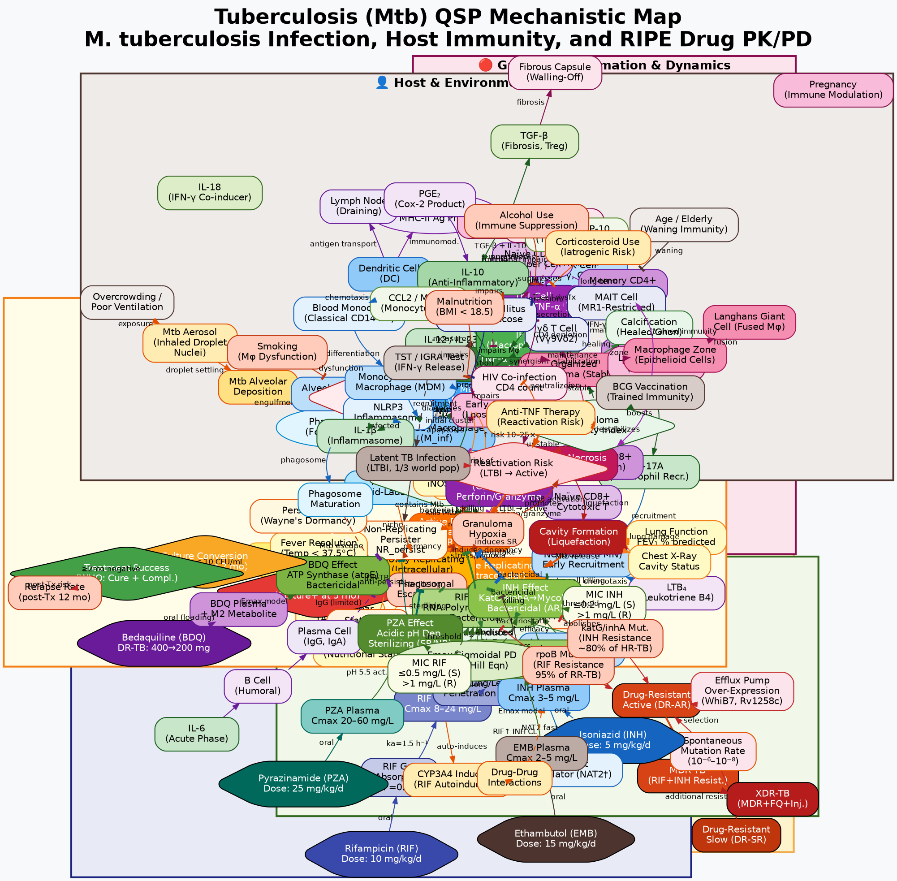</a> | *Mycobacterium tuberculosis* 흡입 → 폐포 대식세포 탐식·포식소체 탈출 → AR(활발 증식)·SR(서행 증식)·NR(비증식 지속체) 3중 세균 아집단 → Th1-IFN-γ 축 유도·육아종 형성 → RIPE 4제 요법(Rifampicin rpoB / Isoniazid InhA / Pyrazinamide 산성 pH / Ethambutol) ± Bedaquiline(MDR-TB ATP합성효소) 각 아집단별 Emax 살균·멸균 활성. HIV 공감염(phi_Th1↓)·당뇨(phi_Mact↓) 시나리오 포함.<br>[🗺️ 지도](tuberculosis/tb_qsp_model.svg) · [⚙️ mrgsolve](tuberculosis/tb_mrgsolve_model.R) · [📚 문헌](tuberculosis/tb_references.md) · [📄 README](tuberculosis/README.md) |
| 193 | 종양학·내분비 | [**갑상선암**<br><sub>Thyroid Cancer · ThyCa</sub>](thyroid-cancer/) | <a href="thyroid-cancer/thyca_qsp_model.svg"></a> | BRAF V600E·RET 발암 드라이버 → MAPK(RAS-RAF-MEK-ERK)·PI3K/AKT/mTOR 이중 경로 활성화 → 분화암(DTC: 유두·여포)·수질암(MTC)·미분화암(ATC) 아형별 진행. 렌바티닙(SELECT, PFS HR 0.21)·소라페닙(DECISION, PFS HR 0.59)·셀퍼카티닙(LIBRETTO-001, ORR 69%) TKI 치료 + 방사성요오드(¹³¹I) 재분화 + TSH 억제 요법 포함. 18구획 ODE, 7 시나리오, 130+ 노드 기계론적 지도.<br>[🗺️ 지도](thyroid-cancer/thyca_qsp_model.svg) · [⚙️ mrgsolve](thyroid-cancer/thyca_mrgsolve_model.R) · [📚 문헌](thyroid-cancer/thyca_references.md) · [📄 README](thyroid-cancer/README.md) |
| 194 | 희귀·혈액 | [**비정형 용혈요독 증후군 (aHUS)**<br><sub>Atypical Hemolytic Uremic Syndrome · aHUS</sub>](atypical-hemolytic-uremic-syndrome/) | <a href="atypical-hemolytic-uremic-syndrome/ahus_qsp_model.svg">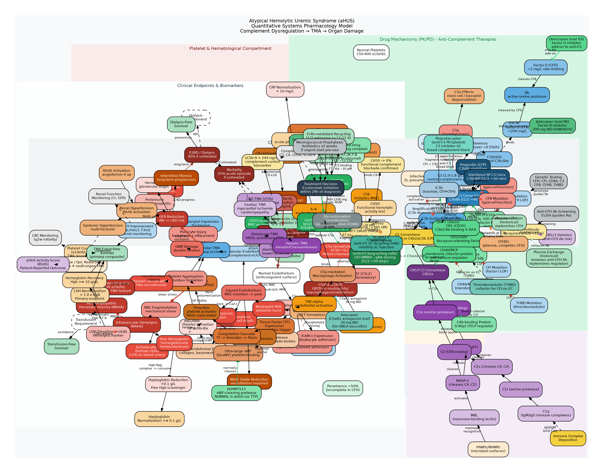</a> | 보체 대체경로(AP) 조절 이상(CFH/CFI/CD46 돌연변이·항CFH 자가항체) → C3b 축적·C5 전환효소 형성 → MAC(C5b-9) 생성 → 혈관내피 손상 → 혈전성 미세혈관병증(TMA): 혈소판감소증·MAHA·급성신손상. 에쿨리주맙(항C5, LEAP 시험)·라뷸리주맙(q8w)·입타코판(경구 Factor B 억제제)·다니코판(Factor D) QSP/TMDD 모델. 18 ODE 구획, 5 치료 시나리오, 55개 문헌.<br>[🗺️ 지도](atypical-hemolytic-uremic-syndrome/ahus_qsp_model.svg) · [⚙️ mrgsolve](atypical-hemolytic-uremic-syndrome/ahus_mrgsolve_model.R) · [📚 문헌](atypical-hemolytic-uremic-syndrome/ahus_references.md) · [📄 README](atypical-hemolytic-uremic-syndrome/README.md) |
| 195 | 안과 | [**원발개방각녹내장 (POAG)**<br><sub>Primary Open-Angle Glaucoma · POAG</sub>](glaucoma/) | <a href="glaucoma/poag_qsp_model.svg">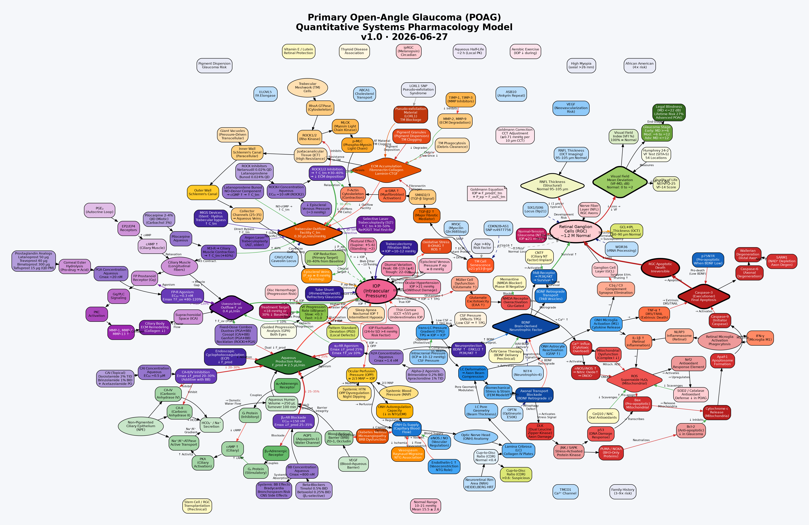</a> | 방수 유출 장애(TM ECM 축적·RhoA-ROCK 과활성·TGF-β2 섬유화) → IOP 상승(Goldmann 방정식) → 시신경 유두(ONH) 층판사골 변형 → 축삭수송 차단 → BDNF 역행수송↓ → RGC 사멸(Bax/Bcl-2→Caspase-3) → RNFL 감소 → 시야(VF-MD) 진행. 5종 약물(PGA·BB·CAI·A2A·ROCK-I)·SLT·MIGS·섬유주절제술 통합. 15 ODE 구획, 8 치료 시나리오, 66개 문헌, 7탭 Shiny 앱.<br>[🗺️ 지도](glaucoma/poag_qsp_model.svg) · [⚙️ mrgsolve](glaucoma/poag_mrgsolve_model.R) · [📚 문헌](glaucoma/poag_references.md) · [📄 README](glaucoma/README.md) |
| 196 | 신경계·뇌혈관 | [**혈관성 치매 (VaD)**<br><sub>Vascular Dementia · VaD</sub>](vascular-dementia/) | <a href="vascular-dementia/vad_qsp_model.svg"></a> | 고혈압·당뇨·이상지질혈증 → 소혈관 질환(SVD) → 백질변성(WMH)·열공경색·피질 미세경색 → 혈뇨장벽(BBB) 손상(MMP9↑·TJ단백↓) → DAMPs 유입 → 미세아교세포 M1 활성화(NF-κB→IL-1β/TNF-α/IL-6) → 산화 스트레스(ROS·ONOO⁻) → 뉴런 사멸(caspase-3) + ACh 톤↓(ChAT↓·AChE↑) + 시냅스 소실 → 인지 저하(MMSE↓·실행 기능↓·처리 속도↓). 강압제(PROGRESS, SCOPE, SPRINT-MIND)·스타틴·항혈소판·AChEI(도네페질)·메만틴·실로스타졸(SIGNAL2) 6가지 치료 시나리오 통합. 114노드 9클러스터 기계론적 지도, 18 ODE 구획, 70개 문헌, 7탭 Shiny 앱.<br>[🗺️ 지도](vascular-dementia/vad_qsp_model.svg) · [⚙️ mrgsolve](vascular-dementia/vad_mrgsolve_model.R) · [📚 문헌](vascular-dementia/vad_references.md) · [📄 README](vascular-dementia/README.md) |
| 197 | 종양학·비뇨기 | [**신세포암 (ccRCC)**<br><sub>Renal Cell Carcinoma · RCC</sub>](renal-cell-carcinoma/) | <a href="renal-cell-carcinoma/rcc_qsp_model.svg"></a> | VHL 돌연변이(60–90%) → pVHL 소실 → HIF-1α/2α 축적 → VEGF↑·CA9↑·GLUT1↑ → 혈관신생 + mTOR 양성피드백 + MDSCs·Treg·PD-L1 면역 회피. sunitinib·nivolumab+ipilimumab(CheckMate 214)·pembrolizumab+axitinib(KEYNOTE-426)·cabozantinib+nivolumab(CheckMate 9ER)·cabozantinib(METEOR)·everolimus(RECORD-1)·belzutifan(LITESPARK-005) 7개 시나리오. 125+ 노드, 18 ODE 구획, 60개 문헌, 7탭 Shiny.<br>[🗺️ 지도](renal-cell-carcinoma/rcc_qsp_model.svg) · [⚙️ mrgsolve](renal-cell-carcinoma/rcc_mrgsolve_model.R) · [📚 문헌](renal-cell-carcinoma/rcc_references.md) · [📄 README](renal-cell-carcinoma/README.md) |
| 198 | 혈액종양학 | [**발덴스트롬 거대글로불린혈증 (WM)**<br><sub>Waldenström's Macroglobulinemia · WM</sub>](waldenstrom-macroglobulinemia/) | <a href="waldenstrom-macroglobulinemia/wm_qsp_model.svg"></a> | MYD88 L265P(~95%) 구성적 NF-κB 활성화 + CXCR4 WHIM 돌연변이(~35%) BM 체류 강화 → 림프형질세포 증식 → IgM 단클론 파라단백 → 과점도 증후군·한랭글로불린·항MAG 신경병증. BTK 억제제(이브루티닙/자누브루티닙)·리툭시맙·벤다무스틴·보르테조밉·베네토클락스 7개 시나리오. 12 클러스터 120+ 노드, 20 ODE 구획, 62개 문헌, 7탭 Shiny.<br>[🗺️ 지도](waldenstrom-macroglobulinemia/wm_qsp_model.svg) · [⚙️ mrgsolve](waldenstrom-macroglobulinemia/wm_mrgsolve_model.R) · [📚 문헌](waldenstrom-macroglobulinemia/wm_references.md) · [📄 README](waldenstrom-macroglobulinemia/README.md) |
| 199 | 종양학·비뇨기 | [**방광암 (요로상피암, BLCA)**<br><sub>Bladder Cancer · Urothelial Carcinoma · BLCA</sub>](bladder-cancer/) | <a href="bladder-cancer/blca_qsp.svg"></a> | FGFR3 돌연변이(~60% NMIBC) → RAS/MAPK 증식; TP53·RB1·CDKN2A 변이(고등급 MIBC); PD-L1 IFN-γ 유도 → 면역 회피; TGF-β/Treg/MDSC 억제. BCG(SWOG S8507 CRR 55–70%)·GC 화학요법(ORR 49%, mOS 13.8mo)·펨브롤리주맙(KEYNOTE-045 ORR 21.1%)·아테졸리주맙(IMvigor210/211)·에르다피티닙(BLC2001 ORR 40.4%)·엔포르투맙 베도틴(EV-301 OS HR 0.70)·사시투주맙 7개 시나리오. 11 클러스터 112 노드, 20 ODE 구획, 41개 문헌, 7탭 Shiny.<br>[🗺️ 지도](bladder-cancer/blca_qsp.svg) · [⚙️ mrgsolve](bladder-cancer/blca_mrgsolve_model.R) · [📚 문헌](bladder-cancer/blca_references.md) · [📄 README](bladder-cancer/README.md) |
| 200 | 자가면역 신경근육 | [**람베르트-이튼 근무력증후군 (LEMS)**<br><sub>Lambert-Eaton Myasthenic Syndrome · LEMS</sub>](lambert-eaton-syndrome/) | <a href="lambert-eaton-syndrome/lems_qsp_model.svg"></a> | 항P/Q형 VGCC 자가항체 → 전시냅스 Ca²⁺ 유입 감소 → ACh 방출 저하 → EPP 감소·안전계수 저하 → CMAP 감소·근력 약화. 50–60% SCLC 동반 부종양. 아미파리딘(3,4-DAP K⁺차단 Emax, EC50 120 ng/mL)·프레드니솔론·혈장교환·IVIG·항암화학요법 6개 시나리오. 12 클러스터 100+ 노드, 15 ODE 구획, 56개 문헌, 7탭 Shiny.<br>[🗺️ 지도](lambert-eaton-syndrome/lems_qsp_model.svg) · [⚙️ mrgsolve](lambert-eaton-syndrome/lems_mrgsolve_model.R) · [📚 문헌](lambert-eaton-syndrome/lems_references.md) · [📄 README](lambert-eaton-syndrome/README.md) |
| 201 | 신장·비뇨 | [**급성 신손상 (AKI)**<br><sub>Acute Kidney Injury · AKI</sub>](acute-kidney-injury/) | <a href="acute-kidney-injury/aki_qsp_model.svg">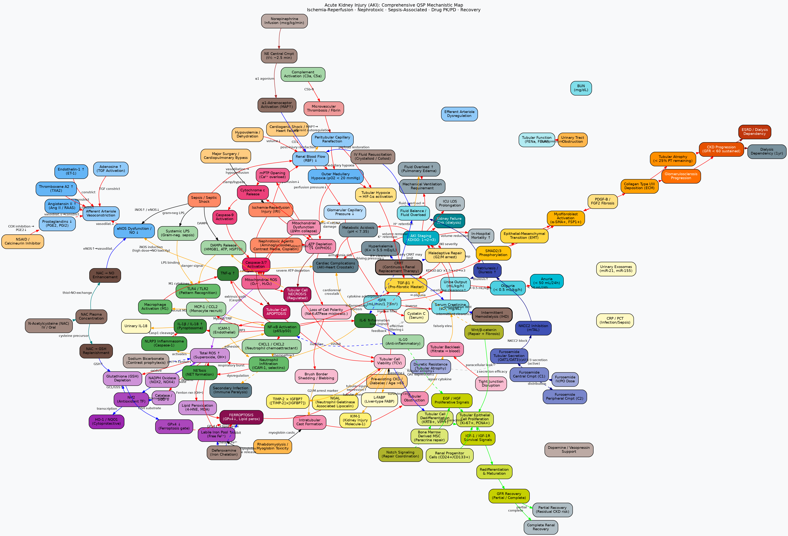</a> | 허혈-재관류(IRI)·신독성(NTX)·패혈증 연관(SA-AKI) 세 아형의 통합 QSP 모델. ATP 고갈 → 미토콘드리아 기능부전 → 아폽토시스/괴사/페롭토시스·세뇨관 세포 활력(TCV) 감소 → GFR↓·NGAL/KIM-1 상승. TLR4→NF-κB→IL-6/TNF-α 염증·산화스트레스(ROS/GSH)·TGF-β1→섬유화(AKI-to-CKD) 경로 포함. Furosemide(OAT1/3·NKCC2)·Norepinephrine·NAC·CRRT PK/PD. 12 클러스터 100+ 노드, 20 ODE 구획, 7 치료 시나리오, 55개 문헌, 6탭 Shiny.<br>[🗺️ 지도](acute-kidney-injury/aki_qsp_model.svg) · [⚙️ mrgsolve](acute-kidney-injury/aki_mrgsolve_model.R) · [📚 문헌](acute-kidney-injury/aki_references.md) · [📄 README](acute-kidney-injury/README.md) |
| 202 | 신경정신 | [**강박장애 (OCD)**<br><sub>Obsessive-Compulsive Disorder · OCD</sub>](obsessive-compulsive-disorder/) | <a href="obsessive-compulsive-disorder/ocd_qsp_model.svg"></a> | **CSTC 회로 과활성화** — OFC 과활성(강박 사고) → 미상핵 과대사(강박 행동) → 직접 경로(D1/Go) 우세·간접 경로(D2/No-Go) 약화 → 시상 탈억제 → OFC 루프 재구동. SERT ≥80% 점유 필요(우울증 60% 대비). 5-HT1A 자가수용체 탈감작이 2–4주 지연 반응 설명. Sertraline 200 mg(2구획+BBB)·Clomipramine 250 mg(DCMI 활성 대사체)·Risperidone D2 증강·ERP/CBT 기전 통합. 13 클러스터 130+ 노드, 23 ODE 구획, 6 치료 시나리오, 가상 환자 100명 Monte Carlo, 50개 문헌, 8탭 Shiny.<br>[🗺️ 지도](obsessive-compulsive-disorder/ocd_qsp_model.svg) · [⚙️ mrgsolve](obsessive-compulsive-disorder/ocd_mrgsolve_model.R) · [📚 문헌](obsessive-compulsive-disorder/ocd_references.md) · [📄 README](obsessive-compulsive-disorder/README.md) |
| 203 | 알레르기/면역 | [**알레르기 비염 (AR)**<br><sub>Allergic Rhinitis · AR · Type I Hypersensitivity</sub>](allergic-rhinitis/) | <a href="allergic-rhinitis/ar_qsp_model.svg"></a> | IgE-비만세포 축(FcεRI 가교결합 → 탈과립) + Th2 사이토카인 캐스케이드(IL-4/5/13) + 호산구 동태의 통합 QSP 모델. 히스타민·PGD2·CysLT(LTC4/D4/E4)·PAF 조기 반응 및 후기 호산구 침윤·TSLP/IL-33 상피 알라민 경로 포함. 세티리진(H1RO ≥80%, Yanai 1995)·플루티카손 FP(GR→IL-4/5/13 억제, TNSS −38%)·몬텔루카스트(CysLT1R 차단, TNSS −22%)·오말리주맙(자유 IgE >95% 감소, Fahy 1997) 7개 시나리오. 12 클러스터 100+ 노드, 25 ODE 구획, 60개 문헌, 6탭 Shiny.<br>[🗺️ 지도](allergic-rhinitis/ar_qsp_model.svg) · [⚙️ mrgsolve](allergic-rhinitis/ar_mrgsolve_model.R) · [📚 문헌](allergic-rhinitis/ar_references.md) · [📄 README](allergic-rhinitis/README.md) |
| 205 | 심혈관/자가염증 | [**반복 심낭염 (RP)**<br><sub>Recurrent Pericarditis · RP · NLRP3/IL-1β Axis</sub>](recurrent-pericarditis/) | <a href="recurrent-pericarditis/rp_qsp_model.svg"></a> | NLRP3 인플라마솜(Signal 1 TLR→NF-κB + Signal 2 ATP/결정/K⁺efflux) → Caspase-1 → IL-1β/IL-18 성숙·분비 → IL-1R1 → NF-κB 양성 피드백 루프 → CXCL8 → 심낭 중성구 침윤 → PGE2/LTC4 매개 삼출액·통증·발열 → TGF-β1 → 섬유화 → 수축성 심낭염의 완전 통합 QSP 모델. 콜히친(β-tubulin 결합 → NLRP3 ASC 억제, IC50=0.5 ng/mL), Ibuprofen(COX-2 억제 → PGE2↓), Prednisone(GRα transrepression → NF-κB↓), Anakinra(IL-1R1 경쟁적 차단, IC50=0.1 nM), Rilonacept(IL-1α/β 이중 포획, KD<1 pM) PK/PD 포함. 무치료·NSAID·콜히친·콜히친+NSAID·프레드니솔론·아나킨라·리로나셉트 7개 시나리오. COPE(2005, 재발률 45→24%)·ICAP(2013, 32.3→16.7%)·AIRTRIP(2016, 90.9→18.2%)·RHAPSODY(2021, HR 0.04) 보정. 14 클러스터 162+ 노드, 24 ODE 구획, 57개 문헌, 7탭 Shiny.<br>[🗺️ 지도](recurrent-pericarditis/rp_qsp_model.svg) · [⚙️ mrgsolve](recurrent-pericarditis/rp_mrgsolve_model.R) · [📚 문헌](recurrent-pericarditis/rp_references.md) · [📄 README](recurrent-pericarditis/README.md) |
| 204 | 호흡기 | [**과민성 폐렴 (HP)**<br><sub>Hypersensitivity Pneumonitis · HP · Extrinsic Allergic Alveolitis</sub>](hypersensitivity-pneumonitis/) | <a href="hypersensitivity-pneumonitis/hp_qsp_model.svg">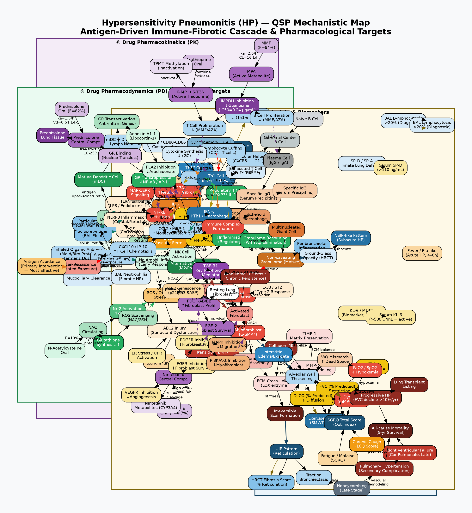</a> | 유기 항원(조류 단백·열성 세균·곰팡이) 반복 흡입에 의한 Th1 림프구성 폐포염 → 비건락성 육아종 형성 → TGF-β1/PDGF 매개 근섬유모세포 활성화 → 폐 섬유화(UIP/NSIP 유사 패턴) 통합 QSP 모델. TLR2/4/9·NLRP3·M1/M2 대식세포 분극·Th1/Th17/Treg 동태·면역복합체(IgG 침강소)·육아종 형성-분해·섬유화 폭포(AEC2 손상·EMT·콜라겐 침착)·ROS·FVC/DLCO 폐기능 저하 포함. Prednisolone(GR Transrepression, EC50=150 ng/mL)·MMF(IMPDH 억제, IC50=0.24 μg/mL)·Nintedanib(PDGFR/FGFR/VEGFR 억제, EC50=200 ng/mL) PK/PD. 항원회피·PDN·MMF·Nintedanib·병합 7개 시나리오. 10 클러스터 100+ 노드, 22 ODE 구획, 42개 문헌, 8탭 Shiny.<br>[🗺️ 지도](hypersensitivity-pneumonitis/hp_qsp_model.svg) · [⚙️ mrgsolve](hypersensitivity-pneumonitis/hp_mrgsolve_model.R) · [📚 문헌](hypersensitivity-pneumonitis/hp_references.md) · [📄 README](hypersensitivity-pneumonitis/README.md) |
| 207 | 혈관/결합조직 | [**레이노 현상 (RP)**<br><sub>Raynaud's Phenomenon · RP · α2-AR / ET-1 / NO / RhoA-ROCK</sub>](raynaud-phenomenon/) | <a href="raynaud-phenomenon/raynaud_qsp_model.svg">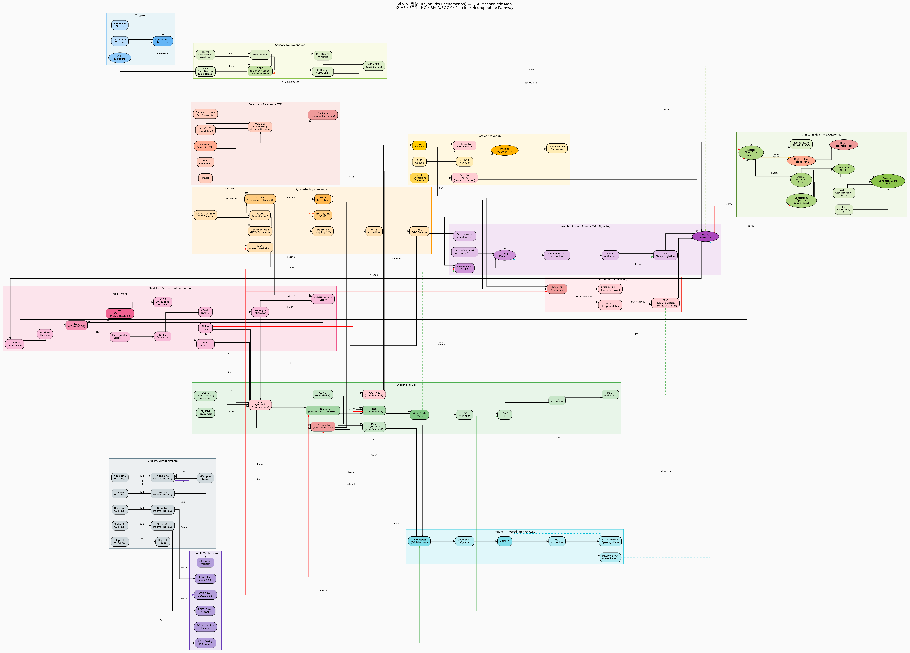</a> | 한랭·스트레스 자극 → 교감신경 NE 방출 → α2C-AR(한랭 상향조절) 과민 활성 → Gq/PLC/IP3→SR Ca²⁺ 방출 + RhoGEF→RhoA-GTP→ROCK1/2→MYPT1 인산화→MLCP 억제→MLC 인산화(Ca²⁺ 비의존성) → 지속적 VSMC 수축 → 디지털 혈류 감소·혈관경련 발작의 완전 통합 QSP 모델. 내피세포 eNOS↓/NO↓/sGC/cGMP/PKG/MLCP 경로·ET-1(ETA→Gα12/13+Gq, ETB→NO/PGI2)·PGI2/IP-R/Gs/cAMP/PKA/BKCa 이완 경로·혈소판(TXA2·5-HT·ADP→GP IIb/IIIa)·CGRP/SP/NPY 신경펩타이드 균형·NOX2/XO→ROS→NF-κB→ET-1 양성 피드백·이차성 전신경화증(SSc) 혈관 리모델링·모세혈관 소실 포함. 니페디핀(L-VGCC 차단, EC50=15 ng/mL)·실데나필(PDE5 억제→cGMP↑, EC50=50 ng/mL)·보센탄(ETA/ETB 차단→ET-1↓, EC50=600 ng/mL)·일로프로스트(IP-R 작용제→cAMP↑, EC50=0.5 ng/mL)·프라조신(α1-차단, EC50=2 ng/mL) 5종 PK/PD 포함. Thompson 2005(CCB 메타분석)·Fries 2005(실데나필 RCT)·Matucci-Cerinic 2011(보센탄 RAPIDS-2)·Belch 1995(일로프로스트 RCT) 보정. 13 클러스터 100+ 노드, 18 ODE 구획, 9 치료 시나리오, 62개 문헌, 7탭 Shiny.<br>[🗺️ 지도](raynaud-phenomenon/raynaud_qsp_model.svg) · [⚙️ mrgsolve](raynaud-phenomenon/raynaud_mrgsolve_model.R) · [📚 문헌](raynaud-phenomenon/raynaud_references.md) · [📄 README](raynaud-phenomenon/README.md) |
| 206 | 신경계/수면장애 | [**나르콜렙시 1형 (NT1)**<br><sub>Narcolepsy Type 1 · NT1 · Orexin/Hypocretin Deficiency</sub>](narcolepsy/) | <a href="narcolepsy/narc_qsp_model.svg"></a> | HLA-DQB1\*06:02 감수성 + H1N1/Pandemrix 분자 모방 → CD4+/CD8+ T세포·NK세포가 시상하부 외측 오렉신 신경세포(~70,000개 → 85–95% 소실) 자가면역 파괴 → CSF 히포크레틴-1 <110 pg/mL → OX1R/OX2R 신호 소실 → LC(NE)·TMN(히스타민)·VTA(DA)·DRN(5-HT) 각성 모노아민계 불안정 → VLPO-각성계 플립-플롭 스위치 상태 전환 빈번 → EDS(과도한 주간 졸음, ESS↑)/카탈렉시(편도체 감정 자극 → REM 근긴장소실 불수의 활성)/입면 환각/수면 마비 4징 완전 통합 QSP 모델. 소디움 옥시베이트(GABA-B/GHB-R→서파수면↑, 카탈렉시 -69–75%)·모다피닐(DAT/NET 억제, ESS -4.3)·피톨리산트(H3R 역작용제→히스타민↑, HARMONY I ESS -5.8)·솔리암페톨(DAT/NET, TONES 3 ESS -7.7)·벤라팍신(SERT/NET→REM 억제 항카탈렉시)·TAK-994(OX2R 직접 작용제, 실험) 6종 PK/PD. 12 클러스터 431 노드, 23 ODE 구획, 7 치료 시나리오, 47개 문헌, 8탭 Shiny.<br>[🗺️ 지도](narcolepsy/narc_qsp_model.svg) · [⚙️ mrgsolve](narcolepsy/narc_mrgsolve_model.R) · [📚 문헌](narcolepsy/narc_references.md) · [📄 README](narcolepsy/README.md) |
| 208 | 신장·대사 | [**CKD-미네랄골질환 (CKD-MBD)**<br><sub>CKD-Mineral Bone Disorder · FGF23·Klotho·PTH·Vitamin D</sub>](ckd-mineral-bone-disorder/) | <a href="ckd-mineral-bone-disorder/ckdmbd_qsp_model.svg">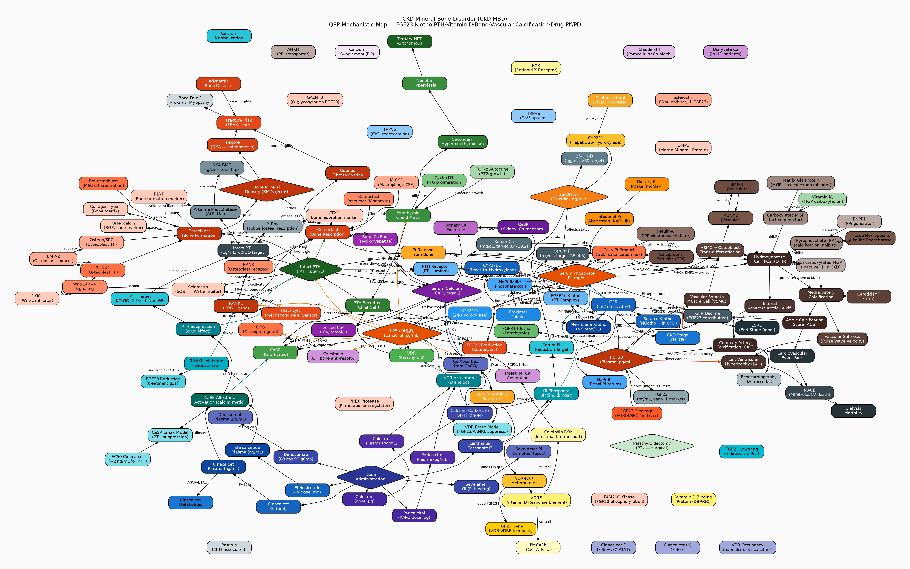</a> | GFR 저하 → FGF23↑↑(CKD G2부터, Gutierrez 2008 NEJM) + Klotho↓ → CYP27B1 억제 → 1,25-(OH)₂D₃ 결핍 → CaSR 저감수성 → 이차성 부갑상선 기능항진증(iPTH↑) + 고인산혈증·저칼슘혈증 → RANKL/OPG 불균형·스클레로스틴↑ → 골이영양증(골화석증·무동성골·혼합형) + VSMC 골아세포 분화·MGP 탈카르복실화·Fetuin-A 감소 → 혈관 석회화 → CV 사건 증가. Sevelamer(Pi 결합, Sev_Emax 65%)·CaCO₃·Cinacalcet(CaSR 활성화, IC50 15 ng/mL)·Paricalcitol(VDR 작용, EC50 0.2 ng/mL)·Etelcalcetide(IV CaSR, EC50 50 ng/mL)·Denosumab(RANKL 억제, Imax 95%) 6종 PK/PD. KDIGO 2017 iPTH 150–600·Pi<5.5·Ca 8.4–10.2 목표. 10 클러스터 115+ 노드, 17 ODE 구획, 7 치료 시나리오, 42개 문헌, 7탭 Shiny.<br>[🗺️ 지도](ckd-mineral-bone-disorder/ckdmbd_qsp_model.svg) · [⚙️ mrgsolve](ckd-mineral-bone-disorder/ckdmbd_mrgsolve_model.R) · [📚 문헌](ckd-mineral-bone-disorder/ckdmbd_references.md) · [📄 README](ckd-mineral-bone-disorder/README.md) |
| 209 | 혈액종양/아밀로이드증 | [**AL 아밀로이드증 (AL Amyloidosis)**<br><sub>Immunoglobulin Light Chain Amyloidosis · AL · Daratumumab · CyBorD · ANDROMEDA</sub>](al-amyloidosis/) | <a href="al-amyloidosis/al_qsp_model.svg"></a> | 형질세포 이상증식(MGUS→SMM→클론성 형질세포) → CD38 고발현 → 단클론 자유경쇄(FLC) 과분비 → 아밀로이드 원섬유 핵화·신장(β-sheet 중합체)·파종 자가촉매 증폭 → 심장(LV 비후, 이완기 기능부전, NT-proBNP↑, hs-TnT↑)·신장(사구체 아밀로이드→신증후군, eGFR↓)·간(간비대, ALP↑)·자율신경 아밀로이드 침착 통합 QSP 모델. 올리고머 직접 심장독성(Oligomer-cardiotoxicity) 경로 포함. Daratumumab(TMDD 2구획 PK, kon=0.005 nM⁻¹day⁻¹, CD38 수용체 동태, ADCC/CDC/ADCP, NK세포 고갈-회복 주기)·Bortezomib(1구획+20S 프로테아좀 가역 결합, BTZ_PROT EC50=6.5 nM)·Cyclophosphamide(4-OH-CY 활성 대사체, CYP2B6)·Dexamethasone(GR 점유→PC 아폽토시스)·Melphalan(DNA 가교 형성) 5종 PK/PD 포함. ANDROMEDA(NEJM 2021, Dara+CyBorD 53% CR vs CyBorD 18%)·MDex(Blood 2004, ~33% CR)·CyBorD(Blood 2012, ~29% CR) 보정. Mayo 2012 4단계 병기(hs-TnT≥0.025 + NT-proBNP≥1800 + dFLC≥18 mg/dL + eGFR<50 위험 인자) 동태적 추적. 무치료·Dara 단독·CyBorD·Dara-CyBorD·VCD·MDex·CYP2C19 PM 7개 시나리오. 14 클러스터 100+ 노드, 20 ODE 구획, 50개 문헌, 8탭 Shiny.<br>[🗺️ 지도](al-amyloidosis/al_qsp_model.svg) · [⚙️ mrgsolve](al-amyloidosis/al_mrgsolve_model.R) · [📚 문헌](al-amyloidosis/al_references.md) · [📄 README](al-amyloidosis/README.md) |
| 210 | 심혈관/판막질환 | [**대동맥판막 협착증 (AS/CAVD)**<br><sub>Calcific Aortic Valve Stenosis · CAVD · BMP/RANKL/Lp(a)/LVEF/TAVR</sub>](aortic-stenosis/) | <a href="aortic-stenosis/as_qsp_model.svg">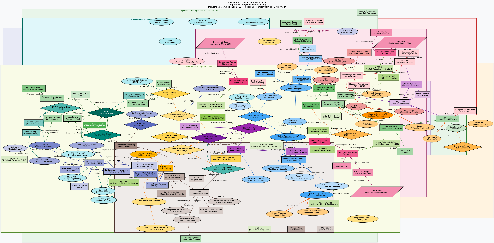</a> | 판막 내피세포 손상(shear stress·oxLDL·NOTCH1 소실) → BMP-2/4·TGF-β1 활성화 → 판막 간질세포(VIC) 골아세포성 전환(Runx2·Osterix·ALP↑) → RANKL/OPG 비율 증가 → 미세석회화(hydroxyapatite) → 거대석회화 → 대동맥판막 면적(AVA) 감소 → 경판막 압력차(ΔP) 증가 → LV 압력 과부하 → 동심성 LV 비후(LVMI↑)·간질 섬유화(콜라겐 분획↑) → LVEDP 상승·LVEF 저하 → NT-proBNP·hs-TnT 상승 → 증상 3주징(협심증·실신·호흡곤란) → NYHA 악화 → MACE의 완전 통합 QSP 모델. Lp(a)/oxPL(Thanassoulis NEJM 2013) 독립 위험 인자·MGP 카르복실화 억제 경로 포함. Rosuvastatin(2구획, STATIN_V1=134L, SEAS 스타틴 비효과 반영 Emax_calc=5%)·Evolocumab(SC 1구획, PCSK9i ka=0.012 hr⁻¹, LDL+Lp(a) ↓)·Denosumab(RANKL 차단, 가설 Emax_calc=30%)·Vitamin K2 MK-7(MGP 카르복실화 회복, EC50_MGP=0.3 μg/L)·Ramipril(ACEi, AngII↓→섬유화↓) 5종 PK/PD 포함. TAVR/SAVR 후 LV 역 리모델링(AVA 회복→afterload↓→LVEF↑) 시뮬레이션. 무치료·스타틴·스타틴+PCSK9i·스타틴+데노수맙·스타틴+VK2·최대 약물요법 6개 시나리오. SEAS(2008, 스타틴 비효과)·PARTNER(2011, TAVR)·PARTNER 3(2019, 저위험 TAVR)·Marechaux(2010, Ca score 자연 경과) 보정. 12 클러스터 110+ 노드, 20 ODE 구획, 50개 문헌, 6탭 Shiny.<br>[🗺️ 지도](aortic-stenosis/as_qsp_model.svg) · [⚙️ mrgsolve](aortic-stenosis/as_mrgsolve_model.R) · [📚 문헌](aortic-stenosis/as_references.md) · [📄 README](aortic-stenosis/README.md) |
| 211 | 자가면역/신경계 | [**ME/CFS (근통성 뇌척수염/만성피로증후군)**<br><sub>Myalgic Encephalomyelitis/Chronic Fatigue Syndrome · ME/CFS · LDN · PDH/PDK1 · Neuroinflammation · POTS</sub>](me-cfs/) | <a href="me-cfs/mecfs_qsp_model.svg"></a> | 바이러스 지속감염(EBV·HHV-6·SARS-CoV-2) → TLR3/4/7·cGAS-STING 활성화 → IFN-γ↑(Th1/NK) → PDK1↑(피루브산탈수소효소인산화효소1) → PDH 인산화·억제 → 피루브산→젖산 전환(Warburg-유사 대사전환, Fluge 2017 JCI Insight·Naviaux 2016 PNAS) → NADH↓→복합체I↓→ATP 결핍 → 피로·PEM(노력후불쾌감) 완전 통합 QSP 모델. NK세포 세포독성 감소(30–50%)·CD8+ T세포 소진(PD-1/LAG-3/TIM-3↑)·β2AR+M1R 자가항체(~60%) → POTS·자율신경기능장애·HRV 감소. NLRP3 인플라마좀·비만세포활성화증후군(MCAS·트립타제↑·히스타민) → BBB 투과성 증가 → 소신경교세포 활성화·TSPO PET 신호↑(Nakatomi 2014 JNM) → 키누레닌 경로(IDO1↑→퀴놀린산↑) → 해마 손상·인지기능 저하("뇌안개"). HPA축 저코티솔혈증·GR 저항·CRH↓·일주기리듬 교란. LDN 4.5mg/d(TLR4 억제·소신경교세포 완화, Younger 2009)·피리도스티그민 30mg TID(AChE 억제→ANS 회복→POTS↓)·리툭시맙 1g IV×2(CD20+ B세포 고갈→자가항체↓, Fluge 2009/2011)·NAD+ 전구체 NMN/NR 500mg/d(시르투인→PGC-1α→미토콘드리아 복구)·병합요법 6개 시나리오. 12 클러스터 220+ 노드, 25 ODE 구획, 62개 문헌, 8탭 Shiny.<br>[🗺️ 지도](me-cfs/mecfs_qsp_model.svg) · [⚙️ mrgsolve](me-cfs/mecfs_mrgsolve_model.R) · [📚 문헌](me-cfs/mecfs_references.md) · [📄 README](me-cfs/README.md) |
| 212 | 희귀 폐질환/종양억제유전자 | [**림프관평활근종증 (LAM)**<br><sub>Lymphangioleiomyomatosis · LAM · TSC1/2 · mTOR · VEGF-D · Sirolimus/Everolimus</sub>](lymphangioleiomyomatosis/) | <a href="lymphangioleiomyomatosis/lam_qsp_model.svg"></a> | TSC1/TSC2 기능 소실 변이(배선 또는 체세포 이중타격) → Rheb-GTP↑(정상 2.5배) → mTORC1 과활성(LAM 세포 내 4배) → S6K1-pT389↑·4E-BP1-P↑ → LAM 세포 증식·생존·침윤↑. LAM 세포(HMB-45+·α-SMA+·ERα+·PR+)는 MMP-2/9/13 분비 → ECM 분해·탄력섬유 파괴 → 폐포벽 파괴 → 낭종 형성 → FEV1 연간 ~120mL 감소. VEGF-D(진단: >800pg/mL) → VEGFR-3 → 림프관신생 → 유미흉·후복막 림프관종. 에스트로겐(E2) → ERα·PI3K/Akt 비게놈 경로 → mTORC1 추가 상향(폐경 후 진행 속도 감소 설명). 신장 혈관근지방종(AML) 동반 50-60%. MILES(McCormack NEJM 2011): 시롤리무스 2mg/d → FEV1 안정화(+153mL vs −12mL/12개월), VEGF-D 30% 감소, 중단 후 재감소. EXIST-2(Kingswood Lancet 2016): 에버롤리무스 → AML >50% 감소. 시롤리무스(2구획 PK, F~15%, t½~62h)·에버롤리무스(2구획 PK, F~30%, t½~28h) PK 모델 + FKBP12→mTORC1 억제 PD(Imax=0.90, IC50=2.5ng/mL). mTORC2 부분적 탈출(Sarbassov 2006), S6K1→IRS-1 음성 피드백 내성 기전 포함. 무치료·시롤리무스 2mg/d·에버롤리무스 10mg/d·시롤리무스 12개월 후 중단·에버롤리무스+GnRH 5개 시나리오. 14 클러스터 120+ 노드, 18 ODE 구획, 50개 문헌, 6탭 Shiny.<br>[🗺️ 지도](lymphangioleiomyomatosis/lam_qsp_model.svg) · [⚙️ mrgsolve](lymphangioleiomyomatosis/lam_mrgsolve_model.R) · [📚 문헌](lymphangioleiomyomatosis/lam_references.md) · [📄 README](lymphangioleiomyomatosis/README.md) |
| 213 | 심혈관/중환자 | [**심인성 쇼크**<br><sub>Cardiogenic Shock · CS · SCAI A→E · NE · Dobutamine · Milrinone · Levosimendan · IABP · Impella · VA-ECMO</sub>](cardiogenic-shock/) | <a href="cardiogenic-shock/cs_qsp_model.svg">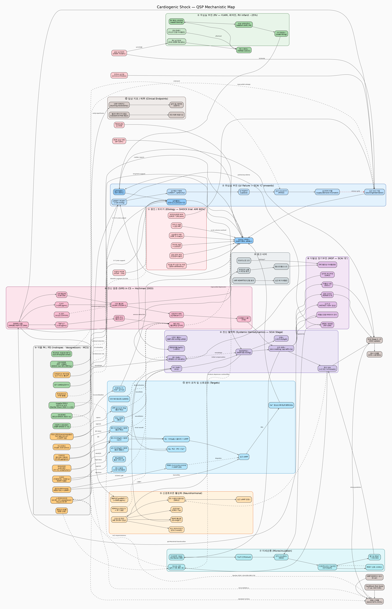</a> | 심장 펌프 기능의 1차 부전으로 인한 조직 저관류 증후군(SHOCK trial: 80% AMI 기원). LV 수축력 저하(EF<30%·dP/dt↓)·SV<35mL·CI<2.2 → MAP<65 → SCAI A→E 5단계 진행. 신경호르몬 폭주(NE 10-20×, RAAS, β1 GRK2 하향조절, cAMP 반응↓), 미세순환 부전(De Backer DBI), DAMP-매개 SIRS·iNOS-NO 과잉으로 후기 vasoplegia(혼합형 30-40%). 다발성 장기부전(AKI KDIGO 2-3·쇼크 간·ARDS·DIC). 30일 사망 SCAI E 67% / B 5%. **노르에피네프린**(α1·β1, EC50≈0.04µg/min, 1차)·**에피네프린**(α·β·β2)·**도부타민**(β1>β2, cAMP-PKA-SERCA2a)·**밀리논**(PDE3 억제·DOREMI 비열등)·**레보시멘단**(TnC Ca-감수성·K-ATP, +OR-1896 활성대사체)·**도파민**(SOAP-II 음성)·**바소프레신**(V1aR, vasoplegia 보조)·**오메캄티브**(미오신 활성제) PK/PD. MCS: **IABP**(IABP-SHOCK II ns)·**Impella CP**(DanGer Shock 2024: 30일 사망 26→18%, HR 0.74)·**VA-ECMO**(ECLS-SHOCK ns)·**LVAD**. SHOCK trial(6yr RRR ~30%) 재관류·CULPRIT-SHOCK culprit-only PCI 보정. 26 ODE 구획(약물 PK 8 + 혈역학·생리 12 + 매개체 6), 7 치료 시나리오(무치료·NE+Dobu·NE+Mil·Levo·NE+IABP·NE+Impella·NE+ECMO), SCAI 단계·Cox-like 사망률 해저드 산출. 12 클러스터 120+ 노드, 63개 문헌, 6탭 Shiny.<br>[🗺️ 지도](cardiogenic-shock/cs_qsp_model.svg) · [⚙️ mrgsolve](cardiogenic-shock/cs_mrgsolve_model.R) · [📚 문헌](cardiogenic-shock/cs_references.md) · [📄 README](cardiogenic-shock/README.md) |
| 214 | 내분비/신경계 | [**당뇨병성 말초신경병증 (DPN)**<br><sub>Diabetic Peripheral Neuropathy · DPN · 폴리올·AGE·PKC·헥소사민 · Pregabalin · Duloxetine · α-Lipoic Acid · Epalrestat · Capsaicin 8%</sub>](diabetic-peripheral-neuropathy/) | <a href="diabetic-peripheral-neuropathy/dpn_qsp_model.svg"></a> | 만성 고혈당이 인슐린 비의존성 신경·슈반·내피세포에 축적되어 Brownlee 통합가설의 **4 경로**(폴리올–AR·AGE/RAGE·PKC-β·헥소사민) + 미토콘드리아 과산화물·PARP·NAD⁺ 고갈로 수렴 → vasa nervorum 협착·기저막 비후·내막 저관류·내막 저산소증 유발. NF-κB→TNF-α/IL-6·MCP-1로 슈반·DRG·위성교세포 활성화, 원위부 die-back으로 IENFD↓·NCV↓·NGF↓. **Nav1.7/1.8**(메틸글리옥살 변형, Bierhaus Nat Med 2012) 자발 방전·**TRPV1/TRPA1** 감작 → 일차 감작 → 글루타메이트·SubP/CGRP → 척수후각 NMDA·미세아교세포(P2X4) → **중추 감작**. 하행 5-HT/NE 억제 약화로 만성 통증·수면장애·우울·QoL 저하·낙상·**족부궤양**·Charcot·절단·사망. **DCCT/EDIC**(NEJM 1993·AIM 2010) 강력혈당 → 신경병증 5y 발병 60%↓. **약물 PK/PD**: Pregabalin(Cav α2δ-1, EC50≈4 mg/L, eGFR 신장 CL 보정)·Duloxetine(SNRI, CYP2D6 표현형 보정)·α-Lipoic acid(ALADIN/NATHAN-1, 600 mg IV→PO)·Epalrestat(AR 억제, ADCT 3y NCV 안정화)·Capsaicin 8%(TRPV1 defunct., STEP)·Lidocaine 5%·Tapentadol·Tramadol·SCS HF10(**SENZA-PDN** JAMA Neurol 2021: 3mo responder 76% vs CMM 5%)·ACEi/ARB·SGLT2i·GLP-1·운동. 음성대조: Ruboxistaurin·Aminoguanidine(Ph3 실패). **26 ODE 구획**(드럭 PK 10 + 글루코스·폴리올·AGE·ROS·NF-κB·TNF·VASA·NGF·IENFD·NCV·말초/중추감작·하행조절·통증·DFU 해저드 16), **8 시나리오**, **130+ 노드 / 10 클러스터** 지도, **60편** 문헌, **8탭** Shiny.<br>[🗺️ 지도](diabetic-peripheral-neuropathy/dpn_qsp_model.svg) · [⚙️ mrgsolve](diabetic-peripheral-neuropathy/dpn_mrgsolve_model.R) · [📚 문헌](diabetic-peripheral-neuropathy/dpn_references.md) · [📄 README](diabetic-peripheral-neuropathy/README.md) |
| 215 | 간/신경계 | [**간성 뇌증 (HE)**<br><sub>Hepatic Encephalopathy · HE · NH3-Glutamine-Astrocyte · West Haven 0–IV · Lactulose / Rifaximin / LOLA / BCAA</sub>](hepatic-encephalopathy/) | <a href="hepatic-encephalopathy/he_qsp_model.svg">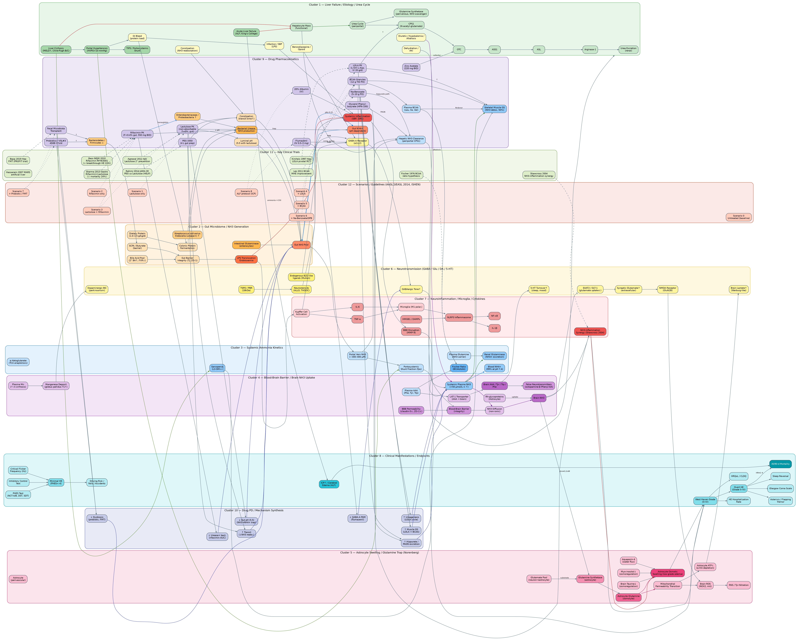</a> | 간부전(MELD↑, ALF, TIPS 문맥대정맥션트) → 페리포탈 CPS1 ureagenesis 저하 → 장내 urease+ 세균(Enterobacteriaceae·*S. salivarius*·*Klebsiella*)이 단백질→NH3 생성 → 션트분율(fps)을 통해 간 우회 → 전신 NH3 >50µmol/L → 비이온형 NH3 BBB 통과 → **별아교세포 GS**가 글루타민으로 트랩(Norenberg "Trojan horse", Albrecht 2006 Hepatology) → 미토콘드리아 PT·ROS·저등급 뇌부종 → NH3가 **TSPO/PBR** 자극 → **알로프레그나놀론·THDOC** 신경스테로이드 → **GABA-A α1γ2 PAM** 항진 → 수면 반전·운동저하 + LPS 전위(누수 장벽)로 TNFα/IL-1β/IL-6 → **NH3-염증 시너지(Shawcross 2004 J Hepatol)** → Fischer 비(BCAA/AAA)↓ → AAA가 LAT-1로 뇌 진입 → 위전달물질(octopamine)↑ → 글로부스 팔리두스 Mn 침착(T1↑·도파민성 저하·파킨소니즘) → West Haven 0–IV 연속체(PHES·CFF·ICT·asterixis·GCS) → 입원·운전 실격·30일 사망 HR≈2–4 통합 QSP. **Lactulose**(F=0%, 30–90g/d, 장내 pH 5.5로 NH3→NH4+ 트랩+완하)·**Rifaximin**(F<0.4%, 550mg BID, urease+ 세균 억제, **Bass 2010 NEJM RFHE3001** 6개월 돌발HE 22% vs 46%, HR 0.42)·**LOLA**(L-Orn L-Asp 20g IV/d, 요소회로 CPS1↑ + 근육 GS↑, **Kircheis 1997 Hepatology** NH3 −38%/d7)·**BCAA**(12g TID Leu/Ile/Val, Fischer 비 회복·근육 NH3 해독, **Les 2011 AJG** 12개월 HE −44%)·**Na-Benzoate**(5g TID, 히푸르산 경로 대체 N배설, Sushma 1992 Hepatology)·**Glycerol Phenylbutyrate**(HPN-100, PAGN 배설, **Rockey 2014 Hepatology**)·**PEG 3350**(4L, 신속 카타르시스, **Rahimi 2014 JAMA IM HELP**)·**Probiotic/FMT**(VSL#3 450B CFU/d 또는 FMT, **Bajaj 2019 PROFIT** Hepatology 인지+미생물군 다양성↑)·**Albumin 20%**(50g IV, LPS 결합·항염, Caraceni 2018 ANSWER Lancet)·**Flumazenil**(0.5–1mg IV, GABA-A 경쟁억제, ALF 구조요법, Goulenok 2002 meta) 10종 PK/PD. **Sharma 2013 AJG** Lactulose+Rifaximin 사망률 24%↓·**Häussinger 2000 J Hepatol** 별아교세포 저등급 부종 가설·**Mullen 1990 Lancet** 내인성 BZD 활성·**Olde Damink 2003 Hepatology** 신장 NH3·**Tandon 2012 Liver Transpl** 근감소(L3-SMI↓) 통합 보정. 무치료·Lactulose·Rifaximin·Lact+Rif·+LOLA·+BCAA·+Benzoate·+Probiotic/FMT·ALF 프로토콜(Albumin+Flumazenil, fps=0.6) 9개 시나리오. 12 클러스터 150+ 노드, 25 ODE 구획, 62개 문헌, 8탭 Shiny.<br>[🗺️ 지도](hepatic-encephalopathy/he_qsp_model.svg) · [⚙️ mrgsolve](hepatic-encephalopathy/he_mrgsolve_model.R) · [📚 문헌](hepatic-encephalopathy/he_references.md) · [📄 README](hepatic-encephalopathy/README.md) |
| 216 | 만성·신경계 | [**하지불안증후군 (RLS / WED)**<br><sub>Restless Legs Syndrome · Willis-Ekbom Disease · 뇌철 결핍 · BTBD9/MEIS1 · A11-척수 도파민 · A1 아데노신 · α2δ · 증강현상</sub>](restless-legs-syndrome/) | <a href="restless-legs-syndrome/rls_qsp_model.svg">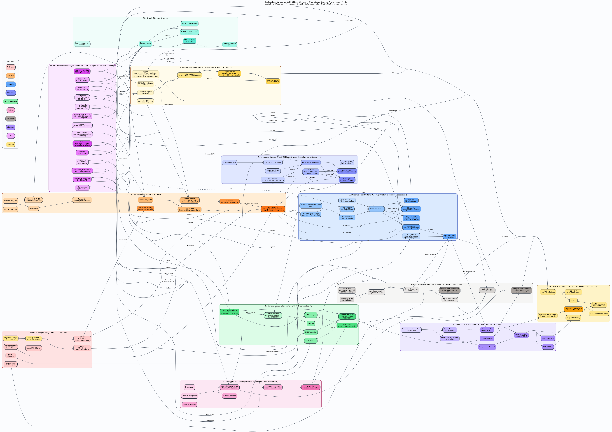</a> | 22+ GWAS 위험좌위(**BTBD9** rs9357271 OR≈1.7·**MEIS1** rs2300478 OR≈1.8·**MAP2K5/SKOR1**·**PTPRD**·**TOX3**, 유전율 ~70%) → 혈청·CSF ferritin↓ → BBB TfR1·DMT1·IRP1/2 매개 **뇌철 ~30% 감소**(SN·putamen·thalamus, Connor 2003 Brain·Earley 2000 Neurology) → **TH(Fe²⁺ 보조인자) 활성 저하** + 역설적 DA 합성↑·시냅스후 D2/D3 감수성↓ + **A11 시상하부-척수 DA 톤** 야간 trough → 척수 dorsal horn 감각 과흥분·flexor reflex 탈억제. **Ferré 2018 가설**: 뇌철 결핍 → **A1 아데노신 수용체 톤↓** → presynaptic glutamate·DA 방출 disinhibition → cortico-thalamic 글루타메이트 spectroscopy↑(Allen 2013) → α2δ-1 Cav2.1/2.2 VGCC 매개 SpinalSens↑ → **PLMS index >15/h**·IRLS 18-30·sleep efficiency↓·야간 BP/HR surge → 심혈관 위험 HR≈1.4(Li 2018·Pennestri 2007). **약물 PK/PD**: **Pramipexole**(2-comp, 80% 신배설, D3>D2, EC50≈0.45 ng/mL, eGFR 보정)·**Ropinirole**(CYP1A2, EC50≈5.4 ng/mL)·**Rotigotine 패치**(0-차 방출, F=45%, D3>D2>D1, 증강 위험 최저)·**Gabapentin enacarbil**(XP13512 프로드러그, F=75% to gabapentin, α2δ-1, EC50≈4 mg/L)·**Pregabalin**(α2δ-1, EC50≈2.5 mg/L)·**Oxycodone/Naloxone PR**(MOR 작용·gut naloxone 변비↓, EC50≈18 ng/mL)·**Methadone / Tramadol**·**IV ferric carboxymaltose 1000-1500 mg**(serum→brain Fe 회복·KFCM_brain=0.0009/h). **임상시험 보정**: **Trenkwalder 2008 Lancet Neurol** rotigotine 3 mg ΔIRLS -13.7 @ 6mo·**Garcia-Borreguero 2010 NEJM PIVOT-RLS** gabapentin enacarbil 1200 mg ΔIRLS -13.2 vs -8.8 placebo·**Allen 2014 NEJM** pregabalin 300 mg vs pramipexole 0.5 mg head-to-head: ΔIRLS -14.6 vs -12.7 @12wk + 52주 augmentation **1.7% vs 7.7%**·**Trenkwalder 2013 Lancet Neurol RELOXYN** oxycodone/naloxone ΔIRLS -16.5 vs -9.4·**Allen 2011 Sleep Med** IV FCM 1000 mg >50% responders. **증강현상 동역학**: DA-agonist 효과 > DA_aug_threshold(0.55)에서 KAUG_on=6e-4/h 누적·withdrawal KAUG_off=0.10/d·IRLSSG 2016 criteria 보정. **트리거**: SSRI/SNRI·항히스타민·메토클로프라미드·카페인·임신 3기·ESRD(20-60% 유병). 무치료·pramipexole 0.25/0.5 mg·ropinirole·rotigotine 2/3 mg 패치·gabapentin enacarbil·pregabalin·oxy/nal PR·IV FCM·증강 hazard 1년 추적 8개 시나리오. **12 클러스터 100+ 노드 지도, 19 ODE 구획, 50+ 문헌, 8탭 Shiny**.<br>[🗺️ 지도](restless-legs-syndrome/rls_qsp_model.svg) · [⚙️ mrgsolve](restless-legs-syndrome/rls_mrgsolve_model.R) · [📚 문헌](restless-legs-syndrome/rls_references.md) · [📄 README](restless-legs-syndrome/README.md) |

| 217 | 종양 (혈액암) | [**호지킨 림프종 (HL)**<br><sub>Hodgkin Lymphoma · cHL · NLPHL · HRS · 9p24.1/PD-L1 · ABVD · escBEACOPP · BV-AVD · N-AVD · Nivolumab · Pembrolizumab</sub>](hodgkin-lymphoma/) | <a href="hodgkin-lymphoma/hl_qsp_model.svg">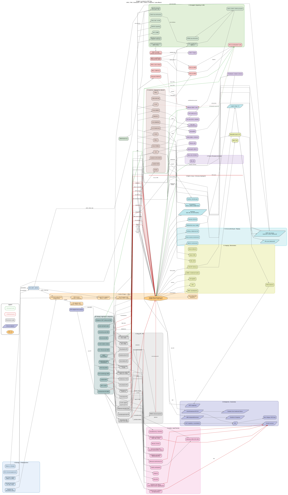</a> | 생식중심 B세포에서 기원한 Hodgkin/Reed-Sternberg(HRS, CD30+ CD15+ PAX5-dim) 세포가 **NF-κB**(REL 증폭·TNFAIP3/A20 소실)·**JAK/STAT**(JAK2 9p24.1 증폭·SOCS1/PTPN1 소실·STAT3/5/6)·**PI3K/AKT/mTOR**·**NOTCH1**·**AP-1/JUNB** 신호로 생존. EBV LMP1(40-50% cHL)이 CD40 모방으로 NF-κB 점화. **9p24.1 증폭** → PD-L1/PD-L2 과발현 + JAK2-STAT1 양성 피드백 → PD-1+ TIM-3+ LAG-3+ **CD8 소진 T세포** + FOXP3+ Treg 풍부한 **면역특권 미세환경**(Steidl NEJM 2010). HRS 분비 **CCL17(TARC)·CCL22·갈렉틴-1·IL-13·IL-6·TGF-β·IL-10**이 Th2/Treg 끌어모음. 임상: 경추·종격동 bulky LN·B-증상·소양감·알코올유발통증 → Lugano I-IV·IPS·GHSG 위험군 → FDG-PET Deauville 1-5·MTV/TLG·**혈청 TARC**(Plattel BJH 2016 PFS 예측). **약물 PK/PD**: Doxorubicin(2-cpt CL 30 L/h·V1 19 L·400 mg/m² 누적 심독성 한계, Swain JCO 2003)·Bleomycin(CL 4 L/h, 누적 폐섬유화)·Vinblastine·Dacarbazine·Etoposide·Cyclophosphamide·Vincristine·Prednisone·Procarbazine·**Brentuximab vedotin**(anti-CD30 ADC, CL 1.5 L/d, k_release 0.012/h → 유리 MMAE 미세소관 파괴·말초신경병증, Han JCP 2013)·**Nivolumab**(CL 0.008 L/h, t½ 25d, Bajaj CPT:PSP 2017)·**Pembrolizumab**·Bendamustine·Gemcitabine. **치료 보정**: ABVD ×6 (Canellos NEJM 1992)·RATHL iPET-적응 AVD(Johnson NEJM 2016, 5y PFS ~83%)·escBEACOPP(Engert HD15 Lancet 2012, 5y PFS ~88%)·**A+AVD ECHELON-1**(Connors NEJM 2018, 6y PFS 82.3 vs 74.5%, Ansell NEJM 2022)·**N-AVD SWOG S1826**(Herrera NEJM 2024, 2y PFS 92 vs 83%)·CheckMate 205 nivolumab R/R(Armand JCO 2018 ORR ~69%, CR 16%)·**KEYNOTE-204** pembro > BV(Kuruvilla Lancet Oncol 2021)·**AETHERA** BV 유지(Moskowitz Lancet 2015)·HDT+ASCT 구원·동종이식 GVL. 24 ODE 구획(약물 PK 8 + HRS 종양 + Effector/Exhausted CD8 + Treg + PD-L1 + TARC/IL-6/IL-13 + Friberg ANC 5-cpt + CumDOX/CumBLM/CumMMAE/NIVO_AUC + 심독성/폐독성/신경병증/irAE 누적 + PFS 해저드)·**PD-1 점유율 = Cnivo/(Cnivo+EC50)**·재활성화 k_reinvig·Simeoni-유사 HRS 성장-kill·G-CSF 인자. 무치료·ABVD·AVD·escBEACOPP·A+AVD·N-AVD·BV monotherapy·Nivo·BV+Nivo 9개 시나리오. **12 클러스터 160+ 노드 지도, 67편 문헌, 8탭 Shiny**(환자·PK·종양/TARC·면역·혈액학·독성·엔드포인트·바이오마커).<br>[🗺️ 지도](hodgkin-lymphoma/hl_qsp_model.svg) · [⚙️ mrgsolve](hodgkin-lymphoma/hl_mrgsolve_model.R) · [📚 문헌](hodgkin-lymphoma/hl_references.md) · [📄 README](hodgkin-lymphoma/README.md) |
| 218 | 신경계·미토콘드리아·희귀 | [**프리드라이히 운동실조증 (FRDA)**<br><sub>Friedreich Ataxia · FXN GAA repeat · Fe-S cluster · NRF2-KEAP1 · Omaveloxolone(MOXIe) · Deferiprone · Idebenone · Nomlabofusp(CTI-1601) · AAVrh10-FXN</sub>](friedreich-ataxia/) | <a href="friedreich-ataxia/frda_qsp_model.svg"></a> | *FXN* (9q21.11) intron 1 **GAA·TTC 삼중반복(66–1700)** 확장 → triplex/R-loop·H3K9me3·HDAC3 매개 이질염색체화로 FXN mRNA·**Frataxin 단백질 5–35%로 감소**(Campuzano 1996 Science·Saveliev 2003 Nature). Frataxin은 NFS1-ISCU-ISD11-ACP 미토콘드리아 **Fe-S 클러스터 생합성** 알로스테릭 활성제(Tsai/Barondeau 2010·Parent 2015): 결핍 시 **Complex I/II/III·아코니타제** Fe-S 효소 활성 ↓ + 미토 라이빌 Fe²⁺ 축적(Whitnall 2008 PNAS) → Fenton ROS·lipid peroxidation → **NRF2-KEAP1 핵 전위 장애**(Paupe 2009 PLoS One·D'Oria 2013) → 항산화 capacity 결손. 표적 조직: **DRG 대형 감각신경(F. gracilis/cuneatus 후색)**·척수소뇌로·**치아핵(dentate) atrophy**·피질척수로 → 감각+소뇌성 **운동실조**·구음장애·반사소실·진동/위치감각 저하; **비대성 심근증**(60–80%, Pousset 2015 JAMA Neurol)·**당뇨병**(~30%, Cnop 2012 Ann Neurol β-cell 산화스트레스 아폽토시스); 척추측만·시신경/청신경 병증·우울. **mFARS**(Subramony 2005)·**T25FW**·9HPT·SARA·LVMI·HbA1c·plasma frataxin·F2-isoprostane 동태 통합. 발병 평균 10–15세, 보행소실 10–15년. **약물 PK/PD**: **Omaveloxolone(Skyclarys 150 mg QD, FDA 2023)** Cys151-KEAP1 modification → NRF2 안정화·ARE-induction(NQO1·HO-1·GCLC·GCLM·SOD2·GPX4); **MOXIe Part 2(NCT02255435, Lynch 2021 Ann Neurol) mFARS Δ=-2.41(48w)** + delayed-start extension(Lynch 2022 Mov Disord, 2024 Lancet Neurol) 질환 수정 효과; ALT 상승·LDL↑/BNP transient·두통 안전성. **Idebenone**(450 mg TID, CoQ analog, IONIA 모호; Mariotti 2003 Neurology)·**Deferiprone**(20–25 mg/kg/d, 미토 Fe 선택적 킬레이션, Boddaert 2007 Blood 심장 T2*↓ / Pandolfo 2014 Ann Neurol 고용량 신경학적 악화 시그널)·**Nomlabofusp(CTI-1601)** SC TAT-frataxin 단백질 치료(Vyas 2012 Hum Mol Genet)·**AAVrh10-FXN(LX2006)** 단회 IV 유전자치료(Perdomini 2014 Nat Med·Piguet 2018 Hum Mol Genet 마우스 심근증 완전 역전)·**HDAC 억제제·DT-216 STAT-RNA·etravirine**(전사 회복)·**ACEi/β-blocker/SGLT2i**(심장 보조)·**Insulin/Metformin**(DM)·PT/OT·Riluzole. 무치료·Omaveloxolone·Idebenone·Deferiprone·Nomlabofusp·AAV gene Tx·Omav+ACEi 7개 시나리오. **12 클러스터 160+ 노드 지도, 15 ODE 구획**(FXN·Fe-S·미토 Fe·ETC·ATP·ROS·AOX·DRG·소뇌·LVMI·β-cell·glucose·AAV-FXN + 4-drug PK), **70편 문헌, 8탭 Shiny**(환자·FXN/유전·미토 에너지·CNS·심장·췌장·치료비교·바이오마커/안전).<br>[🗺️ 지도](friedreich-ataxia/frda_qsp_model.svg) · [⚙️ mrgsolve](friedreich-ataxia/frda_mrgsolve_model.R) · [📚 문헌](friedreich-ataxia/frda_references.md) · [📄 README](friedreich-ataxia/README.md) |
| 219 | 자가면역·신경계 | [**경직성인증후군 (SPS)**<br><sub>Stiff Person Syndrome · SPS · anti-GAD65 · GAD/GABA · α-MN hyperexcitability · Diazepam · Baclofen · Gabapentin · IVIG · Rituximab · PLEX · IT Baclofen</sub>](stiff-person-syndrome/) | <a href="stiff-person-syndrome/sps_qsp_model.svg">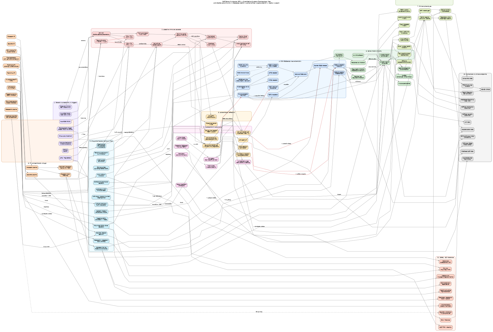</a> | HLA-DRB1\*03:01·HLA-DQB1\*02:01·PTPN22·CTLA-4 감수성 + EBV/엔테로바이러스 분자 모방 또는 종양항원(유방·SCLC·thymoma 아밀로이드증) 또는 면역체크포인트 억제제 노출 → APC-DC가 **GAD65 펩타이드 제시** → Th1(IFN-γ)·Th17(IL-17)·Tfh(IL-21)·GC reaction → 형질모세포→**장수 형질세포(BM niche)**·**기억 B 세포** + 척수강내(CSF) B-세포 클론 → **anti-GAD65 IgG**(serum > 10,000 U/mL 진단 기준치, intrathecal index >1, oligoclonal bands) + 교차 anti-GAD67·**GABA-A 수용체-결합 GABARAP**·**gephyrin**·**glycine receptor**(PERM 변이형)·**amphiphysin**(paraneoplastic)·**DPPX**(SPS-plus). CSF anti-GAD65 → **GAD65 효소 직접 억제 + VGAT 매개 소포 GABA 충전 감소 + 양자성 GABA 방출 감소** → CNS GABA pool 30% 감소(Levy 2005 Arch Neurol MRS) → Renshaw·Ia inhibitory IN·**presynaptic GABAergic axoaxonic** 억제 손실 → **α-MN 흥분성 증가** + γ-MN 스핀들 게인↑ → 작용근-길항근 **공동수축** → **EMG 지속적 운동단위 활동(continuous motor unit activity)** → **축성·요추 강직(lordosis)**·**자극민감성 통증성 경련**·로봇 같은 보행·**보호 반사 없는 동상형 낙상** + 운동피질 hyperexcitability(Sandbrink 2000 Brain) + 변연계 GABA 결핍 → **과제 특이 공포증·광장공포·교감신경 폭발(빈맥·발한)** + 아밀로이드증 30% **제1형 당뇨병**·10% 자가면역 갑상선·악성빈혈·백반증 동반. **약물 PK/PD**: **Diazepam**(2-cmt + active metabolite **desmethyldiazepam** t½ ~50h, GABA-A α1/α2/α3/α5 PAM, EC50_brain=0.20 mg/L, Friedman 1985 CPT)·**Baclofen** 경구(F=0.80, CL 11.5 L/h 신배설, Wuis 1989 Eur J Clin Pharmacol) 또는 **intrathecal pump**(400 mcg/d 연속, V_CSF=0.140 L, Penn 1993·Stayer 1997 Neurology)·**Gabapentin**(α2δ-1, EC50=4 mg/L, Spitz 2005 Mov Disord)·**Tiagabine**(GAT-1 차단→synaptic GABA↑, Bardutzky 2003)·**Vigabatrin**(GABA-T 비가역 억제)·**IVIG**(2 g/kg per cycle q4w, anti-idiotype + FcγR modulation, V_IGG=3.5 L, kel=0.0046/h ≈ t½ 21d, **Dalakas 2001 NEJM** stiffness/heightened sensitivity index 유의 개선)·**Rituximab**(CD20 매개 B-cell 고갈, 1g IV x2 q14d, CL 0.27 L/d, Sanders 2014 JNNP; placebo-controlled trial Dalakas 2017 Neurology 일차 종결점 음성이나 일부 환자 반응)·**Obinutuzumab/Inebilizumab**(차세대 anti-CD20/CD19)·**Bortezomib**(plasma-cell 고갈, Bird 2019 NNI)·**FcRn 차단제**(efgartigimod·rozanolixizumab, IgG 이화 ↑)·**Prednisolone**(GR-mediated lymphopenia, EC50=0.05 mg/L)·**MMF**(IMPDH2 억제)·**Tacrolimus**(calcineurin·IL-2 차단)·**PLEX**(40-60% IgG 제거/세션, refractory crisis)·**자가 HSCT**(immune reset, Khoury 2014 JAMA Neurol). 임상시험·자연사 보정: **Dalakas 2001 NEJM** IVIG RCT·**Sanders 2014 JNNP** 리툭시맙 case series·**McKeon 2012 Arch Neurol** 99명 코호트·Levy 1999 Ann Intern Med 임상 분류·Floeter 1998 Neurology presynaptic inhibition·Pugliese 1993 JCEM HLA-DQB1\*02:01·Hampe 2007 Diabetes anti-GAD65 epitope heterogeneity. 무치료/Dx 단계·BZD 단독·BZD+oral baclofen·BZD+IVIG q4w·Rituximab induction(1g×2 + 프레드니솔론 펄스)·PLEX rescue(crisis severity)·**Intrathecal baclofen** 6개 시나리오. **11 클러스터 124 노드 지도, 26 ODE 구획**(Diaz/DMD/Baclofen oral/IT/CSF·Gabapentin·Prednisolone·IVIG·Rituximab 2-cmt·B-naive/Plasmablast/LLPC·anti-GAD65 serum/CSF·GAD enzyme·GABA pool·α-MN excitability·Stiffness/Spasm/BMD/HSI), **70편 문헌, 8탭 Shiny**(환자·항체동태·약물PK·GABA계 바이오마커·임상 엔드포인트·시나리오 비교·안전성·VPC).<br>[🗺️ 지도](stiff-person-syndrome/sps_qsp_model.svg) · [⚙️ mrgsolve](stiff-person-syndrome/sps_mrgsolve_model.R) · [📚 문헌](stiff-person-syndrome/sps_references.md) · [📄 README](stiff-person-syndrome/README.md) |
| 220 | 신경/두통 | [**군발두통 (CH)**<br><sub>Cluster Headache · TAC · 시상하부-삼차혈관계 · CGRP/PACAP · O2 · Sumatriptan SC · Verapamil · Lithium · Galcanezumab · GON block · SPG-stim</sub>](cluster-headache/) | <a href="cluster-headache/ch_qsp_model.svg">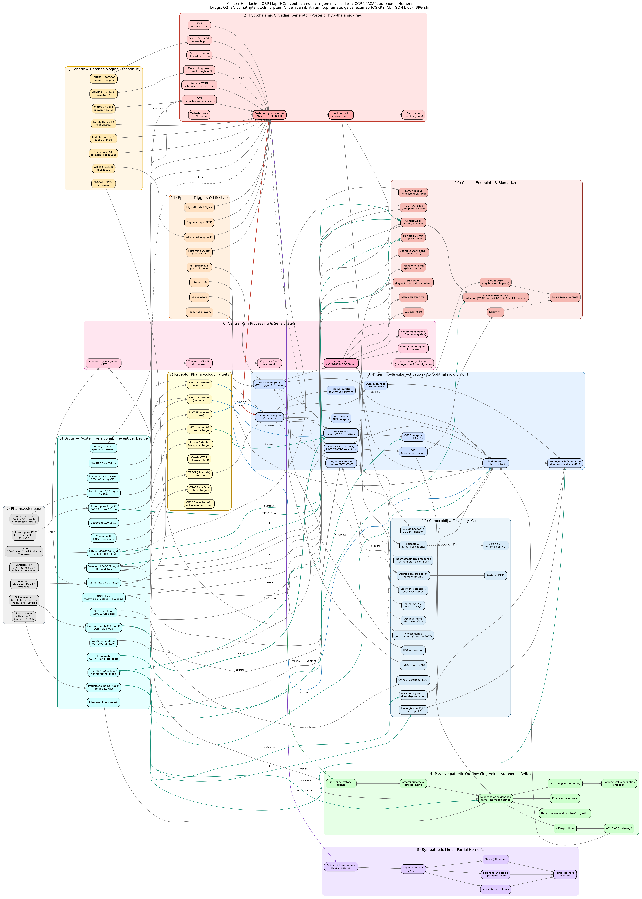</a> | *HCRTR2·ADCYAP1·MTNR1A·CLOCK/BMAL1* 등 위험 좌위 + 가족력 ×5-18 + 흡연 → **시상하부 후방회백질 활성**(May 1998 *Lancet* PET) → SCN/PVN/orexin 일주기 게이트(피크 ~03:00) + 멜라토닌·테스토스테론·코르티솔 야간 트로프 → **V1 삼차신경절(Trigeminovascular)** 활성·dura·ICA·pial vessels 신경원성 염증 → **CGRP/PACAP-38/VIP/Substance P/NO** 분출(Goadsby 1994 *Brain* jugular CGRP↑) → 동측 안와주위 VAS 9-10/10·15-180분 발작; 동시에 SSN→GSPN→**SPG**(접형구개신경절) parasym 반사 → 눈물·콧물·결막충혈·이마발한; pericarotid sympathetic 자극 → SCG 손상 → 부분 **호너 증후군**(ptosis·miosis); 운동성 안절부절(restlessness)가 편두통과 감별. 활성기(주-월)/관해기(월-년)의 **episodic CH 80-90%**, 만성 CH 10-15%. **자살두통**으로 불릴 만큼 통증 강도 1위(Burish 2021 Headache), 우울/자살사고 평생 55-65%/20-25%(Rozen 2012 Headache·Liang 2013). **약물 PK/PD**: **고유량 O2 12 L/min 비호흡재흡입마스크**(Cohen 2009 *JAMA* 78% 15분 통증소실)·**Sumatriptan 6 mg SC**(Ekbom 1991 *NEJM* 74% 15분 완화, CL 18 L/h·V 9 L·t½ 2h, 5-HT1B/1D/1F)·**Zolmitriptan 5/10 mg IN**(Rapoport 2007 *Neurology*)·**Lidocaine 4% IN**·**Octreotide 100 µg SC**(SSTR2/5)·**Prednisone 60→40→20 mg taper**(Obermann 2021 *Lancet Neurol* 8d 발작수 ↓7.1 vs 9.5)·**GON block**(methylprednisolone+lidocaine, Leroux 2011 *Lancet Neurol* 활성 vs 위약 응답률 85% vs 59%, 효과 t½ ~14 d)·**Verapamil 240→960 mg/d PR**(Leone 2000 *Neurology* RCT, CYP3A4·active norverapamil·**PR/QT 모니터링**, Cohen 2007 ECG abnormality 19%)·**Lithium 600-1200 mg/d**(Steiner 1997·Bussone 1990 vs verapamil, CL ≈25 mL/min·trough 0.6-0.8 mEq/L)·**Topiramate 25-200 mg/d**(Láinez 2003)·**Melatonin 10 mg HS**(Leone 1996·Pringsheim 2002)·**Galcanezumab 300 mg SC q4w**(Goadsby 2019 *NEJM* eCH wks 1-3 평균 8.7 vs 5.2 attacks↓, Dodick 2020 *Cephalalgia* cCH·CL 0.008 L/h·t½ 27 d)·**Erenumab**(off-label, CGRP-R mAb)·**Civamide IN**(TRPV1). **신경조절**: **SPG-stim**(Schoenen 2013 Pathway CH-1)·**nVNS gammaCore**(ACT-1/ACT-2/PREVA, Silberstein 2016·Gaul 2016)·**ONS**(Magis 2007)·**posterior hypothalamic DBS**(Leone 2001 *NEJM* refractory CCH). 무치료·O2+Suma·Verapamil·Vera+Li·Galcanezumab·Pred bridge+Vera·GON+Vera 7개 시나리오. **12 클러스터 104+ 노드 지도, 25 ODE 구획**(약물 PK 16 + 시상하부 드라이브·CGRP·PACAP·pial·attack hazard·cum attacks·bout timer·O2 effect·GON effect 9), **72편 문헌, 8탭 Shiny**(환자·PK·경로 PD·임상 엔드포인트·시나리오·바이오마커·안전·문헌).<br>[🗺️ 지도](cluster-headache/ch_qsp_model.svg) · [⚙️ mrgsolve](cluster-headache/ch_mrgsolve_model.R) · [📚 문헌](cluster-headache/ch_references.md) · [📄 README](cluster-headache/README.md) |
| 221 | 희귀 대사·리소좀저장 | [**폼페병 (GSDII)**<br><sub>Pompe Disease · GAA Deficiency · IOPD/LOPD · M6P/CI-MPR Uptake · Alglucosidase · Avalglucosidase · Cipaglucosidase + Miglustat · AAV9-GAA · CRIM ITI</sub>](pompe-disease/) | <a href="pompe-disease/pompe_qsp_model.svg">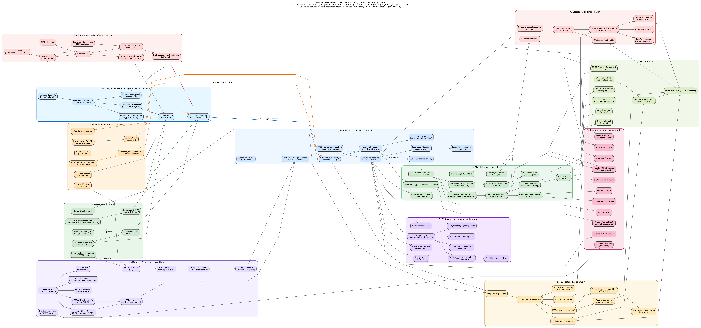</a> | *GAA*(17q25.3) 상염색체 열성 변이로 산성 α-glucosidase 활성 ≤30% 잔존 → 리소좀 α-1,4/α-1,6 글리코겐 축적 → LAMP1+ 거대 리소좀 → LC3-II·p62 자가포식 차단(Raben 2008 Hum Mol Genet·Lim 2017 EMBO Mol Med·TFEB 핵 전위 장애 Spampanato 2013) → 세포질 글리코겐 누출 → Z-line streaming·미토콘드리아 복합체 I/IV 저하·위성세포 고갈 → 골격근·심근·횡격막 손상. **IOPD**(CRIM-±): 비후성 심근증(LVMI↑·short PR·tall QRS·LVOT 폐쇄)·NT-proBNP·troponin↑·macroglossia·hepatomegaly, 무치료 사망 < 12개월(Kishnani 2006 Genet Med); **LOPD**(c.-32-13T>G 알릴 50–70%): 사지근위·횡격막 약화·FVC 상시/누운자세 격차·MIP/MEP↓·수면호흡장애·NIV 필요(Hagemans 2005 Brain·Boentert 2016 J Neurol·van der Beek 2011). **약물 PK/PD**: **Alglucosidase alfa** 20 mg/kg IV q2w(2-cmt, CL≈0.27 mL/min/kg, V_ss≈100 mL/kg, M6P ~2.5 mol/mol; Hahn 2008·Kishnani 2007 *Neurology* IOPD 사망률 RRR·van der Ploeg 2010 *NEJM* LOTS LOPD 6MWT/FVC 안정)·**Avalglucosidase alfa**(Nexviazyme, M6P x15·CI-MPR Kd≈5 nM·NEO1 Pena 2019·**COMET Diaz-Manera 2021 *Lancet Neurol*** ΔFVC +2.4%·Δ6MWT +30 m vs alglu 49w, Kishnani 2024 97주 연장)·**Cipaglucosidase alfa + Miglustat 195 mg PO**(Pombiliti+Opfolda, **PROPEL Schoser 2021 *Lancet Neurol***: Δ6MWT +14 m·ΔFVC +3% vs alglu+placebo, miglustat 혈장 안정화 Imax=0.35·EC50=1.5 mg/L)·**AT2220/AT-GAA 화학적 샤페론**(Porto 2012 Mol Ther·Khanna 2014 PLoS One). **유전자 치료**: **AAV9-DES-hGAA**(Smith 2013 Hum Gene Ther)·**AAV8-LSP-GAA(SPK-3006·AT845)** 간 표적·secreted GAA cross-correction(Han 2017·Puzzo 2017 *Sci Transl Med*)·**AAVrh74-MyoAAV LION**(Eggers 2024). **CRIM- ITI**: Rituximab 375 mg/m² + MTX ± IVIG로 plasmablast 생성 ↓(Banugaria 2011·Messinger 2012·Kazi 2017 *JCI Insight*); HSAT ≥51,200 → CI-MPR 흡수 95% 차단·임상 반응 소실. 무치료(IOPD/LOPD)·alglu·aval·cipa+mig·AAV9 GT·alglu+ITI 6개 시나리오. **12 클러스터 100+ 노드 지도, 22 ODE 구획**(약물 PK 8 + 조직 GAA 3 + 글리코겐 3 + Hex4/ADA/RTX 3 + LVMI/MM/Diaph/FVC 4 + AAV 1), **80편 문헌, 8탭 Shiny**(환자·PK·PD 조직·임상 엔드포인트·시나리오 비교·바이오마커·ADA·문헌).<br>[🗺️ 지도](pompe-disease/pompe_qsp_model.svg) · [⚙️ mrgsolve](pompe-disease/pompe_mrgsolve_model.R) · [📚 문헌](pompe-disease/pompe_references.md) · [📄 README](pompe-disease/README.md) |
| 222 | 자가면역·혈액·희귀 | [**특발성 다발성 캐슬만병 (iMCD)**<br><sub>Idiopathic Multicentric Castleman Disease · HHV-8 negative · IL-6 / sIL-6R / gp130-JAK-STAT3 · mTORC1-TAFRO · CDCN 2017 · Siltuximab(CONCERT) · Tocilizumab · Sirolimus · Rituximab · Anakinra · Ruxolitinib</sub>](idiopathic-multicentric-castleman-disease/) | <a href="idiopathic-multicentric-castleman-disease/imcd_qsp_model.svg">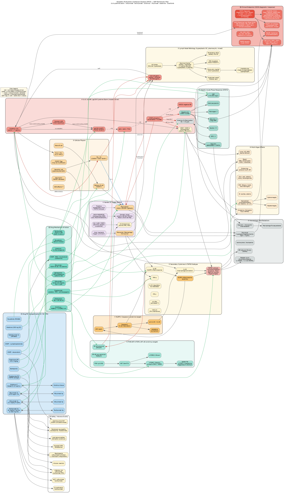</a> | HHV-8 음성 폴리클론성 림프증식성 사이토카인 폭풍: 림프절 생식중심(GC) 기질·여포 도움 T세포(Tfh)·플라스마블라스트 + 혈중 단핵구가 분비한 **IL-6**가 cis(mIL6R) + **trans(sIL6R)** 신호로 **gp130-JAK1/2-STAT3** 활성 → **간 급성기 반응(CRP·SAA·hepcidin·fibrinogen↑·albumin·IGF-1↓)** + 헵시딘 매개 **염증성 빈혈** + 다클론성 **고감마글로불린혈증(IgG>3 g/dL)** + **VEGF-A** 폭증으로 혈관 투과성↑·**아나사르카/삼출액** + 일반화 림프절병증·간비종대. **TAFRO 아형**(Thrombocytopenia·Anasarca·Fever·Reticulin fibrosis·Organomegaly, Iwaki 2016 *Am J Hematol*)은 Tfh·PB **PI3K-AKT-mTORC1** 과활성(Fajgenbaum 2019 *JCI Insight*·Arenas 2020 *Blood*)이 추가 드라이버 → **시롤리무스** 표적. **CDCN 2017 진단기준**(Fajgenbaum 2017 *Blood*): 림프절병증+조직병리 2 major + 검사 minor(CRP↑·ESR↑·IL-6↑·Hb↓·plt↑/↓·IgG↑↑·albumin↓) + 임상 minor(발열·간비종대·부종/삼출·eruptive 혈관종·LIP) ≥2개. **약물 PK/PD**: **Siltuximab** 11 mg/kg IV q3w (anti-IL-6 mAb Kd≈1 pM, CL=0.232 L/d·V1=4.47 L, **CONCERT** van Rhee 2014 *Lancet Oncol* durable response 34% vs 0% placebo, FDA 2014); **Tocilizumab** 8 mg/kg IV q2w (IL-6Rα 차단, Nishimoto 2005 *Blood*); **Sirolimus** 2 mg PO QD (FKBP12-mTORC1, 목표 trough 6-14 ng/mL, MacDonald 2000 *Clin Ther*, TAFRO 구제, Fajgenbaum 2019 *JCI*); **Rituximab** 375 mg/m² weekly×4 (anti-CD20 B-cell 고갈, Ide 2006); **Anakinra** 100 mg SC QD (IL-1Rα, Galeotti 2008 *Pediatrics*); **Ruxolitinib** 20 mg PO BID (JAK1/2 IC50≈300 nM); **CHOP**(독소루비신/시클로포스파미드/빈크리스틴/프레드니손, 구제 세포독성); **Prednisone** 60 mg → NF-κB·IL-6 합성 억제. **임상 보정**: CONCERT primary endpoint = durable tumor + symptomatic response; **CRP <10 mg/L by week 6**, Hb·IgG·LN 정상화. **van Rhee 2018 *Blood*** 합의 가이드라인: 1차 siltuximab(불가시 tocilizumab) → mTOR 시롤리무스(refractory TAFRO) → 리툭시맙/항대사·CHOP-like 구제. **Pierson 2023 *Blood Adv*** 가이드라인 일관성과 결과 상관성 검증. 5년 OS ≈65–90% (TAFRO 가장 나쁨). 무치료·Siltuximab·Tocilizumab·Sirolimus(TAFRO)·Rituximab+Pred·CHOP+Siltuximab·Triple(Silt+Siro+Anakinra) **7개 시나리오**. **14 클러스터 150+ 노드 지도, 19 ODE 구획**(약물 PK 9 + IL-6 total/free + LN + 플라스마블라스트 + 메모리B + CRP + Hb + IgG + VEGF + 아나사르카 + 혈소판 + mTORC1 + 누적 OS 위험), **60+ 문헌, 8탭 Shiny**(환자 프로파일·약물 PK·IL-6 축·급성기·TAFRO/VEGF·림프절/PB·시나리오·바이오마커&CDCN 응답).<br>[🗺️ 지도](idiopathic-multicentric-castleman-disease/imcd_qsp_model.svg) · [⚙️ mrgsolve](idiopathic-multicentric-castleman-disease/imcd_mrgsolve_model.R) · [📚 문헌](idiopathic-multicentric-castleman-disease/imcd_references.md) · [📄 README](idiopathic-multicentric-castleman-disease/README.md) |
| 223 | 피부·약물반응·중증 | [**스티븐스-존슨 증후군 / 독성 표피괴사용해 (SJS/TEN)**<br><sub>Stevens-Johnson Syndrome · Toxic Epidermal Necrolysis · SCAR · HLA-B*15:02/58:01/A*31:01 · p-i / hapten · CD8⁺ CTL · Granulysin/sFasL/TNF-α · SCORTEN · IVIG · Cyclosporine · Etanercept · JAK inhibitor</sub>](stevens-johnson-syndrome-ten/) | <a href="stevens-johnson-syndrome-ten/sjsten_qsp_model.svg">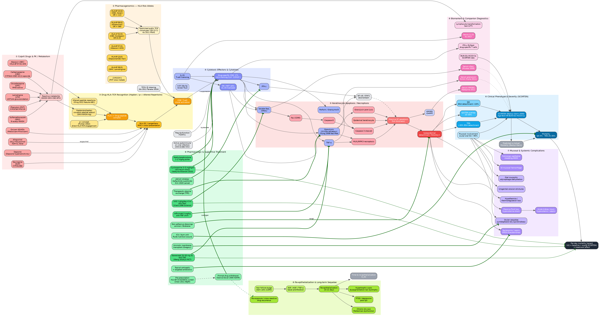</a> | 약물 유발 중증 피부 부작용(SCAR): **culprit drug**(카르바마제핀·알로푸리놀·SMX·라모트리진·페니토인·네비라핀·옥시캄 NSAID) ± 반응성 대사체(CBZ-EPX·NHOH-SMX) → **HLA-I 위험 알릴**(B*15:02 CBZ OR≈113 Chung 2004 *Nature*·B*58:01 ALL OR≈580 Hung 2005 *PNAS*·A*31:01 CBZ OR 8–25 McCormack 2011 *NEJM*·B*57:01 ABC Mallal 2008·B*13:01 Dapsone Zhang 2013) + **p-i / hapten / altered peptide repertoire**(Pichler 2002·Illing 2012 *Nature*) → 공공 TCR Vβ 클론형(Ko 2011) → **약물-특이 CD8⁺ CTL** 피부 침윤(CLA⁺CCR10⁺) + IL-15 라이센싱 → **granulysin(15 kDa, Chung 2008 *Nat Med*)·perforin/GzmB·sFasL(Murata 2008)·TNF-α·IFN-γ** 분비 → **각질형성세포 전층 apoptosis**(Fas/Caspase-8/3) + MLKL/RIPK3 necroptosis + granulysin pore → 진피-표피 분리·Nikolsky+ → **BSA detachment** (SJS <10% · overlap 10-30% · TEN >30%) + >90% 점막(안구 symblepharon·구강·요생식기)·sepsis·ARDS·AKI·hypovolemia. **SCORTEN(Bastuji-Garin 2000 *J Invest Dermatol*)**: age>40 · BSA>10% · HR>120 · BUN>10 · glucose>14 · HCO₃<20 · malignancy → 사망률 SJS 5% / TEN 25-35%. **약물 PK/PD**: **즉시 약물 중단**(Garcia-Doval 2000 *Arch Dermatol* 사망률↓)·**HLA-B*15:02/58:01 사전 스크리닝**(Chen 2011 *NEJM* TEN 발생률 0%)·**IVIG 1 g/kg/d×4**(Viard 1998 *Science* anti-FasL, Roujeau 2017 meta NS)·**Cyclosporine 3 mg/kg PO BID×10d**(Valeyrie-Allanore 2010 *Br J Dermatol* SMR 0.43, González-Herrada 2017 *J Invest Dermatol*)·**Etanercept 25 mg SC×2**(Wang 2018 *J Clin Invest* RCT 사망률 8.3% vs 47.6%, p<0.01)·**Infliximab 5 mg/kg**(Hunger 2005)·**Methylprednisolone 1-2 mg/kg pulse**(Lee 2012)·**TPE / 혈장교환**·**JAK1/2 inhibitor**(tofacitinib 5 mg BID, Kim 2020)·**ICU/burn unit 지지 요법**(Endorf 2008)·**amniotic membrane transplant**(Gregory 2011 *Ophthalmology* 안구 sequelae). **바이오마커**: serum granulysin(Fujita 2011 *JAAD* ICT)·sFasL(Murata 2008)·IL-15(Su 2017 *J Invest Dermatol*)·HMGB1(Nakajima 2011)·LTT·IFN-γ ELISpot. 무치료·IVIG·Cyclosporine·Etanercept·Methylpred·CSA+ETAN·JAKi **7개 시나리오**. **10 클러스터 130+ 노드 지도, 23 ODE 구획**(약물 PK 6 + 항원 1 + CTL 1 + 사이토카인/이펙터 6 + KC/BSA/누적위험/생존 4 + 면역치료 PK 5), **56+ 문헌, 7탭 Shiny**(환자·약물 PK·면역 PD·임상 엔드포인트·시나리오·바이오마커·문헌).<br>[🗺️ 지도](stevens-johnson-syndrome-ten/sjsten_qsp_model.svg) · [⚙️ mrgsolve](stevens-johnson-syndrome-ten/sjsten_mrgsolve_model.R) · [📚 문헌](stevens-johnson-syndrome-ten/sjsten_references.md) · [📄 README](stevens-johnson-syndrome-ten/README.md) |
| 224 | 자가염증·혈액·희귀 | [**VEXAS 증후군**<br><sub>VEXAS Syndrome · Vacuoles/E1/X-linked/Autoinflammatory/Somatic · UBA1 Met41 · 골수성 모자이크 · NF-κB/NLRP3/IFN-α · Macrocytic Anemia · Tocilizumab · Anakinra · Ruxolitinib · Azacitidine · Allogeneic HSCT</sub>](vexas-syndrome/) | <a href="vexas-syndrome/vexas_qsp_model.svg"></a> | 2020년 NIH-Beck **NEJM**에서 처음 기술된 **X-연관 성인 발병 자가염증 + 골수이형 중복** 질환: 조혈모세포(HSC)의 *UBA1* (Xp11.23) 체세포 돌연변이(주로 **p.Met41Thr/Val/Leu**, 일부 splice-site) → **세포질 isoform UBA1b 소실**(핵 UBA1a 보존) → cytoplasmic ubiquitin activation 결손 → 미스폴딩 단백 축적·**ERAD/오토파지 차단**·소포체 스트레스(**PERK-eIF2α-ATF4-CHOP**·**IRE1α-XBP1s**·**ATF6**) + 미토콘드리아 ΔΨ collapse·**mtROS**·oxidized cardiolipin·mtDNA cytosolic leak → **cGAS-STING/AIM2/NLRP3 인플라마좀** + NF-κB 과활성 → **IL-1β · IL-6 · TNF-α · CXCL8 · CCL2 · IFN-α** 폭주 + **acute-phase**(CRP·SAA·ferritin·헵시딘) + 골수 myeloid/erythroid precursor **세포질 공포(cytoplasmic vacuoles)** 진단표지 + **대구성 빈혈(MCV >100 fL, Hb 8–10 g/dL)**·**혈소판감소**·이형성·**MDS 중복 14–53%** (SF3B1 공발생). 다장기 표현: **재발성 발열**·**호중구성 피부질환(Sweet/PG 유사)**·**이개·비연골염(재발성다발연골염 표현형)**·폐 침윤·**중·소혈관 혈관염**·관절염·안와염·**정맥혈전색전증 ~40%**·HLH 유사 위기. **유전·진단**: 95% 이상 남성·평균 발병 67세·VAF 단핵구 30–90% (Beck 2020 *NEJM*, Georgin-Lavialle 2022 *Br J Dermatol* 116명 코호트, Ferrada 2024 *Lancet Rheumatol* 중증도 점수); UBA1 NGS/ddPCR·BM 공포 검출·**IFN 시그니처**(IFI27·SIGLEC1)·**프로테오믹스**(Sirenko 2024 *Nat Med* MDS 중첩). **약물 PK/PD**: ① **Prednisone 1 mg/kg/d → taper**(F=0.85, CL=16 L/h, NF-κB 트랜스리프레션, HPA 억제·GIO·DM·감염) - 80%가 의존, 효과적이지만 비현실적 장기 고용량 필요; ② **Tocilizumab 162 mg SC q1w**(SC F=0.80, V=5 L, CL=0.013 L/h, IL-6Rα Kd≈0.5 mg/L·t½ ~11d, Kirino 2021 *ARD*, **CRP·발열 빠른 해소**); ③ **Anakinra 100 mg SC qd**(rhIL-1Ra, t½ 4-6h, IL-1R1 점유율 >90%, Kunishita 2022 *Rheumatology*); ④ **Canakinumab 150-300 mg SC q4-8w**(anti-IL-1β mAb, t½ 26 d, Diarra 2022); ⑤ **Ruxolitinib 10 mg PO BID**(JAK1/2, CL=22 L/h, t½ 3h, **Heiblig 2022 *Blood*** 가장 효과적 JAKi: 6개월 응답률 ~85% vs tofacitinib 25%; PHARAOH 2상 Mekinian 2024 *Lancet Rheumatol*); ⑥ **Azacitidine 75 mg/m² SC d1-7 q28**(DNMT inhibitor, hypomethylation, t½ ~0.7h SC, **클론 축소**·MDS 중첩 시 일차 선택, Comont 2022 *BJH*); ⑦ **Allogeneic HSCT**(유일한 근치 옵션·VAF→0·5y OS ~70%, 그러나 TRM ~25%, Diarra 2022 *BMT*·Gurnari 2024 *Blood* RIC·Ferrada 2024 *Blood* 다기관). **추가**: 항응고(VTE 예방, DOAC/LMWH)·콜히친(NLRP3 보조)·IVIG/rituximab 보조. **임상 계산**: ① UBA1 VAF 클론 동역학 logistic 확장(k_clone=0.0008/h) + Aza/HSCT 축소(k_Aza·k_HSCT); ② 미스폴드 부담 ∝ VAF → ROS·ER 스트레스·NFκB·NLRP3 → 사이토카인 합성; ③ 토실리주맙 IL-6R 점유 95% → free IL-6 → CRP·페리틴·VTE·Hb 회복; ④ 인플라메이션 지수 → 골수억제 sigmoidal(Emax·EC50) → Hb·PLT·ANC 회복; ⑤ 페리틴+IL-6 → VTE risk index; ⑥ HPA 축 억제 회복 모델링. **5년 OS**: 미치료 ~50%, biologic·HSCT ~70% (Hadjadj 2024 *AR*, Khider 2024 *Lancet Rheumatol*). **임상시험·자연사 보정**: Beck 2020 NEJM (VAF·중증도), Patel 2021 *Semin Hematol* (혈액 표현), Obiorah 2021 *Blood Adv* (MDS 중복), Hines 2023 *Curr Rheum Rep* (JAKi steroid sparing), Ferrada 2024 *Lancet Rheumatol* (중증도 점수), Heiblig 2022 *Blood* (ruxolitinib 우월), Loschi 2023 *BJH* (HSCT 결과). 무치료·Prednisone taper·Tocilizumab+low GC·Anakinra·Ruxolitinib+GC·Azacitidine·Allogeneic HSCT **7개 시나리오**. **11 클러스터 110+ 노드 지도, 23 ODE 구획**(UBA1 VAF + 미스폴딩/ROS/ER·6 사이토카인 + 2 급성기 + 3 혈액학 + 3 임상지수 + HPA + 6약물 PK), **70편 문헌, 8탭 Shiny**(환자·UBA1 클론/VAF·사이토카인 폭풍·혈액학·임상활성·약물 PK·시나리오 비교·바이오마커 패널).<br>[🗺️ 지도](vexas-syndrome/vexas_qsp_model.svg) · [⚙️ mrgsolve](vexas-syndrome/vexas_mrgsolve_model.R) · [📚 문헌](vexas-syndrome/vexas_references.md) · [📄 README](vexas-syndrome/README.md) |
| 225 | 내분비·대사 | [**요붕증 (AVP-D / AVP-R)**<br><sub>Diabetes Insipidus · Arginine Vasopressin Deficiency / Resistance · 중추성 (AVP-D) · 신성 (AVP-R) · 임신성 vasopressinase · 1차 다음증 · SON/PVN magnocellular · Copeptin · 시상하부 OVLT/SFO 삼투수용체 · V2R-Gs-cAMP-PKA · AQP2 trafficking pS256 · Desmopressin SC/IN/PO/Sublingual · Thiazide 역설적 항이뇨 · Amiloride ENaC · Indomethacin PGE2 · Tolvaptan V2 길항 · Lithium NDI</sub>](diabetes-insipidus/) | <a href="diabetes-insipidus/di_qsp_model.svg">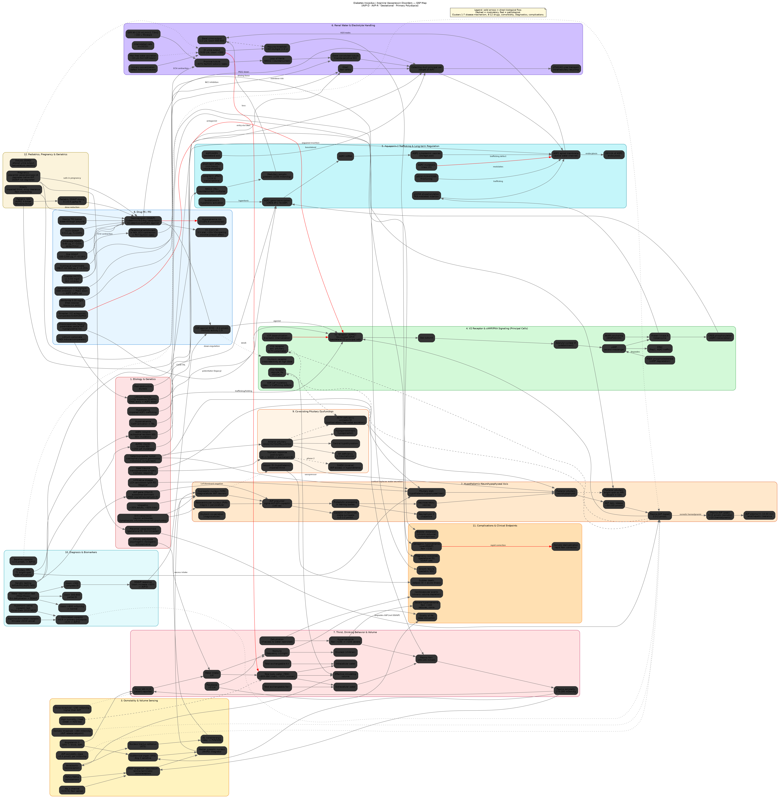</a> | 2022 국제 작업반 명명개정으로 **AVP-D**(중추, AVP 결핍)·**AVP-R**(신성, AVP 저항) 통합. *AVP* (20p13, autosomal dominant FNDI 신호펩티드·NPII 절단 결함)·*AVPR2* (Xq28, 250+ LoF 분류 I-V trafficking/folding 결손)·*AQP2* (12q13, autosomal rec/dom 40+ 변이) 유전성 + 자가면역 림프구성 누두-신경하수체염(항-AVP-신경 항체)·두개인두종/생식세포종/전이암·경접형동 수술·외상성 뇌손상·LCH·sarcoidosis·IgG4 침윤·lithium >10y(ENaC 진입→AQP2 transcription 억제·PGE2 변동·Kortenoeven 2012)·고칼슘혈증 CaSR TAL·저칼륨혈증·post-obstructive·임신 3분기 **placental vasopressinase x4** (DDAVP은 분해 회피) → SON/PVN magnocellular neuron AVP 합성/분비 또는 V2R/AQP2 표적 손실. **삼투-AVP 축**(Robertson 1976): plasma osm 280 mOsm/kg 역치 위 ΔAVP ≈ 0.4 pmol/L per mOsm/kg, 갈증역치 ~290 mOsm/kg, OVLT/SFO/MnPO Na_x·TRPV1/4 통합·압력반사 NTS→A1 noradrenergic→PVN·SON 보조. **V2R(AVPR2)** Gs→adenylyl cyclase VI→cAMP→PKA→CREB→AQP2 전사 + pS256 인산화→cytoplasmic 소포→**apical 막 trafficking** (단기 분 단위) + TonEBP/NFAT5 매개 hypertonic 장기 조절; pS261/264/269 fine-tuning·K63 ubiquitination 내재화; AQP3/4 basolateral exit. **약물 PK/PD**: **Desmopressin (DDAVP)** V2 선택적 합성 길항제 V1a 분리 ~12x molar 효능, SC 0.5-4 µg F=100%·**IN 10 µg F~4%·PO 100-1200 µg F~0.16%·sublingual MELT 60-360 µg F~0.25%** (Vavra 1968 Lancet·Lottermoser 1997·Steiner 2007·Fjellestad-Paulsen 1993), t½ 2-4h SC, 2-cpt CL 7.6 L/h·V1 12 L; **Thiazide HCTZ 25 mg/d** NCC 억제 → ECV 수축 → PCT Na/H2O reabs ↑ (역설적 항이뇨, Earley 1962·Magaldi 2000); **Amiloride 10 mg/d** ENaC 차단으로 Li+ 진입 차단, NDI 예방/치료 (Batlle 1985 NEJM); **Indomethacin 50 mg q8h** COX→PGE2↓→AQP2 traffic↑; **Tolvaptan 15 mg/d** V2R 길항 비교약 (SIADH/ADPKD); **Lithium carbonate** NDI 유도 모형. **진단**: Miller-Moses 수분제한 → Uosm·DDAVP 반응; **Christ-Crain 2019 NEJM** 고장성 식염수 자극 copeptin >4.9 pmol/L → primary polydipsia, <4.9 → AVP-D (감도 96%); **Winzeler 2019 Lancet·Refardt 2023 NEJM** arginine-stimulated copeptin (덜 침습); MRI 후엽 bright spot 소실·줄기 비대; AVP/AVPR2/AQP2 NGS. **임상시험 보정**: Verbalis 2003·Arima 2014 Endocr J ODT dose-titration·Behan 2015 EJE 장기 DDAVP Na+ 추적 (Na <130 발생 7-10%)·Bedford 2008 JASN amiloride lithium NDI·Achinger 2014 DDAVP-associated 뇌부종 사례. 무치료 CDI·DDAVP SC 2 µg BID·IN 10 µg BID·PO 200 µg TID·SL 120 µg TID·NDI+HCTZ·NDI+amiloride·NDI+indomethacin·tolvaptan SIADH 비교·primary polydipsia·gestational DDAVP·pediatric 0.3 µg/kg SC **12 시나리오**. **12 클러스터 140+ 노드 지도, 20 ODE 구획**(DDAVP SC/IN/PO/SL 4 + DDAVP 2-cpt PK + HCTZ/Amiloride/Indo/Tolvaptan/Li 5 × 2 + 내인 AVP + AQP2 mRNA + AQP2 apical + TBW + NA_BODY + NDI_Li + 누적 urine + hyponatremia hazard), **70편 문헌, 8탭 Shiny**(환자·질환 중증도·DDAVP PK·AQP2/V2R PD·전해질·소변/갈증·시나리오 비교·copeptin/안전).<br>[🗺️ 지도](diabetes-insipidus/di_qsp_model.svg) · [⚙️ mrgsolve](diabetes-insipidus/di_mrgsolve_model.R) · [📚 문헌](diabetes-insipidus/di_references.md) · [📄 README](diabetes-insipidus/README.md) |
| 226 | 근골격·신경근육 | [**가령성 근감소증 (Sarcopenia)**<br><sub>Age-Related Sarcopenia · EWGSOP2 / AWGS2019 / SDOC / FNIH · ALMI / Grip / Gait / SPPB · mTORC1-Akt-IGF1 · FoxO-UPS-Atrogin1/MuRF1 · Myostatin/Activin/ActRIIB-SMAD2/3 · Inflammaging IL-6/SOCS3 · Mitochondrial PGC-1α/Mitophagy · 위성세포 GDF-11 · NMJ Denervation · Bimagrumab (BMR-101) · Apitegromab (TOPAZ) · Testosterone · SARM · Vitamin D · HMB/EAA · Resistance Training</sub>](sarcopenia/) | <a href="sarcopenia/sarc_qsp_model.svg"></a> | EWGSOP2 정의: 저근육량(M ALMI<7.0·F<6.0 kg/m²) + 저근력(grip M<27·F<16 kg) → 확진, gait <0.8 m/s → 중증. 노화 → **inflammaging(IL-6/TNFα/CRP)·세포 노화 SASP·미토콘드리아 mtDNA 변이·호르몬 감소(T·IGF-1·GH·DHEA)·운동신경 손실·anabolic resistance·신체 비활동·단백질 영양 부족** 다축 구동. **MPS 경로**: Leu/EAA → Sestrin2/Ragulator·Rag GTPases → mTORC1 (S6K1·4E-BP1·eIF4F) → MPS; IGF-1/insulin → IR/IGF-1R → IRS-1 → PI3K → Akt → TSC1/2 ⊣ → Rheb-GTP → mTORC1. **MPB 경로**: Akt ⊣ FoxO1/3a → **Atrogin-1(MAFbx)/MuRF1** → K48-Ub → 26S 단백질분해 + Beclin-1/LC3-II/p62 자가포식 + calpain·caspase-3; AMPK → ULK1; REDD1 안정화. **Myostatin-Activin-ActRII 음성 조절**: promyostatin → 성숙 MSTN(furin/BMP1) · Activin A/B · GDF-11 → **ActRIIB(>A)** → ALK4/5 → SMAD2/3-SMAD4 → atrogene 전사·항반응성; follistatin/FSTL3 내인 길항. **염증노화**: IL-6 → JAK-STAT3 → SOCS3 ⊣ IRS-1 (anabolic resistance), TNFα → IκBα → NF-κB → atrogenes, IL-15 항-근감소 myokine. **미토콘드리아**: PGC-1α → NRF1/2 → TFAM → mtDNA, PINK1/Parkin mitophagy, SIRT1↔NAD⁺, NMN/NR. **위성세포**: Pax7⁺ → MyoD/Myf5 → myogenin → myotube; 노화 시 p16⁺ 세넨센스·Notch/Wnt 이상·**GDF-11** 상승. **NMJ**: α-MN 손실·agrin/MuSK/LRP4·denervation → Type IIX 우선 위축·재신경지배 후 fiber type grouping·myosteatosis(IMAT). **약물 PK/PD**: **Bimagrumab(BYM338)** 30 mg/kg IV q4w ActRIIA/B mAb (2-cpt, CL 0.005 L/h·V1 3 L·t½ ~21 d, BMR-101 Rooks 2017 J Frailty Aging: ALM +7.1% @24wk·gait +0.14 m/s; Heymsfield 2021 비만+T2DM 신체조성)·**Apitegromab(SRK-015)** 20 mg/kg IV q4w pro/latent-MSTN mAb (2-cpt, CL 0.0042 L/h·V1 3.5 L·t½ ~30 d, TOPAZ Day 2024 Lancet Neurol SMA HFMSE +5.3)·**Testosterone IM cypionate 100 mg/wk** (oil depot KA 0.012/h·V 30 L, Bhasin 1996 NEJM LBM +6.1% @10wk; T trials Snyder 2016)·**SARM** LGD-4033/enobosarm (Bhasin 2018·POWER 1/2)·**Vitamin D₃ 800-2000 IU/d → 25(OH)D** target >30 ng/mL (Bischoff-Ferrari 2009 BMJ fall RR 0.81)·**HMB/Leucine 3 g/d** (Cruz-Jentoft 2020)·**ω-3 PUFA 2-3 g/d** (Smith 2011 MPS↑)·**Creatine 3-5 g/d**·**Urolithin A** mitophagy enhancer (Singh 2022 Nat Metab)·**Anamorelin** ghrelin/GHS-R agonist (Temel 2016 ROMANA)·**저항운동 3회/wk** 70% 1RM (Peterson 2011 MSSE)·EAA 15-20 g/식사. **임상시험 보정**: Janssen 2000(-0.46%/yr ALM 자연사) · BMR-101 · TOPAZ · Bhasin 1996/2016 · Bischoff-Ferrari 2009 · Peterson 2011 · SPRINTT(Cesari 2017). 무치료·Bimagrumab·Apitegromab·Testosterone·Vit D+EAA+RT·Combo(Bima+RT) **6 시나리오**. **12 클러스터 130+ 노드 지도, 21 ODE 구획**(Bima/Apit/Test/VitD/Leu/Ana PK 12 + IGF-1·MSTN·IL-6·GDF-15 endocrine 4 + ALM·grip·gait·SPPB 4 + cum fall/frail 2), **72편 문헌, 8탭 Shiny**(환자·PK·anab/catab PD·근육 mass/기능·EWGSOP2 임상·시나리오·바이오마커·문헌).<br>[🗺️ 지도](sarcopenia/sarc_qsp_model.svg) · [⚙️ mrgsolve](sarcopenia/sarc_mrgsolve_model.R) · [📚 문헌](sarcopenia/sarc_references.md) · [📄 README](sarcopenia/README.md) |
| 227 | 신경유전·다장기 희귀 | [**결절성 경화증 (TSC)**<br><sub>Tuberous Sclerosis Complex · TSC1 (Hamartin, 9q34) / TSC2 (Tuberin, 16p13.3) · Two-hit LOH · Rheb-GTP → mTORC1 hyperactivation · SEGA · 피질 결절 · 영아연축/난치성 뇌전증 · TAND · 신장 AML · LAM · 얼굴 혈관섬유종 · 심장 횡문근종 · Everolimus (RAD001) · Sirolimus · Topical sirolimus · Vigabatrin · Cannabidiol · EXIST-1/2/3 · MILES · GWPCARE6 · TOSCA</sub>](tuberous-sclerosis-complex/) | <a href="tuberous-sclerosis-complex/tsc_qsp_model.svg">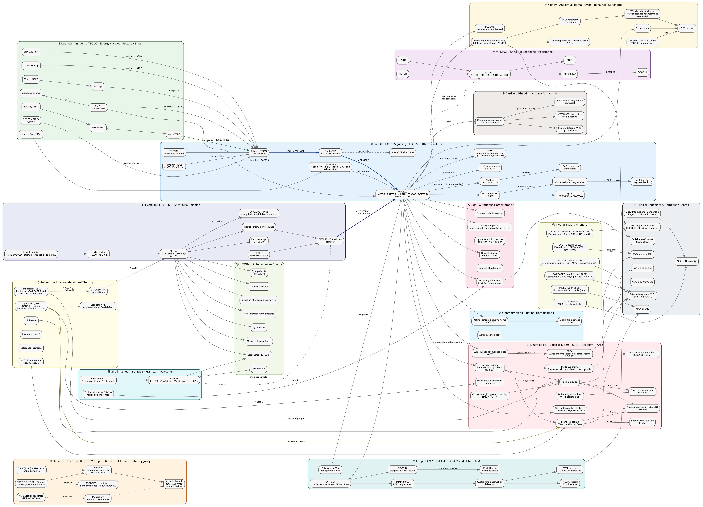</a> | 상염색체 우성 신경피부 종양억제 증후군: **TSC1 (9q34, 31%)·TSC2 (16p13.3, 69%, 더 중증)** germline LoF + 병변별 체세포 2nd-hit LOH → **Hamartin-Tuberin-TBC1D7** GAP 복합체 소실 → **Rheb-GTP↑** → **mTORC1 hyperactivation** (S6K1-pT389↑·rpS6↑·4E-BP1-phospho↑·eIF4E 방출, ULK1·TFEB 인산화 ⊣) → 다장기 hamartoma 형성. **신경계**(80–90% 피질 결절·>80% SEN·10–20% **SEGA**, 30% 영아연축·40–50% 자폐·~50% 지적장애·TAND 행동/정신/신경심리): SEGA → 폐쇄성 수두증, 결절 → 국소발작 → LGS-유사. **신장**(70–80% **AML** bilat. multifocal, 동맥류 →Wunderlich 출혈 위험 >4 cm, 낭종, TSC2/PKD1 contiguous → ADPKD-유사 ESRD). **폐**(30–40% 성인 여성 **TSC-LAM**: HMB-45⁺·ERα⁺ LAM cell · MMP-2/9 → cyst, VEGF-D >800 pg/mL). **피부**(75% 얼굴 angiofibroma·shagreen·ash-leaf·ungual fibroma·confetti). **심장**(>50% 태아기 횡문근종, WPW pre-excitation, 출생 후 자발 축소). **눈**(30–50% 망막 성상세포종). 상류 조절: PI3K-Akt-pT308 ⊣ Tuberin(S939·T1462), AMPK ⇧(에너지 부족), REDD1·GSK3β·ERK·Wnt 다입력. **mTORC2-RICTOR** S6K1-IRS1 음성 피드백 → Akt-S473 rebound (장기 mTORi 내성). **약물 PK/PD**: ① **Everolimus (RAD001) 4.5 mg/m² PO QD** trough 5–15 ng/mL (Kovarik 2002 2-cpt: F=0.30·V1=110 L·CL=8.8 L/h·t½ ~28h·CYP3A4/P-gp), FKBP12·EVE Kd ~2 nM → mTORC1 allosteric ⊣; ② **Sirolimus 2 mg PO QD** trough 6–14 ng/mL (2-cpt F~15%·CL=8.7 L/h·V=12 L/kg·t½ ~62h, MacDonald 2000); ③ **Topical sirolimus 0.1–1% QD** 얼굴 혈관섬유종 (Wataya-Kaneda 2017 JAMA Dermatol·Koenig 2018, 6mo FASI 40–60%↓); ④ **Vigabatrin (VGB) 100 mg/kg/d** GABA-T ⊣ → GABA↑, 영아연축 60–80% 해소 (Capal 2021 consensus); ⑤ **Cannabidiol 25/50 mg/kg/d** Epidiolex (Thiele JAMA Neurol 2021 **GWPCARE6**: 48%/47% 발작↓·CYP3A4 ⊣ → EVE AUC ↑50% Crockett 2020 DDI 모델링); ⑥ **ACTH/Prednisolone** 영아연축 구제; ⑦ **Clobazam** 보조. **임상 보정**: **EXIST-1** (Franz NEJM 2013/Lancet 2013) SEGA ≥50%↓ 35%, **EXIST-2** (Bissler Lancet 2013/NDT 2019) AML ≥50%↓ 42% @12mo, **EXIST-3** (French Lancet 2016) EVE 9 ng/mL → 발작↓40%·15 ng/mL → ↓39%, **MILES** (McCormack NEJM 2011) sirolimus → FEV1 안정화, **GWPCARE6** CBD 25 mg/kg/d → ↓48%, **TOSCA** 자연사 코호트. **이상반응**: 구내염 (40–60%)·이상지질혈증·고혈당·감염/단순포진·비감염성 폐렴·단백뇨·혈구감소·생리불순; VGB 말초시야결손·CBD 트랜스아미나제 상승. 무치료·EVE·SIR·VGB·CBD·EVE+VGB+CBD(난치 소아)·topical SIR·EVE+topical SIR **8개 시나리오**. **16 클러스터 130+ 노드 지도, 24 ODE 구획**(EVE/SIR/VGB/CBD/topical SIR PK 12 + mTORC1 활성 + SEGA·AML·skin·FEV1·GABA·발작/28d 6 + AE 누적 위험 5), **50편 문헌, 8탭 Shiny**(환자·PK·mTORC1 PD·병변 엔드포인트·뇌전증·시나리오·AE·문헌).<br>[🗺️ 지도](tuberous-sclerosis-complex/tsc_qsp_model.svg) · [⚙️ mrgsolve](tuberous-sclerosis-complex/tsc_mrgsolve_model.R) · [📚 문헌](tuberous-sclerosis-complex/tsc_references.md) · [📄 README](tuberous-sclerosis-complex/README.md) |
| 228 | 종양·내분비 | [**카르시노이드 증후군 (기능성 중장 NET)**<br><sub>Carcinoid Syndrome · Functional Midgut NET · Hepatic Metastasis · TPH1-AADC-5HT 합성 · VMAT1/Chromogranin-A · MAO-A → 5-HIAA · SSTR2/5 · 5-HT2B Valvulopathy · 5-HT3/4 Diarrhea · NK1/B2 Flushing · CHD (TR/PS) · Carcinoid Crisis · Octreotide LAR · Lanreotide autogel · Pasireotide LAR · Telotristat ethyl · ¹⁷⁷Lu-DOTATATE PRRT · Everolimus · Sunitinib/Surufatinib/Cabozantinib · IFN-α-2b · HAE/Y90 · PROMID/CLARINET/TELESTAR/NETTER-1/NETTER-2/RADIANT-4</sub>](carcinoid-syndrome/) | <a href="carcinoid-syndrome/carcsyn_qsp_model.svg">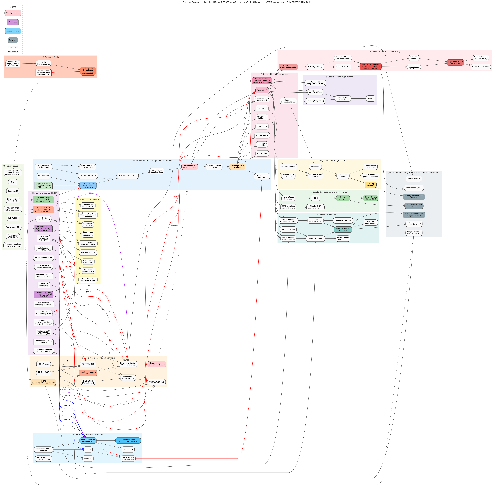</a> | 잘 분화된 회장·공장 기원 신경내분비종양(midgut NET, Ki-67 < 20%, WHO G1/G2)이 간 전이 시 portal-bypass로 시스템 순환에 5-HT를 방출 → **카르시노이드 증후군** 3대 증상: ① 안면·경부 **flushing**(NK1·B2-bradykinin·H1 → eNOS-NO·혈관확장, 5-HT2B 보조), ② **분비성 설사**(5-HT3·5-HT4 → CFTR Cl⁻/H₂O 분비·운동성↑), ③ **카르시노이드 심장병(CHD)**: 5-HT2B → TGF-β1/SMAD2/3·CTGF/Periostin → 우심계 판막 collagen plaque → **TR(tricuspid regurgitation)·pulmonic stenosis** → RHF·NT-proBNP↑(Hassan/Bhattacharyya score). 핵심 생화학: **Trp → TPH1**(BH4 의존 율속) → 5-HTP → **AADC** → 5-HT → VMAT1 → CgA granule → Ca²⁺-exocytosis → 혈장 5-HT(SERT → 혈소판 풀) → **MAO-A/ALDH** → **24-h urinary 5-HIAA**(진단 cut-off >52 µmol/24h); Trp 분기 60% 이상 시 niacin 결핍 → **pellagra**. 종양 드라이버: Ki-67·CDKN1B(p27) 소실·MEN1/menin·DAXX/ATRX(ALT)·PI3K/AKT/mTOR·VEGF-A 의존 혈관신생. **약물 PK/PD**: ① **Octreotide LAR 30 mg IM q28d** (Astrup 2002 3-cpt: KA~0.012/h·CL 10.5 L/h·V 21 L, Kd SSTR2 ~0.4 nmol/L, **PROMID** 2009 PFS HR 0.34; SSTR2 Gαi → ↓cAMP → ↓Ca²⁺ → ↓exocytosis); ② **Lanreotide autogel 120 mg SC q28d** (**CLARINET** Caplin 2014 PFS HR 0.47, Kd ~0.5 nmol/L); ③ **Pasireotide LAR 60 mg q28d** (pan-SSTR1/2/3/5, SSTR5-Hyperglycemia, refractory cases); ④ **Telotristat ethyl 250 mg t.i.d. PO** → 활성대사체 LP-778902(F=0.70, IC50 TPH1 ≈ 8 ng/mL, Hill 1.3, **TELESTAR** Kulke 2017 BM/day -29%·5-HIAA -78%, **TELECAST**); ⑤ **¹⁷⁷Lu-DOTATATE 7.4 GBq q8w × 4** (SSTR2-targeted β⁻ emitter, eff t½ ~17h, **NETTER-1** Strosberg 2017 PFS HR 0.21, **NETTER-2** Singh 2024 G2/3 1차 PFS HR 0.276); ⑥ **Everolimus 10 mg/d** (CL 18 L/h·V 195 L, mTORC1 IC50 ~12 ng/mL, **RADIANT-4** Yao 2016 PFS HR 0.48); ⑦ **VEGFR-TKI (sunitinib/surufatinib/cabozantinib)** lump (IC50 ~60 ng/mL); ⑧ **IFN-α-2b 5 MU SC TIW** (Faiss 2003 항증식·항혈관); ⑨ **간동맥 색전술/Y90/cytoreductive surgery** (Liver_load step); ⑩ **카르시노이드 위기 예방** 술전 octreotide 500 µg IV bolus(anesthesia/PRRT trigger 차단, Massimino 2013). 무치료 / 옥트레오LAR / 란레오 / 옥트레오+텔로트리스타트(TELESTAR) / 파시레오 / 에베로 / TKI / PRRT / IFN-α / HAE+SSA / 위기예방 / 4제 병용 **12 시나리오**. **14 클러스터 130 노드 지도, 27 ODE 구획**(약물 PK 14 + TUMOR + TPH1 + HTP·5-HT_T·5-HT_P·5-HT_PLT·HIAA_U + TGF-β·VALVE·NT-proBNP + BM·FLUSH), **72편 문헌, 8탭 Shiny**(환자/PK&SSTR/Trp-5HT-5HIAA/증상/종양/CHD/시나리오/바이오마커).<br>[🗺️ 지도](carcinoid-syndrome/carcsyn_qsp_model.svg) · [⚙️ mrgsolve](carcinoid-syndrome/carcsyn_mrgsolve_model.R) · [📚 문헌](carcinoid-syndrome/carcsyn_references.md) · [📄 README](carcinoid-syndrome/README.md) |
| 229 | 피부 | [**괴저성 농피증 (PG)**<br><sub>Pyoderma Gangrenosum · Neutrophilic Dermatosis · Pathergy · Sterile Ulcer · 위상자색 경계 · NLRP3/Pyrin Inflammasome · PSTPIP1 (PAPA/PASH) · IL-1β · IL-17A · IL-23 · TNF-α · IL-6 · NETosis · MMP-9 · Calprotectin · PARACELSUS Score · STOP-GAP · PROMID/PIONEER unrelated · Brooklyn Infliximab RCT · Adalimumab Japan RCT · Anakinra (Brenner 2009) · Ustekinumab · Cyclosporine · Prednisone · IBD/RA/MDS/MGUS 동반</sub>](pyoderma-gangrenosum/) | <a href="pyoderma-gangrenosum/pg_qsp_model.svg"></a> | 멸균성 호중구성 궤양성 피부질환(orphan, 발생률 3–10/백만/년, 5y 사망률 ~16%): 사소한 외상에도 자극되는 **pathergy**·**위상자색(violaceous) undermined edge**·통증·신속한 **무균 궤양** 확장이 특징. 자가염증 스펙트럼 내에 위치하며 IBD/RA/MDS-AML/단클론 IgA-MGUS 동반 빈도 높음. 유전·자가염증 형식: ***PSTPIP1*(15q24.3) gain-of-function** → 비정상 pyrin 응집 → **PAPA·PASH·PAPASH** 신드롬 (Wise 2002 Hum Mol Genet, Marzano 2017); *MEFV·NLRP3* 변이도 보고. 핵심 기전: ① **inflammasome 활성** (NLRP3 / Pyrin / AIM2 → Caspase-1 → IL-1β/IL-18 + Gasdermin-D pore → **pyroptosis**) → IL-1β/IL-1α 폭주 (Brenner 2009 Br J Dermatol PAPA anakinra 반응); ② **호중구 hyperactivation**: TNF-α·IL-17A·IL-1β → keratinocyte/내피세포 **IL-8/CXCL8·CXCL1/2·LTB4·C5a** → CXCR1/2 매개 침윤 → NOX2 ROS + **MPO·neutrophil elastase·cathepsin G·proteinase-3·α-defensin·LL-37** 분비 + **NETosis (PAD4 → citrullinated histone H3 → NET-DNA/MPO/NE)** → 자가-DAMP (HMGB1, S100A8/9 calprotectin) 증폭 루프; ③ **Th17/IL-23 축**: DC·M1 → IL-23 → JAK1-2/TYK2 → STAT3 → **RORγt** → Th17/Tc17 → IL-17A/F·IL-22·GM-CSF (Antiga 2017 Clin Exp Immunol, Croia 2021); Treg 감소; ④ **TNF-α 중심 cytokine network** → NF-κB feedforward + IL-6/STAT3 → **CRP·SAA·ferritin·fibrinogen·calprotectin**; ⑤ **IL-36γ 자가증폭**: keratinocyte·neutrophil → IL-36R → NF-κB → IL-8 (PG-PASH 교차); ⑥ 조직 파괴: **MMP-2/3/9/10 + elastase** → dermal matrix digestion → 진피 손상 + keratinocyte apoptosis → 멸균 궤양, **cribriform scar**; ⑦ 변종(ulcerative classic, bullous, pustular, vegetative, peristomal). **진단·점수**: Maverakis 2018 *JAMA Dermatol* Delphi consensus criteria (1 major + ≥4 minor); **PARACELSUS** Jockenhöfer 2019 Br J Dermatol (0–60). **약물 PK/PD**: ① **Prednisone 0.5–1 mg/kg/d → taper** (CL 90 L/d·V 35 L·t½ 3–4 h·F~1, GR → ↓NF-κB/AP-1, **STOP-GAP** Ormerod 2015 *BMJ* 50% 6mo healing); ② **Cyclosporine 4 mg/kg/d** (CL 27 L/d·V 85 L·F 0.30·t½ 8–27 h, calcineurin/NFAT → ↓Th17, STOP-GAP equivalent에 prednisone); ③ **Infliximab 5 mg/kg IV @0,2,6 wk → q8w** (CL 0.32 L/d·V₁ 3.5 L·t½ 9 d, anti-TNF, **Brooklyn 2006 *Gut*** PG에서 유일한 RCT: 6주 PGA 호전 46% vs 6%); ④ **Adalimumab 80→40 mg q1w** (F 0.64·t½ 14 d, Yamasaki 2022 *J Dermatol* 일본 phase 3 PGA 50%↓ 54%); ⑤ **Anakinra 100 mg/d SC** (rhIL-1Ra, F 0.95·t½ 0.3 d, Brenner 2009 PAPA); ⑥ **Canakinumab 150 mg q4-8w** (anti-IL-1β, Kolios 2015 *Br J Dermatol*); ⑦ **Ustekinumab 90 mg q12w** (anti-IL-12/23 p40, Goldminz 2012, Westerdahl 2022); ⑧ **Tofacitinib 5–10 mg BID** (JAK1/3, Orfaly 2021); ⑨ topical clobetasol·tacrolimus·dapsone/colchicine 보조; ⑩ IVIG/MMF/MTX. **임상시험·자연사 보정**: Brooklyn 2006 *Gut* (IFX RCT), Ormerod 2015 *BMJ* (STOP-GAP CsA vs PRED), Yamasaki 2022 (ADA Japan), Brenner 2009 (PAPA-ANA), Maverakis 2018 (Delphi), Jockenhöfer 2019 (PARACELSUS). 무치료·Prednisone SOC·Cyclosporine·Infliximab·Adalimumab·Anakinra·Ustekinumab·Combo PRED+CSA·Combo IFX+low CsA **9개 시나리오**. **10 클러스터 200+ 노드 지도, 30 ODE 구획**(ADA SC+2cpt + IFX 2cpt + ANA SC+1cpt + CsA gut+1cpt + UST SC+1cpt + PRED gut+1cpt PK 13 + 6 사이토카인 + 5 세포지수 + MMP9/ROS/Ulcer/Healed + CRP/Calprotectin + endpoint Pain VAS/PARACELSUS/DLQI), **40+편 문헌, 7탭 Shiny**(환자·PK·사이토카인·세포 염증·임상 endpoint·시나리오·virtual population).<br>[🗺️ 지도](pyoderma-gangrenosum/pg_qsp_model.svg) · [⚙️ mrgsolve](pyoderma-gangrenosum/pg_mrgsolve_model.R) · [📚 문헌](pyoderma-gangrenosum/pg_references.md) · [📄 README](pyoderma-gangrenosum/README.md) |
| 230 | 부인·생식 | [**자궁선근증 (ADENO)**<br><sub>Adenomyosis · Junctional Zone Hyperperistalsis · TIAR · Basalis Invagination · EMT · CYP19A1 Aromatase Local Excess · PGE2→cAMP→Aromatase Loop · ERα/ERβ · PR-A↓/PR-B Imbalance · NF-κB Co-repression · TGF-β/SMAD2/3 Fibrosis · HIF-1α/VEGF/NGF Neuroangiogenesis · OXTR Hyperperistalsis · PBAC HMB · IDA · MUSA · MRI JZ Thickness · Relugolix-CT (SPIRIT) · Elagolix (ELARIS) · Linzagolix (PRIMROSE) · Leuprolide Add-back (Pierce 1999) · Dienogest (KIM-ADENO Osuga 2017) · LNG-IUS 52 mg (Sheng 2009) · Letrozole (Kim 2013) · Mifepristone (Che 2023) · NSAID · Tranexamic acid · UAE · HIFU · Hysterectomy</sub>](adenomyosis/) | <a href="adenomyosis/adeno_qsp_model.svg"></a> | 자궁 내근(JZ) 영역에 자궁내막선·간질이 침입한 estrogen-dependent 만성 질환(가임기 여성 20–35%, peri-menopause 가장 호발): **JZ hyperperistalsis(>4 waves/min perimenstrual, Kunz 1996)** + **TIAR(Tissue Injury And Repair, Leyendecker 2009)** 반복 → 기저층 invagination + endometrial/bone-marrow 줄기세포 metaplasia + EMT(E-cad ↓ → N-cad/Vim/Snail↑) → 근층 내 lesion 형성 → 두께 **JZ >8 mm sub-clinical/>12 mm 진단**(MUSA Van den Bosch 2015·Bazot 2018), globular uterus, focal/cystic/polypoid 변종. 핵심 분자: **국소 aromatase(CYP19A1) 발현**(Yamamoto 1993·Bulun 2005·Kitawaki 1997) + **17β-HSD type 2 ↓** → 병소 내 E2 ↑↑·**ERβ >140-fold over-expression**(자가-증폭) → **PGE2 → cAMP → SF-1 → StAR/CYP19A1** positive feedback loop(Bukulmez 2008); progesterone resistance(**PR-A↓ / PR-B 비대칭 + NF-κB hyperactivation co-repression**·Mehasseb 2011); CD68+ M2 macrophage·IL-1β/6/8/TNF-α·**COX-2/PGE2/PGF2α 폭주**·heme/Fe²⁺ Fenton ROS·**TGF-β1/SMAD2/3/CTGF → 콜라겐 I/III 축적·periglandular fibrosis**·MMP-2/9; **HIF-1α → VEGF → 비정상 spiral arteriole**·**NGF/BDNF → TrkA·PIEZO2 DRG hypersensitization**(Anaf 2002·Mechsner 2010) → 척수 dorsal horn → ACC/insula 중추감작 → **dysmenorrhea VAS 7–10 + chronic pelvic pain + dyspareunia**; 확장된 endometrial surface + 비정상 angiogenesis + tPA/uPA·Plasmin → defective hemostasis → **HMB(PBAC >100)·IDA(Hb↓·ferritin↓)·QoL EHP-30↓**; HOXA10/LIF ↓ → implantation 실패·미숙아·**유산 OR ~2.1·태반조기박리 RR ↑**(Younes 2017·Vercellini 2014). **약물 PK/PD**: ① **GnRH 길항제 Relugolix 40 mg PO QD + E2 1 mg/NETA 0.5 mg add-back** (Markham 2019·F=11.6%·CL=9.4 L/h·Vd 3700 L·t½ ~25 h, **SPIRIT-1/2** Giudice 2022 *Lancet* dysmenorrhea ≥30% responder); ② **Elagolix 150/200 mg PO** ± add-back (Struthers 2009·Winzenborg 2018·CL=125 L/h·Vd 1900 L·F=50%, **ELARIS EM-I/II** Taylor 2017 *NEJM* 200 mg BID 75.3%/200 mg QD 46.4% DYS responder); ③ **Linzagolix 100/200 mg PO** (Donnez 2022 PRIMROSE UF); ④ **GnRH agonist Leuprolide 3.75 mg IM q4w** flare → desensitization, E2 <20 pg/mL by wk 4, BMD −3.5%/6mo → **Add-back E2/NETA**(Pierce 1999·Surrey 2002 60–80% BMD 보존); ⑤ **Dienogest 2 mg PO QD** selective PR-B(F=91%·CL=130 L/d·Vd=40 L, **KIM-ADENO Osuga 2017** *Fertil Steril* placebo-controlled RCT VAS 6.5→1.6/JZ 11→8 mm @24wk); ⑥ **LNG-IUS 52 mg intrauterine** 20 µg/d local + 10% systemic spillover (Sheng 2009 *Contraception* PBAC 270→55, Hb +1.8 g/dL @12mo, uterine vol −25–35%); ⑦ **Letrozole 2.5 mg PO QD** non-steroidal AI Ki ~12 nM (Sioufi 1997·Kim 2013 *Reprod Sci* VAS 8→2.5, uterine vol −60 mL @12 wk, Badawy 2012 AI vs GnRHa); ⑧ **Mifepristone 25–50 mg PO** SPRM/PR antagonist (Che 2023 *JAMA Netw Open* RCT VAS −5.0, HMB −80%); ⑨ **NSAID Ibuprofen 400-800 mg q6h** (Davies 1998 COX-1/2 ⊣ → PGE2/PGF2α ↓); ⑩ **TXA 1 g PO q6h × 5 d** menses-pulse anti-fibrinolytic (Lukes 2010·NICE NG88 PBAC −58%); ⑪ **UAE/HIFU/Endometrial ablation/Hysterectomy**. 무치료·NSAID+TXA·연속 COC·Dienogest·LNG-IUS·Leuprolide(±add-back)·Relugolix-CT·Elagolix 200 BID·Letrozole·UAE·Hysterectomy **10–11 시나리오**. **16 클러스터 150+ 노드 지도, 23 ODE 구획**(8 약물 PK 16 + HPO axis FSH/LH/E2/P4 4 + 국소 aromatase/PGE2/local-E2/TGF-β/fibrosis/VEGF/NGF 7 + JZ/PBAC/VAS/EHP-30/Hb/BMD 6), **80편 문헌, 8탭 Shiny**(환자·PK·HPO·lesion biology·pain·HMB·시나리오 비교·biomarker/safety).<br>[🗺️ 지도](adenomyosis/adeno_qsp_model.svg) · [⚙️ mrgsolve](adenomyosis/adeno_mrgsolve_model.R) · [📚 문헌](adenomyosis/adeno_references.md) · [📄 README](adenomyosis/README.md) |
| 231 | 신경·통증 | [**대상포진 후 신경통 (PHN)**<br><sub>Postherpetic Neuralgia · VZV Reactivation · DRG Ganglionitis · IENF Loss · NaV1.7/1.8/Cav α2δ-1 · TRPV1 Defunctionalization · KCC2/Microglial BDNF · NMDA Central Sensitization · NGF/TrkA · CMI ELISpot · QST DFNS · RZV Shingrix (ZOE-50/70) · Valaciclovir · Gabapentin · Pregabalin · Mirogabalin · Amitriptyline/Nortriptyline · Duloxetine · Lidocaine 5% Patch · Capsaicin 8% Patch (PACE/STRIDE) · Tramadol · NeuPSIG · NRS/Allodynia/PSQI/PGIC</sub>](postherpetic-neuralgia/) | <a href="postherpetic-neuralgia/phn_qsp_model.svg"></a> | 대상포진 후 dermatome 영역에 ≥90일 지속되는 만성 신경병증성 통증(NRS ≥ 3): 잠복 VZV의 DRG/뇌신경절 재활성화(ORF63·IE62) → ganglionitis·이차 Wallerian degeneration·**IENF density 50% 미만(PGP9.5 punch biopsy)**·Schwann 탈수초 → 말초 nociceptor (TRPV1·TRPA1·**NaV1.7/1.8/1.9**·HCN2·Cav α2δ-1·P2X3·ASIC3) hyperexcitability + NGF/TrkA upregulation → spinal dorsal horn lamina I/II/V LTP(wind-up·NMDA GluN2B·AMPA phospho·NK1·mGluR5) + **microglial P2X4-BDNF → KCC2 down-regulation → GABA/Glycine disinhibition** + astrocyte CXCL1/IL-6/D-serine + descending RVM ON-cell facilitation·LC noradrenergic 약화·thalamic VPL burst·S1 reorganization·ACC affective amplification → dynamic mechanical allodynia·punctate hyperalgesia·burning·paroxysmal electric pain·post-herpetic itch·수면/기분/QoL 손상. 위험인자: 연령 >60, 면역억제, 안면(ophthalmic) HZ, 심한 prodromal/급성 통증·>50 dermatomal lesions, 여성, DM, **immunosenescence(VZV-CMI ELISpot ↓)**. **약물 PK/PD**: ① **Pregabalin 75→150 mg BID** Cav α2δ-1 ligand (F=0.90·V=60 L·CL=7 L/h CrCl-scaled·Bockbrader 2010, Dworkin 2003 *Neurology* RCT NRS↓~50% in 50% responders); ② **Gabapentin 300→3600 mg/d** LAT1 saturable absorption(Stewart 1993·Vmax 230 mg/h·Km 110, F 35-60%, Rice 2001 *Pain*); ③ **Mirogabalin 5→15 mg BID** α2δ-1 선택적(Kato 2019 *Pain* phase 3); ④ **Amitriptyline 25→75 mg HS**(F=0.5·V=700 L·CL 50 L/h·CYP2D6→nortriptyline·NET/SERT·NaV blockade, Watson 1982 *Neurology* NNT~2.7); ⑤ **Duloxetine 30→60 mg QD** SNRI (CL 100 L/h·V=1620 L); ⑥ **Tramadol 200-400 mg/d** μ + SNRI (Boureau 2003 *Pain* NRS↓~30%); ⑦ **Lidocaine 5% 의료용 patch** 12-h on/off·로컬 NaV 차단·낮은 systemic Css (Galer 2002·Argoff 2000); ⑧ **Capsaicin 8% patch (NGX-4010)** 단회 60분 적용 → TRPV1 defunctionalization + IENF pruning · 12주 지속 NRS −30% (Backonja 2008 *Lancet Neurol* PACE·Webster 2017 STRIDE); ⑨ **Valaciclovir 1 g TID × 7 d** (F=0.55·VZV TK·DNA polymerase, Beutner 1995); ⑩ **RZV (Shingrix) 0+2~6 mo IM** gE+AS01B → CD4 Th1·CMI 회복, HZ 97% 효능 (50-69세)/91% (≥70세) ZOE-50 Lal 2015 *NEJM* · ZOE-70 Cunningham 2016 *NEJM* · 10년 PHN 88-91% Strezova 2022. **다중표적 emerging**: Tanezumab/Fasinumab (anti-NGF, 안전성 보류), VX-548 (selective NaV1.8 Hijma 2024 *NEJM*), vixotrigine NaV1.7, gefapixant P2X3, memantine NMDA, IV/topical ketamine, onabotulinumtoxin A (Apalla 2013), 8-kHz SCS/DRG-S(Liem 2013), pulsed RF (Wan 2016). **임상시험 보정**: Rowbotham 1998 JAMA(gabapentin) · Dworkin 2003 · Sabatowski 2004 · Watson 1982/1998 · Max 1988 · Raja 2002 · Boureau 2003 · Tyring 1995 · Backonja 2008 · STRIDE 2017 · NeuPSIG Finnerup 2015 *Lancet Neurol* · ZOE-50/70. 무치료·Valaciclovir(급성)·RZV 예방·Gabapentin·Pregabalin·Amitriptyline·Duloxetine·Lidocaine 5% patch·Capsaicin 8% patch·Combo(AV+RZV+PGB+Lido+AMI) **10개 시나리오**. **13 클러스터 170+ 노드 지도, 24 ODE 구획**(약물 PK 11 + VZV_LOAD·GANG_INJ·IENF·NAV_ACT·CSEN·MICROG·KCC2·NMDA_TONE·NGF·CMI 질환 10 + PAIN·ALLO·SLEEP·MOOD·AE_SED 임상 5 + 환자 covariate AGE/CRCL/CYP2D6/IS), **80편 문헌, 8탭 Shiny**(환자·PK·PD physiology·임상 endpoint·시나리오 비교·백신 예방·안전·QST/biomarker).<br>[🗺️ 지도](postherpetic-neuralgia/phn_qsp_model.svg) · [⚙️ mrgsolve](postherpetic-neuralgia/phn_mrgsolve_model.R) · [📚 문헌](postherpetic-neuralgia/phn_references.md) · [📄 README](postherpetic-neuralgia/README.md) |
| 232 | 소화기·면역 | [**미세 대장염 (MC)**<br><sub>Microscopic Colitis · Lymphocytic + Collagenous · CD8+ IEL >20/100 EC · 상피하 콜라겐대 >10 μm · NSAID/PPI/SSRI 트리거 · HLA-DQ2.5 셀리악 overlap · Th1/IFN-γ/IL-15 · TGF-β/MMP-9 collagen band · 담즙산 흡수장애(BAM)·SeHCAT · NHE3↓/NKCC1↑/CFTR Cl⁻ secretion · Hjortswang 임상관해 · Budesonide MMX 9 mg → 6 mg taper (BUC-60/BUC-63) · Cholestyramine (Ung 2000) · Mesalamine · Bismuth · Loperamide · Azathioprine 6-TGN · Infliximab · Adalimumab · Vedolizumab (VICTORIA-MC) · ECCO 2023</sub>](microscopic-colitis/) | <a href="microscopic-colitis/mc_qsp_model.svg">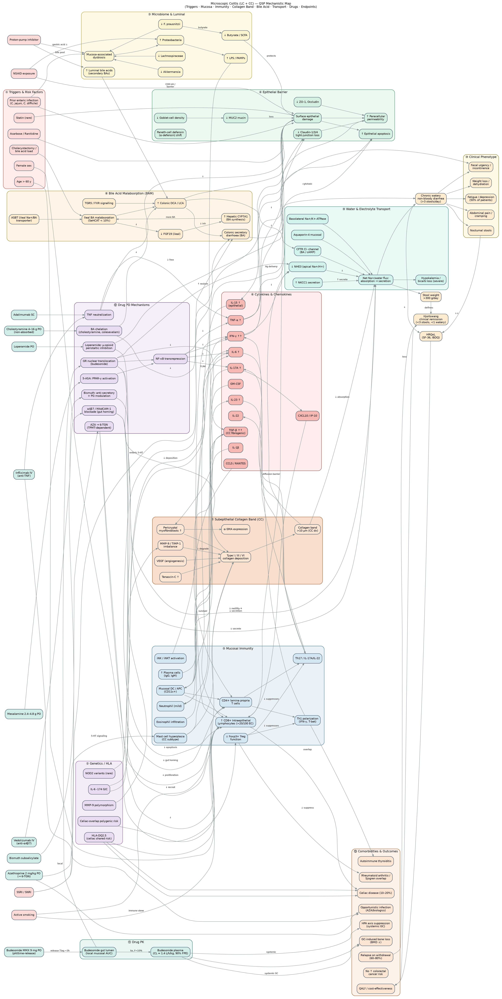</a> | 만성 또는 간헐적 **수양성 비혈변 설사**(>3회/일·>300 g/일·야간·urgency·체중감소)를 나타내고 대장내시경은 정상이나 조직검사에서 **림프구성(LC, CD8+ IEL ≥20/100 epithelial cells, T-bet/IFN-γ Th1 polarization)** 또는 **콜라겐성(CC, 상피하 colagen band ≥10 μm, 페리크립트 myofibroblast TGF-β1·MMP-9/TIMP-1 불균형·tenascin-C·collagen I/III/VI 침착)** 아형으로 진단되는 만성 염증성 장질환. 65세 이상 여성에서 가장 흔하며 만성 설사의 10–20%를 차지. **트리거 약물(case-control OR 2–7)**: NSAID(COX·점막 손상)·**PPI**(위산↓·담즙풀·미생물군 변동, Keszthelyi 2010)·**SSRI/SNRI**(점막 5-HT 신호)·statin·acarbose·ranitidine. 위험인자: 흡연·여성·고령·자가면역(celiac 10–20%, AIH·Sjögren·RA·thyroid)·Campylobacter/C.diff 감염 후(Verhaegh 2017)·cholecystectomy. **유전**: HLA-DQ2.5 셀리악 overlap signature(Stahl 2020 *Gastroenterology* GWAS), MMP-9·IL-6 다형성. **발병기전**: ① 점막 장벽 약화(claudin-1/3/4·ZO-1·occludin·MUC2·Paneth defensin 감소·apoptosis↑·permeability↑) → ② mucosal DC가 항원 제시 → CD4+ LP T cell Th1 폭주(T-bet·IFN-γ↑↑·IL-15 ↑) + Th17(IL-17A·IL-22·IL-23·IL-6) + ↓Foxp3 Treg → CD8+ IEL 생존/세포독성↑ → 상피 apoptosis(IFN-γ·TNF-α·IL-15) → claudin 분해 → 더 큰 permeability(자가증폭 루프); ③ **콜라겐성 아형**: 페리크립트 myofibroblast(α-SMA+) TGF-β/SMAD2/3·CTGF/VEGF → type I/III/VI collagen + tenascin-C 침착·MMP-9/TIMP-1 불균형 → **subepithelial collagen band >10 μm**(상피 diffusion barrier 형성 → 흡수 ↓ + 더 많은 분비 ↓); ④ **담즙산 흡수장애(BAM)**: 회장 ASBT 기능 저하·FGF19↓·CYP7A1↑ → 대장 BA 부하↑·secondary BA(DCA/LCA)↑ → CFTR Cl⁻/H₂O secretion·내피 손상·TGR5 활성화 → secretory diarrhea; SeHCAT <10% 진단. ⑤ **점막 수송 변화**: IFN-γ → **NHE3 ↓**(apical Na+/H+ 흡수), **NKCC1 ↑**(basolateral Cl⁻ uptake), CFTR/cAMP secretion, Na+/K+-ATPase·aquaporin-4 → 흡수→분비 phenotype 전환 → 순 수분흐름 −350 mL/d secretory(WAT 정상 +200 mL/d 흡수) → 배변 6–10회/일·urgency·incontinence·hypokalemia/bicarbonate loss. ⑥ **미생물군**: F. prausnitzii·Akkermansia·Lachnospiraceae 감소, Proteobacteria 증가 → SCFA(butyrate) 감소·LPS↑(TLR4 자극). 임상 엔드포인트: **Hjortswang criteria**(평균 <3 stools/d 및 <1 watery/d로 정의되는 clinical remission, Hjortswang 2009 IBD), 배변 횟수·체중·HRQoL(SF-36·IBDQ·EHP-5)·fatigue/우울증(50%)·BMD(스테로이드)·CRC 위험은 정상. **약물 PK/PD**: ① **Budesonide MMX 9 mg PO QD 8주 유도 → 6 mg taper 6개월** (Edsbäcker 2004 · Brunner 2006 pH/시간-방출, F=10% 90% 1st-pass, CL≈98 L/h, V 240 L, 2-cpt, 국소 GR 결합 Kd ~0.5 nM → NF-κB transrepression → ↓TNF-α/IFN-γ/IL-6/IL-17, 점막 GR EC50≈4 a.u.); 임상관해 80–90% 8주, 중단 후 60–80% 재발 → 저용량 유지 (**BUC-60** Miehlke 2009/**BUC-63** Münch 2016 6 mg q.o.d. 12mo PFS·**Bonderup 2003/2009**); ② **Cholestyramine 4 g TID**(루멘 음이온교환 → BA chelation, **Ung 2000 *Gut*** open-label BAM+ 환자 86% 응답); ③ **Mesalamine 2.4–4.8 g PO**(PPAR-γ·NF-κB 약 효과 Calabrese 2007 RCT 적당한 효능); ④ **Bismuth subsalicylate 524 mg QID**(Fine 1998 open 비흡수 항분비/항감염); ⑤ **Loperamide 4 mg BID prn**(μ-opioid·motility/secretion 대증); ⑥ **Azathioprine 2 mg/kg → 6-TGN**(TPMT 의존, EC50 250 pmol/8e8 RBC, 부데소니드 의존/불응, Pardi 2013); ⑦ **Infliximab 5 mg/kg q8w**(anti-TNF·IFX 2-cpt CL 0.32 L/d·V₁ 3 L·t½ 9 d, Esteve 2011 refractory case series); ⑧ **Adalimumab 80→40 mg SC q1-2w**(Pola 2013); ⑨ **Vedolizumab 300 mg IV q8w**(anti-α4β7 MAdCAM-1 차단·gut-selective·EC50 2 mg/L, **VICTORIA-MC** Münch 2018 · Riviere 2019 *J Crohns Colitis* refractory cohort 60% 관해); ⑩ 흡연 중단·트리거 약물 회피·EAA/단백 영양. **임상시험·자연사 보정**: BUC-60 (Miehlke 2009 LC), BUC-63 (Münch 2016 CC 12mo maintenance), Bonderup 2003/2009 (budesonide CC), Ung 2000 (cholestyramine), Calabrese 2007 (mesalamine±chol), Fine 1998 (bismuth), Esteve 2011·Pola 2013 (anti-TNF), Münch 2018·Riviere 2019 (vedolizumab), **ECCO position paper 2023** (Münch *J Crohns Colitis*), AGA 2016/2022 guidelines. 무치료·**Budesonide MMX 유도+taper(표준)**·Cholestyramine·Mesalamine·Bismuth·Loperamide(대증)·Azathioprine·Infliximab q8w·Vedolizumab q8w·**Budesonide+Cholestyramine 병용(BAM+CC)** **10개 시나리오**. **13 클러스터 130+ 노드 지도**(트리거·유전·미생물·장벽·점막면역·사이토카인·콜라겐대·BAM·전해질 수송·임상·약물 PK·PD·동반질환), **33 ODE 구획**(약물 PK 18 + CD8 IEL·IFN-γ·TNF·IL-6·IL-17·TGF-β·barrier·collagen band μm·BA load·net water flux·stool freq·Hjortswang·HRQoL·BMD·HPA 15), **81편 PubMed 문헌, 7탭 Shiny**(환자·PK·점막 면역·조직학·임상 endpoint·시나리오 비교·장기 BMD/HPA).<br>[🗺️ 지도](microscopic-colitis/mc_qsp_model.svg) · [⚙️ mrgsolve](microscopic-colitis/mc_mrgsolve_model.R) · [📚 문헌](microscopic-colitis/mc_references.md) · [📄 README](microscopic-colitis/README.md) |
| 233 | 소화기·중환자 | [**급성 췌장염 (AP)**<br><sub>Acute Pancreatitis · Atlanta 2012 (Mild · Moderate · Severe) · TIGAR-O (Gallstone · Alcohol · HTG · Post-ERCP · Drug · Trauma · Hypercalcemia · Genetic) · PRSS1/SPINK1/CTRC/CFTR/CASR/CLDN2 · Premature trypsinogen activation (cathepsin B) · Acinar Ca²⁺ overload (IP3R/ORAI1/SOCE) · MPTP · ROS · ER stress · Impaired autophagy · Zymogen-lysosome co-localization · PLA2/elastase auto-digestion · NF-κB/AP-1/JNK · NLRP3-caspase-1-GSDMD pyroptosis · TNF-α/IL-1β/IL-6/IL-8/PAF/HMGB1 · Neutrophil NETs · M1→M2 transition · Necroptosis (RIPK1/3/MLKL) · Ferroptosis · Fat necrosis · Capillary leak · Glycocalyx shedding · DIC · APFC/ANC/Pseudocyst/WON/Infected necrosis · Gut barrier loss · Bacterial translocation · LPS endotoxemia · Ileus · IAH · ACS · ARDS · AKI · Hepatic dysfunction · Encephalopathy · Distributive shock · SOFA · BISAP · APACHE-II · Ranson · CTSI · CARS · Post-AP DM · Exocrine insufficiency · Lactated Ringer's 5 mL/kg/h (WATERFALL) · Indomethacin 100 mg PR (ERCP-PEP Elmunzer 2012) · Octreotide 100 µg SC q8h · Gabexate 600 mg IV q6h · Nafamostat 1.67 mg/h IV · Ulinastatin 200 000 U IV q8h · Meropenem 1 g IV q8h (PROCAP) · Anakinra 100 mg SC q24h · Fentanyl PCA · Early enteral nutrition (PYTHON) · Step-up drainage (PANTER/TENSION)</sub>](acute-pancreatitis/) | <a href="acute-pancreatitis/ap_qsp_model.svg"></a> | 췌장 외분비 조직의 급성 염증성 질환으로 **혈청 lipase >3× ULN + 특징적 복통 + 영상 소견** 중 2가지로 진단(Atlanta 2012). 핵심 발병기전: ① **etiology insult**(담석 CBD 폐색 40-70% · 알코올 25-35% · TG >1000 mg/dL HTG 2-10% · post-ERCP 3-10% · 약물 AZA/GLP-1/DDI/valproate · 외상 · 고칼슘 · IPMN · PRSS1 R122H gain-of-function/SPINK1 N34S loss-of-function/CFTR/CTRC) → ② **acinar Ca²⁺ overload**(IP3R·RyR·STIM1/ORAI1 SOCE → cytosolic Ca²⁺ sustained plateau, SERCA 과부하) → 미토콘드리아 MPTP 개방·ΔΨm 붕괴·ATP 고갈·ROS 폭발·ER UPR 활성·LAMP-2 ↓ autophagy 차단·zymogen·lysosome co-localization → ③ **cathepsin B mediated 조기 trypsinogen→trypsin 활성화**(생리적으로 십이지장 enterokinase에서만 일어나야 하는 반응이 acinar 내부에서) → SPINK1/PSTI(trypsin inhibitor)·CTRC(degradation) 방어 시스템 압도 → trypsin auto-activation positive feedback → chymotrypsinogen·proelastase·**proPLA2(폐 surfactant 분해 → ARDS)**·procarboxypeptidase 활성화 → 췌장 자가소화 + PAR-2 signaling. ④ **NF-κB/AP-1/JNK polysynaptic firing** → IL-1β·IL-6·IL-8·TNF-α·MCP-1·PAF·NLRP3 inflammasome → caspase-1 → gasdermin-D pore → **pyroptosis**; 동시에 RIPK1/3-MLKL necroptosis, GPX4-Fe²⁺-LPO ferroptosis, classical apoptosis · 응고괴사 mode가 중증도에 따라 결정 + lipase 매개 **peripancreatic fat necrosis(Ca-soap saponification → 저칼슘혈증)**. ⑤ **microcirculatory failure**: TNF/IL-1 → endothelial ICAM-1/VCAM-1·E-selectin·glycocalyx (syndecan-1) shedding·NO/iNOS·ET-1·thrombin/Factor V → 모세혈관 leak + 미세혈전·DIC·췌장 ischemia-reperfusion·3rd space sequestration 6-10 L/d. ⑥ **장벽 손실 → 박테리아 translocation**: ZO-1/claudin ↓·dysbiosis(Enterobacteriaceae ↑)·paralytic ileus·intra-abdominal hypertension(IAP >12)·**abdominal compartment syndrome(IAP >20 mmHg)** → LPS endotoxemia → TLR4 amplification → late infected pancreatic necrosis(가스 음영). ⑦ **SIRS → MODS**: PaO₂/FiO₂ <300(ARDS, PLA2 surfactant degradation), creatinine ↑(AKI 25-40%), bilirubin ↑(hepatic), GCS ↓, MAP <65(distributive shock), lactate ↑ → **SOFA score 0-24**. Atlanta 2012: mild(no OF) · moderately severe(transient OF ≤48h) · **severe(persistent OF >48h, 사망률 15-30%)**. **국소 합병증**: APFC(<4wk) → pseudocyst, ANC → walled-off necrosis(WON, >4wk), infected necrosis, 비/문맥혈전증, GDA/splenic pseudoaneurysm, colonic necrosis/fistula. **약물 PK/PD**: ① **Lactated Ringer's 5 mL/kg/h goal-directed**(volume expand·perfusion 회복·항염증 [Wu 2011]; **WATERFALL Trial** de-Madaria 2022 *NEJM*: aggressive 10 mL/kg/h vs moderate 5 mL/kg/h, 적극적 군이 fluid overload 20.5% vs 6.3% 더 많아 조기 중단 → **moderate 5 mL/kg/h가 표준**); ② **Indomethacin 100 mg PR ×1**(F=0.90·CL=5 L/h·V=60 L; **Elmunzer 2012 *NEJM* RCT**: 고위험 ERCP 직후 indomethacin이 post-ERCP pancreatitis 9.2% vs 16.9%, NNT 13); ③ **Octreotide 100 µg SC q8h**(SSTR2 agonist·F=1.0·CL=9 L/h·V=20 L·ka=1.4 /h, Uhl 1999 multicenter RCT 결과 혼합); ④ **Gabexate mesilate 2400 mg/d IV(600 mg q6h)**(serine protease 광범위 억제, Chen 2000 organ dysfunction 환자 SAP); ⑤ **Nafamostat 40 mg/d IV 연속**(CL=60 L/h·V=16 L, broad protease inhibitor·항염증, Yoshikawa 1996 celiac 동맥 주입); ⑥ **Ulinastatin 200 000 U IV q8h**(urinary trypsin inhibitor·다중 protease 차단, Tsujino 2005 ERCP-PEP); ⑦ **Meropenem 1 g IV q8h**(infected necrosis 만 적응, **PROCAP Dellinger 2007** *Ann Surg* placebo 대비 사망률 비열등→**routine 예방 antibiotics 금기**); ⑧ **Anakinra 100 mg SC q24h**(IL-1Ra·CL=0.4 L/h·V=17 L·F=0.95, **Akinosoglou 2024 *J Clin Med* RCT** severe AP organ failure duration ↓); ⑨ **Fentanyl PCA 50 µg q1h**(μ-OR analgesia·CL=50 L/h·V=250 L; morphine은 Oddi 괄약근 수축 우려로 회피 권장); ⑩ **Early enteral nutrition NJ tube within 24-72h**(**PYTHON Bakker 2014 *NEJM***: 24h vs 72h on-demand 동등, gut barrier 보호·BT 감소); ⑪ **Plasmapheresis/insulin 점적**(severe HTG-AP TG <1000 목표); ⑫ **Step-up drainage 전략**(PCD → endoscopic transgastric necrosectomy → open, **PANTER van Santvoort 2010 *NEJM* / TENSION van Brunschot 2018 *Lancet***). **임상시험 보정**: Atlanta 2012, WATERFALL 2022, Elmunzer 2012, PANTER 2010, TENSION 2018, PROCAP 2007, PYTHON 2014, Akinosoglou 2024, ACG 2013, AGA 2018, IAP/APA 2013, BISAP Wu 2008. 무치료 · LR 적극(10) · **LR 중도(5, 표준)** · Indomethacin(PEP) · Octreotide · Gabexate · Nafamostat · Ulinastatin · Meropenem(감염 괴사) · **Anakinra(severe AP)** **10개 시나리오**. **14 클러스터 151 노드 지도**(etiology·acinar injury·trypsin cascade·inflammation·innate immunity·death modes·vasculature·local complications·gut/BT·SIRS-MODS·pain·drugs·clinical endpoints·recovery), **25 disease + 11 PK = 36 ODE 구획**(trypsinogen·trypsin·PLA2·Ca²⁺·ROS·NF-κB·TNF·IL-1·IL-6·IL-8·CRP·neutrophils·necrosis·DAMP·permeability·gut·BT·PF·Cr·BIL·MAP·GCS·SOFA·VAS·mortality hazard + indomethacin/octreotide/gabexate/nafamostat/ulinastatin/meropenem/anakinra/fentanyl PK), **82편 PubMed 문헌, 8탭 Shiny**(환자 프로파일·PK·trypsin/cytokines·necrosis/DAMP·organ failure·severity/survival·시나리오 비교·biomarker heatmap).<br>[🗺️ 지도](acute-pancreatitis/ap_qsp_model.svg) · [⚙️ mrgsolve](acute-pancreatitis/ap_mrgsolve_model.R) · [📚 문헌](acute-pancreatitis/ap_references.md) · [📄 README](acute-pancreatitis/README.md) |

| 234 | 소화기·운동장애 | [**식도이완불능증 (Achalasia)**<br><sub>Primary Idiopathic Achalasia · Chicago Classification v4.0 (Type I classic · Type II pan-esophageal pressurization · Type III spastic) · HLA-DQA1*0103/DQB1*0603 · HSV-1/VZV myenteric ganglionitis hypothesis · CD8⁺ T-cell + anti-myenteric IgG · nNOS/VIP-ergic neuron loss · ICC depletion · NO-sGC-cGMP·VIP-cAMP-MLCP signaling deficit · Cav1.2 Ca²⁺ → MLCK · RhoA/ROCK Ca²⁺-sensitization · LES residual >35 mmHg · IRP > 15 mmHg · EndoFLIP distensibility · Timed Barium Esophagram (TBE) · Eckardt 0–12 (success ≤3) · Megaesophagus · 16-fold SCC risk · Aspiration pneumonia · Isosorbide dinitrate SL · Nifedipine SL · Sildenafil/Tadalafil PDE5⁻¹ · Botulinum toxin A 100 U intra-LES · Pneumatic dilation 30/35/40 mm · Heller myotomy + Dor · POEM (long myotomy for Type III) · Boeckxstaens 2011 NEJM · Werner 2019 NEJM · Ponds 2019 JAMA · Pasricha 1995 · Triadafilopoulos 1991 · Bortolotti 2000 · Yadlapati 2021 · ACG Vaezi 2020 · ISDE 2018</sub>](achalasia/) | <a href="achalasia/ach_qsp_model.svg">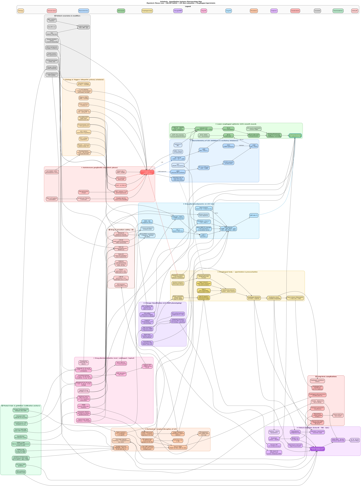</a> | 식도-위 접합부의 하부식도괄약근(LES) 이완 실패 + 식도체부의 무연동운동을 특징으로 하는 일차성 식도 운동장애. 발병기전: ① 유전적 소인 **HLA-DQA1*0103/DQB1*0603** + **HSV-1/VZV** 항원 분자 모방 hypothesis → **CD8⁺ T 세포·anti-myenteric IgG·Th17/IL-23·Treg dysfunction** 매개 myenteric (Auerbach's) plexus의 **억제성 nNOS/VIP 뉴런 선택적 손실** (Csendes 1992: ganglion density <5/cm², Gockel 2014 *Nat Genet* GWAS, Facco 2008 *AJG*); ② **신경화학적 결손**: nNOS↓·NO 확산↓·sGC·cGMP·PKG·MLCP 결손 + VIP/PACAP↓·VPAC1·AC·cAMP·PKA·MLCK↓ → MLCP/MLCK 균형 와해 + ACh/Substance P 흥분성 우위 + ICC(카할 간질세포) 손실로 slow-wave 실패 (Mearin 1993, Aggestrup 1983); ③ **LES smooth muscle**: Cav1.2 → Ca²⁺ influx → MLCK → MLC-phosphorylation → 지속적 LES 수축; RhoA/ROCK Ca²⁺-sensitization; K-ATP 휴지기 hyperpolarization 결손; **resting LES pressure 35–60 mmHg (정상 10–35)**; ④ **deglutitive inhibition 소실** → IRP > 15 mmHg (Chicago v4.0); ⑤ 식도 체부 aperistalsis로 **subtype 분류**(Pandolfino 2008 *GE*): Type I 100% failed contractions·낮은 pressurization; Type II ≥20% pan-esophageal pressurization (가장 좋은 치료 반응); Type III ≥20% premature/spastic contractions (가장 어려운 표현형); ⑥ 만성 stasis → 식도 확장 → sigmoid megaesophagus (Ø >6 cm) → 식도 SCC 16× ↑ (Sandler 1995 *JAMA*) · 흡인성 폐렴 · 영양실조 · 칸디다 식도염. 임상지표: **Eckardt 0–12 (Eckardt 1992 *GE*, success ≤3)** = dysphagia+regurgitation+chest pain+weight loss 각 0–3; **HRM IRP** 4초 nadir > 15 mmHg; **EndoFLIP distensibility** <2.8 mm²/mmHg; **TBE 1/2/5분 column height·width** (성공: 5분 emptying ≥50%); **GERD-HRQL·achalasia-specific QoL·SF-36**. 진단/감별: EGD birdbeak·잔여 음식·푸시로 통과·**pseudoachalasia 배제(악성·이차성)** (Gockel 2005); endemic 지역 **Chagas 메가식도** (T. cruzi) 배제. **약물 PK/PD**: ① **Isosorbide dinitrate 5 mg SL TID 식전**(F=1.0 SL·F=0.22 PO, ka 1.4/h, CL 90 L/h, t½ 1 h; ISMN 활성대사체 t½ 5 h; → exogenous NO donor → sGC → cGMP ↑ → LES tone −30% Gelfond 1982 *GE*; **headache 30–60%·tolerance**); ② **Nifedipine 10–20 mg SL 식전**(F=0.5·CL 30 L/h·t½ 2 h·CYP3A4·Cav1.2 차단 → Ca²⁺ influx ↓ → LES tone −25–30% Triadafilopoulos 1991 *DDS* crossover RCT vs verapamil vs placebo; pedal edema·flushing·postural hypotension); ③ **Sildenafil 50 mg TID**(F=0.41·CL 41 L/h·t½ 4 h·CYP3A4/2C9·PDE5 차단 → cGMP 보존 → LES tone −35% × 2 h Bortolotti 2000 *GE*·Eherer 2002 *Gut*); ④ **Tadalafil 20 mg QD**(F=0.36·CL 2.5 L/h·t½ 17 h·off-label, longer t½ advantage); ⑤ **Botulinum toxin A 100 U intra-LES** (4 quadrant × 25 U EGD-guided, local action·SNAP-25 cleavage → ACh exocytosis 차단 → LES tone −50%; **Pasricha 1995 *NEJM*** pilot; **Annese 2000 *Gut*** multicenter RCT; 1-mo 응답 ~70%, 6-mo ~32%, 1-y ~17%; mean re-dose q6–9 mo; chest pain·heartburn·드물게 mediastinitis); ⑥ **Pneumatic dilation 30→35→40 mm balloon graded** (Boeckxstaens 2011 *NEJM* **European Achalasia Trial** PD 86% vs LHM 90% 2 y success; Moonen 2016 *Gut* 5 y; **perforation 1–3%**·post-Tx GERD 25%); ⑦ **Laparoscopic Heller myotomy + Dor/Toupet fundoplication** (6 cm 식도 + 2 cm 위 근절개, **2 y success 90%·5 y 88%·GERD 15%·perforation 5–7%**); ⑧ **POEM peroral endoscopic myotomy** (submucosal tunnel + 8–12 cm myotomy, **Inoue 2010 *Endoscopy*** 시초; **Werner 2019 *NEJM*** POEM 83% vs LHM 81% 2 y non-inferior, **Ponds 2019 *JAMA*** POEM 92% vs PD 54% 2 y; **Type III spastic 우월 (긴 myotomy)** Khashab 2015; **post-Tx GERD 30–50% → PPI 평생**). 무치료·ISDN·Nifedipine·Sildenafil·Tadalafil·Botox·PD·LHM·POEM·ISDN+Sildenafil 병용 **10개 시나리오**. **14 클러스터 110+ 노드 지도**(etiology·autoimmune neuritis·neurochemistry·LES smooth muscle·esophageal body·Chicago HRM·drug PK·drug PD·procedures·clinical endpoints·complications·covariates·trials·safety), **23 ODE 구획**(약물 PK 10: ISDN/ISMN/Nifedipine/Sildenafil/Tadalafil/Botox-local + 질환·임상 11: LES_PRESS·IRP·esophageal Ø·stasis·peristaltic integrity·dysphagia·regurgitation·chest pain·weight loss·TBE·QoL + 안전 2: AE_HA·AE_HYPO), **82편 PubMed 문헌, 8탭 Shiny**(환자·PK·LES/IRP·임상 endpoint·시나리오 비교·procedure outcome·safety·calibration anchors).<br>[🗺️ 지도](achalasia/ach_qsp_model.svg) · [⚙️ mrgsolve](achalasia/ach_mrgsolve_model.R) · [📚 문헌](achalasia/ach_references.md) · [📄 README](achalasia/README.md) |
| 235 | 소화기·간담도/신장 | [**간신 증후군 (HRS)**<br><sub>Hepatorenal Syndrome · HRS-AKI / HRS-NAKI (ICA-2015/2019) · Decompensated cirrhosis · Portal hypertension (HVPG≥10-12) · Splanchnic vasodilation (eNOS/iNOS/NO/CO/PGI₂/glucagon/adenosine/endocannabinoid CB1) · Effective arterial blood volume ↓ · Peripheral arterial vasodilation hypothesis (Schrier 1988) · Baroreceptor unloading · RAAS activation (renin/AngII/aldosterone) · SNS activation (plasma NE) · Non-osmotic AVP release (V1a/V2/copeptin) · Cirrhotic cardiomyopathy · Renal afferent + efferent arteriolar constriction · Renal ET-1/TXA₂/adenosine A1 · Renal PGE₂ depletion · Bland urinary sediment · FeNa <1% · Urine Na <20 mEq/L · NGAL/KIM-1 (ATN differential) · Bacterial translocation · LPS/TLR4 · SIRS/ACLF (CANONIC, PREDICT) · CLIF-SOFA · Precipitants (SBP · GIB · LVP w/o albumin · NSAIDs · contrast) · Terlipressin V1a → lysyl-vasopressin (FDA 2022 CONFIRM) · Norepinephrine (Sharma 2008 · Duvoux 2002) · Midodrine + Octreotide + Albumin (Angeli 1999) · Albumin 25% oncotic + immunomodulation (ATTIRE · ANSWER · SBP Sort 1999) · Cefotaxime (SBP Rx) · Norfloxacin (SBP prophylaxis) · Rifaximin · TIPS bridge (Guevara 1998 · Brensing 2000) · CRRT/MARS · Liver transplantation ± SLK · Statin (LIVERHOPE)</sub>](hepatorenal-syndrome/) | <a href="hepatorenal-syndrome/hrs_qsp_model.svg"></a> | 진행된 간경변·문맥압 항진에서 발생하는 **기능적·잠재적 가역적** 급성 신손상 증후군. **ICA-2015/2019** 기준으로 **HRS-AKI**(sCr 48h 이내 ≥0.3 mg/dL ↑ or 7일 내 baseline의 1.5× ↑, 48h 알부민 1 g/kg challenge 후 미반응, 쇼크·신독성·구조적 신질환 배제) 및 **HRS-NAKI/HRS-AKD/HRS-CKD** 로 분류됨. 30-day mortality 40-90%, 미치료 시 median survival 2주에 불과. **핵심 병태생리**: ① **문맥압 항진(HVPG≥10-12 mmHg)** + 간내 저항 증가(HSC·eNOS↓·caveolin sequestration·ET-1↑) + 간내 혈관 수축 → ② **내장 혈관 확장**: 장내 세균 translocation·LPS-TLR4·TNF-α → **iNOS 유도** + eNOS 인산화 Ser1177 → NO↑↑ + HO-1/CO↑ + COX-2/PGI₂↑ + **hyperglucagonemia** + adenosine + endocannabinoid(CB1) → 내장 소동맥 확장·splanchnic vascular resistance ↓↓·splanchnic pooling ↑↑; ③ **유효 순환 혈액량(EABV) 감소**: peripheral arterial vasodilation hypothesis (Schrier 1988 *Hepatology*) → MAP ↓ (<80 mmHg) + baroreceptor unloading + central sympathetic outflow; ④ **cirrhotic cardiomyopathy** (Møller 2010 · Izzy 2020 redefinition): β-adrenergic downregulation·diastolic dysfunction·QT prolongation·chronotropic incompetence·NT-proBNP↑·hs-cTnT↑ → 스트레스 시 CO 부족 → HRS 유발; ⑤ **신경호르몬 폭풍**: RAAS (PRA 8× ↑·AngII·aldosterone 800 pg/mL) + SNS (plasma NE 800→1500 pg/mL) + **non-osmotic AVP** (V1a 혈관 수축·V2 free water 저류·copeptin↑) → hyponatremia (dilutional Na<130); ⑥ **신장 혈관 수축**: AngII + NE + AVP-V1a → afferent + efferent arteriolar constriction + **renal ET-1↑·TXA₂↑·adenosine A1↑·endocannabinoid CB1** + **PGE₂/PGI₂ 소실** → RBF ↓↓ (400 mL/min, 정상 1200)·cortical hypoperfusion → **GFR <30 mL/min** → sCr 상승·oliguria; ⑦ **감별진단**: NGAL/KIM-1/L-FABP↑ → ATN (구조적) 구분; bland sediment + FeNa <1% + urine Na <20 mEq/L + urine osmolality ↑ → HRS 지지; ⑧ **유발인자**: SBP (Ruiz-del-Arbol 2003 Hepatology 30% HRS 발생) · GI 출혈 · **LVP without albumin (PICD)** · NSAID (renal PG 억제) · aminoglycoside · contrast; **SIRS/ACLF**: CANONIC (Moreau 2013), PREDICT (Trebicka 2020), CLIF-SOFA·OF score. **약물 PK/PD**: ① **Terlipressin 1 mg IV bolus q6h → CI 2 mg/24h** (Krag 2008·Nazer 2007: 2-cpt PK, CL 3.6 L/h, V1 9 L, V2 22 L, Q 8 L/h; **비활성 prodrug → lysyl-vasopressin 활성 대사체** t½ 50-80 min, V1a agonism EC50 ~1.5 ng/mL, MAP +22 mmHg Emax; **CONFIRM Wong 2021 *NEJM*** verified reversal 32% vs 17% placebo·**REVERSE Boyer 2016 *Gastroenterology***·**OT-0401 Sanyal 2008 *Gastroenterology***·**CI vs bolus Cavallin 2016 *Hepatology*** less AE with CI; ADR: ischemia (digital·mesenteric·MI ~4%), **respiratory failure 10-14% especially ACLF grade 2-3** [BOX warning Wong 2022 *Aliment Pharmacol Ther*]); ② **Norepinephrine 0.5-3 mg/h CIV central line ICU** (t½ ~2 min, α1 vasoconstriction EMAX 25 mmHg, **Sharma 2008 *AJG*** noninferior to terli, **Singh 2012 *J Hepatol*** noninferior, **Duvoux 2002 *Hepatology*** 12/12 reversal); ③ **Midodrine 12.5 mg PO TID + Octreotide 200 µg SC TID + Albumin** (Angeli 1999 *Hepatology* 8/10 partial reversal, **Esrailian 2007 *Dig Dis Sci*** 40% survival vs 10% control; midodrine prodrug → desglymidodrine α1, F=93%, t½ 3 h; octreotide SSTR2 → glucagon/VIP suppression, CL 10 L/h, V 20 L, t½ 1.5 h; **Cavallin 2015 *Hepatology*** RCT terli+alb > mid+oct+alb 70% vs 29%); ④ **Albumin 25% 1 g/kg (D1) → 20-40 g/day** (oncotic expansion + toxin/cytokine/NO binding + endothelial stabilization + anti-inflammatory Fernández 2019 *Gastroenterology*; **ATTIRE China 2021 *NEJM*** targeted albumin no mortality benefit but preserved place in HRS bundle · **ANSWER Caraceni 2018 *Lancet*** long-term albumin ↑ survival in ascites · **Sort 1999 *NEJM*** albumin+cefotaxime in SBP ↓ HRS 33%→10%); ⑤ **Cefotaxime 2 g IV q8h** SBP treatment; **Norfloxacin 400 mg PO QD** SBP prophylaxis (Fernández 2007 *Gastroenterology*) ↓ HRS 41%→28%; ⑥ **Rifaximin 550 mg BID** (gut bacterial translocation, HE prevention); ⑦ **TIPS**: portal decompression·EABV ↑·RBF ↑ (Guevara 1998 *Hepatology*·Brensing 2000 *Gut*) but HE risk ↑; **preemptive TIPS in refractory bleeding** (Trebicka 2020); ⑧ **CRRT/MARS/Prometheus** bridge to LT (RELIEF Bañares 2013); ⑨ **Liver transplantation ± SLK** definitive cure (Nadim 2012 · Wong 2015 SLK criteria); ⑩ **Statin** endothelial protection (LIVERHOPE-SAFETY Pose 2020 *Lancet Gastro Hepatol*·simvastatin+rifaximin phase 2); **NSBB caution** in refractory ascites (Sersté 2010 · Mandorfer 2014 SBP window). 무치료·Terli bolus+Alb·Terli CI+Alb·NE+Alb·Mid+Oct+Alb·Alb only·SBP triggered+Terli·LVP w/o Alb PICD·NSAID trigger·TIPS surrogate **10개 시나리오**. **15 클러스터 148 노드 지도**(cirrhosis-portal HTN·systemic inflammation gut-liver·splanchnic vasodilation·EABV hemodynamics·cirrhotic cardiomyopathy·neurohormonal RAAS-SNS-AVP·renal microcirculation·tubular biomarkers·ICA diagnostic framework·vasoconstrictors·albumin·prevention·procedures·outcomes·special populations), **26 ODE 구획**(약물 PK 10: terlipressin/lysyl-VP/NE/midodrine/desglymid/octreotide/albumin/albumin exogenous + 신경호르몬 4: PRA/aldo/NE_endo/AVP + 혈역학 4: MAP/SVR/RBF/CO + 신장·임상 6: GFR/sCr/UNa/UOUT/serum Na/inflammation + 결과 3: 30-day hazard/Ischemic AUC/bilirubin), **82편 PubMed 문헌, 8탭 Shiny**(환자 프로파일·PK·neurohormonal·renal & urinary·clinical endpoints reversal·시나리오 비교·safety ischemic·references).<br>[🗺️ 지도](hepatorenal-syndrome/hrs_qsp_model.svg) · [⚙️ mrgsolve](hepatorenal-syndrome/hrs_mrgsolve_model.R) · [📚 문헌](hepatorenal-syndrome/hrs_references.md) · [📄 README](hepatorenal-syndrome/README.md) |
| 236 | 유전질환·골격이형성 | [**연골무형성증 (ACH)**<br><sub>Achondroplasia · FGFR3 4p16.3 G380R (~97%, transmembrane gain-of-function) · Autosomal dominant, ~80% de novo (paternal age) · Ligand-independent constitutive dimerization · RAS-RAF1-MEK-ERK/STAT1 hyperactivation · p21^CIP1/SOX9/RUNX2 growth-plate suppression · PTHrP-Ihh feedback disruption · CNP-NPR2(NPR-B)-particulate GC-cGMP-PKGII counter-axis · Rhizomelic shortening · Cranial-base synchondrosis premature fusion → Foramen magnum stenosis/cervicomedullary compression/hydrocephalus · Short pedicles → Spinal stenosis/thoracolumbar kyphosis · Midface hypoplasia → Eustachian dysfunction/otitis media/OSA · Vosoritide (Voxzogo) SC QD (Savarirayan 2019 NEJM · 2020 Lancet ΔAGV +1.57 cm/yr) · TransCon CNP/navepegritide (YUVIWEL, FDA-approved Feb-2026, ApproaCH phase 3 +1.49 cm/yr) · Infigratinib PO QD FGFR1-3 TKI (BridgeBio PROPEL 2/3, NDA planned Q3-2026) · Growth hormone · Horton 1978 growth curves · AAP/European Achondroplasia Forum guidelines</sub>](achondroplasia/) | <a href="achondroplasia/acdp_qsp_model.svg"></a> | 소인성(disproportionate) 저신장의 가장 흔한 형태로, **FGFR3 유전자(4p16.3) 막관통 영역의 생식세포 획득형(gain-of-function) 돌연변이(G380R, 전체 환자의 ~97%)**에 의한 상염색체 우성 유전질환(약 80%는 부모 연령 증가와 연관된 de novo 돌연변이; 동형접합 ACH는 신생아기 치명적). **발병기전**: ① 돌연변이 FGFR3 수용체가 **리간드 비의존적으로 지속적으로 이중체화**되어 자가인산화가 과도하게 유지 → ② 하류의 **RAS-RAF1-MEK-ERK1/2(MAPK)** 및 **STAT1** 경로가 지속 과활성화(FGFR3는 정상적으로 성장판 연골세포 증식·분화의 음성 조절자이므로 이 과활성화가 성장 억제로 작용); STAT1 → p21^CIP1(CDKN1A) ↑ → 증식구역 연골세포 G0/G1 세포주기 정지, ERK → SOX9 ↑/RUNX2 억제 → 비대구역 분화 지연·콜라겐 유형 전환(Col2a1→Col10a1) 저하, PTHrP-Ihh 피드백 루프 붕괴로 증식주 구조 와해 → **성장판 높이 감소** → 장골 성장 저하. ③ 이를 생리적으로 상쇄하는 **CNP-NPR-B(NPR2)-particulate guanylyl cyclase-cGMP-PKGII** 신호축이 RAF1의 억제성 인산화(Ser259/365)를 통해 MAPK 신호를 감쇄시키며, 이 축이 **보소리타이드(vosoritide)**·**TransCon CNP(navepegritide)**의 분자 표적; **인피그라티닙(infigratinib)**은 FGFR3 키나아제 도메인을 직접 억제. ④ 성장판 성장 저하는 두개저 연골결합의 조기 융합 → **대후두공 협착·경수-연수 이행부 압박·수두증**, 척추경 단축 → **척추관 협착**(영유아기 흉요추부 후만증, 성인기 진행성 협착·신경성 파행), 중안면 저형성 → **유스타키오관 기능 이상(재발성 중이염, 전도성 청력손실)**·**아데노이드/편도 비대 동반 폐쇄성 수면무호흡증**, 근위지골 단축(rhizomelic shortening)·삼지창손·경골내반 등으로 이어짐. 가장 심각한 합병증은 영유아기 대후두공 협착에 의한 급사 위험과 성인기 진행성 척추관 협착; 성인 최종 신장 남성 약 131 cm·여성 약 124 cm(Horton 1978 성장곡선). 추적: AAP/유럽 ACH포럼 건강관리 지침, 연간 성장속도(AGV)·대후두공 면적(MRI)·척추관 Z-score. **약물 PK/PD**: ① **보소리타이드(Voxzogo) 15 µg/kg SC QD**(NPR-B agonist, CNP 유사체, t½ ~15-20분 초고속 클리어런스[NPR-C/neprilysin]; **Savarirayan 2019 NEJM**[PMID 31269546] 2상 용량탐색[2.5/7.5/15/30 µg/kg, 15 µg/kg에서 효능 정체]; **Savarirayan 2020 Lancet**[PMID 32891212] 3상 52주 위약대조 RCT: 위약 대비 **AGV +1.57 cm/yr** 우위, 2년 연장연구[PMID 34341520] 장기 안전성 확인; 주요 이상반응: 주사부위 반응, 구토, 일시적 저혈압); ② **TransCon CNP(navepegritide, YUVIWEL)** SC 주 1회 서방형 프로드럭 — 용량탐색 ACcomplisH 2상(PMID 37823031) → 확증적 **ApproaCH 3상**(topline 2024-09, ΔAGV +1.49 cm/yr) → **FDA 가속승인(2026-02)**, EMA 심사 진행 중(2026 Q4 예상); ③ **인피그라티닙(infigratinib, FGFR1-3 TKI)** PO QD 직접 키나아제 억제 — **PROPEL 2 2상**(NEJM 2025, PMID 39555818) 및 **PROPEL 3 3상**(NEJM 2026)에서 최고 수준 AGV·최초의 통계적으로 유의한 체형비율 개선 보고, 경미한 일시적 무증상 고인산혈증(~4%) 외 중대 이상반응/중단 없음, **NDA 2026년 3분기 제출 예정**(미승인 상태); ④ **성장호르몬**(과거 오프라벨, 효과 제한적). 무치료(자연경과)·보소리타이드 15/2.5/7.5/30 µg/kg·TransCon CNP·인피그라티닙·성장호르몬·보소리타이드+대후두공감압술 병용·보소리타이드 저순응도(60%) **10개 시나리오**. **15 클러스터 160 노드 지도**(유전·FGFR3 신호전달·성장판 생물학·CNP-NPR2 대항축·두개안면/두개저·척추·신경학적 합병증·이비인후과/호흡기·정형외과/사지·대사/전신 동반질환·약물 PK·PD·임상 endpoint·수술적 중재·안전성), **20 ODE 구획**(약물 PK 6: 보소리타이드/TransCon CNP/인피그라티닙 + 질환·PD·임상 14: pERK·cGMP·연골세포증식지수·누적신장·신장Z-score·대후두공면적·척추관Z-score·AHI·중이염·BMI-Z·MAP·HR·인산), **50편 PubMed 문헌, 8탭 Shiny**(환자/개요·PK·경로 PD·성장 endpoint·구조/바이오마커·시나리오 비교·안전성·참고문헌).<br>[🗺️ 지도](achondroplasia/acdp_qsp_model.svg) · [⚙️ mrgsolve](achondroplasia/acdp_mrgsolve_model.R) · [📚 문헌](achondroplasia/acdp_references.md) · [📄 README](achondroplasia/README.md) |
| 237 | 혈액 | [**폰 빌레브란트병 (VWD)**<br><sub>Von Willebrand Disease · Type 1 partial quantitative deficiency(~75%) · Type 2A/2B/2M/2N qualitative defects · Type 3 severe total deficiency · VWF gene 12p13.31 · Weibel-Palade body biosynthesis/multimerization · ADAMTS13 A2-domain cleavage/HMWM regulation · GPIbα(A1)-collagen(A3) platelet adhesion · FVIII D'D3-domain stabilization · Type 2B/platelet-type GPIbα gain-of-function thrombocytopenia · ISTH-BAT · ASH/ISTH/NHF/WFH 2021 diagnosis(James/Connell)·management(Connell/Flood) guidelines · Desmopressin(DDAVP) V2-like WPB release/tachyphylaxis · Recombinant VWF(vonicog alfa/Vonvendi) · Plasma-derived VWF/FVIII concentrate(Humate-P/Wilate) · Tranexamic acid · Hormonal therapy(COC/LNG-IUS) · 후천성 폰빌레브란트증후군(대동맥판협착/Heyde증후군) · 임신 3분기 생리적 상승/분만후 급락</sub>](von-willebrand-disease/) | <a href="von-willebrand-disease/vwd_qsp_model.svg"></a> | 가장 흔한 유전성 출혈질환으로, **VWF 유전자(12p13.31)**의 정량적 결핍(Type 1 부분결핍 ~75%·Type 3 완전결핍) 또는 정성적 기능이상(Type 2A 멀티머화 결함·Type 2B GPIbα 기능획득·Type 2M 결합결함·Type 2N FVIII결합결함)에 의해 발생. **정상 생리**: 혈관내피세포(Weibel-Palade body)·거핵세포에서 pre-pro-VWF → ER 이중체화 → Golgi 멀티머화(furin이 propeptide/VWFpp 절단) → 초고분자량(ULVWF) 형태로 저장·분비되며, 전단력에 노출된 A2 도메인이 **ADAMTS13**에 의해 절단되어 고분자량멀티머(HMWM) 크기를 조절. VWF A3도메인은 노출된 콜라겐에 결합하고 A1도메인은 고전단 환경에서 혈소판 **GPIbα**에 결합하여 **1차 지혈**(혈소판 부착·응집)을 매개하며, D'D3도메인은 순환 **FVIII**을 비공유 결합·안정화(반감기 ~2h→~12h)시켜 **2차 지혈**을 뒷받침. Type 2B/혈소판형 위(pseudo)VWD는 GPIbα 결합친화도가 병적으로 증가하여 자발적 혈소판 응집·비장 제거로 **혈소판감소증**을 동반. **임상표현형**: 재발성 비출혈·치은출혈·쉬운 멍·**월경과다**·**위장관 출혈**(혈관형성이상, Type 2A/3/후천성에서 HMWM 소실과 연관)·수술/발치후 출혈·**산후출혈**; ISTH-BAT 출혈평가도구로 정량화. **진단**: VWF:Ag·VWF:RCo(리스토세틴 보인자활성/GPIbM)·VWF:CB(콜라겐결합)·FVIII:C·RCo/Ag 비율(<0.7 정성결함 시사)·멀티머 젤 전기영동·리스토세틴 유발 혈소판응집(RIPA)·VWFpp:Ag 비율; **ASH/ISTH/NHF/WFH 2021 진단**(James/Connell *Blood Adv*, PMID 33570651)**·치료**(Connell/Flood *Blood Adv*, PMID 33570647) **가이드라인**이 표준. **약물 PK/PD**: ① **데스모프레신(DDAVP)** IV/피하/비강 — V2유사 내피수용체를 통해 Weibel-Palade body에서 VWF·FVIII·VWFpp를 급성 방출(Federici 2004 *Blood* 다기관 반응률 연구; Type 2B/혈소판형은 혈소판감소증 악화로 **금기**); 반복투여 시 저장소 소진으로 **tachyphylaxis**(Mannucci 1997 *Blood*); 신장 V2수용체 매개 자유수분 재흡수로 **저나트륨혈증/경련** 위험; ② **재조합 VWF(vonicog alfa, Vonvendi)** — VWF 단독 제제로 반감기 ~21h(Mannucci 2013 *Blood*), FVIII 미포함으로 내인성 FVIII이 지연성(6-12h)으로 안정화·상승(Gill 2015 *Blood* 3상); ③ **혈장유래 VWF/FVIII 농축제제**(Humate-P·Wilate류) — FVIII 동시 함유로 **즉시** FVIII:C 상승, VWF:RCo 반감기 ~12-20h·FVIII:C 반감기 ~8-12h(Dobrkovska 1998 *Haemophilia*); 수술 전후 PK유도 트로프 목표치 투여; ④ **트라넥삼산**(Lukes 2010 *Obstet Gynecol* RCT)·**호르몬치료(COC/LNG-IUS)**로 월경과다 관리. **특수상황**: 임신 3분기 생리적 VWF/FVIII 상승 후 분만후 급락으로 **지연성 산후출혈** 위험(Type 1/3; Chee 2012 *Haemophilia*); 후천성 VWD는 대동맥판협착 등 전단력 이상(Heyde 증후군, Vincentelli 2003 *NEJM*)·림프증식성질환에서 HMWM 소실. 무치료·DDAVP IV단회·DDAVP 비강반복(tachyphylaxis 시연)·Type2B DDAVP(금기 예시)·재조합VWF·혈장유래농축제제·월경과다(TXA+호르몬)·후천성VWD DDAVP·임신 주산기·주요수술 PK유도농축제제 **10개 시나리오**. **12 클러스터 124 노드 지도**(유전/분류·생합성/멀티머화·ADAMTS13조절·혈소판부착·FVIII안정화·임상출혈표현형·진단바이오마커·DDAVP PK/PD·농축제제 PK/PD·보조치료·특수인구/조절인자·안전성), **21 ODE 구획**(약물 PK 6: DDAVP/재조합VWF/혈장유래농축제제/트라넥삼산 + 질환·PD·임상 15: WPB저장소·VWFpp·VWF:Ag·VWF:RCo·HMWM·ADAMTS13활성·FVIII:C·혈소판수·출혈점수·월경출혈량·위장관출혈량·헤모글로빈·혈청나트륨·혈전위험지수), **61편 PubMed 문헌(전건 검증), 8탭 Shiny**(환자/개요·PK·지혈바이오마커·임상 endpoint·시나리오 비교·진단바이오마커·안전성·참고문헌).<br>[🗺️ 지도](von-willebrand-disease/vwd_qsp_model.svg) · [⚙️ mrgsolve](von-willebrand-disease/vwd_mrgsolve_model.R) · [📚 문헌](von-willebrand-disease/vwd_references.md) · [📄 README](von-willebrand-disease/README.md) |
| 238 | 부인·생식/내분비 | [**폐경기 혈관운동증상 (VMS)**<br><sub>Vasomotor Symptoms of Menopause · Hot flushes & night sweats · STRAW+10 ovarian follicle depletion · Arcuate KNDy neuron(Kisspeptin/Neurokinin B/Dynorphin) hypertrophy · NKB-NK3R(TACR3) autoreceptor feed-forward · Median preoptic nucleus(MnPO) thermoneutral-zone narrowing · Fezolinetant(VEOZAH)·Elinzanetant NK1/3 antagonists · SKYLIGHT 1/2·OASIS 1/2/3 · Hormone therapy(WHI/PEPI) · SSRI/SNRI(paroxetine/venlafaxine)·gabapentin·clonidine·oxybutynin · Bone/lipid/GSM sequelae</sub>](vasomotor-symptoms-menopause/) | <a href="vasomotor-symptoms-menopause/vms_qsp_model.svg">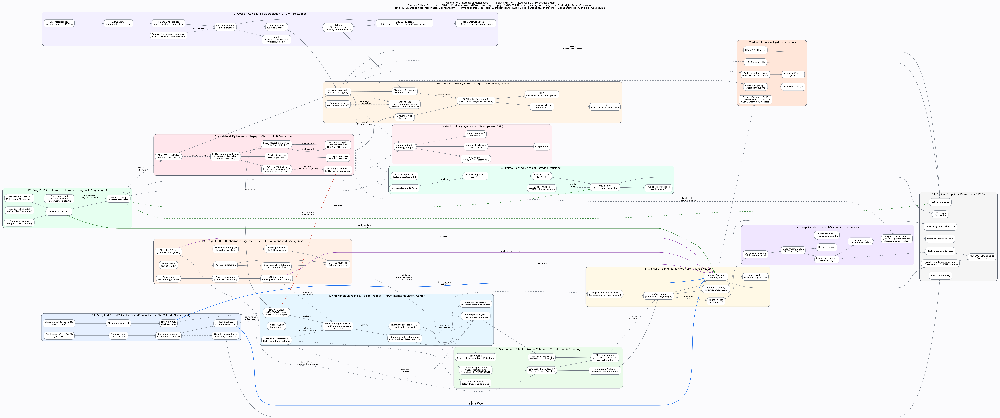</a> | 폐경 이행기 여성의 최대 80%에서 발생하며 평균 **7.4년** 지속되는(SWAN 연구) 혈관운동증상. **핵심 병태생리**: 난소 원시난포 풀의 비가역적 소진(STRAW+10 병기)으로 에스트라디올(E2)·인히빈B가 감소 → 시상하부-뇌하수체-난소축 음성 되먹임 상실 → 활꼴핵(arcuate/infundibular nucleus)의 **KNDy 신경세포**(kisspeptin·뉴로키닌B·다이노르핀 공발현)가 ERα 브레이크 소실로 **비대(hypertrophy)** → 뉴로키닌B(NKB)가 **NK3R(TACR3)** 자가수용체를 통한 정귀환 루프와 정중시삭전핵(MnPO) 체온조절중추의 NK3R을 활성화 → **열중성구간(thermoneutral zone) 협착** → 심부체온의 미세한 상승만으로도 피부혈관확장·발한이 유발되는 **hot flush** 발생 → 수면분절·기분장애·골손실(RANKL/OPG-CTX)·지질 악화(LDL↑)·생식기증후군(GSM)으로 이어짐. **약물 PK/PD**: ① **페졸리네탄트(fezolinetant, VEOZAH)** 45/30 mg PO QD — 선택적 NK3R 길항제, CYP1A2 대사(**SKYLIGHT 1/2** Lederman 2023 *Lancet*, PMID 36924778: 12주 HF빈도 -63~64%); ② **엘린자네탄트(elinzanetant)** 120 mg PO QD — NK1/NK3 이중 길항제(**OASIS 1/2** Pinkerton 2024 *JAMA*, PMID 39172446: -74~84%); ③ **경구/경피 에스트라디올·CEE±프로게스토겐**(HRT, 표준 치료·최고 효능, WHI/PEPI 근거); ④ **파록세틴 7.5 mg**(Brisdelle, Stearns 2003 *JAMA*)·**벤라팍신 ER 75 mg**(Loprinzi 2000 *Lancet*) 5-HT/NE 재흡수억제; ⑤ **가바펜틴 900 mg/day**(Guttuso 2003 *Obstet Gynecol*, 수면 개선 동반); ⑥ **클로니딘 0.1 mg**(α2작용제, 효과 미미); ⑦ **옥시부티닌**(항콜린제, 비호르몬 대안). 무치료·페졸리네탄트 45/30 mg·엘린자네탄트 120 mg·경구/경피 에스트라디올·파록세틴·벤라팍신·가바펜틴·클로니딘 **10개 시나리오**. **14 클러스터 102 노드 지도**(난소노화·HPG축·KNDy신경생물학·NKB-NK3R/체온조절중추·교감신경효과기·임상VMS표현형·수면-CNS/기분·골대사·심대사/지질·GSM·NK3R길항제 PK/PD·HRT PK/PD·비호르몬제제 PK/PD·임상 endpoint), **24 ODE 구획**(약물 PK 17: 페졸리네탄트/엘린자네탄트/경구·경피E2/파록세틴/벤라팍신+ODV/가바펜틴/클로니딘 + 질환·PD·임상 7: 난포풀/E2/FSH/KNDy tone/열중성구간/HF빈도·중증도/PSQI/기분/CTX/BMD/LDL), **77편 PubMed 문헌(주요 임상시험 PMID 검증), 8탭 Shiny**(환자 프로파일·PK·HPG/KNDy축·체온조절·hot flush endpoint·수면/기분·시나리오 비교·바이오마커/안전성).<br>[🗺️ 지도](vasomotor-symptoms-menopause/vms_qsp_model.svg) · [⚙️ mrgsolve](vasomotor-symptoms-menopause/vms_mrgsolve_model.R) · [📚 문헌](vasomotor-symptoms-menopause/vms_references.md) · [📄 README](vasomotor-symptoms-menopause/README.md) |
| 239 | 혈액 | [**혈우병 B (HB)**<br><sub>Hemophilia B · Christmas Disease · Factor IX deficiency · F9 gene Xq27.1 (missense/nonsense/large deletion) · Hemophilia B Leiden promoter variant · GGCX/VKORC1 vitamin-K-dependent γ-carboxylation · FIX-Padua (R338L) hyperfunctional variant (~8× activity) · Intrinsic tenase complex(FIXa-FVIIIa-Ca2+-PL) · Hemophilic arthropathy · SHL-rFIX(BeneFIX/Rixubis) · EHL-rFIX-Fc(Alprolix, B-LONG) · EHL-rFIX-albumin(Idelvion, PROLONG-9FP) · GlycoPEGylated rFIX(Refixia, pathfinder2) · Concizumab/Marstacimab anti-TFPI(BASIS) · Fitusiran anti-antithrombin siRNA(ATLAS) · AAV5 gene therapy etranacogene dezaparvovec(Hemgenix, HOPE-B) · AAV-Rh74var fidanacogene elaparvovec(Beqvez, BENEGENE-2) · Capsid immune response/transaminitis · Anti-FIX inhibitor · Nephrotic syndrome/anaphylaxis risk during ITI</sub>](hemophilia-b/) | <a href="hemophilia-b/hb_qsp_model.svg"></a> | 응고인자 IX(FIX) 결핍에 의한 X염색체 연관 열성 출혈질환으로, 혈우병 A보다 4-5배 드물다(남성 신생아 약 25,000-30,000명 중 1명). **핵심 병태생리**: ① **F9 유전자(Xq27.1)** missense/nonsense/large deletion 변이로 간세포 FIX 합성·분비 장애(**Hemophilia B Leiden** 프로모터 변이는 사춘기 이후 자연 호전); ② 비타민K 의존성 **GGCX/VKORC1** 경로로 FIX Gla 도메인이 감마-카르복실화되어야 인지질 표면 결합·응고활성이 가능(와파린이 이 경로 차단); ③ FIXa가 FVIIIa 보조인자·Ca2+·인지질 표면과 **내인성 텐아제 복합체**를 구성하지 못해 FX 활성화·트롬빈 생성 저하 → 자연 혈관절증 반복 → 비가역적 **혈우병성 관절병증**; ④ 중증 HB의 1-3%(HA보다 낮음)에서 항FIX IgG 억제항체 발생하나, null-mutation 유전형에서 위험이 높고 면역관용유도(ITI) 시 HB 특유의 **신증후군·아나필락시스** 위험이 있음; ⑤ 자연발생 초고활성 **FIX-Padua(R338L)** 변이(비교활성 ~8배)가 최신 AAV 유전자치료 트랜스진으로 활용됨. **약물 PK/PD**: ① **표준반감기(SHL) rFIX**(노나콕 알파/BeneFIX, Rixubis) IV, t½ ~18-24h, 회수율 ~1 IU/dL per IU/kg; ② **연장반감기(EHL) Fc융합**(에프트레노네콕 알파/Alprolix) t½ ~82h(**B-LONG** Powell 2013 *NEJM*); ③ **EHL 알부민융합**(알부트레페노네콕 알파/Idelvion) t½ ~102-104h(**PROLONG-9FP** Santagostino 2016 *Blood*); ④ **EHL 당페길화**(노나콕 베타 페골/Refixia) t½ ~93h(**pathfinder2** Collins 2014 *Blood*); ⑤ **콘시주맙·마스타시맙**(항TFPI 항체, 인자 비의존적 재균형, **BASIS** Pipe 2023 *NEJM*); ⑥ **피투시란**(항트롬빈 siRNA, **ATLAS-A/B·ATLAS-INH** Young 2023 *NEJM*); ⑦ **AAV5 유전자치료**(에트라나코진 데자파르보벡/Hemgenix, **HOPE-B** Pipe 2023 *NEJM*, FIX-Padua 트랜스진 지속 발현)·**AAV-Rh74var**(피다나코진 엘라파르보벡/Beqvez, **BENEGENE-2** Cuker 2024). 무치료·SHL-rFIX 2×/주·EHL-rFIX-Fc·EHL-rFIX-알부민·당페길화-rFIX·콘시주맙 매일·마스타시맙 주간·피투시란 월간·AAV유전자치료 1회·억제항체양성(ITI+우회인자) **10개 시나리오**. **13 클러스터 125 노드 지도**(F9유전자·간합성·비타민K회로·내인성경로/텐아제·공통경로/트롬빈생성·출혈표현형/관절병증·FIX대체PK(SHL/EHL)·비대체재균형·AAV유전자치료·억제항체면역·PD/검사바이오마커·임상엔드포인트/PRO·생애주기/특수집단·장기동반질환·보조지혈), **24 ODE 구획**(FIX SHL/EHL 4구획·AAV유전자치료 5구획[벡터·형질도입·캡시드항원·트랜스진발현·면역활성화/ALT]·콘시주맙/마스타시맙 4구획·피투시란/AT 4구획·억제항체·ETP·CumBleeds·관절점수·QoL·Synovitis), **71편 PubMed 문헌(검증), 8탭 Shiny**(환자프로파일·FIX PK·비대체재균형·유전자치료·PD핵심지표·출혈위험/관절병증·시나리오비교·억제항체/바이오마커).<br>[🗺️ 지도](hemophilia-b/hb_qsp_model.svg) · [⚙️ mrgsolve](hemophilia-b/hb_mrgsolve_model.R) · [📚 문헌](hemophilia-b/hb_references.md) · [📄 README](hemophilia-b/README.md) |
| 240 | 신장·대사 | [**X-연관 저인산혈증 (XLH)**<br><sub>X-Linked Hypophosphatemia · PHEX gene Xp22.11 loss-of-function (X-linked dominant, ~20-30% de novo) · ADHR(FGF23 GOF)/ARHR1(DMP1)/ARHR2(ENPP1)/TIO paraneoplastic spectrum · Osteocyte FGF23 overproduction (MEPE/ASARM) · FGF23-FGFR1c/αKlotho renal signaling · NPT2a(SLC34A1)/NPT2c(SLC34A3) internalization · TmP/GFR↓↓ · CYP27B1 suppression/CYP24A1 induction → inappropriately low 1,25(OH)2D · Secondary→tertiary hyperparathyroidism · Rickets(pediatric)/Osteomalacia(adult) · Genu varum/valgum · Enthesopathy/early OA · Spontaneous dental abscesses · Burosumab(Crysvita) anti-FGF23 mAb SC Q2W/Q4W(Carpenter 2018 NEJM·Imel 2019 Lancet CL303·Insogna 2018 JBMR AXLES1) · Conventional therapy(oral phosphate + calcitriol/alfacalcidol) · Nephrocalcinosis risk · Haffner 2019 Nat Rev Nephrol guideline</sub>](x-linked-hypophosphatemia/) | <a href="x-linked-hypophosphatemia/xlh_qsp_model.svg">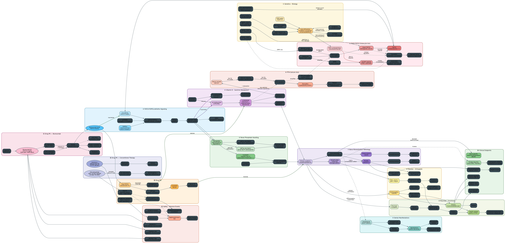</a> | 가장 흔한 유전성 구루병/골연화증으로, **PHEX 유전자(Xp22.11)**의 기능소실 돌연변이에 의한 X-연관 우성 유전질환(약 20-30%는 de novo; ADHR은 FGF23 자체의 기능획득 변이, ARHR1/2는 각각 DMP1·ENPP1 기능소실, TIO는 중간엽 종양의 이상성 FGF23 분비로 유사 표현형을 유발). **핵심 병태생리**: ① PHEX 단백은 정상적으로 골세포(osteocyte)의 MEPE/ASARM 펩타이드 및 FGF23 생성·분해를 조절하는데, 기능이 소실되면 골세포에서 **FGF23이 과도하게 분비**됨; ② 순환 FGF23이 신장 근위세관의 **FGFR1c-αKlotho** 수용체 복합체에 결합 → FRS2-RAS-RAF-MEK-ERK 신호 → 세관 관공막의 **NPT2a(SLC34A1)/NPT2c(SLC34A3)** 나트륨-인산 공동수송체가 **세포내섭취·분해**되어 **TmP/GFR(신세관 인산재흡수 최대치)이 급격히 저하** → 요인산 배출 과다; ③ 동시에 FGF23이 **1α-hydroxylase(CYP27B1)를 억제**하고 **24-hydroxylase(CYP24A1)를 유도**하여 만성 저인산혈증에도 불구하고 **1,25(OH)2D(칼시트리올)가 부적절하게 낮거나 정상**으로 유지되어 장내 칼슘·인 흡수가 저하됨; ④ 만성 전신 저인산혈증으로 골/성장판의 **유골(osteoid) 미네랄화 결손** → 소아 **구루병**(성장판 확장·하지 변형·성장지연)·성인 **골연화증**(가골절·불충분골절)·두개골조기유합·Chiari I형 기형; ⑤ 하지 만곡(내반/외반), 건부착부 석회화(enthesopathy)·조기 골관절염·척추관 협착, 근위부 근력저하(myopathy)·보행이상; ⑥ 상아질/치수 미네랄화 결손으로 **자발성 치아농양**·치주질환; ⑦ 저칼슘 신호에 대한 이차성 부갑상선기능항진증이 장기화되면 삼차성으로 진행(부갑상선절제술 필요 가능). **약물 PK/PD**: ① **부로수맙(burosumab, Crysvita)** SC — 완전 인간화 항FGF23 IgG1 단클론항체로 순환 FGF23을 직접 중화하여 NPT2a/c 재흡수 및 내인성 칼시트리올 합성을 **동시에 복원**(소아 0.8-2.0 mg/kg 2주 1회, 성인 1.0 mg/kg 4주 1회; **Carpenter 2018 NEJM**[PMID 29791829] 소아 2상 용량탐색, **Imel 2019 Lancet**[PMID 31104833] CL303 3상 - 재래요법 대비 구루병중증도점수(RSS)·성장 우위, **Whyte 2019 Lancet Diabetes Endocrinol**[PMID 31104830] 1-4세 2상, **Insogna 2018 JBMR**[PMID 29947083] AXLES1 성인 3상 위약대조 - 6MWT/WOMAC 개선; 반감기 ~19일, 주요 이상반응: 주사부위반응·하지불안증후군); ② **재래요법(경구 인산염 + 활성비타민D/알파칼시돌)** — FGF23 축을 우회하여 기질을 직접 보충하나 **일시적 혈중 인 상승**에 불과하고 만성 사용 시 고칼슘뇨증·**신석회화증**(소아 20-80%·성인 33-72% 유병, **Imel 2024 JBMR**[PMID 39151033])·이차성/삼차성 부갑상선기능항진증 위험 수반. 무치료·재래요법(소아)·부로수맙 0.8/2.0 mg/kg 2주 1회(소아)·부로수맙 1.0 mg/kg 4주 1회(성인)·재래요법→부로수맙 전환·재래요법 순응도불량(GI 부작용)·부로수맙 과량투여(과교정)·재래요법 장기(삼차성HPT)·부로수맙 성인 저순응도 **10개 시나리오**. **15 클러스터 121 노드 지도**(유전·PHEX-FGF23골세포축·FGF23-FGFR1c/αKlotho신호·신장인산처리·비타민D대사·PTH-칼슘축·골미네랄화병리·골격/정형외과·치과·근육/기능·부로수맙PK·재래요법PK·PD·임상endpoint·안전성), **19 ODE 구획**(약물 PK 7: 부로수맙 3구획/경구인산염 2구획/경구칼시트리올 2구획 + 질환·PD·임상 12: NPT2활성·TmP-GFR·혈중인·칼시트리올·PTH·BSAP·RSS·신장Z-score·6MWT·WOMAC·요칼슘/크레아티닌·신석회화위험), **33편 PubMed 문헌, 8탭 Shiny**(환자/개요·PK·경로PD·임상endpoint·시나리오비교·바이오마커·안전성·참고문헌).<br>[🗺️ 지도](x-linked-hypophosphatemia/xlh_qsp_model.svg) · [⚙️ mrgsolve](x-linked-hypophosphatemia/xlh_mrgsolve_model.R) · [📚 문헌](x-linked-hypophosphatemia/xlh_references.md) · [📄 README](x-linked-hypophosphatemia/README.md) |
| 241 | 희귀 대사·리소좀저장 | [**뮤코다당증 제1형 (MPS I)**<br><sub>Mucopolysaccharidosis Type I · Hurler/Hurler-Scheie/Scheie syndrome · IDUA gene 4p16.3 loss-of-function (autosomal recessive) · alpha-L-iduronidase deficiency (<1% activity) · Dermatan sulfate/heparan sulfate lysosomal accumulation · Dysostosis multiplex · Cardiac valve thickening/cardiomyopathy · Upper-airway obstruction/OSA · Corneal clouding · Hepatosplenomegaly · CNS neurodegeneration (severe Hurler, blood-brain-barrier limited) · Laronidase(Aldurazyme) IV ERT 0.58 mg/kg weekly(Wraith 2004 J Pediatr·Kakkis 2001 NEJM) · Hematopoietic stem cell transplantation(HSCT) donor cross-correction + CNS microglial replacement(Peters 1998·Boelens 2013·Aldenhoven 2015 Blood) · Lentiviral HSC gene therapy OTL-203(Gentner 2021 NEJM) · Investigational AAV9 CNS gene therapy · Investigational genistein substrate-reduction therapy</sub>](mucopolysaccharidosis-type-1/) | <a href="mucopolysaccharidosis-type-1/mps1_qsp_model.svg">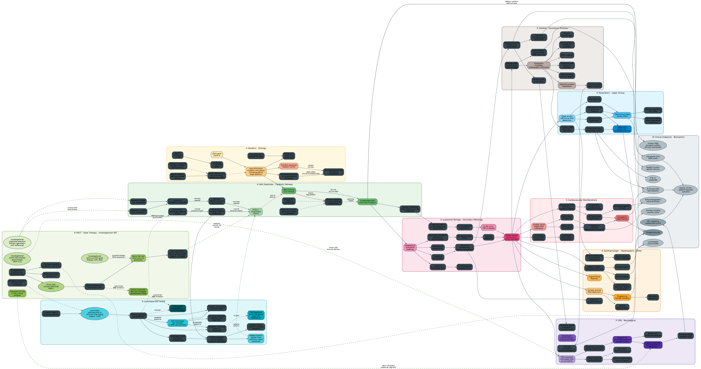</a> | 가장 흔한 리소좀 축적질환 중 하나로, **IDUA 유전자(4p16.3)**의 기능소실 돌연변이(상염색체 열성)에 의해 **알파-L-이두로니다아제** 활성이 1% 미만으로 저하되어 발생. **핵심 병태생리**: ① 리소좀 내 **더마탄황산·헤파란황산**의 단계적 분해가 차단되어 미분해 GAG 사슬이 축적 → 리소좀 팽창·자가포식 기능부전·이차성 강글리오시드 축적·TLR4-NF-κB 매개 염증 → 연골세포·섬유아세포 기능부전 및 세포외기질 재형성 이상으로 전신 조직 손상; ② 골격계: 성장판 GAG 축적으로 **골격이형성(dysostosis multiplex)**·척추후만증·무릎외반·관절구축·치아돌기형성부전(경추관협착)·성장정지; ③ 심혈관계: 판막 GAG 침윤에 의한 **판막비후·역류/협착**, 심근 침윤성 심근병증, 관상동맥 내막 협착; ④ 호흡기계: 편도/아데노이드 비대·기관지 협착·거대설로 인한 **폐쇄성 수면무호흡**과 흉곽변형에 의한 제한성 폐질환; ⑤ 안과/기타: 각막혼탁·간비장비대·청력손실; ⑥ 중증 헐러형에서는 혈액뇌장벽 뒤편 CNS GAG 축적으로 **진행성 신경퇴행**(발달지수 저하)이 발생하나 정맥주사 효소대체요법은 혈액뇌장벽을 통과하지 못함. **치료 PK/PD**: ① **라로니다아제(Aldurazyme)** IV 0.58 mg/kg 매주 — M6PR 매개 세포내섭취로 간·비장·심장 등 관류가 좋은 내장조직 효소활성을 회복시키나(**Wraith 2004 J Pediatr**[PMID 15126990] 26주 위약대조 3상 - uGAG·간용적·FVC·무호흡저호흡지수·어깨굴곡 개선, **Clarke 2009 Pediatrics**[PMID 19117887] 3.5년 연장, **Sifuentes 2007 Mol Genet Metab**[PMID 17011223] 6년 추적 - uGAG -76%), 연골·각막 등 무혈관 조직 투과는 제한적이고 혈액뇌장벽을 통과하지 못해 중증 헐러형의 신경퇴행은 막지 못함; ② **조혈모세포이식(HSCT)** — 공여자 유래 세포가 지속적으로 효소를 분비하는 교차보정(cross-correction)으로 내장조직을 정상화시킬 뿐 아니라, 공여자 유래 단핵구가 CNS 미세아교세포로 생착하여 **혈액뇌장벽을 우회한 신경퇴행 억제**가 가능한 유일한 검증된 치료(**Peters 1998 Blood**[PMID 9516162]·**Boelens 2013 Blood**[PMID 23493783]·**Aldenhoven 2015 Blood**[PMID 25624320] - 이식 시기가 이를수록(9-24개월 이전) 발달예후 우수); ③ 진단 시 라로니다아제로 가교치료 후 HSCT를 시행하는 것이 중증 헐러형의 표준치료(**Wynn 2009 J Pediatr**[PMID 19187736]·**de Ru 2011 Orphanet J Rare Dis**[PMID 21831279] 유럽 합의안); ④ 실험적 **렌티바이러스 조혈모세포 유전자치료(OTL-203)**(**Gentner 2021 NEJM**[PMID 34788506])·**AAV9 CNS 직접 유전자치료**·**제니스틴 기질감소요법**(Piotrowska 2006 Eur J Hum Genet). 무치료(중증)·라로니다아제 단독(경증형)·HSCT 조기이식(9개월)·HSCT 지연이식(30개월)·라로니다아제 가교+HSCT·고역가 항체 면역원성·저순응도·제니스틴 병용·AAV9 CNS유전자치료 병용·HSCT+장기저용량라로니다아제 **10개 시나리오**. **11 클러스터 133 노드 지도**(유전/IDUA·GAG분해경로·리소좀병리·골격·심혈관·호흡기·CNS/신경·안과/간비장/기타·라로니다아제PK/PD·HSCT/유전자치료·임상endpoint), **21 ODE 구획**(약물/중재 PK 8: 라로니다아제 혈장+조직축적·항체·제니스틴·HSCT생착·CNS효소접근·렌티바이러스유전자치료 + 질환·PD·임상 13: 전신/CNS/연골 GAG·uGAG·간비장용적·판막/좌심실질량·FVC·무호흡저호흡지수·관절가동범위·각막혼탁·발달지수·신장Z-score·사망위험), **30편 PubMed 문헌(검증), 8탭 Shiny**(환자/개요·PK·효소접근/GAG·임상endpoint·시나리오비교·바이오마커·안전성/생존·참고문헌).<br>[🗺️ 지도](mucopolysaccharidosis-type-1/mps1_qsp_model.svg) · [⚙️ mrgsolve](mucopolysaccharidosis-type-1/mps1_mrgsolve_model.R) · [📚 문헌](mucopolysaccharidosis-type-1/mps1_references.md) · [📄 README](mucopolysaccharidosis-type-1/README.md) |
| 242 | 종양 | [**급성 림프구성 백혈병 (ALL)**<br><sub>Acute Lymphoblastic Leukemia · B-ALL/T-ALL · BCR-ABL1(Ph+)/ETV6-RUNX1/KMT2A-r/Hyperdiploidy/Ph-like/NOTCH1 · Bone-marrow niche(CXCR4/VLA-4) chemoresistance · Glucocorticoid-receptor(NR3C1) apoptosis · Vincristine/Dexamethasone/PEG-asparaginase/HD-MTX+IT/6-MP(TPMT·NUDT15) · Dasatinib/Ponatinib(TKI, T315I) · Blinatumomab(CD19×CD3 BiTE, TOWER) · Inotuzumab ozogamicin(anti-CD22 ADC, INO-VATE) · CD19 CAR-T Tisagenlecleucel(ELIANA) · CRS/ICANS · Friberg myelosuppression · MRD/CR/relapse</sub>](acute-lymphoblastic-leukemia/) | <a href="acute-lymphoblastic-leukemia/all_qsp_model.svg">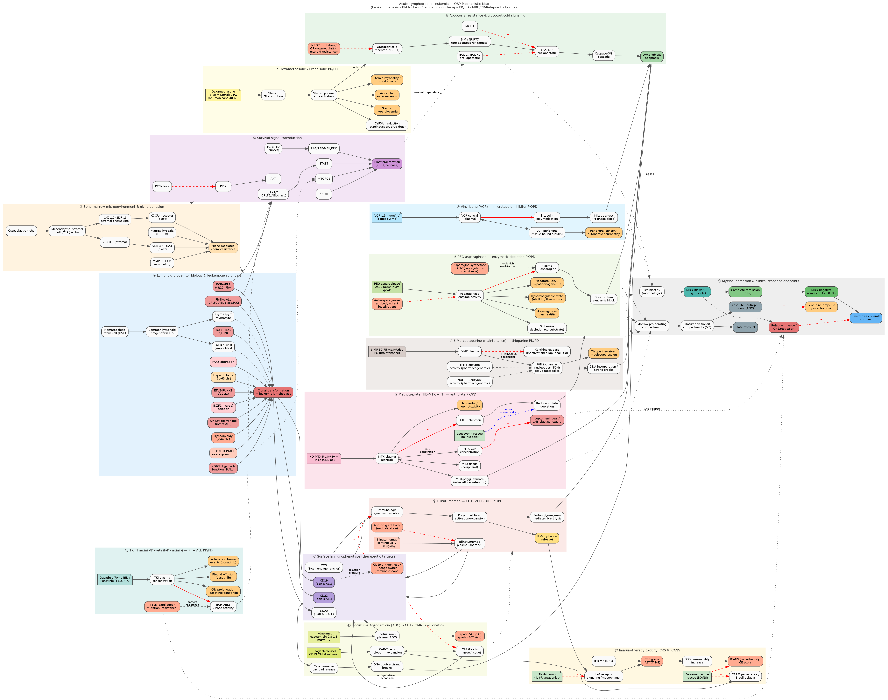</a> | 전구 B/T 림프구의 다단계 유전적 이상(BCR-ABL1, ETV6-RUNX1, KMT2A 재배열, 과이배수체, Ph-like, NOTCH1)에 의한 클론성 백혈병화로, 골수 미세환경(CXCL12/CXCR4·VCAM1/VLA-4) 의존적 화학저항성과 글루코코르티코이드 수용체 매개 아폽토시스 저항이 특징. **약물 PK/PD**: 빈크리스틴(미세소관 저해)·덱사메타손/프레드니손(GR 경로)·PEG-아스파라기나제(아스파라긴 고갈, ASNS 내성)·고용량 메토트렉세이트+척수강내주사(엽산대사/CNS sanctuary)·6-MP(TPMT/NUDT15 약물유전체)·다사티닙/포나티닙(Ph+ BCR-ABL1, T315I 내성)·블리나투모맙(CD19×CD3 BiTE, **TOWER** Topp 2017 NEJM)·이노투주맙 오조가마이신(항CD22 ADC, **INO-VATE** Kantarjian 2016 NEJM)·CD19 CAR-T 티사젠렉류셀(**ELIANA** Maude 2018 NEJM) — CRS/ICANS 사이토카인(IL-6) 및 Friberg 골수억제 포함. 무치료·소아 표준위험군 유도요법·소아 고위험군+HD-MTX 강화·성인 Ph음성(hyper-CVAD 유사)·Ph+ 다사티닙·Ph+(T315I) 포나티닙·재발불응 블리나투모맙·재발불응 이노투주맙·재발불응 CD19 CAR-T·유지요법(TPMT 대사자 비교) **10개 시나리오**. **15 클러스터 137 노드 지도**(백혈병유전학·골수미세환경·생존신호전달·아폽토시스/GR·면역표현형·9개 약물 PK/PD 클러스터·CRS/ICANS·골수억제/임상endpoint), **27 ODE 구획**(약물 PK 16 + CAR-T세포동역학/IL-6 3 + 백혈병모세포/MRD/CNS 3 + Friberg ANC/PLT 5), **40+편 PubMed 문헌, 8탭 Shiny**(환자프로파일·PK·질환생물학(모세포/MRD)·혈액독성·면역치료/CRS·임상endpoint·시나리오비교·바이오마커/안전성).<br>[🗺️ 지도](acute-lymphoblastic-leukemia/all_qsp_model.svg) · [⚙️ mrgsolve](acute-lymphoblastic-leukemia/all_mrgsolve_model.R) · [📚 문헌](acute-lymphoblastic-leukemia/all_references.md) · [📄 README](acute-lymphoblastic-leukemia/README.md) |
| 243 | 종양 | [**악성 흉막 중피종 (MPM)**<br><sub>Malignant Pleural Mesothelioma · Asbestos fiber exposure(crocidolite/amosite/chrysotile) · Frustrated phagocytosis/HMGB1-NLRP3 chronic inflammation · BAP1(3p21)/CDKN2A-p16-ARF(9p21)/NF2-Merlin(22q12)/TP53 tumor-suppressor loss · Hippo pathway-YAP/TAZ-TEAD oncogenic transcription · Epithelioid/sarcomatoid/biphasic histology · Mesothelin(MSLN) overexpression · Cisplatin+Pemetrexed(EMPHACIS)·Bevacizumab(MAPS) · Nivolumab+Ipilimumab(CheckMate 743)·Nivolumab(CONFIRM)·MAPS2 · Anetumab ravtansine anti-mesothelin ADC · Rucaparib BAP1-synthetic-lethal PARP inhibitor(MiST1) · Tumor-Treating Fields(STELLAR) · EPP/Pleurectomy-decortication(MARS/MARS2)·Talc pleurodesis</sub>](malignant-pleural-mesothelioma/) | <a href="malignant-pleural-mesothelioma/mpm_qsp_model.svg"></a> | 석면 섬유(청석면/아모사이트>백석면) 흡입으로 발생하는 20-50년 잠복기의 흉막 악성종양으로, 대식세포의 **불완전 포식(frustrated phagocytosis)**이 유발한 ROS/RNS·DNA손상과 괴사 중피세포의 **HMGB1** 방출→**NLRP3 인플라마좀**/TNF-α-NF-κB 생존신호가 손상세포의 아폽토시스를 역설적으로 구제하는 만성염증 "돌연변이 유발 시퀀스"를 거쳐 **BAP1(~60%)**·**CDKN2A/p16-ARF(~70-90%)**·**NF2/Merlin(~40-50%)** 종양억제유전자 소실(TP53 변이는 상대적으로 드묾)이 축적된다. NF2 소실은 **Hippo 경로**를 붕괴시켜 **YAP/TAZ-TEAD** 핵내 종양유전자 전사를 유도하며, BAP1 소실은 크로마틴 조절·상동재조합 DNA복구 결손(PARP억제제 합성치사 취약성)·바르부르크 대사전환을 초래한다. 상피형(예후 최良·메소텔린 고발현)·유방추형(예후 최악·EMT/약물저항)·이행형 3개 조직형이 공유 분자기반 위에 존재. **약물 PK/PD**: ① **시스플라틴+페메트렉시드**(1차 표준, **EMPHACIS** Vogelzang 2003 *JCO* PMID 12860938: OS 12.1 vs 9.3개월); ② **+베바시주맙**(항VEGF, **MAPS** Zalcman 2016 *Lancet* PMID 26719230: OS 18.8 vs 16.1개월); ③ **니볼루맙+이필리무맙**(1차 이중 면역관문억제, **CheckMate 743** Baas 2021 *Lancet* PMID 33485464: OS 18.1 vs 14.1개월); ④ **니볼루맙 단독**(2차, **CONFIRM** Fennell 2021 *Lancet Oncol* PMID 34656227: OS 9.2 vs 6.6개월); ⑤ **니볼루맙±이필리무맙**(2차, **MAPS2** Scherpereel 2019 *Lancet Oncol* PMID 30660609); ⑥ **아네투맙 라브탄신**(항메소텔린 항체-약물접합체, Hassan 2020 *JCO* PMID 32213105); ⑦ **루카파립**(BAP1/BRCA1-결손 종양의 PARP 합성치사, **MiST1** Fennell 2021 *Lancet Respir Med* PMID 33515503); ⑧ **종양치료전기장(TTFields)+화학요법**(**STELLAR** Ceresoli 2019 *Lancet Oncol* PMID 31628016). 외과적 절제(EPP·확장 흉막절제박피술 P/D)는 **MARS**(Treasure 2011 PMID 21723781)·**MARS2**(Lim 2024 PMID 38740044) 무작위시험에서 화학요법 단독보다 생존이 열등하거나 동등했으며, 활석 흉막유착술(**MesoVATS** Rintoul 2014 PMID 24942631)로 재발성 흉수를 관리한다. 무치료·시스플라틴+페메트렉시드·+베바시주맙·니볼루맙+이필리무맙 1차·니볼루맙 2차·니볼루맙+이필리무맙 2차·TTFields+화학요법·아네투맙 라브탄신·루카파립(BAP1결손)·수술(P/D)+화학요법+활석흉막유착술 **10개 시나리오**. **14 클러스터 115 노드 지도**(석면노출·불완전포식/HMGB1-NLRP3염증·BAP1/CDKN2A/NF2/TP53유전체·BAP1-크로마틴/DNA복구/대사·NF2-Hippo-YAP/TAZ·세포주기/아폽토시스·조직형/TME/면역회피·혈관신생·임상표현형/병기·화학요법PK/PD·면역관문억제제PK/PD·메소텔린ADC/PARP억제제PK/PD·수술/방사선/TTFields/흉막유착술·임상endpoint/바이오마커), **25 ODE 구획**(약물 PK 15: 시스플라틴/페메트렉시드/베바시주맙/니볼루맙/이필리무맙/아네투맙라브탄신/루카파립 + 질환·PD·임상 10: 상피형/유방추형 종양량·흉수·SMRP·CrCl·Friberg형 ANC 3구획·ECOG·누적사망위험), **31편 PubMed 문헌(검증), 8탭 Shiny**(환자프로파일·PK·분자경로(BAP1/Hippo-YAP/조직클론)·면역/TME·임상endpoint·시나리오비교·안전성·바이오마커).<br>[🗺️ 지도](malignant-pleural-mesothelioma/mpm_qsp_model.svg) · [⚙️ mrgsolve](malignant-pleural-mesothelioma/mpm_mrgsolve_model.R) · [📚 문헌](malignant-pleural-mesothelioma/mpm_references.md) · [📄 README](malignant-pleural-mesothelioma/README.md) |
