# QSP 질환 모델 라이브러리 (QSP Disease Model Library)

> 매일 **Claude Code Routine(CCR)** 이 질환 하나를 선택해 **정량적 시스템 약리학(Quantitative Systems Pharmacology, QSP)** 모델을 처음부터 끝까지 구축하고 `main`에 직접 커밋하는, **살아 있는(living) 오픈 모델 라이브러리**입니다.

  

현재 **391개 질환**에 대한 완성된 QSP 모델이 수록되어 있으며, 각 모델은 ①기계론적 지도, ②mrgsolve ODE 모델, ③Shiny 대시보드, ④참고문헌의 네 가지 산출물로 구성됩니다. 아래 [모델 갤러리](#-모델-갤러리-model-gallery)에서 전체 목록을 확인할 수 있습니다.
---

## 1. 프로젝트 소개 (Overview)

이 저장소는 사람이 한 번에 설계한 정적인 모델 모음이 아니라, **자동화된 AI 에이전트가 매일 한 편씩 새로운 질환 모델을 추가하며 성장하는 라이브러리**입니다. 각 세션에서 Claude Code는 다음을 수행합니다.

1. 아직 다루지 않은 질환을 선택한다.
2. 최신 문헌과 임상시험 데이터를 바탕으로 질환의 **기계론적 병태생리 지도**를 그린다.
3. 약물 PK/PD와 질환 진행을 연결하는 **mrgsolve 기반 ODE 모델**을 작성한다.
4. 파라미터를 탐색·비교할 수 있는 **Shiny 대시보드**를 만든다.
5. 모든 가정과 파라미터의 근거가 되는 **참고문헌**을 정리한다.
6. 위 산출물을 커밋·푸시한다.

목표는 다양한 치료 영역에 걸쳐 **재현 가능하고, 투명하며, 교육적으로 활용 가능한 QSP 모델의 참조 컬렉션**을 구축하는 것입니다.

## 2. QSP란 무엇인가 (What is QSP?)

**정량적 시스템 약리학(QSP)** 은 시스템 생물학과 약동/약력학(PK/PD)을 결합하여, **약물–표적–경로–질환–환자**로 이어지는 인과 사슬을 수학적(주로 상미분방정식, ODE)으로 표현하는 모델링 분야입니다. 단순한 통계적 용량–반응 곡선을 넘어, **"왜 그리고 어떻게" 약효와 독성이 나타나는지**를 기전 수준에서 기술합니다.

QSP 모델은 다음과 같은 질문에 답하려 합니다.

- 이 표적을 조절하면 하류 경로와 임상 바이오마커가 어떻게 움직이는가?
- 작용기전이 다른 약물을 병용하면 어떤 시너지/상쇄가 나타나는가?
- 어떤 환자 아형(유전형·중증도·동반질환)에서 반응이 달라지는가?
- 어떤 용량·투여 간격이 효능과 안전성의 균형을 최적화하는가?

## 3. 신약개발에서의 중요성 (Why QSP Matters in Drug Development)

QSP는 규제기관이 권장하는 **모델 기반 신약개발(Model-Informed Drug Development, MIDD)** 패러다임의 핵심 도구로 자리 잡았습니다. 신약개발 전 주기에서 다음과 같은 가치를 제공합니다.

| 단계 | QSP의 기여 |
|------|------------|
| **표적 발굴·검증** | 경로 수준 시뮬레이션으로 표적 조절이 질환 표현형에 미치는 영향을 사전 평가하고, 우회 경로·내성 기전을 예측 |
| **작용기전(MoA) 규명** | in vitro/in vivo 데이터를 통합해 약효의 인과 구조를 정량화하고 바이오마커 전략을 수립 |
| **용량·용법 선택** | First-in-human 용량, 적정 용법, 치료 범위를 기전 기반으로 예측하여 임상 1상 설계를 합리화 |
| **임상시험 설계** | 환자 아집단별 반응을 시뮬레이션해 환자 선정·계층화·엔드포인트·샘플 크기 최적화 |
| **중개연구(Translation)** | 동물–인간, 성인–소아, 건강인–환자 간 외삽으로 종간/집단간 차이를 정량화 |
| **병용요법 전략** | 서로 다른 표적의 조합 효과(시너지/상쇄)를 가상 환자군에서 탐색 |
| **규제 소통** | FDA·EMA의 MIDD 프레임워크에서 근거 패키지로 활용되어 임상시험 면제·라벨 확장을 뒷받침 |

신약개발 실패의 상당수는 **효능 부족**과 **예상치 못한 안전성 문제**에서 비롯됩니다. QSP는 후보물질이 임상에 진입하기 전에 *in silico* 로 가설을 검증하여 **개발 후기 실패(late-stage attrition)를 줄이고**, 실패할 프로그램은 더 일찍·더 싸게 중단(fail fast)하도록 돕습니다. 본 라이브러리는 이러한 QSP 워크플로를 다양한 질환에 적용한 **재현 가능한 교육·연구용 예제**를 제공합니다.

## 4. 각 모델의 구성 (Four Deliverables per Model)

모든 질환 디렉토리는 동일한 4종 산출물 체계를 따릅니다.

| 산출물 | 파일 | 설명 |
|--------|------|------|
| 🗺️ **기계론적 지도** | `*_qsp_model.dot` / `.svg` / `.png` | Graphviz로 그린 병태생리·약물 작용 네트워크 (100+ 노드, 8+ 클러스터) |
| ⚙️ **mrgsolve 모델** | `*_mrgsolve_model.R` | 약물 PK + 질환 PD를 연결하는 ODE 모델 (15+ 구획, 5+ 치료 시나리오, 임상시험 보정 메모) |
| 📊 **Shiny 대시보드** | `*_shiny_app.R` | 환자 프로파일·PK·PD·임상 엔드포인트·시나리오 비교·바이오마커를 탐색하는 인터랙티브 앱 (6+ 탭) |
| 📚 **참고문헌** | `*_references.md` | 섹션별로 분류된 30+ PubMed 인용 |

각 디렉토리에는 위 산출물을 요약한 **개별 `README.md`** 가 포함되어, 해당 질환의 개요·핵심 경로·모델 사양·실행 방법을 한눈에 볼 수 있습니다.

## 5. 작업 방식 (How It Is Built)

- **자동 생성**: Claude Code Routine이 매일 1개 질환을 선택하여 4종 산출물과 디렉토리 README를 작성한 뒤 커밋·푸시합니다.
- **중복 방지**: 이미 존재하는 질환/디렉토리는 건너뛰고, 카테고리를 번갈아 선택합니다.
- **품질 기준**: 기계론적 지도(100+ 노드/8+ 클러스터), mrgsolve(15+ 구획/5+ 시나리오), Shiny(6+ 탭), 참고문헌(30+편)을 최소 기준으로 합니다.
- **명명 규칙**: 디렉토리는 소문자-하이픈 영문명, 파일은 `<약어>_qsp_model.*`, `<약어>_mrgsolve_model.R`, `<약어>_shiny_app.R`, `<약어>_references.md` 형식을 따릅니다.

## 6. 기술 스택 (Technology Stack)

| 도구 | 용도 |
|------|------|
| **Graphviz** (`dot`) | 기계론적 지도 렌더링 (`.dot` → `.svg`/`.png`) |
| **mrgsolve** (R) | ODE 기반 PK/PD/QSP 시뮬레이션 |
| **Shiny** (R) | 인터랙티브 시뮬레이션 대시보드 |
| **Claude Code Routine** | 매일 자동 모델 생성·문서화·커밋 |

## 7. 사용 방법 (Usage)

```bash
# 1) 기계론적 지도 렌더링 (Graphviz 필요)
dot -Tsvg <disease>/<abbr>_qsp_model.dot -o <abbr>_qsp_model.svg
dot -Tpng -Gdpi=150 <disease>/<abbr>_qsp_model.dot -o <abbr>_qsp_model.png
```

```r
# 2) mrgsolve 모델 실행 (R)
install.packages(c("mrgsolve", "dplyr", "ggplot2"))
library(mrgsolve)
mod <- mread("<disease>/<abbr>_mrgsolve_model.R")
out <- mrgsim(mod, end = 365)
plot(out)

# 3) Shiny 대시보드 실행
install.packages("shiny")
shiny::runApp("<disease>/<abbr>_shiny_app.R")
```

## 8. 디렉토리 구조 (Repository Layout)

```
qsp/
├── README.md                     # 본 문서 (전체 모델 갤러리)
├── CLAUDE.md                     # 라이브러리 운영·생성 지침
├── <disease>/                    # 질환별 디렉토리 (총 391개)
│   ├── README.md                 # 질환별 요약 문서
│   ├── <abbr>_qsp_model.dot      # 기계론적 지도 소스
│   ├── <abbr>_qsp_model.svg/.png # 렌더링 이미지
│   ├── <abbr>_mrgsolve_model.R   # mrgsolve ODE 모델
│   ├── <abbr>_shiny_app.R        # Shiny 대시보드
│   └── <abbr>_references.md      # 참고문헌
└── ...
```

---

## 📚 모델 갤러리 (Model Gallery)

전체 **391개** QSP 모델입니다. 모델명을 클릭하면 해당 디렉토리로, 그림을 클릭하면 확대 가능한 SVG 지도로 이동합니다. 각 행의 링크에서 기계론적 지도(🗺️), mrgsolve 모델(⚙️), 참고문헌(📚), 상세 README(📄)에 바로 접근할 수 있습니다.

**분류별 모델 수**: 종양 47 · 신경 45 · 내분비·대사 42 · 소화기·간담도 31 · 신장·비뇨 27 · 혈액 27 · 심혈관 26 · 희귀·유전 20 · 호흡기 20 · 자가면역·류마티스 17 · 감염 16 · 피부 14 · 정신·신경 14 · 안과 10 · 혈관염 10 · 부인·생식 8 · 근골격·신경근육 8 · 중독·환경 3 · 신생아·소아 3 · 면역결핍 1 · 알레르기 1 · 기타 1

| # | 분류 | 모델 | 미리보기 | 요약 및 링크 |
|---|------|------|----------|--------------|
| 1 | 심혈관 | [**복부 대동맥류**<br><sub>Abdominal Aortic Aneurysm · AAA</sub>](abdominal-aortic-aneurysm/) | <a href="abdominal-aortic-aneurysm/aaa_qsp_model.svg"></a> | 대동맥 중막 ECM 분해(MMP)·만성 염증으로 인한 진행성 확장과 파열 위험. 베타차단·독시사이클린·항염증 표적을 모델링.<br>[🗺️ 지도](abdominal-aortic-aneurysm/aaa_qsp_model.svg) · [⚙️ mrgsolve](abdominal-aortic-aneurysm/aaa_mrgsolve_model.R) · [📚 문헌](abdominal-aortic-aneurysm/aaa_references.md) · [📄 README](abdominal-aortic-aneurysm/README.md) |
| 2 | 소화기·간담도 | [**식도이완불능증 (Achalasia)**<br><sub>Primary Idiopathic Achalasia · Chicago Classification v4.0 (Type I classic</sub>](achalasia/) | <a href="achalasia/ach_qsp_model.svg">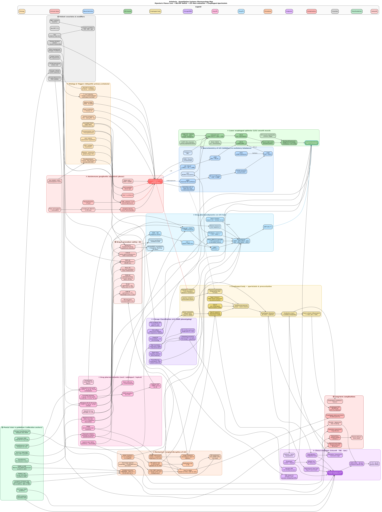</a> | 식도-위 접합부의 하부식도괄약근(LES) 이완 실패 + 식도체부의 무연동운동을 특징으로 하는 일차성 식도 운동장애.<br>[🗺️ 지도](achalasia/ach_qsp_model.svg) · [⚙️ mrgsolve](achalasia/ach_mrgsolve_model.R) · [📚 문헌](achalasia/ach_references.md) · [📄 README](achalasia/README.md) |
| 3 | 희귀·유전 | [**연골무형성증 (ACH)**<br><sub>Achondroplasia · FGFR3 4p16.3 G380R (~97%, transmembrane gain-of-function)</sub>](achondroplasia/) | <a href="achondroplasia/acdp_qsp_model.svg"></a> | 소인성(disproportionate) 저신장의 가장 흔한 형태로, FGFR3 유전자(4p16.3) 막관통 영역의 생식세포 획득형(gain-of-function) 돌연변이(G380R, 전체 환자의 ~97%)에 의한 상염색체 우성 유전질환(약 80%는 부모 연령 증가와 연관된 de novo 돌연변이; 동형접합 ACH는 신생아기 치명적).<br>[🗺️ 지도](achondroplasia/acdp_qsp_model.svg) · [⚙️ mrgsolve](achondroplasia/acdp_mrgsolve_model.R) · [📚 문헌](achondroplasia/acdp_references.md) · [📄 README](achondroplasia/README.md) |
| 4 | 피부 | [**심상성 여드름**<br><sub>Acne vulgaris · ACN</sub>](acne-vulgaris/) | <a href="acne-vulgaris/acn_qsp_model.svg"></a> | 안드로겐-IGF-1/mTORC1 축의 과피지, 누두부 과각화가 만드는 미세면포 저장고, C. acnes 바이오필름과 항생제 내성, NLRP3-IL-1베타 염증을 병변 전이 사슬로 연결한 55-ODE 모델.<br>[🗺️ 지도](acne-vulgaris/acn_qsp_model.svg) · [⚙️ mrgsolve](acne-vulgaris/acn_mrgsolve_model.R) · [📚 문헌](acne-vulgaris/acn_references.md) · [📄 README](acne-vulgaris/README.md) |
| 5 | 내분비·대사 | [**말단비대증**<br><sub>Acromegaly · ACRO</sub>](acromegaly/) | <a href="acromegaly/acro_qsp_model.svg"></a> | 뇌하수체 선종의 GH 과다분비 → IGF-1 상승. 소마토스타틴 유사체·페그비소만트·도파민작용제 PK/PD.<br>[🗺️ 지도](acromegaly/acro_qsp_model.svg) · [⚙️ mrgsolve](acromegaly/acro_mrgsolve_model.R) · [📚 문헌](acromegaly/acro_references.md) · [📄 README](acromegaly/README.md) |
| 6 | 감염 | [**급성 세균성 수막염 (폐렴균)**<br><sub>Acute Bacterial Meningitis · ABM</sub>](acute-bacterial-meningitis/) | <a href="acute-bacterial-meningitis/abm_qsp_model.svg"></a> | 손상 flux 를 균 수가 아니라 죽이는 속도 × 균 수 × 한 마리당 염증 수확량의 곱으로 쓰면, 그 곱이 첫 항생제 투여 직후에 최대가 되고 장벽을 조이는 스테로이드가 반코마이신의 CSF 침투까지 함께 줄인다는 것이 계산으로 나온다.<br>[🗺️ 지도](acute-bacterial-meningitis/abm_qsp_model.svg) · [⚙️ mrgsolve](acute-bacterial-meningitis/abm_mrgsolve_model.R) · [📚 문헌](acute-bacterial-meningitis/abm_references.md) · [📄 README](acute-bacterial-meningitis/README.md) |
| 7 | 내분비·대사 | [**급성 간헐성 포르피린증**<br><sub>Acute Intermittent Porphyria · AIP</sub>](acute-intermittent-porphyria/) | <a href="acute-intermittent-porphyria/aip_qsp_model.svg"></a> | HMBS(PBGD) 유전자 기능 상실 → PBGD 효소 활성 ~50% → 헴 전구체(ALA·PBG) 과축적 → 신경독성 급성 발작. ALA(GABA 구조 유사체) → GABA-A 수용체 경쟁 억제 + Fe²⁺ 촉매 자동산화 ROS → 미토콘드리아 기능 부전 → 축삭 변성 → 자율신경·운동·감각 신경병증.<br>[🗺️ 지도](acute-intermittent-porphyria/aip_qsp_model.svg) · [⚙️ mrgsolve](acute-intermittent-porphyria/aip_mrgsolve_model.R) · [📚 문헌](acute-intermittent-porphyria/aip_references.md) · [📄 README](acute-intermittent-porphyria/README.md) |
| 8 | 신장·비뇨 | [**급성 신손상 (AKI)**<br><sub>Acute Kidney Injury · AKI</sub>](acute-kidney-injury/) | <a href="acute-kidney-injury/aki_qsp_model.svg">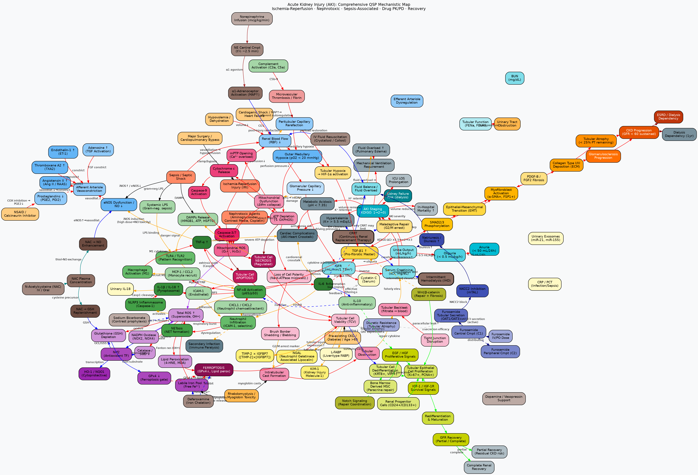</a> | 허혈-재관류(IRI)·신독성(NTX)·패혈증 연관(SA-AKI) 세 아형의 통합 QSP 모델. ATP 고갈 → 미토콘드리아 기능부전 → 아폽토시스/괴사/페롭토시스·세뇨관 세포 활력(TCV) 감소 → GFR↓·NGAL/KIM-1 상승.<br>[🗺️ 지도](acute-kidney-injury/aki_qsp_model.svg) · [⚙️ mrgsolve](acute-kidney-injury/aki_mrgsolve_model.R) · [📚 문헌](acute-kidney-injury/aki_references.md) · [📄 README](acute-kidney-injury/README.md) |
| 9 | 종양 | [**급성 림프구성 백혈병 (ALL)**<br><sub>Acute Lymphoblastic Leukemia · B-ALL/T-ALL</sub>](acute-lymphoblastic-leukemia/) | <a href="acute-lymphoblastic-leukemia/all_qsp_model.svg">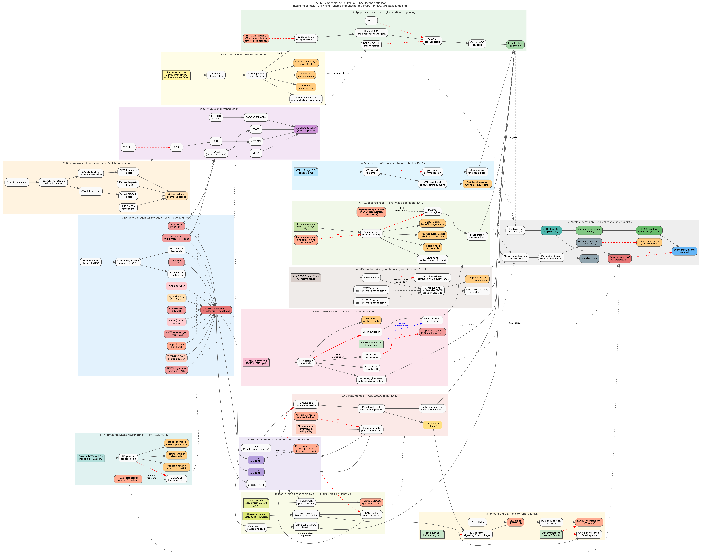</a> | 전구 B/T 림프구의 다단계 유전적 이상(BCR-ABL1, ETV6-RUNX1, KMT2A 재배열, 과이배수체, Ph-like, NOTCH1)에 의한 클론성 백혈병화로, 골수 미세환경(CXCL12/CXCR4·VCAM1/VLA-4) 의존적 화학저항성과 글루코코르티코이드 수용체 매개 아폽토시스 저항이 특징.<br>[🗺️ 지도](acute-lymphoblastic-leukemia/all_qsp_model.svg) · [⚙️ mrgsolve](acute-lymphoblastic-leukemia/all_mrgsolve_model.R) · [📚 문헌](acute-lymphoblastic-leukemia/all_references.md) · [📄 README](acute-lymphoblastic-leukemia/README.md) |
| 10 | 종양 | [**급성 골수성 백혈병**<br><sub>Acute Myeloid Leukemia · AML</sub>](acute-myeloid-leukemia/) | <a href="acute-myeloid-leukemia/aml_qsp_model.svg"></a> | FLT3/NPM1/IDH/DNMT3A 돌연변이·BCL-2 패밀리·백혈병 줄기세포·골수 미세환경·후성유전학 이상. 베네토클락스(BCL-2)·아자시티딘·길테리티닙(FLT3)·에나시데닙(IDH2)·시타라빈 PK/PD.<br>[🗺️ 지도](acute-myeloid-leukemia/aml_qsp_model.svg) · [⚙️ mrgsolve](acute-myeloid-leukemia/aml_mrgsolve_model.R) · [📚 문헌](acute-myeloid-leukemia/aml_references.md) · [📄 README](acute-myeloid-leukemia/README.md) |
| 11 | 심혈관 | [**급성 심근경색 (STEMI)**<br><sub>Acute Myocardial Infarction · STEMI</sub>](acute-myocardial-infarction/) | <a href="acute-myocardial-infarction/ami_qsp_model.svg"></a> | 관상동맥 폐색 후 괴사 파면이 부수혈류와 기초 대사 요구의 차이에 따라 심내막에서 심외막으로 진행하고, 재관류는 치료이면서 동시에 두 번째 손상이며, 경색 크기는 종말점이 아니라 Laplace 벽응력 재형성 분기의 초기조건이 된다.<br>[🗺️ 지도](acute-myocardial-infarction/ami_qsp_model.svg) · [⚙️ mrgsolve](acute-myocardial-infarction/ami_mrgsolve_model.R) · [📚 문헌](acute-myocardial-infarction/ami_references.md) · [📄 README](acute-myocardial-infarction/README.md) |
| 12 | 소화기·간담도 | [**급성 췌장염 (AP)**<br><sub>Acute Pancreatitis · Atlanta 2012 (Mild</sub>](acute-pancreatitis/) | <a href="acute-pancreatitis/ap_qsp_model.svg"></a> | 췌장 외분비 조직의 급성 염증성 질환으로 혈청 lipase >3× ULN + 특징적 복통 + 영상 소견 중 2가지로 진단(Atlanta 2012).<br>[🗺️ 지도](acute-pancreatitis/ap_qsp_model.svg) · [⚙️ mrgsolve](acute-pancreatitis/ap_mrgsolve_model.R) · [📚 문헌](acute-pancreatitis/ap_references.md) · [📄 README](acute-pancreatitis/README.md) |
| 13 | 호흡기 | [**급성 호흡곤란 증후군 (ARDS)**<br><sub>Acute Respiratory Distress Syndrome · ARDS</sub>](acute-respiratory-distress-syndrome/) | <a href="acute-respiratory-distress-syndrome/ards_qsp_model.svg"></a> | 폐포 상피와 내피 장벽이 동시에 무너져 단백질성 폐부종이 환기 가능한 폐를 20-35%의 baby lung으로 줄이고, 그 위에 인공호흡기가 가하는 구동압·변형·기계적 파워가 VILI로 되먹임되는 고리를 다룬다.<br>[🗺️ 지도](acute-respiratory-distress-syndrome/ards_qsp_model.svg) · [⚙️ mrgsolve](acute-respiratory-distress-syndrome/ards_mrgsolve_model.R) · [📚 문헌](acute-respiratory-distress-syndrome/ards_references.md) · [📄 README](acute-respiratory-distress-syndrome/README.md) |
| 14 | 내분비·대사 | [**애디슨병 (원발성 부신부전)**<br><sub>Addison's Disease · ADD</sub>](addisons-disease/) | <a href="addisons-disease/add_qsp_model.svg">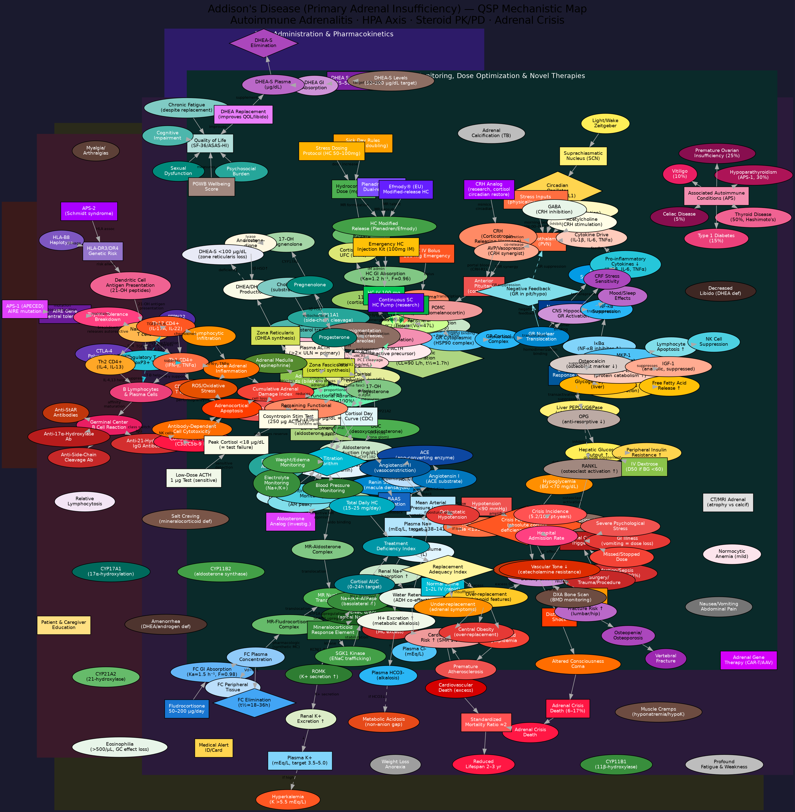</a> | 부신피질 자가면역 파괴로 코르티솔·알도스테론 결핍. HPA축·히드로코르티손/플루드로코르티손 보충 시뮬레이션.<br>[🗺️ 지도](addisons-disease/add_qsp_model.svg) · [⚙️ mrgsolve](addisons-disease/add_mrgsolve_model.R) · [📚 문헌](addisons-disease/add_references.md) · [📄 README](addisons-disease/README.md) |
| 15 | 부인·생식 | [**자궁선근증 (ADENO)**<br><sub>Adenomyosis · Junctional Zone Hyperperistalsis</sub>](adenomyosis/) | <a href="adenomyosis/adeno_qsp_model.svg"></a> | 자궁 내근(JZ) 영역에 자궁내막선·간질이 침입한 estrogen-dependent 만성 질환(가임기 여성 20–35%, peri-menopause 가장 호발): JZ hyperperistalsis(>4 waves/min perimenstrual, Kunz 1996) + TIAR(Tissue Injury And Repair, Leyende…<br>[🗺️ 지도](adenomyosis/adeno_qsp_model.svg) · [⚙️ mrgsolve](adenomyosis/adeno_mrgsolve_model.R) · [📚 문헌](adenomyosis/adeno_references.md) · [📄 README](adenomyosis/README.md) |
| 16 | 정신·신경 | [**주의력결핍과잉행동장애**<br><sub>Attention Deficit Hyperactivity Disorder · ADHD</sub>](adhd/) | <a href="adhd/adhd_qsp_model.svg"></a> | 도파민(DA)·노르에피네프린(NE) 신경전달 저하로 인한 전전두피질(PFC) 기능 장애. DAT1/DRD4/DRD5/SNAP25/COMT 위험 유전자 → 중뇌(VTA→PFC) DA 합성 감소·청반(LC→PFC) NE 긴장도 저하 → PFC 피질 성숙 3년 지연.<br>[🗺️ 지도](adhd/adhd_qsp_model.svg) · [⚙️ mrgsolve](adhd/adhd_mrgsolve_model.R) · [📚 문헌](adhd/adhd_references.md) · [📄 README](adhd/README.md) |
| 17 | 신장·비뇨 | [**상염색체 우성 다낭신 (ADPKD)**<br><sub>Autosomal Dominant PKD · ADPKD</sub>](adpkd/) | <a href="adpkd/adpkd_qsp_model.svg"></a> | PKD1/2 변이 → cAMP 증가로 낭종 성장·신기능 저하. 톨밥탄(V2 수용체 길항)의 TKV/eGFR 효과.<br>[🗺️ 지도](adpkd/adpkd_qsp_model.svg) · [⚙️ mrgsolve](adpkd/adpkd_mrgsolve_model.R) · [📚 문헌](adpkd/adpkd_references.md) · [📄 README](adpkd/README.md) |
| 18 | 종양 | [**부신피질암 (ACC)**<br><sub>Adrenocortical Carcinoma · ACC</sub>](adrenocortical-carcinoma/) | <a href="adrenocortical-carcinoma/acc_qsp_model.svg"></a> | 혈장 미토테인을 용량이 아니라 천천히 채워지는 지방 저장고의 넘침으로 기술하여, 지방량이 도달 농도(Css)는 그대로 두고 도달 시간(tau)만 바꾼다는 것과 같은 노출이 효능·CYP3A4 유도·신경독성 세 방향으로 동시에 읽힌다는 것을 계산으로 보인다.<br>[🗺️ 지도](adrenocortical-carcinoma/acc_qsp_model.svg) · [⚙️ mrgsolve](adrenocortical-carcinoma/acc_mrgsolve_model.R) · [📚 문헌](adrenocortical-carcinoma/acc_references.md) · [📄 README](adrenocortical-carcinoma/README.md) |
| 19 | 자가면역·류마티스 | [**성인형 스틸병**<br><sub>Adult-Onset Still's Disease · AOSD</sub>](adult-onset-stills-disease/) | <a href="adult-onset-stills-disease/aosd_qsp_model.svg"></a> | IL-1/IL-6/IL-18 매개 자가염증, 발열·관절염·페리틴 급상승. 아나킨라·카나키누맙·토실리주맙 표적.<br>[🗺️ 지도](adult-onset-stills-disease/aosd_qsp_model.svg) · [⚙️ mrgsolve](adult-onset-stills-disease/aosd_mrgsolve_model.R) · [📚 문헌](adult-onset-stills-disease/aosd_references.md) · [📄 README](adult-onset-stills-disease/README.md) |
| 20 | 안과 | [**노인성 황반변성**<br><sub>Age-related Macular Degeneration · AMD</sub>](age-related-macular-degeneration/) | <a href="age-related-macular-degeneration/amd_qsp_model.svg"></a> | 노화·유전(CFH Y402H·ARMS2 A69S)·보체계 과활성화 → 드루젠 형성·Bruch막 두꺼워짐 → RPE 기능부전·지방갈색소(A2E) 축적 → MAC(C5b-9) 매개 RPE 세포사 → 지리적 위축(GA, 건성 말기).<br>[🗺️ 지도](age-related-macular-degeneration/amd_qsp_model.svg) · [⚙️ mrgsolve](age-related-macular-degeneration/amd_mrgsolve_model.R) · [📚 문헌](age-related-macular-degeneration/amd_references.md) · [📄 README](age-related-macular-degeneration/README.md) |
| 21 | 종양 | [**AL 아밀로이드증 (AL Amyloidosis)**<br><sub>Immunoglobulin Light Chain Amyloidosis · AL</sub>](al-amyloidosis/) | <a href="al-amyloidosis/al_qsp_model.svg"></a> | 형질세포 이상증식(MGUS→SMM→클론성 형질세포) → CD38 고발현 → 단클론 자유경쇄(FLC) 과분비 → 아밀로이드 원섬유 핵화·신장(β-sheet 중합체)·파종 자가촉매 증폭 → 심장(LV 비후, 이완기 기능부전, NT-proBNP↑, hs-TnT↑)·신장(사구체 아밀로이드→신증후군, eGFR↓)·간(간비대, ALP↑)·자율신경 아…<br>[🗺️ 지도](al-amyloidosis/al_qsp_model.svg) · [⚙️ mrgsolve](al-amyloidosis/al_mrgsolve_model.R) · [📚 문헌](al-amyloidosis/al_references.md) · [📄 README](al-amyloidosis/README.md) |
| 22 | 소화기·간담도 | [**알라질 증후군**<br><sub>Alagille Syndrome · ALGS</sub>](alagille-syndrome/) | <a href="alagille-syndrome/algs_qsp_model.svg"></a> | 담관 형성 부전이 만드는 담관 용량 상한을 IBAT 억제제가 건드릴 수 없는 축으로 두어, 약효 상한이 담즙산이 아니라 담관 수로 결정됨을 보인 모델.<br>[🗺️ 지도](alagille-syndrome/algs_qsp_model.svg) · [⚙️ mrgsolve](alagille-syndrome/algs_mrgsolve_model.R) · [📚 문헌](alagille-syndrome/algs_references.md) · [📄 README](alagille-syndrome/README.md) |
| 23 | 정신·신경 | [**알코올 사용장애 (AUD)**<br><sub>Alcohol Use Disorder · AUD</sub>](alcohol-use-disorder/) | <a href="alcohol-use-disorder/aud_qsp_model.svg"></a> | 음주량 자체가 모델의 출력인 닫힌 루프 구조로, 오피오이드-도파민 강화 팔과 GABA/글루타메이트 알로스타틱 부정정동 팔을 분리해 날트렉손과 아캄프로세이트가 서로 다른 임상 엔드포인트를 움직이는 이유를 재현한다.<br>[🗺️ 지도](alcohol-use-disorder/aud_qsp_model.svg) · [⚙️ mrgsolve](alcohol-use-disorder/aud_mrgsolve_model.R) · [📚 문헌](alcohol-use-disorder/aud_references.md) · [📄 README](alcohol-use-disorder/README.md) |
| 24 | 소화기·간담도 | [**알코올성 간질환**<br><sub>Alcoholic Liver Disease · ALD</sub>](alcoholic-liver-disease/) | <a href="alcoholic-liver-disease/ald_qsp_model.svg"></a> | 에탄올 → 아세트알데히드(ADH/CYP2E1) + ROS 생성 → GSH 고갈·Nrf2/KEAP1/ARE 산화스트레스 방어 → 장내 미생물 불균형(dysbiosis) → 장 투과성↑ → LPS 문맥 유입 → TLR4/MD-2/CD14 → Kupffer 세포 NF-κB 활성화 → NLRP3 인플라마솜 → IL-1β/TNF-α/CXCL8 폭포…<br>[🗺️ 지도](alcoholic-liver-disease/ald_qsp_model.svg) · [⚙️ mrgsolve](alcoholic-liver-disease/ald_mrgsolve_model.R) · [📚 문헌](alcoholic-liver-disease/ald_references.md) · [📄 README](alcoholic-liver-disease/README.md) |
| 25 | 희귀·유전 | [**알캅톤뇨증 (오크로노시스)**<br><sub>Alkaptonuria · AKU</sub>](alkaptonuria/) | <a href="alkaptonuria/aku_qsp_model.svg"></a> | 니티시논이 HPD를 억제해도 티로신 경로의 총 플럭스는 줄지 않고 출구만 바뀐다는 질량보존에서, 용량은 HGA를 정하고 식이가 티로신을 정한다는 비대칭과 요중 대비 혈청 HGA 감소폭의 괴리가 유도된다.<br>[🗺️ 지도](alkaptonuria/aku_qsp_model.svg) · [⚙️ mrgsolve](alkaptonuria/aku_mrgsolve_model.R) · [📚 문헌](alkaptonuria/aku_references.md) · [📄 README](alkaptonuria/README.md) |
| 26 | 호흡기 | [**알레르기성 기관지폐 아스페르길루스증 (ABPA)**<br><sub>Allergic Bronchopulmonary Aspergillosis · ABPA</sub>](allergic-bronchopulmonary-aspergillosis/) | <a href="allergic-bronchopulmonary-aspergillosis/abpa_qsp_model.svg"></a> | 기도에 정착한 Aspergillus fumigatus에 대한 IgE·Th2 매개 과민반응으로 고감쇠 점액 플러그가 형성되고, 플러그 내부가 항진균제 농도가 10분의 1로 떨어지는 성역이 되어 재발과 중심성 기관지확장증으로 진행하는 질환.<br>[🗺️ 지도](allergic-bronchopulmonary-aspergillosis/abpa_qsp_model.svg) · [⚙️ mrgsolve](allergic-bronchopulmonary-aspergillosis/abpa_mrgsolve_model.R) · [📚 문헌](allergic-bronchopulmonary-aspergillosis/abpa_references.md) · [📄 README](allergic-bronchopulmonary-aspergillosis/README.md) |
| 27 | 호흡기 | [**알레르기 비염 (AR)**<br><sub>Allergic Rhinitis · AR</sub>](allergic-rhinitis/) | <a href="allergic-rhinitis/ar_qsp_model.svg"></a> | IgE-비만세포 축(FcεRI 가교결합 → 탈과립) + Th2 사이토카인 캐스케이드(IL-4/5/13) + 호산구 동태의 통합 QSP 모델. 히스타민·PGD2·CysLT(LTC4/D4/E4)·PAF 조기 반응 및 후기 호산구 침윤·TSLP/IL-33 상피 알라민 경로 포함.<br>[🗺️ 지도](allergic-rhinitis/ar_qsp_model.svg) · [⚙️ mrgsolve](allergic-rhinitis/ar_mrgsolve_model.R) · [📚 문헌](allergic-rhinitis/ar_references.md) · [📄 README](allergic-rhinitis/README.md) |
| 28 | 피부 | [**원형 탈모증**<br><sub>Alopecia Areata · AA</sub>](alopecia-areata/) | <a href="alopecia-areata/aa_qsp_model.svg"></a> | 모낭 면역특권 붕괴, IFN-γ/IL-15 JAK-STAT 신호로 모발 손실. 바리시티닙 등 JAK 억제제 반응.<br>[🗺️ 지도](alopecia-areata/aa_qsp_model.svg) · [⚙️ mrgsolve](alopecia-areata/aa_mrgsolve_model.R) · [📚 문헌](alopecia-areata/aa_references.md) · [📄 README](alopecia-areata/README.md) |
| 29 | 희귀·유전 | [**알파-1 항트립신 결핍증**<br><sub>Alpha-1 Antitrypsin Deficiency · AATD</sub>](alpha1-antitrypsin-deficiency/) | <a href="alpha1-antitrypsin-deficiency/aatd_qsp_model.svg"></a> | SERPINA1 Glu342Lys(Z 대립유전자) → Z-AAT 소포체 내 루프-시트 중합체 축적(gain-of-function 간독성) + 혈청 AAT 부족(<11 µM ELF 임계) → 중성구 엘라스타제(NE) 무제한 활성 → 범소엽성 폐기종.<br>[🗺️ 지도](alpha1-antitrypsin-deficiency/aatd_qsp_model.svg) · [⚙️ mrgsolve](alpha1-antitrypsin-deficiency/aatd_mrgsolve_model.R) · [📚 문헌](alpha1-antitrypsin-deficiency/aatd_references.md) · [📄 README](alpha1-antitrypsin-deficiency/README.md) |
| 30 | 신장·비뇨 | [**알포트 증후군 (Alport Syndrome)**<br><sub>Alport Syndrome · AS</sub>](alport-syndrome/) | <a href="alport-syndrome/alp_qsp_model.svg">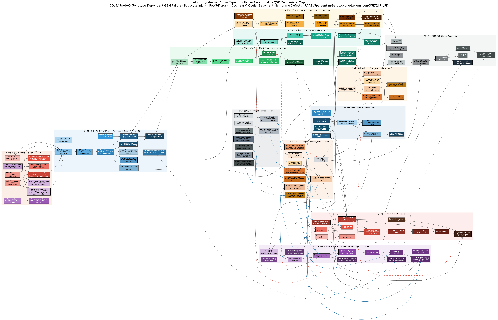</a> | IV형 콜라겐 α3/α4/α5 사슬을 코딩하는 COL4A5(X연관, ~80%)·COL4A3/COL4A4(상염색체)의 변이로 사구체기저막(GBM)에서 성숙한 α3α4α5(IV) 네트워크가 형성되지 못하고 기계적으로 취약한 태아형 α1α2(IV) 네트워크가 잔류하는 유전성 신장질환이다.<br>[🗺️ 지도](alport-syndrome/alp_qsp_model.svg) · [⚙️ mrgsolve](alport-syndrome/alp_mrgsolve_model.R) · [📚 문헌](alport-syndrome/alp_references.md) · [📄 README](alport-syndrome/README.md) |
| 31 | 신경 | [**알츠하이머병**<br><sub>Alzheimer's Disease · AD</sub>](alzheimers-disease/) | <a href="alzheimers-disease/ad_qsp_model.svg">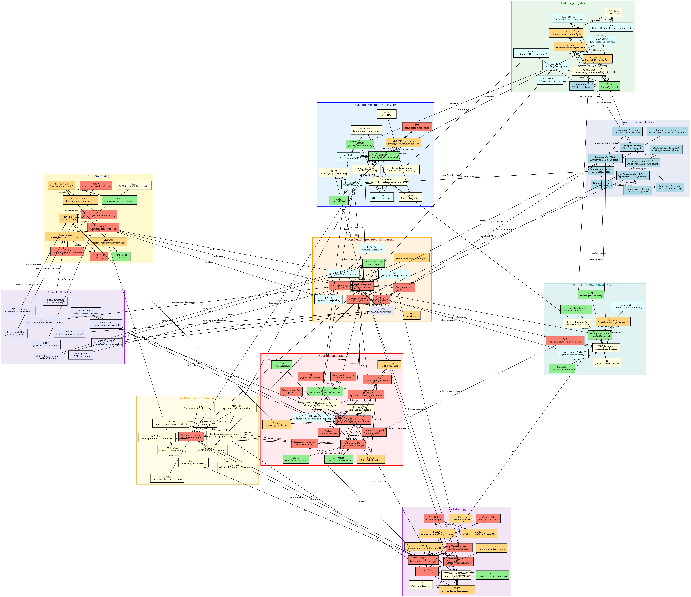</a> | 아밀로이드-β 침착·타우 신경섬유엉킴·신경염증에 의한 진행성 인지저하. 항아밀로이드 항체(레카네맙/도나네맙)·콜린에스터분해효소 억제제.<br>[🗺️ 지도](alzheimers-disease/ad_qsp_model.svg) · [⚙️ mrgsolve](alzheimers-disease/ad_mrgsolve_model.R) · [📚 문헌](alzheimers-disease/ad_references.md) · [📄 README](alzheimers-disease/README.md) |
| 32 | 신경 | [**근위축성 측삭경화증 (ALS)**<br><sub>Amyotrophic Lateral Sclerosis · ALS</sub>](amyotrophic-lateral-sclerosis/) | <a href="amyotrophic-lateral-sclerosis/als_qsp_model.svg"></a> | 상·하위 운동신경세포의 진행성 변성(SOD1/TDP-43/C9orf72). 릴루졸·에다라본·토퍼센(SOD1).<br>[🗺️ 지도](amyotrophic-lateral-sclerosis/als_qsp_model.svg) · [⚙️ mrgsolve](amyotrophic-lateral-sclerosis/als_mrgsolve_model.R) · [📚 문헌](amyotrophic-lateral-sclerosis/als_references.md) · [📄 README](amyotrophic-lateral-sclerosis/README.md) |
| 33 | 피부 | [**남성형·여성형 탈모**<br><sub>Androgenetic Alopecia · AGA</sub>](androgenetic-alopecia/) | <a href="androgenetic-alopecia/aga_qsp_model.svg"></a> | 탈모를 모발 수가 아니라 모낭 크기의 문제로 쓰고 크기 변화가 휴지기 탈출 순간에만 일어나게 하여, 하루 100개 탈락과 평평한 피나스테리드 용량-반응과 늦은 치료의 실패가 모두 주기 시간 산수에서 유도된다.<br>[🗺️ 지도](androgenetic-alopecia/aga_qsp_model.svg) · [⚙️ mrgsolve](androgenetic-alopecia/aga_mrgsolve_model.R) · [📚 문헌](androgenetic-alopecia/aga_references.md) · [📄 README](androgenetic-alopecia/README.md) |
| 34 | 신장·비뇨 | [**신성 빈혈 (CKD 빈혈)**<br><sub>Anemia of Chronic Kidney Disease · ACKD</sub>](anemia-of-ckd/) | <a href="anemia-of-ckd/ackd_qsp_model.svg"></a> | 신장 섬유화로 EPO 생산세포(REP)가 소실되고 저산소 자극마저 둔화되며, 염증과 신장 헤프시딘 배설 저하가 기능적 철결핍을 일으켜 ESA 저반응성을 유발한다.<br>[🗺️ 지도](anemia-of-ckd/ackd_qsp_model.svg) · [⚙️ mrgsolve](anemia-of-ckd/ackd_mrgsolve_model.R) · [📚 문헌](anemia-of-ckd/ackd_references.md) · [📄 README](anemia-of-ckd/README.md) |
| 35 | 신경 | [**동맥류성 지주막하출혈 (DCI)**<br><sub>Aneurysmal Subarachnoid Haemorrhage · aSAH-DCI</sub>](aneurysmal-subarachnoid-hemorrhage/) | <a href="aneurysmal-subarachnoid-hemorrhage/sah_qsp_model.svg"></a> | 지주막하 혈액에서 풀려난 옥시헤모글로빈이 대혈관 경련·미세혈관 긴장·미세혈전·관류압 손실이라는 네 소비자를 통해 하나의 세동맥 확장 예비능을 갈아먹는 구조로 지연성 뇌허혈을 기술한다.<br>[🗺️ 지도](aneurysmal-subarachnoid-hemorrhage/sah_qsp_model.svg) · [⚙️ mrgsolve](aneurysmal-subarachnoid-hemorrhage/sah_mrgsolve_model.R) · [📚 문헌](aneurysmal-subarachnoid-hemorrhage/sah_references.md) · [📄 README](aneurysmal-subarachnoid-hemorrhage/README.md) |
| 36 | 자가면역·류마티스 | [**강직성 척추염**<br><sub>Ankylosing Spondylitis · AS</sub>](ankylosing-spondylitis/) | <a href="ankylosing-spondylitis/as_qsp_model.svg">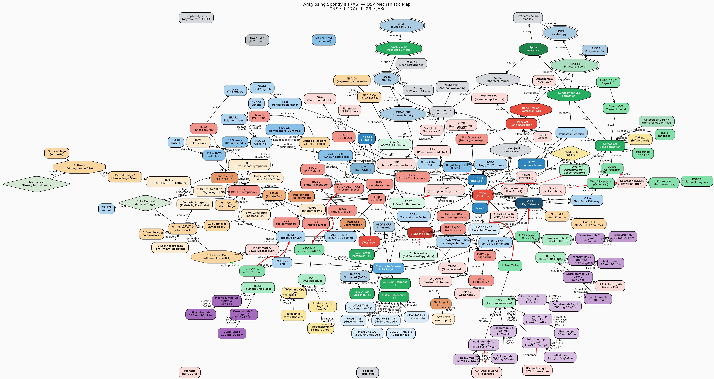</a> | HLA-B27·IL-23/IL-17·TNF 축의 부착부염·골증식. TNF/IL-17 억제제의 BASDAI 효과.<br>[🗺️ 지도](ankylosing-spondylitis/as_qsp_model.svg) · [⚙️ mrgsolve](ankylosing-spondylitis/as_mrgsolve_model.R) · [📚 문헌](ankylosing-spondylitis/as_references.md) · [📄 README](ankylosing-spondylitis/README.md) |
| 37 | 정신·신경 | [**신경성 식욕부진증**<br><sub>Anorexia Nervosa · AN</sub>](anorexia-nervosa/) | <a href="anorexia-nervosa/an_qsp_model.svg"></a> | 인지적 섭취 제한이 만성 음성 에너지균형을 만들어 렙틴·유리T3·IGF-1 저하와 코르티솔 상승, GnRH 박동 억제에 의한 시상하부성 무월경과 골형성 저하를 일으키며, 영양재활 시 인슐린 급증으로 생기는 재급식증후군 위험까지 함께 모사한다.<br>[🗺️ 지도](anorexia-nervosa/an_qsp_model.svg) · [⚙️ mrgsolve](anorexia-nervosa/an_mrgsolve_model.R) · [📚 문헌](anorexia-nervosa/an_references.md) · [📄 README](anorexia-nervosa/README.md) |
| 38 | 심혈관 | [**안트라사이클린 심장독성 (AIC)**<br><sub>Anthracycline-Induced Cardiotoxicity · AIC</sub>](anthracycline-cardiotoxicity/) | <a href="anthracycline-cardiotoxicity/aic_qsp_model.svg"></a> | 심근 내 첨두농도를 읽는 Top2b-DNA 절단 축과 AUC를 읽는 철-ROS 축을 분리하고, 가역적 기능 결손과 비가역적 근세포 소실을 보상성 비대가 가리는 구조로 모델링하여 스케줄·제형·덱스라족산·트라스투주맙 병용을 함께 다룬다.<br>[🗺️ 지도](anthracycline-cardiotoxicity/aic_qsp_model.svg) · [⚙️ mrgsolve](anthracycline-cardiotoxicity/aic_mrgsolve_model.R) · [📚 문헌](anthracycline-cardiotoxicity/aic_references.md) · [📄 README](anthracycline-cardiotoxicity/README.md) |
| 39 | 자가면역·류마티스 | [**항인지질항체 증후군**<br><sub>Antiphospholipid Syndrome · APS</sub>](antiphospholipid-syndrome/) | <a href="antiphospholipid-syndrome/aps_qsp_model.svg"></a> | 항인지질항체에 의한 동·정맥 혈전 및 임신 합병증. 항응고(와파린/헤파린)·히드록시클로로퀸.<br>[🗺️ 지도](antiphospholipid-syndrome/aps_qsp_model.svg) · [⚙️ mrgsolve](antiphospholipid-syndrome/aps_mrgsolve_model.R) · [📚 문헌](antiphospholipid-syndrome/aps_references.md) · [📄 README](antiphospholipid-syndrome/README.md) |
| 40 | 심혈관 | [**대동맥판막 협착증 (AS/CAVD)**<br><sub>Calcific Aortic Valve Stenosis · CAVD</sub>](aortic-stenosis/) | <a href="aortic-stenosis/as_qsp_model.svg">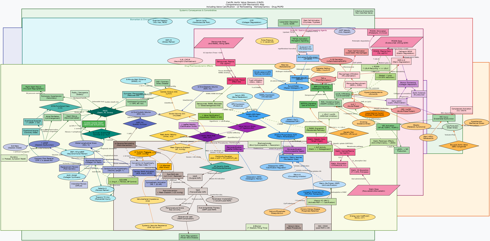</a> | 판막 내피세포 손상(shear stress·oxLDL·NOTCH1 소실) → BMP-2/4·TGF-β1 활성화 → 판막 간질세포(VIC) 골아세포성 전환(Runx2·Osterix·ALP↑) → RANKL/OPG 비율 증가 → 미세석회화(hydroxyapatite) → 거대석회화 → 대동맥판막 면적(AVA) 감소 → 경판막 압력차(ΔP) 증…<br>[🗺️ 지도](aortic-stenosis/as_qsp_model.svg) · [⚙️ mrgsolve](aortic-stenosis/as_mrgsolve_model.R) · [📚 문헌](aortic-stenosis/as_references.md) · [📄 README](aortic-stenosis/README.md) |
| 41 | 혈액 | [**재생불량성 빈혈**<br><sub>Aplastic Anemia · AA</sub>](aplastic-anemia/) | <a href="aplastic-anemia/aa_qsp_model.svg"></a> | 자가반응 CD8+ CTL 활성화(분자 모방·HLA-DR 제시) → IFN-γ/TNF-α 사이토카인 폭풍 → HSC에 FasL·퍼포린/그랜자임 B·NF-κB/ROS/p53 경로로 직접 세포자멸 → 조혈줄기세포(HSC) 풀 고갈 → 다계열 조혈부전(범혈구감소증) → 저세포성 골수(BM cellularity <25%).<br>[🗺️ 지도](aplastic-anemia/aa_qsp_model.svg) · [⚙️ mrgsolve](aplastic-anemia/aa_mrgsolve_model.R) · [📚 문헌](aplastic-anemia/aa_references.md) · [📄 README](aplastic-anemia/README.md) |
| 42 | 심혈관 | [**부정맥성 우심실 심근병증 (ARVC)**<br><sub>Arrhythmogenic Right Ventricular Cardiomyopathy · ARVC</sub>](arrhythmogenic-right-ventricular-cardiomyopathy/) | <a href="arrhythmogenic-right-ventricular-cardiomyopathy/arvc_qsp_model.svg"></a> | 데스모좀 변이가 손상량이 아니라 개재판이 파괴되는 하중 문턱을 낮춘다고 보고, 심근세포 소실을 박동수와 벽응력의 4제곱에 비례하는 피로 파괴로 기술하며, 우심실 선택성을 Laplace 비대칭에서 도출한다.<br>[🗺️ 지도](arrhythmogenic-right-ventricular-cardiomyopathy/arvc_qsp_model.svg) · [⚙️ mrgsolve](arrhythmogenic-right-ventricular-cardiomyopathy/arvc_mrgsolve_model.R) · [📚 문헌](arrhythmogenic-right-ventricular-cardiomyopathy/arvc_references.md) · [📄 README](arrhythmogenic-right-ventricular-cardiomyopathy/README.md) |
| 43 | 내분비·대사 | [**무증상 고요산혈증**<br><sub>Asymptomatic Hyperuricemia · AHU</sub>](asymptomatic-hyperuricemia/) | <a href="asymptomatic-hyperuricemia/ahy_qsp_model.svg"></a> | 요산 과포화(무증상)와 통풍·신질환 진행 위험. 생활습관 및 선택적 요산저하(잔틴산화효소 억제).<br>[🗺️ 지도](asymptomatic-hyperuricemia/ahy_qsp_model.svg) · [⚙️ mrgsolve](asymptomatic-hyperuricemia/ahy_mrgsolve_model.R) · [📚 문헌](asymptomatic-hyperuricemia/ahy_references.md) · [📄 README](asymptomatic-hyperuricemia/README.md) |
| 44 | 피부 | [**아토피 피부염**<br><sub>Atopic Dermatitis · AD</sub>](atopic-dermatitis/) | <a href="atopic-dermatitis/ad_qsp_model.svg"></a> | 피부장벽 기능장애·Th2(IL-4/IL-13/IL-31) 염증. 두필루맙·JAK 억제제·국소 칼시뉴린억제제.<br>[🗺️ 지도](atopic-dermatitis/ad_qsp_model.svg) · [⚙️ mrgsolve](atopic-dermatitis/ad_mrgsolve_model.R) · [📚 문헌](atopic-dermatitis/ad_references.md) · [📄 README](atopic-dermatitis/README.md) |
| 45 | 심혈관 | [**심방세동**<br><sub>Atrial Fibrillation · AF</sub>](atrial-fibrillation/) | <a href="atrial-fibrillation/af_qsp_model.svg">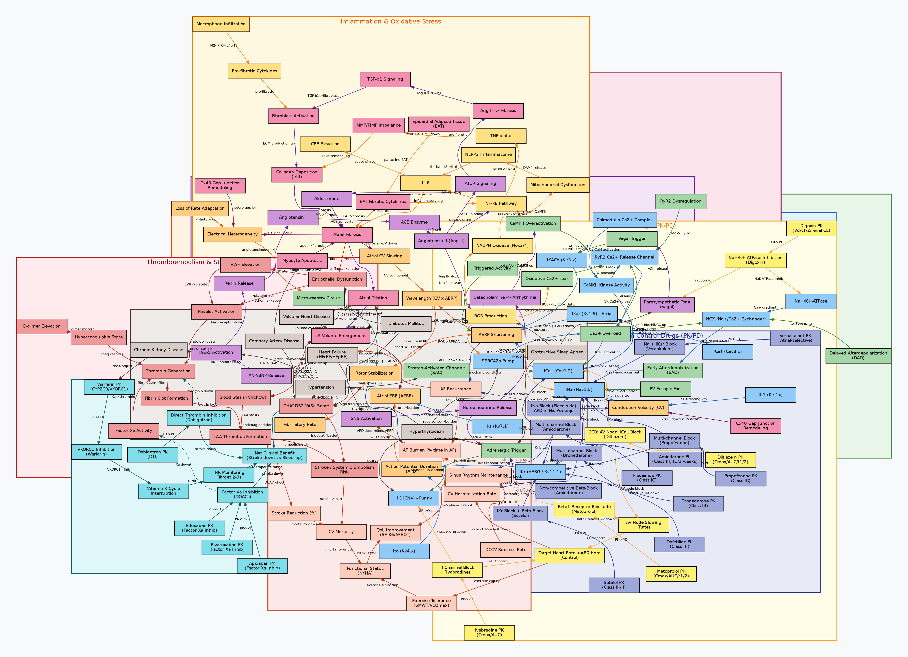</a> | 심방 전기적·구조적 리모델링과 재진입 회로. 율동/심박수 조절 및 NOAC 항응고 전략.<br>[🗺️ 지도](atrial-fibrillation/af_qsp_model.svg) · [⚙️ mrgsolve](atrial-fibrillation/af_mrgsolve_model.R) · [📚 문헌](atrial-fibrillation/af_references.md) · [📄 README](atrial-fibrillation/README.md) |
| 46 | 혈액 | [**비정형 용혈요독 증후군 (aHUS)**<br><sub>Atypical Hemolytic Uremic Syndrome · aHUS</sub>](atypical-hemolytic-uremic-syndrome/) | <a href="atypical-hemolytic-uremic-syndrome/ahus_qsp_model.svg">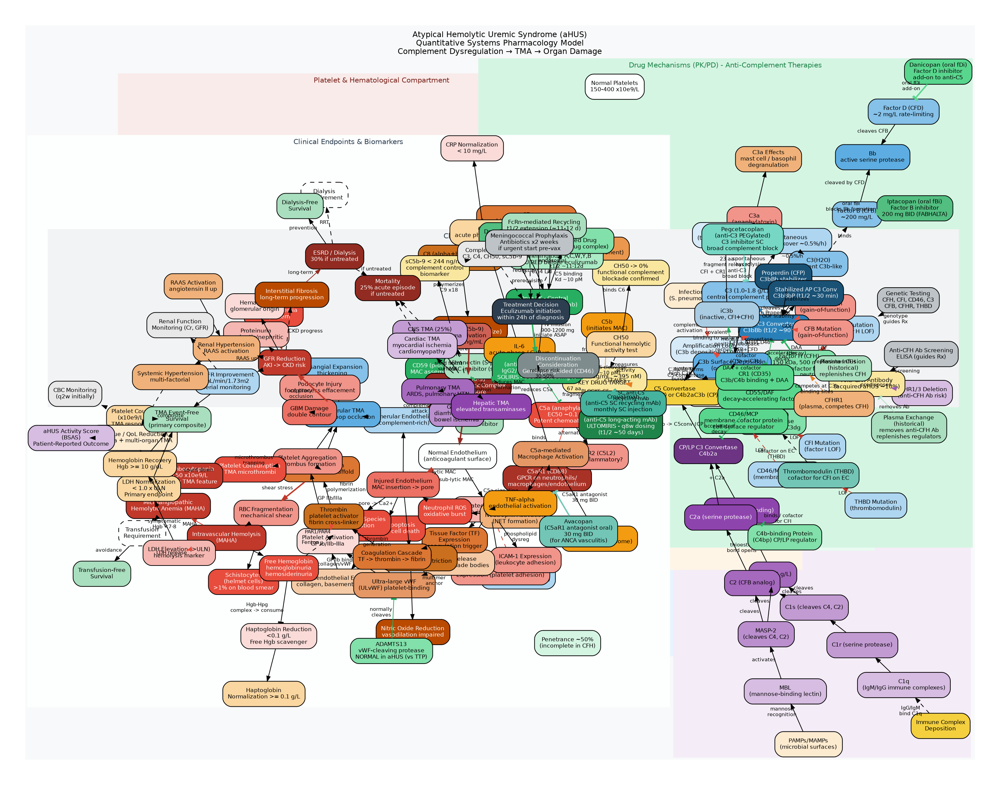</a> | 보체 대체경로(AP) 조절 이상(CFH/CFI/CD46 돌연변이·항CFH 자가항체) → C3b 축적·C5 전환효소 형성 → MAC(C5b-9) 생성 → 혈관내피 손상 → 혈전성 미세혈관병증(TMA): 혈소판감소증·MAHA·급성신손상.<br>[🗺️ 지도](atypical-hemolytic-uremic-syndrome/ahus_qsp_model.svg) · [⚙️ mrgsolve](atypical-hemolytic-uremic-syndrome/ahus_mrgsolve_model.R) · [📚 문헌](atypical-hemolytic-uremic-syndrome/ahus_references.md) · [📄 README](atypical-hemolytic-uremic-syndrome/README.md) |
| 47 | 신경 | [**자가면역 뇌염**<br><sub>Autoimmune Encephalitis · AIE</sub>](autoimmune-encephalitis/) | <a href="autoimmune-encephalitis/aie_qsp_model.svg"></a> | 항NMDAR 등 신경표면 항체에 의한 뇌염. 스테로이드·IVIG·혈장교환·리툭시맙 면역치료.<br>[🗺️ 지도](autoimmune-encephalitis/aie_qsp_model.svg) · [⚙️ mrgsolve](autoimmune-encephalitis/aie_mrgsolve_model.R) · [📚 문헌](autoimmune-encephalitis/aie_references.md) · [📄 README](autoimmune-encephalitis/README.md) |
| 48 | 혈액 | [**자가면역 용혈성 빈혈**<br><sub>Autoimmune Hemolytic Anemia · AIHA</sub>](autoimmune-hemolytic-anemia/) | <a href="autoimmune-hemolytic-anemia/aiha_qsp_model.svg"></a> | 온형 IgG·한랭 IgM 자가항체에 의한 적혈구 파괴. 스테로이드·리툭시맙·수티림맙(항C1s).<br>[🗺️ 지도](autoimmune-hemolytic-anemia/aiha_qsp_model.svg) · [⚙️ mrgsolve](autoimmune-hemolytic-anemia/aiha_mrgsolve_model.R) · [📚 문헌](autoimmune-hemolytic-anemia/aiha_references.md) · [📄 README](autoimmune-hemolytic-anemia/README.md) |
| 49 | 소화기·간담도 | [**자가면역 간염**<br><sub>Autoimmune Hepatitis · AIH</sub>](autoimmune-hepatitis/) | <a href="autoimmune-hepatitis/aih_qsp_model.svg"></a> | T세포 매개 간세포 손상과 자가항체·고감마글로불린혈증. 스테로이드·아자티오프린 유도/유지.<br>[🗺️ 지도](autoimmune-hepatitis/aih_qsp_model.svg) · [⚙️ mrgsolve](autoimmune-hepatitis/aih_mrgsolve_model.R) · [📚 문헌](autoimmune-hepatitis/aih_references.md) · [📄 README](autoimmune-hepatitis/README.md) |
| 50 | 소화기·간담도 | [**자가면역 췌장염**<br><sub>Autoimmune Pancreatitis · AIP</sub>](autoimmune-pancreatitis/) | <a href="autoimmune-pancreatitis/aip_qsp_model.svg"></a> | IgG4 관련 림프형질세포 침윤·섬유염증. 스테로이드 관해유도·리툭시맙 재발관리.<br>[🗺️ 지도](autoimmune-pancreatitis/aip_qsp_model.svg) · [⚙️ mrgsolve](autoimmune-pancreatitis/aip_mrgsolve_model.R) · [📚 문헌](autoimmune-pancreatitis/aip_references.md) · [📄 README](autoimmune-pancreatitis/README.md) |
| 51 | 내분비·대사 | [**자가면역 다발내분비병증 (APECED)**<br><sub>Autoimmune Polyendocrinopathy (APS-1) · APS-1</sub>](autoimmune-polyendocrinopathy/) | <a href="autoimmune-polyendocrinopathy/aps_qsp_model.svg"></a> | AIRE 변이로 중추관용 소실 → 다장기 내분비 자가면역. 호르몬 보충 및 면역조절 모델.<br>[🗺️ 지도](autoimmune-polyendocrinopathy/aps_qsp_model.svg) · [⚙️ mrgsolve](autoimmune-polyendocrinopathy/aps_mrgsolve_model.R) · [📚 문헌](autoimmune-polyendocrinopathy/aps_references.md) · [📄 README](autoimmune-polyendocrinopathy/README.md) |
| 52 | 소화기·간담도 | [**바렛 식도**<br><sub>Barrett's Esophagus · BE</sub>](barrett-esophagus/) | <a href="barrett-esophagus/be_qsp_model.svg"></a> | 산과 담즙 역류가 CDX2 매개 장형 대사이상을 유도하고 CDKN2A·TP53 순차 클론 진화를 거쳐 식도 선암으로 진행하는 과정을 다루며, 산분비억제제·아스피린 화학예방과 고주파절제술 근절요법을 함께 모델링한다.<br>[🗺️ 지도](barrett-esophagus/be_qsp_model.svg) · [⚙️ mrgsolve](barrett-esophagus/be_mrgsolve_model.R) · [📚 문헌](barrett-esophagus/be_references.md) · [📄 README](barrett-esophagus/README.md) |
| 53 | 신장·비뇨 | [**바터 · 기텔만 증후군**<br><sub>Bartter and Gitelman Syndrome · BGS</sub>](bartter-gitelman-syndrome/) | <a href="bartter-gitelman-syndrome/bgs_qsp_model.svg"></a> | 동일한 NaCl 수송 결함을 매큘라 덴사 위쪽(TAL)에 두면 바터, 아래쪽(DCT)에 두면 기텔만이 되도록 설계해 요중 PGE2 상승과 요중 칼슘의 부호 역전이 계산 결과로 나오는 염실성 세뇨관병증 모델.<br>[🗺️ 지도](bartter-gitelman-syndrome/bgs_qsp_model.svg) · [⚙️ mrgsolve](bartter-gitelman-syndrome/bgs_mrgsolve_model.R) · [📚 문헌](bartter-gitelman-syndrome/bgs_references.md) · [📄 README](bartter-gitelman-syndrome/README.md) |
| 54 | 혈관염 | [**베체트병**<br><sub>Behçet's Disease · BD</sub>](behcet-disease/) | <a href="behcet-disease/bd_qsp_model.svg"></a> | 구강/생식기 궤양·포도막염, 호중구·IL-1 매개 가변혈관 염증. 콜히친·TNF 억제·아프레밀라스트.<br>[🗺️ 지도](behcet-disease/bd_qsp_model.svg) · [⚙️ mrgsolve](behcet-disease/bd_mrgsolve_model.R) · [📚 문헌](behcet-disease/bd_references.md) · [📄 README](behcet-disease/README.md) |
| 55 | 신장·비뇨 | [**양성 전립선 비대증**<br><sub>Benign Prostatic Hyperplasia · BPH</sub>](benign-prostatic-hyperplasia/) | <a href="benign-prostatic-hyperplasia/bph_qsp_model.svg"></a> | DHT 매개 전립선 증식과 평활근 긴장에 의한 하부요로증상. α차단제·5α환원효소 억제제.<br>[🗺️ 지도](benign-prostatic-hyperplasia/bph_qsp_model.svg) · [⚙️ mrgsolve](benign-prostatic-hyperplasia/bph_mrgsolve_model.R) · [📚 문헌](benign-prostatic-hyperplasia/bph_references.md) · [📄 README](benign-prostatic-hyperplasia/README.md) |
| 56 | 혈액 | [**베타 지중해빈혈**<br><sub>Beta-Thalassemia · BThal</sub>](beta-thalassemia/) | <a href="beta-thalassemia/bth_qsp_model.svg"></a> | β-글로빈 합성 저하로 무효 조혈·만성 용혈성 빈혈·철 과부하. 수혈·철 킬레이션·루스파터셉트(GDF11 억제).<br>[🗺️ 지도](beta-thalassemia/bth_qsp_model.svg) · [⚙️ mrgsolve](beta-thalassemia/bth_mrgsolve_model.R) · [📚 문헌](beta-thalassemia/bth_references.md) · [📄 README](beta-thalassemia/README.md) |
| 57 | 정신·신경 | [**양극성 장애 (Bipolar Disorder)**<br><sub>Bipolar Disorder · BD-I / BD-II</sub>](bipolar-disorder/) | <a href="bipolar-disorder/bd_qsp_model.svg"></a> | 도파민 과활성(조증) ↔ 세로토닌·NE 결핍(우울) 반복 삽화. GSK-3β 과활성 → mTOR/BDNF↓ → 해마 신경발생↓; IL-6/TNF-α 신경염증; CLOCK/BMAL1 일주기 리듬 교란; CACNA1C(L형 Ca²⁺ 채널) 위험 대립유전자→신경 과흥분성.<br>[🗺️ 지도](bipolar-disorder/bd_qsp_model.svg) · [⚙️ mrgsolve](bipolar-disorder/bd_mrgsolve_model.R) · [📚 문헌](bipolar-disorder/bd_references.md) · [📄 README](bipolar-disorder/README.md) |
| 58 | 종양 | [**방광암 (요로상피암, BLCA)**<br><sub>Bladder Cancer · Urothelial Carcinoma</sub>](bladder-cancer/) | <a href="bladder-cancer/blca_qsp.svg"></a> | FGFR3 돌연변이(~60% NMIBC) → RAS/MAPK 증식; TP53·RB1·CDKN2A 변이(고등급 MIBC); PD-L1 IFN-γ 유도 → 면역 회피; TGF-β/Treg/MDSC 억제.<br>[🗺️ 지도](bladder-cancer/blca_qsp.svg) · [⚙️ mrgsolve](bladder-cancer/blca_mrgsolve_model.R) · [📚 문헌](bladder-cancer/blca_references.md) · [📄 README](bladder-cancer/README.md) |
| 59 | 종양 | [**유방암**<br><sub>Breast Cancer · BC</sub>](breast-cancer/) | <a href="breast-cancer/bc_qsp_model.svg"></a> | ER+/HER2+/TNBC 아형별 증식 신호. 내분비요법·CDK4/6 억제제·항HER2·면역항암제.<br>[🗺️ 지도](breast-cancer/bc_qsp_model.svg) · [⚙️ mrgsolve](breast-cancer/bc_mrgsolve_model.R) · [📚 문헌](breast-cancer/bc_references.md) · [📄 README](breast-cancer/README.md) |
| 60 | 호흡기 | [**기관지 천식**<br><sub>Bronchial Asthma · BA</sub>](bronchial-asthma/) | <a href="bronchial-asthma/ba_qsp_model.svg"></a> | Th2/호산구 기도 염증과 기관지 과민성. ICS·LABA 및 항IL-5/IL-4Rα 생물학제제.<br>[🗺️ 지도](bronchial-asthma/ba_qsp_model.svg) · [⚙️ mrgsolve](bronchial-asthma/ba_mrgsolve_model.R) · [📚 문헌](bronchial-asthma/ba_references.md) · [📄 README](bronchial-asthma/README.md) |
| 61 | 호흡기 | [**기관지 확장증**<br><sub>Bronchiectasis · BEX</sub>](bronchiectasis/) | <a href="bronchiectasis/bex_qsp_model.svg"></a> | 감염-염증 악순환(Cole vicious cycle)과 호중구 엘라스타제 기도 파괴. 기도청결·항생제·항염.<br>[🗺️ 지도](bronchiectasis/bex_qsp_model.svg) · [⚙️ mrgsolve](bronchiectasis/bex_mrgsolve_model.R) · [📚 문헌](bronchiectasis/bex_references.md) · [📄 README](bronchiectasis/README.md) |
| 62 | 호흡기 | [**기관폐형성이상 (BPD)**<br><sub>Bronchopulmonary Dysplasia · BPD</sub>](bronchopulmonary-dysplasia/) | <a href="bronchopulmonary-dysplasia/bpd_qsp_model.svg"></a> | 미숙아의 폐포화 프로그램이 손상으로 파괴되는 것이 아니라 정지되어, 닫히는 발달 창 안에서 표면적을 영구히 잃는 질환으로 정식화한 모델. 카페인·조기 하이드로코르티손·비타민 A·LISA를 노출·전달·프로그램 세 항으로 분류.<br>[🗺️ 지도](bronchopulmonary-dysplasia/bpd_qsp_model.svg) · [⚙️ mrgsolve](bronchopulmonary-dysplasia/bpd_mrgsolve_model.R) · [📚 문헌](bronchopulmonary-dysplasia/bpd_references.md) · [📄 README](bronchopulmonary-dysplasia/README.md) |
| 63 | 피부 | [**수포성 유천포창**<br><sub>Bullous Pemphigoid · BP</sub>](bullous-pemphigoid/) | <a href="bullous-pemphigoid/bp_qsp_model.svg"></a> | 항BP180/BP230 항체에 의한 표피하 수포 형성. 스테로이드·리툭시맙·오말리주맙.<br>[🗺️ 지도](bullous-pemphigoid/bp_qsp_model.svg) · [⚙️ mrgsolve](bullous-pemphigoid/bp_mrgsolve_model.R) · [📚 문헌](bullous-pemphigoid/bp_references.md) · [📄 README](bullous-pemphigoid/README.md) |
| 64 | 신장·비뇨 | [**C3 신병증 (C3 Glomerulopathy)**<br><sub>C3 Glomerulopathy · C3G</sub>](c3-glomerulopathy/) | <a href="c3-glomerulopathy/c3g_qsp_model.svg"></a> | 보체 대안경로(Alternative Pathway)의 유전적(CFH/CFI 기능소실, CFB/C3 기능획득, CFHR5 중복) 또는 후천적(C3 신염인자(C3NeF) 자가항체가 C3 전환효소 C3bBb에 결합해 Factor H 매개 분해를 차단) 조절이상으로 전환효소가 과도하게 안정화되어 사구체에 C3 분해산물이 우세하게 침착되는 희귀 신…<br>[🗺️ 지도](c3-glomerulopathy/c3g_qsp_model.svg) · [⚙️ mrgsolve](c3-glomerulopathy/c3g_mrgsolve_model.R) · [📚 문헌](c3-glomerulopathy/c3g_references.md) · [📄 README](c3-glomerulopathy/README.md) |
| 65 | 종양 | [**암 악액질 (CACS)**<br><sub>Cancer Anorexia-Cachexia Syndrome · CACS</sub>](cancer-cachexia/) | <a href="cancer-cachexia/cacs_qsp_model.svg"></a> | 악액질은 굶주림이 아니라 세 가지 보상이 고장난 상태로, 섭취를 줄이는 GDF-15/GFRAL 팔과 이화를 켜는 STAT3/SMAD 팔이 근육 질량에서 만나고 근육의 질은 따로 무너지기 때문에 제지방량과 신체기능이 해리된다.<br>[🗺️ 지도](cancer-cachexia/cacs_qsp_model.svg) · [⚙️ mrgsolve](cancer-cachexia/cacs_mrgsolve_model.R) · [📚 문헌](cancer-cachexia/cacs_references.md) · [📄 README](cancer-cachexia/README.md) |
| 66 | 중독·환경 | [**일산화탄소 중독**<br><sub>Carbon Monoxide Poisoning · CO</sub>](carbon-monoxide-poisoning/) | <a href="carbon-monoxide-poisoning/co_qsp_model.svg"></a> | 일산화탄소가 만드는 두 개의 결합 부위를 서로 다른 시간상수로 기술하여, 측정되는 카복시헤모글로빈은 빠르게 사라지지만 사이토크롬 c 산화효소 결합은 훨씬 늦게 풀린다는 비대칭에서 지연성 신경학적 후유증과 고압산소 임상시험의 불일치가 유도된다.<br>[🗺️ 지도](carbon-monoxide-poisoning/co_qsp_model.svg) · [⚙️ mrgsolve](carbon-monoxide-poisoning/co_mrgsolve_model.R) · [📚 문헌](carbon-monoxide-poisoning/co_references.md) · [📄 README](carbon-monoxide-poisoning/README.md) |
| 67 | 종양 | [**카르시노이드 증후군 (기능성 중장 NET)**<br><sub>Carcinoid Syndrome · Functional Midgut NET</sub>](carcinoid-syndrome/) | <a href="carcinoid-syndrome/carcsyn_qsp_model.svg">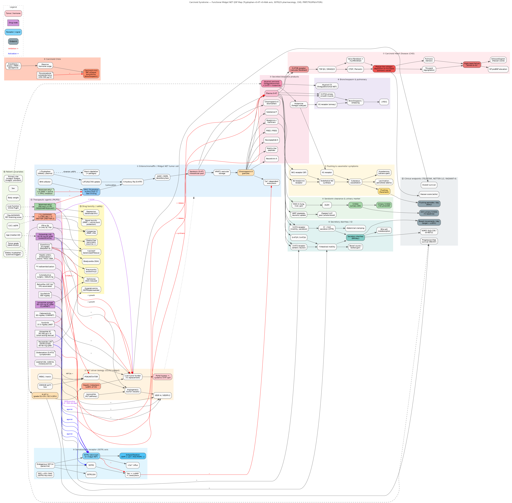</a> | 잘 분화된 회장·공장 기원 신경내분비종양(midgut NET, Ki-67 < 20%, WHO G1/G2)이 간 전이 시 portal-bypass로 시스템 순환에 5-HT를 방출 → 카르시노이드 증후군 3대 증상: ① 안면·경부 flushing(NK1·B2-bradykinin·H1 → eNOS-NO·혈관확장, 5-HT2B 보조), ② 분비성…<br>[🗺️ 지도](carcinoid-syndrome/carcsyn_qsp_model.svg) · [⚙️ mrgsolve](carcinoid-syndrome/carcsyn_mrgsolve_model.R) · [📚 문헌](carcinoid-syndrome/carcsyn_references.md) · [📄 README](carcinoid-syndrome/README.md) |
| 68 | 심혈관 | [**심인성 쇼크**<br><sub>Cardiogenic Shock · CS</sub>](cardiogenic-shock/) | <a href="cardiogenic-shock/cs_qsp_model.svg">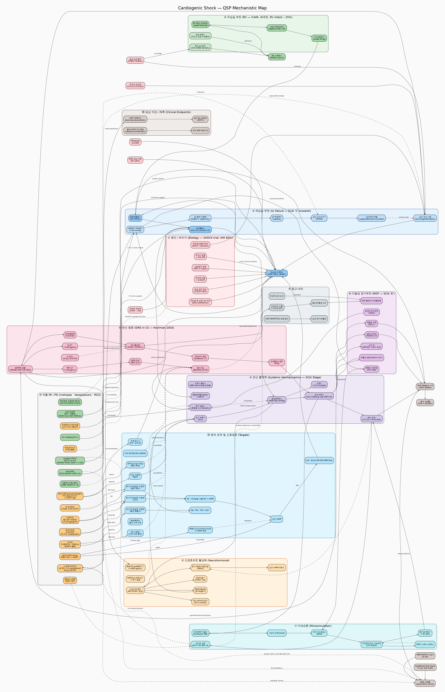</a> | 심장 펌프 기능의 1차 부전으로 인한 조직 저관류 증후군(SHOCK trial: 80% AMI 기원). LV 수축력 저하(EF<30%·dP/dt↓)·SV<35mL·CI<2.2 → MAP<65 → SCAI A→E 5단계 진행.<br>[🗺️ 지도](cardiogenic-shock/cs_qsp_model.svg) · [⚙️ mrgsolve](cardiogenic-shock/cs_mrgsolve_model.R) · [📚 문헌](cardiogenic-shock/cs_references.md) · [📄 README](cardiogenic-shock/README.md) |
| 69 | 소화기·간담도 | [**셀리악병**<br><sub>Celiac Disease · CD</sub>](celiac-disease/) | <a href="celiac-disease/cd_qsp_model.svg"></a> | 글루텐-tTG 면역반응(HLA-DQ2/8)으로 융모 위축. 글루텐 제거식 및 글루텐분해효소 신약.<br>[🗺️ 지도](celiac-disease/cd_qsp_model.svg) · [⚙️ mrgsolve](celiac-disease/cd_mrgsolve_model.R) · [📚 문헌](celiac-disease/cd_references.md) · [📄 README](celiac-disease/README.md) |
| 70 | 내분비·대사 | [**중추성 성조숙증**<br><sub>Central Precocious Puberty · CPP</sub>](central-precocious-puberty/) | <a href="central-precocious-puberty/cpp_qsp_model.svg"></a> | 각인 유전자 MKRN3 브레이크가 풀려 KNDy 박동발생기가 조기 활성화되는 질환으로, 에스트라디올이 성장속도를 올리면서 동시에 성장판 예비능을 소모하기 때문에 GnRH 작용제의 신장 이득은 치료 시작 시점의 골연령이 결정한다.<br>[🗺️ 지도](central-precocious-puberty/cpp_qsp_model.svg) · [⚙️ mrgsolve](central-precocious-puberty/cpp_mrgsolve_model.R) · [📚 문헌](central-precocious-puberty/cpp_references.md) · [📄 README](central-precocious-puberty/README.md) |
| 71 | 종양 | [**자궁경부암 (Cervical Cancer)**<br><sub>Cervical Cancer · CC</sub>](cervical-cancer/) | <a href="cervical-cancer/cc_qsp_model.svg"></a> | 전 세계 여성암 4위(GLOBOCAN 2020, 연간 약 66만 명 진단·35만 명 사망)를 차지하는 사실상 전예 HPV(고위험군, 특히 HPV16/18) 지속감염 기인암으로, 바이러스 종양단백 E6이 E6AP 매개 유비퀴틴-프로테아좀 경로로 p53을 분해해 G1 체크포인트를 소실시키고 E7은 pRb에 결합해 E2F를 방출함으로써 세포주기…<br>[🗺️ 지도](cervical-cancer/cc_qsp_model.svg) · [⚙️ mrgsolve](cervical-cancer/cc_mrgsolve_model.R) · [📚 문헌](cervical-cancer/cc_references.md) · [📄 README](cervical-cancer/README.md) |
| 72 | 신경 | [**경부 근긴장이상 (CD)**<br><sub>Cervical Dystonia · CDYS</sub>](cervical-dystonia/) | <a href="cervical-dystonia/cdys_qsp_model.svg"></a> | 보툴리눔 독소 용량-반응 곡선이 평탄해지는 지점을 약리학적 포화가 아니라 주사가 실제로 도달한 근육 비율의 측정값으로 읽어, 지속 효과의 상한이 용량이 아닌 기하학으로 정해짐을 보인다.<br>[🗺️ 지도](cervical-dystonia/cdys_qsp_model.svg) · [⚙️ mrgsolve](cervical-dystonia/cdys_mrgsolve_model.R) · [📚 문헌](cervical-dystonia/cdys_references.md) · [📄 README](cervical-dystonia/README.md) |
| 73 | 감염 | [**샤가스병 / 만성 샤가스 심근병증**<br><sub>Chagas Disease · CCC</sub>](chagas-disease/) | <a href="chagas-disease/chg_qsp_model.svg"></a> | 네 개의 무작위 임상시험 결과를 살해·휴면 저장소·심근 재형성이라는 세 개의 분리된 시간 규모로 재구성하여, 혈중 qPCR이 측정하는 축과 치유를 만드는 축이 서로 다르다는 데서 트리파노시드제의 역설이 유도된다.<br>[🗺️ 지도](chagas-disease/chg_qsp_model.svg) · [⚙️ mrgsolve](chagas-disease/chg_mrgsolve_model.R) · [📚 문헌](chagas-disease/chg_references.md) · [📄 README](chagas-disease/README.md) |
| 74 | 신경 | [**샤르코-마리-투스병 1A형 (CMT1A)**<br><sub>Charcot-Marie-Tooth Disease Type 1A · CMT1A</sub>](charcot-marie-tooth-1a/) | <a href="charcot-marie-tooth-1a/cmt1a_qsp_model.svg"></a> | 17p11.2 1.4-Mb 중복으로 PMP22 사본이 3개가 되는 유전자 용량 신경병증으로, 치료 표적이 최소화가 아니라 정상 비율의 회복이어서 과소 억제와 과다 억제 양쪽에 벽이 있는 내부 최적점을 가진다.<br>[🗺️ 지도](charcot-marie-tooth-1a/cmt1a_qsp_model.svg) · [⚙️ mrgsolve](charcot-marie-tooth-1a/cmt1a_mrgsolve_model.R) · [📚 문헌](charcot-marie-tooth-1a/cmt1a_references.md) · [📄 README](charcot-marie-tooth-1a/README.md) |
| 75 | 종양 | [**항암화학요법 유발 구역·구토 (CINV)**<br><sub>Chemotherapy-Induced Nausea and Vomiting · CINV</sub>](chemotherapy-induced-nausea-vomiting/) | <a href="chemotherapy-induced-nausea-vomiting/cinv_qsp_model.svg"></a> | 구토 지표를 백분율이 아니라 가산적 구동의 위험함수 적분의 지수함수로 기술하여, 모든 항구토제가 합에서 항 하나만 제거한다는 구조에서 급성·지연기의 분리와 4제 병용의 겉보기 상승효과가 함께 유도된다.<br>[🗺️ 지도](chemotherapy-induced-nausea-vomiting/cinv_qsp_model.svg) · [⚙️ mrgsolve](chemotherapy-induced-nausea-vomiting/cinv_mrgsolve_model.R) · [📚 문헌](chemotherapy-induced-nausea-vomiting/cinv_references.md) · [📄 README](chemotherapy-induced-nausea-vomiting/README.md) |
| 76 | 종양 | [**항암화학요법 유발 호중구감소증·발열성 호중구감소증 (CIN/FN)**<br><sub>Chemotherapy-Induced Neutropenia · CIN</sub>](chemotherapy-induced-neutropenia/) | <a href="chemotherapy-induced-neutropenia/cin_qsp_model.svg"></a> | 세포독성 항암제가 순환 중인 호중구가 아니라 골수의 증식기 전구세포를 죽이며, 고정된 성숙 지연선(MTT 89시간)이 그 결손을 언제 혈액에서 보이게 할지를 결정하므로 최저치의 깊이·시점·지속기간이 서로 다른 파라미터에 의해 지배된다.<br>[🗺️ 지도](chemotherapy-induced-neutropenia/cin_qsp_model.svg) · [⚙️ mrgsolve](chemotherapy-induced-neutropenia/cin_mrgsolve_model.R) · [📚 문헌](chemotherapy-induced-neutropenia/cin_references.md) · [📄 README](chemotherapy-induced-neutropenia/README.md) |
| 77 | 종양 | [**항암화학요법 유발 말초신경병증 (CIPN)**<br><sub>Chemotherapy-Induced Peripheral Neuropathy · CIPN</sub>](chemotherapy-induced-peripheral-neuropathy/) | <a href="chemotherapy-induced-peripheral-neuropathy/cipn_qsp_model.svg"></a> | 신경독성 항암제 노출이 DRG와 원위 축삭을 손상시키고 SARM1 축삭사멸 프로그램을 통해 투여 종료 후에도 수주간 악화되는 말초신경병증으로, 누적용량의 치료지수 최적점과 Cmax 대 AUC 분리를 정량화한다.<br>[🗺️ 지도](chemotherapy-induced-peripheral-neuropathy/cipn_qsp_model.svg) · [⚙️ mrgsolve](chemotherapy-induced-peripheral-neuropathy/cipn_mrgsolve_model.R) · [📚 문헌](chemotherapy-induced-peripheral-neuropathy/cipn_references.md) · [📄 README](chemotherapy-induced-peripheral-neuropathy/README.md) |
| 78 | 종양 | [**담관암 (담도암)**<br><sub>Cholangiocarcinoma · CCA</sub>](cholangiocarcinoma/) | <a href="cholangiocarcinoma/cca_qsp_model.svg"></a> | 전달된 항암제 용량을 입력이 아니라 빌리루빈·호중구·신기능·수행상태가 결정하는 출력으로 두어, 항종양 작용이 없는 담도 배액이 생존을 바꾸는 경로를 54-ODE로 기술한다.<br>[🗺️ 지도](cholangiocarcinoma/cca_qsp_model.svg) · [⚙️ mrgsolve](cholangiocarcinoma/cca_mrgsolve_model.R) · [📚 문헌](cholangiocarcinoma/cca_references.md) · [📄 README](cholangiocarcinoma/README.md) |
| 79 | 소화기·간담도 | [**담석증**<br><sub>Cholelithiasis · CHOL</sub>](cholelithiasis/) | <a href="cholelithiasis/chol_qsp_model.svg"></a> | 담즙 콜레스테롤 과포화·담낭 정체에 의한 결석 형성. 우르소데옥시콜산 용해 요법.<br>[🗺️ 지도](cholelithiasis/chol_qsp_model.svg) · [⚙️ mrgsolve](cholelithiasis/chol_mrgsolve_model.R) · [📚 문헌](cholelithiasis/chol_references.md) · [📄 README](cholelithiasis/README.md) |
| 80 | 소화기·간담도 | [**만성 위염**<br><sub>Chronic Gastritis · CGAST</sub>](chronic-gastritis/) | <a href="chronic-gastritis/cgast_qsp_model.svg"></a> | H. pylori-Correa 연쇄(위축→장상피화생→이형성). 제균요법·PPI의 점막 회복 효과.<br>[🗺️ 지도](chronic-gastritis/cgast_qsp_model.svg) · [⚙️ mrgsolve](chronic-gastritis/cgast_mrgsolve_model.R) · [📚 문헌](chronic-gastritis/cgast_references.md) · [📄 README](chronic-gastritis/README.md) |
| 81 | 소화기·간담도 | [**만성 B형 간염**<br><sub>Chronic Hepatitis B · CHB</sub>](chronic-hepatitis-b/) | <a href="chronic-hepatitis-b/chb_qsp_model.svg"></a> | HBV cccDNA 지속과 면역 매개 간손상. 뉴클레오시드유사체·페그IFN의 바이러스 억제.<br>[🗺️ 지도](chronic-hepatitis-b/chb_qsp_model.svg) · [⚙️ mrgsolve](chronic-hepatitis-b/chb_mrgsolve_model.R) · [📚 문헌](chronic-hepatitis-b/chb_references.md) · [📄 README](chronic-hepatitis-b/README.md) |
| 82 | 소화기·간담도 | [**만성 C형 간염**<br><sub>Chronic Hepatitis C · CHC/HCV</sub>](chronic-hepatitis-c/) | <a href="chronic-hepatitis-c/HCV_qsp_model.svg"></a> | Perelson 표적세포 제한 바이러스 동역학(T/I/V ODE)에 DAA PK/PD 통합. SOF/LED·SOF/VEL·GLE/PIB·PEG-IFN/RBV 7개 시나리오. NS5B·NS5A·NS3 억제 효능(εp/εi), CTL 소진, 간섬유화(Metavir F-score), HCC 위험 모델링.<br>[🗺️ 지도](chronic-hepatitis-c/HCV_qsp_model.svg) · [⚙️ mrgsolve](chronic-hepatitis-c/HCV_mrgsolve_model.R) · [📚 문헌](chronic-hepatitis-c/HCV_references.md) · [📄 README](chronic-hepatitis-c/README.md) |
| 83 | 소화기·간담도 | [**만성 D형 간염**<br><sub>Chronic Hepatitis D · HDV</sub>](chronic-hepatitis-d/) | <a href="chronic-hepatitis-d/hdv_qsp_model.svg"></a> | HDV를 숙주가 만드는 유전체와 HBV가 공급하는 HBsAg 외피의 두 기질 조립 라인으로 놓아 모든 약을 끊는 플럭스로 분류한 모델로, 담즙산 상승 배수에서 역산한 NTCP 점유율은 2 mg에서 0.71에 불과한데도 분열매개·세포간 전파가 유입의 40%를 담당해 진입억제 자체의 천장을 만든다.<br>[🗺️ 지도](chronic-hepatitis-d/hdv_qsp_model.svg) · [⚙️ mrgsolve](chronic-hepatitis-d/hdv_mrgsolve_model.R) · [📚 문헌](chronic-hepatitis-d/hdv_references.md) · [📄 README](chronic-hepatitis-d/README.md) |
| 84 | 신장·비뇨 | [**만성 고칼륨혈증**<br><sub>Chronic Hyperkalaemia · HK</sub>](chronic-hyperkalemia/) | <a href="chronic-hyperkalemia/hk_qsp_model.svg"></a> | 혈청 칼륨을 저장고가 아니라 총량과 세포내외 분배의 비로 놓은 모델로, 인슐린과 칼슘은 한 mmol도 제거하지 않는 반면 결합제만 총량을 줄이며 MRA는 칼륨을 올리는 것이 아니라 고칼륨혈증 역치 eGFR을 11에서 21로 끌어올린다.<br>[🗺️ 지도](chronic-hyperkalemia/hk_qsp_model.svg) · [⚙️ mrgsolve](chronic-hyperkalemia/hk_mrgsolve_model.R) · [📚 문헌](chronic-hyperkalemia/hk_references.md) · [📄 README](chronic-hyperkalemia/README.md) |
| 85 | 내분비·대사 | [**만성 갑상선 기능 저하증**<br><sub>Chronic Hypothyroidism · HYPO</sub>](chronic-hypothyroidism/) | <a href="chronic-hypothyroidism/hypo_qsp_model.svg"></a> | 시상하부-뇌하수체-갑상선 축 저하(TSH↑/FT4↓). 레보티록신 보충의 용량-반응.<br>[🗺️ 지도](chronic-hypothyroidism/hypo_qsp_model.svg) · [⚙️ mrgsolve](chronic-hypothyroidism/hypo_mrgsolve_model.R) · [📚 문헌](chronic-hypothyroidism/hypo_references.md) · [📄 README](chronic-hypothyroidism/README.md) |
| 86 | 신경 | [**만성 불면장애 (CID)**<br><sub>Chronic Insomnia Disorder · CID</sub>](chronic-insomnia-disorder/) | <a href="chronic-insomnia-disorder/ins_qsp_model.svg"></a> | 두 과정 모형과 VLPO-각성계 flip-flop 스위치 위에 24시간 과각성과 스필만 3-P 유지 고리를 얹어, 수면제는 스위치를 CBT-I는 유지 고리를 표적한다는 비대칭을 재현한 63-ODE 모델이다.<br>[🗺️ 지도](chronic-insomnia-disorder/ins_qsp_model.svg) · [⚙️ mrgsolve](chronic-insomnia-disorder/ins_mrgsolve_model.R) · [📚 문헌](chronic-insomnia-disorder/ins_references.md) · [📄 README](chronic-insomnia-disorder/README.md) |
| 87 | 신장·비뇨 | [**만성 신부전**<br><sub>Chronic Kidney Disease · CKD</sub>](chronic-kidney-disease/) | <a href="chronic-kidney-disease/ckd_qsp_model.svg"></a> | 사구체 과여과·섬유화로 eGFR 진행성 저하. RAAS 억제·SGLT2i·피네레논 신보호.<br>[🗺️ 지도](chronic-kidney-disease/ckd_qsp_model.svg) · [⚙️ mrgsolve](chronic-kidney-disease/ckd_mrgsolve_model.R) · [📚 문헌](chronic-kidney-disease/ckd_references.md) · [📄 README](chronic-kidney-disease/README.md) |
| 88 | 종양 | [**만성 림프구성 백혈병**<br><sub>Chronic Lymphocytic Leukemia · CLL</sub>](chronic-lymphocytic-leukemia/) | <a href="chronic-lymphocytic-leukemia/cll_qsp_model.svg"></a> | CD19⁺CD5⁺CD23⁺ 단클론 B세포 축적(서구권 성인 가장 흔한 백혈병).<br>[🗺️ 지도](chronic-lymphocytic-leukemia/cll_qsp_model.svg) · [⚙️ mrgsolve](chronic-lymphocytic-leukemia/cll_mrgsolve_model.R) · [📚 문헌](chronic-lymphocytic-leukemia/cll_references.md) · [📄 README](chronic-lymphocytic-leukemia/README.md) |
| 89 | 종양 | [**만성 골수성 백혈병 (CML)**<br><sub>Chronic Myeloid Leukemia · CML</sub>](chronic-myeloid-leukemia/) | <a href="chronic-myeloid-leukemia/cml_qsp_model.svg"></a> | BCR-ABL 융합 티로신키나아제 구동 백혈병. 이매티닙 등 TKI·T315I 내성·무치료 관해(TFR).<br>[🗺️ 지도](chronic-myeloid-leukemia/cml_qsp_model.svg) · [⚙️ mrgsolve](chronic-myeloid-leukemia/cml_mrgsolve_model.R) · [📚 문헌](chronic-myeloid-leukemia/cml_references.md) · [📄 README](chronic-myeloid-leukemia/README.md) |
| 90 | 감염 | [**만성 골수염 · 임플란트 연관 골감염**<br><sub>Chronic Osteomyelitis · COM</sub>](chronic-osteomyelitis/) | <a href="chronic-osteomyelitis/com_qsp_model.svg"></a> | 만성 골수염을 항생제 감수성 문제가 아니라 곱해지는 두 벌점으로 기술하여, 관류 없는 격리골로의 확산 손실과 성장속도 의존 살균의 붕괴가 겹치면서 수술·리팜핀·기간이 각각 초기조건·살균천장·도달시간이라는 다른 대상을 건드린다는 것을 보인다.<br>[🗺️ 지도](chronic-osteomyelitis/com_qsp_model.svg) · [⚙️ mrgsolve](chronic-osteomyelitis/com_mrgsolve_model.R) · [📚 문헌](chronic-osteomyelitis/com_references.md) · [📄 README](chronic-osteomyelitis/README.md) |
| 91 | 소화기·간담도 | [**만성 췌장염**<br><sub>Chronic Pancreatitis · CP</sub>](chronic-pancreatitis/) | <a href="chronic-pancreatitis/cp_qsp_model.svg"></a> | 반복 손상 → 췌성상세포 활성·섬유화·외분비 부전. 효소보충·통증관리 전략.<br>[🗺️ 지도](chronic-pancreatitis/cp_qsp_model.svg) · [⚙️ mrgsolve](chronic-pancreatitis/cp_mrgsolve_model.R) · [📚 문헌](chronic-pancreatitis/cp_references.md) · [📄 README](chronic-pancreatitis/README.md) |
| 92 | 신장·비뇨 | [**만성 신우신염**<br><sub>Chronic Pyelonephritis · CPN</sub>](chronic-pyelonephritis/) | <a href="chronic-pyelonephritis/cpn_qsp_model.svg">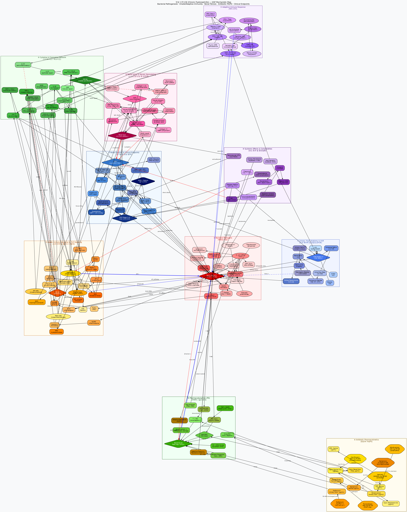</a> | 반복 신장 감염·역류로 인한 신실질 흉터·신기능 저하. 항생제·역류 교정.<br>[🗺️ 지도](chronic-pyelonephritis/cpn_qsp_model.svg) · [⚙️ mrgsolve](chronic-pyelonephritis/cpn_mrgsolve_model.R) · [📚 문헌](chronic-pyelonephritis/cpn_references.md) · [📄 README](chronic-pyelonephritis/README.md) |
| 93 | 호흡기 | [**만성 비부비동염 동반 비용종**<br><sub>Chronic Rhinosinusitis with Nasal Polyps · CRSwNP</sub>](chronic-rhinosinusitis-with-nasal-polyps/) | <a href="chronic-rhinosinusitis-with-nasal-polyps/crsnp_qsp_model.svg">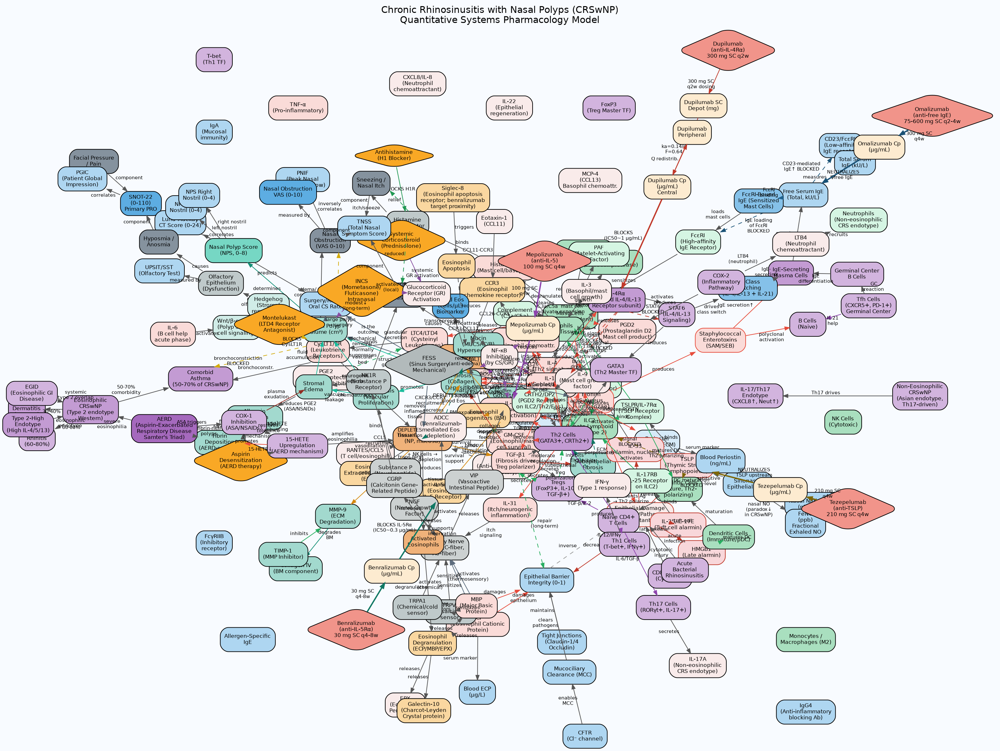</a> | 비강·부비동 상피세포 손상 → TSLP·IL-33·IL-25 경보소(alarmin) 방출 → ILC2 활성화·수지상세포 Th2 성숙화 → IL-4/IL-5/IL-13 폭포 → IgE 클래스 전환·호산구 동원·배상세포 과증식·점액 과분비.<br>[🗺️ 지도](chronic-rhinosinusitis-with-nasal-polyps/crsnp_qsp_model.svg) · [⚙️ mrgsolve](chronic-rhinosinusitis-with-nasal-polyps/crsnp_mrgsolve_model.R) · [📚 문헌](chronic-rhinosinusitis-with-nasal-polyps/crsnp_references.md) · [📄 README](chronic-rhinosinusitis-with-nasal-polyps/README.md) |
| 94 | 심혈관 | [**만성 혈전색전성 폐동맥 고혈압**<br><sub>Chronic Thromboembolic Pulmonary Hypertension · CTEPH</sub>](chronic-thromboembolic-pulmonary-hypertension/) | <a href="chronic-thromboembolic-pulmonary-hypertension/cteph_qsp_model.svg"></a> | 폐색전증 불완전 섬유용해 → 조직화 혈전(기계적 고정 PVR↑) + 이차 혈관 리모델링(ET-1↑·NO↓·PGI₂↓·SMC 증식) → 총 PVR↑ → 우심실 압력 과부하·비후·확장·부전 → CO↓·SaO₂↓·6MWD↓. tPA 결핍·PAI-1↑·비정상 피브린 가교로 섬유용해 장애.<br>[🗺️ 지도](chronic-thromboembolic-pulmonary-hypertension/cteph_qsp_model.svg) · [⚙️ mrgsolve](chronic-thromboembolic-pulmonary-hypertension/cteph_mrgsolve_model.R) · [📚 문헌](chronic-thromboembolic-pulmonary-hypertension/cteph_references.md) · [📄 README](chronic-thromboembolic-pulmonary-hypertension/README.md) |
| 95 | 피부 | [**만성 자발성 두드러기**<br><sub>Chronic Spontaneous Urticaria · CSU</sub>](chronic-urticaria/) | <a href="chronic-urticaria/csu_qsp_model.svg"></a> | IgE/FcεRI-비만세포 축 → 팽진·홍반·소양감 — 자가항체(anti-FcεRIα·anti-IgE) 또는 자가항원-IgE → FcεRI 교차결합 → 비만세포 탈과립(히스타민·PGD2·LTC4) + IL-31·IL-33·TSLP Type-2 사이토카인 망 → 지속적 두드러기.<br>[🗺️ 지도](chronic-urticaria/csu_qsp_model.svg) · [⚙️ mrgsolve](chronic-urticaria/csu_mrgsolve_model.R) · [📚 문헌](chronic-urticaria/csu_references.md) · [📄 README](chronic-urticaria/README.md) |
| 96 | 심혈관 | [**만성 정맥 부전**<br><sub>Chronic Venous Insufficiency · CVI</sub>](chronic-venous-insufficiency/) | <a href="chronic-venous-insufficiency/cvi_qsp_model.svg"></a> | 판막 부전·정맥압 상승·백혈구 트래핑에 의한 부종·궤양. 정맥활성약(MPFF)·압박요법.<br>[🗺️ 지도](chronic-venous-insufficiency/cvi_qsp_model.svg) · [⚙️ mrgsolve](chronic-venous-insufficiency/cvi_mrgsolve_model.R) · [📚 문헌](chronic-venous-insufficiency/cvi_references.md) · [📄 README](chronic-venous-insufficiency/README.md) |
| 97 | 신경 | [**만성 염증성 탈수초성 다발신경병증 (CIDP)**<br><sub>Chronic Inflammatory Demyelinating Polyneuropathy · CIDP</sub>](cidp/) | <a href="cidp/cidp_qsp_model.svg"></a> | 자가면역 말이집 파괴에 의한 진행/재발성 신경병증. IVIG·스테로이드·혈장교환.<br>[🗺️ 지도](cidp/cidp_qsp_model.svg) · [⚙️ mrgsolve](cidp/cidp_mrgsolve_model.R) · [📚 문헌](cidp/cidp_references.md) · [📄 README](cidp/README.md) |
| 98 | 호흡기 | [**시스플라틴 유발 이독성 (CIO)**<br><sub>Cisplatin-Induced Ototoxicity · CIO</sub>](cisplatin-induced-ototoxicity/) | <a href="cisplatin-induced-ototoxicity/cio_qsp_model.svg"></a> | 와우 백금을 농도가 아니라 저장고로, 도달 경로를 혈장에서 유모세포까지의 캐스케이드로 기술하여 6시간 지연 티오황산염의 치료 시간창을 하나의 시간 지연에서 유도.<br>[🗺️ 지도](cisplatin-induced-ototoxicity/cio_qsp_model.svg) · [⚙️ mrgsolve](cisplatin-induced-ototoxicity/cio_mrgsolve_model.R) · [📚 문헌](cisplatin-induced-ototoxicity/cio_references.md) · [📄 README](cisplatin-induced-ototoxicity/README.md) |
| 99 | 신장·비뇨 | [**CKD-미네랄골질환 (CKD-MBD)**<br><sub>CKD-Mineral Bone Disorder · FGF23</sub>](ckd-mineral-bone-disorder/) | <a href="ckd-mineral-bone-disorder/ckdmbd_qsp_model.svg">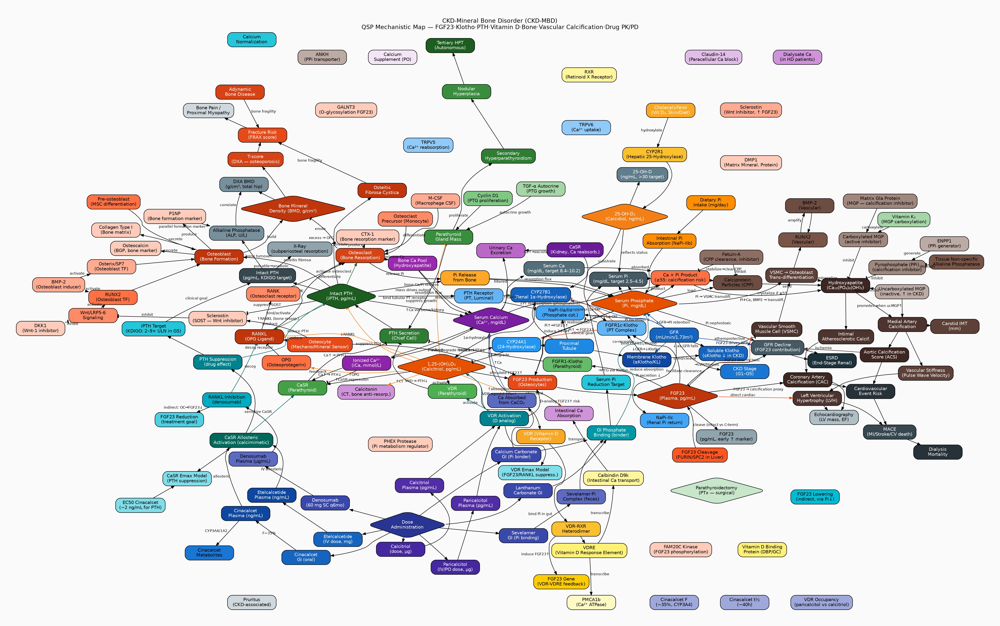</a> | GFR 저하 → FGF23↑↑ + Klotho↓ → CYP27B1 억제 → 1,25-(OH)₂D₃ 결핍 → CaSR 저감수성 → 이차성 부갑상선 기능항진증(iPTH↑) + 고인산혈증·저칼슘혈증 → RANKL/OPG 불균형·스클레로스틴↑ → 골이영양증(골화석증·무동성골·혼합형) + VSMC 골아세포 분화·MGP 탈카르복실화·Fetuin-A…<br>[🗺️ 지도](ckd-mineral-bone-disorder/ckdmbd_qsp_model.svg) · [⚙️ mrgsolve](ckd-mineral-bone-disorder/ckdmbd_mrgsolve_model.R) · [📚 문헌](ckd-mineral-bone-disorder/ckdmbd_references.md) · [📄 README](ckd-mineral-bone-disorder/README.md) |
| 100 | 감염 | [**클로스트리디오이데스 디피실 감염 (CDI)**<br><sub>Clostridioides difficile Infection · CDI</sub>](clostridioides-difficile-infection/) | <a href="clostridioides-difficile-infection/cdi_qsp_model.svg"></a> | 항생제로 무너진 담즙산 대사와 영양 니치가 포자 발아를 허용해 독소성 대장염을 만들고, 치료가 끝나도 회복되지 않은 미생물 길드가 재발을 부르는 과정을 다룬다.<br>[🗺️ 지도](clostridioides-difficile-infection/cdi_qsp_model.svg) · [⚙️ mrgsolve](clostridioides-difficile-infection/cdi_mrgsolve_model.R) · [📚 문헌](clostridioides-difficile-infection/cdi_references.md) · [📄 README](clostridioides-difficile-infection/README.md) |
| 101 | 신경 | [**군발두통 (CH)**<br><sub>Cluster Headache · TAC</sub>](cluster-headache/) | <a href="cluster-headache/ch_qsp_model.svg">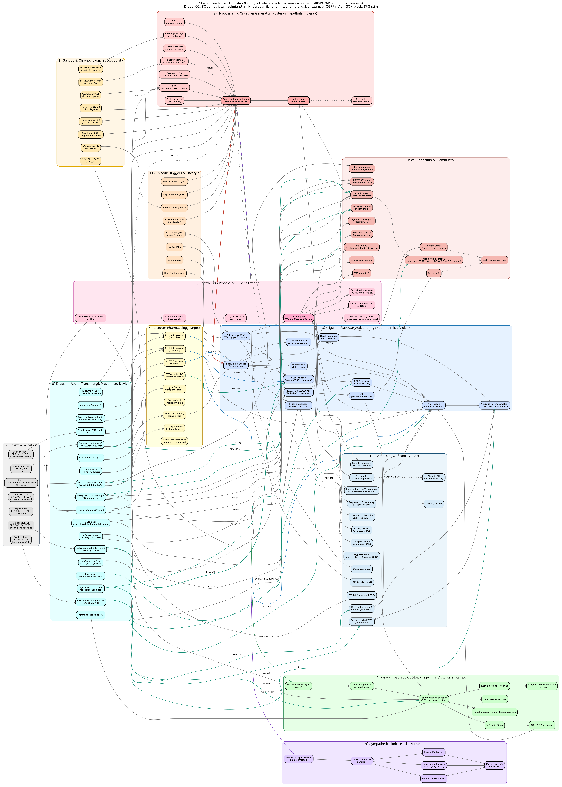</a> | HCRTR2·ADCYAP1·MTNR1A·CLOCK/BMAL1* 등 위험 좌위 + 가족력 ×5-18 + 흡연 → 시상하부 후방회백질 활성 → SCN/PVN/orexin 일주기 게이트(피크 ~03:00) + 멜라토닌·테스토스테론·코르티솔 야간 트로프 → V1 삼차신경절(Trigeminovascular) 활성·dura·ICA·pial vesse…<br>[🗺️ 지도](cluster-headache/ch_qsp_model.svg) · [⚙️ mrgsolve](cluster-headache/ch_mrgsolve_model.R) · [📚 문헌](cluster-headache/ch_references.md) · [📄 README](cluster-headache/README.md) |
| 102 | 혈액 | [**한랭응집소병**<br><sub>Cold Agglutinin Disease · CAD</sub>](cold-agglutinin-disease/) | <a href="cold-agglutinin-disease/cad_qsp_model.svg">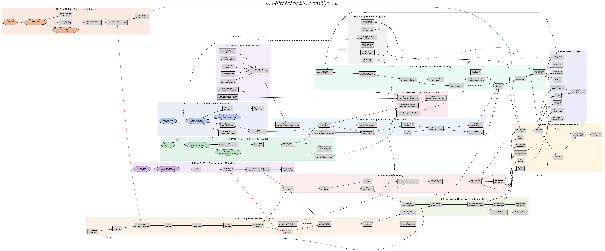</a> | 클론성 골수 B세포가 분비하는 단클론 IgM 한랭응집소가 저온에서 적혈구에 결합해 고전경로 보체를 활성화시켜 C3b 매개 간 쿠퍼세포 혈관외 용혈과 C5b-9 매개 혈관내 용혈을 유발하는 스테로이드 불응성 질환. 리툭시맙·벤다무스틴·수티림맙·페그세타코플란.<br>[🗺️ 지도](cold-agglutinin-disease/cad_qsp_model.svg) · [⚙️ mrgsolve](cold-agglutinin-disease/cad_mrgsolve_model.R) · [📚 문헌](cold-agglutinin-disease/cad_references.md) · [📄 README](cold-agglutinin-disease/README.md) |
| 103 | 종양 | [**대장암**<br><sub>Colorectal Cancer · CRC</sub>](colorectal-cancer/) | <a href="colorectal-cancer/crc_qsp_model.svg"></a> | APC/Wnt·KRAS/MAPK·PI3K/TP53 경로 통합, MSI-H/CMS 아형, 종양 미세환경(CD8/Treg/MDSC/TAM), 혈관신생(VEGF/VEGFR). 5-FU/옥살리플라틴/이리노테칸(UGT1A1)·베바시주맙(TMDD)·세툭시맙·펨브롤리주맙(MSI-H) PK/PD.<br>[🗺️ 지도](colorectal-cancer/crc_qsp_model.svg) · [⚙️ mrgsolve](colorectal-cancer/crc_mrgsolve_model.R) · [📚 문헌](colorectal-cancer/crc_references.md) · [📄 README](colorectal-cancer/README.md) |
| 104 | 면역결핍 | [**보통 가변 면역결핍증 (CVID)**<br><sub>Common Variable Immunodeficiency · CVID</sub>](common-variable-immunodeficiency/) | <a href="common-variable-immunodeficiency/cvid_qsp_model.svg"></a> | 하나의 검사실 정의를 공유하는 두 질환으로, 항체결핍 팔은 혈청 IgG 농도로 정량 예측되고 보충요법이 해결하지만 면역조절이상 팔(GLILD·자가면역 세포감소증·장병증)은 보충요법이 움직이지 못하며 사망을 결정합니다.<br>[🗺️ 지도](common-variable-immunodeficiency/cvid_qsp_model.svg) · [⚙️ mrgsolve](common-variable-immunodeficiency/cvid_mrgsolve_model.R) · [📚 문헌](common-variable-immunodeficiency/cvid_references.md) · [📄 README](common-variable-immunodeficiency/README.md) |
| 105 | 감염 | [**지역사회획득 폐렴 (CAP)**<br><sub>Community-Acquired Pneumonia · CAP</sub>](community-acquired-pneumonia/) | <a href="community-acquired-pneumonia/cap_qsp_model.svg"></a> | β-락탐의 살균이 곧 세포벽·뉴몰라이신 방출이라는 점에서 출발해, fT>MIC와 fAUC/MIC를 파라미터가 아닌 적분 결과로 두고, 코르티코스테로이드 순효과의 부호가 균 감수성에 따라 뒤집히는 과정을 38-ODE로 기술한다.<br>[🗺️ 지도](community-acquired-pneumonia/cap_qsp_model.svg) · [⚙️ mrgsolve](community-acquired-pneumonia/cap_mrgsolve_model.R) · [📚 문헌](community-acquired-pneumonia/cap_references.md) · [📄 README](community-acquired-pneumonia/README.md) |
| 106 | 신경 | [**복합부위통증증후군 (CRPS)**<br><sub>Complex Regional Pain Syndrome · CRPS</sub>](complex-regional-pain-syndrome/) | <a href="complex-regional-pain-syndrome/crps_qsp_model.svg"></a> | 골절·수술 후 한 사지에 국한되어 신경성 염증·자가항체·교감신경-구심신경 결합·조직 저산소·척수 감작·피질 재구성·불용성 골소실이 겹치는 만성 통증 증후군으로, 빠르게 소멸하는 말초 노드와 느린 행동-피질 고리·교세포 잠금을 분리해 치료 창(약 90일)과 약물별 시기 의존성을 계산한다.<br>[🗺️ 지도](complex-regional-pain-syndrome/crps_qsp_model.svg) · [⚙️ mrgsolve](complex-regional-pain-syndrome/crps_mrgsolve_model.R) · [📚 문헌](complex-regional-pain-syndrome/crps_references.md) · [📄 README](complex-regional-pain-syndrome/README.md) |
| 107 | 내분비·대사 | [**선천성 부신 과형성 (CAH)**<br><sub>Congenital Adrenal Hyperplasia · CAH</sub>](congenital-adrenal-hyperplasia/) | <a href="congenital-adrenal-hyperplasia/cah_qsp_model.svg"></a> | 21-수산화효소 결핍으로 코르티솔 결핍·안드로겐 과잉. 글루코코르티코이드 보충·크리네세르폰트(CRF1 길항).<br>[🗺️ 지도](congenital-adrenal-hyperplasia/cah_qsp_model.svg) · [⚙️ mrgsolve](congenital-adrenal-hyperplasia/cah_mrgsolve_model.R) · [📚 문헌](congenital-adrenal-hyperplasia/cah_references.md) · [📄 README](congenital-adrenal-hyperplasia/README.md) |
| 108 | 부인·생식 | [**조절 난소 자극 (COS)**<br><sub>Controlled Ovarian Stimulation · COS</sub>](controlled-ovarian-stimulation/) | <a href="controlled-ovarian-stimulation/cos_qsp_model.svg"></a> | 체외수정 난소 자극에서 수확량과 OHSS를 같은 과립세포 질량의 두 읽기로 기술하여, FSH 용량으로는 분리되지 않고 트리거의 모양(성숙은 신호의 앞머리, OHSS는 면적)만이 분리한다는 것을 유도한다.<br>[🗺️ 지도](controlled-ovarian-stimulation/cos_qsp_model.svg) · [⚙️ mrgsolve](controlled-ovarian-stimulation/cos_mrgsolve_model.R) · [📚 문헌](controlled-ovarian-stimulation/cos_references.md) · [📄 README](controlled-ovarian-stimulation/README.md) |
| 109 | 호흡기 | [**만성 폐쇄성 폐질환 (COPD)**<br><sub>Chronic Obstructive Pulmonary Disease · COPD</sub>](copd/) | <a href="copd/copd_qsp.svg"></a> | 흡연-산화스트레스·단백분해효소 불균형에 의한 기도/폐포 파괴. LABA/LAMA·ICS 기관지확장.<br>[🗺️ 지도](copd/copd_qsp.svg) · [⚙️ mrgsolve](copd/copd_mrgsolve_model.R) · [📚 문헌](copd/copd_references.md) · [📄 README](copd/README.md) |
| 110 | 심혈관 | [**관상동맥 미세혈관 기능장애 (CMD)**<br><sub>Coronary Microvascular Dysfunction · CMD</sub>](coronary-microvascular-dysfunction/) | <a href="coronary-microvascular-dysfunction/cmd_qsp_model.svg"></a> | CFR을 상태변수가 아니라 두 혈류의 비로 기술하여, 같은 낮은 CFR이 안정 혈류 과다(기능적)와 최대충혈 혈류 한계(구조적) 중 어디에서 왔는지에 따라 정반대의 약이 필요해지는 구조가 유도된다.<br>[🗺️ 지도](coronary-microvascular-dysfunction/cmd_qsp_model.svg) · [⚙️ mrgsolve](coronary-microvascular-dysfunction/cmd_mrgsolve_model.R) · [📚 문헌](coronary-microvascular-dysfunction/cmd_references.md) · [📄 README](coronary-microvascular-dysfunction/README.md) |
| 111 | 소화기·간담도 | [**크론병**<br><sub>Crohn's Disease · CD</sub>](crohn-disease/) | <a href="crohn-disease/cd_qsp_model.svg"></a> | Th1/Th17 경유 전층성 장 염증과 장벽 투과성. 항TNF·항IL-12/23·항인테그린 생물학제제.<br>[🗺️ 지도](crohn-disease/cd_qsp_model.svg) · [⚙️ mrgsolve](crohn-disease/cd_mrgsolve_model.R) · [📚 문헌](crohn-disease/cd_references.md) · [📄 README](crohn-disease/README.md) |
| 112 | 감염 | [**크립토콕쿠스 수막염 (HIV 연관)**<br><sub>HIV-associated Cryptococcal Meningitis · CM</sub>](cryptococcal-meningitis/) | <a href="cryptococcal-meningitis/cm_qsp_model.svg"></a> | 생존 효모(수일)와 이미 뇌척수액에 녹아 있는 협막다당(GXM, 반감기 약 13일)이라는 서로 다른 두 시계로 질환을 기술하여, 모든 임상시험 지표가 빠른 시계만 측정한다는 사실과 에르고스테롤 노드 하나가 아졸의 효과와 암포테리신 표적 상실을 동시에 만든다는 비대칭을 유도한다.<br>[🗺️ 지도](cryptococcal-meningitis/cm_qsp_model.svg) · [⚙️ mrgsolve](cryptococcal-meningitis/cm_mrgsolve_model.R) · [📚 문헌](cryptococcal-meningitis/cm_references.md) · [📄 README](cryptococcal-meningitis/README.md) |
| 113 | 내분비·대사 | [**쿠싱 증후군**<br><sub>Cushing's Syndrome · CS</sub>](cushings-syndrome/) | <a href="cushings-syndrome/cs_qsp_model.svg"></a> | 뇌하수체 ACTH 선종(쿠싱병 70%)·이소성 ACTH(10%)·부신 선종(15%) 등에 의한 만성 고코르티솔혈증.<br>[🗺️ 지도](cushings-syndrome/cs_qsp_model.svg) · [⚙️ mrgsolve](cushings-syndrome/cs_mrgsolve_model.R) · [📚 문헌](cushings-syndrome/cs_references.md) · [📄 README](cushings-syndrome/README.md) |
| 114 | 호흡기 | [**낭성 섬유증**<br><sub>Cystic Fibrosis · CF</sub>](cystic-fibrosis/) | <a href="cystic-fibrosis/cf_qsp_model.svg"></a> | CFTR 변이(ΔF508)에 의한 점액 점성↑·만성 기도 감염. CFTR 조절제(엘렉사/테자/이바카프토르, Trikafta).<br>[🗺️ 지도](cystic-fibrosis/cf_qsp_model.svg) · [⚙️ mrgsolve](cystic-fibrosis/cf_mrgsolve_model.R) · [📚 문헌](cystic-fibrosis/cf_references.md) · [📄 README](cystic-fibrosis/README.md) |
| 115 | 종양 | [**사이토카인 방출 증후군 (CRS)**<br><sub>Cytokine Release Syndrome · CRS</sub>](cytokine-release-syndrome/) | <a href="cytokine-release-syndrome/crs_qsp_model.svg"></a> | CAR-T세포/이중특이항체 투여 후 면역 이펙터 세포 대규모 활성화 → T세포 IFN-γ·IL-2·GM-CSF 폭발 → 대식세포 M1 극화(JAK-STAT1) → IL-6↑↑↑(★핵심 드라이버)·IL-1β(NLRP3 인플라마솜)·TNF-α — 내피세포 활성화(iNOS→NO↑→혈관확장→저혈압)·VEGF/ANG2→혈관 투과성↑→저산소증; 혈뇌…<br>[🗺️ 지도](cytokine-release-syndrome/crs_qsp_model.svg) · [⚙️ mrgsolve](cytokine-release-syndrome/crs_mrgsolve_model.R) · [📚 문헌](cytokine-release-syndrome/crs_references.md) · [📄 README](cytokine-release-syndrome/README.md) |
| 116 | 정신·신경 | [**루이소체 치매**<br><sub>Dementia with Lewy Bodies · DLB</sub>](dementia-with-lewy-bodies/) | <a href="dementia-with-lewy-bodies/dlb_qsp_model.svg"></a> | 세 상행 전달계 모두에서 전시냅스 병변은 심각하지만 후시냅스 수용체 지형은 계마다 다른 방향으로 재편된다는 하나의 구조로 콜린에스터라제 억제제 우월성·레보도파 반응 저하·신경이완제 민감성·피마반세린 효능을 동시에 유도하고, 인지 변동을 양안정 주의 상태의 분산으로 다룬 모델.<br>[🗺️ 지도](dementia-with-lewy-bodies/dlb_qsp_model.svg) · [⚙️ mrgsolve](dementia-with-lewy-bodies/dlb_mrgsolve_model.R) · [📚 문헌](dementia-with-lewy-bodies/dlb_references.md) · [📄 README](dementia-with-lewy-bodies/README.md) |
| 117 | 감염 | [**뎅기열 / 중증 뎅기 (DSS)**<br><sub>Dengue and Dengue Shock Syndrome · DENV</sub>](dengue/) | <a href="dengue/denv_qsp_model.svg"></a> | 하나의 항체 상승을 부호가 반대인 두 경로로 읽어 해열과 혈장 누출이 같은 사건의 두 관찰임을 유도하고, 누출이 오직 쇼크를 통해서만 멈추기 때문에 수액 용량-반응이 U자가 되는 구조를 계산한다.<br>[🗺️ 지도](dengue/denv_qsp_model.svg) · [⚙️ mrgsolve](dengue/denv_mrgsolve_model.R) · [📚 문헌](dengue/denv_references.md) · [📄 README](dengue/README.md) |
| 118 | 자가면역·류마티스 | [**피부근염**<br><sub>Dermatomyositis · DM</sub>](dermatomyositis/) | <a href="dermatomyositis/dm_qsp_model.svg">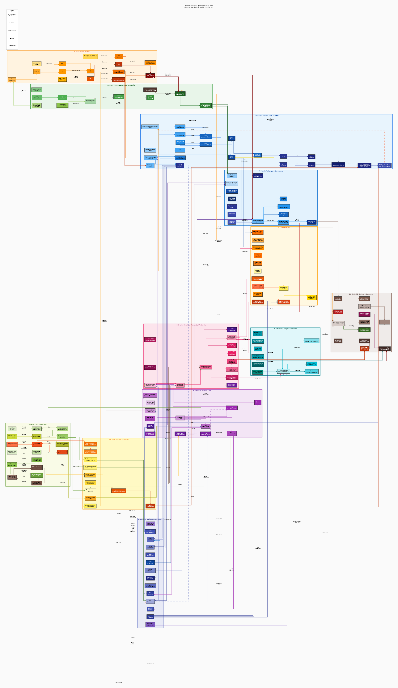</a> | I형 IFN·보체 매개 근육·피부 미세혈관병증. 스테로이드·IVIG·리툭시맙.<br>[🗺️ 지도](dermatomyositis/dm_qsp_model.svg) · [⚙️ mrgsolve](dermatomyositis/dm_mrgsolve_model.R) · [📚 문헌](dermatomyositis/dm_references.md) · [📄 README](dermatomyositis/README.md) |
| 119 | 내분비·대사 | [**요붕증 (AVP-D / AVP-R)**<br><sub>Diabetes Insipidus · Arginine Vasopressin Deficiency / Resistance</sub>](diabetes-insipidus/) | <a href="diabetes-insipidus/di_qsp_model.svg">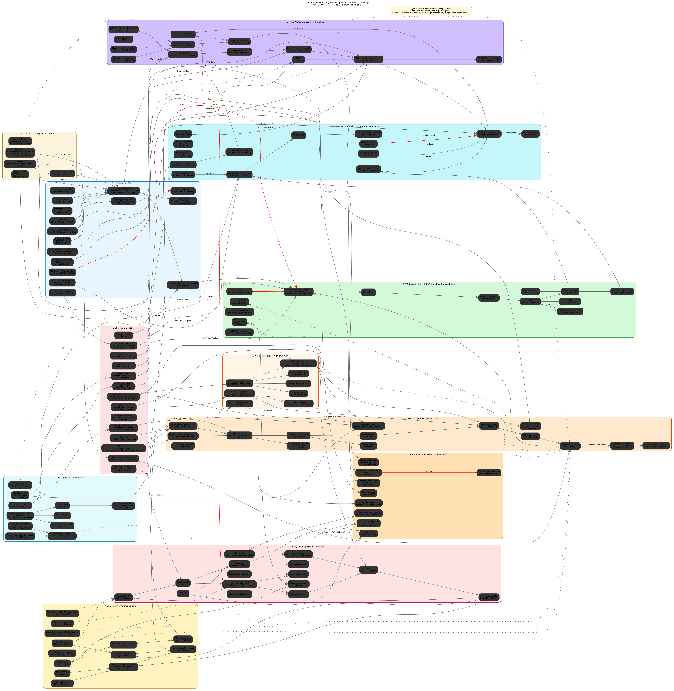</a> | 2022 국제 작업반 명명개정으로 AVP-D(중추, AVP 결핍)·AVP-R(신성, AVP 저항) 통합.<br>[🗺️ 지도](diabetes-insipidus/di_qsp_model.svg) · [⚙️ mrgsolve](diabetes-insipidus/di_mrgsolve_model.R) · [📚 문헌](diabetes-insipidus/di_references.md) · [📄 README](diabetes-insipidus/README.md) |
| 120 | 내분비·대사 | [**당뇨병성 족부궤양 (DFU)**<br><sub>Diabetic Foot Ulcer · DFU</sub>](diabetic-foot-ulcer/) | <a href="diabetic-foot-ulcer/dfu_qsp_model.svg">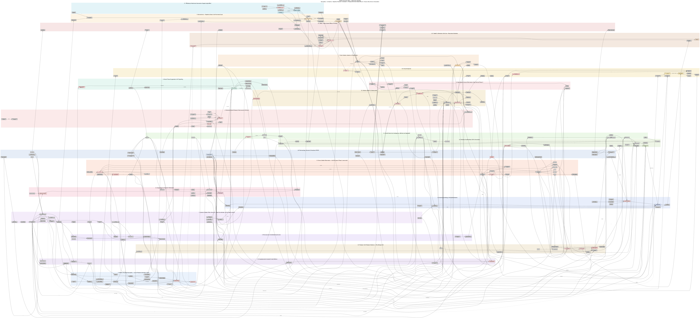</a> | 신경병증·허혈·반복 압력이 겹쳐 생긴 족부궤양이 단백분해효소 우위와 바이오필름 상태로 정체되는 과정을 다루며, 감압장구 착용순응도·창면절제·성장인자·항생제·재관류·재발예방을 함께 시뮬레이션한다.<br>[🗺️ 지도](diabetic-foot-ulcer/dfu_qsp_model.svg) · [⚙️ mrgsolve](diabetic-foot-ulcer/dfu_mrgsolve_model.R) · [📚 문헌](diabetic-foot-ulcer/dfu_references.md) · [📄 README](diabetic-foot-ulcer/README.md) |
| 121 | 내분비·대사 | [**당뇨병성 케톤산증 · 고혈당 고삼투압 상태**<br><sub>Diabetic Ketoacidosis & Hyperglycaemic Hyperosmolar State · DKA/HHS</sub>](diabetic-ketoacidosis/) | <a href="diabetic-ketoacidosis/dka_qsp_model.svg"></a> | 인슐린 결핍이 배출 경로 수가 다른 두 결핍을 만드는 급성 대사 위기로, 포도당은 인슐린 처리와 세포외액량이 컨덕턴스인 신장 배출 두 경로를 갖고 케토산은 포화하는 한 경로만 가지므로 혈당이 케톤보다 먼저 정상화된다.<br>[🗺️ 지도](diabetic-ketoacidosis/dka_qsp_model.svg) · [⚙️ mrgsolve](diabetic-ketoacidosis/dka_mrgsolve_model.R) · [📚 문헌](diabetic-ketoacidosis/dka_references.md) · [📄 README](diabetic-ketoacidosis/README.md) |
| 122 | 내분비·대사 | [**당뇨병성 신병증**<br><sub>Diabetic Nephropathy · DN</sub>](diabetic-nephropathy/) | <a href="diabetic-nephropathy/dn_qsp_model.svg"></a> | 당뇨병 미세혈관 합병증 → 진행성 CKD — 고혈당(AGE·PKC·헥소사민·폴리올 경로) → 산화스트레스(Nox4·ROS) + RAAS 활성화(AngII→인사구체 고혈압) + TGF-β1(Smad2/3·CTGF·ECM 축적·사구체경화) + NF-κB 염증(TNF-α·IL-1β·MCP-1·NLRP3) → 족세포 손상(네프린·포도신·족돌기 소…<br>[🗺️ 지도](diabetic-nephropathy/dn_qsp_model.svg) · [⚙️ mrgsolve](diabetic-nephropathy/dn_mrgsolve_model.R) · [📚 문헌](diabetic-nephropathy/dn_references.md) · [📄 README](diabetic-nephropathy/README.md) |
| 123 | 신경 | [**당뇨병성 말초신경병증 (DPN)**<br><sub>Diabetic Peripheral Neuropathy · DPN</sub>](diabetic-peripheral-neuropathy/) | <a href="diabetic-peripheral-neuropathy/dpn_qsp_model.svg"></a> | 만성 고혈당이 인슐린 비의존성 신경·슈반·내피세포에 축적되어 Brownlee 통합가설의 4 경로(폴리올–AR·AGE/RAGE·PKC-β·헥소사민) + 미토콘드리아 과산화물·PARP·NAD⁺ 고갈로 수렴 → vasa nervorum 협착·기저막 비후·내막 저관류·내막 저산소증 유발.<br>[🗺️ 지도](diabetic-peripheral-neuropathy/dpn_qsp_model.svg) · [⚙️ mrgsolve](diabetic-peripheral-neuropathy/dpn_mrgsolve_model.R) · [📚 문헌](diabetic-peripheral-neuropathy/dpn_references.md) · [📄 README](diabetic-peripheral-neuropathy/README.md) |
| 124 | 안과 | [**당뇨병성 망막병증**<br><sub>Diabetic Retinopathy · DR</sub>](diabetic-retinopathy/) | <a href="diabetic-retinopathy/dr_qsp_model.svg"></a> | 고혈당 → 4가지 생화학 경로(폴리올·헥소사민·PKC·AGE-RAGE) → 산화스트레스/VEGF/신경염증 → 망막 혈관 구조 병변 → DME/PDR → 시력 소실 — 알도스환원효소(AR) → 소르비톨↑·NADPH 고갈; GFAT → O-GlcNAc → TGF-β/PAI-1↑; PKCβ2 → VEGF↑·NF-κB↑·eNOS↓·ET-1↑; 메…<br>[🗺️ 지도](diabetic-retinopathy/dr_qsp_model.svg) · [⚙️ mrgsolve](diabetic-retinopathy/dr_mrgsolve_model.R) · [📚 문헌](diabetic-retinopathy/dr_references.md) · [📄 README](diabetic-retinopathy/README.md) |
| 125 | 심혈관 | [**확장성 심근병증**<br><sub>Dilated Cardiomyopathy · DCM</sub>](dilated-cardiomyopathy/) | <a href="dilated-cardiomyopathy/dcm_qsp_model.svg"></a> | 심실 확장·수축기능 저하·신경호르몬 활성화. GDMT(ARNI/BB/MRA/SGLT2i) 역리모델링.<br>[🗺️ 지도](dilated-cardiomyopathy/dcm_qsp_model.svg) · [⚙️ mrgsolve](dilated-cardiomyopathy/dcm_mrgsolve_model.R) · [📚 문헌](dilated-cardiomyopathy/dcm_references.md) · [📄 README](dilated-cardiomyopathy/README.md) |
| 126 | 혈액 | [**파종성 혈관내 응고 (DIC)**<br><sub>Disseminated Intravascular Coagulation · DIC</sub>](disseminated-intravascular-coagulation/) | <a href="disseminated-intravascular-coagulation/dic_qsp_model.svg"></a> | 하나의 트롬빈 소비 과정을 급성기 항의 부호와 PAI-1 대 t-PA 몰비라는 두 독립 시계로 읽어, 패혈증형 미세혈전과 APL형 출혈이 같은 방정식의 두 파라미터 설정에서 유도되도록 모델링.<br>[🗺️ 지도](disseminated-intravascular-coagulation/dic_qsp_model.svg) · [⚙️ mrgsolve](disseminated-intravascular-coagulation/dic_mrgsolve_model.R) · [📚 문헌](disseminated-intravascular-coagulation/dic_references.md) · [📄 README](disseminated-intravascular-coagulation/README.md) |
| 127 | 신장·비뇨 | [**원위 신세뇨관 산증**<br><sub>Distal Renal Tubular Acidosis · dRTA</sub>](distal-renal-tubular-acidosis/) | <a href="distal-renal-tubular-acidosis/drta_qsp_model.svg"></a> | 산 배설 조절계를 포화되는 액추에이터로 쓰고 미충족 산 부하를 시간상수가 다른 세 저장고로 분배해, 혈장 중탄산이 유량이 아니라 비(ratio)이며 손상은 측정되지 않는 뼈가 받는다는 구조를 계산 가능하게 만든 56-ODE 모델.<br>[🗺️ 지도](distal-renal-tubular-acidosis/drta_qsp_model.svg) · [⚙️ mrgsolve](distal-renal-tubular-acidosis/drta_mrgsolve_model.R) · [📚 문헌](distal-renal-tubular-acidosis/drta_references.md) · [📄 README](distal-renal-tubular-acidosis/README.md) |
| 128 | 소화기·간담도 | [**게실병**<br><sub>Diverticular Disease · DIV</sub>](diverticular-disease/) | <a href="diverticular-disease/div_qsp_model.svg"></a> | 장벽 구조·미생물·저섬유식에 의한 게실/게실염. 섬유·항생제·항염 치료.<br>[🗺️ 지도](diverticular-disease/div_qsp_model.svg) · [⚙️ mrgsolve](diverticular-disease/div_mrgsolve_model.R) · [📚 문헌](diverticular-disease/div_references.md) · [📄 README](diverticular-disease/README.md) |
| 129 | 신경 | [**드라베 증후군**<br><sub>Dravet Syndrome · SCN1A DEE</sub>](dravet-syndrome/) | <a href="dravet-syndrome/dravet_qsp_model.svg"></a> | SCN1A 반수체부족으로 억제성 개재뉴런의 Nav1.1이 소실되어 고빈도 발화 역치가 붕괴하고 흥분-억제 균형이 깨지며 나트륨통로차단제가 역설적으로 발작을 악화시킨다.<br>[🗺️ 지도](dravet-syndrome/dravet_qsp_model.svg) · [⚙️ mrgsolve](dravet-syndrome/dravet_mrgsolve_model.R) · [📚 문헌](dravet-syndrome/dravet_references.md) · [📄 README](dravet-syndrome/README.md) |
| 130 | 소화기·간담도 | [**약물유발 간손상 (DILI)**<br><sub>Drug-Induced Liver Injury · DILI</sub>](drug-induced-liver-injury/) | <a href="drug-induced-liver-injury/dili_qsp_model.svg"></a> | 반응성 대사체 생성 속도가 글루타티온 재합성 속도를 넘어설 때 JNK-Sab 정귀환 고리가 점화되는 쌍안정 시스템으로 기술하여, 용량 임계치와 해독제 시간창이 파라미터가 아니라 계산 결과로 나오게 했다.<br>[🗺️ 지도](drug-induced-liver-injury/dili_qsp_model.svg) · [⚙️ mrgsolve](drug-induced-liver-injury/dili_mrgsolve_model.R) · [📚 문헌](drug-induced-liver-injury/dili_references.md) · [📄 README](drug-induced-liver-injury/README.md) |
| 131 | 안과 | [**건성안 (DED)**<br><sub>Dry Eye Disease · Evaporative(MGD)/Aqueous-deficient(Sjögren) DED</sub>](dry-eye-disease/) | <a href="dry-eye-disease/ded_qsp_model.svg">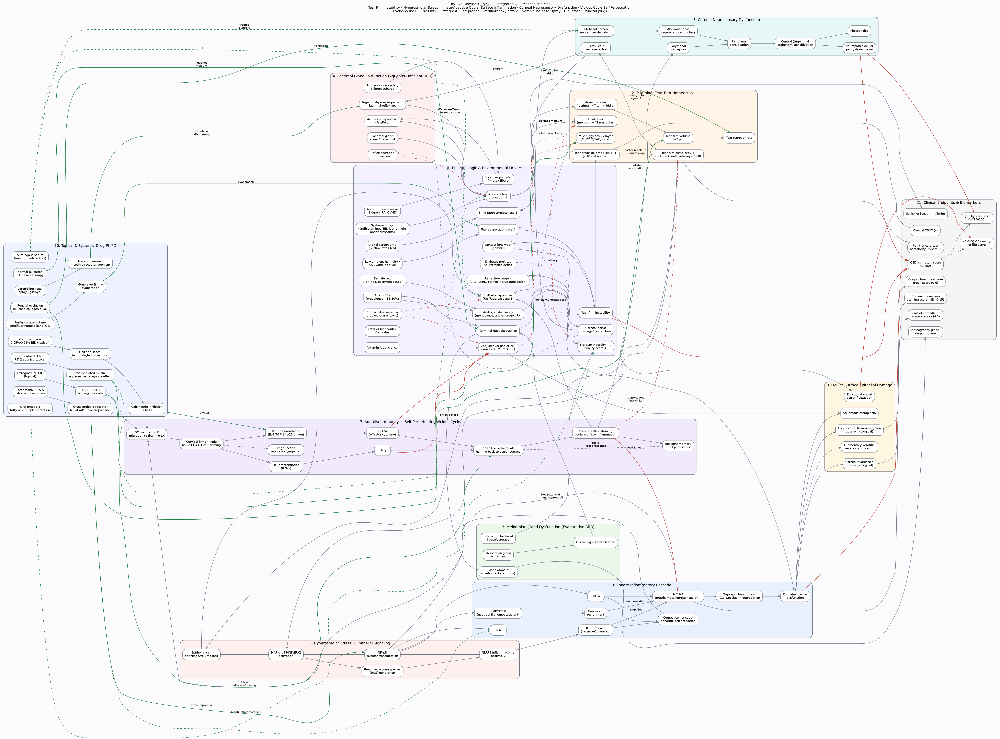</a> | 눈물막 삼중층의 항상성 붕괴와 고삼투압 스트레스가 수지상세포-Th17-MMP-9 염증 연쇄와 각막 신경병증을 유발하는 자기영속 악순환. 사이클로스포린·리피테그라스트·페르플루오로헥실옥탄·바레니클린 비강분무·디쿠아포솔 표적.<br>[🗺️ 지도](dry-eye-disease/ded_qsp_model.svg) · [⚙️ mrgsolve](dry-eye-disease/ded_mrgsolve_model.R) · [📚 문헌](dry-eye-disease/ded_references.md) · [📄 README](dry-eye-disease/README.md) |
| 132 | 근골격·신경근육 | [**뒤셴 근이영양증 (DMD)**<br><sub>Duchenne Muscular Dystrophy · DMD</sub>](duchenne-muscular-dystrophy/) | <a href="duchenne-muscular-dystrophy/dmd_qsp_model.svg">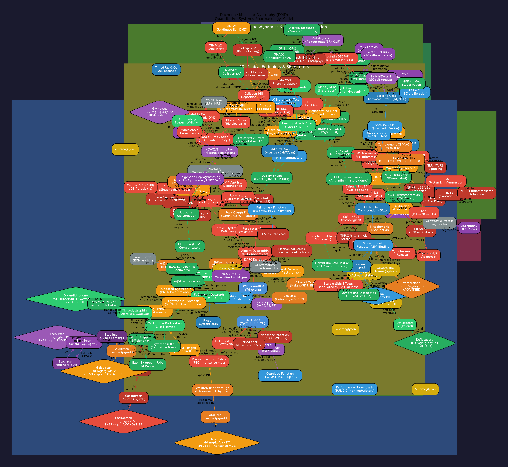</a> | 디스트로핀 결핍으로 진행성 근섬유 괴사·섬유화·심근병증. 코르티코스테로이드·엑손 스키핑·유전자 치료.<br>[🗺️ 지도](duchenne-muscular-dystrophy/dmd_qsp_model.svg) · [⚙️ mrgsolve](duchenne-muscular-dystrophy/dmd_mrgsolve_model.R) · [📚 문헌](duchenne-muscular-dystrophy/dmd_references.md) · [📄 README](duchenne-muscular-dystrophy/README.md) |
| 133 | 내분비·대사 | [**이상지질혈증**<br><sub>Dyslipidemia · DYSLIP</sub>](dyslipidemia/) | <a href="dyslipidemia/dyslip_qsp_model.svg"></a> | 간 콜레스테롤 합성·LDL 수용체·역수송 항상성. 스타틴·에제티미브·PCSK9 억제제.<br>[🗺️ 지도](dyslipidemia/dyslip_qsp_model.svg) · [⚙️ mrgsolve](dyslipidemia/dyslip_mrgsolve_model.R) · [📚 문헌](dyslipidemia/dyslip_references.md) · [📄 README](dyslipidemia/README.md) |
| 134 | 혈관염 | [**호산구 육아종증 다발혈관염 (EGPA)**<br><sub>Eosinophilic GPA · EGPA</sub>](egpa/) | <a href="egpa/egpa_qsp_model.svg"></a> | IL-5 매개 호산구증가와 ANCA 연관 소혈관염. 스테로이드·메폴리주맙·벤랄리주맙.<br>[🗺️ 지도](egpa/egpa_qsp_model.svg) · [⚙️ mrgsolve](egpa/egpa_mrgsolve_model.R) · [📚 문헌](egpa/egpa_references.md) · [📄 README](egpa/README.md) |
| 135 | 내분비·대사 | [**고지단백(a)혈증**<br><sub>Elevated Lipoprotein(a) · Lp(a)</sub>](elevated-lipoprotein-a/) | <a href="elevated-lipoprotein-a/lpa_qsp_model.svg"></a> | Lp(a)의 병리학적 화물은 전부 입자당 1개이고 아이소폼에 따라 변하는 것은 병리학적으로 불활성인 크링글 단백 질량뿐이라는 비대칭에서, 질량 검사가 가장 위험한 작은 아이소폼 환자를 놓치는 현상과 청소 표적 약물의 25-30% 상한이 함께 유도된다.<br>[🗺️ 지도](elevated-lipoprotein-a/lpa_qsp_model.svg) · [⚙️ mrgsolve](elevated-lipoprotein-a/lpa_mrgsolve_model.R) · [📚 문헌](elevated-lipoprotein-a/lpa_references.md) · [📄 README](elevated-lipoprotein-a/README.md) |
| 136 | 종양 | [**자궁내막암 (EC)**<br><sub>Endometrial Carcinoma · EC</sub>](endometrial-cancer/) | <a href="endometrial-cancer/emc_qsp_model.svg"></a> | TCGA 4개 분자아형(POLEmut·MMRd·NSMP·p53abn)을 종양변이부담 연속축 위의 네 점으로 놓고 비대항 에스트로겐·PI3K/PTEN 축과 면역관문억제제·렌바티닙·호르몬요법을 연결한 모델.<br>[🗺️ 지도](endometrial-cancer/emc_qsp_model.svg) · [⚙️ mrgsolve](endometrial-cancer/emc_mrgsolve_model.R) · [📚 문헌](endometrial-cancer/emc_references.md) · [📄 README](endometrial-cancer/README.md) |
| 137 | 내분비·대사 | [**자궁내막증**<br><sub>Endometriosis · ENDO</sub>](endometriosis/) | <a href="endometriosis/endo_qsp_model.svg"></a> | 자궁내막 조직의 자궁외 이식·에스트로겐 의존 염증·통증. GnRH 길항제·프로게스틴.<br>[🗺️ 지도](endometriosis/endo_qsp_model.svg) · [⚙️ mrgsolve](endometriosis/endo_mrgsolve_model.R) · [📚 문헌](endometriosis/endo_references.md) · [📄 README](endometriosis/README.md) |
| 138 | 소화기·간담도 | [**호산구성 식도염 (EoE)**<br><sub>Eosinophilic Esophagitis · EoE</sub>](eosinophilic-esophagitis/) | <a href="eosinophilic-esophagitis/eoe_qsp_model.svg"></a> | Th2 사이토카인(IL-13·IL-5)·ILC2·호산구 축에 의한 만성 식도 염증. 두필루맙·부데소니드·센다키맙.<br>[🗺️ 지도](eosinophilic-esophagitis/eoe_qsp_model.svg) · [⚙️ mrgsolve](eosinophilic-esophagitis/eoe_mrgsolve_model.R) · [📚 문헌](eosinophilic-esophagitis/eoe_references.md) · [📄 README](eosinophilic-esophagitis/README.md) |
| 139 | 신경 | [**뇌전증**<br><sub>Epilepsy · EPI</sub>](epilepsy/) | <a href="epilepsy/epi_qsp_model.svg">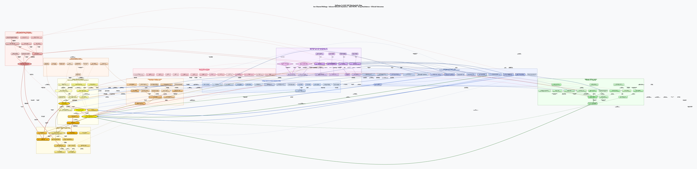</a> | 이온채널·흥분/억제 불균형에 의한 반복 발작. 항발작제(VPA/LEV/CBZ/LTG).<br>[🗺️ 지도](epilepsy/epi_qsp_model.svg) · [⚙️ mrgsolve](epilepsy/epi_mrgsolve_model.R) · [📚 문헌](epilepsy/epi_references.md) · [📄 README](epilepsy/README.md) |
| 140 | 신장·비뇨 | [**발기부전**<br><sub>Erectile Dysfunction · ED</sub>](erectile-dysfunction/) | <a href="erectile-dysfunction/ed_qsp_model.svg"></a> | 발기를 포화 증폭기 위의 문턱 판독으로 기술해, PDE5 억제제가 질산화물을 만들지 않고 이득만 곱한다는 점에서 같은 노출이 한 환자를 회복시키고 다른 환자에게는 아무 일도 하지 않는 이유가 산술로 유도된다.<br>[🗺️ 지도](erectile-dysfunction/ed_qsp_model.svg) · [⚙️ mrgsolve](erectile-dysfunction/ed_mrgsolve_model.R) · [📚 문헌](erectile-dysfunction/ed_references.md) · [📄 README](erectile-dysfunction/README.md) |
| 141 | 희귀·유전 | [**적혈구조혈성 프로토포르피린증 (EPP/XLP)**<br><sub>Erythropoietic Protoporphyria · EPP</sub>](erythropoietic-protoporphyria/) | <a href="erythropoietic-protoporphyria/epp_qsp_model.svg"></a> | 페로킬라타제 기능소실 또는 ALAS2 기능획득으로 프로토포르피린 IX가 넘쳐 400-410 nm 가시광에 광여기되어 일중항 산소와 작열통을 일으키는 광피부질환이며, MC1R 작용제·GlyT1 억제제·간담도 구제요법을 함께 다룬다.<br>[🗺️ 지도](erythropoietic-protoporphyria/epp_qsp_model.svg) · [⚙️ mrgsolve](erythropoietic-protoporphyria/epp_mrgsolve_model.R) · [📚 문헌](erythropoietic-protoporphyria/epp_references.md) · [📄 README](erythropoietic-protoporphyria/README.md) |
| 142 | 심혈관 | [**본태성 고혈압**<br><sub>Essential Hypertension · EH</sub>](essential-hypertension/) | <a href="essential-hypertension/eh_qsp_model.svg"></a> | RAAS·교감신경·나트륨/체액 항상성에 의한 혈압 조절. ACEi/ARB·CCB·이뇨제.<br>[🗺️ 지도](essential-hypertension/eh_qsp_model.svg) · [⚙️ mrgsolve](essential-hypertension/eh_mrgsolve_model.R) · [📚 문헌](essential-hypertension/eh_references.md) · [📄 README](essential-hypertension/README.md) |
| 143 | 종양 | [**본태성 혈소판 증가증**<br><sub>Essential Thrombocythemia · ET</sub>](essential-thrombocythemia/) | <a href="essential-thrombocythemia/et_qsp_model.svg"></a> | JAK2 V617F(55–65%)·CALR Type1/2(25%)·MPL W515L(5%) 돌연변이 → JAK2 구성적 활성 → STAT5·PI3K·MAPK 하류 신호 → 메가카리오사이트 과증식·혈소판 생성 폭주(PLT 500–1500×10⁹/L).<br>[🗺️ 지도](essential-thrombocythemia/et_qsp_model.svg) · [⚙️ mrgsolve](essential-thrombocythemia/et_mrgsolve_model.R) · [📚 문헌](essential-thrombocythemia/et_references.md) · [📄 README](essential-thrombocythemia/README.md) |
| 144 | 신경 | [**본태성 떨림**<br><sub>Essential Tremor · ET</sub>](essential-tremor/) | <a href="essential-tremor/et_qsp_model.svg"></a> | 떨림을 어떤 물질의 양이 아니라 한계순환으로 기술하여, 진폭은 루프 이득이·주파수는 루프 지연이·치료의 천장은 루프 위상이 정한다는 분리에서 반응자와 비반응자의 갈림, 가속도계와 평가척도의 겉보기 불일치, T형 칼슘차단제의 종간 불일치가 모두 유도된다.<br>[🗺️ 지도](essential-tremor/et_qsp_model.svg) · [⚙️ mrgsolve](essential-tremor/et_mrgsolve_model.R) · [📚 문헌](essential-tremor/et_references.md) · [📄 README](essential-tremor/README.md) |
| 145 | 혈액 | [**에반스 증후군**<br><sub>Evans Syndrome · ES</sub>](evans-syndrome/) | <a href="evans-syndrome/es_qsp_model.svg"></a> | AIHA와 ITP가 동반된 다계열 자가면역 혈구감소. 스테로이드·리툭시맙·TPO-RA.<br>[🗺️ 지도](evans-syndrome/es_qsp_model.svg) · [⚙️ mrgsolve](evans-syndrome/es_mrgsolve_model.R) · [📚 문헌](evans-syndrome/es_references.md) · [📄 README](evans-syndrome/README.md) |
| 146 | 희귀·유전 | [**파브리병**<br><sub>Fabry Disease · FBR</sub>](fabry-disease/) | <a href="fabry-disease/fbr_qsp_model.svg"></a> | X-연관 리소소말 저장 질환. GLA* 변이 → α-갈락토시다제 A(α-Gal A) 결핍 → 글로보트리아오실세라미드(Gb3)·lyso-Gb3 조직축적 → 신세뇨관·심근·신경·혈관내피 손상. Gb3 합성(UGCG·B4GALT5)·M6PR/리소솜 가수분해·GCS 억제(SRT).<br>[🗺️ 지도](fabry-disease/fbr_qsp_model.svg) · [⚙️ mrgsolve](fabry-disease/fbr_mrgsolve_model.R) · [📚 문헌](fabry-disease/fbr_references.md) · [📄 README](fabry-disease/README.md) |
| 147 | 내분비·대사 | [**가족성 유미지질혈증 증후군 (FCS)**<br><sub>Familial Chylomicronemia Syndrome · FCS</sub>](familial-chylomicronemia-syndrome/) | <a href="familial-chylomicronemia-syndrome/fcs_qsp_model.svg"></a> | LPL·APOC2·APOA5·GPIHBP1·LMF1 양대립 결손으로 지질분해가 소실되어 유미지질이 축적되고 재발성 급성 췌장염을 일으키는 단일유전자 질환으로, 포화된 LPL-비의존 청소 경로와 apoC-III 표적 치료를 함께 다룬다.<br>[🗺️ 지도](familial-chylomicronemia-syndrome/fcs_qsp_model.svg) · [⚙️ mrgsolve](familial-chylomicronemia-syndrome/fcs_mrgsolve_model.R) · [📚 문헌](familial-chylomicronemia-syndrome/fcs_references.md) · [📄 README](familial-chylomicronemia-syndrome/README.md) |
| 148 | 심혈관 | [**가족성 고콜레스테롤혈증**<br><sub>Familial Hypercholesterolemia · FH</sub>](familial-hypercholesterolemia/) | <a href="familial-hypercholesterolemia/fh_qsp_model.svg"></a> | LDLR 돌연변이(이형접합 1/250·동형접합 1/300,000) → LDLR 기능↓(0–50%) → LDL-C 극적 상승(HetFH 190–400 mg/dL, HomFH 400–1,000 mg/dL) → 조기 죽상동맥경화·심근경색.<br>[🗺️ 지도](familial-hypercholesterolemia/fh_qsp_model.svg) · [⚙️ mrgsolve](familial-hypercholesterolemia/fh_mrgsolve_model.R) · [📚 문헌](familial-hypercholesterolemia/fh_references.md) · [📄 README](familial-hypercholesterolemia/README.md) |
| 149 | 자가면역·류마티스 | [**가족성 지중해열 (FMF)**<br><sub>Familial Mediterranean Fever · FMF</sub>](familial-mediterranean-fever/) | <a href="familial-mediterranean-fever/fmf_qsp_model.svg">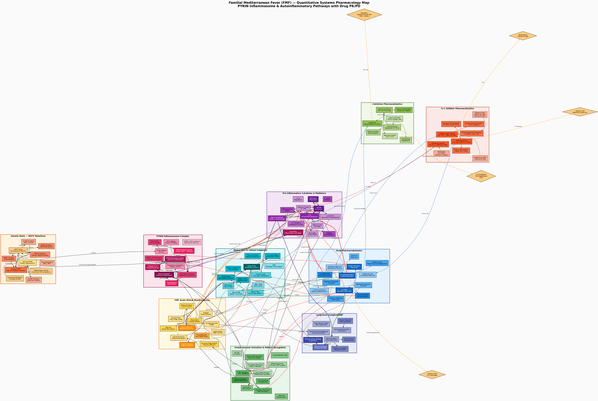</a> | MEFV 변이·피린 인플라마솜 과활성으로 주기적 발열·장막염·IL-1β. 콜히친·항IL-1 치료.<br>[🗺️ 지도](familial-mediterranean-fever/fmf_qsp_model.svg) · [⚙️ mrgsolve](familial-mediterranean-fever/fmf_mrgsolve_model.R) · [📚 문헌](familial-mediterranean-fever/fmf_references.md) · [📄 README](familial-mediterranean-fever/README.md) |
| 150 | 희귀·유전 | [**진행성 골화성 섬유이형성증 (FOP)**<br><sub>Fibrodysplasia Ossificans Progressiva · FOP</sub>](fibrodysplasia-ossificans-progressiva/) | <a href="fibrodysplasia-ossificans-progressiva/fop_qsp_model.svg"></a> | ACVR1 R206H 신생기능으로 액티빈 A가 작용제가 되어 근육이 내연골성 골화를 겪는 질환을, 임상시험 지표인 골 형성 속도와 장애를 결정하는 비가역적 축적량의 분리를 축으로 기술한다.<br>[🗺️ 지도](fibrodysplasia-ossificans-progressiva/fop_qsp_model.svg) · [⚙️ mrgsolve](fibrodysplasia-ossificans-progressiva/fop_mrgsolve_model.R) · [📚 문헌](fibrodysplasia-ossificans-progressiva/fop_references.md) · [📄 README](fibrodysplasia-ossificans-progressiva/README.md) |
| 151 | 근골격·신경근육 | [**섬유근통**<br><sub>Fibromyalgia · FM</sub>](fibromyalgia/) | <a href="fibromyalgia/fm_qsp_model.svg"></a> | 중추감작(척수 WDR뉴런 LTP·wind-up·NMDA 수용체 탈억제); 하행성 통증조절계 결함(PAG-RVM-LC/Raphe 축, DPMS↓, DNIC 소실); 신경전달물질 불균형(CSF substance P↑·NE↓·5-HT↓); 신경염증(척수 미세아교세포 활성화·IL-1β/TNF-α·NLRP3 인플라마좀·KCC2↓→GABA 탈억제);…<br>[🗺️ 지도](fibromyalgia/fm_qsp_model.svg) · [⚙️ mrgsolve](fibromyalgia/fm_mrgsolve_model.R) · [📚 문헌](fibromyalgia/fm_references.md) · [📄 README](fibromyalgia/README.md) |
| 152 | 알레르기 | [**IgE 매개 식품 알레르기·아나필락시스**<br><sub>IgE-Mediated Food Allergy and Anaphylaxis · FANA</sub>](food-allergy-anaphylaxis/) | <a href="food-allergy-anaphylaxis/fana_qsp_model.svg"></a> | 유발용량은 특이 IgE 절대치가 아니라 비만세포 표면 IgE 중 특이 IgE가 차지하는 비율에 제곱으로 좌우되며, 항IgE는 표면을 경구면역요법은 알레르겐을 서로 다른 지점에서 차단한다.<br>[🗺️ 지도](food-allergy-anaphylaxis/fana_qsp_model.svg) · [⚙️ mrgsolve](food-allergy-anaphylaxis/fana_mrgsolve_model.R) · [📚 문헌](food-allergy-anaphylaxis/fana_references.md) · [📄 README](food-allergy-anaphylaxis/README.md) |
| 153 | 신경 | [**프리드라이히 운동실조증 (FRDA)**<br><sub>Friedreich Ataxia · FXN GAA repeat</sub>](friedreich-ataxia/) | <a href="friedreich-ataxia/frda_qsp_model.svg"></a> | FXN* (9q21.11) intron 1 GAA·TTC 삼중반복(66–1700) 확장 → triplex/R-loop·H3K9me3·HDAC3 매개 이질염색체화로 FXN mRNA·Frataxin 단백질 5–35%로 감소.<br>[🗺️ 지도](friedreich-ataxia/frda_qsp_model.svg) · [⚙️ mrgsolve](friedreich-ataxia/frda_mrgsolve_model.R) · [📚 문헌](friedreich-ataxia/frda_references.md) · [📄 README](friedreich-ataxia/README.md) |
| 154 | 신경 | [**전두측두엽 치매 (FTD)**<br><sub>Frontotemporal Dementia · FTD</sub>](frontotemporal-dementia/) | <a href="frontotemporal-dementia/ftd_qsp_model.svg"></a> | 소르틸린은 세포외 프로그라눌린 농도를 정하는 제거 경로이면서 동시에 리소좀 전달 경로여서, 차단하면 혈장 바이오마커는 정상화되지만 실제 작용 부위인 리소좀 풀은 거의 움직이지 않는다.<br>[🗺️ 지도](frontotemporal-dementia/ftd_qsp_model.svg) · [⚙️ mrgsolve](frontotemporal-dementia/ftd_mrgsolve_model.R) · [📚 문헌](frontotemporal-dementia/ftd_references.md) · [📄 README](frontotemporal-dementia/README.md) |
| 155 | 신장·비뇨 | [**국소분절사구체경화증 (FSGS)**<br><sub>Focal Segmental Glomerulosclerosis · FSGS</sub>](fsgs/) | <a href="fsgs/fsgs_qsp_model.svg"></a> | 순환 투과인자·족세포 손상에 의한 신증후군 단백뇨. RAAS 억제·스테로이드·칼시뉴린억제제.<br>[🗺️ 지도](fsgs/fsgs_qsp_model.svg) · [⚙️ mrgsolve](fsgs/fsgs_mrgsolve_model.R) · [📚 문헌](fsgs/fsgs_references.md) · [📄 README](fsgs/README.md) |
| 156 | 혈액 | [**G6PD 결핍증**<br><sub>Glucose-6-Phosphate Dehydrogenase Deficiency · G6PD</sub>](g6pd-deficiency/) | <a href="g6pd-deficiency/g6pd_qsp_model.svg"></a> | 효소 활성을 숫자가 아니라 적혈구 연령의 함수 E(a)=E0·exp(-ln2·a/tau)로 쓰고 변이를 그 기울기로 두면, 임계 연령 a\가 닫힌 형태로 풀리면서 같은 프리마퀸에 A-는 복용 중에 회복하고 Mediterranean은 회복하지 못하는 차이가 붕괴 상수 하나에서 유도된다.<br>[🗺️ 지도](g6pd-deficiency/g6pd_qsp_model.svg) · [⚙️ mrgsolve](g6pd-deficiency/g6pd_mrgsolve_model.R) · [📚 문헌](g6pd-deficiency/g6pd_references.md) · [📄 README](g6pd-deficiency/README.md) |
| 157 | 종양 | [**위선암**<br><sub>Gastric Cancer · GC</sub>](gastric-cancer/) | <a href="gastric-cancer/gc_qsp_model.svg"></a> | H. pylori CagA/VacA·HER2/FGFR2/MET·VEGF 혈관신생·CLDN18.2·PD-L1/PD-1 면역관문·TCGA 아형(EBV/MSI-H/GS/CIN)·TME.<br>[🗺️ 지도](gastric-cancer/gc_qsp_model.svg) · [⚙️ mrgsolve](gastric-cancer/gc_mrgsolve_model.R) · [📚 문헌](gastric-cancer/gc_references.md) · [📄 README](gastric-cancer/README.md) |
| 158 | 종양 | [**위장관 기질종양 (GIST)**<br><sub>Gastrointestinal Stromal Tumour · GIST</sub>](gastrointestinal-stromal-tumor/) | <a href="gastrointestinal-stromal-tumor/gist_qsp_model.svg"></a> | KIT/PDGFRA 원발 돌연변이에 이차 저항 돌연변이 아클론(exon 13/14 ATP 포켓 · exon 17/18 활성화 루프 · KIT 비의존 우회)이 공존하는 클론 집단으로 모델링하고, 이매티닙·수니티닙·레고라페닙·리프레티닙·아바프리티닙의 클론별 커버리지와 약물이 죽이지 못하는 정지기 저장고를 함께 다룬다.<br>[🗺️ 지도](gastrointestinal-stromal-tumor/gist_qsp_model.svg) · [⚙️ mrgsolve](gastrointestinal-stromal-tumor/gist_mrgsolve_model.R) · [📚 문헌](gastrointestinal-stromal-tumor/gist_references.md) · [📄 README](gastrointestinal-stromal-tumor/README.md) |
| 159 | 소화기·간담도 | [**위마비 (Gastroparesis)**<br><sub>Gastroparesis · GP</sub>](gastroparesis/) | <a href="gastroparesis/gp_qsp_model.svg"></a> | ICC(카할 간질세포) 소실 + nNOS 뉴런 고갈 + 미주신경병증 → 위 배출 지연(4h 잔류 >10%) → GCSI 증상 — 당뇨병성(T1DM 29%·T2DM 1%)·특발성·수술 후 3대 아형.<br>[🗺️ 지도](gastroparesis/gp_qsp_model.svg) · [⚙️ mrgsolve](gastroparesis/gp_mrgsolve_model.R) · [📚 문헌](gastroparesis/gp_references.md) · [📄 README](gastroparesis/README.md) |
| 160 | 희귀·유전 | [**고셔병**<br><sub>Gaucher Disease · GCD</sub>](gaucher-disease/) | <a href="gaucher-disease/gcd_qsp_model.svg">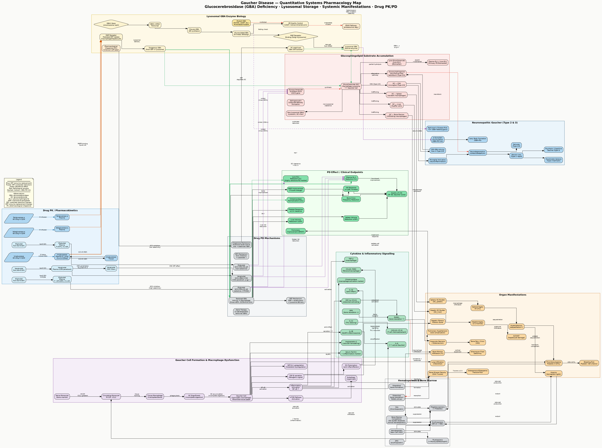</a> | GBA1* 이중대립변이 → 리소솜 β-글루코세레브로시다제(GBA) 결핍 → 글루코세레브로사이드(GC) 및 고독성 탈아실화 유도체 lyso-GL1 조직대식세포 축적 → 고셔세포 형성.<br>[🗺️ 지도](gaucher-disease/gcd_qsp_model.svg) · [⚙️ mrgsolve](gaucher-disease/gcd_mrgsolve_model.R) · [📚 문헌](gaucher-disease/gcd_references.md) · [📄 README](gaucher-disease/README.md) |
| 161 | 소화기·간담도 | [**위식도 역류질환 (GERD)**<br><sub>Gastroesophageal Reflux Disease · GERD</sub>](gerd/) | <a href="gerd/gerd_qsp_model.svg"></a> | 하부식도괄약근 이완·산 역류에 의한 식도 점막 손상. PPI·P-CAB 위산 억제.<br>[🗺️ 지도](gerd/gerd_qsp_model.svg) · [⚙️ mrgsolve](gerd/gerd_mrgsolve_model.R) · [📚 문헌](gerd/gerd_references.md) · [📄 README](gerd/README.md) |
| 162 | 부인·생식 | [**임신성 당뇨병 (GDM)**<br><sub>Gestational Diabetes Mellitus · GDM</sub>](gestational-diabetes-mellitus/) | <a href="gestational-diabetes-mellitus/gdm_qsp_model.svg"></a> | 태반 대항인슐린 구동과 베타세포 보상 능력 사이의 경주로 GDM을 모델링하여 혈당과 출생체중을 결과로 산출하고, 인슐린·메트포민·글리부라이드의 태아 노출 차이를 함께 다룬다.<br>[🗺️ 지도](gestational-diabetes-mellitus/gdm_qsp_model.svg) · [⚙️ mrgsolve](gestational-diabetes-mellitus/gdm_mrgsolve_model.R) · [📚 문헌](gestational-diabetes-mellitus/gdm_references.md) · [📄 README](gestational-diabetes-mellitus/README.md) |
| 163 | 혈관염 | [**거대세포 동맥염**<br><sub>Giant Cell Arteritis · GCA</sub>](giant-cell-arteritis/) | <a href="giant-cell-arteritis/gca_qsp_model.svg"></a> | 대혈관의 IL-6/Th17 육아종성 동맥염과 실명 위험. 스테로이드·토실리주맙(항IL-6R).<br>[🗺️ 지도](giant-cell-arteritis/gca_qsp_model.svg) · [⚙️ mrgsolve](giant-cell-arteritis/gca_mrgsolve_model.R) · [📚 문헌](giant-cell-arteritis/gca_references.md) · [📄 README](giant-cell-arteritis/README.md) |
| 164 | 안과 | [**원발개방각녹내장 (POAG)**<br><sub>Primary Open-Angle Glaucoma · POAG</sub>](glaucoma/) | <a href="glaucoma/poag_qsp_model.svg">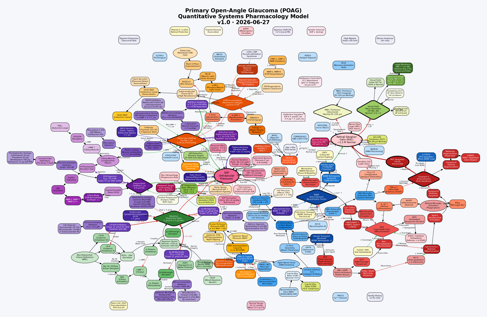</a> | 방수 유출 장애(TM ECM 축적·RhoA-ROCK 과활성·TGF-β2 섬유화) → IOP 상승(Goldmann 방정식) → 시신경 유두(ONH) 층판사골 변형 → 축삭수송 차단 → BDNF 역행수송↓ → RGC 사멸(Bax/Bcl-2→Caspase-3) → RNFL 감소 → 시야(VF-MD) 진행.<br>[🗺️ 지도](glaucoma/poag_qsp_model.svg) · [⚙️ mrgsolve](glaucoma/poag_mrgsolve_model.R) · [📚 문헌](glaucoma/poag_references.md) · [📄 README](glaucoma/README.md) |
| 165 | 종양 | [**교모세포종 (GBM)**<br><sub>Glioblastoma Multiforme · GBM</sub>](glioblastoma/) | <a href="glioblastoma/gbm_qsp_model.svg">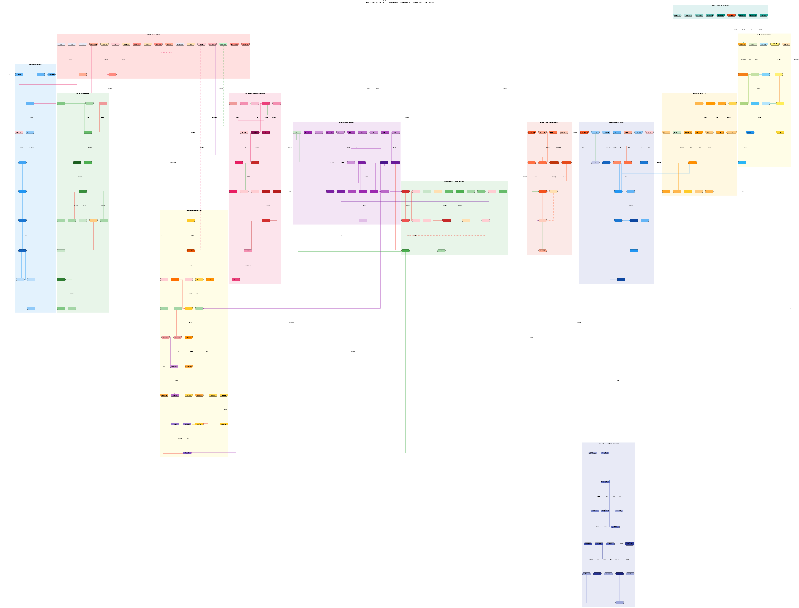</a> | EGFR 증폭/EGFRvIII → PI3K/AKT/mTOR 과활성화·PTEN 소실 → 무제한 증식; MGMT 비메틸화 → O6-MeG 신속 복구 → TMZ 내성; HIF-1α → VEGF-A → 혈관신생; M2-TAM·Treg·PD-L1 → 면역억제 미세환경.<br>[🗺️ 지도](glioblastoma/gbm_qsp_model.svg) · [⚙️ mrgsolve](glioblastoma/gbm_mrgsolve_model.R) · [📚 문헌](glioblastoma/gbm_references.md) · [📄 README](glioblastoma/README.md) |
| 166 | 희귀·유전 | [**당원병 제1a형 (폰 기르케병)**<br><sub>Glycogen Storage Disease Type Ia · GSD1a</sub>](glycogen-storage-disease-type-1a/) | <a href="glycogen-storage-disease-type-1a/gsd1a_qsp_model.svg"></a> | 글리코겐 분해와 포도당신생합성이 둘 다 거쳐야 하는 단 하나의 마지막 단계를 잃으면 간은 포도당 공급원이 아니라 소비원이 되고, 갈 곳 없는 G6P가 글리코겐·젖산·지질·요산의 네 갈래로 넘치는 하나의 질량수지로 네 증후군이 전부 유도된다.<br>[🗺️ 지도](glycogen-storage-disease-type-1a/gsd1a_qsp_model.svg) · [⚙️ mrgsolve](glycogen-storage-disease-type-1a/gsd1a_mrgsolve_model.R) · [📚 문헌](glycogen-storage-disease-type-1a/gsd1a_references.md) · [📄 README](glycogen-storage-disease-type-1a/README.md) |
| 167 | 신장·비뇨 | [**굿파스처 증후군**<br><sub>Goodpasture Syndrome · GPS</sub>](goodpasture-syndrome/) | <a href="goodpasture-syndrome/gps_qsp_model.svg">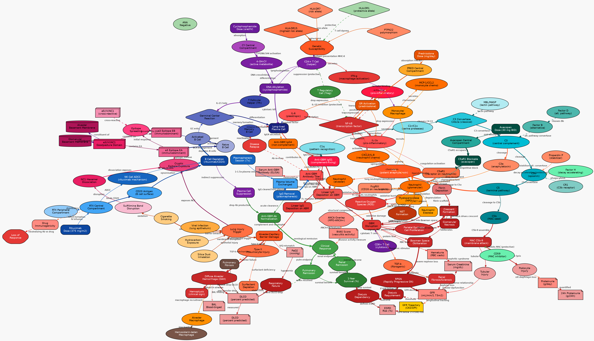</a> | 항GBM 항체에 의한 급속진행성 사구체신염·폐포출혈. 혈장교환·CY·리툭시맙.<br>[🗺️ 지도](goodpasture-syndrome/gps_qsp_model.svg) · [⚙️ mrgsolve](goodpasture-syndrome/gps_mrgsolve_model.R) · [📚 문헌](goodpasture-syndrome/gps_references.md) · [📄 README](goodpasture-syndrome/README.md) |
| 168 | 내분비·대사 | [**통풍**<br><sub>Gout · GOUT</sub>](gout/) | <a href="gout/gout_qsp_model.svg"></a> | 요산 과포화·MSU 결정·NLRP3-IL-1β 염증성 관절염. 요산저하제(알로푸리놀/페북소스타트)·콜히친.<br>[🗺️ 지도](gout/gout_qsp_model.svg) · [⚙️ mrgsolve](gout/gout_mrgsolve_model.R) · [📚 문헌](gout/gout_references.md) · [📄 README](gout/README.md) |
| 169 | 혈액 | [**이식편대숙주병 (GvHD)**<br><sub>Graft-versus-Host Disease · GvHD</sub>](graft-versus-host-disease/) | <a href="graft-versus-host-disease/gvhd_qsp_model.svg"></a> | 동종 HSCT 후 공여자 T세포가 숙주 전처치(TBI/항암화학요법) 유발 조직손상(DAMP/PAMP)으로 활성화된 숙주 수지상세포(DC)에 의해 프라이밍 → TCR-MHC mismatch 직접/간접 동종반응(CD28-B7 공자극) → NFAT·NF-κB·JAK-STAT 경로 활성화 → Th1(IFN-γ·TNF-α)/Th17(IL-17A·I…<br>[🗺️ 지도](graft-versus-host-disease/gvhd_qsp_model.svg) · [⚙️ mrgsolve](graft-versus-host-disease/gvhd_mrgsolve_model.R) · [📚 문헌](graft-versus-host-disease/gvhd_references.md) · [📄 README](graft-versus-host-disease/README.md) |
| 170 | 혈관염 | [**육아종증 다발혈관염 (GPA)**<br><sub>Granulomatosis with Polyangiitis · GPA</sub>](granulomatosis-with-polyangiitis/) | <a href="granulomatosis-with-polyangiitis/gpa_qsp_model.svg">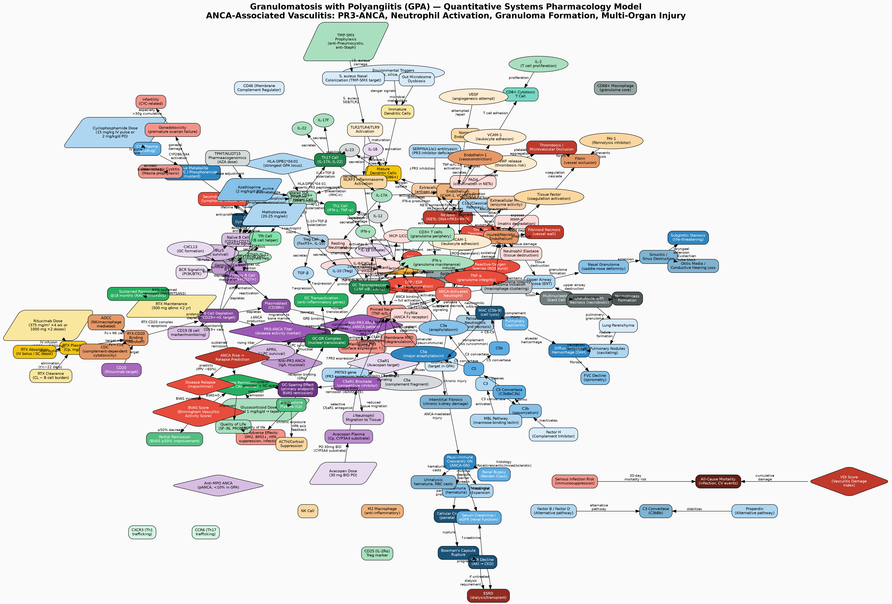</a> | PR3-ANCA 호중구 활성·육아종성 소혈관염. 리툭시맙·아바코판(C5aR 차단).<br>[🗺️ 지도](granulomatosis-with-polyangiitis/gpa_qsp_model.svg) · [⚙️ mrgsolve](granulomatosis-with-polyangiitis/gpa_mrgsolve_model.R) · [📚 문헌](granulomatosis-with-polyangiitis/gpa_references.md) · [📄 README](granulomatosis-with-polyangiitis/README.md) |
| 171 | 내분비·대사 | [**그레이브스병**<br><sub>Graves' Disease · GD</sub>](graves-disease/) | <a href="graves-disease/gd_qsp_model.svg"></a> | TSH 수용체 자극항체에 의한 갑상선기능항진. 항갑상선제·방사성요오드·수술.<br>[🗺️ 지도](graves-disease/gd_qsp_model.svg) · [⚙️ mrgsolve](graves-disease/gd_mrgsolve_model.R) · [📚 문헌](graves-disease/gd_references.md) · [📄 README](graves-disease/README.md) |
| 172 | 내분비·대사 | [**소아 성장호르몬 결핍증 (GHD)**<br><sub>Paediatric Growth Hormone Deficiency · GHD</sub>](growth-hormone-deficiency/) | <a href="growth-hormone-deficiency/ghd_qsp_model.svg">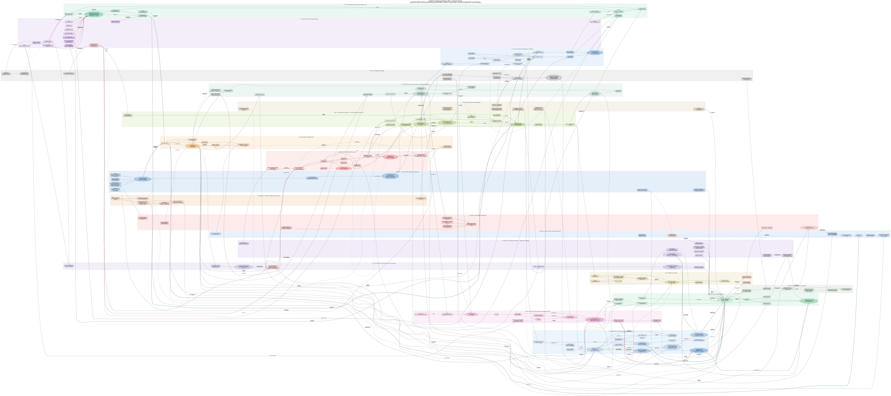</a> | 선형 성장을 시상하부 드라이브부터 성장판 잔여 증식능까지 이어지는 곱셈 사슬로 기술하여 따라잡기 성장이 setpoint가 아니라 소진되는 자원임을 보여주고, 일일·주1회 지속형 GH와 메카세르민을 함께 다룬다.<br>[🗺️ 지도](growth-hormone-deficiency/ghd_qsp_model.svg) · [⚙️ mrgsolve](growth-hormone-deficiency/ghd_mrgsolve_model.R) · [📚 문헌](growth-hormone-deficiency/ghd_references.md) · [📄 README](growth-hormone-deficiency/README.md) |
| 173 | 신경 | [**길랭-바레 증후군**<br><sub>Guillain-Barré Syndrome · GBS</sub>](guillain-barre-syndrome/) | <a href="guillain-barre-syndrome/gbs_qsp_model.svg"></a> | 분자모방 항강글리오시드 항체·보체 매개 급성 신경병증. IVIG·혈장교환.<br>[🗺️ 지도](guillain-barre-syndrome/gbs_qsp_model.svg) · [⚙️ mrgsolve](guillain-barre-syndrome/gbs_mrgsolve_model.R) · [📚 문헌](guillain-barre-syndrome/gbs_references.md) · [📄 README](guillain-barre-syndrome/README.md) |
| 174 | 내분비·대사 | [**하시모토 갑상선염**<br><sub>Hashimoto's Thyroiditis · HT</sub>](hashimoto-thyroiditis/) | <a href="hashimoto-thyroiditis/ht_qsp_model.svg"></a> | 항TPO/Tg 항체·T세포 매개 갑상선 파괴와 기능저하. 레보티록신 보충.<br>[🗺️ 지도](hashimoto-thyroiditis/ht_qsp_model.svg) · [⚙️ mrgsolve](hashimoto-thyroiditis/ht_mrgsolve_model.R) · [📚 문헌](hashimoto-thyroiditis/ht_references.md) · [📄 README](hashimoto-thyroiditis/README.md) |
| 175 | 종양 | [**두경부 편평세포암 (HNSCC)**<br><sub>Head and Neck Squamous Cell Carcinoma · HNSCC</sub>](head-and-neck-squamous-cell-carcinoma/) | <a href="head-and-neck-squamous-cell-carcinoma/hnscc_qsp_model.svg"></a> | 저항성 표적 약물의 이득을 네 인자(저산소·수선·재증식·면역회피)의 남은 여유분과 약효의 곱으로 기술하여 HPV 상태별 세툭시맙 탈강화 결과와 치료기간 연장 손실을 출력으로 재현하고, 시스플라틴·세툭시맙·면역관문억제제와 방사선 분할을 함께 다룬다.<br>[🗺️ 지도](head-and-neck-squamous-cell-carcinoma/hnscc_qsp_model.svg) · [⚙️ mrgsolve](head-and-neck-squamous-cell-carcinoma/hnscc_mrgsolve_model.R) · [📚 문헌](head-and-neck-squamous-cell-carcinoma/hnscc_references.md) · [📄 README](head-and-neck-squamous-cell-carcinoma/README.md) |
| 176 | 심혈관 | [**심부전 (보존 박출률, HFpEF)**<br><sub>Heart Failure with Preserved EF · HFpEF</sub>](heart-failure-hfpef/) | <a href="heart-failure-hfpef/hfpef_qsp_model.svg"></a> | 심근 경직·전신 염증·미세혈관 기능부전에 의한 확장기 부전. SGLT2i·MRA·이뇨제.<br>[🗺️ 지도](heart-failure-hfpef/hfpef_qsp_model.svg) · [⚙️ mrgsolve](heart-failure-hfpef/hfpef_mrgsolve_model.R) · [📚 문헌](heart-failure-hfpef/hfpef_references.md) · [📄 README](heart-failure-hfpef/README.md) |
| 177 | 심혈관 | [**심부전 (감소 박출률, HFrEF)**<br><sub>Heart Failure with Reduced EF · HFrEF</sub>](heart-failure-hfref/) | <a href="heart-failure-hfref/hfref_qsp_model.svg"></a> | 신경호르몬(RAAS/SNS) 과활성과 심실 리모델링. ARNI·BB·MRA·SGLT2i 4대 요법.<br>[🗺️ 지도](heart-failure-hfref/hfref_qsp_model.svg) · [⚙️ mrgsolve](heart-failure-hfref/hfref_mrgsolve_model.R) · [📚 문헌](heart-failure-hfref/hfref_references.md) · [📄 README](heart-failure-hfref/README.md) |
| 178 | 혈액 | [**혈구탐식성 림프조직구증 (HLH)**<br><sub>Hemophagocytic Lymphohistiocytosis · HLH</sub>](hemophagocytic-lymphohistiocytosis/) | <a href="hemophagocytic-lymphohistiocytosis/hlh_qsp_model.svg"></a> | NK세포/CTL 세포독성 결함(PRF1·UNC13D·STXBP2…) 또는 외부 트리거(EBV·CMV·sJIA·악성 종양) → APC 제거 실패 → CD4/CD8 T세포 지속 활성화 → IFN-γ·IL-18 폭발적 생산(★ 핵심 사이토카인) → 대식세포 활성화(M1 극화) → 혈구탐식(적혈구·백혈구·혈소판 engulfment) → 페리틴↑↑…<br>[🗺️ 지도](hemophagocytic-lymphohistiocytosis/hlh_qsp_model.svg) · [⚙️ mrgsolve](hemophagocytic-lymphohistiocytosis/hlh_mrgsolve_model.R) · [📚 문헌](hemophagocytic-lymphohistiocytosis/hlh_references.md) · [📄 README](hemophagocytic-lymphohistiocytosis/README.md) |
| 179 | 혈액 | [**혈우병 A**<br><sub>Hemophilia A · HA</sub>](hemophilia-a/) | <a href="hemophilia-a/ha_qsp_model.svg"></a> | X염색체 연관 FVIII 결핍(F8 유전자 돌연변이) → 내인성 Xase 복합체(FIXa·FVIIIa) 형성 불능 → 트롬빈 생성 급감 → 불안정 피브린 클롯. 중증(<1 IU/dL) ABR ~30/년; 억제항체(30% 중증) 발생으로 대체치료 실패.<br>[🗺️ 지도](hemophilia-a/ha_qsp_model.svg) · [⚙️ mrgsolve](hemophilia-a/ha_mrgsolve_model.R) · [📚 문헌](hemophilia-a/ha_references.md) · [📄 README](hemophilia-a/README.md) |
| 180 | 혈액 | [**혈우병 B (HB)**<br><sub>Hemophilia B · Christmas Disease</sub>](hemophilia-b/) | <a href="hemophilia-b/hb_qsp_model.svg"></a> | 응고인자 IX(FIX) 결핍에 의한 X염색체 연관 열성 출혈질환으로, 혈우병 A보다 4-5배 드물다(남성 신생아 약 25,000-30,000명 중 1명).<br>[🗺️ 지도](hemophilia-b/hb_qsp_model.svg) · [⚙️ mrgsolve](hemophilia-b/hb_mrgsolve_model.R) · [📚 문헌](hemophilia-b/hb_references.md) · [📄 README](hemophilia-b/README.md) |
| 181 | 혈액 | [**헤파린 유발 혈소판감소증 (HIT)**<br><sub>Heparin-Induced Thrombocytopenia · HIT</sub>](heparin-induced-thrombocytopenia/) | <a href="heparin-induced-thrombocytopenia/hit_qsp_model.svg"></a> | 약물이 항원의 절반을 이루는 면역복합체 질환으로, PF4-헤파린 초거대복합체가 사슬 길이와 몰비에 따라 종형으로 형성되어 혈소판 감소와 혈전증이라는 두 축을 동시에 만든다.<br>[🗺️ 지도](heparin-induced-thrombocytopenia/hit_qsp_model.svg) · [⚙️ mrgsolve](heparin-induced-thrombocytopenia/hit_mrgsolve_model.R) · [📚 문헌](heparin-induced-thrombocytopenia/hit_references.md) · [📄 README](heparin-induced-thrombocytopenia/README.md) |
| 182 | 신경 | [**간성 뇌증 (HE)**<br><sub>Hepatic Encephalopathy · HE</sub>](hepatic-encephalopathy/) | <a href="hepatic-encephalopathy/he_qsp_model.svg">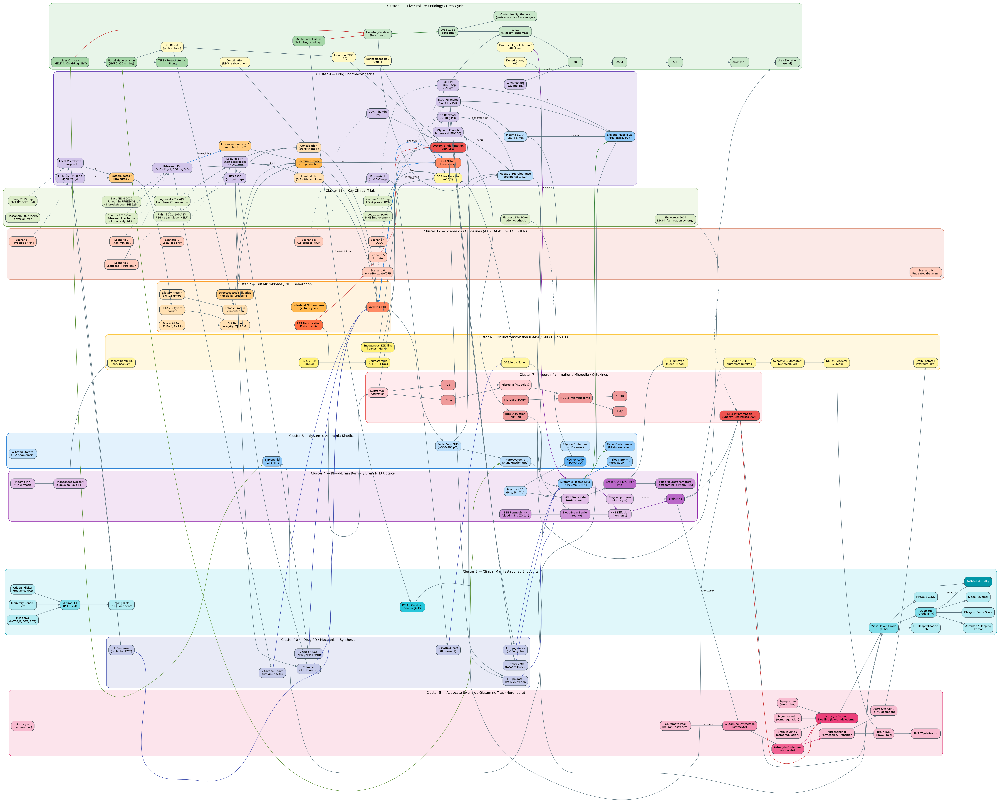</a> | 간부전(MELD↑, ALF, TIPS 문맥대정맥션트) → 페리포탈 CPS1 ureagenesis 저하 → 장내 urease+ 세균(Enterobacteriaceae·S.<br>[🗺️ 지도](hepatic-encephalopathy/he_qsp_model.svg) · [⚙️ mrgsolve](hepatic-encephalopathy/he_mrgsolve_model.R) · [📚 문헌](hepatic-encephalopathy/he_references.md) · [📄 README](hepatic-encephalopathy/README.md) |
| 183 | 종양 | [**간세포암종 (HCC)**<br><sub>Hepatocellular Carcinoma · HCC</sub>](hepatocellular-carcinoma/) | <a href="hepatocellular-carcinoma/hcc_qsp_model.svg"></a> | HBV/HCV·NAFLD 기반 간암. RAS/RAF/MEK/ERK·PI3K/AKT/mTOR·Wnt/β-catenin·VEGF/혈관신생·종양면역 미세환경(PD-L1/CD8/Treg/TAM) 통합. 소라페닙·렌바티닙·아테조리주맙+베바시주맙(IMbrave150)·레고라페닙 PK/PD. 20구획 ODE, 5치료시나리오, AFP/간기능 바이오마커.<br>[🗺️ 지도](hepatocellular-carcinoma/hcc_qsp_model.svg) · [⚙️ mrgsolve](hepatocellular-carcinoma/hcc_mrgsolve_model.R) · [📚 문헌](hepatocellular-carcinoma/hcc_references.md) · [📄 README](hepatocellular-carcinoma/README.md) |
| 184 | 신장·비뇨 | [**간신 증후군 (HRS)**<br><sub>Hepatorenal Syndrome · HRS-AKI / HRS-NAKI (ICA-2015/2019)</sub>](hepatorenal-syndrome/) | <a href="hepatorenal-syndrome/hrs_qsp_model.svg"></a> | 진행된 간경변·문맥압 항진에서 발생하는 기능적·잠재적 가역적 급성 신손상 증후군.<br>[🗺️ 지도](hepatorenal-syndrome/hrs_qsp_model.svg) · [⚙️ mrgsolve](hepatorenal-syndrome/hrs_mrgsolve_model.R) · [📚 문헌](hepatorenal-syndrome/hrs_references.md) · [📄 README](hepatorenal-syndrome/README.md) |
| 185 | 희귀·유전 | [**유전성 혈관부종**<br><sub>Hereditary Angioedema · HAE</sub>](hereditary-angioedema/) | <a href="hereditary-angioedema/hae_qsp_model.svg"></a> | SERPING1* 돌연변이 → C1-INH 결핍/기능이상(Type I/II) 또는 F12* Thr328Lys 이득기능돌연변이(Type III) → 칼리크레인-키닌계(KKS) 무제한 활성화 → 브라디키닌(BK) 과잉 → B2R-Gq/IP3/Ca²⁺/eNOS/NO 경로 → VE-cadherin 소실·혈장삼출 → 피하/후두 혈관부종.<br>[🗺️ 지도](hereditary-angioedema/hae_qsp_model.svg) · [⚙️ mrgsolve](hereditary-angioedema/hae_mrgsolve_model.R) · [📚 문헌](hereditary-angioedema/hae_references.md) · [📄 README](hereditary-angioedema/README.md) |
| 186 | 내분비·대사 | [**유전성 혈색소증**<br><sub>Hereditary Hemochromatosis · HH</sub>](hereditary-hemochromatosis/) | <a href="hereditary-hemochromatosis/hh_qsp_model.svg">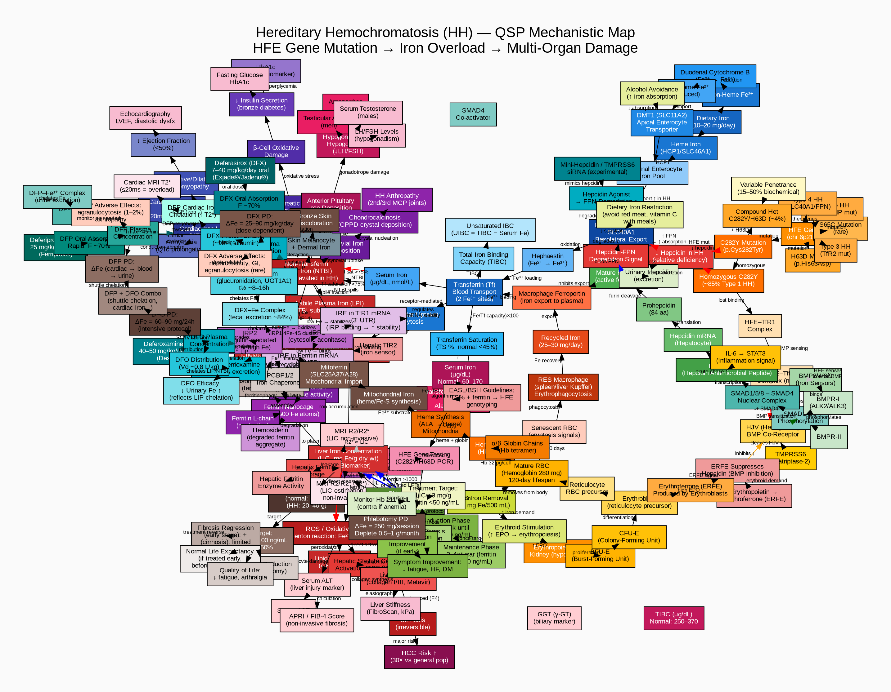</a> | HFE 변이·헵시딘 저하로 철 과흡수·장기 침착(간/심장/췌장). 정맥절개·철 킬레이션.<br>[🗺️ 지도](hereditary-hemochromatosis/hh_qsp_model.svg) · [⚙️ mrgsolve](hereditary-hemochromatosis/hh_mrgsolve_model.R) · [📚 문헌](hereditary-hemochromatosis/hh_references.md) · [📄 README](hereditary-hemochromatosis/README.md) |
| 187 | 희귀·유전 | [**유전성 출혈성 모세혈관확장증 (HHT)**<br><sub>Hereditary Hemorrhagic Telangiectasia · HHT</sub>](hereditary-hemorrhagic-telangiectasia/) | <a href="hereditary-hemorrhagic-telangiectasia/hht_qsp_model.svg"></a> | ALK1/ENG 반수부족에 체성 2차 타격이 겹치며 내피 전단응력 설정점이 사라지고 되먹임 부호가 뒤집혀 모세혈관확장증과 동정맥기형이 생긴다. 베바시주맙·파조파닙·포말리도마이드·트라넥삼산.<br>[🗺️ 지도](hereditary-hemorrhagic-telangiectasia/hht_qsp_model.svg) · [⚙️ mrgsolve](hereditary-hemorrhagic-telangiectasia/hht_mrgsolve_model.R) · [📚 문헌](hereditary-hemorrhagic-telangiectasia/hht_references.md) · [📄 README](hereditary-hemorrhagic-telangiectasia/README.md) |
| 188 | 피부 | [**화농성 한선염**<br><sub>Hidradenitis Suppurativa · HS</sub>](hidradenitis-suppurativa/) | <a href="hidradenitis-suppurativa/hs_qsp_model.svg"></a> | 모낭 파열 → 복합 면역 활성화 → 만성 피부 염증 — γ-Secretase 결함(NCSTN/PSEN1/2 변이)·과각화증·모낭 폐쇄 → 피지모낭단위 파열 → NLRP3 인플라마좀(IL-1β)·TLR2/4 NF-κB(TNF-α·IL-6)·Th17(IL-17A/F) 복합 활성화. S.<br>[🗺️ 지도](hidradenitis-suppurativa/hs_qsp_model.svg) · [⚙️ mrgsolve](hidradenitis-suppurativa/hs_mrgsolve_model.R) · [📚 문헌](hidradenitis-suppurativa/hs_references.md) · [📄 README](hidradenitis-suppurativa/README.md) |
| 189 | 호흡기 | [**고산병 (AMS·HACE·HAPE)**<br><sub>High-Altitude Illness · HAI</sub>](high-altitude-illness/) | <a href="high-altitude-illness/hai_qsp_model.svg"></a> | 하나의 흡입 산소분압이 시간상수가 서로 다른 세 방어기전(환기·저산소성 폐혈관수축·뇌혈관확장)을 통해 작용한다고 쓰면, 느린 방어가 도착할 때까지 빠른 둘이 견제 없이 도는 기간이 곧 고산병의 창이 된다.<br>[🗺️ 지도](high-altitude-illness/hai_qsp_model.svg) · [⚙️ mrgsolve](high-altitude-illness/hai_mrgsolve_model.R) · [📚 문헌](high-altitude-illness/hai_references.md) · [📄 README](high-altitude-illness/README.md) |
| 190 | 감염 | [**HIV/AIDS**<br><sub>HIV/AIDS · HIV</sub>](hiv-aids/) | <a href="hiv-aids/hiv_qsp_model.svg">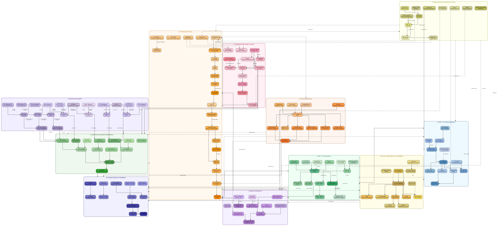</a> | HIV의 CD4 T세포 감염·고갈(Perelson 바이러스 동역학). 항레트로바이러스 병합요법(ART).<br>[🗺️ 지도](hiv-aids/hiv_qsp_model.svg) · [⚙️ mrgsolve](hiv-aids/hiv_mrgsolve_model.R) · [📚 문헌](hiv-aids/hiv_references.md) · [📄 README](hiv-aids/README.md) |
| 191 | 종양 | [**호지킨 림프종 (HL)**<br><sub>Hodgkin Lymphoma · cHL</sub>](hodgkin-lymphoma/) | <a href="hodgkin-lymphoma/hl_qsp_model.svg">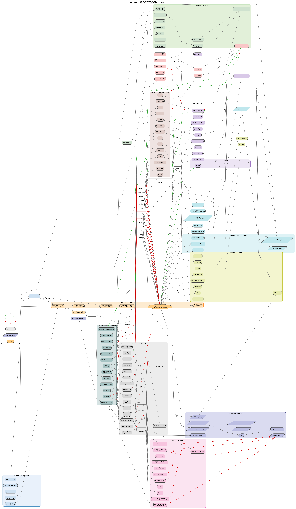</a> | 생식중심 B세포에서 기원한 Hodgkin/Reed-Sternberg(HRS, CD30+ CD15+ PAX5-dim) 세포가 NF-κB(REL 증폭·TNFAIP3/A20 소실)·JAK/STAT(JAK2 9p24.1 증폭·SOCS1/PTPN1 소실·STAT3/5/6)·PI3K/AKT/mTOR·NOTCH1·AP-1/JUNB 신호로 생존.<br>[🗺️ 지도](hodgkin-lymphoma/hl_qsp_model.svg) · [⚙️ mrgsolve](hodgkin-lymphoma/hl_mrgsolve_model.R) · [📚 문헌](hodgkin-lymphoma/hl_references.md) · [📄 README](hodgkin-lymphoma/README.md) |
| 192 | 신경 | [**헌팅턴병 (Huntington's Disease)**<br><sub>Huntington's Disease · HD</sub>](huntingtons-disease/) | <a href="huntingtons-disease/hd_qsp_model.svg"></a> | CAG 반복 확장(≥36) → mHTT 생성·집적 → 선조체 중간가시신경세포(MSN) 변성.<br>[🗺️ 지도](huntingtons-disease/hd_qsp_model.svg) · [⚙️ mrgsolve](huntingtons-disease/hd_mrgsolve_model.R) · [📚 문헌](huntingtons-disease/hd_references.md) · [📄 README](huntingtons-disease/README.md) |
| 193 | 종양 | [**악성 종양 관련 고칼슘혈증 (MAH)**<br><sub>Hypercalcaemia of Malignancy · MAH</sub>](hypercalcemia-of-malignancy/) | <a href="hypercalcemia-of-malignancy/mah_qsp_model.svg"></a> | 혈장 칼슘을 저장량이 아니라 뼈·장·신장 세 팔의 잔차로 기술하여, 고칼슘혈증이 스스로 신장 배출 천장을 끌어내리는 닫힌 고리에서 위기가 큰 숫자가 아니라 안장-마디 분기로 발생함을 보인다.<br>[🗺️ 지도](hypercalcemia-of-malignancy/mah_qsp_model.svg) · [⚙️ mrgsolve](hypercalcemia-of-malignancy/mah_mrgsolve_model.R) · [📚 문헌](hypercalcemia-of-malignancy/mah_references.md) · [📄 README](hypercalcemia-of-malignancy/README.md) |
| 194 | 부인·생식 | [**임신 오조 (HG)**<br><sub>Hyperemesis Gravidarum · HG</sub>](hyperemesis-gravidarum/) | <a href="hyperemesis-gravidarum/hg_qsp_model.svg"></a> | 태반 GDF15가 산모 후뇌의 적응하는 기준점과 비교되는 배수 변화 검출기로 오심을 설명하여, 호르몬이 계속 오르는데도 증상이 사라지는 자연사와 임신 전 GDF15 상승 노출의 보호 효과를 함께 재현한다.<br>[🗺️ 지도](hyperemesis-gravidarum/hg_qsp_model.svg) · [⚙️ mrgsolve](hyperemesis-gravidarum/hg_mrgsolve_model.R) · [📚 문헌](hyperemesis-gravidarum/hg_references.md) · [📄 README](hyperemesis-gravidarum/README.md) |
| 195 | 혈액 | [**과호산구증후군 (Hypereosinophilic Syndrome)**<br><sub>Hypereosinophilic Syndrome · HES</sub>](hypereosinophilic-syndrome/) | <a href="hypereosinophilic-syndrome/hes_qsp_model.svg"></a> | 지속적 말초혈액 호산구증가증(≥1500/µL, ≥1개월 간격 2회 이상)과 호산구 매개 장기손상을 특징으로 하는 이질적 질환군으로, 약 10-20%에서 cryptic del(4)(q12q12)에 의한 FIP1L1-PDGFRA 융합유전자가 구성적으로 활성화된 티로신인산화효소를 생성해 STAT5/PI3K-AKT/RAS-MAPK 경로로 클론성…<br>[🗺️ 지도](hypereosinophilic-syndrome/hes_qsp_model.svg) · [⚙️ mrgsolve](hypereosinophilic-syndrome/hes_mrgsolve_model.R) · [📚 문헌](hypereosinophilic-syndrome/hes_references.md) · [📄 README](hypereosinophilic-syndrome/README.md) |
| 196 | 호흡기 | [**과민성 폐렴 (HP)**<br><sub>Hypersensitivity Pneumonitis · HP</sub>](hypersensitivity-pneumonitis/) | <a href="hypersensitivity-pneumonitis/hp_qsp_model.svg">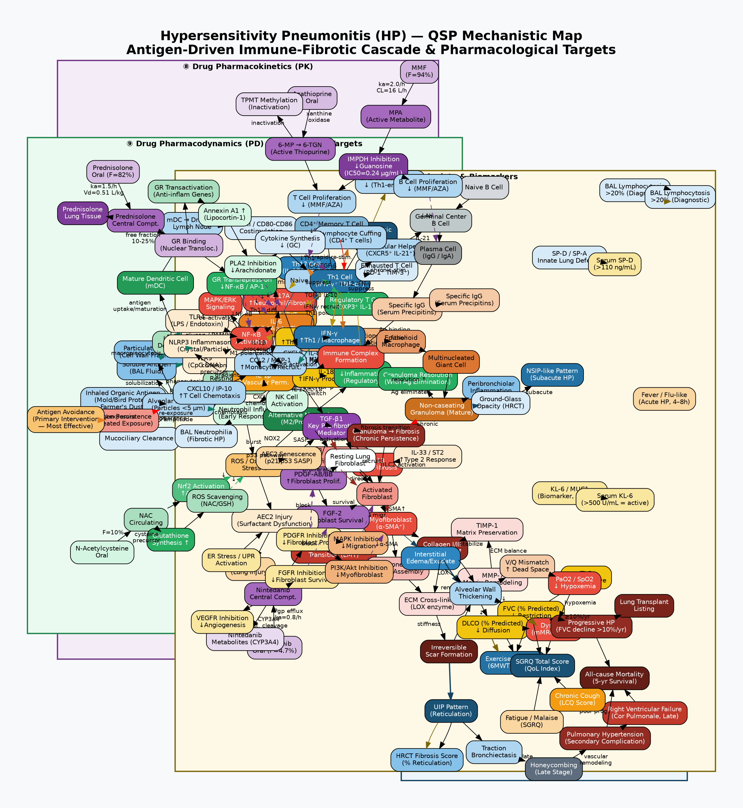</a> | 유기 항원(조류 단백·열성 세균·곰팡이) 반복 흡입에 의한 Th1 림프구성 폐포염 → 비건락성 육아종 형성 → TGF-β1/PDGF 매개 근섬유모세포 활성화 → 폐 섬유화(UIP/NSIP 유사 패턴) 통합 QSP 모델.<br>[🗺️ 지도](hypersensitivity-pneumonitis/hp_qsp_model.svg) · [⚙️ mrgsolve](hypersensitivity-pneumonitis/hp_mrgsolve_model.R) · [📚 문헌](hypersensitivity-pneumonitis/hp_references.md) · [📄 README](hypersensitivity-pneumonitis/README.md) |
| 197 | 심혈관 | [**비후성 심근병증**<br><sub>Hypertrophic Cardiomyopathy · HCM</sub>](hypertrophic-cardiomyopathy/) | <a href="hypertrophic-cardiomyopathy/hcm_qsp_model.svg"></a> | 근절 변이에 의한 과수축·좌심실유출로 폐쇄. 마바캄텐(마이오신 억제)·베타차단제.<br>[🗺️ 지도](hypertrophic-cardiomyopathy/hcm_qsp_model.svg) · [⚙️ mrgsolve](hypertrophic-cardiomyopathy/hcm_mrgsolve_model.R) · [📚 문헌](hypertrophic-cardiomyopathy/hcm_references.md) · [📄 README](hypertrophic-cardiomyopathy/README.md) |
| 198 | 내분비·대사 | [**만성 부갑상선기능저하증**<br><sub>Chronic Hypoparathyroidism · HypoPT</sub>](hypoparathyroidism/) | <a href="hypoparathyroidism/hypopt_qsp_model.svg"></a> | PTH 소실로 원위세뇨관 칼슘 재흡수·CYP27B1·골재형성이 동시에 사라져, 기존 칼슘·칼시트리올 치료는 혈청 칼슘을 정상화하면서도 고칼슘뇨와 신석회화증을 남긴다.<br>[🗺️ 지도](hypoparathyroidism/hypopt_qsp_model.svg) · [⚙️ mrgsolve](hypoparathyroidism/hypopt_mrgsolve_model.R) · [📚 문헌](hypoparathyroidism/hypopt_references.md) · [📄 README](hypoparathyroidism/README.md) |
| 199 | 희귀·유전 | [**저인산효소증 (HPP)**<br><sub>Hypophosphatasia · HPP</sub>](hypophosphatasia/) | <a href="hypophosphatasia/hpp_qsp_model.svg"></a> | ALPL 기능소실로 TNSALP가 줄면 세포외 피로인산이 쌓여 수산화인회석 성장을 경쟁적으로 억제하는데, 이 관계가 쌍곡선이라 질병은 비례가 아닌 문턱 현상이 되고 혈장 지표는 골 결합 효소가 아닌 혈장 효소를 보고한다.<br>[🗺️ 지도](hypophosphatasia/hpp_qsp_model.svg) · [⚙️ mrgsolve](hypophosphatasia/hpp_mrgsolve_model.R) · [📚 문헌](hypophosphatasia/hpp_references.md) · [📄 README](hypophosphatasia/README.md) |
| 200 | 신경 | [**특발성 두개내 고혈압 (IIH)**<br><sub>Idiopathic Intracranial Hypertension · IIH</sub>](idiopathic-intracranial-hypertension/) | <a href="idiopathic-intracranial-hypertension/iih_qsp_model.svg"></a> | 뇌척수액 분비·유출저항·붕괴성 정맥동이 만드는 정맥 하한선을 중심으로 구성한 모델로, 모든 약물은 분비항에만 작용하므로 협착 우세 환자에서는 어떤 용량으로도 관해에 도달할 수 없고 정맥동 스텐트만이 하한선 자체를 옮긴다.<br>[🗺️ 지도](idiopathic-intracranial-hypertension/iih_qsp_model.svg) · [⚙️ mrgsolve](idiopathic-intracranial-hypertension/iih_mrgsolve_model.R) · [📚 문헌](idiopathic-intracranial-hypertension/iih_references.md) · [📄 README](idiopathic-intracranial-hypertension/README.md) |
| 201 | 혈액 | [**특발성 다발성 캐슬만병 (iMCD)**<br><sub>Idiopathic Multicentric Castleman Disease · HHV-8 negative</sub>](idiopathic-multicentric-castleman-disease/) | <a href="idiopathic-multicentric-castleman-disease/imcd_qsp_model.svg">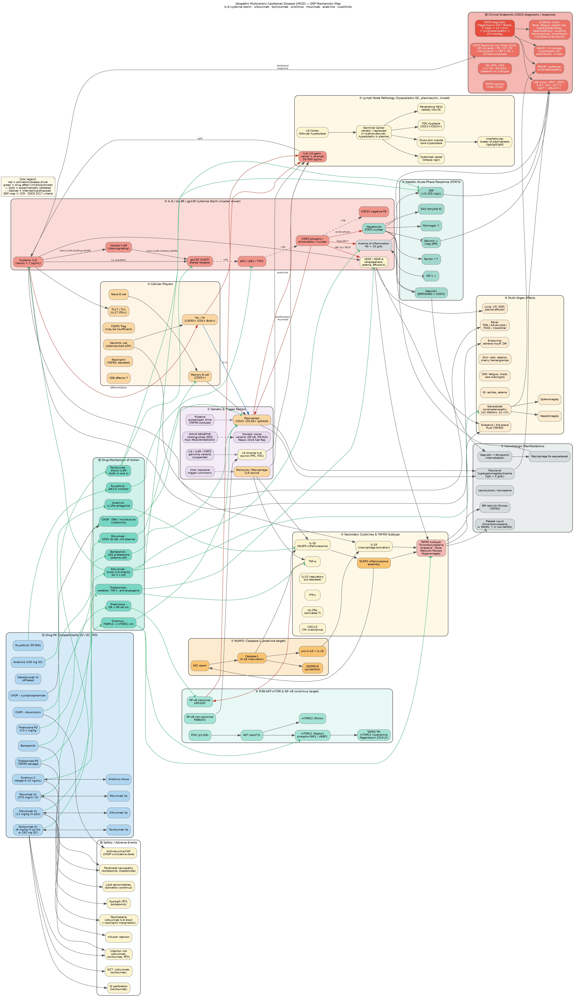</a> | HHV-8 음성 폴리클론성 림프증식성 사이토카인 폭풍: 림프절 생식중심(GC) 기질·여포 도움 T세포(Tfh)·플라스마블라스트 + 혈중 단핵구가 분비한 IL-6가 cis(mIL6R) + trans(sIL6R) 신호로 gp130-JAK1/2-STAT3 활성 → 간 급성기 반응(CRP·SAA·hepcidin·fibrinogen↑·albumin…<br>[🗺️ 지도](idiopathic-multicentric-castleman-disease/imcd_qsp_model.svg) · [⚙️ mrgsolve](idiopathic-multicentric-castleman-disease/imcd_mrgsolve_model.R) · [📚 문헌](idiopathic-multicentric-castleman-disease/imcd_references.md) · [📄 README](idiopathic-multicentric-castleman-disease/README.md) |
| 202 | 호흡기 | [**특발성 폐섬유화증 (IPF)**<br><sub>Idiopathic Pulmonary Fibrosis · IPF</sub>](idiopathic-pulmonary-fibrosis/) | <a href="idiopathic-pulmonary-fibrosis/ipf_qsp_model.svg"></a> | 상피손상-섬유아세포 활성·ECM 침착에 의한 진행성 섬유화. 닌테다닙·피르페니돈.<br>[🗺️ 지도](idiopathic-pulmonary-fibrosis/ipf_qsp_model.svg) · [⚙️ mrgsolve](idiopathic-pulmonary-fibrosis/ipf_mrgsolve_model.R) · [📚 문헌](idiopathic-pulmonary-fibrosis/ipf_references.md) · [📄 README](idiopathic-pulmonary-fibrosis/README.md) |
| 203 | 신장·비뇨 | [**IgA 신병증**<br><sub>IgA Nephropathy · IgAN</sub>](iga-nephropathy/) | <a href="iga-nephropathy/igan_qsp_model.svg"></a> | Gd-IgA1 면역복합체 메산지움 침착·보체 활성. 스테로이드·스파르센탄·보체억제제(이프타코판).<br>[🗺️ 지도](iga-nephropathy/igan_qsp_model.svg) · [⚙️ mrgsolve](iga-nephropathy/igan_mrgsolve_model.R) · [📚 문헌](iga-nephropathy/igan_references.md) · [📄 README](iga-nephropathy/README.md) |
| 204 | 혈관염 | [**IgA 혈관염 (HSP)**<br><sub>IgA Vasculitis · IgAV</sub>](iga-vasculitis/) | <a href="iga-vasculitis/igav_qsp_model.svg"></a> | Gd-IgA1 면역복합체 소혈관 침착에 의한 촉지성 자반·신염. 스테로이드·면역억제.<br>[🗺️ 지도](iga-vasculitis/igav_qsp_model.svg) · [⚙️ mrgsolve](iga-vasculitis/igav_mrgsolve_model.R) · [📚 문헌](iga-vasculitis/igav_references.md) · [📄 README](iga-vasculitis/README.md) |
| 205 | 자가면역·류마티스 | [**IgG4 연관 질환**<br><sub>IgG4-Related Disease · IgG4-RD</sub>](igg4-related-disease/) | <a href="igg4-related-disease/igg4rd_qsp_model.svg"></a> | Tfh·IgG4 형질모세포·근섬유아세포 활성에 의한 다장기 섬유염증·종괴. 스테로이드·리툭시맙.<br>[🗺️ 지도](igg4-related-disease/igg4rd_qsp_model.svg) · [⚙️ mrgsolve](igg4-related-disease/igg4rd_mrgsolve_model.R) · [📚 문헌](igg4-related-disease/igg4rd_references.md) · [📄 README](igg4-related-disease/README.md) |
| 206 | 종양 | [**면역관문억제제 유발 대장염**<br><sub>Immune Checkpoint Inhibitor-Induced Colitis · ICIC</sub>](immune-checkpoint-inhibitor-colitis/) | <a href="immune-checkpoint-inhibitor-colitis/icic_qsp_model.svg"></a> | 대장 염증을 분모가 고갈 가능한 하나의 비로 기술하여, PD-1 차단은 포화된 분자를 건드리고 CTLA-4 차단은 ADCC로 분모를 지우므로 한 계열에만 용량-반응이 존재함을 계산으로 보이고, 대장의 2.5배 흡수 예비능 때문에 등급이 검열된 지표임을 유도한다.<br>[🗺️ 지도](immune-checkpoint-inhibitor-colitis/icic_qsp_model.svg) · [⚙️ mrgsolve](immune-checkpoint-inhibitor-colitis/icic_mrgsolve_model.R) · [📚 문헌](immune-checkpoint-inhibitor-colitis/icic_references.md) · [📄 README](immune-checkpoint-inhibitor-colitis/README.md) |
| 207 | 혈액 | [**면역혈소판감소자반증 (ITP)**<br><sub>Immune Thrombocytopenic Purpura · ITP</sub>](immune-thrombocytopenic-purpura/) | <a href="immune-thrombocytopenic-purpura/itp_qsp_model.svg"></a> | 항혈소판 항체 매개 파괴와 생성 저하. 스테로이드·TPO 수용체작용제·리툭시맙.<br>[🗺️ 지도](immune-thrombocytopenic-purpura/itp_qsp_model.svg) · [⚙️ mrgsolve](immune-thrombocytopenic-purpura/itp_mrgsolve_model.R) · [📚 문헌](immune-thrombocytopenic-purpura/itp_references.md) · [📄 README](immune-thrombocytopenic-purpura/README.md) |
| 208 | 감염 | [**감염성 심내막염**<br><sub>Infective Endocarditis · IE</sub>](infective-endocarditis/) | <a href="infective-endocarditis/ie_qsp_model.svg"></a> | 무혈관 혈소판-피브린 증식물 안의 정지기 세균을 3개 껍질 확산 모델로 다루어, 항생제가 깊이에 따라 지수적으로 감쇠하고 성장속도 의존적 살균이 코어에서 멈추는 과정을 정량화한 모델.<br>[🗺️ 지도](infective-endocarditis/ie_qsp_model.svg) · [⚙️ mrgsolve](infective-endocarditis/ie_mrgsolve_model.R) · [📚 문헌](infective-endocarditis/ie_references.md) · [📄 README](infective-endocarditis/README.md) |
| 209 | 감염 | [**인플루엔자 A**<br><sub>Influenza A · FLU</sub>](influenza/) | <a href="influenza/flu_qsp_model.svg"></a> | 항바이러스제가 없앨 수 있는 것은 아직 일어나지 않은 바이러스뿐이라는 잔여 AUC 상한으로 48시간 규칙을 다시 쓰고, 발록사비르 내성을 약이 경쟁자를 제거해 표적세포를 넘겨주는 경쟁적 해방으로 기술한다.<br>[🗺️ 지도](influenza/flu_qsp_model.svg) · [⚙️ mrgsolve](influenza/flu_mrgsolve_model.R) · [📚 문헌](influenza/flu_references.md) · [📄 README](influenza/README.md) |
| 210 | 신장·비뇨 | [**간질성 방광염 / 방광 통증 증후군 (IC/BPS)**<br><sub>Interstitial Cystitis / Bladder Pain Syndrome · IC/BPS</sub>](interstitial-cystitis/) | <a href="interstitial-cystitis/ic_bps_qsp_model.svg"></a> | GAG층 결핍 → 요로상피 투과성↑ → 요중 K+ 누출 → C-섬유(TRPV1+·P2X3+) 탈분극 → 비만세포 활성화(히스타민·트립타아제·PGE2·TNF-α 분비) → PAR2 → 장벽↓(양성 피드백) → 서브스턴스 P·CGRP 역행성 분비(신경성 염증) → NGF↑ → C-섬유 증식·TRPV1 상향 → 척수 감작(Wind-up·NMDA…<br>[🗺️ 지도](interstitial-cystitis/ic_bps_qsp_model.svg) · [⚙️ mrgsolve](interstitial-cystitis/ic_bps_mrgsolve_model.R) · [📚 문헌](interstitial-cystitis/ic_bps_references.md) · [📄 README](interstitial-cystitis/README.md) |
| 211 | 신경 | [**자발성 뇌내출혈 (ICH)**<br><sub>Spontaneous Intracerebral Haemorrhage · ICH</sub>](intracerebral-hemorrhage/) | <a href="intracerebral-hemorrhage/ich_qsp_model.svg"></a> | 출혈 플럭스를 구동압과 지혈 무능과 열린 출혈점 수의 곱으로 세워 혈종 용적을 상태가 아닌 적분으로 다루고, 질량효과 채널과 헴-철 채널을 분리하여 MAP가 부호 반대로 두 번 등장하는 데서 최적 혈압의 U자 곡선이 창발하도록 구성한 60-ODE 모델.<br>[🗺️ 지도](intracerebral-hemorrhage/ich_qsp_model.svg) · [⚙️ mrgsolve](intracerebral-hemorrhage/ich_mrgsolve_model.R) · [📚 문헌](intracerebral-hemorrhage/ich_references.md) · [📄 README](intracerebral-hemorrhage/README.md) |
| 212 | 부인·생식 | [**임신성 간내 담즙정체 (ICP)**<br><sub>Intrahepatic Cholestasis of Pregnancy · ICP</sub>](intrahepatic-cholestasis-of-pregnancy/) | <a href="intrahepatic-cholestasis-of-pregnancy/icp_qsp_model.svg"></a> | 담즙산을 5종으로 분해해 태반을 양방향으로 통과시키면 100 µmol/L 사산 문턱의 급경사가 태반 수송이 아니라 태아 심근 코넥신-43 탈결합의 문턱 성질에 있음이 적합 지수로 드러나고, 총담즙산을 낮추는 약과 가려움을 없애는 약이 서로 다른 축에 놓인다.<br>[🗺️ 지도](intrahepatic-cholestasis-of-pregnancy/icp_qsp_model.svg) · [⚙️ mrgsolve](intrahepatic-cholestasis-of-pregnancy/icp_mrgsolve_model.R) · [📚 문헌](intrahepatic-cholestasis-of-pregnancy/icp_references.md) · [📄 README](intrahepatic-cholestasis-of-pregnancy/README.md) |
| 213 | 혈액 | [**철결핍성 빈혈**<br><sub>Iron Deficiency Anaemia · IDA</sub>](iron-deficiency-anemia/) | <a href="iron-deficiency-anemia/ida_qsp_model.svg"></a> | 경구 철 흡수를 장내 가용철 x DMT1 용량 x 장세포 배출능의 곱으로 기술하여, 직전 용량이 만든 헵시딘이 다음 용량의 관문을 닫고 분획흡수율과 총 흡수량이 투여 간격에 따라 반대로 정렬되는 구조를 유도한다.<br>[🗺️ 지도](iron-deficiency-anemia/ida_qsp_model.svg) · [⚙️ mrgsolve](iron-deficiency-anemia/ida_mrgsolve_model.R) · [📚 문헌](iron-deficiency-anemia/ida_references.md) · [📄 README](iron-deficiency-anemia/README.md) |
| 214 | 소화기·간담도 | [**과민성 장증후군 (IBS)**<br><sub>Irritable Bowel Syndrome · IBS</sub>](irritable-bowel-syndrome/) | <a href="irritable-bowel-syndrome/ibs_qsp_model.svg">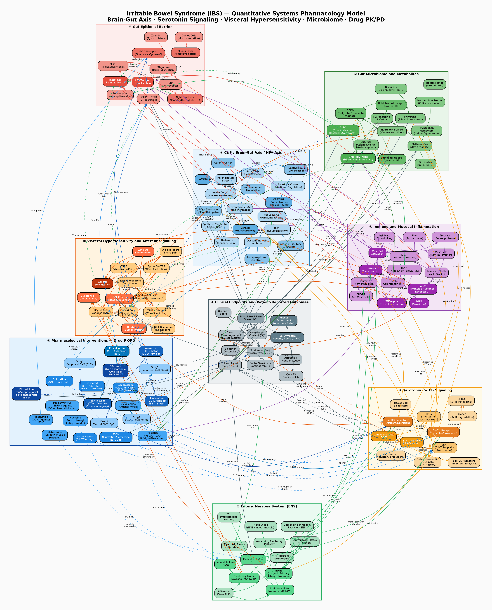</a> | 뇌-장축 이상·내장과민·미생물 변화. 식이·신경조절·장특이 약물(리나클로타이드 등).<br>[🗺️ 지도](irritable-bowel-syndrome/ibs_qsp_model.svg) · [⚙️ mrgsolve](irritable-bowel-syndrome/ibs_mrgsolve_model.R) · [📚 문헌](irritable-bowel-syndrome/ibs_references.md) · [📄 README](irritable-bowel-syndrome/README.md) |
| 215 | 신경 | [**허혈성 뇌졸중**<br><sub>Ischemic Stroke · IS</sub>](ischemic-stroke/) | <a href="ischemic-stroke/is_qsp_model.svg"></a> | 혈전/색전성 뇌혈관 폐색 → CBF 급감 → 허혈 핵심부(Core, <10 mL/100g/min) 불가역 괴사 + 반음영부(Penumbra, 10–20 mL/100g/min) 가역적 위험 조직 → ATP 고갈 → Na⁺/K⁺-ATPase 실패·탈분극 → 흥분독성 글루타메이트(NMDA/AMPA→Ca²⁺ 과부하) → ROS/NOS 과잉→미토콘…<br>[🗺️ 지도](ischemic-stroke/is_qsp_model.svg) · [⚙️ mrgsolve](ischemic-stroke/is_mrgsolve_model.R) · [📚 문헌](ischemic-stroke/is_references.md) · [📄 README](ischemic-stroke/README.md) |
| 216 | 자가면역·류마티스 | [**소아특발성 관절염**<br><sub>Juvenile Idiopathic Arthritis · JIA</sub>](juvenile-idiopathic-arthritis/) | <a href="juvenile-idiopathic-arthritis/jia_qsp_model.svg"></a> | T세포/B세포·사이토카인(TNF-α/IL-6/IL-1β/IL-18) 매개 활막 염증과 연골·골 파괴. 소수관절형/다관절형 RF±/전신형(sJIA)/ERA/건선성 7아형 모델링. sJIA: NLRP3→IL-1β/IL-18 자가염증 루프·MAS(대식세포 활성화 증후군) 경로 포함.<br>[🗺️ 지도](juvenile-idiopathic-arthritis/jia_qsp_model.svg) · [⚙️ mrgsolve](juvenile-idiopathic-arthritis/jia_mrgsolve_model.R) · [📚 문헌](juvenile-idiopathic-arthritis/jia_references.md) · [📄 README](juvenile-idiopathic-arthritis/README.md) |
| 217 | 혈관염 | [**가와사키병**<br><sub>Kawasaki Disease · KD</sub>](kawasaki-disease/) | <a href="kawasaki-disease/kd_qsp_model.svg"></a> | 원인 불명 트리거 → TLR/NLR 선천 면역 활성화 → NLRP3 인플라마좀(Caspase-1·IL-1β 성숙) → 사이토카인 폭풍(IL-1β·IL-6·TNF-α) → 혈관 내피 활성화(VCAM-1·ICAM-1·TF↑) → 관상동맥 중막 파괴·동맥류(AHA Z-점수 분류: small z≥2.5, medium z≥5, giant z≥10)…<br>[🗺️ 지도](kawasaki-disease/kd_qsp_model.svg) · [⚙️ mrgsolve](kawasaki-disease/kd_mrgsolve_model.R) · [📚 문헌](kawasaki-disease/kd_references.md) · [📄 README](kawasaki-disease/README.md) |
| 218 | 신장·비뇨 | [**신장이식 거부반응**<br><sub>Kidney Transplant Rejection · KTX</sub>](kidney-transplant-rejection/) | <a href="kidney-transplant-rejection/ktx_qsp_model.svg"></a> | 동종항원 인식이 T세포 매개 거부반응과 공여자특이항체 매개 거부반응을 일으키고, 이를 누르면 BK·CMV 감염이 늘어나는 순 면역억제의 U자형 상충관계를 다룬다.<br>[🗺️ 지도](kidney-transplant-rejection/ktx_qsp_model.svg) · [⚙️ mrgsolve](kidney-transplant-rejection/ktx_mrgsolve_model.R) · [📚 문헌](kidney-transplant-rejection/ktx_references.md) · [📄 README](kidney-transplant-rejection/README.md) |
| 219 | 근골격·신경근육 | [**람베르트-이튼 근무력증후군 (LEMS)**<br><sub>Lambert-Eaton Myasthenic Syndrome · LEMS</sub>](lambert-eaton-syndrome/) | <a href="lambert-eaton-syndrome/lems_qsp_model.svg"></a> | 항P/Q형 VGCC 자가항체 → 전시냅스 Ca²⁺ 유입 감소 → ACh 방출 저하 → EPP 감소·안전계수 저하 → CMAP 감소·근력 약화. 50–60% SCLC 동반 부종양. 아미파리딘(3,4-DAP K⁺차단 Emax, EC50 120 ng/mL)·프레드니솔론·혈장교환·IVIG·항암화학요법 6개 시나리오.<br>[🗺️ 지도](lambert-eaton-syndrome/lems_qsp_model.svg) · [⚙️ mrgsolve](lambert-eaton-syndrome/lems_mrgsolve_model.R) · [📚 문헌](lambert-eaton-syndrome/lems_references.md) · [📄 README](lambert-eaton-syndrome/README.md) |
| 220 | 혈액 | [**랑게르한스 세포 조직증식증 (LCH)**<br><sub>Langerhans Cell Histiocytosis · LCH</sub>](langerhans-cell-histiocytosis/) | <a href="langerhans-cell-histiocytosis/lch_qsp_model.svg"></a> | MAPK 드라이버를 가진 골수 수지상세포 전구체가 기원 분화단계에 따라 자연 소실하는 단일계통 골 병변부터 위험장기 다장기 질환까지 만드는 염증성 골수 신생물로, 세포정지성 MAPK 억제와 중단 후 재발, 활성 질환의 시간적분으로서의 영구 후유증을 다룹니다.<br>[🗺️ 지도](langerhans-cell-histiocytosis/lch_qsp_model.svg) · [⚙️ mrgsolve](langerhans-cell-histiocytosis/lch_mrgsolve_model.R) · [📚 문헌](langerhans-cell-histiocytosis/lch_references.md) · [📄 README](langerhans-cell-histiocytosis/README.md) |
| 221 | 내분비·대사 | [**지방이상증 증후군**<br><sub>Lipodystrophy Syndromes · LIPO</sub>](lipodystrophy-syndromes/) | <a href="lipodystrophy-syndromes/lipo_qsp_model.svg"></a> | 지방조직을 유한한 중성지방 완충기와 그 크기를 보고하는 렙틴 신호원으로 동시에 다루어, 하나의 병변에서 나오는 용량 결손과 신호 결손을 분리하고 메트렐렙틴 효과를 수용체 점유율과 신호 결손의 곱으로 유도한다.<br>[🗺️ 지도](lipodystrophy-syndromes/lipo_qsp_model.svg) · [⚙️ mrgsolve](lipodystrophy-syndromes/lipo_mrgsolve_model.R) · [📚 문헌](lipodystrophy-syndromes/lipo_references.md) · [📄 README](lipodystrophy-syndromes/README.md) |
| 222 | 소화기·간담도 | [**간경변증**<br><sub>Liver Cirrhosis · LC</sub>](liver-cirrhosis/) | <a href="liver-cirrhosis/lc_qsp_model.svg"></a> | 만성 손상 → 성상세포 섬유화·문맥압항진·합병증. 원인치료 및 합병증 관리.<br>[🗺️ 지도](liver-cirrhosis/lc_qsp_model.svg) · [⚙️ mrgsolve](liver-cirrhosis/lc_mrgsolve_model.R) · [📚 문헌](liver-cirrhosis/lc_references.md) · [📄 README](liver-cirrhosis/README.md) |
| 223 | 감염 | [**롱 코비드 (Long COVID / PASC)**<br><sub>Post-Acute Sequelae of SARS-CoV-2 · PASC</sub>](long-covid/) | <a href="long-covid/pasc_qsp_model.svg"></a> | SARS-CoV-2 조직 저장소(장·림프절·CNS) 지속 → 잔류 항원 → 면역 이상(CD8+ 소진·자가항체·IFN-I 기능 부전) → 다계통 손상.<br>[🗺️ 지도](long-covid/pasc_qsp_model.svg) · [⚙️ mrgsolve](long-covid/pasc_mrgsolve_model.R) · [📚 문헌](long-covid/pasc_references.md) · [📄 README](long-covid/README.md) |
| 224 | 심혈관 | [**선천성 QT 연장 증후군 (Long QT Syndrome)**<br><sub>Long QT Syndrome · LQTS</sub>](long-qt-syndrome/) | <a href="long-qt-syndrome/lqts_qsp_model.svg"></a> | 심실 재분극을 담당하는 이온통로 유전자 변이로 QTc가 병리적으로 연장되는 선천성 부정맥증후군으로, KCNQ1(IKs, LQT1 ~35-40%) 기능소실은 운동·수영 중 교감신경 항진 시 재분극예비능 부족을 노출시키고, KCNH2/hERG(IKr, LQT2 ~25-30%) 기능소실은 청각자극·정서적 각성·산후기에 취약하며, SCN5A(la…<br>[🗺️ 지도](long-qt-syndrome/lqts_qsp_model.svg) · [⚙️ mrgsolve](long-qt-syndrome/lqts_mrgsolve_model.R) · [📚 문헌](long-qt-syndrome/lqts_references.md) · [📄 README](long-qt-syndrome/README.md) |
| 225 | 신장·비뇨 | [**루푸스 신염**<br><sub>Lupus Nephritis · LN</sub>](lupus-nephritis/) | <a href="lupus-nephritis/ln_qsp_model.svg"></a> | type I IFN(pDC→cGAS-STING→TLR7/9) → BAFF↑ → B세포 과활성화 → 장수 형질세포 → anti-dsDNA IgG → 면역복합체(IC) → 사구체 메산지움·내피세포 침착 → 보체(C1q→C4→C3→C5a+C5b-9) → 족세포(podocyte) 손상 → nephrin↓ → 단백뇨(UPCR↑) → TGF-β→간질…<br>[🗺️ 지도](lupus-nephritis/ln_qsp_model.svg) · [⚙️ mrgsolve](lupus-nephritis/ln_mrgsolve_model.R) · [📚 문헌](lupus-nephritis/ln_references.md) · [📄 README](lupus-nephritis/README.md) |
| 226 | 종양 | [**림프관평활근종증 (LAM)**<br><sub>Lymphangioleiomyomatosis · LAM</sub>](lymphangioleiomyomatosis/) | <a href="lymphangioleiomyomatosis/lam_qsp_model.svg"></a> | TSC1/TSC2 기능 소실 변이(배선 또는 체세포 이중타격) → Rheb-GTP↑(정상 2.5배) → mTORC1 과활성(LAM 세포 내 4배) → S6K1-pT389↑·4E-BP1-P↑ → LAM 세포 증식·생존·침윤↑.<br>[🗺️ 지도](lymphangioleiomyomatosis/lam_qsp_model.svg) · [⚙️ mrgsolve](lymphangioleiomyomatosis/lam_mrgsolve_model.R) · [📚 문헌](lymphangioleiomyomatosis/lam_references.md) · [📄 README](lymphangioleiomyomatosis/README.md) |
| 227 | 내분비·대사 | [**림프구성 뇌하수체염**<br><sub>Lymphocytic Hypophysitis · LHY</sub>](lymphocytic-hypophysitis/) | <a href="lymphocytic-hypophysitis/lhyp_qsp_model.svg"></a> | 뇌하수체 자가면역 침윤·뇌하수체 기능저하(면역관문억제제 연관 포함). 스테로이드·호르몬 보충.<br>[🗺️ 지도](lymphocytic-hypophysitis/lhyp_qsp_model.svg) · [⚙️ mrgsolve](lymphocytic-hypophysitis/lhyp_mrgsolve_model.R) · [📚 문헌](lymphocytic-hypophysitis/lhyp_references.md) · [📄 README](lymphocytic-hypophysitis/README.md) |
| 228 | 피부 | [**중증 화상**<br><sub>Major Thermal Burn Injury · MBI</sub>](major-burn-injury/) | <a href="major-burn-injury/mbi_qsp_model.svg"></a> | 혈관내 용적을 주입량이 아니라 주입량 곱하기 유지분율로 쓰고, 교질삼투압이 단백질 농도의 볼록 함수라는 사실만 더해 수액 크립이 이득이 감소하는 제어기의 고정점임을 계산으로 보인다.<br>[🗺️ 지도](major-burn-injury/mbi_qsp_model.svg) · [⚙️ mrgsolve](major-burn-injury/mbi_mrgsolve_model.R) · [📚 문헌](major-burn-injury/mbi_references.md) · [📄 README](major-burn-injury/README.md) |
| 229 | 정신·신경 | [**주요우울장애 (MDD)**<br><sub>Major Depressive Disorder · MDD</sub>](major-depressive-disorder/) | <a href="major-depressive-disorder/mdd_qsp_model.svg"></a> | 모노아민·HPA축·신경가소성 이상. SSRI/SNRI·케타민·신경자극.<br>[🗺️ 지도](major-depressive-disorder/mdd_qsp_model.svg) · [⚙️ mrgsolve](major-depressive-disorder/mdd_mrgsolve_model.R) · [📚 문헌](major-depressive-disorder/mdd_references.md) · [📄 README](major-depressive-disorder/README.md) |
| 230 | 감염 | [**말라리아**<br><sub>Malaria · Plasmodium falciparum/vivax</sub>](malaria/) | <a href="malaria/mal_qsp_model.svg">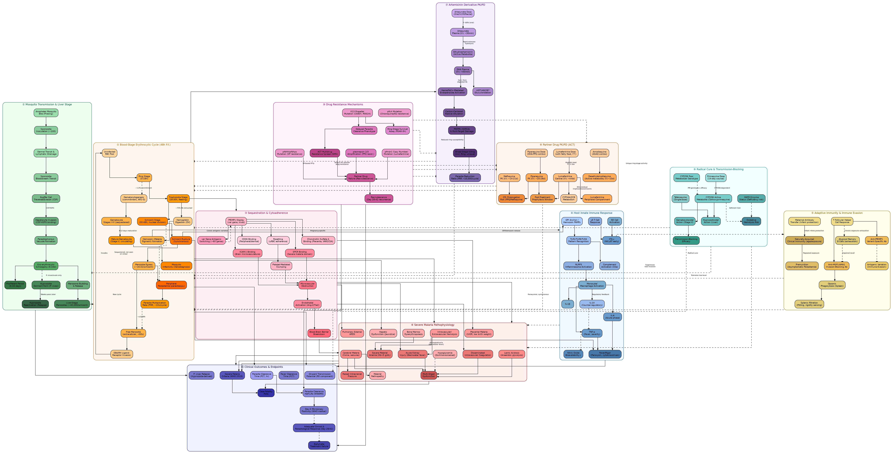</a> | 모기 매개 원충 감염으로, 간세포 침입 후 48시간 주기의 적혈구내 증식과 PfEMP1 매개 미세혈관 격리가 중증 뇌말라리아·빈혈을 유발하며 아르테미시닌 병용요법으로 치료한다.<br>[🗺️ 지도](malaria/mal_qsp_model.svg) · [⚙️ mrgsolve](malaria/mal_mrgsolve_model.R) · [📚 문헌](malaria/mal_references.md) · [📄 README](malaria/README.md) |
| 231 | 내분비·대사 | [**남성 성선기능저하증**<br><sub>Male Hypogonadism · MHG</sub>](male-hypogonadism/) | <a href="male-hypogonadism/mhg_qsp_model.svg"></a> | 측정되는 총 테스토스테론과 작용하는 유리 테스토스테론 사이의 SHBG 결합 평형이 비선형이어서 진단 역치가 SHBG에 따라 2.7배 움직이고, 외인성 안드로겐은 혈청 T를 정상화하면서 고환내 T를 붕괴시킨다.<br>[🗺️ 지도](male-hypogonadism/mhg_qsp_model.svg) · [⚙️ mrgsolve](male-hypogonadism/mhg_mrgsolve_model.R) · [📚 문헌](male-hypogonadism/mhg_references.md) · [📄 README](male-hypogonadism/README.md) |
| 232 | 근골격·신경근육 | [**악성 고열증**<br><sub>Malignant Hyperthermia · MH</sub>](malignant-hyperthermia/) | <a href="malignant-hyperthermia/mh_qsp_model.svg"></a> | 하나의 구동변수인 근형질 Ca2+를 크기가 100배 다른 두 저장고로 읽어, CO2 저장고 60 mL/mmHg와 열 저장고 158 kJ/degC의 비에서 EtCO2가 체온보다 먼저 움직인다는 사실이 관습이 아니라 산술로 유도된다.<br>[🗺️ 지도](malignant-hyperthermia/mh_qsp_model.svg) · [⚙️ mrgsolve](malignant-hyperthermia/mh_mrgsolve_model.R) · [📚 문헌](malignant-hyperthermia/mh_references.md) · [📄 README](malignant-hyperthermia/README.md) |
| 233 | 종양 | [**악성 흉막 중피종**<br><sub>Malignant Pleural Mesothelioma · MPM</sub>](malignant-pleural-mesothelioma/) | <a href="malignant-pleural-mesothelioma/mpm_qsp_model.svg"></a> | 종양을 공이 아니라 시트로 써서 부담을 침범 흉막면적과 흉막벽 두께의 곱으로 기술하여, mRECIST가 그 곱의 한 인자만 본다는 데서 미치료 상태에서도 영상이 반응으로 읽히는 현상이 유도된다.<br>[🗺️ 지도](malignant-pleural-mesothelioma/mpm_qsp_model.svg) · [⚙️ mrgsolve](malignant-pleural-mesothelioma/mpm_mrgsolve_model.R) · [📚 문헌](malignant-pleural-mesothelioma/mpm_references.md) · [📄 README](malignant-pleural-mesothelioma/README.md) |
| 234 | 심혈관 | [**마르팡 증후군 (Marfan Syndrome)**<br><sub>Marfan Syndrome · MFS</sub>](marfan-syndrome/) | <a href="marfan-syndrome/mfs_qsp_model.svg"></a> | FBN1 돌연변이(Chr 15q21.1) → 피브릴린-1 결함 → ECM 마이크로피브릴 파괴 → TGF-β 서열화 손상 → 자유 TGF-β1/2 증가 → p-SMAD2/3 + p-ERK1/2 과활성 → MMP-2/9↑ → 대동맥 중막 탄성 박판 분절화·낭성 괴사·평활근세포 세포자멸 → 대동맥 근부(발살바동) 확장 → 대동맥판 역류·박리(A…<br>[🗺️ 지도](marfan-syndrome/mfs_qsp_model.svg) · [⚙️ mrgsolve](marfan-syndrome/mfs_mrgsolve_model.R) · [📚 문헌](marfan-syndrome/mfs_references.md) · [📄 README](marfan-syndrome/README.md) |
| 235 | 신경 | [**ME/CFS (근통성 뇌척수염/만성피로증후군)**<br><sub>Myalgic Encephalomyelitis/Chronic Fatigue Syndrome · ME/CFS</sub>](me-cfs/) | <a href="me-cfs/mecfs_qsp_model.svg"></a> | 바이러스 지속감염(EBV·HHV-6·SARS-CoV-2) → TLR3/4/7·cGAS-STING 활성화 → IFN-γ↑(Th1/NK) → PDK1↑(피루브산탈수소효소인산화효소1) → PDH 인산화·억제 → 피루브산→젖산 전환 → NADH↓→복합체I↓→ATP 결핍 → 피로·PEM(노력후불쾌감) 완전 통합 QSP 모델.<br>[🗺️ 지도](me-cfs/mecfs_qsp_model.svg) · [⚙️ mrgsolve](me-cfs/mecfs_mrgsolve_model.R) · [📚 문헌](me-cfs/mecfs_references.md) · [📄 README](me-cfs/README.md) |
| 236 | 종양 | [**악성 흑색종**<br><sub>Melanoma · MEL</sub>](melanoma/) | <a href="melanoma/melanoma_qsp_model.svg"></a> | BRAF V600E/K 돌연변이(~50%) → 구성적 MEK1/2 활성 → ERK1/2 핵 전위 → MITF·MYC·사이클린D1 전사 → 세포증식·생존·혈관신생. NRAS Q61(~20%)·NF1 결손(~15%)·WT 드라이버.<br>[🗺️ 지도](melanoma/melanoma_qsp_model.svg) · [⚙️ mrgsolve](melanoma/melanoma_mrgsolve_model.R) · [📚 문헌](melanoma/melanoma_references.md) · [📄 README](melanoma/README.md) |
| 237 | 신장·비뇨 | [**막성 신병증**<br><sub>Membranous Nephropathy · MN</sub>](membranous-nephropathy/) | <a href="membranous-nephropathy/mn_qsp_model.svg">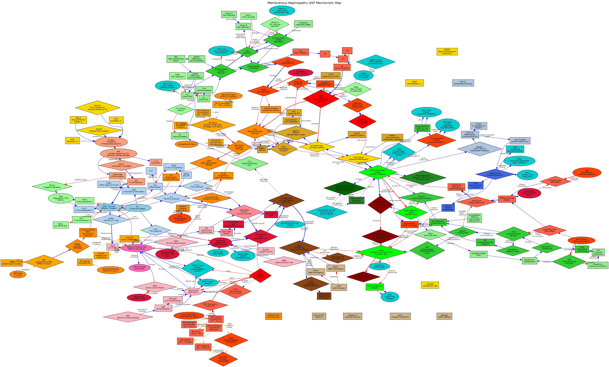</a> | 항PLA2R 항체에 의한 상피하 면역침착·신증후군. 리툭시맙 B세포 고갈.<br>[🗺️ 지도](membranous-nephropathy/mn_qsp_model.svg) · [⚙️ mrgsolve](membranous-nephropathy/mn_mrgsolve_model.R) · [📚 문헌](membranous-nephropathy/mn_references.md) · [📄 README](membranous-nephropathy/README.md) |
| 238 | 호흡기 | [**메니에르병 (Ménière's Disease)**<br><sub>Endolymphatic Hydrops · MD</sub>](menieres-disease/) | <a href="menieres-disease/med_qsp_model.svg"></a> | 만성 내이질환으로, 내림프낭 흡수장애와 혈관조(stria vascularis) 이온수송 이상(Na+/K+-ATPase·NKCC1·아쿠아포린/바소프레신-V2 축)에 의해 내림프수종(endolymphatic hydrops)(와우관·구형낭·타원낭 팽창)이 발생한다는 것이 핵심 병태생리이며, 자가면역/항내이항체·바이러스 유발·유전적 소인(DTNA…<br>[🗺️ 지도](menieres-disease/med_qsp_model.svg) · [⚙️ mrgsolve](menieres-disease/med_mrgsolve_model.R) · [📚 문헌](menieres-disease/med_references.md) · [📄 README](menieres-disease/README.md) |
| 239 | 내분비·대사 | [**대사 증후군**<br><sub>Metabolic Syndrome · MS</sub>](metabolic-syndrome/) | <a href="metabolic-syndrome/ms_qsp_model.svg"></a> | 인슐린 저항성·내장지방·이상지질·고혈압 군집. 생활습관 및 대사 표적 약물.<br>[🗺️ 지도](metabolic-syndrome/ms_qsp_model.svg) · [⚙️ mrgsolve](metabolic-syndrome/ms_mrgsolve_model.R) · [📚 문헌](metabolic-syndrome/ms_references.md) · [📄 README](metabolic-syndrome/README.md) |
| 240 | 소화기·간담도 | [**미세 대장염 (MC)**<br><sub>Microscopic Colitis · Lymphocytic + Collagenous</sub>](microscopic-colitis/) | <a href="microscopic-colitis/mc_qsp_model.svg">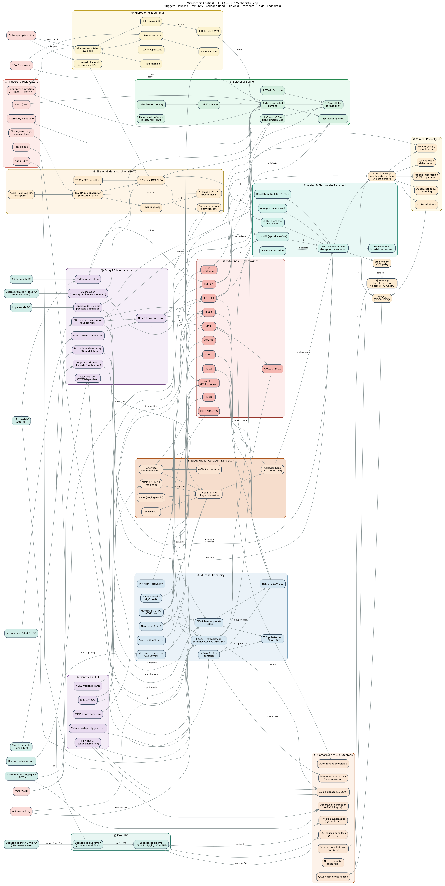</a> | 만성 또는 간헐적 수양성 비혈변 설사(>3회/일·>300 g/일·야간·urgency·체중감소)를 나타내고 대장내시경은 정상이나 조직검사에서 림프구성(LC, CD8+ IEL ≥20/100 epithelial cells, T-bet/IFN-γ Th1 polarization) 또는 콜라겐성(CC, 상피하 colagen band ≥10 μm, 페…<br>[🗺️ 지도](microscopic-colitis/mc_qsp_model.svg) · [⚙️ mrgsolve](microscopic-colitis/mc_mrgsolve_model.R) · [📚 문헌](microscopic-colitis/mc_references.md) · [📄 README](microscopic-colitis/README.md) |
| 241 | 혈관염 | [**현미경적 다발혈관염 (MPA)**<br><sub>Microscopic Polyangiitis · MPA</sub>](microscopic-polyangiitis/) | <a href="microscopic-polyangiitis/mpa_qsp_model.svg"></a> | MPO-ANCA 매개 소혈관염·급속진행성 사구체신염. 리툭시맙·아바코판.<br>[🗺️ 지도](microscopic-polyangiitis/mpa_qsp_model.svg) · [⚙️ mrgsolve](microscopic-polyangiitis/mpa_mrgsolve_model.R) · [📚 문헌](microscopic-polyangiitis/mpa_references.md) · [📄 README](microscopic-polyangiitis/README.md) |
| 242 | 신경 | [**편두통**<br><sub>Migraine · MGR</sub>](migraine/) | <a href="migraine/mgr_qsp_model.svg">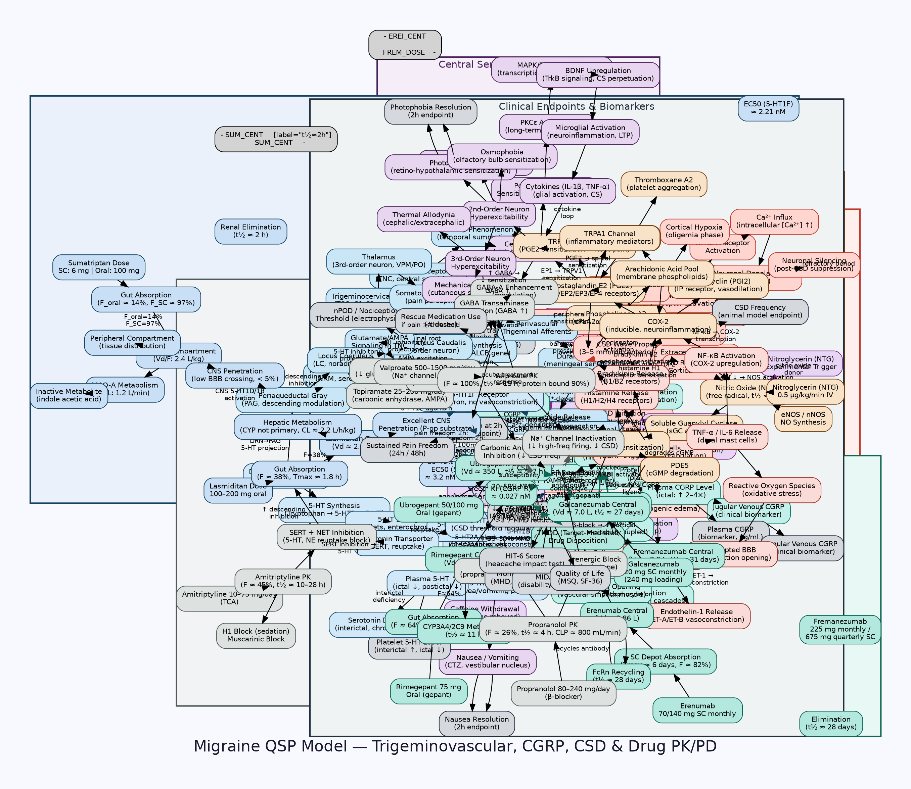</a> | 삼차혈관계·CGRP·피질확산성억제(CSD). 트립탄·항CGRP 항체·게판트.<br>[🗺️ 지도](migraine/mgr_qsp_model.svg) · [⚙️ mrgsolve](migraine/mgr_mrgsolve_model.R) · [📚 문헌](migraine/mgr_references.md) · [📄 README](migraine/README.md) |
| 243 | 신장·비뇨 | [**미세변화 신증후군**<br><sub>Minimal Change Disease · MCD</sub>](minimal-change-disease/) | <a href="minimal-change-disease/mcd_qsp_model.svg"></a> | T세포 매개 순환인자에 의한 족세포 손상·대량 단백뇨. 스테로이드·칼시뉴린억제제.<br>[🗺️ 지도](minimal-change-disease/mcd_qsp_model.svg) · [⚙️ mrgsolve](minimal-change-disease/mcd_mrgsolve_model.R) · [📚 문헌](minimal-change-disease/mcd_references.md) · [📄 README](minimal-change-disease/README.md) |
| 244 | 심혈관 | [**승모판 역류증**<br><sub>Mitral Regurgitation · MR</sub>](mitral-regurgitation/) | <a href="mitral-regurgitation/mr_qsp_model.svg"></a> | 역류량 하나를 좌심방 컴플라이언스·총일회박출량·좌심실용적·제거된 후부하·PISA 기하라는 다섯 분모로 나누어 기술하여, 급성과 만성의 차이와 동일 기기를 쓴 두 무작위시험의 상반된 결과를 산술로 유도한다.<br>[🗺️ 지도](mitral-regurgitation/mr_qsp_model.svg) · [⚙️ mrgsolve](mitral-regurgitation/mr_mrgsolve_model.R) · [📚 문헌](mitral-regurgitation/mr_references.md) · [📄 README](mitral-regurgitation/README.md) |
| 245 | 자가면역·류마티스 | [**혼합결합조직병 (MCTD)**<br><sub>Mixed Connective Tissue Disease · MCTD</sub>](mixed-connective-tissue-disease/) | <a href="mixed-connective-tissue-disease/mctd_qsp_model.svg"></a> | 항U1-RNP 항체 양성, SLE/SSc/PM 중복 양상. 스테로이드·면역억제.<br>[🗺️ 지도](mixed-connective-tissue-disease/mctd_qsp_model.svg) · [⚙️ mrgsolve](mixed-connective-tissue-disease/mctd_mrgsolve_model.R) · [📚 문헌](mixed-connective-tissue-disease/mctd_references.md) · [📄 README](mixed-connective-tissue-disease/README.md) |
| 246 | 신경 | [**MOG 항체 관련 질환 (MOGAD)**<br><sub>MOG Antibody-Associated Disease · MOGAD</sub>](mog-antibody-associated-disease/) | <a href="mog-antibody-associated-disease/mogad_qsp_model.svg"></a> | MOG 항체가 수초 최외층에 결합해 보체·탐식 매개 탈수초를 일으키되 올리고덴드로사이트는 살아남아 재수초화가 가능하며, 재발 위험은 항체 역가가 아니라 약물이 작용하는 지점에 따라 달라진다.<br>[🗺️ 지도](mog-antibody-associated-disease/mogad_qsp_model.svg) · [⚙️ mrgsolve](mog-antibody-associated-disease/mogad_mrgsolve_model.R) · [📚 문헌](mog-antibody-associated-disease/mogad_references.md) · [📄 README](mog-antibody-associated-disease/README.md) |
| 247 | 신경 | [**모야모야병 (MMD)**<br><sub>Moyamoya Disease · MMD</sub>](moyamoya-disease/) | <a href="moyamoya-disease/mmd_qsp_model.svg"></a> | 뇌혈류가 아니라 소동맥의 확장 여력을 상태변수로 두어, 임계 유입 컨덕턴스에서 여력 소실·압력수동화·아세타졸아미드 반응의 부호 반전이 한 점에서 동시에 일어남을 보이고 경색 임계값을 산소 산술에서 유도한다.<br>[🗺️ 지도](moyamoya-disease/mmd_qsp_model.svg) · [⚙️ mrgsolve](moyamoya-disease/mmd_mrgsolve_model.R) · [📚 문헌](moyamoya-disease/mmd_references.md) · [📄 README](moyamoya-disease/README.md) |
| 248 | 내분비·대사 | [**뮤코다당증 제1형 (MPS I)**<br><sub>Mucopolysaccharidosis Type I · Hurler/Hurler-Scheie/Scheie syndrome</sub>](mucopolysaccharidosis-type-1/) | <a href="mucopolysaccharidosis-type-1/mps1_qsp_model.svg">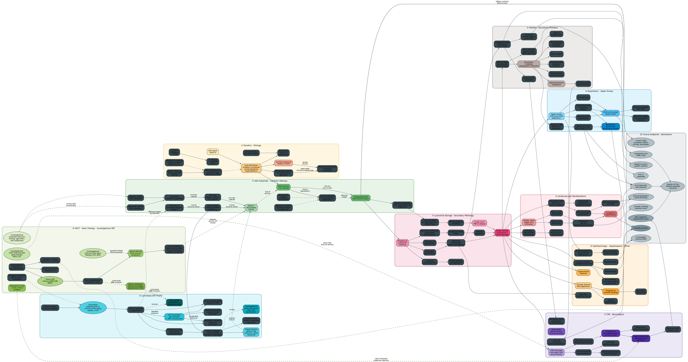</a> | 가장 흔한 리소좀 축적질환 중 하나로, IDUA 유전자(4p16.3)의 기능소실 돌연변이(상염색체 열성)에 의해 알파-L-이두로니다아제 활성이 1% 미만으로 저하되어 발생.<br>[🗺️ 지도](mucopolysaccharidosis-type-1/mps1_qsp_model.svg) · [⚙️ mrgsolve](mucopolysaccharidosis-type-1/mps1_mrgsolve_model.R) · [📚 문헌](mucopolysaccharidosis-type-1/mps1_references.md) · [📄 README](mucopolysaccharidosis-type-1/README.md) |
| 249 | 종양 | [**다발골수종**<br><sub>Multiple Myeloma · MM</sub>](multiple-myeloma/) | <a href="multiple-myeloma/mm_qsp_model.svg"></a> | 골수 형질세포 클론 증식·골 파괴. 프로테아좀 억제제·IMiD·항CD38.<br>[🗺️ 지도](multiple-myeloma/mm_qsp_model.svg) · [⚙️ mrgsolve](multiple-myeloma/mm_mrgsolve_model.R) · [📚 문헌](multiple-myeloma/mm_references.md) · [📄 README](multiple-myeloma/README.md) |
| 250 | 신경 | [**다발성 경화증**<br><sub>Multiple Sclerosis · MS</sub>](multiple-sclerosis/) | <a href="multiple-sclerosis/ms_qsp.svg">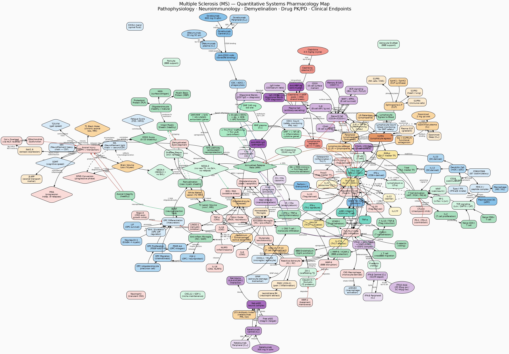</a> | 자가반응 T/B세포에 의한 중추신경 탈수초·축삭 손상. 질병조절치료(항CD20·S1P 조절제).<br>[🗺️ 지도](multiple-sclerosis/ms_qsp.svg) · [⚙️ mrgsolve](multiple-sclerosis/ms_mrgsolve_model.R) · [📚 문헌](multiple-sclerosis/ms_references.md) · [📄 README](multiple-sclerosis/README.md) |
| 251 | 신경 | [**다계통 위축 (MSA)**<br><sub>Multiple System Atrophy · MSA</sub>](multiple-system-atrophy/) | <a href="multiple-system-atrophy/msa_qsp_model.svg"></a> | 기립 혈압을 압수용체·중추 통합·절전 출력·절후 NE 저장·α1 수용체 밀도·순환용적의 곱으로 기술하여, 병소가 중추인지 절후인지에 따라 어떤 승압제가 듣는지가 유도되어 나오는 61-ODE 모델이다.<br>[🗺️ 지도](multiple-system-atrophy/msa_qsp_model.svg) · [⚙️ mrgsolve](multiple-system-atrophy/msa_mrgsolve_model.R) · [📚 문헌](multiple-system-atrophy/msa_references.md) · [📄 README](multiple-system-atrophy/README.md) |
| 252 | 신경 | [**중증 근무력증**<br><sub>Myasthenia Gravis · MG</sub>](myasthenia-gravis/) | <a href="myasthenia-gravis/mg_qsp_model.svg"></a> | 항AChR 항체·보체 매개 신경근접합 차단. 콜린에스터분해효소 억제·FcRn/보체 억제제.<br>[🗺️ 지도](myasthenia-gravis/mg_qsp_model.svg) · [⚙️ mrgsolve](myasthenia-gravis/mg_mrgsolve_model.R) · [📚 문헌](myasthenia-gravis/mg_references.md) · [📄 README](myasthenia-gravis/README.md) |
| 253 | 종양 | [**골수이형성 증후군**<br><sub>Myelodysplastic Syndrome · MDS</sub>](myelodysplastic-syndrome/) | <a href="myelodysplastic-syndrome/mds_qsp_model.svg"></a> | CHIP→MDS 클론 진화; SF3B1/SRSF2/U2AF1/ZRSR2 스플라이싱 돌연변이(고리 철아세포 형성·ABCB7 소실); TET2/DNMT3A/IDH1·2/ASXL1/EZH2 후성유전학 이상; del(5q)→RPS14 반수부족·miR-145/146a 소실·TIRAP↑; TP53 복잡핵형; 골수 미세환경 (CXCL12·SCF·TPO…<br>[🗺️ 지도](myelodysplastic-syndrome/mds_qsp_model.svg) · [⚙️ mrgsolve](myelodysplastic-syndrome/mds_mrgsolve_model.R) · [📚 문헌](myelodysplastic-syndrome/mds_references.md) · [📄 README](myelodysplastic-syndrome/README.md) |
| 254 | 종양 | [**골수섬유증**<br><sub>Myelofibrosis · MF</sub>](myelofibrosis/) | <a href="myelofibrosis/mf_qsp_model.svg"></a> | JAK2V617F/CALR/MPL 돌연변이·JAK/STAT3/5 신호·HSC 니치·골수 섬유화(TGF-β/PDGF/bFGF)·수외조혈(비장종대)·사이토카인 폭풍(IL-6/TNF-α)·혈전/출혈 위험. Ruxolitinib(2구획 PK)·Fedratinib·Pacritinib·Momelotinib·Pelabresib 병용 PK/PD.<br>[🗺️ 지도](myelofibrosis/mf_qsp_model.svg) · [⚙️ mrgsolve](myelofibrosis/mf_mrgsolve_model.R) · [📚 문헌](myelofibrosis/mf_references.md) · [📄 README](myelofibrosis/README.md) |
| 255 | 심혈관 | [**심근염**<br><sub>Myocarditis · MYO</sub>](myocarditis/) | <a href="myocarditis/myo_qsp_model.svg"></a> | 바이러스(CVB3·SARS-CoV-2·아데노바이러스·HHV-6) 심근세포 감염 → CAR/ACE2 수용체 진입 → 바이러스 복제·TLR3/7/9·RIG-I·MDA5·cGAS-STING 선천면역 활성화 → NF-κB·IRF3/7·NLRP3 인플라마좀 → IFN-α/β/γ·TNF-α·IL-1β·IL-6 사이토카인 폭풍 → NK세포·M1대식세포…<br>[🗺️ 지도](myocarditis/myo_qsp_model.svg) · [⚙️ mrgsolve](myocarditis/myo_mrgsolve_model.R) · [📚 문헌](myocarditis/myo_references.md) · [📄 README](myocarditis/README.md) |
| 256 | 안과 | [**소아 근시 진행**<br><sub>Progressive Myopia · MYP</sub>](myopia-progression/) | <a href="myopia-progression/myp_qsp_model.svg"></a> | 굴절값을 상태변수가 아니라 안축장·각막·수정체 세 광학 요소의 차이로 계산하여, 모든 근시 억제 치료가 안축장 하나에만 작용하는데 굴절 평가변수는 수정체 보상에 편향된다는 점을 계산으로 보인다.<br>[🗺️ 지도](myopia-progression/myp_qsp_model.svg) · [⚙️ mrgsolve](myopia-progression/myp_mrgsolve_model.R) · [📚 문헌](myopia-progression/myp_references.md) · [📄 README](myopia-progression/README.md) |
| 257 | 근골격·신경근육 | [**근긴장성 이영양증 제1형**<br><sub>Myotonic Dystrophy Type 1 · DM1</sub>](myotonic-dystrophy/) | <a href="myotonic-dystrophy/dm1_qsp_model.svg"></a> | DMPK 유전자 CTG 삼핵산 반복 확장(>50→10,000+) → CUGn RNA 핵내 발형 헤어핀 구조 → 핵내 RNA foci → MBNL1 격리(기능 소실) + PKCβII 활성화 → CUGBP1/CELF1 과인산화(기능 획득) → 태아형 스플라이싱 프로그램 복귀.<br>[🗺️ 지도](myotonic-dystrophy/dm1_qsp_model.svg) · [⚙️ mrgsolve](myotonic-dystrophy/dm1_mrgsolve_model.R) · [📚 문헌](myotonic-dystrophy/dm1_references.md) · [📄 README](myotonic-dystrophy/README.md) |
| 258 | 소화기·간담도 | [**비알코올 지방간질환/MASLD**<br><sub>NAFLD/MASLD · Metabolic-Associated Steatotic Liver Disease</sub>](nafld-masld/) | <a href="nafld-masld/nafld_qsp_model.svg"></a> | 인슐린 저항성 → 간 지질 과잉축적(지방증) → 산화·ER 스트레스 → 쿠퍼세포 활성화·NLRP3 인플라마좀 → 간세포 사멸(아포토시스·풍선변성) → 간성상세포(HSC) 활성화 → TGF-β1/SMAD2/3·LOXL2·MMP/TIMP → 간섬유화 → 간경변 → HCC.<br>[🗺️ 지도](nafld-masld/nafld_qsp_model.svg) · [⚙️ mrgsolve](nafld-masld/nafld_mrgsolve_model.R) · [📚 문헌](nafld-masld/nafld_references.md) · [📄 README](nafld-masld/README.md) |
| 259 | 소화기·간담도 | [**비알코올 지방간/지방간염 (NAFLD/NASH)**<br><sub>NAFLD/NASH · NAFLD</sub>](nafld-nash/) | <a href="nafld-nash/nafld_qsp_model.svg">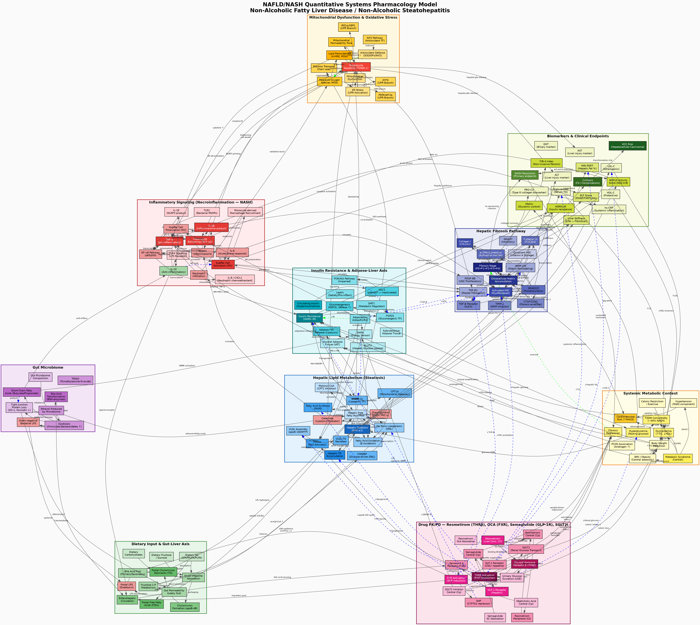</a> | 지방독성·염증·섬유화 진행(지방간→지방간염). 레스메티롬(THR-β)·GLP-1 작용제.<br>[🗺️ 지도](nafld-nash/nafld_qsp_model.svg) · [⚙️ mrgsolve](nafld-nash/nafld_mrgsolve_model.R) · [📚 문헌](nafld-nash/nafld_references.md) · [📄 README](nafld-nash/README.md) |
| 260 | 신경 | [**나르콜렙시 1형 (NT1)**<br><sub>Narcolepsy Type 1 · NT1</sub>](narcolepsy/) | <a href="narcolepsy/narc_qsp_model.svg"></a> | HLA-DQB1\06:02 감수성 + H1N1/Pandemrix 분자 모방 → CD4+/CD8+ T세포·NK세포가 시상하부 외측 오렉신 신경세포(~70,000개 → 85–95% 소실) 자가면역 파괴 → CSF 히포크레틴-1 <110 pg/mL → OX1R/OX2R 신호 소실 → LC(NE)·TMN(히스타민)·VTA(DA)·DRN(5-HT)…<br>[🗺️ 지도](narcolepsy/narc_qsp_model.svg) · [⚙️ mrgsolve](narcolepsy/narc_mrgsolve_model.R) · [📚 문헌](narcolepsy/narc_references.md) · [📄 README](narcolepsy/README.md) |
| 261 | 신생아·소아 | [**신생아 괴사성 장염 (NEC)**<br><sub>Necrotising Enterocolitis · NEC</sub>](necrotizing-enterocolitis/) | <a href="necrotizing-enterocolitis/nec_qsp_model.svg"></a> | 장세포 완전성 하나에 걸린 닫힌 양성 되먹임 고리로 기술하여, NEC가 가능해지는 부하와 필연이 되는 부하가 따로 존재하고 그 사이에서는 부하가 아니라 침습 삽화가 운명을 정한다는 것을 계산으로 보인다.<br>[🗺️ 지도](necrotizing-enterocolitis/nec_qsp_model.svg) · [⚙️ mrgsolve](necrotizing-enterocolitis/nec_mrgsolve_model.R) · [📚 문헌](necrotizing-enterocolitis/nec_references.md) · [📄 README](necrotizing-enterocolitis/README.md) |
| 262 | 신생아·소아 | [**신생아 고빌리루빈혈증 (신생아 황달)**<br><sub>Neonatal Hyperbilirubinaemia · NHB</sub>](neonatal-hyperbilirubinemia/) | <a href="neonatal-hyperbilirubinemia/nhb_qsp_model.svg"></a> | 측정되는 총빌리루빈과 실제로 뇌를 손상시키는 유리 빌리루빈을 알부민 포화 결합 등온선으로 잇고, 광선치료를 가역적 광이성질화와 비가역적 루미루빈 생성의 두 반응으로 분해한다.<br>[🗺️ 지도](neonatal-hyperbilirubinemia/nhb_qsp_model.svg) · [⚙️ mrgsolve](neonatal-hyperbilirubinemia/nhb_mrgsolve_model.R) · [📚 문헌](neonatal-hyperbilirubinemia/nhb_references.md) · [📄 README](neonatal-hyperbilirubinemia/README.md) |
| 263 | 종양 | [**고위험 신경블라스토마**<br><sub>High-Risk Neuroblastoma · NB</sub>](neuroblastoma/) | <a href="neuroblastoma/nb_qsp_model.svg"></a> | 항-GD2 항체의 효과와 용량제한독성을 Hill 지수가 다른 두 Fc 팔로 분리하고, 투과성이 200배 차이 나는 세 표적 구획에 배치하여 골수 미세잔존질환 치료제로서의 행태와 증량 무효가 산술로 유도되도록 모델링.<br>[🗺️ 지도](neuroblastoma/nb_qsp_model.svg) · [⚙️ mrgsolve](neuroblastoma/nb_mrgsolve_model.R) · [📚 문헌](neuroblastoma/nb_references.md) · [📄 README](neuroblastoma/README.md) |
| 264 | 희귀·유전 | [**신경섬유종증 1형 (NF1)**<br><sub>Neurofibromatosis Type 1 · NF1 gene 17q11.2 loss-of-function (autosomal dominant, ~50% de novo)</sub>](neurofibromatosis-type-1/) | <a href="neurofibromatosis-type-1/nf1_qsp_model.svg">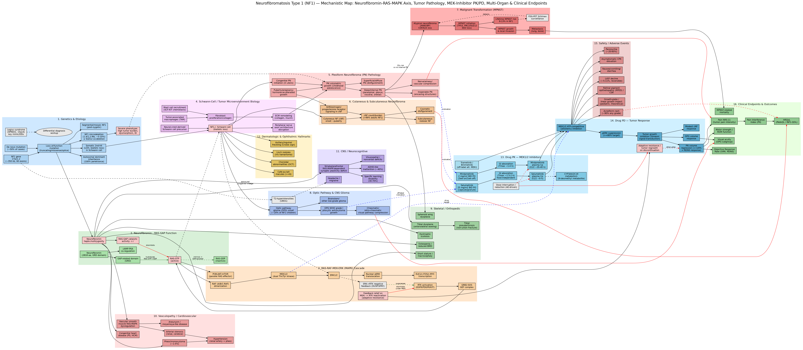</a> | 출생 약 1/2,700명에서 발생하는 상염색체 우성 RASopathy로, NF1 유전자(17q11.2)의 기능소실 돌연변이(약 50%는 de novo)에 의해 신경섬유종(neurofibromin) — RAS-GAP 계열 단백 — 이 결핍되어 발생.<br>[🗺️ 지도](neurofibromatosis-type-1/nf1_qsp_model.svg) · [⚙️ mrgsolve](neurofibromatosis-type-1/nf1_mrgsolve_model.R) · [📚 문헌](neurofibromatosis-type-1/nf1_references.md) · [📄 README](neurofibromatosis-type-1/README.md) |
| 265 | 신경 | [**시신경척수염 (NMOSD)**<br><sub>Neuromyelitis Optica · NMO</sub>](neuromyelitis-optica/) | <a href="neuromyelitis-optica/nmo_qsp_model.svg"></a> | 항AQP4 항체·보체 매개 성상세포 손상. 에쿨리주맙·항IL-6R(사트랄리주맙)·항CD19(이네빌리주맙).<br>[🗺️ 지도](neuromyelitis-optica/nmo_qsp_model.svg) · [⚙️ mrgsolve](neuromyelitis-optica/nmo_mrgsolve_model.R) · [📚 문헌](neuromyelitis-optica/nmo_references.md) · [📄 README](neuromyelitis-optica/README.md) |
| 266 | 희귀·유전 | [**니만-피크병 C형**<br><sub>Niemann-Pick Disease Type C · NPC</sub>](niemann-pick-disease-type-c/) | <a href="niemann-pick-disease-type-c/npc_qsp_model.svg"></a> | 혈장 표지자가 읽는 내장 저장과 사람을 죽이는 소뇌 병변을 서로 다른 구획으로 분리하고, 기능을 가역 성분과 비가역 성분으로 나누어 승인된 두 약이 각자 자기 기전만 볼 수 있는 설계로 시험되었음을 보인다.<br>[🗺️ 지도](niemann-pick-disease-type-c/npc_qsp_model.svg) · [⚙️ mrgsolve](niemann-pick-disease-type-c/npc_mrgsolve_model.R) · [📚 문헌](niemann-pick-disease-type-c/npc_references.md) · [📄 README](niemann-pick-disease-type-c/README.md) |
| 267 | 종양 | [**비호지킨 림프종 (DLBCL)**<br><sub>Non-Hodgkin Lymphoma · NHL</sub>](non-hodgkin-lymphoma/) | <a href="non-hodgkin-lymphoma/nhl_qsp_model.svg"></a> | GCB B세포에서 기원한 가장 흔한 공격성 B세포 림프종. BCR 신호(Lyn→Syk→BTK→PI3K/AKT/mTOR·NF-κB)·MYC/BCL-2 이중발현·GC반응 이탈 후 악성화.<br>[🗺️ 지도](non-hodgkin-lymphoma/nhl_qsp_model.svg) · [⚙️ mrgsolve](non-hodgkin-lymphoma/nhl_mrgsolve_model.R) · [📚 문헌](non-hodgkin-lymphoma/nhl_references.md) · [📄 README](non-hodgkin-lymphoma/README.md) |
| 268 | 종양 | [**비소세포 폐암 (NSCLC)**<br><sub>Non-Small Cell Lung Cancer · NSCLC</sub>](non-small-cell-lung-cancer/) | <a href="non-small-cell-lung-cancer/nsclc_qsp_model.svg">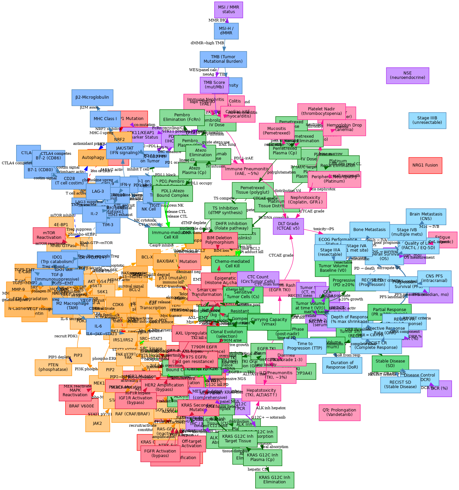</a> | EGFR/KRAS/ALK 드라이버 돌연변이 → oncogenic signaling. TKI(오시머티닙·알렉티닙·소토라십)·면역관문억제제(펨브롤리주맙)·항암화학요법 PK/PD. FLAURA·ALEX·KEYNOTE-189 보정.<br>[🗺️ 지도](non-small-cell-lung-cancer/nsclc_qsp_model.svg) · [⚙️ mrgsolve](non-small-cell-lung-cancer/nsclc_mrgsolve_model.R) · [📚 문헌](non-small-cell-lung-cancer/nsclc_references.md) · [📄 README](non-small-cell-lung-cancer/README.md) |
| 269 | 감염 | [**비결핵 항산균 폐질환 (MAC-PD)**<br><sub>Nontuberculous Mycobacterial Lung Disease · NTM</sub>](nontuberculous-mycobacterial-lung-disease/) | <a href="nontuberculous-mycobacterial-lung-disease/ntm_qsp_model.svg">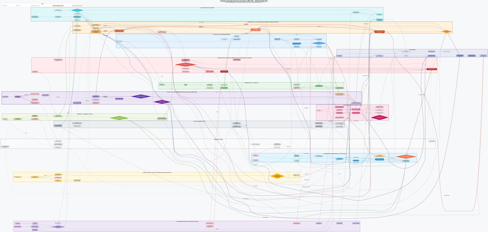</a> | 세균을 표현형이 아닌 네 개의 물리적 니치로 나누고 식포 pH 5.2 하나에서 마크로라이드의 축적과 활성소실을 동시에 유도하여, 흡입 리포솜 아미카신이 효능과 이독성을 분리하는 구조가 산술로 따라나오도록 모델링.<br>[🗺️ 지도](nontuberculous-mycobacterial-lung-disease/ntm_qsp_model.svg) · [⚙️ mrgsolve](nontuberculous-mycobacterial-lung-disease/ntm_mrgsolve_model.R) · [📚 문헌](nontuberculous-mycobacterial-lung-disease/ntm_references.md) · [📄 README](nontuberculous-mycobacterial-lung-disease/README.md) |
| 270 | 신경 | [**정상압 수두증 (iNPH)**<br><sub>Idiopathic Normal Pressure Hydrocephalus · iNPH</sub>](normal-pressure-hydrocephalus/) | <a href="normal-pressure-hydrocephalus/inph_qsp_model.svg"></a> | CSF 유출저항 상승이 평균 뇌압은 정상 범위에 남긴 채 순응도 저하와 박동압 증가로만 드러나며, 션트의 안전역은 생물학이 아니라 직립 시 정수압 컬럼이 결정한다.<br>[🗺️ 지도](normal-pressure-hydrocephalus/inph_qsp_model.svg) · [⚙️ mrgsolve](normal-pressure-hydrocephalus/inph_mrgsolve_model.R) · [📚 문헌](normal-pressure-hydrocephalus/inph_references.md) · [📄 README](normal-pressure-hydrocephalus/README.md) |
| 271 | 내분비·대사 | [**비만**<br><sub>Obesity · OB</sub>](obesity/) | <a href="obesity/ob_qsp_model.svg"></a> | 에너지 항상성·식욕조절(렙틴/GLP-1/멜라노코르틴) 조절이상. GLP-1/GIP 작용제 체중감량.<br>[🗺️ 지도](obesity/ob_qsp_model.svg) · [⚙️ mrgsolve](obesity/ob_mrgsolve_model.R) · [📚 문헌](obesity/ob_references.md) · [📄 README](obesity/README.md) |
| 272 | 정신·신경 | [**강박장애 (OCD)**<br><sub>Obsessive-Compulsive Disorder · OCD</sub>](obsessive-compulsive-disorder/) | <a href="obsessive-compulsive-disorder/ocd_qsp_model.svg"></a> | CSTC 회로 과활성화 — OFC 과활성(강박 사고) → 미상핵 과대사(강박 행동) → 직접 경로(D1/Go) 우세·간접 경로(D2/No-Go) 약화 → 시상 탈억제 → OFC 루프 재구동. SERT ≥80% 점유 필요(우울증 60% 대비). 5-HT1A 자가수용체 탈감작이 2–4주 지연 반응 설명.<br>[🗺️ 지도](obsessive-compulsive-disorder/ocd_qsp_model.svg) · [⚙️ mrgsolve](obsessive-compulsive-disorder/ocd_mrgsolve_model.R) · [📚 문헌](obsessive-compulsive-disorder/ocd_references.md) · [📄 README](obsessive-compulsive-disorder/README.md) |
| 273 | 호흡기 | [**폐쇄성 수면 무호흡 (OSA)**<br><sub>Obstructive Sleep Apnea · OSA</sub>](obstructive-sleep-apnea/) | <a href="obstructive-sleep-apnea/osa_qsp_model.svg"></a> | 상기도 허탈·간헐적 저산소·교감신경 활성. CPAP·체중감량·약물 보조.<br>[🗺️ 지도](obstructive-sleep-apnea/osa_qsp_model.svg) · [⚙️ mrgsolve](obstructive-sleep-apnea/osa_mrgsolve_model.R) · [📚 문헌](obstructive-sleep-apnea/osa_references.md) · [📄 README](obstructive-sleep-apnea/README.md) |
| 274 | 정신·신경 | [**오피오이드 사용장애 (OUD)**<br><sub>Opioid Use Disorder · OUD</sub>](opioid-use-disorder/) | <a href="opioid-use-disorder/oud_qsp_model.svg">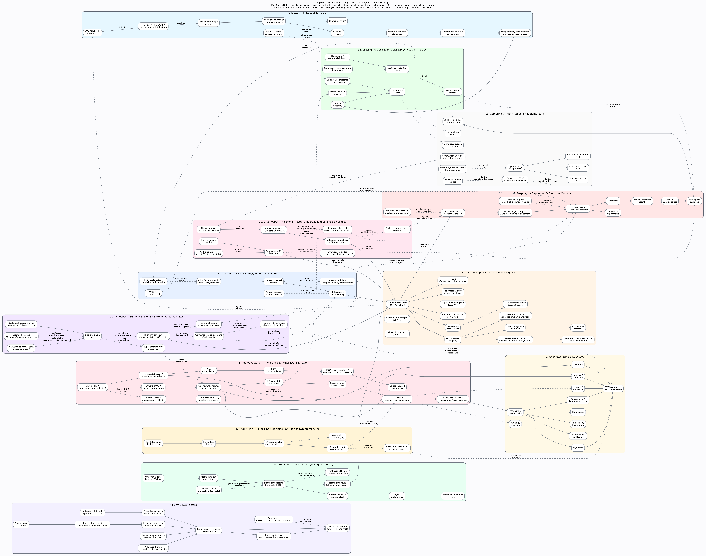</a> | 반복적인 뮤-오피오이드 수용체(MOR) 작용제 결합이 VTA GABA성 사이신경세포를 억제해 도파민 신경세포를 탈억제시키고 측좌핵 도파민 분비·조건화된 단서연합을 형성하는 것이 중독의 핵심 신경생물학이다.<br>[🗺️ 지도](opioid-use-disorder/oud_qsp_model.svg) · [⚙️ mrgsolve](opioid-use-disorder/oud_mrgsolve_model.R) · [📚 문헌](opioid-use-disorder/oud_references.md) · [📄 README](opioid-use-disorder/README.md) |
| 275 | 중독·환경 | [**급성 유기인계 살충제 중독**<br><sub>Organophosphate Insecticide Poisoning · OP</sub>](organophosphate-poisoning/) | <a href="organophosphate-poisoning/op_qsp_model.svg"></a> | 옥심이 할 수 있는 일 전부를 무차원수 하나로 환원하여, 재활성화가 포화하기 때문에 용량으로는 넘을 수 없는 천장이 존재하고 그 천장이 무작위 시험의 음성 결과를 산술로 설명한다는 것을 보인다.<br>[🗺️ 지도](organophosphate-poisoning/op_qsp_model.svg) · [⚙️ mrgsolve](organophosphate-poisoning/op_mrgsolve_model.R) · [📚 문헌](organophosphate-poisoning/op_references.md) · [📄 README](organophosphate-poisoning/README.md) |
| 276 | 근골격·신경근육 | [**골관절염**<br><sub>Osteoarthritis · OA</sub>](osteoarthritis/) | <a href="osteoarthritis/oa_qsp_model.svg"></a> | 연골 분해(MMP/ADAMTS)·연골하골 변화·저등급 활막염. 대증 진통·관절강 주사·항NGF 신약.<br>[🗺️ 지도](osteoarthritis/oa_qsp_model.svg) · [⚙️ mrgsolve](osteoarthritis/oa_mrgsolve_model.R) · [📚 문헌](osteoarthritis/oa_references.md) · [📄 README](osteoarthritis/README.md) |
| 277 | 희귀·유전 | [**골형성부전증 (OI)**<br><sub>Osteogenesis Imperfecta · COL1A1/COL1A2 dominant glycine substitution</sub>](osteogenesis-imperfecta/) | <a href="osteogenesis-imperfecta/oi_qsp_model.svg">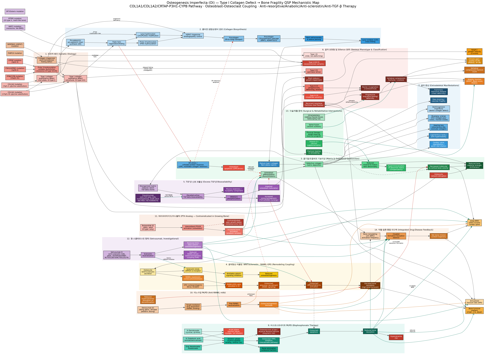</a> | 제1형 콜라겐 유전자 COL1A1/COL1A2(상염색체 우성, 대부분 글리신 치환)의 정량적(null allele, 경증 type I) 또는 구조적(질적 결함, type II-IV) 돌연변이가 주 원인이며, 드물게 콜라겐 3-수산화복합체(CRTAP·P3H1·PPIB) 또는 샤페론(SERPINH1/HSP47·FKBP10)·WNT1·SP7 등…<br>[🗺️ 지도](osteogenesis-imperfecta/oi_qsp_model.svg) · [⚙️ mrgsolve](osteogenesis-imperfecta/oi_mrgsolve_model.R) · [📚 문헌](osteogenesis-imperfecta/oi_references.md) · [📄 README](osteogenesis-imperfecta/README.md) |
| 278 | 내분비·대사 | [**골다공증**<br><sub>Osteoporosis · OP</sub>](osteoporosis/) | <a href="osteoporosis/op_qsp_model.svg"></a> | RANKL-OPG 불균형으로 골흡수↑/형성↓. 비스포스포네이트·데노수맙·로모소주맙.<br>[🗺️ 지도](osteoporosis/op_qsp_model.svg) · [⚙️ mrgsolve](osteoporosis/op_mrgsolve_model.R) · [📚 문헌](osteoporosis/op_references.md) · [📄 README](osteoporosis/README.md) |
| 279 | 종양 | [**골육종**<br><sub>Osteosarcoma · OSA</sub>](osteosarcoma/) | <a href="osteosarcoma/osa_qsp_model.svg"></a> | 완치를 보이지 않는 병소에 대한 포아송 도박으로 쓰고 노출 예산에 신장·심장·와우 세 개의 천장을 두어, 메토트렉세이트가 자기를 배출하는 장기를 파괴한다는 구조에서 임계 요 pH 7.30과 강화 시험들의 음성 결과가 산술로 유도된다.<br>[🗺️ 지도](osteosarcoma/osa_qsp_model.svg) · [⚙️ mrgsolve](osteosarcoma/osa_mrgsolve_model.R) · [📚 문헌](osteosarcoma/osa_references.md) · [📄 README](osteosarcoma/README.md) |
| 280 | 종양 | [**난소암 (HGSOC)**<br><sub>Ovarian Cancer · High-Grade Serous</sub>](ovarian-cancer/) | <a href="ovarian-cancer/oc_qsp_model.svg"></a> | TP53 변이(>96%) + HRD(BRCA1/2·HRR 유전자) → 상동재조합 결핍 → PARP 합성 치사 · 백금 내성 · 복막 전이 → HGSOC.<br>[🗺️ 지도](ovarian-cancer/oc_qsp_model.svg) · [⚙️ mrgsolve](ovarian-cancer/oc_mrgsolve_model.R) · [📚 문헌](ovarian-cancer/oc_references.md) · [📄 README](ovarian-cancer/README.md) |
| 281 | 신장·비뇨 | [**과민성 방광 (OAB)**<br><sub>Overactive Bladder · OAB</sub>](overactive-bladder/) | <a href="overactive-bladder/oab_qsp_model.svg"></a> | 배뇨근 과활동(무스카린/β3 수용체 불균형). 항무스카린제·미라베그론(β3 작용제).<br>[🗺️ 지도](overactive-bladder/oab_qsp_model.svg) · [⚙️ mrgsolve](overactive-bladder/oab_mrgsolve_model.R) · [📚 문헌](overactive-bladder/oab_references.md) · [📄 README](overactive-bladder/README.md) |
| 282 | 내분비·대사 | [**파젯병 (골)**<br><sub>Paget's Disease of Bone · PBD</sub>](pagets-disease/) | <a href="pagets-disease/pbd_qsp_model.svg"></a> | SQSTM1/RANKL 과활성에 의한 비정상 골개조. 졸레드론산 등 비스포스포네이트.<br>[🗺️ 지도](pagets-disease/pbd_qsp_model.svg) · [⚙️ mrgsolve](pagets-disease/pbd_mrgsolve_model.R) · [📚 문헌](pagets-disease/pbd_references.md) · [📄 README](pagets-disease/README.md) |
| 283 | 종양 | [**췌장 선암**<br><sub>Pancreatic Ductal Adenocarcinoma · PDAC</sub>](pancreatic-cancer/) | <a href="pancreatic-cancer/pdac_qsp_model.svg"></a> | KRAS G12D/V/R(~95%)·TP53(~75%)·CDKN2A(~90%)·SMAD4(~55%) 드라이버 돌연변이, RAS/MAPK/PI3K/AKT/mTOR 신호, TGF-β/SMAD/EMT 축, 치밀 섬유화 기질(PSC·CAF·HA·IFP↑→약물침투↓), 고면역억제 TME(PD-L1·Treg·MDSC·TAM-M2), HIF-1α/VE…<br>[🗺️ 지도](pancreatic-cancer/pdac_qsp_model.svg) · [⚙️ mrgsolve](pancreatic-cancer/pdac_mrgsolve_model.R) · [📚 문헌](pancreatic-cancer/pdac_references.md) · [📄 README](pancreatic-cancer/README.md) |
| 284 | 신경 | [**파킨슨병**<br><sub>Parkinson's Disease · PD</sub>](parkinsons-disease/) | <a href="parkinsons-disease/pd_qsp_model.svg"></a> | 흑질 도파민 신경세포 변성·α-시누클레인 응집. 레보도파·도파민작용제·MAO-B 억제제.<br>[🗺️ 지도](parkinsons-disease/pd_qsp_model.svg) · [⚙️ mrgsolve](parkinsons-disease/pd_mrgsolve_model.R) · [📚 문헌](parkinsons-disease/pd_references.md) · [📄 README](parkinsons-disease/README.md) |
| 285 | 혈액 | [**발작성 야간 혈색소뇨증**<br><sub>Paroxysmal Nocturnal Hemoglobinuria · PNH</sub>](paroxysmal-nocturnal-hemoglobinuria/) | <a href="paroxysmal-nocturnal-hemoglobinuria/pnh_qsp_model.svg"></a> | PIGA 체세포 돌연변이 → GPI 앵커 결핍 → CD55/CD59 소실 → 보체 대체경로 무조절 활성화 → 혈관내 용혈(IVH)·혈관외 용혈(EVH)·혈전증.<br>[🗺️ 지도](paroxysmal-nocturnal-hemoglobinuria/pnh_qsp_model.svg) · [⚙️ mrgsolve](paroxysmal-nocturnal-hemoglobinuria/pnh_mrgsolve_model.R) · [📚 문헌](paroxysmal-nocturnal-hemoglobinuria/pnh_references.md) · [📄 README](paroxysmal-nocturnal-hemoglobinuria/README.md) |
| 286 | 신생아·소아 | [**미숙아 동맥관 개존증 (PDA)**<br><sub>Patent Ductus Arteriosus of Prematurity · PDA</sub>](patent-ductus-arteriosus/) | <a href="patent-ductus-arteriosus/pda_qsp_model.svg"></a> | 동맥관을 병변이 아니라 프로스타글란딘 E2가 열어 두는 정상 태아 혈관으로 기술하여, 수축과 폐쇄와 단락 부담을 서로 다른 변수로 분리하고 관은 닫히지만 결과는 개선되지 않는 임상시험 결과를 재현한다.<br>[🗺️ 지도](patent-ductus-arteriosus/pda_qsp_model.svg) · [⚙️ mrgsolve](patent-ductus-arteriosus/pda_mrgsolve_model.R) · [📚 문헌](patent-ductus-arteriosus/pda_references.md) · [📄 README](patent-ductus-arteriosus/README.md) |
| 287 | 피부 | [**심상성 천포창**<br><sub>Pemphigus Vulgaris · PV</sub>](pemphigus-vulgaris/) | <a href="pemphigus-vulgaris/pv_qsp_model.svg">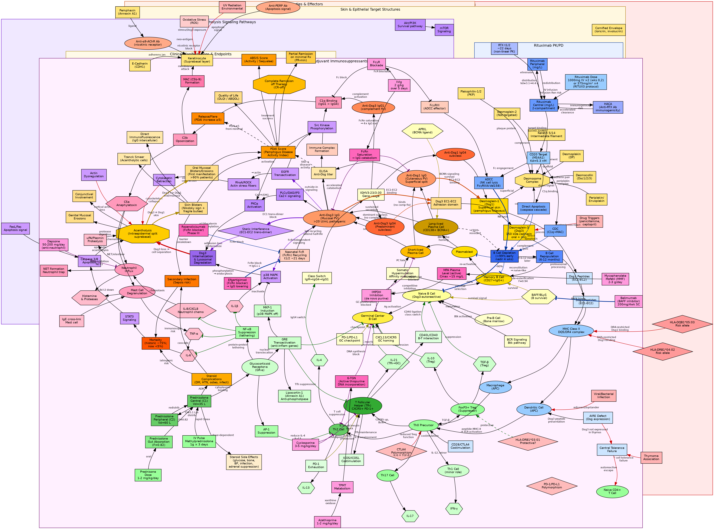</a> | 항데스모글레인 항체에 의한 표피내 수포(천포창). 리툭시맙·스테로이드.<br>[🗺️ 지도](pemphigus-vulgaris/pv_qsp_model.svg) · [⚙️ mrgsolve](pemphigus-vulgaris/pv_mrgsolve_model.R) · [📚 문헌](pemphigus-vulgaris/pv_references.md) · [📄 README](pemphigus-vulgaris/README.md) |
| 288 | 소화기·간담도 | [**소화성 궤양**<br><sub>Peptic Ulcer Disease · PUD</sub>](peptic-ulcer/) | <a href="peptic-ulcer/pud_qsp_model.svg"></a> | H. pylori·NSAID에 의한 점막 방어-공격 불균형. PPI·제균요법 점막 치유.<br>[🗺️ 지도](peptic-ulcer/pud_qsp_model.svg) · [⚙️ mrgsolve](peptic-ulcer/pud_mrgsolve_model.R) · [📚 문헌](peptic-ulcer/pud_references.md) · [📄 README](peptic-ulcer/README.md) |
| 289 | 기타 | [**치주염**<br><sub>Periodontitis · PDT</sub>](periodontitis/) | <a href="periodontitis/pdt_qsp_model.svg"></a> | 치은연하 디스바이오시스가 진지페인 유래 C5a와 C5aR1-TLR2 교차대화로 호중구 살균능만 선택적으로 무력화시켜 자기유지 염증 되먹임을 만들고 RANKL 매개 비가역 치조골 소실로 이어지는 과정을 쌍안정 모델로 기술한다.<br>[🗺️ 지도](periodontitis/pdt_qsp_model.svg) · [⚙️ mrgsolve](periodontitis/pdt_mrgsolve_model.R) · [📚 문헌](periodontitis/pdt_references.md) · [📄 README](periodontitis/README.md) |
| 290 | 심혈관 | [**주변분만성 심근병증 (PPCM)**<br><sub>Peripartum Cardiomyopathy · PPCM</sub>](peripartum-cardiomyopathy/) | <a href="peripartum-cardiomyopathy/ppcm_qsp_model.svg"></a> | 임신 말기 또는 분만 후 5개월 내 발생하는 새로운 수축기 심부전으로, 산화 스트레스로 활성화된 카텝신 D가 프로락틴을 절단해 만든 16-kDa 프로락틴과 태반 sFlt-1이 관상동맥 미세혈관을 손상시키며, 브로모크립틴이 유일한 질환 특이 치료제이다.<br>[🗺️ 지도](peripartum-cardiomyopathy/ppcm_qsp_model.svg) · [⚙️ mrgsolve](peripartum-cardiomyopathy/ppcm_mrgsolve_model.R) · [📚 문헌](peripartum-cardiomyopathy/ppcm_references.md) · [📄 README](peripartum-cardiomyopathy/README.md) |
| 291 | 심혈관 | [**말초동맥질환 (PAD)**<br><sub>Peripheral Arterial Disease · PAD</sub>](peripheral-arterial-disease/) | <a href="peripheral-arterial-disease/pad_qsp_model.svg"></a> | 죽상경화에 의한 하지 허혈·파행. 항혈소판·스타틴·실로스타졸.<br>[🗺️ 지도](peripheral-arterial-disease/pad_qsp_model.svg) · [⚙️ mrgsolve](peripheral-arterial-disease/pad_mrgsolve_model.R) · [📚 문헌](peripheral-arterial-disease/pad_references.md) · [📄 README](peripheral-arterial-disease/README.md) |
| 292 | 혈액 | [**악성 빈혈**<br><sub>Pernicious Anemia · PNA</sub>](pernicious-anemia/) | <a href="pernicious-anemia/pna_qsp_model.svg"></a> | 항내인자/벽세포 항체에 의한 비타민 B12 흡수장애. B12 보충요법.<br>[🗺️ 지도](pernicious-anemia/pna_qsp_model.svg) · [⚙️ mrgsolve](pernicious-anemia/pna_mrgsolve_model.R) · [📚 문헌](pernicious-anemia/pna_references.md) · [📄 README](pernicious-anemia/README.md) |
| 293 | 희귀·유전 | [**페닐케톤뇨증 (PKU)**<br><sub>Phenylketonuria · PAH gene 12q23.2 loss-of-function (autosomal recessive)</sub>](phenylketonuria/) | <a href="phenylketonuria/pku_qsp_model.svg">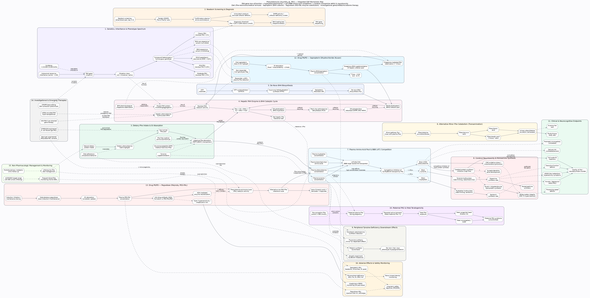</a> | 상염색체 열성 아미노산대사 선천성 오류로, PAH 유전자(12q23.2) 기능소실 돌연변이에 의해 간 페닐알라닌 하이드록실라제(PAH)(BH4 보조인자 필요)가 결핍되어 페닐알라닌(Phe)이 티로신(Tyr)으로 전환되지 못하고 축적된다.<br>[🗺️ 지도](phenylketonuria/pku_qsp_model.svg) · [⚙️ mrgsolve](phenylketonuria/pku_mrgsolve_model.R) · [📚 문헌](phenylketonuria/pku_references.md) · [📄 README](phenylketonuria/README.md) |
| 294 | 종양 | [**갈색세포종/부신경절종**<br><sub>Pheochromocytoma/Paraganglioma · PPGL</sub>](pheochromocytoma/) | <a href="pheochromocytoma/ppgl_qsp_model.svg"></a> | 부신 수질 크롬친화세포(sporadic 60% / germline 40%: SDHB·VHL·RET·NF1·MAX) → 카테콜아민 과분비 → α₁-AR 활성화 → 혈관수축·SVR↑·수축기혈압↑·고혈압 위기(≥180mmHg); β₁-AR → 심박수·심박출량↑; 카테콜아민 심근병증·타코츠보·부정맥.<br>[🗺️ 지도](pheochromocytoma/ppgl_qsp_model.svg) · [⚙️ mrgsolve](pheochromocytoma/ppgl_mrgsolve_model.R) · [📚 문헌](pheochromocytoma/ppgl_references.md) · [📄 README](pheochromocytoma/README.md) |
| 295 | 호흡기 | [**진폐증**<br><sub>Pneumoconiosis · PNM</sub>](pneumoconiosis/) | <a href="pneumoconiosis/pnm_qsp_model.svg"></a> | 분진(실리카/석탄/석면) 대식세포 활성·진행성 폐섬유화. 노출차단·대증치료.<br>[🗺️ 지도](pneumoconiosis/pnm_qsp_model.svg) · [⚙️ mrgsolve](pneumoconiosis/pnm_mrgsolve_model.R) · [📚 문헌](pneumoconiosis/pnm_references.md) · [📄 README](pneumoconiosis/README.md) |
| 296 | 혈관염 | [**결절성 다발동맥염 (PAN)**<br><sub>Polyarteritis Nodosa · PAN</sub>](polyarteritis-nodosa/) | <a href="polyarteritis-nodosa/pan_qsp_model.svg"></a> | 중형 동맥의 괴사성 염증(HBV 연관 포함). 스테로이드·CY·항바이러스.<br>[🗺️ 지도](polyarteritis-nodosa/pan_qsp_model.svg) · [⚙️ mrgsolve](polyarteritis-nodosa/pan_mrgsolve_model.R) · [📚 문헌](polyarteritis-nodosa/pan_references.md) · [📄 README](polyarteritis-nodosa/README.md) |
| 297 | 내분비·대사 | [**다낭성 난소 증후군 (PCOS)**<br><sub>Polycystic Ovary Syndrome · PCOS</sub>](polycystic-ovary-syndrome/) | <a href="polycystic-ovary-syndrome/pcos_qsp_model.svg">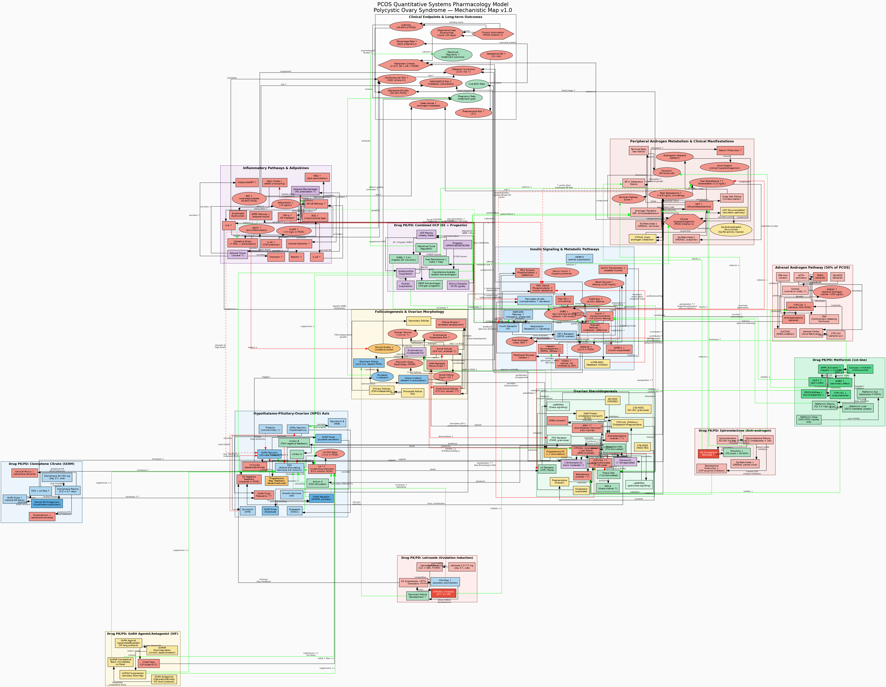</a> | 고안드로겐·인슐린저항·LH/FSH 이상. 메트포르민·항안드로겐·배란유도.<br>[🗺️ 지도](polycystic-ovary-syndrome/pcos_qsp_model.svg) · [⚙️ mrgsolve](polycystic-ovary-syndrome/pcos_mrgsolve_model.R) · [📚 문헌](polycystic-ovary-syndrome/pcos_references.md) · [📄 README](polycystic-ovary-syndrome/README.md) |
| 298 | 종양 | [**진성 다혈증 (PV)**<br><sub>Polycythemia Vera · PV</sub>](polycythemia-vera/) | <a href="polycythemia-vera/pv_qsp_model.svg"></a> | JAK2 V617F 체세포 돌연변이(>95%) → 구성적 JAK-STAT5 신호 → EPO 비의존적 BFU-E/CFU-E 과증식 → 적혈구 덩어리 상승 → Hct 증가 → 혈액 점도 상승 → 혈전 위험(DVT·뇌졸중·간정맥 혈전). 혈소판증가증·백혈구증가증·비장비대(수외조혈). 골수섬유증(post-PV MF) 및 AML 이행 위험.<br>[🗺️ 지도](polycythemia-vera/pv_qsp_model.svg) · [⚙️ mrgsolve](polycythemia-vera/pv_mrgsolve_model.R) · [📚 문헌](polycythemia-vera/pv_references.md) · [📄 README](polycythemia-vera/README.md) |
| 299 | 자가면역·류마티스 | [**류마티카 다발성 근통**<br><sub>Polymyalgia Rheumatica · PMR</sub>](polymyalgia-rheumatica/) | <a href="polymyalgia-rheumatica/pmr_qsp_model.svg"></a> | IL-6 중심 염증 → 근통·조조강직 — HLA-DRB1*04·PTPN22 유전 소인 + 환경 유발(감염·계절) → 형질세포양 수지상세포(pDC) 및 고전적 단핵구 활성화 → NLRP3 인플라마좀·TLR4 → IL-1β·TNF-α; IL-23 → Th17(IL-17A/F) 분화, IFN-γ → Th1 편향, Treg 기능 억제; 어깨·고관…<br>[🗺️ 지도](polymyalgia-rheumatica/pmr_qsp_model.svg) · [⚙️ mrgsolve](polymyalgia-rheumatica/pmr_mrgsolve_model.R) · [📚 문헌](polymyalgia-rheumatica/pmr_references.md) · [📄 README](polymyalgia-rheumatica/README.md) |
| 300 | 자가면역·류마티스 | [**다발성 근염**<br><sub>Polymyositis · PM</sub>](polymyositis/) | <a href="polymyositis/pm_qsp_model.svg"></a> | CD8 T세포 매개 근섬유 침습·근력저하. 스테로이드·면역억제제.<br>[🗺️ 지도](polymyositis/pm_qsp_model.svg) · [⚙️ mrgsolve](polymyositis/pm_mrgsolve_model.R) · [📚 문헌](polymyositis/pm_references.md) · [📄 README](polymyositis/README.md) |
| 301 | 내분비·대사 | [**폼페병 (GSDII)**<br><sub>Pompe Disease · GAA Deficiency</sub>](pompe-disease/) | <a href="pompe-disease/pompe_qsp_model.svg">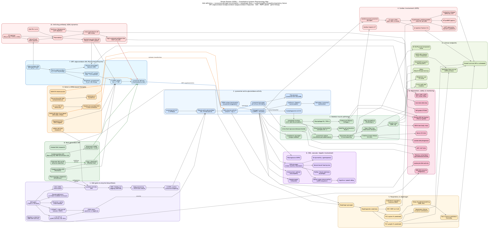</a> | GAA*(17q25.3) 상염색체 열성 변이로 산성 α-glucosidase 활성 ≤30% 잔존 → 리소좀 α-1,4/α-1,6 글리코겐 축적 → LAMP1+ 거대 리소좀 → LC3-II·p62 자가포식 차단 → 세포질 글리코겐 누출 → Z-line streaming·미토콘드리아 복합체 I/IV 저하·위성세포 고갈 → 골격근·심근·횡격막…<br>[🗺️ 지도](pompe-disease/pompe_qsp_model.svg) · [⚙️ mrgsolve](pompe-disease/pompe_mrgsolve_model.R) · [📚 문헌](pompe-disease/pompe_references.md) · [📄 README](pompe-disease/README.md) |
| 302 | 정신·신경 | [**외상후 스트레스장애 (PTSD)**<br><sub>Post-Traumatic Stress Disorder · PTSD</sub>](post-traumatic-stress-disorder/) | <a href="post-traumatic-stress-disorder/ptsd_qsp_model.svg">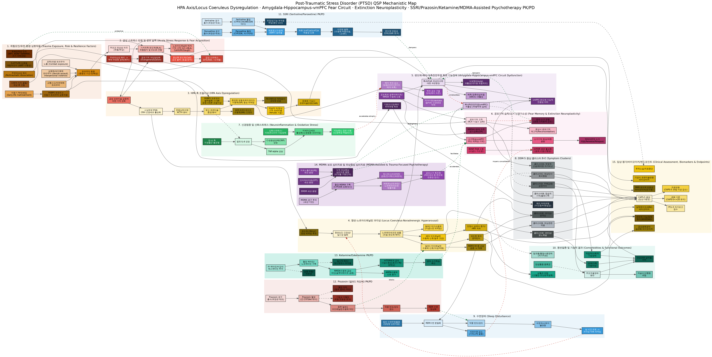</a> | 생명을 위협하는 트라우마 노출 후 발생하는 만성 신경정신질환으로, 편도체(BLA)의 노르아드레날린·당질코르티코이드 매개 기억 강화가 지나치게 강력한 공포기억을 고착시키는 것에서 시작한다(Cahill & McGaugh 1998 Trends Neurosci).<br>[🗺️ 지도](post-traumatic-stress-disorder/ptsd_qsp_model.svg) · [⚙️ mrgsolve](post-traumatic-stress-disorder/ptsd_mrgsolve_model.R) · [📚 문헌](post-traumatic-stress-disorder/ptsd_references.md) · [📄 README](post-traumatic-stress-disorder/README.md) |
| 303 | 신경 | [**대상포진 후 신경통 (PHN)**<br><sub>Postherpetic Neuralgia · VZV Reactivation</sub>](postherpetic-neuralgia/) | <a href="postherpetic-neuralgia/phn_qsp_model.svg"></a> | 대상포진 후 dermatome 영역에 ≥90일 지속되는 만성 신경병증성 통증(NRS ≥ 3): 잠복 VZV의 DRG/뇌신경절 재활성화(ORF63·IE62) → ganglionitis·이차 Wallerian degeneration·IENF density 50% 미만(PGP9.5 punch biopsy)·Schwann 탈수초 → 말초 noci…<br>[🗺️ 지도](postherpetic-neuralgia/phn_qsp_model.svg) · [⚙️ mrgsolve](postherpetic-neuralgia/phn_mrgsolve_model.R) · [📚 문헌](postherpetic-neuralgia/phn_references.md) · [📄 README](postherpetic-neuralgia/README.md) |
| 304 | 정신·신경 | [**산후우울증 (PPD)**<br><sub>Postpartum Depression · PPD</sub>](postpartum-depression/) | <a href="postpartum-depression/ppd_qsp_model.svg"></a> | 분만 후 몇 시간 만에 붕괴하는 알로프레그나놀론과 몇 주에 걸쳐 회복하는 δ-GABA_A 수용체 풀의 곱이 만드는 긴장성 억제의 과도적 저점을 중심으로, 브렉사놀론·주라놀론·설트랄린·수면보호를 함께 다룬다.<br>[🗺️ 지도](postpartum-depression/ppd_qsp_model.svg) · [⚙️ mrgsolve](postpartum-depression/ppd_mrgsolve_model.R) · [📚 문헌](postpartum-depression/ppd_references.md) · [📄 README](postpartum-depression/README.md) |
| 305 | 부인·생식 | [**산후출혈 (PPH)**<br><sub>Primary Postpartum Haemorrhage · PPH</sub>](postpartum-hemorrhage/) | <a href="postpartum-hemorrhage/pph_qsp_model.svg"></a> | 산후출혈을 응고 질환이 아니라 자궁혈류 750 mL/min에 대한 유량 문제로 쓰고, 태반부 patency를 자궁 긴장도의 4승으로 두어 치료 사다리와 생사의 칼날을 하나의 수축능 파라미터에서 유도한다.<br>[🗺️ 지도](postpartum-hemorrhage/pph_qsp_model.svg) · [⚙️ mrgsolve](postpartum-hemorrhage/pph_mrgsolve_model.R) · [📚 문헌](postpartum-hemorrhage/pph_references.md) · [📄 README](postpartum-hemorrhage/README.md) |
| 306 | 신경 | [**체위성 기립성 빈맥 증후군 (POTS)**<br><sub>Postural Orthostatic Tachycardia Syndrome · POTS</sub>](postural-orthostatic-tachycardia-syndrome/) | <a href="postural-orthostatic-tachycardia-syndrome/pots_qsp_model.svg">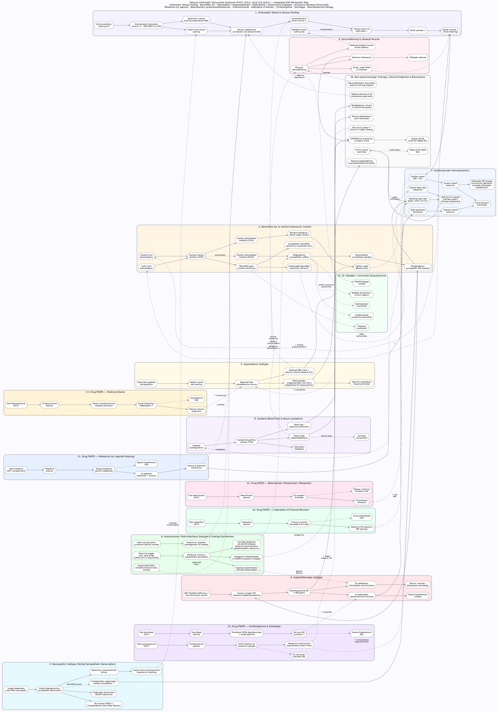</a> | 기립 시 정맥혈 500-1000mL이 하지·내장 정맥 용량 혈관으로 이동하는 것에 대해 압반사 대응이 불충분하거나 심박수 반응이 과도하여 발생하는 만성 기립불내성 증후군으로, Sheldon 2015 Heart Rhythm Society 합의문(성인 ΔHR≥30bpm·청소년≥40bpm, 기립/기울임 10분 이내, 기립성 저혈압 없이) 기준으…<br>[🗺️ 지도](postural-orthostatic-tachycardia-syndrome/pots_qsp_model.svg) · [⚙️ mrgsolve](postural-orthostatic-tachycardia-syndrome/pots_mrgsolve_model.R) · [📚 문헌](postural-orthostatic-tachycardia-syndrome/pots_references.md) · [📄 README](postural-orthostatic-tachycardia-syndrome/README.md) |
| 307 | 희귀·유전 | [**프래더-윌리 증후군 (PWS)**<br><sub>Prader-Willi Syndrome · PWS</sub>](prader-willi-syndrome/) | <a href="prader-willi-syndrome/pws_qsp_model.svg"></a> | 15q11-q13 부계 발현 소실을 프로호르몬 전환효소 PC1/3 활성이라는 하나의 스칼라로 쓰고, 다섯 분기에 무차원 탈출비를 하나씩만 주어 어느 분기가 먼저 망가지고 어느 측정치가 원리적으로 눈이 먼지를 대수로 유도하며, 포만을 조화평균으로 음식 추구를 이중안정 상태로 기술한다.<br>[🗺️ 지도](prader-willi-syndrome/pws_qsp_model.svg) · [⚙️ mrgsolve](prader-willi-syndrome/pws_mrgsolve_model.R) · [📚 문헌](prader-willi-syndrome/pws_references.md) · [📄 README](prader-willi-syndrome/README.md) |
| 308 | 부인·생식 | [**자간전증 (Preeclampsia)**<br><sub>Preeclampsia · Eclampsia</sub>](preeclampsia/) | <a href="preeclampsia/pe_qsp_model.svg">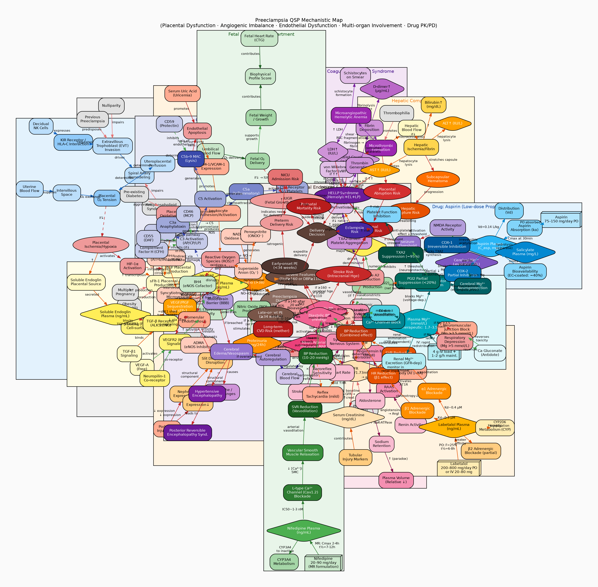</a> | 불완전한 영양막세포(EVT) 침윤 → 나선동맥 불완전 재형성 → 태반 허혈/저산소증 → HIF-1α → sFlt-1↑ 분비 → VEGF/PlGF 격리(sFlt-1/PlGF비율>38) + sEng↑ → VEGFR2 신호↓ → eNOS 활성↓ → NO↓/ET-1↑/ROS↑ 내피세포 기능 부전 → SVR↑ → 고혈압(SBP≥140mmHg) ·…<br>[🗺️ 지도](preeclampsia/pe_qsp_model.svg) · [⚙️ mrgsolve](preeclampsia/pe_mrgsolve_model.R) · [📚 문헌](preeclampsia/pe_references.md) · [📄 README](preeclampsia/README.md) |
| 309 | 정신·신경 | [**월경전 불쾌장애 (PMDD)**<br><sub>Premenstrual Dysphoric Disorder · PMDD</sub>](premenstrual-dysphoric-disorder/) | <a href="premenstrual-dysphoric-disorder/pmdd_qsp_model.svg">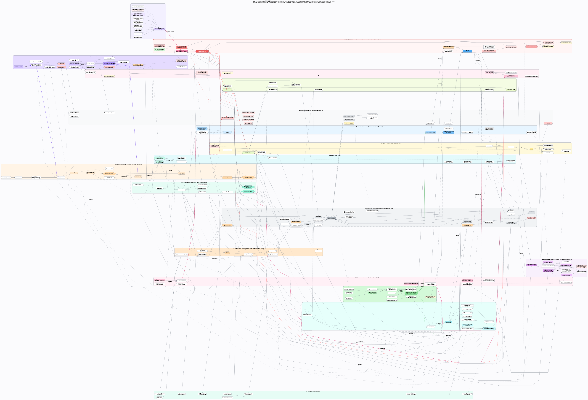</a> | 황체기 호르몬 농도가 대조군과 같다는 관찰에서 출발해, 신경스테로이드-GABA-A 전달을 역U자 비단조 함수로 두고 수용체 조성이 변화율을 감지하는 이득(gain) 장애로 기술한다.<br>[🗺️ 지도](premenstrual-dysphoric-disorder/pmdd_qsp_model.svg) · [⚙️ mrgsolve](premenstrual-dysphoric-disorder/pmdd_mrgsolve_model.R) · [📚 문헌](premenstrual-dysphoric-disorder/pmdd_references.md) · [📄 README](premenstrual-dysphoric-disorder/README.md) |
| 310 | 부인·생식 | [**조기진통 / 자연 조산 (sPTB)**<br><sub>Preterm Labor · sPTB</sub>](preterm-labor/) | <a href="preterm-labor/ptl_qsp_model.svg"></a> | 태반 CRH 시계·기능적 프로게스테론 소퇴·양막내 감염·탈락막 혈전과 자궁 과신전이 자궁근 수축·자궁경부 숙화·양막 약화라는 3개 최종공통경로로 수렴하며, 진통억제제는 그중 수축 하나만 억제하므로 48시간만 벌 수 있음을 곱셈형 분만위험도로 보여준다.<br>[🗺️ 지도](preterm-labor/ptl_qsp_model.svg) · [⚙️ mrgsolve](preterm-labor/ptl_mrgsolve_model.R) · [📚 문헌](preterm-labor/ptl_references.md) · [📄 README](preterm-labor/README.md) |
| 311 | 내분비·대사 | [**원발성 알도스테론증**<br><sub>Primary Aldosteronism · PA</sub>](primary-aldosteronism/) | <a href="primary-aldosteronism/pa_qsp_model.svg"></a> | Conn 증후군 — 부신 피질에서의 자율적 알도스테론 과분비(APA·BAH) → 레닌 억제·ARR 상승·Na⁺ 저류·K⁺ 소실·대사성 알칼리증.<br>[🗺️ 지도](primary-aldosteronism/pa_qsp_model.svg) · [⚙️ mrgsolve](primary-aldosteronism/pa_mrgsolve_model.R) · [📚 문헌](primary-aldosteronism/pa_references.md) · [📄 README](primary-aldosteronism/README.md) |
| 312 | 소화기·간담도 | [**원발성 담즙성 담관염 (PBC)**<br><sub>Primary Biliary Cholangitis · PBC</sub>](primary-biliary-cholangitis/) | <a href="primary-biliary-cholangitis/pbc_qsp_model.svg"></a> | 항미토콘드리아항체에 의한 담관 파괴·담즙정체. UDCA·오베티콜산.<br>[🗺️ 지도](primary-biliary-cholangitis/pbc_qsp_model.svg) · [⚙️ mrgsolve](primary-biliary-cholangitis/pbc_mrgsolve_model.R) · [📚 문헌](primary-biliary-cholangitis/pbc_references.md) · [📄 README](primary-biliary-cholangitis/README.md) |
| 313 | 신장·비뇨 | [**원발성 과옥살산뇨증 (PH)**<br><sub>Primary Hyperoxaluria · PH</sub>](primary-hyperoxaluria/) | <a href="primary-hyperoxaluria/ph1_qsp_model.svg"></a> | 옥살산은 종말 대사물질이어서 PH는 중증도가 아니라 닫히지 않은 물질수지이며, 요중·혈장 옥살산과 eGFR·ESKD·전신 옥살로시스가 모두 잔존 AGT 활성 하나에서 생성된다.<br>[🗺️ 지도](primary-hyperoxaluria/ph1_qsp_model.svg) · [⚙️ mrgsolve](primary-hyperoxaluria/ph1_mrgsolve_model.R) · [📚 문헌](primary-hyperoxaluria/ph1_references.md) · [📄 README](primary-hyperoxaluria/README.md) |
| 314 | 내분비·대사 | [**원발성 부갑상선 기능 항진증 (PHPT)**<br><sub>Primary Hyperparathyroidism · PHPT</sub>](primary-hyperparathyroidism/) | <a href="primary-hyperparathyroidism/phpt_qsp_model.svg"></a> | 부갑상선 선종의 PTH 자율과다·고칼슘혈증·골소실. 시나칼셋·부갑상선절제술.<br>[🗺️ 지도](primary-hyperparathyroidism/phpt_qsp_model.svg) · [⚙️ mrgsolve](primary-hyperparathyroidism/phpt_mrgsolve_model.R) · [📚 문헌](primary-hyperparathyroidism/phpt_references.md) · [📄 README](primary-hyperparathyroidism/README.md) |
| 315 | 소화기·간담도 | [**원발성 경화성 담관염 (PSC)**<br><sub>Primary Sclerosing Cholangitis · PSC</sub>](primary-sclerosing-cholangitis/) | <a href="primary-sclerosing-cholangitis/psc_qsp_model.svg"></a> | 담관 섬유화·다발 협착(IBD 연관)·담관암 위험. 대증치료·간이식.<br>[🗺️ 지도](primary-sclerosing-cholangitis/psc_qsp_model.svg) · [⚙️ mrgsolve](primary-sclerosing-cholangitis/psc_mrgsolve_model.R) · [📚 문헌](primary-sclerosing-cholangitis/psc_references.md) · [📄 README](primary-sclerosing-cholangitis/README.md) |
| 316 | 신경 | [**진행성 핵상마비 (PSP)**<br><sub>Progressive Supranuclear Palsy · PSP</sub>](progressive-supranuclear-palsy/) | <a href="progressive-supranuclear-palsy/psp_qsp_model.svg"></a> | 4R 타우가 커넥톰을 따라 이동하는 전선으로 진행하고 항타우 항체가 닿는 세포외 타우 풀이 세포내 풀의 약 1/1700에 불과해, 표적 결합률 98%가 임상 효과 0으로 귀결되는 구조를 71개 ODE와 8개 핵으로 구현.<br>[🗺️ 지도](progressive-supranuclear-palsy/psp_qsp_model.svg) · [⚙️ mrgsolve](progressive-supranuclear-palsy/psp_mrgsolve_model.R) · [📚 문헌](progressive-supranuclear-palsy/psp_references.md) · [📄 README](progressive-supranuclear-palsy/README.md) |
| 317 | 내분비·대사 | [**프로락틴 분비 뇌하수체 종양**<br><sub>Prolactinoma · PRL</sub>](prolactinoma/) | <a href="prolactinoma/prl_qsp_model.svg"></a> | 락토트로프 종양의 D2 수용체 밀도 감소로 도파민 억제가 풀려 프로락틴이 과다 분비되고 성선축 억제와 종양 질량효과를 일으키며, 도파민 작용제가 분비와 성장을 함께 억제한다.<br>[🗺️ 지도](prolactinoma/prl_qsp_model.svg) · [⚙️ mrgsolve](prolactinoma/prl_mrgsolve_model.R) · [📚 문헌](prolactinoma/prl_references.md) · [📄 README](prolactinoma/README.md) |
| 318 | 종양 | [**전립선암**<br><sub>Prostate Cancer · PC</sub>](prostate-cancer/) | <a href="prostate-cancer/pc_qsp_model.svg"></a> | HPG 축·AR 신호·PI3K/AKT·골전이(RANKL 악순환)와 CRPC/ARv7 내성. GnRH 제제·ARPI·도세탁셀·PARP 억제제·Lu-PSMA.<br>[🗺️ 지도](prostate-cancer/pc_qsp_model.svg) · [⚙️ mrgsolve](prostate-cancer/pc_mrgsolve_model.R) · [📚 문헌](prostate-cancer/pc_references.md) · [📄 README](prostate-cancer/README.md) |
| 319 | 신경 | [**결절성 양진 (Prurigo Nodularis)**<br><sub>Prurigo Nodularis · PN</sub>](prurigo-nodularis/) | <a href="prurigo-nodularis/pn_qsp_model.svg">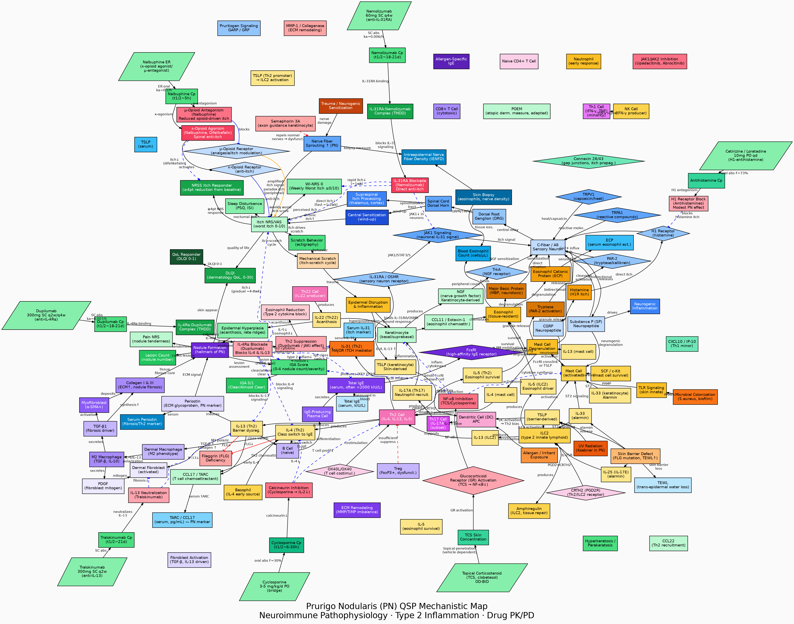</a> | 다발성의 극심하게 가려운 각화성 결절을 특징으로 하는 만성 신경면역 피부질환으로, 표피 장벽기능부전(TEWL↑·filaggrin/loricrin↓)이 케라틴세포 알라민(TSLP·IL-33·IL-25) 분비를 유도해 전신·피부 Th2/Th17/Th22 분극을 일으키고 여기서 생성된 핵심 소양유발 사이토카인 IL-31이 감각신경 말단의 IL-…<br>[🗺️ 지도](prurigo-nodularis/pn_qsp_model.svg) · [⚙️ mrgsolve](prurigo-nodularis/pn_mrgsolve_model.R) · [📚 문헌](prurigo-nodularis/pn_references.md) · [📄 README](prurigo-nodularis/README.md) |
| 320 | 내분비·대사 | [**가성통풍 (CPPD)**<br><sub>Pseudogout (CPPD) · CPPD</sub>](pseudogout/) | <a href="pseudogout/cppd_qsp_model.svg">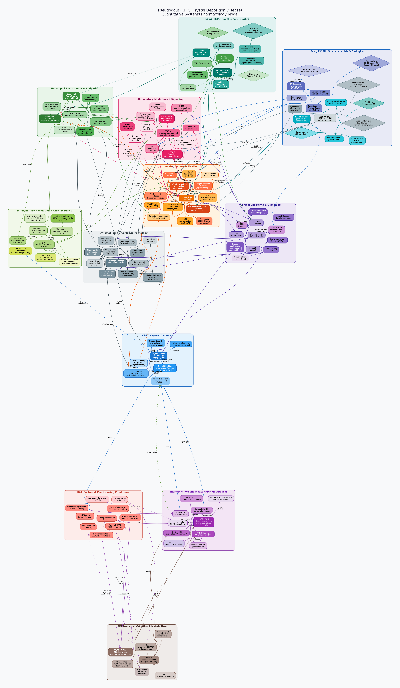</a> | 칼슘피로인산 결정 침착·NLRP3 염증성 관절염. 콜히친·NSAID·스테로이드.<br>[🗺️ 지도](pseudogout/cppd_qsp_model.svg) · [⚙️ mrgsolve](pseudogout/cppd_mrgsolve_model.R) · [📚 문헌](pseudogout/cppd_references.md) · [📄 README](pseudogout/README.md) |
| 321 | 피부 | [**건선**<br><sub>Psoriasis · PSO</sub>](psoriasis/) | <a href="psoriasis/pso_qsp_model.svg">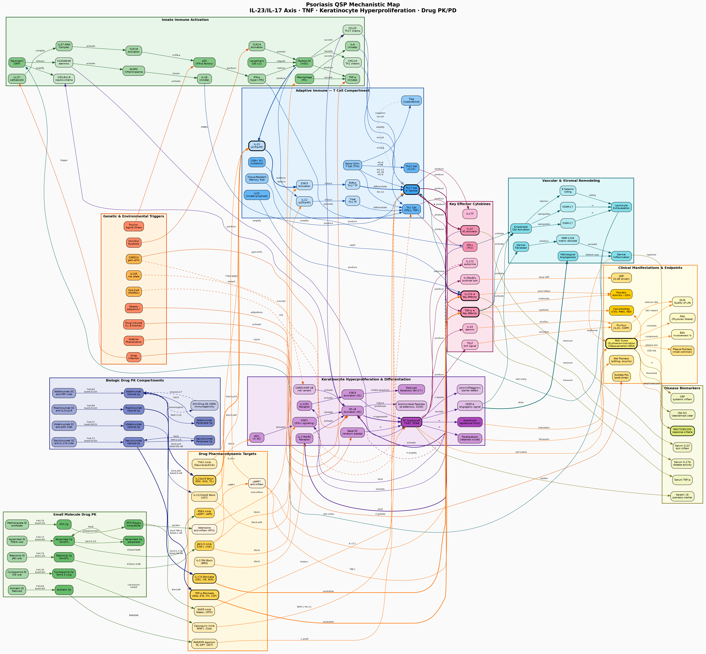</a> | IL-23/IL-17 축에 의한 각질세포 과증식. 항IL-17/IL-23 생물학제제·항TNF.<br>[🗺️ 지도](psoriasis/pso_qsp_model.svg) · [⚙️ mrgsolve](psoriasis/pso_mrgsolve_model.R) · [📚 문헌](psoriasis/pso_references.md) · [📄 README](psoriasis/README.md) |
| 322 | 자가면역·류마티스 | [**건선성 관절염**<br><sub>Psoriatic Arthritis · PsA</sub>](psoriatic-arthritis/) | <a href="psoriatic-arthritis/psa_qsp_model.svg"></a> | TNF·IL-23/IL-17 매개 부착부염·관절염·피부 건선. 생물학제제·JAK 억제제.<br>[🗺️ 지도](psoriatic-arthritis/psa_qsp_model.svg) · [⚙️ mrgsolve](psoriatic-arthritis/psa_mrgsolve_model.R) · [📚 문헌](psoriatic-arthritis/psa_references.md) · [📄 README](psoriatic-arthritis/README.md) |
| 323 | 호흡기 | [**자가면역 폐 알베올라 단백증 (aPAP)**<br><sub>Autoimmune Pulmonary Alveolar Proteinosis · aPAP</sub>](pulmonary-alveolar-proteinosis/) | <a href="pulmonary-alveolar-proteinosis/pap_qsp_model.svg"></a> | GM-CSF 자가항체가 신호를 화학량론적으로 완충해 대식세포의 계면활성제 분해 능력이 꺼지고 폐포 물질수지가 열리는 질환으로, 흡입 GM-CSF의 한계를 용량이 아니라 에어로졸 도달 범위로 설명한다.<br>[🗺️ 지도](pulmonary-alveolar-proteinosis/pap_qsp_model.svg) · [⚙️ mrgsolve](pulmonary-alveolar-proteinosis/pap_mrgsolve_model.R) · [📚 문헌](pulmonary-alveolar-proteinosis/pap_references.md) · [📄 README](pulmonary-alveolar-proteinosis/README.md) |
| 324 | 심혈관 | [**폐동맥 고혈압 (PAH)**<br><sub>Pulmonary Arterial Hypertension · PAH</sub>](pulmonary-arterial-hypertension/) | <a href="pulmonary-arterial-hypertension/pah_qsp_model.svg"></a> | 폐혈관 리모델링(엔도텔린·NO·프로스타사이클린 경로). ERA·PDE5i·프로스타사이클린.<br>[🗺️ 지도](pulmonary-arterial-hypertension/pah_qsp_model.svg) · [⚙️ mrgsolve](pulmonary-arterial-hypertension/pah_mrgsolve_model.R) · [📚 문헌](pulmonary-arterial-hypertension/pah_references.md) · [📄 README](pulmonary-arterial-hypertension/README.md) |
| 325 | 피부 | [**괴저성 농피증 (PG)**<br><sub>Pyoderma Gangrenosum · Neutrophilic Dermatosis</sub>](pyoderma-gangrenosum/) | <a href="pyoderma-gangrenosum/pg_qsp_model.svg"></a> | 멸균성 호중구성 궤양성 피부질환(orphan, 발생률 3–10/백만/년, 5y 사망률 ~16%): 사소한 외상에도 자극되는 pathergy·위상자색(violaceous) undermined edge·통증·신속한 무균 궤양 확장이 특징. 자가염증 스펙트럼 내에 위치하며 IBD/RA/MDS-AML/단클론 IgA-MGUS 동반 빈도 높음.<br>[🗺️ 지도](pyoderma-gangrenosum/pg_qsp_model.svg) · [⚙️ mrgsolve](pyoderma-gangrenosum/pg_mrgsolve_model.R) · [📚 문헌](pyoderma-gangrenosum/pg_references.md) · [📄 README](pyoderma-gangrenosum/README.md) |
| 326 | 혈액 | [**피루브산 키나제 결핍증 (PKLR)**<br><sub>Pyruvate Kinase Deficiency · PKD</sub>](pyruvate-kinase-deficiency/) | <a href="pyruvate-kinase-deficiency/pkd_qsp_model.svg"></a> | PK 결손이 ATP를 낮추면서 2,3-BPG를 동시에 올리는 반대 방향 두 갈래에서 출발해, 헤모글로빈이 산소운반의 충분통계량이 아님을 손익분기 2,3-BPG 감소율로 계산한다.<br>[🗺️ 지도](pyruvate-kinase-deficiency/pkd_qsp_model.svg) · [⚙️ mrgsolve](pyruvate-kinase-deficiency/pkd_mrgsolve_model.R) · [📚 문헌](pyruvate-kinase-deficiency/pkd_references.md) · [📄 README](pyruvate-kinase-deficiency/README.md) |
| 327 | 호흡기 | [**방사선 유발 폐손상 (RILI)**<br><sub>Radiation-Induced Lung Injury · RILI</sub>](radiation-induced-lung-injury/) | <a href="radiation-induced-lung-injury/rili_qsp_model.svg"></a> | 방사선치료 계획을 평균선량 하나가 아니라 선량-체적 히스토그램 6개 구간의 벡터로 쓰고, 손상을 임계 이하 염증 고리와 이중안정 섬유화 고리로 분리하여 같은 평균 폐선량이 폐렴과 섬유화의 순위를 반대로 매기는 구조를 모델링.<br>[🗺️ 지도](radiation-induced-lung-injury/rili_qsp_model.svg) · [⚙️ mrgsolve](radiation-induced-lung-injury/rili_mrgsolve_model.R) · [📚 문헌](radiation-induced-lung-injury/rili_references.md) · [📄 README](radiation-induced-lung-injury/README.md) |
| 328 | 혈관염 | [**레이노 현상 (RP)**<br><sub>Raynaud's Phenomenon · RP</sub>](raynaud-phenomenon/) | <a href="raynaud-phenomenon/raynaud_qsp_model.svg">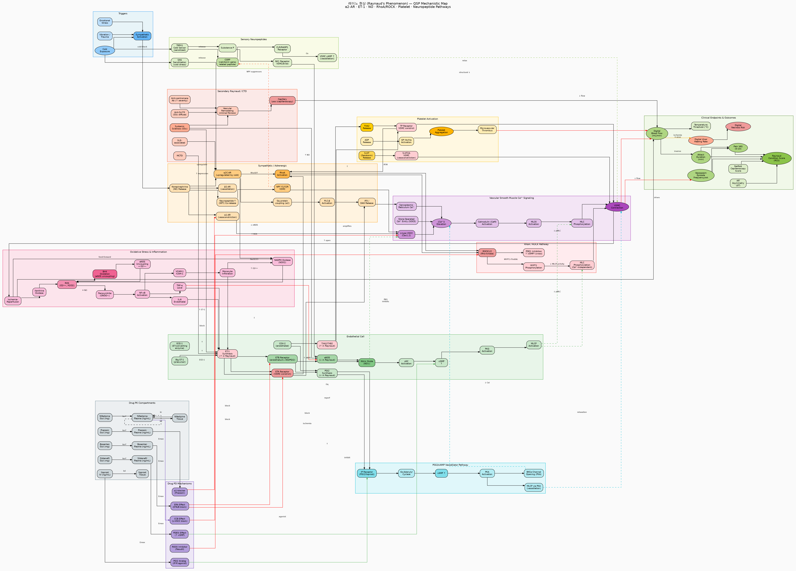</a> | 한랭·스트레스 자극 → 교감신경 NE 방출 → α2C-AR(한랭 상향조절) 과민 활성 → Gq/PLC/IP3→SR Ca²⁺ 방출 + RhoGEF→RhoA-GTP→ROCK1/2→MYPT1 인산화→MLCP 억제→MLC 인산화(Ca²⁺ 비의존성) → 지속적 VSMC 수축 → 디지털 혈류 감소·혈관경련 발작의 완전 통합 QSP 모델.<br>[🗺️ 지도](raynaud-phenomenon/raynaud_qsp_model.svg) · [⚙️ mrgsolve](raynaud-phenomenon/raynaud_mrgsolve_model.R) · [📚 문헌](raynaud-phenomenon/raynaud_references.md) · [📄 README](raynaud-phenomenon/README.md) |
| 329 | 자가면역·류마티스 | [**반응성 관절염**<br><sub>Reactive Arthritis · ReA</sub>](reactive-arthritis/) | <a href="reactive-arthritis/rea_qsp_model.svg"></a> | 감염 후 HLA-B27 연관 무균성 관절염. NSAID·설파살라진·생물학제제.<br>[🗺️ 지도](reactive-arthritis/rea_qsp_model.svg) · [⚙️ mrgsolve](reactive-arthritis/rea_mrgsolve_model.R) · [📚 문헌](reactive-arthritis/rea_references.md) · [📄 README](reactive-arthritis/README.md) |
| 330 | 심혈관 | [**반복 심낭염 (RP)**<br><sub>Recurrent Pericarditis · RP</sub>](recurrent-pericarditis/) | <a href="recurrent-pericarditis/rp_qsp_model.svg"></a> | NLRP3 인플라마솜(Signal 1 TLR→NF-κB + Signal 2 ATP/결정/K⁺efflux) → Caspase-1 → IL-1β/IL-18 성숙·분비 → IL-1R1 → NF-κB 양성 피드백 루프 → CXCL8 → 심낭 중성구 침윤 → PGE2/LTC4 매개 삼출액·통증·발열 → TGF-β1 → 섬유화 → 수축성 심낭염의 완…<br>[🗺️ 지도](recurrent-pericarditis/rp_qsp_model.svg) · [⚙️ mrgsolve](recurrent-pericarditis/rp_mrgsolve_model.R) · [📚 문헌](recurrent-pericarditis/rp_references.md) · [📄 README](recurrent-pericarditis/README.md) |
| 331 | 호흡기 | [**난치성 만성기침 (RCC)**<br><sub>Refractory Chronic Cough · RCC</sub>](refractory-chronic-cough/) | <a href="refractory-chronic-cough/rcc_qsp_model.svg"></a> | 기침 반사궁 자체의 신경병증으로 보는 기침 과민증 증후군 모델로, P2X3 길항제의 효능과 미각이상을 하나의 점유 곡선에서 유도해 선택성만으로 치료 창이 결정됨을 보인다.<br>[🗺️ 지도](refractory-chronic-cough/rcc_qsp_model.svg) · [⚙️ mrgsolve](refractory-chronic-cough/rcc_mrgsolve_model.R) · [📚 문헌](refractory-chronic-cough/rcc_references.md) · [📄 README](refractory-chronic-cough/README.md) |
| 332 | 자가면역·류마티스 | [**재발성 다발연골염**<br><sub>Relapsing Polychondritis · RPC</sub>](relapsing-polychondritis/) | <a href="relapsing-polychondritis/rpc_qsp_model.svg"></a> | 연골(II형 콜라겐) 자가면역 염증(귀·코·기도). 스테로이드·면역억제·생물학제제.<br>[🗺️ 지도](relapsing-polychondritis/rpc_qsp_model.svg) · [⚙️ mrgsolve](relapsing-polychondritis/rpc_mrgsolve_model.R) · [📚 문헌](relapsing-polychondritis/rpc_references.md) · [📄 README](relapsing-polychondritis/README.md) |
| 333 | 종양 | [**신세포암 (ccRCC)**<br><sub>Renal Cell Carcinoma · RCC</sub>](renal-cell-carcinoma/) | <a href="renal-cell-carcinoma/rcc_qsp_model.svg"></a> | VHL 돌연변이(60–90%) → pVHL 소실 → HIF-1α/2α 축적 → VEGF↑·CA9↑·GLUT1↑ → 혈관신생 + mTOR 양성피드백 + MDSCs·Treg·PD-L1 면역 회피.<br>[🗺️ 지도](renal-cell-carcinoma/rcc_qsp_model.svg) · [⚙️ mrgsolve](renal-cell-carcinoma/rcc_mrgsolve_model.R) · [📚 문헌](renal-cell-carcinoma/rcc_references.md) · [📄 README](renal-cell-carcinoma/README.md) |
| 334 | 신경 | [**하지불안증후군 (RLS / WED)**<br><sub>Restless Legs Syndrome · Willis-Ekbom Disease</sub>](restless-legs-syndrome/) | <a href="restless-legs-syndrome/rls_qsp_model.svg">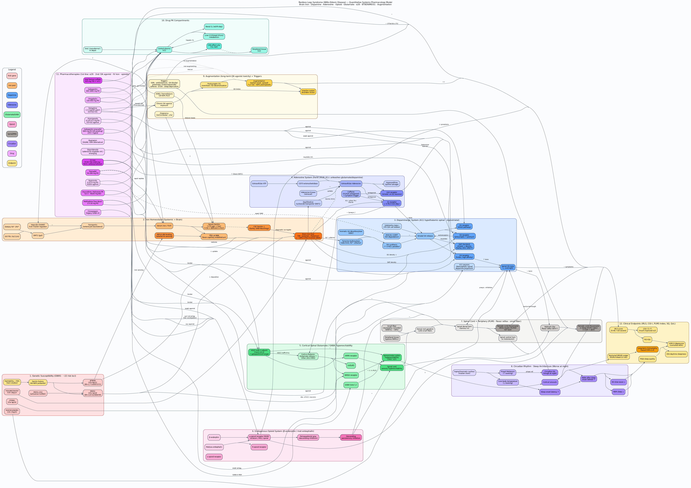</a> | 22+ GWAS 위험좌위(BTBD9 rs9357271 OR≈1.7·MEIS1 rs2300478 OR≈1.8·MAP2K5/SKOR1·PTPRD·TOX3, 유전율 ~70%) → 혈청·CSF ferritin↓ → BBB TfR1·DMT1·IRP1/2 매개 뇌철 ~30% 감소 → TH(Fe²⁺ 보조인자) 활성 저하 + 역설적 DA 합성↑·시냅스후…<br>[🗺️ 지도](restless-legs-syndrome/rls_qsp_model.svg) · [⚙️ mrgsolve](restless-legs-syndrome/rls_mrgsolve_model.R) · [📚 문헌](restless-legs-syndrome/rls_references.md) · [📄 README](restless-legs-syndrome/README.md) |
| 335 | 안과 | [**망막정맥폐쇄 (RVO)**<br><sub>Retinal Vein Occlusion · RVO</sub>](retinal-vein-occlusion/) | <a href="retinal-vein-occlusion/rvo_qsp_model.svg"></a> | 황반부종을 Starling 여과로 기술하여, 항VEGF는 투과성항만 곱하고 폐쇄가 정하는 모세혈관압은 건드리지 못한다는 비대칭에서 임계 모세혈관압 31.3 mmHg와 압력항 눈의 존재를 계산으로 유도한다.<br>[🗺️ 지도](retinal-vein-occlusion/rvo_qsp_model.svg) · [⚙️ mrgsolve](retinal-vein-occlusion/rvo_mrgsolve_model.R) · [📚 문헌](retinal-vein-occlusion/rvo_references.md) · [📄 README](retinal-vein-occlusion/README.md) |
| 336 | 안과 | [**색소성 망막염 (RP)**<br><sub>Retinitis Pigmentosa · RHO/RPGR/USH2A/PDE6/RPE65 genotypes</sub>](retinitis-pigmentosa/) | <a href="retinitis-pigmentosa/rp_qsp_model.svg">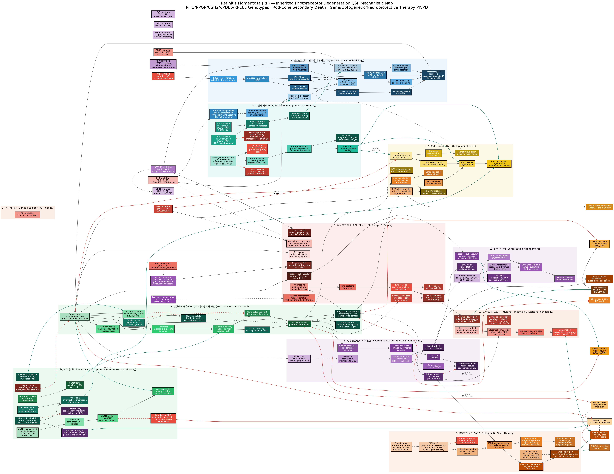</a> | 90여 개 유전자 변이로 발생하는 가장 흔한 유전성 망막이영양증으로, 상염색체 우성 RHO(로돕신 오접힘→ER스트레스/UPR), X연관 RPGR(섬모수송결함), 상염색체 열성 USH2A(Usher증후군)·PDE6A/B(cGMP 가수분해 실패→CNG채널 과활성→Ca2+독성)·RPE65(시각회로 이성질화효소 결핍, LCA/EOSRD)가 주요…<br>[🗺️ 지도](retinitis-pigmentosa/rp_qsp_model.svg) · [⚙️ mrgsolve](retinitis-pigmentosa/rp_mrgsolve_model.R) · [📚 문헌](retinitis-pigmentosa/rp_references.md) · [📄 README](retinitis-pigmentosa/README.md) |
| 337 | 안과 | [**미숙아 망막병증 (ROP)**<br><sub>Retinopathy of Prematurity · ROP</sub>](retinopathy-of-prematurity/) | <a href="retinopathy-of-prematurity/rop_qsp_model.svg"></a> | 무혈관 망막의 산소 공급과 수요가 교차하는 날짜가 모든 산소 개입의 부호를 뒤집는 구조로 기술하고, 전선 풀과 유리체 풀이라는 두 VEGF 풀로 항VEGF의 안구·전신 비대칭을 함께 다룬다.<br>[🗺️ 지도](retinopathy-of-prematurity/rop_qsp_model.svg) · [⚙️ mrgsolve](retinopathy-of-prematurity/rop_mrgsolve_model.R) · [📚 문헌](retinopathy-of-prematurity/rop_references.md) · [📄 README](retinopathy-of-prematurity/README.md) |
| 338 | 신장·비뇨 | [**횡문근분해증 유발 급성 신손상**<br><sub>Rhabdomyolysis-Induced AKI · RHAB</sub>](rhabdomyolysis/) | <a href="rhabdomyolysis/rhab_qsp_model.svg"></a> | 세뇨관 독성 노출을 여과된 미오글로빈 부하 ÷ 요 유량 × 요 pH 함수의 곱으로 기술하여, 수액·알칼리·체외순환이 각각 다른 한 항만 움직이므로 한 항이 성공할수록 나머지의 한계 이득이 줄어든다는 구조를 유도한다.<br>[🗺️ 지도](rhabdomyolysis/rhab_qsp_model.svg) · [⚙️ mrgsolve](rhabdomyolysis/rhab_mrgsolve_model.R) · [📚 문헌](rhabdomyolysis/rhab_references.md) · [📄 README](rhabdomyolysis/README.md) |
| 339 | 자가면역·류마티스 | [**류마티스 관절염**<br><sub>Rheumatoid Arthritis · RA</sub>](rheumatoid-arthritis/) | <a href="rheumatoid-arthritis/ra_qsp_model.svg"></a> | TNF/IL-6 매개 활막 판누스·골미란. 항TNF·항IL-6·JAK 억제제·CTLA-4-Ig.<br>[🗺️ 지도](rheumatoid-arthritis/ra_qsp_model.svg) · [⚙️ mrgsolve](rheumatoid-arthritis/ra_mrgsolve_model.R) · [📚 문헌](rheumatoid-arthritis/ra_references.md) · [📄 README](rheumatoid-arthritis/README.md) |
| 340 | 피부 | [**로사케아 (Rosacea)**<br><sub>Rosacea · ROS</sub>](rosacea/) | <a href="rosacea/ros_qsp_model.svg"></a> | KLK5-LL37 선천면역 증폭기가 시간상수가 다른 네 개의 효과기 상태(혈관 긴장도·혈관 구조·염증 침윤·섬유화)로 방전되는 구조로 세워, 약물마다 읽는 상태가 달라 엔드포인트가 해리되는 것을 44개 ODE로 검증한다.<br>[🗺️ 지도](rosacea/ros_qsp_model.svg) · [⚙️ mrgsolve](rosacea/ros_mrgsolve_model.R) · [📚 문헌](rosacea/ros_references.md) · [📄 README](rosacea/README.md) |
| 341 | 호흡기 | [**사르코이드증**<br><sub>Sarcoidosis · SARC</sub>](sarcoidosis/) | <a href="sarcoidosis/sarc_qsp_model.svg">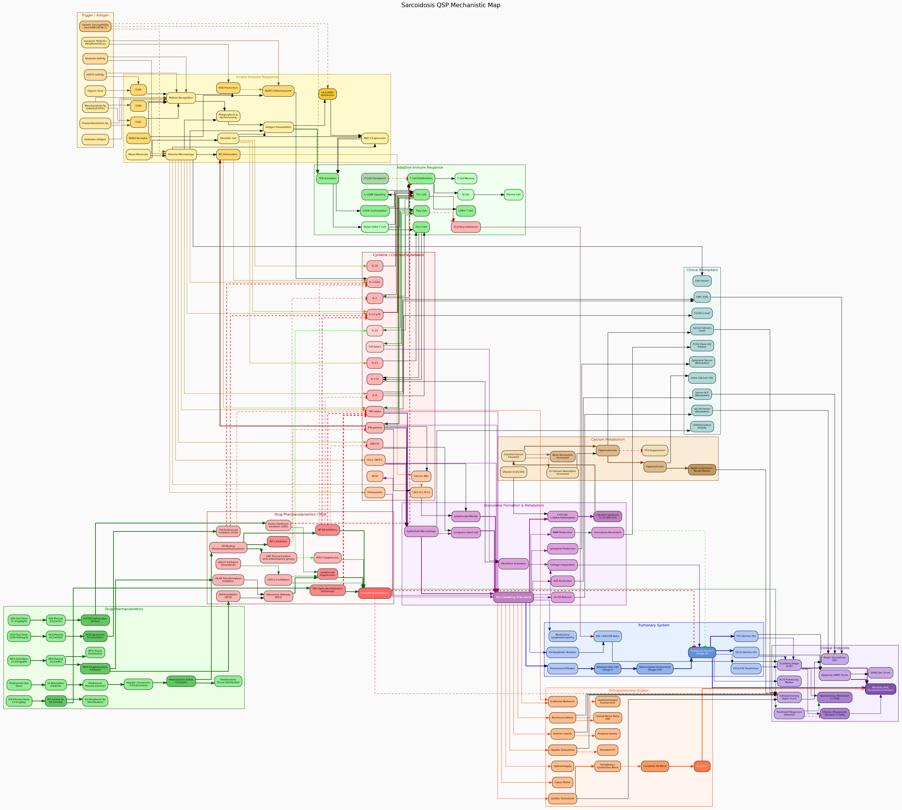</a> | Th1/IFN-γ 매개 비건락성 육아종(폐 우세 다장기). 스테로이드·메토트렉세이트·항TNF.<br>[🗺️ 지도](sarcoidosis/sarc_qsp_model.svg) · [⚙️ mrgsolve](sarcoidosis/sarc_mrgsolve_model.R) · [📚 문헌](sarcoidosis/sarc_references.md) · [📄 README](sarcoidosis/README.md) |
| 342 | 근골격·신경근육 | [**가령성 근감소증 (Sarcopenia)**<br><sub>Age-Related Sarcopenia · EWGSOP2 / AWGS2019 / SDOC / FNIH</sub>](sarcopenia/) | <a href="sarcopenia/sarc_qsp_model.svg"></a> | EWGSOP2 정의: 저근육량(M ALMI<7.0·F<6.0 kg/m²) + 저근력(grip M<27·F<16 kg) → 확진, gait <0.8 m/s → 중증.<br>[🗺️ 지도](sarcopenia/sarc_qsp_model.svg) · [⚙️ mrgsolve](sarcopenia/sarc_mrgsolve_model.R) · [📚 문헌](sarcopenia/sarc_references.md) · [📄 README](sarcopenia/README.md) |
| 343 | 정신·신경 | [**조현병**<br><sub>Schizophrenia · SCH</sub>](schizophrenia/) | <a href="schizophrenia/sch_qsp_model.svg"></a> | 도파민/글루탐산/GABA/세로토닌 신경전달 이상. 항정신병약(D2 길항/부분작용).<br>[🗺️ 지도](schizophrenia/sch_qsp_model.svg) · [⚙️ mrgsolve](schizophrenia/sch_mrgsolve_model.R) · [📚 문헌](schizophrenia/sch_references.md) · [📄 README](schizophrenia/README.md) |
| 344 | 감염 | [**패혈증 / 패혈성 쇼크**<br><sub>Sepsis & Septic Shock · SEP</sub>](sepsis/) | <a href="sepsis/sep_qsp_model.svg"></a> | 감염 → 조절 장애 숙주 반응 → 다장기부전(MODS) — 패혈증: 감염에 대한 숙주 조절 장애 반응(dysregulated host response)으로 생명을 위협하는 장기부전. 패혈성 쇼크: MAP<65 mmHg + 젖산>2 mmol/L, 28일 사망률 ~40%.<br>[🗺️ 지도](sepsis/sep_qsp_model.svg) · [⚙️ mrgsolve](sepsis/sep_mrgsolve_model.R) · [📚 문헌](sepsis/sep_references.md) · [📄 README](sepsis/README.md) |
| 345 | 소화기·간담도 | [**단장증후군 · 만성 장부전**<br><sub>Short Bowel Syndrome with Intestinal Failure · SBS-IF</sub>](short-bowel-syndrome/) | <a href="short-bowel-syndrome/sbs_qsp_model.svg"></a> | 광범위 소장 절제 후 수분·나트륨·에너지 보존 방정식이 닫히지 않아 비경구영양 용적이 그 산술적 잔차로 결정되는 질환이며, GLP-2 유사체와 경구 재수화·장 적응·요량 기반 위닝 프로토콜을 함께 다룬다.<br>[🗺️ 지도](short-bowel-syndrome/sbs_qsp_model.svg) · [⚙️ mrgsolve](short-bowel-syndrome/sbs_mrgsolve_model.R) · [📚 문헌](short-bowel-syndrome/sbs_references.md) · [📄 README](short-bowel-syndrome/README.md) |
| 346 | 내분비·대사 | [**항이뇨호르몬 부적절분비 증후군 (SIADH)**<br><sub>Syndrome of Inappropriate Antidiuretic Hormone Secretion · SIADH</sub>](siadh/) | <a href="siadh/siadh_qsp_model.svg">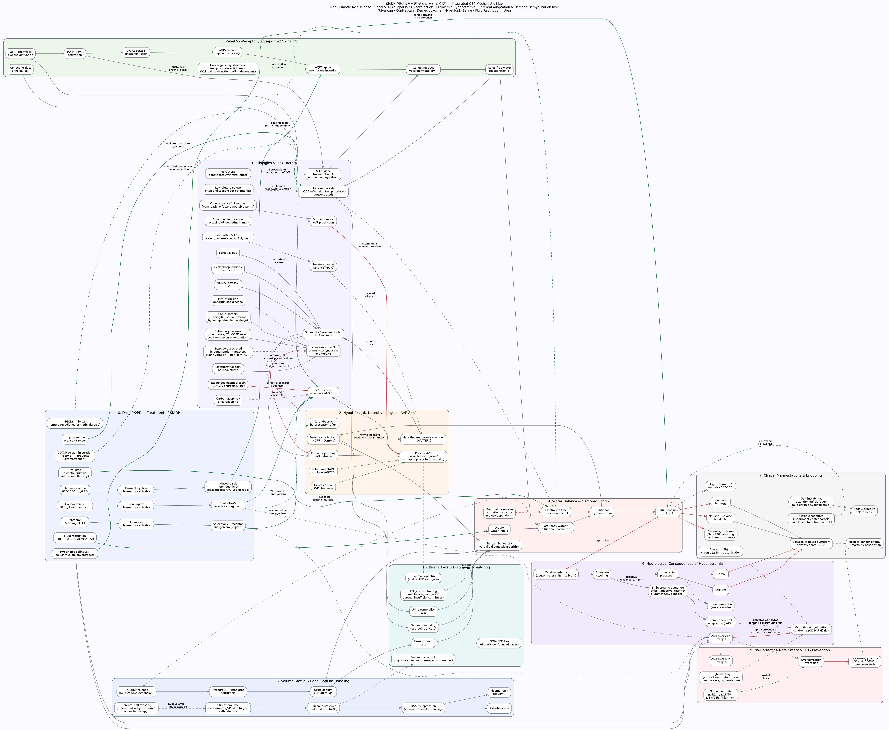</a> | 비삼투성·자율적 AVP 분비가 신장 V2수용체-아쿠아포린2 축을 활성화해 자유수분을 재흡수시켜 등용적성 저나트륨혈증을 유발하며, 만성 적응 후 급속 교정 시 삼투성 탈수초증후군 위험이 커진다.<br>[🗺️ 지도](siadh/siadh_qsp_model.svg) · [⚙️ mrgsolve](siadh/siadh_mrgsolve_model.R) · [📚 문헌](siadh/siadh_references.md) · [📄 README](siadh/README.md) |
| 347 | 혈액 | [**겸상적혈구병**<br><sub>Sickle Cell Disease · SCD</sub>](sickle-cell-disease/) | <a href="sickle-cell-disease/scd_qsp_model.svg"></a> | HbS 중합·적혈구 겸상화·혈관폐색. 하이드록시유레아·복셀로토르·크리잔리주맙·L-글루타민.<br>[🗺️ 지도](sickle-cell-disease/scd_qsp_model.svg) · [⚙️ mrgsolve](sickle-cell-disease/scd_mrgsolve_model.R) · [📚 문헌](sickle-cell-disease/scd_references.md) · [📄 README](sickle-cell-disease/README.md) |
| 348 | 자가면역·류마티스 | [**쇼그렌 증후군**<br><sub>Sjögren's Syndrome · SS</sub>](sjogrens-syndrome/) | <a href="sjogrens-syndrome/ss_qsp_model.svg"></a> | 외분비선 림프구 침윤·I형 IFN에 의한 건조증. 대증치료·전신 면역조절.<br>[🗺️ 지도](sjogrens-syndrome/ss_qsp_model.svg) · [⚙️ mrgsolve](sjogrens-syndrome/ss_mrgsolve_model.R) · [📚 문헌](sjogrens-syndrome/ss_references.md) · [📄 README](sjogrens-syndrome/README.md) |
| 349 | 종양 | [**소세포 폐암 (SCLC)**<br><sub>Small Cell Lung Cancer · SCLC</sub>](small-cell-lung-cancer/) | <a href="small-cell-lung-cancer/sclc_qsp_model.svg"></a> | TP53·RB1 동시 소실(~90/85%) → 신경내분비(NE) 분화·급속 증식. ASCL1/NEUROD1(NE-high)·YAP1/POU2F3(NE-low) 전사 프로그램 결정 → DLL3 이상 표면 발현(~80%) → Notch 시스-억제 → NE 표현형 유지.<br>[🗺️ 지도](small-cell-lung-cancer/sclc_qsp_model.svg) · [⚙️ mrgsolve](small-cell-lung-cancer/sclc_mrgsolve_model.R) · [📚 문헌](small-cell-lung-cancer/sclc_references.md) · [📄 README](small-cell-lung-cancer/README.md) |
| 350 | 중독·환경 | [**독사 교상 (뱀독 중독)**<br><sub>Snakebite Envenoming · SBE</sub>](snakebite-envenomation/) | <a href="snakebite-envenomation/sbe_qsp_model.svg"></a> | 항독소가 자유 독소만 제거하고 이미 일어난 손상은 되돌리지 못한다는 점에서 출발해, 시간 단위의 독액 시계와 일 단위의 기질 시계를 분리하여 투여 시각이 나디르의 깊이만 바꾸고 회복 기울기는 바꾸지 못함을 계산으로 보인다.<br>[🗺️ 지도](snakebite-envenomation/sbe_qsp_model.svg) · [⚙️ mrgsolve](snakebite-envenomation/sbe_mrgsolve_model.R) · [📚 문헌](snakebite-envenomation/sbe_references.md) · [📄 README](snakebite-envenomation/README.md) |
| 351 | 신경 | [**외상성 척수손상 (SCI)**<br><sub>Traumatic Spinal Cord Injury · SCI</sub>](spinal-cord-injury/) | <a href="spinal-cord-injury/sci_qsp_model.svg"></a> | 일차 기계손상 후 관류-부종-허혈 악순환·흥분독성·산화손상·염증으로 이어지는 이차손상 캐스케이드와 축삭 보존·가소성을 43-ODE로 연결하여 치료 시간창과 대리지표-임상지표 해리를 정량화한다.<br>[🗺️ 지도](spinal-cord-injury/sci_qsp_model.svg) · [⚙️ mrgsolve](spinal-cord-injury/sci_mrgsolve_model.R) · [📚 문헌](spinal-cord-injury/sci_references.md) · [📄 README](spinal-cord-injury/README.md) |
| 352 | 근골격·신경근육 | [**척수성 근위축증 (SMA)**<br><sub>Spinal Muscular Atrophy · SMA</sub>](spinal-muscular-atrophy/) | <a href="spinal-muscular-atrophy/sma_qsp_model.svg"></a> | SMN1* 5q13.2 결손→SMN 단백질 소실→알파 운동신경세포 진행성 사멸·NMJ 미성숙·신경원성 근위축. SMN2 대체 스플라이싱(엑손7 포함율 10%→90%)·SMN 단백질 역치·MN pool·NMJ 성숙도·근육량 ODE.<br>[🗺️ 지도](spinal-muscular-atrophy/sma_qsp_model.svg) · [⚙️ mrgsolve](spinal-muscular-atrophy/sma_mrgsolve_model.R) · [📚 문헌](spinal-muscular-atrophy/sma_references.md) · [📄 README](spinal-muscular-atrophy/README.md) |
| 353 | 심혈관 | [**안정형 협심증**<br><sub>Stable Angina · SA</sub>](stable-angina/) | <a href="stable-angina/sa_qsp_model.svg"></a> | 죽상경화 관상동맥의 산소 수급 불균형. 항허혈제·항혈소판·스타틴.<br>[🗺️ 지도](stable-angina/sa_qsp_model.svg) · [⚙️ mrgsolve](stable-angina/sa_mrgsolve_model.R) · [📚 문헌](stable-angina/sa_references.md) · [📄 README](stable-angina/README.md) |
| 354 | 신경 | [**경련지속상태**<br><sub>Status Epilepticus · SE</sub>](status-epilepticus/) | <a href="status-epilepticus/se_qsp_model.svg"></a> | 경련지속상태를 오래 가는 발작이 아니라 수용체가 이동하는 시계로 기술하여, 하나의 발작 활동이 시냅스 GABA-A를 끌어내리고 시냅스 NMDA를 끌어올리며 시냅스외 델타 풀은 건드리지 않는다는 세 개의 풀 표만으로 벤조디아제핀의 시간 붕괴와 2차 약제 3자 동률이 함께 유도된다.<br>[🗺️ 지도](status-epilepticus/se_qsp_model.svg) · [⚙️ mrgsolve](status-epilepticus/se_mrgsolve_model.R) · [📚 문헌](status-epilepticus/se_references.md) · [📄 README](status-epilepticus/README.md) |
| 355 | 피부 | [**스티븐스-존슨 증후군 / 독성 표피괴사용해 (SJS/TEN)**<br><sub>Stevens-Johnson Syndrome · Toxic Epidermal Necrolysis</sub>](stevens-johnson-syndrome-ten/) | <a href="stevens-johnson-syndrome-ten/sjsten_qsp_model.svg">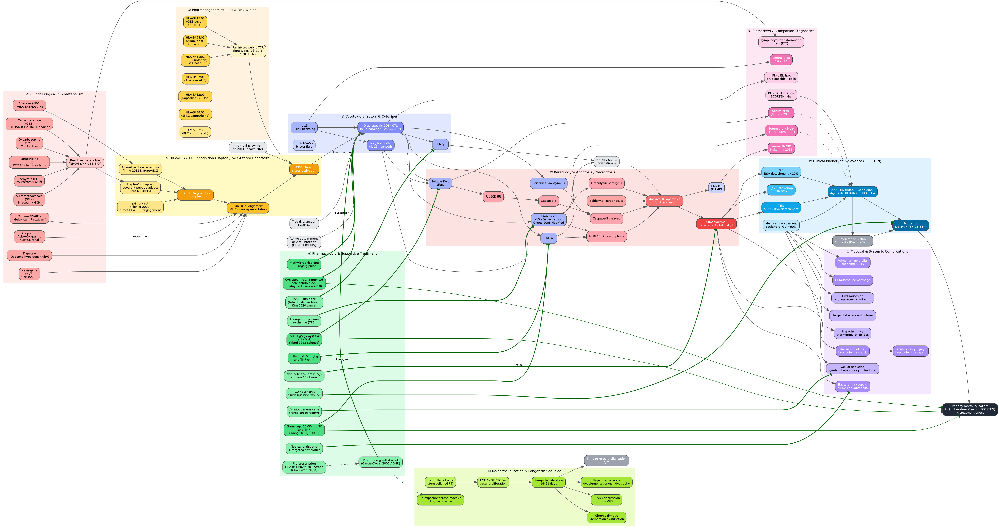</a> | 약물 유발 중증 피부 부작용(SCAR): culprit drug(카르바마제핀·알로푸리놀·SMX·라모트리진·페니토인·네비라핀·옥시캄 NSAID) ± 반응성 대사체(CBZ-EPX·NHOH-SMX) → HLA-I 위험 알릴 + p-i / hapten / altered peptide repertoire → 공공 TCR Vβ 클론형(Ko 2011)…<br>[🗺️ 지도](stevens-johnson-syndrome-ten/sjsten_qsp_model.svg) · [⚙️ mrgsolve](stevens-johnson-syndrome-ten/sjsten_mrgsolve_model.R) · [📚 문헌](stevens-johnson-syndrome-ten/sjsten_references.md) · [📄 README](stevens-johnson-syndrome-ten/README.md) |
| 356 | 신경 | [**경직성인증후군 (SPS)**<br><sub>Stiff Person Syndrome · SPS</sub>](stiff-person-syndrome/) | <a href="stiff-person-syndrome/sps_qsp_model.svg">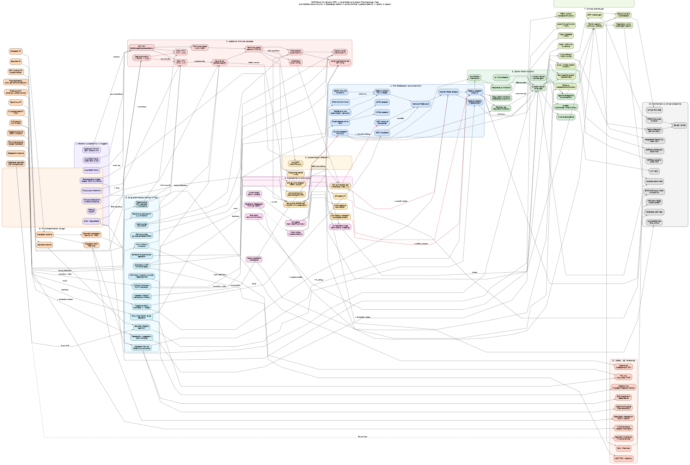</a> | HLA-DRB1\03:01·HLA-DQB1\02:01·PTPN22·CTLA-4 감수성 + EBV/엔테로바이러스 분자 모방 또는 종양항원(유방·SCLC·thymoma 아밀로이드증) 또는 면역체크포인트 억제제 노출 → APC-DC가 GAD65 펩타이드 제시 → Th1(IFN-γ)·Th17(IL-17)·Tfh(IL-21)·GC reaction…<br>[🗺️ 지도](stiff-person-syndrome/sps_qsp_model.svg) · [⚙️ mrgsolve](stiff-person-syndrome/sps_mrgsolve_model.R) · [📚 문헌](stiff-person-syndrome/sps_references.md) · [📄 README](stiff-person-syndrome/README.md) |
| 357 | 자가면역·류마티스 | [**전신 홍반 루푸스 (SLE)**<br><sub>Systemic Lupus Erythematosus · SLE</sub>](systemic-lupus-erythematosus/) | <a href="systemic-lupus-erythematosus/sle_qsp.svg"></a> | I형 IFN·항dsDNA 면역복합체에 의한 다장기 손상. 항말라리아·벨리무맙·아니프롤루맙.<br>[🗺️ 지도](systemic-lupus-erythematosus/sle_qsp.svg) · [⚙️ mrgsolve](systemic-lupus-erythematosus/sle_model.R) · [📚 문헌](systemic-lupus-erythematosus/sle_references.md) · [📄 README](systemic-lupus-erythematosus/README.md) |
| 358 | 혈액 | [**전신 비만세포증**<br><sub>Systemic Mastocytosis · SM</sub>](systemic-mastocytosis/) | <a href="systemic-mastocytosis/sm_qsp_model.svg"></a> | KIT D816V 변이 비만세포 클론 증식·매개체 방출. 아바프리티닙(KIT 억제)·미도스타우린·항매개체.<br>[🗺️ 지도](systemic-mastocytosis/sm_qsp_model.svg) · [⚙️ mrgsolve](systemic-mastocytosis/sm_mrgsolve_model.R) · [📚 문헌](systemic-mastocytosis/sm_references.md) · [📄 README](systemic-mastocytosis/README.md) |
| 359 | 자가면역·류마티스 | [**전신경화증**<br><sub>Systemic Sclerosis · SSc</sub>](systemic-sclerosis/) | <a href="systemic-sclerosis/ssc_qsp_model.svg"></a> | 혈관병증·자가면역·섬유화의 삼중 병태. 면역억제·항섬유화·혈관확장제.<br>[🗺️ 지도](systemic-sclerosis/ssc_qsp_model.svg) · [⚙️ mrgsolve](systemic-sclerosis/ssc_mrgsolve_model.R) · [📚 문헌](systemic-sclerosis/ssc_references.md) · [📄 README](systemic-sclerosis/README.md) |
| 360 | 혈관염 | [**다카야스 동맥염**<br><sub>Takayasu Arteritis · TA</sub>](takayasu-arteritis/) | <a href="takayasu-arteritis/ta_qsp_model.svg"></a> | 대동맥/주요 분지의 육아종성 대혈관염·협착. 스테로이드·토실리주맙.<br>[🗺️ 지도](takayasu-arteritis/ta_qsp_model.svg) · [⚙️ mrgsolve](takayasu-arteritis/ta_mrgsolve_model.R) · [📚 문헌](takayasu-arteritis/ta_references.md) · [📄 README](takayasu-arteritis/README.md) |
| 361 | 심혈관 | [**타코츠보 증후군 (스트레스 유발 심근병증)**<br><sub>Takotsubo Syndrome · TTS</sub>](takotsubo-syndrome/) | <a href="takotsubo-syndrome/tts_qsp_model.svg"></a> | 심첨부 풍선화를 위치가 아닌 문턱값으로 기술하여, 동일한 베타2 수용체 Gs-Gi 전환 함수를 수용체 밀도가 다른 세 심근 분절에서 평가한 64-ODE 모델.<br>[🗺️ 지도](takotsubo-syndrome/tts_qsp_model.svg) · [⚙️ mrgsolve](takotsubo-syndrome/tts_mrgsolve_model.R) · [📚 문헌](takotsubo-syndrome/tts_references.md) · [📄 README](takotsubo-syndrome/README.md) |
| 362 | 정신·신경 | [**지연성 운동이상증 (TD)**<br><sub>Tardive Dyskinesia · TD</sub>](tardive-dyskinesia/) | <a href="tardive-dyskinesia/td_qsp_model.svg"></a> | 만성 D2 차단이 시냅스후 초민감성과 산화 손상을 거쳐 이중안정 구조 손상으로 잠기는 과정을 모델링하고, 원인약물 감량과 VMAT2 억제라는 반대편 두 레버의 가역성 창·금단 역설·증상억제 대 질병수정을 계산한다.<br>[🗺️ 지도](tardive-dyskinesia/td_qsp_model.svg) · [⚙️ mrgsolve](tardive-dyskinesia/td_mrgsolve_model.R) · [📚 문헌](tardive-dyskinesia/td_references.md) · [📄 README](tardive-dyskinesia/README.md) |
| 363 | 혈액 | [**혈전성 혈소판감소자반증 (TTP)**<br><sub>Thrombotic Thrombocytopenic Purpura · TTP</sub>](thrombotic-thrombocytopenic-purpura/) | <a href="thrombotic-thrombocytopenic-purpura/ttp_qsp_model.svg"></a> | ADAMTS13 결핍으로 초거대 vWF 다량체·미세혈관 혈전. 혈장교환·카플라시주맙·리툭시맙.<br>[🗺️ 지도](thrombotic-thrombocytopenic-purpura/ttp_qsp_model.svg) · [⚙️ mrgsolve](thrombotic-thrombocytopenic-purpura/ttp_mrgsolve_model.R) · [📚 문헌](thrombotic-thrombocytopenic-purpura/ttp_references.md) · [📄 README](thrombotic-thrombocytopenic-purpura/README.md) |
| 364 | 종양 | [**갑상선암**<br><sub>Thyroid Cancer · ThyCa</sub>](thyroid-cancer/) | <a href="thyroid-cancer/thyca_qsp_model.svg"></a> | BRAF V600E·RET 발암 드라이버 → MAPK(RAS-RAF-MEK-ERK)·PI3K/AKT/mTOR 이중 경로 활성화 → 분화암(DTC: 유두·여포)·수질암(MTC)·미분화암(ATC) 아형별 진행.<br>[🗺️ 지도](thyroid-cancer/thyca_qsp_model.svg) · [⚙️ mrgsolve](thyroid-cancer/thyca_mrgsolve_model.R) · [📚 문헌](thyroid-cancer/thyca_references.md) · [📄 README](thyroid-cancer/README.md) |
| 365 | 안과 | [**갑상선 눈병증 (TED)**<br><sub>Thyroid Eye Disease · Graves' Orbitopathy</sub>](thyroid-eye-disease/) | <a href="thyroid-eye-disease/ted_qsp_model.svg">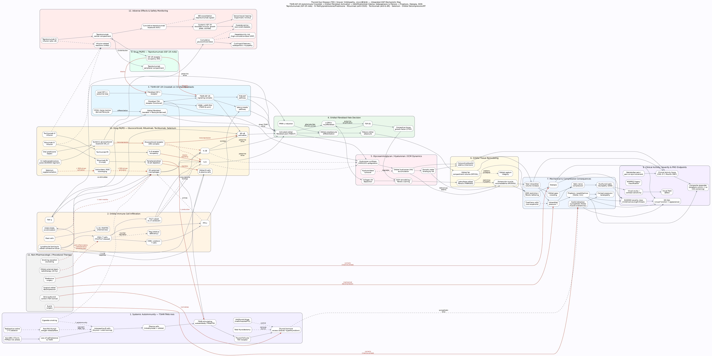</a> | 그레이브스병 환자의 25-50%에서 발생하며, 갑상선자극 자가항체(TRAb/TSI)가 안구섬유모세포의 TSHR-IGF-1R 신호복합체와 교차반응하는 것이 핵심 기전이다.<br>[🗺️ 지도](thyroid-eye-disease/ted_qsp_model.svg) · [⚙️ mrgsolve](thyroid-eye-disease/ted_mrgsolve_model.R) · [📚 문헌](thyroid-eye-disease/ted_references.md) · [📄 README](thyroid-eye-disease/README.md) |
| 366 | 정신·신경 | [**담배 사용 장애 (니코틴 의존)**<br><sub>Tobacco Use Disorder · TUD</sub>](tobacco-use-disorder/) | <a href="tobacco-use-disorder/tud_qsp_model.svg"></a> | α4β2 니코틴 수용체의 빠른 탈감작과 14일 시간상수의 알로스테시스 쾌락 설정점 사이의 불일치로 금단을 기술하고, CYP2A6 대사속도에 따른 니코틴 대체요법과 바레니클린의 반응 차이를 재현.<br>[🗺️ 지도](tobacco-use-disorder/tud_qsp_model.svg) · [⚙️ mrgsolve](tobacco-use-disorder/tud_mrgsolve_model.R) · [📚 문헌](tobacco-use-disorder/tud_references.md) · [📄 README](tobacco-use-disorder/README.md) |
| 367 | 희귀·유전 | [**트랜스티레틴 아밀로이드증**<br><sub>Transthyretin Amyloidosis · ATTR</sub>](transthyretin-amyloidosis/) | <a href="transthyretin-amyloidosis/attr_qsp_model.svg"></a> | 간 헤파토사이트 분비 TTR 사량체 해리(rate-limiting) → 잘못 접힌 단량체 → 독성 올리고머 → 아밀로이드 섬유 → 심장(ATTRwt: 간질 침착·LV 비후·HFpEF→HFrEF) / 말초신경(ATTRv: 길이 의존적 축삭 퇴화·자율신경 기능부전) 다장기 손상.<br>[🗺️ 지도](transthyretin-amyloidosis/attr_qsp_model.svg) · [⚙️ mrgsolve](transthyretin-amyloidosis/attr_mrgsolve_model.R) · [📚 문헌](transthyretin-amyloidosis/attr_references.md) · [📄 README](transthyretin-amyloidosis/README.md) |
| 368 | 신경 | [**중증 외상성 뇌손상 (sTBI)**<br><sub>Severe Traumatic Brain Injury · sTBI</sub>](traumatic-brain-injury/) | <a href="traumatic-brain-injury/tbi_qsp_model.svg"></a> | 두개골이 닫힌 상자라는 제약(Monro-Kellie)에서 출발해 두개내압을 상태변수가 아닌 용적 수지의 잔차로 다루며, 자동조절·CO2 반응성·2구획 뇌부종·삼투요법·과환기·감압술을 통합한 47-ODE 모델.<br>[🗺️ 지도](traumatic-brain-injury/tbi_qsp_model.svg) · [⚙️ mrgsolve](traumatic-brain-injury/tbi_mrgsolve_model.R) · [📚 문헌](traumatic-brain-injury/tbi_references.md) · [📄 README](traumatic-brain-injury/README.md) |
| 369 | 신경 | [**삼차신경통 (TN)**<br><sub>Trigeminal Neuralgia · Neurovascular compression (SCA/AICA) of REZ</sub>](trigeminal-neuralgia/) | <a href="trigeminal-neuralgia/tn_qsp_model.svg">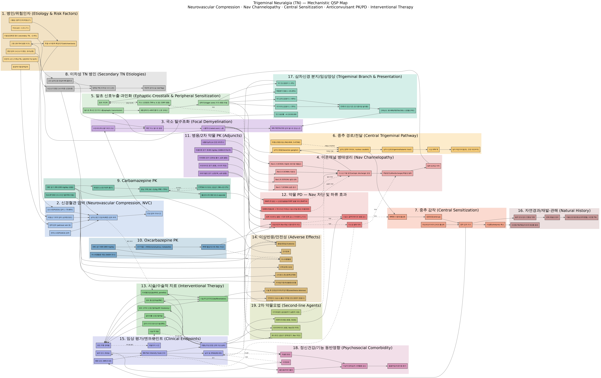</a> | 삼차신경 근진입부(REZ)의 만성 박동성 혈관압박(주로 상소뇌동맥)이 국소 탈수초화를 유발하고, 노출된 나출축삭에서 Nav1.7/1.3/1.6 나트륨채널 이상발현·재분포로 이소성 자발방전/후발방전이 생성되며(Devor ignition hypothesis), 탈수초 축삭 간 전기적 신호누출(ephaptic crosstalk)로 경촉각(Aβ)…<br>[🗺️ 지도](trigeminal-neuralgia/tn_qsp_model.svg) · [⚙️ mrgsolve](trigeminal-neuralgia/tn_mrgsolve_model.R) · [📚 문헌](trigeminal-neuralgia/tn_references.md) · [📄 README](trigeminal-neuralgia/README.md) |
| 370 | 감염 | [**결핵**<br><sub>Tuberculosis · TB</sub>](tuberculosis/) | <a href="tuberculosis/tb_qsp_model.svg">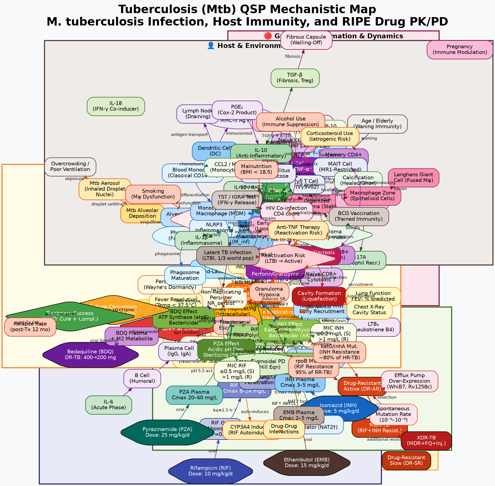</a> | Mycobacterium tuberculosis* 흡입 → 폐포 대식세포 탐식·포식소체 탈출 → AR(활발 증식)·SR(서행 증식)·NR(비증식 지속체) 3중 세균 아집단 → Th1-IFN-γ 축 유도·육아종 형성 → RIPE 4제 요법(Rifampicin rpoB / Isoniazid InhA / Pyrazinamide 산성 pH / E…<br>[🗺️ 지도](tuberculosis/tb_qsp_model.svg) · [⚙️ mrgsolve](tuberculosis/tb_mrgsolve_model.R) · [📚 문헌](tuberculosis/tb_references.md) · [📄 README](tuberculosis/README.md) |
| 371 | 신경 | [**결절성 경화증 (TSC)**<br><sub>Tuberous Sclerosis Complex · TSC1 (Hamartin, 9q34) / TSC2 (Tuberin, 16p13.3)</sub>](tuberous-sclerosis-complex/) | <a href="tuberous-sclerosis-complex/tsc_qsp_model.svg">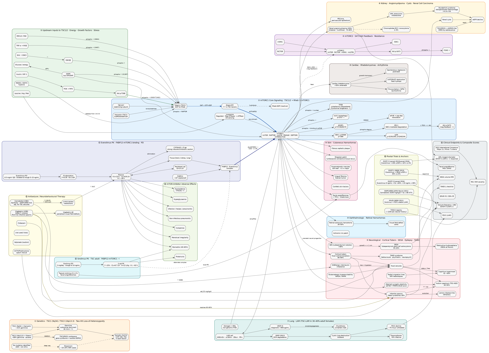</a> | 상염색체 우성 신경피부 종양억제 증후군: TSC1 (9q34, 31%)·TSC2 (16p13.3, 69%, 더 중증) germline LoF + 병변별 체세포 2nd-hit LOH → Hamartin-Tuberin-TBC1D7 GAP 복합체 소실 → Rheb-GTP↑ → mTORC1 hyperactivation (S6K1-pT389↑·rp…<br>[🗺️ 지도](tuberous-sclerosis-complex/tsc_qsp_model.svg) · [⚙️ mrgsolve](tuberous-sclerosis-complex/tsc_mrgsolve_model.R) · [📚 문헌](tuberous-sclerosis-complex/tsc_references.md) · [📄 README](tuberous-sclerosis-complex/README.md) |
| 372 | 종양 | [**종양용해증후군 (TLS)**<br><sub>Tumour Lysis Syndrome · TLS</sub>](tumour-lysis-syndrome/) | <a href="tumour-lysis-syndrome/tls_qsp_model.svg"></a> | 세포용해로 방출되는 용질의 플럭스가 신장의 제거 용량을 넘으면 요산이 세뇨관에서 결정화하여 GFR을 깎고, 그 GFR 손실이 다시 제거 용량을 줄이는 닫힌 고리로 기술한다.<br>[🗺️ 지도](tumour-lysis-syndrome/tls_qsp_model.svg) · [⚙️ mrgsolve](tumour-lysis-syndrome/tls_mrgsolve_model.R) · [📚 문헌](tumour-lysis-syndrome/tls_references.md) · [📄 README](tumour-lysis-syndrome/README.md) |
| 373 | 내분비·대사 | [**제1형 당뇨병**<br><sub>Type 1 Diabetes · T1DM</sub>](type1-diabetes/) | <a href="type1-diabetes/t1dm_qsp_model.svg"></a> | 자가면역 베타세포 파괴에 의한 인슐린 결핍. 인슐린 요법·테플리주맙(발병 지연).<br>[🗺️ 지도](type1-diabetes/t1dm_qsp_model.svg) · [⚙️ mrgsolve](type1-diabetes/t1dm_mrgsolve_model.R) · [📚 문헌](type1-diabetes/t1dm_references.md) · [📄 README](type1-diabetes/README.md) |
| 374 | 내분비·대사 | [**제2형 당뇨병**<br><sub>Type 2 Diabetes · T2DM</sub>](type2-diabetes/) | <a href="type2-diabetes/t2dm_qsp_model.svg">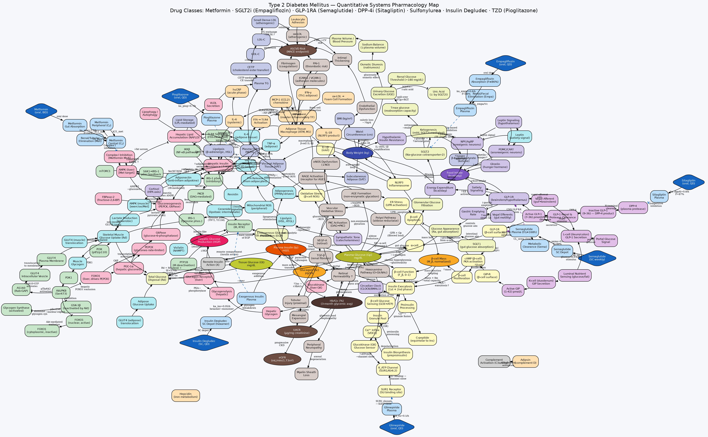</a> | 인슐린 저항성·베타세포 기능부전. 메트포르민·GLP-1·SGLT2i.<br>[🗺️ 지도](type2-diabetes/t2dm_qsp_model.svg) · [⚙️ mrgsolve](type2-diabetes/t2dm_mrgsolve_model.R) · [📚 문헌](type2-diabetes/t2dm_references.md) · [📄 README](type2-diabetes/README.md) |
| 375 | 소화기·간담도 | [**궤양성 대장염**<br><sub>Ulcerative Colitis · UC</sub>](ulcerative-colitis/) | <a href="ulcerative-colitis/uc_qsp_model.svg"></a> | 대장 점막의 Th2/장벽 염증. 5-ASA·항TNF·항인테그린·JAK 억제제.<br>[🗺️ 지도](ulcerative-colitis/uc_qsp_model.svg) · [⚙️ mrgsolve](ulcerative-colitis/uc_mrgsolve_model.R) · [📚 문헌](ulcerative-colitis/uc_references.md) · [📄 README](ulcerative-colitis/README.md) |
| 376 | 희귀·유전 | [**요소회로 이상증 (UCD)**<br><sub>Urea Cycle Disorders · UCD</sub>](urea-cycle-disorders/) | <a href="urea-cycle-disorders/ucd_qsp_model.svg"></a> | 요소회로 효소 결손으로 질소가 암모니아와 글루타민으로 축적되어 별아교세포 삼투성 뇌부종을 일으키는 유전대사질환이며, 질소 스캐빈저·카글룸산·투석·유전자치료를 함께 다룬다.<br>[🗺️ 지도](urea-cycle-disorders/ucd_qsp_model.svg) · [⚙️ mrgsolve](urea-cycle-disorders/ucd_mrgsolve_model.R) · [📚 문헌](urea-cycle-disorders/ucd_references.md) · [📄 README](urea-cycle-disorders/README.md) |
| 377 | 신장·비뇨 | [**요로결석 (만성 재발성)**<br><sub>Urolithiasis · URI</sub>](urolithiasis/) | <a href="urolithiasis/uri_qsp_model.svg">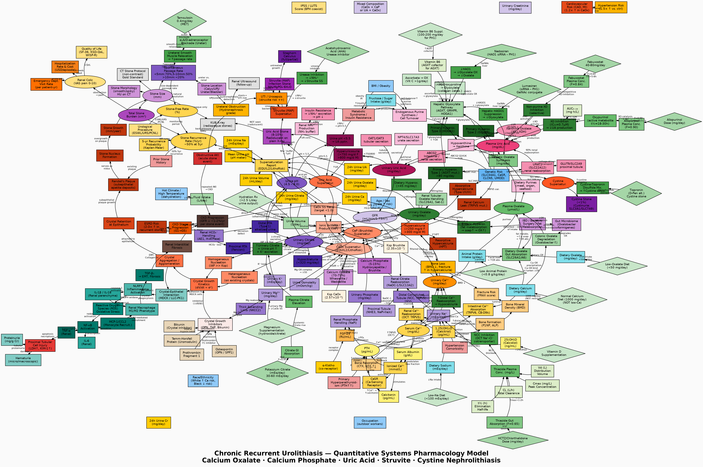</a> | 소변 과포화·결정화·Randall 플라크에 의한 결석. 티아지드·구연산칼륨·알로푸리놀.<br>[🗺️ 지도](urolithiasis/uri_qsp_model.svg) · [⚙️ mrgsolve](urolithiasis/uri_mrgsolve_model.R) · [📚 문헌](urolithiasis/uri_references.md) · [📄 README](urolithiasis/README.md) |
| 378 | 내분비·대사 | [**자궁근종 (Uterine Leiomyoma)**<br><sub>Uterine Fibroids · Leiomyoma</sub>](uterine-leiomyoma/) | <a href="uterine-leiomyoma/ufl_qsp_model.svg">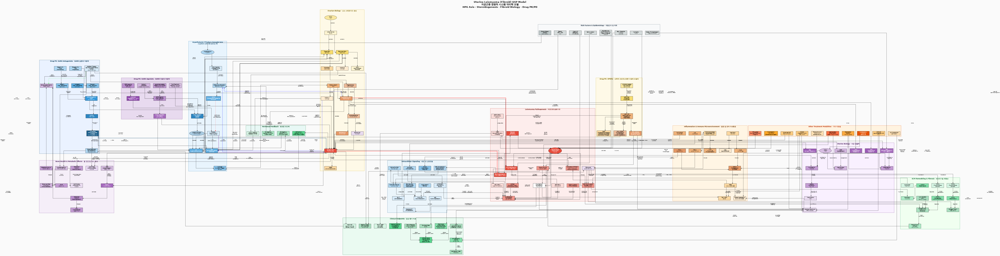</a> | MED12 돌연변이(70%)·HMGA2 과발현 → HPG 축(GnRH→LH/FSH→E2/P4) 구동 → ERα/PR 과발현 → 세포증식(MAPK/ERK·PI3K/AKT/mTOR·Wnt/β-catenin)↑ + ECM 축적(TGF-β1·콜라겐I/III·TIMP↑·MMP↓·LOX 교차결합) + 국소 아로마타제 과발현(PGE2 → CYP19A1…<br>[🗺️ 지도](uterine-leiomyoma/ufl_qsp_model.svg) · [⚙️ mrgsolve](uterine-leiomyoma/ufl_mrgsolve_model.R) · [📚 문헌](uterine-leiomyoma/ufl_references.md) · [📄 README](uterine-leiomyoma/README.md) |
| 379 | 안과 | [**포도막염 (Uveitis)**<br><sub>Non-infectious Uveitis · UVT</sub>](uveitis/) | <a href="uveitis/uvt_qsp_model.svg"></a> | HLA-B27·IRBP/S-Ag 자가항원 → APC 활성화 → Th1(IFN-γ)/Th17(IL-17A) 분화 → TNF-α·IL-6·VEGF-A 분비 → 혈-안방장벽(BAB)·혈-망막장벽(BRB) 파괴 → 전방세포 유입(SUN 등급↑)·낭포황반부종(CME) → 시력 저하(logMAR↑).<br>[🗺️ 지도](uveitis/uvt_qsp_model.svg) · [⚙️ mrgsolve](uveitis/uvt_mrgsolve_model.R) · [📚 문헌](uveitis/uvt_references.md) · [📄 README](uveitis/README.md) |
| 380 | 신경 | [**혈관성 치매 (VaD)**<br><sub>Vascular Dementia · VaD</sub>](vascular-dementia/) | <a href="vascular-dementia/vad_qsp_model.svg"></a> | 고혈압·당뇨·이상지질혈증 → 소혈관 질환(SVD) → 백질변성(WMH)·열공경색·피질 미세경색 → 혈뇨장벽(BBB) 손상(MMP9↑·TJ단백↓) → DAMPs 유입 → 미세아교세포 M1 활성화(NF-κB→IL-1β/TNF-α/IL-6) → 산화 스트레스(ROS·ONOO⁻) → 뉴런 사멸(caspase-3) + ACh 톤↓(ChAT↓·ACh…<br>[🗺️ 지도](vascular-dementia/vad_qsp_model.svg) · [⚙️ mrgsolve](vascular-dementia/vad_mrgsolve_model.R) · [📚 문헌](vascular-dementia/vad_references.md) · [📄 README](vascular-dementia/README.md) |
| 381 | 내분비·대사 | [**폐경기 혈관운동증상 (VMS)**<br><sub>Vasomotor Symptoms of Menopause · Hot flushes & night sweats</sub>](vasomotor-symptoms-menopause/) | <a href="vasomotor-symptoms-menopause/vms_qsp_model.svg">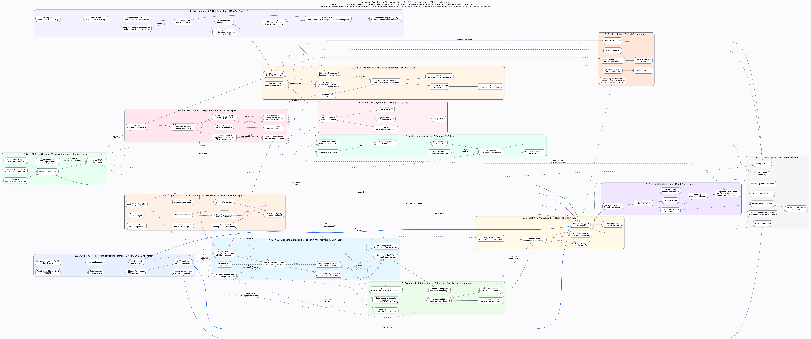</a> | 폐경 이행기 여성의 최대 80%에서 발생하며 평균 7.4년 지속되는(SWAN 연구) 혈관운동증상.<br>[🗺️ 지도](vasomotor-symptoms-menopause/vms_qsp_model.svg) · [⚙️ mrgsolve](vasomotor-symptoms-menopause/vms_mrgsolve_model.R) · [📚 문헌](vasomotor-symptoms-menopause/vms_references.md) · [📄 README](vasomotor-symptoms-menopause/README.md) |
| 382 | 혈액 | [**정맥 혈전색전증 (DVT/PE)**<br><sub>Venous Thromboembolism · VTE</sub>](venous-thromboembolism/) | <a href="venous-thromboembolism/vte_qsp_model.svg"></a> | 심부정맥 혈전증(DVT)과 폐색전증(PE)을 통합한 QSP 모델.<br>[🗺️ 지도](venous-thromboembolism/vte_qsp_model.svg) · [⚙️ mrgsolve](venous-thromboembolism/vte_mrgsolve_model.R) · [📚 문헌](venous-thromboembolism/vte_references.md) · [📄 README](venous-thromboembolism/README.md) |
| 383 | 혈액 | [**VEXAS 증후군**<br><sub>VEXAS Syndrome · Vacuoles/E1/X-linked/Autoinflammatory/Somatic</sub>](vexas-syndrome/) | <a href="vexas-syndrome/vexas_qsp_model.svg"></a> | 2020년 NIH-Beck NEJM에서 처음 기술된 X-연관 성인 발병 자가염증 + 골수이형 중복 질환: 조혈모세포(HSC)의 UBA1* (Xp11.23) 체세포 돌연변이(주로 p.Met41Thr/Val/Leu, 일부 splice-site) → 세포질 isoform UBA1b 소실(핵 UBA1a 보존) → cytoplasmic ubiqui…<br>[🗺️ 지도](vexas-syndrome/vexas_qsp_model.svg) · [⚙️ mrgsolve](vexas-syndrome/vexas_mrgsolve_model.R) · [📚 문헌](vexas-syndrome/vexas_references.md) · [📄 README](vexas-syndrome/README.md) |
| 384 | 감염 | [**내장 리슈만편모충증 (칼라아자르)**<br><sub>Visceral Leishmaniasis · VL</sub>](visceral-leishmaniasis/) | <a href="visceral-leishmaniasis/vl_qsp_model.svg"></a> | 약과 기생충이 혈장에서 만나지 않는다는 점에서 출발해 모든 살상항을 대식세포내 농도로, 암포테리신 신독성은 같은 용량의 자유 혈장 농도로 기술하여 리포솜화가 두 적분을 반대 방향으로 움직인다는 것을 계산으로 보인다.<br>[🗺️ 지도](visceral-leishmaniasis/vl_qsp_model.svg) · [⚙️ mrgsolve](visceral-leishmaniasis/vl_mrgsolve_model.R) · [📚 문헌](visceral-leishmaniasis/vl_references.md) · [📄 README](visceral-leishmaniasis/README.md) |
| 385 | 피부 | [**백반증**<br><sub>Vitiligo · VIT</sub>](vitiligo/) | <a href="vitiligo/vit_qsp_model.svg"></a> | CD8 T세포·IFN-γ-CXCL10 축에 의한 멜라닌세포 파괴. JAK 억제제(룩솔리티닙) 색소 재침착.<br>[🗺️ 지도](vitiligo/vit_qsp_model.svg) · [⚙️ mrgsolve](vitiligo/vit_mrgsolve_model.R) · [📚 문헌](vitiligo/vit_references.md) · [📄 README](vitiligo/README.md) |
| 386 | 혈액 | [**폰 빌레브란트병 (VWD)**<br><sub>Von Willebrand Disease · Type 1 partial quantitative deficiency(~75%)</sub>](von-willebrand-disease/) | <a href="von-willebrand-disease/vwd_qsp_model.svg"></a> | 가장 흔한 유전성 출혈질환으로, VWF 유전자(12p13.31)의 정량적 결핍(Type 1 부분결핍 ~75%·Type 3 완전결핍) 또는 정성적 기능이상(Type 2A 멀티머화 결함·Type 2B GPIbα 기능획득·Type 2M 결합결함·Type 2N FVIII결합결함)에 의해 발생.<br>[🗺️ 지도](von-willebrand-disease/vwd_qsp_model.svg) · [⚙️ mrgsolve](von-willebrand-disease/vwd_mrgsolve_model.R) · [📚 문헌](von-willebrand-disease/vwd_references.md) · [📄 README](von-willebrand-disease/README.md) |
| 387 | 종양 | [**발덴스트롬 거대글로불린혈증 (WM)**<br><sub>Waldenström's Macroglobulinemia · WM</sub>](waldenstrom-macroglobulinemia/) | <a href="waldenstrom-macroglobulinemia/wm_qsp_model.svg"></a> | MYD88 L265P(~95%) 구성적 NF-κB 활성화 + CXCR4 WHIM 돌연변이(~35%) BM 체류 강화 → 림프형질세포 증식 → IgM 단클론 파라단백 → 과점도 증후군·한랭글로불린·항MAG 신경병증. BTK 억제제(이브루티닙/자누브루티닙)·리툭시맙·벤다무스틴·보르테조밉·베네토클락스 7개 시나리오.<br>[🗺️ 지도](waldenstrom-macroglobulinemia/wm_qsp_model.svg) · [⚙️ mrgsolve](waldenstrom-macroglobulinemia/wm_mrgsolve_model.R) · [📚 문헌](waldenstrom-macroglobulinemia/wm_references.md) · [📄 README](waldenstrom-macroglobulinemia/README.md) |
| 388 | 희귀·유전 | [**윌슨병**<br><sub>Wilson's Disease · WD</sub>](wilsons-disease/) | <a href="wilsons-disease/wd_qsp_model.svg"></a> | ATP7B 기능 소실 → 구리 대사 장애 — ATP7B*(P형 Cu-ATPase) 돌연변이(p.His1069Gln 유럽 35%·p.Arg778Leu 아시아 20%)로 담즙 구리 배출↓·아포세룰로플라스민 구리 적재 실패 → 간세포 구리 축적(>250 μg/g dw) → MT 포화 → NCBC(Non-Ceruloplasmin Bound Cop…<br>[🗺️ 지도](wilsons-disease/wd_qsp_model.svg) · [⚙️ mrgsolve](wilsons-disease/wd_mrgsolve_model.R) · [📚 문헌](wilsons-disease/wd_references.md) · [📄 README](wilsons-disease/README.md) |
| 389 | 희귀·유전 | [**X-연관 부신백질형성장애 (X-ALD)**<br><sub>X-linked Adrenoleukodystrophy · X-ALD</sub>](x-linked-adrenoleukodystrophy/) | <a href="x-linked-adrenoleukodystrophy/xald_qsp_model.svg"></a> | ABCD1 소실이라는 하나의 병변이 측정되는 VLCFA 축적과 측정되지 않는 이중안정 뇌염증 스위치라는 두 독립 변수를 만들어, 표지자를 고치는 약과 병을 고치는 약이 갈라지는 구조를 모델링.<br>[🗺️ 지도](x-linked-adrenoleukodystrophy/xald_qsp_model.svg) · [⚙️ mrgsolve](x-linked-adrenoleukodystrophy/xald_mrgsolve_model.R) · [📚 문헌](x-linked-adrenoleukodystrophy/xald_references.md) · [📄 README](x-linked-adrenoleukodystrophy/README.md) |
| 390 | 신장·비뇨 | [**X-연관 저인산혈증 (XLH)**<br><sub>X-Linked Hypophosphatemia · PHEX gene Xp22.11 loss-of-function (X-linked dominant, ~20-30% de novo)</sub>](x-linked-hypophosphatemia/) | <a href="x-linked-hypophosphatemia/xlh_qsp_model.svg">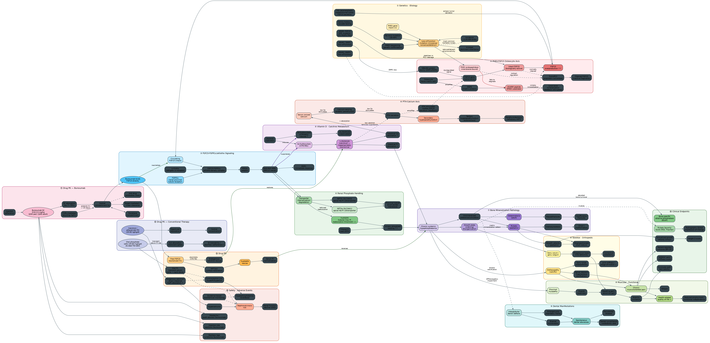</a> | 가장 흔한 유전성 구루병/골연화증으로, PHEX 유전자(Xp22.11)의 기능소실 돌연변이에 의한 X-연관 우성 유전질환(약 20-30%는 de novo; ADHR은 FGF23 자체의 기능획득 변이, ARHR1/2는 각각 DMP1·ENPP1 기능소실, TIO는 중간엽 종양의 이상성 FGF23 분비로 유사 표현형을 유발).<br>[🗺️ 지도](x-linked-hypophosphatemia/xlh_qsp_model.svg) · [⚙️ mrgsolve](x-linked-hypophosphatemia/xlh_mrgsolve_model.R) · [📚 문헌](x-linked-hypophosphatemia/xlh_references.md) · [📄 README](x-linked-hypophosphatemia/README.md) |
| 391 | 소화기·간담도 | [**졸링거-엘리슨 증후군 (가스트린종)**<br><sub>Zollinger-Ellison Syndrome · ZES</sub>](zollinger-ellison-syndrome/) | <a href="zollinger-ellison-syndrome/zes_qsp_model.svg"></a> | 위산 분비량을 상태변수가 아니라 벽세포 질량 x 활성 펌프 분율 x 분비촉진 자극의 곱으로 기술하여, 고가스트린혈증이 1·3번 인자를 올리는데 모든 위산억제제는 2번만 건드린다는 비대칭에서 ZES의 고용량·짧은 투여간격 요구가 유도된다.<br>[🗺️ 지도](zollinger-ellison-syndrome/zes_qsp_model.svg) · [⚙️ mrgsolve](zollinger-ellison-syndrome/zes_mrgsolve_model.R) · [📚 문헌](zollinger-ellison-syndrome/zes_references.md) · [📄 README](zollinger-ellison-syndrome/README.md) |

---

## ⚠️ 면책 조항 (Disclaimer)

본 라이브러리의 모든 모델은 **교육 및 연구 목적의 정성적·반정량적 QSP 모델**입니다. 공개 문헌과 임상시험 데이터를 바탕으로 구성되었으나 독립적으로 검증·인증되지 않았으며, **실제 임상 의사결정, 처방, 또는 규제 제출에 직접 사용해서는 안 됩니다.** 파라미터와 가정은 설명을 위한 근사치이며, 실제 환자 데이터에 대한 적합·검증이 별도로 필요합니다.

## 📖 참고 자료 (References & Tools)

- mrgsolve를 이용한 R 기반 QSP: <https://vantage-research.net/qsp-in-r/>
- gPKPDviz — mrgsolve 기반 PK/PD 시뮬레이션 Shiny 도구
  - 논문: <https://pmc.ncbi.nlm.nih.gov/articles/PMC10941578/>
  - 코드: <https://github.com/Genentech/gPKPDviz/>

## 📄 라이선스 (License)

본 저장소의 라이선스는 [LICENSE](LICENSE) 파일을 참조하세요.
