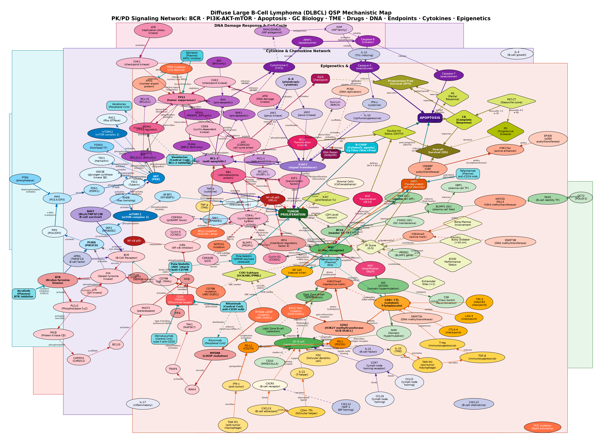

# 미만성 거대 B세포 림프종 (Diffuse Large B-Cell Lymphoma, DLBCL) QSP Model

> **디렉토리**: `diffuse-large-b-cell-lymphoma/` | **날짜**: 2026-06-23  
> **분류**: 혈액종양학 (Hematologic Oncology) — B세포 림프종

[](dlbcl_qsp_model.svg)

---

## 질환 개요

**미만성 거대 B세포 림프종(DLBCL)** 은 성인에서 가장 흔한 공격성 B세포 림프종(전체 NHL의 약 30–35%)입니다. 적절히 치료하면 R-CHOP으로 60–65%에서 완치되지만, 재발·불응 환자(R/R)의 예후는 여전히 불량합니다. 2022년 POLARIX 결과 이후 **Polatuzumab vedotin-R-CHP(Pola-R-CHP)** 가 1차 표준치료의 새 옵션으로 등장하였고, R/R 환자에서는 **CAR-T 세포치료**(axi-cel/tisa-cel/liso-cel)가 표준이 됐습니다.

### 세포 기원(COO) 분류

| 분류 | 유병률 | 주요 드라이버 | 5년 OS (R-CHOP) |
|------|--------|--------------|-----------------|
| **GCB** | ~50% | EZH2 Y641 mut, BCL2 t(14;18), BCL6+, REL amplif | ~75% |
| **ABC** | ~35% | NF-κB constitutive, MYD88 L265P, CARD11 mut, CD79B mut | ~55% |
| **Double-hit (DHL)** | ~10% | MYC + BCL2/BCL6 rearrangement | ~35% |
| **Unclassified** | ~15% | — | ~60% |

---

## 핵심 병태생리 경로

### 1. BCR → BTK → NF-κB (ABC 아형 핵심)
- **B세포 수용체(BCR)** 교차결합 → **LYN** → **SYK** ITAM 인산화 → **BTK pY223** 활성화
- BTK → **PLCγ2** → DAG + IP3 → PKCβ → **CARD11-BCL10-MALT1 (CBM) complex** 형성
- CBM → **IKKβ 활성화** → IκBα 인산화·분해 → **p65/p50 핵 이동** → NF-κB 표적 유전자 발현
- **ABC 특이:** MYD88 L265P 변이 → TLR9/BCR 만성 활성화 → 구성적 NF-κB; CD79B/CARD11 변이
- NF-κB 표적: BCL-2, BCL-XL, MCL-1, MYC, IL-6, IL-10, CXCR4, IRF4

### 2. PI3K / AKT / mTOR
- CD19 공동수용체 → **PI3Kδ(PIK3CD)** 활성화 → PIP2 → PIP3 (PTEN 길항)
- PIP3 → PDK1 → **AKT pT308/S473** → mTORC1/2 활성화
- mTORC1 → S6K, 4E-BP1 → eIF4E 해방 → 단백질 합성 증가
- AKT → FOXO1 세포질 격리 → 아폽토시스 억제; MDM2 인산화 → p53 분해

### 3. JAK / STAT3 / 사이토카인 루프
- NF-κB 의존성 IL-6·IL-10 자가분비 루프 → gp130 → **JAK1/2** → **pSTAT3(Y705)**
- STAT3 → PD-L1 전사 유도, BCL-2·MCL-1 발현 증가, IRF4 활성화 (ABC 최종 분화 차단)
- ABC 아형에서 IL-10 루프가 특히 강함 (IFN-γ 내성과 연관)

### 4. MYC / BCL6 / EZH2 후성유전 (GCB 아형 핵심)
- **BCL6**: GC B세포의 마스터 전사인자 → BLIMP1, p53, p21, CCND2 억제 (HDAC/NuRD 복합체 동원)
- **EZH2 Y641 변이**: PRC2 복합체 과활성 → H3K27me3 과메틸화 → 종양억제유전자(p53, CDKN2A) 침묵
- **MYC**: 8q24 증폭 또는 전좌 → Cyclin D, CDK4, LDHA 등 증식·대사 유전자 전사 활성화
- **Double-hit (DHL)**: MYC + BCL2/BCL6 동시 재배열 → R-CHOP 저항성, 불량 예후

### 5. BCL-2 패밀리 / 아폽토시스
- **항아폽토시스**: BCL-2(GCB t(14;18)), BCL-XL(NF-κB), MCL-1(STAT3/mTOR), BCL2A1
- **촉진**: BIM(구심 활성화 인자), BAD, BAX, BAK(효과기)
- BCL-2/BIM 비율이 세포 생존 운명 결정 → Venetoclax(BH3 모방체)의 표적
- TP53 변이 → PUMA/NOXA 전사 감소 → 아폽토시스 저항성

### 6. 종양미세환경 (TME)
| 세포 | 기능 | DLBCL에서의 변화 |
|------|------|-----------------|
| CD8+ CTL | 퍼포린/그랜자임 세포독성 | PD-1 고갈 (PD-L1 과발현) |
| NK 세포 | ADCC (CD16a/FcγRIIIa) | Rituximab-ADCC 핵심 |
| M2 TAM | TGF-β·IL-10 분비 → 면역 억제 | 불량 예후 연관 |
| Treg | FoxP3, IL-10/TGF-β | T세포 억제 |
| CD47 | 'don't eat me' 신호 | SIRPα 차단 → 식세포 회피 |

---

## QSP 모델 구성

### 1. 기계론적 지도 (Mechanistic Map)

| 항목 | 내용 |
|------|------|
| **파일** | `dlbcl_qsp_model.dot` / `.svg` / `.png` |
| **노드 수** | 120+ (12개 클러스터) |
| **클러스터** | BCR 신호전달·NF-κB·PI3K/AKT·JAK/STAT3·MAPK/RAS·아폽토시스·세포주기·후성유전·종양미세환경·약물 PK·약물 PD·임상 엔드포인트 |

### 2. mrgsolve ODE 모델

| 항목 | 내용 |
|------|------|
| **파일** | `dlbcl_mrgsolve_model.R` |
| **구획 수** | 31개 (약물 PK 11 + 질환 PD 20) |
| **치료 시나리오** | 7개 (미치료·R-CHOP·Pola-R-CHP·R-CHOP ABC·DHL·CAR-T·Venetoclax+R) |

#### 구획 상세

**약물 PK (11구획)**
| 약물 | 구획 | 파라미터 참고 |
|------|------|-------------|
| Rituximab | 2-cmt (RTX1, RTX2) | Tobinai Jpn J Cancer 1998; CL 0.01 L/h, T½ ~22일 |
| Cyclophosphamide | 1-cmt 프로드럭 → 4-OH-CP | Grochow JCO 1991 |
| Doxorubicin | 1-cmt | Robert JCO 1982; Vd 700 L/m² |
| Vincristine | 1-cmt | Sethi Cancer Chemother 1981 |
| Pola-vedotin | 2-cmt ADC + MMAE 방출 | Palanca-Wessels Lancet Oncol 2015 |
| Venetoclax | 경구 depot + 1-cmt | Salem JCO 2017 |
| CAR-T 세포 | 확장·지속 2상태 | Neelapu NEJM 2017 |

**질환 PD (20구획)**
- BCR 신호전달: pSYK, pBTK, pNFkB
- PI3K/AKT: pAKT, pSTAT3
- 아폽토시스: BCL2_prot, BIM_prot, Apoptosis (누적)
- 종양세포: GCB_tumor, ABC_tumor
- TME 면역세포: CD8_T, NK_cell, CART_cells
- 바이오마커: LDH_level, ctDNA_level

#### 임상시험 보정 근거

| 시나리오 | 임상시험 | 기준 데이터 |
|---------|---------|------------|
| R-CHOP × 6 (GCB) | Coiffier NEJM 2002; Pfreundschuh Lancet Oncol 2006 | CR 76%, 2yr-PFS 69% |
| Pola-R-CHP × 6 | POLARIX (Tilly NEJM 2022) | 2yr-PFS 76.7% vs 70.2% (R-CHOP) |
| R-CHOP (ABC) | Rosenwald NEJM 2002 | ABC 5yr-OS ~55% vs GCB ~75% |
| CAR-T (axi-cel) | ZUMA-1 (Neelapu NEJM 2017) | ORR 83%, CR 58%, 18mo-PFS 52% |
| Venetoclax + R | CAVALLI (Zelenetz Blood 2019) | GCB BCL2+ ORR 개선 |
| Double-hit | Petrich JCO 2014 | R-CHOP ORR ~46%; DA-EPOCH-R 선호 |

### 3. Shiny 대시보드

| 항목 | 내용 |
|------|------|
| **파일** | `dlbcl_shiny_app.R` |
| **탭 수** | 6개 |
| **UI 프레임워크** | shinydashboard (purple 테마) |

| 탭 | 내용 |
|----|------|
| 🟣 환자 프로파일 | COO·DHL·TP53·IPI 설정, BCR 경로 개요, COO 비교 차트 |
| 💊 Drug PK | Rituximab 2-cmt, 세포독성제, Pola+MMAE, Venetoclax 농도-시간 곡선 |
| 🔬 Oncogenic Signaling | BCR→BTK→NF-κB, pAKT/pSTAT3, BCL2/BIM 균형, 누적 아폽토시스 |
| 📊 Clinical Endpoints | 종양부담, 폭포 차트, GCB/ABC 분리, 생존 곡선 프록시 |
| ⚖️ Scenario Comparison | 5개 요법 동시 비교, Pola-R-CHP vs R-CHOP (POLARIX 재현) |
| 🧬 TME & Biomarkers | CD8/NK 동역학, CAR-T 확장, LDH/ctDNA, PD-L1 프록시, BCL-2/BIM 비율 |

### 4. 참고문헌

| 항목 | 내용 |
|------|------|
| **파일** | `dlbcl_references.md` |
| **인용 수** | 60개 PubMed 링크 |
| **섹션** | 역학·분류·COO·BCR·PI3K·JAK/STAT·MYC/BCL6·아폽토시스·TME·Rituximab PK·R-CHOP·POLARIX·CAR-T·타파시타맙·EZH2 억제제·QSP 모델링·Venetoclax·GOYA |

---

## 실행 방법

### 기계론적 지도 렌더링

```bash
# SVG 렌더링
dot -Tsvg dlbcl_qsp_model.dot -o dlbcl_qsp_model.svg

# PNG 렌더링 (150 dpi)
dot -Tpng -Gdpi=150 dlbcl_qsp_model.dot -o dlbcl_qsp_model.png
```

### mrgsolve 시뮬레이션 (R)

```r
install.packages(c("mrgsolve", "dplyr", "ggplot2", "tidyr"))
source("dlbcl_mrgsolve_model.R")
# 7개 시나리오 자동 실행 후 플롯 출력
```

### Shiny 앱 실행

```r
install.packages(c("shiny", "shinydashboard", "mrgsolve",
                   "plotly", "DT", "dplyr", "ggplot2", "tidyr"))
shiny::runApp("dlbcl_shiny_app.R")
```

---

## 주요 시뮬레이션 결과 요약

| 시나리오 | Day-180 반응 | 임상시험 대조 |
|---------|-------------|--------------|
| 미치료 (GCB) | PD (급속 증식) | — |
| R-CHOP × 6 (GCB) | CR (~70%) | Coiffier 2002: CR 76% |
| Pola-R-CHP × 6 (GCB) | CR↑ (~78%) | POLARIX: 2yr-PFS ↑6.7% vs R-CHOP |
| R-CHOP × 6 (ABC) | PR/SD (~55%) | COO 예후 차이 반영 |
| R-CHOP × 6 (DHL) | PR (~45%) | DHL 불량 예후 반영 |
| CAR-T axi-cel (R/R) | CR (~58%) | ZUMA-1: CR 58%, ORR 83% |
| Venetoclax + R (R/R) | PR (BCL2+ GCB) | CAVALLI: BCL2+ 선택적 이익 |

---

## 파일 목록

```
diffuse-large-b-cell-lymphoma/
├── README.md                  ← 이 파일
├── dlbcl_qsp_model.dot        ← Graphviz 기계론적 지도 (120+ 노드, 12 클러스터)
├── dlbcl_qsp_model.svg        ← SVG 렌더링
├── dlbcl_qsp_model.png        ← PNG 렌더링 (150 dpi)
├── dlbcl_mrgsolve_model.R     ← mrgsolve ODE 모델 (31 구획, 7 시나리오)
├── dlbcl_shiny_app.R          ← Shiny 대시보드 (6 탭)
└── dlbcl_references.md        ← 참고문헌 60편
```

---

## 관련 모델

- [`multiple-myeloma/`](../multiple-myeloma/) — 다발성 골수종 (형질세포종양)
- [`myelodysplastic-syndrome/`](../myelodysplastic-syndrome/) — 골수이형성 증후군
- [`myelofibrosis/`](../myelofibrosis/) — 골수섬유증
- [`chronic-myeloid-leukemia/`](../chronic-myeloid-leukemia/) — 만성 골수성 백혈병
- [`acute-myeloid-leukemia/`](../acute-myeloid-leukemia/) — 급성 골수성 백혈병
