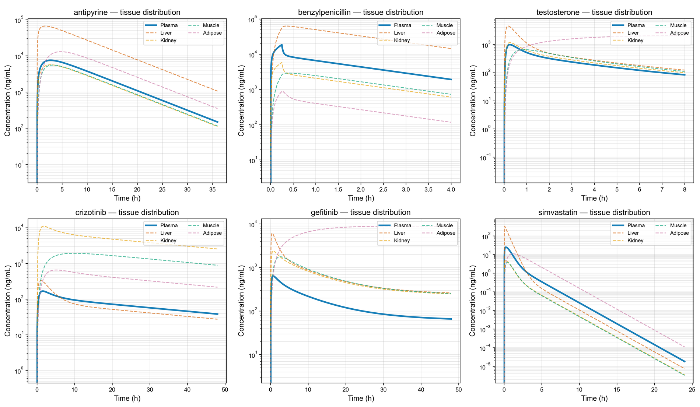
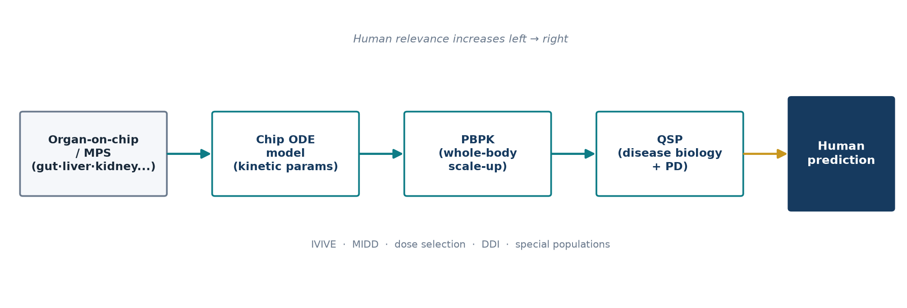
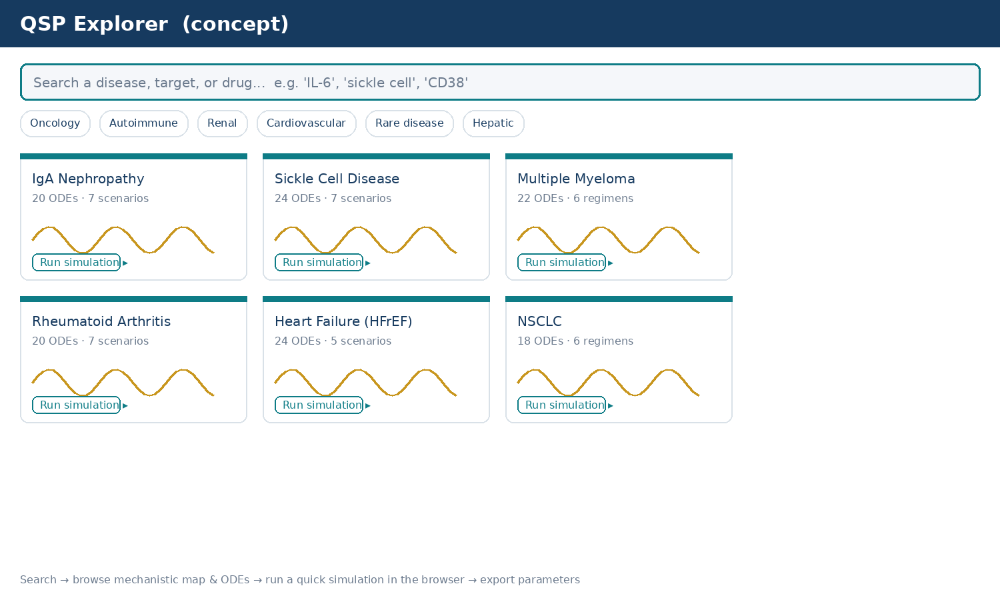

## Roadmap

[KBCS 2026 · Medical Unmet Needs for BioChips]{.kicker}

> A clinician's view: organs-on-chips generate beautiful human cell biology — but a chip reading only becomes **decision-grade evidence** once it is carried, quantitatively, into a human dose and a human patient.

1. **The unmet need** — why conventional preclinical systems keep failing translation
2. **The missing layer** — clinical pharmacology as the bridge from chip signal to human prediction
3. **Case study** — our Gut–Liver–Kidney MPS + PBPK platform, in full
4. **Our effort** — a 258-model open QSP library, built for *you* to use
5. **Where this goes** — a browser-based PBPK/QSP platform

## Why a clinician is standing here

:::: {.columns}
::: {.column width="60%"}
- I am **not** a chip engineer — I am a **clinical pharmacologist and physician**, treating patients and running early-phase trials at Seoul St. Mary's Hospital
- My daily question is the mirror image of yours: *"Given this human biology, what dose, and for whom?"*
- Organs-on-chips are, to me, a new **source of human-relevant data** — but data alone does not answer a dosing question
- This talk is about the **translational layer** that turns a chip curve into a clinical answer
:::
::: {.column width="40%"}
> **Sungpil Han, MD, PhD**
> Associate Professor
> Dept. of Pharmacology &
> Dept. of Clinical Pharmacology & Therapeutics
> The Catholic University of Korea
> Seoul St. Mary's Hospital · PIPET
:::
::::

## The translational gap that motivates this talk

:::: {.columns}
::: {.column width="55%"}
- Drug development's attrition is driven largely by preclinical systems that cannot predict human **PK, efficacy, and toxicity**
- **2D cell cultures** — no tissue architecture, no organ-level function
- **Animal models** — persistent interspecies differences in drug disposition
- The result: a durable gap between preclinical findings and clinical outcomes
:::
::: {.column width="45%"}
[~90%]{.bignum}<br>
[clinical-phase attrition]{.muted}

<br>

[10–15 yr / \$1–2.6B]{.bignum style="font-size:1.3em"}<br>
[time & cost per approved drug]{.muted}
:::
::::

[DiMasi et al., *J Health Econ* 2016; Kola & Landis, *Nat Rev Drug Discov* 2004.]{.fineprint}

## Who Phase 1 leaves behind

Healthy-volunteer Phase 1 trials characterize exposure well — **for healthy volunteers**. Exposure remains poorly characterized in exactly the patients who need it most:

[IBD]{.chip} · [Acute kidney injury]{.chip} · [Hepatic impairment]{.chip} · [Pregnancy]{.chip} · [Pediatric]{.chip} · [Rare disease]{.chip}

[This is precisely where a human-relevant, disease-state-capable platform — an organ-on-chip — has something a healthy-volunteer trial structurally cannot provide.]{.lead}

## Organs-on-chips: the promise

Microphysiological systems (MPS) reconstitute the structural and functional units of human organs under physiologically relevant mechanical and biochemical conditions — a genuinely **human-relevant** platform to interrogate drug behavior *before* first-in-human studies.

But a raw concentration-time curve from a chip well is a **descriptive** observation. The question this talk answers:

> How do we turn organs-on-chips from **descriptive in vitro tools** into **quantitative, decision-grade evidence** for drug development?

## The missing layer: clinical pharmacology

:::: {.columns}
::: {.column width="50%"}
**What a chip gives you**

- concentration-time profiles
- single-organ or multi-organ (body-on-a-chip) readouts
- a mechanistically rich, human-cell signal
:::
::: {.column width="50%"}
**What a dosing decision needs**

- clearance, tissue distribution, target engagement
- a **whole human body**, not a chip well
- an answer for *this* patient, not *a* cell culture
:::
::::

[Non-compartmental analysis + mechanistic PK-PD modeling is the bridge — enabling in vitro-to-in vivo extrapolation (**IVIVE**) of exactly these quantities.]{.lead}

## PBPK — scaling the chip to a human body

**Physiologically based pharmacokinetics (PBPK)** couples chip-derived parameters to a compartmental representation of human physiology (organ volumes, blood flows, tissue partitioning), turning a microfluidic measurement into a **whole-body human exposure prediction**.

- supports **first-in-human dose selection**
- supports **drug–drug interaction** evaluation
- supports **exposure projection in special populations** the chip itself modeled (disease-state chips → disease-state humans)

## QSP — adding the disease and the pharmacology

PBPK answers "where does the drug go and at what concentration." **Quantitative Systems Pharmacology (QSP)** answers the next question: *given that concentration, what happens to the disease?*

- couples PK to **receptor/pathway engagement**, **biomarker dynamics**, and **clinical endpoints**
- lets a chip-measured perturbation (e.g. a cytokine, a transporter shift) propagate all the way to a **disease trajectory**
- this is where your chip's biology — an inflamed gut, an injured liver, a cytokine signature — becomes a **testable clinical hypothesis**

[Chip → PBPK → QSP is a single continuous translational chain, not three separate tools.]{.lead}

## Regulatory tailwind: this is no longer a fringe idea

:::: {.columns}
::: {.column width="55%"}
- **FDA Modernization Act 2.0** explicitly opens the door to New Approach Methodologies (NAMs) — including MPS — in place of some animal studies
- Model-Informed Drug Development (**MIDD**) is an established regulatory pathway that already expects PBPK/QSP-grade quantitative packages
- Integrating MPS data into an MIDD-style workflow is the credible route to regulatory acceptance — not a purely descriptive poster figure
:::
::: {.column width="45%"}
> Positioning organs-on-chips within an established clinical-pharmacology / pharmacometric workflow reframes microphysiological data as a **translational bridge**: less animal testing, faster candidate selection, more reliable human dose and response prediction.
:::
::::

## Prerequisites for credible quantitative interpretation

Before a chip number can be trusted inside a PBPK/QSP model, four things must be checked — this is where most naïve chip-to-human extrapolations break:

1. **Chip-specific drug behavior** — absorption/adsorption to plastics and membranes, non-specific binding
2. **Scaling of cellular and fluidic dimensions** — cells-per-chip vs. cells-per-organ, correct per-organ scaling factors
3. **Verification against clinical data** — held-out clinical observations, not just internal consistency
4. **Explicit, falsifiable correction rules** — not ad hoc curve-fitting to make numbers match

[The case study that follows was built exactly to test whether this discipline is achievable in practice.]{.lead}

## Case study {visibility="uncounted"}

## Gut–Liver–Kidney MPS + mechanistic PBPK

A patient-free, quantitative route to human PK — validated against clinical data the model never saw.

```{=html}
<div class="stat-grid">
  <div class="stat-card"><div class="n">6</div><div class="l">drugs</div></div>
  <div class="stat-card"><div class="n">24</div><div class="l">clinical observations</div></div>
  <div class="stat-card"><div class="n">1.85×</div><div class="l">AUC GMFE (overall)</div></div>
  <div class="stat-card"><div class="n">100%</div><div class="l">within 4-fold</div></div>
  <div class="stat-card"><div class="n">0</div><div class="l">clinical PK used to fit</div></div>
  <div class="stat-card"><div class="n">2</div><div class="l">disease-state chip arms</div></div>
</div>
```

[No human PK data enters the prediction — all 24 clinical observations are reserved for post-hoc validation only.]{.fineprint}

## Platform overview

{width="95%"}

## Method ① — chip ODE model: chip readout → kinetic parameters

Drug-specific concentration–time data from the gut–liver–kidney chip (hiEC–HepaRG–RPTEC, shared media recirculation) are fitted with a **33-state ODE system** closing the recirculating loop: parent drug (17 states — PDMS adsorption, reservoir, basolateral/membrane/EPC/apical per organ, interconnects, plasma-return) plus a mirror 16-state metabolite sub-system. Hepatic EPC dynamics use $K_{puu,hep}$ on the membrane↔EPC driving force to capture OATP-style concentrative uptake.

$$PS = P_{app,EPC} \times SA \times 3600 \qquad CL_{int,chip} = CL_{int,init} \times \frac{MPPGL}{HPGL} \times N_{cells} \times 60$$

[Chip-fitted outputs → PBPK inputs: $P_{app,gut/hep/renal}$, $CL_{int,hep,chip}$, $K_{puu,hep,chip}$, $CL_{sec,renal,chip}$, intestinal efflux ratio.]{.fineprint}

## Method ② — whole-body PBPK

**10-state perfusion-limited PBPK** (lung, heart, brain, muscle, adipose, skin, gut, liver, kidney, rest), with an optional 11-state **permeability-limited liver** for OATP substrates.

- tissue partition coefficients ($K_p$): **Rodgers–Rowland** (acids/bases/neutrals/zwitterions) + **Schmitt 2008** lysosomal ion-trapping for basic lipophiles
- hepatic clearance: **Varma extended-clearance** formulation (passive $PS_{dif}$ + active $PS_{inf}$ implicit in chip-measured $K_{puu,liver}$)
- intestinal first-pass: **Yang $Q_{gut}$**; oral absorption: **ACAT 7-segment** with chip-measured gut-wall P-gp efflux
- physiology: Brown 1997; solved with `scipy.solve_ivp`/LSODA — full 6-drug/24-observation run **&lt;5 min on a laptop**

## Method ③ — the chip→PBPK bridge and a falsifiable scaling rule

Per-cell → whole-organ scaling (HPGL, PTCPGK, $N_{ent,total}$) is literature-anchored, but *in vitro* metabolic activity is well known to under-represent *in vivo* activity. Rather than a blanket correction, we apply it **only** when a falsifiable three-criterion test is met:

> **Apply $RAF_{CYP3A4}$ iff all three hold:**
> (i) $f_{m,CYP3A4} \ge 0.90$ (CYP3A4-dominant) · (ii) $CL_{bile,frac} < 0.50$ (no biliary compensation) · (iii) $K_{puu,liver} < 3$ (uptake not already captured)

[$RAF_{CYP3A4}=15$ (high-E) or 10 (moderate+biliary); $RAF_{OAT}=7$ (renal). Simvastatin ($K_{puu,liver}=9.96$) is already $K_{puu}$-captured → no RAF. **Uniform RAF → GMFE 9.7×; selective per-rule → 1.85×** — a >5× improvement by mechanism, not fitting.]{.fineprint}

## Methods ④ + ⑤ — inputs, validation, and disease-state extension

:::: {.columns}
::: {.column width="50%"}
**④ Drug-specific inputs & validation**

- inputs are physchem only: logP, $pK_a$, $f_{u,p}$, blood:plasma ratio, MW, dose, route
- **no clinical PK enters the prediction** — all 24 observations (4 published studies × 6 drugs, 3–6-fold dose range each) are reserved for **post-hoc** validation
:::
::: {.column width="50%"}
**⑤ Disease-state extension**

- chips re-fitted under **DSS** (gut injury) and **cisplatin** (renal/hepatic injury)
- unaffected-organ parameters **locked** at healthy-chip values
- chip-measured shifts propagate through the **identical PBPK pipeline** — no re-parameterization
:::
::::

## Result 1 — healthy subjects: 24 observations, 6 drugs

```{=html}
<div class="stat-grid">
  <div class="stat-card"><div class="n">1.85×</div><div class="l">AUC GMFE (overall)</div></div>
  <div class="stat-card"><div class="n">100%</div><div class="l">within 4-fold (24/24)</div></div>
  <div class="stat-card"><div class="n">62.5%</div><div class="l">within 2-fold (15/24)</div></div>
</div>
```

| Drug | Mechanism | Dose | AUC GMFE | 2-fold | 4-fold |
|---|---|---|---|---|---|
| Antipyrine | CYP1A2, low E | 500–1200 PO | 1.59× | 4/4 | 4/4 |
| Benzylpenicillin | OAT1/3 renal | 360–1200 IV | 1.23× | 4/4 | 4/4 |
| Testosterone | CYP3A4 high-E + SHBG | 40–200 PO | 1.98× | 2/4 | 4/4 |
| Crizotinib | CYP3A4 high-E + biliary | 100–300 PO | 2.61× | 1/4 | 4/4 |
| Gefitinib | CYP3A4 + biliary-dominant | 150–500 PO | 2.93× | 0/4 | 4/4 |
| Simvastatin | OATP1B1 + CYP3A4 | 20–80 PO | 1.37× | 4/4 | 4/4 |
| **Overall (n=24)** | | | **1.85×** | **15/24** | **24/24** |

[Performance falls within the 2–5× GMFE benchmark of industry-standard PBPK platforms.]{.fineprint}

## Result 1 — dose–exposure scaling across all six drugs

{width="88%"}

## Supporting — full concentration-time profiles

{width="88%"}

## Supporting — whole-body tissue distribution

{width="88%"}

## Result 2 — disease-state chips predict *exposure shifts*

The **identical PBPK pipeline** (no re-parameterization) applied to two disease-state chip arms:

```{=html}
<div class="stat-grid">
  <div class="stat-card"><div class="n">0.49×</div><div class="l">gefitinib AUC under DSS colitis (gut-driven)</div></div>
  <div class="stat-card"><div class="n">2.19×</div><div class="l">simvastatin AUC under cisplatin injury (hepatic-driven)</div></div>
  <div class="stat-card"><div class="n">2 sites</div><div class="l">platform distinguishes gut vs. hepatic localization</div></div>
</div>
```

[Clinical implication: standard-dose gefitinib may be sub-therapeutic in IBD-comorbid NSCLC; simvastatin + cisplatin combination warrants a prospective PK study (rhabdomyolysis risk).]{.lead}

## Result 2 — where the exposure shift localizes

{width="82%"}

## Where the platform still needs work

| Chip measurement | Limitation | Correction used | Experimental fix |
|---|---|---|---|
| $P_{app}$ gut/liver/kidney | No mucus/peristalsis layer | &lt;2× on $F_a$ | Engineered mucus + mechanical stretch |
| $CL_{int,hep,chip}$ | HepaRG 2D CYP3A4 ~10% of in vivo | RAF 10–15 (Kvist 2018) | Spheroid HepaRG / primary hepatocyte |
| $K_{puu,liver}$ | Can't decompose $PS_{inf}$/$PS_{dif}$ | Varma 2015 simplification | Parallel primary hepatocyte OATP assay |
| $CL_{sec,renal}$ | RPTEC OAT1/3 ~1% of in vivo | Mathialagan 2017 PTC anchor | iPSC proximal tubule / OAT-transduced RPTEC |
| Disease-state shifts | Sparse clinical PK in patients | Direction-of-effect vs. literature | Prospective clinical PK in IBD/AKI cohorts |

## Case study — conclusions

- **Bottom-up MPS-PBPK** predicts human AUC within **4-fold for 100% of 24 clinical observations** across mechanistically diverse drugs — using **no human PK input**
- The **three-criterion mechanism-aware RAF rule** converts an ambiguous scaling decision into an objective, falsifiable test (uniform 9.7× → selective **1.85×** GMFE)
- The same pipeline distinguishes **gut- vs. hepatic-localized** exposure shifts in disease-state chips — hypothesis-generating for IBD- and AKI-comorbid patients normally excluded from Phase 1
- **Open-source Python**; a full six-drug simulation runs in &lt;5 minutes on a laptop

[This work augments, not replaces, animal/clinical PK — a quantitative, patient-free route where prospective clinical PK is difficult to obtain.]{.lead}

## Our effort {visibility="uncounted"}

## From chip data to human relevance — closing the loop

The case study shows the *mechanism*: PBPK and QSP are what let chip-generated data acquire **human relevance** and translate into genuinely better **human prediction** — not just for one platform, but as a general discipline every MPS program can adopt.

{width="92%"}

## Our effort: a 258-model open QSP library

To make this discipline immediately usable — not theoretical — my group has spent the past year building an **open, standardized library of QSP models**, one disease at a time, largely through an autonomous LLM-assisted pipeline.

```{=html}
<div class="stat-grid">
  <div class="stat-card"><div class="n">258</div><div class="l">disease QSP models</div></div>
  <div class="stat-card"><div class="n">~18</div><div class="l">therapeutic areas</div></div>
  <div class="stat-card"><div class="n">259</div><div class="l">mrgsolve ODE systems</div></div>
  <div class="stat-card"><div class="n">~3,100</div><div class="l">pathway clusters</div></div>
  <div class="stat-card"><div class="n">~12,800</div><div class="l">PubMed references</div></div>
  <div class="stat-card"><div class="n">+1 / day</div><div class="l">and still growing</div></div>
</div>
```

## What's inside each model

Every model in the library ships four consistent, literature-grounded deliverables:

- 🗺️ a **mechanistic map** (Graphviz; pathway → target → disease)
- ⚙️ an **mrgsolve ODE model** (drug PK coupled to disease PD; 15–35+ states)
- 📊 an interactive **Shiny dashboard** (patient profile, PK, endpoints, scenarios)
- 📚 **~50 curated references** per model, anchoring every parameter

[The same structure your chip data needs to plug into: PK states, PD states, and a disease trajectory.]{.lead}

## How this helps *your* chip program, directly

:::: {.columns}
::: {.column width="55%"}
- Working on a **cytokine**, a **transporter**, a **receptor**, or a **disease** your chip models? There is very likely already a QSP model of it in this library — mechanistic map, ODEs, and drugs included
- Use it to **generate a research hypothesis** before you run the chip experiment
- Use it as a **PD/disease layer** to attach on top of your own chip → PBPK bridge, exactly as in the case study
:::
::: {.column width="45%"}
> No one expects you to run all 258 complex models. The goal is that this library becomes a platform that **dramatically accelerates the translation** of the molecules, drugs, cytokines, and diseases *you* already work on.
:::
::::

## The gallery — a fraction of the library

{width="86%"}

## Fully open — every line of code

```{=html}
<div style="display:flex; align-items:center; gap:40px; justify-content:center; margin-top:10px;">
  
  <div style="max-width:520px;">
    <p style="font-size:1.15em;"><b>github.com/pipetcpt/qsp</b></p>
    <p>Every mechanistic map, every ODE model, every Shiny dashboard, every reference list — <b>openly versioned</b>, one commit at a time.</p>
    <p class="lead">Clone it, run a model, adapt it to your chip's biology, or simply browse for ideas.</p>
  </div>
</div>
```

## Where this goes: a browser-based PBPK/QSP platform

Complex ODE systems are a real barrier to adoption. My future goal is a **web platform** where any researcher can, from a browser alone:

- **search** by disease, target, drug, or cytokine
- **browse** the mechanistic map and the ODE structure without installing anything
- run a **simple simulation** — a dose, a parameter tweak, an instant plot
- export parameters directly into their own PBPK/QSP or chip-bridge workflow

{width="78%"}

## Conclusion & an open invitation

:::: {.columns}
::: {.column width="60%"}
- Organs-on-chips generate genuinely human-relevant biology — but need **clinical pharmacology (NCA, PBPK, QSP)** to become decision-grade, human-predictive evidence
- Our Gut–Liver–Kidney case study shows this is achievable **without clinical PK input**, and extends to disease-state chips
- Our **258-model open QSP library** exists specifically so the NAMs/MPS community can adopt this discipline immediately, not build it from scratch
:::
::: {.column width="40%"}
[This project is completely open. If you are building an organ-on-chip and want a PBPK/QSP bridge — or a disease model to build toward — **I would love to collaborate.**]{.lead}

**Sungpil Han, MD, PhD**
shan@catholic.ac.kr
:::
::::

## Selected references {.smaller}

::: {style="columns:2; column-gap:2em; font-size:0.62em; line-height:1.5;"}
Kola I & Landis J. *Nat Rev Drug Discov* 3, 711–715 (2004).

Huh D et al. *Science* 328, 1662–1668 (2010).

Bhatia SN & Ingber DE. *Nat Biotechnol* 32, 760–772 (2014).

Low LA et al. *Nat Rev Drug Discov* 20, 345–361 (2021).

Tsamandouras N et al. *AAPS J* 19, 1499–1512 (2017).

Edington CD et al. *Sci Rep* 8, 4530 (2018).

Kuepfer L et al. *CPT Pharmacometrics Syst Pharmacol* 5, 516–531 (2016).

Varma MV et al. *Pharm Res* 32, 3785–3802 (2015).

Guillouzo A et al. *Chem Biol Interact* 168, 66–73 (2007).

Mathialagan S et al. *Drug Metab Dispos* 45, 409–417 (2017).

Rodgers T & Rowland M. *J Pharm Sci* 95, 1238–1257 (2006).

Yang J et al. *Curr Drug Metab* 8, 676–684 (2007).

DiMasi JA et al. *J Health Econ* 47, 20–33 (2016).
:::

## Acknowledgements & data availability

- Chip experiments performed in collaboration with research partners at the Catholic University of Korea, Hongik University, and Danin-Bio
- Open-source Python implementation (NumPy / SciPy); input CSVs and simulation outputs released at publication
- Full six-drug, 24-observation prediction is reproducible in **&lt;5 minutes** on a laptop
- The 258-model QSP library is openly available at **github.com/pipetcpt/qsp**

## Contact

:::: {.columns}
::: {.column width="60%"}
**Sungpil Han, M.D./Ph.D.** — Associate Professor

Dept. of Pharmacology, College of Medicine, The Catholic University of Korea<br>
Dept. of Clinical Pharmacology & Therapeutics, The Catholic University of Korea, Seoul St. Mary's Hospital<br>
PIPET (Pharmacometrics Institute for Practical Education & Training)

222 Banpodaero, Seocho-gu, Seoul, Korea (06591)

Email: **shan@catholic.ac.kr**<br>
Phone: +82-2-3147-8356 · Mobile: +82-10-6782-0522 · FAX: +82-2-2258-7876
:::
::: {.column width="40%"}
{width="55%"}

[github.com/pipetcpt/qsp]{.fineprint}

**Thank you — questions and collaborators welcome.**
:::
::::
