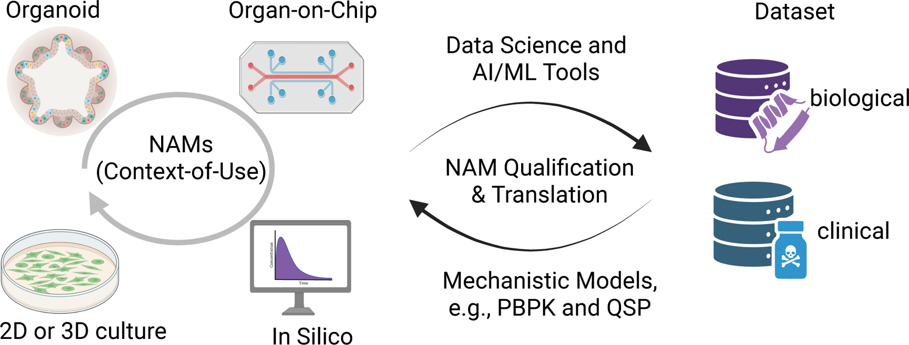
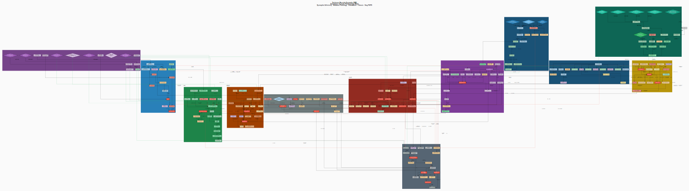
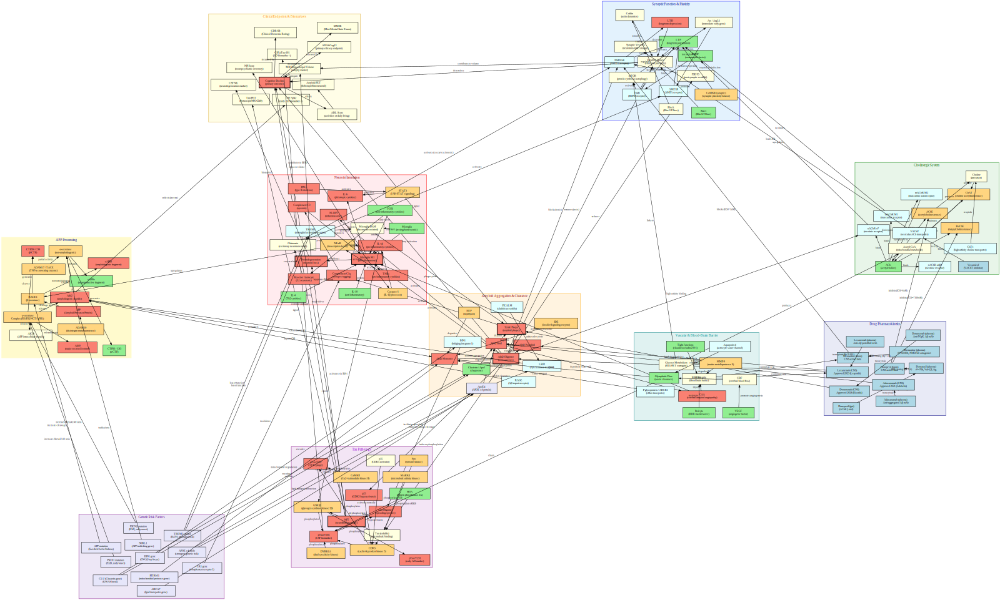

## Roadmap

[KBCS 2026 · Medical Unmet Needs for BioChips]{.kicker}

- **미충족 수요와 규제 흐름 (Unmet need & regulatory shift)** — 전임상 시스템이 왜 계속 번역에 실패하는지, FDA가 어떻게 NAM 쪽으로 무게중심을 옮기는지
- **임상약리학 (Clinical pharmacology)** — PBPK와 QSP가 그 다리가 되는 방식
- **저희의 엔진 (Our engine)** — LLM 기반의 자율적이고 개방된 QSP 라이브러리 (258개 질환, 계속 증가 중)
- **사례 연구 (Case studies)** — 열두 가지 통찰과 여섯 가지 심층 사례, 실제 배포된 앱(Merigolix) 포함
- **저희의 organ-chip 연구** — 장–간–신장 MPS + PBPK, 압축 요약
- **다음 단계와 제안 (Where this goes)** — 브라우저 기반 플랫폼, 그리고 이 학회에 드리는 제안

## The unmet need: why preclinical systems fail translation

| Metric | Value |
|---|---|
| Clinical-phase attrition | ~90% |
| Time per approved drug | 10–15 years |
| Cost per approved drug | $1–2.6 billion |

- **2차원 세포배양** — 조직 구조도, 장기 수준의 기능도 재현하지 못함
- **동물 모델** — 종간 약물동태 차이가 여전히 남아 있음
- **1상 임상시험**은 건강한 지원자의 노출은 잘 특성화하지만, 정작 가장 불확실한 환자군은 대부분 제외됨: [IBD]{.chip} [AKI]{.chip} [Hepatic impairment]{.chip} [Pregnancy]{.chip} [Pediatric]{.chip} [Rare disease]{.chip}

[DiMasi et al., *J Health Econ* 2016; Kola & Landis, *Nat Rev Drug Discov* 2004.]{.fineprint}

## The regulatory shift: from an animal mandate to NAMs

- 1938년 FD&C법 이래, 신약을 사람에 쓰기 전 **동물시험을 거치도록 법으로 강제**되어 왔습니다
- **FDA Modernization Act 2.0 (2022)** — 법 조문의 "animal tests"를 "nonclinical tests"로 바꾸어, *in vitro*·*in silico* 방법도 명시적으로 허용
- **FDA's Roadmap to Reducing Animal Testing in Preclinical Safety Studies (2025)** — 단일클론항체부터 단계적으로 동물시험을 줄여, 장기적으로 "동물시험이 기본이 아니라 예외가 되는" 것을 목표로 제시
- 동물시험을 통과한 약물의 상당수가 사람 임상시험에서 실패한다는 반복된 관찰이 이 정책 전환의 핵심 근거

[FDA Modernization Act of 2022, Pub. L. 117–328; FDA, *Roadmap to Reducing Animal Testing in Preclinical Safety Studies* (2025); Van Norman GA, *JACC Basic Transl Sci* 4(7):845–854 (2019).]{.fineprint}

## Why this matters for organs-on-chips

- **FDA Modernization Act 2.0**은 MPS를 포함한 새로운 접근 방법론(NAM)이 일부 동물시험을 대체할 문을 열어두었습니다
- **MIDD**는 이미 PBPK/QSP 수준의 정량적 패키지를 요구하는 확립된 경로이며, MPS 데이터를 그 워크플로 안에 통합하는 것이 신뢰할 수 있는 규제 승인 경로입니다
- Organ-on-chip을 기존 임상약리학 워크플로 안에 위치시키면, 미세생리시스템 데이터가 동물시험을 줄이고 후보물질 선정을 앞당기는 **번역 다리**로 재정의됩니다

## The NAM translation loop — where clinical pharmacology sits

{width="90%"}

[**PBPK와 QSP 같은 기전 모델**이 이 순환 고리에서 NAM 신호를 임상적으로 의미 있는 증거로 자격을 부여하고 번역합니다 — AI/ML 패턴 매칭만으로는 대신할 수 없는, 인과적이고 용량-환산적인 연결입니다.]{.lead}

[Cao Y. New Approach Methodologies: What Clinical Pharmacologists Should Prepare For. *Clin Pharmacol Ther* 118(6):1269–1272 (2025).]{.fineprint}

## From a chip curve to a dosing decision

- **칩이 주는 것 (What a chip gives you):** 농도–시간 곡선, 단일 혹은 다장기 읽기 값, 사람 세포 기반의 기전적으로 풍부한 신호 — 사람 최초 투여 이전에 얻는 진짜 인간 유사 정보
- **용량 결정에 필요한 것 (What a dosing decision needs):** 청소율, 조직 분포, 표적 결합 — 칩 웰이 아니라 **사람 전신** 단위로 환산된 값
- 칩 곡선은 그 자체로는 **서술적 관찰**일 뿐이며, 기전 모델을 통과해야 비로소 용량에 대한 답이 됩니다

[**임상약리학 — NCA, PBPK, QSP —** 가 바로 그 다리이며, 오늘 발표 전체의 주제입니다.]{.lead}

## What is QSP & PBPK?

**PBPK**(생리학적 약동학)와 **QSP**(정량적 시스템 약리학)는 시스템 생물학과 약동·약력학을 결합해, 약물에서 환자로 이어지는 인과 사슬을 수학으로 기술합니다:

$$\textbf{drug} \;\rightarrow\; \textbf{target} \;\rightarrow\; \textbf{pathway} \;\rightarrow\; \textbf{disease} \;\rightarrow\; \textbf{patient}$$

- **PBPK**는 답합니다 — 약물이 사람 전신에서 어디로 가서 얼마나 되는가?
- **QSP**는 다음 질문에 답합니다 — 그 농도에서 질환에 무슨 일이 일어나는가?
- 이 둘을 합치면 통계만으로는 답할 수 없는 것에 답합니다: 용량 선택, 약물상호작용, 특수집단 반응, 칩 데이터의 IVIVE

## Anatomy of a PBPK/QSP model

수학적으로는 결합된 비선형 동역학계, 즉 초기값 문제입니다:

$$\frac{d\mathbf{x}}{dt} = \mathbf{f}\!\big(\mathbf{x}(t),\, \boldsymbol{\theta},\, \mathbf{u}(t)\big), \qquad \mathbf{x}(0)=\mathbf{x}_0$$

- **상태 변수 $\mathbf{x}$** — 약물 농도, 수용체 점유율, 신호전달 물질, 세포 집단, 바이오마커, 임상 종말점
- **파라미터 $\boldsymbol{\theta}$** — 속도상수, $EC_{50}$/$E_{max}$, Hill 계수 $n$, 청소율, 결합 친화도
- **입력 $\mathbf{u}(t)$** — 투여 요법: 우리가 조절할 수 있는 유일한 손잡이

[저희 라이브러리 모델: 질환당 **15–35개 이상의 결합 미분방정식**, **70–100개 이상의 파라미터**.]{.lead}

## The recurring nonlinear structures

질환이 달라도 반복되는 수학적 구조가 있습니다 — 모든 칩-사람 다리에서도 마찬가지입니다:

| Motif | Governing idea | Typical use |
|---|---|---|
| Hill / $E_{max}$ | $E(C) = E_{max}C^n / (EC_{50}^n + C^n)$ | any drug dose–response |
| Indirect response | $dR/dt = k_{in}f(\cdot) - k_{out}R$ | biomarker turnover |
| Mass-action / TMDD | drug–target binding, target-mediated clearance | mAbs, receptor-saturating drugs |
| Logistic growth | $dN/dt = rN(1-N/K) - kill(C)N$ | tumor burden under therapy |
| Power-law feedback | e.g. $EPO \propto (Hb_0/Hb)^{\gamma}$ | homeostatic feedback loops |

[258개 QSP 모델과 칩–PBPK 다리 양쪽 모두에서 등장하는 공통 문법입니다.]{.fineprint}

## Why this matters — Model-Informed Drug Development

| Stage | What PBPK/QSP contributes | Effect on attrition |
|---|---|---|
| Target validation | does target modulation reach the phenotype? | kills implausible targets early |
| First-in-human dose | exposure–response & safety margins from mechanism | safer, leaner Phase 1 |
| Trial design | virtual patients → enrichment, endpoints, sample size | higher trial success |
| Translation | chip→animal→human, adult→pediatric extrapolation | better external validity |
| Combinations | synergy/antagonism *in silico* | rational polypharmacy |

[규제기관(FDA/EMA)도 MIDD를 적극 지지합니다 — 이미 확립된 규제 경로이지, 새로운 개념이 아닙니다.]{.lead}

## The bottleneck: building one QSP model, traditionally

- 방대한 문헌 종합 — 병태생리와 약리학을 아우르는 심층 조사
- 미분방정식 수립, 파라미터화, 소프트웨어 구현, 보정까지 세심한 작업
- **비용: 질환당 전문가의 수개월에서 수년**

**결과 (Consequences):**

- 극소수 질환만 모델을 갖게 됨
- 모델은 닫혀 있고, 공개되지 않으며, 재현이 어려움
- 대부분의 질환 — 즉 대부분의 칩 프로그램이 다루는 질환 — 은 끝내 모델을 얻지 못함

[질환 하나 ≈ 전문가의 1인·수년. 희소하고, 느리고, 닫혀 있습니다.]{.lead}

## Thesis — LLM-augmented model generation

> **자율적인 LLM 코딩 에이전트**를 이용해, 품질이 통제되고 문헌 근거가 완비된 QSP 모델을 **하루에 한 질환** 속도로 만들고, 모든 산출물을 버전관리 아래 둡니다.

- 🗺️ Graphviz **기계론적 지도** · ⚙️ `mrgsolve` **ODE 모델** · 📊 **Shiny** 대시보드 · 📚 정리된 **참고문헌**
- 내장된 **품질 게이트**, 모든 파라미터의 **문헌 근거**
- 표준화된 스키마 → 비교·감사 가능; **재현 가능**: 코드 + 깃 기록

## The Claude Code Routine — an autonomous daily loop

스케줄 기반 코딩 에이전트입니다. **매 실행마다 질환 하나를 처음부터 끝까지 완성해 푸시합니다:**

1. **선택 (Select)** — 다루지 않은 질환 고르기 (카테고리 순환)
2. **조사 (Research)** — 약 50편의 PubMed 문헌 종합
3. **지도 (Map)** — Graphviz 네트워크 (≥100 노드)
4. **모델 (Model)** — `mrgsolve` ODE (≥15 구획)
5. **대시보드 (Dashboard)** — Shiny (≥6 탭)
6. **근거 (Ground)** — 구획별 참고문헌 (≥30편)
7. **커밋 & 푸시** — 세션을 어중간하게 끝낼 수 없게 만드는 깃 정지 훅 아래 자동 실행

## Guardrails — why trust code an LLM wrote

- **품질 게이트(최소 기준):** 지도 ≥100노드/≥8클러스터 · ODE 모델 ≥15구획/≥5시나리오 · 대시보드 ≥6탭 · 참고문헌 ≥30편
- **구조적 템플릿:** Hill, turnover, TMDD 같은 재사용 가능한 ODE 모티프가 "잘못될 여지"를 줄임
- **문헌 근거:** 모든 파라미터 세트에 임상시험을 인용한 보정 메모가 붙음 — 환각을 막는 핵심 장치
- **재현성과 검토:** 모든 것이 깃 안의 diff 가능·감사 가능·재실행 가능한 코드; 사용 전 사람의 검토

## Why an LLM/AI is the right engine

- **지치지 않고 연속적** — 여러 산출물로 이루어진 질환 모델을 거의 매일 하나씩, 어떤 사람 팀도 지속하지 못하는 속도
- **방대한 문헌 종합** — 약 12,800편의 인용 통합 (모델당 ~50편)
- **폭(Breadth)** — 258개 질환과 수백 가지 약물/표적을 하나의 일관된 틀로
- **일관성** — 동일한 스키마와 품질 기준 → 비교·재사용 가능
- **경제성** — 전문가의 수개월 → 수 시간

[희소한 자원은 모델링 전문성입니다. LLM은 그것을 **확장(scale)**합니다.]{.lead}

## What's inside each model

- 🗺️ **기계론적 지도** — 경로에서 표적, 질환으로 이어지는 클러스터형 방향 그래프
- ⚙️ **`mrgsolve` ODE 모델** — 컴파일된 C++ 솔버; 약물 PK와 질환 PD 결합; 15–35개 이상 상태변수, ≥5 시나리오
- 📊 **Shiny 대시보드** — 환자 프로파일, PK, 병태생리, 종말점, 시나리오 비교, 바이오마커 (6–8 탭)
- 📚 모델당 **약 50편의 정리된 참고문헌**, 모든 파라미터의 근거

[이것이 바로 여러분의 칩 데이터가 연결되어야 할 구조입니다.]{.lead}

## Scale: a 258-model open QSP library

| Metric | Value |
|---|---|
| Disease QSP models | 258 |
| Therapeutic areas | ~18 |
| `mrgsolve` ODE systems | 259 |
| Pathway clusters | ~3,100 |
| PubMed references | ~12,800 |
| New models added | +1 / day |

[전통적 QSP: 손에 꼽는 질환에 전문가 수개월씩. 이 라이브러리: 258개 질환에 각각 몇 시간 — 점진적 개선이 아니라 단계의 도약입니다.]{.lead}

## Breadth of coverage

[Oncology]{.chip} [Autoimmune/rheumatic]{.chip} [Vasculitis]{.chip} [Cardiovascular]{.chip} [Respiratory]{.chip} [Renal/urologic]{.chip} [GI/hepatobiliary]{.chip} [Endocrine/metabolic]{.chip} [Neurologic]{.chip} [Psychiatric]{.chip} [Dermatologic]{.chip} [Infectious]{.chip} [Ophthalmic]{.chip} [Rare/genetic]{.chip}

- **암종 (Cancers)** — 유방암, 비소세포폐암, 소세포폐암, 교모세포종, 만성골수성백혈병, 다발골수종, 흑색종, 췌장암…
- **희귀·유전질환** — 파브리병, 고셔병, 뒤센 근이영양증, 척수성 근위축증, 헌팅턴병, 트랜스티레틴 아밀로이드증…
- **흔한 만성질환** — 당뇨, 심부전, 만성폐쇄성폐질환, 만성신장병…
- **면역·혈액질환** — 루푸스, 류마티스 관절염, 겸상적혈구병, 면역혈소판감소증, 골수섬유증…

[수백 가지 약물과 분자 표적 — 여러분의 칩과 관련된 것이 있을 가능성이 매우 높습니다.]{.lead}

## Case studies: drugs · targets · modeled endpoints {.smaller}

A single framework already spans dozens of drug classes and mechanisms of action:

| Disease | Drug (example) | Target / mechanism | Modeled endpoint |
|---|---|---|---|
| Rheumatoid arthritis | tocilizumab | IL-6 receptor | DAS28 · CRP |
| Psoriasis | secukinumab | IL-17A | PASI |
| Type 2 diabetes | semaglutide | GLP-1 receptor | HbA1c · weight |
| Heart failure (rEF) | sacubitril/valsartan | neprilysin + AT₁ (ARNI) | LVEF · NT-proBNP |
| COPD | triple therapy (ICS/LABA/LAMA) | β2/M3/glucocorticoid receptors | FEV1 · exacerbation rate |
| Non-small-cell lung cancer | osimertinib | mutant EGFR | tumor burden |
| Chronic myeloid leukemia | imatinib | BCR-ABL | BCR-ABL transcript ratio |
| Pulmonary arterial HTN | macitentan | endothelin A/B receptor | PVR · 6-min walk |
| IgA nephropathy | sparsentan | endothelin-A + AT₁ | UPCR · eGFR |
| Sickle cell disease | voxelotor | HbS–O₂ affinity | Hb · hemolysis |
| Multiple myeloma | daratumumab | CD38 (TMDD) | M-protein |
| Endometriosis | Merigolix (GnRH antagonist) | GnRH receptor | pain · lesion size |

[Every drug–target–endpoint link is grounded in the trial literature.]{.fineprint}

## Case studies — one modeling insight each (1/4)

:::: {.columns}
::: {.column width="33%"}
**NSCLC — EGFR resistance**

Osimertinib 내성 클론(T790M/C797S)의 출현 시점을 모델링해 병용·순차 치료 전략의 근거를 제공합니다.
:::
::: {.column width="33%"}
**HFrEF — GDMT sequencing**

ARNI·β차단제·MRA·SGLT2 억제제의 투여 순서와 증량 속도를 역재형성(LVEF, NT-proBNP)과 견주어 탐색합니다.
:::
::: {.column width="33%"}
**ATTR amyloidosis — gene silencing**

유전자 침묵 치료(patisiran/vutrisiran)의 사량체–단량체 동역학과 수년에 걸친 신경·심장 부담을 추적합니다.
:::
::::

## Case studies — one modeling insight each (2/4)

:::: {.columns}
::: {.column width="33%"}
**SLE — type-I interferon**

Anifrolumab(항IFNAR)이 인터페론 신호를 억제하는 사슬을 연결: IFN → 자가항체 → 재발 위험(SLEDAI).
:::
::: {.column width="33%"}
**T2DM — incretin axis**

Tirzepatide(GLP-1/GIP)의 포도당–인슐린–체중 되먹임 고리를 통해 HbA1c와 체중 궤적을 봅니다.
:::
::: {.column width="33%"}
**ITP — platelet kinetics**

TPO 수용체 작용제 대 항혈소판 항체: 생성과 파괴의 균형을 통해 혈소판 회복을 봅니다.
:::
::::

## Case studies — one modeling insight each (3/4)

:::: {.columns}
::: {.column width="33%"}
**Osteoporosis — transient uncoupling**

Romosozumab(항경화소단백질): 첫 12개월의 일시적 골형성 우위 구간이 닫히기 전, 항흡수제로 전환하는 시점이 중요합니다.
:::
::: {.column width="33%"}
**Migraine — occupancy, not concentration**

Erenumab(항CGRP수용체): 느린 청소율이 월 1회 투여에도 수용체 점유율을 유지해, 혈중 농도보다 편두통일수 감소와 더 잘 맞아떨어집니다.
:::
::: {.column width="33%"}
**Atopic dermatitis — dual blockade**

Dupilumab(항IL-4Rα)이 IL-4·IL-13을 동시에 차단: 바이오마커(IgE, TARC)는 일찍, EASI 반응은 늦게 나타납니다.
:::
::::

## Case studies — one modeling insight each (4/4)

:::: {.columns}
::: {.column width="33%"}
**Hemophilia A — a PD readout that lies**

Emicizumab(이중특이 FVIIIa 모방항체)은 aPTT를 실제 지혈 효과보다 훨씬 과장되게 단축시켜, 모델링으로 트롬빈 생성량과 실제 출혈률 감소를 다시 연결해야 합니다.
:::
::: {.column width="33%"}
**Myasthenia gravis — clearance vs. symptom lag**

Efgartigimod(FcRn 길항제)은 IgG를 수일 내 약 60%까지 낮추지만, MG-ADL 개선은 그보다 지연되어 주기적 투여 전략을 뒷받침합니다.
:::
::: {.column width="33%"}
**Gout — when the drug beats itself**

Pegloticase는 초기엔 요산을 잘 분해하지만, 항약물항체 누적이 반응 소실을 예측하게 해줍니다.
:::
::::

## Deep dive — IgA nephropathy: the "four-hit" cascade

:::: {.columns}
::: {.column width="40%"}
:::: {.deepdive-fig}

::::
:::
::: {.column width="60%"}
- 갈락토스 결핍 IgA1 → 자가항체 → 면역복합체 → 메산지움 침착과 보체 활성화 → 단백뇨, eGFR 저하로 이어지는 "네 단계" 가설
- **적용 약물 (Drugs modeled):** RAAS blockade · budesonide-TRF (gut B cells/APRIL) · sparsentan (dual ETA+AT₁) · iptacopan (complement factor B) · sibeprenlimab (anti-APRIL)
- **평가지표 (Endpoints):** UPCR, eGFR slope — NefIgArd·PROTECT·APPLAUSE-IgAN로 보정
- ODE 20개 · 시나리오 7개
:::
::::

## Deep dive — sickle cell disease: polymerization to vaso-occlusion

:::: {.columns}
::: {.column width="40%"}
:::: {.deepdive-fig}

::::
:::
::: {.column width="60%"}
- 탈산소 HbS의 중합 → 겸상화·용혈 → 유리 Hb의 NO 소모 → 내피 활성화, P-selectin 부착 → 혈관폐색성 발작
- **적용 약물:** hydroxyurea (HbF induction) · voxelotor (HbS–O₂ affinity) · crizanlizumab (anti-P-selectin) · L-glutamine
- **평가지표:** Hb, HbF%, 혈관폐색 빈도, LDH — MSH·HOPE·SUSTAIN로 보정
- ODE 24개; 거듭제곱 조혈 되먹임 포함
:::
::::

## Deep dive — multiple myeloma: an oncology exemplar

:::: {.columns}
::: {.column width="40%"}
:::: {.deepdive-fig}

::::
:::
::: {.column width="60%"}
- 골수 형질세포 클론의 M단백 분비, IL-6 자가분비 성장, RANKL/OPG/DKK1 불균형에 의한 골 질환
- **적용 약물:** bortezomib/carfilzomib (proteasome) · lenalidomide (cereblon) · daratumumab (anti-CD38, **TMDD**) · venetoclax (BCL-2) · zoledronate (bone)
- **평가지표:** M-protein, free light chains — VRd/DRd/KRd/DVRd 병용요법으로 추적
- 로지스틱 성장 + 내성 클론 + TMDD, 골 재형성 ODE와 결합
:::
::::

## Deep dive — rheumatoid arthritis: IL-6/TNF/JAK-driven synovitis

:::: {.columns}
::: {.column width="40%"}
:::: {.deepdive-fig}

::::
:::
::: {.column width="60%"}
- 활막의 IL-6/TNF/JAK 신호 → pannus 형성 → 연골·골 미란; CRP는 IL-6 트랜스시그널링을 반영하는 급성기 지표
- **적용 약물:** methotrexate (antifolate) · tocilizumab (anti-IL-6R, TMDD) · adalimumab (anti-TNF) · baricitinib (JAK1/2 inhibitor)
- **평가지표:** DAS28, CRP, bone erosion — 단독·병용요법으로 추적
- ODE 19개 · 시나리오 7개
:::
::::

## Deep dive — Duchenne muscular dystrophy: a genetic exemplar

:::: {.columns}
::: {.column width="40%"}
:::: {.deepdive-fig}

::::
:::
::: {.column width="60%"}
- 디스트로핀 유전자 돌연변이 → 단백질 소실 → 근세포막 약화 → 만성 괴사·재생 반복 → 섬유지방 대체, 점진적 근력 저하
- **적용 약물:** deflazacort/prednisone (corticosteroid) · eteplirsen (exon-51-skipping ASO, 디스트로핀 복원) · givinostat (HDAC inhibitor, 항섬유화)
- **평가지표:** 디스트로핀 회복률(% of normal), 기능 저하 궤적
- ODE 22개 · 시나리오 6개
:::
::::

## Deep dive — Alzheimer's disease: amyloid to cognition

:::: {.columns}
::: {.column width="40%"}
:::: {.deepdive-fig}

::::
:::
::: {.column width="60%"}
- 아밀로이드 베타의 생성·제거 불균형 → 반점 축적 → 시냅스·콜린성 신경 소실 → 진행성 인지 저하; APOE4 유전형이 경과를 가속
- **적용 약물:** donepezil (AChE inhibitor) · memantine (NMDA antagonist) · lecanemab (anti-amyloid mAb, 반점 제거)
- **평가지표:** 반점 부담, MMSE 대체 인지 점수 — 유전형·돌연변이별 시나리오
- ODE 20개 · 시나리오 7개
:::
::::

## Flagship case — Merigolix, a live drug–disease model

:::: {.columns}
::: {.column width="55%"}
{width="100%"}
:::
::: {.column width="45%"}
**Merigolix** — 자궁내막증을 위한 경구 GnRH 수용체 길항제: LH/FSH를 낮추어 에스트라디올을 억제, 에스트로겐 의존성 병변과 통증을 줄입니다.

- 이가구획 PK + 시상하부–뇌하수체–생식샘 축 PD (E2/LH/FSH turnover, Hill inhibition)
- 평가지표: pain (NRS), lesion size, hot flashes, BMD, endometrium — 약물 → 호르몬 → 병변 → 증상까지 하나의 ODE 계로 통합

[**지금 바로 체험 (Try it live):** [pipetqsp.shinyapps.io/merigolix](https://pipetqsp.shinyapps.io/merigolix/)]{.lead}
:::
::::

## Merigolix — the estrogen "threshold" trade-off

:::: {.columns}
::: {.column width="50%"}
**치료 윈도우 (The therapeutic window)**

- E2 억제가 너무 적으면 → 증상 완화 없음
- 너무 많으면 → 안면홍조·골 소실
- *부분적* E2 밴드(~20–40 pg/mL)를 목표
:::
::: {.column width="50%"}
**이번 시뮬레이션 (This simulation run)**

- E2 최저치 2.6 pg/mL; 통증 3.1 → 1.1; 병변 18.5 → 5.3 mm
- 그러나 BMD −1.22%, 안면홍조 5.4 → 7.9/day
- → 용량 조절 + 호르몬 add-back 필요성 시사
:::
::::

[QSP는 이런 임상적 효능-안전성 절충을 조절 가능한 최적화 문제로 바꿉니다 — 칩 프로그램도 언젠가 마주하게 될 질문입니다.]{.lead}

## The gallery — a fraction of the library

{width="86%"}

## How this helps *your* chip program, directly

- **사이토카인, 수송체, 수용체, 혹은 질환**을 대상으로 칩을 만들고 계신다면 이미 관련 QSP 모델이 존재할 가능성이 높습니다
- 칩 실험을 설계하기 전 **연구 가설**을 얻는 데 활용하시거나
- 오늘 뒤에 보여드릴 저희 사례처럼, 여러분 자신의 칩–PBPK 다리 위에 얹을 **질환 계층**으로 활용하실 수 있습니다

[258개 모델을 전부 다루시라는 것이 아니라, 여러분이 이미 다루는 분자·약물·질환의 translation을 가속하는 플랫폼이 되는 것이 목표입니다.]{.lead}

## Fully open — every line of code

- **github.com/pipetcpt/qsp** — 모든 기계론적 지도, ODE 모델, Shiny 대시보드, 참고문헌을 커밋 단위로 공개
- 클론해서 모델을 돌려보시거나, 여러분 칩의 생물학에 맞게 적용하시거나, 그냥 아이디어를 둘러보셔도 됩니다
- 매 슬라이드 우측 상단의 QR코드가 저장소로 바로 연결됩니다

## Where this goes: a browser-based PBPK/QSP platform

복잡한 미분방정식 시스템은 실질적인 진입장벽입니다. 목표는 브라우저만으로 —

- 질환·표적·약물·사이토카인으로 **검색**
- 설치 없이 지도와 ODE 구조를 **탐색**
- 용량을 바꿔 즉시 그래프를 보는 **간단한 시뮬레이션**
- 파라미터를 여러분의 워크플로로 **내보내기**

할 수 있는 웹 플랫폼입니다.

## Prerequisites for trusting a chip-derived number

칩 숫자가 PBPK/QSP 모델 안에서 신뢰받으려면 네 가지를 점검해야 합니다 — 대부분의 순진한 칩-사람 외삽이 여기서 무너집니다:

1. **칩 특유의 약물 거동** — 플라스틱·막 흡착, 비특이적 결합
2. **세포·유체 규모의 스케일링** — 정확한 장기별 스케일링 인자
3. **남겨 둔 임상 데이터로의 검증** — 내부 일관성만으로는 부족
4. **명시적이고 반증 가능한 보정 규칙** — 임의적 곡선 맞추기가 아님

[지금부터 보여드릴 저희 사례 연구는 이 원칙이 실제로 가능한지 시험하기 위해 설계되었습니다.]{.lead}

## Our case study: Gut–Liver–Kidney MPS + PBPK

| Metric | Value |
|---|---|
| Drugs | 6 |
| Clinical observations | 24 |
| AUC GMFE (overall) | 1.85× |
| Within 4-fold | 100% |
| Clinical PK used to fit | 0 |
| Disease-state chip arms | 2 |

- 모듈형 장–간–신장 MPS(hiEC–HepaRG–RPTEC)를 공유 배지 순환으로 연결
- 칩에서 맞춘 파라미터를 전신 PBPK로 전파 — **사람 약동학 데이터는 예측 과정에 전혀 들어가지 않음**
- 24건의 임상 관측치 전부는 **사후 검증 전용**으로 남겨둠

## The model predicts human PK well

{width="92%"}

## How it works — chip kinetics to whole-body PBPK

- **칩 → 동태:** 33-상태 ODE가 칩의 재순환 루프를 닫아 약물·대사체 동태를 피팅; $K_{puu,hep}$가 OATP 유사 간 섭취를 반영
- **전신 PBPK:** 10구획 관류 제한 모델(+선택적 투과 제한 간); Rodgers–Rowland $K_p$; Varma 확장 청소율; ACAT 경구 흡수
- **입력:** logP, $pK_a$, $f_{u,p}$, 혈장:혈액비, 분자량, 용량 같은 물리화학적 성질뿐 — 사람 임상 PK는 피팅에 전혀 쓰이지 않음

## How it works — the falsifiable scaling rule

- CYP3A4 기여도 ≥90%, 담즙 청소율 <50%, 간 섭취가 아직 반영되지 않은 경우에만 **시험관–생체 상대활성인자(RAF)**를 적용
- 곡선 맞추기가 아니라 **기전에 근거한, 약물별로 반증 가능한 검정**
- 결과: 일괄 보정 시 GMFE 9.7×; **선택적 규칙 적용 시 1.85×**로 개선
- **질환 상태 확장:** DSS 대장염·시스플라틴 손상 칩으로 재피팅; 영향받지 않은 장기 파라미터는 고정; 동일 파이프라인을 재파라미터화 없이 그대로 적용

## Validation results — 24 observations, 6 drugs {.smaller}

| Drug | Mechanism | AUC GMFE | 2-fold | 4-fold |
|---|---|---|---|---|
| Antipyrine | CYP1A2, low E | 1.59× | 4/4 | 4/4 |
| Benzylpenicillin | OAT1/3 renal | 1.23× | 4/4 | 4/4 |
| Testosterone | CYP3A4 high-E + SHBG | 1.98× | 2/4 | 4/4 |
| Crizotinib | CYP3A4 high-E + biliary | 2.61× | 1/4 | 4/4 |
| Gefitinib | CYP3A4 + biliary-dominant | 2.93× | 0/4 | 4/4 |
| Simvastatin | OATP1B1 + CYP3A4 | 1.37× | 4/4 | 4/4 |
| **Overall (n=24)** | | **1.85×** | **15/24** | **24/24** |

[산업 표준 PBPK 플랫폼의 2–5× GMFE 벤치마크 범위 안에 듭니다.]{.fineprint}

## Disease-state extension: gut vs. hepatic localization

- **DSS 대장염 칩의 gefitinib:** AUC 비율 0.49× — 장 국소적 현상 (Fg 변화, Fa/Fh는 그대로)
- **시스플라틴 손상 칩의 simvastatin:** AUC 비율 2.19× — 간 국소적 현상 ($K_{puu,liver}$ 절반 감소, OATP1B1 억제와 부합)
- 동일한 PBPK 파이프라인이 장·간의 국소적 변화를 구분 — 평소 1상에서 제외되는 IBD/AKI 동반 환자군에 대한 가설을 생성

## Limitations, and what this means

- **점액층·연동운동 부재** — 칩 $P_{app}$에 영향
- **HepaRG 2차원 CYP3A4** 실제 간의 ~10% (RAF로 보정) · **RPTEC OAT1/3** ~1% (PTC-anchor로 보정)
- **질환 상태 환자의 임상 PK 자료 부족** — 로드맵: 전향적 IBD/AKI 코호트
- **오픈소스 파이썬** — 6개 약물·24건 전체 실행이 노트북에서 **5분 이내** 재현

[이 작업은 동물·임상 약동학을 대체하는 것이 아니라 보완하는 것입니다.]{.fineprint}

## Clinical pharmacology's unmet needs

[결론 1 — 임상약리학의 미충족 수요]{.kicker}

- NAM 신호를 실제로 해석할 수 있는, **PBPK/QSP 훈련을 받은 임상약리학자**가 절대적으로 부족합니다
- Context-of-use · biological relevance · technical characterization · fit-for-purpose — FDA가 요구하는 NAM 검증 4원칙을 실무에 적용할 **표준화된 워크플로**가 아직 없습니다
- 칩·오가노이드 데이터를 사람 임상 데이터와 나란히 놓고 검증한 사례가 여전히 드물어, "이 모델이 맞다"고 말할 근거 자체가 부족합니다
- 결국 병목은 기술이 아니라 **번역할 사람**입니다 — 이것이 오늘 제가 여러분 앞에 서 있는 이유이기도 합니다

[This is not primarily a data problem or a technology problem — it is a workforce problem. Clinical pharmacology has too few people fluent in both chip biology and mechanistic modeling.]{.lead}

## A challenge to KBCS members

[결론 2 — KBCS 학회원들께 드리는 제안]{.kicker}

- 칩을 **설계하는 단계**에서부터 PBPK/QSP로 이어질 수 있는 정량적 출력값(청소율, 투과도, 흡수율 등)을 함께 고려해 주십시오
- 여러분의 칩 데이터를 **held-out 임상 데이터**와 대조 검증하는 공동연구를 제안합니다 — 이것이 오늘 발표의 핵심 방법론이었습니다
- 오늘 소개한 **258개 모델 QSP 라이브러리**에서 여러분의 칩–질환에 해당하는 모델을 먼저 시험해 보시고, 맞지 않으면 알려주십시오 — 그것이 다음 모델을 더 좋게 만듭니다
- **협업을 기다립니다:** github.com/pipetcpt/qsp · shan@catholic.ac.kr

[If your chip already speaks a quantitative language a PBPK/QSP model can read, half the translation problem is solved before we ever meet.]{.lead}

## Conclusion & an open invitation

:::: {.columns}
::: {.column width="60%"}
- Organ-on-chip은 진정으로 사람과 관련성 있는 생물학을 만들어내지만, 임상약리학(NCA, PBPK, QSP)이 이를 의사결정에 쓸 수 있는 근거로 바꿉니다
- 저희의 장–간–신장 사례는 이것이 **임상 PK 데이터 없이도** 가능함을 보여주고, 질환 상태 칩으로도 확장됩니다
- 저희 **258개 모델 QSP 라이브러리**는 NAM/MPS 커뮤니티가 이 원칙을 처음부터 새로 만들 필요 없이 지금 채택할 수 있도록 존재합니다
:::
::: {.column width="40%"}
[This project is completely open. If you are building an organ-on-chip and want a PBPK/QSP bridge — or a disease model to build toward — **I would love to collaborate.**]{.lead}

**Sungpil Han, MD, PhD**
shan@catholic.ac.kr
:::
::::

## Selected references {.smaller}

::: {style="columns:2; column-gap:2em; font-size:0.6em; line-height:1.45;"}
Cao Y. New Approach Methodologies: What Clinical Pharmacologists Should Prepare For. *Clin Pharmacol Ther* 118(6), 1269–1272 (2025).

FDA. Roadmap to Reducing Animal Testing in Preclinical Safety Studies (2025).

FDA Modernization Act of 2022, Pub. L. 117–328.

Van Norman GA. Limitations of Animal Studies for Predicting Toxicity in Clinical Trials. *JACC Basic Transl Sci* 4(7), 845–854 (2019).

DiMasi JA et al. *J Health Econ* 47, 20–33 (2016).

Kola I & Landis J. *Nat Rev Drug Discov* 3, 711–715 (2004).

Huh D et al. *Science* 328, 1662–1668 (2010).

Bhatia SN & Ingber DE. *Nat Biotechnol* 32, 760–772 (2014).

Low LA et al. *Nat Rev Drug Discov* 20, 345–361 (2021).

Tsamandouras N et al. *AAPS J* 19, 1499–1512 (2017).

Edington CD et al. *Sci Rep* 8, 4530 (2018).

Kuepfer L et al. *CPT Pharmacometrics Syst Pharmacol* 5, 516–531 (2016).

Varma MV et al. *Pharm Res* 32, 3785–3802 (2015).

Guillouzo A et al. *Chem Biol Interact* 168, 66–73 (2007).

Mathialagan S et al. *Drug Metab Dispos* 45, 409–417 (2017).

Rodgers T & Rowland M. *J Pharm Sci* 95, 1238–1257 (2006).

Yang J et al. *Curr Drug Metab* 8, 676–684 (2007).
:::

## Contact

:::: {.columns}
::: {.column width="60%"}
**Sungpil Han, M.D./Ph.D.** — Associate Professor

Dept. of Pharmacology, College of Medicine, The Catholic University of Korea 
Dept. of Clinical Pharmacology & Therapeutics, The Catholic University of Korea, Seoul St. Mary's Hospital 
PIPET (Pharmacometrics Institute for Practical Education & Training)

222 Banpodaero, Seocho-gu, Seoul, Korea (06591)

Email: **shan@catholic.ac.kr** 
Phone: +82-2-3147-8356 · Mobile: +82-10-6782-0522 · FAX: +82-2-2258-7876
:::
::: {.column width="40%"}
{width="55%"}

[github.com/pipetcpt/qsp]{.fineprint}

**Thank you — questions and collaborators welcome.**
:::
::::
