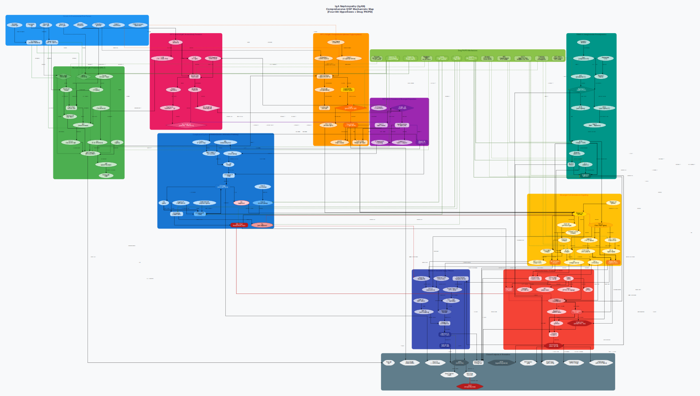
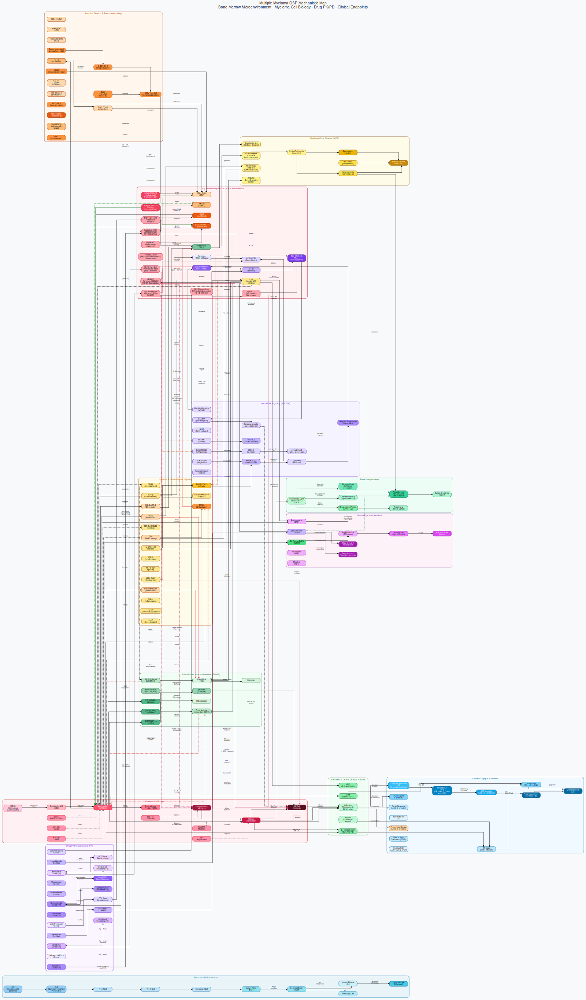
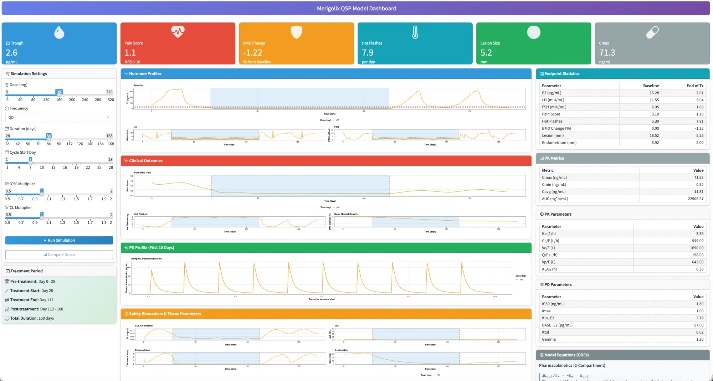
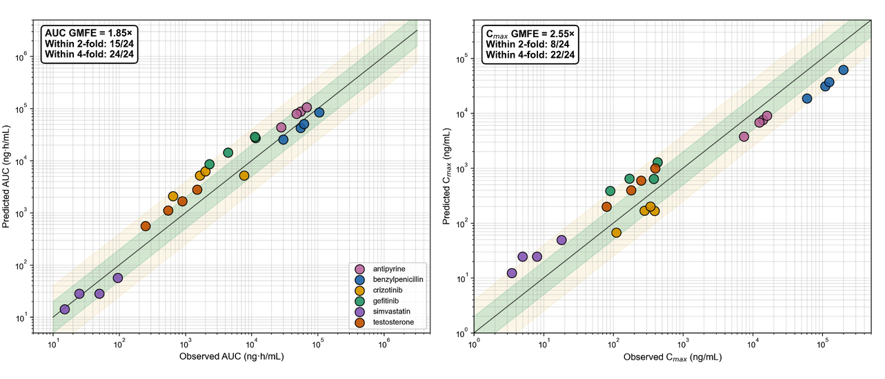

## Roadmap {.smaller}

[KBCS 2026 · Medical Unmet Needs for BioChips]{.kicker}

- **The unmet need** — why preclinical systems keep failing translation
- **Clinical pharmacology** — QSP & PBPK as the bridge from chip signal to human prediction
- **Our engine** — an LLM-augmented, open QSP model library (258 diseases and counting)
- **Case studies** — many drug–disease examples the library already covers, incl. a live app (Merigolix)
- **Our organ-chip work** — Gut–Liver–Kidney MPS + PBPK, condensed
- **Where this goes** — a browser-based PBPK/QSP platform

## The unmet need: why preclinical systems fail translation {.smaller}

```{=html}
<div class="stat-grid">
  <div class="stat-card"><div class="n">~90%</div><div class="l">clinical-phase attrition</div></div>
  <div class="stat-card"><div class="n">10–15 yr</div><div class="l">per approved drug</div></div>
  <div class="stat-card"><div class="n">$1–2.6B</div><div class="l">cost per approved drug</div></div>
</div>
```

- **2D cell cultures** — no tissue architecture, no organ-level function
- **Animal models** — persistent interspecies differences in drug disposition
- Healthy-volunteer **Phase 1** trials characterize exposure well, but leave it poorly characterized in exactly the patients who need it most: [IBD]{.chip} [AKI]{.chip} [Hepatic impairment]{.chip} [Pregnancy]{.chip} [Pediatric]{.chip} [Rare disease]{.chip}

[DiMasi et al., *J Health Econ* 2016; Kola & Landis, *Nat Rev Drug Discov* 2004.]{.fineprint}

## Organs-on-chips + the missing layer {.smaller}

- **MPS / organs-on-chips** reconstitute human tissue architecture under physiologically relevant conditions — genuinely human-relevant, *before* first-in-human studies
- But a raw chip concentration-time curve is a **descriptive** observation, not yet a dosing answer
- **What a chip gives you:** concentration-time profiles · single- or multi-organ readouts · a mechanistically rich human-cell signal
- **What a dosing decision needs:** clearance, tissue distribution, target engagement — for a **whole human body**, not a chip well

[**Clinical pharmacology — NCA, PBPK, QSP — is the bridge** that turns a chip reading into decision-grade, human-predictive evidence. That bridge is what the rest of this talk is about.]{.lead}

## What is QSP & PBPK?

**PBPK** (physiologically based pharmacokinetics) and **QSP** (quantitative systems pharmacology) are systems biology × pharmacokinetics/pharmacodynamics — a mechanistic, mathematical description of the causal chain:

$$\textbf{drug} \;\rightarrow\; \textbf{target} \;\rightarrow\; \textbf{pathway} \;\rightarrow\; \textbf{disease} \;\rightarrow\; \textbf{patient}$$

- **PBPK** answers: where does the drug go, and at what concentration, in a whole human body?
- **QSP** answers the next question: given that concentration, what happens to the disease?
- Together they answer what statistics alone cannot: dose selection, DDI risk, response in special populations, IVIVE of chip-derived parameters

## Anatomy of a PBPK/QSP model

A coupled nonlinear dynamical system — an initial-value problem:

$$\frac{d\mathbf{x}}{dt} = \mathbf{f}\!\big(\mathbf{x}(t),\, \boldsymbol{\theta},\, \mathbf{u}(t)\big), \qquad \mathbf{x}(0)=\mathbf{x}_0$$

- **States $\mathbf{x}$** — drug concentrations, receptor occupancy, signaling species, cell populations, biomarkers, clinical endpoints
- **Parameters $\boldsymbol{\theta}$** — rate constants, $EC_{50}$/$E_{max}$, Hill $n$, clearances, binding affinities
- **Inputs $\mathbf{u}(t)$** — dosing regimen: the controllable handle of therapy

[Our library's models: **15–35+ coupled ODEs**, **70–100+ parameters** per disease.]{.lead}

## The recurring nonlinear structures {.smaller}

The same mathematical motifs recur across essentially every disease and every chip-to-human bridge:

| Motif | Governing idea | Typical use |
|---|---|---|
| Hill / $E_{max}$ | $E(C) = E_{max}C^n / (EC_{50}^n + C^n)$ | any drug dose–response |
| Indirect response (turnover) | $dR/dt = k_{in}f(\cdot) - k_{out}R$ | biomarker synthesis/degradation |
| Mass-action / TMDD | drug–target binding, target-mediated clearance | mAbs, receptor-saturating drugs |
| Logistic growth | $dN/dt = rN(1-N/K) - kill(C)N$ | tumor burden under therapy |
| Power-law feedback | e.g. $EPO \propto (Hb_0/Hb)^{\gamma}$ | homeostatic feedback loops |

[The same grammar underlies both a 250-model QSP library and a chip-to-PBPK bridge.]{.fineprint}

## Why this matters — Model-Informed Drug Development {.smaller}

| Stage | What PBPK/QSP contributes | Effect on attrition |
|---|---|---|
| Target validation | does target modulation reach the phenotype? | kills implausible targets early |
| First-in-human dose | exposure–response & safety margins from mechanism | safer, leaner Phase 1 |
| Trial design | virtual patients → enrichment, endpoints, sample size | higher trial success |
| Translation | chip→animal→human, adult→pediatric extrapolation | better external validity |
| Combinations | synergy/antagonism *in silico* | rational polypharmacy |

[Regulators (FDA/EMA) actively endorse MIDD — this is an established regulatory pathway, not a novelty.]{.lead}

## Regulatory tailwind for organs-on-chips

- **FDA Modernization Act 2.0** explicitly opens the door to New Approach Methodologies (NAMs) — including MPS — in place of some animal studies
- **MIDD** already expects PBPK/QSP-grade quantitative packages; integrating MPS data into an MIDD-style workflow is the credible route to regulatory acceptance
- Positioning organs-on-chips inside an established clinical-pharmacology workflow reframes microphysiological data as a **translational bridge**: less animal testing, faster candidate selection, more reliable human prediction

## The bottleneck: building one QSP model, traditionally

- Deep literature synthesis across pathophysiology + pharmacology
- Careful ODE formulation, parameterization, software implementation, calibration
- **Cost: expert-months to years per disease**

**Consequences:**

- only a handful of diseases ever get a model
- models are siloed, rarely open, rarely reproducible
- the long tail of diseases — and most chip programs' target diseases — never get one

[One disease ≈ one (or more) expert-years. Scarce · slow · closed.]{.lead}

## Thesis — LLM-augmented model generation

> Use an **autonomous LLM coding agent** to build complete, quality-gated, fully-referenced QSP models — *at the pace of one disease per day* — with every artifact under version control.

- 🗺️ Graphviz **mechanistic map** · ⚙️ `mrgsolve` **ODE model** · 📊 **Shiny** dashboard · 📚 curated **references**
- enforced **quality gates**, **literature grounding** for every parameter
- standardized schema → comparable & auditable; **reproducible**: code + git history

## The Claude Code Routine — an autonomous daily loop

A scheduled coding agent. **Each run completes one disease end-to-end and pushes it:**

1. **Select** an uncovered disease (rotate categories)
2. **Research** — synthesize ~50 PubMed sources
3. **Map** — Graphviz network (≥100 nodes)
4. **Model** — `mrgsolve` ODEs (≥15 compartments)
5. **Dashboard** — Shiny (≥6 tabs)
6. **Ground** — sectioned references (≥30)
7. **Commit & push** — automatically, under a git stop-hook that won't let a session end half-done

## Guardrails — why trust code an LLM wrote

- **Quality gates (hard minimums):** map ≥100 nodes/≥8 clusters · ODE model ≥15 compartments/≥5 scenarios · dashboard ≥6 tabs · ≥30 references
- **Structural templates:** reusable ODE motifs (Hill, turnover, TMDD) shrink the space of "things that can go wrong"
- **Literature grounding:** every parameter set carries a calibration memo citing trials — the principal anti-hallucination mechanism
- **Reproducibility & review:** everything is diffable, auditable, re-runnable code in git; human-in-the-loop review before use

## Why an LLM/AI is the right engine

- **Tireless & continuous** — a complete, multi-artifact disease model **nearly every day**, a cadence no human team sustains
- **Vast literature synthesis** — ~12,800 citations integrated (~50/model)
- **Breadth** — 258 diseases and hundreds of drugs/targets in one consistent framework
- **Consistency** — identical schema and quality bar → comparable, reusable
- **Economics** — expert-months → hours

[The scarce resource is modeling expertise. The LLM *scales* it.]{.lead}

## What's inside each model

- 🗺️ **Mechanistic map** — clustered directed graph: species/states as vertices, mechanistic interactions as edges
- ⚙️ **`mrgsolve` ODE model** — compiled C++ solver; drug PK coupled to disease PD; 15–35+ states, ≥5 scenarios
- 📊 **Shiny dashboard** — patient profile, PK, pathophysiology, endpoints, scenario comparison, biomarkers (6–8 tabs)
- 📚 **~50 curated references** per model, anchoring every parameter

[This is the exact structure a chip-to-human bridge needs to plug into: PK states, PD states, a disease trajectory.]{.lead}

## Scale: a 258-model open QSP library

```{=html}
<div class="stat-grid">
  <div class="stat-card"><div class="n">258</div><div class="l">disease QSP models</div></div>
  <div class="stat-card"><div class="n">~18</div><div class="l">therapeutic areas</div></div>
  <div class="stat-card"><div class="n">259</div><div class="l">mrgsolve ODE systems</div></div>
  <div class="stat-card"><div class="n">~3,100</div><div class="l">pathway clusters</div></div>
  <div class="stat-card"><div class="n">~12,800</div><div class="l">PubMed references</div></div>
  <div class="stat-card"><div class="n">+1 / day</div><div class="l">and still growing</div></div>
</div>
```

[Traditional QSP: a handful of diseases, expert-months each. This library: 258 diseases, hours each — a step change, not an increment.]{.lead}

## Breadth of coverage

[Oncology]{.chip} [Autoimmune/rheumatic]{.chip} [Vasculitis]{.chip} [Cardiovascular]{.chip} [Respiratory]{.chip} [Renal/urologic]{.chip} [GI/hepatobiliary]{.chip} [Endocrine/metabolic]{.chip} [Neurologic]{.chip} [Psychiatric]{.chip} [Dermatologic]{.chip} [Infectious]{.chip} [Ophthalmic]{.chip} [Rare/genetic]{.chip}

- **Cancers** — breast, NSCLC, SCLC, glioblastoma, CML, multiple myeloma, melanoma, pancreatic…
- **Rare & genetic** — Fabry, Gaucher, DMD, SMA, Huntington, transthyretin amyloidosis…
- **Common chronic** — diabetes, heart failure, COPD, CKD…
- **Immune / hematologic** — lupus, RA, sickle cell, ITP, myelofibrosis…

[Hundreds of distinct drugs and molecular targets — very likely including one relevant to your chip.]{.lead}

## Case studies: drugs · targets · modeled endpoints {.smaller}

A single framework already spans dozens of drug classes and mechanisms of action:

| Disease | Drug (example) | Target / mechanism | Modeled endpoint |
|---|---|---|---|
| Rheumatoid arthritis | tocilizumab | IL-6 receptor | DAS28 · CRP |
| Psoriasis | secukinumab | IL-17A | PASI |
| Type 2 diabetes | semaglutide | GLP-1 receptor | HbA1c · weight |
| Heart failure (rEF) | sacubitril/valsartan | neprilysin + AT₁ (ARNI) | LVEF · NT-proBNP |
| COPD | triple therapy (ICS/LABA/LAMA) | β2/M3/glucocorticoid receptors | FEV1 · exacerbation rate |
| Non-small-cell lung cancer | osimertinib | mutant EGFR | tumor burden |
| Chronic myeloid leukemia | imatinib | BCR-ABL | BCR-ABL transcript ratio |
| Pulmonary arterial HTN | macitentan | endothelin A/B receptor | PVR · 6-min walk |
| IgA nephropathy | sparsentan | endothelin-A + AT₁ | UPCR · eGFR |
| Sickle cell disease | voxelotor | HbS–O₂ affinity | Hb · hemolysis |
| Multiple myeloma | daratumumab | CD38 (TMDD) | M-protein |
| Endometriosis | Merigolix (GnRH antagonist) | GnRH receptor | pain · lesion size |

[Every drug–target–endpoint link is grounded in the trial literature.]{.fineprint}

## Case studies — one modeling insight each (1/2)

:::: {.columns}
::: {.column width="33%"}
**NSCLC — EGFR resistance**

Osimertinib vs. **T790M/C797S** escape clones: timing of resistant-clone outgrowth → rationale for combination or sequencing.
:::
::: {.column width="33%"}
**HFrEF — GDMT sequencing**

ARNI · β-blocker · MRA · SGLT2i: order and up-titration speed vs. reverse remodeling (LVEF, NT-proBNP).
:::
::: {.column width="33%"}
**ATTR amyloidosis — gene silencing**

TTR knockdown (patisiran/vutrisiran) → tetramer–monomer kinetics → neuropathy/cardiac burden over years.
:::
::::

## Case studies — one modeling insight each (2/2)

:::: {.columns}
::: {.column width="33%"}
**SLE — type-I interferon**

Anifrolumab (anti-IFNAR) damps the IFN signature; IFN → autoantibody → flare risk (SLEDAI).
:::
::: {.column width="33%"}
**T2DM — incretin axis**

GLP-1/GIP (tirzepatide): glucose–insulin–weight feedback loop → HbA1c and weight trajectories.
:::
::: {.column width="33%"}
**ITP — platelet kinetics**

TPO-receptor agonists vs. anti-platelet antibody: production-vs-destruction balance → platelet recovery.
:::
::::

## Deep dive — IgA nephropathy: the "four-hit" cascade

:::: {.columns}
::: {.column width="40%"}
{width="100%"}
:::
::: {.column width="60%"}
- Galactose-deficient IgA1 → anti-glycan autoantibodies → immune complexes → mesangial deposition + complement activation → proteinuria, falling eGFR
- **Drugs modeled:** RAAS blockade · budesonide-TRF (gut B cells/APRIL) · sparsentan (dual ETA+AT₁) · iptacopan (complement factor B) · sibeprenlimab (anti-APRIL)
- **Endpoints:** UPCR, eGFR slope — calibrated to NefIgArd, PROTECT, APPLAUSE-IgAN
- 20 ODEs · 7 scenarios
:::
::::

## Deep dive — sickle cell disease: polymerization to vaso-occlusion

:::: {.columns}
::: {.column width="40%"}
{width="100%"}
:::
::: {.column width="60%"}
- Deoxygenated HbS polymerizes → sickling & hemolysis → free Hb scavenges NO → endothelial activation, P-selectin adhesion → vaso-occlusive crises
- **Drugs modeled:** hydroxyurea (HbF induction) · voxelotor (HbS–O₂ affinity) · crizanlizumab (anti-P-selectin) · L-glutamine
- **Endpoints:** Hb, HbF%, vaso-occlusion rate, LDH — calibrated to MSH, HOPE, SUSTAIN
- 24 ODEs; power-law erythropoiesis feedback
:::
::::

## Deep dive — multiple myeloma: an oncology exemplar

:::: {.columns}
::: {.column width="40%"}
{width="100%"}
:::
::: {.column width="60%"}
- Marrow plasma-cell clones secrete M-protein; IL-6 autocrine growth; RANKL/OPG/DKK1 imbalance → bone disease
- **Drugs modeled:** bortezomib/carfilzomib (proteasome) · lenalidomide (cereblon) · daratumumab (anti-CD38, **TMDD**) · venetoclax (BCL-2) · zoledronate (bone)
- **Endpoints:** M-protein, free light chains — regimens VRd/DRd/KRd/DVRd
- Logistic growth + resistant clone + TMDD, coupled to bone-remodeling ODEs
:::
::::

## Flagship case — Merigolix, a live drug–disease model

:::: {.columns}
::: {.column width="55%"}
{width="100%"}
:::
::: {.column width="45%"}
**Merigolix** — an oral GnRH-receptor antagonist for **endometriosis**: lowers LH/FSH → suppresses estradiol → regresses estrogen-dependent lesions and pain.

- 2-compartment PK + HPG-axis PD (E2/LH/FSH turnover, Hill inhibition)
- Endpoints: pain (NRS), lesion size, hot flashes, BMD, endometrium — one ODE system, drug → hormone → lesion → symptom

[**Try it live:** [pipetqsp.shinyapps.io/merigolix](https://pipetqsp.shinyapps.io/merigolix/)]{.lead}
:::
::::

## Merigolix — the estrogen "threshold" trade-off {.smaller}

:::: {.columns}
::: {.column width="50%"}
**The therapeutic window**

- too little E2 suppression → no symptom relief
- too much → hot flashes and bone loss
- target a *partial* E2 band (~20–40 pg/mL)
:::
::: {.column width="50%"}
**This simulation run**

- E2 trough 2.6 pg/mL; pain 3.1 → 1.1; lesion 18.5 → 5.3 mm
- but BMD −1.22% and hot flashes 5.4 → 7.9/day
- → motivates dose titration + hormonal add-back
:::
::::

[QSP turns a clinical efficacy/safety trade-off into a tunable, quantitative optimization problem — exactly the kind of question a chip program eventually has to answer too.]{.lead}

## The gallery — a fraction of the library

{width="86%"}

## How this helps *your* chip program, directly

- Working on a **cytokine**, **transporter**, **receptor**, or **disease** your chip models? There is very likely already a QSP model of it in this library
- Use it to **generate a research hypothesis** before running the chip experiment
- Use it as a **PD/disease layer** to attach on top of your own chip→PBPK bridge — exactly as in our own case study later in this talk

[No one expects you to run all 258 models. The goal is a platform that dramatically accelerates the translation of the molecules, drugs, cytokines, and diseases *you* already work on.]{.lead}

## Fully open — every line of code

- **github.com/pipetcpt/qsp** — every mechanistic map, ODE model, Shiny dashboard, and reference list, openly versioned, one commit at a time
- Clone it, run a model, adapt it to your chip's biology, or simply browse for ideas
- QR code in the top-right corner of every slide in this talk links directly to the repository

## Where this goes: a browser-based PBPK/QSP platform

Complex ODE systems are a real barrier to adoption. The goal: a **web platform** where any researcher can, from a browser alone —

- **search** by disease, target, drug, or cytokine
- **browse** the mechanistic map and ODE structure without installing anything
- run a **simple simulation** — a dose, a parameter tweak, an instant plot
- **export** parameters directly into their own PBPK/QSP or chip-bridge workflow

## Prerequisites for trusting a chip-derived number

Before a chip number can be trusted inside a PBPK/QSP model, four things must be checked — this is where most naïve chip-to-human extrapolations break:

1. **Chip-specific drug behavior** — adsorption to plastics/membranes, non-specific binding
2. **Scaling of cellular and fluidic dimensions** — correct per-organ scaling factors
3. **Verification against held-out clinical data** — not just internal consistency
4. **Explicit, falsifiable correction rules** — not ad hoc curve-fitting

[The case study that follows was built exactly to test whether this discipline is achievable in practice.]{.lead}

## Our case study: Gut–Liver–Kidney MPS + PBPK

```{=html}
<div class="stat-grid">
  <div class="stat-card"><div class="n">6</div><div class="l">drugs</div></div>
  <div class="stat-card"><div class="n">24</div><div class="l">clinical observations</div></div>
  <div class="stat-card"><div class="n">1.85×</div><div class="l">AUC GMFE (overall)</div></div>
  <div class="stat-card"><div class="n">100%</div><div class="l">within 4-fold</div></div>
  <div class="stat-card"><div class="n">0</div><div class="l">clinical PK used to fit</div></div>
  <div class="stat-card"><div class="n">2</div><div class="l">disease-state chip arms</div></div>
</div>
```

- Modular gut–liver–kidney MPS (hiEC–HepaRG–RPTEC), shared media recirculation
- Chip-fitted kinetic parameters propagate to a whole-body PBPK — **no human PK data enters the prediction**
- All 24 clinical observations reserved for **post-hoc** validation only

## The model predicts human PK well

{width="92%"}

## How it works, in brief {.smaller}

- **Chip → kinetics:** a 33-state ODE system fits chip concentration-time data (parent + metabolite), closing the recirculating loop; $K_{puu,hep}$ captures OATP-style hepatic uptake
- **Whole-body PBPK:** 10-state perfusion-limited (+ optional permeability-limited liver); Rodgers–Rowland $K_p$; Varma extended clearance; ACAT oral absorption
- **The scaling rule:** apply a relative-activity factor (RAF) to bridge *in vitro* → *in vivo* metabolism **only if** CYP3A4 contributes ≥90%, biliary clearance <50%, and hepatic uptake isn't already captured — a falsifiable, mechanism-based test, not curve-fitting
  - uniform correction → GMFE 9.7×; **selective, rule-based correction → GMFE 1.85×**
- **Inputs:** physchem only (logP, $pK_a$, $f_{u,p}$, blood:plasma, MW, dose) — no clinical PK used to fit
- **Disease-state extension:** chips re-fitted under DSS colitis / cisplatin injury; unaffected-organ parameters locked; same PBPK pipeline, no re-parameterization

## Validation results — 24 observations, 6 drugs {.smaller}

| Drug | Mechanism | AUC GMFE | 2-fold | 4-fold |
|---|---|---|---|---|
| Antipyrine | CYP1A2, low E | 1.59× | 4/4 | 4/4 |
| Benzylpenicillin | OAT1/3 renal | 1.23× | 4/4 | 4/4 |
| Testosterone | CYP3A4 high-E + SHBG | 1.98× | 2/4 | 4/4 |
| Crizotinib | CYP3A4 high-E + biliary | 2.61× | 1/4 | 4/4 |
| Gefitinib | CYP3A4 + biliary-dominant | 2.93× | 0/4 | 4/4 |
| Simvastatin | OATP1B1 + CYP3A4 | 1.37× | 4/4 | 4/4 |
| **Overall (n=24)** | | **1.85×** | **15/24** | **24/24** |

[Falls within the 2–5× GMFE benchmark of industry-standard PBPK platforms.]{.fineprint}

## Disease-state extension, limitations, and what this means {.smaller}

- **Gefitinib under DSS colitis chip:** AUC ratio 0.49× — gut-localized (Fg driven, Fa/Fh unchanged)
- **Simvastatin under cisplatin-injury chip:** AUC ratio 2.19× — hepatic-localized (Kpuu,liver halved, consistent with OATP1B1 suppression)
- Same PBPK pipeline distinguishes gut- vs. hepatic-localized shifts — hypothesis-generating for IBD/AKI-comorbid patients normally excluded from Phase 1
- **Known limitations:** no mucus/peristalsis layer (chip Papp); HepaRG 2D CYP3A4 ~10% of *in vivo* (RAF-corrected); RPTEC OAT1/3 ~1% of *in vivo* (PTC-anchor corrected); sparse clinical PK in disease-state patients (roadmap: prospective IBD/AKI cohorts)
- **Open-source Python**; full 6-drug/24-observation run reproducible in **&lt;5 minutes** on a laptop

[This work augments, not replaces, animal/clinical PK.]{.fineprint}

## Conclusion & an open invitation {.smaller}

:::: {.columns}
::: {.column width="60%"}
- Organs-on-chips generate genuinely human-relevant biology — clinical pharmacology (NCA, PBPK, QSP) is what turns it into decision-grade, human-predictive evidence
- Our Gut–Liver–Kidney case study shows this is achievable **without clinical PK input**, and extends to disease-state chips
- Our **258-model open QSP library** exists so the NAMs/MPS community can adopt this discipline immediately, not build it from scratch
:::
::: {.column width="40%"}
[This project is completely open. If you are building an organ-on-chip and want a PBPK/QSP bridge — or a disease model to build toward — **I would love to collaborate.**]{.lead}

**Sungpil Han, MD, PhD**
shan@catholic.ac.kr
:::
::::

## Selected references {.smaller}

::: {style="columns:2; column-gap:2em; font-size:0.6em; line-height:1.45;"}
DiMasi JA et al. *J Health Econ* 47, 20–33 (2016).

Kola I & Landis J. *Nat Rev Drug Discov* 3, 711–715 (2004).

Huh D et al. *Science* 328, 1662–1668 (2010).

Bhatia SN & Ingber DE. *Nat Biotechnol* 32, 760–772 (2014).

Low LA et al. *Nat Rev Drug Discov* 20, 345–361 (2021).

Tsamandouras N et al. *AAPS J* 19, 1499–1512 (2017).

Edington CD et al. *Sci Rep* 8, 4530 (2018).

Kuepfer L et al. *CPT Pharmacometrics Syst Pharmacol* 5, 516–531 (2016).

Varma MV et al. *Pharm Res* 32, 3785–3802 (2015).

Guillouzo A et al. *Chem Biol Interact* 168, 66–73 (2007).

Mathialagan S et al. *Drug Metab Dispos* 45, 409–417 (2017).

Rodgers T & Rowland M. *J Pharm Sci* 95, 1238–1257 (2006).

Yang J et al. *Curr Drug Metab* 8, 676–684 (2007).
:::

## Contact

:::: {.columns}
::: {.column width="60%"}
**Sungpil Han, M.D./Ph.D.** — Associate Professor

Dept. of Pharmacology, College of Medicine, The Catholic University of Korea<br>
Dept. of Clinical Pharmacology & Therapeutics, The Catholic University of Korea, Seoul St. Mary's Hospital<br>
PIPET (Pharmacometrics Institute for Practical Education & Training)

222 Banpodaero, Seocho-gu, Seoul, Korea (06591)

Email: **shan@catholic.ac.kr**<br>
Phone: +82-2-3147-8356 · Mobile: +82-10-6782-0522 · FAX: +82-2-2258-7876
:::
::: {.column width="40%"}
{width="55%"}

[github.com/pipetcpt/qsp]{.fineprint}

**Thank you — questions and collaborators welcome.**
:::
::::
