## Roadmap {.smaller}

[KSMB 2026 · Special Session B1]{.kicker}

> **Thesis.** Quantitative Systems Pharmacology (QSP) turns drug action into *large systems of nonlinear ODEs*. Building them is slow and rare. We let an autonomous LLM agent build them — ** disease models and counting.**

1. **The problem** — why drug development fails, and why statistics aren't enough
2. **QSP and its mathematics** — $dx/dt = f(x,\,\theta,\,u)$
3. **The engine** — the Claude Code Routine, an autonomous model-builder
4. **Why an LLM** — tireless, broad, consistent
5. **Scale & breadth** — a living library across ~ therapeutic areas
6. **Deep dives** — IgA nephropathy · sickle cell · multiple myeloma
7. **Open mathematical problems** — where *this room* comes in

## Drug development is staggeringly expensive — and mostly fails

:::: {.columns}
::: {.column width="60%"}
- **~\$1–2.6 billion** and **10–15 years** per approved drug
- **~90%** of candidates entering clinical trials never reach patients
- Failures cluster at two points:
  - **Early** — the target was never mechanistically validated
  - **Late** — unexpected efficacy / safety surprises in pivotal trials

[We need models that **explain and extrapolate**, not just fit.]{.lead}
:::
::: {.column width="40%"}
[~90%]{.bignum}<br>
[clinical-phase attrition]{.muted}

<br>

[~\$2.6B]{.bignum}<br>
[cost per approved drug]{.muted}
:::
::::

[DiMasi et al., *J Health Econ* 2016; Wong et al., *Biostatistics* 2019.]{.muted style="font-size:.6em"}

## The mechanistic gap

:::: {.columns}
::: {.column width="50%"}
**Statistical / empirical models**

- interpolate *within* observed data
- "what" happened — fit to endpoints
- struggle to extrapolate to new doses, populations, combinations
:::
::: {.column width="50%"}
**Mechanistic (QSP) models**

- encode *causal* biology: target → pathway → disease
- "why and how" — simulate the unobserved
- extrapolate across dose · species · subpopulation · regimen
:::
::::

> To predict a drug that does not yet exist, you must model the **mechanism** it will act on.

## What is Quantitative Systems Pharmacology?

QSP = **systems biology × pharmacokinetics/pharmacodynamics** — a mechanistic, mathematical description of the causal chain

$$\textbf{drug} \;\rightarrow\; \textbf{target} \;\rightarrow\; \textbf{pathway} \;\rightarrow\; \textbf{disease} \;\rightarrow\; \textbf{patient}$$

It answers questions statistics cannot:

- If we modulate *this* target, how far downstream does the effect propagate?
- Which **patient subtypes** respond — and why?
- What dose, schedule, or **combination** optimizes the efficacy–safety balance?

## The anatomy of a QSP model

A QSP model is an initial-value problem — a coupled nonlinear dynamical system:

$$\frac{d\mathbf{x}}{dt} = \mathbf{f}\!\big(\mathbf{x}(t),\, \boldsymbol{\theta},\, \mathbf{u}(t)\big), \qquad \mathbf{x}(0)=\mathbf{x}_0$$

:::: {.columns}
::: {.column width="33%"}
**States $\mathbf{x}$**

drug concentrations · receptor occupancy · signaling species · cell populations · biomarkers · endpoints
:::
::: {.column width="33%"}
**Parameters $\boldsymbol{\theta}$**

rate constants · $EC_{50}$, $E_{max}$, Hill $n$ · clearances · binding affinities
:::
::: {.column width="33%"}
**Inputs $\mathbf{u}(t)$**

dosing regimens (amount, route, schedule) — the controllable handles of therapy
:::
::::

[Our library: **15–35+ coupled ODEs** and **70–100+ parameters** per disease.]{.lead}

## The recurring nonlinear structures {.smaller}

The same mathematical motifs appear across every disease — a shared grammar:

:::: {.columns}
::: {.column width="52%"}
**Hill / $E_{max}$ pharmacodynamics**
$$E(C)=\frac{E_{max}\,C^{\,n}}{EC_{50}^{\,n}+C^{\,n}}$$

**Indirect-response (turnover)**
$$\frac{dR}{dt}=k_{in}\,f(\cdot)-k_{out}\,R$$

**Logistic / carrying-capacity growth**
$$\frac{dN}{dt}=rN\!\left(1-\frac{N}{K}\right)-\mathrm{kill}(C)\,N$$
:::
::: {.column width="48%"}
**Mass-action coupling** (immune-complex formation)
$$\frac{d[IC]}{dt}=k_f\,[A][B]-k_c\,[IC]$$

**Target-mediated drug disposition (TMDD)**
$$\frac{d[D]}{dt}=-k_{on}[D][T]+k_{off}[DT]-\cdots$$

**Power-law feedback** & **threshold switching**
$$\mathrm{EPO}\propto\!\Big(\tfrac{Hb_0}{Hb}\Big)^{\!\gamma};\quad \dot E_{es}=\pm\,g(\cdot)$$
:::
::::

[Plus Bliss-independence combinations, transit compartments, and stiff multi-timescale coupling.]{.muted style="font-size:.62em"}

## Why QSP matters — Model-Informed Drug Development {.smaller}

| Stage | What QSP contributes | Effect on attrition |
|---|---|---|
| Target validation | does target modulation reach the phenotype? bypass / resistance | kills implausible targets early |
| Mechanism of action | quantifies the causal structure; biomarker strategy | stronger evidence packages |
| First-in-human dose | exposure–response & safety margins from mechanism | safer, leaner Phase 1 |
| Trial design | virtual patients → enrichment, endpoints, sample size | higher trial success |
| Translation | animal→human, adult→pediatric extrapolation | better external validity |
| Combinations | synergy / antagonism *in silico* | rational polypharmacy |

[Regulators (FDA / EMA) actively endorse MIDD. QSP lets programs **fail fast, succeed strategically.**]{.lead}

## The bottleneck

:::: {.columns}
::: {.column width="58%"}
A single QSP model traditionally costs **expert-months to years**:

- deep literature synthesis across pathophysiology + pharmacology
- careful ODE formulation and parameterization
- software implementation, calibration, visualization

**Consequences**

- only a handful of diseases ever get one
- models are siloed, rarely open, rarely reproducible
- the long tail of diseases is left unmodeled
:::
::: {.column width="42%"}
> **One disease ≈ one (or more) expert-years.**
>
> Scarce · slow · closed.
:::
::::

## Thesis — LLM-augmented model generation

> Use an **autonomous LLM coding agent** to build complete, quality-gated, fully-referenced QSP models — *at the pace of one disease per day* — with every artifact under version control.

:::: {.columns}
::: {.column width="50%"}
**Each model ships four artifacts**

- 🗺️ Graphviz **mechanistic map**
- ⚙️ `mrgsolve` **ODE model**
- 📊 **Shiny** dashboard
- 📚 curated **references**
:::
::: {.column width="50%"}
**Built-in principles**

- enforced **quality gates**
- **literature grounding** for every parameter
- standardized schema → comparable & auditable
- **reproducible**: code + git history
:::
::::

## Architecture

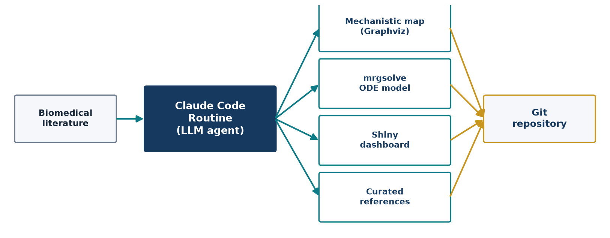{width="92%"}

## The Claude Code Routine — an autonomous daily loop ★

:::: {.columns}
::: {.column width="40%"}
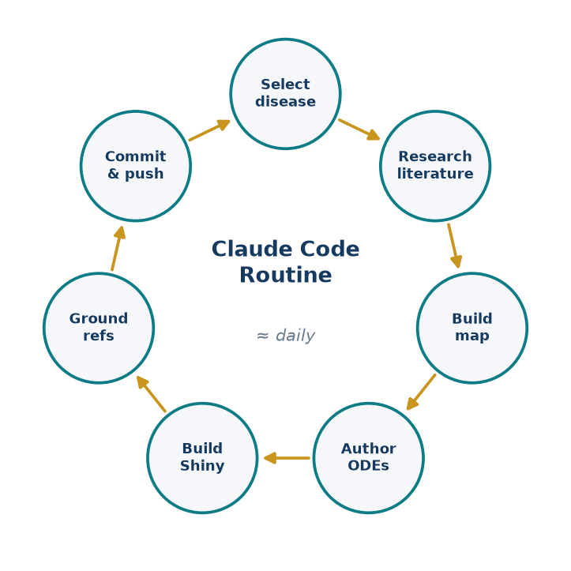{width="100%"}
:::
::: {.column width="60%"}
A scheduled coding agent. **Each run completes one disease end-to-end and pushes it.**

1. **Select** an uncovered disease (rotate categories)
2. **Research** — synthesize ~50 PubMed sources
3. **Map** — Graphviz network (≥100 nodes)
4. **Model** — `mrgsolve` ODEs (≥15 compartments)
5. **Dashboard** — Shiny (≥6 tabs)
6. **Ground** — sectioned references (≥30)
7. **Commit & push** — automatically

[A git **stop-hook** refuses to end a session until everything is committed & pushed — *the work is never left half-done.*]{.lead}
:::
::::

## Inside one session — the guardrails ★ {.smaller}

How do we trust code an LLM wrote? **Structure + grounding + verification.**

:::: {.columns}
::: {.column width="50%"}
**Quality gates (hard minimums)**

- mechanistic map: **≥100 nodes**, **≥8 clusters**
- ODE model: **≥15 compartments**, **≥5 scenarios**
- dashboard: **≥6 tabs**
- references: **≥30 PubMed-indexed**

**Structural templates**

- reusable ODE motifs (Hill, turnover, TMDD) shrink the space of "things that can go wrong"
:::
::: {.column width="50%"}
**Literature grounding**

- every parameter set carries a calibration memo citing trials → the principal **anti-hallucination** mechanism

**Reproducibility & review**

- everything is code in **git**: diffable, auditable, re-runnable
- **human-in-the-loop** scientific review before use
:::
::::

## Why an LLM/AI is the right engine ★ {.smaller}

:::: {.columns}
::: {.column width="50%"}
- **Tireless & continuous** — runs 24/7, no fatigue; a complete, multi-artifact disease model **nearly every day** — a cadence no human team sustains
- **Vast literature synthesis** — integrates **~ citations** (~/model), reading & organizing evidence far faster than manual review
- **Breadth across diseases & drugs** —  diseases and **hundreds of drugs/targets** in one framework
:::
::: {.column width="50%"}
- **Consistency & standardization** — identical schema and quality bar for every model → comparable, reusable
- **Speed & economics** — expert-months → **hours**
- **Democratization** — brings scarce systems-pharmacology expertise to the **long tail** of diseases that would never get a hand-built model

[The scarce resource is modeling expertise. The LLM *scales* it.]{.lead}
:::
::::

## Deliverable ① — the mechanistic map (graph theory)

:::: {.columns}
::: {.column width="46%"}
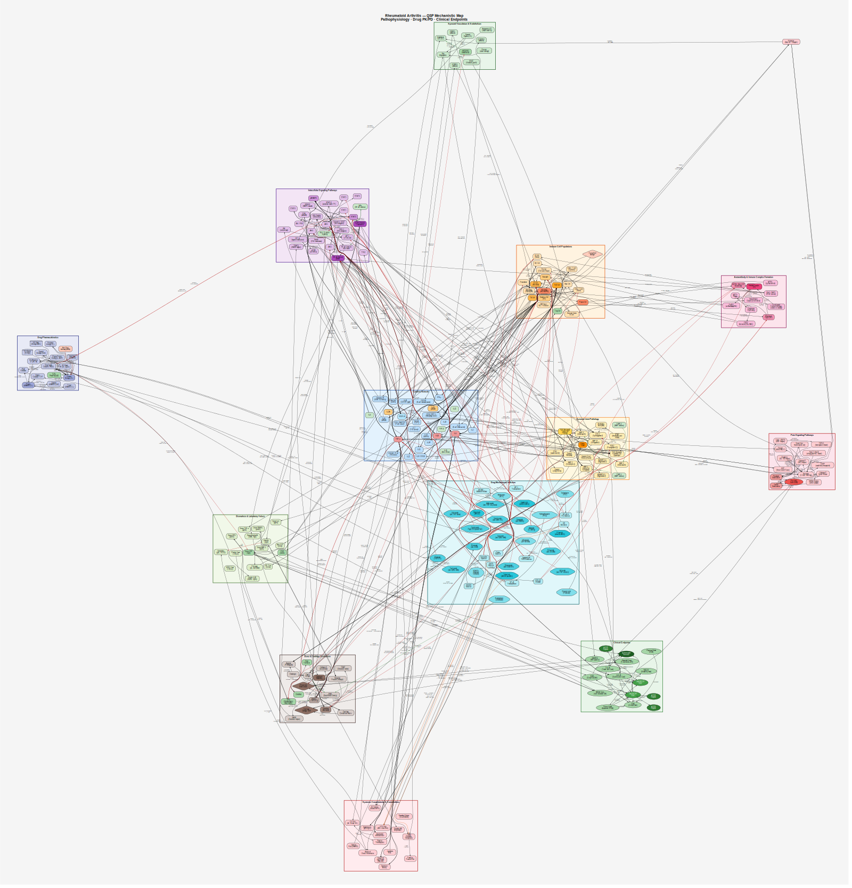{width="100%"}
:::
::: {.column width="54%"}
- **Vertices** = species / states; **edges** = mechanistic interactions (activation, inhibition, mass transfer)
- **Clusters** = pathway modules — a community structure over the graph
- Built with **Graphviz**; rendered to SVG / PNG and version-controlled

[~]{.bignum} **pathway modules per model** — up to  graph elements each.
:::
::::

## Deliverable ② — the `mrgsolve` ODE system

:::: {.columns}
::: {.column width="52%"}
Real excerpt — IgA nephropathy "four-hit" cascade:

```r
// Hit 3: immune-complex formation (mass action)
dxdt_IC_mes = k_form*GdIgA1*AutoAb - k_clear*IC_mes;
// complement amplification (iptacopan blocks)
dxdt_CompAP = k_syn*IC_mes*(1-E_ipt) - k_deg*CompAP;
// Hill drug effect; Bliss-independent combination
E_bud = Emax*pow(C,h)/(pow(EC50,h)+pow(C,h));
E_muc = 1-(1-E_bud)*(1-E_sib);
```
:::
::: {.column width="48%"}
- compiled **C++** solver (stiff systems, event-based dosing)
- couples **drug PK** → **disease PD** → **clinical endpoints**
- **15–35+** state variables per model
- **≥5** therapeutic scenarios each

[Genuine, runnable systems pharmacology — not pseudocode.]{.lead}
:::
::::

## Deliverables ③ + ④ — interaction & evidence

:::: {.columns}
::: {.column width="52%"}
**③ Shiny dashboard** — interrogate the model without code

- patient profile · PK · pathophysiology
- clinical endpoints · scenario comparison · biomarkers (6–8 tabs)

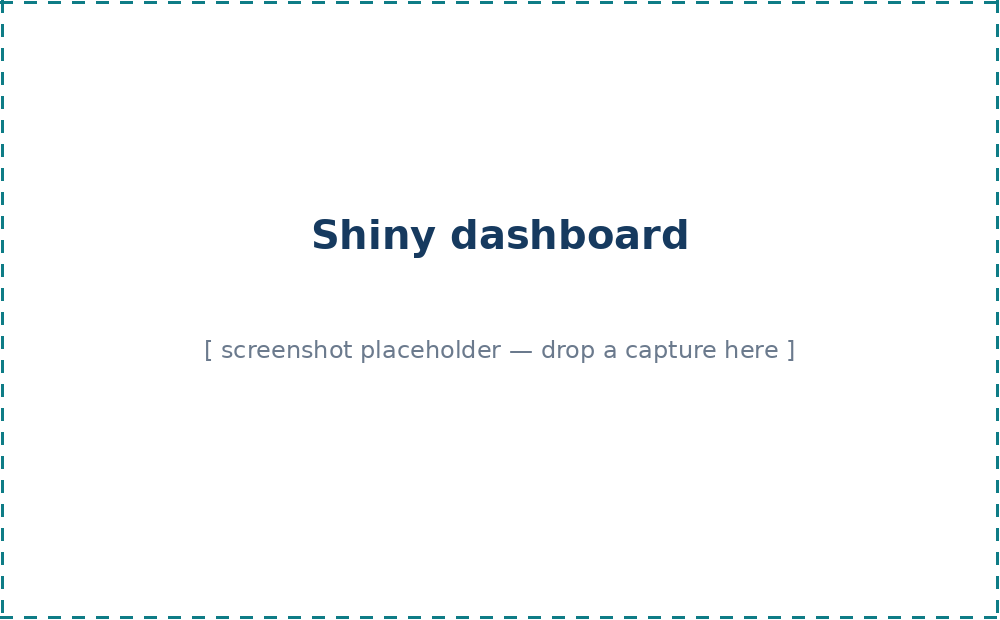{width="100%"}
:::
::: {.column width="48%"}
**④ Reference grounding** — traceable evidence

- **~** PubMed citations per model, sectioned by mechanism
- every parameter & claim anchored to the literature
- **~** references across the library

[Grounding is what separates a model from a guess.]{.lead}
:::
::::

## A living library, growing daily

::: {.content-visible when-format="revealjs"}
```{=html}
<div class="stat-grid">
  <div class="stat-card"><div class="n">191</div><div class="l">disease models</div></div>
  <div class="stat-card"><div class="n">~15</div><div class="l">therapeutic areas</div></div>
  <div class="stat-card"><div class="n">192</div><div class="l">ODE systems</div></div>
  <div class="stat-card"><div class="n">~2,200</div><div class="l">pathway clusters</div></div>
  <div class="stat-card"><div class="n">~9,700</div><div class="l">PubMed references</div></div>
  <div class="stat-card"><div class="n">+1<span style="font-size:.45em"> / day</span></div><div class="l">and still growing</div></div>
</div>
```
:::

::: {.content-visible when-format="beamer"}
| Metric | Value |
|---|---|
| Disease models | **** (≈ +1 / day) |
| Therapeutic areas | ~ |
| `mrgsolve` ODE systems |  |
| Pathway clusters (graph modules) | ~ |
| PubMed references | ~ |
:::

[Each is a complete, runnable, fully-referenced QSP model.]{.lead}

## The gallery wall

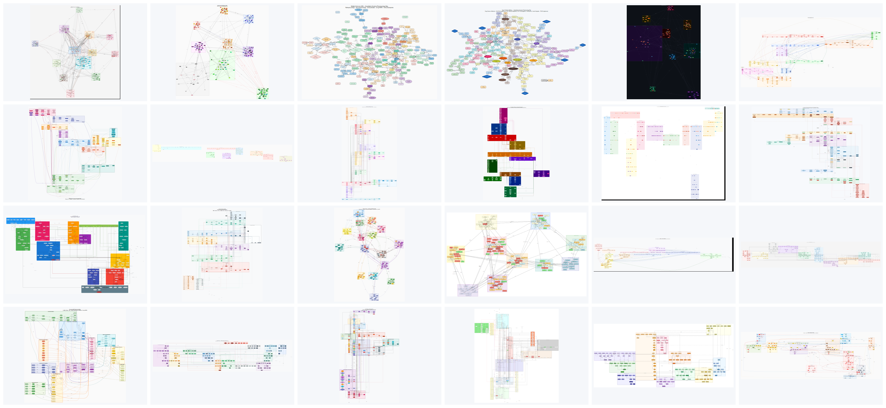{width="86%"}

## Breadth of coverage {.smaller}

One consistent framework, spanning the spectrum of human disease:

[Oncology — solid]{.chip} · [Oncology — heme]{.chip} · [Autoimmune / rheumatic]{.chip} · [Vasculitis]{.chip} · [Cardiovascular]{.chip} · [Respiratory]{.chip} · [Renal / urologic]{.chip} · [GI / hepatobiliary]{.chip} · [Endocrine / metabolic]{.chip} · [Neurologic]{.chip} · [Psychiatric]{.chip} · [Dermatologic]{.chip} · [Infectious]{.chip} · [Ophthalmic]{.chip} · [Rare / genetic]{.chip}

:::: {.columns}
::: {.column width="50%"}
- **Cancers** — breast, NSCLC, SCLC, glioblastoma, CML, multiple myeloma, melanoma, pancreatic…
- **Rare & genetic** — Fabry, Gaucher, DMD, SMA, Huntington, transthyretin amyloidosis…
:::
::: {.column width="50%"}
- **Common chronic** — diabetes, heart failure, COPD, CKD…
- **Immune / hematologic** — lupus, RA, sickle cell, ITP, myelofibrosis…

Hundreds of distinct **drugs and molecular targets**.
:::
::::

## IgA nephropathy — the "four-hit" cascade

:::: {.columns}
::: {.column width="42%"}
{width="100%"}
:::
::: {.column width="58%"}
- **20 ODEs**: Gd-IgA1 → autoantibody → immune complex → complement → mesangial / podocyte injury → UPCR, eGFR
- mass-action coupling + Hill drug effects + **Bliss-independent** combinations
- **7 scenarios**: RAAS, budesonide-TRF, sparsentan, iptacopan, sibeprenlimab, triple therapy
- calibrated to **NefIgArd, PROTECT, APPLAUSE-IgAN**

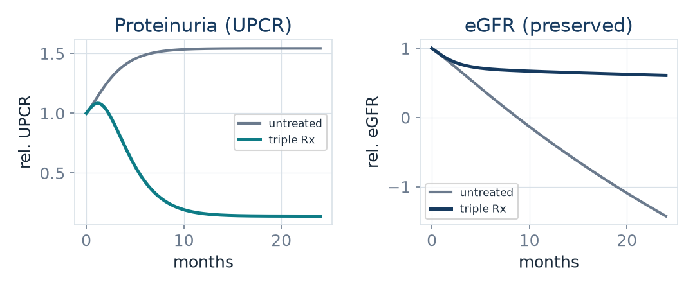{width="100%"}
:::
::::

## Sickle cell disease — polymerization to vaso-occlusion

:::: {.columns}
::: {.column width="42%"}
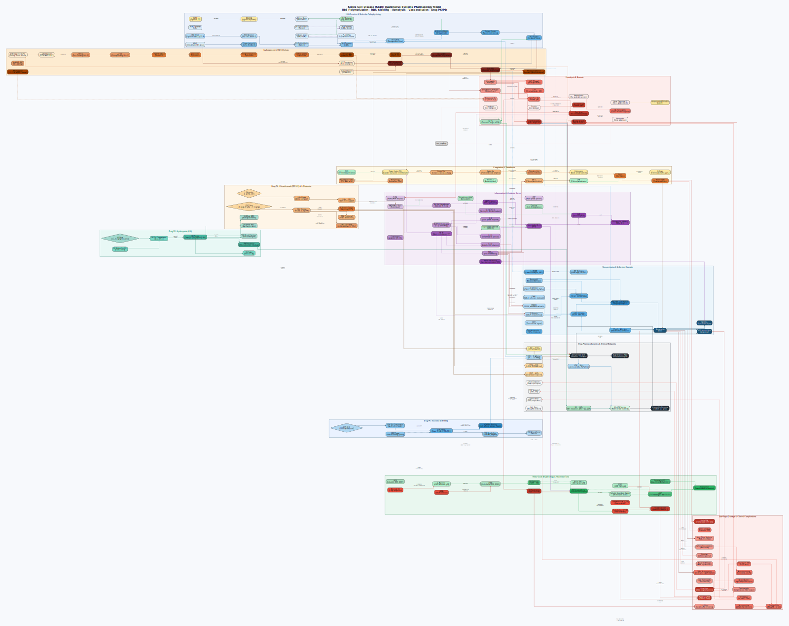{width="100%"}
:::
::: {.column width="58%"}
- **24 ODEs**: HbS polymerization → hemolysis → **NO scavenging** (bimolecular) → P-selectin → vaso-occlusion
- **power-law feedback**: erythropoiesis $\propto (Hb_0/Hb)^{\gamma}$
- drugs: hydroxyurea (HbF induction, Hill $n{=}1.5$), voxelotor, crizanlizumab, L-glutamine
- calibrated to **MSH, HOPE, SUSTAIN**

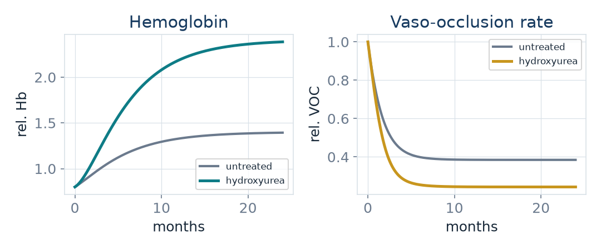{width="100%"}
:::
::::

## Multiple myeloma — an oncology exemplar

:::: {.columns}
::: {.column width="42%"}
{width="100%"}
:::
::: {.column width="58%"}
- **logistic tumor growth** + **resistant-clone emergence** + IL-6 autocrine drive
- **TMDD** for daratumumab–CD38; RANKL / OPG **bone-remodeling** coupling
- regimens: **VRd, DRd, KRd, DVRd** (6 drugs, capped combination kill)

$$\dot N = rN\!\Big(1-\tfrac{N}{K}\Big)(1{+}k_{IL6}\,IL6) - \mathrm{kill}(C)\,N - k_{res}N$$

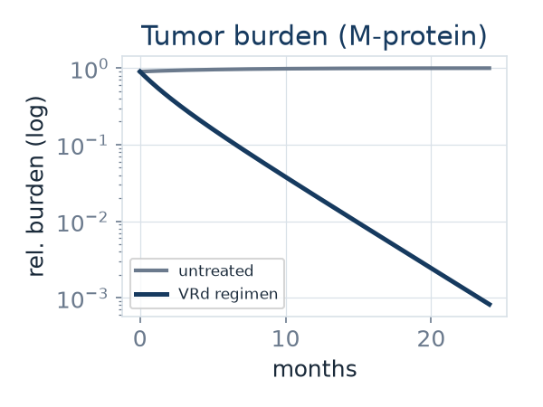{width="100%"}
:::
::::

## The mathematics of the *whole* library

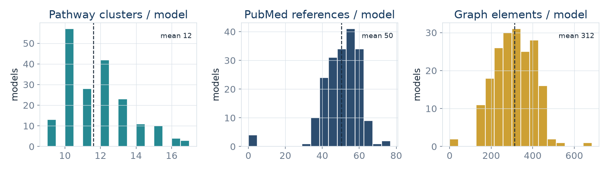{width="92%"}

[A standardized corpus of nonlinear dynamical systems — itself an object worth studying.]{.muted style="font-size:.62em"}

## Open mathematical problems — a collaboration invitation {.smaller}

A corpus of ~ nonlinear ODE systems is a playground for applied mathematics:

:::: {.columns}
::: {.column width="50%"}
- **Identifiability** — structural & practical: which $\boldsymbol{\theta}$ are recoverable from feasible measurements?
- **Sensitivity analysis** — global (Sobol, Morris) ranking of drivers
- **Model reduction** — timescale separation, QSSA, balanced truncation of {15–35}-D systems
:::
::: {.column width="50%"}
- **Uncertainty quantification** — parameter & structural uncertainty → prediction intervals
- **Dynamics** — stability, bifurcations, thresholds (adaptive → maladaptive RV failure in PAH)
- **Inverse problems & virtual populations** — calibrate parameter *distributions* to data
:::
::::

[ models, one schema → methods you develop transfer across all of them.]{.lead}

## Validation & limitations — stated plainly {.smaller}

:::: {.columns}
::: {.column width="50%"}
**What these models are**

- mechanistically structured, literature-grounded
- calibrated to **published trial endpoints**
- excellent for hypothesis generation, teaching, MIDD scaffolding
:::
::: {.column width="50%"}
**What they are *not* (yet)**

- **not** fitted to patient-level data
- **not** for clinical decision-making
- a plausible-looking model can still be wrong → references + human verification are essential; formal validation is future work
:::
::::

> Honesty about scope is part of the method. The LLM drafts; **science validates.**

## Reproducibility & open science

:::: {.columns}
::: {.column width="58%"}
- Every model = **code + map + references**, openly in one git repository
- Each is independently **runnable** (`mrgsolve`) and **explorable** (Shiny)
- Full **history**: who / what / when for every parameter — diffable and auditable
- The library **grows in public**, one verifiable commit at a time
:::
::: {.column width="42%"}
[100%]{.bignum}<br>
[open · versioned · reproducible]{.muted}
:::
::::

## Traditional vs. LLM-augmented QSP

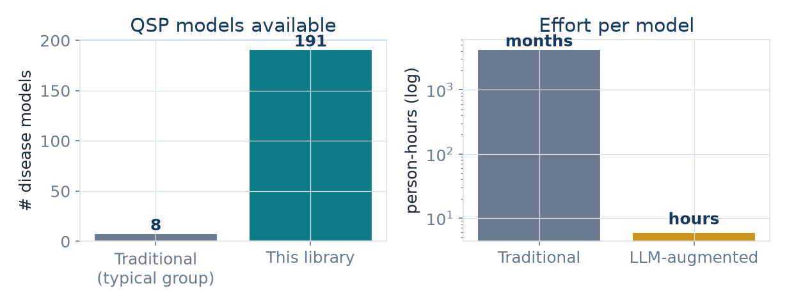{width="80%"}

## Future directions

- **Patient-level calibration** — Bayesian fitting to real PK / PD & EHR data
- **Virtual populations** — sample parameter distributions → trial simulation
- **Automated model reduction** — derive minimal mechanistic cores
- **Coupling** to clinical pharmacometric pipelines and electronic health data
- **Formal verification** of generated ODE structure & units
- **Community contributions** — an open, extensible standard for mechanistic disease models

## Conclusion {.smaller}

:::: {.columns}
::: {.column width="62%"}
- Drug development needs **mechanism**, expressed as **nonlinear ODE systems**
- QSP supplies it — but has been **slow, scarce, and closed**
- An **autonomous LLM agent** changes the economics: **** complete, grounded, reproducible models — **and one more nearly every day**
- The result is a **standardized mathematical corpus** of human disease — open to *your* methods

[Democratizing mechanistic modeling — at the scale only tireless AI makes possible.]{.lead}

**Sungpil Han, MD, PhD** · shan@catholic.ac.kr
:::
::: {.column width="38%"}
{width="100%"}

[With thanks to all co-authors and to PIPET & TiumBio.]{.muted style="font-size:.6em"}

**Thank you.** Questions welcome.
:::
::::
